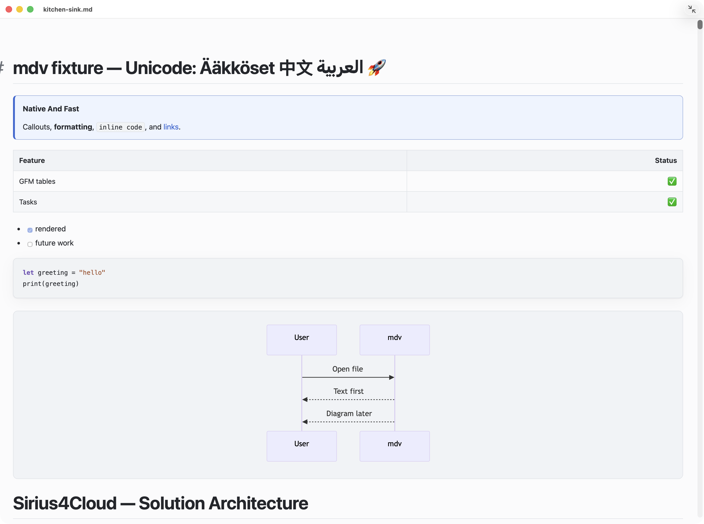

# mdv

`mdv` is a small, native macOS Markdown viewer: AppKit for the interface, WKWebView for high-quality layout, and the reference `cmark-gfm` parser. It is viewer-only and works offline.



## Build and run

Requirements: macOS 13+, Swift 6 / Apple Command Line Tools. Xcode projects and the Xcode GUI are not required.

```sh
make
.build/debug/mdv README.md
make test
make app
open dist/mdv.app --args README.md
```

Use `make release`, `make universal`, and `make install` for an optimized build, arm64+x86_64 app, or installation into `~/Applications`. Universal builds require both target architectures to be supported by the installed Swift toolchain.

```text
mdv [--theme system|light|dark] [--dialect generic|github|obsidian]
    [--no-mermaid] [--full-width] [--snapshot OUTPUT.png]
    FILE|DIRECTORY …
```

Directory mode provides a lightweight file sidebar. Finder Open With, drag and drop, relative images/links, auto-reload, ⌘F, ⌘R, and zoom shortcuts are supported. The toolbar and View → Full Width (`⇧⌘W`) switch between a readable measure and edge-to-edge document/diagram layout; the choice is remembered.

## Markdown

Parsing uses pinned `swift-cmark` 0.8.0 / `cmark-gfm`, with CommonMark semantics, GFM tables, task lists, autolinks and strikethrough, nested lists, and footnotes enabled. A small extension stage recognizes Obsidian wiki links, embeds, and callouts. Unknown fenced languages remain readable code.

Mermaid 11.12.2 is bundled locally in a 772 KB LZFSE resource and decompressed only when an uncached diagram needs it. It is injected after WebKit finishes loading ordinary content, so diagrams render asynchronously to SVG without delaying text. Invalid diagrams show a local inline error. The generic `DiagramRenderer` registry is ready for a future PlantUML backend.

## Performance and size

Debug builds print phase timings for application initialization, file reading, parsing, HTML loading, window display, first WebKit content, and Mermaid completion. Release builds stay silent. Run `make app` to print the bundle size; Mermaid is the dominant resource. WKWebView is supplied by macOS, so no browser or JavaScript runtime is bundled.

Current measurements on the development Apple Silicon Mac (debug instrumentation, bundled fixture): window visible at roughly 150 ms and ordinary WebKit content at roughly 500 ms. Parsing and HTML construction happen on a cancellable user-initiated operation queue, so large documents do not freeze native window interaction or block a newer selection. Release benchmark medians are 40 ms / 1 MB, 207 ms / 5 MB, 403 ms / 10 MB, and 1.01 s / 25 MB. The ad-hoc-signed Universal app is 2.6 MB: 1.3 MB arm64+x86_64 executable including cmark-gfm, 772 KB compressed Mermaid, and a 588 KB icon. These numbers are baselines, not cross-machine guarantees.

Run `make benchmark` for the generated 1–25 MB corpus. `make update-snapshot` records the light-theme fixture reference and `make visual-test` performs a tolerance-based PNG regression comparison. Directory mode renders only the selected document.

## Distribution

`make archive` builds the Universal app, applies an ad-hoc signature, and creates a versioned ZIP plus SHA-256 file in `dist/`. For public distribution, replace the ad-hoc identity with a Developer ID certificate, enable the hardened runtime, then submit and staple the archive with Apple's `notarytool` and `stapler` utilities:

```sh
SIGN_IDENTITY="Developer ID Application: Example (TEAMID)" \
  CODESIGN_OPTIONS="--options runtime --timestamp" make archive
xcrun notarytool submit dist/mdv-0.1.0-macos-universal.zip \
  --keychain-profile mdv-notary --wait
xcrun stapler staple dist/mdv.app
./scripts/package-release.sh
```

`packaging/Casks/mdv.rb.template` is a release-ready Homebrew Cask template. Replace its release URL and update the checksum after producing the final notarized archive.

## Security and limitations

`cmark-gfm` runs in safe mode, so raw HTML and dangerous URL schemes are omitted. Mermaid uses strict security mode. The app's own bundled JavaScript is the only scripted content.

Definition lists, math, and complete Obsidian vault semantics remain extension points or readable fallbacks. Syntax highlighting is deliberately lightweight. See [ARCHITECTURE.md](ARCHITECTURE.md).
