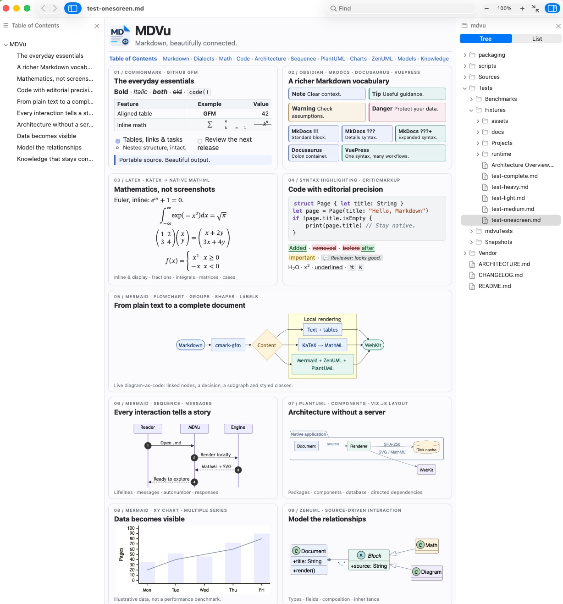

<div align="center">
  
  <h1>MDVu - Superfast Markdown Viewer</h1>

  <p>
    The tiny, ultra-fast, ultra-compact and lightweight native Markdown viewer for macOS.<br>
    Built with pure AppKit &amp; WebKit. Zero Electron. Zero Node. Zero Telemetry. 100% Offline.
  </p>

  <p>
    <a href="https://github.com/stpork/mdvu/actions/workflows/ci.yml"></a>
    <a href="#installation"></a>
    <a href="#installation"></a>
    <a href="#performance-and-size"></a>
    <a href="LICENSE"></a>
  </p>
</div>

<p align="center">
  
</p>

---

## Why mdvu?

Modern Markdown tools often bundle 150+ MB of Chromium and Node.js runtimes just to display formatted text. **mdvu** takes the opposite approach:
* **Fast startup and parsing**: Markdown preparation overlaps AppKit startup, and a prewarmed WebView is kept for subsequent windows. Byte-level extension checks avoid unnecessary preprocessing. See the reproducible measurements below.
* **Compact distribution**: About **3.4 MiB** for a native app or **4.2 MiB** for Universal, including compressed offline diagram engines. No bundled Electron, Node, or JVM.
* **Reference Markdown Engine**: Powered by Apple / Swift's reference `cmark-gfm` parser with full CommonMark and GitHub Flavored Markdown compliance.
* **Rich Markdown Dialects & Extensions**: Native support for **GitHub GFM**, **Obsidian** (callouts `[!NOTE]`, `[!TIP]`, `[!WARNING]`, `[!DANGER]`, wiki-links `[[target|label]]`, and embeds `![[image.png]]`), **MkDocs** (`!!!`, `???`, `???+`), **Docusaurus / VuePress** (`:::note` containers), **CriticMarkup** (`{++add++}`, `{--del--}`, `{~~old~>new~~}`, `{==mark==}`, `{>>comment<<}`), **Subscript & Superscript** (`~sub~`, `^sup^`, `^^underline^^`), and **GitLab TOC** (`[[_TOC_]]`).
* **Native Math Formulas (LaTeX / KaTeX)**: Full offline rendering for inline (`$...$`) and display (`$$...$$` or ````math```` blocks) mathematical formulas via an LZMA-compressed KaTeX engine (~64 KB) and native WebKit MathML Core rendering, featuring dark/light mode integration, zero font download overhead, and textbook-quality typography.
* **Offline Diagrams (Mermaid, ZenUML & PlantUML)**: Bundled **Mermaid 11.17.2**, **ZenUML 0.2.3**, and **PlantUML Core 1.2026.7** + **Viz.js 3.24.0** (Graphviz 14.1.1) with **LZMA Ultra** compression. Renders 100% offline with zero Java requirement, independent lazy loading, frame-budgeted execution, and SHA-256 disk caching.
* **Native Zoom Engine**: Hardware-accelerated GPU layer zoom with compound toolbar control (`[-][ 100% ][+]`), magnetic $\pm 2.5\%$ snapping eliminating indicator jitter (`201%`), trailing settle timers for bounce-back, manual percentage input, 10%–500% boundaries, and 10% discrete stepping.
* **Titlebar Quick-Open**: Click the window title to instantly open a new document or folder, preserving macOS proxy icon drag and directory popups.
* **File & Vault Navigator (`⌥⌘D`)**: Instant collapsible directory tree pane inspired by Obsidian vaults. Recursively discovers all Markdown notes across your vault or workspace, auto-detects `.obsidian` and `.git` project roots, and navigates seamlessly.
* **Resource hygiene**: Weak message handlers and explicit teardown release window resources. A shared SVG cache has an advisory 16 MiB cost limit. WebKit uses separate processes, so host-process memory alone is not total app memory.

---

## Installation

### 1. Homebrew Cask (Recommended)

Install directly via the official `stpork` tap:

```sh
# Option A: One-line install
brew install --cask stpork/tap/mdvu

# Option B: Tap repository first, then install
brew tap stpork/tap
brew install --cask mdvu

# Option C: Direct URL install
brew install --cask https://raw.githubusercontent.com/stpork/homebrew-tap/main/Casks/mdvu.rb
```

To update in the future:
```sh
brew upgrade --cask mdvu
```

> [!NOTE]
> **Standard Installation:**
> `brew install --cask` installs directly into `/Applications` and links the `mdvu` CLI command without requiring `root` or `sudo`.
>
> **Restricted / Non-Admin Environments:**
> If your Mac is restricted by corporate MDM policies and your account does not have write access to `/Applications`, install into your home directory:
> ```sh
> brew install --cask --appdir=~/Applications stpork/tap/mdvu
> ```
> To make this default for all Homebrew casks, add `export HOMEBREW_CASK_OPTS="--appdir=~/Applications"` to your `~/.zshrc`.

---

### 2. Pre-Built Release Downloads (GitHub Releases)

Pre-compiled signed binaries and disk images are available on the [GitHub Releases](https://github.com/stpork/mdvu/releases) page:

| Package | Target Architecture | Description |
| :--- | :--- | :--- |
| **`mdvu-X.Y.Z-macos.dmg`** | Universal (`arm64` + `x86_64`) | Graphical macOS installer with Drag-to-Applications |
| **`mdvu-X.Y.Z-macos-universal.zip`** | Universal (`arm64` + `x86_64`) | Portable archive for both Apple Silicon and Intel |
| **`mdvu-X.Y.Z-macos-arm64.zip`** | Apple Silicon (`arm64`) | Ultra-compact (2.9 MB) optimized for M1/M2/M3/M4 |
| **`mdvu-X.Y.Z-macos-x86_64.zip`** | Intel (`x86_64`) | Ultra-compact (2.9 MB) optimized for Intel Macs |

**Manual Installation Steps:**
1. Download the `.dmg` or `.zip` from [Releases](https://github.com/stpork/mdvu/releases).
2. Move `mdvu.app` into `/Applications` (or `~/Applications`).
3. *(If macOS Gatekeeper flags an ad-hoc release on first launch)*:
   ```sh
   xattr -d com.apple.quarantine /Applications/mdvu.app
   ```
4. *(Optional)* Link the CLI binary into your shell PATH:
   ```sh
   mkdir -p ~/.local/bin
   ln -sf /Applications/mdvu.app/Contents/MacOS/mdvu ~/.local/bin/mdvu
   # or system-wide (requires sudo):
   sudo ln -sf /Applications/mdvu.app/Contents/MacOS/mdvu /usr/local/bin/mdvu
   ```

---

### 3. Build & Install From Source

Requirements: macOS 13.0+, Swift 6 / Xcode Command Line Tools (`xcode-select --install`).

```sh
git clone https://github.com/stpork/mdvu.git
cd mdvu

# Using the unified build.sh driver:
./build.sh app       # Build optimized native application
./build.sh install   # Installs to /Applications and links CLI binary

# Or using make:
make app             # Build release bundle
make install         # Install locally

# To compile a universal binary (Apple Silicon + Intel):
./build.sh universal # or 'make universal'
```

---

### 4. Direct Swift Package Manager (CLI Only)

If you only need the command-line rendering tool without the `.app` bundle:
```sh
git clone https://github.com/stpork/mdvu.git
cd mdvu
swift build -c release
cp .build/release/mdvu ~/.local/bin/
```

---

## Usage

### Command Line Interface

```sh
# Open a single file
mdvu README.md

# Open multiple files in separate tabs/windows
mdvu ARCHITECTURE.md CHANGELOG.md

# Open a directory (browsing mode with file list sidebar)
mdvu ~/Documents/Notes

# Force light, dark, or system theme
mdvu --theme dark document.md

# Select markdown dialect (generic, github, or obsidian)
mdvu --dialect obsidian note.md

# Open directly in edge-to-edge Full Width mode
mdvu --full-width document.md

# Headless snapshot generation (render Markdown to PNG without opening a window)
mdvu --snapshot output.png README.md
```

### CLI Options

| Flag | Description | Default |
| :--- | :--- | :--- |
| `--theme <system\|light\|dark>` | Color theme for document and diagrams | `system` |
| `--dialect <generic\|github\|obsidian>` | Parser dialect profile (auto-detects frontmatter) | `generic` |
| `--navigator` | Open with the File & Vault Navigator pane visible (`⌥⌘D`) | Saved preference |
| `--full-width` | Open in edge-to-edge full width mode | Saved preference |
| `--no-mermaid` | Disable Mermaid diagram rendering | Enabled |
| `--snapshot <file.png>` | Headless render to PNG image and exit | None |

---

## Features

### 🌐 Comprehensive Markdown Ecosystem & Dialect Support
`mdvu` brings unified compatibility across the most popular Markdown flavors in software engineering, technical documentation, and academic writing:

* **CommonMark & GitHub Flavored Markdown (GFM)**:
  * Reference C AST parsing via `cmark-gfm`.
  * Tables with column alignment, autolinks, task lists (`- [x]`), and double-tilde strikethrough (`~~deleted~~`).
  * Footnotes support (`[^1]`).
* **Obsidian Ecosystem**:
  * Native callouts: `[!NOTE]`, `[!TIP]`, `[!WARNING]`, `[!DANGER]`, `[!CAUTION]`, `[!INFO]`, `[!SUCCESS]`, `[!QUESTION]`, `[!FAILURE]`, `[!BUG]`, `[!EXAMPLE]`, `[!QUOTE]`.
  * Foldable callouts: expandable (`[!NOTE]+`) and collapsed by default (`[!NOTE]-`).
  * Wikilinks with aliases and header/block references: `[[document]]`, `[[document|Custom Label]]`, `[[#section]]`.
  * Media embeds: `![[diagram.png]]`, `![[audio.mp3]]`.
* **Admonitions & Colon Containers (MkDocs, Docusaurus, VuePress)**:
  * MkDocs syntax: `!!! note "Title"`, `??? tip "Collapsible"`, and `???+ warning "Open by default"`.
  * Fenced colon containers: `:::note`, `:::tip[Title]`, `:::warning`, `:::danger`, and closing `:::`.
  * Mapped transparently to native callout aside containers with SVG icons and theme colors.
* **CriticMarkup (Editorial & Review Syntax)**:
  * Additions: `{++new content++}` $\to$ `<ins class="critic-add">new content</ins>`.
  * Deletions: `{--removed content--}` $\to$ `<del class="critic-del">removed content</del>`.
  * Substitutions: `{~~old~>new~~}` $\to$ `<del class="critic-del">old</del><ins class="critic-add">new</ins>`.
  * Highlights: `{==highlighted phrase==}` $\to$ `<mark class="critic-mark">highlighted phrase</mark>`.
  * Reviewer Comments: `{>>inline comment<<}` $\to$ `<span class="critic-comment">💬 inline comment</span>`.
* **Subscript, Superscript & Underline**:
  * Subscript: `H~2~O` $\to$ `H<sub>2</sub>O` (with strict negative lookaround to prevent conflicts with GFM `~~strikethrough~~`).
  * Superscript: `E = mc^2^` $\to$ `E = mc<sup>2</sup>`.
  * Underline: `^^underlined text^^` $\to$ `<u>underlined text</u>`.
* **GitLab Flavored Markdown (GLFM)**:
  * Table of Contents tokens: automatic anchor-aware placeholders for `[[_TOC_]]` and `[TOC]`.
* **YAML FrontMatter**:
  * Frontmatter headers (`---`) are extracted and cleanly formatted as a readable document metadata table.
* **Dynamic Dialect Switching & Auto-Detection**:
  * **View → Dialect Menu**: Instantly switch the active document window between **Generic (CommonMark)**, **GitHub (GFM)**, and **Obsidian** with live re-rendering and scroll preservation.
  * **Frontmatter & Directive Auto-Detection**: Automatically detects dialect from YAML frontmatter (`dialect: obsidian`) or top-of-file HTML comment directives (`<!-- dialect: obsidian -->`), applying the optimal profile seamlessly.
* **Safe HTML & Styling**:
  * Uses `cmark-gfm` tag filtering while preserving presentation markup and raw `<style>` blocks. This is not a complete HTML sanitizer: use trusted documents, particularly when they contain raw HTML or remote resources.
* **Code Fence Protection**:
  * All inline transformations are shielded by `CodeFenceProtector` against modifying code blocks (including 3-backtick, 4-backtick ` ```` `, and tilde `~~~` fences).

---

### 📊 Offline Diagram Rendering (Mermaid, ZenUML & PlantUML)

`mdvu` bundles fully offline rendering engines compressed with **LZMA Ultra** for maximum storage efficiency:

* **Mermaid 11.17.2**:
  * **Core Grammars**: `flowchart`, `sequenceDiagram`, `classDiagram`, `stateDiagram-v2`, `erDiagram`, `gitGraph`, `gantt`, `pie`, `mindmap`, `quadrantChart`, `requirementDiagram`, `C4Context`, `C4Container`, `C4Component`, `C4Dynamic`, `C4Deployment`.
  * **Extended Types**: `ishikawa-beta` (fishbone diagrams), `swimlane-beta` (workflow swimlanes), `packet-beta` (binary packet protocols), `kanban`, `block-beta`, `architecture-beta`, `radar-beta`, `sankey-beta`, and `xychart-beta`.
  * **ZenUML 0.2.3 Plugin**: Full support for concise ZenUML sequence diagrams within ````mermaid`` code blocks.
  * **Auto-Quoting Resilience**: Grammar preprocessor automatically quotes unquoted labels containing hyphens in `requirementDiagram` and complex models.
* **PlantUML 1.2026.7 (`@plantuml/core`) + Graphviz (`Viz.js 3.24.0` / Graphviz 14.1.1)**:
  * **100% Offline & Pure WebAssembly/JS**: Executes client-side inside WebKit via TeaVM. **No Java runtime (JRE/JVM) or external binaries required.**
  * **Fenced Blocks**: Supports both ````plantuml`` and ````puml`` code fences.
  * **UML Models**: Sequence diagrams, Class models with inheritance and associations, State machines, Activity diagrams, Component architectures, Object diagrams, Deployment diagrams, and Use-case models.
  * **Non-UML Families**: JSON/YAML data tree visualizers, Salt UI wireframes, Archimate enterprise models, MindMaps, Work Breakdown Structures (WBS), Gantt schedules, and Network (`nwdiag`) diagrams.
  * **Dark Mode & Transparency**: Automatically adapts to document theme with transparent SVG backgrounds.
* **Frame-Budgeted Diagram Execution**:
  * Diagram rendering yields every 16 ms to the WebKit animation loop, preventing main-thread locks on documents with hundreds of diagrams (e.g. 300+ diagrams in stress fixtures).
* **On-Demand Lazy Decompression**:
  * Documents without diagrams incur **zero CPU/memory overhead**; the LZMA archives are never accessed.
  * Documents with only Mermaid diagrams decompress only `mermaid.lzma` (1.33 MB).
  * Documents with only PlantUML diagrams decompress only `plantuml.lzma` (1.20 MB).
* **SHA-256 SVG Disk Cache**:
  * SVGs are cached to `~/Library/Caches/com.mdvu.viewer/diagrams` keyed by `SHA256(renderer + version + source + theme)`.
  * Renders once; subsequent loads reuse cached SVG and bypass diagram generation.

---

### 🔍 Native Zoom Control `[-][ 100% ][+]`
* **Hardware-Accelerated Scaling**: WebKit handles continuous trackpad magnification. Frame rate depends on display refresh rate, document complexity, and system load; no fixed FPS guarantee is implied.
* **Magnetic Snapping ($\pm 2.5\%$)**: Micro-gestures within $\pm 2.5\%$ of clean 10% multiples (100%, 150%, 200%, 300%) snap cleanly to integers, eliminating jitter and phantom numbers (e.g. `201%` $\to$ `200%`).
* **Bounce-Back Settling Engine**: Rapid zoom-out bounce-back gestures settle at exact `1.0` (`100%`) via trailing spring timers.
* **Discrete 10% Stepping**: UI buttons and `⌘+` / `⌘-` step cleanly by 10% and snap to clean multiples.
* **Manual Entry & Boundaries**: Click the centered percentage field to type a custom value (e.g. `150`, `250%`), bounded between **10%** and **500%**.
* **Double-Click Reset**: Double-clicking the indicator resets the zoom level to 100% (`⌘0`).
* **Persistent Window Zoom**: Zoom level is preserved across Back/Forward navigation, link jumps, and file reloads.

---

### 📑 Document Titlebar Quick-Open
* Click the file name in the window titlebar to open the native `NSOpenPanel` sheet modal and switch files or folders in the current window.
* Full compatibility with macOS native window features: dragging the title moves the window, `⌘-click` reveals the Finder directory hierarchy, and the proxy icon can be dragged into Terminal or Mail.

---

### 📐 Readable Measure vs. Full Width
* **Readable Measure (Default)**: Constrains body text to 920px with optimal line length (~70–85 characters) for effortless reading.
* **Full Width (`⇧⌘W`)**: Expands text, code, tables, and diagrams edge-to-edge across wide monitors.

---

### 🧭 Navigation & Two-Finger Swipe
* **Two-Finger History Swipe**: Horizontal trackpad swipes navigate Back and Forward when history is available.
* **Zoom Pan-Priority**: When zoomed in (`> 105%`), two-finger gestures seamlessly pan overflowing tables, code blocks, and diagrams without triggering history jumps.
* **Dynamic Back/Forward Validation**: Segmented history buttons in the toolbar visually enable or disable based on actual navigation history availability.

---

### 🗂️ File & Vault Navigator (`⌥⌘D`)
* **Obsidian-Style Vault Tree**: Dedicated collapsible right pane displaying all supported Markdown files and directories in your vault or workspace.
* **Smart Root Detection**: Automatically walks up directory ancestors looking for `.obsidian` or `.git` boundaries, anchoring the root at your true vault or repository level.
* **Instant Lazy Scanning**: Traverses nested subdirectories only upon expansion, keeping memory and CPU footprint near zero even in vaults with thousands of notes.
* **Auto-Reveal & Active Selection**: Opening or switching documents automatically expands ancestor folders and highlights the current file in the outline.
* **Native Keyboard & Click Flow**: Single-click opens files; double-click expands or collapses directories; Return/Enter opens the highlighted note.
* **Push-on/Push-off State**: Toolbar buttons for Table of Contents and File Navigator stay visually depressed when their respective panes are active.
* **CLI Flag**: Launch directly with navigator open using `mdvu --navigator <path>`.

---

## Performance & Sizing Benchmark

Measurements vary with architecture, OS, document, and cache state. `make benchmark` runs five parser iterations after a warmup; it does not measure DOM rendering, scrolling, or diagram execution. The 0.4.1 checks and exact artifact sizes are recorded in [CHANGELOG.md](CHANGELOG.md).

| Property | Configuration / measurement |
| :--- | :--- |
| Native / Universal app | Approximately 3.4 / 4.2 MiB, with shared compressed resources |
| Compiler | `-O`, cross-module optimization, linker dead stripping, stripped Mach-O |
| Resources | Lazy LZMA decompression off the UI queue; reused for later documents |
| Cache | Shared SVG `NSCache`, advisory 16 MiB cost limit; persistent disk cache |
| Zoom | Native WebKit magnification and page zoom; display/document dependent |

For the previous measured build, `-Osize` saved less than 1% of the entire app while reducing parser throughput in that run, so the speed-oriented flags are retained. No formatting or parser capabilities have been removed to reduce size.

### TOC navigation and installed copies

Click a heading in the Contents pane to scroll to it, including clicking the same selected row again after scrolling away. Local `file://` navigation tolerates WebKit history API restrictions and uses native Back/Forward history. If a fix appears absent, verify the version in **About mdvu**: `/Applications/mdvu.app` and `~/Applications/mdvu.app` can contain different builds. Launch the newly installed 0.4.1 copy explicitly.

---

## Keyboard Shortcuts

| Shortcut | Action |
| :--- | :--- |
| `⌘O` | Open File or Folder |
| `⌘W` | Close Window |
| `⌘F` | Find in Document |
| `⌘G` / `⇧⌘G` | Find Next / Find Previous |
| `⌘+` / `⌘=` | Zoom In (+10%) |
| `⌘-` | Zoom Out (-10%) |
| `⌘0` | Actual Size (100%) |
| `⇧⌘W` | Toggle Full Width / Readable Width |
| `^⌘S` | Toggle Table of Contents Sidebar |
| `⌥⌘D` | Toggle File / Vault Navigator Pane |
| `⌘[` / `⌘←` | Navigate Back in History |
| `⌘]` / `⌘→` | Navigate Forward in History |
| `⌘R` | Reload Document |
| `⌘Q` | Quit mdvu |

---

## Architecture

`mdvu` is designed as an native AppKit host with WebKit auxiliary processes:
```
File on Disk / Watcher
        │
        ▼
MarkdownPipeline (Dialect Preprocessing: Callouts, Wikilinks)
        │
        ▼
cmark-gfm (C AST Parser, GFM Extensions, Tag Filter)
        │
        ▼
HTMLDocument Assembly (Theme, Highlighting, CSS, Placeholders)
        │
        ▼
WKWebView (AppKit Chrome + Hardware Accelerated Viewport)
        │
        ▼
Async DiagramRenderer (Mermaid 11.17.2 + ZenUML / PlantUML 1.2026.7 + SHA-256 Cache)
```
For technical details, see [ARCHITECTURE.md](ARCHITECTURE.md).

---

## License & Credits

* **Author**: Finn de Bear ([finndebear@gmail.com](mailto:finndebear@gmail.com))
* **License**: Released under the [MIT License](LICENSE).

### Third-Party Software
* [swift-cmark](https://github.com/swiftlang/swift-cmark) — BSD-2-Clause / MIT (c) John MacFarlane, GitHub, Apple.
* [Mermaid.js 11.17.2](https://github.com/mermaid-js/mermaid) — MIT (c) Knut Sveidqvist and Mermaid Contributors.
* [ZenUML Plugin 0.2.3](https://github.com/mermaid-js/mermaid-zenuml) — MIT (c) Mermaid Contributors.
* [PlantUML Core 1.2026.7](https://github.com/plantuml/plantuml-core) — GPL / LGPL / Apache-2.0 / MIT (c) PlantUML Team.
* [Viz.js 3.24.0 (Graphviz 14.1.1)](https://github.com/mdaines/viz.js) — MIT (c) Michael Daines, Graphviz Contributors.
