# TED system — Solution Architecture

## Table of Contents

- [1. Executive Summary](#1-executive-summary)
  - [1.1 Purpose and Goals](#11-purpose-and-goals)
  - [1.2 Architecture at a Glance](#12-architecture-at-a-glance)
  - [1.3 Status and Known Gaps](#13-status-and-known-gaps)
- [2. Context and Drivers](#2-context-and-drivers)
  - [2.1 Business Context, Goals and Value](#21-business-context-goals-and-value)
  - [2.2 System Context](#22-system-context)
  - [2.3 Stakeholders, Users and External Systems](#23-stakeholders-users-and-external-systems)
  - [2.4 Scope, Boundaries and Ownership](#24-scope-boundaries-and-ownership)
  - [2.5 Requirements, Constraints, Assumptions and Compliance Obligations](#25-requirements-constraints-assumptions-and-compliance-obligations)
  - [2.6 Quality Attributes and Architecture Principles](#26-quality-attributes-and-architecture-principles)
  - [2.7 Architecturally Significant Use Cases](#27-architecturally-significant-use-cases)
- [3. Solution Architecture](#3-solution-architecture)
  - [3.1 Logical Architecture](#31-logical-architecture)
  - [3.2 Architecture Building Blocks](#32-architecture-building-blocks)
  - [3.3 Technology View](#33-technology-view)
  - [3.4 Cross-Cutting Responsibilities and Dependencies](#34-crosscutting-responsibilities-and-dependencies)
- [4. Data and Integration](#4-data-and-integration)
  - [4.1 Information and Data Stores](#41-information-and-data-stores)
  - [4.2 Data Classification, Ownership and Lifecycle](#42-data-classification-ownership-and-lifecycle)
  - [4.3 Integration Overview](#43-integration-overview)
  - [4.4 Interfaces, Protocols and Messaging](#44-interfaces-protocols-and-messaging)
  - [4.5 Data Flows](#45-data-flows)
  - [4.6 Runtime Scenarios](#46-runtime-scenarios)
- [5. Security and Identity](#5-security-and-identity)
  - [5.1 Security Overview and Trust Boundaries](#51-security-overview-and-trust-boundaries)
  - [5.2 Threats and Risks](#52-threats-and-risks)
  - [5.3 Authentication and Identity Federation](#53-authentication-and-identity-federation)
  - [5.4 Authorization, Roles and Access Lifecycle](#54-authorization-roles-and-access-lifecycle)
  - [5.5 Data Protection and Secrets](#55-data-protection-and-secrets)
  - [5.6 Security Controls](#56-security-controls)
- [6. Deployment and Delivery](#6-deployment-and-delivery)
  - [6.1 Deployment Overview](#61-deployment-overview)
  - [6.2 Environments and Deployment Zones](#62-environments-and-deployment-zones)
  - [6.3 Network and Connectivity](#63-network-and-connectivity)
  - [6.4 Deployment Topology](#64-deployment-topology)
  - [6.5 Platform and Infrastructure Dependencies](#65-platform-and-infrastructure-dependencies)
  - [6.6 Build, Release and Deployment Automation](#66-build-release-and-deployment-automation)
- [7. Operations and Resilience](#7-operations-and-resilience)
  - [7.1 Configuration, Logging and Observability](#71-configuration-logging-and-observability)
  - [7.2 Availability, Capacity, Performance and Resilience](#72-availability-capacity-performance-and-resilience)
  - [7.3 Backup, Recovery and Disaster Recovery](#73-backup-recovery-and-disaster-recovery)
  - [7.4 Operational Security and Support](#74-operational-security-and-support)
- [8. Evolution, Decisions and Risks](#8-evolution-decisions-and-risks)
  - [8.1 Current / Target State and Transition](#81-current-target-state-and-transition)
  - [8.2 Architecture Decisions](#82-architecture-decisions)
  - [8.3 Architecture Risks](#83-architecture-risks)
  - [8.4 Open Questions, Conflicts and Gaps](#84-open-questions-conflicts-and-gaps)
- [9. Traceability and Validation](#9-traceability-and-validation)
  - [9.1 Sources and Evidence](#91-sources-and-evidence)
  - [9.2 Requirements and Element Traceability](#92-requirements-and-element-traceability)
  - [9.3 Coverage and Confidence](#93-coverage-and-confidence)
  - [9.4 Architecture Validation and Fitness Criteria](#94-architecture-validation-and-fitness-criteria)
- [Appendix A — Architecture Element Catalog](#appendix-a-architecture-element-catalog)
- [Appendix B — Interface Catalog](#appendix-b-interface-catalog)
- [Appendix C — Data Catalog](#appendix-c-data-catalog)
- [Appendix D — Deployment Catalog](#appendix-d-deployment-catalog)
- [Appendix E — Security and Identity Catalog](#appendix-e-security-and-identity-catalog)
- [Appendix F — Evidence and Diagnostics](#appendix-f-evidence-and-diagnostics)
- [Appendix G — Glossary](#appendix-g-glossary)

# 1. Executive Summary

## 1.1 Purpose and Goals

The primary objectives of the system are the production and dissemination of the Supplement to the Official Journal of the European Union, alongside addressing a comprehensive range of reporting needs. These reporting capabilities encompass lists, charts, crosstabs, and compound reports to support diverse operational requirements. Delivery of these capabilities is guided by key organizational stakeholders, specifically the Publications Office Project Team and the Developments Project Team.

Core architectural principles enforce separation of concerns, programming to interfaces, and dependency injection across the solution. Separation of concerns is applied directly to the presentation tier, keeping the user view distinct from business data and underlying processes. System components implement programming to interfaces so implementation classes avoid direct dependencies on one another, while dependency injection relies on configuration files rather than explicit Java code to resolve implementation dependencies.

Key engineering decisions address critical operational requirements and format generation standards. A customized Apache Formatting Objects Processor (Apache FOP) was implemented to support the PDF/A-1a standard for PDF document generation. Additionally, Spring declarative transaction management using DataSourceTransactionManager provides transactional consistency to mitigate concurrent database modification risks.

Specific mechanisms resolve extraction, versioning, and interface challenges while managing operational risks such as spam and undesirable email threats. To overcome the inability to extract Contracting Authority emails via standard methods, XPath configuration in DOCUMENT_XML_INFO avoids hardcoded logic and offers flexibility for new forms. Reference data alterations rely on a versioning algorithm and a Reference Data Version Validity Condition validation criterion to translate legacy code versions without altering document content, alongside handling front-end issues such as Internet Explorer 6 (IE6) lacking hover support on non-anchor HTML tags.

## 1.2 Architecture at a Glance

The TED system is structured around the Java 2 Platform, Enterprise Edition (J2EE) application architecture, which is decomposed into distinct tiers and layers. Within this architecture, the TED system encompasses core components including the TED Website, Notice viewer, Monitoring data-warehouse, License Holder environment, Workflow engine, and Email analysis and notifications.

The operational capabilities rely on key interactions and supporting infrastructure across these application components. The Workflow engine interfaces directly with the MySQL Database while serving Apache FOP, iText, and the mkisofs tool. In addition, the TED Website serves both the MySQL Database and Apache Lucene, and Email analysis and notifications realizes the Apache JAMES server.

### System Landscape

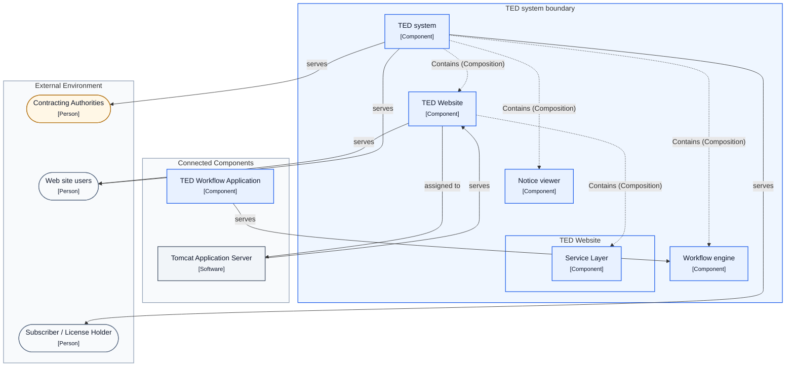

## 1.3 Status and Known Gaps

Data extraction and formatting mechanisms have addressed specific structural challenges across the system's architecture. Standard extraction of Contracting Authority email addresses previously posed an issue because the necessary information is absent from the common notice XML header. To resolve this without hardcoding rules into application code, an XML Path Language (XPath) configuration in DOCUMENT_XML_INFO was introduced, providing flexible support for new forms. In addition, generating compliant output required a customized Apache Formatting Objects Processor (Apache FOP) deployment configured specifically for PDF/A-1a support.

System data management strategies also account for reference data evolution alongside technical operational constraints. A dedicated versioning algorithm governs reference data alterations, accompanied by a strict validity condition requiring all documents to be re-indexed using the new code version and the XXX_CURRENT_VERSION column in the DOCUMENT table updated before the new version becomes valid. Architecture considerations further identify risks surrounding concurrent database modifications, while presentation-layer gaps include a lack of Internet Explorer 6 (IE6) hover support on non-anchor HTML tags.

[Back to table of contents](#table-of-contents)

# 2. Context and Drivers

## 2.1 Business Context, Goals and Value

The architecture is driven by the primary business goal to address a wide range of reporting needs within the TED project. Specifically, the initiative is designed to deliver diverse reporting formats, including lists, charts, crosstabs, and compound reports. This functional breadth ensures that diverse analytical and operational reporting requirements across the project environment are fully satisfied.

Multiple key stakeholder groups guide and support these reporting objectives across organizational boundaries. The Developments Project Team and the Publications Office Project Team represent principal stakeholders steering the solution requirements. Their collective engagement ensures that the reporting platform aligns with ongoing implementation efforts and overarching organizational publication standards.

## 2.2 System Context

The TED system is an internal application component positioned squarely in scope as the primary system of interest. Within its broader operational context, the system operates alongside institutional stakeholders, including the Publications Office business actor. Its core function involves supporting operational administration while providing dedicated services across a varied landscape of external and internal consumers.

Externally, the TED system serves external Contracting Authorities who interact with the platform as primary business actors. It also delivers tailored functional services to external Web site users and external Subscriber / License Holder roles. In addition to accommodating these external roles and actors, the TED system directly serves the Administrator role to sustain internal governance and platform operations.

### System of Interest

| Name | Architectural role |
| --- | --- |
| TED system | Application Component |

## 2.3 Stakeholders, Users and External Systems

The operational landscape comprises key organizational entities and project-level stakeholders that guide system direction and delivery. The Publications Office functions as a core business actor alongside the external Contracting Authorities. Supporting the initiative, organizational oversight and development efforts are driven by the Publications Office Project Team and the Developments Project Team.

User roles define distinct access models and responsibilities across internal administration and external consumers. The Administrator role is designated for accessing data warehouse information through the web interface. External engagement is accommodated via general Web site users as well as the Subscriber / License Holder role, which provides subscribers with privileged access to the contents of Tenders Electronic Daily (TED).

### Stakeholders, Actors and Roles

| Name | Architectural role | Responsibility / purpose |
| --- | --- | --- |
| Administrator | Role | Accessing the data warehouse information using the web interface. |
| Contracting Authorities | Business Actor | — |
| Developments Project Team | Stakeholder | — |
| Publications Office | Business Actor | — |
| Publications Office Project Team | Stakeholder | — |
| Subscriber / License Holder | Role | — |
| Web site users | Role | — |

## 2.4 Scope, Boundaries and Ownership

The Tenders Electronic Daily (TED) system serves as the internal application component and primary system of interest explicitly within the architecture scope. Internally, the TED system encompasses a core set of application components, including the TED Website, the Notice viewer, and the License Holder environment. It also incorporates background processing and operational facilities comprising the Workflow engine, Email analysis and notifications, and the Monitoring data-warehouse.

Ownership and business governance are held by the Publications Office, which operates as a designated business actor and owner. The operational boundaries interact with distinct external stakeholders, notably Contracting Authorities acting as external business entities. External user roles interfacing across the solution boundary also include Web site users and the Subscriber / License Holder role.

### Scope

| Concept | State |
| --- | --- |
| Production Lane 1 | In scope |
| Production Lane 2 | In scope |
| TED system | In scope |

## 2.5 Requirements, Constraints, Assumptions and Compliance Obligations

The section was examined; no relevant source evidence was found.

## 2.6 Quality Attributes and Architecture Principles

The architecture is structured around core design principles that enforce loose coupling and modularity across the system. Under the Programming to Interfaces principle, software components avoid direct dependencies on concrete implementation classes, relying instead on interface contracts. This approach directly improves software scalability and maintainability because alternative implementations can be substituted with minimal impact on dependent modules. Furthermore, the Dependency Injection principle reinforces and influences Programming to Interfaces by delegating dependency management to configuration files, thereby removing the need for Java objects to explicitly declare implementation dependencies in code.

In addition to interface-driven development, the system relies on the Separation of Concerns principle to clearly delineate architectural roles. This principle isolates user interface views from business data and underlying business processes. Within this structural model, the controller is dedicated to handling incoming requests and serving as an intermediary mediator between the data model and the presentation view.

## 2.7 Architecturally Significant Use Cases

The core operational processes center on the publication lifecycle and stakeholder interactions across multiple defined system roles, including Administrator, Web site users, and Subscriber / License Holder. A primary workflow is the Daily OJS publication flow execution managed by the Workflow engine, which achieves the outcome where notices are indexed and content is formatted for publication. As part of this data preparation, the Validation and files transformation process creates formatted content to be published from incoming XML notices and stores it directly in the content library.

Beyond online publication, secondary distribution involves the Daily DVD image creation process, which is triggered when the publishing operations team initiates automated DVD image creation to produce a finished DVD image. Following successful publication runs, the contracting authority notification process directly engages Contracting Authorities by dispatching notifications containing a UDL link and a time-stamped PDF/A 1a to inform them that their notices have appeared in the OJS.

Email analysis and notifications encompasses automated routing and threat mitigation rules for inbound communication. Under the out-of-office reply handling process, any incoming email matching the '*out of office*' pattern in its subject or content is flagged and routed to the dedicated out-of-office folder. Concurrently, spam detection and routing evaluates incoming messages against an internet blacklist, automatically forwarding matching senders to the spam folder to mitigate spam and undesirable email threats.

[Back to table of contents](#table-of-contents)

# 3. Solution Architecture

## 3.1 Logical Architecture

The TED system is organized into several major application components that manage core functional operations, monitoring, and communication. It encompasses the TED Website alongside the License Holder environment, Notice viewer, and Workflow engine. Additionally, the system incorporates dedicated components for Email analysis and notifications as well as a Monitoring data-warehouse.

Within the TED Website, functionality is decomposed into distinct architectural tiers, comprising the Web Layer, Domain Layer, Service Layer, and Data Access Layer. Cross-tier collaboration is structured such that the Data Access Layer directly serves the Service Layer, supporting overall application data operations.

### System Decomposition

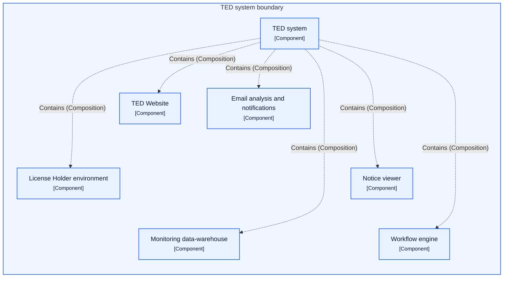

### Logical Components and Dependencies

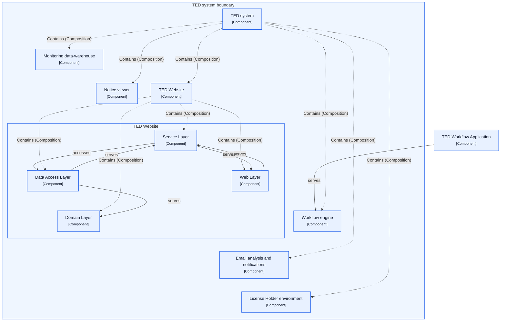

### Top to L1 Decomposition

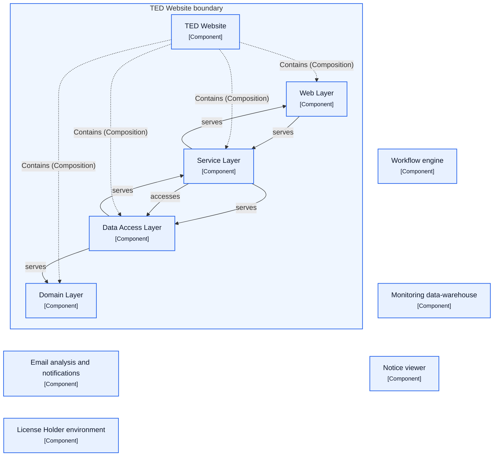

## 3.2 Architecture Building Blocks

The Tenders Electronic Daily (TED) system contains several core application components dedicated to public interaction, privileged distribution, and operational processing. The TED Website provides all necessary components for the system's public web interface, while the License Holder environment serves subscribers requiring privileged access to TED content, scoped specifically to the ProFTPD server and its modules. Core document operations are driven by the Workflow engine, which manages the end-to-end processing of document files received by the Publications Office, overseeing production management, indexing, file transformations, and DVD image creation.

Complementary application components deliver presentation formatting, administrative reporting, and communication capabilities across the TED system. The Notice viewer functions as a standalone Java application designed to transform Extensible Markup Language (XML) files into well-formatted versions suited for direct display. Operational monitoring is handled by the Monitoring data-warehouse, which incorporates a user interface allowing administrators to access data warehouse information through web reports. In addition, the Email analysis and notifications component oversees incoming email analysis while handling the dispatch of notifications and reminders to Contracting Authorities and website users.

### 3.2.1 Adobe Acrobat Professional

#### Dependencies and Interfaces

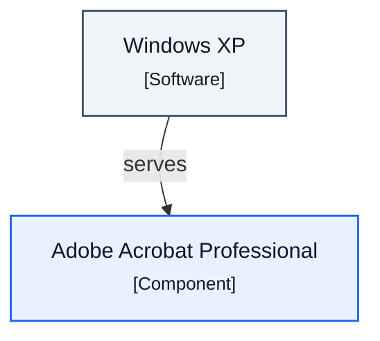

### Building Block Profile

| Attribute | Value |
| --- | --- |
| Architectural role | Application Component |

### Dependencies and Interactions

| Source | Relationship | Target | Context |
| --- | --- | --- | --- |
| Windows XP | Serves | Adobe Acrobat Professional | Current state |

### 3.2.2 Apache FOP

#### Dependencies and Interfaces

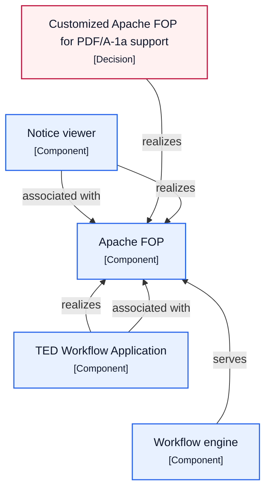

### Building Block Profile

| Attribute | Value |
| --- | --- |
| Architectural role | Application Component |

### Dependencies and Interactions

| Source | Relationship | Target | Context |
| --- | --- | --- | --- |
| Customized Apache FOP for PDF/A-1a support | Realizes | Apache FOP | Current state |
| Notice viewer | Associated with | Apache FOP | Current state |
| Notice viewer | Realizes | Apache FOP | Current state |
| TED Workflow Application | Associated with | Apache FOP | Current state |
| TED Workflow Application | Realizes | Apache FOP | Current state |
| Workflow engine | Serves | Apache FOP | Current state |

### 3.2.3 Apache JAMES server

#### Dependencies and Interfaces

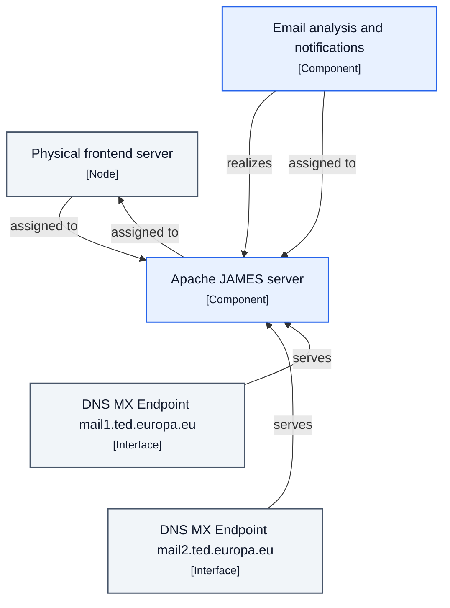

### Building Block Profile

| Attribute | Value |
| --- | --- |
| Architectural role | Application Component |

### Dependencies and Interactions

| Source | Relationship | Target | Context |
| --- | --- | --- | --- |
| Apache JAMES server | Assigned to | Physical frontend server | Current state |
| DNS MX Endpoint mail1.ted.europa.eu | Serves | Apache JAMES server | Current state |
| DNS MX Endpoint mail2.ted.europa.eu | Serves | Apache JAMES server | Current state |
| Email analysis and notifications | Assigned to | Apache JAMES server | Current state |
| Email analysis and notifications | Realizes | Apache JAMES server | Current state |
| Physical frontend server | Assigned to | Apache JAMES server | Current state |

### 3.2.4 Apache Lucene

#### Dependencies and Interfaces

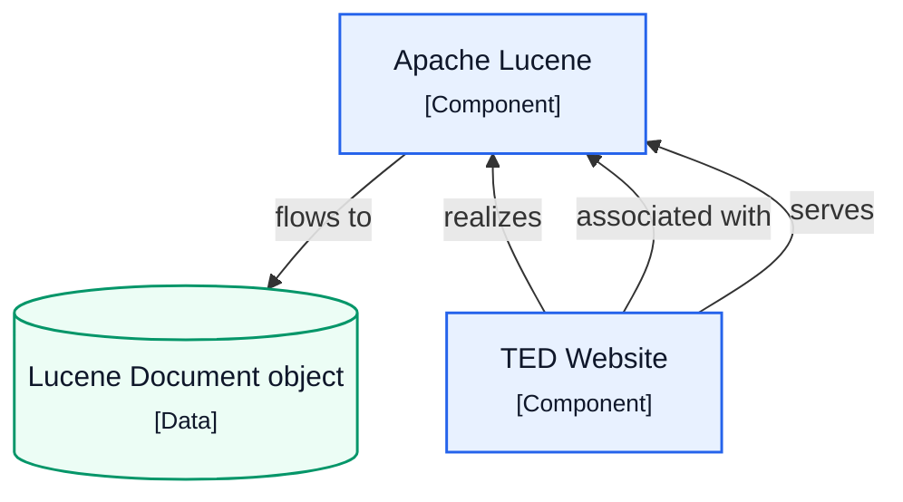

### Building Block Profile

| Attribute | Value |
| --- | --- |
| Architectural role | Application Component |
| Runtime | Java |

### Dependencies and Interactions

| Source | Relationship | Target | Context |
| --- | --- | --- | --- |
| Apache Lucene | Flows to | Lucene Document object | Current state |
| TED Website | Associated with | Apache Lucene | Current state |
| TED Website | Realizes | Apache Lucene | Current state |
| TED Website | Serves | Apache Lucene | Current state |

### 3.2.5 Apache Web Server

#### Dependencies and Interfaces

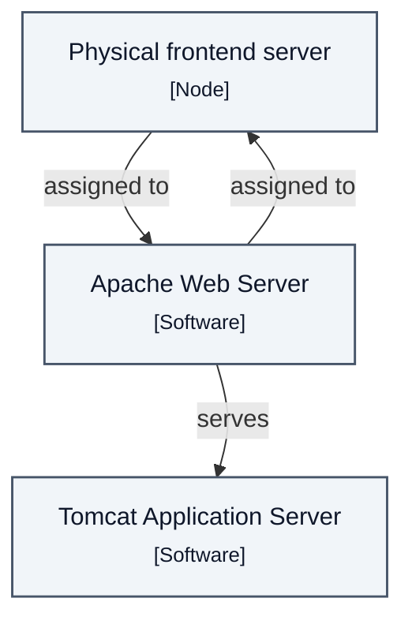

### Building Block Profile

| Attribute | Value |
| --- | --- |
| Architectural role | System Software |

### Dependencies and Interactions

| Source | Relationship | Target | Context |
| --- | --- | --- | --- |
| Apache Web Server | Assigned to | Physical frontend server | Current state |
| Apache Web Server | Serves | Tomcat Application Server | Current state |
| Physical frontend server | Assigned to | Apache Web Server | Current state |

### 3.2.6 BIRT

#### Dependencies and Interfaces

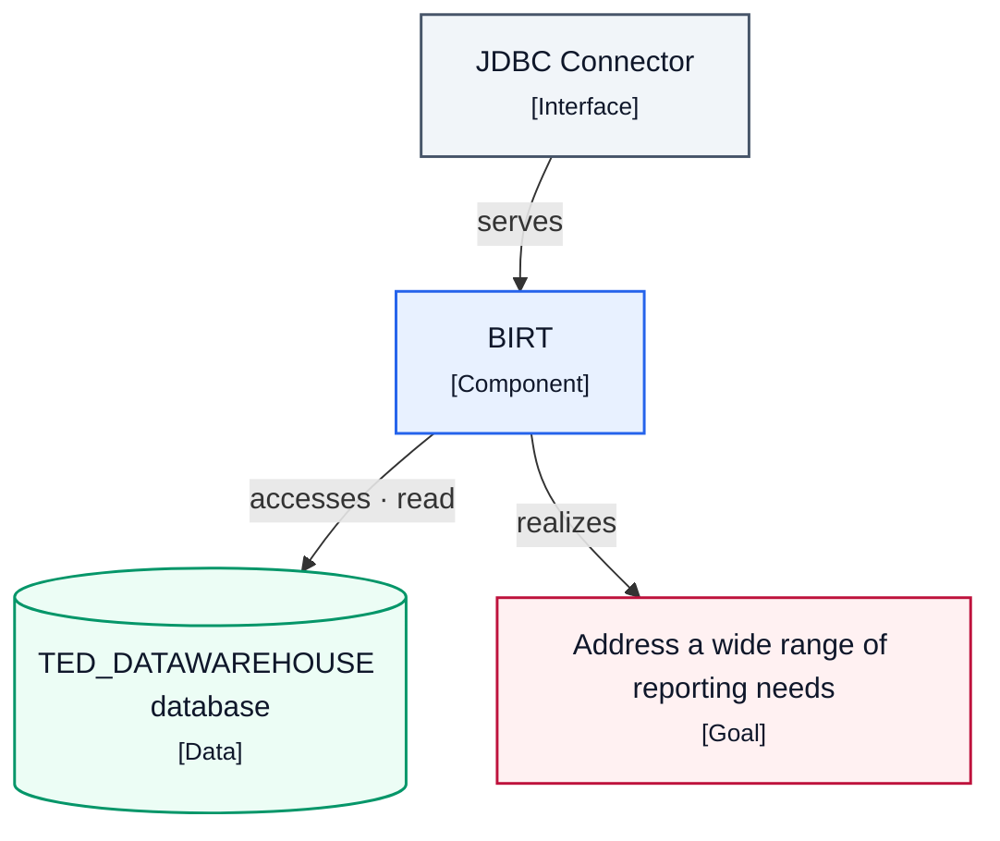

### Building Block Profile

| Attribute | Value |
| --- | --- |
| Architectural role | Application Component |
| Description | Reporting system for web applications comprising a report designer and runtime component with charting engine for lists, charts, crosstabs, and compound reports.; A reporting system for web applications consisting of report designer and runtime component. |

### Dependencies and Interactions

| Source | Relationship | Target | Context |
| --- | --- | --- | --- |
| BIRT | Accesses | TED_DATAWAREHOUSE database | Current state |
| BIRT | Realizes | Address a wide range of reporting needs | Current state |
| JDBC Connector | Serves | BIRT | Current state |

### 3.2.7 Data Access Layer

#### Dependencies and Interfaces

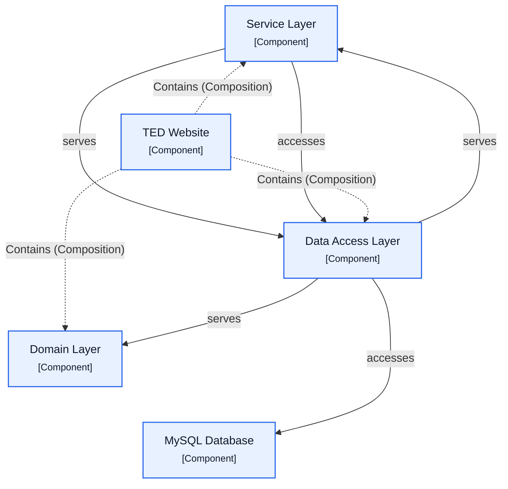

### Building Block Profile

| Attribute | Value |
| --- | --- |
| Architectural role | Application Component |
| Purpose | Acts as a medium between the entities of the Domain Layer and the technical solutions insuring its durability. |
| Responsibility | Acts as a medium between the entities of the Domain Layer and technical persistence solutions, knowing how and where persistent entities are stored. |

### Dependencies and Interactions

| Source | Relationship | Target | Context |
| --- | --- | --- | --- |
| Data Access Layer | Accesses | MySQL Database | Current state |
| Data Access Layer | Serves | Domain Layer | Current state |
| Data Access Layer | Serves | Service Layer | Current state |
| Service Layer | Accesses | Data Access Layer | Current state |
| Service Layer | Serves | Data Access Layer | Current state |
| TED Website | Contains | Data Access Layer | Current state |

### 3.2.8 DNS MX Endpoint mail1.ted.europa.eu

#### Dependencies and Interfaces


### Building Block Profile

| Attribute | Value |
| --- | --- |
| Architectural role | Technology Interface |

### Dependencies and Interactions

| Source | Relationship | Target | Context |
| --- | --- | --- | --- |
| DNS MX Endpoint mail1.ted.europa.eu | Serves | Apache JAMES server | Current state |

### 3.2.9 DNS MX Endpoint mail2.ted.europa.eu

#### Dependencies and Interfaces

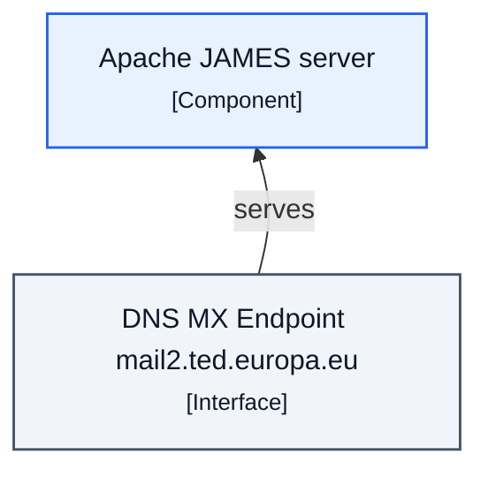

### Building Block Profile

| Attribute | Value |
| --- | --- |
| Architectural role | Technology Interface |

### Dependencies and Interactions

| Source | Relationship | Target | Context |
| --- | --- | --- | --- |
| DNS MX Endpoint mail2.ted.europa.eu | Serves | Apache JAMES server | Current state |

### 3.2.10 Domain Layer

#### Dependencies and Interfaces

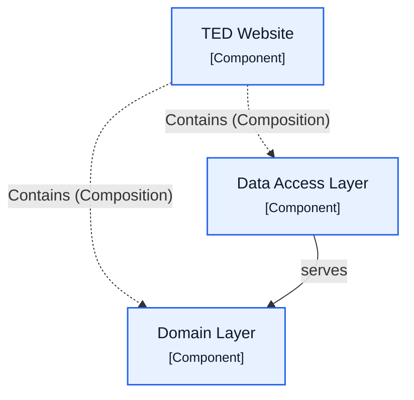

### Building Block Profile

| Attribute | Value |
| --- | --- |
| Architectural role | Application Component |
| Description | Contains data, common rules and logic of the model: business or technical, persistent or transient. |

### Dependencies and Interactions

| Source | Relationship | Target | Context |
| --- | --- | --- | --- |
| Data Access Layer | Serves | Domain Layer | Current state |
| TED Website | Contains | Domain Layer | Current state |

### 3.2.11 Email analysis and notifications

#### Dependencies and Interfaces

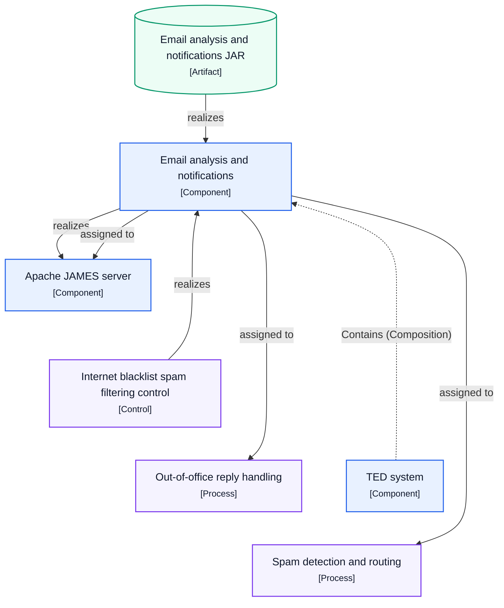

### Building Block Profile

| Attribute | Value |
| --- | --- |
| Architectural role | Application Component |
| Responsibility | In charge of the analysis of received emails and the mailing of notifications and reminders to Contracting Authorities or web site users.; Responsible for the mailing of notifications and reminders to Contracting Authorities or web site users and received emails analysis.; Responsible for the mailing of notifications and received emails analysis. |

### Dependencies and Interactions

| Source | Relationship | Target | Context |
| --- | --- | --- | --- |
| Email analysis and notifications | Assigned to | Apache JAMES server | Current state |
| Email analysis and notifications | Assigned to | Out-of-office reply handling | Current state |
| Email analysis and notifications | Assigned to | Spam detection and routing | Current state |
| Email analysis and notifications | Realizes | Apache JAMES server | Current state |
| Email analysis and notifications JAR | Realizes | Email analysis and notifications | Current state |
| Internet blacklist spam filtering control | Realizes | Email analysis and notifications | Current state |
| TED system | Contains | Email analysis and notifications | Current state |

### 3.2.12 HSQL

#### Dependencies and Interfaces

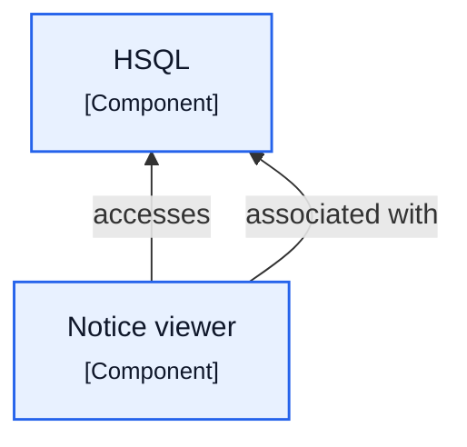

### Building Block Profile

| Attribute | Value |
| --- | --- |
| Architectural role | Application Component |

### Dependencies and Interactions

| Source | Relationship | Target | Context |
| --- | --- | --- | --- |
| Notice viewer | Accesses | HSQL | Current state |
| Notice viewer | Associated with | HSQL | Current state |

### 3.2.13 inotify

#### Dependencies and Interfaces

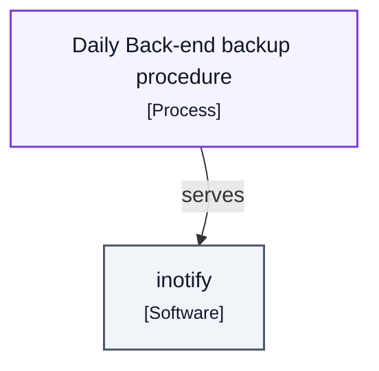

### Building Block Profile

| Attribute | Value |
| --- | --- |
| Architectural role | System Software |
| Purpose | file change notification system used to reduce the time of the file system backup and log modifications |

### Dependencies and Interactions

| Source | Relationship | Target | Context |
| --- | --- | --- | --- |
| Daily Back-end backup procedure | Serves | inotify | Current state |

### 3.2.14 JDBC Connector

#### Dependencies and Interfaces

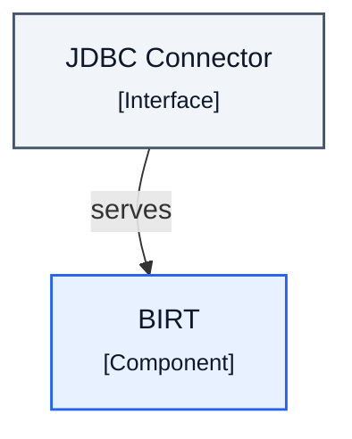

### Building Block Profile

| Attribute | Value |
| --- | --- |
| Architectural role | Technology Interface |
| Technology | JDBC |

### Dependencies and Interactions

| Source | Relationship | Target | Context |
| --- | --- | --- | --- |
| JDBC Connector | Serves | BIRT | Current state |

### 3.2.15 License Holder environment

#### Dependencies and Interfaces

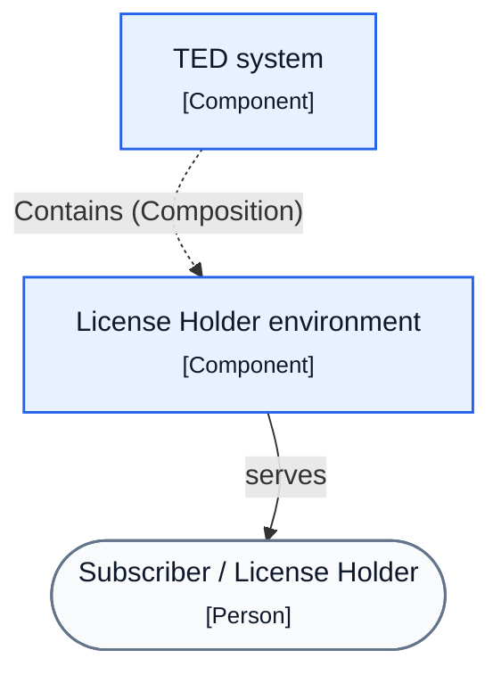

### Building Block Profile

| Attribute | Value |
| --- | --- |
| Architectural role | Application Component |
| Description | The environment available for subscriber having a privileged access to the contents of the TED. |
| Purpose | Environment available for subscribers having privileged access to the contents of TED, limited as the ProFTPD server and its modules.; The environment available for subscriber having a privileged access to the contents of the TED. |

### Dependencies and Interactions

| Source | Relationship | Target | Context |
| --- | --- | --- | --- |
| License Holder environment | Serves | Subscriber / License Holder | Current state |
| TED system | Contains | License Holder environment | Current state |

### 3.2.16 Main Loadbalancer

#### Dependencies and Interfaces

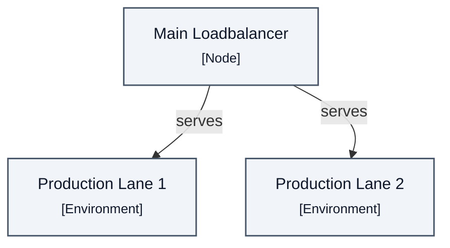

### Building Block Profile

| Attribute | Value |
| --- | --- |
| Architectural role | Node |
| Purpose | routing any requests to a production lane |
| Responsibility | Routing any requests to a production lane and dispatching incoming requests based on the load of each server; In charge of routing any requests to a production lane. |

### Dependencies and Interactions

| Source | Relationship | Target | Context |
| --- | --- | --- | --- |
| Main Loadbalancer | Serves | Production Lane 1 | Current state · Current state · Production environment |
| Main Loadbalancer | Serves | Production Lane 2 | Current state · Current state · Production environment |

### 3.2.17 mkisofs tool

#### Dependencies and Interfaces

```mermaid
flowchart TB
    n1["mkisofs tool<br/><small>[Software]</small>"]
    n2["TED Workflow Application<br/><small>[Component]</small>"]
    n3["Workflow engine<br/><small>[Component]</small>"]
    classDef application fill:#E8F1FF,stroke:#2563EB,color:#0F172A,stroke-width:1.5px
    class n2,n3 application
    classDef technology fill:#F1F5F9,stroke:#475569,color:#0F172A,stroke-width:1.5px
    class n1 technology
    n1 ~~~ n2
    n1 ~~~ n3
    n2 -->|"associated with"| n1
    n3 -->|"serves"| n1
    n2 -->|"realizes"| n1
```

### Building Block Profile

| Attribute | Value |
| --- | --- |
| Architectural role | System Software |

### Dependencies and Interactions

| Source | Relationship | Target | Context |
| --- | --- | --- | --- |
| TED Workflow Application | Associated with | mkisofs tool | Current state |
| TED Workflow Application | Realizes | mkisofs tool | Current state |
| Workflow engine | Serves | mkisofs tool | Current state |

### 3.2.18 mod_sql

#### Dependencies and Interfaces

```mermaid
flowchart TB
    n1["mod_sql<br/><small>[Component]</small>"]
    n2["ProFTPD Server<br/><small>[Component]</small>"]
    classDef application fill:#E8F1FF,stroke:#2563EB,color:#0F172A,stroke-width:1.5px
    class n1,n2 application
    n1 ~~~ n2
    n2 -.->|"Contains (Composition)"| n1
```

### Building Block Profile

| Attribute | Value |
| --- | --- |
| Architectural role | Application Component |

### Dependencies and Interactions

| Source | Relationship | Target | Context |
| --- | --- | --- | --- |
| ProFTPD Server | Contains | mod_sql | — |

### 3.2.19 Monitoring data-warehouse

#### Dependencies and Interfaces

```mermaid
flowchart TB
    n6["Webalizer Website Traffic Analysis<br/><small>[Function]</small>"]
    n1(["Administrator<br/><small>[Person]</small>"])
    n3[("Data-warehouse Web Archive (WAR)<br/><small>[Artifact]</small>")]
    n4["Monitoring data-warehouse<br/><small>[Component]</small>"]
    n2["Cacti Network Graphing and Active Session Monitoring<br/><small>[Function]</small>"]
    n5["TED system<br/><small>[Component]</small>"]
    classDef application fill:#E8F1FF,stroke:#2563EB,color:#0F172A,stroke-width:1.5px
    class n4,n5 application
    classDef behavior fill:#F5F3FF,stroke:#7C3AED,color:#0F172A,stroke-width:1.5px
    class n6,n2 behavior
    classDef data fill:#ECFDF5,stroke:#059669,color:#0F172A,stroke-width:1.5px
    class n3 data
    classDef other fill:#F8FAFC,stroke:#64748B,color:#0F172A,stroke-width:1.5px
    class n1 other
    n1 ~~~ n2 ~~~ n3
    n4 ~~~ n5 ~~~ n6
    n1 ~~~ n4
    n5 -.->|"Contains (Composition)"| n4
    n3 -->|"realizes"| n4
    n4 -->|"realizes"| n2
    n4 -->|"serves"| n1
    n4 -->|"realizes"| n6
```

### Building Block Profile

| Attribute | Value |
| --- | --- |
| Architectural role | Application Component |
| Description | This module contains the data-warehouse user interface. |
| Purpose | Contains the data-warehouse user interface to make data warehouse information available for administrators using web reports. |

### Dependencies and Interactions

| Source | Relationship | Target | Context |
| --- | --- | --- | --- |
| Data-warehouse Web Archive (WAR) | Realizes | Monitoring data-warehouse | Current state |
| Monitoring data-warehouse | Realizes | Cacti Network Graphing and Active Session Monitoring | Current state |
| Monitoring data-warehouse | Realizes | Webalizer Website Traffic Analysis | Current state |
| Monitoring data-warehouse | Serves | Administrator | Current state |
| TED system | Contains | Monitoring data-warehouse | Current state |

### 3.2.20 MySQL cluster manager node

#### Dependencies and Interfaces

```mermaid
flowchart TB
    subgraph g1["MySQL cluster manager node boundary"]
        direction TB
        n1["MySQL cluster manager node<br/><small>[Node]</small>"]
        n2["Network File System server<br/><small>[Node]</small>"]
    end
    classDef technology fill:#F1F5F9,stroke:#475569,color:#0F172A,stroke-width:1.5px
    class n1,n2 technology
    style g1 fill:#EFF6FF,stroke:#2563EB,stroke-width:1.5px
    n1 ~~~ n2
    n1 -.->|"Contains (Composition)"| n2
    n1 -->|"assigned to"| n2
```

### Building Block Profile

| Attribute | Value |
| --- | --- |
| Architectural role | Node |

### Dependencies and Interactions

| Source | Relationship | Target | Context |
| --- | --- | --- | --- |
| MySQL cluster manager node | Assigned to | Network File System server | Current state |
| MySQL cluster manager node | Contains | Network File System server | Current state |

### 3.2.21 MySQL Database

#### Dependencies and Interfaces

```mermaid
flowchart TB
    n3["TED Website<br/><small>[Component]</small>"]
    n4["TED Workflow Application<br/><small>[Component]</small>"]
    n2["MySQL Database<br/><small>[Component]</small>"]
    n1["Data Access Layer<br/><small>[Component]</small>"]
    n5["Workflow engine<br/><small>[Component]</small>"]
    classDef application fill:#E8F1FF,stroke:#2563EB,color:#0F172A,stroke-width:1.5px
    class n3,n4,n2,n1,n5 application
    n1 ~~~ n2 ~~~ n3
    n4 ~~~ n5
    n1 ~~~ n4
    n3 -->|"serves"| n2
    n1 -->|"accesses"| n2
    n4 -->|"associated with"| n2
    n5 -->|"serves"| n2
    n3 -.->|"Contains (Composition)"| n1
    n3 -->|"associated with"| n2
```

### Building Block Profile

| Attribute | Value |
| --- | --- |
| Architectural role | Application Component |

### Dependencies and Interactions

| Source | Relationship | Target | Context |
| --- | --- | --- | --- |
| Data Access Layer | Accesses | MySQL Database | Current state |
| TED Website | Associated with | MySQL Database | Current state |
| TED Website | Serves | MySQL Database | Current state |
| TED Workflow Application | Associated with | MySQL Database | Current state |
| Workflow engine | Serves | MySQL Database | Current state |

### 3.2.22 Network File System (NFS-A)

#### Dependencies and Interfaces

```mermaid
flowchart TB
    n2["Network File System (NFS-A)<br/><small>[Node]</small>"]
    n1[("Content Library<br/><small>[Data]</small>")]
    n3["Production Lane 1<br/><small>[Environment]</small>"]
    classDef data fill:#ECFDF5,stroke:#059669,color:#0F172A,stroke-width:1.5px
    class n1 data
    classDef technology fill:#F1F5F9,stroke:#475569,color:#0F172A,stroke-width:1.5px
    class n2,n3 technology
    n1 ~~~ n2
    n1 ~~~ n3
    n3 -.->|"Contains (Composition)"| n2
    n2 -->|"assigned to"| n1
    n1 -->|"assigned to"| n2
```

### Building Block Profile

| Attribute | Value |
| --- | --- |
| Architectural role | Node |

### Dependencies and Interactions

| Source | Relationship | Target | Context |
| --- | --- | --- | --- |
| Content Library | Assigned to | Network File System (NFS-A) | Current state |
| Network File System (NFS-A) | Assigned to | Content Library | Current state |
| Production Lane 1 | Contains | Network File System (NFS-A) | Current state |
| Production Lane 1 | Contains | Network File System (NFS-A) | Current state |

### 3.2.23 Network File System server

#### Dependencies and Interfaces

```mermaid
flowchart TB
    n1["MySQL cluster manager node<br/><small>[Node]</small>"]
    n2["Network File System server<br/><small>[Node]</small>"]
    classDef technology fill:#F1F5F9,stroke:#475569,color:#0F172A,stroke-width:1.5px
    class n1,n2 technology
    n1 ~~~ n2
    n1 -.->|"Contains (Composition)"| n2
    n1 -->|"assigned to"| n2
```

### Building Block Profile

| Attribute | Value |
| --- | --- |
| Architectural role | Node |
| Purpose | Mainly in charge of hosting the content library using RAID level 5 to provide high fault tolerance and performance. |
| Responsibility | hosting the content library and holding the TED backup |
| Technology | RAID level 5 |

### Dependencies and Interactions

| Source | Relationship | Target | Context |
| --- | --- | --- | --- |
| MySQL cluster manager node | Assigned to | Network File System server | Current state |
| MySQL cluster manager node | Contains | Network File System server | Current state |

### 3.2.24 Notice viewer

#### Dependencies and Interfaces

```mermaid
flowchart TB
    n6["Spring Integration<br/><small>[Component]</small>"]
    n5[("Notice viewer tar.gz archive<br/><small>[Artifact]</small>")]
    n1["Apache FOP<br/><small>[Component]</small>"]
    n2[("Embedded HSQL database<br/><small>[Data]</small>")]
    n3["HSQL<br/><small>[Component]</small>"]
    n4["Notice viewer<br/><small>[Component]</small>"]
    n8["XML Schema and UTF-8 Notice Validation<br/><small>[Control]</small>"]
    n7["TED system<br/><small>[Component]</small>"]
    classDef application fill:#E8F1FF,stroke:#2563EB,color:#0F172A,stroke-width:1.5px
    class n6,n1,n3,n4,n7 application
    classDef behavior fill:#F5F3FF,stroke:#7C3AED,color:#0F172A,stroke-width:1.5px
    class n8 behavior
    classDef data fill:#ECFDF5,stroke:#059669,color:#0F172A,stroke-width:1.5px
    class n5,n2 data
    n1 ~~~ n2 ~~~ n3
    n4 ~~~ n5 ~~~ n6
    n7 ~~~ n8
    n1 ~~~ n4
    n4 ~~~ n7
    n4 -->|"accesses"| n3
    n4 -->|"associated with"| n1
    n8 -->|"realizes"| n4
    n4 -->|"realizes"| n1
    n4 -->|"accesses"| n2
    n4 -->|"associated with"| n3
    n4 -->|"realizes"| n8
    n5 -->|"realizes"| n4
    n4 -->|"associated with"| n6
    n7 -.->|"Contains (Composition)"| n4
```

### Building Block Profile

| Attribute | Value |
| --- | --- |
| Architectural role | Application Component |
| Description | A simple stand alone Java application that executes the transformations on the given XML files. |
| Purpose | A stand alone Java application responsible for the transformation of XML files in a well formatted version suited to be directly displayed. |
| Responsibility | Responsible for the transformation of XML files into HTML and PDF output formats without UI or persistence capabilities.; Responsible for the transformation of XML files in a well formatted version suited to be directly displayed.; A stand alone Java application that executes the transformations on the given XML files. |
| Runtime | Java |

### Dependencies and Interactions

| Source | Relationship | Target | Context |
| --- | --- | --- | --- |
| Notice viewer | Accesses | Embedded HSQL database | Current state |
| Notice viewer | Accesses | HSQL | Current state |
| Notice viewer | Associated with | Apache FOP | Current state |
| Notice viewer | Associated with | HSQL | Current state |
| Notice viewer | Associated with | Spring Integration | Current state |
| Notice viewer | Realizes | Apache FOP | Current state |
| Notice viewer | Realizes | XML Schema and UTF-8 Notice Validation | — |
| Notice viewer tar.gz archive | Realizes | Notice viewer | Current state |
| TED system | Contains | Notice viewer | Current state |
| XML Schema and UTF-8 Notice Validation | Realizes | Notice viewer | Current state |

### 3.2.25 PDF Time Stamping tool

#### Dependencies and Interfaces

```mermaid
flowchart TB
    n2["PDF Time Stamping tool<br/><small>[Component]</small>"]
    n1["Degraded mode flag for PDF time-stamping<br/><small>[Control]</small>"]
    classDef application fill:#E8F1FF,stroke:#2563EB,color:#0F172A,stroke-width:1.5px
    class n2 application
    classDef behavior fill:#F5F3FF,stroke:#7C3AED,color:#0F172A,stroke-width:1.5px
    class n1 behavior
    n1 ~~~ n2
    n1 -->|"realizes"| n2
```

### Building Block Profile

| Attribute | Value |
| --- | --- |
| Architectural role | Application Component |

### Dependencies and Interactions

| Source | Relationship | Target | Context |
| --- | --- | --- | --- |
| Degraded mode flag for PDF time-stamping | Realizes | PDF Time Stamping tool | Current state |

### 3.2.26 Physical backend server A1

#### Dependencies and Interfaces

```mermaid
flowchart TB
    n4["Tomcat Application Server<br/><small>[Software]</small>"]
    n3["TED Website<br/><small>[Component]</small>"]
    n2["Production Lane 1<br/><small>[Environment]</small>"]
    n1["Physical backend server A1<br/><small>[Node]</small>"]
    classDef application fill:#E8F1FF,stroke:#2563EB,color:#0F172A,stroke-width:1.5px
    class n3 application
    classDef technology fill:#F1F5F9,stroke:#475569,color:#0F172A,stroke-width:1.5px
    class n4,n2,n1 technology
    n1 ~~~ n2
    n3 ~~~ n4
    n1 ~~~ n3
    n4 -->|"assigned to"| n1
    n2 -.->|"Contains (Composition)"| n1
    n3 -->|"assigned to"| n1
```

### Building Block Profile

| Attribute | Value |
| --- | --- |
| Architectural role | Node |

### Dependencies and Interactions

| Source | Relationship | Target | Context |
| --- | --- | --- | --- |
| Physical backend server A1 | Contains | Production Lane 1 | Current state |
| Production Lane 1 | Contains | Physical backend server A1 | Current state |
| Production Lane 1 | Contains | Physical backend server A1 | Current state |
| TED Website | Assigned to | Physical backend server A1 | Current state |
| Tomcat Application Server | Assigned to | Physical backend server A1 | Current state |

### 3.2.27 Physical backend server A2

#### Dependencies and Interfaces

```mermaid
flowchart TB
    n4["Tomcat Application Server<br/><small>[Software]</small>"]
    n1["Physical backend server A2<br/><small>[Node]</small>"]
    n3["TED Website<br/><small>[Component]</small>"]
    n2["Production Lane 1<br/><small>[Environment]</small>"]
    classDef application fill:#E8F1FF,stroke:#2563EB,color:#0F172A,stroke-width:1.5px
    class n3 application
    classDef technology fill:#F1F5F9,stroke:#475569,color:#0F172A,stroke-width:1.5px
    class n4,n1,n2 technology
    n1 ~~~ n2
    n3 ~~~ n4
    n1 ~~~ n3
    n4 -->|"assigned to"| n1
    n2 -.->|"Contains (Composition)"| n1
    n3 -->|"assigned to"| n1
```

### Building Block Profile

| Attribute | Value |
| --- | --- |
| Architectural role | Node |

### Dependencies and Interactions

| Source | Relationship | Target | Context |
| --- | --- | --- | --- |
| Physical backend server A2 | Contains | Production Lane 1 | Current state |
| Production Lane 1 | Contains | Physical backend server A2 | Current state |
| Production Lane 1 | Contains | Physical backend server A2 | Current state |
| TED Website | Assigned to | Physical backend server A2 | Current state |
| Tomcat Application Server | Assigned to | Physical backend server A2 | Current state |

### 3.2.28 Physical frontend server

#### Dependencies and Interfaces

```mermaid
flowchart TB
    n1["Apache JAMES server<br/><small>[Component]</small>"]
    n3["Physical frontend server<br/><small>[Node]</small>"]
    n6[("TED_DATAWAREHOUSE database<br/><small>[Data]</small>")]
    n5["ProFTPD Server<br/><small>[Component]</small>"]
    n4["Production Lane 1<br/><small>[Environment]</small>"]
    n2["Apache Web Server<br/><small>[Software]</small>"]
    classDef application fill:#E8F1FF,stroke:#2563EB,color:#0F172A,stroke-width:1.5px
    class n1,n5 application
    classDef data fill:#ECFDF5,stroke:#059669,color:#0F172A,stroke-width:1.5px
    class n6 data
    classDef technology fill:#F1F5F9,stroke:#475569,color:#0F172A,stroke-width:1.5px
    class n3,n4,n2 technology
    n1 ~~~ n2 ~~~ n3
    n4 ~~~ n5 ~~~ n6
    n1 ~~~ n4
    n3 -->|"assigned to"| n2
    n4 -.->|"Contains (Composition)"| n3
    n6 -->|"assigned to"| n3
    n3 -->|"assigned to"| n1
    n1 -->|"assigned to"| n3
    n5 -->|"assigned to"| n3
    n2 -->|"assigned to"| n3
    n3 -->|"assigned to"| n5
    n3 -->|"assigned to"| n6
```

### Building Block Profile

| Attribute | Value |
| --- | --- |
| Architectural role | Node |

### Dependencies and Interactions

| Source | Relationship | Target | Context |
| --- | --- | --- | --- |
| Apache JAMES server | Assigned to | Physical frontend server | Current state |
| Apache Web Server | Assigned to | Physical frontend server | Current state |
| Physical frontend server | Assigned to | Apache JAMES server | Current state |
| Physical frontend server | Assigned to | Apache Web Server | Current state |
| Physical frontend server | Assigned to | ProFTPD Server | Current state |
| Physical frontend server | Assigned to | TED_DATAWAREHOUSE database | Current state |
| Physical frontend server | Contains | Production Lane 1 | Current state |
| Production Lane 1 | Contains | Physical frontend server | Current state |
| Production Lane 1 | Contains | Physical frontend server | Current state |
| ProFTPD Server | Assigned to | Physical frontend server | Current state |
| TED_DATAWAREHOUSE database | Assigned to | Physical frontend server | Current state |

### 3.2.29 ProFTPD Server

#### Dependencies and Interfaces

```mermaid
flowchart TB
    subgraph g1["ProFTPD Server boundary"]
        direction TB
        n5["ProFTPD Server<br/><small>[Component]</small>"]
        n2["mod_sql<br/><small>[Component]</small>"]
    end
    n4["ProFTPD MySQL Authentication Control<br/><small>[Control]</small>"]
    n1["License Holder Usage Statistics Logging<br/><small>[Control]</small>"]
    n3["Physical frontend server<br/><small>[Node]</small>"]
    classDef application fill:#E8F1FF,stroke:#2563EB,color:#0F172A,stroke-width:1.5px
    class n2,n5 application
    classDef behavior fill:#F5F3FF,stroke:#7C3AED,color:#0F172A,stroke-width:1.5px
    class n4,n1 behavior
    classDef technology fill:#F1F5F9,stroke:#475569,color:#0F172A,stroke-width:1.5px
    class n3 technology
    style g1 fill:#EFF6FF,stroke:#2563EB,stroke-width:1.5px
    n1 ~~~ n2 ~~~ n3
    n4 ~~~ n5
    n1 ~~~ n4
    n5 -.->|"Contains (Composition)"| n2
    n5 -->|"realizes"| n4
    n4 -->|"realizes"| n5
    n5 -->|"serves"| n1
    n5 -->|"assigned to"| n3
    n3 -->|"assigned to"| n5
```

### Building Block Profile

| Attribute | Value |
| --- | --- |
| Architectural role | Application Component |

### Dependencies and Interactions

| Source | Relationship | Target | Context |
| --- | --- | --- | --- |
| Physical frontend server | Assigned to | ProFTPD Server | Current state |
| ProFTPD MySQL Authentication Control | Realizes | ProFTPD Server | Current state |
| ProFTPD Server | Assigned to | Physical frontend server | Current state |
| ProFTPD Server | Contains | mod_sql | — |
| ProFTPD Server | Realizes | ProFTPD MySQL Authentication Control | Current state |
| ProFTPD Server | Serves | License Holder Usage Statistics Logging | Current state |

### 3.2.30 Service Layer

#### Dependencies and Interfaces

```mermaid
flowchart TB
    n2["Service Layer<br/><small>[Component]</small>"]
    n4["TED Website<br/><small>[Component]</small>"]
    n5["Web Layer<br/><small>[Component]</small>"]
    n3["Spring declarative transaction management with DataSourceTransactionManager<br/><small>[Decision]</small>"]
    n1["Data Access Layer<br/><small>[Component]</small>"]
    classDef application fill:#E8F1FF,stroke:#2563EB,color:#0F172A,stroke-width:1.5px
    class n2,n4,n5,n1 application
    classDef motivation fill:#FFF1F2,stroke:#BE123C,color:#0F172A,stroke-width:1.5px
    class n3 motivation
    n1 ~~~ n2 ~~~ n3
    n4 ~~~ n5
    n1 ~~~ n4
    n1 -->|"serves"| n2
    n3 -->|"realizes"| n2
    n2 -->|"serves"| n1
    n5 -->|"serves"| n2
    n4 -.->|"Contains (Composition)"| n5
    n2 -->|"serves"| n5
    n2 -->|"accesses"| n1
    n4 -.->|"Contains (Composition)"| n2
    n4 -.->|"Contains (Composition)"| n1
```

### Building Block Profile

| Attribute | Value |
| --- | --- |
| Architectural role | Application Component |
| Purpose | Contains the business logic structured in high-level methods oriented around use cases that may result in CRUD operations on entities of the Domain Layer. |
| Responsibility | Contains the business logic structured in high-level methods oriented around use cases that may result in CRUD operations realized by accessing the Data Access Layer. |

### Dependencies and Interactions

| Source | Relationship | Target | Context |
| --- | --- | --- | --- |
| Data Access Layer | Serves | Service Layer | Current state |
| Service Layer | Accesses | Data Access Layer | Current state |
| Service Layer | Serves | Data Access Layer | Current state |
| Service Layer | Serves | Web Layer | Current state |
| Spring declarative transaction management with DataSourceTransactionManager | Realizes | Service Layer | Current state |
| TED Website | Contains | Service Layer | Current state |
| Web Layer | Serves | Service Layer | Current state |

### 3.2.31 Spring Integration

#### Dependencies and Interfaces

```mermaid
flowchart TB
    n2["Spring Integration<br/><small>[Component]</small>"]
    n3["TED Website<br/><small>[Component]</small>"]
    n4["TED Workflow Application<br/><small>[Component]</small>"]
    n1["Notice viewer<br/><small>[Component]</small>"]
    classDef application fill:#E8F1FF,stroke:#2563EB,color:#0F172A,stroke-width:1.5px
    class n2,n3,n4,n1 application
    n1 ~~~ n2
    n3 ~~~ n4
    n1 ~~~ n3
    n4 -->|"associated with"| n2
    n3 -->|"associated with"| n2
    n1 -->|"associated with"| n2
```

### Building Block Profile

| Attribute | Value |
| --- | --- |
| Architectural role | Application Component |

### Dependencies and Interactions

| Source | Relationship | Target | Context |
| --- | --- | --- | --- |
| Notice viewer | Associated with | Spring Integration | Current state |
| TED Website | Associated with | Spring Integration | Current state |
| TED Workflow Application | Associated with | Spring Integration | Current state |

### 3.2.32 Spring MVC

#### Dependencies and Interfaces

```mermaid
flowchart TB
    n1["Spring MVC<br/><small>[Component]</small>"]
    n2["TED Website<br/><small>[Component]</small>"]
    n3["Web Layer<br/><small>[Component]</small>"]
    classDef application fill:#E8F1FF,stroke:#2563EB,color:#0F172A,stroke-width:1.5px
    class n1,n2,n3 application
    n1 ~~~ n2
    n1 ~~~ n3
    n3 -->|"realizes"| n1
    n2 -->|"associated with"| n1
    n2 -.->|"Contains (Composition)"| n3
```

### Building Block Profile

| Attribute | Value |
| --- | --- |
| Architectural role | Application Component |

### Dependencies and Interactions

| Source | Relationship | Target | Context |
| --- | --- | --- | --- |
| TED Website | Associated with | Spring MVC | Current state |
| Web Layer | Realizes | Spring MVC | Current state |

### 3.2.33 Spring Security

#### Dependencies and Interfaces

```mermaid
flowchart TB
    n1["Spring Security<br/><small>[Component]</small>"]
    n3["TED Website<br/><small>[Component]</small>"]
    n4["Web Layer<br/><small>[Component]</small>"]
    n2["Spring Security Filter Chain Access Control<br/><small>[Control]</small>"]
    classDef application fill:#E8F1FF,stroke:#2563EB,color:#0F172A,stroke-width:1.5px
    class n1,n3,n4 application
    classDef behavior fill:#F5F3FF,stroke:#7C3AED,color:#0F172A,stroke-width:1.5px
    class n2 behavior
    n1 ~~~ n2
    n3 ~~~ n4
    n1 ~~~ n3
    n3 -->|"associated with"| n1
    n4 -->|"realizes"| n1
    n3 -.->|"Contains (Composition)"| n4
    n2 -->|"realizes"| n1
    n1 -->|"realizes"| n2
```

### Building Block Profile

| Attribute | Value |
| --- | --- |
| Architectural role | Application Component |

### Dependencies and Interactions

| Source | Relationship | Target | Context |
| --- | --- | --- | --- |
| Spring Security | Realizes | Spring Security Filter Chain Access Control | Current state |
| Spring Security Filter Chain Access Control | Realizes | Spring Security | Current state |
| TED Website | Associated with | Spring Security | Current state |
| Web Layer | Realizes | Spring Security | Current state |

### 3.2.34 TED system

#### Dependencies and Interfaces

```mermaid
flowchart TB
    subgraph g1["TED system boundary"]
        direction TB
        n6["TED system<br/><small>[Component]</small>"]
        n2["Email analysis and notifications<br/><small>[Component]</small>"]
        n7["TED Website<br/><small>[Component]</small>"]
        n5["Notice viewer<br/><small>[Component]</small>"]
        n4["Monitoring data-warehouse<br/><small>[Component]</small>"]
        n8["Workflow engine<br/><small>[Component]</small>"]
        n3["License Holder environment<br/><small>[Component]</small>"]
    end
    n1(["Administrator<br/><small>[Person]</small>"])
    classDef application fill:#E8F1FF,stroke:#2563EB,color:#0F172A,stroke-width:1.5px
    class n2,n7,n5,n4,n6,n8,n3 application
    classDef other fill:#F8FAFC,stroke:#64748B,color:#0F172A,stroke-width:1.5px
    class n1 other
    style g1 fill:#EFF6FF,stroke:#2563EB,stroke-width:1.5px
    n1 ~~~ n2 ~~~ n3
    n4 ~~~ n5 ~~~ n6
    n7 ~~~ n8
    n1 ~~~ n4
    n4 ~~~ n7
    n6 -.->|"Contains (Composition)"| n4
    n6 -->|"serves"| n1
    n6 -.->|"Contains (Composition)"| n8
    n6 -.->|"Contains (Composition)"| n2
    n6 -.->|"Contains (Composition)"| n7
    n6 -.->|"Contains (Composition)"| n5
    n6 -.->|"Contains (Composition)"| n3
```

### Building Block Profile

| Attribute | Value |
| --- | --- |
| Architectural role | Application Component |
| Description | The TED system architecture is based on the J2EE application architecture decomposed into tiers and layers. |
| Purpose | Production and dissemination of the Supplement to the Official Journal of the European Union: TED website, OJS DVD-ROM and related offline and online media |

### Dependencies and Interactions

| Source | Relationship | Target | Context |
| --- | --- | --- | --- |
| TED system | Contains | Email analysis and notifications | Current state |
| TED system | Contains | License Holder environment | Current state |
| TED system | Contains | Monitoring data-warehouse | Current state |
| TED system | Contains | Notice viewer | Current state |
| TED system | Contains | TED Website | Current state |
| TED system | Contains | Workflow engine | Current state |
| TED system | Serves | Administrator | Current state |
| TED system | Serves | Contracting Authorities | Current state |
| TED system | Serves | Subscriber / License Holder | Current state |
| TED system | Serves | Web site users | Current state |

### 3.2.35 TED Website

#### Dependencies and Interfaces

```mermaid
flowchart TB
    subgraph g1["TED Website boundary"]
        direction TB
        n6["TED Website<br/><small>[Component]</small>"]
        n4["Service Layer<br/><small>[Component]</small>"]
        n8["Web Layer<br/><small>[Component]</small>"]
        n2["Data Access Layer<br/><small>[Component]</small>"]
    end
    n7["Tomcat Application Server<br/><small>[Software]</small>"]
    n1["Apache Lucene<br/><small>[Component]</small>"]
    n3["MySQL Database<br/><small>[Component]</small>"]
    n5["TED system<br/><small>[Component]</small>"]
    classDef application fill:#E8F1FF,stroke:#2563EB,color:#0F172A,stroke-width:1.5px
    class n1,n4,n6,n8,n3,n2,n5 application
    classDef technology fill:#F1F5F9,stroke:#475569,color:#0F172A,stroke-width:1.5px
    class n7 technology
    style g1 fill:#EFF6FF,stroke:#2563EB,stroke-width:1.5px
    n1 ~~~ n2 ~~~ n3
    n4 ~~~ n5 ~~~ n6
    n7 ~~~ n8
    n1 ~~~ n4
    n4 ~~~ n7
    n6 -->|"realizes"| n1
    n6 -->|"associated with"| n1
    n6 -->|"serves"| n3
    n7 -->|"serves"| n6
    n5 -.->|"Contains (Composition)"| n6
    n6 -.->|"Contains (Composition)"| n8
    n6 -->|"serves"| n1
    n6 -.->|"Contains (Composition)"| n4
    n6 -->|"assigned to"| n7
    n6 -.->|"Contains (Composition)"| n2
    n6 -->|"associated with"| n3
```

### Building Block Profile

| Attribute | Value |
| --- | --- |
| Architectural role | Application Component |
| Description | This module represents all the components needed for the public web interface of the TED system. |
| Purpose | Represents all the components needed for the public web interface of the TED system. |
| Technology | J2EE |
| Framework | Spring MVC |

### Dependencies and Interactions

| Source | Relationship | Target | Context |
| --- | --- | --- | --- |
| TED system | Contains | TED Website | Current state |
| TED Website | Assigned to | Physical backend server A1 | Current state |
| TED Website | Assigned to | Physical backend server A2 | Current state |
| TED Website | Assigned to | Tomcat Application Server | Current state |
| TED Website | Associated with | Apache Lucene | Current state |
| TED Website | Associated with | MySQL Database | Current state |
| TED Website | Associated with | Spring Integration | Current state |
| TED Website | Associated with | Spring MVC | Current state |
| TED Website | Associated with | Spring Security | Current state |
| TED Website | Contains | Data Access Layer | Current state |
| TED Website | Contains | Domain Layer | Current state |
| TED Website | Contains | Service Layer | Current state |
| TED Website | Contains | Web Layer | Current state |
| TED Website | Realizes | Apache Lucene | Current state |
| TED Website | Serves | Apache Lucene | Current state |
| TED Website | Serves | MySQL Database | Current state |
| TED Website | Serves | Web site users | Current state |
| TED website Web Archive (WAR) | Realizes | TED Website | Current state |
| Tomcat Application Server | Serves | TED Website | Current state |

### 3.2.36 TED Workflow Application

#### Dependencies and Interfaces

```mermaid
flowchart TB
    n5["Spring Integration<br/><small>[Component]</small>"]
    n3["mkisofs tool<br/><small>[Software]</small>"]
    n1["Apache FOP<br/><small>[Component]</small>"]
    n6["TED Workflow Application<br/><small>[Component]</small>"]
    n4["MySQL Database<br/><small>[Component]</small>"]
    n2[("iText<br/><small>[Artifact]</small>")]
    n7["Workflow engine<br/><small>[Component]</small>"]
    classDef application fill:#E8F1FF,stroke:#2563EB,color:#0F172A,stroke-width:1.5px
    class n5,n1,n6,n4,n7 application
    classDef data fill:#ECFDF5,stroke:#059669,color:#0F172A,stroke-width:1.5px
    class n2 data
    classDef technology fill:#F1F5F9,stroke:#475569,color:#0F172A,stroke-width:1.5px
    class n3 technology
    n1 ~~~ n2 ~~~ n3
    n4 ~~~ n5 ~~~ n6
    n1 ~~~ n4
    n4 ~~~ n7
    n6 -->|"serves"| n7
    n6 -->|"associated with"| n2
    n6 -->|"associated with"| n3
    n6 -->|"associated with"| n5
    n6 -->|"realizes"| n2
    n6 -->|"realizes"| n1
    n6 -->|"associated with"| n4
    n6 -->|"associated with"| n1
    n6 -->|"realizes"| n3
```

### Building Block Profile

| Attribute | Value |
| --- | --- |
| Architectural role | Application Component |

### Dependencies and Interactions

| Source | Relationship | Target | Context |
| --- | --- | --- | --- |
| TED Workflow Application | Associated with | Apache FOP | Current state |
| TED Workflow Application | Associated with | iText | Current state |
| TED Workflow Application | Associated with | mkisofs tool | Current state |
| TED Workflow Application | Associated with | MySQL Database | Current state |
| TED Workflow Application | Associated with | Spring Integration | Current state |
| TED Workflow Application | Realizes | Apache FOP | Current state |
| TED Workflow Application | Realizes | iText | Current state |
| TED Workflow Application | Realizes | mkisofs tool | Current state |
| TED Workflow Application | Serves | Workflow engine | Current state |

### 3.2.37 Tomcat Application Server

#### Dependencies and Interfaces

```mermaid
flowchart TB
    n5["Tomcat Application Server<br/><small>[Software]</small>"]
    n3["Physical backend server A2<br/><small>[Node]</small>"]
    n4["TED Website<br/><small>[Component]</small>"]
    n2["Physical backend server A1<br/><small>[Node]</small>"]
    n1["Apache Web Server<br/><small>[Software]</small>"]
    classDef application fill:#E8F1FF,stroke:#2563EB,color:#0F172A,stroke-width:1.5px
    class n4 application
    classDef technology fill:#F1F5F9,stroke:#475569,color:#0F172A,stroke-width:1.5px
    class n5,n3,n2,n1 technology
    n1 ~~~ n2 ~~~ n3
    n4 ~~~ n5
    n1 ~~~ n4
    n5 -->|"assigned to"| n3
    n5 -->|"assigned to"| n2
    n5 -->|"serves"| n4
    n1 -->|"serves"| n5
    n4 -->|"assigned to"| n5
```

### Building Block Profile

| Attribute | Value |
| --- | --- |
| Architectural role | System Software |

### Dependencies and Interactions

| Source | Relationship | Target | Context |
| --- | --- | --- | --- |
| Apache Web Server | Serves | Tomcat Application Server | Current state |
| TED Website | Assigned to | Tomcat Application Server | Current state |
| Tomcat Application Server | Assigned to | Physical backend server A1 | Current state |
| Tomcat Application Server | Assigned to | Physical backend server A2 | Current state |
| Tomcat Application Server | Serves | TED Website | Current state |

### 3.2.38 VMWare

#### Dependencies and Interfaces

```mermaid
flowchart TB
    n2["Windows XP<br/><small>[Software]</small>"]
    n1["VMWare<br/><small>[Software]</small>"]
    classDef technology fill:#F1F5F9,stroke:#475569,color:#0F172A,stroke-width:1.5px
    class n2,n1 technology
    n1 ~~~ n2
    n1 -->|"serves"| n2
```

### Building Block Profile

| Attribute | Value |
| --- | --- |
| Architectural role | System Software |

### Dependencies and Interactions

| Source | Relationship | Target | Context |
| --- | --- | --- | --- |
| VMWare | Serves | Windows XP | Current state |

### 3.2.39 Web Layer

#### Dependencies and Interfaces

```mermaid
flowchart TB
    n3["Spring Security<br/><small>[Component]</small>"]
    n2["Spring MVC<br/><small>[Component]</small>"]
    n1["Service Layer<br/><small>[Component]</small>"]
    n4["TED Website<br/><small>[Component]</small>"]
    n5["Web Layer<br/><small>[Component]</small>"]
    classDef application fill:#E8F1FF,stroke:#2563EB,color:#0F172A,stroke-width:1.5px
    class n3,n2,n1,n4,n5 application
    n1 ~~~ n2 ~~~ n3
    n4 ~~~ n5
    n1 ~~~ n4
    n5 -->|"realizes"| n2
    n5 -->|"realizes"| n3
    n5 -->|"serves"| n1
    n4 -.->|"Contains (Composition)"| n5
    n1 -->|"serves"| n5
    n4 -.->|"Contains (Composition)"| n1
```

### Building Block Profile

| Attribute | Value |
| --- | --- |
| Architectural role | Application Component |
| Purpose | Contains the logic to handle the interaction between the user and the system via a Web Browser. |
| Responsibility | Contains the logic to handle the interaction between the user and the system via a Web Browser, calling high-level functions in the Service Layer and manipulating domain models. |

### Dependencies and Interactions

| Source | Relationship | Target | Context |
| --- | --- | --- | --- |
| Service Layer | Serves | Web Layer | Current state |
| TED Website | Contains | Web Layer | Current state |
| Web Layer | Realizes | Spring MVC | Current state |
| Web Layer | Realizes | Spring Security | Current state |
| Web Layer | Serves | Service Layer | Current state |

### 3.2.40 Windows XP

#### Dependencies and Interfaces

```mermaid
flowchart TB
    n3["Windows XP<br/><small>[Software]</small>"]
    n1["Adobe Acrobat Professional<br/><small>[Component]</small>"]
    n2["VMWare<br/><small>[Software]</small>"]
    classDef application fill:#E8F1FF,stroke:#2563EB,color:#0F172A,stroke-width:1.5px
    class n1 application
    classDef technology fill:#F1F5F9,stroke:#475569,color:#0F172A,stroke-width:1.5px
    class n3,n2 technology
    n1 ~~~ n2
    n1 ~~~ n3
    n3 -->|"serves"| n1
    n2 -->|"serves"| n3
```

### Building Block Profile

| Attribute | Value |
| --- | --- |
| Architectural role | System Software |

### Dependencies and Interactions

| Source | Relationship | Target | Context |
| --- | --- | --- | --- |
| VMWare | Serves | Windows XP | Current state |
| Windows XP | Serves | Adobe Acrobat Professional | Current state |

### 3.2.41 Workflow engine

#### Dependencies and Interfaces

```mermaid
flowchart TB
    n4["mkisofs tool<br/><small>[Software]</small>"]
    n1["Apache FOP<br/><small>[Component]</small>"]
    n2[("Content Library<br/><small>[Data]</small>")]
    n7["TED Workflow Application<br/><small>[Component]</small>"]
    n5["MySQL Database<br/><small>[Component]</small>"]
    n6["TED system<br/><small>[Component]</small>"]
    n3["Daily OJS publication flow execution<br/><small>[Process]</small>"]
    n8["Workflow engine<br/><small>[Component]</small>"]
    classDef application fill:#E8F1FF,stroke:#2563EB,color:#0F172A,stroke-width:1.5px
    class n1,n7,n5,n6,n8 application
    classDef behavior fill:#F5F3FF,stroke:#7C3AED,color:#0F172A,stroke-width:1.5px
    class n3 behavior
    classDef data fill:#ECFDF5,stroke:#059669,color:#0F172A,stroke-width:1.5px
    class n2 data
    classDef technology fill:#F1F5F9,stroke:#475569,color:#0F172A,stroke-width:1.5px
    class n4 technology
    n1 ~~~ n2 ~~~ n3
    n4 ~~~ n5 ~~~ n6
    n7 ~~~ n8
    n1 ~~~ n4
    n4 ~~~ n7
    n7 -->|"serves"| n8
    n8 -->|"serves"| n1
    n8 -->|"accesses · write"| n2
    n8 -->|"serves"| n4
    n6 -.->|"Contains (Composition)"| n8
    n8 -->|"assigned to"| n3
    n8 -->|"serves"| n5
```

### Building Block Profile

| Attribute | Value |
| --- | --- |
| Architectural role | Application Component |
| Responsibility | Responsible for the processing of the document files received by the Publications Office and the creation of the file system used for the creation of the DVD images (daily, weekly and monthly images).; Responsible for the processing of document files received by the Publications Office, production management, indexing, creation of DVD images, and file transformations.; Responsible for the processing of document files received by the Publications Office, XML transformations, indexing, and the creation of DVD images. |

### Dependencies and Interactions

| Source | Relationship | Target | Context |
| --- | --- | --- | --- |
| TED system | Contains | Workflow engine | Current state |
| TED Workflow Application | Serves | Workflow engine | Current state |
| Workflow engine | Accesses | Content Library | Current state |
| Workflow engine | Assigned to | Daily OJS publication flow execution | Current state |
| Workflow engine | Assigned to | Validation and files transformation | Current state |
| Workflow engine | Flows to | TED_INTERNAL XML | Current state |
| Workflow engine | Serves | Apache FOP | Current state |
| Workflow engine | Serves | iText | Current state |
| Workflow engine | Serves | mkisofs tool | Current state |
| Workflow engine | Serves | MySQL Database | Current state |
| Workflow engine executable JAR | Realizes | Workflow engine | Current state |

## 3.3 Technology View

The web tier is structured around the Apache Web Server, which serves the Tomcat Application Server. In turn, Tomcat hosts the TED Website, built on Java 2 Platform Enterprise Edition (J2EE) technology and the Spring MVC framework. Core infrastructure software supporting the enterprise Java layer includes the Spring Framework alongside Spring JDBC.

Enterprise application services incorporate Spring Integration and Spring Security for connectivity and access control, while search and viewing capabilities rely on Java runtimes within Apache Lucene and the Notice viewer. Relational data management spans MySQL Cluster utilizing NDBCLUSTER storage technology alongside the HSQL application component. The underlying file storage utilizes a Network File System server configured with RAID level 5.

Virtualization and client-side processing are provided through VMWare, which serves a Windows XP environment that runs the Adobe Acrobat Professional application component. Document generation and reporting capabilities are supplemented by Business Intelligence and Reporting Tools (BIRT) and the iText artifact. Additional specialized system software tools include inotify and the mkisofs tool.

Operational monitoring, communications, and data transfer are handled by several supporting components. Cacti performs operational monitoring using RRDTool system software, while Webalizer provides web analytics. Message handling and file transmission services are delivered via the Apache JAMES server and the ProFTPD Server.

### Architectural Properties

| Subject | Subject type | Property | Value |
| --- | --- | --- | --- |
| Apache Lucene | Application Component | Runtime | Java |
| BIRT → TED_DATAWAREHOUSE database | Access | Technology | JDBC |
| Cacti | Application Component | Technology | RRDTool |
| JDBC Connector | Technology Interface | Technology | JDBC |
| MySQL Cluster | System Software | Technology | NDBCLUSTER |
| Network File System server | Node | Technology | RAID level 5 |
| Notice viewer | Application Component | Runtime | Java |
| Samba Protocol Connection | Path | Technology | Samba |
| Socket API | Technology Interface | Technology | Socket API |
| TED Website | Application Component | Framework | Spring MVC |
| TED Website | Application Component | Technology | J2EE |

## 3.4 Cross-Cutting Responsibilities and Dependencies

The core application architecture organizes cross-cutting responsibilities across distinct structural layers. The Web Layer manages user interactions through web browsers, manipulating domain models and invoking high-level business functions in the Service Layer. The Service Layer encapsulates business logic organized into use-case-oriented methods that execute create, read, update, and delete operations via the Data Access Layer, which it serves. In turn, the Data Access Layer serves the Domain Layer by acting as an intermediary between domain entities and technical persistence mechanisms, maintaining specific knowledge of how and where persistent records are stored.

Additional specialized components govern asynchronous communication, rendering, and background processing workflows. The email analysis and notifications subsystem inspects incoming email messages while dispatching reminders and notifications to website users and Contracting Authorities. Concurrently, the Workflow engine handles document files delivered to the Publications Office, executing Extensible Markup Language transformations, content indexing, and the generation of DVD images. Complementing these processing pipelines, the Notice viewer executes XML file transformations into HyperText Markup Language and Portable Document Format outputs without incorporating user interface or persistence capabilities.

### Integration and Dependencies

| Source | Relationship | Target | Context |
| --- | --- | --- | --- |
| Apache JAMES server | Assigned to | Physical frontend server | Current state |
| Apache Lucene | Flows to | Lucene Document object | Current state |
| Apache Web Server | Assigned to | Physical frontend server | Current state |
| Apache Web Server | Serves | Tomcat Application Server | Current state |
| BIRT | Accesses | TED_DATAWAREHOUSE database | Current state |
| BIRT | Realizes | Address a wide range of reporting needs | Current state |
| Content Library | Assigned to | Network File System (NFS-A) | Current state |
| Contracting authority notification process | Flows to | Contracting Authorities | Current state |
| Customized Apache FOP for PDF/A-1a support | Realizes | Apache FOP | Current state |
| Daily Back-end backup procedure | Serves | inotify | Current state |
| Daily DVD image creation | Associated with | DVD image created | Current state |
| Daily OJS publication flow execution | Associated with | Notices indexed and content formatted for publication | Current state |
| Data Access Layer | Accesses | MySQL Database | Current state |
| Data Access Layer | Serves | Domain Layer | Current state |
| Data Access Layer | Serves | Service Layer | Current state |
| Data-warehouse Web Archive (WAR) | Realizes | Monitoring data-warehouse | Current state |
| Degraded mode flag for PDF time-stamping | Realizes | PDF Time Stamping tool | Current state |
| Dependency Injection | Influences | Programming to Interfaces | Current state |
| DNS MX Endpoint mail1.ted.europa.eu | Serves | Apache JAMES server | Current state |
| DNS MX Endpoint mail2.ted.europa.eu | Serves | Apache JAMES server | Current state |
| Email analysis and notifications | Assigned to | Apache JAMES server | Current state |
| Email analysis and notifications | Assigned to | Out-of-office reply handling | Current state |
| Email analysis and notifications | Assigned to | Spam detection and routing | Current state |
| Email analysis and notifications | Realizes | Apache JAMES server | Current state |
| Email analysis and notifications JAR | Realizes | Email analysis and notifications | Current state |
| Files reception | Triggers | Validation and files transformation | Current state |
| Internet blacklist spam filtering control | Mitigates | Spam and undesirable email threat | Current state |
| Internet blacklist spam filtering control | Realizes | Email analysis and notifications | Current state |
| JDBC Connector | Serves | BIRT | Current state |
| License Holder environment | Serves | Subscriber / License Holder | Current state |
| Main Loadbalancer | Serves | Production Lane 1 | Current state · Current state · Production environment |
| Main Loadbalancer | Serves | Production Lane 2 | Current state · Current state · Production environment |
| Monitoring data-warehouse | Realizes | Cacti Network Graphing and Active Session Monitoring | Current state |
| Monitoring data-warehouse | Realizes | Webalizer Website Traffic Analysis | Current state |
| Monitoring data-warehouse | Serves | Administrator | Current state |
| MySQL cluster manager node | Assigned to | Network File System server | Current state |
| MySQL cluster manager node | Contains | Network File System server | Current state |
| Network File System (NFS-A) | Assigned to | Content Library | Current state |
| Notice viewer | Accesses | Embedded HSQL database | Current state |
| Notice viewer | Accesses | HSQL | Current state |
| Notice viewer | Associated with | Apache FOP | Current state |
| Notice viewer | Associated with | HSQL | Current state |
| Notice viewer | Associated with | Spring Integration | Current state |
| Notice viewer | Realizes | Apache FOP | Current state |
| Notice viewer | Realizes | XML Schema and UTF-8 Notice Validation | — |
| Notice viewer tar.gz archive | Realizes | Notice viewer | Current state |
| Optimistic Locking and Versioning Control | Mitigates | Concurrent database modification risk | Current state |
| PDF generation | Triggers | PDF time stamping | Current state |
| PDF time stamping | Triggers | Daily DVD image creation | Current state |
| PDF time stamping | Triggers | TED daily switch | Current state |
| Physical backend server A1 | Contains | Production Lane 1 | Current state |
| Physical backend server A2 | Contains | Production Lane 1 | Current state |
| Physical frontend server | Assigned to | Apache JAMES server | Current state |
| Physical frontend server | Assigned to | Apache Web Server | Current state |
| Physical frontend server | Assigned to | ProFTPD Server | Current state |
| Physical frontend server | Assigned to | TED_DATAWAREHOUSE database | Current state |
| Physical frontend server | Contains | Production Lane 1 | Current state |
| Production Lane 1 | Contains | Network File System (NFS-A) | Current state |
| Production Lane 1 | Contains | Physical backend server A1 | Current state |
| Production Lane 1 | Contains | Physical backend server A2 | Current state |
| Production Lane 1 | Contains | Physical frontend server | Current state |
| Production Lane 1 | Contains | Network File System (NFS-A) | Current state |
| Production Lane 1 | Contains | Physical backend server A1 | Current state |
| Production Lane 1 | Contains | Physical backend server A2 | Current state |
| Production Lane 1 | Contains | Physical frontend server | Current state |
| ProFTPD MySQL Authentication Control | Realizes | ProFTPD Server | Current state |
| ProFTPD Server | Assigned to | Physical frontend server | Current state |
| ProFTPD Server | Contains | mod_sql | — |
| ProFTPD Server | Realizes | ProFTPD MySQL Authentication Control | Current state |
| ProFTPD Server | Serves | License Holder Usage Statistics Logging | Current state |
| Publishing operations team triggers automated DVD image creation | Triggers | Daily DVD image creation | Current state |
| Service Layer | Accesses | Data Access Layer | Current state |
| Service Layer | Serves | Data Access Layer | Current state |
| Service Layer | Serves | Web Layer | Current state |
| Spring declarative transaction management with DataSourceTransactionManager | Realizes | Service Layer | Current state |
| Spring Security | Realizes | Spring Security Filter Chain Access Control | Current state |
| Spring Security Filter Chain Access Control | Contains | Authentication-Processing Filter | — |
| Spring Security Filter Chain Access Control | Realizes | Spring Security | Current state |
| TED daily switch | Triggers | Contracting authority notification process | Current state |
| TED system | Contains | Email analysis and notifications | Current state |
| TED system | Contains | License Holder environment | Current state |
| TED system | Contains | Monitoring data-warehouse | Current state |
| TED system | Contains | Notice viewer | Current state |
| TED system | Contains | TED Website | Current state |
| TED system | Contains | Workflow engine | Current state |
| TED system | Serves | Administrator | Current state |
| TED system | Serves | Contracting Authorities | Current state |
| TED system | Serves | Subscriber / License Holder | Current state |
| TED system | Serves | Web site users | Current state |
| TED Website | Assigned to | Physical backend server A1 | Current state |
| TED Website | Assigned to | Physical backend server A2 | Current state |
| TED Website | Assigned to | Tomcat Application Server | Current state |
| TED Website | Associated with | Apache Lucene | Current state |
| TED Website | Associated with | MySQL Database | Current state |
| TED Website | Associated with | Spring Integration | Current state |
| TED Website | Associated with | Spring MVC | Current state |
| TED Website | Associated with | Spring Security | Current state |
| TED Website | Contains | Data Access Layer | Current state |
| TED Website | Contains | Domain Layer | Current state |
| TED Website | Contains | Service Layer | Current state |
| TED Website | Contains | Web Layer | Current state |
| TED Website | Realizes | Apache Lucene | Current state |
| TED Website | Serves | Apache Lucene | Current state |
| TED Website | Serves | MySQL Database | Current state |
| TED Website | Serves | Web site users | Current state |
| TED website Web Archive (WAR) | Realizes | TED Website | Current state |
| TED Workflow Application | Associated with | Apache FOP | Current state |
| TED Workflow Application | Associated with | iText | Current state |
| TED Workflow Application | Associated with | mkisofs tool | Current state |
| TED Workflow Application | Associated with | MySQL Database | Current state |
| TED Workflow Application | Associated with | Spring Integration | Current state |
| TED Workflow Application | Realizes | Apache FOP | Current state |
| TED Workflow Application | Realizes | iText | Current state |
| TED Workflow Application | Realizes | mkisofs tool | Current state |
| TED Workflow Application | Serves | Workflow engine | Current state |
| TED_DATAWAREHOUSE database | Assigned to | Physical frontend server | Current state |
| TED_EXPORT XML | Flows to | TED_INTERNAL XML | Current state |
| TED_INTERNAL XML | Flows to | Notice HTML | Current state |
| TED_INTERNAL XML | Flows to | Notice PDF | Current state |
| Tomcat Application Server | Assigned to | Physical backend server A1 | Current state |
| Tomcat Application Server | Assigned to | Physical backend server A2 | Current state |
| Tomcat Application Server | Serves | TED Website | Current state |
| Validation and files transformation | Triggers | Indexing process | Current state |
| Validation and files transformation | Triggers | PDF generation | Current state |
| VMWare | Serves | Windows XP | Current state |
| Web Layer | Realizes | Spring MVC | Current state |
| Web Layer | Realizes | Spring Security | Current state |
| Web Layer | Serves | Service Layer | Current state |
| Windows XP | Serves | Adobe Acrobat Professional | Current state |
| Workflow engine | Accesses | Content Library | Current state |
| Workflow engine | Assigned to | Daily OJS publication flow execution | Current state |
| Workflow engine | Assigned to | Validation and files transformation | Current state |
| Workflow engine | Flows to | TED_INTERNAL XML | Current state |
| Workflow engine | Serves | Apache FOP | Current state |
| Workflow engine | Serves | iText | Current state |
| Workflow engine | Serves | mkisofs tool | Current state |
| Workflow engine | Serves | MySQL Database | Current state |
| Workflow engine executable JAR | Realizes | Workflow engine | Current state |
| XML Schema and UTF-8 Notice Validation | Realizes | Notice viewer | Current state |
| XPath configuration in DOCUMENT_XML_INFO for contracting authority email extraction | Mitigates | Inability to extract Contracting Authority email in a standard way | Target state · Current state |

[Back to table of contents](#table-of-contents)

# 4. Data and Integration

## 4.1 Information and Data Stores

The platform utilizes several structured data stores and relational database schemas to manage operational, analytical, and reference data. Operational persistence is provided by MySQL instances, including the TED schema on a local MySQL instance and the TED cluster schema within a MySQL cluster, accessed by the Data Access Layer. Analytical and monitoring information is held in the TED_DATAWAREHOUSE database, which is accessed by BIRT and duplicated across production lanes with no inter-lane replication. In addition, an embedded HSQL database operating in a read-only access mode is utilized directly by the Notice viewer to support local information access alongside shared Reference Data.

Document payloads, file repositories, and structured message formats form the primary content layer managed by application services. Persistent document content resides within the Content Library, which is actively accessed by the Workflow engine and complemented by file storage on the TED repository file system. Structural document metadata and serialized content are maintained using DOCUMENT_XML_INFO, TED_INTERNAL XML, and TED_EXPORT XML artifacts. To maintain data integrity across updates to these persistent information structures, the environment enforces Optimistic Locking and Versioning Control.

### Data Stores and Access

```mermaid
flowchart TB
    subgraph g1["Application"]
        direction TB
        n7[("TED_INTERNAL XML<br/><small>[Data]</small>")]
        n3[("Notice HTML<br/><small>[Data]</small>")]
        n6[("TED_EXPORT XML<br/><small>[Data]</small>")]
        n1[("Content Library<br/><small>[Data]</small>")]
        n5["TED Workflow Application<br/><small>[Component]</small>"]
        n4[("Notice PDF<br/><small>[Data]</small>")]
        n8["Workflow engine<br/><small>[Component]</small>"]
    end
    subgraph g2["Technology"]
        direction TB
        n2[("iText<br/><small>[Artifact]</small>")]
    end
    classDef application fill:#E8F1FF,stroke:#2563EB,color:#0F172A,stroke-width:1.5px
    class n5,n8 application
    classDef data fill:#ECFDF5,stroke:#059669,color:#0F172A,stroke-width:1.5px
    class n7,n3,n6,n1,n4,n2 data
    style g1 fill:#F8FAFC,stroke:#94A3B8,stroke-width:1.5px
    style g2 fill:#F8FAFC,stroke:#94A3B8,stroke-width:1.5px
    n1 ~~~ n2 ~~~ n3
    n4 ~~~ n5 ~~~ n6
    n7 ~~~ n8
    n1 ~~~ n4
    n4 ~~~ n7
    n8 -->|"serves"| n2
    n5 -->|"associated with"| n2
    n8 -->|"flows to"| n7
    n6 -->|"flows to"| n7
    n8 -->|"accesses · write"| n1
    n7 -->|"flows to"| n4
    n7 -->|"flows to"| n3
```

### Data Concepts

| Name | Semantic type |
| --- | --- |
| Content Library | Data Object |
| Data-warehouse Web Archive (WAR) | Artifact |
| DOCUMENT_XML_INFO | Data Object |
| Email analysis and notifications JAR | Artifact |
| Embedded HSQL database | Data Object |
| Historical Production Archive | Data Object |
| iText | Artifact |
| Lucene Document object | Data Object |
| MODIFIED_BY | Data Object |
| MODIFIED_ON | Data Object |
| Notice HTML | Data Object |
| Notice PDF | Data Object |
| Notice viewer tar.gz archive | Artifact |
| PDF/A-1a Archive Document | Artifact |
| PDF/A-1a notices | Data Object |
| Reference Data | Data Object |
| RSS feeds | Data Object |
| TED cluster schema (MySQL cluster) | Data Object |
| TED schema (local MySQL instance) | Data Object |
| TED website Web Archive (WAR) | Artifact |
| TED_DATAWAREHOUSE | Data Object |
| TED_DATAWAREHOUSE database | Data Object |
| TED_EXPORT XML | Data Object |
| TED_INTERNAL XML | Data Object |
| VERSION | Data Object |
| Workflow engine executable JAR | Artifact |
| Workflow management tool Web Archive (WAR) | Artifact |
| XML notices | Data Object |

## 4.2 Data Classification, Ownership and Lifecycle

The enterprise information architecture defines several core data objects to manage business assets and operational records throughout their operational lifecycles. Within this framework, the Content Library serves as a core data object characterized by persistent storage. In parallel, Reference Data represents versionable business code data composed of a code and 23 translations, maintained systematically across revisions to support enterprise operations.

Long-term data preservation and archiving requirements are fulfilled through dedicated historical storage structures and specialized document artifacts. The Historical Production Archive data object enforces a mandatory retention period of 5 years of publication. Archival assets are packaged as PDF/A-1a Archive Document artifacts, which provide an electronic document format based on PDF Reference Version 1.4 tailored for long-term archiving.

## 4.3 Integration Overview

The system's integration architecture relies on a mix of standard interfaces, application-level messaging frameworks, and workflow components. Spring Integration functions as a core application component facilitating internal and external communication patterns. In addition, the TED Workflow Application directly serves the Workflow engine to manage orchestrated processing tasks across the environment.

Connectivity and data exchange styles encompass database connectivity, low-level network communication, and shared file system access. A JDBC Connector serves as a key technology interface, specifically enabling BIRT to access the TED_DATAWAREHOUSE database using Java Database Connectivity (JDBC) technology. Furthermore, the architecture incorporates a Socket API technology interface built on Socket API technology, alongside a dedicated Samba Protocol Connection path that utilizes the Samba protocol.

### Integration and Data Flows

```mermaid
flowchart TB
    subgraph g1["TED Website boundary"]
        direction TB
        n6["TED Website<br/><small>[Component]</small>"]
        n2["Domain Layer<br/><small>[Component]</small>"]
        n4["Service Layer<br/><small>[Component]</small>"]
        n9["Web Layer<br/><small>[Component]</small>"]
        n1["Data Access Layer<br/><small>[Component]</small>"]
    end
    n5["Spring Integration<br/><small>[Component]</small>"]
    n8[("TED_INTERNAL XML<br/><small>[Data]</small>")]
    n7["TED Workflow Application<br/><small>[Component]</small>"]
    n3["MySQL Database<br/><small>[Component]</small>"]
    n10["Workflow engine<br/><small>[Component]</small>"]
    classDef application fill:#E8F1FF,stroke:#2563EB,color:#0F172A,stroke-width:1.5px
    class n5,n2,n4,n6,n9,n7,n3,n1,n10 application
    classDef data fill:#ECFDF5,stroke:#059669,color:#0F172A,stroke-width:1.5px
    class n8 data
    style g1 fill:#EFF6FF,stroke:#2563EB,stroke-width:1.5px
    n1 ~~~ n2 ~~~ n3 ~~~ n4
    n5 ~~~ n6 ~~~ n7 ~~~ n8
    n9 ~~~ n10
    n1 ~~~ n5
    n5 ~~~ n9
    n7 -->|"serves"| n10
    n1 -->|"serves"| n4
    n10 -->|"flows to"| n8
    n7 -->|"associated with"| n5
    n6 -->|"serves"| n3
    n1 -->|"accesses"| n3
    n6 -->|"associated with"| n5
    n7 -->|"associated with"| n3
    n9 -->|"serves"| n4
    n10 -->|"serves"| n3
    n4 -->|"serves"| n9
    n4 -->|"accesses"| n1
    n1 -->|"serves"| n2
```

### Integration and Dependencies

| Source | Relationship | Target | Context |
| --- | --- | --- | --- |
| Apache JAMES server | Assigned to | Physical frontend server | Current state |
| Apache Lucene | Flows to | Lucene Document object | Current state |
| Apache Web Server | Assigned to | Physical frontend server | Current state |
| Apache Web Server | Serves | Tomcat Application Server | Current state |
| BIRT | Accesses | TED_DATAWAREHOUSE database | Current state |
| BIRT | Realizes | Address a wide range of reporting needs | Current state |
| Content Library | Assigned to | Network File System (NFS-A) | Current state |
| Contracting authority notification process | Flows to | Contracting Authorities | Current state |
| Customized Apache FOP for PDF/A-1a support | Realizes | Apache FOP | Current state |
| Daily Back-end backup procedure | Serves | inotify | Current state |
| Daily DVD image creation | Associated with | DVD image created | Current state |
| Daily OJS publication flow execution | Associated with | Notices indexed and content formatted for publication | Current state |
| Data Access Layer | Accesses | MySQL Database | Current state |
| Data Access Layer | Serves | Domain Layer | Current state |
| Data Access Layer | Serves | Service Layer | Current state |
| Data-warehouse Web Archive (WAR) | Realizes | Monitoring data-warehouse | Current state |
| Degraded mode flag for PDF time-stamping | Realizes | PDF Time Stamping tool | Current state |
| Dependency Injection | Influences | Programming to Interfaces | Current state |
| DNS MX Endpoint mail1.ted.europa.eu | Serves | Apache JAMES server | Current state |
| DNS MX Endpoint mail2.ted.europa.eu | Serves | Apache JAMES server | Current state |
| Email analysis and notifications | Assigned to | Apache JAMES server | Current state |
| Email analysis and notifications | Assigned to | Out-of-office reply handling | Current state |
| Email analysis and notifications | Assigned to | Spam detection and routing | Current state |
| Email analysis and notifications | Realizes | Apache JAMES server | Current state |
| Email analysis and notifications JAR | Realizes | Email analysis and notifications | Current state |
| Files reception | Triggers | Validation and files transformation | Current state |
| Internet blacklist spam filtering control | Mitigates | Spam and undesirable email threat | Current state |
| Internet blacklist spam filtering control | Realizes | Email analysis and notifications | Current state |
| JDBC Connector | Serves | BIRT | Current state |
| License Holder environment | Serves | Subscriber / License Holder | Current state |
| Main Loadbalancer | Serves | Production Lane 1 | Current state · Current state · Production environment |
| Main Loadbalancer | Serves | Production Lane 2 | Current state · Current state · Production environment |
| Monitoring data-warehouse | Realizes | Cacti Network Graphing and Active Session Monitoring | Current state |
| Monitoring data-warehouse | Realizes | Webalizer Website Traffic Analysis | Current state |
| Monitoring data-warehouse | Serves | Administrator | Current state |
| MySQL cluster manager node | Assigned to | Network File System server | Current state |
| MySQL cluster manager node | Contains | Network File System server | Current state |
| Network File System (NFS-A) | Assigned to | Content Library | Current state |
| Notice viewer | Accesses | Embedded HSQL database | Current state |
| Notice viewer | Accesses | HSQL | Current state |
| Notice viewer | Associated with | Apache FOP | Current state |
| Notice viewer | Associated with | HSQL | Current state |
| Notice viewer | Associated with | Spring Integration | Current state |
| Notice viewer | Realizes | Apache FOP | Current state |
| Notice viewer | Realizes | XML Schema and UTF-8 Notice Validation | — |
| Notice viewer tar.gz archive | Realizes | Notice viewer | Current state |
| Optimistic Locking and Versioning Control | Mitigates | Concurrent database modification risk | Current state |
| PDF generation | Triggers | PDF time stamping | Current state |
| PDF time stamping | Triggers | Daily DVD image creation | Current state |
| PDF time stamping | Triggers | TED daily switch | Current state |
| Physical backend server A1 | Contains | Production Lane 1 | Current state |
| Physical backend server A2 | Contains | Production Lane 1 | Current state |
| Physical frontend server | Assigned to | Apache JAMES server | Current state |
| Physical frontend server | Assigned to | Apache Web Server | Current state |
| Physical frontend server | Assigned to | ProFTPD Server | Current state |
| Physical frontend server | Assigned to | TED_DATAWAREHOUSE database | Current state |
| Physical frontend server | Contains | Production Lane 1 | Current state |
| Production Lane 1 | Contains | Network File System (NFS-A) | Current state |
| Production Lane 1 | Contains | Physical backend server A1 | Current state |
| Production Lane 1 | Contains | Physical backend server A2 | Current state |
| Production Lane 1 | Contains | Physical frontend server | Current state |
| Production Lane 1 | Contains | Network File System (NFS-A) | Current state |
| Production Lane 1 | Contains | Physical backend server A1 | Current state |
| Production Lane 1 | Contains | Physical backend server A2 | Current state |
| Production Lane 1 | Contains | Physical frontend server | Current state |
| ProFTPD MySQL Authentication Control | Realizes | ProFTPD Server | Current state |
| ProFTPD Server | Assigned to | Physical frontend server | Current state |
| ProFTPD Server | Contains | mod_sql | — |
| ProFTPD Server | Realizes | ProFTPD MySQL Authentication Control | Current state |
| ProFTPD Server | Serves | License Holder Usage Statistics Logging | Current state |
| Publishing operations team triggers automated DVD image creation | Triggers | Daily DVD image creation | Current state |
| Service Layer | Accesses | Data Access Layer | Current state |
| Service Layer | Serves | Data Access Layer | Current state |
| Service Layer | Serves | Web Layer | Current state |
| Spring declarative transaction management with DataSourceTransactionManager | Realizes | Service Layer | Current state |
| Spring Security | Realizes | Spring Security Filter Chain Access Control | Current state |
| Spring Security Filter Chain Access Control | Contains | Authentication-Processing Filter | — |
| Spring Security Filter Chain Access Control | Realizes | Spring Security | Current state |
| TED daily switch | Triggers | Contracting authority notification process | Current state |
| TED system | Contains | Email analysis and notifications | Current state |
| TED system | Contains | License Holder environment | Current state |
| TED system | Contains | Monitoring data-warehouse | Current state |
| TED system | Contains | Notice viewer | Current state |
| TED system | Contains | TED Website | Current state |
| TED system | Contains | Workflow engine | Current state |
| TED system | Serves | Administrator | Current state |
| TED system | Serves | Contracting Authorities | Current state |
| TED system | Serves | Subscriber / License Holder | Current state |
| TED system | Serves | Web site users | Current state |
| TED Website | Assigned to | Physical backend server A1 | Current state |
| TED Website | Assigned to | Physical backend server A2 | Current state |
| TED Website | Assigned to | Tomcat Application Server | Current state |
| TED Website | Associated with | Apache Lucene | Current state |
| TED Website | Associated with | MySQL Database | Current state |
| TED Website | Associated with | Spring Integration | Current state |
| TED Website | Associated with | Spring MVC | Current state |
| TED Website | Associated with | Spring Security | Current state |
| TED Website | Contains | Data Access Layer | Current state |
| TED Website | Contains | Domain Layer | Current state |
| TED Website | Contains | Service Layer | Current state |
| TED Website | Contains | Web Layer | Current state |
| TED Website | Realizes | Apache Lucene | Current state |
| TED Website | Serves | Apache Lucene | Current state |
| TED Website | Serves | MySQL Database | Current state |
| TED Website | Serves | Web site users | Current state |
| TED website Web Archive (WAR) | Realizes | TED Website | Current state |
| TED Workflow Application | Associated with | Apache FOP | Current state |
| TED Workflow Application | Associated with | iText | Current state |
| TED Workflow Application | Associated with | mkisofs tool | Current state |
| TED Workflow Application | Associated with | MySQL Database | Current state |
| TED Workflow Application | Associated with | Spring Integration | Current state |
| TED Workflow Application | Realizes | Apache FOP | Current state |
| TED Workflow Application | Realizes | iText | Current state |
| TED Workflow Application | Realizes | mkisofs tool | Current state |
| TED Workflow Application | Serves | Workflow engine | Current state |
| TED_DATAWAREHOUSE database | Assigned to | Physical frontend server | Current state |
| TED_EXPORT XML | Flows to | TED_INTERNAL XML | Current state |
| TED_INTERNAL XML | Flows to | Notice HTML | Current state |
| TED_INTERNAL XML | Flows to | Notice PDF | Current state |
| Tomcat Application Server | Assigned to | Physical backend server A1 | Current state |
| Tomcat Application Server | Assigned to | Physical backend server A2 | Current state |
| Tomcat Application Server | Serves | TED Website | Current state |
| Validation and files transformation | Triggers | Indexing process | Current state |
| Validation and files transformation | Triggers | PDF generation | Current state |
| VMWare | Serves | Windows XP | Current state |
| Web Layer | Realizes | Spring MVC | Current state |
| Web Layer | Realizes | Spring Security | Current state |
| Web Layer | Serves | Service Layer | Current state |
| Windows XP | Serves | Adobe Acrobat Professional | Current state |
| Workflow engine | Accesses | Content Library | Current state |
| Workflow engine | Assigned to | Daily OJS publication flow execution | Current state |
| Workflow engine | Assigned to | Validation and files transformation | Current state |
| Workflow engine | Flows to | TED_INTERNAL XML | Current state |
| Workflow engine | Serves | Apache FOP | Current state |
| Workflow engine | Serves | iText | Current state |
| Workflow engine | Serves | mkisofs tool | Current state |
| Workflow engine | Serves | MySQL Database | Current state |
| Workflow engine executable JAR | Realizes | Workflow engine | Current state |
| XML Schema and UTF-8 Notice Validation | Realizes | Notice viewer | Current state |
| XPath configuration in DOCUMENT_XML_INFO for contracting authority email extraction | Mitigates | Inability to extract Contracting Authority email in a standard way | Target state · Current state |

## 4.4 Interfaces, Protocols and Messaging

Email ingestion and routing rely on dedicated Mail eXchanger endpoints configured for the Simple Mail Transfer Protocol. The technology interfaces mail1.ted.europa.eu and mail2.ted.europa.eu serve the Apache Java Apache Mail Enterprise Server (JAMES) application, exposing their respective hostnames mail1.ted.europa.eu and mail2.ted.europa.eu for incoming SMTP traffic.

File transfer, administrative connectivity, and storage integration employ standard networking paths and application components. The ProFTPD Server application component handles File Transfer Protocol interactions, while an SSH Access interface provides Secure Shell capabilities dedicated to browsing, downloading, and burning compact discs containing supposed spam content. In addition, a Samba Protocol Connection path bridges the virtual Windows environment and its host system to share the underlying file system.

Internal operational data exchanges and infrastructure connectivity are structured around specialized programmatic interfaces, data objects, and security components. A Socket API technology interface facilitates direct communication between the workflow management tool and the workflow engine, while database interactions proceed through a Java Database Connectivity connector. Data formats utilized within processing pipelines include TED_EXPORT XML and TED_INTERNAL XML, both leveraging XML message formatting alongside protection mechanisms provided by Spring Security Filters.

### Interfaces and Protocols

```mermaid
flowchart TB
    subgraph g1["Application"]
        direction TB
        n1["Apache JAMES server<br/><small>[Component]</small>"]
    end
    subgraph g2["Technology"]
        direction TB
        n2["DNS MX Endpoint mail1.ted.europa.eu<br/><small>[Interface]</small>"]
        n3["DNS MX Endpoint mail2.ted.europa.eu<br/><small>[Interface]</small>"]
    end
    classDef application fill:#E8F1FF,stroke:#2563EB,color:#0F172A,stroke-width:1.5px
    class n1 application
    classDef technology fill:#F1F5F9,stroke:#475569,color:#0F172A,stroke-width:1.5px
    class n2,n3 technology
    style g1 fill:#F8FAFC,stroke:#94A3B8,stroke-width:1.5px
    style g2 fill:#F8FAFC,stroke:#94A3B8,stroke-width:1.5px
    n1 ~~~ n2
    n1 ~~~ n3
    n3 -->|"serves"| n1
    n2 -->|"serves"| n1
```

## 4.5 Data Flows

The data processing lifecycle begins with the transformation of TED_EXPORT XML into TED_INTERNAL XML. During daily processing, an Extensible Stylesheet Language (XSL) transformation using InternalOJS-To-InternalTed.xsl and form-specific InternalOJS-To-InternalTed_<<FORM>>.xsl converts TED_EXPORT XML into TED_INTERNAL XML for each supported language. TED_INTERNAL XML serves as the internal XML format containing all information required by the presentation layer, enriched with formatting and translated reference data.

Downstream presentation assets are generated directly from the intermediate representation. TED_INTERNAL XML flows into Notice HTML via the InternalTed-To-HtmlTed.xsl transformation. Concurrently, TED_INTERNAL XML flows into Notice PDF through the InternalTed-To-XmlFOTed.xsl stylesheet, supporting outputs alongside other standard distribution data objects such as PDF/A-1a notices and RSS feeds.

For durable persistence, the Workflow engine maintains and interacts with the Content Library data object. The Workflow engine accesses the Content Library with write permissions during execution. Consequently, the Content Library operates as a persistent storage entity within the architecture.

### Directional Data Flows

```mermaid
flowchart TB
    n1[("Embedded HSQL database<br/><small>[Data]</small>")]
    n2["HSQL<br/><small>[Component]</small>"]
    n3["Notice viewer<br/><small>[Component]</small>"]
    classDef application fill:#E8F1FF,stroke:#2563EB,color:#0F172A,stroke-width:1.5px
    class n2,n3 application
    classDef data fill:#ECFDF5,stroke:#059669,color:#0F172A,stroke-width:1.5px
    class n1 data
    n1 ~~~ n2
    n1 ~~~ n3
    n3 -->|"accesses"| n2
    n3 -->|"accesses"| n1
```

### Data Flows

| Source | Relationship | Target | Context |
| --- | --- | --- | --- |
| Apache Lucene | Flows to | Lucene Document object | Current state |
| Contracting authority notification process | Flows to | Contracting Authorities | Current state |
| TED_EXPORT XML | Flows to | TED_INTERNAL XML | Current state |
| TED_INTERNAL XML | Flows to | Notice HTML | Current state |
| TED_INTERNAL XML | Flows to | Notice PDF | Current state |
| Workflow engine | Flows to | TED_INTERNAL XML | Current state |

## 4.6 Runtime Scenarios

The Spring Security request processing scenario executes sequentially across four main-path control filters. Requests first enter the Channel-Processing Filter at step one, followed by the Authentication-Processing Filter at step two. Execution then proceeds to the Integration Filter at step three before reaching the Security Enforcement Filter at step four to complete the primary authorization and enforcement pipeline.

The Incoming Email Processing Scenario incorporates alternative routing paths governed by specific matcher controls. When a sender matches an internet blacklist entry, the Spam Detection Matcher automatically forwards the email directly to the spam folder. Alternatively, when an incoming message contains a pattern like '*out of office*' within its subject or body content, the Out of Office Matcher flags the message, prefixes its subject with 'Out of office', and forwards it to the dedicated out-of-office folder.

Data lifecycle and maintenance operations encompass dedicated persistence and synchronization routines. In the Optimistic Locking Persistence Flow, a trigger validates whether the incoming VERSION field matches the value stored in the database; upon a match, the record updates, MODIFIED_ON refreshes, and VERSION increments, while a mismatch throws an exception. During step one of the Backup Synchronization Flow, a lock is placed on the databases to prevent modifications, an inotify file snapshot is generated, and the database locks are subsequently released.

Document ingestion follows an automated publishing pipeline initiated by files reception, which triggers validation and files transformation. This transformation stage subsequently triggers both an indexing process and PDF generation. Once generated, PDF generation initiates PDF time stamping, which then triggers the creation of a daily DVD image alongside the TED daily switch; completing the TED daily switch triggers the contracting authority notification process.

### Publishing operations team triggers automated DVD image creation — Runtime Sequence

```mermaid
sequenceDiagram
    autonumber
    participant p1 as Publishing operations team triggers automated DVD image creation
    participant p2 as Daily DVD image creation
    p1->>p2: triggers
```

[Back to table of contents](#table-of-contents)

# 5. Security and Identity

## 5.1 Security Overview and Trust Boundaries

The architecture incorporates dedicated controls to protect web application resources and manage file transfer authentication. Spring Security realizes the Spring Security Filter Chain Access Control, providing a chained filter mechanism that encompasses Channel-Processing, Authentication-Processing, Integration, and Security Enforcement filters. This mechanism enforces HTTPS requirements, verifies user identity, and applies Access Control Lists (ACLs) to secured web resources. In parallel, the ProFTPD MySQL Authentication Control manages file transfer access by validating user credentials stored within a MySQL database using the ProFTPD mod_sql and mod_sql_mysql modules.

Boundary defenses also extend to messaging protection across the environment. Specifically, the Internet blacklist spam filtering control is established as an active defensive control. This filtering mechanism directly mitigates the threat of spam and undesirable email.

### Security Architecture

```mermaid
flowchart TB
    subgraph g1["Application"]
        direction TB
        n1["Notice viewer<br/><small>[Component]</small>"]
    end
    subgraph g2["Strategy"]
        direction TB
        n2["XML Schema and UTF-8 Notice Validation<br/><small>[Control]</small>"]
    end
    classDef application fill:#E8F1FF,stroke:#2563EB,color:#0F172A,stroke-width:1.5px
    class n1 application
    classDef behavior fill:#F5F3FF,stroke:#7C3AED,color:#0F172A,stroke-width:1.5px
    class n2 behavior
    style g1 fill:#F8FAFC,stroke:#94A3B8,stroke-width:1.5px
    style g2 fill:#F8FAFC,stroke:#94A3B8,stroke-width:1.5px
    n1 ~~~ n2
    n2 -->|"realizes"| n1
    n1 -->|"realizes"| n2
```

## 5.2 Threats and Risks

The email analysis and notifications subsystem faces threats from incoming undesirable email and spam. To mitigate this risk, the architecture incorporates an Internet blacklist spam filtering control functioning in a detective capacity. This mechanism employs matchers against an Internet blacklist to identify undesirable messages and automatically reroute matching mail into the spam folder.

Preventive access controls safeguard system boundaries across application and file transfer interfaces. The Spring Security Filter Chain Access Control operates as a preventive mechanism utilizing standard Java Servlets and Filters to enforce HTTPS channel security, handle user authentication, and verify access permissions through access control lists (ACLs). Complementing this, the ProFTPD MySQL Authentication Control provides preventive access control by validating ProFTPD users against a MySQL database using the mod_sql and mod_sql_mysql modules.

## 5.3 Authentication and Identity Federation

The system manages web-tier access control using an Authentication-Processing Filter within the Spring Security Filter Chain Access Control structure. Designated as an authentication processing control, this filter handles redirecting incoming users and authenticating them whenever protected web resources are requested. By intercepting these requests, it ensures that unauthorized traffic is appropriately challenged before access to secure endpoints is granted.

For file transfer capabilities, the ProFTPD Server incorporates the mod_sql application component to realize the ProFTPD MySQL Authentication Control. This security control executes authentication against user identity records maintained directly within a MySQL database. By coupling mod_sql with the underlying database storage, the server verifies credentials against centralized database entries during connection attempts.

### Architectural Properties

| Subject | Subject type | Property | Value |
| --- | --- | --- | --- |
| ProFTPD MySQL Authentication Control | Control | Authentication | MySQL database user authentication via mod_sql and mod_sql_mysql modules for ProFTPD |
| ProFTPD MySQL Authentication Control | Control | Authentication | MySQL database user credentials via mod_sql and mod_sql_mysql |
| ProFTPD MySQL Authentication Control | Control | Authentication | MySQL database user information authentication via mod_sql |
| ProFTPD MySQL Authentication Control | Control | Authentication | MySQL user database authentication via mod_sql |

## 5.4 Authorization, Roles and Access Lifecycle

Access control enforcement within the system is governed by the Spring Security Filter Chain Access Control mechanism. This control verifies that logged-in users possess the appropriate access rights before serving web resources. To manage these permissions effectively, the mechanism employs modular rules that support Access Control Lists (ACL).

User permissions are structured around distinct defined roles within the environment. The Administrator role holds permissions to access monitoring data warehouse information through the web interface. Additionally, the Subscriber / License Holder role is granted privileged access to the contents of the TED via the License Holder environment.

## 5.5 Data Protection and Secrets

The section was examined; no relevant source evidence was found.

## 5.6 Security Controls

The platform enforces robust perimeter access and data ingress controls to protect system boundaries. Channel security, user authentication, and Access Control Lists are managed through the Spring Security Filter Chain Access Control, which utilizes a chaining sequence of Channel-Processing, Authentication-Processing, Integration, and Security Enforcement Filters. Additionally, ProFTPD MySQL Authentication Control manages authentication by validating MySQL database user credentials via mod_sql and mod_sql_mysql modules.

Data processing and storage integrity are preserved through dedicated input validation and concurrency safeguards. Input validation is performed via XML Schema and UTF-8 Notice Validation, ensuring all incoming notices conform to the defined XML schema and valid UTF-8 encoding prior to processing and transformation. Within the datastore, Optimistic Locking and Versioning Control provides concurrency control and maintains data integrity to mitigate concurrent database modification risks. For external communication channels, an Internet blacklist spam filtering control acts as an email filtering and spam detection mechanism to counter spam and undesirable email threats.

### Threats and Controls

```mermaid
flowchart TB
    subgraph g1["Application"]
        direction TB
        n1["Notice viewer<br/><small>[Component]</small>"]
    end
    subgraph g2["Strategy"]
        direction TB
        n2["XML Schema and UTF-8 Notice Validation<br/><small>[Control]</small>"]
    end
    classDef application fill:#E8F1FF,stroke:#2563EB,color:#0F172A,stroke-width:1.5px
    class n1 application
    classDef behavior fill:#F5F3FF,stroke:#7C3AED,color:#0F172A,stroke-width:1.5px
    class n2 behavior
    style g1 fill:#F8FAFC,stroke:#94A3B8,stroke-width:1.5px
    style g2 fill:#F8FAFC,stroke:#94A3B8,stroke-width:1.5px
    n1 ~~~ n2
    n2 -->|"realizes"| n1
    n1 -->|"realizes"| n2
```

[Back to table of contents](#table-of-contents)

# 6. Deployment and Delivery

## 6.1 Deployment Overview

The deployment infrastructure relies on a structured tier of dedicated nodes and environments to handle traffic, processing, and storage. The Main Loadbalancer node directs incoming requests toward target deployment environments, specifically routing traffic to Production Lane 1. Within this ecosystem, Apache Web Server and Tomcat Application Server operate as core system software components, with the TED Website deployed directly onto the Tomcat Application Server.

The workload is divided across distinct physical compute and shared resource nodes. Frontend services, comprising both the Apache JAMES server and the ProFTPD Server, are hosted on the Physical frontend server node. Application processing resides on the Physical backend server A1 node, which hosts the Tomcat Application Server. Supporting services are positioned on the Network File System server node, which maintains resilience using RAID level 5 storage and accommodates the MySQL cluster manager node.

### Deployment Overview

```mermaid
flowchart TB
    subgraph g1["Production Lane 1 boundary"]
        direction TB
        n3["Production Lane 1<br/><small>[Environment]</small>"]
        n1["Physical backend server A2<br/><small>[Node]</small>"]
        n2["Physical frontend server<br/><small>[Node]</small>"]
    end
    subgraph g2["Application"]
        direction TB
        n4["TED Website<br/><small>[Component]</small>"]
    end
    subgraph g3["Technology"]
        direction TB
        n5["Tomcat Application Server<br/><small>[Software]</small>"]
    end
    classDef application fill:#E8F1FF,stroke:#2563EB,color:#0F172A,stroke-width:1.5px
    class n4 application
    classDef technology fill:#F1F5F9,stroke:#475569,color:#0F172A,stroke-width:1.5px
    class n5,n1,n2,n3 technology
    style g1 fill:#EFF6FF,stroke:#2563EB,stroke-width:1.5px
    style g2 fill:#F8FAFC,stroke:#94A3B8,stroke-width:1.5px
    style g3 fill:#F8FAFC,stroke:#94A3B8,stroke-width:1.5px
    n1 ~~~ n2 ~~~ n3
    n4 ~~~ n5
    n1 ~~~ n4
    n5 -->|"assigned to"| n1
    n3 -.->|"Contains (Composition)"| n2
    n3 -.->|"Contains (Composition)"| n1
    n5 -->|"serves"| n4
```

### Deployment Concepts

| Name | Semantic type |
| --- | --- |
| Apache Web Server | System Software |
| Backup site | Deployment Environment |
| External backup unit server | Node |
| inotify | System Software |
| Main Loadbalancer | Node |
| mkisofs tool | System Software |
| MySQL Cluster | System Software |
| MySQL cluster manager node | Node |
| Network File System (NFS-A) | Node |
| Network File System server | Node |
| Physical backend server A1 | Node |
| Physical backend server A2 | Node |
| Physical frontend server | Node |
| Production Lane 1 | Deployment Environment |
| Production Lane 2 | Deployment Environment |
| RRDTool | System Software |
| rsync | System Software |
| Spring Framework | System Software |
| Spring JDBC | System Software |
| Tomcat Application Server | System Software |
| VMWare | System Software |
| Windows XP | System Software |

## 6.2 Environments and Deployment Zones

The operational architecture incorporates distinct deployment boundaries to support continuous delivery and data protection. Production Lane 1 functions as a key in-scope production deployment environment, dedicated to parallel content execution and serving the TED website and its assets. To ensure high availability and resilient delivery, traffic is directed to Production Lane 1 via the Main Loadbalancer, operating in parallel across two production lanes so that content serving remains uninterrupted even if an individual lane fails.

Complementing the active serving infrastructure, the Backup site serves as a dedicated deployment environment for disaster recovery and secondary persistence. This location hosts backup machines tasked with receiving mirrored and synchronized backup data originating from Network File System (NFS) servers. Separating this environment guarantees that backup replication proceeds independently of primary site operations.

### Environments and Deployment Zones

```mermaid
flowchart TB
    subgraph g1["Production Lane 1 boundary"]
        direction TB
        n4["Production Lane 1<br/><small>[Environment]</small>"]
        n2["Physical backend server A2<br/><small>[Node]</small>"]
        n3["Physical frontend server<br/><small>[Node]</small>"]
        n1["Physical backend server A1<br/><small>[Node]</small>"]
    end
    subgraph g2["Application"]
        direction TB
        n5["TED Website<br/><small>[Component]</small>"]
    end
    subgraph g3["Technology"]
        direction TB
        n6["Tomcat Application Server<br/><small>[Software]</small>"]
    end
    classDef application fill:#E8F1FF,stroke:#2563EB,color:#0F172A,stroke-width:1.5px
    class n5 application
    classDef technology fill:#F1F5F9,stroke:#475569,color:#0F172A,stroke-width:1.5px
    class n6,n2,n3,n4,n1 technology
    style g1 fill:#EFF6FF,stroke:#2563EB,stroke-width:1.5px
    style g2 fill:#F8FAFC,stroke:#94A3B8,stroke-width:1.5px
    style g3 fill:#F8FAFC,stroke:#94A3B8,stroke-width:1.5px
    n1 ~~~ n2 ~~~ n3
    n4 ~~~ n5 ~~~ n6
    n1 ~~~ n4
    n6 -->|"assigned to"| n2
    n4 -.->|"Contains (Composition)"| n3
    n4 -.->|"Contains (Composition)"| n2
    n6 -->|"assigned to"| n1
    n6 -->|"serves"| n5
    n4 -.->|"Contains (Composition)"| n1
```

## 6.3 Network and Connectivity

The external routing topology directs inbound traffic to appropriate production services via distinct load-balancing and mail mechanisms. Inbound requests are managed by the Main Loadbalancer node, which is responsible for routing traffic to a production lane and dispatching requests according to the load on each server. Mail routing is handled through dedicated DNS MX endpoints, including mail1.ted.europa.eu and mail2.ted.europa.eu. Specifically, the mail1.ted.europa.eu interface functions as a DNS MX record that routes SMTP requests directly to the James mail server on production line 1.

Internal file-level connectivity is facilitated across specific virtualized infrastructure via a dedicated network path. This Samba Protocol Connection relies on Samba technology to establish communication channels within the environment. Its primary purpose is to share the file system between the virtual Windows XP host and the NFS server.

### Network and Connectivity

```mermaid
flowchart TB
    subgraph g1["Application"]
        direction TB
        n1["Apache JAMES server<br/><small>[Component]</small>"]
    end
    subgraph g2["Technology"]
        direction TB
        n2["DNS MX Endpoint mail1.ted.europa.eu<br/><small>[Interface]</small>"]
        n3["DNS MX Endpoint mail2.ted.europa.eu<br/><small>[Interface]</small>"]
    end
    classDef application fill:#E8F1FF,stroke:#2563EB,color:#0F172A,stroke-width:1.5px
    class n1 application
    classDef technology fill:#F1F5F9,stroke:#475569,color:#0F172A,stroke-width:1.5px
    class n2,n3 technology
    style g1 fill:#F8FAFC,stroke:#94A3B8,stroke-width:1.5px
    style g2 fill:#F8FAFC,stroke:#94A3B8,stroke-width:1.5px
    n1 ~~~ n2
    n1 ~~~ n3
    n3 -->|"serves"| n1
    n2 -->|"serves"| n1
```

## 6.4 Deployment Topology

The Production Lane 1 deployment environment is explicitly in scope, with incoming network traffic directed through the Main Loadbalancer node. Processing workloads are partitioned across dedicated infrastructure tiers, including the Physical frontend server and Physical backend server A1 nodes. The Physical backend server A1 hosts the Tomcat Application Server, which runs the TED Website component.

Edge services reside on the Physical frontend server, which accommodates the ProFTPD Server along with the Apache JAMES server handling email analysis and notifications. Storage and cluster orchestration operate across dedicated nodes, where the MySQL cluster manager node contains the Network File System server configured with a RAID level 5 resilience mode. Network file sharing is established via the Samba Protocol Connection path utilizing Samba technology.

### Deployment Architecture

```mermaid
flowchart TB
    subgraph g1["Production Lane 1 boundary"]
        direction TB
        n4["Production Lane 1<br/><small>[Environment]</small>"]
        n2["Physical backend server A2<br/><small>[Node]</small>"]
        n3["Physical frontend server<br/><small>[Node]</small>"]
        n1["Physical backend server A1<br/><small>[Node]</small>"]
    end
    subgraph g2["Application"]
        direction TB
        n5["TED Website<br/><small>[Component]</small>"]
    end
    subgraph g3["Technology"]
        direction TB
        n6["Tomcat Application Server<br/><small>[Software]</small>"]
    end
    classDef application fill:#E8F1FF,stroke:#2563EB,color:#0F172A,stroke-width:1.5px
    class n5 application
    classDef technology fill:#F1F5F9,stroke:#475569,color:#0F172A,stroke-width:1.5px
    class n6,n2,n3,n4,n1 technology
    style g1 fill:#EFF6FF,stroke:#2563EB,stroke-width:1.5px
    style g2 fill:#F8FAFC,stroke:#94A3B8,stroke-width:1.5px
    style g3 fill:#F8FAFC,stroke:#94A3B8,stroke-width:1.5px
    n1 ~~~ n2 ~~~ n3
    n4 ~~~ n5 ~~~ n6
    n1 ~~~ n4
    n6 -->|"assigned to"| n2
    n4 -.->|"Contains (Composition)"| n3
    n4 -.->|"Contains (Composition)"| n2
    n6 -->|"assigned to"| n1
    n6 -->|"serves"| n5
    n4 -.->|"Contains (Composition)"| n1
```

### Deployment Concepts

| Name | Semantic type |
| --- | --- |
| Apache Web Server | System Software |
| Backup site | Deployment Environment |
| External backup unit server | Node |
| inotify | System Software |
| Main Loadbalancer | Node |
| mkisofs tool | System Software |
| MySQL Cluster | System Software |
| MySQL cluster manager node | Node |
| Network File System (NFS-A) | Node |
| Network File System server | Node |
| Physical backend server A1 | Node |
| Physical backend server A2 | Node |
| Physical frontend server | Node |
| Production Lane 1 | Deployment Environment |
| Production Lane 2 | Deployment Environment |
| RRDTool | System Software |
| rsync | System Software |
| Spring Framework | System Software |
| Spring JDBC | System Software |
| Tomcat Application Server | System Software |
| VMWare | System Software |
| Windows XP | System Software |

## 6.5 Platform and Infrastructure Dependencies

The operational environment relies on a foundational virtualization and operating system tier comprising VMWare and Windows XP. Within this base setup, core service capabilities are powered by Apache Web Server alongside the Tomcat Application Server to support application hosting. Additionally, utilities such as the mkisofs tool serve as supporting system software within the environment.

Data storage and management depend on a clustered database and resilient file storage infrastructure. MySQL Cluster functions as the system software utilizing NDBCLUSTER technology for database operations. For underlying shared storage, the Network File System (NFS) server incorporates RAID level 5 technology.

## 6.6 Build, Release and Deployment Automation

The platform packaging model produces dedicated web application and executable archive artifacts corresponding to key functional components. Web Archive (WAR) artifacts are generated for the TED Website, the Monitoring data-warehouse, and the Workflow management tool. In addition, standalone Java Archive (JAR) artifacts are built to execute background operations, including an executable JAR for the Workflow engine and a dedicated JAR for Email analysis and notifications.

For frontend presentation and distribution requirements, the Notice viewer is realized and packaged as a tar.gz archive artifact. Together with the web and executable Java archives, these packaged artifacts establish the deployable release units across the architecture.

[Back to table of contents](#table-of-contents)

# 7. Operations and Resilience

## 7.1 Configuration, Logging and Observability

Operational monitoring and traffic analysis across the architecture are consolidated within dedicated observation platforms and analytical tools. The Monitoring data-warehouse component operates as a monitoring system that realizes both Cacti Network Graphing and Active Session Monitoring as well as Webalizer Website Traffic Analysis. Cacti serves as a monitoring component that delivers a complete network graphing solution, leveraging RRDTool data storage and graphing functionality alongside polling engines, graph templating, diverse data acquisition methods, and user access management.

Complementing runtime metrics, Webalizer acts as a logging component that produces comprehensive website traffic analysis by grouping and aggregating log file entries captured by web servers during visitor navigation. For broader analytical outputs, the Business Intelligence and Reporting Tools (BIRT) component provides a reporting system for web applications, integrating a report designer with a runtime charting engine that constructs lists, charts, crosstabs, and compound reports.

Logging and data governance controls ensure operational accountability and state integrity across the environment. ProFTPD Server serves the License Holder Usage Statistics Logging operational logging control to capture usage metrics. Concurrently, data layer audit segment columns, specifically MODIFIED_ON, VERSION, and MODIFIED_BY, establish an Optimistic Locking and Versioning Control governance mechanism, utilizing database triggers to maintain optimistic locking, record versioning, and rigorous user modification tracking.

## 7.2 Availability, Capacity, Performance and Resilience

The Tenders Electronic Daily (TED) system incorporates multiple redundancy mechanisms to ensure continuous availability and fault tolerance across its core infrastructure. It operates on two distinct production lanes in parallel, guaranteeing that if one lane encounters a failure, the surviving lane continues serving content without interruption. At the data tier, the system utilizes MySQL Cluster software, which provides high availability and redundancy by mirroring data across data nodes to withstand individual node outages. In addition, the Network File System (NFS) server hosting the content library leverages RAID level 5 storage, delivering a robust level of fault tolerance alongside high performance.

Operational resilience is further managed through dedicated control capabilities tailored for specific document services. Specifically, a degraded mode flag serves as a control mechanism for PDF time-stamping. This control flag allows the time-stamping service to be placed into a degraded operational mode whenever PDF time-stamping functionality is not activated on the TED website.

## 7.3 Backup, Recovery and Disaster Recovery

The platform implements routine daily backup procedures across multiple operational domains, encompassing the Common, Data warehouse, and Front-end operational backup processes. Configured to run overnight across each production lane, the standard daily backup strategy executes a full database backup alongside an incremental file system repository backup. Within this operational framework, the Daily Back-end backup procedure specifically serves inotify to support repository monitoring and data capture requirements.

The broader infrastructure environment designates an External backup unit server node to facilitate target backup storage and operations. In support of data synchronization and incremental file transfer workflows, rsync is deployed as system software across the relevant host environments.

## 7.4 Operational Security and Support

The section was examined; no relevant source evidence was found.

[Back to table of contents](#table-of-contents)

# 8. Evolution, Decisions and Risks

## 8.1 Current / Target State and Transition

The section was examined; no relevant source evidence was found.

## 8.2 Architecture Decisions

The architecture incorporates key structural mechanisms for transactional integrity and data versioning. Spring declarative transaction management using DataSourceTransactionManager was selected because service class methods represent use cases that are typically atomic from a transactional perspective, making them the appropriate boundary for transaction control. In alignment with Spring's design philosophy, these transactions remain fully configurable via annotations. Furthermore, the Tenders Electronic Daily (TED) system incorporates a specialized versioning algorithm for reference data alteration. This algorithm enables the translation of legacy code versions into newer formats, thereby adapting search features as effectively as possible when reference data updates occur.

Specific engineering choices also govern document parsing and rendering pipelines. For contracting authority email extraction, XML Path Language (XPath) configuration is established within DOCUMENT_XML_INFO rather than hardcoding extraction rules in application logic, delivering a flexible mechanism to support new forms introduced into the system. In addition, the system integrates a customized version of Apache Formatting Objects Processor (Apache FOP) specifically to provide PDF/A-1a output support.

## 8.3 Architecture Risks

A primary architectural concern within the technical risks category involves the concurrent database modification risk. This risk arises during session data manipulation when concurrent modification of the same entity allows a newer version to inadvertently override previously loaded data. To address this exposure, the system employs optimistic locking and versioning control as a direct mitigation strategy.

## 8.4 Open Questions, Conflicts and Gaps

The section was examined; no relevant source evidence was found.

### Architecture Conflicts

| Conflict | Status | Supporting assertions |
| --- | --- | --- |
| Conflict 1 | open | 2 |
| Conflict 2 | open | 2 |
| Conflict 3 | open | 2 |
| Conflict 4 | open | 2 |
| Conflict 5 | open | 2 |

[Back to table of contents](#table-of-contents)

# 9. Traceability and Validation

## 9.1 Sources and Evidence

The architecture documentation is grounded in contractual deliverables, formal specifications, and defined project stakeholders. Key governance roles are maintained by the Developments Project Team and the Publications Office Project Team. Foundational project guidelines are established by the General Invitation to Tender Specifications (applicable document N° 10186 General Invitation to Tender dated 06/01/2009) alongside the Hybrid service contract (applicable document N°10186 Hybrid service contract dated 06/01/2009).

Quality and technical baselines are defined across specific reference and applicable deliverables. Quality management is directed by the Project Quality Plan, documented as applicable document TED-PQP Project Quality Plan version 1.01 dated 08/09/2010. Functional and architectural structures are defined in the TED-FSP-Functional Specifications (reference document TED-FSP version 1.00 dated 07/09/2009) and the TED-DML-Data Model (reference document TED-DML version 1.00 dated 28/04/2010 defining the persistent data model). Provenance for these architectural elements is supported by canonical PDF source 25918212, which contains 41 traceable source fragments.

### Source Register

| Source | Kind | Location |
| --- | --- | --- |
| Source 1 | pdf | 25918212.pdf |

## 9.2 Requirements and Element Traceability

Project governance involves the Developments Project Team and the Publications Office Project Team as key stakeholders. The system architecture addresses core operational risks and issues through targeted design decisions and controls. To mitigate the inability to extract Contracting Authority email in a standard way, the architecture adopts an XPath configuration in DOCUMENT_XML_INFO, providing a flexible mechanism to support new forms while avoiding hardcoded extraction rules in the source code.

Data management and document processing decisions align directly with underlying technical services. A versioning algorithm for reference data alteration permits the translation of old code versions to new versions to adapt search features without modifying underlying document content. This process is bounded by the Reference Data Version Validity Condition, which requires all documents to be re-indexed using the new version and XXX_CURRENT_VERSION updated before the new reference data version becomes valid. For document handling, customizing Apache FOP enables PDF/A-1a support, while a degraded mode flag control is realized within the PDF Time Stamping tool.

Security controls and transaction frameworks protect core components against identified operational risks. Concurrent database modification risks are mitigated through an Optimistic Locking and Versioning Control. The Service Layer realizes Spring declarative transaction management with DataSourceTransactionManager, allowing transactions to remain configurable via annotations without impacting service class boundaries. Additionally, access to system resources is managed via the Spring Security Filter Chain Access Control, which implements access control lists and filter chaining in Spring Security, while the ProFTPD Server enforces MySQL database authentication controls.

Threat protection and presentation validation are maintained across communication and viewing layers. To counter the threat of spam and undesirable email, the email analysis and notifications component implements an Internet blacklist spam filtering control. For presentation integrity, the Notice viewer applies XML Schema and UTF-8 Notice Validation controls to verify incoming notice data against required schema and encoding specifications.

## 9.3 Coverage and Confidence

The evaluation of 25918212 examined a total of 41 source fragments to establish the architecture baseline. Of these reviewed items, 35 were fully captured and incorporated, while 6 remained unsupported. The assessment resulted in 0 unresolved issues, 0 non-architectural fragments, and 0 unreviewed materials.

### Documented Coverage Gaps

| Section | Topic | Status |
| --- | --- | --- |
| 2.5 | Requirements, Constraints, Assumptions and Compliance Obligations | The section was examined; no relevant source evidence was found. |
| 5.5 | Data Protection and Secrets | The section was examined; no relevant source evidence was found. |
| 7.4 | Operational Security and Support | The section was examined; no relevant source evidence was found. |
| 8.1 | Current / Target State and Transition | The section was examined; no relevant source evidence was found. |
| 8.4 | Open Questions, Conflicts and Gaps | The section was examined; no relevant source evidence was found. |

## 9.4 Architecture Validation and Fitness Criteria

The architecture incorporates dedicated controls to verify incoming notices against structural and encoding requirements. Specifically, the XML Schema and UTF-8 Notice Validation control serves as a validation mechanism that checks input notices directly against the XML schema. Following structural schema checks, it executes UTF-8 validation across the notice to ensure format compliance before further processing.

System fitness and data integrity during reference data updates are governed by the Reference Data Version Validity Condition. Under this validation criterion, a new reference data version becomes valid only after all documents have been re-indexed using the new version of the code alongside the new mapping. Additionally, the XXX_CURRENT_VERSION column in the DOCUMENT table must be updated to reflect the identifier of the reference data from the latest version.

[Back to table of contents](#table-of-contents)

# Appendix A — Architecture Element Catalog

### Architecture Elements

| Name | Semantic type |
| --- | --- |
| Address a wide range of reporting needs | Goal |
| Administrator | Role |
| Adobe Acrobat Professional | Application Component |
| Apache FOP | Application Component |
| Apache JAMES server | Application Component |
| Apache Lucene | Application Component |
| Apache Web Server | System Software |
| Audit Segment Columns | Control |
| Authentication-Processing Filter | Control |
| Backup site | Deployment Environment |
| Backup Synchronization Flow | Process |
| BIRT | Application Component |
| Cacti | Application Component |
| Cacti Network Graphing and Active Session Monitoring | Function |
| Channel-Processing Filter | Control |
| Concurrent database modification risk | Risk |
| Content Library | Data Object |
| Contracting Authorities | Business Actor |
| Contracting authority notification process | Process |
| Customized Apache FOP for PDF/A-1a support | Decision |
| Daily Back-end backup procedure | Process |
| Daily backup procedure | Process |
| Daily Common backup procedure | Process |
| Daily Data warehouse backup procedure | Process |
| Daily DVD image creation | Process |
| Daily Front-end backup procedure | Process |
| Daily OJS publication flow execution | Process |
| Data Access Layer | Application Component |
| Data-warehouse Web Archive (WAR) | Artifact |
| Degraded mode flag for PDF time-stamping | Control |
| Dependency Injection | Principle |
| Developments Project Team | Stakeholder |
| DNS MX Endpoint mail1.ted.europa.eu | Technology Interface |
| DNS MX Endpoint mail2.ted.europa.eu | Technology Interface |
| DOCUMENT_XML_INFO | Data Object |
| Domain Layer | Application Component |
| DVD image created | Outcome |
| Email analysis and notifications | Application Component |
| Email analysis and notifications JAR | Artifact |
| Embedded HSQL database | Data Object |
| External backup unit server | Node |
| Files reception | Process |
| General Invitation to Tender Specifications | Deliverable |
| Historical Production Archive | Data Object |
| HSQL | Application Component |
| Hybrid service contract | Deliverable |
| Inability to extract Contracting Authority email in a standard way | Issue |
| Incoming Email Processing Scenario | Process |
| Indexing process | Process |
| inotify | System Software |
| Integration Filter | Control |
| Internet blacklist spam filtering control | Control |
| iText | Artifact |
| JDBC Connector | Technology Interface |
| Lack of IE6 hover support on non-anchor html tags | Issue |
| License Holder environment | Application Component |
| License Holder Usage Statistics Logging | Control |
| Lucene Document object | Data Object |
| Main Loadbalancer | Node |
| mkisofs tool | System Software |
| mod_sql | Application Component |
| MODIFIED_BY | Data Object |
| MODIFIED_ON | Data Object |
| Monitoring data-warehouse | Application Component |
| MySQL Cluster | System Software |
| MySQL cluster manager node | Node |
| MySQL Database | Application Component |
| Network File System (NFS-A) | Node |
| Network File System server | Node |
| Notice HTML | Data Object |
| Notice PDF | Data Object |
| Notice viewer | Application Component |
| Notice viewer tar.gz archive | Artifact |
| Notices indexed and content formatted for publication | Outcome |
| Optimistic Locking and Versioning Control | Control |
| Optimistic Locking Persistence Flow | Process |
| Out of Office Matcher | Control |
| Out-of-office reply handling | Process |
| PDF generation | Process |
| PDF time stamping | Process |
| PDF Time Stamping tool | Application Component |
| PDF/A-1a Archive Document | Artifact |
| PDF/A-1a notices | Data Object |
| Physical backend server A1 | Node |
| Physical backend server A2 | Node |
| Physical frontend server | Node |
| Production and dissemination of the Supplement to the Official Journal of the European Union | Goal |
| Production Lane 1 | Deployment Environment |
| Production Lane 2 | Deployment Environment |
| ProFTPD MySQL Authentication Control | Control |
| ProFTPD Server | Application Component |
| Programming to Interfaces | Principle |
| Project Quality Plan | Deliverable |
| Publications Office | Business Actor |
| Publications Office Project Team | Stakeholder |
| Publishing operations team triggers automated DVD image creation | Event |
| Reference Data | Data Object |
| Reference Data Version Validity Condition | Validation Criterion |
| RRDTool | System Software |
| RSS feeds | Data Object |
| rsync | System Software |
| Samba Protocol Connection | Path |
| Security Enforcement Filter | Control |
| Separation of Concerns | Principle |
| Service Layer | Application Component |
| Socket API | Technology Interface |
| Spam and undesirable email threat | Risk |
| Spam detection and routing | Process |
| Spam Detection Matcher | Control |
| Spring declarative transaction management with DataSourceTransactionManager | Decision |
| Spring Framework | System Software |
| Spring Integration | Application Component |
| Spring JDBC | System Software |
| Spring MVC | Application Component |
| Spring Security | Application Component |
| Spring Security Filter Chain Access Control | Control |
| Spring Security Filters | Application Component |
| Spring Security request processing scenario | Process |
| SSH Access | Technology Interface |
| Subscriber / License Holder | Role |
| TED cluster schema (MySQL cluster) | Data Object |
| TED daily switch | Process |
| TED repository file system | Resource |
| TED schema (local MySQL instance) | Data Object |
| TED system | Application Component |
| TED Website | Application Component |
| TED website Web Archive (WAR) | Artifact |
| TED Workflow Application | Application Component |
| TED-DML-Data Model | Deliverable |
| TED-FSP-Functional Specifications | Deliverable |
| TED_DATAWAREHOUSE | Data Object |
| TED_DATAWAREHOUSE database | Data Object |
| TED_EXPORT XML | Data Object |
| TED_INTERNAL XML | Data Object |
| Tomcat Application Server | System Software |
| Validation and files transformation | Process |
| VERSION | Data Object |
| Versioning algorithm for reference data alteration | Decision |
| VMWare | System Software |
| Web Layer | Application Component |
| Web site users | Role |
| Webalizer | Application Component |
| Webalizer Website Traffic Analysis | Function |
| Windows XP | System Software |
| Workflow engine | Application Component |
| Workflow engine executable JAR | Artifact |
| Workflow management tool Web Archive (WAR) | Artifact |
| XML notices | Data Object |
| XML Schema and UTF-8 Notice Validation | Control |
| XPath configuration in DOCUMENT_XML_INFO for contracting authority email extraction | Decision |

[Back to table of contents](#table-of-contents)

# Appendix B — Interface Catalog

### Interface and Dependency Register

| Source | Relationship | Target | Context |
| --- | --- | --- | --- |
| Apache JAMES server | Assigned to | Physical frontend server | Current state |
| Apache Lucene | Flows to | Lucene Document object | Current state |
| Apache Web Server | Assigned to | Physical frontend server | Current state |
| Apache Web Server | Serves | Tomcat Application Server | Current state |
| BIRT | Accesses | TED_DATAWAREHOUSE database | Current state |
| BIRT | Realizes | Address a wide range of reporting needs | Current state |
| Content Library | Assigned to | Network File System (NFS-A) | Current state |
| Contracting authority notification process | Flows to | Contracting Authorities | Current state |
| Customized Apache FOP for PDF/A-1a support | Realizes | Apache FOP | Current state |
| Daily Back-end backup procedure | Serves | inotify | Current state |
| Daily DVD image creation | Associated with | DVD image created | Current state |
| Daily OJS publication flow execution | Associated with | Notices indexed and content formatted for publication | Current state |
| Data Access Layer | Accesses | MySQL Database | Current state |
| Data Access Layer | Serves | Domain Layer | Current state |
| Data Access Layer | Serves | Service Layer | Current state |
| Data-warehouse Web Archive (WAR) | Realizes | Monitoring data-warehouse | Current state |
| Degraded mode flag for PDF time-stamping | Realizes | PDF Time Stamping tool | Current state |
| Dependency Injection | Influences | Programming to Interfaces | Current state |
| DNS MX Endpoint mail1.ted.europa.eu | Serves | Apache JAMES server | Current state |
| DNS MX Endpoint mail2.ted.europa.eu | Serves | Apache JAMES server | Current state |
| Email analysis and notifications | Assigned to | Apache JAMES server | Current state |
| Email analysis and notifications | Assigned to | Out-of-office reply handling | Current state |
| Email analysis and notifications | Assigned to | Spam detection and routing | Current state |
| Email analysis and notifications | Realizes | Apache JAMES server | Current state |
| Email analysis and notifications JAR | Realizes | Email analysis and notifications | Current state |
| Files reception | Triggers | Validation and files transformation | Current state |
| Internet blacklist spam filtering control | Mitigates | Spam and undesirable email threat | Current state |
| Internet blacklist spam filtering control | Realizes | Email analysis and notifications | Current state |
| JDBC Connector | Serves | BIRT | Current state |
| License Holder environment | Serves | Subscriber / License Holder | Current state |
| Main Loadbalancer | Serves | Production Lane 1 | Current state · Current state · Production environment |
| Main Loadbalancer | Serves | Production Lane 2 | Current state · Current state · Production environment |
| Monitoring data-warehouse | Realizes | Cacti Network Graphing and Active Session Monitoring | Current state |
| Monitoring data-warehouse | Realizes | Webalizer Website Traffic Analysis | Current state |
| Monitoring data-warehouse | Serves | Administrator | Current state |
| MySQL cluster manager node | Assigned to | Network File System server | Current state |
| MySQL cluster manager node | Contains | Network File System server | Current state |
| Network File System (NFS-A) | Assigned to | Content Library | Current state |
| Notice viewer | Accesses | Embedded HSQL database | Current state |
| Notice viewer | Accesses | HSQL | Current state |
| Notice viewer | Associated with | Apache FOP | Current state |
| Notice viewer | Associated with | HSQL | Current state |
| Notice viewer | Associated with | Spring Integration | Current state |
| Notice viewer | Realizes | Apache FOP | Current state |
| Notice viewer | Realizes | XML Schema and UTF-8 Notice Validation | — |
| Notice viewer tar.gz archive | Realizes | Notice viewer | Current state |
| Optimistic Locking and Versioning Control | Mitigates | Concurrent database modification risk | Current state |
| PDF generation | Triggers | PDF time stamping | Current state |
| PDF time stamping | Triggers | Daily DVD image creation | Current state |
| PDF time stamping | Triggers | TED daily switch | Current state |
| Physical backend server A1 | Contains | Production Lane 1 | Current state |
| Physical backend server A2 | Contains | Production Lane 1 | Current state |
| Physical frontend server | Assigned to | Apache JAMES server | Current state |
| Physical frontend server | Assigned to | Apache Web Server | Current state |
| Physical frontend server | Assigned to | ProFTPD Server | Current state |
| Physical frontend server | Assigned to | TED_DATAWAREHOUSE database | Current state |
| Physical frontend server | Contains | Production Lane 1 | Current state |
| Production Lane 1 | Contains | Network File System (NFS-A) | Current state |
| Production Lane 1 | Contains | Physical backend server A1 | Current state |
| Production Lane 1 | Contains | Physical backend server A2 | Current state |
| Production Lane 1 | Contains | Physical frontend server | Current state |
| Production Lane 1 | Contains | Network File System (NFS-A) | Current state |
| Production Lane 1 | Contains | Physical backend server A1 | Current state |
| Production Lane 1 | Contains | Physical backend server A2 | Current state |
| Production Lane 1 | Contains | Physical frontend server | Current state |
| ProFTPD MySQL Authentication Control | Realizes | ProFTPD Server | Current state |
| ProFTPD Server | Assigned to | Physical frontend server | Current state |
| ProFTPD Server | Contains | mod_sql | — |
| ProFTPD Server | Realizes | ProFTPD MySQL Authentication Control | Current state |
| ProFTPD Server | Serves | License Holder Usage Statistics Logging | Current state |
| Publishing operations team triggers automated DVD image creation | Triggers | Daily DVD image creation | Current state |
| Service Layer | Accesses | Data Access Layer | Current state |
| Service Layer | Serves | Data Access Layer | Current state |
| Service Layer | Serves | Web Layer | Current state |
| Spring declarative transaction management with DataSourceTransactionManager | Realizes | Service Layer | Current state |
| Spring Security | Realizes | Spring Security Filter Chain Access Control | Current state |
| Spring Security Filter Chain Access Control | Contains | Authentication-Processing Filter | — |
| Spring Security Filter Chain Access Control | Realizes | Spring Security | Current state |
| TED daily switch | Triggers | Contracting authority notification process | Current state |
| TED system | Contains | Email analysis and notifications | Current state |
| TED system | Contains | License Holder environment | Current state |
| TED system | Contains | Monitoring data-warehouse | Current state |
| TED system | Contains | Notice viewer | Current state |
| TED system | Contains | TED Website | Current state |
| TED system | Contains | Workflow engine | Current state |
| TED system | Serves | Administrator | Current state |
| TED system | Serves | Contracting Authorities | Current state |
| TED system | Serves | Subscriber / License Holder | Current state |
| TED system | Serves | Web site users | Current state |
| TED Website | Assigned to | Physical backend server A1 | Current state |
| TED Website | Assigned to | Physical backend server A2 | Current state |
| TED Website | Assigned to | Tomcat Application Server | Current state |
| TED Website | Associated with | Apache Lucene | Current state |
| TED Website | Associated with | MySQL Database | Current state |
| TED Website | Associated with | Spring Integration | Current state |
| TED Website | Associated with | Spring MVC | Current state |
| TED Website | Associated with | Spring Security | Current state |
| TED Website | Contains | Data Access Layer | Current state |
| TED Website | Contains | Domain Layer | Current state |
| TED Website | Contains | Service Layer | Current state |
| TED Website | Contains | Web Layer | Current state |
| TED Website | Realizes | Apache Lucene | Current state |
| TED Website | Serves | Apache Lucene | Current state |
| TED Website | Serves | MySQL Database | Current state |
| TED Website | Serves | Web site users | Current state |
| TED website Web Archive (WAR) | Realizes | TED Website | Current state |
| TED Workflow Application | Associated with | Apache FOP | Current state |
| TED Workflow Application | Associated with | iText | Current state |
| TED Workflow Application | Associated with | mkisofs tool | Current state |
| TED Workflow Application | Associated with | MySQL Database | Current state |
| TED Workflow Application | Associated with | Spring Integration | Current state |
| TED Workflow Application | Realizes | Apache FOP | Current state |
| TED Workflow Application | Realizes | iText | Current state |
| TED Workflow Application | Realizes | mkisofs tool | Current state |
| TED Workflow Application | Serves | Workflow engine | Current state |
| TED_DATAWAREHOUSE database | Assigned to | Physical frontend server | Current state |
| TED_EXPORT XML | Flows to | TED_INTERNAL XML | Current state |
| TED_INTERNAL XML | Flows to | Notice HTML | Current state |
| TED_INTERNAL XML | Flows to | Notice PDF | Current state |
| Tomcat Application Server | Assigned to | Physical backend server A1 | Current state |
| Tomcat Application Server | Assigned to | Physical backend server A2 | Current state |
| Tomcat Application Server | Serves | TED Website | Current state |
| Validation and files transformation | Triggers | Indexing process | Current state |
| Validation and files transformation | Triggers | PDF generation | Current state |
| VMWare | Serves | Windows XP | Current state |
| Web Layer | Realizes | Spring MVC | Current state |
| Web Layer | Realizes | Spring Security | Current state |
| Web Layer | Serves | Service Layer | Current state |
| Windows XP | Serves | Adobe Acrobat Professional | Current state |
| Workflow engine | Accesses | Content Library | Current state |
| Workflow engine | Assigned to | Daily OJS publication flow execution | Current state |
| Workflow engine | Assigned to | Validation and files transformation | Current state |
| Workflow engine | Flows to | TED_INTERNAL XML | Current state |
| Workflow engine | Serves | Apache FOP | Current state |
| Workflow engine | Serves | iText | Current state |
| Workflow engine | Serves | mkisofs tool | Current state |
| Workflow engine | Serves | MySQL Database | Current state |
| Workflow engine executable JAR | Realizes | Workflow engine | Current state |
| XML Schema and UTF-8 Notice Validation | Realizes | Notice viewer | Current state |
| XPath configuration in DOCUMENT_XML_INFO for contracting authority email extraction | Mitigates | Inability to extract Contracting Authority email in a standard way | Target state · Current state |

[Back to table of contents](#table-of-contents)

# Appendix C — Data Catalog

### Data Concepts

| Name | Semantic type |
| --- | --- |
| Content Library | Data Object |
| Data-warehouse Web Archive (WAR) | Artifact |
| DOCUMENT_XML_INFO | Data Object |
| Email analysis and notifications JAR | Artifact |
| Embedded HSQL database | Data Object |
| Historical Production Archive | Data Object |
| iText | Artifact |
| Lucene Document object | Data Object |
| MODIFIED_BY | Data Object |
| MODIFIED_ON | Data Object |
| Notice HTML | Data Object |
| Notice PDF | Data Object |
| Notice viewer tar.gz archive | Artifact |
| PDF/A-1a Archive Document | Artifact |
| PDF/A-1a notices | Data Object |
| Reference Data | Data Object |
| RSS feeds | Data Object |
| TED cluster schema (MySQL cluster) | Data Object |
| TED schema (local MySQL instance) | Data Object |
| TED website Web Archive (WAR) | Artifact |
| TED_DATAWAREHOUSE | Data Object |
| TED_DATAWAREHOUSE database | Data Object |
| TED_EXPORT XML | Data Object |
| TED_INTERNAL XML | Data Object |
| VERSION | Data Object |
| Workflow engine executable JAR | Artifact |
| Workflow management tool Web Archive (WAR) | Artifact |
| XML notices | Data Object |

[Back to table of contents](#table-of-contents)

# Appendix D — Deployment Catalog

### Deployment Concepts

| Name | Semantic type |
| --- | --- |
| Apache Web Server | System Software |
| Backup site | Deployment Environment |
| External backup unit server | Node |
| inotify | System Software |
| Main Loadbalancer | Node |
| mkisofs tool | System Software |
| MySQL Cluster | System Software |
| MySQL cluster manager node | Node |
| Network File System (NFS-A) | Node |
| Network File System server | Node |
| Physical backend server A1 | Node |
| Physical backend server A2 | Node |
| Physical frontend server | Node |
| Production Lane 1 | Deployment Environment |
| Production Lane 2 | Deployment Environment |
| RRDTool | System Software |
| rsync | System Software |
| Spring Framework | System Software |
| Spring JDBC | System Software |
| Tomcat Application Server | System Software |
| VMWare | System Software |
| Windows XP | System Software |

[Back to table of contents](#table-of-contents)

# Appendix E — Security and Identity Catalog

### Security Concepts

| Name | Semantic type |
| --- | --- |
| Administrator | Role |
| Audit Segment Columns | Control |
| Authentication-Processing Filter | Control |
| Channel-Processing Filter | Control |
| Concurrent database modification risk | Risk |
| Contracting Authorities | Business Actor |
| Degraded mode flag for PDF time-stamping | Control |
| Dependency Injection | Principle |
| Developments Project Team | Stakeholder |
| Inability to extract Contracting Authority email in a standard way | Issue |
| Integration Filter | Control |
| Internet blacklist spam filtering control | Control |
| Lack of IE6 hover support on non-anchor html tags | Issue |
| License Holder Usage Statistics Logging | Control |
| Optimistic Locking and Versioning Control | Control |
| Out of Office Matcher | Control |
| ProFTPD MySQL Authentication Control | Control |
| Programming to Interfaces | Principle |
| Publications Office | Business Actor |
| Publications Office Project Team | Stakeholder |
| Security Enforcement Filter | Control |
| Separation of Concerns | Principle |
| Spam and undesirable email threat | Risk |
| Spam Detection Matcher | Control |
| Spring Security Filter Chain Access Control | Control |
| Subscriber / License Holder | Role |
| Web site users | Role |
| XML Schema and UTF-8 Notice Validation | Control |

[Back to table of contents](#table-of-contents)

# Appendix F — Evidence and Diagnostics

### Source Register

| Source | Kind | Location |
| --- | --- | --- |
| Source 1 | pdf | 25918212.pdf |

[Back to table of contents](#table-of-contents)

# Appendix G — Glossary

Not documented — the source corpus contains no validated information for this topic.

[Back to table of contents](#table-of-contents)
