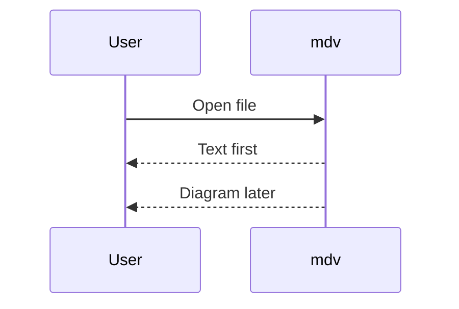

# mdv fixture — Unicode: Ääkköset 中文 العربية 🚀

> [!NOTE] Native and fast
> Callouts, **formatting**, `inline code`, and [links](https://example.com).

| Feature | Status |
|:--|--:|
| GFM tables | ✅ |
| Tasks | ✅ |

- [x] rendered
- [ ] future work

```swift
let greeting = "hello"
print(greeting)
```


