# mdvu fixture — Unicode: Ääkköset 中文 العربية 🚀

> [!NOTE] Native and fast
> Callouts, **formatting**, `inline code`, and [links](https://example.com).

| Feature | Status |
|:---|---:|
| GFM tables | ✅ |
| Tasks | ✅ |

- [x] rendered
- [ ] future work

```swift
let greeting = "hello"
print(greeting)
```

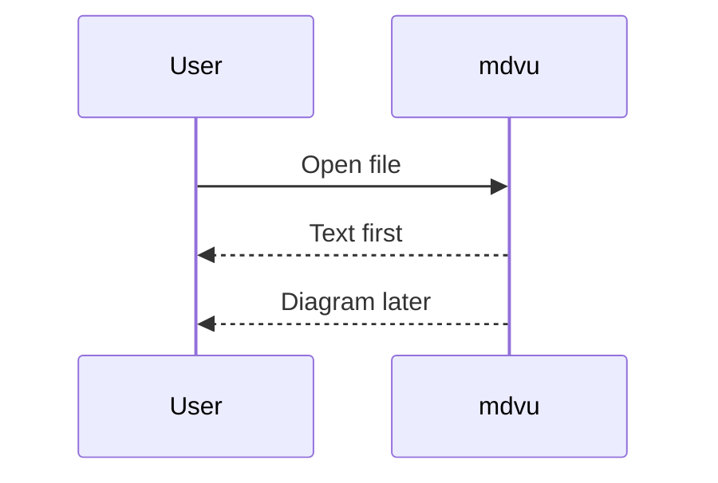
```mermaid
sequenceDiagram
  User->>mdvu: Open file
  mdvu-->>User: Text first
  mdvu-->>User: Diagram later
```

# Sirius4Cloud — Solution Architecture

## Table of Contents

- [1. Executive Summary](#1-executive-summary)
  - [1.1 Purpose and Goals](#11-purpose-and-goals)
  - [1.2 Architecture at a Glance](#12-architecture-at-a-glance)
  - [1.3 Status and Known Gaps](#13-status-and-known-gaps)
- [2. Context and Drivers](#2-context-and-drivers)
  - [2.1 Business Context, Goals and Value](#21-business-context-goals-and-value)
  - [2.2 System Context](#22-system-context)
  - [2.3 Stakeholders, Users and External Systems](#23-stakeholders-users-and-external-systems)
  - [2.4 Scope, Boundaries and Ownership](#24-scope-boundaries-and-ownership)
  - [2.5 Requirements, Constraints, Assumptions and Compliance Obligations](#25-requirements-constraints-assumptions-and-compliance-obligations)
  - [2.6 Quality Attributes and Architecture Principles](#26-quality-attributes-and-architecture-principles)
  - [2.7 Architecturally Significant Use Cases](#27-architecturally-significant-use-cases)
- [3. Solution Architecture](#3-solution-architecture)
  - [3.1 Logical Architecture](#31-logical-architecture)
  - [3.2 Architecture Building Blocks](#32-architecture-building-blocks)
  - [3.3 Technology View](#33-technology-view)
  - [3.4 Cross-Cutting Responsibilities and Dependencies](#34-crosscutting-responsibilities-and-dependencies)
- [4. Data and Integration](#4-data-and-integration)
  - [4.1 Information and Data Stores](#41-information-and-data-stores)
  - [4.2 Data Classification, Ownership and Lifecycle](#42-data-classification-ownership-and-lifecycle)
  - [4.3 Integration Overview](#43-integration-overview)
  - [4.4 Interfaces, Protocols and Messaging](#44-interfaces-protocols-and-messaging)
  - [4.5 Data Flows](#45-data-flows)
  - [4.6 Runtime Scenarios](#46-runtime-scenarios)
- [5. Security and Identity](#5-security-and-identity)
  - [5.1 Security Overview and Trust Boundaries](#51-security-overview-and-trust-boundaries)
  - [5.2 Threats and Risks](#52-threats-and-risks)
  - [5.3 Authentication and Identity Federation](#53-authentication-and-identity-federation)
  - [5.4 Authorization, Roles and Access Lifecycle](#54-authorization-roles-and-access-lifecycle)
  - [5.5 Data Protection and Secrets](#55-data-protection-and-secrets)
  - [5.6 Security Controls](#56-security-controls)
- [6. Deployment and Delivery](#6-deployment-and-delivery)
  - [6.1 Deployment Overview](#61-deployment-overview)
  - [6.2 Environments and Deployment Zones](#62-environments-and-deployment-zones)
  - [6.3 Network and Connectivity](#63-network-and-connectivity)
  - [6.4 Deployment Topology](#64-deployment-topology)
  - [6.5 Platform and Infrastructure Dependencies](#65-platform-and-infrastructure-dependencies)
  - [6.6 Build, Release and Deployment Automation](#66-build-release-and-deployment-automation)
- [7. Operations and Resilience](#7-operations-and-resilience)
  - [7.1 Configuration, Logging and Observability](#71-configuration-logging-and-observability)
  - [7.2 Availability, Capacity, Performance and Resilience](#72-availability-capacity-performance-and-resilience)
  - [7.3 Backup, Recovery and Disaster Recovery](#73-backup-recovery-and-disaster-recovery)
  - [7.4 Operational Security and Support](#74-operational-security-and-support)
- [8. Evolution, Decisions and Risks](#8-evolution-decisions-and-risks)
  - [8.1 Current / Target State and Transition](#81-current-target-state-and-transition)
  - [8.2 Architecture Decisions](#82-architecture-decisions)
  - [8.3 Architecture Risks](#83-architecture-risks)
  - [8.4 Open Questions, Conflicts and Gaps](#84-open-questions-conflicts-and-gaps)
- [9. Traceability and Validation](#9-traceability-and-validation)
  - [9.1 Sources and Evidence](#91-sources-and-evidence)
  - [9.2 Requirements and Element Traceability](#92-requirements-and-element-traceability)
  - [9.3 Coverage and Confidence](#93-coverage-and-confidence)
  - [9.4 Architecture Validation and Fitness Criteria](#94-architecture-validation-and-fitness-criteria)
- [Appendix A — Architecture Element Catalog](#appendix-a-architecture-element-catalog)
- [Appendix B — Interface Catalog](#appendix-b-interface-catalog)
- [Appendix C — Data Catalog](#appendix-c-data-catalog)
- [Appendix D — Deployment Catalog](#appendix-d-deployment-catalog)
- [Appendix E — Security and Identity Catalog](#appendix-e-security-and-identity-catalog)
- [Appendix F — Evidence and Diagnostics](#appendix-f-evidence-and-diagnostics)
- [Appendix G — Glossary](#appendix-g-glossary)

# 1. Executive Summary

## 1.1 Purpose and Goals

The Cloud-native S4C Implementation Decision establishes Sirius4Cloud as the dedicated cloud-native successor to Sirius. It specifically addresses cloud products and the adapted release processes essential for cloud product development. Retaining and extending the legacy Sirius platform on an on-premise stack would have substantially driven up architectural complexity and demanded massive refactoring efforts.

Sirius4Cloud directly realizes core organizational objectives, including the Document Compliance to External and Internal Standards Goal and the Audit Evidence Availability Goal. Through these mechanisms, the solution enables the systematic documentation of SAP product development compliance against internal guidelines and mandatory external standards, such as ISO and SOX. Furthermore, it ensures that product development teams maintain readily available evidence required for both internal and external audits.

## 1.2 Architecture at a Glance

Sirius4Cloud is an application component deployed within an SAP Business Technology Platform (SAP BTP) Subaccount environment on the Business Technology Platform node. The platform serves to document SAP product development compliance against both internal standards and external regulatory frameworks such as ISO and SOX.

The internal architecture of Sirius4Cloud encompasses key application components including the S4C-Router, HyCoM, and Requirement Editor. In addition, the platform incorporates support services such as Frontend UI Server Services, Image Service, Generative AI Service, HSP Interface Service, and the Product Standard Requirements MCP server.

Sirius4Cloud also integrates backlog and program management facilities, comprising the Backlog Persistence Service, Backlog Tool Webhook Pub/Sub Connection Service, Program Management Component Service, and Program Management Overview Service. Data persistence and asynchronous messaging rely on underlying system software; specifically, both the HyCoM API Service and Requirement Editor API App access the HANA Cloud database while serving the GCP Pub/Sub Event Handler.

### System Landscape

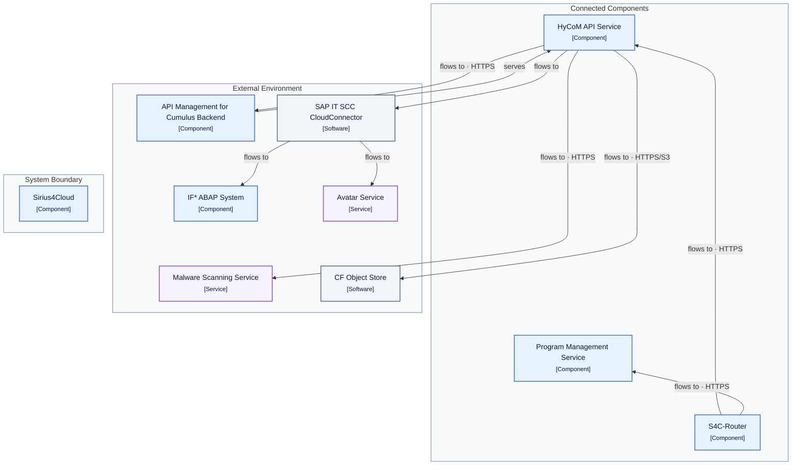
```mermaid
flowchart TB
    subgraph g1["Connected Components"]
        direction TB
        n4["HyCoM API Service<br/><small>[Component]</small>"]
        n7["Program Management Service<br/><small>[Component]</small>"]
        n8["S4C-Router<br/><small>[Component]</small>"]
    end
    subgraph g2["External Environment"]
        direction TB
        n6["Malware Scanning Service<br/><small>[Service]</small>"]
        n1["API Management for Cumulus Backend<br/><small>[Component]</small>"]
        n5["IF* ABAP System<br/><small>[Component]</small>"]
        n3["CF Object Store<br/><small>[Software]</small>"]
        n2["Avatar Service<br/><small>[Service]</small>"]
        n9["SAP IT SCC CloudConnector<br/><small>[Software]</small>"]
    end
    subgraph g3["System Boundary"]
        direction TB
        n10["Sirius4Cloud<br/><small>[Component]</small>"]
    end
    classDef application fill:#E8F1FF,stroke:#2563EB,color:#0F172A,stroke-width:1.5px
    class n1,n4,n7,n5,n8,n10 application
    classDef behavior fill:#F5F3FF,stroke:#7C3AED,color:#0F172A,stroke-width:1.5px
    class n6,n2 behavior
    classDef technology fill:#F1F5F9,stroke:#475569,color:#0F172A,stroke-width:1.5px
    class n3,n9 technology
    style g1 fill:#F8FAFC,stroke:#94A3B8,stroke-width:1.5px
    style g2 fill:#F8FAFC,stroke:#94A3B8,stroke-width:1.5px
    style g3 fill:#F8FAFC,stroke:#94A3B8,stroke-width:1.5px
    n1 ~~~ n2 ~~~ n3 ~~~ n4
    n5 ~~~ n6 ~~~ n7 ~~~ n8
    n9 ~~~ n10
    n1 ~~~ n5
    n5 ~~~ n9
    n1 -->|"serves"| n4
    n4 -->|"flows to"| n9
    n8 -->|"flows to · HTTPS"| n4
    n4 -->|"flows to · HTTPS"| n1
    n4 -->|"flows to · HTTPS/S3"| n3
    n9 -->|"flows to"| n2
    n8 -->|"flows to · HTTPS"| n7
    n4 -->|"flows to · HTTPS"| n6
    n9 -->|"flows to"| n5
```

## 1.3 Status and Known Gaps

The cloud-native Sirius4Cloud (S4C) architecture was established as a dedicated solution operating in parallel to Sirius to support cloud products, avoiding significant complexity and refactoring in the legacy system. Current architecture status involves specific compliance and governance conditions under SAP Global Security (SGS) approvals. In particular, SGS approval remains strictly valid within defined restrictions and criteria, and the Software Architecture Description Document (SADD) approval condition mandates an update to the SADD if the Product Security (PSSEC) / Secure Development and Operations Lifecycle (SDOL) owners change their assessment.

Known implementation gaps currently exist around security standards and user identity provisioning. The project team has not implemented all relevant PSSEC and SDOL requirements because the domain owners instructed that adoption is temporarily optional for their area. Additionally, SAP Cloud Identity Services currently lacks an API for automated Identity Management (IDM) provisioning of users and roles, requiring a manual ticketing workflow as an interim process.

The platform remains exposed to operational and data security risks that require ongoing management. Compromise of credential settings for inter-component communication or exposure of unencrypted endpoints could lead to unauthorized access and breaches of Confidential or Internal data. Stored data is also subject to unauthorized access threats, while improper deletion or manipulation of compliance documentation risks extra operational effort or the revocation of ISO and SOX certifications. Furthermore, infrastructure misconfigurations could corrupt component setups, triggering Sirius4Cloud application outages that impair product release capabilities.

[Back to table of contents](#table-of-contents)

# 2. Context and Drivers

## 2.1 Business Context, Goals and Value

The business drivers focus heavily on meeting rigorous governance and regulatory mandates across product development. Primary goals include documenting compliance for SAP product development against external frameworks such as ISO and SOX, as well as maintaining adherence to internal standards. Concurrently, the organization must achieve the Audit Evidence Availability Goal to ensure that product development teams consistently maintain the necessary evidence required for both internal and external audits.

To address these compliance imperatives without overburdening existing systems, architectural direction is established through the Cloud-native S4C Implementation Decision. Enhancing the existing Sirius system with the changes necessary for cloud products would significantly increase system complexity and demand massive refactoring efforts. Pursuing a cloud-native S4C approach enables the organization to support cloud product compliance needs while avoiding these refactoring hurdles.

## 2.2 System Context

Sirius4Cloud represents the internal application component designated as the system of interest explicitly within scope. It functions primarily to document the compliance of SAP's product development processes against defined compliance requirements. These mandates encompass both internal corporate standards and mandatory external frameworks, such as the International Organization for Standardization (ISO) and the Sarbanes-Oxley Act (SOX).

From an operational interaction standpoint, the system directly serves the End User role, which constitutes a primary actor operating within this environment. Through these interactions, End Users leverage Sirius4Cloud to manage and maintain essential development compliance documentation across the organization.

### System of Interest

| Name | Architectural role |
| --- | --- |
| Sirius4Cloud | Application Component |

## 2.3 Stakeholders, Users and External Systems

The operational landscape comprises several organizational entities and business actors that oversee governance, tooling, and technical infrastructure. The AI Ethics Team, Release & Portfolio Management Tools, and the Release with Ease Center of Excellence (Release with Ease CoE) act as primary business stakeholders guiding product processes. Additionally, SAP IT serves as an external business actor responsible for owning and maintaining the internal Cloud Connector (SCC-INT).

Core platform administration and system governance are managed across specialized administrative roles. The SAP Business Technology Platform (BTP) Subaccount Administrator maintains infrastructure and central application configurations, rotates Google Cloud Platform (GCP) service account keys every 90 days, and manages technical user service bindings. In parallel, the Sirius4Cloud Application Administrator carries out administrative tasks such as data migration, triggering data synchronizations, and executing mass changes.

Requirements engineering and lifecycle compliance rely on dedicated functional roles. Product Standard Owners edit the text and metadata of SAP Product Standard Requirements directly within the Project Unify Requirement Repository, while the automated S4C Project Unify Integration role holds permissions to create and publish new versions for all requirements via an API. Where API modifications are insufficient, the Requirement Editor Central Content Manager performs required changes, complemented by SGS Reviewers and Workspace Compliance Managers who execute compliance_manage policies across workspace components.

Broader day-to-day engagement includes general users, delivery teams, and continuous program participants. Sirius4Cloud End Users consist of D-, I-, and C-users, operating alongside Development Teams and Requestors who are tasked with consistently meeting described criteria and restrictions. Continuous Program Members maintain hycom_write and cp_write policies, whereas Continuous Program Owners hold elevated permissions encompassing hycom_write, cp_write, and cp_deactivate policies on the continuous program.

### Stakeholders, Actors and Roles

| Name | Architectural role | Responsibility / purpose |
| --- | --- | --- |
| AI Ethics Team | Business Actor | — |
| BTP Subaccount Administrator | Role | Access and maintenance of infrastructure, central application configuration, BTP service accounts, credential rotation, and GCP service account keys rotation every 90 days |
| Continuous Program Member | Role | — |
| Continuous Program Owner | Role | — |
| Development Team | Role | — |
| End User | Role | — |
| Product Standard Owner | Role | Edit the text and metadata of SAP's Product Standard Requirements in the Project Unify Requirement Repository |
| Release & Portfolio Management Tools | Business Actor | — |
| Release with Ease CoE | Business Actor | — |
| Requestor | Role | The requestor is responsible and accountable that the described criteria are constantly met. |
| Requirement Editor Central Content Manager | Role | Perform changes to requirements that are not possible via the upload API |
| S4C Project Unify Integration | Role | — |
| SAP IT | Business Actor | Owns and maintains Cloud Connector (SCC-INT) |
| SGS Reviewer | Role | — |
| Sirius4Cloud Application Administrator | Role | Execute administrative tasks such as data migration, triggering data synchronizations, and mass changes |
| Sirius4Cloud End User | Role | — |
| Workspace Compliance Manager | Role | — |

### External Systems and Services

| Name | Architectural role | Purpose |
| --- | --- | --- |
| API Management for Cumulus Backend | Application Component | — |
| Backlog tools | Application Component | — |
| CF Object Store | System Software | The CF Object Store is used by the HyCoM API Service and the Image Service to store uploaded files. |
| Cloud Foundry Object Store service and operation | System Software | — |
| Connection 1 (BTP Subaccount Access) | Path | — |
| CPIT AI Core | Application Component | The CPIT AI Core application provides LLM functionality to consuming applications. We use it to generate a review of the uploaded evidence for Requirements. |
| CPIT AI Core application and operation | Application Component | — |
| Cumulus, API Management and operation | Application Component | — |
| github.tools.sap | System Software | — |
| IF* ABAP System | Application Component | — |
| Piper | Application Component | Reusable library used to execute workflow build, test, and deploy steps |
| Project Unify Product Standard Portal in GitHub | Application Component | — |
| Responsibility Area Maintenance application | Application Component | — |
| SAP IT SCC Cloud Connector service and operation | System Software | — |
| SAP IT SCC CloudConnector | System Software | Establishes connectivity to services provided by systems inside the SAP internal network. |
| Sirius | Application Component | — |

## 2.4 Scope, Boundaries and Ownership

The primary focus of this architecture is the Sirius4Cloud application component, which serves as the core system of interest and falls explicitly within the solution scope. Conversely, several legacy and adjacent core systems are excluded from this defined boundary. Specifically, both Sirius and the Responsibility Area Maintenance application are designated as explicitly out of scope for the current design.

Multiple platform infrastructure elements and shared enterprise services reside outside the solution boundary. Excluded services include the API Management for Cumulus Backend, CPIT AI Core, Avatar Service, Malware Scanning Service, and the CF Object Store. Additionally, the SAP IT SCC CloudConnector falls outside the scope of the system and is formally owned and maintained by SAP IT.

Development operations and governance ecosystems are similarly distinct from the operational system boundaries. Tooling components such as Piper and Backlog tools remain strictly out of scope. External documentation and repository systems are also excluded, including github.tools.sap and the Project Unify Product Standard Portal in GitHub.

### Scope

| Concept | State |
| --- | --- |
| API Management for Cumulus Backend | Outside solution scope |
| Avatar Service | Outside solution scope |
| Avatar Service service and operation | Outside solution scope |
| Backlog tools | Outside solution scope |
| CF Object Store | Outside solution scope |
| Cloud Foundry Object Store service and operation | Outside solution scope |
| Connection 1 (BTP Subaccount Access) | Outside solution scope |
| CPIT AI Core | Outside solution scope |
| CPIT AI Core application and operation | Outside solution scope |
| CPIT Subaccount | Outside solution scope |
| Cumulus, API Management and operation | Outside solution scope |
| github.tools.sap | Outside solution scope |
| IF landscape | Outside solution scope |
| IF* ABAP System | Outside solution scope |
| Implementation of requirement in SAP product design | Outside solution scope |
| Malware Scanner Service service and operation | Outside solution scope |
| Malware Scanning Service | Outside solution scope |
| Onboarding processes for external technical users | Outside solution scope |
| Operation of github.tools.sap and Piper | Outside solution scope |
| Operations and administration of connected Backlog Tools | Outside solution scope |
| Piper | Outside solution scope |
| Project Unify Product Standard Portal in GitHub | Outside solution scope |
| Responsibility Area Maintenance application | Outside solution scope |
| SAP BTP Subaccount | In scope |
| SAP IT SCC Cloud Connector service and operation | Outside solution scope |
| SAP IT SCC CloudConnector | Outside solution scope |
| Sirius | Outside solution scope |
| Sirius4Cloud | In scope |

## 2.5 Requirements, Constraints, Assumptions and Compliance Obligations

The architecture enforces core security requirements across all network communications and exposed interfaces. Specifically, the Encrypted Connections Requirement mandates that all connections within the environment are encrypted. In addition, the Strong Authentication for Internet Endpoints Requirement establishes that all public or internet-facing accessible endpoints must utilize strong authentication mechanisms. To protect exposed access paths, relying solely on standard username and password combinations is explicitly forbidden.

Development and delivery governance must align with the SAP Product Standard Security Requirement whenever a scenario includes custom code or code outside an official product release, delivery, or shipment. This baseline applies specific security measures defined in the standard to maintain development integrity. The requirement maintains direct compliance references to the Scaled Agile Framework (SAFe), ISO standards including ISO 9001 and ISO 27001, and the SAP Product Standard Security guidelines.

## 2.6 Quality Attributes and Architecture Principles

The architecture is governed by foundational security design principles aimed at minimizing risk and reducing systemic complexity. Under the Economy of Mechanism Principle, system design must remain as simple and compact as possible. Access control enforces the Complete Mediation Principle, requiring authority checks for every access to every object, alongside the Fail-Safe Defaults Principle, which mandates that access decisions rely explicitly on permissions rather than exclusions. Furthermore, the Least Privilege Principle ensures that all users and programs operate with only the minimum privileges necessary to perform their tasks, while the Separation of Privilege Principle recommends multi-factor authorization mechanisms where feasible over single-key access.

Specific security requirements mandate stringent controls across communication channels, network boundaries, and custom developments. Under the Encrypted Connections Requirement, all communication connections must be encrypted, and any deviation requires documented justification. The Strong Authentication for Internet Endpoints Requirement prohibits standalone username and password authentication, enforcing strong authentication mechanisms for all public, internet-facing endpoints. Additionally, scenarios incorporating custom code or components outside official product release shipments must adhere to the security requirements defined in the SAP Product Standard Security Requirement.

Quality assurance and code integrity are verified through the Custom Code Security Testing Criterion. Source code undergoes static analysis via CxOne, vulnerability and licensing analysis for open-source components via Mend/Whitesource, and code smell and test coverage evaluation using Sonar. Any detected issues exceeding the 'low' or 'info' severity priorities must be audited and resolved within timeframes corresponding to their severity levels.

## 2.7 Architecturally Significant Use Cases

The architecture incorporates key event-driven scenarios to handle requirement updates and automated evaluations. In the requirement synchronization workflow, the Publishing Requirement Version Event functions as the trigger that initiates the Fetch and Process Updated Requirements Process. This processing pipeline operates as the main execution path to retrieve and handle modified requirement specifications.

In parallel, automated assessment workflows rely on a dedicated evaluation sequence driven by specific system signals. The AI Review Trigger Event serves as the trigger that activates the AI Review Process. Within this architectural scenario, the AI Review Process constitutes the primary main path for executing review logic.

[Back to table of contents](#table-of-contents)

# 3. Solution Architecture

## 3.1 Logical Architecture

Sirius4Cloud serves as the system of interest explicitly in scope and logically encompasses core functional areas including HyCoM and Requirement Editor. Within this landscape, S4C-Router acts as a central entry component implemented on NodeJS using the SAP App Router framework. It directs traffic across the platform by serving Frontend UI Server Services running on NodeJS, Backlog Tool Webhook Pub/Sub Connection Service, HyCoM API Service, Requirement Editor API App, Program Management Component Service, and Program Management Overview Service.

HyCoM API Service is constructed using the NestJS framework on a NodeJS runtime. It integrates downstream functions by serving Backlog Persistence Service, Generative AI Service, Program Management Component Service, and Requirement Editor API App, the latter also being built with NestJS on NodeJS. Additionally, both Program Management Component Service and Program Management Overview Service provide upstream integration by serving Program Management Service.

The wider application architecture is supported by specialized services including Image Service, HSP Interface Service, and Product Standard Requirements MCP server alongside the Requirement Editor component. Operational responsibilities around requirements authoring and maintenance involve the Requirement Editor Central Content Manager role.

### System Decomposition

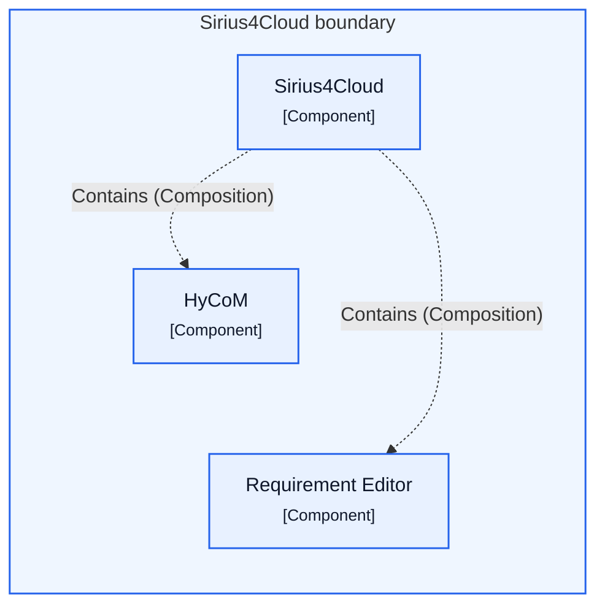
```mermaid
flowchart TB
    subgraph g1["Sirius4Cloud boundary"]
        direction TB
        n3["Sirius4Cloud<br/><small>[Component]</small>"]
        n1["HyCoM<br/><small>[Component]</small>"]
        n2["Requirement Editor<br/><small>[Component]</small>"]
    end
    classDef application fill:#E8F1FF,stroke:#2563EB,color:#0F172A,stroke-width:1.5px
    class n1,n3,n2 application
    style g1 fill:#EFF6FF,stroke:#2563EB,stroke-width:1.5px
    n1 ~~~ n2
    n1 ~~~ n3
    n3 -.->|"Contains (Composition)"| n1
    n3 -.->|"Contains (Composition)"| n2
```

### Logical Components and Dependencies

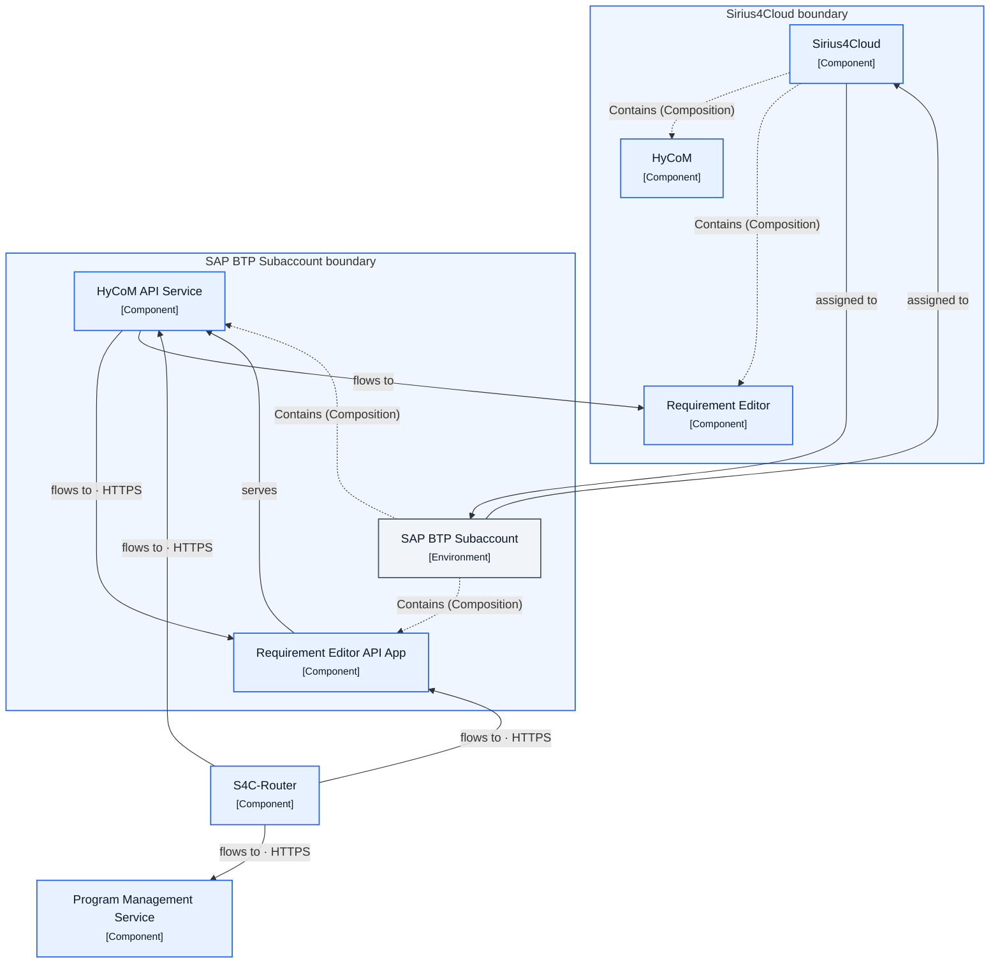
```mermaid
flowchart TB
    subgraph g1["Sirius4Cloud boundary"]
        direction TB
        n8["Sirius4Cloud<br/><small>[Component]</small>"]
        n1["HyCoM<br/><small>[Component]</small>"]
        n4["Requirement Editor<br/><small>[Component]</small>"]
    end
    subgraph g2["SAP BTP Subaccount boundary"]
        direction TB
        n7["SAP BTP Subaccount<br/><small>[Environment]</small>"]
        n2["HyCoM API Service<br/><small>[Component]</small>"]
        n5["Requirement Editor API App<br/><small>[Component]</small>"]
    end
    n3["Program Management Service<br/><small>[Component]</small>"]
    n6["S4C-Router<br/><small>[Component]</small>"]
    classDef application fill:#E8F1FF,stroke:#2563EB,color:#0F172A,stroke-width:1.5px
    class n2,n3,n1,n6,n5,n8,n4 application
    classDef technology fill:#F1F5F9,stroke:#475569,color:#0F172A,stroke-width:1.5px
    class n7 technology
    style g1 fill:#EFF6FF,stroke:#2563EB,stroke-width:1.5px
    style g2 fill:#EFF6FF,stroke:#2563EB,stroke-width:1.5px
    n1 ~~~ n2 ~~~ n3
    n4 ~~~ n5 ~~~ n6
    n7 ~~~ n8
    n1 ~~~ n4
    n4 ~~~ n7
    n8 -.->|"Contains (Composition)"| n1
    n8 -.->|"Contains (Composition)"| n4
    n7 -->|"assigned to"| n8
    n2 -->|"flows to · HTTPS"| n5
    n7 -.->|"Contains (Composition)"| n5
    n6 -->|"flows to · HTTPS"| n2
    n5 -->|"serves"| n2
    n2 -->|"flows to"| n4
    n8 -->|"assigned to"| n7
    n7 -.->|"Contains (Composition)"| n2
    n6 -->|"flows to · HTTPS"| n3
    n6 -->|"flows to · HTTPS"| n5
```

## 3.2 Architecture Building Blocks

Sirius4Cloud documents the compliance of SAP product development against internal and external standards while ensuring the availability of audit evidence. At the entry tier, the S4C-Router, running on NodeJS, manages incoming end-user connections and forwards traffic to downstream application components, specifically serving the Frontend UI Server Services, the HyCoM API Service, and the Requirement Editor API App. To support user presentation, the Frontend UI Server Services host and deliver static user interface files over HTTPS for read-only access.

Core requirements and compliance management are driven by several dedicated backend services. The Requirement Editor API App exposes backend interfaces for the requirement editor and processes requirement records along with their metadata, while the Image Service manages and stores pictures and associated metadata contained within requirement descriptions. The HyCoM API Service provides backend APIs to track compliance, fulfillment status, and evidence, concurrently serving the Generative AI Service and the Backlog Persistence Service. In addition, the Product Standard Requirements MCP server enables Large Language Models (LLMs) to query the Requirement Editor API App to extract requirements data.

External integrations and backlog tracking are handled through dedicated event and persistence services. The Backlog Tool Webhook Pub/Sub Connection Service processes incoming webhooks from backlog tools and converts them into Google Cloud Platform (GCP) Pub/Sub messages, while the Backlog Persistence Service retains copies of relevant Features and MicroDeliveries alongside corresponding requirement sub-issues. Furthermore, the HSP Interface Service reformats Pub/Sub events received from the Hyperspace Portal to publish them in an internal format, and the Generative AI Service bundles capabilities to invoke the CPIT AI Core Service while handling authentication using CPIT XSUAA.

Continuous program management within the architecture is distributed across three specialized services. The Program Management Service maintains and stores the core attributes of Continuous Programs. Complementing this, the Program Management Overview Service provides summary views of program data such as program names and Responsibility Areas, while the Program Management Component Service links components configured in the Hyperspace Portal directly to their respective Continuous Programs.

### 3.2.1 Backlog Persistence Service

#### Dependencies and Interfaces

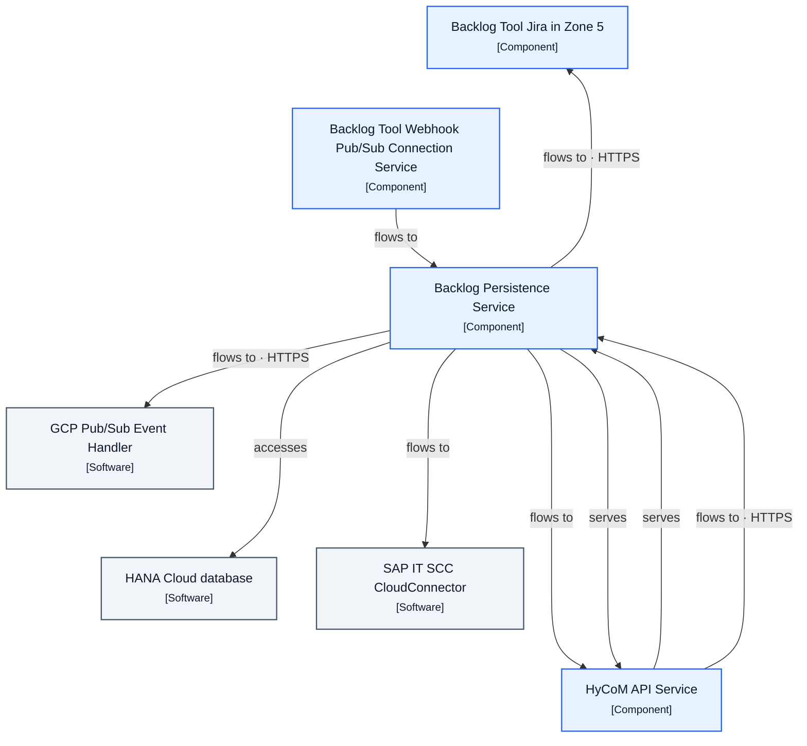
```mermaid
flowchart TB
    n2["Backlog Tool Jira in Zone 5<br/><small>[Component]</small>"]
    n6["HyCoM API Service<br/><small>[Component]</small>"]
    n1["Backlog Persistence Service<br/><small>[Component]</small>"]
    n5["HANA Cloud database<br/><small>[Software]</small>"]
    n3["Backlog Tool Webhook Pub/Sub Connection Service<br/><small>[Component]</small>"]
    n4["GCP Pub/Sub Event Handler<br/><small>[Software]</small>"]
    n7["SAP IT SCC CloudConnector<br/><small>[Software]</small>"]
    classDef application fill:#E8F1FF,stroke:#2563EB,color:#0F172A,stroke-width:1.5px
    class n2,n6,n1,n3 application
    classDef technology fill:#F1F5F9,stroke:#475569,color:#0F172A,stroke-width:1.5px
    class n5,n4,n7 technology
    n1 ~~~ n2 ~~~ n3
    n4 ~~~ n5 ~~~ n6
    n1 ~~~ n4
    n4 ~~~ n7
    n1 -->|"flows to"| n6
    n3 -->|"flows to"| n1
    n1 -->|"accesses"| n5
    n1 -->|"flows to · HTTPS"| n2
    n6 -->|"serves"| n1
    n6 -->|"flows to · HTTPS"| n1
    n1 -->|"flows to"| n7
    n1 -->|"flows to · HTTPS"| n4
    n1 -->|"serves"| n6
```

### Building Block Profile

| Attribute | Value |
| --- | --- |
| Architectural role | Application Component |
| Purpose | This service stores a copy of the relevant Features and MicroDeliveries of the Backlog Tools with the needed attributes and the corresponding requirement sub issues. This is needed for performance reasons as well as to ensure that objects deleted in the Backlog Tools are still accessible. |
| Responsibility | Stores a copy of relevant Features and MicroDeliveries from Backlog Tools with corresponding requirement sub issues |

### Dependencies and Interactions

| Source | Relationship | Target | Context |
| --- | --- | --- | --- |
| Backlog Persistence Service | Accesses | HANA Cloud database | Current state |
| Backlog Persistence Service | Flows to | Backlog Tool Jira in Zone 5 | Current state |
| Backlog Persistence Service | Flows to | GCP Pub/Sub Event Handler | Current state |
| Backlog Persistence Service | Flows to | HyCoM API Service | — |
| Backlog Persistence Service | Flows to | SAP IT SCC CloudConnector | Current state |
| Backlog Persistence Service | Serves | HyCoM API Service | Current state |
| Backlog Tool Webhook Pub/Sub Connection Service | Flows to | Backlog Persistence Service | — |
| HyCoM API Service | Flows to | Backlog Persistence Service | Current state |
| HyCoM API Service | Serves | Backlog Persistence Service | Target state · Current state |
| SAP BTP Subaccount | Contains | Backlog Persistence Service | Current state |
| Sirius4Cloud | Contains | Backlog Persistence Service | Target state |

### 3.2.2 Backlog Tool Jira in Zone 3

#### Dependencies and Interfaces

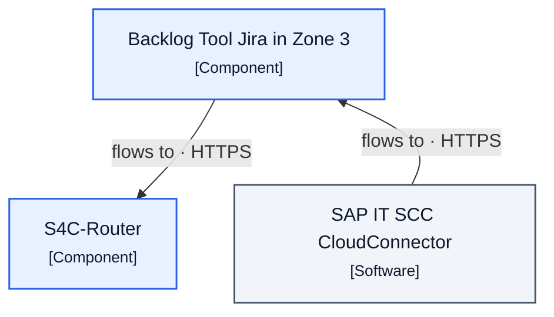
```mermaid
flowchart TB
    n2["S4C-Router<br/><small>[Component]</small>"]
    n1["Backlog Tool Jira in Zone 3<br/><small>[Component]</small>"]
    n3["SAP IT SCC CloudConnector<br/><small>[Software]</small>"]
    classDef application fill:#E8F1FF,stroke:#2563EB,color:#0F172A,stroke-width:1.5px
    class n2,n1 application
    classDef technology fill:#F1F5F9,stroke:#475569,color:#0F172A,stroke-width:1.5px
    class n3 technology
    n1 ~~~ n2
    n1 ~~~ n3
    n3 -->|"flows to · HTTPS"| n1
    n1 -->|"flows to · HTTPS"| n2
```

### Building Block Profile

| Attribute | Value |
| --- | --- |
| Architectural role | Application Component |

### Dependencies and Interactions

| Source | Relationship | Target | Context |
| --- | --- | --- | --- |
| Backlog Tool Jira in Zone 3 | Flows to | S4C-Router | Current state |
| SAP IT SCC CloudConnector | Flows to | Backlog Tool Jira in Zone 3 | Current state |

### 3.2.3 Backlog Tool Jira in Zone 5

#### Dependencies and Interfaces

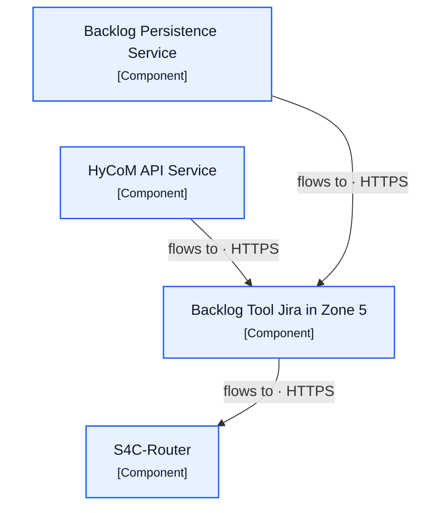
```mermaid
flowchart TB
    n2["Backlog Tool Jira in Zone 5<br/><small>[Component]</small>"]
    n3["HyCoM API Service<br/><small>[Component]</small>"]
    n1["Backlog Persistence Service<br/><small>[Component]</small>"]
    n4["S4C-Router<br/><small>[Component]</small>"]
    classDef application fill:#E8F1FF,stroke:#2563EB,color:#0F172A,stroke-width:1.5px
    class n2,n3,n1,n4 application
    n1 ~~~ n2
    n3 ~~~ n4
    n1 ~~~ n3
    n1 -->|"flows to · HTTPS"| n2
    n2 -->|"flows to · HTTPS"| n4
    n3 -->|"flows to · HTTPS"| n2
```

### Building Block Profile

| Attribute | Value |
| --- | --- |
| Architectural role | Application Component |

### Dependencies and Interactions

| Source | Relationship | Target | Context |
| --- | --- | --- | --- |
| Backlog Persistence Service | Flows to | Backlog Tool Jira in Zone 5 | Current state |
| Backlog Tool Jira in Zone 5 | Flows to | S4C-Router | Current state |
| HyCoM API Service | Flows to | Backlog Tool Jira in Zone 5 | Current state |

### 3.2.4 Backlog Tool Webhook Pub/Sub Connection Service

#### Dependencies and Interfaces

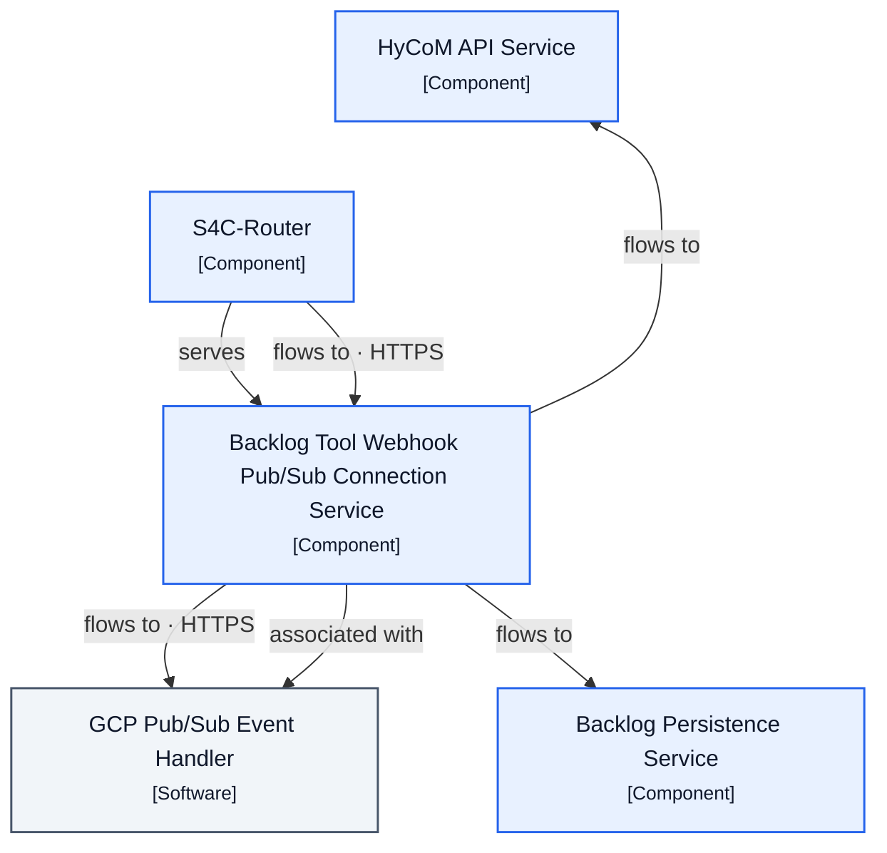
```mermaid
flowchart TB
    n4["HyCoM API Service<br/><small>[Component]</small>"]
    n1["Backlog Persistence Service<br/><small>[Component]</small>"]
    n5["S4C-Router<br/><small>[Component]</small>"]
    n2["Backlog Tool Webhook Pub/Sub Connection Service<br/><small>[Component]</small>"]
    n3["GCP Pub/Sub Event Handler<br/><small>[Software]</small>"]
    classDef application fill:#E8F1FF,stroke:#2563EB,color:#0F172A,stroke-width:1.5px
    class n4,n1,n5,n2 application
    classDef technology fill:#F1F5F9,stroke:#475569,color:#0F172A,stroke-width:1.5px
    class n3 technology
    n1 ~~~ n2 ~~~ n3
    n4 ~~~ n5
    n1 ~~~ n4
    n2 -->|"flows to"| n1
    n5 -->|"serves"| n2
    n5 -->|"flows to · HTTPS"| n2
    n2 -->|"flows to · HTTPS"| n3
    n2 -->|"associated with"| n3
    n2 -->|"flows to"| n4
```

### Building Block Profile

| Attribute | Value |
| --- | --- |
| Architectural role | Application Component |
| Purpose | This service handles incoming webhook calls via connections 32 and 33 from Backlog Tools and publishes them as messages in GCP Pub/Sub. This service just transforms the webhook calls to Pub/Sub Events to increase the availability and stability.; Transform incoming webhook calls from Backlog Tools to Pub/Sub Events |
| Responsibility | Handles incoming webhook calls from Backlog Tools and transforms them to GCP Pub/Sub messages |

### Dependencies and Interactions

| Source | Relationship | Target | Context |
| --- | --- | --- | --- |
| Backlog Tool Webhook Pub/Sub Connection Service | Associated with | GCP Pub/Sub Event Handler | Target state |
| Backlog Tool Webhook Pub/Sub Connection Service | Flows to | Backlog Persistence Service | — |
| Backlog Tool Webhook Pub/Sub Connection Service | Flows to | GCP Pub/Sub Event Handler | Current state |
| Backlog Tool Webhook Pub/Sub Connection Service | Flows to | HyCoM API Service | — |
| S4C-Router | Flows to | Backlog Tool Webhook Pub/Sub Connection Service | Current state |
| S4C-Router | Serves | Backlog Tool Webhook Pub/Sub Connection Service | Current state · Target state |
| SAP BTP Subaccount | Contains | Backlog Tool Webhook Pub/Sub Connection Service | Current state |
| Sirius4Cloud | Contains | Backlog Tool Webhook Pub/Sub Connection Service | Target state |

### 3.2.5 CPIT XSUAA

#### Dependencies and Interfaces

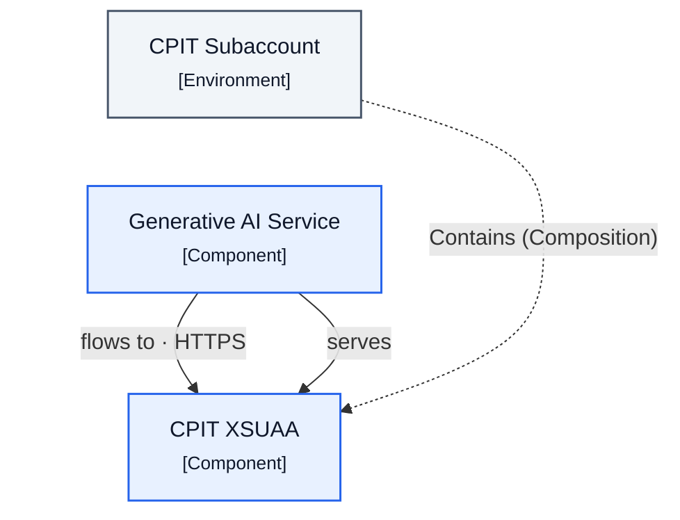
```mermaid
flowchart TB
    n1["CPIT Subaccount<br/><small>[Environment]</small>"]
    n3["Generative AI Service<br/><small>[Component]</small>"]
    n2["CPIT XSUAA<br/><small>[Component]</small>"]
    classDef application fill:#E8F1FF,stroke:#2563EB,color:#0F172A,stroke-width:1.5px
    class n3,n2 application
    classDef technology fill:#F1F5F9,stroke:#475569,color:#0F172A,stroke-width:1.5px
    class n1 technology
    n1 ~~~ n2
    n1 ~~~ n3
    n3 -->|"flows to · HTTPS"| n2
    n1 -.->|"Contains (Composition)"| n2
    n3 -->|"serves"| n2
```

### Building Block Profile

| Attribute | Value |
| --- | --- |
| Architectural role | Application Component |

### Dependencies and Interactions

| Source | Relationship | Target | Context |
| --- | --- | --- | --- |
| CPIT Subaccount | Contains | CPIT XSUAA | Current state |
| Generative AI Service | Flows to | CPIT XSUAA | Current state |
| Generative AI Service | Serves | CPIT XSUAA | Current state |

### 3.2.6 Entra ID

#### Dependencies and Interfaces

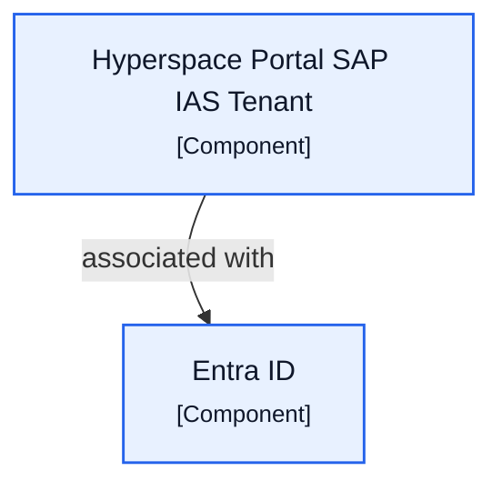
```mermaid
flowchart TB
    n2["Hyperspace Portal SAP IAS Tenant<br/><small>[Component]</small>"]
    n1["Entra ID<br/><small>[Component]</small>"]
    classDef application fill:#E8F1FF,stroke:#2563EB,color:#0F172A,stroke-width:1.5px
    class n2,n1 application
    n1 ~~~ n2
    n2 -->|"associated with"| n1
```

### Building Block Profile

| Attribute | Value |
| --- | --- |
| Architectural role | Application Component |

### Dependencies and Interactions

| Source | Relationship | Target | Context |
| --- | --- | --- | --- |
| Hyperspace Portal SAP IAS Tenant | Associated with | Entra ID | Current state |

### 3.2.7 Frontend UI Server Services

#### Dependencies and Interfaces

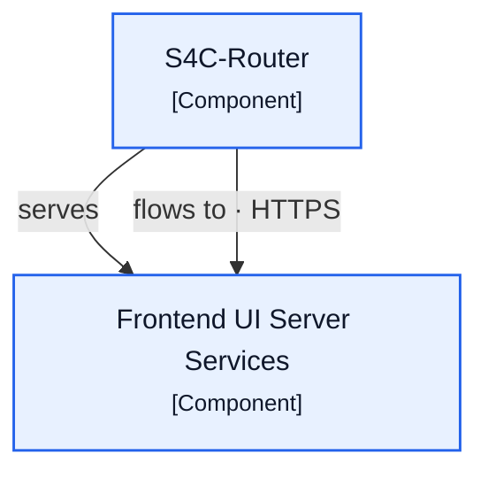
```mermaid
flowchart TB
    n2["S4C-Router<br/><small>[Component]</small>"]
    n1["Frontend UI Server Services<br/><small>[Component]</small>"]
    classDef application fill:#E8F1FF,stroke:#2563EB,color:#0F172A,stroke-width:1.5px
    class n2,n1 application
    n1 ~~~ n2
    n2 -->|"serves"| n1
    n2 -->|"flows to · HTTPS"| n1
```

### Building Block Profile

| Attribute | Value |
| --- | --- |
| Architectural role | Application Component |
| Responsibility | Serves static frontend files over HTTPS providing read access |
| Runtime | NodeJS |

### Dependencies and Interactions

| Source | Relationship | Target | Context |
| --- | --- | --- | --- |
| S4C-Router | Flows to | Frontend UI Server Services | Current state |
| S4C-Router | Serves | Frontend UI Server Services | Current state · Target state |
| SAP BTP Subaccount | Contains | Frontend UI Server Services | Current state |
| Sirius4Cloud | Contains | Frontend UI Server Services | Target state |

### 3.2.8 GCP Pub/Sub Event Handler

#### Dependencies and Interfaces

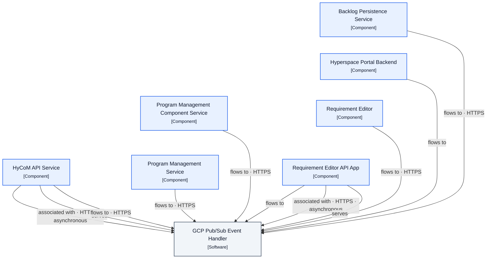
```mermaid
flowchart TB
    n3["HyCoM API Service<br/><small>[Component]</small>"]
    n6["Program Management Service<br/><small>[Component]</small>"]
    n1["Backlog Persistence Service<br/><small>[Component]</small>"]
    n8["Requirement Editor API App<br/><small>[Component]</small>"]
    n7["Requirement Editor<br/><small>[Component]</small>"]
    n2["GCP Pub/Sub Event Handler<br/><small>[Software]</small>"]
    n4["Hyperspace Portal Backend<br/><small>[Component]</small>"]
    n5["Program Management Component Service<br/><small>[Component]</small>"]
    classDef application fill:#E8F1FF,stroke:#2563EB,color:#0F172A,stroke-width:1.5px
    class n3,n6,n1,n8,n7,n4,n5 application
    classDef technology fill:#F1F5F9,stroke:#475569,color:#0F172A,stroke-width:1.5px
    class n2 technology
    n1 ~~~ n2 ~~~ n3
    n4 ~~~ n5 ~~~ n6
    n7 ~~~ n8
    n1 ~~~ n4
    n4 ~~~ n7
    n3 -->|"associated with · HTTPS · asynchronous"| n2
    n8 -->|"flows to"| n2
    n5 -->|"flows to · HTTPS"| n2
    n8 -->|"associated with · HTTPS · asynchronous"| n2
    n8 -->|"serves"| n2
    n4 -->|"flows to"| n2
    n6 -->|"flows to · HTTPS"| n2
    n7 -->|"flows to · HTTPS"| n2
    n3 -->|"serves"| n2
    n1 -->|"flows to · HTTPS"| n2
    n3 -->|"flows to · HTTPS"| n2
```

### Building Block Profile

| Attribute | Value |
| --- | --- |
| Architectural role | System Software |
| Purpose | Asynchronous communication and event distribution between services.; Asynchronous communication between services |
| Technology | Google Cloud Platform Pub/Sub |

### Dependencies and Interactions

| Source | Relationship | Target | Context |
| --- | --- | --- | --- |
| Backlog Persistence Service | Flows to | GCP Pub/Sub Event Handler | Current state |
| Backlog Tool Webhook Pub/Sub Connection Service | Associated with | GCP Pub/Sub Event Handler | Target state |
| Backlog Tool Webhook Pub/Sub Connection Service | Flows to | GCP Pub/Sub Event Handler | Current state |
| GCP Pub/Sub Event Handler | Flows to | IF* ABAP System | — |
| HSP Interface Service | Associated with | GCP Pub/Sub Event Handler | Target state |
| HSP Interface Service | Flows to | GCP Pub/Sub Event Handler | Current state |
| HyCoM API Service | Associated with | GCP Pub/Sub Event Handler | Target state |
| HyCoM API Service | Flows to | GCP Pub/Sub Event Handler | Current state |
| HyCoM API Service | Serves | GCP Pub/Sub Event Handler | Target state |
| Hyperspace Portal Backend | Flows to | GCP Pub/Sub Event Handler | Current state |
| Program Management Component Service | Flows to | GCP Pub/Sub Event Handler | Current state |
| Program Management Service | Flows to | GCP Pub/Sub Event Handler | Current state |
| Requirement Editor | Flows to | GCP Pub/Sub Event Handler | Current state |
| Requirement Editor API App | Associated with | GCP Pub/Sub Event Handler | Target state |
| Requirement Editor API App | Flows to | GCP Pub/Sub Event Handler | Current state |
| Requirement Editor API App | Serves | GCP Pub/Sub Event Handler | Target state |

### 3.2.9 Generative AI Service

#### Dependencies and Interfaces

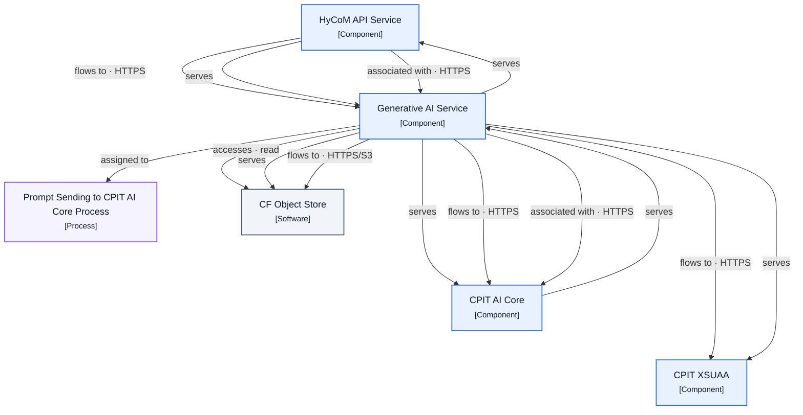
```mermaid
flowchart TB
    n6["Prompt Sending to CPIT AI Core Process<br/><small>[Process]</small>"]
    n5["HyCoM API Service<br/><small>[Component]</small>"]
    n4["Generative AI Service<br/><small>[Component]</small>"]
    n1["CF Object Store<br/><small>[Software]</small>"]
    n2["CPIT AI Core<br/><small>[Component]</small>"]
    n3["CPIT XSUAA<br/><small>[Component]</small>"]
    classDef application fill:#E8F1FF,stroke:#2563EB,color:#0F172A,stroke-width:1.5px
    class n5,n4,n2,n3 application
    classDef behavior fill:#F5F3FF,stroke:#7C3AED,color:#0F172A,stroke-width:1.5px
    class n6 behavior
    classDef technology fill:#F1F5F9,stroke:#475569,color:#0F172A,stroke-width:1.5px
    class n1 technology
    n1 ~~~ n2 ~~~ n3
    n4 ~~~ n5 ~~~ n6
    n1 ~~~ n4
    n4 -->|"serves"| n2
    n4 -->|"flows to · HTTPS"| n3
    n5 -->|"flows to · HTTPS"| n4
    n4 -->|"flows to · HTTPS"| n2
    n5 -->|"serves"| n4
    n5 -->|"associated with · HTTPS"| n4
    n4 -->|"accesses · read"| n1
    n4 -->|"serves"| n1
    n2 -->|"serves"| n4
    n4 -->|"assigned to"| n6
    n4 -->|"serves"| n3
    n4 -->|"serves"| n5
    n4 -->|"flows to · HTTPS/S3"| n1
    n4 -->|"associated with · HTTPS"| n2
```

### Building Block Profile

| Attribute | Value |
| --- | --- |
| Architectural role | Application Component |
| Purpose | The Generative AI Service bundles functionality to invoke CPIT AI Core Service and handles the authentication by with the CPIT XSUAA. |
| Responsibility | Bundles functionality to invoke CPIT AI Core Service and handles authentication with CPIT XSUAA |

### Dependencies and Interactions

| Source | Relationship | Target | Context |
| --- | --- | --- | --- |
| CPIT AI Core | Serves | Generative AI Service | Current state |
| Generative AI Service | Accesses | CF Object Store | Current state |
| Generative AI Service | Assigned to | Prompt Sending to CPIT AI Core Process | — |
| Generative AI Service | Associated with | CPIT AI Core | Target state |
| Generative AI Service | Flows to | CF Object Store | Current state |
| Generative AI Service | Flows to | CPIT AI Core | Current state |
| Generative AI Service | Flows to | CPIT XSUAA | Current state |
| Generative AI Service | Serves | CF Object Store | Current state |
| Generative AI Service | Serves | CPIT AI Core | Target state · Current state |
| Generative AI Service | Serves | CPIT XSUAA | Current state |
| Generative AI Service | Serves | HyCoM API Service | Current state |
| HyCoM API Service | Associated with | Generative AI Service | Target state |
| HyCoM API Service | Flows to | Generative AI Service | Current state |
| HyCoM API Service | Serves | Generative AI Service | Target state · Current state |
| SAP BTP Subaccount | Contains | Generative AI Service | Current state |
| Sirius4Cloud | Contains | Generative AI Service | Target state |

### 3.2.10 HANA Cloud database

#### Dependencies and Interfaces

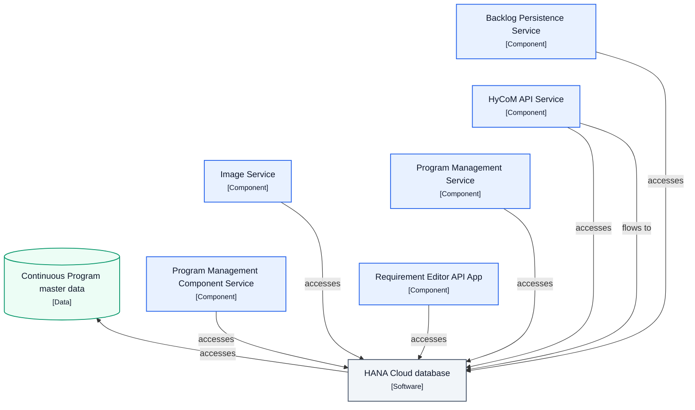
```mermaid
flowchart TB
    n2[("Continuous Program master data<br/><small>[Data]</small>")]
    n4["HyCoM API Service<br/><small>[Component]</small>"]
    n7["Program Management Service<br/><small>[Component]</small>"]
    n1["Backlog Persistence Service<br/><small>[Component]</small>"]
    n3["HANA Cloud database<br/><small>[Software]</small>"]
    n8["Requirement Editor API App<br/><small>[Component]</small>"]
    n5["Image Service<br/><small>[Component]</small>"]
    n6["Program Management Component Service<br/><small>[Component]</small>"]
    classDef application fill:#E8F1FF,stroke:#2563EB,color:#0F172A,stroke-width:1.5px
    class n4,n7,n1,n8,n5,n6 application
    classDef data fill:#ECFDF5,stroke:#059669,color:#0F172A,stroke-width:1.5px
    class n2 data
    classDef technology fill:#F1F5F9,stroke:#475569,color:#0F172A,stroke-width:1.5px
    class n3 technology
    n1 ~~~ n2 ~~~ n3
    n4 ~~~ n5 ~~~ n6
    n7 ~~~ n8
    n1 ~~~ n4
    n4 ~~~ n7
    n8 -->|"accesses"| n3
    n5 -->|"accesses"| n3
    n1 -->|"accesses"| n3
    n7 -->|"accesses"| n3
    n4 -->|"accesses"| n3
    n6 -->|"accesses"| n3
    n3 -->|"accesses"| n2
    n4 -->|"flows to"| n3
```

### Building Block Profile

| Attribute | Value |
| --- | --- |
| Architectural role | System Software |
| Purpose | Persistency database provided by SAP BTP for Sirius4Cloud microservices. |
| Technology | SAP HANA Cloud |

### Dependencies and Interactions

| Source | Relationship | Target | Context |
| --- | --- | --- | --- |
| Backlog Persistence Service | Accesses | HANA Cloud database | Current state |
| HANA Cloud database | Accesses | Continuous Program master data | Current state |
| HANA Cloud database | Accesses | Features and MicroDeliveries Data | Current state |
| HANA Cloud database | Accesses | Requirements Data | Current state |
| HyCoM API Service | Accesses | HANA Cloud database | Current state · Target state |
| HyCoM API Service | Flows to | HANA Cloud database | Current state |
| Image Service | Accesses | HANA Cloud database | Current state |
| Program Management Component Service | Accesses | HANA Cloud database | Current state |
| Program Management Service | Accesses | HANA Cloud database | Current state |
| Requirement Editor API App | Accesses | HANA Cloud database | Current state · Target state |
| SAP BTP Subaccount | Contains | HANA Cloud database | Current state |

### 3.2.11 HSP Interface Service

#### Dependencies and Interfaces

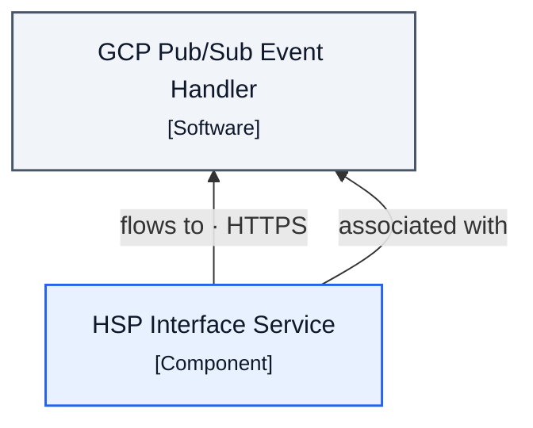
```mermaid
flowchart TB
    n1["GCP Pub/Sub Event Handler<br/><small>[Software]</small>"]
    n2["HSP Interface Service<br/><small>[Component]</small>"]
    classDef application fill:#E8F1FF,stroke:#2563EB,color:#0F172A,stroke-width:1.5px
    class n2 application
    classDef technology fill:#F1F5F9,stroke:#475569,color:#0F172A,stroke-width:1.5px
    class n1 technology
    n1 ~~~ n2
    n2 -->|"flows to · HTTPS"| n1
    n2 -->|"associated with"| n1
```

### Building Block Profile

| Attribute | Value |
| --- | --- |
| Architectural role | Application Component |
| Purpose | The Hyperspace Interface Service (HSP Interface Service) reformats Pub/Sub Events it receives from Hyperspace Portal and publishes them again in our internal format.; Reformat Pub/Sub Events received from Hyperspace Portal and publish them again in internal format |
| Responsibility | Reformats Pub/Sub Events received from Hyperspace Portal and publishes them in internal format |

### Dependencies and Interactions

| Source | Relationship | Target | Context |
| --- | --- | --- | --- |
| HSP Interface Service | Associated with | GCP Pub/Sub Event Handler | Target state |
| HSP Interface Service | Flows to | GCP Pub/Sub Event Handler | Current state |
| SAP BTP Subaccount | Contains | HSP Interface Service | Current state |
| Sirius4Cloud | Contains | HSP Interface Service | Target state |

### 3.2.12 HyCoM

#### Dependencies and Interfaces

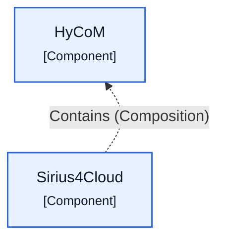
```mermaid
flowchart TB
    n1["HyCoM<br/><small>[Component]</small>"]
    n2["Sirius4Cloud<br/><small>[Component]</small>"]
    classDef application fill:#E8F1FF,stroke:#2563EB,color:#0F172A,stroke-width:1.5px
    class n1,n2 application
    n1 ~~~ n2
    n2 -.->|"Contains (Composition)"| n1
```

### Building Block Profile

| Attribute | Value |
| --- | --- |
| Architectural role | Application Component |

### Dependencies and Interactions

| Source | Relationship | Target | Context |
| --- | --- | --- | --- |
| Sirius4Cloud | Contains | HyCoM | Current state · Target state |

### 3.2.13 HyCoM API Service

#### Dependencies and Interfaces

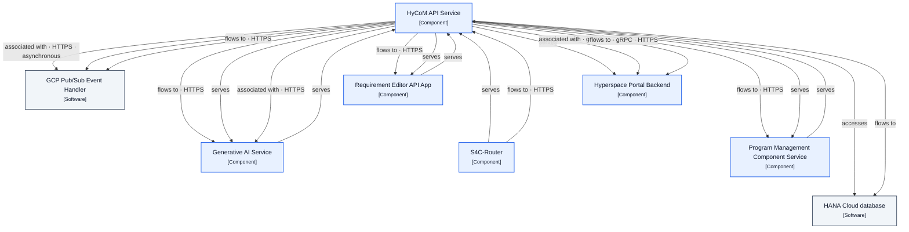
```mermaid
flowchart TB
    n4["HyCoM API Service<br/><small>[Component]</small>"]
    n2["Generative AI Service<br/><small>[Component]</small>"]
    n8["S4C-Router<br/><small>[Component]</small>"]
    n3["HANA Cloud database<br/><small>[Software]</small>"]
    n7["Requirement Editor API App<br/><small>[Component]</small>"]
    n1["GCP Pub/Sub Event Handler<br/><small>[Software]</small>"]
    n5["Hyperspace Portal Backend<br/><small>[Component]</small>"]
    n6["Program Management Component Service<br/><small>[Component]</small>"]
    classDef application fill:#E8F1FF,stroke:#2563EB,color:#0F172A,stroke-width:1.5px
    class n4,n2,n8,n7,n5,n6 application
    classDef technology fill:#F1F5F9,stroke:#475569,color:#0F172A,stroke-width:1.5px
    class n3,n1 technology
    n1 ~~~ n2 ~~~ n3
    n4 ~~~ n5 ~~~ n6
    n7 ~~~ n8
    n1 ~~~ n4
    n4 ~~~ n7
    n4 -->|"flows to · HTTPS"| n2
    n6 -->|"serves"| n4
    n4 -->|"associated with · HTTPS · asynchronous"| n1
    n4 -->|"serves"| n2
    n4 -->|"associated with · HTTPS"| n2
    n4 -->|"flows to · HTTPS"| n7
    n4 -->|"accesses"| n3
    n4 -->|"serves"| n5
    n8 -->|"serves"| n4
    n8 -->|"flows to · HTTPS"| n4
    n7 -->|"serves"| n4
    n4 -->|"flows to · HTTPS"| n6
    n4 -->|"associated with · gRPC"| n5
    n4 -->|"serves"| n1
    n2 -->|"serves"| n4
    n4 -->|"flows to · HTTPS"| n1
    n4 -->|"serves"| n7
    n4 -->|"flows to · gRPC · HTTPS"| n5
    n4 -->|"serves"| n6
    n4 -->|"flows to"| n3
```

### Building Block Profile

| Attribute | Value |
| --- | --- |
| Architectural role | Application Component |
| Description | The HyCoM API application is a NodeJS/NestJS application that provides all backend APIs for the HyCoM. All APIs can only be accessed via HTTPS. |
| Responsibility | push updates of product attributes and staffing within the product to the GCP Pub/Sub Service, so that the IF* ABAP System can fetch the data for processing in the legacy Sirius application; Provides backend APIs for HyCoM to track compliance, fulfillment status, and evidence |
| Runtime | NodeJS |
| Framework | NestJS |

### Dependencies and Interactions

| Source | Relationship | Target | Context |
| --- | --- | --- | --- |
| API Management for Cumulus Backend | Serves | HyCoM API Service | Current state |
| Backlog Persistence Service | Flows to | HyCoM API Service | — |
| Backlog Persistence Service | Serves | HyCoM API Service | Current state |
| Backlog Tool Webhook Pub/Sub Connection Service | Flows to | HyCoM API Service | — |
| Generative AI Service | Serves | HyCoM API Service | Current state |
| HyCoM API Service | Accesses | CF Object Store | Current state · Target state |
| HyCoM API Service | Accesses | HANA Cloud database | Current state · Target state |
| HyCoM API Service | Assigned to | Fetch and Process Updated Requirements Process | — |
| HyCoM API Service | Associated with | GCP Pub/Sub Event Handler | Target state |
| HyCoM API Service | Associated with | Generative AI Service | Target state |
| HyCoM API Service | Associated with | Hyperspace Portal Backend | Target state |
| HyCoM API Service | Associated with | SAP IT SCC CloudConnector | Target state |
| HyCoM API Service | Flows to | API Management for Cumulus Backend | Current state |
| HyCoM API Service | Flows to | Backlog Persistence Service | Current state |
| HyCoM API Service | Flows to | Backlog Tool Jira in Zone 5 | Current state |
| HyCoM API Service | Flows to | CF Object Store | Current state |
| HyCoM API Service | Flows to | GCP Pub/Sub Event Handler | Current state |
| HyCoM API Service | Flows to | Generative AI Service | Current state |
| HyCoM API Service | Flows to | HANA Cloud database | Current state |
| HyCoM API Service | Flows to | Hyperspace Portal Backend | Current state |
| HyCoM API Service | Flows to | Malware Scanning Service | Current state |
| HyCoM API Service | Flows to | Program Management Component Service | Current state |
| HyCoM API Service | Flows to | Requirement Editor | Current state |
| HyCoM API Service | Flows to | Requirement Editor API App | Current state |
| HyCoM API Service | Flows to | SAP IT SCC CloudConnector | Current state |
| HyCoM API Service | Serves | API Management for Cumulus Backend | Current state |
| HyCoM API Service | Serves | Backlog Persistence Service | Target state · Current state |
| HyCoM API Service | Serves | CF Object Store | Current state |
| HyCoM API Service | Serves | GCP Pub/Sub Event Handler | Target state |
| HyCoM API Service | Serves | Generative AI Service | Target state · Current state |
| HyCoM API Service | Serves | Hyperspace Portal Backend | Current state |
| HyCoM API Service | Serves | Malware Scanning Service | Current state |
| HyCoM API Service | Serves | Program Management Component Service | Target state |
| HyCoM API Service | Serves | Requirement Editor API App | Target state |
| HyCoM API Service | Serves | SAP IT SCC CloudConnector | Current state · Target state |
| Program Management Component Service | Serves | HyCoM API Service | Current state |
| Requirement Editor API App | Serves | HyCoM API Service | Current state |
| S4C-Router | Flows to | HyCoM API Service | Current state |
| S4C-Router | Serves | HyCoM API Service | Current state · Target state |
| SAP BTP Subaccount | Contains | HyCoM API Service | Current state |

### 3.2.14 Hyperspace Portal Backend

#### Dependencies and Interfaces

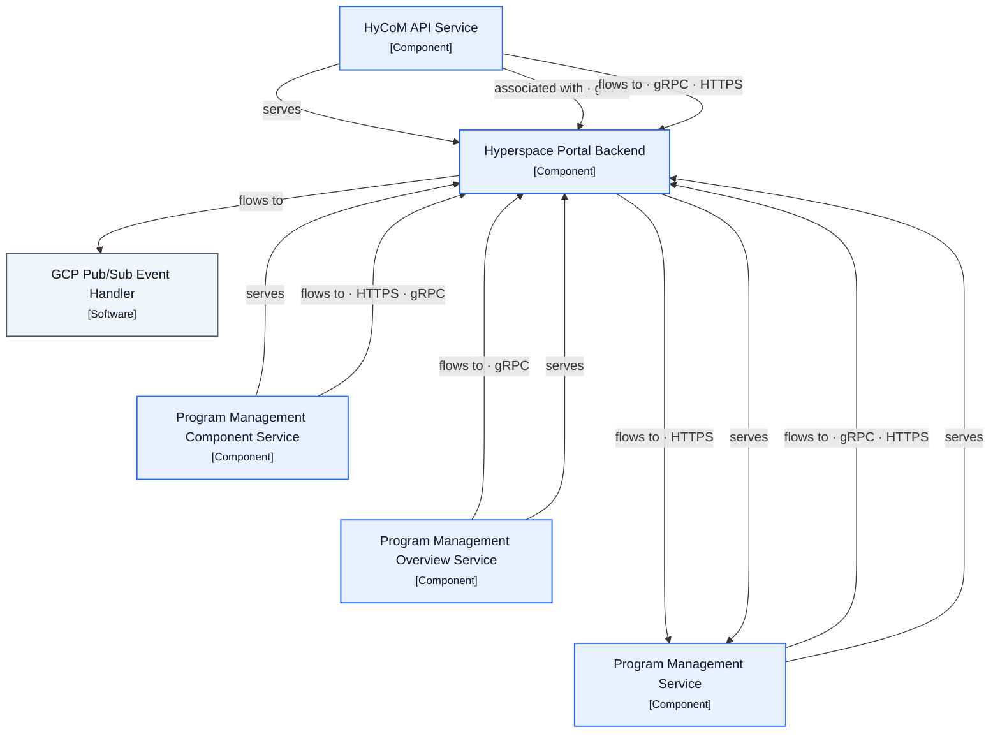
```mermaid
flowchart TB
    n2["HyCoM API Service<br/><small>[Component]</small>"]
    n6["Program Management Service<br/><small>[Component]</small>"]
    n5["Program Management Overview Service<br/><small>[Component]</small>"]
    n1["GCP Pub/Sub Event Handler<br/><small>[Software]</small>"]
    n3["Hyperspace Portal Backend<br/><small>[Component]</small>"]
    n4["Program Management Component Service<br/><small>[Component]</small>"]
    classDef application fill:#E8F1FF,stroke:#2563EB,color:#0F172A,stroke-width:1.5px
    class n2,n6,n5,n3,n4 application
    classDef technology fill:#F1F5F9,stroke:#475569,color:#0F172A,stroke-width:1.5px
    class n1 technology
    n1 ~~~ n2 ~~~ n3
    n4 ~~~ n5 ~~~ n6
    n1 ~~~ n4
    n5 -->|"flows to · gRPC"| n3
    n4 -->|"serves"| n3
    n3 -->|"flows to · HTTPS"| n6
    n6 -->|"flows to · gRPC · HTTPS"| n3
    n2 -->|"serves"| n3
    n3 -->|"serves"| n6
    n2 -->|"associated with · gRPC"| n3
    n4 -->|"flows to · HTTPS · gRPC"| n3
    n5 -->|"serves"| n3
    n3 -->|"flows to"| n1
    n6 -->|"serves"| n3
    n2 -->|"flows to · gRPC · HTTPS"| n3
```

### Building Block Profile

| Attribute | Value |
| --- | --- |
| Architectural role | Application Component |

### Dependencies and Interactions

| Source | Relationship | Target | Context |
| --- | --- | --- | --- |
| HyCoM API Service | Associated with | Hyperspace Portal Backend | Target state |
| HyCoM API Service | Flows to | Hyperspace Portal Backend | Current state |
| HyCoM API Service | Serves | Hyperspace Portal Backend | Current state |
| Hyperspace Portal Backend | Flows to | GCP Pub/Sub Event Handler | Current state |
| Hyperspace Portal Backend | Flows to | Program Management Service | Current state |
| Hyperspace Portal Backend | Serves | Program Management Service | Current state |
| Program Management Component Service | Flows to | Hyperspace Portal Backend | Current state |
| Program Management Component Service | Serves | Hyperspace Portal Backend | Current state |
| Program Management Overview Service | Flows to | Hyperspace Portal Backend | Current state |
| Program Management Overview Service | Serves | Hyperspace Portal Backend | Current state |
| Program Management Service | Flows to | Hyperspace Portal Backend | Current state |
| Program Management Service | Serves | Hyperspace Portal Backend | Current state |

### 3.2.15 Hyperspace Portal SAP IAS Tenant

#### Dependencies and Interfaces

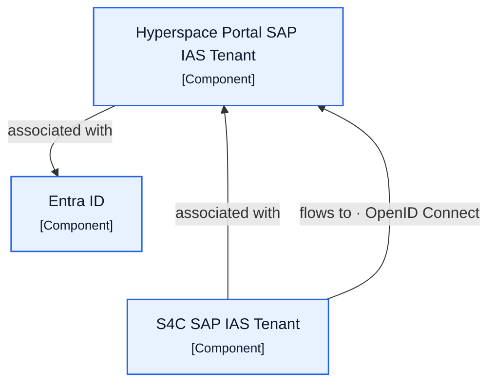
```mermaid
flowchart TB
    n2["Hyperspace Portal SAP IAS Tenant<br/><small>[Component]</small>"]
    n3["S4C SAP IAS Tenant<br/><small>[Component]</small>"]
    n1["Entra ID<br/><small>[Component]</small>"]
    classDef application fill:#E8F1FF,stroke:#2563EB,color:#0F172A,stroke-width:1.5px
    class n2,n3,n1 application
    n1 ~~~ n2
    n1 ~~~ n3
    n3 -->|"associated with"| n2
    n3 -->|"flows to · OpenID Connect"| n2
    n2 -->|"associated with"| n1
```

### Building Block Profile

| Attribute | Value |
| --- | --- |
| Architectural role | Application Component |

### Dependencies and Interactions

| Source | Relationship | Target | Context |
| --- | --- | --- | --- |
| Hyperspace Portal SAP IAS Tenant | Associated with | Entra ID | Current state |
| S4C SAP IAS Tenant | Associated with | Hyperspace Portal SAP IAS Tenant | Current state |
| S4C SAP IAS Tenant | Flows to | Hyperspace Portal SAP IAS Tenant | Current state |

### 3.2.16 Image Service

#### Dependencies and Interfaces

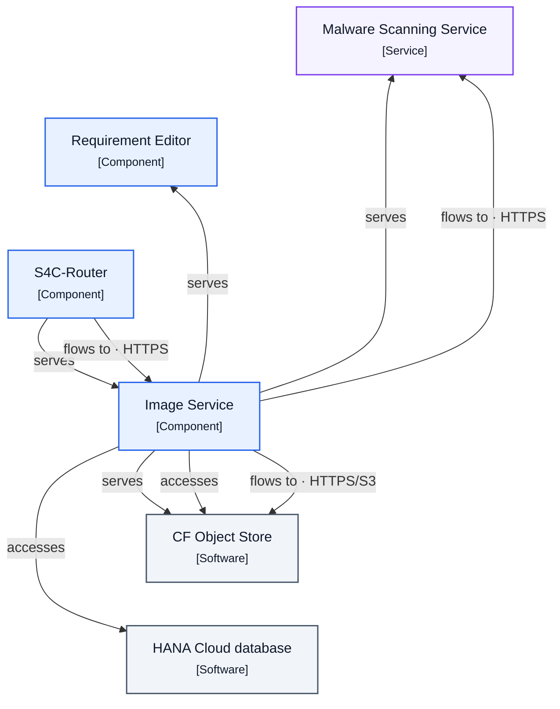
```mermaid
flowchart TB
    n4["Malware Scanning Service<br/><small>[Service]</small>"]
    n6["S4C-Router<br/><small>[Component]</small>"]
    n1["CF Object Store<br/><small>[Software]</small>"]
    n2["HANA Cloud database<br/><small>[Software]</small>"]
    n5["Requirement Editor<br/><small>[Component]</small>"]
    n3["Image Service<br/><small>[Component]</small>"]
    classDef application fill:#E8F1FF,stroke:#2563EB,color:#0F172A,stroke-width:1.5px
    class n6,n5,n3 application
    classDef behavior fill:#F5F3FF,stroke:#7C3AED,color:#0F172A,stroke-width:1.5px
    class n4 behavior
    classDef technology fill:#F1F5F9,stroke:#475569,color:#0F172A,stroke-width:1.5px
    class n1,n2 technology
    n1 ~~~ n2 ~~~ n3
    n4 ~~~ n5 ~~~ n6
    n1 ~~~ n4
    n3 -->|"serves"| n4
    n3 -->|"accesses"| n2
    n3 -->|"serves"| n1
    n6 -->|"serves"| n3
    n3 -->|"accesses"| n1
    n3 -->|"flows to · HTTPS/S3"| n1
    n6 -->|"flows to · HTTPS"| n3
    n3 -->|"serves"| n5
    n3 -->|"flows to · HTTPS"| n4
```

### Building Block Profile

| Attribute | Value |
| --- | --- |
| Architectural role | Application Component |
| Purpose | The Image Service stores pictures that are contained in the description of Requirements. |
| Responsibility | Stores and manages pictures and metadata contained in the description of Requirements |

### Dependencies and Interactions

| Source | Relationship | Target | Context |
| --- | --- | --- | --- |
| Image Service | Accesses | CF Object Store | Current state |
| Image Service | Accesses | HANA Cloud database | Current state |
| Image Service | Flows to | CF Object Store | Current state |
| Image Service | Flows to | Malware Scanning Service | Current state |
| Image Service | Serves | CF Object Store | Current state |
| Image Service | Serves | Malware Scanning Service | Current state |
| Image Service | Serves | Requirement Editor | Current state |
| S4C-Router | Flows to | Image Service | Current state |
| S4C-Router | Serves | Image Service | Current state |
| SAP BTP Subaccount | Contains | Image Service | Current state |
| Sirius4Cloud | Contains | Image Service | Target state |

### 3.2.17 Local PC

#### Dependencies and Interfaces

```mermaid
flowchart TB
    n1["Local PC<br/><small>[Node]</small>"]
    n2["S4C-Router<br/><small>[Component]</small>"]
    classDef application fill:#E8F1FF,stroke:#2563EB,color:#0F172A,stroke-width:1.5px
    class n2 application
    classDef technology fill:#F1F5F9,stroke:#475569,color:#0F172A,stroke-width:1.5px
    class n1 technology
    n1 ~~~ n2
    n2 -->|"serves"| n1
    n1 -->|"flows to · HTTPS"| n2
```

### Building Block Profile

| Attribute | Value |
| --- | --- |
| Architectural role | Node |

### Dependencies and Interactions

| Source | Relationship | Target | Context |
| --- | --- | --- | --- |
| Local PC | Flows to | S4C-Router | Current state |
| S4C-Router | Serves | Local PC | Current state |

### 3.2.18 Product Standard Requirements MCP server

#### Dependencies and Interfaces

```mermaid
flowchart TB
    n1["Cloud logging<br/><small>[Service]</small>"]
    n4["Requirement Editor API App<br/><small>[Component]</small>"]
    n3["Requirement Editor<br/><small>[Component]</small>"]
    n2["Product Standard Requirements MCP server<br/><small>[Component]</small>"]
    n5["XSUAA<br/><small>[Component]</small>"]
    classDef application fill:#E8F1FF,stroke:#2563EB,color:#0F172A,stroke-width:1.5px
    class n4,n3,n2,n5 application
    classDef behavior fill:#F5F3FF,stroke:#7C3AED,color:#0F172A,stroke-width:1.5px
    class n1 behavior
    n1 ~~~ n2 ~~~ n3
    n4 ~~~ n5
    n1 ~~~ n4
    n4 -->|"serves"| n2
    n2 -->|"flows to · HTTPS"| n1
    n2 -->|"flows to"| n3
    n2 -->|"flows to · HTTPS"| n4
    n2 -->|"accesses"| n1
    n2 -->|"serves"| n1
    n5 -->|"flows to · HTTPS"| n2
```

### Building Block Profile

| Attribute | Value |
| --- | --- |
| Architectural role | Application Component |
| Purpose | Product Standard Requirement MCP server provide ability to LLM to connect to the Requirement Editor API to extract requirements data and use it for further processing and provide developers relevant hints and feed AI agents with necessary information. |
| Responsibility | Provides ability to LLM to connect to Requirement Editor API to extract requirements data |
| Framework | FastMCP |

### Dependencies and Interactions

| Source | Relationship | Target | Context |
| --- | --- | --- | --- |
| Product Standard Requirements MCP server | Accesses | Cloud logging | Current state |
| Product Standard Requirements MCP server | Flows to | Cloud logging | Current state |
| Product Standard Requirements MCP server | Flows to | Requirement Editor | Current state |
| Product Standard Requirements MCP server | Flows to | Requirement Editor API App | Current state |
| Product Standard Requirements MCP server | Serves | Cloud logging | Current state |
| Requirement Editor API App | Serves | Product Standard Requirements MCP server | Current state |
| SAP BTP Subaccount | Contains | Product Standard Requirements MCP server | Current state |
| Sirius4Cloud | Contains | Product Standard Requirements MCP server | Target state |
| XSUAA | Flows to | Product Standard Requirements MCP server | Current state |

### 3.2.19 Program Management Component Service

#### Dependencies and Interfaces

```mermaid
flowchart TB
    n3["HyCoM API Service<br/><small>[Component]</small>"]
    n6["Program Management Service<br/><small>[Component]</small>"]
    n7["S4C-Router<br/><small>[Component]</small>"]
    n2["HANA Cloud database<br/><small>[Software]</small>"]
    n1["GCP Pub/Sub Event Handler<br/><small>[Software]</small>"]
    n4["Hyperspace Portal Backend<br/><small>[Component]</small>"]
    n5["Program Management Component Service<br/><small>[Component]</small>"]
    classDef application fill:#E8F1FF,stroke:#2563EB,color:#0F172A,stroke-width:1.5px
    class n3,n6,n7,n4,n5 application
    classDef technology fill:#F1F5F9,stroke:#475569,color:#0F172A,stroke-width:1.5px
    class n2,n1 technology
    n1 ~~~ n2 ~~~ n3
    n4 ~~~ n5 ~~~ n6
    n1 ~~~ n4
    n4 ~~~ n7
    n5 -->|"serves"| n3
    n5 -->|"serves"| n4
    n7 -->|"serves"| n5
    n5 -->|"flows to · HTTPS"| n6
    n5 -->|"accesses"| n2
    n5 -->|"flows to · HTTPS"| n1
    n3 -->|"flows to · HTTPS"| n5
    n5 -->|"flows to · HTTPS · gRPC"| n4
    n5 -->|"serves"| n6
    n6 -->|"serves"| n5
    n3 -->|"serves"| n5
    n7 -->|"flows to · HTTPS"| n5
```

### Building Block Profile

| Attribute | Value |
| --- | --- |
| Architectural role | Application Component |
| Purpose | The Program Management Component Service allows to link Components that are defined in the Hyperspace Portal with a Continuous Program. |
| Responsibility | Links Components defined in Hyperspace Portal with a Continuous Program |

### Dependencies and Interactions

| Source | Relationship | Target | Context |
| --- | --- | --- | --- |
| HyCoM API Service | Flows to | Program Management Component Service | Current state |
| HyCoM API Service | Serves | Program Management Component Service | Target state |
| Program Management Component Service | Accesses | HANA Cloud database | Current state |
| Program Management Component Service | Flows to | GCP Pub/Sub Event Handler | Current state |
| Program Management Component Service | Flows to | Hyperspace Portal Backend | Current state |
| Program Management Component Service | Flows to | Program Management Service | Current state |
| Program Management Component Service | Serves | HyCoM API Service | Current state |
| Program Management Component Service | Serves | Hyperspace Portal Backend | Current state |
| Program Management Component Service | Serves | Program Management Service | Target state |
| Program Management Service | Serves | Program Management Component Service | Current state |
| S4C-Router | Flows to | Program Management Component Service | Current state |
| S4C-Router | Serves | Program Management Component Service | Current state · Target state |
| SAP BTP Subaccount | Contains | Program Management Component Service | Current state |
| Sirius4Cloud | Contains | Program Management Component Service | Target state |

### 3.2.20 Program Management Overview Service

#### Dependencies and Interfaces

```mermaid
flowchart TB
    n3["Program Management Service<br/><small>[Component]</small>"]
    n4["S4C-Router<br/><small>[Component]</small>"]
    n2["Program Management Overview Service<br/><small>[Component]</small>"]
    n1["Hyperspace Portal Backend<br/><small>[Component]</small>"]
    n5["SAP IT SCC CloudConnector<br/><small>[Software]</small>"]
    classDef application fill:#E8F1FF,stroke:#2563EB,color:#0F172A,stroke-width:1.5px
    class n3,n4,n2,n1 application
    classDef technology fill:#F1F5F9,stroke:#475569,color:#0F172A,stroke-width:1.5px
    class n5 technology
    n1 ~~~ n2 ~~~ n3
    n4 ~~~ n5
    n1 ~~~ n4
    n4 -->|"flows to · HTTPS"| n2
    n2 -->|"flows to · gRPC"| n1
    n2 -->|"serves"| n5
    n2 -->|"flows to · HTTPS"| n3
    n2 -->|"serves"| n1
    n3 -->|"serves"| n2
    n4 -->|"serves"| n2
    n2 -->|"serves"| n3
    n2 -->|"flows to"| n5
```

### Building Block Profile

| Attribute | Value |
| --- | --- |
| Architectural role | Application Component |
| Purpose | The Program Management Overview Service provides an overview of data belonging to a Continuous Program. |
| Responsibility | Provides an overview of data belonging to a Continuous Program such as name and Responsibility Area |

### Dependencies and Interactions

| Source | Relationship | Target | Context |
| --- | --- | --- | --- |
| Program Management Overview Service | Flows to | Hyperspace Portal Backend | Current state |
| Program Management Overview Service | Flows to | Program Management Service | Current state |
| Program Management Overview Service | Flows to | SAP IT SCC CloudConnector | Current state |
| Program Management Overview Service | Serves | Hyperspace Portal Backend | Current state |
| Program Management Overview Service | Serves | Program Management Service | Target state |
| Program Management Overview Service | Serves | SAP IT SCC CloudConnector | Current state |
| Program Management Service | Serves | Program Management Overview Service | Current state |
| S4C-Router | Flows to | Program Management Overview Service | Current state |
| S4C-Router | Serves | Program Management Overview Service | Target state · Current state |
| SAP BTP Subaccount | Contains | Program Management Overview Service | Current state |
| Sirius4Cloud | Contains | Program Management Overview Service | Target state |

### 3.2.21 Program Management Service

#### Dependencies and Interfaces

```mermaid
flowchart TB
    n6["Program Management Service<br/><small>[Component]</small>"]
    n7["S4C-Router<br/><small>[Component]</small>"]
    n2["HANA Cloud database<br/><small>[Software]</small>"]
    n5["Program Management Overview Service<br/><small>[Component]</small>"]
    n1["GCP Pub/Sub Event Handler<br/><small>[Software]</small>"]
    n3["Hyperspace Portal Backend<br/><small>[Component]</small>"]
    n4["Program Management Component Service<br/><small>[Component]</small>"]
    classDef application fill:#E8F1FF,stroke:#2563EB,color:#0F172A,stroke-width:1.5px
    class n6,n7,n5,n3,n4 application
    classDef technology fill:#F1F5F9,stroke:#475569,color:#0F172A,stroke-width:1.5px
    class n2,n1 technology
    n1 ~~~ n2 ~~~ n3
    n4 ~~~ n5 ~~~ n6
    n1 ~~~ n4
    n4 ~~~ n7
    n6 -->|"accesses"| n2
    n3 -->|"flows to · HTTPS"| n6
    n4 -->|"flows to · HTTPS"| n6
    n6 -->|"flows to · gRPC · HTTPS"| n3
    n3 -->|"serves"| n6
    n5 -->|"flows to · HTTPS"| n6
    n6 -->|"flows to · HTTPS"| n1
    n6 -->|"serves"| n5
    n4 -->|"serves"| n6
    n7 -->|"serves"| n6
    n6 -->|"serves"| n4
    n5 -->|"serves"| n6
    n7 -->|"flows to · HTTPS"| n6
    n6 -->|"serves"| n3
```

### Building Block Profile

| Attribute | Value |
| --- | --- |
| Architectural role | Application Component |
| Purpose | The Program Management Service stores the attributes of Continuous Programs. In the UI new Continuous Programs can be created, and existing Continuous Program can be updated. |
| Responsibility | Stores and maintains attributes of Continuous Programs |

### Dependencies and Interactions

| Source | Relationship | Target | Context |
| --- | --- | --- | --- |
| Hyperspace Portal Backend | Flows to | Program Management Service | Current state |
| Hyperspace Portal Backend | Serves | Program Management Service | Current state |
| Program Management Component Service | Flows to | Program Management Service | Current state |
| Program Management Component Service | Serves | Program Management Service | Target state |
| Program Management Overview Service | Flows to | Program Management Service | Current state |
| Program Management Overview Service | Serves | Program Management Service | Target state |
| Program Management Service | Accesses | HANA Cloud database | Current state |
| Program Management Service | Flows to | GCP Pub/Sub Event Handler | Current state |
| Program Management Service | Flows to | Hyperspace Portal Backend | Current state |
| Program Management Service | Serves | Hyperspace Portal Backend | Current state |
| Program Management Service | Serves | Program Management Component Service | Current state |
| Program Management Service | Serves | Program Management Overview Service | Current state |
| S4C-Router | Flows to | Program Management Service | Current state |
| S4C-Router | Serves | Program Management Service | Current state · Target state |
| SAP BTP Subaccount | Contains | Program Management Service | Current state |
| Sirius4Cloud | Contains | Program Management Service | Target state |

### 3.2.22 Requirement Editor

#### Dependencies and Interfaces

```mermaid
flowchart TB
    n2["HyCoM API Service<br/><small>[Component]</small>"]
    n3["IF* ABAP System<br/><small>[Component]</small>"]
    n6[("Project Unify Requirement Repository<br/><small>[Artifact]</small>")]
    n8["Sirius4Cloud<br/><small>[Component]</small>"]
    n7["Requirement Editor<br/><small>[Component]</small>"]
    n5["Product Standard Requirements MCP server<br/><small>[Component]</small>"]
    n1["GCP Pub/Sub Event Handler<br/><small>[Software]</small>"]
    n4["Image Service<br/><small>[Component]</small>"]
    classDef application fill:#E8F1FF,stroke:#2563EB,color:#0F172A,stroke-width:1.5px
    class n2,n3,n8,n7,n5,n4 application
    classDef data fill:#ECFDF5,stroke:#059669,color:#0F172A,stroke-width:1.5px
    class n6 data
    classDef technology fill:#F1F5F9,stroke:#475569,color:#0F172A,stroke-width:1.5px
    class n1 technology
    n1 ~~~ n2 ~~~ n3
    n4 ~~~ n5 ~~~ n6
    n7 ~~~ n8
    n1 ~~~ n4
    n4 ~~~ n7
    n6 -->|"flows to"| n7
    n8 -.->|"Contains (Composition)"| n7
    n5 -->|"flows to"| n7
    n3 -->|"flows to"| n7
    n2 -->|"flows to"| n7
    n7 -->|"flows to · HTTPS"| n1
    n4 -->|"serves"| n7
```

### Building Block Profile

| Attribute | Value |
| --- | --- |
| Architectural role | Application Component |
| Purpose | This application stores and distributes the master data of requirements that need to be fulfilled and documented in order to be compliant to HyCoM and Sirius. |
| Framework | NestJS |

### Dependencies and Interactions

| Source | Relationship | Target | Context |
| --- | --- | --- | --- |
| HyCoM API Service | Flows to | Requirement Editor | Current state |
| IF* ABAP System | Flows to | Requirement Editor | Current state |
| Image Service | Serves | Requirement Editor | Current state |
| Product Standard Requirements MCP server | Flows to | Requirement Editor | Current state |
| Project Unify Requirement Repository | Flows to | Requirement Editor | Current state |
| Requirement Editor | Flows to | GCP Pub/Sub Event Handler | Current state |
| Requirement Editor | Serves | SAP IT SCC CloudConnector | Current state |
| Requirement Editor Central Content Manager | Accesses | Requirement Editor | Current state |
| Sirius4Cloud | Contains | Requirement Editor | Target state · Current state |

### 3.2.23 Requirement Editor API App

#### Dependencies and Interfaces

```mermaid
flowchart TB
    n3["HyCoM API Service<br/><small>[Component]</small>"]
    n4["IF* ABAP System<br/><small>[Component]</small>"]
    n8["S4C-Router<br/><small>[Component]</small>"]
    n6[("Project Unify Requirement Repository<br/><small>[Artifact]</small>")]
    n2["HANA Cloud database<br/><small>[Software]</small>"]
    n7["Requirement Editor API App<br/><small>[Component]</small>"]
    n5["Product Standard Requirements MCP server<br/><small>[Component]</small>"]
    n1["GCP Pub/Sub Event Handler<br/><small>[Software]</small>"]
    classDef application fill:#E8F1FF,stroke:#2563EB,color:#0F172A,stroke-width:1.5px
    class n3,n4,n8,n7,n5 application
    classDef data fill:#ECFDF5,stroke:#059669,color:#0F172A,stroke-width:1.5px
    class n6 data
    classDef technology fill:#F1F5F9,stroke:#475569,color:#0F172A,stroke-width:1.5px
    class n2,n1 technology
    n1 ~~~ n2 ~~~ n3
    n4 ~~~ n5 ~~~ n6
    n7 ~~~ n8
    n1 ~~~ n4
    n4 ~~~ n7
    n7 -->|"accesses"| n2
    n7 -->|"serves"| n5
    n5 -->|"flows to · HTTPS"| n7
    n6 -->|"flows to · HTTPS"| n7
    n3 -->|"flows to · HTTPS"| n7
    n7 -->|"serves"| n3
    n7 -->|"flows to"| n1
    n8 -->|"serves"| n7
    n7 -->|"associated with · HTTPS · asynchronous"| n1
    n7 -->|"serves"| n1
    n4 -->|"flows to"| n7
    n3 -->|"serves"| n7
    n8 -->|"flows to · HTTPS"| n7
```

### Building Block Profile

| Attribute | Value |
| --- | --- |
| Architectural role | Application Component |
| Description | The Requirement Editor API application is a NodeJS/NestJS application that provides all backend APIs for the Requirement Editor. All APIs can only be accessed via HTTPS. |
| Responsibility | Provides backend APIs for the Requirement Editor and processes Requirements and their metadata |
| Runtime | NodeJS |
| Framework | NestJS |

### Dependencies and Interactions

| Source | Relationship | Target | Context |
| --- | --- | --- | --- |
| HyCoM API Service | Flows to | Requirement Editor API App | Current state |
| HyCoM API Service | Serves | Requirement Editor API App | Target state |
| IF* ABAP System | Flows to | Requirement Editor API App | Current state |
| Product Standard Requirements MCP server | Flows to | Requirement Editor API App | Current state |
| Project Unify Requirement Repository | Flows to | Requirement Editor API App | Current state |
| Requirement Editor API App | Accesses | HANA Cloud database | Current state · Target state |
| Requirement Editor API App | Associated with | GCP Pub/Sub Event Handler | Target state |
| Requirement Editor API App | Associated with | SAP IT SCC CloudConnector | Target state |
| Requirement Editor API App | Flows to | GCP Pub/Sub Event Handler | Current state |
| Requirement Editor API App | Flows to | SAP IT SCC CloudConnector | Current state |
| Requirement Editor API App | Serves | GCP Pub/Sub Event Handler | Target state |
| Requirement Editor API App | Serves | HyCoM API Service | Current state |
| Requirement Editor API App | Serves | Product Standard Requirements MCP server | Current state |
| Requirement Editor API App | Serves | SAP IT SCC CloudConnector | Target state |
| S4C Project Unify Integration | Accesses | Requirement Editor API App | Current state |
| S4C-Router | Flows to | Requirement Editor API App | Current state |
| S4C-Router | Serves | Requirement Editor API App | Target state · Current state |
| SAP BTP Subaccount | Contains | Requirement Editor API App | Current state |

### 3.2.24 S4C SAP IAS Tenant

#### Dependencies and Interfaces

```mermaid
flowchart TB
    n1["Hyperspace Portal SAP IAS Tenant<br/><small>[Component]</small>"]
    n2["S4C SAP IAS Tenant<br/><small>[Component]</small>"]
    n3["XSUAA<br/><small>[Component]</small>"]
    classDef application fill:#E8F1FF,stroke:#2563EB,color:#0F172A,stroke-width:1.5px
    class n1,n2,n3 application
    n1 ~~~ n2
    n1 ~~~ n3
    n2 -->|"associated with"| n1
    n2 -->|"flows to · OpenID Connect"| n1
    n3 -->|"flows to · HTTPS/OIDC"| n2
```

### Building Block Profile

| Attribute | Value |
| --- | --- |
| Architectural role | Application Component |

### Dependencies and Interactions

| Source | Relationship | Target | Context |
| --- | --- | --- | --- |
| S4C SAP IAS Tenant | Associated with | Hyperspace Portal SAP IAS Tenant | Current state |
| S4C SAP IAS Tenant | Flows to | Hyperspace Portal SAP IAS Tenant | Current state |
| XSUAA | Flows to | S4C SAP IAS Tenant | Current state |

### 3.2.25 S4C-Router

#### Dependencies and Interfaces

```mermaid
flowchart TB
    n2["HyCoM API Service<br/><small>[Component]</small>"]
    n6["Program Management Service<br/><small>[Component]</small>"]
    n8["S4C-Router<br/><small>[Component]</small>"]
    n7["Requirement Editor API App<br/><small>[Component]</small>"]
    n5["Program Management Overview Service<br/><small>[Component]</small>"]
    n1["Backlog Tool Webhook Pub/Sub Connection Service<br/><small>[Component]</small>"]
    n3["Image Service<br/><small>[Component]</small>"]
    n4["Program Management Component Service<br/><small>[Component]</small>"]
    classDef application fill:#E8F1FF,stroke:#2563EB,color:#0F172A,stroke-width:1.5px
    class n2,n6,n8,n7,n5,n1,n3,n4 application
    n1 ~~~ n2 ~~~ n3
    n4 ~~~ n5 ~~~ n6
    n7 ~~~ n8
    n1 ~~~ n4
    n4 ~~~ n7
    n8 -->|"flows to · HTTPS"| n5
    n8 -->|"serves"| n3
    n8 -->|"serves"| n4
    n8 -->|"serves"| n2
    n8 -->|"serves"| n1
    n8 -->|"flows to · HTTPS"| n2
    n8 -->|"flows to · HTTPS"| n1
    n8 -->|"serves"| n7
    n8 -->|"serves"| n6
    n8 -->|"flows to · HTTPS"| n3
    n8 -->|"serves"| n5
    n8 -->|"flows to · HTTPS"| n6
    n8 -->|"flows to · HTTPS"| n7
    n8 -->|"flows to · HTTPS"| n4
```

### Building Block Profile

| Attribute | Value |
| --- | --- |
| Architectural role | Application Component |
| Responsibility | The S4C-Router is a NodeJS application that contains the SAP App Router. It handles incoming connections from the end users (connection 2) and forwards the requests to the different Frontend UI Server services (connection 3).; Handles incoming connections from end users and forwards requests to Frontend UI Server services and backend services; Handles incoming connections from the end users and forwards requests to frontend and backend services |
| Technology | NodeJS |
| Runtime | NodeJS |
| Framework | SAP App Router |

### Dependencies and Interactions

| Source | Relationship | Target | Context |
| --- | --- | --- | --- |
| Backlog Tool Jira in Zone 3 | Flows to | S4C-Router | Current state |
| Backlog Tool Jira in Zone 5 | Flows to | S4C-Router | Current state |
| Local PC | Flows to | S4C-Router | Current state |
| S4C-Router | Flows to | Backlog Tool Webhook Pub/Sub Connection Service | Current state |
| S4C-Router | Flows to | Frontend UI Server Services | Current state |
| S4C-Router | Flows to | HyCoM API Service | Current state |
| S4C-Router | Flows to | Image Service | Current state |
| S4C-Router | Flows to | Program Management Component Service | Current state |
| S4C-Router | Flows to | Program Management Overview Service | Current state |
| S4C-Router | Flows to | Program Management Service | Current state |
| S4C-Router | Flows to | Requirement Editor API App | Current state |
| S4C-Router | Flows to | XSUAA | Current state |
| S4C-Router | Serves | Backlog Tool Webhook Pub/Sub Connection Service | Current state · Target state |
| S4C-Router | Serves | Frontend UI Server Services | Current state · Target state |
| S4C-Router | Serves | HyCoM API Service | Current state · Target state |
| S4C-Router | Serves | Image Service | Current state |
| S4C-Router | Serves | Local PC | Current state |
| S4C-Router | Serves | Program Management Component Service | Current state · Target state |
| S4C-Router | Serves | Program Management Overview Service | Target state · Current state |
| S4C-Router | Serves | Program Management Service | Current state · Target state |
| S4C-Router | Serves | Requirement Editor API App | Target state · Current state |
| S4C-Router | Serves | XSUAA | Current state |
| SAP BTP Subaccount | Contains | S4C-Router | Current state |
| Sirius4Cloud | Contains | S4C-Router | Target state |

### 3.2.26 SAP IDM / ARM

#### Dependencies and Interfaces

```mermaid
flowchart TB
    n1(["Requirement Editor Central Content Manager<br/><small>[Person]</small>"])
    n2["SAP IDM / ARM<br/><small>[Component]</small>"]
    n3(["Sirius4Cloud Application Administrator<br/><small>[Person]</small>"])
    classDef application fill:#E8F1FF,stroke:#2563EB,color:#0F172A,stroke-width:1.5px
    class n2 application
    classDef other fill:#F8FAFC,stroke:#64748B,color:#0F172A,stroke-width:1.5px
    class n1,n3 other
    n1 ~~~ n2
    n1 ~~~ n3
    n2 -->|"serves"| n3
    n2 -->|"serves"| n1
```

### Building Block Profile

| Attribute | Value |
| --- | --- |
| Architectural role | Application Component |

### Dependencies and Interactions

| Source | Relationship | Target | Context |
| --- | --- | --- | --- |
| SAP IDM / ARM | Serves | Requirement Editor Central Content Manager | Current state |
| SAP IDM / ARM | Serves | Sirius4Cloud Application Administrator | Current state |

### 3.2.27 Sirius4Cloud

#### Dependencies and Interfaces

```mermaid
flowchart TB
    subgraph g1["Sirius4Cloud boundary"]
        direction TB
        n7["Sirius4Cloud<br/><small>[Component]</small>"]
        n4["HyCoM<br/><small>[Component]</small>"]
        n5["Requirement Editor<br/><small>[Component]</small>"]
    end
    n3(["End User<br/><small>[Person]</small>"])
    n2["Document Compliance to External and Internal Standards Goal<br/><small>[Goal]</small>"]
    n1["Audit Evidence Availability Goal<br/><small>[Goal]</small>"]
    n6["SAP BTP Subaccount<br/><small>[Environment]</small>"]
    classDef application fill:#E8F1FF,stroke:#2563EB,color:#0F172A,stroke-width:1.5px
    class n4,n7,n5 application
    classDef motivation fill:#FFF1F2,stroke:#BE123C,color:#0F172A,stroke-width:1.5px
    class n2,n1 motivation
    classDef other fill:#F8FAFC,stroke:#64748B,color:#0F172A,stroke-width:1.5px
    class n3 other
    classDef technology fill:#F1F5F9,stroke:#475569,color:#0F172A,stroke-width:1.5px
    class n6 technology
    style g1 fill:#EFF6FF,stroke:#2563EB,stroke-width:1.5px
    n1 ~~~ n2 ~~~ n3
    n4 ~~~ n5 ~~~ n6
    n1 ~~~ n4
    n4 ~~~ n7
    n7 -.->|"Contains (Composition)"| n4
    n7 -.->|"Contains (Composition)"| n5
    n7 -->|"realizes"| n2
    n7 -->|"realizes"| n1
    n6 -->|"assigned to"| n7
    n7 -->|"serves"| n3
    n7 -->|"assigned to"| n6
```

### Building Block Profile

| Attribute | Value |
| --- | --- |
| Architectural role | Application Component |
| Description | Sirius4Cloud is the successor of Sirius focusing on cloud products and the changed release process needed for cloud product development. The application is implemented completely new as a cloud-native application and is deployed in a dedicated BTP Subaccount.; Sirius4Cloud is used to document the compliance of SAPs product development to compliance requirements that are needed to fulfil external standards like ISO and SOX and internal standards. |
| Purpose | Sirius4Cloud is used to document the compliance of SAPs product development to compliance requirements that are needed to fulfil external standards like ISO and SOX and internal standards. In addition, it ensures that product development has the necessary evidence available for external and internal audits.; Document compliance of SAP product development to compliance requirements for external standards like ISO and SOX and internal standards, and ensure audit evidence availability.; Document compliance of SAP product development to external and internal standards and ensure evidence availability for audits |
| Technology | cloud-native |

### Dependencies and Interactions

| Source | Relationship | Target | Context |
| --- | --- | --- | --- |
| SAP BTP Subaccount | Assigned to | Sirius4Cloud | Current state |
| Sirius4Cloud | Assigned to | SAP BTP Subaccount | Current state |
| Sirius4Cloud | Contains | Backlog Persistence Service | Target state |
| Sirius4Cloud | Contains | Backlog Tool Webhook Pub/Sub Connection Service | Target state |
| Sirius4Cloud | Contains | Frontend UI Server Services | Target state |
| Sirius4Cloud | Contains | Generative AI Service | Target state |
| Sirius4Cloud | Contains | HSP Interface Service | Target state |
| Sirius4Cloud | Contains | HyCoM | Current state · Target state |
| Sirius4Cloud | Contains | Image Service | Target state |
| Sirius4Cloud | Contains | Product Standard Requirements MCP server | Target state |
| Sirius4Cloud | Contains | Program Management Component Service | Target state |
| Sirius4Cloud | Contains | Program Management Overview Service | Target state |
| Sirius4Cloud | Contains | Program Management Service | Target state |
| Sirius4Cloud | Contains | Requirement Editor | Target state · Current state |
| Sirius4Cloud | Contains | S4C-Router | Target state |
| Sirius4Cloud | Realizes | Audit Evidence Availability Goal | Target state |
| Sirius4Cloud | Realizes | Document Compliance to External and Internal Standards Goal | Target state |
| Sirius4Cloud | Serves | End User | Target state |

### 3.2.28 XSUAA

#### Dependencies and Interfaces

```mermaid
flowchart TB
    n3["S4C-Router<br/><small>[Component]</small>"]
    n2["S4C SAP IAS Tenant<br/><small>[Component]</small>"]
    n1["Product Standard Requirements MCP server<br/><small>[Component]</small>"]
    n4["XSUAA<br/><small>[Component]</small>"]
    classDef application fill:#E8F1FF,stroke:#2563EB,color:#0F172A,stroke-width:1.5px
    class n3,n2,n1,n4 application
    n1 ~~~ n2
    n3 ~~~ n4
    n1 ~~~ n3
    n3 -->|"flows to · HTTPS/OIDC"| n4
    n4 -->|"flows to · HTTPS/OIDC"| n2
    n3 -->|"serves"| n4
    n4 -->|"flows to · HTTPS"| n1
```

### Building Block Profile

| Attribute | Value |
| --- | --- |
| Architectural role | Application Component |

### Dependencies and Interactions

| Source | Relationship | Target | Context |
| --- | --- | --- | --- |
| S4C-Router | Flows to | XSUAA | Current state |
| S4C-Router | Serves | XSUAA | Current state |
| XSUAA | Flows to | Product Standard Requirements MCP server | Current state |
| XSUAA | Flows to | S4C SAP IAS Tenant | Current state |

## 3.3 Technology View

The solution's backend and service architecture relies heavily on the NodeJS runtime environment across several core components, including HyCoM API Service, Requirement Editor API App, Frontend UI Server Services, and S4C-Router. Within this runtime foundation, both the HyCoM API Service and Requirement Editor API App utilize NestJS as their application framework.

Specialized integration and infrastructure components incorporate distinct framework and observability technologies. The Product Standard Requirements MCP server implements the FastMCP framework, while Cloud logging capabilities are provided by OpenSearch.

### Architectural Properties

| Subject | Subject type | Property | Value |
| --- | --- | --- | --- |
| Cloud logging | Service | Technology | OpenSearch |
| Frontend UI Server Services | Application Component | Runtime | NodeJS |
| Frontend UI Server Services | Application Component | Runtime | NodeJS |
| GCP Pub/Sub Event Handler | System Software | Technology | Google Cloud Platform Pub/Sub |
| HANA Cloud database | System Software | Technology | SAP HANA Cloud |
| HyCoM API Service | Application Component | Framework | NestJS |
| HyCoM API Service | Application Component | Framework | NestJS |
| HyCoM API Service | Application Component | Runtime | NodeJS |
| HyCoM API Service | Application Component | Runtime | NodeJS |
| OpenTofu script | Artifact | Technology | OpenTofu |
| Product Standard Requirements MCP server | Application Component | Framework | FastMCP |
| Requirement Editor | Application Component | Framework | NestJS |
| Requirement Editor API App | Application Component | Framework | NestJS |
| Requirement Editor API App | Application Component | Framework | NestJS |
| Requirement Editor API App | Application Component | Runtime | NodeJS |
| Requirement Editor API App | Application Component | Runtime | NodeJS |
| S4C-Router | Application Component | Framework | SAP App Router |
| S4C-Router | Application Component | Framework | SAP App Router |
| S4C-Router | Application Component | Runtime | NodeJS |
| S4C-Router | Application Component | Runtime | NodeJS |
| S4C-Router | Application Component | Technology | NodeJS |
| Sirius4Cloud | Application Component | Technology | cloud-native |

## 3.4 Cross-Cutting Responsibilities and Dependencies

The S4C-Router acts as a central routing dependency across the landscape, serving multiple critical components. It provides foundational connectivity to Frontend UI Server Services, Backlog Tool Webhook Pub/Sub Connection Service, and the HyCoM API Service. In addition, S4C-Router serves the Image Service, Requirement Editor API App, Program Management Component Service, and Program Management Overview Service to enable broader platform interactions.

A network of internal dependencies supports core business operations and user-facing backends. The HyCoM API Service relies on the Backlog Persistence Service, Generative AI Service, Program Management Component Service, and Requirement Editor API App, while in turn serving the Hyperspace Portal Backend. Concurrently, the Hyperspace Portal Backend consumes services from both the Program Management Component Service and Program Management Overview Service, which are both supported by the foundational Program Management Service.

Additional service integrations enable specialized tooling across the architecture. The Requirement Editor API App serves the Product Standard Requirements Model Context Protocol (MCP) server, while the Image Service provides dedicated support to the Requirement Editor. Furthermore, the HyCoM API Service is responsible for pushing updates regarding product attributes and staffing directly to the Google Cloud Platform (GCP) Pub/Sub Service, enabling the IF* ABAP System to retrieve this data for downstream processing in the legacy Sirius application.

Operational responsibilities and compliance criteria are allocated across key administrative roles. The Requestor is responsible and accountable for ensuring that all established criteria are continuously satisfied. To maintain cloud security and operational standards, the SAP Business Technology Platform (BTP) Subaccount Administrator is explicitly assigned to execute the 90-day rotation of GCP Service Account Keys.

### Integration and Dependencies

| Source | Relationship | Target | Context |
| --- | --- | --- | --- |
| AI Review Process | Triggers | Prompt Sending to CPIT AI Core Process | Target state |
| AI Review Trigger Event | Triggers | AI Review Process | Current state · Target state |
| API Management for Cumulus Backend | Serves | HyCoM API Service | Current state |
| Backlog Persistence Service | Accesses | HANA Cloud database | Current state |
| Backlog Persistence Service | Flows to | Backlog Tool Jira in Zone 5 | Current state |
| Backlog Persistence Service | Flows to | GCP Pub/Sub Event Handler | Current state |
| Backlog Persistence Service | Flows to | HyCoM API Service | — |
| Backlog Persistence Service | Flows to | SAP IT SCC CloudConnector | Current state |
| Backlog Persistence Service | Serves | HyCoM API Service | Current state |
| Backlog Tool Jira in Zone 3 | Flows to | S4C-Router | Current state |
| Backlog Tool Jira in Zone 5 | Flows to | S4C-Router | Current state |
| Backlog Tool Webhook Pub/Sub Connection Service | Associated with | GCP Pub/Sub Event Handler | Target state |
| Backlog Tool Webhook Pub/Sub Connection Service | Flows to | Backlog Persistence Service | — |
| Backlog Tool Webhook Pub/Sub Connection Service | Flows to | GCP Pub/Sub Event Handler | Current state |
| Backlog Tool Webhook Pub/Sub Connection Service | Flows to | HyCoM API Service | — |
| BTP Subaccount Administrator | Assigned to | BTP Subaccount Administrative Operations | Current state |
| BTP Subaccount Administrator | Assigned to | GCP Service Account Keys 90-day rotation | Current state |
| CF Object Store | Accesses | Compliance Evidence Documents | Current state |
| CF Object Store | Accesses | Requirement Embedded Images | Current state |
| Cloud-native S4C Implementation Decision | Realizes | Document Compliance to External and Internal Standards Goal | Target state |
| CPIT AI Core | Serves | Generative AI Service | Current state |
| CPIT Subaccount | Contains | CPIT AI Core | Current state |
| CPIT Subaccount | Contains | CPIT XSUAA | Current state |
| Custom Code Security Testing Criterion | Realizes | SAP Product Standard Security Requirement | Target state |
| Data Encryption at Rest in CF Object Store | Realizes | SAP Product Standard Security Requirement | Target state |
| Data Encryption at Rest in GCP Pub/Sub | Realizes | SAP Product Standard Security Requirement | Target state |
| Data Encryption at Rest in HANA Cloud | Realizes | SAP Product Standard Security Requirement | Target state |
| Encrypted Connections Requirement | Mitigates | Unencrypted Exposed Endpoints Data Breach Risk | Current state |
| GCP Pub/Sub Event Handler | Flows to | IF* ABAP System | — |
| GCP Service Account Keys 90-day rotation | Mitigates | Credential Compromise Risk | Target state · Current state |
| Generative AI Service | Accesses | CF Object Store | Current state |
| Generative AI Service | Assigned to | Prompt Sending to CPIT AI Core Process | — |
| Generative AI Service | Associated with | CPIT AI Core | Target state |
| Generative AI Service | Flows to | CF Object Store | Current state |
| Generative AI Service | Flows to | CPIT AI Core | Current state |
| Generative AI Service | Flows to | CPIT XSUAA | Current state |
| Generative AI Service | Serves | CF Object Store | Current state |
| Generative AI Service | Serves | CPIT AI Core | Target state · Current state |
| Generative AI Service | Serves | CPIT XSUAA | Current state |
| Generative AI Service | Serves | HyCoM API Service | Current state |
| HANA Cloud database | Accesses | Continuous Program master data | Current state |
| HANA Cloud database | Accesses | Features and MicroDeliveries Data | Current state |
| HANA Cloud database | Accesses | Requirements Data | Current state |
| HSP Interface Service | Associated with | GCP Pub/Sub Event Handler | Target state |
| HSP Interface Service | Flows to | GCP Pub/Sub Event Handler | Current state |
| HyCoM API Service | Accesses | CF Object Store | Current state · Target state |
| HyCoM API Service | Accesses | HANA Cloud database | Current state · Target state |
| HyCoM API Service | Assigned to | Fetch and Process Updated Requirements Process | — |
| HyCoM API Service | Associated with | GCP Pub/Sub Event Handler | Target state |
| HyCoM API Service | Associated with | Generative AI Service | Target state |
| HyCoM API Service | Associated with | Hyperspace Portal Backend | Target state |
| HyCoM API Service | Associated with | SAP IT SCC CloudConnector | Target state |
| HyCoM API Service | Flows to | API Management for Cumulus Backend | Current state |
| HyCoM API Service | Flows to | Backlog Persistence Service | Current state |
| HyCoM API Service | Flows to | Backlog Tool Jira in Zone 5 | Current state |
| HyCoM API Service | Flows to | CF Object Store | Current state |
| HyCoM API Service | Flows to | GCP Pub/Sub Event Handler | Current state |
| HyCoM API Service | Flows to | Generative AI Service | Current state |
| HyCoM API Service | Flows to | HANA Cloud database | Current state |
| HyCoM API Service | Flows to | Hyperspace Portal Backend | Current state |
| HyCoM API Service | Flows to | Malware Scanning Service | Current state |
| HyCoM API Service | Flows to | Program Management Component Service | Current state |
| HyCoM API Service | Flows to | Requirement Editor | Current state |
| HyCoM API Service | Flows to | Requirement Editor API App | Current state |
| HyCoM API Service | Flows to | SAP IT SCC CloudConnector | Current state |
| HyCoM API Service | Serves | API Management for Cumulus Backend | Current state |
| HyCoM API Service | Serves | Backlog Persistence Service | Target state · Current state |
| HyCoM API Service | Serves | CF Object Store | Current state |
| HyCoM API Service | Serves | GCP Pub/Sub Event Handler | Target state |
| HyCoM API Service | Serves | Generative AI Service | Target state · Current state |
| HyCoM API Service | Serves | Hyperspace Portal Backend | Current state |
| HyCoM API Service | Serves | Malware Scanning Service | Current state |
| HyCoM API Service | Serves | Program Management Component Service | Target state |
| HyCoM API Service | Serves | Requirement Editor API App | Target state |
| HyCoM API Service | Serves | SAP IT SCC CloudConnector | Current state · Target state |
| Hyperspace Portal Backend | Flows to | GCP Pub/Sub Event Handler | Current state |
| Hyperspace Portal Backend | Flows to | Program Management Service | Current state |
| Hyperspace Portal Backend | Serves | Program Management Service | Current state |
| Hyperspace Portal SAP IAS Tenant | Associated with | Entra ID | Current state |
| IF* ABAP System | Flows to | Requirement Editor | Current state |
| IF* ABAP System | Flows to | Requirement Editor API App | Current state |
| Image Service | Accesses | CF Object Store | Current state |
| Image Service | Accesses | HANA Cloud database | Current state |
| Image Service | Flows to | CF Object Store | Current state |
| Image Service | Flows to | Malware Scanning Service | Current state |
| Image Service | Serves | CF Object Store | Current state |
| Image Service | Serves | Malware Scanning Service | Current state |
| Image Service | Serves | Requirement Editor | Current state |
| Local PC | Flows to | S4C-Router | Current state |
| Malware Scanning for Object Store Uploads and Downloads | Realizes | SAP Product Standard Security Requirement | Target state |
| PassVault Credential Rotation Control | Mitigates | Credential Compromise Risk | Current state · Target state |
| Product Standard Requirements MCP server | Accesses | Cloud logging | Current state |
| Product Standard Requirements MCP server | Flows to | Cloud logging | Current state |
| Product Standard Requirements MCP server | Flows to | Requirement Editor | Current state |
| Product Standard Requirements MCP server | Flows to | Requirement Editor API App | Current state |
| Product Standard Requirements MCP server | Serves | Cloud logging | Current state |
| Program Management Component Service | Accesses | HANA Cloud database | Current state |
| Program Management Component Service | Flows to | GCP Pub/Sub Event Handler | Current state |
| Program Management Component Service | Flows to | Hyperspace Portal Backend | Current state |
| Program Management Component Service | Flows to | Program Management Service | Current state |
| Program Management Component Service | Serves | HyCoM API Service | Current state |
| Program Management Component Service | Serves | Hyperspace Portal Backend | Current state |
| Program Management Component Service | Serves | Program Management Service | Target state |
| Program Management Overview Service | Flows to | Hyperspace Portal Backend | Current state |
| Program Management Overview Service | Flows to | Program Management Service | Current state |
| Program Management Overview Service | Flows to | SAP IT SCC CloudConnector | Current state |
| Program Management Overview Service | Serves | Hyperspace Portal Backend | Current state |
| Program Management Overview Service | Serves | Program Management Service | Target state |
| Program Management Overview Service | Serves | SAP IT SCC CloudConnector | Current state |
| Program Management Service | Accesses | HANA Cloud database | Current state |
| Program Management Service | Flows to | GCP Pub/Sub Event Handler | Current state |
| Program Management Service | Flows to | Hyperspace Portal Backend | Current state |
| Program Management Service | Serves | Hyperspace Portal Backend | Current state |
| Program Management Service | Serves | Program Management Component Service | Current state |
| Program Management Service | Serves | Program Management Overview Service | Current state |
| Project Unify Requirement Repository | Flows to | Requirement Editor | Current state |
| Project Unify Requirement Repository | Flows to | Requirement Editor API App | Current state |
| Publishing Requirement Version Event | Triggers | Fetch and Process Updated Requirements Process | Current state · Target state |
| Requirement Editor | Flows to | GCP Pub/Sub Event Handler | Current state |
| Requirement Editor | Serves | SAP IT SCC CloudConnector | Current state |
| Requirement Editor API App | Accesses | HANA Cloud database | Current state · Target state |
| Requirement Editor API App | Associated with | GCP Pub/Sub Event Handler | Target state |
| Requirement Editor API App | Associated with | SAP IT SCC CloudConnector | Target state |
| Requirement Editor API App | Flows to | GCP Pub/Sub Event Handler | Current state |
| Requirement Editor API App | Flows to | SAP IT SCC CloudConnector | Current state |
| Requirement Editor API App | Serves | GCP Pub/Sub Event Handler | Target state |
| Requirement Editor API App | Serves | HyCoM API Service | Current state |
| Requirement Editor API App | Serves | Product Standard Requirements MCP server | Current state |
| Requirement Editor API App | Serves | SAP IT SCC CloudConnector | Target state |
| Requirement Editor Central Content Manager | Accesses | Requirement Editor | Current state |
| S4C Project Unify Integration | Accesses | Requirement Editor API App | Current state |
| S4C SAP IAS Tenant | Associated with | Hyperspace Portal SAP IAS Tenant | Current state |
| S4C SAP IAS Tenant | Flows to | Hyperspace Portal SAP IAS Tenant | Current state |
| S4C-Router | Flows to | Backlog Tool Webhook Pub/Sub Connection Service | Current state |
| S4C-Router | Flows to | Frontend UI Server Services | Current state |
| S4C-Router | Flows to | HyCoM API Service | Current state |
| S4C-Router | Flows to | Image Service | Current state |
| S4C-Router | Flows to | Program Management Component Service | Current state |
| S4C-Router | Flows to | Program Management Overview Service | Current state |
| S4C-Router | Flows to | Program Management Service | Current state |
| S4C-Router | Flows to | Requirement Editor API App | Current state |
| S4C-Router | Flows to | XSUAA | Current state |
| S4C-Router | Serves | Backlog Tool Webhook Pub/Sub Connection Service | Current state · Target state |
| S4C-Router | Serves | Frontend UI Server Services | Current state · Target state |
| S4C-Router | Serves | HyCoM API Service | Current state · Target state |
| S4C-Router | Serves | Image Service | Current state |
| S4C-Router | Serves | Local PC | Current state |
| S4C-Router | Serves | Program Management Component Service | Current state · Target state |
| S4C-Router | Serves | Program Management Overview Service | Target state · Current state |
| S4C-Router | Serves | Program Management Service | Current state · Target state |
| S4C-Router | Serves | Requirement Editor API App | Target state · Current state |
| S4C-Router | Serves | XSUAA | Current state |
| SAP BTP Subaccount | Assigned to | Sirius4Cloud | Current state |
| SAP BTP Subaccount | Contains | Backlog Persistence Service | Current state |
| SAP BTP Subaccount | Contains | Backlog Tool Webhook Pub/Sub Connection Service | Current state |
| SAP BTP Subaccount | Contains | Frontend UI Server Services | Current state |
| SAP BTP Subaccount | Contains | Generative AI Service | Current state |
| SAP BTP Subaccount | Contains | HANA Cloud database | Current state |
| SAP BTP Subaccount | Contains | HSP Interface Service | Current state |
| SAP BTP Subaccount | Contains | HyCoM API Service | Current state |
| SAP BTP Subaccount | Contains | Image Service | Current state |
| SAP BTP Subaccount | Contains | Product Standard Requirements MCP server | Current state |
| SAP BTP Subaccount | Contains | Program Management Component Service | Current state |
| SAP BTP Subaccount | Contains | Program Management Overview Service | Current state |
| SAP BTP Subaccount | Contains | Program Management Service | Current state |
| SAP BTP Subaccount | Contains | Requirement Editor API App | Current state |
| SAP BTP Subaccount | Contains | S4C-Router | Current state |
| SAP Development-Tools Team Global Account | Contains | BTP SubAccount SSD | Current state |
| SAP Development-Tools Team Global Account | Contains | BTP SubAccount SSD-Dev | Current state |
| SAP Development-Tools Team Global Account | Contains | BTP SubAccount SSD-Test | Current state |
| SAP IDM / ARM | Serves | Requirement Editor Central Content Manager | Current state |
| SAP IDM / ARM | Serves | Sirius4Cloud Application Administrator | Current state |
| SAP IT SCC CloudConnector | Associated with | IF* ABAP System | Target state |
| SAP IT SCC CloudConnector | Flows to | Avatar Service | Current state |
| SAP IT SCC CloudConnector | Flows to | Backlog Tool Jira in Zone 3 | Current state |
| SAP IT SCC CloudConnector | Flows to | IF* ABAP System | Current state |
| SAP IT SCC CloudConnector | Serves | Avatar Service | Current state |
| SAP IT SCC CloudConnector | Serves | Cloud Connector Tunnel | Current state |
| SAP IT SCC CloudConnector | Serves | IF* ABAP System | Current state · Target state |
| Sirius Cloud Enhancement Complexity Assessment | Influences | Cloud-native S4C Implementation Decision | Target state |
| Sirius4Cloud | Assigned to | SAP BTP Subaccount | Current state |
| Sirius4Cloud | Contains | Backlog Persistence Service | Target state |
| Sirius4Cloud | Contains | Backlog Tool Webhook Pub/Sub Connection Service | Target state |
| Sirius4Cloud | Contains | Frontend UI Server Services | Target state |
| Sirius4Cloud | Contains | Generative AI Service | Target state |
| Sirius4Cloud | Contains | HSP Interface Service | Target state |
| Sirius4Cloud | Contains | HyCoM | Current state · Target state |
| Sirius4Cloud | Contains | Image Service | Target state |
| Sirius4Cloud | Contains | Product Standard Requirements MCP server | Target state |
| Sirius4Cloud | Contains | Program Management Component Service | Target state |
| Sirius4Cloud | Contains | Program Management Overview Service | Target state |
| Sirius4Cloud | Contains | Program Management Service | Target state |
| Sirius4Cloud | Contains | Requirement Editor | Target state · Current state |
| Sirius4Cloud | Contains | S4C-Router | Target state |
| Sirius4Cloud | Realizes | Audit Evidence Availability Goal | Target state |
| Sirius4Cloud | Realizes | Document Compliance to External and Internal Standards Goal | Target state |
| Sirius4Cloud | Serves | End User | Target state |
| Webhook IP Range Filter | Mitigates | Unauthorized Access Security Threat | Current state · Target state |
| Webhook IP Range Filter | Realizes | Strong Authentication for Internet Endpoints Requirement | Target state |
| XSUAA | Flows to | Product Standard Requirements MCP server | Current state |
| XSUAA | Flows to | S4C SAP IAS Tenant | Current state |

[Back to table of contents](#table-of-contents)

# 4. Data and Integration

## 4.1 Information and Data Stores

The HANA Cloud database operates as system software providing persistent storage that is encrypted at rest. It interfaces directly with core domain information, accessing Continuous Program master data as well as Features and MicroDeliveries Data. In addition, the database accesses Requirements Data to maintain systemwide specifications.

The information architecture encompasses key business and operational artifacts, centered on the Continuous Program business object. Supporting entities include Compliance Evidence Documents, which are categorized with a Confidential data classification. Complementary data objects also include Requirement Embedded Images to support system assets alongside the main program records.

### Data Stores and Access

```mermaid
flowchart TB
    subgraph g1["Application"]
        direction TB
        n3["Requirement Editor API App<br/><small>[Component]</small>"]
        n2["Requirement Editor<br/><small>[Component]</small>"]
    end
    subgraph g2["Technology"]
        direction TB
        n1[("Project Unify Requirement Repository<br/><small>[Artifact]</small>")]
    end
    classDef application fill:#E8F1FF,stroke:#2563EB,color:#0F172A,stroke-width:1.5px
    class n3,n2 application
    classDef data fill:#ECFDF5,stroke:#059669,color:#0F172A,stroke-width:1.5px
    class n1 data
    style g1 fill:#F8FAFC,stroke:#94A3B8,stroke-width:1.5px
    style g2 fill:#F8FAFC,stroke:#94A3B8,stroke-width:1.5px
    n1 ~~~ n2
    n1 ~~~ n3
    n1 -->|"flows to"| n2
    n1 -->|"flows to · HTTPS"| n3
```

### Data Concepts

| Name | Semantic type |
| --- | --- |
| Compliance Evidence Documents | Data Object |
| Continuous Program | Business Object |
| Continuous Program master data | Data Object |
| Features and MicroDeliveries Data | Data Object |
| OpenTofu script | Artifact |
| Project Unify Requirement Repository | Artifact |
| Requirement Embedded Images | Data Object |
| Requirements Data | Data Object |

## 4.2 Data Classification, Ownership and Lifecycle

The architecture establishes distinct data objects to govern program execution, delivery specifications, and assurance assets. Requirements Data is classified as Confidential and is owned by the Product Standard Owner. In parallel, Compliance Evidence Documents represent dedicated data objects that also carry a Confidential data classification.

Supporting continuous alignment across execution cycles, Continuous Program operates as a core business object within the landscape. This operational domain is maintained via Continuous Program master data alongside specialized data objects designated for Features and MicroDeliveries Data.

## 4.3 Integration Overview

The integration landscape relies heavily on asynchronous event-driven messaging anchored by the GCP Pub/Sub Event Handler, which facilitates asynchronous communication across several components. The Backlog Tool Webhook Pub/Sub Connection Service connects to the handler to transform incoming webhook calls from Backlog Tools into Pub/Sub events. Similarly, the HSP Interface Service interfaces with the GCP Pub/Sub Event Handler to reformat Pub/Sub events received from Hyperspace Portal and publish them again in an internal format.

Core services interact with the event handler and supporting services using a mix of asynchronous messaging and direct synchronous connections. The HyCoM API Service communicates asynchronously with the GCP Pub/Sub Event Handler over HTTPS, and the Requirement Editor API App likewise connects asynchronously to the handler using HTTPS. Beyond event handling, the HyCoM API Service maintains a gRPC association with the Hyperspace Portal Backend and establishes an HTTPS connection with the Generative AI Service secured by mTLS authentication.

### Integration and Data Flows

```mermaid
flowchart TB
    n2["HyCoM API Service<br/><small>[Component]</small>"]
    n4["Program Management Service<br/><small>[Component]</small>"]
    n1["Generative AI Service<br/><small>[Component]</small>"]
    n7["S4C-Router<br/><small>[Component]</small>"]
    n6["Requirement Editor API App<br/><small>[Component]</small>"]
    n5["Requirement Editor<br/><small>[Component]</small>"]
    n3["Program Management Component Service<br/><small>[Component]</small>"]
    classDef application fill:#E8F1FF,stroke:#2563EB,color:#0F172A,stroke-width:1.5px
    class n2,n4,n1,n7,n6,n5,n3 application
    n1 ~~~ n2 ~~~ n3
    n4 ~~~ n5 ~~~ n6
    n1 ~~~ n4
    n4 ~~~ n7
    n2 -->|"flows to · HTTPS"| n1
    n3 -->|"serves"| n2
    n2 -->|"flows to · HTTPS"| n6
    n3 -->|"flows to · HTTPS"| n4
    n7 -->|"flows to · HTTPS"| n2
    n6 -->|"serves"| n2
    n2 -->|"flows to"| n5
    n2 -->|"flows to · HTTPS"| n3
    n4 -->|"serves"| n3
    n1 -->|"serves"| n2
    n7 -->|"flows to · HTTPS"| n4
    n7 -->|"flows to · HTTPS"| n6
    n7 -->|"flows to · HTTPS"| n3
```

### Integration and Dependencies

| Source | Relationship | Target | Context |
| --- | --- | --- | --- |
| AI Review Process | Triggers | Prompt Sending to CPIT AI Core Process | Target state |
| AI Review Trigger Event | Triggers | AI Review Process | Current state · Target state |
| API Management for Cumulus Backend | Serves | HyCoM API Service | Current state |
| Backlog Persistence Service | Accesses | HANA Cloud database | Current state |
| Backlog Persistence Service | Flows to | Backlog Tool Jira in Zone 5 | Current state |
| Backlog Persistence Service | Flows to | GCP Pub/Sub Event Handler | Current state |
| Backlog Persistence Service | Flows to | HyCoM API Service | — |
| Backlog Persistence Service | Flows to | SAP IT SCC CloudConnector | Current state |
| Backlog Persistence Service | Serves | HyCoM API Service | Current state |
| Backlog Tool Jira in Zone 3 | Flows to | S4C-Router | Current state |
| Backlog Tool Jira in Zone 5 | Flows to | S4C-Router | Current state |
| Backlog Tool Webhook Pub/Sub Connection Service | Associated with | GCP Pub/Sub Event Handler | Target state |
| Backlog Tool Webhook Pub/Sub Connection Service | Flows to | Backlog Persistence Service | — |
| Backlog Tool Webhook Pub/Sub Connection Service | Flows to | GCP Pub/Sub Event Handler | Current state |
| Backlog Tool Webhook Pub/Sub Connection Service | Flows to | HyCoM API Service | — |
| BTP Subaccount Administrator | Assigned to | BTP Subaccount Administrative Operations | Current state |
| BTP Subaccount Administrator | Assigned to | GCP Service Account Keys 90-day rotation | Current state |
| CF Object Store | Accesses | Compliance Evidence Documents | Current state |
| CF Object Store | Accesses | Requirement Embedded Images | Current state |
| Cloud-native S4C Implementation Decision | Realizes | Document Compliance to External and Internal Standards Goal | Target state |
| CPIT AI Core | Serves | Generative AI Service | Current state |
| CPIT Subaccount | Contains | CPIT AI Core | Current state |
| CPIT Subaccount | Contains | CPIT XSUAA | Current state |
| Custom Code Security Testing Criterion | Realizes | SAP Product Standard Security Requirement | Target state |
| Data Encryption at Rest in CF Object Store | Realizes | SAP Product Standard Security Requirement | Target state |
| Data Encryption at Rest in GCP Pub/Sub | Realizes | SAP Product Standard Security Requirement | Target state |
| Data Encryption at Rest in HANA Cloud | Realizes | SAP Product Standard Security Requirement | Target state |
| Encrypted Connections Requirement | Mitigates | Unencrypted Exposed Endpoints Data Breach Risk | Current state |
| GCP Pub/Sub Event Handler | Flows to | IF* ABAP System | — |
| GCP Service Account Keys 90-day rotation | Mitigates | Credential Compromise Risk | Target state · Current state |
| Generative AI Service | Accesses | CF Object Store | Current state |
| Generative AI Service | Assigned to | Prompt Sending to CPIT AI Core Process | — |
| Generative AI Service | Associated with | CPIT AI Core | Target state |
| Generative AI Service | Flows to | CF Object Store | Current state |
| Generative AI Service | Flows to | CPIT AI Core | Current state |
| Generative AI Service | Flows to | CPIT XSUAA | Current state |
| Generative AI Service | Serves | CF Object Store | Current state |
| Generative AI Service | Serves | CPIT AI Core | Target state · Current state |
| Generative AI Service | Serves | CPIT XSUAA | Current state |
| Generative AI Service | Serves | HyCoM API Service | Current state |
| HANA Cloud database | Accesses | Continuous Program master data | Current state |
| HANA Cloud database | Accesses | Features and MicroDeliveries Data | Current state |
| HANA Cloud database | Accesses | Requirements Data | Current state |
| HSP Interface Service | Associated with | GCP Pub/Sub Event Handler | Target state |
| HSP Interface Service | Flows to | GCP Pub/Sub Event Handler | Current state |
| HyCoM API Service | Accesses | CF Object Store | Current state · Target state |
| HyCoM API Service | Accesses | HANA Cloud database | Current state · Target state |
| HyCoM API Service | Assigned to | Fetch and Process Updated Requirements Process | — |
| HyCoM API Service | Associated with | GCP Pub/Sub Event Handler | Target state |
| HyCoM API Service | Associated with | Generative AI Service | Target state |
| HyCoM API Service | Associated with | Hyperspace Portal Backend | Target state |
| HyCoM API Service | Associated with | SAP IT SCC CloudConnector | Target state |
| HyCoM API Service | Flows to | API Management for Cumulus Backend | Current state |
| HyCoM API Service | Flows to | Backlog Persistence Service | Current state |
| HyCoM API Service | Flows to | Backlog Tool Jira in Zone 5 | Current state |
| HyCoM API Service | Flows to | CF Object Store | Current state |
| HyCoM API Service | Flows to | GCP Pub/Sub Event Handler | Current state |
| HyCoM API Service | Flows to | Generative AI Service | Current state |
| HyCoM API Service | Flows to | HANA Cloud database | Current state |
| HyCoM API Service | Flows to | Hyperspace Portal Backend | Current state |
| HyCoM API Service | Flows to | Malware Scanning Service | Current state |
| HyCoM API Service | Flows to | Program Management Component Service | Current state |
| HyCoM API Service | Flows to | Requirement Editor | Current state |
| HyCoM API Service | Flows to | Requirement Editor API App | Current state |
| HyCoM API Service | Flows to | SAP IT SCC CloudConnector | Current state |
| HyCoM API Service | Serves | API Management for Cumulus Backend | Current state |
| HyCoM API Service | Serves | Backlog Persistence Service | Target state · Current state |
| HyCoM API Service | Serves | CF Object Store | Current state |
| HyCoM API Service | Serves | GCP Pub/Sub Event Handler | Target state |
| HyCoM API Service | Serves | Generative AI Service | Target state · Current state |
| HyCoM API Service | Serves | Hyperspace Portal Backend | Current state |
| HyCoM API Service | Serves | Malware Scanning Service | Current state |
| HyCoM API Service | Serves | Program Management Component Service | Target state |
| HyCoM API Service | Serves | Requirement Editor API App | Target state |
| HyCoM API Service | Serves | SAP IT SCC CloudConnector | Current state · Target state |
| Hyperspace Portal Backend | Flows to | GCP Pub/Sub Event Handler | Current state |
| Hyperspace Portal Backend | Flows to | Program Management Service | Current state |
| Hyperspace Portal Backend | Serves | Program Management Service | Current state |
| Hyperspace Portal SAP IAS Tenant | Associated with | Entra ID | Current state |
| IF* ABAP System | Flows to | Requirement Editor | Current state |
| IF* ABAP System | Flows to | Requirement Editor API App | Current state |
| Image Service | Accesses | CF Object Store | Current state |
| Image Service | Accesses | HANA Cloud database | Current state |
| Image Service | Flows to | CF Object Store | Current state |
| Image Service | Flows to | Malware Scanning Service | Current state |
| Image Service | Serves | CF Object Store | Current state |
| Image Service | Serves | Malware Scanning Service | Current state |
| Image Service | Serves | Requirement Editor | Current state |
| Local PC | Flows to | S4C-Router | Current state |
| Malware Scanning for Object Store Uploads and Downloads | Realizes | SAP Product Standard Security Requirement | Target state |
| PassVault Credential Rotation Control | Mitigates | Credential Compromise Risk | Current state · Target state |
| Product Standard Requirements MCP server | Accesses | Cloud logging | Current state |
| Product Standard Requirements MCP server | Flows to | Cloud logging | Current state |
| Product Standard Requirements MCP server | Flows to | Requirement Editor | Current state |
| Product Standard Requirements MCP server | Flows to | Requirement Editor API App | Current state |
| Product Standard Requirements MCP server | Serves | Cloud logging | Current state |
| Program Management Component Service | Accesses | HANA Cloud database | Current state |
| Program Management Component Service | Flows to | GCP Pub/Sub Event Handler | Current state |
| Program Management Component Service | Flows to | Hyperspace Portal Backend | Current state |
| Program Management Component Service | Flows to | Program Management Service | Current state |
| Program Management Component Service | Serves | HyCoM API Service | Current state |
| Program Management Component Service | Serves | Hyperspace Portal Backend | Current state |
| Program Management Component Service | Serves | Program Management Service | Target state |
| Program Management Overview Service | Flows to | Hyperspace Portal Backend | Current state |
| Program Management Overview Service | Flows to | Program Management Service | Current state |
| Program Management Overview Service | Flows to | SAP IT SCC CloudConnector | Current state |
| Program Management Overview Service | Serves | Hyperspace Portal Backend | Current state |
| Program Management Overview Service | Serves | Program Management Service | Target state |
| Program Management Overview Service | Serves | SAP IT SCC CloudConnector | Current state |
| Program Management Service | Accesses | HANA Cloud database | Current state |
| Program Management Service | Flows to | GCP Pub/Sub Event Handler | Current state |
| Program Management Service | Flows to | Hyperspace Portal Backend | Current state |
| Program Management Service | Serves | Hyperspace Portal Backend | Current state |
| Program Management Service | Serves | Program Management Component Service | Current state |
| Program Management Service | Serves | Program Management Overview Service | Current state |
| Project Unify Requirement Repository | Flows to | Requirement Editor | Current state |
| Project Unify Requirement Repository | Flows to | Requirement Editor API App | Current state |
| Publishing Requirement Version Event | Triggers | Fetch and Process Updated Requirements Process | Current state · Target state |
| Requirement Editor | Flows to | GCP Pub/Sub Event Handler | Current state |
| Requirement Editor | Serves | SAP IT SCC CloudConnector | Current state |
| Requirement Editor API App | Accesses | HANA Cloud database | Current state · Target state |
| Requirement Editor API App | Associated with | GCP Pub/Sub Event Handler | Target state |
| Requirement Editor API App | Associated with | SAP IT SCC CloudConnector | Target state |
| Requirement Editor API App | Flows to | GCP Pub/Sub Event Handler | Current state |
| Requirement Editor API App | Flows to | SAP IT SCC CloudConnector | Current state |
| Requirement Editor API App | Serves | GCP Pub/Sub Event Handler | Target state |
| Requirement Editor API App | Serves | HyCoM API Service | Current state |
| Requirement Editor API App | Serves | Product Standard Requirements MCP server | Current state |
| Requirement Editor API App | Serves | SAP IT SCC CloudConnector | Target state |
| Requirement Editor Central Content Manager | Accesses | Requirement Editor | Current state |
| S4C Project Unify Integration | Accesses | Requirement Editor API App | Current state |
| S4C SAP IAS Tenant | Associated with | Hyperspace Portal SAP IAS Tenant | Current state |
| S4C SAP IAS Tenant | Flows to | Hyperspace Portal SAP IAS Tenant | Current state |
| S4C-Router | Flows to | Backlog Tool Webhook Pub/Sub Connection Service | Current state |
| S4C-Router | Flows to | Frontend UI Server Services | Current state |
| S4C-Router | Flows to | HyCoM API Service | Current state |
| S4C-Router | Flows to | Image Service | Current state |
| S4C-Router | Flows to | Program Management Component Service | Current state |
| S4C-Router | Flows to | Program Management Overview Service | Current state |
| S4C-Router | Flows to | Program Management Service | Current state |
| S4C-Router | Flows to | Requirement Editor API App | Current state |
| S4C-Router | Flows to | XSUAA | Current state |
| S4C-Router | Serves | Backlog Tool Webhook Pub/Sub Connection Service | Current state · Target state |
| S4C-Router | Serves | Frontend UI Server Services | Current state · Target state |
| S4C-Router | Serves | HyCoM API Service | Current state · Target state |
| S4C-Router | Serves | Image Service | Current state |
| S4C-Router | Serves | Local PC | Current state |
| S4C-Router | Serves | Program Management Component Service | Current state · Target state |
| S4C-Router | Serves | Program Management Overview Service | Target state · Current state |
| S4C-Router | Serves | Program Management Service | Current state · Target state |
| S4C-Router | Serves | Requirement Editor API App | Target state · Current state |
| S4C-Router | Serves | XSUAA | Current state |
| SAP BTP Subaccount | Assigned to | Sirius4Cloud | Current state |
| SAP BTP Subaccount | Contains | Backlog Persistence Service | Current state |
| SAP BTP Subaccount | Contains | Backlog Tool Webhook Pub/Sub Connection Service | Current state |
| SAP BTP Subaccount | Contains | Frontend UI Server Services | Current state |
| SAP BTP Subaccount | Contains | Generative AI Service | Current state |
| SAP BTP Subaccount | Contains | HANA Cloud database | Current state |
| SAP BTP Subaccount | Contains | HSP Interface Service | Current state |
| SAP BTP Subaccount | Contains | HyCoM API Service | Current state |
| SAP BTP Subaccount | Contains | Image Service | Current state |
| SAP BTP Subaccount | Contains | Product Standard Requirements MCP server | Current state |
| SAP BTP Subaccount | Contains | Program Management Component Service | Current state |
| SAP BTP Subaccount | Contains | Program Management Overview Service | Current state |
| SAP BTP Subaccount | Contains | Program Management Service | Current state |
| SAP BTP Subaccount | Contains | Requirement Editor API App | Current state |
| SAP BTP Subaccount | Contains | S4C-Router | Current state |
| SAP Development-Tools Team Global Account | Contains | BTP SubAccount SSD | Current state |
| SAP Development-Tools Team Global Account | Contains | BTP SubAccount SSD-Dev | Current state |
| SAP Development-Tools Team Global Account | Contains | BTP SubAccount SSD-Test | Current state |
| SAP IDM / ARM | Serves | Requirement Editor Central Content Manager | Current state |
| SAP IDM / ARM | Serves | Sirius4Cloud Application Administrator | Current state |
| SAP IT SCC CloudConnector | Associated with | IF* ABAP System | Target state |
| SAP IT SCC CloudConnector | Flows to | Avatar Service | Current state |
| SAP IT SCC CloudConnector | Flows to | Backlog Tool Jira in Zone 3 | Current state |
| SAP IT SCC CloudConnector | Flows to | IF* ABAP System | Current state |
| SAP IT SCC CloudConnector | Serves | Avatar Service | Current state |
| SAP IT SCC CloudConnector | Serves | Cloud Connector Tunnel | Current state |
| SAP IT SCC CloudConnector | Serves | IF* ABAP System | Current state · Target state |
| Sirius Cloud Enhancement Complexity Assessment | Influences | Cloud-native S4C Implementation Decision | Target state |
| Sirius4Cloud | Assigned to | SAP BTP Subaccount | Current state |
| Sirius4Cloud | Contains | Backlog Persistence Service | Target state |
| Sirius4Cloud | Contains | Backlog Tool Webhook Pub/Sub Connection Service | Target state |
| Sirius4Cloud | Contains | Frontend UI Server Services | Target state |
| Sirius4Cloud | Contains | Generative AI Service | Target state |
| Sirius4Cloud | Contains | HSP Interface Service | Target state |
| Sirius4Cloud | Contains | HyCoM | Current state · Target state |
| Sirius4Cloud | Contains | Image Service | Target state |
| Sirius4Cloud | Contains | Product Standard Requirements MCP server | Target state |
| Sirius4Cloud | Contains | Program Management Component Service | Target state |
| Sirius4Cloud | Contains | Program Management Overview Service | Target state |
| Sirius4Cloud | Contains | Program Management Service | Target state |
| Sirius4Cloud | Contains | Requirement Editor | Target state · Current state |
| Sirius4Cloud | Contains | S4C-Router | Target state |
| Sirius4Cloud | Realizes | Audit Evidence Availability Goal | Target state |
| Sirius4Cloud | Realizes | Document Compliance to External and Internal Standards Goal | Target state |
| Sirius4Cloud | Serves | End User | Target state |
| Webhook IP Range Filter | Mitigates | Unauthorized Access Security Threat | Current state · Target state |
| Webhook IP Range Filter | Realizes | Strong Authentication for Internet Endpoints Requirement | Target state |
| XSUAA | Flows to | Product Standard Requirements MCP server | Current state |
| XSUAA | Flows to | S4C SAP IAS Tenant | Current state |

## 4.4 Interfaces, Protocols and Messaging

The HyCoM API Service establishes secure outbound connections to several backend components across port 443. It interfaces with the Generative AI Service over HTTPS using mutual Transport Layer Security (mTLS) Service User authentication. Communication to the Requirement Editor API App is also maintained over HTTPS on port 443, whereas the link to the Hyperspace Portal Backend utilizes gRPC over port 443.

Routing and integration across external endpoints and logging services rely uniformly on HTTPS on port 443. The Product Standard Requirements Model Context Protocol (MCP) server transmits data to Cloud logging with mTLS Service User authentication and connects directly to the Requirement Editor API App. Additionally, the S4C-Router directs traffic across port 443 via HTTPS toward both the Frontend UI Server Services and the Requirement Editor API App.

### Interfaces and Protocols

```mermaid
flowchart TB
    n1["Backlog Tool Jira in Zone 5<br/><small>[Component]</small>"]
    n3["HyCoM API Service<br/><small>[Component]</small>"]
    n6["Program Management Service<br/><small>[Component]</small>"]
    n2["Generative AI Service<br/><small>[Component]</small>"]
    n8["S4C-Router<br/><small>[Component]</small>"]
    n7["Requirement Editor API App<br/><small>[Component]</small>"]
    n4["Hyperspace Portal Backend<br/><small>[Component]</small>"]
    n5["Program Management Component Service<br/><small>[Component]</small>"]
    classDef application fill:#E8F1FF,stroke:#2563EB,color:#0F172A,stroke-width:1.5px
    class n1,n3,n6,n2,n8,n7,n4,n5 application
    n1 ~~~ n2 ~~~ n3
    n4 ~~~ n5 ~~~ n6
    n7 ~~~ n8
    n1 ~~~ n4
    n4 ~~~ n7
    n3 -->|"flows to · HTTPS"| n2
    n1 -->|"flows to · HTTPS"| n8
    n3 -->|"flows to · HTTPS"| n1
    n4 -->|"flows to · HTTPS"| n6
    n3 -->|"flows to · HTTPS"| n7
    n5 -->|"flows to · HTTPS"| n6
    n6 -->|"flows to · gRPC · HTTPS"| n4
    n8 -->|"flows to · HTTPS"| n3
    n3 -->|"flows to · HTTPS"| n5
    n5 -->|"flows to · HTTPS · gRPC"| n4
    n8 -->|"flows to · HTTPS"| n6
    n8 -->|"flows to · HTTPS"| n7
    n3 -->|"flows to · gRPC · HTTPS"| n4
    n8 -->|"flows to · HTTPS"| n5
```

### Interfaces and Protocol Properties

| Source | Relationship | Target | Property | Value |
| --- | --- | --- | --- | --- |
| Backlog Persistence Service | Flows to | Backlog Tool Jira in Zone 5 | Port | 443 |
| Backlog Persistence Service | Flows to | Backlog Tool Jira in Zone 5 | Protocol | HTTPS |
| Backlog Persistence Service | Flows to | GCP Pub/Sub Event Handler | Port | 443 |
| Backlog Persistence Service | Flows to | GCP Pub/Sub Event Handler | Protocol | HTTPS |
| Backlog Tool Jira in Zone 3 | Flows to | S4C-Router | Port | 443 |
| Backlog Tool Jira in Zone 3 | Flows to | S4C-Router | Protocol | HTTPS |
| Backlog Tool Jira in Zone 5 | Flows to | S4C-Router | Port | 443 |
| Backlog Tool Jira in Zone 5 | Flows to | S4C-Router | Protocol | HTTPS |
| Backlog Tool Webhook Pub/Sub Connection Service | Flows to | GCP Pub/Sub Event Handler | Port | 443 |
| Backlog Tool Webhook Pub/Sub Connection Service | Flows to | GCP Pub/Sub Event Handler | Protocol | HTTPS |
| Generative AI Service | Associated with | CPIT AI Core | Protocol | HTTPS |
| Generative AI Service | Flows to | CF Object Store | Port | 443 |
| Generative AI Service | Flows to | CF Object Store | Protocol | HTTPS/S3 |
| Generative AI Service | Flows to | CPIT AI Core | Port | 443 |
| Generative AI Service | Flows to | CPIT AI Core | Protocol | HTTPS |
| Generative AI Service | Flows to | CPIT XSUAA | Port | 443 |
| Generative AI Service | Flows to | CPIT XSUAA | Protocol | HTTPS |
| HSP Interface Service | Flows to | GCP Pub/Sub Event Handler | Port | 443 |
| HSP Interface Service | Flows to | GCP Pub/Sub Event Handler | Protocol | HTTPS |
| HyCoM API Service | Associated with | GCP Pub/Sub Event Handler | Protocol | HTTPS |
| HyCoM API Service | Associated with | Generative AI Service | Authentication | mTLS |
| HyCoM API Service | Associated with | Generative AI Service | Protocol | HTTPS |
| HyCoM API Service | Associated with | Hyperspace Portal Backend | Protocol | gRPC |
| HyCoM API Service | Flows to | API Management for Cumulus Backend | Port | 443 |
| HyCoM API Service | Flows to | API Management for Cumulus Backend | Protocol | HTTPS |
| HyCoM API Service | Flows to | Backlog Persistence Service | Port | 443 |
| HyCoM API Service | Flows to | Backlog Persistence Service | Protocol | HTTPS |
| HyCoM API Service | Flows to | Backlog Tool Jira in Zone 5 | Port | 443 |
| HyCoM API Service | Flows to | Backlog Tool Jira in Zone 5 | Protocol | HTTPS |
| HyCoM API Service | Flows to | CF Object Store | Port | 443 |
| HyCoM API Service | Flows to | CF Object Store | Protocol | HTTPS/S3 |
| HyCoM API Service | Flows to | GCP Pub/Sub Event Handler | Port | 443 |
| HyCoM API Service | Flows to | GCP Pub/Sub Event Handler | Protocol | HTTPS |
| HyCoM API Service | Flows to | Generative AI Service | Authentication | mTLS Service User |
| HyCoM API Service | Flows to | Generative AI Service | Port | 443 |
| HyCoM API Service | Flows to | Generative AI Service | Protocol | HTTPS |
| HyCoM API Service | Flows to | Hyperspace Portal Backend | Port | 443 |
| HyCoM API Service | Flows to | Hyperspace Portal Backend | Protocol | gRPC |
| HyCoM API Service | Flows to | Hyperspace Portal Backend | Protocol | HTTPS |
| HyCoM API Service | Flows to | Malware Scanning Service | Port | 443 |
| HyCoM API Service | Flows to | Malware Scanning Service | Protocol | HTTPS |
| HyCoM API Service | Flows to | Program Management Component Service | Port | 443 |
| HyCoM API Service | Flows to | Program Management Component Service | Protocol | HTTPS |
| HyCoM API Service | Flows to | Requirement Editor API App | Port | 443 |
| HyCoM API Service | Flows to | Requirement Editor API App | Protocol | HTTPS |
| Hyperspace Portal Backend | Flows to | Program Management Service | Port | 443 |
| Hyperspace Portal Backend | Flows to | Program Management Service | Protocol | HTTPS |
| Image Service | Flows to | CF Object Store | Port | 443 |
| Image Service | Flows to | CF Object Store | Protocol | HTTPS/S3 |
| Image Service | Flows to | Malware Scanning Service | Port | 443 |
| Image Service | Flows to | Malware Scanning Service | Protocol | HTTPS |
| Local PC | Flows to | S4C-Router | Port | 443 |
| Local PC | Flows to | S4C-Router | Protocol | HTTPS |
| Product Standard Requirements MCP server | Flows to | Cloud logging | Authentication | mTLS Service User |
| Product Standard Requirements MCP server | Flows to | Cloud logging | Port | 443 |
| Product Standard Requirements MCP server | Flows to | Cloud logging | Protocol | HTTPS |
| Product Standard Requirements MCP server | Flows to | Requirement Editor API App | Port | 443 |
| Product Standard Requirements MCP server | Flows to | Requirement Editor API App | Protocol | HTTPS |
| Program Management Component Service | Flows to | GCP Pub/Sub Event Handler | Port | 443 |
| Program Management Component Service | Flows to | GCP Pub/Sub Event Handler | Protocol | HTTPS |
| Program Management Component Service | Flows to | Hyperspace Portal Backend | Port | 443 |
| Program Management Component Service | Flows to | Hyperspace Portal Backend | Protocol | gRPC |
| Program Management Component Service | Flows to | Hyperspace Portal Backend | Protocol | HTTPS |
| Program Management Component Service | Flows to | Program Management Service | Port | 443 |
| Program Management Component Service | Flows to | Program Management Service | Protocol | HTTPS |
| Program Management Overview Service | Flows to | Hyperspace Portal Backend | Port | 443 |
| Program Management Overview Service | Flows to | Hyperspace Portal Backend | Protocol | gRPC |
| Program Management Overview Service | Flows to | Program Management Service | Port | 443 |
| Program Management Overview Service | Flows to | Program Management Service | Protocol | HTTPS |
| Program Management Service | Flows to | GCP Pub/Sub Event Handler | Port | 443 |
| Program Management Service | Flows to | GCP Pub/Sub Event Handler | Protocol | HTTPS |
| Program Management Service | Flows to | Hyperspace Portal Backend | Port | 443 |
| Program Management Service | Flows to | Hyperspace Portal Backend | Protocol | gRPC |
| Program Management Service | Flows to | Hyperspace Portal Backend | Protocol | HTTPS |
| Project Unify Requirement Repository | Flows to | Requirement Editor API App | Port | 443 |
| Project Unify Requirement Repository | Flows to | Requirement Editor API App | Protocol | HTTPS |
| Requirement Editor | Flows to | GCP Pub/Sub Event Handler | Port | 443 |
| Requirement Editor | Flows to | GCP Pub/Sub Event Handler | Protocol | HTTPS |
| Requirement Editor API App | Associated with | GCP Pub/Sub Event Handler | Protocol | HTTPS |
| S4C SAP IAS Tenant | Associated with | Hyperspace Portal SAP IAS Tenant | Authentication | OpenID Connect |
| S4C SAP IAS Tenant | Flows to | Hyperspace Portal SAP IAS Tenant | Port | 443 |
| S4C SAP IAS Tenant | Flows to | Hyperspace Portal SAP IAS Tenant | Protocol | OpenID Connect |
| S4C-Router | Flows to | Backlog Tool Webhook Pub/Sub Connection Service | Port | 443 |
| S4C-Router | Flows to | Backlog Tool Webhook Pub/Sub Connection Service | Protocol | HTTPS |
| S4C-Router | Flows to | Frontend UI Server Services | Port | 443 |
| S4C-Router | Flows to | Frontend UI Server Services | Protocol | HTTPS |
| S4C-Router | Flows to | HyCoM API Service | Port | 443 |
| S4C-Router | Flows to | HyCoM API Service | Protocol | HTTPS |
| S4C-Router | Flows to | Image Service | Port | 443 |
| S4C-Router | Flows to | Image Service | Protocol | HTTPS |
| S4C-Router | Flows to | Program Management Component Service | Port | 443 |
| S4C-Router | Flows to | Program Management Component Service | Protocol | HTTPS |
| S4C-Router | Flows to | Program Management Overview Service | Port | 443 |
| S4C-Router | Flows to | Program Management Overview Service | Protocol | HTTPS |
| S4C-Router | Flows to | Program Management Service | Port | 443 |
| S4C-Router | Flows to | Program Management Service | Protocol | HTTPS |
| S4C-Router | Flows to | Requirement Editor API App | Port | 443 |
| S4C-Router | Flows to | Requirement Editor API App | Protocol | HTTPS |
| S4C-Router | Flows to | XSUAA | Port | 443 |
| S4C-Router | Flows to | XSUAA | Protocol | HTTPS/OIDC |
| SAP IT SCC CloudConnector | Associated with | IF* ABAP System | Authentication | Principal Propagation |
| SAP IT SCC CloudConnector | Associated with | IF* ABAP System | Protocol | HTTPS |
| SAP IT SCC CloudConnector | Flows to | Backlog Tool Jira in Zone 3 | Port | 443 |
| SAP IT SCC CloudConnector | Flows to | Backlog Tool Jira in Zone 3 | Protocol | HTTPS |
| XSUAA | Flows to | Product Standard Requirements MCP server | Port | 443 |
| XSUAA | Flows to | Product Standard Requirements MCP server | Protocol | HTTPS |
| XSUAA | Flows to | S4C SAP IAS Tenant | Port | 443 |
| XSUAA | Flows to | S4C SAP IAS Tenant | Protocol | HTTPS/OIDC |

## 4.5 Data Flows

The system processes and moves key business and data objects across various components. These information assets include the Continuous Program business object alongside data objects such as Compliance Evidence Documents, Features and MicroDeliveries Data, and Requirement Embedded Images. Operational flows link core repositories and services, with information moving directly from the Project Unify Requirement Repository to the Requirement Editor, while the HyCoM API Service routes data into the Generative AI Service.

Incoming webhook traffic is processed by the Backlog Tool Webhook Pub/Sub Connection Service, which transforms webhook calls into Pub/Sub Events to improve availability and stability. These transformed events flow downstream into the Google Cloud Platform (GCP) Pub/Sub Event Handler, which maintains encryption at rest. For persistence, the Backlog Persistence Service interfaces directly with the High-Performance Analytic Appliance (HANA) Cloud database, ensuring data remains encrypted at rest within storage.

### Directional Data Flows

```mermaid
flowchart TB
    subgraph g1["Application"]
        direction TB
        n3["HyCoM API Service<br/><small>[Component]</small>"]
        n4["Program Management Service<br/><small>[Component]</small>"]
        n7["S4C-Router<br/><small>[Component]</small>"]
        n6["Requirement Editor API App<br/><small>[Component]</small>"]
        n5["Requirement Editor<br/><small>[Component]</small>"]
    end
    subgraph g2["Technology"]
        direction TB
        n2["HANA Cloud database<br/><small>[Software]</small>"]
        n1["GCP Pub/Sub Event Handler<br/><small>[Software]</small>"]
    end
    classDef application fill:#E8F1FF,stroke:#2563EB,color:#0F172A,stroke-width:1.5px
    class n3,n4,n7,n6,n5 application
    classDef technology fill:#F1F5F9,stroke:#475569,color:#0F172A,stroke-width:1.5px
    class n2,n1 technology
    style g1 fill:#F8FAFC,stroke:#94A3B8,stroke-width:1.5px
    style g2 fill:#F8FAFC,stroke:#94A3B8,stroke-width:1.5px
    n1 ~~~ n2 ~~~ n3
    n4 ~~~ n5 ~~~ n6
    n1 ~~~ n4
    n4 ~~~ n7
    n6 -->|"accesses"| n2
    n4 -->|"accesses"| n2
    n3 -->|"flows to · HTTPS"| n6
    n7 -->|"flows to · HTTPS"| n3
    n6 -->|"flows to"| n1
    n3 -->|"flows to"| n5
    n4 -->|"flows to · HTTPS"| n1
    n5 -->|"flows to · HTTPS"| n1
    n3 -->|"flows to · HTTPS"| n1
    n7 -->|"flows to · HTTPS"| n4
    n7 -->|"flows to · HTTPS"| n6
    n3 -->|"flows to"| n2
```

### Data Flows

| Source | Relationship | Target | Context |
| --- | --- | --- | --- |
| Backlog Persistence Service | Flows to | Backlog Tool Jira in Zone 5 | Current state |
| Backlog Persistence Service | Flows to | GCP Pub/Sub Event Handler | Current state |
| Backlog Persistence Service | Flows to | HyCoM API Service | — |
| Backlog Persistence Service | Flows to | SAP IT SCC CloudConnector | Current state |
| Backlog Tool Jira in Zone 3 | Flows to | S4C-Router | Current state |
| Backlog Tool Jira in Zone 5 | Flows to | S4C-Router | Current state |
| Backlog Tool Webhook Pub/Sub Connection Service | Flows to | Backlog Persistence Service | — |
| Backlog Tool Webhook Pub/Sub Connection Service | Flows to | GCP Pub/Sub Event Handler | Current state |
| Backlog Tool Webhook Pub/Sub Connection Service | Flows to | HyCoM API Service | — |
| GCP Pub/Sub Event Handler | Flows to | IF* ABAP System | — |
| Generative AI Service | Flows to | CF Object Store | Current state |
| Generative AI Service | Flows to | CPIT AI Core | Current state |
| Generative AI Service | Flows to | CPIT XSUAA | Current state |
| HSP Interface Service | Flows to | GCP Pub/Sub Event Handler | Current state |
| HyCoM API Service | Flows to | API Management for Cumulus Backend | Current state |
| HyCoM API Service | Flows to | Backlog Persistence Service | Current state |
| HyCoM API Service | Flows to | Backlog Tool Jira in Zone 5 | Current state |
| HyCoM API Service | Flows to | CF Object Store | Current state |
| HyCoM API Service | Flows to | GCP Pub/Sub Event Handler | Current state |
| HyCoM API Service | Flows to | Generative AI Service | Current state |
| HyCoM API Service | Flows to | HANA Cloud database | Current state |
| HyCoM API Service | Flows to | Hyperspace Portal Backend | Current state |
| HyCoM API Service | Flows to | Malware Scanning Service | Current state |
| HyCoM API Service | Flows to | Program Management Component Service | Current state |
| HyCoM API Service | Flows to | Requirement Editor | Current state |
| HyCoM API Service | Flows to | Requirement Editor API App | Current state |
| HyCoM API Service | Flows to | SAP IT SCC CloudConnector | Current state |
| Hyperspace Portal Backend | Flows to | GCP Pub/Sub Event Handler | Current state |
| Hyperspace Portal Backend | Flows to | Program Management Service | Current state |
| IF* ABAP System | Flows to | Requirement Editor | Current state |
| IF* ABAP System | Flows to | Requirement Editor API App | Current state |
| Image Service | Flows to | CF Object Store | Current state |
| Image Service | Flows to | Malware Scanning Service | Current state |
| Local PC | Flows to | S4C-Router | Current state |
| Product Standard Requirements MCP server | Flows to | Cloud logging | Current state |
| Product Standard Requirements MCP server | Flows to | Requirement Editor | Current state |
| Product Standard Requirements MCP server | Flows to | Requirement Editor API App | Current state |
| Program Management Component Service | Flows to | GCP Pub/Sub Event Handler | Current state |
| Program Management Component Service | Flows to | Hyperspace Portal Backend | Current state |
| Program Management Component Service | Flows to | Program Management Service | Current state |
| Program Management Overview Service | Flows to | Hyperspace Portal Backend | Current state |
| Program Management Overview Service | Flows to | Program Management Service | Current state |
| Program Management Overview Service | Flows to | SAP IT SCC CloudConnector | Current state |
| Program Management Service | Flows to | GCP Pub/Sub Event Handler | Current state |
| Program Management Service | Flows to | Hyperspace Portal Backend | Current state |
| Project Unify Requirement Repository | Flows to | Requirement Editor | Current state |
| Project Unify Requirement Repository | Flows to | Requirement Editor API App | Current state |
| Requirement Editor | Flows to | GCP Pub/Sub Event Handler | Current state |
| Requirement Editor API App | Flows to | GCP Pub/Sub Event Handler | Current state |
| Requirement Editor API App | Flows to | SAP IT SCC CloudConnector | Current state |
| S4C SAP IAS Tenant | Flows to | Hyperspace Portal SAP IAS Tenant | Current state |
| S4C-Router | Flows to | Backlog Tool Webhook Pub/Sub Connection Service | Current state |
| S4C-Router | Flows to | Frontend UI Server Services | Current state |
| S4C-Router | Flows to | HyCoM API Service | Current state |
| S4C-Router | Flows to | Image Service | Current state |
| S4C-Router | Flows to | Program Management Component Service | Current state |
| S4C-Router | Flows to | Program Management Overview Service | Current state |
| S4C-Router | Flows to | Program Management Service | Current state |
| S4C-Router | Flows to | Requirement Editor API App | Current state |
| S4C-Router | Flows to | XSUAA | Current state |
| SAP IT SCC CloudConnector | Flows to | Avatar Service | Current state |
| SAP IT SCC CloudConnector | Flows to | Backlog Tool Jira in Zone 3 | Current state |
| SAP IT SCC CloudConnector | Flows to | IF* ABAP System | Current state |
| XSUAA | Flows to | Product Standard Requirements MCP server | Current state |
| XSUAA | Flows to | S4C SAP IAS Tenant | Current state |

## 4.6 Runtime Scenarios

The runtime execution begins when the AI Review Trigger Event initiates the main-path AI Review Process. As part of this primary operational workflow, the AI Review Process in turn triggers the Prompt Sending to CPIT AI Core Process. Both processes function along the system's main path to facilitate automated evaluation workflows.

In parallel or subsequent requirement lifecycle interactions, the Publishing Requirement Version Event acts as a trigger for downstream synchronization. This event initiates the Fetch and Process Updated Requirements Process. Executing as a main-path runtime flow, the process handles incoming requirement revisions across the platform.

### Runtime Events and Flows

```mermaid
flowchart TB
    subgraph g1["Application"]
        direction TB
        n2["Sirius4Cloud<br/><small>[Component]</small>"]
    end
    subgraph g2["Common"]
        direction TB
        n1(["End User<br/><small>[Person]</small>"])
    end
    classDef application fill:#E8F1FF,stroke:#2563EB,color:#0F172A,stroke-width:1.5px
    class n2 application
    classDef other fill:#F8FAFC,stroke:#64748B,color:#0F172A,stroke-width:1.5px
    class n1 other
    style g1 fill:#F8FAFC,stroke:#94A3B8,stroke-width:1.5px
    style g2 fill:#F8FAFC,stroke:#94A3B8,stroke-width:1.5px
    n1 ~~~ n2
    n2 -->|"serves"| n1
```

[Back to table of contents](#table-of-contents)

# 5. Security and Identity

## 5.1 Security Overview and Trust Boundaries

The architecture defines specific operational responsibilities and governance boundaries to protect sensitive assets. Under this model, the requestor is responsible and accountable for ensuring that all established operational criteria are constantly met. Concurrently, technical access is segmented by role, restricting the configuration of connections and technical components exclusively to Business Technology Platform (BTP) Subaccount Administrators.

Protected assets and supporting tooling operate within designated data classifications and network segments. Specifically, Sirius4Cloud is assigned a data classification of Confidential, establishing high-level protection requirements for its information. In addition, the backlog management tool Jira is situated and isolated within Zone 3 as its assigned network zone.

### Security Architecture

```mermaid
flowchart TB
    subgraph g1["Motivation"]
        direction TB
        n6["SAP Product Standard Security Requirement<br/><small>[Requirement]</small>"]
        n1["Custom Code Security Testing Criterion<br/><small>[Validation Criterion]</small>"]
    end
    subgraph g2["Strategy"]
        direction TB
        n4["Data Encryption at Rest in HANA Cloud<br/><small>[Control]</small>"]
        n5["Malware Scanning for Object Store Uploads and Downloads<br/><small>[Control]</small>"]
        n2["Data Encryption at Rest in CF Object Store<br/><small>[Control]</small>"]
        n3["Data Encryption at Rest in GCP Pub/Sub<br/><small>[Control]</small>"]
    end
    classDef behavior fill:#F5F3FF,stroke:#7C3AED,color:#0F172A,stroke-width:1.5px
    class n4,n5,n2,n3 behavior
    classDef motivation fill:#FFF1F2,stroke:#BE123C,color:#0F172A,stroke-width:1.5px
    class n6,n1 motivation
    style g1 fill:#F8FAFC,stroke:#94A3B8,stroke-width:1.5px
    style g2 fill:#F8FAFC,stroke:#94A3B8,stroke-width:1.5px
    n1 ~~~ n2 ~~~ n3
    n4 ~~~ n5 ~~~ n6
    n1 ~~~ n4
    n5 -->|"realizes"| n6
    n4 -->|"realizes"| n6
    n3 -->|"realizes"| n6
    n1 -->|"realizes"| n6
    n2 -->|"realizes"| n6
```

## 5.2 Threats and Risks

The architecture faces critical threats concerning data confidentiality and unauthorized access. The Unauthorized Access Security Threat involves unauthorized individuals accessing stored data, a risk specifically mitigated by the Webhook IP Range Filter. In addition, the Unencrypted Exposed Endpoints Data Breach Risk threatens exposures of data classified as 'Confidential' or 'Internal' if exposed endpoints lack encryption and are accessed without authorization. This risk is addressed directly through the Encrypted Connections Requirement.

Risks involving authentication and data integrity pose severe consequences for system compliance. The Credential Compromise Risk entails unauthorized actors gaining access to credential settings that configure inter-component communications. Furthermore, the Compliance Data Deletion or Manipulation Risk threatens the audit records needed to document the compliance of software solutions developed by SAP. Deleting or manipulating this stored compliance data requires additional remediation effort and risks the withdrawal of ISO or SOX certifications.

Operational stability is also subject to environmental risks, notably the Infrastructure Misconfiguration Causing Outage Risk. Corrupted configurations within infrastructure components can result in the complete unavailability of the Sirius4Cloud application. Such outages ultimately impact product releasability by preventing the required documentation of product compliance.

## 5.3 Authentication and Identity Federation

Identity management across the platform relies on a federated trust structure linking identity providers. The S4C SAP IAS Tenant is federated via OpenID Connect (OIDC) with the respective Hyperspace Portal SAP IAS Tenant application component. In turn, the Hyperspace Portal SAP IAS Tenant associates with Entra ID, federating user logins directly through the Hyperspace Portal SAP IAS to Entra ID.

Individual services implement tailored authentication and credential mechanisms according to their operational requirements. S4C-Router authenticates using OIDC via SAP Extended Services User Account and Authentication (XSUAA), while Project Unify Requirement Repository utilizes OIDC integration through GitHub. Secure service-to-service communication for the Generative AI Service is enforced via mutual TLS (mTLS) with client certificates. Additionally, the Google Cloud Platform (GCP) Pub/Sub Event Handler authenticates using GCP Service Account Keys governed by a 90-day rotation period.

### Architectural Properties

| Subject | Subject type | Property | Value |
| --- | --- | --- | --- |
| Generative AI Service | Application Component | Authentication | mTLS with client certificate |
| HyCoM API Service → Generative AI Service | Association | Authentication | mTLS |
| HyCoM API Service → Generative AI Service | Flow | Authentication | mTLS Service User |
| Product Standard Requirements MCP server → Cloud logging | Flow | Authentication | mTLS Service User |
| Project Unify Requirement Repository | Artifact | Authentication | OIDC github integration |
| S4C SAP IAS Tenant → Hyperspace Portal SAP IAS Tenant | Association | Authentication | OpenID Connect |
| S4C-Router | Application Component | Authentication | OIDC via XSUAA |
| SAP IT SCC CloudConnector → IF* ABAP System | Association | Authentication | Principal Propagation |

## 5.4 Authorization, Roles and Access Lifecycle

The authorization architecture is guided by established security design principles. The Complete Mediation Principle dictates that every access to every object must be validated for authority, while the Economy of Mechanism Principle emphasizes maintaining as simple and compact a design as possible. In addition, the Fail-Safe Defaults Principle mandates basing access decisions strictly on explicit permissions rather than exclusion, the Least Privilege Principle ensures every user and program operates using the minimal set of privileges required for their tasks, and the Separation of Privilege Principle requires multi-key protection mechanisms where feasible to achieve robust access control.

Specific system roles enforce operational boundaries across functional domains. Continuous Program Member grants hycom_write and cp_write policies, whereas Continuous Program Owner extends these rights by granting hycom_write, cp_write, and cp_deactivate policies. Furthermore, Workspace Compliance Manager assigns the compliance_manage policy for all components included in a given workspace, and S4C Project Unify Integration enables creating and publishing new versions for all requirements through an API.

Administrative and specialized content management roles are provisioned through SAP Identity Management and Access Risk Management (SAP IDM / ARM). This lifecycle infrastructure serves the Requirement Editor Central Content Manager, which provides write access to execute changes that cannot be performed via the upload API. SAP IDM / ARM also provisions the Sirius4Cloud Application Administrator, granting access to specialized API endpoints intended for administrative workflows such as data migrations, synchronization triggers, and mass modifications.

## 5.5 Data Protection and Secrets

The architecture enforces comprehensive baseline protections across data storage and communication channels. In transit, a dedicated security requirement mandates that all connections are encrypted across the environment. At rest, data protection controls guarantee that storage layers, specifically the Cloud Foundry (CF) Object Store and SAP HANA Cloud, maintain full data encryption.

Credential lifecycle management incorporates automated rotation policies alongside dedicated storage components, including the SAP Credential Store. Service Account Keys in Google Cloud Platform (GCP) are governed by a rotation control requiring updates every 90 days. Similarly, the PassVault Credential Rotation Control executes on a 90-day rotation period, whereas the SAP Jira Cloud Credential Rotation Control enforces a frequent 60-minute rotation interval.

## 5.6 Security Controls

The platform incorporates preventive controls across multiple operational layers to safeguard infrastructure, network access, and stored data. Network ingress is protected by a preventive Webhook IP Range Filter, while file ingestion and retrieval are secured through preventive malware scanning applied to Object Store uploads and downloads. Stored assets are systematically protected by data encryption at rest within both Cloud Foundry (CF) Object Store and SAP HANA Cloud. Furthermore, custom code quality and vulnerability management are governed by a dedicated Custom Code Security Testing Criterion.

Credential hygiene and continuous system observability are maintained through complementary preventive and detective measures. Preventive credential management enforces a 90-day rotation period across Google Cloud Platform (GCP) service account keys as well as the PassVault Credential Rotation Control. Complementing these preventive safeguards, detective mechanisms include the GCP Account Configuration Security Check with Orca and comprehensive SAP Business Technology Platform (BTP) Security Information and Event Management (SIEM) integration logging.

### Threats and Controls

```mermaid
flowchart TB
    subgraph g1["Motivation"]
        direction TB
        n6["SAP Product Standard Security Requirement<br/><small>[Requirement]</small>"]
        n1["Custom Code Security Testing Criterion<br/><small>[Validation Criterion]</small>"]
    end
    subgraph g2["Strategy"]
        direction TB
        n4["Data Encryption at Rest in HANA Cloud<br/><small>[Control]</small>"]
        n5["Malware Scanning for Object Store Uploads and Downloads<br/><small>[Control]</small>"]
        n2["Data Encryption at Rest in CF Object Store<br/><small>[Control]</small>"]
        n3["Data Encryption at Rest in GCP Pub/Sub<br/><small>[Control]</small>"]
    end
    classDef behavior fill:#F5F3FF,stroke:#7C3AED,color:#0F172A,stroke-width:1.5px
    class n4,n5,n2,n3 behavior
    classDef motivation fill:#FFF1F2,stroke:#BE123C,color:#0F172A,stroke-width:1.5px
    class n6,n1 motivation
    style g1 fill:#F8FAFC,stroke:#94A3B8,stroke-width:1.5px
    style g2 fill:#F8FAFC,stroke:#94A3B8,stroke-width:1.5px
    n1 ~~~ n2 ~~~ n3
    n4 ~~~ n5 ~~~ n6
    n1 ~~~ n4
    n5 -->|"realizes"| n6
    n4 -->|"realizes"| n6
    n3 -->|"realizes"| n6
    n1 -->|"realizes"| n6
    n2 -->|"realizes"| n6
```

[Back to table of contents](#table-of-contents)

# 6. Deployment and Delivery

## 6.1 Deployment Overview

Sirius4Cloud operates as a cloud-native solution utilizing dedicated cloud environments for hosting and execution. Its infrastructure incorporates SAP Business Technology Platform (SAP BTP) resources, where an SAP BTP Subaccount is assigned directly to Sirius4Cloud. Specifically, the BTP SubAccount SSD-Test serves as an established deployment environment within the architecture.

The deployment model also integrates Google Cloud Platform (GCP) infrastructure to support distinct operational stages. Testing workloads are hosted within the GCP Project sap-sirius-test deployment environment. For production operations, the infrastructure designates the GCP Project sap-sirius-prod as its deployment environment.

### Deployment Overview

```mermaid
flowchart TB
    subgraph g1["SAP BTP Subaccount boundary"]
        direction TB
        n4["SAP BTP Subaccount<br/><small>[Environment]</small>"]
        n2["HyCoM API Service<br/><small>[Component]</small>"]
    end
    subgraph g2["Application"]
        direction TB
        n3["Requirement Editor<br/><small>[Component]</small>"]
    end
    subgraph g3["Technology"]
        direction TB
        n1["GCP Pub/Sub Event Handler<br/><small>[Software]</small>"]
        n5["SAP IT SCC CloudConnector<br/><small>[Software]</small>"]
    end
    classDef application fill:#E8F1FF,stroke:#2563EB,color:#0F172A,stroke-width:1.5px
    class n2,n3 application
    classDef technology fill:#F1F5F9,stroke:#475569,color:#0F172A,stroke-width:1.5px
    class n4,n1,n5 technology
    style g1 fill:#EFF6FF,stroke:#2563EB,stroke-width:1.5px
    style g2 fill:#F8FAFC,stroke:#94A3B8,stroke-width:1.5px
    style g3 fill:#F8FAFC,stroke:#94A3B8,stroke-width:1.5px
    n1 ~~~ n2 ~~~ n3
    n4 ~~~ n5
    n1 ~~~ n4
    n3 -->|"serves"| n5
    n2 -->|"associated with · HTTPS · asynchronous"| n1
    n2 -->|"serves"| n5
    n2 -->|"flows to"| n5
    n2 -->|"associated with"| n5
    n4 -.->|"Contains (Composition)"| n2
    n3 -->|"flows to · HTTPS"| n1
    n2 -->|"serves"| n1
    n2 -->|"flows to · HTTPS"| n1
```

### Deployment Concepts

| Name | Semantic type |
| --- | --- |
| BTP SubAccount SSD | Deployment Environment |
| BTP SubAccount SSD-Dev | Deployment Environment |
| BTP SubAccount SSD-Test | Deployment Environment |
| Business Technology Platform | Node |
| CF Object Store | System Software |
| Cloud Foundry Object Store service and operation | System Software |
| CPIT Subaccount | Deployment Environment |
| GCP Project sap-sirius-dev | Deployment Environment |
| GCP Project sap-sirius-prod | Deployment Environment |
| GCP Project sap-sirius-test | Deployment Environment |
| GCP Pub/Sub Event Handler | System Software |
| github.tools.sap | System Software |
| HANA Cloud database | System Software |
| IF landscape | Deployment Environment |
| Local PC | Node |
| SAP BTP Subaccount | Deployment Environment |
| SAP Development-Tools Team Global Account | Deployment Environment |
| SAP Internal Network | Communication Network |
| SAP IT SCC Cloud Connector service and operation | System Software |
| SAP IT SCC CloudConnector | System Software |

## 6.2 Environments and Deployment Zones

The platform architecture organizes deployment environments across SAP Business Technology Platform (SAP BTP) accounts and Google Cloud Platform (GCP) projects. Within SAP BTP, the SAP Development-Tools Team Global Account serves as a primary deployment environment containing specific subaccounts tailored to lifecycle stages. These subaccounts include BTP SubAccount SSD-Dev for development purposes, BTP SubAccount SSD-Test configured as a deployment environment for testing and quality assurance (QA), and BTP SubAccount SSD designated for production workloads.

Complementing the BTP account structure, Google Cloud Platform hosts dedicated deployment environments including GCP Project sap-sirius-test and GCP Project sap-sirius-prod. Physical infrastructure and regional boundaries incorporate the EU10-004 location, hosted on Amazon Web Services (AWS) in Frankfurt, Germany. Together, these accounts, projects, and regional zones define the deployment boundaries across test and production tiers.

### Environments and Deployment Zones

```mermaid
flowchart TB
    subgraph g1["SAP BTP Subaccount boundary"]
        direction TB
        n5["SAP BTP Subaccount<br/><small>[Environment]</small>"]
        n3["HyCoM API Service<br/><small>[Component]</small>"]
    end
    subgraph g2["Application"]
        direction TB
        n4["Requirement Editor<br/><small>[Component]</small>"]
    end
    subgraph g3["Technology"]
        direction TB
        n1["CF Object Store<br/><small>[Software]</small>"]
        n2["GCP Pub/Sub Event Handler<br/><small>[Software]</small>"]
        n6["SAP IT SCC CloudConnector<br/><small>[Software]</small>"]
    end
    classDef application fill:#E8F1FF,stroke:#2563EB,color:#0F172A,stroke-width:1.5px
    class n3,n4 application
    classDef technology fill:#F1F5F9,stroke:#475569,color:#0F172A,stroke-width:1.5px
    class n1,n5,n2,n6 technology
    style g1 fill:#EFF6FF,stroke:#2563EB,stroke-width:1.5px
    style g2 fill:#F8FAFC,stroke:#94A3B8,stroke-width:1.5px
    style g3 fill:#F8FAFC,stroke:#94A3B8,stroke-width:1.5px
    n1 ~~~ n2 ~~~ n3
    n4 ~~~ n5 ~~~ n6
    n1 ~~~ n4
    n4 -->|"serves"| n6
    n3 -->|"associated with · HTTPS · asynchronous"| n2
    n3 -->|"serves"| n6
    n3 -->|"flows to"| n6
    n3 -->|"accesses · store and extract"| n1
    n3 -->|"serves"| n1
    n3 -->|"associated with"| n6
    n5 -.->|"Contains (Composition)"| n3
    n3 -->|"flows to · HTTPS/S3"| n1
    n4 -->|"flows to · HTTPS"| n2
    n3 -->|"serves"| n2
    n3 -->|"flows to · HTTPS"| n2
```

### Deployment Context Facts

| Concept | Context |
| --- | --- |
| BTP SubAccount SSD | Located in EU10 (AWS, Frankfurt, Germany) |
| BTP SubAccount SSD | Located in EU10 (AWS, Frankfurt, Germany) |
| BTP SubAccount SSD | Located in EU10 (AWS, Frankfurt, Germany) |
| BTP SubAccount SSD | Runs in the production environment |
| BTP SubAccount SSD | Runs in the production environment |
| BTP SubAccount SSD | Runs in the production environment |
| BTP SubAccount SSD-Dev | Located in EU10-004 (AWS, Frankfurt, Germany) |
| BTP SubAccount SSD-Dev | Located in EU10-004 (AWS, Frankfurt, Germany) |
| BTP SubAccount SSD-Dev | Located in EU10-004 (AWS, Frankfurt, Germany) |
| BTP SubAccount SSD-Dev | Runs in the development environment |
| BTP SubAccount SSD-Dev | Runs in the development environment |
| BTP SubAccount SSD-Dev | Runs in the development environment |
| BTP SubAccount SSD-Test | Located in EU10 (AWS, Frankfurt, Germany) |
| BTP SubAccount SSD-Test | Located in EU10 (AWS, Frankfurt, Germany) |
| BTP SubAccount SSD-Test | Located in EU10 (AWS, Frankfurt, Germany) |

## 6.3 Network and Connectivity

The architecture establishes dedicated network paths and communication boundaries to govern traffic between systems. The Cloud Connector Tunnel functions as a path specifically categorized by a tunnel connectivity mechanism. In addition, the SAP Internal Network serves as a dedicated communication network across the landscape.

Traffic routing, access controls, and network zoning define perimeter handling across external and internal endpoints. The S4C-Router handles incoming connections from end users and forwards requests to frontend and backend services. Network security controls are enforced by the Webhook IP Range Filter as an IP range filter control, while Backlog Tool Jira in Zone 3 operates within the designated Zone 3 network zone.

### Network and Connectivity

```mermaid
flowchart TB
    subgraph g1["Application"]
        direction TB
        n3["HyCoM API Service<br/><small>[Component]</small>"]
        n5["Program Management Service<br/><small>[Component]</small>"]
        n2["Generative AI Service<br/><small>[Component]</small>"]
        n7["S4C-Router<br/><small>[Component]</small>"]
        n6["Requirement Editor<br/><small>[Component]</small>"]
        n4["Hyperspace Portal Backend<br/><small>[Component]</small>"]
    end
    subgraph g2["Technology"]
        direction TB
        n1["GCP Pub/Sub Event Handler<br/><small>[Software]</small>"]
    end
    classDef application fill:#E8F1FF,stroke:#2563EB,color:#0F172A,stroke-width:1.5px
    class n3,n5,n2,n7,n6,n4 application
    classDef technology fill:#F1F5F9,stroke:#475569,color:#0F172A,stroke-width:1.5px
    class n1 technology
    style g1 fill:#F8FAFC,stroke:#94A3B8,stroke-width:1.5px
    style g2 fill:#F8FAFC,stroke:#94A3B8,stroke-width:1.5px
    n1 ~~~ n2 ~~~ n3
    n4 ~~~ n5 ~~~ n6
    n1 ~~~ n4
    n4 ~~~ n7
    n3 -->|"flows to · HTTPS"| n2
    n3 -->|"associated with · HTTPS · asynchronous"| n1
    n3 -->|"associated with · HTTPS"| n2
    n4 -->|"flows to · HTTPS"| n5
    n5 -->|"flows to · gRPC · HTTPS"| n4
    n7 -->|"flows to · HTTPS"| n3
    n3 -->|"associated with · gRPC"| n4
    n5 -->|"flows to · HTTPS"| n1
    n6 -->|"flows to · HTTPS"| n1
    n3 -->|"flows to · HTTPS"| n1
    n7 -->|"flows to · HTTPS"| n5
    n3 -->|"flows to · gRPC · HTTPS"| n4
```

## 6.4 Deployment Topology

The system's deployment infrastructure spans SAP Business Technology Platform (SAP BTP) subaccounts alongside external environments. Sirius4Cloud is assigned to an SAP BTP Subaccount structure, which includes dedicated subaccounts across standard environment tiers. Specifically, BTP SubAccount SSD operates as the production environment, whereas BTP SubAccount SSD-Dev serves as the development environment situated in region EU10-004 (AWS, Frankfurt, Germany).

Testing and ancillary platform elements further broaden the topology across distinct cloud platforms and edge nodes. BTP SubAccount SSD-Test functions as a deployment environment located in region EU10 (AWS, Frankfurt, Germany). In parallel, Google Cloud Platform (GCP) hosts the GCP Project sap-sirius-test and GCP Project sap-sirius-prod deployment environments, complemented by Local PC nodes within the architecture.

### Deployment Architecture

```mermaid
flowchart TB
    subgraph g1["SAP BTP Subaccount boundary"]
        direction TB
        n5["SAP BTP Subaccount<br/><small>[Environment]</small>"]
        n3["HyCoM API Service<br/><small>[Component]</small>"]
    end
    subgraph g2["Application"]
        direction TB
        n4["Requirement Editor<br/><small>[Component]</small>"]
    end
    subgraph g3["Technology"]
        direction TB
        n1["CF Object Store<br/><small>[Software]</small>"]
        n2["GCP Pub/Sub Event Handler<br/><small>[Software]</small>"]
        n6["SAP IT SCC CloudConnector<br/><small>[Software]</small>"]
    end
    classDef application fill:#E8F1FF,stroke:#2563EB,color:#0F172A,stroke-width:1.5px
    class n3,n4 application
    classDef technology fill:#F1F5F9,stroke:#475569,color:#0F172A,stroke-width:1.5px
    class n1,n5,n2,n6 technology
    style g1 fill:#EFF6FF,stroke:#2563EB,stroke-width:1.5px
    style g2 fill:#F8FAFC,stroke:#94A3B8,stroke-width:1.5px
    style g3 fill:#F8FAFC,stroke:#94A3B8,stroke-width:1.5px
    n1 ~~~ n2 ~~~ n3
    n4 ~~~ n5 ~~~ n6
    n1 ~~~ n4
    n4 -->|"serves"| n6
    n3 -->|"associated with · HTTPS · asynchronous"| n2
    n3 -->|"serves"| n6
    n3 -->|"flows to"| n6
    n3 -->|"accesses · store and extract"| n1
    n3 -->|"serves"| n1
    n3 -->|"associated with"| n6
    n5 -.->|"Contains (Composition)"| n3
    n3 -->|"flows to · HTTPS/S3"| n1
    n4 -->|"flows to · HTTPS"| n2
    n3 -->|"serves"| n2
    n3 -->|"flows to · HTTPS"| n2
```

### Deployment Concepts

| Name | Semantic type |
| --- | --- |
| BTP SubAccount SSD | Deployment Environment |
| BTP SubAccount SSD-Dev | Deployment Environment |
| BTP SubAccount SSD-Test | Deployment Environment |
| Business Technology Platform | Node |
| CF Object Store | System Software |
| Cloud Foundry Object Store service and operation | System Software |
| CPIT Subaccount | Deployment Environment |
| GCP Project sap-sirius-dev | Deployment Environment |
| GCP Project sap-sirius-prod | Deployment Environment |
| GCP Project sap-sirius-test | Deployment Environment |
| GCP Pub/Sub Event Handler | System Software |
| github.tools.sap | System Software |
| HANA Cloud database | System Software |
| IF landscape | Deployment Environment |
| Local PC | Node |
| SAP BTP Subaccount | Deployment Environment |
| SAP Development-Tools Team Global Account | Deployment Environment |
| SAP Internal Network | Communication Network |
| SAP IT SCC Cloud Connector service and operation | System Software |
| SAP IT SCC CloudConnector | System Software |

## 6.5 Platform and Infrastructure Dependencies

The Sirius4Cloud deployment environment is hosted within a dedicated SAP Business Technology Platform (SAP BTP) Subaccount tailored for its cloud-native architecture. Within this infrastructure, the SAP HANA Cloud database functions as the foundational system software and persistence layer provided by SAP BTP to support Sirius4Cloud microservices.

In addition to persistence services, the platform integrates the GCP Pub/Sub Event Handler system software built on Google Cloud Platform (GCP) Pub/Sub technology. This managed messaging capability drives asynchronous communication across the environment and handles event distribution among interacting services.

## 6.6 Build, Release and Deployment Automation

The build and deployment automation pipeline relies on GitHub Actions as its central application component. In this capacity, GitHub Actions serves as the orchestrator responsible for running static code checks, unit tests, end-to-end (E2E) tests, and security scans. Additionally, it coordinates the necessary build and deployment stages across the lifecycle.

Infrastructure provisioning and landscape management are managed through an OpenTofu script artifact. Built using OpenTofu technology, this script handles the automated setup and configuration of the landscape within SAP Business Technology Platform (BTP). Together, these automation components ensure validated application deployment and consistent infrastructure provisioning.

[Back to table of contents](#table-of-contents)

# 7. Operations and Resilience

## 7.1 Configuration, Logging and Observability

The architecture incorporates Cloud Logging as a dedicated operational logging service to facilitate comprehensive runtime observability. Specifically, the SAP Cloud Logging service provides instances based on OpenSearch to ship and manage logs from Cloud Foundry, Kyma, Kubernetes (K8s), or any other source. These capabilities establish a structured operational logging foundation for aggregating diagnostic data across distributed platform environments.

System components interface with the logging infrastructure to maintain operational visibility and compliance. In particular, the Product Standard Requirements Model Context Protocol (MCP) server directly accesses Cloud Logging to interact with centralized log records. This integration ensures that server telemetry and diagnostic events remain accessible for observability and analysis.

## 7.2 Availability, Capacity, Performance and Resilience

The architecture incorporates dedicated services designed to uphold system performance, data retention, and communication resilience. Specifically, the Backlog Persistence Service maintains a local copy of relevant Features and MicroDeliveries alongside their required attributes and corresponding requirement sub issues. This persistent store optimizes runtime performance while safeguarding continuity by ensuring that items deleted within the external Backlog Tools remain fully accessible. Complementing this, the Backlog Tool Webhook Pub/Sub Connection Service converts incoming webhook calls into Pub/Sub events, directly enhancing overall platform availability and operational stability.

## 7.3 Backup, Recovery and Disaster Recovery

The section was examined; no relevant source evidence was found.

## 7.4 Operational Security and Support

Administrative operations across the platform ensure routine maintenance and infrastructure governance. For SAP Business Technology Platform (SAP BTP), the BTP Subaccount Administrator performs administrative support operations to maintain infrastructure and central application configurations using the BTP Cockpit or the Cloud Foundry command-line interface (CF CLI). In parallel, Google Cloud Platform (GCP) management is conducted through Google Cloud Console Administration, where dedicated administrator roles govern the GCP project, Pub/Sub topics, and subscriptions.

Operational monitoring, security visibility, and remediation protocols safeguard running services against potential vulnerabilities. Application logging is facilitated by the SAP Cloud Logging service, which provides OpenSearch-based logging instances designed for shipping application logs. Centralized operational logging and control are further handled through Security Information and Event Management (SIEM) integration of BTP. Complementing these monitoring mechanisms, the Vulnerability Remediation Process enforces security governance by requiring the auditing and resolution of all security scan issues that exceed low or informational priority within timeframes mandated by their severity.

[Back to table of contents](#table-of-contents)

# 8. Evolution, Decisions and Risks

## 8.1 Current / Target State and Transition

The transition strategy is driven by the Cloud-native Sirius4Cloud (S4C) Implementation Decision, which was directly influenced by the Sirius Cloud Enhancement Complexity Assessment. Modifying the existing Sirius architecture to accommodate the requirements of cloud products would significantly increase system complexity and necessitate massive refactoring efforts. Consequently, this architectural evaluation established the core rationale for opting against in-place enhancements of legacy Sirius components in favor of a dedicated cloud-native implementation.

To navigate the shift to the target state, the transition plan establishes a parallel operation course of action between Sirius and Sirius4Cloud. Under this operational model, the newly introduced applications will run alongside legacy systems rather than immediately displacing them. This dual setup allows Sirius4Cloud to support Cloud products with high delivery frequency in HyCoM, while the existing Sirius environment continues to manage OnPremise and PrivateCloud products.

## 8.2 Architecture Decisions

The architecture establishes the Cloud-native S4C Implementation Decision to address fundamental constraints in the legacy landscape. The existing Sirius application was designed around processes characterized by long release cycles and rigid, predefined milestones, lacking the capability to specify the precise level at which a requirement must be fulfilled. Furthermore, because Sirius operates on an on-premise stack within the IFP system, attempting to adapt it to the requirements of cloud products would drastically increase architectural complexity and necessitate massive refactoring efforts.

In response to these challenges, the team decided to implement a completely redesigned solution named Sirius4Cloud (S4C). While select shared concepts from the original Sirius application inform the construction of this new platform, both environments will operate side by side. This dual-track strategy ensures that cloud products requiring high delivery frequency are served through HyCoM, whereas on-premise and private cloud products continue to rely on the existing Sirius platform.

## 8.3 Architecture Risks

The section was examined; no relevant source evidence was found.

## 8.4 Open Questions, Conflicts and Gaps

The architecture exhibits an unresolved operational issue regarding manual user provisioning for the SAP Cloud Identity Services tenant, categorized as missing information. At present, SAP Cloud Identity Services lacks an API to support automated provisioning of users and roles through Identity Management (IDM). Consequently, onboarding and role management necessitate manual ServiceNow ticket submissions alongside an annual review deviation process.

Additionally, a gap has been identified regarding the implementation of Product Security (PSSEC) and Secure Software Development Lifecycle (SDOL) requirements. The project team has omitted several relevant PSSEC and SDOL controls following guidance from the requirement owners, who designated adoption as optional for this specific domain for the time being. If the owners modify their current assessment in the future, the System Architecture Design Document (SADD) must be updated accordingly.

### Architecture Conflicts

| Conflict | Status | Supporting assertions |
| --- | --- | --- |
| Conflict 1 | open | 2 |
| Conflict 2 | open | 2 |
| Conflict 3 | open | 2 |
| Conflict 4 | open | 2 |
| Conflict 5 | open | 2 |
| Conflict 6 | open | 2 |
| Conflict 7 | open | 2 |
| Conflict 8 | open | 2 |
| Conflict 9 | open | 2 |
| Conflict 10 | open | 2 |
| Conflict 11 | open | 2 |
| Conflict 12 | open | 2 |
| Conflict 13 | open | 2 |
| Conflict 14 | open | 2 |
| Conflict 15 | open | 2 |
| Conflict 16 | open | 2 |

[Back to table of contents](#table-of-contents)

# 9. Traceability and Validation

## 9.1 Sources and Evidence

The architecture specification draws directly from authoritative documentation to preserve provenance and traceability. Primary among these assets is the Sirius4Cloud canonical DOCX source, which provides 505 traceable source fragments across the structural baseline. This comprehensive repository forms the evidentiary grounding for the platform's architectural components and their contextual requirements.

### Source Register

| Source | Kind | Location |
| --- | --- | --- |
| Source 1 | docx | Sirius4Cloud.docx |

## 9.2 Requirements and Element Traceability

System architecture governance aligns key implementation decisions and security standards with organizational compliance goals. Specifically, the Cloud-native S4C Implementation Decision directly realizes the Document Compliance to External and Internal Standards Goal. Furthermore, adherence to the SAP Product Standard Security Requirement is fulfilled across multiple architectural elements, including Custom Code Security Testing Criterion and Data Encryption at Rest within both Cloud Foundry (CF) Object Store and HANA Cloud. Malware Scanning for Object Store Uploads and Downloads likewise realizes this standard security requirement.

Specific controls and protective mechanisms trace directly to threat mitigations and perimeter security requirements. The Credential Compromise Risk is countered by two distinct mechanisms: Google Cloud Platform (GCP) Service Account Keys 90-day rotation and the PassVault Credential Rotation Control. At the network boundary, the Webhook IP Range Filter realizes the Strong Authentication for Internet Endpoints Requirement while also actively mitigating the Unauthorized Access Security Threat.

## 9.3 Coverage and Confidence

The architecture analysis for Sirius4Cloud evaluates a total of 505 source fragments to establish the foundation and scope of the system description. Among these inputs, 390 fragments yielded architectural findings, while 115 were determined to be non-architectural. No source fragments remain unreviewed, unresolved, or unsupported, demonstrating complete analysis across all examined source materials.

### Documented Coverage Gaps

| Section | Topic | Status |
| --- | --- | --- |
| 7.3 | Backup, Recovery and Disaster Recovery | The section was examined; no relevant source evidence was found. |
| 8.3 | Architecture Risks | The section was examined; no relevant source evidence was found. |

## 9.4 Architecture Validation and Fitness Criteria

The architecture enforces quality, operational integrity, and security through targeted fitness criteria spanning identity administration, infrastructure configurations, and software development. For identity governance, the Application Approver Annual Review Criterion requires existing Administrators to execute and document a formal review process for SAP Cloud Identity Services Tenant administration roles on a yearly basis. Meanwhile, the GCP Secure Configuration Validation criterion verifies the secure baseline and configuration posture of Google Cloud Platform (GCP) accounts using the Orca configuration scanner.

Application software quality is validated under the Custom Code Security Testing Criterion across multiple automated dimensions. Custom development source code undergoes static application security testing through CxOne, open-source vulnerability and license compliance scanning via Mend/Whitesource, and code smell analysis alongside test coverage aggregation using Sonar. To achieve validation compliance, all identified issues above priority low and info must be audited and resolved in accordance with their severity.

[Back to table of contents](#table-of-contents)

# Appendix A — Architecture Element Catalog

### Architecture Elements

| Name | Semantic type |
| --- | --- |
| AI Ethics Team | Business Actor |
| AI Review Process | Process |
| AI Review Trigger Event | Event |
| API Management for Cumulus Backend | Application Component |
| Application Approver Annual Review Criterion | Validation Criterion |
| Audit Evidence Availability Goal | Goal |
| Avatar Service | Service |
| Avatar Service service and operation | Service |
| Backlog Persistence Service | Application Component |
| Backlog Tool Jira in Zone 3 | Application Component |
| Backlog Tool Jira in Zone 5 | Application Component |
| Backlog Tool Webhook Pub/Sub Connection Service | Application Component |
| Backlog tools | Application Component |
| BTP SIEM Integration Logging | Control |
| BTP Subaccount Administrative Operations | Function |
| BTP Subaccount Administrator | Role |
| BTP SubAccount SSD | Deployment Environment |
| BTP SubAccount SSD-Dev | Deployment Environment |
| BTP SubAccount SSD-Test | Deployment Environment |
| Business Technology Platform | Node |
| CF Object Store | System Software |
| Cloud Connector Tunnel | Path |
| Cloud Foundry Object Store service and operation | System Software |
| Cloud logging | Service |
| Cloud-native S4C Implementation Decision | Decision |
| Complete Mediation Principle | Principle |
| Compliance Data Deletion or Manipulation Risk | Risk |
| Compliance Evidence Documents | Data Object |
| Connection 1 (BTP Subaccount Access) | Path |
| Continuous Program | Business Object |
| Continuous Program master data | Data Object |
| Continuous Program Member | Role |
| Continuous Program Owner | Role |
| CPIT AI Core | Application Component |
| CPIT AI Core application and operation | Application Component |
| CPIT Subaccount | Deployment Environment |
| CPIT XSUAA | Application Component |
| Credential Compromise Risk | Risk |
| Cumulus, API Management and operation | Application Component |
| Custom Code Security Testing Criterion | Validation Criterion |
| Data Encryption at Rest in CF Object Store | Control |
| Data Encryption at Rest in GCP Pub/Sub | Control |
| Data Encryption at Rest in HANA Cloud | Control |
| Development Team | Role |
| Document Compliance to External and Internal Standards Goal | Goal |
| Economy of Mechanism Principle | Principle |
| Encrypted Connections Requirement | Requirement |
| End User | Role |
| Entra ID | Application Component |
| EU10 (AWS, Frankfurt, Germany) | Location |
| EU10-004 (AWS, Frankfurt, Germany) | Location |
| Fail-Safe Defaults Principle | Principle |
| Features and MicroDeliveries Data | Data Object |
| Fetch and Process Updated Requirements Process | Process |
| Frontend UI Server Services | Application Component |
| GCP Account Configuration Security Check with Orca | Control |
| GCP Project sap-sirius-dev | Deployment Environment |
| GCP Project sap-sirius-prod | Deployment Environment |
| GCP Project sap-sirius-test | Deployment Environment |
| GCP Pub/Sub Event Handler | System Software |
| GCP Secure Configuration Validation | Validation Criterion |
| GCP Service Account Keys 90-day rotation | Control |
| Generative AI Service | Application Component |
| GitHub Actions | Application Component |
| github.tools.sap | System Software |
| Google Cloud Console Administration | Function |
| HANA Cloud database | System Software |
| HSP Interface Service | Application Component |
| HyCoM | Application Component |
| HyCoM API Service | Application Component |
| Hyperspace Portal Backend | Application Component |
| Hyperspace Portal SAP IAS Tenant | Application Component |
| HyperspacePortal Components | Application Component |
| IF landscape | Deployment Environment |
| IF* ABAP System | Application Component |
| Image Service | Application Component |
| Implementation of requirement in SAP product design | Process |
| Infrastructure Misconfiguration Causing Outage Risk | Risk |
| Least Privilege Principle | Principle |
| Local PC | Node |
| Malware Scanner Service service and operation | Service |
| Malware Scanning for Object Store Uploads and Downloads | Control |
| Malware Scanning Service | Service |
| Manual User Provisioning for SAP Cloud Identity Services Tenant Gap | Issue |
| Onboarding processes for external technical users | Process |
| OpenTofu script | Artifact |
| Operation of github.tools.sap and Piper | Process |
| Operations and administration of connected Backlog Tools | Process |
| Parallel Operation of Sirius and Sirius4Cloud | Course Of Action |
| PassVault Credential Rotation Control | Control |
| Piper | Application Component |
| Product Standard Owner | Role |
| Product Standard Requirements MCP server | Application Component |
| Program Management | Application Component |
| Program Management Component Service | Application Component |
| Program Management Overview Service | Application Component |
| Program Management Service | Application Component |
| Project Unify Product Standard Portal in GitHub | Application Component |
| Project Unify Requirement Repository | Artifact |
| Prompt Sending to CPIT AI Core Process | Process |
| PSSEC / SDOL Requirements Implementation Gap | Issue |
| Publishing Requirement Version Event | Event |
| Release & Portfolio Management Tools | Business Actor |
| Release with Ease CoE | Business Actor |
| Requestor | Role |
| Requirement Editor | Application Component |
| Requirement Editor API App | Application Component |
| Requirement Editor Central Content Manager | Role |
| Requirement Embedded Images | Data Object |
| Requirements Data | Data Object |
| Responsibility Area Maintenance application | Application Component |
| S4C Project Unify Integration | Role |
| S4C SAP IAS Tenant | Application Component |
| S4C-Router | Application Component |
| SAP BTP Subaccount | Deployment Environment |
| SAP Cloud Identity Services IDM Provisioning Gap | Issue |
| SAP Credential Store | Application Component |
| SAP Development-Tools Team Global Account | Deployment Environment |
| SAP Global Security Approval Restrictions and Criteria | Constraint |
| SAP IDM / ARM | Application Component |
| SAP Internal Network | Communication Network |
| SAP IT | Business Actor |
| SAP IT SCC Cloud Connector service and operation | System Software |
| SAP IT SCC CloudConnector | System Software |
| SAP Jira Cloud Credential Rotation Control | Control |
| SAP Product Standard Security Requirement | Requirement |
| Separation of Privilege Principle | Principle |
| SGS Approval Condition on PSSEC / SDOL Assessment | Constraint |
| SGS Reviewer | Role |
| SIEM integration of BTP | Control |
| Sirius | Application Component |
| Sirius Cloud Enhancement Complexity Assessment | Assessment |
| Sirius4Cloud | Application Component |
| Sirius4Cloud Application Administrator | Role |
| Sirius4Cloud End User | Role |
| Strong Authentication for Internet Endpoints Requirement | Requirement |
| Unauthorized Access Security Threat | Risk |
| Unencrypted Exposed Endpoints Data Breach Risk | Risk |
| Vulnerability Remediation Process | Process |
| Webhook IP Range Filter | Control |
| Workspace Compliance Manager | Role |
| XSUAA | Application Component |

[Back to table of contents](#table-of-contents)

# Appendix B — Interface Catalog

### Interface and Dependency Register

| Source | Relationship | Target | Context |
| --- | --- | --- | --- |
| AI Review Process | Triggers | Prompt Sending to CPIT AI Core Process | Target state |
| AI Review Trigger Event | Triggers | AI Review Process | Current state · Target state |
| API Management for Cumulus Backend | Serves | HyCoM API Service | Current state |
| Backlog Persistence Service | Accesses | HANA Cloud database | Current state |
| Backlog Persistence Service | Flows to | Backlog Tool Jira in Zone 5 | Current state |
| Backlog Persistence Service | Flows to | GCP Pub/Sub Event Handler | Current state |
| Backlog Persistence Service | Flows to | HyCoM API Service | — |
| Backlog Persistence Service | Flows to | SAP IT SCC CloudConnector | Current state |
| Backlog Persistence Service | Serves | HyCoM API Service | Current state |
| Backlog Tool Jira in Zone 3 | Flows to | S4C-Router | Current state |
| Backlog Tool Jira in Zone 5 | Flows to | S4C-Router | Current state |
| Backlog Tool Webhook Pub/Sub Connection Service | Associated with | GCP Pub/Sub Event Handler | Target state |
| Backlog Tool Webhook Pub/Sub Connection Service | Flows to | Backlog Persistence Service | — |
| Backlog Tool Webhook Pub/Sub Connection Service | Flows to | GCP Pub/Sub Event Handler | Current state |
| Backlog Tool Webhook Pub/Sub Connection Service | Flows to | HyCoM API Service | — |
| BTP Subaccount Administrator | Assigned to | BTP Subaccount Administrative Operations | Current state |
| BTP Subaccount Administrator | Assigned to | GCP Service Account Keys 90-day rotation | Current state |
| CF Object Store | Accesses | Compliance Evidence Documents | Current state |
| CF Object Store | Accesses | Requirement Embedded Images | Current state |
| Cloud-native S4C Implementation Decision | Realizes | Document Compliance to External and Internal Standards Goal | Target state |
| CPIT AI Core | Serves | Generative AI Service | Current state |
| CPIT Subaccount | Contains | CPIT AI Core | Current state |
| CPIT Subaccount | Contains | CPIT XSUAA | Current state |
| Custom Code Security Testing Criterion | Realizes | SAP Product Standard Security Requirement | Target state |
| Data Encryption at Rest in CF Object Store | Realizes | SAP Product Standard Security Requirement | Target state |
| Data Encryption at Rest in GCP Pub/Sub | Realizes | SAP Product Standard Security Requirement | Target state |
| Data Encryption at Rest in HANA Cloud | Realizes | SAP Product Standard Security Requirement | Target state |
| Encrypted Connections Requirement | Mitigates | Unencrypted Exposed Endpoints Data Breach Risk | Current state |
| GCP Pub/Sub Event Handler | Flows to | IF* ABAP System | — |
| GCP Service Account Keys 90-day rotation | Mitigates | Credential Compromise Risk | Target state · Current state |
| Generative AI Service | Accesses | CF Object Store | Current state |
| Generative AI Service | Assigned to | Prompt Sending to CPIT AI Core Process | — |
| Generative AI Service | Associated with | CPIT AI Core | Target state |
| Generative AI Service | Flows to | CF Object Store | Current state |
| Generative AI Service | Flows to | CPIT AI Core | Current state |
| Generative AI Service | Flows to | CPIT XSUAA | Current state |
| Generative AI Service | Serves | CF Object Store | Current state |
| Generative AI Service | Serves | CPIT AI Core | Target state · Current state |
| Generative AI Service | Serves | CPIT XSUAA | Current state |
| Generative AI Service | Serves | HyCoM API Service | Current state |
| HANA Cloud database | Accesses | Continuous Program master data | Current state |
| HANA Cloud database | Accesses | Features and MicroDeliveries Data | Current state |
| HANA Cloud database | Accesses | Requirements Data | Current state |
| HSP Interface Service | Associated with | GCP Pub/Sub Event Handler | Target state |
| HSP Interface Service | Flows to | GCP Pub/Sub Event Handler | Current state |
| HyCoM API Service | Accesses | CF Object Store | Current state · Target state |
| HyCoM API Service | Accesses | HANA Cloud database | Current state · Target state |
| HyCoM API Service | Assigned to | Fetch and Process Updated Requirements Process | — |
| HyCoM API Service | Associated with | GCP Pub/Sub Event Handler | Target state |
| HyCoM API Service | Associated with | Generative AI Service | Target state |
| HyCoM API Service | Associated with | Hyperspace Portal Backend | Target state |
| HyCoM API Service | Associated with | SAP IT SCC CloudConnector | Target state |
| HyCoM API Service | Flows to | API Management for Cumulus Backend | Current state |
| HyCoM API Service | Flows to | Backlog Persistence Service | Current state |
| HyCoM API Service | Flows to | Backlog Tool Jira in Zone 5 | Current state |
| HyCoM API Service | Flows to | CF Object Store | Current state |
| HyCoM API Service | Flows to | GCP Pub/Sub Event Handler | Current state |
| HyCoM API Service | Flows to | Generative AI Service | Current state |
| HyCoM API Service | Flows to | HANA Cloud database | Current state |
| HyCoM API Service | Flows to | Hyperspace Portal Backend | Current state |
| HyCoM API Service | Flows to | Malware Scanning Service | Current state |
| HyCoM API Service | Flows to | Program Management Component Service | Current state |
| HyCoM API Service | Flows to | Requirement Editor | Current state |
| HyCoM API Service | Flows to | Requirement Editor API App | Current state |
| HyCoM API Service | Flows to | SAP IT SCC CloudConnector | Current state |
| HyCoM API Service | Serves | API Management for Cumulus Backend | Current state |
| HyCoM API Service | Serves | Backlog Persistence Service | Target state · Current state |
| HyCoM API Service | Serves | CF Object Store | Current state |
| HyCoM API Service | Serves | GCP Pub/Sub Event Handler | Target state |
| HyCoM API Service | Serves | Generative AI Service | Target state · Current state |
| HyCoM API Service | Serves | Hyperspace Portal Backend | Current state |
| HyCoM API Service | Serves | Malware Scanning Service | Current state |
| HyCoM API Service | Serves | Program Management Component Service | Target state |
| HyCoM API Service | Serves | Requirement Editor API App | Target state |
| HyCoM API Service | Serves | SAP IT SCC CloudConnector | Current state · Target state |
| Hyperspace Portal Backend | Flows to | GCP Pub/Sub Event Handler | Current state |
| Hyperspace Portal Backend | Flows to | Program Management Service | Current state |
| Hyperspace Portal Backend | Serves | Program Management Service | Current state |
| Hyperspace Portal SAP IAS Tenant | Associated with | Entra ID | Current state |
| IF* ABAP System | Flows to | Requirement Editor | Current state |
| IF* ABAP System | Flows to | Requirement Editor API App | Current state |
| Image Service | Accesses | CF Object Store | Current state |
| Image Service | Accesses | HANA Cloud database | Current state |
| Image Service | Flows to | CF Object Store | Current state |
| Image Service | Flows to | Malware Scanning Service | Current state |
| Image Service | Serves | CF Object Store | Current state |
| Image Service | Serves | Malware Scanning Service | Current state |
| Image Service | Serves | Requirement Editor | Current state |
| Local PC | Flows to | S4C-Router | Current state |
| Malware Scanning for Object Store Uploads and Downloads | Realizes | SAP Product Standard Security Requirement | Target state |
| PassVault Credential Rotation Control | Mitigates | Credential Compromise Risk | Current state · Target state |
| Product Standard Requirements MCP server | Accesses | Cloud logging | Current state |
| Product Standard Requirements MCP server | Flows to | Cloud logging | Current state |
| Product Standard Requirements MCP server | Flows to | Requirement Editor | Current state |
| Product Standard Requirements MCP server | Flows to | Requirement Editor API App | Current state |
| Product Standard Requirements MCP server | Serves | Cloud logging | Current state |
| Program Management Component Service | Accesses | HANA Cloud database | Current state |
| Program Management Component Service | Flows to | GCP Pub/Sub Event Handler | Current state |
| Program Management Component Service | Flows to | Hyperspace Portal Backend | Current state |
| Program Management Component Service | Flows to | Program Management Service | Current state |
| Program Management Component Service | Serves | HyCoM API Service | Current state |
| Program Management Component Service | Serves | Hyperspace Portal Backend | Current state |
| Program Management Component Service | Serves | Program Management Service | Target state |
| Program Management Overview Service | Flows to | Hyperspace Portal Backend | Current state |
| Program Management Overview Service | Flows to | Program Management Service | Current state |
| Program Management Overview Service | Flows to | SAP IT SCC CloudConnector | Current state |
| Program Management Overview Service | Serves | Hyperspace Portal Backend | Current state |
| Program Management Overview Service | Serves | Program Management Service | Target state |
| Program Management Overview Service | Serves | SAP IT SCC CloudConnector | Current state |
| Program Management Service | Accesses | HANA Cloud database | Current state |
| Program Management Service | Flows to | GCP Pub/Sub Event Handler | Current state |
| Program Management Service | Flows to | Hyperspace Portal Backend | Current state |
| Program Management Service | Serves | Hyperspace Portal Backend | Current state |
| Program Management Service | Serves | Program Management Component Service | Current state |
| Program Management Service | Serves | Program Management Overview Service | Current state |
| Project Unify Requirement Repository | Flows to | Requirement Editor | Current state |
| Project Unify Requirement Repository | Flows to | Requirement Editor API App | Current state |
| Publishing Requirement Version Event | Triggers | Fetch and Process Updated Requirements Process | Current state · Target state |
| Requirement Editor | Flows to | GCP Pub/Sub Event Handler | Current state |
| Requirement Editor | Serves | SAP IT SCC CloudConnector | Current state |
| Requirement Editor API App | Accesses | HANA Cloud database | Current state · Target state |
| Requirement Editor API App | Associated with | GCP Pub/Sub Event Handler | Target state |
| Requirement Editor API App | Associated with | SAP IT SCC CloudConnector | Target state |
| Requirement Editor API App | Flows to | GCP Pub/Sub Event Handler | Current state |
| Requirement Editor API App | Flows to | SAP IT SCC CloudConnector | Current state |
| Requirement Editor API App | Serves | GCP Pub/Sub Event Handler | Target state |
| Requirement Editor API App | Serves | HyCoM API Service | Current state |
| Requirement Editor API App | Serves | Product Standard Requirements MCP server | Current state |
| Requirement Editor API App | Serves | SAP IT SCC CloudConnector | Target state |
| Requirement Editor Central Content Manager | Accesses | Requirement Editor | Current state |
| S4C Project Unify Integration | Accesses | Requirement Editor API App | Current state |
| S4C SAP IAS Tenant | Associated with | Hyperspace Portal SAP IAS Tenant | Current state |
| S4C SAP IAS Tenant | Flows to | Hyperspace Portal SAP IAS Tenant | Current state |
| S4C-Router | Flows to | Backlog Tool Webhook Pub/Sub Connection Service | Current state |
| S4C-Router | Flows to | Frontend UI Server Services | Current state |
| S4C-Router | Flows to | HyCoM API Service | Current state |
| S4C-Router | Flows to | Image Service | Current state |
| S4C-Router | Flows to | Program Management Component Service | Current state |
| S4C-Router | Flows to | Program Management Overview Service | Current state |
| S4C-Router | Flows to | Program Management Service | Current state |
| S4C-Router | Flows to | Requirement Editor API App | Current state |
| S4C-Router | Flows to | XSUAA | Current state |
| S4C-Router | Serves | Backlog Tool Webhook Pub/Sub Connection Service | Current state · Target state |
| S4C-Router | Serves | Frontend UI Server Services | Current state · Target state |
| S4C-Router | Serves | HyCoM API Service | Current state · Target state |
| S4C-Router | Serves | Image Service | Current state |
| S4C-Router | Serves | Local PC | Current state |
| S4C-Router | Serves | Program Management Component Service | Current state · Target state |
| S4C-Router | Serves | Program Management Overview Service | Target state · Current state |
| S4C-Router | Serves | Program Management Service | Current state · Target state |
| S4C-Router | Serves | Requirement Editor API App | Target state · Current state |
| S4C-Router | Serves | XSUAA | Current state |
| SAP BTP Subaccount | Assigned to | Sirius4Cloud | Current state |
| SAP BTP Subaccount | Contains | Backlog Persistence Service | Current state |
| SAP BTP Subaccount | Contains | Backlog Tool Webhook Pub/Sub Connection Service | Current state |
| SAP BTP Subaccount | Contains | Frontend UI Server Services | Current state |
| SAP BTP Subaccount | Contains | Generative AI Service | Current state |
| SAP BTP Subaccount | Contains | HANA Cloud database | Current state |
| SAP BTP Subaccount | Contains | HSP Interface Service | Current state |
| SAP BTP Subaccount | Contains | HyCoM API Service | Current state |
| SAP BTP Subaccount | Contains | Image Service | Current state |
| SAP BTP Subaccount | Contains | Product Standard Requirements MCP server | Current state |
| SAP BTP Subaccount | Contains | Program Management Component Service | Current state |
| SAP BTP Subaccount | Contains | Program Management Overview Service | Current state |
| SAP BTP Subaccount | Contains | Program Management Service | Current state |
| SAP BTP Subaccount | Contains | Requirement Editor API App | Current state |
| SAP BTP Subaccount | Contains | S4C-Router | Current state |
| SAP Development-Tools Team Global Account | Contains | BTP SubAccount SSD | Current state |
| SAP Development-Tools Team Global Account | Contains | BTP SubAccount SSD-Dev | Current state |
| SAP Development-Tools Team Global Account | Contains | BTP SubAccount SSD-Test | Current state |
| SAP IDM / ARM | Serves | Requirement Editor Central Content Manager | Current state |
| SAP IDM / ARM | Serves | Sirius4Cloud Application Administrator | Current state |
| SAP IT SCC CloudConnector | Associated with | IF* ABAP System | Target state |
| SAP IT SCC CloudConnector | Flows to | Avatar Service | Current state |
| SAP IT SCC CloudConnector | Flows to | Backlog Tool Jira in Zone 3 | Current state |
| SAP IT SCC CloudConnector | Flows to | IF* ABAP System | Current state |
| SAP IT SCC CloudConnector | Serves | Avatar Service | Current state |
| SAP IT SCC CloudConnector | Serves | Cloud Connector Tunnel | Current state |
| SAP IT SCC CloudConnector | Serves | IF* ABAP System | Current state · Target state |
| Sirius Cloud Enhancement Complexity Assessment | Influences | Cloud-native S4C Implementation Decision | Target state |
| Sirius4Cloud | Assigned to | SAP BTP Subaccount | Current state |
| Sirius4Cloud | Contains | Backlog Persistence Service | Target state |
| Sirius4Cloud | Contains | Backlog Tool Webhook Pub/Sub Connection Service | Target state |
| Sirius4Cloud | Contains | Frontend UI Server Services | Target state |
| Sirius4Cloud | Contains | Generative AI Service | Target state |
| Sirius4Cloud | Contains | HSP Interface Service | Target state |
| Sirius4Cloud | Contains | HyCoM | Current state · Target state |
| Sirius4Cloud | Contains | Image Service | Target state |
| Sirius4Cloud | Contains | Product Standard Requirements MCP server | Target state |
| Sirius4Cloud | Contains | Program Management Component Service | Target state |
| Sirius4Cloud | Contains | Program Management Overview Service | Target state |
| Sirius4Cloud | Contains | Program Management Service | Target state |
| Sirius4Cloud | Contains | Requirement Editor | Target state · Current state |
| Sirius4Cloud | Contains | S4C-Router | Target state |
| Sirius4Cloud | Realizes | Audit Evidence Availability Goal | Target state |
| Sirius4Cloud | Realizes | Document Compliance to External and Internal Standards Goal | Target state |
| Sirius4Cloud | Serves | End User | Target state |
| Webhook IP Range Filter | Mitigates | Unauthorized Access Security Threat | Current state · Target state |
| Webhook IP Range Filter | Realizes | Strong Authentication for Internet Endpoints Requirement | Target state |
| XSUAA | Flows to | Product Standard Requirements MCP server | Current state |
| XSUAA | Flows to | S4C SAP IAS Tenant | Current state |

[Back to table of contents](#table-of-contents)

# Appendix C — Data Catalog

### Data Concepts

| Name | Semantic type |
| --- | --- |
| Compliance Evidence Documents | Data Object |
| Continuous Program | Business Object |
| Continuous Program master data | Data Object |
| Features and MicroDeliveries Data | Data Object |
| OpenTofu script | Artifact |
| Project Unify Requirement Repository | Artifact |
| Requirement Embedded Images | Data Object |
| Requirements Data | Data Object |

[Back to table of contents](#table-of-contents)

# Appendix D — Deployment Catalog

### Deployment Concepts

| Name | Semantic type |
| --- | --- |
| BTP SubAccount SSD | Deployment Environment |
| BTP SubAccount SSD-Dev | Deployment Environment |
| BTP SubAccount SSD-Test | Deployment Environment |
| Business Technology Platform | Node |
| CF Object Store | System Software |
| Cloud Foundry Object Store service and operation | System Software |
| CPIT Subaccount | Deployment Environment |
| GCP Project sap-sirius-dev | Deployment Environment |
| GCP Project sap-sirius-prod | Deployment Environment |
| GCP Project sap-sirius-test | Deployment Environment |
| GCP Pub/Sub Event Handler | System Software |
| github.tools.sap | System Software |
| HANA Cloud database | System Software |
| IF landscape | Deployment Environment |
| Local PC | Node |
| SAP BTP Subaccount | Deployment Environment |
| SAP Development-Tools Team Global Account | Deployment Environment |
| SAP Internal Network | Communication Network |
| SAP IT SCC Cloud Connector service and operation | System Software |
| SAP IT SCC CloudConnector | System Software |

[Back to table of contents](#table-of-contents)

# Appendix E — Security and Identity Catalog

### Security Concepts

| Name | Semantic type |
| --- | --- |
| AI Ethics Team | Business Actor |
| BTP SIEM Integration Logging | Control |
| BTP Subaccount Administrator | Role |
| Complete Mediation Principle | Principle |
| Compliance Data Deletion or Manipulation Risk | Risk |
| Continuous Program Member | Role |
| Continuous Program Owner | Role |
| Credential Compromise Risk | Risk |
| Data Encryption at Rest in CF Object Store | Control |
| Data Encryption at Rest in GCP Pub/Sub | Control |
| Data Encryption at Rest in HANA Cloud | Control |
| Development Team | Role |
| Economy of Mechanism Principle | Principle |
| Encrypted Connections Requirement | Requirement |
| End User | Role |
| Fail-Safe Defaults Principle | Principle |
| GCP Account Configuration Security Check with Orca | Control |
| GCP Service Account Keys 90-day rotation | Control |
| Infrastructure Misconfiguration Causing Outage Risk | Risk |
| Least Privilege Principle | Principle |
| Malware Scanning for Object Store Uploads and Downloads | Control |
| Manual User Provisioning for SAP Cloud Identity Services Tenant Gap | Issue |
| PassVault Credential Rotation Control | Control |
| Product Standard Owner | Role |
| PSSEC / SDOL Requirements Implementation Gap | Issue |
| Release & Portfolio Management Tools | Business Actor |
| Release with Ease CoE | Business Actor |
| Requestor | Role |
| Requirement Editor Central Content Manager | Role |
| S4C Project Unify Integration | Role |
| SAP Cloud Identity Services IDM Provisioning Gap | Issue |
| SAP Global Security Approval Restrictions and Criteria | Constraint |
| SAP IT | Business Actor |
| SAP Jira Cloud Credential Rotation Control | Control |
| SAP Product Standard Security Requirement | Requirement |
| Separation of Privilege Principle | Principle |
| SGS Approval Condition on PSSEC / SDOL Assessment | Constraint |
| SGS Reviewer | Role |
| SIEM integration of BTP | Control |
| Sirius Cloud Enhancement Complexity Assessment | Assessment |
| Sirius4Cloud Application Administrator | Role |
| Sirius4Cloud End User | Role |
| Strong Authentication for Internet Endpoints Requirement | Requirement |
| Unauthorized Access Security Threat | Risk |
| Unencrypted Exposed Endpoints Data Breach Risk | Risk |
| Webhook IP Range Filter | Control |
| Workspace Compliance Manager | Role |

[Back to table of contents](#table-of-contents)

# Appendix F — Evidence and Diagnostics

### Source Register

| Source | Kind | Location |
| --- | --- | --- |
| Source 1 | docx | Sirius4Cloud.docx |

[Back to table of contents](#table-of-contents)

# Appendix G — Glossary

### Canonical Aliases

| Concept | Alias |
| --- | --- |
| HANA Cloud database | HANA Cloud Server |

[Back to table of contents](#table-of-contents)
