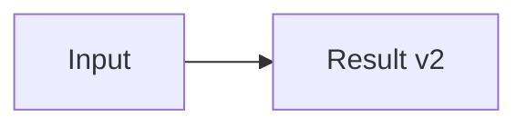
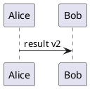

# Cache identity and instance separation

Inline $x^2+2$, display:

$$
x^2+2
$$

First graph:

```mermaid
flowchart LR
    A[Input] --> B[Result v2]
```

Second, identical source, independent rendered instance:

```mermaid
flowchart LR
    A[Input] --> B[Result v2]
```

```plantuml
@startuml
Alice -> Bob : result v2
@enduml
```

MDVU-CACHE-END
