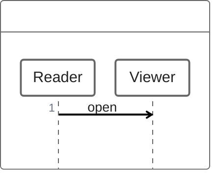
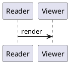

First the inline equation $a^2+b^2=c^2$.


```math
\begin{pmatrix}1&0\\0&1\end{pmatrix}
```





> [!TIP]
> A local image follows: ![[../assets/mdvu-checker.png]]

End of the mixed pipeline.

MDVU-MIXED-END
