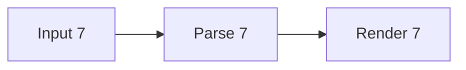

# Bounded progressive-render queue

Use a fresh isolated profile. The text should become usable before all diagrams finish.

## Queue checkpoint 1

Visible marker MDVU-QUEUE-01.

## Queue checkpoint 2

Visible marker MDVU-QUEUE-02.

## Queue checkpoint 3

Visible marker MDVU-QUEUE-03.

## Queue checkpoint 4

Visible marker MDVU-QUEUE-04.

## Queue checkpoint 5

Visible marker MDVU-QUEUE-05.

## Queue checkpoint 6

Visible marker MDVU-QUEUE-06.

## Queue checkpoint 7

Visible marker MDVU-QUEUE-07.

## Queue checkpoint 8

Visible marker MDVU-QUEUE-08.

MDVU-QUEUE-END
