# mdvu Full Torture Test — Markdown × Mermaid × Unicode 🌍🧪

<!-- GENERATED-STATS-BEGIN -->
| Generated metric | Value |
|---|---:|
| Bytes | 1,652,688 |
| Lines | 13,902 |
| Whitespace-delimited tokens (`\S+`) | 270,574 |
| Mermaid fenced blocks | 324 |
| Markdown headings | 1,100 |
| Unicode DB | 15.1.0 |
| SHA-256 (pre-manifest) | `66b3f2caccb8b1de5a2e0520a92b8e183ae2fadc47c5bf31ec8552f9aee0b73a` |
<!-- GENERATED-STATS-END -->


> [!WARNING]
> This file is intentionally pathological. It mixes valid Markdown, valid Mermaid, huge Unicode ranges, RTL/LTR text, very large structures, deeply nested constructs, and a final section of intentionally invalid inputs. Do not use it as normal documentation.

**Fixture invariants:** UTF-8; deterministic generation; no network dependency required for text rendering; negative cases are isolated at the end; source fixtures are embedded as appendices.

| Area | Coverage |
|---|---|
| Markdown | headings, emphasis, lists, tasks, tables, quotes, links, HTML, details, code fences, escapes, whitespace, anchors, long lines |
| Mermaid baseline | flowchart/graph, sequence, class, state, ER, journey, gantt, pie, GitGraph, mindmap, timeline, quadrant, requirement, C4, ZenUML, sankey, XY, block, packet, kanban, architecture, radar |
| Mermaid forward probes | swimlanes, event modeling, treemap, Venn, Ishikawa, Wardley, Cynefin, TreeView, newer flowchart metadata/edge features |
| Unicode | all assigned non-control characters available in Python Unicode DB plus explicit controls/ZWJ/grapheme/normalization/bidi cases |
| Languages/scripts | Latin, Cyrillic, Greek, Hebrew, Arabic, Indic scripts, Thai, Khmer, CJK, Japanese, Korean, Georgian, Armenian, Ethiopic and mixed-script text |
| Stress | hundreds of diagrams, large graphs/tables, source appendices, long lines, many anchors, large Unicode sampler |

## Table of Contents / 目录 / 目次 / Содержание / الفهرس

- 1. Markdown Core Feature Matrix
- 2. Unicode and Multilingual Corpus
- 3. Mermaid Configuration and Directives
- 4. Mermaid Flowchart Exhaustive Matrix
- 5. Mermaid Sequence / Class / State / ER
- 6. Mermaid Specialized Diagram Types
- 7. Multilingual Mermaid Matrix
- 8. Large Diagram and Rendering Stress
- 9. Markdown × Mermaid Interaction Tests
- 10. Embedded Source Fixtures
- 11. Intentionally Invalid / Recovery Tests
- 12. End Markers

## 1. Markdown Core Feature Matrix

# H1 heading — ASCII / ÅÄÖ / Русский / 中文 / العربية / 😀
## H2 heading — ASCII / ÅÄÖ / Русский / 中文 / العربية / 😀
### H3 heading — ASCII / ÅÄÖ / Русский / 中文 / العربية / 😀
#### H4 heading — ASCII / ÅÄÖ / Русский / 中文 / العربية / 😀
##### H5 heading — ASCII / ÅÄÖ / Русский / 中文 / العربية / 😀
###### H6 heading — ASCII / ÅÄÖ / Русский / 中文 / العربية / 😀

Plain paragraph with **bold**, *italic*, ***bold italic***, ~~strikethrough~~, `inline code`, escaped \*asterisk\*, and characters: < > & " ' / \ | { } [ ] ( ) # + - _ = ~ ^ % $ € ¥ ₹ ₪ ₩.

Hard break follows here.  
This is the next rendered line after two spaces.\
This line also probes a trailing backslash hard-break convention.

### 1.1 Blockquotes and callouts

> Level 1 quote
>> Level 2 quote
>>> Level 3 quote with **formatting**, `code`, 中文, עברית, العربية, emoji 🧩.

> [!NOTE]
> GitHub-style callout NOTE: UTF-8 ✓ — Пример — 例 — مثال — उदाहरण — مثال فارسی.

> [!TIP]
> GitHub-style callout TIP: UTF-8 ✓ — Пример — 例 — مثال — उदाहरण — مثال فارسی.

> [!IMPORTANT]
> GitHub-style callout IMPORTANT: UTF-8 ✓ — Пример — 例 — مثال — उदाहरण — مثال فارسی.

> [!WARNING]
> GitHub-style callout WARNING: UTF-8 ✓ — Пример — 例 — مثال — उदाहरण — مثال فارسی.

> [!CAUTION]
> GitHub-style callout CAUTION: UTF-8 ✓ — Пример — 例 — مثال — उदाहरण — مثال فارسی.

### 1.2 Lists and task lists

- unordered A
  - nested A.1
    - nested A.1.a
      - nested A.1.a.i
        - depth 5
          - depth 6
            - depth 7
              - depth 8

1. ordered one
2. ordered two
   1. nested ordered
   2. nested ordered two
      - mixed bullet
      - [x] completed task
      - [ ] incomplete task

### 1.3 Tables

| Left | Center | Right | Unicode | Markdown |
|:---|:---:|---:|---|---|
| row 1 | 1 | 0.333333 | Åä 中文 Русский العربية 😀 | **b1** / `c1` / [link](#row-1) |
| row 2 | 4 | 0.666667 | Åä 中文 Русский العربية 😀 | **b2** / `c2` / [link](#row-2) |
| row 3 | 9 | 1.000000 | Åä 中文 Русский العربية 😀 | **b3** / `c3` / [link](#row-3) |
| row 4 | 16 | 1.333333 | Åä 中文 Русский العربية 😀 | **b4** / `c4` / [link](#row-4) |
| row 5 | 25 | 1.666667 | Åä 中文 Русский العربية 😀 | **b5** / `c5` / [link](#row-5) |
| row 6 | 36 | 2.000000 | Åä 中文 Русский العربية 😀 | **b6** / `c6` / [link](#row-6) |
| row 7 | 49 | 2.333333 | Åä 中文 Русский العربية 😀 | **b7** / `c7` / [link](#row-7) |
| row 8 | 64 | 2.666667 | Åä 中文 Русский العربية 😀 | **b8** / `c8` / [link](#row-8) |
| row 9 | 81 | 3.000000 | Åä 中文 Русский العربية 😀 | **b9** / `c9` / [link](#row-9) |
| row 10 | 100 | 3.333333 | Åä 中文 Русский العربية 😀 | **b10** / `c10` / [link](#row-10) |
| row 11 | 121 | 3.666667 | Åä 中文 Русский العربية 😀 | **b11** / `c11` / [link](#row-11) |
| row 12 | 144 | 4.000000 | Åä 中文 Русский العربية 😀 | **b12** / `c12` / [link](#row-12) |
| row 13 | 169 | 4.333333 | Åä 中文 Русский العربية 😀 | **b13** / `c13` / [link](#row-13) |
| row 14 | 196 | 4.666667 | Åä 中文 Русский العربية 😀 | **b14** / `c14` / [link](#row-14) |
| row 15 | 225 | 5.000000 | Åä 中文 Русский العربية 😀 | **b15** / `c15` / [link](#row-15) |
| row 16 | 256 | 5.333333 | Åä 中文 Русский العربية 😀 | **b16** / `c16` / [link](#row-16) |
| row 17 | 289 | 5.666667 | Åä 中文 Русский العربية 😀 | **b17** / `c17` / [link](#row-17) |
| row 18 | 324 | 6.000000 | Åä 中文 Русский العربية 😀 | **b18** / `c18` / [link](#row-18) |
| row 19 | 361 | 6.333333 | Åä 中文 Русский العربية 😀 | **b19** / `c19` / [link](#row-19) |
| row 20 | 400 | 6.666667 | Åä 中文 Русский العربية 😀 | **b20** / `c20` / [link](#row-20) |

#### Wide table

| C01 | C02 | C03 | C04 | C05 | C06 | C07 | C08 | C09 | C10 | C11 | C12 | C13 | C14 | C15 | C16 | C17 | C18 | C19 | C20 |
|---|---|---|---|---|---|---|---|---|---|---|---|---|---|---|---|---|---|---|---|
| R01C01·Ω·中·😀 | R01C02·Ω·中·😀 | R01C03·Ω·中·😀 | R01C04·Ω·中·😀 | R01C05·Ω·中·😀 | R01C06·Ω·中·😀 | R01C07·Ω·中·😀 | R01C08·Ω·中·😀 | R01C09·Ω·中·😀 | R01C10·Ω·中·😀 | R01C11·Ω·中·😀 | R01C12·Ω·中·😀 | R01C13·Ω·中·😀 | R01C14·Ω·中·😀 | R01C15·Ω·中·😀 | R01C16·Ω·中·😀 | R01C17·Ω·中·😀 | R01C18·Ω·中·😀 | R01C19·Ω·中·😀 | R01C20·Ω·中·😀 |
| R02C01·Ω·中·😀 | R02C02·Ω·中·😀 | R02C03·Ω·中·😀 | R02C04·Ω·中·😀 | R02C05·Ω·中·😀 | R02C06·Ω·中·😀 | R02C07·Ω·中·😀 | R02C08·Ω·中·😀 | R02C09·Ω·中·😀 | R02C10·Ω·中·😀 | R02C11·Ω·中·😀 | R02C12·Ω·中·😀 | R02C13·Ω·中·😀 | R02C14·Ω·中·😀 | R02C15·Ω·中·😀 | R02C16·Ω·中·😀 | R02C17·Ω·中·😀 | R02C18·Ω·中·😀 | R02C19·Ω·中·😀 | R02C20·Ω·中·😀 |
| R03C01·Ω·中·😀 | R03C02·Ω·中·😀 | R03C03·Ω·中·😀 | R03C04·Ω·中·😀 | R03C05·Ω·中·😀 | R03C06·Ω·中·😀 | R03C07·Ω·中·😀 | R03C08·Ω·中·😀 | R03C09·Ω·中·😀 | R03C10·Ω·中·😀 | R03C11·Ω·中·😀 | R03C12·Ω·中·😀 | R03C13·Ω·中·😀 | R03C14·Ω·中·😀 | R03C15·Ω·中·😀 | R03C16·Ω·中·😀 | R03C17·Ω·中·😀 | R03C18·Ω·中·😀 | R03C19·Ω·中·😀 | R03C20·Ω·中·😀 |
| R04C01·Ω·中·😀 | R04C02·Ω·中·😀 | R04C03·Ω·中·😀 | R04C04·Ω·中·😀 | R04C05·Ω·中·😀 | R04C06·Ω·中·😀 | R04C07·Ω·中·😀 | R04C08·Ω·中·😀 | R04C09·Ω·中·😀 | R04C10·Ω·中·😀 | R04C11·Ω·中·😀 | R04C12·Ω·中·😀 | R04C13·Ω·中·😀 | R04C14·Ω·中·😀 | R04C15·Ω·中·😀 | R04C16·Ω·中·😀 | R04C17·Ω·中·😀 | R04C18·Ω·中·😀 | R04C19·Ω·中·😀 | R04C20·Ω·中·😀 |
| R05C01·Ω·中·😀 | R05C02·Ω·中·😀 | R05C03·Ω·中·😀 | R05C04·Ω·中·😀 | R05C05·Ω·中·😀 | R05C06·Ω·中·😀 | R05C07·Ω·中·😀 | R05C08·Ω·中·😀 | R05C09·Ω·中·😀 | R05C10·Ω·中·😀 | R05C11·Ω·中·😀 | R05C12·Ω·中·😀 | R05C13·Ω·中·😀 | R05C14·Ω·中·😀 | R05C15·Ω·中·😀 | R05C16·Ω·中·😀 | R05C17·Ω·中·😀 | R05C18·Ω·中·😀 | R05C19·Ω·中·😀 | R05C20·Ω·中·😀 |
| R06C01·Ω·中·😀 | R06C02·Ω·中·😀 | R06C03·Ω·中·😀 | R06C04·Ω·中·😀 | R06C05·Ω·中·😀 | R06C06·Ω·中·😀 | R06C07·Ω·中·😀 | R06C08·Ω·中·😀 | R06C09·Ω·中·😀 | R06C10·Ω·中·😀 | R06C11·Ω·中·😀 | R06C12·Ω·中·😀 | R06C13·Ω·中·😀 | R06C14·Ω·中·😀 | R06C15·Ω·中·😀 | R06C16·Ω·中·😀 | R06C17·Ω·中·😀 | R06C18·Ω·中·😀 | R06C19·Ω·中·😀 | R06C20·Ω·中·😀 |
| R07C01·Ω·中·😀 | R07C02·Ω·中·😀 | R07C03·Ω·中·😀 | R07C04·Ω·中·😀 | R07C05·Ω·中·😀 | R07C06·Ω·中·😀 | R07C07·Ω·中·😀 | R07C08·Ω·中·😀 | R07C09·Ω·中·😀 | R07C10·Ω·中·😀 | R07C11·Ω·中·😀 | R07C12·Ω·中·😀 | R07C13·Ω·中·😀 | R07C14·Ω·中·😀 | R07C15·Ω·中·😀 | R07C16·Ω·中·😀 | R07C17·Ω·中·😀 | R07C18·Ω·中·😀 | R07C19·Ω·中·😀 | R07C20·Ω·中·😀 |
| R08C01·Ω·中·😀 | R08C02·Ω·中·😀 | R08C03·Ω·中·😀 | R08C04·Ω·中·😀 | R08C05·Ω·中·😀 | R08C06·Ω·中·😀 | R08C07·Ω·中·😀 | R08C08·Ω·中·😀 | R08C09·Ω·中·😀 | R08C10·Ω·中·😀 | R08C11·Ω·中·😀 | R08C12·Ω·中·😀 | R08C13·Ω·中·😀 | R08C14·Ω·中·😀 | R08C15·Ω·中·😀 | R08C16·Ω·中·😀 | R08C17·Ω·中·😀 | R08C18·Ω·中·😀 | R08C19·Ω·中·😀 | R08C20·Ω·中·😀 |
| R09C01·Ω·中·😀 | R09C02·Ω·中·😀 | R09C03·Ω·中·😀 | R09C04·Ω·中·😀 | R09C05·Ω·中·😀 | R09C06·Ω·中·😀 | R09C07·Ω·中·😀 | R09C08·Ω·中·😀 | R09C09·Ω·中·😀 | R09C10·Ω·中·😀 | R09C11·Ω·中·😀 | R09C12·Ω·中·😀 | R09C13·Ω·中·😀 | R09C14·Ω·中·😀 | R09C15·Ω·中·😀 | R09C16·Ω·中·😀 | R09C17·Ω·中·😀 | R09C18·Ω·中·😀 | R09C19·Ω·中·😀 | R09C20·Ω·中·😀 |
| R10C01·Ω·中·😀 | R10C02·Ω·中·😀 | R10C03·Ω·中·😀 | R10C04·Ω·中·😀 | R10C05·Ω·中·😀 | R10C06·Ω·中·😀 | R10C07·Ω·中·😀 | R10C08·Ω·中·😀 | R10C09·Ω·中·😀 | R10C10·Ω·中·😀 | R10C11·Ω·中·😀 | R10C12·Ω·中·😀 | R10C13·Ω·中·😀 | R10C14·Ω·中·😀 | R10C15·Ω·中·😀 | R10C16·Ω·中·😀 | R10C17·Ω·中·😀 | R10C18·Ω·中·😀 | R10C19·Ω·中·😀 | R10C20·Ω·中·😀 |

### 1.4 Links, images, anchors, HTML

<a id="explicit-anchor-α-中文"></a>
[Absolute link](https://example.com/path?q=hello%20world#fragment) · [Relative](./relative/path.md) · [Fragment](#explicit-anchor-α-中文) · <https://example.org/autolink> · <test@example.org>


<details open>
<summary><strong>HTML details summary — 中文 العربية 😀</strong></summary>

Inside details: **Markdown**, <kbd>⌘K</kbd>, <mark>highlight</mark>, <sub>sub</sub>, <sup>sup</sup>.

</details>

<table><thead><tr><th>HTML</th><th>Unicode</th></tr></thead><tbody><tr><td><code>&lt;tag&gt;</code></td><td>Русский 中文 العربية 😀</td></tr></tbody></table>

<!-- HTML comment with tricky text: ```mermaid <script>alert(1)</script> العربية -->

### 1.5 Code fence language matrix

#### Fence: bash

```bash
set -euo pipefail
printf "Hello %s\n" "世界"
for x in 1 2 3; do echo "$x"; done
```

#### Fence: python

```python
def greet(name: str) -> str:
    return f"Hello, {name} 👋"
print(greet("世界"))
```

#### Fence: javascript

```javascript
const msg = `Hello ${"世界"} 🚀`;
console.log(msg);
```

#### Fence: typescript

```typescript
type User = { id: number; name: string };
const u: User = { id: 1, name: "Мария" };
```

#### Fence: java

```java
record User(long id, String name) {}
System.out.println(new User(1, "李雷"));
```

#### Fence: kotlin

```kotlin
data class User(val id: Long, val name: String)
println(User(1, "علي"))
```

#### Fence: swift

```swift
struct User { let id: Int; let name: String }
print(User(id: 1, name: "Åsa"))
```

#### Fence: go

```go
package main
import "fmt"
func main(){ fmt.Println("こんにちは") }
```

#### Fence: rust

```rust
fn main() { println!("Здравствуйте 🦀"); }
```

#### Fence: c

```c
#include <stdio.h>
int main(void){ puts("hello"); return 0; }
```

#### Fence: cpp

```cpp
#include <iostream>
int main(){ std::cout << "γειά" << std::endl; }
```

#### Fence: csharp

```csharp
Console.WriteLine("שלום");
```

#### Fence: ruby

```ruby
puts "สวัสดี"
```

#### Fence: php

```php
<?php echo "مرحبا"; ?>
```

#### Fence: sql

```sql
SELECT id, name FROM users WHERE name LIKE '%é%' ORDER BY id DESC;
```

#### Fence: json

```json
{"message":"Hello 世界","emoji":"🧪","n":1}
```

#### Fence: yaml

```yaml
name: "世界"
flags: [true, false]
emoji: "🧪"
```

#### Fence: toml

```toml
name = "世界"
enabled = true
count = 42
```

#### Fence: xml

```xml
<root lang="zh"><item id="1">世界 &amp; 🧪</item></root>
```

#### Fence: html

```html
<section lang="ar" dir="rtl"><strong>مرحبا</strong></section>
```

#### Fence: css

```css
body { font-family: system-ui; }
[dir="rtl"] { direction: rtl; }
```

#### Fence: diff

```diff
- old line
+ new line 😀
 context
```

#### Fence: ini

```ini
[section]
key=value
unicode=中文
```

#### Fence: dockerfile

```dockerfile
FROM alpine:3
RUN printf "hello\n"
CMD ["sh"]
```

#### Fence: graphql

```graphql
query User($id: ID!) { user(id: $id) { id name } }
```

#### Fence: protobuf

```protobuf
syntax = "proto3";
message User { string name = 1; }
```

#### Fence: regex

```regex
^(?P<name>[\w.-]+)@(?P<domain>[\w.-]+)$
```

#### Fence: markdown

```markdown
# Nested Markdown

- **bold**
- `code`
- 中文
```

### 1.6 Fence delimiter edge cases

````
literal ``` inside a four-backtick fence
~~~mermaid
flowchart LR
A-->B
~~~
````

`````text
~~~
not a fence here because outer delimiter is backticks
~~~
` single backtick `
`` pair ``
`````

### 1.7 Whitespace, tabs and long lines

Tabs inside the following fenced block are real TAB characters:
```text
A	B	C
1	2	3
中文	العربية	😀
```

LONG-LINE-BEGIN token00000=Åä中ع😀 token00001=Åä中ع😀 token00002=Åä中ع😀 token00003=Åä中ع😀 token00004=Åä中ع😀 token00005=Åä中ع😀 token00006=Åä中ع😀 token00007=Åä中ع😀 token00008=Åä中ع😀 token00009=Åä中ع😀 token00010=Åä中ع😀 token00011=Åä中ع😀 token00012=Åä中ع😀 token00013=Åä中ع😀 token00014=Åä中ع😀 token00015=Åä中ع😀 token00016=Åä中ع😀 token00017=Åä中ع😀 token00018=Åä中ع😀 token00019=Åä中ع😀 token00020=Åä中ع😀 token00021=Åä中ع😀 token00022=Åä中ع😀 token00023=Åä中ع😀 token00024=Åä中ع😀 token00025=Åä中ع😀 token00026=Åä中ع😀 token00027=Åä中ع😀 token00028=Åä中ع😀 token00029=Åä中ع😀 token00030=Åä中ع😀 token00031=Åä中ع😀 token00032=Åä中ع😀 token00033=Åä中ع😀 token00034=Åä中ع😀 token00035=Åä中ع😀 token00036=Åä中ع😀 token00037=Åä中ع😀 token00038=Åä中ع😀 token00039=Åä中ع😀 token00040=Åä中ع😀 token00041=Åä中ع😀 token00042=Åä中ع😀 token00043=Åä中ع😀 token00044=Åä中ع😀 token00045=Åä中ع😀 token00046=Åä中ع😀 token00047=Åä中ع😀 token00048=Åä中ع😀 token00049=Åä中ع😀 token00050=Åä中ع😀 token00051=Åä中ع😀 token00052=Åä中ع😀 token00053=Åä中ع😀 token00054=Åä中ع😀 token00055=Åä中ع😀 token00056=Åä中ع😀 token00057=Åä中ع😀 token00058=Åä中ع😀 token00059=Åä中ع😀 token00060=Åä中ع😀 token00061=Åä中ع😀 token00062=Åä中ع😀 token00063=Åä中ع😀 token00064=Åä中ع😀 token00065=Åä中ع😀 token00066=Åä中ع😀 token00067=Åä中ع😀 token00068=Åä中ع😀 token00069=Åä中ع😀 token00070=Åä中ع😀 token00071=Åä中ع😀 token00072=Åä中ع😀 token00073=Åä中ع😀 token00074=Åä中ع😀 token00075=Åä中ع😀 token00076=Åä中ع😀 token00077=Åä中ع😀 token00078=Åä中ع😀 token00079=Åä中ع😀 token00080=Åä中ع😀 token00081=Åä中ع😀 token00082=Åä中ع😀 token00083=Åä中ع😀 token00084=Åä中ع😀 token00085=Åä中ع😀 token00086=Åä中ع😀 token00087=Åä中ع😀 token00088=Åä中ع😀 token00089=Åä中ع😀 token00090=Åä中ع😀 token00091=Åä中ع😀 token00092=Åä中ع😀 token00093=Åä中ع😀 token00094=Åä中ع😀 token00095=Åä中ع😀 token00096=Åä中ع😀 token00097=Åä中ع😀 token00098=Åä中ع😀 token00099=Åä中ع😀 token00100=Åä中ع😀 token00101=Åä中ع😀 token00102=Åä中ع😀 token00103=Åä中ع😀 token00104=Åä中ع😀 token00105=Åä中ع😀 token00106=Åä中ع😀 token00107=Åä中ع😀 token00108=Åä中ع😀 token00109=Åä中ع😀 token00110=Åä中ع😀 token00111=Åä中ع😀 token00112=Åä中ع😀 token00113=Åä中ع😀 token00114=Åä中ع😀 token00115=Åä中ع😀 token00116=Åä中ع😀 token00117=Åä中ع😀 token00118=Åä中ع😀 token00119=Åä中ع😀 token00120=Åä中ع😀 token00121=Åä中ع😀 token00122=Åä中ع😀 token00123=Åä中ع😀 token00124=Åä中ع😀 token00125=Åä中ع😀 token00126=Åä中ع😀 token00127=Åä中ع😀 token00128=Åä中ع😀 token00129=Åä中ع😀 token00130=Åä中ع😀 token00131=Åä中ع😀 token00132=Åä中ع😀 token00133=Åä中ع😀 token00134=Åä中ع😀 token00135=Åä中ع😀 token00136=Åä中ع😀 token00137=Åä中ع😀 token00138=Åä中ع😀 token00139=Åä中ع😀 token00140=Åä中ع😀 token00141=Åä中ع😀 token00142=Åä中ع😀 token00143=Åä中ع😀 token00144=Åä中ع😀 token00145=Åä中ع😀 token00146=Åä中ع😀 token00147=Åä中ع😀 token00148=Åä中ع😀 token00149=Åä中ع😀 token00150=Åä中ع😀 token00151=Åä中ع😀 token00152=Åä中ع😀 token00153=Åä中ع😀 token00154=Åä中ع😀 token00155=Åä中ع😀 token00156=Åä中ع😀 token00157=Åä中ع😀 token00158=Åä中ع😀 token00159=Åä中ع😀 token00160=Åä中ع😀 token00161=Åä中ع😀 token00162=Åä中ع😀 token00163=Åä中ع😀 token00164=Åä中ع😀 token00165=Åä中ع😀 token00166=Åä中ع😀 token00167=Åä中ع😀 token00168=Åä中ع😀 token00169=Åä中ع😀 token00170=Åä中ع😀 token00171=Åä中ع😀 token00172=Åä中ع😀 token00173=Åä中ع😀 token00174=Åä中ع😀 token00175=Åä中ع😀 token00176=Åä中ع😀 token00177=Åä中ع😀 token00178=Åä中ع😀 token00179=Åä中ع😀 token00180=Åä中ع😀 token00181=Åä中ع😀 token00182=Åä中ع😀 token00183=Åä中ع😀 token00184=Åä中ع😀 token00185=Åä中ع😀 token00186=Åä中ع😀 token00187=Åä中ع😀 token00188=Åä中ع😀 token00189=Åä中ع😀 token00190=Åä中ع😀 token00191=Åä中ع😀 token00192=Åä中ع😀 token00193=Åä中ع😀 token00194=Åä中ع😀 token00195=Åä中ع😀 token00196=Åä中ع😀 token00197=Åä中ع😀 token00198=Åä中ع😀 token00199=Åä中ع😀 token00200=Åä中ع😀 token00201=Åä中ع😀 token00202=Åä中ع😀 token00203=Åä中ع😀 token00204=Åä中ع😀 token00205=Åä中ع😀 token00206=Åä中ع😀 token00207=Åä中ع😀 token00208=Åä中ع😀 token00209=Åä中ع😀 token00210=Åä中ع😀 token00211=Åä中ع😀 token00212=Åä中ع😀 token00213=Åä中ع😀 token00214=Åä中ع😀 token00215=Åä中ع😀 token00216=Åä中ع😀 token00217=Åä中ع😀 token00218=Åä中ع😀 token00219=Åä中ع😀 token00220=Åä中ع😀 token00221=Åä中ع😀 token00222=Åä中ع😀 token00223=Åä中ع😀 token00224=Åä中ع😀 token00225=Åä中ع😀 token00226=Åä中ع😀 token00227=Åä中ع😀 token00228=Åä中ع😀 token00229=Åä中ع😀 token00230=Åä中ع😀 token00231=Åä中ع😀 token00232=Åä中ع😀 token00233=Åä中ع😀 token00234=Åä中ع😀 token00235=Åä中ع😀 token00236=Åä中ع😀 token00237=Åä中ع😀 token00238=Åä中ع😀 token00239=Åä中ع😀 token00240=Åä中ع😀 token00241=Åä中ع😀 token00242=Åä中ع😀 token00243=Åä中ع😀 token00244=Åä中ع😀 token00245=Åä中ع😀 token00246=Åä中ع😀 token00247=Åä中ع😀 token00248=Åä中ع😀 token00249=Åä中ع😀 token00250=Åä中ع😀 token00251=Åä中ع😀 token00252=Åä中ع😀 token00253=Åä中ع😀 token00254=Åä中ع😀 token00255=Åä中ع😀 token00256=Åä中ع😀 token00257=Åä中ع😀 token00258=Åä中ع😀 token00259=Åä中ع😀 token00260=Åä中ع😀 token00261=Åä中ع😀 token00262=Åä中ع😀 token00263=Åä中ع😀 token00264=Åä中ع😀 token00265=Åä中ع😀 token00266=Åä中ع😀 token00267=Åä中ع😀 token00268=Åä中ع😀 token00269=Åä中ع😀 token00270=Åä中ع😀 token00271=Åä中ع😀 token00272=Åä中ع😀 token00273=Åä中ع😀 token00274=Åä中ع😀 token00275=Åä中ع😀 token00276=Åä中ع😀 token00277=Åä中ع😀 token00278=Åä中ع😀 token00279=Åä中ع😀 token00280=Åä中ع😀 token00281=Åä中ع😀 token00282=Åä中ع😀 token00283=Åä中ع😀 token00284=Åä中ع😀 token00285=Åä中ع😀 token00286=Åä中ع😀 token00287=Åä中ع😀 token00288=Åä中ع😀 token00289=Åä中ع😀 token00290=Åä中ع😀 token00291=Åä中ع😀 token00292=Åä中ع😀 token00293=Åä中ع😀 token00294=Åä中ع😀 token00295=Åä中ع😀 token00296=Åä中ع😀 token00297=Åä中ع😀 token00298=Åä中ع😀 token00299=Åä中ع😀 token00300=Åä中ع😀 token00301=Åä中ع😀 token00302=Åä中ع😀 token00303=Åä中ع😀 token00304=Åä中ع😀 token00305=Åä中ع😀 token00306=Åä中ع😀 token00307=Åä中ع😀 token00308=Åä中ع😀 token00309=Åä中ع😀 token00310=Åä中ع😀 token00311=Åä中ع😀 token00312=Åä中ع😀 token00313=Åä中ع😀 token00314=Åä中ع😀 token00315=Åä中ع😀 token00316=Åä中ع😀 token00317=Åä中ع😀 token00318=Åä中ع😀 token00319=Åä中ع😀 token00320=Åä中ع😀 token00321=Åä中ع😀 token00322=Åä中ع😀 token00323=Åä中ع😀 token00324=Åä中ع😀 token00325=Åä中ع😀 token00326=Åä中ع😀 token00327=Åä中ع😀 token00328=Åä中ع😀 token00329=Åä中ع😀 token00330=Åä中ع😀 token00331=Åä中ع😀 token00332=Åä中ع😀 token00333=Åä中ع😀 token00334=Åä中ع😀 token00335=Åä中ع😀 token00336=Åä中ع😀 token00337=Åä中ع😀 token00338=Åä中ع😀 token00339=Åä中ع😀 token00340=Åä中ع😀 token00341=Åä中ع😀 token00342=Åä中ع😀 token00343=Åä中ع😀 token00344=Åä中ع😀 token00345=Åä中ع😀 token00346=Åä中ع😀 token00347=Åä中ع😀 token00348=Åä中ع😀 token00349=Åä中ع😀 token00350=Åä中ع😀 token00351=Åä中ع😀 token00352=Åä中ع😀 token00353=Åä中ع😀 token00354=Åä中ع😀 token00355=Åä中ع😀 token00356=Åä中ع😀 token00357=Åä中ع😀 token00358=Åä中ع😀 token00359=Åä中ع😀 token00360=Åä中ع😀 token00361=Åä中ع😀 token00362=Åä中ع😀 token00363=Åä中ع😀 token00364=Åä中ع😀 token00365=Åä中ع😀 token00366=Åä中ع😀 token00367=Åä中ع😀 token00368=Åä中ع😀 token00369=Åä中ع😀 token00370=Åä中ع😀 token00371=Åä中ع😀 token00372=Åä中ع😀 token00373=Åä中ع😀 token00374=Åä中ع😀 token00375=Åä中ع😀 token00376=Åä中ع😀 token00377=Åä中ع😀 token00378=Åä中ع😀 token00379=Åä中ع😀 token00380=Åä中ع😀 token00381=Åä中ع😀 token00382=Åä中ع😀 token00383=Åä中ع😀 token00384=Åä中ع😀 token00385=Åä中ع😀 token00386=Åä中ع😀 token00387=Åä中ع😀 token00388=Åä中ع😀 token00389=Åä中ع😀 token00390=Åä中ع😀 token00391=Åä中ع😀 token00392=Åä中ع😀 token00393=Åä中ع😀 token00394=Åä中ع😀 token00395=Åä中ع😀 token00396=Åä中ع😀 token00397=Åä中ع😀 token00398=Åä中ع😀 token00399=Åä中ع😀 token00400=Åä中ع😀 token00401=Åä中ع😀 token00402=Åä中ع😀 token00403=Åä中ع😀 token00404=Åä中ع😀 token00405=Åä中ع😀 token00406=Åä中ع😀 token00407=Åä中ع😀 token00408=Åä中ع😀 token00409=Åä中ع😀 token00410=Åä中ع😀 token00411=Åä中ع😀 token00412=Åä中ع😀 token00413=Åä中ع😀 token00414=Åä中ع😀 token00415=Åä中ع😀 token00416=Åä中ع😀 token00417=Åä中ع😀 token00418=Åä中ع😀 token00419=Åä中ع😀 token00420=Åä中ع😀 token00421=Åä中ع😀 token00422=Åä中ع😀 token00423=Åä中ع😀 token00424=Åä中ع😀 token00425=Åä中ع😀 token00426=Åä中ع😀 token00427=Åä中ع😀 token00428=Åä中ع😀 token00429=Åä中ع😀 token00430=Åä中ع😀 token00431=Åä中ع😀 token00432=Åä中ع😀 token00433=Åä中ع😀 token00434=Åä中ع😀 token00435=Åä中ع😀 token00436=Åä中ع😀 token00437=Åä中ع😀 token00438=Åä中ع😀 token00439=Åä中ع😀 token00440=Åä中ع😀 token00441=Åä中ع😀 token00442=Åä中ع😀 token00443=Åä中ع😀 token00444=Åä中ع😀 token00445=Åä中ع😀 token00446=Åä中ع😀 token00447=Åä中ع😀 token00448=Åä中ع😀 token00449=Åä中ع😀 token00450=Åä中ع😀 token00451=Åä中ع😀 token00452=Åä中ع😀 token00453=Åä中ع😀 token00454=Åä中ع😀 token00455=Åä中ع😀 token00456=Åä中ع😀 token00457=Åä中ع😀 token00458=Åä中ع😀 token00459=Åä中ع😀 token00460=Åä中ع😀 token00461=Åä中ع😀 token00462=Åä中ع😀 token00463=Åä中ع😀 token00464=Åä中ع😀 token00465=Åä中ع😀 token00466=Åä中ع😀 token00467=Åä中ع😀 token00468=Åä中ع😀 token00469=Åä中ع😀 token00470=Åä中ع😀 token00471=Åä中ع😀 token00472=Åä中ع😀 token00473=Åä中ع😀 token00474=Åä中ع😀 token00475=Åä中ع😀 token00476=Åä中ع😀 token00477=Åä中ع😀 token00478=Åä中ع😀 token00479=Åä中ع😀 token00480=Åä中ع😀 token00481=Åä中ع😀 token00482=Åä中ع😀 token00483=Åä中ع😀 token00484=Åä中ع😀 token00485=Åä中ع😀 token00486=Åä中ع😀 token00487=Åä中ع😀 token00488=Åä中ع😀 token00489=Åä中ع😀 token00490=Åä中ع😀 token00491=Åä中ع😀 token00492=Åä中ع😀 token00493=Åä中ع😀 token00494=Åä中ع😀 token00495=Åä中ع😀 token00496=Åä中ع😀 token00497=Åä中ع😀 token00498=Åä中ع😀 token00499=Åä中ع😀 token00500=Åä中ع😀 token00501=Åä中ع😀 token00502=Åä中ع😀 token00503=Åä中ع😀 token00504=Åä中ع😀 token00505=Åä中ع😀 token00506=Åä中ع😀 token00507=Åä中ع😀 token00508=Åä中ع😀 token00509=Åä中ع😀 token00510=Åä中ع😀 token00511=Åä中ع😀 token00512=Åä中ع😀 token00513=Åä中ع😀 token00514=Åä中ع😀 token00515=Åä中ع😀 token00516=Åä中ع😀 token00517=Åä中ع😀 token00518=Åä中ع😀 token00519=Åä中ع😀 token00520=Åä中ع😀 token00521=Åä中ع😀 token00522=Åä中ع😀 token00523=Åä中ع😀 token00524=Åä中ع😀 token00525=Åä中ع😀 token00526=Åä中ع😀 token00527=Åä中ع😀 token00528=Åä中ع😀 token00529=Åä中ع😀 token00530=Åä中ع😀 token00531=Åä中ع😀 token00532=Åä中ع😀 token00533=Åä中ع😀 token00534=Åä中ع😀 token00535=Åä中ع😀 token00536=Åä中ع😀 token00537=Åä中ع😀 token00538=Åä中ع😀 token00539=Åä中ع😀 token00540=Åä中ع😀 token00541=Åä中ع😀 token00542=Åä中ع😀 token00543=Åä中ع😀 token00544=Åä中ع😀 token00545=Åä中ع😀 token00546=Åä中ع😀 token00547=Åä中ع😀 token00548=Åä中ع😀 token00549=Åä中ع😀 token00550=Åä中ع😀 token00551=Åä中ع😀 token00552=Åä中ع😀 token00553=Åä中ع😀 token00554=Åä中ع😀 token00555=Åä中ع😀 token00556=Åä中ع😀 token00557=Åä中ع😀 token00558=Åä中ع😀 token00559=Åä中ع😀 token00560=Åä中ع😀 token00561=Åä中ع😀 token00562=Åä中ع😀 token00563=Åä中ع😀 token00564=Åä中ع😀 token00565=Åä中ع😀 token00566=Åä中ع😀 token00567=Åä中ع😀 token00568=Åä中ع😀 token00569=Åä中ع😀 token00570=Åä中ع😀 token00571=Åä中ع😀 token00572=Åä中ع😀 token00573=Åä中ع😀 token00574=Åä中ع😀 token00575=Åä中ع😀 token00576=Åä中ع😀 token00577=Åä中ع😀 token00578=Åä中ع😀 token00579=Åä中ع😀 token00580=Åä中ع😀 token00581=Åä中ع😀 token00582=Åä中ع😀 token00583=Åä中ع😀 token00584=Åä中ع😀 token00585=Åä中ع😀 token00586=Åä中ع😀 token00587=Åä中ع😀 token00588=Åä中ع😀 token00589=Åä中ع😀 token00590=Åä中ع😀 token00591=Åä中ع😀 token00592=Åä中ع😀 token00593=Åä中ع😀 token00594=Åä中ع😀 token00595=Åä中ع😀 token00596=Åä中ع😀 token00597=Åä中ع😀 token00598=Åä中ع😀 token00599=Åä中ع😀 token00600=Åä中ع😀 token00601=Åä中ع😀 token00602=Åä中ع😀 token00603=Åä中ع😀 token00604=Åä中ع😀 token00605=Åä中ع😀 token00606=Åä中ع😀 token00607=Åä中ع😀 token00608=Åä中ع😀 token00609=Åä中ع😀 token00610=Åä中ع😀 token00611=Åä中ع😀 token00612=Åä中ع😀 token00613=Åä中ع😀 token00614=Åä中ع😀 token00615=Åä中ع😀 token00616=Åä中ع😀 token00617=Åä中ع😀 token00618=Åä中ع😀 token00619=Åä中ع😀 token00620=Åä中ع😀 token00621=Åä中ع😀 token00622=Åä中ع😀 token00623=Åä中ع😀 token00624=Åä中ع😀 token00625=Åä中ع😀 token00626=Åä中ع😀 token00627=Åä中ع😀 token00628=Åä中ع😀 token00629=Åä中ع😀 token00630=Åä中ع😀 token00631=Åä中ع😀 token00632=Åä中ع😀 token00633=Åä中ع😀 token00634=Åä中ع😀 token00635=Åä中ع😀 token00636=Åä中ع😀 token00637=Åä中ع😀 token00638=Åä中ع😀 token00639=Åä中ع😀 token00640=Åä中ع😀 token00641=Åä中ع😀 token00642=Åä中ع😀 token00643=Åä中ع😀 token00644=Åä中ع😀 token00645=Åä中ع😀 token00646=Åä中ع😀 token00647=Åä中ع😀 token00648=Åä中ع😀 token00649=Åä中ع😀 token00650=Åä中ع😀 token00651=Åä中ع😀 token00652=Åä中ع😀 token00653=Åä中ع😀 token00654=Åä中ع😀 token00655=Åä中ع😀 token00656=Åä中ع😀 token00657=Åä中ع😀 token00658=Åä中ع😀 token00659=Åä中ع😀 token00660=Åä中ع😀 token00661=Åä中ع😀 token00662=Åä中ع😀 token00663=Åä中ع😀 token00664=Åä中ع😀 token00665=Åä中ع😀 token00666=Åä中ع😀 token00667=Åä中ع😀 token00668=Åä中ع😀 token00669=Åä中ع😀 token00670=Åä中ع😀 token00671=Åä中ع😀 token00672=Åä中ع😀 token00673=Åä中ع😀 token00674=Åä中ع😀 token00675=Åä中ع😀 token00676=Åä中ع😀 token00677=Åä中ع😀 token00678=Åä中ع😀 token00679=Åä中ع😀 token00680=Åä中ع😀 token00681=Åä中ع😀 token00682=Åä中ع😀 token00683=Åä中ع😀 token00684=Åä中ع😀 token00685=Åä中ع😀 token00686=Åä中ع😀 token00687=Åä中ع😀 token00688=Åä中ع😀 token00689=Åä中ع😀 token00690=Åä中ع😀 token00691=Åä中ع😀 token00692=Åä中ع😀 token00693=Åä中ع😀 token00694=Åä中ع😀 token00695=Åä中ع😀 token00696=Åä中ع😀 token00697=Åä中ع😀 token00698=Åä中ع😀 token00699=Åä中ع😀 token00700=Åä中ع😀 token00701=Åä中ع😀 token00702=Åä中ع😀 token00703=Åä中ع😀 token00704=Åä中ع😀 token00705=Åä中ع😀 token00706=Åä中ع😀 token00707=Åä中ع😀 token00708=Åä中ع😀 token00709=Åä中ع😀 token00710=Åä中ع😀 token00711=Åä中ع😀 token00712=Åä中ع😀 token00713=Åä中ع😀 token00714=Åä中ع😀 token00715=Åä中ع😀 token00716=Åä中ع😀 token00717=Åä中ع😀 token00718=Åä中ع😀 token00719=Åä中ع😀 token00720=Åä中ع😀 token00721=Åä中ع😀 token00722=Åä中ع😀 token00723=Åä中ع😀 token00724=Åä中ع😀 token00725=Åä中ع😀 token00726=Åä中ع😀 token00727=Åä中ع😀 token00728=Åä中ع😀 token00729=Åä中ع😀 token00730=Åä中ع😀 token00731=Åä中ع😀 token00732=Åä中ع😀 token00733=Åä中ع😀 token00734=Åä中ع😀 token00735=Åä中ع😀 token00736=Åä中ع😀 token00737=Åä中ع😀 token00738=Åä中ع😀 token00739=Åä中ع😀 token00740=Åä中ع😀 token00741=Åä中ع😀 token00742=Åä中ع😀 token00743=Åä中ع😀 token00744=Åä中ع😀 token00745=Åä中ع😀 token00746=Åä中ع😀 token00747=Åä中ع😀 token00748=Åä中ع😀 token00749=Åä中ع😀 token00750=Åä中ع😀 token00751=Åä中ع😀 token00752=Åä中ع😀 token00753=Åä中ع😀 token00754=Åä中ع😀 token00755=Åä中ع😀 token00756=Åä中ع😀 token00757=Åä中ع😀 token00758=Åä中ع😀 token00759=Åä中ع😀 token00760=Åä中ع😀 token00761=Åä中ع😀 token00762=Åä中ع😀 token00763=Åä中ع😀 token00764=Åä中ع😀 token00765=Åä中ع😀 token00766=Åä中ع😀 token00767=Åä中ع😀 token00768=Åä中ع😀 token00769=Åä中ع😀 token00770=Åä中ع😀 token00771=Åä中ع😀 token00772=Åä中ع😀 token00773=Åä中ع😀 token00774=Åä中ع😀 token00775=Åä中ع😀 token00776=Åä中ع😀 token00777=Åä中ع😀 token00778=Åä中ع😀 token00779=Åä中ع😀 token00780=Åä中ع😀 token00781=Åä中ع😀 token00782=Åä中ع😀 token00783=Åä中ع😀 token00784=Åä中ع😀 token00785=Åä中ع😀 token00786=Åä中ع😀 token00787=Åä中ع😀 token00788=Åä中ع😀 token00789=Åä中ع😀 token00790=Åä中ع😀 token00791=Åä中ع😀 token00792=Åä中ع😀 token00793=Åä中ع😀 token00794=Åä中ع😀 token00795=Åä中ع😀 token00796=Åä中ع😀 token00797=Åä中ع😀 token00798=Åä中ع😀 token00799=Åä中ع😀 token00800=Åä中ع😀 token00801=Åä中ع😀 token00802=Åä中ع😀 token00803=Åä中ع😀 token00804=Åä中ع😀 token00805=Åä中ع😀 token00806=Åä中ع😀 token00807=Åä中ع😀 token00808=Åä中ع😀 token00809=Åä中ع😀 token00810=Åä中ع😀 token00811=Åä中ع😀 token00812=Åä中ع😀 token00813=Åä中ع😀 token00814=Åä中ع😀 token00815=Åä中ع😀 token00816=Åä中ع😀 token00817=Åä中ع😀 token00818=Åä中ع😀 token00819=Åä中ع😀 token00820=Åä中ع😀 token00821=Åä中ع😀 token00822=Åä中ع😀 token00823=Åä中ع😀 token00824=Åä中ع😀 token00825=Åä中ع😀 token00826=Åä中ع😀 token00827=Åä中ع😀 token00828=Åä中ع😀 token00829=Åä中ع😀 token00830=Åä中ع😀 token00831=Åä中ع😀 token00832=Åä中ع😀 token00833=Åä中ع😀 token00834=Åä中ع😀 token00835=Åä中ع😀 token00836=Åä中ع😀 token00837=Åä中ع😀 token00838=Åä中ع😀 token00839=Åä中ع😀 token00840=Åä中ع😀 token00841=Åä中ع😀 token00842=Åä中ع😀 token00843=Åä中ع😀 token00844=Åä中ع😀 token00845=Åä中ع😀 token00846=Åä中ع😀 token00847=Åä中ع😀 token00848=Åä中ع😀 token00849=Åä中ع😀 token00850=Åä中ع😀 token00851=Åä中ع😀 token00852=Åä中ع😀 token00853=Åä中ع😀 token00854=Åä中ع😀 token00855=Åä中ع😀 token00856=Åä中ع😀 token00857=Åä中ع😀 token00858=Åä中ع😀 token00859=Åä中ع😀 token00860=Åä中ع😀 token00861=Åä中ع😀 token00862=Åä中ع😀 token00863=Åä中ع😀 token00864=Åä中ع😀 token00865=Åä中ع😀 token00866=Åä中ع😀 token00867=Åä中ع😀 token00868=Åä中ع😀 token00869=Åä中ع😀 token00870=Åä中ع😀 token00871=Åä中ع😀 token00872=Åä中ع😀 token00873=Åä中ع😀 token00874=Åä中ع😀 token00875=Åä中ع😀 token00876=Åä中ع😀 token00877=Åä中ع😀 token00878=Åä中ع😀 token00879=Åä中ع😀 token00880=Åä中ع😀 token00881=Åä中ع😀 token00882=Åä中ع😀 token00883=Åä中ع😀 token00884=Åä中ع😀 token00885=Åä中ع😀 token00886=Åä中ع😀 token00887=Åä中ع😀 token00888=Åä中ع😀 token00889=Åä中ع😀 token00890=Åä中ع😀 token00891=Åä中ع😀 token00892=Åä中ع😀 token00893=Åä中ع😀 token00894=Åä中ع😀 token00895=Åä中ع😀 token00896=Åä中ع😀 token00897=Åä中ع😀 token00898=Åä中ع😀 token00899=Åä中ع😀 token00900=Åä中ع😀 token00901=Åä中ع😀 token00902=Åä中ع😀 token00903=Åä中ع😀 token00904=Åä中ع😀 token00905=Åä中ع😀 token00906=Åä中ع😀 token00907=Åä中ع😀 token00908=Åä中ع😀 token00909=Åä中ع😀 token00910=Åä中ع😀 token00911=Åä中ع😀 token00912=Åä中ع😀 token00913=Åä中ع😀 token00914=Åä中ع😀 token00915=Åä中ع😀 token00916=Åä中ع😀 token00917=Åä中ع😀 token00918=Åä中ع😀 token00919=Åä中ع😀 token00920=Åä中ع😀 token00921=Åä中ع😀 token00922=Åä中ع😀 token00923=Åä中ع😀 token00924=Åä中ع😀 token00925=Åä中ع😀 token00926=Åä中ع😀 token00927=Åä中ع😀 token00928=Åä中ع😀 token00929=Åä中ع😀 token00930=Åä中ع😀 token00931=Åä中ع😀 token00932=Åä中ع😀 token00933=Åä中ع😀 token00934=Åä中ع😀 token00935=Åä中ع😀 token00936=Åä中ع😀 token00937=Åä中ع😀 token00938=Åä中ع😀 token00939=Åä中ع😀 token00940=Åä中ع😀 token00941=Åä中ع😀 token00942=Åä中ع😀 token00943=Åä中ع😀 token00944=Åä中ع😀 token00945=Åä中ع😀 token00946=Åä中ع😀 token00947=Åä中ع😀 token00948=Åä中ع😀 token00949=Åä中ع😀 token00950=Åä中ع😀 token00951=Åä中ع😀 token00952=Åä中ع😀 token00953=Åä中ع😀 token00954=Åä中ع😀 token00955=Åä中ع😀 token00956=Åä中ع😀 token00957=Åä中ع😀 token00958=Åä中ع😀 token00959=Åä中ع😀 token00960=Åä中ع😀 token00961=Åä中ع😀 token00962=Åä中ع😀 token00963=Åä中ع😀 token00964=Åä中ع😀 token00965=Åä中ع😀 token00966=Åä中ع😀 token00967=Åä中ع😀 token00968=Åä中ع😀 token00969=Åä中ع😀 token00970=Åä中ع😀 token00971=Åä中ع😀 token00972=Åä中ع😀 token00973=Åä中ع😀 token00974=Åä中ع😀 token00975=Åä中ع😀 token00976=Åä中ع😀 token00977=Åä中ع😀 token00978=Åä中ع😀 token00979=Åä中ع😀 token00980=Åä中ع😀 token00981=Åä中ع😀 token00982=Åä中ع😀 token00983=Åä中ع😀 token00984=Åä中ع😀 token00985=Åä中ع😀 token00986=Åä中ع😀 token00987=Åä中ع😀 token00988=Åä中ع😀 token00989=Åä中ع😀 token00990=Åä中ع😀 token00991=Åä中ع😀 token00992=Åä中ع😀 token00993=Åä中ع😀 token00994=Åä中ع😀 token00995=Åä中ع😀 token00996=Åä中ع😀 token00997=Åä中ع😀 token00998=Åä中ع😀 token00999=Åä中ع😀 token01000=Åä中ع😀 token01001=Åä中ع😀 token01002=Åä中ع😀 token01003=Åä中ع😀 token01004=Åä中ع😀 token01005=Åä中ع😀 token01006=Åä中ع😀 token01007=Åä中ع😀 token01008=Åä中ع😀 token01009=Åä中ع😀 token01010=Åä中ع😀 token01011=Åä中ع😀 token01012=Åä中ع😀 token01013=Åä中ع😀 token01014=Åä中ع😀 token01015=Åä中ع😀 token01016=Åä中ع😀 token01017=Åä中ع😀 token01018=Åä中ع😀 token01019=Åä中ع😀 token01020=Åä中ع😀 token01021=Åä中ع😀 token01022=Åä中ع😀 token01023=Åä中ع😀 token01024=Åä中ع😀 token01025=Åä中ع😀 token01026=Åä中ع😀 token01027=Åä中ع😀 token01028=Åä中ع😀 token01029=Åä中ع😀 token01030=Åä中ع😀 token01031=Åä中ع😀 token01032=Åä中ع😀 token01033=Åä中ع😀 token01034=Åä中ع😀 token01035=Åä中ع😀 token01036=Åä中ع😀 token01037=Åä中ع😀 token01038=Åä中ع😀 token01039=Åä中ع😀 token01040=Åä中ع😀 token01041=Åä中ع😀 token01042=Åä中ع😀 token01043=Åä中ع😀 token01044=Åä中ع😀 token01045=Åä中ع😀 token01046=Åä中ع😀 token01047=Åä中ع😀 token01048=Åä中ع😀 token01049=Åä中ع😀 token01050=Åä中ع😀 token01051=Åä中ع😀 token01052=Åä中ع😀 token01053=Åä中ع😀 token01054=Åä中ع😀 token01055=Åä中ع😀 token01056=Åä中ع😀 token01057=Åä中ع😀 token01058=Åä中ع😀 token01059=Åä中ع😀 token01060=Åä中ع😀 token01061=Åä中ع😀 token01062=Åä中ع😀 token01063=Åä中ع😀 token01064=Åä中ع😀 token01065=Åä中ع😀 token01066=Åä中ع😀 token01067=Åä中ع😀 token01068=Åä中ع😀 token01069=Åä中ع😀 token01070=Åä中ع😀 token01071=Åä中ع😀 token01072=Åä中ع😀 token01073=Åä中ع😀 token01074=Åä中ع😀 token01075=Åä中ع😀 token01076=Åä中ع😀 token01077=Åä中ع😀 token01078=Åä中ع😀 token01079=Åä中ع😀 token01080=Åä中ع😀 token01081=Åä中ع😀 token01082=Åä中ع😀 token01083=Åä中ع😀 token01084=Åä中ع😀 token01085=Åä中ع😀 token01086=Åä中ع😀 token01087=Åä中ع😀 token01088=Åä中ع😀 token01089=Åä中ع😀 token01090=Åä中ع😀 token01091=Åä中ع😀 token01092=Åä中ع😀 token01093=Åä中ع😀 token01094=Åä中ع😀 token01095=Åä中ع😀 token01096=Åä中ع😀 token01097=Åä中ع😀 token01098=Åä中ع😀 token01099=Åä中ع😀 token01100=Åä中ع😀 token01101=Åä中ع😀 token01102=Åä中ع😀 token01103=Åä中ع😀 token01104=Åä中ع😀 token01105=Åä中ع😀 token01106=Åä中ع😀 token01107=Åä中ع😀 token01108=Åä中ع😀 token01109=Åä中ع😀 token01110=Åä中ع😀 token01111=Åä中ع😀 token01112=Åä中ع😀 token01113=Åä中ع😀 token01114=Åä中ع😀 token01115=Åä中ع😀 token01116=Åä中ع😀 token01117=Åä中ع😀 token01118=Åä中ع😀 token01119=Åä中ع😀 token01120=Åä中ع😀 token01121=Åä中ع😀 token01122=Åä中ع😀 token01123=Åä中ع😀 token01124=Åä中ع😀 token01125=Åä中ع😀 token01126=Åä中ع😀 token01127=Åä中ع😀 token01128=Åä中ع😀 token01129=Åä中ع😀 token01130=Åä中ع😀 token01131=Åä中ع😀 token01132=Åä中ع😀 token01133=Åä中ع😀 token01134=Åä中ع😀 token01135=Åä中ع😀 token01136=Åä中ع😀 token01137=Åä中ع😀 token01138=Åä中ع😀 token01139=Åä中ع😀 token01140=Åä中ع😀 token01141=Åä中ع😀 token01142=Åä中ع😀 token01143=Åä中ع😀 token01144=Åä中ع😀 token01145=Åä中ع😀 token01146=Åä中ع😀 token01147=Åä中ع😀 token01148=Åä中ع😀 token01149=Åä中ع😀 token01150=Åä中ع😀 token01151=Åä中ع😀 token01152=Åä中ع😀 token01153=Åä中ع😀 token01154=Åä中ع😀 token01155=Åä中ع😀 token01156=Åä中ع😀 token01157=Åä中ع😀 token01158=Åä中ع😀 token01159=Åä中ع😀 token01160=Åä中ع😀 token01161=Åä中ع😀 token01162=Åä中ع😀 token01163=Åä中ع😀 token01164=Åä中ع😀 token01165=Åä中ع😀 token01166=Åä中ع😀 token01167=Åä中ع😀 token01168=Åä中ع😀 token01169=Åä中ع😀 token01170=Åä中ع😀 token01171=Åä中ع😀 token01172=Åä中ع😀 token01173=Åä中ع😀 token01174=Åä中ع😀 token01175=Åä中ع😀 token01176=Åä中ع😀 token01177=Åä中ع😀 token01178=Åä中ع😀 token01179=Åä中ع😀 token01180=Åä中ع😀 token01181=Åä中ع😀 token01182=Åä中ع😀 token01183=Åä中ع😀 token01184=Åä中ع😀 token01185=Åä中ع😀 token01186=Åä中ع😀 token01187=Åä中ع😀 token01188=Åä中ع😀 token01189=Åä中ع😀 token01190=Åä中ع😀 token01191=Åä中ع😀 token01192=Åä中ع😀 token01193=Åä中ع😀 token01194=Åä中ع😀 token01195=Åä中ع😀 token01196=Åä中ع😀 token01197=Åä中ع😀 token01198=Åä中ع😀 token01199=Åä中ع😀 token01200=Åä中ع😀 token01201=Åä中ع😀 token01202=Åä中ع😀 token01203=Åä中ع😀 token01204=Åä中ع😀 token01205=Åä中ع😀 token01206=Åä中ع😀 token01207=Åä中ع😀 token01208=Åä中ع😀 token01209=Åä中ع😀 token01210=Åä中ع😀 token01211=Åä中ع😀 token01212=Åä中ع😀 token01213=Åä中ع😀 token01214=Åä中ع😀 token01215=Åä中ع😀 token01216=Åä中ع😀 token01217=Åä中ع😀 token01218=Åä中ع😀 token01219=Åä中ع😀 token01220=Åä中ع😀 token01221=Åä中ع😀 token01222=Åä中ع😀 token01223=Åä中ع😀 token01224=Åä中ع😀 token01225=Åä中ع😀 token01226=Åä中ع😀 token01227=Åä中ع😀 token01228=Åä中ع😀 token01229=Åä中ع😀 token01230=Åä中ع😀 token01231=Åä中ع😀 token01232=Åä中ع😀 token01233=Åä中ع😀 token01234=Åä中ع😀 token01235=Åä中ع😀 token01236=Åä中ع😀 token01237=Åä中ع😀 token01238=Åä中ع😀 token01239=Åä中ع😀 token01240=Åä中ع😀 token01241=Åä中ع😀 token01242=Åä中ع😀 token01243=Åä中ع😀 token01244=Åä中ع😀 token01245=Åä中ع😀 token01246=Åä中ع😀 token01247=Åä中ع😀 token01248=Åä中ع😀 token01249=Åä中ع😀 token01250=Åä中ع😀 token01251=Åä中ع😀 token01252=Åä中ع😀 token01253=Åä中ع😀 token01254=Åä中ع😀 token01255=Åä中ع😀 token01256=Åä中ع😀 token01257=Åä中ع😀 token01258=Åä中ع😀 token01259=Åä中ع😀 token01260=Åä中ع😀 token01261=Åä中ع😀 token01262=Åä中ع😀 token01263=Åä中ع😀 token01264=Åä中ع😀 token01265=Åä中ع😀 token01266=Åä中ع😀 token01267=Åä中ع😀 token01268=Åä中ع😀 token01269=Åä中ع😀 token01270=Åä中ع😀 token01271=Åä中ع😀 token01272=Åä中ع😀 token01273=Åä中ع😀 token01274=Åä中ع😀 token01275=Åä中ع😀 token01276=Åä中ع😀 token01277=Åä中ع😀 token01278=Åä中ع😀 token01279=Åä中ع😀 token01280=Åä中ع😀 token01281=Åä中ع😀 token01282=Åä中ع😀 token01283=Åä中ع😀 token01284=Åä中ع😀 token01285=Åä中ع😀 token01286=Åä中ع😀 token01287=Åä中ع😀 token01288=Åä中ع😀 token01289=Åä中ع😀 token01290=Åä中ع😀 token01291=Åä中ع😀 token01292=Åä中ع😀 token01293=Åä中ع😀 token01294=Åä中ع😀 token01295=Åä中ع😀 token01296=Åä中ع😀 token01297=Åä中ع😀 token01298=Åä中ع😀 token01299=Åä中ع😀 token01300=Åä中ع😀 token01301=Åä中ع😀 token01302=Åä中ع😀 token01303=Åä中ع😀 token01304=Åä中ع😀 token01305=Åä中ع😀 token01306=Åä中ع😀 token01307=Åä中ع😀 token01308=Åä中ع😀 token01309=Åä中ع😀 token01310=Åä中ع😀 token01311=Åä中ع😀 token01312=Åä中ع😀 token01313=Åä中ع😀 token01314=Åä中ع😀 token01315=Åä中ع😀 token01316=Åä中ع😀 token01317=Åä中ع😀 token01318=Åä中ع😀 token01319=Åä中ع😀 token01320=Åä中ع😀 token01321=Åä中ع😀 token01322=Åä中ع😀 token01323=Åä中ع😀 token01324=Åä中ع😀 token01325=Åä中ع😀 token01326=Åä中ع😀 token01327=Åä中ع😀 token01328=Åä中ع😀 token01329=Åä中ع😀 token01330=Åä中ع😀 token01331=Åä中ع😀 token01332=Åä中ع😀 token01333=Åä中ع😀 token01334=Åä中ع😀 token01335=Åä中ع😀 token01336=Åä中ع😀 token01337=Åä中ع😀 token01338=Åä中ع😀 token01339=Åä中ع😀 token01340=Åä中ع😀 token01341=Åä中ع😀 token01342=Åä中ع😀 token01343=Åä中ع😀 token01344=Åä中ع😀 token01345=Åä中ع😀 token01346=Åä中ع😀 token01347=Åä中ع😀 token01348=Åä中ع😀 token01349=Åä中ع😀 token01350=Åä中ع😀 token01351=Åä中ع😀 token01352=Åä中ع😀 token01353=Åä中ع😀 token01354=Åä中ع😀 token01355=Åä中ع😀 token01356=Åä中ع😀 token01357=Åä中ع😀 token01358=Åä中ع😀 token01359=Åä中ع😀 token01360=Åä中ع😀 token01361=Åä中ع😀 token01362=Åä中ع😀 token01363=Åä中ع😀 token01364=Åä中ع😀 token01365=Åä中ع😀 token01366=Åä中ع😀 token01367=Åä中ع😀 token01368=Åä中ع😀 token01369=Åä中ع😀 token01370=Åä中ع😀 token01371=Åä中ع😀 token01372=Åä中ع😀 token01373=Åä中ع😀 token01374=Åä中ع😀 token01375=Åä中ع😀 token01376=Åä中ع😀 token01377=Åä中ع😀 token01378=Åä中ع😀 token01379=Åä中ع😀 token01380=Åä中ع😀 token01381=Åä中ع😀 token01382=Åä中ع😀 token01383=Åä中ع😀 token01384=Åä中ع😀 token01385=Åä中ع😀 token01386=Åä中ع😀 token01387=Åä中ع😀 token01388=Åä中ع😀 token01389=Åä中ع😀 token01390=Åä中ع😀 token01391=Åä中ع😀 token01392=Åä中ع😀 token01393=Åä中ع😀 token01394=Åä中ع😀 token01395=Åä中ع😀 token01396=Åä中ع😀 token01397=Åä中ع😀 token01398=Åä中ع😀 token01399=Åä中ع😀 token01400=Åä中ع😀 token01401=Åä中ع😀 token01402=Åä中ع😀 token01403=Åä中ع😀 token01404=Åä中ع😀 token01405=Åä中ع😀 token01406=Åä中ع😀 token01407=Åä中ع😀 token01408=Åä中ع😀 token01409=Åä中ع😀 token01410=Åä中ع😀 token01411=Åä中ع😀 token01412=Åä中ع😀 token01413=Åä中ع😀 token01414=Åä中ع😀 token01415=Åä中ع😀 token01416=Åä中ع😀 token01417=Åä中ع😀 token01418=Åä中ع😀 token01419=Åä中ع😀 token01420=Åä中ع😀 token01421=Åä中ع😀 token01422=Åä中ع😀 token01423=Åä中ع😀 token01424=Åä中ع😀 token01425=Åä中ع😀 token01426=Åä中ع😀 token01427=Åä中ع😀 token01428=Åä中ع😀 token01429=Åä中ع😀 token01430=Åä中ع😀 token01431=Åä中ع😀 token01432=Åä中ع😀 token01433=Åä中ع😀 token01434=Åä中ع😀 token01435=Åä中ع😀 token01436=Åä中ع😀 token01437=Åä中ع😀 token01438=Åä中ع😀 token01439=Åä中ع😀 token01440=Åä中ع😀 token01441=Åä中ع😀 token01442=Åä中ع😀 token01443=Åä中ع😀 token01444=Åä中ع😀 token01445=Åä中ع😀 token01446=Åä中ع😀 token01447=Åä中ع😀 token01448=Åä中ع😀 token01449=Åä中ع😀 token01450=Åä中ع😀 token01451=Åä中ع😀 token01452=Åä中ع😀 token01453=Åä中ع😀 token01454=Åä中ع😀 token01455=Åä中ع😀 token01456=Åä中ع😀 token01457=Åä中ع😀 token01458=Åä中ع😀 token01459=Åä中ع😀 token01460=Åä中ع😀 token01461=Åä中ع😀 token01462=Åä中ع😀 token01463=Åä中ع😀 token01464=Åä中ع😀 token01465=Åä中ع😀 token01466=Åä中ع😀 token01467=Åä中ع😀 token01468=Åä中ع😀 token01469=Åä中ع😀 token01470=Åä中ع😀 token01471=Åä中ع😀 token01472=Åä中ع😀 token01473=Åä中ع😀 token01474=Åä中ع😀 token01475=Åä中ع😀 token01476=Åä中ع😀 token01477=Åä中ع😀 token01478=Åä中ع😀 token01479=Åä中ع😀 token01480=Åä中ع😀 token01481=Åä中ع😀 token01482=Åä中ع😀 token01483=Åä中ع😀 token01484=Åä中ع😀 token01485=Åä中ع😀 token01486=Åä中ع😀 token01487=Åä中ع😀 token01488=Åä中ع😀 token01489=Åä中ع😀 token01490=Åä中ع😀 token01491=Åä中ع😀 token01492=Åä中ع😀 token01493=Åä中ع😀 token01494=Åä中ع😀 token01495=Åä中ع😀 token01496=Åä中ع😀 token01497=Åä中ع😀 token01498=Åä中ع😀 token01499=Åä中ع😀 token01500=Åä中ع😀 token01501=Åä中ع😀 token01502=Åä中ع😀 token01503=Åä中ع😀 token01504=Åä中ع😀 token01505=Åä中ع😀 token01506=Åä中ع😀 token01507=Åä中ع😀 token01508=Åä中ع😀 token01509=Åä中ع😀 token01510=Åä中ع😀 token01511=Åä中ع😀 token01512=Åä中ع😀 token01513=Åä中ع😀 token01514=Åä中ع😀 token01515=Åä中ع😀 token01516=Åä中ع😀 token01517=Åä中ع😀 token01518=Åä中ع😀 token01519=Åä中ع😀 token01520=Åä中ع😀 token01521=Åä中ع😀 token01522=Åä中ع😀 token01523=Åä中ع😀 token01524=Åä中ع😀 token01525=Åä中ع😀 token01526=Åä中ع😀 token01527=Åä中ع😀 token01528=Åä中ع😀 token01529=Åä中ع😀 token01530=Åä中ع😀 token01531=Åä中ع😀 token01532=Åä中ع😀 token01533=Åä中ع😀 token01534=Åä中ع😀 token01535=Åä中ع😀 token01536=Åä中ع😀 token01537=Åä中ع😀 token01538=Åä中ع😀 token01539=Åä中ع😀 token01540=Åä中ع😀 token01541=Åä中ع😀 token01542=Åä中ع😀 token01543=Åä中ع😀 token01544=Åä中ع😀 token01545=Åä中ع😀 token01546=Åä中ع😀 token01547=Åä中ع😀 token01548=Åä中ع😀 token01549=Åä中ع😀 token01550=Åä中ع😀 token01551=Åä中ع😀 token01552=Åä中ع😀 token01553=Åä中ع😀 token01554=Åä中ع😀 token01555=Åä中ع😀 token01556=Åä中ع😀 token01557=Åä中ع😀 token01558=Åä中ع😀 token01559=Åä中ع😀 token01560=Åä中ع😀 token01561=Åä中ع😀 token01562=Åä中ع😀 token01563=Åä中ع😀 token01564=Åä中ع😀 token01565=Åä中ع😀 token01566=Åä中ع😀 token01567=Åä中ع😀 token01568=Åä中ع😀 token01569=Åä中ع😀 token01570=Åä中ع😀 token01571=Åä中ع😀 token01572=Åä中ع😀 token01573=Åä中ع😀 token01574=Åä中ع😀 token01575=Åä中ع😀 token01576=Åä中ع😀 token01577=Åä中ع😀 token01578=Åä中ع😀 token01579=Åä中ع😀 token01580=Åä中ع😀 token01581=Åä中ع😀 token01582=Åä中ع😀 token01583=Åä中ع😀 token01584=Åä中ع😀 token01585=Åä中ع😀 token01586=Åä中ع😀 token01587=Åä中ع😀 token01588=Åä中ع😀 token01589=Åä中ع😀 token01590=Åä中ع😀 token01591=Åä中ع😀 token01592=Åä中ع😀 token01593=Åä中ع😀 token01594=Åä中ع😀 token01595=Åä中ع😀 token01596=Åä中ع😀 token01597=Åä中ع😀 token01598=Åä中ع😀 token01599=Åä中ع😀 token01600=Åä中ع😀 token01601=Åä中ع😀 token01602=Åä中ع😀 token01603=Åä中ع😀 token01604=Åä中ع😀 token01605=Åä中ع😀 token01606=Åä中ع😀 token01607=Åä中ع😀 token01608=Åä中ع😀 token01609=Åä中ع😀 token01610=Åä中ع😀 token01611=Åä中ع😀 token01612=Åä中ع😀 token01613=Åä中ع😀 token01614=Åä中ع😀 token01615=Åä中ع😀 token01616=Åä中ع😀 token01617=Åä中ع😀 token01618=Åä中ع😀 token01619=Åä中ع😀 token01620=Åä中ع😀 token01621=Åä中ع😀 token01622=Åä中ع😀 token01623=Åä中ع😀 token01624=Åä中ع😀 token01625=Åä中ع😀 token01626=Åä中ع😀 token01627=Åä中ع😀 token01628=Åä中ع😀 token01629=Åä中ع😀 token01630=Åä中ع😀 token01631=Åä中ع😀 token01632=Åä中ع😀 token01633=Åä中ع😀 token01634=Åä中ع😀 token01635=Åä中ع😀 token01636=Åä中ع😀 token01637=Åä中ع😀 token01638=Åä中ع😀 token01639=Åä中ع😀 token01640=Åä中ع😀 token01641=Åä中ع😀 token01642=Åä中ع😀 token01643=Åä中ع😀 token01644=Åä中ع😀 token01645=Åä中ع😀 token01646=Åä中ع😀 token01647=Åä中ع😀 token01648=Åä中ع😀 token01649=Åä中ع😀 token01650=Åä中ع😀 token01651=Åä中ع😀 token01652=Åä中ع😀 token01653=Åä中ع😀 token01654=Åä中ع😀 token01655=Åä中ع😀 token01656=Åä中ع😀 token01657=Åä中ع😀 token01658=Åä中ع😀 token01659=Åä中ع😀 token01660=Åä中ع😀 token01661=Åä中ع😀 token01662=Åä中ع😀 token01663=Åä中ع😀 token01664=Åä中ع😀 token01665=Åä中ع😀 token01666=Åä中ع😀 token01667=Åä中ع😀 token01668=Åä中ع😀 token01669=Åä中ع😀 token01670=Åä中ع😀 token01671=Åä中ع😀 token01672=Åä中ع😀 token01673=Åä中ع😀 token01674=Åä中ع😀 token01675=Åä中ع😀 token01676=Åä中ع😀 token01677=Åä中ع😀 token01678=Åä中ع😀 token01679=Åä中ع😀 token01680=Åä中ع😀 token01681=Åä中ع😀 token01682=Åä中ع😀 token01683=Åä中ع😀 token01684=Åä中ع😀 token01685=Åä中ع😀 token01686=Åä中ع😀 token01687=Åä中ع😀 token01688=Åä中ع😀 token01689=Åä中ع😀 token01690=Åä中ع😀 token01691=Åä中ع😀 token01692=Åä中ع😀 token01693=Åä中ع😀 token01694=Åä中ع😀 token01695=Åä中ع😀 token01696=Åä中ع😀 token01697=Åä中ع😀 token01698=Åä中ع😀 token01699=Åä中ع😀 token01700=Åä中ع😀 token01701=Åä中ع😀 token01702=Åä中ع😀 token01703=Åä中ع😀 token01704=Åä中ع😀 token01705=Åä中ع😀 token01706=Åä中ع😀 token01707=Åä中ع😀 token01708=Åä中ع😀 token01709=Åä中ع😀 token01710=Åä中ع😀 token01711=Åä中ع😀 token01712=Åä中ع😀 token01713=Åä中ع😀 token01714=Åä中ع😀 token01715=Åä中ع😀 token01716=Åä中ع😀 token01717=Åä中ع😀 token01718=Åä中ع😀 token01719=Åä中ع😀 token01720=Åä中ع😀 token01721=Åä中ع😀 token01722=Åä中ع😀 token01723=Åä中ع😀 token01724=Åä中ع😀 token01725=Åä中ع😀 token01726=Åä中ع😀 token01727=Åä中ع😀 token01728=Åä中ع😀 token01729=Åä中ع😀 token01730=Åä中ع😀 token01731=Åä中ع😀 token01732=Åä中ع😀 token01733=Åä中ع😀 token01734=Åä中ع😀 token01735=Åä中ع😀 token01736=Åä中ع😀 token01737=Åä中ع😀 token01738=Åä中ع😀 token01739=Åä中ع😀 token01740=Åä中ع😀 token01741=Åä中ع😀 token01742=Åä中ع😀 token01743=Åä中ع😀 token01744=Åä中ع😀 token01745=Åä中ع😀 token01746=Åä中ع😀 token01747=Åä中ع😀 token01748=Åä中ع😀 token01749=Åä中ع😀 token01750=Åä中ع😀 token01751=Åä中ع😀 token01752=Åä中ع😀 token01753=Åä中ع😀 token01754=Åä中ع😀 token01755=Åä中ع😀 token01756=Åä中ع😀 token01757=Åä中ع😀 token01758=Åä中ع😀 token01759=Åä中ع😀 token01760=Åä中ع😀 token01761=Åä中ع😀 token01762=Åä中ع😀 token01763=Åä中ع😀 token01764=Åä中ع😀 token01765=Åä中ع😀 token01766=Åä中ع😀 token01767=Åä中ع😀 token01768=Åä中ع😀 token01769=Åä中ع😀 token01770=Åä中ع😀 token01771=Åä中ع😀 token01772=Åä中ع😀 token01773=Åä中ع😀 token01774=Åä中ع😀 token01775=Åä中ع😀 token01776=Åä中ع😀 token01777=Åä中ع😀 token01778=Åä中ع😀 token01779=Åä中ع😀 token01780=Åä中ع😀 token01781=Åä中ع😀 token01782=Åä中ع😀 token01783=Åä中ع😀 token01784=Åä中ع😀 token01785=Åä中ع😀 token01786=Åä中ع😀 token01787=Åä中ع😀 token01788=Åä中ع😀 token01789=Åä中ع😀 token01790=Åä中ع😀 token01791=Åä中ع😀 token01792=Åä中ع😀 token01793=Åä中ع😀 token01794=Åä中ع😀 token01795=Åä中ع😀 token01796=Åä中ع😀 token01797=Åä中ع😀 token01798=Åä中ع😀 token01799=Åä中ع😀 LONG-LINE-END

## 2. Unicode and Multilingual Corpus

### 2.1 Human-language/script samples

#### 01. English — Latin

The quick brown fox jumps over the lazy dog. A technical viewer must preserve punctuation, spacing, anchors, tables, code, and diagrams without changing the underlying text.
`LANG-MARKER-001` · **English** · [Latin](#language-001) · 0 1 2 3 4 5 6 7 8 9 · 😀 🧪 🚀 ✅ ❌ ⚠️

#### 02. Suomi — Latin extended

Pikainen ruskea kettu hyppää laiskan koiran yli. Ääkköset å ä ö Å Ä Ö sekä euro € ja ajatusviiva – kuuluvat tavalliseen suomalaiseen tekstiin.
`LANG-MARKER-002` · **Suomi** · [Latin extended](#language-002) · 0 1 2 3 4 5 6 7 8 9 · 😀 🧪 🚀 ✅ ❌ ⚠️

#### 03. Svenska — Latin extended

En snabb brun räv hoppar över den lata hunden. Å, ä och ö måste återges korrekt tillsammans med citattecken ”så här”.
`LANG-MARKER-003` · **Svenska** · [Latin extended](#language-003) · 0 1 2 3 4 5 6 7 8 9 · 😀 🧪 🚀 ✅ ❌ ⚠️

#### 04. Deutsch — Latin extended

Falsches Üben von Xylophonmusik quält jeden größeren Zwerg. Umlaute ä ö ü Ä Ö Ü und ß dürfen nicht verloren gehen.
`LANG-MARKER-004` · **Deutsch** · [Latin extended](#language-004) · 0 1 2 3 4 5 6 7 8 9 · 😀 🧪 🚀 ✅ ❌ ⚠️

#### 05. Français — Latin extended

Portez ce vieux whisky au juge blond qui fume. Les caractères é è ê ë à ç œ « guillemets » doivent rester intacts.
`LANG-MARKER-005` · **Français** · [Latin extended](#language-005) · 0 1 2 3 4 5 6 7 8 9 · 😀 🧪 🚀 ✅ ❌ ⚠️

#### 06. Español — Latin extended

El veloz murciélago hindú comía feliz cardillo y kiwi. La cigüeña tocaba el saxofón detrás del palenque de paja: ñ, á, é, í, ó, ú, ü, ¿qué?, ¡sí!
`LANG-MARKER-006` · **Español** · [Latin extended](#language-006) · 0 1 2 3 4 5 6 7 8 9 · 😀 🧪 🚀 ✅ ❌ ⚠️

#### 07. Português — Latin extended

Luís argüia à Júlia que “brações, fé, chá, óxido, pôr, ímã” exigem acentos e cedilha sem corrupção.
`LANG-MARKER-007` · **Português** · [Latin extended](#language-007) · 0 1 2 3 4 5 6 7 8 9 · 😀 🧪 🚀 ✅ ❌ ⚠️

#### 08. Polski — Latin extended

Pchnąć w tę łódź jeża lub ośm skrzyń fig. Polskie znaki ą ć ę ł ń ó ś ź ż powinny pozostać czytelne.
`LANG-MARKER-008` · **Polski** · [Latin extended](#language-008) · 0 1 2 3 4 5 6 7 8 9 · 😀 🧪 🚀 ✅ ❌ ⚠️

#### 09. Čeština — Latin extended

Příliš žluťoučký kůň úpěl ďábelské ódy. Znaky č ď ě ň ř š ť ů ž testují czeski zestaw.
`LANG-MARKER-009` · **Čeština** · [Latin extended](#language-009) · 0 1 2 3 4 5 6 7 8 9 · 😀 🧪 🚀 ✅ ❌ ⚠️

#### 10. Türkçe — Latin extended

Pijamalı hasta yağız şoföre çabucak güvendi. Türkçe İ ı Ş ş Ğ ğ Ç ç Ö ö Ü ü önemlidir.
`LANG-MARKER-010` · **Türkçe** · [Latin extended](#language-010) · 0 1 2 3 4 5 6 7 8 9 · 😀 🧪 🚀 ✅ ❌ ⚠️

#### 11. Tiếng Việt — Latin extended combining

Tiếng Việt có nhiều dấu: Trường học, Nguyễn, quyền, tiếng, tưởng tượng, ă â ê ô ơ ư đ và các tổ hợp dấu.
`LANG-MARKER-011` · **Tiếng Việt** · [Latin extended combining](#language-011) · 0 1 2 3 4 5 6 7 8 9 · 😀 🧪 🚀 ✅ ❌ ⚠️

#### 12. Ελληνικά — Greek

Ταχὺς καὶ σοφὸς ἀλώπηξ δοκιμάζει ελληνικούς χαρακτήρες. Καλημέρα κόσμε· ά έ ή ί ό ύ ώ ϊ ΐ.
`LANG-MARKER-012` · **Ελληνικά** · [Greek](#language-012) · 0 1 2 3 4 5 6 7 8 9 · 😀 🧪 🚀 ✅ ❌ ⚠️

#### 13. Русский — Cyrillic

Съешь же ещё этих мягких французских булок, да выпей чаю. Ёж, подъезд, объём, №, кавычки «ёлочки» и длинное тире — должны отображаться корректно.
`LANG-MARKER-013` · **Русский** · [Cyrillic](#language-013) · 0 1 2 3 4 5 6 7 8 9 · 😀 🧪 🚀 ✅ ❌ ⚠️

#### 14. Українська — Cyrillic

Ще й ґедзь у траві: українські літери Ґ ґ Є є І і Ї ї та апостроф ’ мають зберігатися без підміни.
`LANG-MARKER-014` · **Українська** · [Cyrillic](#language-014) · 0 1 2 3 4 5 6 7 8 9 · 😀 🧪 🚀 ✅ ❌ ⚠️

#### 15. Български — Cyrillic

Българският текст проверява кирилица, пунктуация и кавички „пример“, както и букви ъ ь ю я.
`LANG-MARKER-015` · **Български** · [Cyrillic](#language-015) · 0 1 2 3 4 5 6 7 8 9 · 😀 🧪 🚀 ✅ ❌ ⚠️

#### 16. Հայերեն — Armenian

Բարև աշխարհ։ Հայերեն տեքստը ստուգում է այբուբենը, կետադրությունը և Unicode-ի ճիշտ ցուցադրումը։
`LANG-MARKER-016` · **Հայերեն** · [Armenian](#language-016) · 0 1 2 3 4 5 6 7 8 9 · 😀 🧪 🚀 ✅ ❌ ⚠️

#### 17. ქართული — Georgian

გამარჯობა მსოფლიო. ქართული ტექსტი ამოწმებს მხედრულ ანბანს, პუნქტუაციას და Unicode-ის რენდერინგს.
`LANG-MARKER-017` · **ქართული** · [Georgian](#language-017) · 0 1 2 3 4 5 6 7 8 9 · 😀 🧪 🚀 ✅ ❌ ⚠️

#### 18. עברית — Hebrew RTL

שלום עולם. זהו טקסט עברי מימין לשמאל עם מספרים 12345, סימני פיסוק, URL https://example.com ומילים English באמצע.
`LANG-MARKER-018` · **עברית** · [Hebrew RTL](#language-018) · 0 1 2 3 4 5 6 7 8 9 · 😀 🧪 🚀 ✅ ❌ ⚠️

#### 19. العربية — Arabic RTL

مرحبًا بالعالم. هذا نص عربي من اليمين إلى اليسار مع أرقام ١٢٣٤٥ وأرقام 12345 وكلمات English داخل السطر وعلامات ترقيم، فاصلة، ونقطة.
`LANG-MARKER-019` · **العربية** · [Arabic RTL](#language-019) · 0 1 2 3 4 5 6 7 8 9 · 😀 🧪 🚀 ✅ ❌ ⚠️

#### 20. فارسی — Persian RTL

سلام دنیا. این متن فارسی برای آزمایش حروف پ چ ژ گ، نیم‌فاصله، اعداد ۱۲۳۴۵ و ترکیب متن راست‌به‌چپ با English است.
`LANG-MARKER-020` · **فارسی** · [Persian RTL](#language-020) · 0 1 2 3 4 5 6 7 8 9 · 😀 🧪 🚀 ✅ ❌ ⚠️

#### 21. اردو — Urdu RTL

سلام دنیا۔ یہ اردو متن دائیں سے بائیں تحریر، اعداد ۱۲۳۴۵، علامات اور English الفاظ کے ملاپ کو آزماتا ہے۔
`LANG-MARKER-021` · **اردو** · [Urdu RTL](#language-021) · 0 1 2 3 4 5 6 7 8 9 · 😀 🧪 🚀 ✅ ❌ ⚠️

#### 22. हिन्दी — Devanagari

नमस्ते दुनिया। यह हिन्दी पाठ देवनागरी अक्षरों, मात्राओं, संयुक्ताक्षरों जैसे क्ष त्र ज्ञ और अंकों १२३४५ की जाँच करता है।
`LANG-MARKER-022` · **हिन्दी** · [Devanagari](#language-022) · 0 1 2 3 4 5 6 7 8 9 · 😀 🧪 🚀 ✅ ❌ ⚠️

#### 23. বাংলা — Bengali

হ্যালো বিশ্ব। বাংলা লেখা স্বরচিহ্ন, যুক্তাক্ষর, সংখ্যা ১২৩৪৫ এবং যতিচিহ্ন সঠিকভাবে দেখানো হচ্ছে কি না তা পরীক্ষা করে।
`LANG-MARKER-023` · **বাংলা** · [Bengali](#language-023) · 0 1 2 3 4 5 6 7 8 9 · 😀 🧪 🚀 ✅ ❌ ⚠️

#### 24. ਪੰਜਾਬੀ — Gurmukhi

ਸਤ ਸ੍ਰੀ ਅਕਾਲ ਦੁਨੀਆ। ਇਹ ਗੁਰਮੁਖੀ ਲਿਪੀ, ਮਾਤਰਾਵਾਂ ਅਤੇ ਅੰਕ ੧੨੩੪੫ ਦੀ ਰੈਂਡਰਿੰਗ ਦੀ ਜਾਂਚ ਕਰਦਾ ਹੈ।
`LANG-MARKER-024` · **ਪੰਜਾਬੀ** · [Gurmukhi](#language-024) · 0 1 2 3 4 5 6 7 8 9 · 😀 🧪 🚀 ✅ ❌ ⚠️

#### 25. ગુજરાતી — Gujarati

નમસ્તે વિશ્વ. આ ગુજરાતી લખાણ અક્ષરો, માત્રાઓ, સંયુક્તાક્ષરો અને અંકો ૧૨૩૪૫ની ચકાસણી કરે છે.
`LANG-MARKER-025` · **ગુજરાતી** · [Gujarati](#language-025) · 0 1 2 3 4 5 6 7 8 9 · 😀 🧪 🚀 ✅ ❌ ⚠️

#### 26. தமிழ் — Tamil

வணக்கம் உலகம். இந்த தமிழ் உரை எழுத்துக்கள், உயிர்மெய்கள், குறியீடுகள் மற்றும் எண்கள் ௧௨௩௪௫ சரியாக காட்சியளிக்கிறதா என்பதைச் சோதிக்கிறது.
`LANG-MARKER-026` · **தமிழ்** · [Tamil](#language-026) · 0 1 2 3 4 5 6 7 8 9 · 😀 🧪 🚀 ✅ ❌ ⚠️

#### 27. తెలుగు — Telugu

హలో ప్రపంచం. ఈ తెలుగు వాక్యం అక్షరాలు, గుణింతాలు, సంయుక్తాక్షరాలు మరియు అంకెలు ౧౨౩౪౫ సరిగా కనిపిస్తున్నాయో పరీక్షిస్తుంది.
`LANG-MARKER-027` · **తెలుగు** · [Telugu](#language-027) · 0 1 2 3 4 5 6 7 8 9 · 😀 🧪 🚀 ✅ ❌ ⚠️

#### 28. ಕನ್ನಡ — Kannada

ನಮಸ್ಕಾರ ಜಗತ್ತು. ಈ ಕನ್ನಡ ಪಠ್ಯ ಅಕ್ಷರಗಳು, ಮಾತ್ರೆಗಳು, ಸಂಯುಕ್ತಾಕ್ಷರಗಳು ಮತ್ತು ಅಂಕೆಗಳು ೧೨೩೪೫ ಸರಿಯಾಗಿ ತೋರಿಸುತ್ತಿವೆಯೇ ಎಂದು ಪರೀಕ್ಷಿಸುತ್ತದೆ.
`LANG-MARKER-028` · **ಕನ್ನಡ** · [Kannada](#language-028) · 0 1 2 3 4 5 6 7 8 9 · 😀 🧪 🚀 ✅ ❌ ⚠️

#### 29. മലയാളം — Malayalam

ഹലോ ലോകം. ഈ മലയാളം വാചകം അക്ഷരങ്ങൾ, ചില്ലുകൾ, സംയുക്താക്ഷരങ്ങൾ, അക്കങ്ങൾ ൧൨൩൪൫ എന്നിവയുടെ റെൻഡറിംഗ് പരിശോധിക്കുന്നു.
`LANG-MARKER-029` · **മലയാളം** · [Malayalam](#language-029) · 0 1 2 3 4 5 6 7 8 9 · 😀 🧪 🚀 ✅ ❌ ⚠️

#### 30. ไทย — Thai

สวัสดีชาวโลก ข้อความภาษาไทยนี้ทดสอบสระ วรรณยุกต์ ตัวเลข ๑๒๓๔๕ และการตัดคำโดยไม่มีช่องว่างระหว่างคำเสมอไป
`LANG-MARKER-030` · **ไทย** · [Thai](#language-030) · 0 1 2 3 4 5 6 7 8 9 · 😀 🧪 🚀 ✅ ❌ ⚠️

#### 31. ລາວ — Lao

ສະບາຍດີໂລກ ຂໍ້ຄວາມພາສາລາວນີ້ທົດສອບຕົວອັກສອນ ສະຫຼະ ວັນນະຍຸດ ແລະຕົວເລກ ໑໒໓໔໕.
`LANG-MARKER-031` · **ລາວ** · [Lao](#language-031) · 0 1 2 3 4 5 6 7 8 9 · 😀 🧪 🚀 ✅ ❌ ⚠️

#### 32. ខ្មែរ — Khmer

សួស្តី​ពិភពលោក។ អត្ថបទ​ខ្មែរ​នេះ​សាកល្បង​អក្សរ ស្រៈ សញ្ញា និង​លេខ ១២៣៤៥ ក្នុង Unicode។
`LANG-MARKER-032` · **ខ្មែរ** · [Khmer](#language-032) · 0 1 2 3 4 5 6 7 8 9 · 😀 🧪 🚀 ✅ ❌ ⚠️

#### 33. አማርኛ — Ethiopic

ሰላም ዓለም። ይህ የአማርኛ ጽሑፍ የግዕዝ ፊደላትን፣ ምልክቶችን እና ቁጥሮችን ፩፪፫፬፭ ይፈትሻል።
`LANG-MARKER-033` · **አማርኛ** · [Ethiopic](#language-033) · 0 1 2 3 4 5 6 7 8 9 · 😀 🧪 🚀 ✅ ❌ ⚠️

#### 34. 简体中文 — Han

你好，世界。这段简体中文用于测试汉字、全角标点、数字１２３４５、书名号《示例》以及与 English 混排时的换行和字体回退。
`LANG-MARKER-034` · **简体中文** · [Han](#language-034) · 0 1 2 3 4 5 6 7 8 9 · 😀 🧪 🚀 ✅ ❌ ⚠️

#### 35. 繁體中文 — Han

你好，世界。這段繁體中文用於測試漢字、全形標點、數字１２３４５、書名號《範例》以及與 English 混排時的換行與字型回退。
`LANG-MARKER-035` · **繁體中文** · [Han](#language-035) · 0 1 2 3 4 5 6 7 8 9 · 😀 🧪 🚀 ✅ ❌ ⚠️

#### 36. 日本語 — Kanji + Hiragana + Katakana

こんにちは世界。日本語の文章で漢字、ひらがな、カタカナ、全角記号「例」、数字１２３４５、半角ASCIIとの混在を確認します。
`LANG-MARKER-036` · **日本語** · [Kanji + Hiragana + Katakana](#language-036) · 0 1 2 3 4 5 6 7 8 9 · 😀 🧪 🚀 ✅ ❌ ⚠️

#### 37. 한국어 — Hangul

안녕하세요 세계. 이 한국어 문장은 한글 자모와 완성형 음절, 숫자 １２３４５ 및 English 혼용 시 줄바꿈과 글꼴 대체를 확인합니다.
`LANG-MARKER-037` · **한국어** · [Hangul](#language-037) · 0 1 2 3 4 5 6 7 8 9 · 😀 🧪 🚀 ✅ ❌ ⚠️

### 2.2 Bidirectional text probes

LTR→RTL: English [مرحبا بالعالم] 12345 [שלום עולם] end.
RTL context: العربية English 12345 https://example.com/path?q=עברית ثم نهاية.
Mixed brackets: A(עברית)[العربية]{Русский}<中文> B.
Currencies: USD $123.45 · EUR €123,45 · ILS ₪123.45 · AED د.إ ١٢٣٫٤٥ · INR ₹१२३.४५.
File paths: C:\Users\اسم\file.txt · /home/משתמש/файл/中文.md.

The next fenced lines contain **actual invisible format controls** between visible sentinels:
````text
LRE   U+202A: BEFORE<‪>AFTER
RLE   U+202B: BEFORE<‫>AFTER
PDF   U+202C: BEFORE<‬>AFTER
LRO   U+202D: BEFORE<‭>AFTER
RLO   U+202E: BEFORE<‮>AFTER
LRI   U+2066: BEFORE<⁦>AFTER
RLI   U+2067: BEFORE<⁧>AFTER
FSI   U+2068: BEFORE<⁨>AFTER
PDI   U+2069: BEFORE<⁩>AFTER
LRM   U+200E: BEFORE<‎>AFTER
RLM   U+200F: BEFORE<‏>AFTER
ALM   U+061C: BEFORE<؜>AFTER
ZWJ   U+200D: BEFORE<‍>AFTER
ZWNJ  U+200C: BEFORE<‌>AFTER
ZWSP  U+200B: BEFORE<​>AFTER
WJ    U+2060: BEFORE<⁠>AFTER
BOM   U+FEFF: BEFORE<>AFTER
````

### 2.3 Grapheme clusters, normalization and emoji sequences

| Case | Value | Code points |
|---|---|---|
| NFC é | é | `U+00E9` |
| NFD e + acute | é | `U+0065 U+0301` |
| NFC Å | Å | `U+00C5` |
| NFD A + ring | Å | `U+0041 U+030A` |
| Devanagari conjunct | क्ष | `U+0915 U+094D U+0937` |
| Bengali conjunct | ক্ষ | `U+0995 U+09CD U+09B7` |
| Thai marks | ก้ | `U+0E01 U+0E49` |
| Arabic combining | مُرَحَّبًا | `U+0645 U+064F U+0631 U+064E U+062D U+064E U+0651 U+0628 U+064B U+0627` |
| Emoji skin tone | 👩🏽‍💻 | `U+1F469 U+1F3FD U+200D U+1F4BB` |
| Family ZWJ | 👨‍👩‍👧‍👦 | `U+1F468 U+200D U+1F469 U+200D U+1F467 U+200D U+1F466` |
| Couple ZWJ | 👩‍❤️‍💋‍👨 | `U+1F469 U+200D U+2764 U+FE0F U+200D U+1F48B U+200D U+1F468` |
| Rainbow flag | 🏳️‍🌈 | `U+1F3F3 U+FE0F U+200D U+1F308` |
| Trans flag | 🏳️‍⚧️ | `U+1F3F3 U+FE0F U+200D U+26A7 U+FE0F` |
| Keycap | 1️⃣ | `U+0031 U+FE0F U+20E3` |
| Flag Finland | 🇫🇮 | `U+1F1EB U+1F1EE` |
| Flag Japan | 🇯🇵 | `U+1F1EF U+1F1F5` |
| Flag Ukraine | 🇺🇦 | `U+1F1FA U+1F1E6` |
| Technologist | 🧑🏿‍💻 | `U+1F9D1 U+1F3FF U+200D U+1F4BB` |
| Handshake tones | 🫱🏽‍🫲🏻 | `U+1FAF1 U+1F3FD U+200D U+1FAF2 U+1F3FB` |
| Eye speech bubble | 👁️‍🗨️ | `U+1F441 U+FE0F U+200D U+1F5E8 U+FE0F` |
| Pirate flag | 🏴‍☠️ | `U+1F3F4 U+200D U+2620 U+FE0F` |

### 2.4 Unicode symbol blocks and typography sampler

#### ASCII punctuation

! " # $ % & ' ( ) * + , - . / : ; < = > ? @ [ \ ] ^ _ ` { | } ~

#### Math

∀ ∁ ∂ ∃ ∄ ∅ ∆ ∇ ∈ ∉ ∋ ∌ ∏ ∑ − ∓ ∕ ∗ ∘ ∙ √ ∛ ∝ ∞ ∟ ∠ ∧ ∨ ∩ ∪ ∫ ∬ ∭ ∮ ≈ ≠ ≡ ≤ ≥ ≪ ≫ ⊂ ⊃ ⊆ ⊇ ⊕ ⊗ ⊥ ⋂ ⋃

#### Arrows

← ↑ → ↓ ↔ ↕ ↖ ↗ ↘ ↙ ⇐ ⇑ ⇒ ⇓ ⇔ ⇕ ⟵ ⟶ ⟷ ⟸ ⟹ ⟺ ↩ ↪ ↯ ↻ ↺

#### Currency

$ ¢ £ ¤ ¥ ֏ ؋ ৳ ฿ ៛ ₠ ₡ ₢ ₣ ₤ ₥ ₦ ₧ ₨ ₩ ₪ ₫ € ₭ ₮ ₯ ₱ ₲ ₳ ₴ ₵ ₶ ₷ ₸ ₹ ₺ ₽ ₾ ₿

#### Box drawing

─ ━ │ ┃ ┄ ┅ ┆ ┇ ┈ ┉ ┊ ┋ ┌ ┍ ┎ ┏ ┐ ┑ ┒ ┓ └ ┕ ┖ ┗ ┘ ┙ ┚ ┛ ├ ┝ ┞ ┟ ┠ ┡ ┢ ┣ ┤ ┥ ┦ ┧ ┨ ┩ ┪ ┫ ┬ ┭ ┮ ┯ ┰ ┱ ┲ ┳ ┴ ┵ ┶ ┷ ┸ ┹ ┺ ┻ ┼ ┽ ┾ ┿ ╀ ╁ ╂ ╃ ╄ ╅ ╆ ╇ ╈ ╉ ╊ ╋

#### Geometric

■ □ ▢ ▣ ▤ ▥ ▦ ▧ ▨ ▩ ▪ ▫ ▲ △ ▶ ▷ ▼ ▽ ◀ ◁ ◆ ◇ ○ ◎ ● ◐ ◑ ◒ ◓ ◔ ◕ ★ ☆

#### Dingbats

✁ ✂ ✃ ✄ ✅ ✆ ✇ ✈ ✉ ✌ ✍ ✎ ✏ ✐ ✑ ✒ ✓ ✔ ✕ ✖ ✗ ✘ ✙ ✚ ✛ ✜ ✝ ✞ ✟ ✠ ✡ ✢ ✣ ✤ ✥ ✦ ✧ ★ ✩ ✪ ✫ ✬ ✭ ✮ ✯ ✰

#### Emoji sample

😀 😃 😄 😁 😆 😅 😂 🙂 🙃 😉 😊 🥰 😍 🤓 🧐 🤖 👻 💀 ☠️ 👽 👾 🐍 🦀 🐧 🦊 🐻 🐼 🐨 🐯 🦁 🐸 🐵 🦄 🐝 🦋 🌍 🌎 🌏 🌐 🔥 💧 ⚡ ❄️ ☀️ 🌙 ⭐ 🌟 ✨ 🚀 🛰️ 🛸 🚗 🚲 ✈️ 🚢 🏠 🏢 🏭 🏥 🏫 💻 🖥️ ⌨️ 🖱️ 📱 🔒 🔑 🛡️ ⚙️ 🧪 🧬 📊 📈 📉 ✅ ❌ ⚠️ ℹ️

### 2.5 Exhaustive assigned non-control Unicode sampler

This section enumerates every assigned character exposed by Python's Unicode database whose general category is Letter, Mark, Number, Punctuation, Symbol, or Space_Separator. Controls, surrogates, private-use and most format characters are excluded here and tested separately above.

Unicode database version used by generator: `15.1.0`. Assigned sampler count: `149,641` code points.

````````text
U+0020..U+006F |   ! " # $ % & ' ( ) * + , - . / 0 1 2 3 4 5 6 7 8 9 : ; < = > ? @ A B C D E F G H I J K L M N O P Q R S T U V W X Y Z [ \ ] ^ _ ` a b c d e f g h i j k l m n o
U+0070..U+00E1 | p q r s t u v w x y z { | } ~   ¡ ¢ £ ¤ ¥ ¦ § ¨ © ª « ¬ ® ¯ ° ± ² ³ ´ µ ¶ · ¸ ¹ º » ¼ ½ ¾ ¿ À Á Â Ã Ä Å Æ Ç È É Ê Ë Ì Í Î Ï Ð Ñ Ò Ó Ô Õ Ö × Ø Ù Ú Û Ü Ý Þ ß à á
U+00E2..U+0131 | â ã ä å æ ç è é ê ë ì í î ï ð ñ ò ó ô õ ö ÷ ø ù ú û ü ý þ ÿ Ā ā Ă ă Ą ą Ć ć Ĉ ĉ Ċ ċ Č č Ď ď Đ đ Ē ē Ĕ ĕ Ė ė Ę ę Ě ě Ĝ ĝ Ğ ğ Ġ ġ Ģ ģ Ĥ ĥ Ħ ħ Ĩ ĩ Ī ī Ĭ ĭ Į į İ ı
U+0132..U+0181 | IJ ij Ĵ ĵ Ķ ķ ĸ Ĺ ĺ Ļ ļ Ľ ľ Ŀ ŀ Ł ł Ń ń Ņ ņ Ň ň ʼn Ŋ ŋ Ō ō Ŏ ŏ Ő ő Œ œ Ŕ ŕ Ŗ ŗ Ř ř Ś ś Ŝ ŝ Ş ş Š š Ţ ţ Ť ť Ŧ ŧ Ũ ũ Ū ū Ŭ ŭ Ů ů Ű ű Ų ų Ŵ ŵ Ŷ ŷ Ÿ Ź ź Ż ż Ž ž ſ ƀ Ɓ
U+0182..U+01D1 | Ƃ ƃ Ƅ ƅ Ɔ Ƈ ƈ Ɖ Ɗ Ƌ ƌ ƍ Ǝ Ə Ɛ Ƒ ƒ Ɠ Ɣ ƕ Ɩ Ɨ Ƙ ƙ ƚ ƛ Ɯ Ɲ ƞ Ɵ Ơ ơ Ƣ ƣ Ƥ ƥ Ʀ Ƨ ƨ Ʃ ƪ ƫ Ƭ ƭ Ʈ Ư ư Ʊ Ʋ Ƴ ƴ Ƶ ƶ Ʒ Ƹ ƹ ƺ ƻ Ƽ ƽ ƾ ƿ ǀ ǁ ǂ ǃ DŽ Dž dž LJ Lj lj NJ Nj nj Ǎ ǎ Ǐ ǐ Ǒ
U+01D2..U+0221 | ǒ Ǔ ǔ Ǖ ǖ Ǘ ǘ Ǚ ǚ Ǜ ǜ ǝ Ǟ ǟ Ǡ ǡ Ǣ ǣ Ǥ ǥ Ǧ ǧ Ǩ ǩ Ǫ ǫ Ǭ ǭ Ǯ ǯ ǰ DZ Dz dz Ǵ ǵ Ƕ Ƿ Ǹ ǹ Ǻ ǻ Ǽ ǽ Ǿ ǿ Ȁ ȁ Ȃ ȃ Ȅ ȅ Ȇ ȇ Ȉ ȉ Ȋ ȋ Ȍ ȍ Ȏ ȏ Ȑ ȑ Ȓ ȓ Ȕ ȕ Ȗ ȗ Ș ș Ț ț Ȝ ȝ Ȟ ȟ Ƞ ȡ
U+0222..U+0271 | Ȣ ȣ Ȥ ȥ Ȧ ȧ Ȩ ȩ Ȫ ȫ Ȭ ȭ Ȯ ȯ Ȱ ȱ Ȳ ȳ ȴ ȵ ȶ ȷ ȸ ȹ Ⱥ Ȼ ȼ Ƚ Ⱦ ȿ ɀ Ɂ ɂ Ƀ Ʉ Ʌ Ɇ ɇ Ɉ ɉ Ɋ ɋ Ɍ ɍ Ɏ ɏ ɐ ɑ ɒ ɓ ɔ ɕ ɖ ɗ ɘ ə ɚ ɛ ɜ ɝ ɞ ɟ ɠ ɡ ɢ ɣ ɤ ɥ ɦ ɧ ɨ ɩ ɪ ɫ ɬ ɭ ɮ ɯ ɰ ɱ
U+0272..U+02C1 | ɲ ɳ ɴ ɵ ɶ ɷ ɸ ɹ ɺ ɻ ɼ ɽ ɾ ɿ ʀ ʁ ʂ ʃ ʄ ʅ ʆ ʇ ʈ ʉ ʊ ʋ ʌ ʍ ʎ ʏ ʐ ʑ ʒ ʓ ʔ ʕ ʖ ʗ ʘ ʙ ʚ ʛ ʜ ʝ ʞ ʟ ʠ ʡ ʢ ʣ ʤ ʥ ʦ ʧ ʨ ʩ ʪ ʫ ʬ ʭ ʮ ʯ ʰ ʱ ʲ ʳ ʴ ʵ ʶ ʷ ʸ ʹ ʺ ʻ ʼ ʽ ʾ ʿ ˀ ˁ
U+02C2..U+0311 | ˂ ˃ ˄ ˅ ˆ ˇ ˈ ˉ ˊ ˋ ˌ ˍ ˎ ˏ ː ˑ ˒ ˓ ˔ ˕ ˖ ˗ ˘ ˙ ˚ ˛ ˜ ˝ ˞ ˟ ˠ ˡ ˢ ˣ ˤ ˥ ˦ ˧ ˨ ˩ ˪ ˫ ˬ ˭ ˮ ˯ ˰ ˱ ˲ ˳ ˴ ˵ ˶ ˷ ˸ ˹ ˺ ˻ ˼ ˽ ˾ ˿ ̀ ́ ̂ ̃ ̄ ̅ ̆ ̇ ̈ ̉ ̊ ̋ ̌ ̍ ̎ ̏ ̐ ̑
U+0312..U+0361 | ̒ ̓ ̔ ̕ ̖ ̗ ̘ ̙ ̚ ̛ ̜ ̝ ̞ ̟ ̠ ̡ ̢ ̣ ̤ ̥ ̦ ̧ ̨ ̩ ̪ ̫ ̬ ̭ ̮ ̯ ̰ ̱ ̲ ̳ ̴ ̵ ̶ ̷ ̸ ̹ ̺ ̻ ̼ ̽ ̾ ̿ ̀ ́ ͂ ̓ ̈́ ͅ ͆ ͇ ͈ ͉ ͊ ͋ ͌ ͍ ͎ ͏ ͐ ͑ ͒ ͓ ͔ ͕ ͖ ͗ ͘ ͙ ͚ ͛ ͜ ͝ ͞ ͟ ͠ ͡
U+0362..U+03BA | ͢ ͣ ͤ ͥ ͦ ͧ ͨ ͩ ͪ ͫ ͬ ͭ ͮ ͯ Ͱ ͱ Ͳ ͳ ʹ ͵ Ͷ ͷ ͺ ͻ ͼ ͽ ; Ϳ ΄ ΅ Ά · Έ Ή Ί Ό Ύ Ώ ΐ Α Β Γ Δ Ε Ζ Η Θ Ι Κ Λ Μ Ν Ξ Ο Π Ρ Σ Τ Υ Φ Χ Ψ Ω Ϊ Ϋ ά έ ή ί ΰ α β γ δ ε ζ η θ ι κ
U+03BB..U+040A | λ μ ν ξ ο π ρ ς σ τ υ φ χ ψ ω ϊ ϋ ό ύ ώ Ϗ ϐ ϑ ϒ ϓ ϔ ϕ ϖ ϗ Ϙ ϙ Ϛ ϛ Ϝ ϝ Ϟ ϟ Ϡ ϡ Ϣ ϣ Ϥ ϥ Ϧ ϧ Ϩ ϩ Ϫ ϫ Ϭ ϭ Ϯ ϯ ϰ ϱ ϲ ϳ ϴ ϵ ϶ Ϸ ϸ Ϲ Ϻ ϻ ϼ Ͻ Ͼ Ͽ Ѐ Ё Ђ Ѓ Є Ѕ І Ї Ј Љ Њ
U+040B..U+045A | Ћ Ќ Ѝ Ў Џ А Б В Г Д Е Ж З И Й К Л М Н О П Р С Т У Ф Х Ц Ч Ш Щ Ъ Ы Ь Э Ю Я а б в г д е ж з и й к л м н о п р с т у ф х ц ч ш щ ъ ы ь э ю я ѐ ё ђ ѓ є ѕ і ї ј љ њ
U+045B..U+04AA | ћ ќ ѝ ў џ Ѡ ѡ Ѣ ѣ Ѥ ѥ Ѧ ѧ Ѩ ѩ Ѫ ѫ Ѭ ѭ Ѯ ѯ Ѱ ѱ Ѳ ѳ Ѵ ѵ Ѷ ѷ Ѹ ѹ Ѻ ѻ Ѽ ѽ Ѿ ѿ Ҁ ҁ ҂ ҃ ҄ ҅ ҆ ҇ ҈ ҉ Ҋ ҋ Ҍ ҍ Ҏ ҏ Ґ ґ Ғ ғ Ҕ ҕ Җ җ Ҙ ҙ Қ қ Ҝ ҝ Ҟ ҟ Ҡ ҡ Ң ң Ҥ ҥ Ҧ ҧ Ҩ ҩ Ҫ
U+04AB..U+04FA | ҫ Ҭ ҭ Ү ү Ұ ұ Ҳ ҳ Ҵ ҵ Ҷ ҷ Ҹ ҹ Һ һ Ҽ ҽ Ҿ ҿ Ӏ Ӂ ӂ Ӄ ӄ Ӆ ӆ Ӈ ӈ Ӊ ӊ Ӌ ӌ Ӎ ӎ ӏ Ӑ ӑ Ӓ ӓ Ӕ ӕ Ӗ ӗ Ә ә Ӛ ӛ Ӝ ӝ Ӟ ӟ Ӡ ӡ Ӣ ӣ Ӥ ӥ Ӧ ӧ Ө ө Ӫ ӫ Ӭ ӭ Ӯ ӯ Ӱ ӱ Ӳ ӳ Ӵ ӵ Ӷ ӷ Ӹ ӹ Ӻ
U+04FB..U+054B | ӻ Ӽ ӽ Ӿ ӿ Ԁ ԁ Ԃ ԃ Ԅ ԅ Ԇ ԇ Ԉ ԉ Ԋ ԋ Ԍ ԍ Ԏ ԏ Ԑ ԑ Ԓ ԓ Ԕ ԕ Ԗ ԗ Ԙ ԙ Ԛ ԛ Ԝ ԝ Ԟ ԟ Ԡ ԡ Ԣ ԣ Ԥ ԥ Ԧ ԧ Ԩ ԩ Ԫ ԫ Ԭ ԭ Ԯ ԯ Ա Բ Գ Դ Ե Զ Է Ը Թ Ժ Ի Լ Խ Ծ Կ Հ Ձ Ղ Ճ Մ Յ Ն Շ Ո Չ Պ Ջ
U+054C..U+05A0 | Ռ Ս Վ Տ Ր Ց Ւ Փ Ք Օ Ֆ ՙ ՚ ՛ ՜ ՝ ՞ ՟ ՠ ա բ գ դ ե զ է ը թ ժ ի լ խ ծ կ հ ձ ղ ճ մ յ ն շ ո չ պ ջ ռ ս վ տ ր ց ւ փ ք օ ֆ և ֈ ։ ֊ ֍ ֎ ֏ ֑ ֒ ֓ ֔ ֕ ֖ ֗ ֘ ֙ ֚ ֛ ֜ ֝ ֞ ֟ ֠
U+05A1..U+060D | ֡ ֢ ֣ ֤ ֥ ֦ ֧ ֨ ֩ ֪ ֫ ֬ ֭ ֮ ֯ ְ ֱ ֲ ֳ ִ ֵ ֶ ַ ָ ֹ ֺ ֻ ּ ֽ ־ ֿ ׀ ׁ ׂ ׃ ׄ ׅ ׆ ׇ א ב ג ד ה ו ז ח ט י ך כ ל ם מ ן נ ס ע ף פ ץ צ ק ר ש ת ׯ װ ױ ײ ׳ ״ ؆ ؇ ؈ ؉ ؊ ؋ ، ؍
U+060E..U+065E | ؎ ؏ ؐ ؑ ؒ ؓ ؔ ؕ ؖ ؗ ؘ ؙ ؚ ؛ ؝ ؞ ؟ ؠ ء آ أ ؤ إ ئ ا ب ة ت ث ج ح خ د ذ ر ز س ش ص ض ط ظ ع غ ػ ؼ ؽ ؾ ؿ ـ ف ق ك ل م ن ه و ى ي ً ٌ ٍ َ ُ ِ ّ ْ ٓ ٔ ٕ ٖ ٗ ٘ ٙ ٚ ٛ ٜ ٝ ٞ
U+065F..U+06AE | ٟ ٠ ١ ٢ ٣ ٤ ٥ ٦ ٧ ٨ ٩ ٪ ٫ ٬ ٭ ٮ ٯ ٰ ٱ ٲ ٳ ٴ ٵ ٶ ٷ ٸ ٹ ٺ ٻ ټ ٽ پ ٿ ڀ ځ ڂ ڃ ڄ څ چ ڇ ڈ ډ ڊ ڋ ڌ ڍ ڎ ڏ ڐ ڑ ڒ ړ ڔ ڕ ږ ڗ ژ ڙ ښ ڛ ڜ ڝ ڞ ڟ ڠ ڡ ڢ ڣ ڤ ڥ ڦ ڧ ڨ ک ڪ ګ ڬ ڭ ڮ
U+06AF..U+06FF | گ ڰ ڱ ڲ ڳ ڴ ڵ ڶ ڷ ڸ ڹ ں ڻ ڼ ڽ ھ ڿ ۀ ہ ۂ ۃ ۄ ۅ ۆ ۇ ۈ ۉ ۊ ۋ ی ۍ ێ ۏ ې ۑ ے ۓ ۔ ە ۖ ۗ ۘ ۙ ۚ ۛ ۜ ۞ ۟ ۠ ۡ ۢ ۣ ۤ ۥ ۦ ۧ ۨ ۩ ۪ ۫ ۬ ۭ ۮ ۯ ۰ ۱ ۲ ۳ ۴ ۵ ۶ ۷ ۸ ۹ ۺ ۻ ۼ ۽ ۾ ۿ
U+0700..U+0753 | ܀ ܁ ܂ ܃ ܄ ܅ ܆ ܇ ܈ ܉ ܊ ܋ ܌ ܍ ܐ ܑ ܒ ܓ ܔ ܕ ܖ ܗ ܘ ܙ ܚ ܛ ܜ ܝ ܞ ܟ ܠ ܡ ܢ ܣ ܤ ܥ ܦ ܧ ܨ ܩ ܪ ܫ ܬ ܭ ܮ ܯ ܰ ܱ ܲ ܳ ܴ ܵ ܶ ܷ ܸ ܹ ܺ ܻ ܼ ܽ ܾ ܿ ݀ ݁ ݂ ݃ ݄ ݅ ݆ ݇ ݈ ݉ ݊ ݍ ݎ ݏ ݐ ݑ ݒ ݓ
U+0754..U+07A3 | ݔ ݕ ݖ ݗ ݘ ݙ ݚ ݛ ݜ ݝ ݞ ݟ ݠ ݡ ݢ ݣ ݤ ݥ ݦ ݧ ݨ ݩ ݪ ݫ ݬ ݭ ݮ ݯ ݰ ݱ ݲ ݳ ݴ ݵ ݶ ݷ ݸ ݹ ݺ ݻ ݼ ݽ ݾ ݿ ހ ށ ނ ރ ބ ޅ ކ އ ވ މ ފ ދ ތ ލ ގ ޏ ސ ޑ ޒ ޓ ޔ ޕ ޖ ޗ ޘ ޙ ޚ ޛ ޜ ޝ ޞ ޟ ޠ ޡ ޢ ޣ
U+07A4..U+0803 | ޤ ޥ ަ ާ ި ީ ު ޫ ެ ޭ ޮ ޯ ް ޱ ߀ ߁ ߂ ߃ ߄ ߅ ߆ ߇ ߈ ߉ ߊ ߋ ߌ ߍ ߎ ߏ ߐ ߑ ߒ ߓ ߔ ߕ ߖ ߗ ߘ ߙ ߚ ߛ ߜ ߝ ߞ ߟ ߠ ߡ ߢ ߣ ߤ ߥ ߦ ߧ ߨ ߩ ߪ ߫ ߬ ߭ ߮ ߯ ߰ ߱ ߲ ߳ ߴ ߵ ߶ ߷ ߸ ߹ ߺ ߽ ߾ ߿ ࠀ ࠁ ࠂ ࠃ
U+0804..U+0856 | ࠄ ࠅ ࠆ ࠇ ࠈ ࠉ ࠊ ࠋ ࠌ ࠍ ࠎ ࠏ ࠐ ࠑ ࠒ ࠓ ࠔ ࠕ ࠖ ࠗ ࠘ ࠙ ࠚ ࠛ ࠜ ࠝ ࠞ ࠟ ࠠ ࠡ ࠢ ࠣ ࠤ ࠥ ࠦ ࠧ ࠨ ࠩ ࠪ ࠫ ࠬ ࠭ ࠰ ࠱ ࠲ ࠳ ࠴ ࠵ ࠶ ࠷ ࠸ ࠹ ࠺ ࠻ ࠼ ࠽ ࠾ ࡀ ࡁ ࡂ ࡃ ࡄ ࡅ ࡆ ࡇ ࡈ ࡉ ࡊ ࡋ ࡌ ࡍ ࡎ ࡏ ࡐ ࡑ ࡒ ࡓ ࡔ ࡕ ࡖ
U+0857..U+08B7 | ࡗ ࡘ ࡙ ࡚ ࡛ ࡞ ࡠ ࡡ ࡢ ࡣ ࡤ ࡥ ࡦ ࡧ ࡨ ࡩ ࡪ ࡰ ࡱ ࡲ ࡳ ࡴ ࡵ ࡶ ࡷ ࡸ ࡹ ࡺ ࡻ ࡼ ࡽ ࡾ ࡿ ࢀ ࢁ ࢂ ࢃ ࢄ ࢅ ࢆ ࢇ ࢈ ࢉ ࢊ ࢋ ࢌ ࢍ ࢎ ࢘ ࢙ ࢚ ࢛ ࢜ ࢝ ࢞ ࢟ ࢠ ࢡ ࢢ ࢣ ࢤ ࢥ ࢦ ࢧ ࢨ ࢩ ࢪ ࢫ ࢬ ࢭ ࢮ ࢯ ࢰ ࢱ ࢲ ࢳ ࢴ ࢵ ࢶ ࢷ
U+08B8..U+0908 | ࢸ ࢹ ࢺ ࢻ ࢼ ࢽ ࢾ ࢿ ࣀ ࣁ ࣂ ࣃ ࣄ ࣅ ࣆ ࣇ ࣈ ࣉ ࣊ ࣋ ࣌ ࣍ ࣎ ࣏ ࣐ ࣑ ࣒ ࣓ ࣔ ࣕ ࣖ ࣗ ࣘ ࣙ ࣚ ࣛ ࣜ ࣝ ࣞ ࣟ ࣠ ࣡ ࣣ ࣤ ࣥ ࣦ ࣧ ࣨ ࣩ ࣪ ࣫ ࣬ ࣭ ࣮ ࣯ ࣰ ࣱ ࣲ ࣳ ࣴ ࣵ ࣶ ࣷ ࣸ ࣹ ࣺ ࣻ ࣼ ࣽ ࣾ ࣿ ऀ ँ ं ः ऄ अ आ इ ई
U+0909..U+0958 | उ ऊ ऋ ऌ ऍ ऎ ए ऐ ऑ ऒ ओ औ क ख ग घ ङ च छ ज झ ञ ट ठ ड ढ ण त थ द ध न ऩ प फ ब भ म य र ऱ ल ळ ऴ व श ष स ह ऺ ऻ ़ ऽ ा ि ी ु ू ृ ॄ ॅ ॆ े ै ॉ ॊ ो ौ ् ॎ ॏ ॐ ॑ ॒ ॓ ॔ ॕ ॖ ॗ क़
U+0959..U+09AE | ख़ ग़ ज़ ड़ ढ़ फ़ य़ ॠ ॡ ॢ ॣ । ॥ ० १ २ ३ ४ ५ ६ ७ ८ ९ ॰ ॱ ॲ ॳ ॴ ॵ ॶ ॷ ॸ ॹ ॺ ॻ ॼ ॽ ॾ ॿ ঀ ঁ ং ঃ অ আ ই ঈ উ ঊ ঋ ঌ এ ঐ ও ঔ ক খ গ ঘ ঙ চ ছ জ ঝ ঞ ট ঠ ড ঢ ণ ত থ দ ধ ন প ফ ব ভ ম
U+09AF..U+0A20 | য র ল শ ষ স হ ় ঽ া ি ী ু ূ ৃ ৄ ে ৈ ো ৌ ্ ৎ ৗ ড় ঢ় য় ৠ ৡ ৢ ৣ ০ ১ ২ ৩ ৪ ৫ ৬ ৭ ৮ ৯ ৰ ৱ ৲ ৳ ৴ ৵ ৶ ৷ ৸ ৹ ৺ ৻ ৼ ৽ ৾ ਁ ਂ ਃ ਅ ਆ ਇ ਈ ਉ ਊ ਏ ਐ ਓ ਔ ਕ ਖ ਗ ਘ ਙ ਚ ਛ ਜ ਝ ਞ ਟ ਠ
U+0A21..U+0A9C | ਡ ਢ ਣ ਤ ਥ ਦ ਧ ਨ ਪ ਫ ਬ ਭ ਮ ਯ ਰ ਲ ਲ਼ ਵ ਸ਼ ਸ ਹ ਼ ਾ ਿ ੀ ੁ ੂ ੇ ੈ ੋ ੌ ੍ ੑ ਖ਼ ਗ਼ ਜ਼ ੜ ਫ਼ ੦ ੧ ੨ ੩ ੪ ੫ ੬ ੭ ੮ ੯ ੰ ੱ ੲ ੳ ੴ ੵ ੶ ઁ ં ઃ અ આ ઇ ઈ ઉ ઊ ઋ ઌ ઍ એ ઐ ઑ ઓ ઔ ક ખ ગ ઘ ઙ ચ છ જ
U+0A9D..U+0B13 | ઝ ઞ ટ ઠ ડ ઢ ણ ત થ દ ધ ન પ ફ બ ભ મ ય ર લ ળ વ શ ષ સ હ ઼ ઽ ા િ ી ુ ૂ ૃ ૄ ૅ ે ૈ ૉ ો ૌ ્ ૐ ૠ ૡ ૢ ૣ ૦ ૧ ૨ ૩ ૪ ૫ ૬ ૭ ૮ ૯ ૰ ૱ ૹ ૺ ૻ ૼ ૽ ૾ ૿ ଁ ଂ ଃ ଅ ଆ ଇ ଈ ଉ ଊ ଋ ଌ ଏ ଐ ଓ
U+0B14..U+0B85 | ଔ କ ଖ ଗ ଘ ଙ ଚ ଛ ଜ ଝ ଞ ଟ ଠ ଡ ଢ ଣ ତ ଥ ଦ ଧ ନ ପ ଫ ବ ଭ ମ ଯ ର ଲ ଳ ଵ ଶ ଷ ସ ହ ଼ ଽ ା ି ୀ ୁ ୂ ୃ ୄ େ ୈ ୋ ୌ ୍ ୕ ୖ ୗ ଡ଼ ଢ଼ ୟ ୠ ୡ ୢ ୣ ୦ ୧ ୨ ୩ ୪ ୫ ୬ ୭ ୮ ୯ ୰ ୱ ୲ ୳ ୴ ୵ ୶ ୷ ஂ ஃ அ
U+0B86..U+0C0A | ஆ இ ஈ உ ஊ எ ஏ ஐ ஒ ஓ ஔ க ங ச ஜ ஞ ட ண த ந ன ப ம ய ர ற ல ள ழ வ ஶ ஷ ஸ ஹ ா ி ீ ு ூ ெ ே ை ொ ோ ௌ ் ௐ ௗ ௦ ௧ ௨ ௩ ௪ ௫ ௬ ௭ ௮ ௯ ௰ ௱ ௲ ௳ ௴ ௵ ௶ ௷ ௸ ௹ ௺ ఀ ఁ ం ః ఄ అ ఆ ఇ ఈ ఉ ఊ
U+0C0B..U+0C6F | ఋ ఌ ఎ ఏ ఐ ఒ ఓ ఔ క ఖ గ ఘ ఙ చ ఛ జ ఝ ఞ ట ఠ డ ఢ ణ త థ ద ధ న ప ఫ బ భ మ య ర ఱ ల ళ ఴ వ శ ష స హ ఼ ఽ ా ి ీ ు ూ ృ ౄ ె ే ై ొ ో ౌ ్ ౕ ౖ ౘ ౙ ౚ ౝ ౠ ౡ ౢ ౣ ౦ ౧ ౨ ౩ ౪ ౫ ౬ ౭ ౮ ౯
U+0C77..U+0CD5 | ౷ ౸ ౹ ౺ ౻ ౼ ౽ ౾ ౿ ಀ ಁ ಂ ಃ ಄ ಅ ಆ ಇ ಈ ಉ ಊ ಋ ಌ ಎ ಏ ಐ ಒ ಓ ಔ ಕ ಖ ಗ ಘ ಙ ಚ ಛ ಜ ಝ ಞ ಟ ಠ ಡ ಢ ಣ ತ ಥ ದ ಧ ನ ಪ ಫ ಬ ಭ ಮ ಯ ರ ಱ ಲ ಳ ವ ಶ ಷ ಸ ಹ ಼ ಽ ಾ ಿ ೀ ು ೂ ೃ ೄ ೆ ೇ ೈ ೊ ೋ ೌ ್ ೕ
U+0CD6..U+0D3D | ೖ ೝ ೞ ೠ ೡ ೢ ೣ ೦ ೧ ೨ ೩ ೪ ೫ ೬ ೭ ೮ ೯ ೱ ೲ ೳ ഀ ഁ ം ഃ ഄ അ ആ ഇ ഈ ഉ ഊ ഋ ഌ എ ഏ ഐ ഒ ഓ ഔ ക ഖ ഗ ഘ ങ ച ഛ ജ ഝ ഞ ട ഠ ഡ ഢ ണ ത ഥ ദ ധ ന ഩ പ ഫ ബ ഭ മ യ ര റ ല ള ഴ വ ശ ഷ സ ഹ ഺ ഻ ഼ ഽ
U+0D3E..U+0D9A | ാ ി ീ ു ൂ ൃ ൄ െ േ ൈ ൊ ോ ൌ ് ൎ ൏ ൔ ൕ ൖ ൗ ൘ ൙ ൚ ൛ ൜ ൝ ൞ ൟ ൠ ൡ ൢ ൣ ൦ ൧ ൨ ൩ ൪ ൫ ൬ ൭ ൮ ൯ ൰ ൱ ൲ ൳ ൴ ൵ ൶ ൷ ൸ ൹ ൺ ൻ ർ ൽ ൾ ൿ ඁ ං ඃ අ ආ ඇ ඈ ඉ ඊ උ ඌ ඍ ඎ ඏ ඐ එ ඒ ඓ ඔ ඕ ඖ ක
U+0D9B..U+0E0B | ඛ ග ඝ ඞ ඟ ච ඡ ජ ඣ ඤ ඥ ඦ ට ඨ ඩ ඪ ණ ඬ ත ථ ද ධ න ඳ ප ඵ බ භ ම ඹ ය ර ල ව ශ ෂ ස හ ළ ෆ ් ා ැ ෑ ි ී ු ූ ෘ ෙ ේ ෛ ො ෝ ෞ ෟ ෦ ෧ ෨ ෩ ෪ ෫ ෬ ෭ ෮ ෯ ෲ ෳ ෴ ก ข ฃ ค ฅ ฆ ง จ ฉ ช ซ
U+0E0C..U+0E86 | ฌ ญ ฎ ฏ ฐ ฑ ฒ ณ ด ต ถ ท ธ น บ ป ผ ฝ พ ฟ ภ ม ย ร ฤ ล ฦ ว ศ ษ ส ห ฬ อ ฮ ฯ ะ ั า ำ ิ ี ึ ื ุ ู ฺ ฿ เ แ โ ใ ไ ๅ ๆ ็ ่ ้ ๊ ๋ ์ ํ ๎ ๏ ๐ ๑ ๒ ๓ ๔ ๕ ๖ ๗ ๘ ๙ ๚ ๛ ກ ຂ ຄ ຆ
U+0E87..U+0F00 | ງ ຈ ຉ ຊ ຌ ຍ ຎ ຏ ຐ ຑ ຒ ຓ ດ ຕ ຖ ທ ຘ ນ ບ ປ ຜ ຝ ພ ຟ ຠ ມ ຢ ຣ ລ ວ ຨ ຩ ສ ຫ ຬ ອ ຮ ຯ ະ ັ າ ຳ ິ ີ ຶ ື ຸ ູ ຺ ົ ຼ ຽ ເ ແ ໂ ໃ ໄ ໆ ່ ້ ໊ ໋ ໌ ໍ ໎ ໐ ໑ ໒ ໓ ໔ ໕ ໖ ໗ ໘ ໙ ໜ ໝ ໞ ໟ ༀ
U+0F01..U+0F51 | ༁ ༂ ༃ ༄ ༅ ༆ ༇ ༈ ༉ ༊ ་ ༌ ། ༎ ༏ ༐ ༑ ༒ ༓ ༔ ༕ ༖ ༗ ༘ ༙ ༚ ༛ ༜ ༝ ༞ ༟ ༠ ༡ ༢ ༣ ༤ ༥ ༦ ༧ ༨ ༩ ༪ ༫ ༬ ༭ ༮ ༯ ༰ ༱ ༲ ༳ ༴ ༵ ༶ ༷ ༸ ༹ ༺ ༻ ༼ ༽ ༾ ༿ ཀ ཁ ག གྷ ང ཅ ཆ ཇ ཉ ཊ ཋ ཌ ཌྷ ཎ ཏ ཐ ད
U+0F52..U+0FA6 | དྷ ན པ ཕ བ བྷ མ ཙ ཚ ཛ ཛྷ ཝ ཞ ཟ འ ཡ ར ལ ཤ ཥ ས ཧ ཨ ཀྵ ཪ ཫ ཬ ཱ ི ཱི ུ ཱུ ྲྀ ཷ ླྀ ཹ ེ ཻ ོ ཽ ཾ ཿ ྀ ཱྀ ྂ ྃ ྄ ྅ ྆ ྇ ྈ ྉ ྊ ྋ ྌ ྍ ྎ ྏ ྐ ྑ ྒ ྒྷ ྔ ྕ ྖ ྗ ྙ ྚ ྛ ྜ ྜྷ ྞ ྟ ྠ ྡ ྡྷ ྣ ྤ ྥ ྦ
U+0FA7..U+101D | ྦྷ ྨ ྩ ྪ ྫ ྫྷ ྭ ྮ ྯ ྰ ྱ ྲ ླ ྴ ྵ ྶ ྷ ྸ ྐྵ ྺ ྻ ྼ ྾ ྿ ࿀ ࿁ ࿂ ࿃ ࿄ ࿅ ࿆ ࿇ ࿈ ࿉ ࿊ ࿋ ࿌ ࿎ ࿏ ࿐ ࿑ ࿒ ࿓ ࿔ ࿕ ࿖ ࿗ ࿘ ࿙ ࿚ က ခ ဂ ဃ င စ ဆ ဇ ဈ ဉ ည ဋ ဌ ဍ ဎ ဏ တ ထ ဒ ဓ န ပ ဖ ဗ ဘ မ ယ ရ လ ဝ
U+101E..U+106D | သ ဟ ဠ အ ဢ ဣ ဤ ဥ ဦ ဧ ဨ ဩ ဪ ါ ာ ိ ီ ု ူ ေ ဲ ဳ ဴ ဵ ံ ့ း ္ ် ျ ြ ွ ှ ဿ ၀ ၁ ၂ ၃ ၄ ၅ ၆ ၇ ၈ ၉ ၊ ။ ၌ ၍ ၎ ၏ ၐ ၑ ၒ ၓ ၔ ၕ ၖ ၗ ၘ ၙ ၚ ၛ ၜ ၝ ၞ ၟ ၠ ၡ ၢ ၣ ၤ ၥ ၦ ၧ ၨ ၩ ၪ ၫ ၬ ၭ
U+106E..U+10BD | ၮ ၯ ၰ ၱ ၲ ၳ ၴ ၵ ၶ ၷ ၸ ၹ ၺ ၻ ၼ ၽ ၾ ၿ ႀ ႁ ႂ ႃ ႄ ႅ ႆ ႇ ႈ ႉ ႊ ႋ ႌ ႍ ႎ ႏ ႐ ႑ ႒ ႓ ႔ ႕ ႖ ႗ ႘ ႙ ႚ ႛ ႜ ႝ ႞ ႟ Ⴀ Ⴁ Ⴂ Ⴃ Ⴄ Ⴅ Ⴆ Ⴇ Ⴈ Ⴉ Ⴊ Ⴋ Ⴌ Ⴍ Ⴎ Ⴏ Ⴐ Ⴑ Ⴒ Ⴓ Ⴔ Ⴕ Ⴖ Ⴗ Ⴘ Ⴙ Ⴚ Ⴛ Ⴜ Ⴝ
U+10BE..U+1115 | Ⴞ Ⴟ Ⴠ Ⴡ Ⴢ Ⴣ Ⴤ Ⴥ Ⴧ Ⴭ ა ბ გ დ ე ვ ზ თ ი კ ლ მ ნ ო პ ჟ რ ს ტ უ ფ ქ ღ ყ შ ჩ ც ძ წ ჭ ხ ჯ ჰ ჱ ჲ ჳ ჴ ჵ ჶ ჷ ჸ ჹ ჺ ჻ ჼ ჽ ჾ ჿ ᄀ ᄁ ᄂ ᄃ ᄄ ᄅ ᄆ ᄇ ᄈ ᄉ ᄊ ᄋ ᄌ ᄍ ᄎ ᄏ ᄐ ᄑ ᄒ ᄓ ᄔ ᄕ
U+1116..U+1165 | ᄖ ᄗ ᄘ ᄙ ᄚ ᄛ ᄜ ᄝ ᄞ ᄟ ᄠ ᄡ ᄢ ᄣ ᄤ ᄥ ᄦ ᄧ ᄨ ᄩ ᄪ ᄫ ᄬ ᄭ ᄮ ᄯ ᄰ ᄱ ᄲ ᄳ ᄴ ᄵ ᄶ ᄷ ᄸ ᄹ ᄺ ᄻ ᄼ ᄽ ᄾ ᄿ ᅀ ᅁ ᅂ ᅃ ᅄ ᅅ ᅆ ᅇ ᅈ ᅉ ᅊ ᅋ ᅌ ᅍ ᅎ ᅏ ᅐ ᅑ ᅒ ᅓ ᅔ ᅕ ᅖ ᅗ ᅘ ᅙ ᅚ ᅛ ᅜ ᅝ ᅞ ᅟ ᅠ ᅡ ᅢ ᅣ ᅤ ᅥ
U+1166..U+11B5 | ᅦ ᅧ ᅨ ᅩ ᅪ ᅫ ᅬ ᅭ ᅮ ᅯ ᅰ ᅱ ᅲ ᅳ ᅴ ᅵ ᅶ ᅷ ᅸ ᅹ ᅺ ᅻ ᅼ ᅽ ᅾ ᅿ ᆀ ᆁ ᆂ ᆃ ᆄ ᆅ ᆆ ᆇ ᆈ ᆉ ᆊ ᆋ ᆌ ᆍ ᆎ ᆏ ᆐ ᆑ ᆒ ᆓ ᆔ ᆕ ᆖ ᆗ ᆘ ᆙ ᆚ ᆛ ᆜ ᆝ ᆞ ᆟ ᆠ ᆡ ᆢ ᆣ ᆤ ᆥ ᆦ ᆧ ᆨ ᆩ ᆪ ᆫ ᆬ ᆭ ᆮ ᆯ ᆰ ᆱ ᆲ ᆳ ᆴ ᆵ
U+11B6..U+1205 | ᆶ ᆷ ᆸ ᆹ ᆺ ᆻ ᆼ ᆽ ᆾ ᆿ ᇀ ᇁ ᇂ ᇃ ᇄ ᇅ ᇆ ᇇ ᇈ ᇉ ᇊ ᇋ ᇌ ᇍ ᇎ ᇏ ᇐ ᇑ ᇒ ᇓ ᇔ ᇕ ᇖ ᇗ ᇘ ᇙ ᇚ ᇛ ᇜ ᇝ ᇞ ᇟ ᇠ ᇡ ᇢ ᇣ ᇤ ᇥ ᇦ ᇧ ᇨ ᇩ ᇪ ᇫ ᇬ ᇭ ᇮ ᇯ ᇰ ᇱ ᇲ ᇳ ᇴ ᇵ ᇶ ᇷ ᇸ ᇹ ᇺ ᇻ ᇼ ᇽ ᇾ ᇿ ሀ ሁ ሂ ሃ ሄ ህ
U+1206..U+125A | ሆ ሇ ለ ሉ ሊ ላ ሌ ል ሎ ሏ ሐ ሑ ሒ ሓ ሔ ሕ ሖ ሗ መ ሙ ሚ ማ ሜ ም ሞ ሟ ሠ ሡ ሢ ሣ ሤ ሥ ሦ ሧ ረ ሩ ሪ ራ ሬ ር ሮ ሯ ሰ ሱ ሲ ሳ ሴ ስ ሶ ሷ ሸ ሹ ሺ ሻ ሼ ሽ ሾ ሿ ቀ ቁ ቂ ቃ ቄ ቅ ቆ ቇ ቈ ቊ ቋ ቌ ቍ ቐ ቑ ቒ ቓ ቔ ቕ ቖ ቘ ቚ
U+125B..U+12AF | ቛ ቜ ቝ በ ቡ ቢ ባ ቤ ብ ቦ ቧ ቨ ቩ ቪ ቫ ቬ ቭ ቮ ቯ ተ ቱ ቲ ታ ቴ ት ቶ ቷ ቸ ቹ ቺ ቻ ቼ ች ቾ ቿ ኀ ኁ ኂ ኃ ኄ ኅ ኆ ኇ ኈ ኊ ኋ ኌ ኍ ነ ኑ ኒ ና ኔ ን ኖ ኗ ኘ ኙ ኚ ኛ ኜ ኝ ኞ ኟ አ ኡ ኢ ኣ ኤ እ ኦ ኧ ከ ኩ ኪ ካ ኬ ክ ኮ ኯ
U+12B0..U+1307 | ኰ ኲ ኳ ኴ ኵ ኸ ኹ ኺ ኻ ኼ ኽ ኾ ዀ ዂ ዃ ዄ ዅ ወ ዉ ዊ ዋ ዌ ው ዎ ዏ ዐ ዑ ዒ ዓ ዔ ዕ ዖ ዘ ዙ ዚ ዛ ዜ ዝ ዞ ዟ ዠ ዡ ዢ ዣ ዤ ዥ ዦ ዧ የ ዩ ዪ ያ ዬ ይ ዮ ዯ ደ ዱ ዲ ዳ ዴ ድ ዶ ዷ ዸ ዹ ዺ ዻ ዼ ዽ ዾ ዿ ጀ ጁ ጂ ጃ ጄ ጅ ጆ ጇ
U+1308..U+135A | ገ ጉ ጊ ጋ ጌ ግ ጎ ጏ ጐ ጒ ጓ ጔ ጕ ጘ ጙ ጚ ጛ ጜ ጝ ጞ ጟ ጠ ጡ ጢ ጣ ጤ ጥ ጦ ጧ ጨ ጩ ጪ ጫ ጬ ጭ ጮ ጯ ጰ ጱ ጲ ጳ ጴ ጵ ጶ ጷ ጸ ጹ ጺ ጻ ጼ ጽ ጾ ጿ ፀ ፁ ፂ ፃ ፄ ፅ ፆ ፇ ፈ ፉ ፊ ፋ ፌ ፍ ፎ ፏ ፐ ፑ ፒ ፓ ፔ ፕ ፖ ፗ ፘ ፙ ፚ
U+135D..U+13B5 | ፝ ፞ ፟ ፠ ፡ ። ፣ ፤ ፥ ፦ ፧ ፨ ፩ ፪ ፫ ፬ ፭ ፮ ፯ ፰ ፱ ፲ ፳ ፴ ፵ ፶ ፷ ፸ ፹ ፺ ፻ ፼ ᎀ ᎁ ᎂ ᎃ ᎄ ᎅ ᎆ ᎇ ᎈ ᎉ ᎊ ᎋ ᎌ ᎍ ᎎ ᎏ ᎐ ᎑ ᎒ ᎓ ᎔ ᎕ ᎖ ᎗ ᎘ ᎙ Ꭰ Ꭱ Ꭲ Ꭳ Ꭴ Ꭵ Ꭶ Ꭷ Ꭸ Ꭹ Ꭺ Ꭻ Ꭼ Ꭽ Ꭾ Ꭿ Ꮀ Ꮁ Ꮂ Ꮃ Ꮄ Ꮅ
U+13B6..U+1409 | Ꮆ Ꮇ Ꮈ Ꮉ Ꮊ Ꮋ Ꮌ Ꮍ Ꮎ Ꮏ Ꮐ Ꮑ Ꮒ Ꮓ Ꮔ Ꮕ Ꮖ Ꮗ Ꮘ Ꮙ Ꮚ Ꮛ Ꮜ Ꮝ Ꮞ Ꮟ Ꮠ Ꮡ Ꮢ Ꮣ Ꮤ Ꮥ Ꮦ Ꮧ Ꮨ Ꮩ Ꮪ Ꮫ Ꮬ Ꮭ Ꮮ Ꮯ Ꮰ Ꮱ Ꮲ Ꮳ Ꮴ Ꮵ Ꮶ Ꮷ Ꮸ Ꮹ Ꮺ Ꮻ Ꮼ Ꮽ Ꮾ Ꮿ Ᏸ Ᏹ Ᏺ Ᏻ Ᏼ Ᏽ ᏸ ᏹ ᏺ ᏻ ᏼ ᏽ ᐀ ᐁ ᐂ ᐃ ᐄ ᐅ ᐆ ᐇ ᐈ ᐉ
U+140A..U+1459 | ᐊ ᐋ ᐌ ᐍ ᐎ ᐏ ᐐ ᐑ ᐒ ᐓ ᐔ ᐕ ᐖ ᐗ ᐘ ᐙ ᐚ ᐛ ᐜ ᐝ ᐞ ᐟ ᐠ ᐡ ᐢ ᐣ ᐤ ᐥ ᐦ ᐧ ᐨ ᐩ ᐪ ᐫ ᐬ ᐭ ᐮ ᐯ ᐰ ᐱ ᐲ ᐳ ᐴ ᐵ ᐶ ᐷ ᐸ ᐹ ᐺ ᐻ ᐼ ᐽ ᐾ ᐿ ᑀ ᑁ ᑂ ᑃ ᑄ ᑅ ᑆ ᑇ ᑈ ᑉ ᑊ ᑋ ᑌ ᑍ ᑎ ᑏ ᑐ ᑑ ᑒ ᑓ ᑔ ᑕ ᑖ ᑗ ᑘ ᑙ
U+145A..U+14A9 | ᑚ ᑛ ᑜ ᑝ ᑞ ᑟ ᑠ ᑡ ᑢ ᑣ ᑤ ᑥ ᑦ ᑧ ᑨ ᑩ ᑪ ᑫ ᑬ ᑭ ᑮ ᑯ ᑰ ᑱ ᑲ ᑳ ᑴ ᑵ ᑶ ᑷ ᑸ ᑹ ᑺ ᑻ ᑼ ᑽ ᑾ ᑿ ᒀ ᒁ ᒂ ᒃ ᒄ ᒅ ᒆ ᒇ ᒈ ᒉ ᒊ ᒋ ᒌ ᒍ ᒎ ᒏ ᒐ ᒑ ᒒ ᒓ ᒔ ᒕ ᒖ ᒗ ᒘ ᒙ ᒚ ᒛ ᒜ ᒝ ᒞ ᒟ ᒠ ᒡ ᒢ ᒣ ᒤ ᒥ ᒦ ᒧ ᒨ ᒩ
U+14AA..U+14F9 | ᒪ ᒫ ᒬ ᒭ ᒮ ᒯ ᒰ ᒱ ᒲ ᒳ ᒴ ᒵ ᒶ ᒷ ᒸ ᒹ ᒺ ᒻ ᒼ ᒽ ᒾ ᒿ ᓀ ᓁ ᓂ ᓃ ᓄ ᓅ ᓆ ᓇ ᓈ ᓉ ᓊ ᓋ ᓌ ᓍ ᓎ ᓏ ᓐ ᓑ ᓒ ᓓ ᓔ ᓕ ᓖ ᓗ ᓘ ᓙ ᓚ ᓛ ᓜ ᓝ ᓞ ᓟ ᓠ ᓡ ᓢ ᓣ ᓤ ᓥ ᓦ ᓧ ᓨ ᓩ ᓪ ᓫ ᓬ ᓭ ᓮ ᓯ ᓰ ᓱ ᓲ ᓳ ᓴ ᓵ ᓶ ᓷ ᓸ ᓹ
U+14FA..U+1549 | ᓺ ᓻ ᓼ ᓽ ᓾ ᓿ ᔀ ᔁ ᔂ ᔃ ᔄ ᔅ ᔆ ᔇ ᔈ ᔉ ᔊ ᔋ ᔌ ᔍ ᔎ ᔏ ᔐ ᔑ ᔒ ᔓ ᔔ ᔕ ᔖ ᔗ ᔘ ᔙ ᔚ ᔛ ᔜ ᔝ ᔞ ᔟ ᔠ ᔡ ᔢ ᔣ ᔤ ᔥ ᔦ ᔧ ᔨ ᔩ ᔪ ᔫ ᔬ ᔭ ᔮ ᔯ ᔰ ᔱ ᔲ ᔳ ᔴ ᔵ ᔶ ᔷ ᔸ ᔹ ᔺ ᔻ ᔼ ᔽ ᔾ ᔿ ᕀ ᕁ ᕂ ᕃ ᕄ ᕅ ᕆ ᕇ ᕈ ᕉ
U+154A..U+1599 | ᕊ ᕋ ᕌ ᕍ ᕎ ᕏ ᕐ ᕑ ᕒ ᕓ ᕔ ᕕ ᕖ ᕗ ᕘ ᕙ ᕚ ᕛ ᕜ ᕝ ᕞ ᕟ ᕠ ᕡ ᕢ ᕣ ᕤ ᕥ ᕦ ᕧ ᕨ ᕩ ᕪ ᕫ ᕬ ᕭ ᕮ ᕯ ᕰ ᕱ ᕲ ᕳ ᕴ ᕵ ᕶ ᕷ ᕸ ᕹ ᕺ ᕻ ᕼ ᕽ ᕾ ᕿ ᖀ ᖁ ᖂ ᖃ ᖄ ᖅ ᖆ ᖇ ᖈ ᖉ ᖊ ᖋ ᖌ ᖍ ᖎ ᖏ ᖐ ᖑ ᖒ ᖓ ᖔ ᖕ ᖖ ᖗ ᖘ ᖙ
U+159A..U+15E9 | ᖚ ᖛ ᖜ ᖝ ᖞ ᖟ ᖠ ᖡ ᖢ ᖣ ᖤ ᖥ ᖦ ᖧ ᖨ ᖩ ᖪ ᖫ ᖬ ᖭ ᖮ ᖯ ᖰ ᖱ ᖲ ᖳ ᖴ ᖵ ᖶ ᖷ ᖸ ᖹ ᖺ ᖻ ᖼ ᖽ ᖾ ᖿ ᗀ ᗁ ᗂ ᗃ ᗄ ᗅ ᗆ ᗇ ᗈ ᗉ ᗊ ᗋ ᗌ ᗍ ᗎ ᗏ ᗐ ᗑ ᗒ ᗓ ᗔ ᗕ ᗖ ᗗ ᗘ ᗙ ᗚ ᗛ ᗜ ᗝ ᗞ ᗟ ᗠ ᗡ ᗢ ᗣ ᗤ ᗥ ᗦ ᗧ ᗨ ᗩ
U+15EA..U+1639 | ᗪ ᗫ ᗬ ᗭ ᗮ ᗯ ᗰ ᗱ ᗲ ᗳ ᗴ ᗵ ᗶ ᗷ ᗸ ᗹ ᗺ ᗻ ᗼ ᗽ ᗾ ᗿ ᘀ ᘁ ᘂ ᘃ ᘄ ᘅ ᘆ ᘇ ᘈ ᘉ ᘊ ᘋ ᘌ ᘍ ᘎ ᘏ ᘐ ᘑ ᘒ ᘓ ᘔ ᘕ ᘖ ᘗ ᘘ ᘙ ᘚ ᘛ ᘜ ᘝ ᘞ ᘟ ᘠ ᘡ ᘢ ᘣ ᘤ ᘥ ᘦ ᘧ ᘨ ᘩ ᘪ ᘫ ᘬ ᘭ ᘮ ᘯ ᘰ ᘱ ᘲ ᘳ ᘴ ᘵ ᘶ ᘷ ᘸ ᘹ
U+163A..U+1689 | ᘺ ᘻ ᘼ ᘽ ᘾ ᘿ ᙀ ᙁ ᙂ ᙃ ᙄ ᙅ ᙆ ᙇ ᙈ ᙉ ᙊ ᙋ ᙌ ᙍ ᙎ ᙏ ᙐ ᙑ ᙒ ᙓ ᙔ ᙕ ᙖ ᙗ ᙘ ᙙ ᙚ ᙛ ᙜ ᙝ ᙞ ᙟ ᙠ ᙡ ᙢ ᙣ ᙤ ᙥ ᙦ ᙧ ᙨ ᙩ ᙪ ᙫ ᙬ ᙭ ᙮ ᙯ ᙰ ᙱ ᙲ ᙳ ᙴ ᙵ ᙶ ᙷ ᙸ ᙹ ᙺ ᙻ ᙼ ᙽ ᙾ ᙿ   ᚁ ᚂ ᚃ ᚄ ᚅ ᚆ ᚇ ᚈ ᚉ
U+168A..U+16DC | ᚊ ᚋ ᚌ ᚍ ᚎ ᚏ ᚐ ᚑ ᚒ ᚓ ᚔ ᚕ ᚖ ᚗ ᚘ ᚙ ᚚ ᚛ ᚜ ᚠ ᚡ ᚢ ᚣ ᚤ ᚥ ᚦ ᚧ ᚨ ᚩ ᚪ ᚫ ᚬ ᚭ ᚮ ᚯ ᚰ ᚱ ᚲ ᚳ ᚴ ᚵ ᚶ ᚷ ᚸ ᚹ ᚺ ᚻ ᚼ ᚽ ᚾ ᚿ ᛀ ᛁ ᛂ ᛃ ᛄ ᛅ ᛆ ᛇ ᛈ ᛉ ᛊ ᛋ ᛌ ᛍ ᛎ ᛏ ᛐ ᛑ ᛒ ᛓ ᛔ ᛕ ᛖ ᛗ ᛘ ᛙ ᛚ ᛛ ᛜ
U+16DD..U+1745 | ᛝ ᛞ ᛟ ᛠ ᛡ ᛢ ᛣ ᛤ ᛥ ᛦ ᛧ ᛨ ᛩ ᛪ ᛫ ᛬ ᛭ ᛮ ᛯ ᛰ ᛱ ᛲ ᛳ ᛴ ᛵ ᛶ ᛷ ᛸ ᜀ ᜁ ᜂ ᜃ ᜄ ᜅ ᜆ ᜇ ᜈ ᜉ ᜊ ᜋ ᜌ ᜍ ᜎ ᜏ ᜐ ᜑ ᜒ ᜓ ᜔ ᜕ ᜟ ᜠ ᜡ ᜢ ᜣ ᜤ ᜥ ᜦ ᜧ ᜨ ᜩ ᜪ ᜫ ᜬ ᜭ ᜮ ᜯ ᜰ ᜱ ᜲ ᜳ ᜴ ᜵ ᜶ ᝀ ᝁ ᝂ ᝃ ᝄ ᝅ
U+1746..U+17AF | ᝆ ᝇ ᝈ ᝉ ᝊ ᝋ ᝌ ᝍ ᝎ ᝏ ᝐ ᝑ ᝒ ᝓ ᝠ ᝡ ᝢ ᝣ ᝤ ᝥ ᝦ ᝧ ᝨ ᝩ ᝪ ᝫ ᝬ ᝮ ᝯ ᝰ ᝲ ᝳ ក ខ គ ឃ ង ច ឆ ជ ឈ ញ ដ ឋ ឌ ឍ ណ ត ថ ទ ធ ន ប ផ ព ភ ម យ រ ល វ ឝ ឞ ស ហ ឡ អ ឣ ឤ ឥ ឦ ឧ ឨ ឩ ឪ ឫ ឬ ឭ ឮ ឯ
U+17B0..U+180D | ឰ ឱ ឲ ឳ ឴ ឵ ា ិ ី ឹ ឺ ុ ូ ួ ើ ឿ ៀ េ ែ ៃ ោ ៅ ំ ះ ៈ ៉ ៊ ់ ៌ ៍ ៎ ៏ ័ ៑ ្ ៓ ។ ៕ ៖ ៗ ៘ ៙ ៚ ៛ ៜ ៝ ០ ១ ២ ៣ ៤ ៥ ៦ ៧ ៨ ៩ ៰ ៱ ៲ ៳ ៴ ៵ ៶ ៷ ៸ ៹ ᠀ ᠁ ᠂ ᠃ ᠄ ᠅ ᠆ ᠇ ᠈ ᠉ ᠊ ᠋ ᠌ ᠍
U+180F..U+1864 | ᠏ ᠐ ᠑ ᠒ ᠓ ᠔ ᠕ ᠖ ᠗ ᠘ ᠙ ᠠ ᠡ ᠢ ᠣ ᠤ ᠥ ᠦ ᠧ ᠨ ᠩ ᠪ ᠫ ᠬ ᠭ ᠮ ᠯ ᠰ ᠱ ᠲ ᠳ ᠴ ᠵ ᠶ ᠷ ᠸ ᠹ ᠺ ᠻ ᠼ ᠽ ᠾ ᠿ ᡀ ᡁ ᡂ ᡃ ᡄ ᡅ ᡆ ᡇ ᡈ ᡉ ᡊ ᡋ ᡌ ᡍ ᡎ ᡏ ᡐ ᡑ ᡒ ᡓ ᡔ ᡕ ᡖ ᡗ ᡘ ᡙ ᡚ ᡛ ᡜ ᡝ ᡞ ᡟ ᡠ ᡡ ᡢ ᡣ ᡤ
U+1865..U+18C0 | ᡥ ᡦ ᡧ ᡨ ᡩ ᡪ ᡫ ᡬ ᡭ ᡮ ᡯ ᡰ ᡱ ᡲ ᡳ ᡴ ᡵ ᡶ ᡷ ᡸ ᢀ ᢁ ᢂ ᢃ ᢄ ᢅ ᢆ ᢇ ᢈ ᢉ ᢊ ᢋ ᢌ ᢍ ᢎ ᢏ ᢐ ᢑ ᢒ ᢓ ᢔ ᢕ ᢖ ᢗ ᢘ ᢙ ᢚ ᢛ ᢜ ᢝ ᢞ ᢟ ᢠ ᢡ ᢢ ᢣ ᢤ ᢥ ᢦ ᢧ ᢨ ᢩ ᢪ ᢰ ᢱ ᢲ ᢳ ᢴ ᢵ ᢶ ᢷ ᢸ ᢹ ᢺ ᢻ ᢼ ᢽ ᢾ ᢿ ᣀ
U+18C1..U+191A | ᣁ ᣂ ᣃ ᣄ ᣅ ᣆ ᣇ ᣈ ᣉ ᣊ ᣋ ᣌ ᣍ ᣎ ᣏ ᣐ ᣑ ᣒ ᣓ ᣔ ᣕ ᣖ ᣗ ᣘ ᣙ ᣚ ᣛ ᣜ ᣝ ᣞ ᣟ ᣠ ᣡ ᣢ ᣣ ᣤ ᣥ ᣦ ᣧ ᣨ ᣩ ᣪ ᣫ ᣬ ᣭ ᣮ ᣯ ᣰ ᣱ ᣲ ᣳ ᣴ ᣵ ᤀ ᤁ ᤂ ᤃ ᤄ ᤅ ᤆ ᤇ ᤈ ᤉ ᤊ ᤋ ᤌ ᤍ ᤎ ᤏ ᤐ ᤑ ᤒ ᤓ ᤔ ᤕ ᤖ ᤗ ᤘ ᤙ ᤚ
U+191B..U+1983 | ᤛ ᤜ ᤝ ᤞ ᤠ ᤡ ᤢ ᤣ ᤤ ᤥ ᤦ ᤧ ᤨ ᤩ ᤪ ᤫ ᤰ ᤱ ᤲ ᤳ ᤴ ᤵ ᤶ ᤷ ᤸ ᤹ ᤺ ᤻ ᥀ ᥄ ᥅ ᥆ ᥇ ᥈ ᥉ ᥊ ᥋ ᥌ ᥍ ᥎ ᥏ ᥐ ᥑ ᥒ ᥓ ᥔ ᥕ ᥖ ᥗ ᥘ ᥙ ᥚ ᥛ ᥜ ᥝ ᥞ ᥟ ᥠ ᥡ ᥢ ᥣ ᥤ ᥥ ᥦ ᥧ ᥨ ᥩ ᥪ ᥫ ᥬ ᥭ ᥰ ᥱ ᥲ ᥳ ᥴ ᦀ ᦁ ᦂ ᦃ
U+1984..U+19E0 | ᦄ ᦅ ᦆ ᦇ ᦈ ᦉ ᦊ ᦋ ᦌ ᦍ ᦎ ᦏ ᦐ ᦑ ᦒ ᦓ ᦔ ᦕ ᦖ ᦗ ᦘ ᦙ ᦚ ᦛ ᦜ ᦝ ᦞ ᦟ ᦠ ᦡ ᦢ ᦣ ᦤ ᦥ ᦦ ᦧ ᦨ ᦩ ᦪ ᦫ ᦰ ᦱ ᦲ ᦳ ᦴ ᦵ ᦶ ᦷ ᦸ ᦹ ᦺ ᦻ ᦼ ᦽ ᦾ ᦿ ᧀ ᧁ ᧂ ᧃ ᧄ ᧅ ᧆ ᧇ ᧈ ᧉ ᧐ ᧑ ᧒ ᧓ ᧔ ᧕ ᧖ ᧗ ᧘ ᧙ ᧚ ᧞ ᧟ ᧠
U+19E1..U+1A32 | ᧡ ᧢ ᧣ ᧤ ᧥ ᧦ ᧧ ᧨ ᧩ ᧪ ᧫ ᧬ ᧭ ᧮ ᧯ ᧰ ᧱ ᧲ ᧳ ᧴ ᧵ ᧶ ᧷ ᧸ ᧹ ᧺ ᧻ ᧼ ᧽ ᧾ ᧿ ᨀ ᨁ ᨂ ᨃ ᨄ ᨅ ᨆ ᨇ ᨈ ᨉ ᨊ ᨋ ᨌ ᨍ ᨎ ᨏ ᨐ ᨑ ᨒ ᨓ ᨔ ᨕ ᨖ ᨗ ᨘ ᨙ ᨚ ᨛ ᨞ ᨟ ᨠ ᨡ ᨢ ᨣ ᨤ ᨥ ᨦ ᨧ ᨨ ᨩ ᨪ ᨫ ᨬ ᨭ ᨮ ᨯ ᨰ ᨱ ᨲ
U+1A33..U+1A85 | ᨳ ᨴ ᨵ ᨶ ᨷ ᨸ ᨹ ᨺ ᨻ ᨼ ᨽ ᨾ ᨿ ᩀ ᩁ ᩂ ᩃ ᩄ ᩅ ᩆ ᩇ ᩈ ᩉ ᩊ ᩋ ᩌ ᩍ ᩎ ᩏ ᩐ ᩑ ᩒ ᩓ ᩔ ᩕ ᩖ ᩗ ᩘ ᩙ ᩚ ᩛ ᩜ ᩝ ᩞ ᩠ ᩡ ᩢ ᩣ ᩤ ᩥ ᩦ ᩧ ᩨ ᩩ ᩪ ᩫ ᩬ ᩭ ᩮ ᩯ ᩰ ᩱ ᩲ ᩳ ᩴ ᩵ ᩶ ᩷ ᩸ ᩹ ᩺ ᩻ ᩼ ᩿ ᪀ ᪁ ᪂ ᪃ ᪄ ᪅
U+1A86..U+1B14 | ᪆ ᪇ ᪈ ᪉ ᪐ ᪑ ᪒ ᪓ ᪔ ᪕ ᪖ ᪗ ᪘ ᪙ ᪠ ᪡ ᪢ ᪣ ᪤ ᪥ ᪦ ᪧ ᪨ ᪩ ᪪ ᪫ ᪬ ᪭ ᪰ ᪱ ᪲ ᪳ ᪴ ᪵ ᪶ ᪷ ᪸ ᪹ ᪺ ᪻ ᪼ ᪽ ᪾ ᪿ ᫀ ᫁ ᫂ ᫃ ᫄ ᫅ ᫆ ᫇ ᫈ ᫉ ᫊ ᫋ ᫌ ᫍ ᫎ ᬀ ᬁ ᬂ ᬃ ᬄ ᬅ ᬆ ᬇ ᬈ ᬉ ᬊ ᬋ ᬌ ᬍ ᬎ ᬏ ᬐ ᬑ ᬒ ᬓ ᬔ
U+1B15..U+1B67 | ᬕ ᬖ ᬗ ᬘ ᬙ ᬚ ᬛ ᬜ ᬝ ᬞ ᬟ ᬠ ᬡ ᬢ ᬣ ᬤ ᬥ ᬦ ᬧ ᬨ ᬩ ᬪ ᬫ ᬬ ᬭ ᬮ ᬯ ᬰ ᬱ ᬲ ᬳ ᬴ ᬵ ᬶ ᬷ ᬸ ᬹ ᬺ ᬻ ᬼ ᬽ ᬾ ᬿ ᭀ ᭁ ᭂ ᭃ ᭄ ᭅ ᭆ ᭇ ᭈ ᭉ ᭊ ᭋ ᭌ ᭐ ᭑ ᭒ ᭓ ᭔ ᭕ ᭖ ᭗ ᭘ ᭙ ᭚ ᭛ ᭜ ᭝ ᭞ ᭟ ᭠ ᭡ ᭢ ᭣ ᭤ ᭥ ᭦ ᭧
U+1B68..U+1BB8 | ᭨ ᭩ ᭪ ᭫ ᭬ ᭭ ᭮ ᭯ ᭰ ᭱ ᭲ ᭳ ᭴ ᭵ ᭶ ᭷ ᭸ ᭹ ᭺ ᭻ ᭼ ᭽ ᭾ ᮀ ᮁ ᮂ ᮃ ᮄ ᮅ ᮆ ᮇ ᮈ ᮉ ᮊ ᮋ ᮌ ᮍ ᮎ ᮏ ᮐ ᮑ ᮒ ᮓ ᮔ ᮕ ᮖ ᮗ ᮘ ᮙ ᮚ ᮛ ᮜ ᮝ ᮞ ᮟ ᮠ ᮡ ᮢ ᮣ ᮤ ᮥ ᮦ ᮧ ᮨ ᮩ ᮪ ᮫ ᮬ ᮭ ᮮ ᮯ ᮰ ᮱ ᮲ ᮳ ᮴ ᮵ ᮶ ᮷ ᮸
U+1BB9..U+1C10 | ᮹ ᮺ ᮻ ᮼ ᮽ ᮾ ᮿ ᯀ ᯁ ᯂ ᯃ ᯄ ᯅ ᯆ ᯇ ᯈ ᯉ ᯊ ᯋ ᯌ ᯍ ᯎ ᯏ ᯐ ᯑ ᯒ ᯓ ᯔ ᯕ ᯖ ᯗ ᯘ ᯙ ᯚ ᯛ ᯜ ᯝ ᯞ ᯟ ᯠ ᯡ ᯢ ᯣ ᯤ ᯥ ᯦ ᯧ ᯨ ᯩ ᯪ ᯫ ᯬ ᯭ ᯮ ᯯ ᯰ ᯱ ᯲ ᯳ ᯼ ᯽ ᯾ ᯿ ᰀ ᰁ ᰂ ᰃ ᰄ ᰅ ᰆ ᰇ ᰈ ᰉ ᰊ ᰋ ᰌ ᰍ ᰎ ᰏ ᰐ
U+1C11..U+1C66 | ᰑ ᰒ ᰓ ᰔ ᰕ ᰖ ᰗ ᰘ ᰙ ᰚ ᰛ ᰜ ᰝ ᰞ ᰟ ᰠ ᰡ ᰢ ᰣ ᰤ ᰥ ᰦ ᰧ ᰨ ᰩ ᰪ ᰫ ᰬ ᰭ ᰮ ᰯ ᰰ ᰱ ᰲ ᰳ ᰴ ᰵ ᰶ ᰷ ᰻ ᰼ ᰽ ᰾ ᰿ ᱀ ᱁ ᱂ ᱃ ᱄ ᱅ ᱆ ᱇ ᱈ ᱉ ᱍ ᱎ ᱏ ᱐ ᱑ ᱒ ᱓ ᱔ ᱕ ᱖ ᱗ ᱘ ᱙ ᱚ ᱛ ᱜ ᱝ ᱞ ᱟ ᱠ ᱡ ᱢ ᱣ ᱤ ᱥ ᱦ
U+1C67..U+1CBF | ᱧ ᱨ ᱩ ᱪ ᱫ ᱬ ᱭ ᱮ ᱯ ᱰ ᱱ ᱲ ᱳ ᱴ ᱵ ᱶ ᱷ ᱸ ᱹ ᱺ ᱻ ᱼ ᱽ ᱾ ᱿ ᲀ ᲁ ᲂ ᲃ ᲄ ᲅ ᲆ ᲇ ᲈ Ა Ბ Გ Დ Ე Ვ Ზ Თ Ი Კ Ლ Მ Ნ Ო Პ Ჟ Რ Ს Ტ Უ Ფ Ქ Ღ Ყ Შ Ჩ Ც Ძ Წ Ჭ Ხ Ჯ Ჰ Ჱ Ჲ Ჳ Ჴ Ჵ Ჶ Ჷ Ჸ Ჹ Ჺ Ჽ Ჾ Ჿ
U+1CC0..U+1D1C | ᳀ ᳁ ᳂ ᳃ ᳄ ᳅ ᳆ ᳇ ᳐ ᳑ ᳒ ᳓ ᳔ ᳕ ᳖ ᳗ ᳘ ᳙ ᳚ ᳛ ᳜ ᳝ ᳞ ᳟ ᳠ ᳡ ᳢ ᳣ ᳤ ᳥ ᳦ ᳧ ᳨ ᳩ ᳪ ᳫ ᳬ ᳭ ᳮ ᳯ ᳰ ᳱ ᳲ ᳳ ᳴ ᳵ ᳶ ᳷ ᳸ ᳹ ᳺ ᴀ ᴁ ᴂ ᴃ ᴄ ᴅ ᴆ ᴇ ᴈ ᴉ ᴊ ᴋ ᴌ ᴍ ᴎ ᴏ ᴐ ᴑ ᴒ ᴓ ᴔ ᴕ ᴖ ᴗ ᴘ ᴙ ᴚ ᴛ ᴜ
U+1D1D..U+1D6C | ᴝ ᴞ ᴟ ᴠ ᴡ ᴢ ᴣ ᴤ ᴥ ᴦ ᴧ ᴨ ᴩ ᴪ ᴫ ᴬ ᴭ ᴮ ᴯ ᴰ ᴱ ᴲ ᴳ ᴴ ᴵ ᴶ ᴷ ᴸ ᴹ ᴺ ᴻ ᴼ ᴽ ᴾ ᴿ ᵀ ᵁ ᵂ ᵃ ᵄ ᵅ ᵆ ᵇ ᵈ ᵉ ᵊ ᵋ ᵌ ᵍ ᵎ ᵏ ᵐ ᵑ ᵒ ᵓ ᵔ ᵕ ᵖ ᵗ ᵘ ᵙ ᵚ ᵛ ᵜ ᵝ ᵞ ᵟ ᵠ ᵡ ᵢ ᵣ ᵤ ᵥ ᵦ ᵧ ᵨ ᵩ ᵪ ᵫ ᵬ
U+1D6D..U+1DBC | ᵭ ᵮ ᵯ ᵰ ᵱ ᵲ ᵳ ᵴ ᵵ ᵶ ᵷ ᵸ ᵹ ᵺ ᵻ ᵼ ᵽ ᵾ ᵿ ᶀ ᶁ ᶂ ᶃ ᶄ ᶅ ᶆ ᶇ ᶈ ᶉ ᶊ ᶋ ᶌ ᶍ ᶎ ᶏ ᶐ ᶑ ᶒ ᶓ ᶔ ᶕ ᶖ ᶗ ᶘ ᶙ ᶚ ᶛ ᶜ ᶝ ᶞ ᶟ ᶠ ᶡ ᶢ ᶣ ᶤ ᶥ ᶦ ᶧ ᶨ ᶩ ᶪ ᶫ ᶬ ᶭ ᶮ ᶯ ᶰ ᶱ ᶲ ᶳ ᶴ ᶵ ᶶ ᶷ ᶸ ᶹ ᶺ ᶻ ᶼ
U+1DBD..U+1E0C | ᶽ ᶾ ᶿ ᷀ ᷁ ᷂ ᷃ ᷄ ᷅ ᷆ ᷇ ᷈ ᷉ ᷊ ᷋ ᷌ ᷍ ᷎ ᷏ ᷐ ᷑ ᷒ ᷓ ᷔ ᷕ ᷖ ᷗ ᷘ ᷙ ᷚ ᷛ ᷜ ᷝ ᷞ ᷟ ᷠ ᷡ ᷢ ᷣ ᷤ ᷥ ᷦ ᷧ ᷨ ᷩ ᷪ ᷫ ᷬ ᷭ ᷮ ᷯ ᷰ ᷱ ᷲ ᷳ ᷴ ᷵ ᷶ ᷷ ᷸ ᷹ ᷺ ᷻ ᷼ ᷽ ᷾ ᷿ Ḁ ḁ Ḃ ḃ Ḅ ḅ Ḇ ḇ Ḉ ḉ Ḋ ḋ Ḍ
U+1E0D..U+1E5C | ḍ Ḏ ḏ Ḑ ḑ Ḓ ḓ Ḕ ḕ Ḗ ḗ Ḙ ḙ Ḛ ḛ Ḝ ḝ Ḟ ḟ Ḡ ḡ Ḣ ḣ Ḥ ḥ Ḧ ḧ Ḩ ḩ Ḫ ḫ Ḭ ḭ Ḯ ḯ Ḱ ḱ Ḳ ḳ Ḵ ḵ Ḷ ḷ Ḹ ḹ Ḻ ḻ Ḽ ḽ Ḿ ḿ Ṁ ṁ Ṃ ṃ Ṅ ṅ Ṇ ṇ Ṉ ṉ Ṋ ṋ Ṍ ṍ Ṏ ṏ Ṑ ṑ Ṓ ṓ Ṕ ṕ Ṗ ṗ Ṙ ṙ Ṛ ṛ Ṝ
U+1E5D..U+1EAC | ṝ Ṟ ṟ Ṡ ṡ Ṣ ṣ Ṥ ṥ Ṧ ṧ Ṩ ṩ Ṫ ṫ Ṭ ṭ Ṯ ṯ Ṱ ṱ Ṳ ṳ Ṵ ṵ Ṷ ṷ Ṹ ṹ Ṻ ṻ Ṽ ṽ Ṿ ṿ Ẁ ẁ Ẃ ẃ Ẅ ẅ Ẇ ẇ Ẉ ẉ Ẋ ẋ Ẍ ẍ Ẏ ẏ Ẑ ẑ Ẓ ẓ Ẕ ẕ ẖ ẗ ẘ ẙ ẚ ẛ ẜ ẝ ẞ ẟ Ạ ạ Ả ả Ấ ấ Ầ ầ Ẩ ẩ Ẫ ẫ Ậ
U+1EAD..U+1EFC | ậ Ắ ắ Ằ ằ Ẳ ẳ Ẵ ẵ Ặ ặ Ẹ ẹ Ẻ ẻ Ẽ ẽ Ế ế Ề ề Ể ể Ễ ễ Ệ ệ Ỉ ỉ Ị ị Ọ ọ Ỏ ỏ Ố ố Ồ ồ Ổ ổ Ỗ ỗ Ộ ộ Ớ ớ Ờ ờ Ở ở Ỡ ỡ Ợ ợ Ụ ụ Ủ ủ Ứ ứ Ừ ừ Ử ử Ữ ữ Ự ự Ỳ ỳ Ỵ ỵ Ỷ ỷ Ỹ ỹ Ỻ ỻ Ỽ
U+1EFD..U+1F54 | ỽ Ỿ ỿ ἀ ἁ ἂ ἃ ἄ ἅ ἆ ἇ Ἀ Ἁ Ἂ Ἃ Ἄ Ἅ Ἆ Ἇ ἐ ἑ ἒ ἓ ἔ ἕ Ἐ Ἑ Ἒ Ἓ Ἔ Ἕ ἠ ἡ ἢ ἣ ἤ ἥ ἦ ἧ Ἠ Ἡ Ἢ Ἣ Ἤ Ἥ Ἦ Ἧ ἰ ἱ ἲ ἳ ἴ ἵ ἶ ἷ Ἰ Ἱ Ἲ Ἳ Ἴ Ἵ Ἶ Ἷ ὀ ὁ ὂ ὃ ὄ ὅ Ὀ Ὁ Ὂ Ὃ Ὄ Ὅ ὐ ὑ ὒ ὓ ὔ
U+1F55..U+1FAA | ὕ ὖ ὗ Ὑ Ὓ Ὕ Ὗ ὠ ὡ ὢ ὣ ὤ ὥ ὦ ὧ Ὠ Ὡ Ὢ Ὣ Ὤ Ὥ Ὦ Ὧ ὰ ά ὲ έ ὴ ή ὶ ί ὸ ό ὺ ύ ὼ ώ ᾀ ᾁ ᾂ ᾃ ᾄ ᾅ ᾆ ᾇ ᾈ ᾉ ᾊ ᾋ ᾌ ᾍ ᾎ ᾏ ᾐ ᾑ ᾒ ᾓ ᾔ ᾕ ᾖ ᾗ ᾘ ᾙ ᾚ ᾛ ᾜ ᾝ ᾞ ᾟ ᾠ ᾡ ᾢ ᾣ ᾤ ᾥ ᾦ ᾧ ᾨ ᾩ ᾪ
U+1FAB..U+2003 | ᾫ ᾬ ᾭ ᾮ ᾯ ᾰ ᾱ ᾲ ᾳ ᾴ ᾶ ᾷ Ᾰ Ᾱ Ὰ Ά ᾼ ᾽ ι ᾿ ῀ ῁ ῂ ῃ ῄ ῆ ῇ Ὲ Έ Ὴ Ή ῌ ῍ ῎ ῏ ῐ ῑ ῒ ΐ ῖ ῗ Ῐ Ῑ Ὶ Ί ῝ ῞ ῟ ῠ ῡ ῢ ΰ ῤ ῥ ῦ ῧ Ῠ Ῡ Ὺ Ύ Ῥ ῭ ΅ ` ῲ ῳ ῴ ῶ ῷ Ὸ Ό Ὼ Ώ ῼ ´ ῾        
U+2004..U+205F |               ‐ ‑ ‒ – — ― ‖ ‗ ‘ ’ ‚ ‛ “ ” „ ‟ † ‡ • ‣ ․ ‥ … ‧   ‰ ‱ ′ ″ ‴ ‵ ‶ ‷ ‸ ‹ › ※ ‼ ‽ ‾ ‿ ⁀ ⁁ ⁂ ⁃ ⁄ ⁅ ⁆ ⁇ ⁈ ⁉ ⁊ ⁋ ⁌ ⁍ ⁎ ⁏ ⁐ ⁑ ⁒ ⁓ ⁔ ⁕ ⁖ ⁗ ⁘ ⁙ ⁚ ⁛ ⁜ ⁝ ⁞  
U+2070..U+20D4 | ⁰ ⁱ ⁴ ⁵ ⁶ ⁷ ⁸ ⁹ ⁺ ⁻ ⁼ ⁽ ⁾ ⁿ ₀ ₁ ₂ ₃ ₄ ₅ ₆ ₇ ₈ ₉ ₊ ₋ ₌ ₍ ₎ ₐ ₑ ₒ ₓ ₔ ₕ ₖ ₗ ₘ ₙ ₚ ₛ ₜ ₠ ₡ ₢ ₣ ₤ ₥ ₦ ₧ ₨ ₩ ₪ ₫ € ₭ ₮ ₯ ₰ ₱ ₲ ₳ ₴ ₵ ₶ ₷ ₸ ₹ ₺ ₻ ₼ ₽ ₾ ₿ ⃀ ⃐ ⃑ ⃒ ⃓ ⃔
U+20D5..U+2133 | ⃕ ⃖ ⃗ ⃘ ⃙ ⃚ ⃛ ⃜ ⃝ ⃞ ⃟ ⃠ ⃡ ⃢ ⃣ ⃤ ⃥ ⃦ ⃧ ⃨ ⃩ ⃪ ⃫ ⃬ ⃭ ⃮ ⃯ ⃰ ℀ ℁ ℂ ℃ ℄ ℅ ℆ ℇ ℈ ℉ ℊ ℋ ℌ ℍ ℎ ℏ ℐ ℑ ℒ ℓ ℔ ℕ № ℗ ℘ ℙ ℚ ℛ ℜ ℝ ℞ ℟ ℠ ℡ ™ ℣ ℤ ℥ Ω ℧ ℨ ℩ K Å ℬ ℭ ℮ ℯ ℰ ℱ Ⅎ ℳ
U+2134..U+2183 | ℴ ℵ ℶ ℷ ℸ ℹ ℺ ℻ ℼ ℽ ℾ ℿ ⅀ ⅁ ⅂ ⅃ ⅄ ⅅ ⅆ ⅇ ⅈ ⅉ ⅊ ⅋ ⅌ ⅍ ⅎ ⅏ ⅐ ⅑ ⅒ ⅓ ⅔ ⅕ ⅖ ⅗ ⅘ ⅙ ⅚ ⅛ ⅜ ⅝ ⅞ ⅟ Ⅰ Ⅱ Ⅲ Ⅳ Ⅴ Ⅵ Ⅶ Ⅷ Ⅸ Ⅹ Ⅺ Ⅻ Ⅼ Ⅽ Ⅾ Ⅿ ⅰ ⅱ ⅲ ⅳ ⅴ ⅵ ⅶ ⅷ ⅸ ⅹ ⅺ ⅻ ⅼ ⅽ ⅾ ⅿ ↀ ↁ ↂ Ↄ
U+2184..U+21D7 | ↄ ↅ ↆ ↇ ↈ ↉ ↊ ↋ ← ↑ → ↓ ↔ ↕ ↖ ↗ ↘ ↙ ↚ ↛ ↜ ↝ ↞ ↟ ↠ ↡ ↢ ↣ ↤ ↥ ↦ ↧ ↨ ↩ ↪ ↫ ↬ ↭ ↮ ↯ ↰ ↱ ↲ ↳ ↴ ↵ ↶ ↷ ↸ ↹ ↺ ↻ ↼ ↽ ↾ ↿ ⇀ ⇁ ⇂ ⇃ ⇄ ⇅ ⇆ ⇇ ⇈ ⇉ ⇊ ⇋ ⇌ ⇍ ⇎ ⇏ ⇐ ⇑ ⇒ ⇓ ⇔ ⇕ ⇖ ⇗
U+21D8..U+2227 | ⇘ ⇙ ⇚ ⇛ ⇜ ⇝ ⇞ ⇟ ⇠ ⇡ ⇢ ⇣ ⇤ ⇥ ⇦ ⇧ ⇨ ⇩ ⇪ ⇫ ⇬ ⇭ ⇮ ⇯ ⇰ ⇱ ⇲ ⇳ ⇴ ⇵ ⇶ ⇷ ⇸ ⇹ ⇺ ⇻ ⇼ ⇽ ⇾ ⇿ ∀ ∁ ∂ ∃ ∄ ∅ ∆ ∇ ∈ ∉ ∊ ∋ ∌ ∍ ∎ ∏ ∐ ∑ − ∓ ∔ ∕ ∖ ∗ ∘ ∙ √ ∛ ∜ ∝ ∞ ∟ ∠ ∡ ∢ ∣ ∤ ∥ ∦ ∧
U+2228..U+2277 | ∨ ∩ ∪ ∫ ∬ ∭ ∮ ∯ ∰ ∱ ∲ ∳ ∴ ∵ ∶ ∷ ∸ ∹ ∺ ∻ ∼ ∽ ∾ ∿ ≀ ≁ ≂ ≃ ≄ ≅ ≆ ≇ ≈ ≉ ≊ ≋ ≌ ≍ ≎ ≏ ≐ ≑ ≒ ≓ ≔ ≕ ≖ ≗ ≘ ≙ ≚ ≛ ≜ ≝ ≞ ≟ ≠ ≡ ≢ ≣ ≤ ≥ ≦ ≧ ≨ ≩ ≪ ≫ ≬ ≭ ≮ ≯ ≰ ≱ ≲ ≳ ≴ ≵ ≶ ≷
U+2278..U+22C7 | ≸ ≹ ≺ ≻ ≼ ≽ ≾ ≿ ⊀ ⊁ ⊂ ⊃ ⊄ ⊅ ⊆ ⊇ ⊈ ⊉ ⊊ ⊋ ⊌ ⊍ ⊎ ⊏ ⊐ ⊑ ⊒ ⊓ ⊔ ⊕ ⊖ ⊗ ⊘ ⊙ ⊚ ⊛ ⊜ ⊝ ⊞ ⊟ ⊠ ⊡ ⊢ ⊣ ⊤ ⊥ ⊦ ⊧ ⊨ ⊩ ⊪ ⊫ ⊬ ⊭ ⊮ ⊯ ⊰ ⊱ ⊲ ⊳ ⊴ ⊵ ⊶ ⊷ ⊸ ⊹ ⊺ ⊻ ⊼ ⊽ ⊾ ⊿ ⋀ ⋁ ⋂ ⋃ ⋄ ⋅ ⋆ ⋇
U+22C8..U+2317 | ⋈ ⋉ ⋊ ⋋ ⋌ ⋍ ⋎ ⋏ ⋐ ⋑ ⋒ ⋓ ⋔ ⋕ ⋖ ⋗ ⋘ ⋙ ⋚ ⋛ ⋜ ⋝ ⋞ ⋟ ⋠ ⋡ ⋢ ⋣ ⋤ ⋥ ⋦ ⋧ ⋨ ⋩ ⋪ ⋫ ⋬ ⋭ ⋮ ⋯ ⋰ ⋱ ⋲ ⋳ ⋴ ⋵ ⋶ ⋷ ⋸ ⋹ ⋺ ⋻ ⋼ ⋽ ⋾ ⋿ ⌀ ⌁ ⌂ ⌃ ⌄ ⌅ ⌆ ⌇ ⌈ ⌉ ⌊ ⌋ ⌌ ⌍ ⌎ ⌏ ⌐ ⌑ ⌒ ⌓ ⌔ ⌕ ⌖ ⌗
U+2318..U+2367 | ⌘ ⌙ ⌚ ⌛ ⌜ ⌝ ⌞ ⌟ ⌠ ⌡ ⌢ ⌣ ⌤ ⌥ ⌦ ⌧ ⌨ 〈 〉 ⌫ ⌬ ⌭ ⌮ ⌯ ⌰ ⌱ ⌲ ⌳ ⌴ ⌵ ⌶ ⌷ ⌸ ⌹ ⌺ ⌻ ⌼ ⌽ ⌾ ⌿ ⍀ ⍁ ⍂ ⍃ ⍄ ⍅ ⍆ ⍇ ⍈ ⍉ ⍊ ⍋ ⍌ ⍍ ⍎ ⍏ ⍐ ⍑ ⍒ ⍓ ⍔ ⍕ ⍖ ⍗ ⍘ ⍙ ⍚ ⍛ ⍜ ⍝ ⍞ ⍟ ⍠ ⍡ ⍢ ⍣ ⍤ ⍥ ⍦ ⍧
U+2368..U+23B7 | ⍨ ⍩ ⍪ ⍫ ⍬ ⍭ ⍮ ⍯ ⍰ ⍱ ⍲ ⍳ ⍴ ⍵ ⍶ ⍷ ⍸ ⍹ ⍺ ⍻ ⍼ ⍽ ⍾ ⍿ ⎀ ⎁ ⎂ ⎃ ⎄ ⎅ ⎆ ⎇ ⎈ ⎉ ⎊ ⎋ ⎌ ⎍ ⎎ ⎏ ⎐ ⎑ ⎒ ⎓ ⎔ ⎕ ⎖ ⎗ ⎘ ⎙ ⎚ ⎛ ⎜ ⎝ ⎞ ⎟ ⎠ ⎡ ⎢ ⎣ ⎤ ⎥ ⎦ ⎧ ⎨ ⎩ ⎪ ⎫ ⎬ ⎭ ⎮ ⎯ ⎰ ⎱ ⎲ ⎳ ⎴ ⎵ ⎶ ⎷
U+23B8..U+2407 | ⎸ ⎹ ⎺ ⎻ ⎼ ⎽ ⎾ ⎿ ⏀ ⏁ ⏂ ⏃ ⏄ ⏅ ⏆ ⏇ ⏈ ⏉ ⏊ ⏋ ⏌ ⏍ ⏎ ⏏ ⏐ ⏑ ⏒ ⏓ ⏔ ⏕ ⏖ ⏗ ⏘ ⏙ ⏚ ⏛ ⏜ ⏝ ⏞ ⏟ ⏠ ⏡ ⏢ ⏣ ⏤ ⏥ ⏦ ⏧ ⏨ ⏩ ⏪ ⏫ ⏬ ⏭ ⏮ ⏯ ⏰ ⏱ ⏲ ⏳ ⏴ ⏵ ⏶ ⏷ ⏸ ⏹ ⏺ ⏻ ⏼ ⏽ ⏾ ⏿ ␀ ␁ ␂ ␃ ␄ ␅ ␆ ␇
U+2408..U+2485 | ␈ ␉ ␊ ␋ ␌ ␍ ␎ ␏ ␐ ␑ ␒ ␓ ␔ ␕ ␖ ␗ ␘ ␙ ␚ ␛ ␜ ␝ ␞ ␟ ␠ ␡ ␢ ␣ ␤ ␥ ␦ ⑀ ⑁ ⑂ ⑃ ⑄ ⑅ ⑆ ⑇ ⑈ ⑉ ⑊ ① ② ③ ④ ⑤ ⑥ ⑦ ⑧ ⑨ ⑩ ⑪ ⑫ ⑬ ⑭ ⑮ ⑯ ⑰ ⑱ ⑲ ⑳ ⑴ ⑵ ⑶ ⑷ ⑸ ⑹ ⑺ ⑻ ⑼ ⑽ ⑾ ⑿ ⒀ ⒁ ⒂ ⒃ ⒄ ⒅
U+2486..U+24D5 | ⒆ ⒇ ⒈ ⒉ ⒊ ⒋ ⒌ ⒍ ⒎ ⒏ ⒐ ⒑ ⒒ ⒓ ⒔ ⒕ ⒖ ⒗ ⒘ ⒙ ⒚ ⒛ ⒜ ⒝ ⒞ ⒟ ⒠ ⒡ ⒢ ⒣ ⒤ ⒥ ⒦ ⒧ ⒨ ⒩ ⒪ ⒫ ⒬ ⒭ ⒮ ⒯ ⒰ ⒱ ⒲ ⒳ ⒴ ⒵ Ⓐ Ⓑ Ⓒ Ⓓ Ⓔ Ⓕ Ⓖ Ⓗ Ⓘ Ⓙ Ⓚ Ⓛ Ⓜ Ⓝ Ⓞ Ⓟ Ⓠ Ⓡ Ⓢ Ⓣ Ⓤ Ⓥ Ⓦ Ⓧ Ⓨ Ⓩ ⓐ ⓑ ⓒ ⓓ ⓔ ⓕ
U+24D6..U+2525 | ⓖ ⓗ ⓘ ⓙ ⓚ ⓛ ⓜ ⓝ ⓞ ⓟ ⓠ ⓡ ⓢ ⓣ ⓤ ⓥ ⓦ ⓧ ⓨ ⓩ ⓪ ⓫ ⓬ ⓭ ⓮ ⓯ ⓰ ⓱ ⓲ ⓳ ⓴ ⓵ ⓶ ⓷ ⓸ ⓹ ⓺ ⓻ ⓼ ⓽ ⓾ ⓿ ─ ━ │ ┃ ┄ ┅ ┆ ┇ ┈ ┉ ┊ ┋ ┌ ┍ ┎ ┏ ┐ ┑ ┒ ┓ └ ┕ ┖ ┗ ┘ ┙ ┚ ┛ ├ ┝ ┞ ┟ ┠ ┡ ┢ ┣ ┤ ┥
U+2526..U+2575 | ┦ ┧ ┨ ┩ ┪ ┫ ┬ ┭ ┮ ┯ ┰ ┱ ┲ ┳ ┴ ┵ ┶ ┷ ┸ ┹ ┺ ┻ ┼ ┽ ┾ ┿ ╀ ╁ ╂ ╃ ╄ ╅ ╆ ╇ ╈ ╉ ╊ ╋ ╌ ╍ ╎ ╏ ═ ║ ╒ ╓ ╔ ╕ ╖ ╗ ╘ ╙ ╚ ╛ ╜ ╝ ╞ ╟ ╠ ╡ ╢ ╣ ╤ ╥ ╦ ╧ ╨ ╩ ╪ ╫ ╬ ╭ ╮ ╯ ╰ ╱ ╲ ╳ ╴ ╵
U+2576..U+25C5 | ╶ ╷ ╸ ╹ ╺ ╻ ╼ ╽ ╾ ╿ ▀ ▁ ▂ ▃ ▄ ▅ ▆ ▇ █ ▉ ▊ ▋ ▌ ▍ ▎ ▏ ▐ ░ ▒ ▓ ▔ ▕ ▖ ▗ ▘ ▙ ▚ ▛ ▜ ▝ ▞ ▟ ■ □ ▢ ▣ ▤ ▥ ▦ ▧ ▨ ▩ ▪ ▫ ▬ ▭ ▮ ▯ ▰ ▱ ▲ △ ▴ ▵ ▶ ▷ ▸ ▹ ► ▻ ▼ ▽ ▾ ▿ ◀ ◁ ◂ ◃ ◄ ◅
U+25C6..U+2615 | ◆ ◇ ◈ ◉ ◊ ○ ◌ ◍ ◎ ● ◐ ◑ ◒ ◓ ◔ ◕ ◖ ◗ ◘ ◙ ◚ ◛ ◜ ◝ ◞ ◟ ◠ ◡ ◢ ◣ ◤ ◥ ◦ ◧ ◨ ◩ ◪ ◫ ◬ ◭ ◮ ◯ ◰ ◱ ◲ ◳ ◴ ◵ ◶ ◷ ◸ ◹ ◺ ◻ ◼ ◽ ◾ ◿ ☀ ☁ ☂ ☃ ☄ ★ ☆ ☇ ☈ ☉ ☊ ☋ ☌ ☍ ☎ ☏ ☐ ☑ ☒ ☓ ☔ ☕
U+2616..U+2665 | ☖ ☗ ☘ ☙ ☚ ☛ ☜ ☝ ☞ ☟ ☠ ☡ ☢ ☣ ☤ ☥ ☦ ☧ ☨ ☩ ☪ ☫ ☬ ☭ ☮ ☯ ☰ ☱ ☲ ☳ ☴ ☵ ☶ ☷ ☸ ☹ ☺ ☻ ☼ ☽ ☾ ☿ ♀ ♁ ♂ ♃ ♄ ♅ ♆ ♇ ♈ ♉ ♊ ♋ ♌ ♍ ♎ ♏ ♐ ♑ ♒ ♓ ♔ ♕ ♖ ♗ ♘ ♙ ♚ ♛ ♜ ♝ ♞ ♟ ♠ ♡ ♢ ♣ ♤ ♥
U+2666..U+26B5 | ♦ ♧ ♨ ♩ ♪ ♫ ♬ ♭ ♮ ♯ ♰ ♱ ♲ ♳ ♴ ♵ ♶ ♷ ♸ ♹ ♺ ♻ ♼ ♽ ♾ ♿ ⚀ ⚁ ⚂ ⚃ ⚄ ⚅ ⚆ ⚇ ⚈ ⚉ ⚊ ⚋ ⚌ ⚍ ⚎ ⚏ ⚐ ⚑ ⚒ ⚓ ⚔ ⚕ ⚖ ⚗ ⚘ ⚙ ⚚ ⚛ ⚜ ⚝ ⚞ ⚟ ⚠ ⚡ ⚢ ⚣ ⚤ ⚥ ⚦ ⚧ ⚨ ⚩ ⚪ ⚫ ⚬ ⚭ ⚮ ⚯ ⚰ ⚱ ⚲ ⚳ ⚴ ⚵
U+26B6..U+2705 | ⚶ ⚷ ⚸ ⚹ ⚺ ⚻ ⚼ ⚽ ⚾ ⚿ ⛀ ⛁ ⛂ ⛃ ⛄ ⛅ ⛆ ⛇ ⛈ ⛉ ⛊ ⛋ ⛌ ⛍ ⛎ ⛏ ⛐ ⛑ ⛒ ⛓ ⛔ ⛕ ⛖ ⛗ ⛘ ⛙ ⛚ ⛛ ⛜ ⛝ ⛞ ⛟ ⛠ ⛡ ⛢ ⛣ ⛤ ⛥ ⛦ ⛧ ⛨ ⛩ ⛪ ⛫ ⛬ ⛭ ⛮ ⛯ ⛰ ⛱ ⛲ ⛳ ⛴ ⛵ ⛶ ⛷ ⛸ ⛹ ⛺ ⛻ ⛼ ⛽ ⛾ ⛿ ✀ ✁ ✂ ✃ ✄ ✅
U+2706..U+2755 | ✆ ✇ ✈ ✉ ✊ ✋ ✌ ✍ ✎ ✏ ✐ ✑ ✒ ✓ ✔ ✕ ✖ ✗ ✘ ✙ ✚ ✛ ✜ ✝ ✞ ✟ ✠ ✡ ✢ ✣ ✤ ✥ ✦ ✧ ✨ ✩ ✪ ✫ ✬ ✭ ✮ ✯ ✰ ✱ ✲ ✳ ✴ ✵ ✶ ✷ ✸ ✹ ✺ ✻ ✼ ✽ ✾ ✿ ❀ ❁ ❂ ❃ ❄ ❅ ❆ ❇ ❈ ❉ ❊ ❋ ❌ ❍ ❎ ❏ ❐ ❑ ❒ ❓ ❔ ❕
U+2756..U+27A5 | ❖ ❗ ❘ ❙ ❚ ❛ ❜ ❝ ❞ ❟ ❠ ❡ ❢ ❣ ❤ ❥ ❦ ❧ ❨ ❩ ❪ ❫ ❬ ❭ ❮ ❯ ❰ ❱ ❲ ❳ ❴ ❵ ❶ ❷ ❸ ❹ ❺ ❻ ❼ ❽ ❾ ❿ ➀ ➁ ➂ ➃ ➄ ➅ ➆ ➇ ➈ ➉ ➊ ➋ ➌ ➍ ➎ ➏ ➐ ➑ ➒ ➓ ➔ ➕ ➖ ➗ ➘ ➙ ➚ ➛ ➜ ➝ ➞ ➟ ➠ ➡ ➢ ➣ ➤ ➥
U+27A6..U+27F5 | ➦ ➧ ➨ ➩ ➪ ➫ ➬ ➭ ➮ ➯ ➰ ➱ ➲ ➳ ➴ ➵ ➶ ➷ ➸ ➹ ➺ ➻ ➼ ➽ ➾ ➿ ⟀ ⟁ ⟂ ⟃ ⟄ ⟅ ⟆ ⟇ ⟈ ⟉ ⟊ ⟋ ⟌ ⟍ ⟎ ⟏ ⟐ ⟑ ⟒ ⟓ ⟔ ⟕ ⟖ ⟗ ⟘ ⟙ ⟚ ⟛ ⟜ ⟝ ⟞ ⟟ ⟠ ⟡ ⟢ ⟣ ⟤ ⟥ ⟦ ⟧ ⟨ ⟩ ⟪ ⟫ ⟬ ⟭ ⟮ ⟯ ⟰ ⟱ ⟲ ⟳ ⟴ ⟵
U+27F6..U+2845 | ⟶ ⟷ ⟸ ⟹ ⟺ ⟻ ⟼ ⟽ ⟾ ⟿ ⠀ ⠁ ⠂ ⠃ ⠄ ⠅ ⠆ ⠇ ⠈ ⠉ ⠊ ⠋ ⠌ ⠍ ⠎ ⠏ ⠐ ⠑ ⠒ ⠓ ⠔ ⠕ ⠖ ⠗ ⠘ ⠙ ⠚ ⠛ ⠜ ⠝ ⠞ ⠟ ⠠ ⠡ ⠢ ⠣ ⠤ ⠥ ⠦ ⠧ ⠨ ⠩ ⠪ ⠫ ⠬ ⠭ ⠮ ⠯ ⠰ ⠱ ⠲ ⠳ ⠴ ⠵ ⠶ ⠷ ⠸ ⠹ ⠺ ⠻ ⠼ ⠽ ⠾ ⠿ ⡀ ⡁ ⡂ ⡃ ⡄ ⡅
U+2846..U+2895 | ⡆ ⡇ ⡈ ⡉ ⡊ ⡋ ⡌ ⡍ ⡎ ⡏ ⡐ ⡑ ⡒ ⡓ ⡔ ⡕ ⡖ ⡗ ⡘ ⡙ ⡚ ⡛ ⡜ ⡝ ⡞ ⡟ ⡠ ⡡ ⡢ ⡣ ⡤ ⡥ ⡦ ⡧ ⡨ ⡩ ⡪ ⡫ ⡬ ⡭ ⡮ ⡯ ⡰ ⡱ ⡲ ⡳ ⡴ ⡵ ⡶ ⡷ ⡸ ⡹ ⡺ ⡻ ⡼ ⡽ ⡾ ⡿ ⢀ ⢁ ⢂ ⢃ ⢄ ⢅ ⢆ ⢇ ⢈ ⢉ ⢊ ⢋ ⢌ ⢍ ⢎ ⢏ ⢐ ⢑ ⢒ ⢓ ⢔ ⢕
U+2896..U+28E5 | ⢖ ⢗ ⢘ ⢙ ⢚ ⢛ ⢜ ⢝ ⢞ ⢟ ⢠ ⢡ ⢢ ⢣ ⢤ ⢥ ⢦ ⢧ ⢨ ⢩ ⢪ ⢫ ⢬ ⢭ ⢮ ⢯ ⢰ ⢱ ⢲ ⢳ ⢴ ⢵ ⢶ ⢷ ⢸ ⢹ ⢺ ⢻ ⢼ ⢽ ⢾ ⢿ ⣀ ⣁ ⣂ ⣃ ⣄ ⣅ ⣆ ⣇ ⣈ ⣉ ⣊ ⣋ ⣌ ⣍ ⣎ ⣏ ⣐ ⣑ ⣒ ⣓ ⣔ ⣕ ⣖ ⣗ ⣘ ⣙ ⣚ ⣛ ⣜ ⣝ ⣞ ⣟ ⣠ ⣡ ⣢ ⣣ ⣤ ⣥
U+28E6..U+2935 | ⣦ ⣧ ⣨ ⣩ ⣪ ⣫ ⣬ ⣭ ⣮ ⣯ ⣰ ⣱ ⣲ ⣳ ⣴ ⣵ ⣶ ⣷ ⣸ ⣹ ⣺ ⣻ ⣼ ⣽ ⣾ ⣿ ⤀ ⤁ ⤂ ⤃ ⤄ ⤅ ⤆ ⤇ ⤈ ⤉ ⤊ ⤋ ⤌ ⤍ ⤎ ⤏ ⤐ ⤑ ⤒ ⤓ ⤔ ⤕ ⤖ ⤗ ⤘ ⤙ ⤚ ⤛ ⤜ ⤝ ⤞ ⤟ ⤠ ⤡ ⤢ ⤣ ⤤ ⤥ ⤦ ⤧ ⤨ ⤩ ⤪ ⤫ ⤬ ⤭ ⤮ ⤯ ⤰ ⤱ ⤲ ⤳ ⤴ ⤵
U+2936..U+2985 | ⤶ ⤷ ⤸ ⤹ ⤺ ⤻ ⤼ ⤽ ⤾ ⤿ ⥀ ⥁ ⥂ ⥃ ⥄ ⥅ ⥆ ⥇ ⥈ ⥉ ⥊ ⥋ ⥌ ⥍ ⥎ ⥏ ⥐ ⥑ ⥒ ⥓ ⥔ ⥕ ⥖ ⥗ ⥘ ⥙ ⥚ ⥛ ⥜ ⥝ ⥞ ⥟ ⥠ ⥡ ⥢ ⥣ ⥤ ⥥ ⥦ ⥧ ⥨ ⥩ ⥪ ⥫ ⥬ ⥭ ⥮ ⥯ ⥰ ⥱ ⥲ ⥳ ⥴ ⥵ ⥶ ⥷ ⥸ ⥹ ⥺ ⥻ ⥼ ⥽ ⥾ ⥿ ⦀ ⦁ ⦂ ⦃ ⦄ ⦅
U+2986..U+29D5 | ⦆ ⦇ ⦈ ⦉ ⦊ ⦋ ⦌ ⦍ ⦎ ⦏ ⦐ ⦑ ⦒ ⦓ ⦔ ⦕ ⦖ ⦗ ⦘ ⦙ ⦚ ⦛ ⦜ ⦝ ⦞ ⦟ ⦠ ⦡ ⦢ ⦣ ⦤ ⦥ ⦦ ⦧ ⦨ ⦩ ⦪ ⦫ ⦬ ⦭ ⦮ ⦯ ⦰ ⦱ ⦲ ⦳ ⦴ ⦵ ⦶ ⦷ ⦸ ⦹ ⦺ ⦻ ⦼ ⦽ ⦾ ⦿ ⧀ ⧁ ⧂ ⧃ ⧄ ⧅ ⧆ ⧇ ⧈ ⧉ ⧊ ⧋ ⧌ ⧍ ⧎ ⧏ ⧐ ⧑ ⧒ ⧓ ⧔ ⧕
U+29D6..U+2A25 | ⧖ ⧗ ⧘ ⧙ ⧚ ⧛ ⧜ ⧝ ⧞ ⧟ ⧠ ⧡ ⧢ ⧣ ⧤ ⧥ ⧦ ⧧ ⧨ ⧩ ⧪ ⧫ ⧬ ⧭ ⧮ ⧯ ⧰ ⧱ ⧲ ⧳ ⧴ ⧵ ⧶ ⧷ ⧸ ⧹ ⧺ ⧻ ⧼ ⧽ ⧾ ⧿ ⨀ ⨁ ⨂ ⨃ ⨄ ⨅ ⨆ ⨇ ⨈ ⨉ ⨊ ⨋ ⨌ ⨍ ⨎ ⨏ ⨐ ⨑ ⨒ ⨓ ⨔ ⨕ ⨖ ⨗ ⨘ ⨙ ⨚ ⨛ ⨜ ⨝ ⨞ ⨟ ⨠ ⨡ ⨢ ⨣ ⨤ ⨥
U+2A26..U+2A75 | ⨦ ⨧ ⨨ ⨩ ⨪ ⨫ ⨬ ⨭ ⨮ ⨯ ⨰ ⨱ ⨲ ⨳ ⨴ ⨵ ⨶ ⨷ ⨸ ⨹ ⨺ ⨻ ⨼ ⨽ ⨾ ⨿ ⩀ ⩁ ⩂ ⩃ ⩄ ⩅ ⩆ ⩇ ⩈ ⩉ ⩊ ⩋ ⩌ ⩍ ⩎ ⩏ ⩐ ⩑ ⩒ ⩓ ⩔ ⩕ ⩖ ⩗ ⩘ ⩙ ⩚ ⩛ ⩜ ⩝ ⩞ ⩟ ⩠ ⩡ ⩢ ⩣ ⩤ ⩥ ⩦ ⩧ ⩨ ⩩ ⩪ ⩫ ⩬ ⩭ ⩮ ⩯ ⩰ ⩱ ⩲ ⩳ ⩴ ⩵
U+2A76..U+2AC5 | ⩶ ⩷ ⩸ ⩹ ⩺ ⩻ ⩼ ⩽ ⩾ ⩿ ⪀ ⪁ ⪂ ⪃ ⪄ ⪅ ⪆ ⪇ ⪈ ⪉ ⪊ ⪋ ⪌ ⪍ ⪎ ⪏ ⪐ ⪑ ⪒ ⪓ ⪔ ⪕ ⪖ ⪗ ⪘ ⪙ ⪚ ⪛ ⪜ ⪝ ⪞ ⪟ ⪠ ⪡ ⪢ ⪣ ⪤ ⪥ ⪦ ⪧ ⪨ ⪩ ⪪ ⪫ ⪬ ⪭ ⪮ ⪯ ⪰ ⪱ ⪲ ⪳ ⪴ ⪵ ⪶ ⪷ ⪸ ⪹ ⪺ ⪻ ⪼ ⪽ ⪾ ⪿ ⫀ ⫁ ⫂ ⫃ ⫄ ⫅
U+2AC6..U+2B15 | ⫆ ⫇ ⫈ ⫉ ⫊ ⫋ ⫌ ⫍ ⫎ ⫏ ⫐ ⫑ ⫒ ⫓ ⫔ ⫕ ⫖ ⫗ ⫘ ⫙ ⫚ ⫛ ⫝̸ ⫝ ⫞ ⫟ ⫠ ⫡ ⫢ ⫣ ⫤ ⫥ ⫦ ⫧ ⫨ ⫩ ⫪ ⫫ ⫬ ⫭ ⫮ ⫯ ⫰ ⫱ ⫲ ⫳ ⫴ ⫵ ⫶ ⫷ ⫸ ⫹ ⫺ ⫻ ⫼ ⫽ ⫾ ⫿ ⬀ ⬁ ⬂ ⬃ ⬄ ⬅ ⬆ ⬇ ⬈ ⬉ ⬊ ⬋ ⬌ ⬍ ⬎ ⬏ ⬐ ⬑ ⬒ ⬓ ⬔ ⬕
U+2B16..U+2B65 | ⬖ ⬗ ⬘ ⬙ ⬚ ⬛ ⬜ ⬝ ⬞ ⬟ ⬠ ⬡ ⬢ ⬣ ⬤ ⬥ ⬦ ⬧ ⬨ ⬩ ⬪ ⬫ ⬬ ⬭ ⬮ ⬯ ⬰ ⬱ ⬲ ⬳ ⬴ ⬵ ⬶ ⬷ ⬸ ⬹ ⬺ ⬻ ⬼ ⬽ ⬾ ⬿ ⭀ ⭁ ⭂ ⭃ ⭄ ⭅ ⭆ ⭇ ⭈ ⭉ ⭊ ⭋ ⭌ ⭍ ⭎ ⭏ ⭐ ⭑ ⭒ ⭓ ⭔ ⭕ ⭖ ⭗ ⭘ ⭙ ⭚ ⭛ ⭜ ⭝ ⭞ ⭟ ⭠ ⭡ ⭢ ⭣ ⭤ ⭥
U+2B66..U+2BB8 | ⭦ ⭧ ⭨ ⭩ ⭪ ⭫ ⭬ ⭭ ⭮ ⭯ ⭰ ⭱ ⭲ ⭳ ⭶ ⭷ ⭸ ⭹ ⭺ ⭻ ⭼ ⭽ ⭾ ⭿ ⮀ ⮁ ⮂ ⮃ ⮄ ⮅ ⮆ ⮇ ⮈ ⮉ ⮊ ⮋ ⮌ ⮍ ⮎ ⮏ ⮐ ⮑ ⮒ ⮓ ⮔ ⮕ ⮗ ⮘ ⮙ ⮚ ⮛ ⮜ ⮝ ⮞ ⮟ ⮠ ⮡ ⮢ ⮣ ⮤ ⮥ ⮦ ⮧ ⮨ ⮩ ⮪ ⮫ ⮬ ⮭ ⮮ ⮯ ⮰ ⮱ ⮲ ⮳ ⮴ ⮵ ⮶ ⮷ ⮸
U+2BB9..U+2C08 | ⮹ ⮺ ⮻ ⮼ ⮽ ⮾ ⮿ ⯀ ⯁ ⯂ ⯃ ⯄ ⯅ ⯆ ⯇ ⯈ ⯉ ⯊ ⯋ ⯌ ⯍ ⯎ ⯏ ⯐ ⯑ ⯒ ⯓ ⯔ ⯕ ⯖ ⯗ ⯘ ⯙ ⯚ ⯛ ⯜ ⯝ ⯞ ⯟ ⯠ ⯡ ⯢ ⯣ ⯤ ⯥ ⯦ ⯧ ⯨ ⯩ ⯪ ⯫ ⯬ ⯭ ⯮ ⯯ ⯰ ⯱ ⯲ ⯳ ⯴ ⯵ ⯶ ⯷ ⯸ ⯹ ⯺ ⯻ ⯼ ⯽ ⯾ ⯿ Ⰰ Ⰱ Ⰲ Ⰳ Ⰴ Ⰵ Ⰶ Ⰷ Ⰸ
U+2C09..U+2C58 | Ⰹ Ⰺ Ⰻ Ⰼ Ⰽ Ⰾ Ⰿ Ⱀ Ⱁ Ⱂ Ⱃ Ⱄ Ⱅ Ⱆ Ⱇ Ⱈ Ⱉ Ⱊ Ⱋ Ⱌ Ⱍ Ⱎ Ⱏ Ⱐ Ⱑ Ⱒ Ⱓ Ⱔ Ⱕ Ⱖ Ⱗ Ⱘ Ⱙ Ⱚ Ⱛ Ⱜ Ⱝ Ⱞ Ⱟ ⰰ ⰱ ⰲ ⰳ ⰴ ⰵ ⰶ ⰷ ⰸ ⰹ ⰺ ⰻ ⰼ ⰽ ⰾ ⰿ ⱀ ⱁ ⱂ ⱃ ⱄ ⱅ ⱆ ⱇ ⱈ ⱉ ⱊ ⱋ ⱌ ⱍ ⱎ ⱏ ⱐ ⱑ ⱒ ⱓ ⱔ ⱕ ⱖ ⱗ ⱘ
U+2C59..U+2CA8 | ⱙ ⱚ ⱛ ⱜ ⱝ ⱞ ⱟ Ⱡ ⱡ Ɫ Ᵽ Ɽ ⱥ ⱦ Ⱨ ⱨ Ⱪ ⱪ Ⱬ ⱬ Ɑ Ɱ Ɐ Ɒ ⱱ Ⱳ ⱳ ⱴ Ⱶ ⱶ ⱷ ⱸ ⱹ ⱺ ⱻ ⱼ ⱽ Ȿ Ɀ Ⲁ ⲁ Ⲃ ⲃ Ⲅ ⲅ Ⲇ ⲇ Ⲉ ⲉ Ⲋ ⲋ Ⲍ ⲍ Ⲏ ⲏ Ⲑ ⲑ Ⲓ ⲓ Ⲕ ⲕ Ⲗ ⲗ Ⲙ ⲙ Ⲛ ⲛ Ⲝ ⲝ Ⲟ ⲟ Ⲡ ⲡ Ⲣ ⲣ Ⲥ ⲥ Ⲧ ⲧ Ⲩ
U+2CA9..U+2CFD | ⲩ Ⲫ ⲫ Ⲭ ⲭ Ⲯ ⲯ Ⲱ ⲱ Ⲳ ⲳ Ⲵ ⲵ Ⲷ ⲷ Ⲹ ⲹ Ⲻ ⲻ Ⲽ ⲽ Ⲿ ⲿ Ⳁ ⳁ Ⳃ ⳃ Ⳅ ⳅ Ⳇ ⳇ Ⳉ ⳉ Ⳋ ⳋ Ⳍ ⳍ Ⳏ ⳏ Ⳑ ⳑ Ⳓ ⳓ Ⳕ ⳕ Ⳗ ⳗ Ⳙ ⳙ Ⳛ ⳛ Ⳝ ⳝ Ⳟ ⳟ Ⳡ ⳡ Ⳣ ⳣ ⳤ ⳥ ⳦ ⳧ ⳨ ⳩ ⳪ Ⳬ ⳬ Ⳮ ⳮ ⳯ ⳰ ⳱ Ⳳ ⳳ ⳹ ⳺ ⳻ ⳼ ⳽
U+2CFE..U+2D55 | ⳾ ⳿ ⴀ ⴁ ⴂ ⴃ ⴄ ⴅ ⴆ ⴇ ⴈ ⴉ ⴊ ⴋ ⴌ ⴍ ⴎ ⴏ ⴐ ⴑ ⴒ ⴓ ⴔ ⴕ ⴖ ⴗ ⴘ ⴙ ⴚ ⴛ ⴜ ⴝ ⴞ ⴟ ⴠ ⴡ ⴢ ⴣ ⴤ ⴥ ⴧ ⴭ ⴰ ⴱ ⴲ ⴳ ⴴ ⴵ ⴶ ⴷ ⴸ ⴹ ⴺ ⴻ ⴼ ⴽ ⴾ ⴿ ⵀ ⵁ ⵂ ⵃ ⵄ ⵅ ⵆ ⵇ ⵈ ⵉ ⵊ ⵋ ⵌ ⵍ ⵎ ⵏ ⵐ ⵑ ⵒ ⵓ ⵔ ⵕ
U+2D56..U+2DC8 | ⵖ ⵗ ⵘ ⵙ ⵚ ⵛ ⵜ ⵝ ⵞ ⵟ ⵠ ⵡ ⵢ ⵣ ⵤ ⵥ ⵦ ⵧ ⵯ ⵰ ⵿ ⶀ ⶁ ⶂ ⶃ ⶄ ⶅ ⶆ ⶇ ⶈ ⶉ ⶊ ⶋ ⶌ ⶍ ⶎ ⶏ ⶐ ⶑ ⶒ ⶓ ⶔ ⶕ ⶖ ⶠ ⶡ ⶢ ⶣ ⶤ ⶥ ⶦ ⶨ ⶩ ⶪ ⶫ ⶬ ⶭ ⶮ ⶰ ⶱ ⶲ ⶳ ⶴ ⶵ ⶶ ⶸ ⶹ ⶺ ⶻ ⶼ ⶽ ⶾ ⷀ ⷁ ⷂ ⷃ ⷄ ⷅ ⷆ ⷈ
U+2DC9..U+2E1B | ⷉ ⷊ ⷋ ⷌ ⷍ ⷎ ⷐ ⷑ ⷒ ⷓ ⷔ ⷕ ⷖ ⷘ ⷙ ⷚ ⷛ ⷜ ⷝ ⷞ ⷠ ⷡ ⷢ ⷣ ⷤ ⷥ ⷦ ⷧ ⷨ ⷩ ⷪ ⷫ ⷬ ⷭ ⷮ ⷯ ⷰ ⷱ ⷲ ⷳ ⷴ ⷵ ⷶ ⷷ ⷸ ⷹ ⷺ ⷻ ⷼ ⷽ ⷾ ⷿ ⸀ ⸁ ⸂ ⸃ ⸄ ⸅ ⸆ ⸇ ⸈ ⸉ ⸊ ⸋ ⸌ ⸍ ⸎ ⸏ ⸐ ⸑ ⸒ ⸓ ⸔ ⸕ ⸖ ⸗ ⸘ ⸙ ⸚ ⸛
U+2E1C..U+2E8D | ⸜ ⸝ ⸞ ⸟ ⸠ ⸡ ⸢ ⸣ ⸤ ⸥ ⸦ ⸧ ⸨ ⸩ ⸪ ⸫ ⸬ ⸭ ⸮ ⸯ ⸰ ⸱ ⸲ ⸳ ⸴ ⸵ ⸶ ⸷ ⸸ ⸹ ⸺ ⸻ ⸼ ⸽ ⸾ ⸿ ⹀ ⹁ ⹂ ⹃ ⹄ ⹅ ⹆ ⹇ ⹈ ⹉ ⹊ ⹋ ⹌ ⹍ ⹎ ⹏ ⹐ ⹑ ⹒ ⹓ ⹔ ⹕ ⹖ ⹗ ⹘ ⹙ ⹚ ⹛ ⹜ ⹝ ⺀ ⺁ ⺂ ⺃ ⺄ ⺅ ⺆ ⺇ ⺈ ⺉ ⺊ ⺋ ⺌ ⺍
U+2E8E..U+2EDE | ⺎ ⺏ ⺐ ⺑ ⺒ ⺓ ⺔ ⺕ ⺖ ⺗ ⺘ ⺙ ⺛ ⺜ ⺝ ⺞ ⺟ ⺠ ⺡ ⺢ ⺣ ⺤ ⺥ ⺦ ⺧ ⺨ ⺩ ⺪ ⺫ ⺬ ⺭ ⺮ ⺯ ⺰ ⺱ ⺲ ⺳ ⺴ ⺵ ⺶ ⺷ ⺸ ⺹ ⺺ ⺻ ⺼ ⺽ ⺾ ⺿ ⻀ ⻁ ⻂ ⻃ ⻄ ⻅ ⻆ ⻇ ⻈ ⻉ ⻊ ⻋ ⻌ ⻍ ⻎ ⻏ ⻐ ⻑ ⻒ ⻓ ⻔ ⻕ ⻖ ⻗ ⻘ ⻙ ⻚ ⻛ ⻜ ⻝ ⻞
U+2EDF..U+2F3A | ⻟ ⻠ ⻡ ⻢ ⻣ ⻤ ⻥ ⻦ ⻧ ⻨ ⻩ ⻪ ⻫ ⻬ ⻭ ⻮ ⻯ ⻰ ⻱ ⻲ ⻳ ⼀ ⼁ ⼂ ⼃ ⼄ ⼅ ⼆ ⼇ ⼈ ⼉ ⼊ ⼋ ⼌ ⼍ ⼎ ⼏ ⼐ ⼑ ⼒ ⼓ ⼔ ⼕ ⼖ ⼗ ⼘ ⼙ ⼚ ⼛ ⼜ ⼝ ⼞ ⼟ ⼠ ⼡ ⼢ ⼣ ⼤ ⼥ ⼦ ⼧ ⼨ ⼩ ⼪ ⼫ ⼬ ⼭ ⼮ ⼯ ⼰ ⼱ ⼲ ⼳ ⼴ ⼵ ⼶ ⼷ ⼸ ⼹ ⼺
U+2F3B..U+2F8A | ⼻ ⼼ ⼽ ⼾ ⼿ ⽀ ⽁ ⽂ ⽃ ⽄ ⽅ ⽆ ⽇ ⽈ ⽉ ⽊ ⽋ ⽌ ⽍ ⽎ ⽏ ⽐ ⽑ ⽒ ⽓ ⽔ ⽕ ⽖ ⽗ ⽘ ⽙ ⽚ ⽛ ⽜ ⽝ ⽞ ⽟ ⽠ ⽡ ⽢ ⽣ ⽤ ⽥ ⽦ ⽧ ⽨ ⽩ ⽪ ⽫ ⽬ ⽭ ⽮ ⽯ ⽰ ⽱ ⽲ ⽳ ⽴ ⽵ ⽶ ⽷ ⽸ ⽹ ⽺ ⽻ ⽼ ⽽ ⽾ ⽿ ⾀ ⾁ ⾂ ⾃ ⾄ ⾅ ⾆ ⾇ ⾈ ⾉ ⾊
U+2F8B..U+2FF4 | ⾋ ⾌ ⾍ ⾎ ⾏ ⾐ ⾑ ⾒ ⾓ ⾔ ⾕ ⾖ ⾗ ⾘ ⾙ ⾚ ⾛ ⾜ ⾝ ⾞ ⾟ ⾠ ⾡ ⾢ ⾣ ⾤ ⾥ ⾦ ⾧ ⾨ ⾩ ⾪ ⾫ ⾬ ⾭ ⾮ ⾯ ⾰ ⾱ ⾲ ⾳ ⾴ ⾵ ⾶ ⾷ ⾸ ⾹ ⾺ ⾻ ⾼ ⾽ ⾾ ⾿ ⿀ ⿁ ⿂ ⿃ ⿄ ⿅ ⿆ ⿇ ⿈ ⿉ ⿊ ⿋ ⿌ ⿍ ⿎ ⿏ ⿐ ⿑ ⿒ ⿓ ⿔ ⿕ ⿰ ⿱ ⿲ ⿳ ⿴
U+2FF5..U+3045 | ⿵ ⿶ ⿷ ⿸ ⿹ ⿺ ⿻ ⿼ ⿽ ⿾ ⿿ 　 、 。 〃 〄 々 〆 〇 〈 〉 《 》 「 」 『 』 【 】 〒 〓 〔 〕 〖 〗 〘 〙 〚 〛 〜 〝 〞 〟 〠 〡 〢 〣 〤 〥 〦 〧 〨 〩 〪 〫 〬 〭 〮 〯 〰 〱 〲 〳 〴 〵 〶 〷 〸 〹 〺 〻 〼 〽 〾 〿 ぁ あ ぃ い ぅ
U+3046..U+3095 | う ぇ え ぉ お か が き ぎ く ぐ け げ こ ご さ ざ し じ す ず せ ぜ そ ぞ た だ ち ぢ っ つ づ て で と ど な に ぬ ね の は ば ぱ ひ び ぴ ふ ぶ ぷ へ べ ぺ ほ ぼ ぽ ま み む め も ゃ や ゅ ゆ ょ よ ら り る れ ろ ゎ わ ゐ ゑ を ん ゔ ゕ
U+3096..U+30E7 | ゖ ゙ ゚ ゛ ゜ ゝ ゞ ゟ ゠ ァ ア ィ イ ゥ ウ ェ エ ォ オ カ ガ キ ギ ク グ ケ ゲ コ ゴ サ ザ シ ジ ス ズ セ ゼ ソ ゾ タ ダ チ ヂ ッ ツ ヅ テ デ ト ド ナ ニ ヌ ネ ノ ハ バ パ ヒ ビ ピ フ ブ プ ヘ ベ ペ ホ ボ ポ マ ミ ム メ モ ャ ヤ ュ ユ ョ
U+30E8..U+313D | ヨ ラ リ ル レ ロ ヮ ワ ヰ ヱ ヲ ン ヴ ヵ ヶ ヷ ヸ ヹ ヺ ・ ー ヽ ヾ ヿ ㄅ ㄆ ㄇ ㄈ ㄉ ㄊ ㄋ ㄌ ㄍ ㄎ ㄏ ㄐ ㄑ ㄒ ㄓ ㄔ ㄕ ㄖ ㄗ ㄘ ㄙ ㄚ ㄛ ㄜ ㄝ ㄞ ㄟ ㄠ ㄡ ㄢ ㄣ ㄤ ㄥ ㄦ ㄧ ㄨ ㄩ ㄪ ㄫ ㄬ ㄭ ㄮ ㄯ ㄱ ㄲ ㄳ ㄴ ㄵ ㄶ ㄷ ㄸ ㄹ ㄺ ㄻ ㄼ ㄽ
U+313E..U+318D | ㄾ ㄿ ㅀ ㅁ ㅂ ㅃ ㅄ ㅅ ㅆ ㅇ ㅈ ㅉ ㅊ ㅋ ㅌ ㅍ ㅎ ㅏ ㅐ ㅑ ㅒ ㅓ ㅔ ㅕ ㅖ ㅗ ㅘ ㅙ ㅚ ㅛ ㅜ ㅝ ㅞ ㅟ ㅠ ㅡ ㅢ ㅣ ㅤ ㅥ ㅦ ㅧ ㅨ ㅩ ㅪ ㅫ ㅬ ㅭ ㅮ ㅯ ㅰ ㅱ ㅲ ㅳ ㅴ ㅵ ㅶ ㅷ ㅸ ㅹ ㅺ ㅻ ㅼ ㅽ ㅾ ㅿ ㆀ ㆁ ㆂ ㆃ ㆄ ㆅ ㆆ ㆇ ㆈ ㆉ ㆊ ㆋ ㆌ ㆍ
U+318E..U+31DE | ㆎ ㆐ ㆑ ㆒ ㆓ ㆔ ㆕ ㆖ ㆗ ㆘ ㆙ ㆚ ㆛ ㆜ ㆝ ㆞ ㆟ ㆠ ㆡ ㆢ ㆣ ㆤ ㆥ ㆦ ㆧ ㆨ ㆩ ㆪ ㆫ ㆬ ㆭ ㆮ ㆯ ㆰ ㆱ ㆲ ㆳ ㆴ ㆵ ㆶ ㆷ ㆸ ㆹ ㆺ ㆻ ㆼ ㆽ ㆾ ㆿ ㇀ ㇁ ㇂ ㇃ ㇄ ㇅ ㇆ ㇇ ㇈ ㇉ ㇊ ㇋ ㇌ ㇍ ㇎ ㇏ ㇐ ㇑ ㇒ ㇓ ㇔ ㇕ ㇖ ㇗ ㇘ ㇙ ㇚ ㇛ ㇜ ㇝ ㇞
U+31DF..U+323A | ㇟ ㇠ ㇡ ㇢ ㇣ ㇯ ㇰ ㇱ ㇲ ㇳ ㇴ ㇵ ㇶ ㇷ ㇸ ㇹ ㇺ ㇻ ㇼ ㇽ ㇾ ㇿ ㈀ ㈁ ㈂ ㈃ ㈄ ㈅ ㈆ ㈇ ㈈ ㈉ ㈊ ㈋ ㈌ ㈍ ㈎ ㈏ ㈐ ㈑ ㈒ ㈓ ㈔ ㈕ ㈖ ㈗ ㈘ ㈙ ㈚ ㈛ ㈜ ㈝ ㈞ ㈠ ㈡ ㈢ ㈣ ㈤ ㈥ ㈦ ㈧ ㈨ ㈩ ㈪ ㈫ ㈬ ㈭ ㈮ ㈯ ㈰ ㈱ ㈲ ㈳ ㈴ ㈵ ㈶ ㈷ ㈸ ㈹ ㈺
U+323B..U+328A | ㈻ ㈼ ㈽ ㈾ ㈿ ㉀ ㉁ ㉂ ㉃ ㉄ ㉅ ㉆ ㉇ ㉈ ㉉ ㉊ ㉋ ㉌ ㉍ ㉎ ㉏ ㉐ ㉑ ㉒ ㉓ ㉔ ㉕ ㉖ ㉗ ㉘ ㉙ ㉚ ㉛ ㉜ ㉝ ㉞ ㉟ ㉠ ㉡ ㉢ ㉣ ㉤ ㉥ ㉦ ㉧ ㉨ ㉩ ㉪ ㉫ ㉬ ㉭ ㉮ ㉯ ㉰ ㉱ ㉲ ㉳ ㉴ ㉵ ㉶ ㉷ ㉸ ㉹ ㉺ ㉻ ㉼ ㉽ ㉾ ㉿ ㊀ ㊁ ㊂ ㊃ ㊄ ㊅ ㊆ ㊇ ㊈ ㊉ ㊊
U+328B..U+32DA | ㊋ ㊌ ㊍ ㊎ ㊏ ㊐ ㊑ ㊒ ㊓ ㊔ ㊕ ㊖ ㊗ ㊘ ㊙ ㊚ ㊛ ㊜ ㊝ ㊞ ㊟ ㊠ ㊡ ㊢ ㊣ ㊤ ㊥ ㊦ ㊧ ㊨ ㊩ ㊪ ㊫ ㊬ ㊭ ㊮ ㊯ ㊰ ㊱ ㊲ ㊳ ㊴ ㊵ ㊶ ㊷ ㊸ ㊹ ㊺ ㊻ ㊼ ㊽ ㊾ ㊿ ㋀ ㋁ ㋂ ㋃ ㋄ ㋅ ㋆ ㋇ ㋈ ㋉ ㋊ ㋋ ㋌ ㋍ ㋎ ㋏ ㋐ ㋑ ㋒ ㋓ ㋔ ㋕ ㋖ ㋗ ㋘ ㋙ ㋚
U+32DB..U+332A | ㋛ ㋜ ㋝ ㋞ ㋟ ㋠ ㋡ ㋢ ㋣ ㋤ ㋥ ㋦ ㋧ ㋨ ㋩ ㋪ ㋫ ㋬ ㋭ ㋮ ㋯ ㋰ ㋱ ㋲ ㋳ ㋴ ㋵ ㋶ ㋷ ㋸ ㋹ ㋺ ㋻ ㋼ ㋽ ㋾ ㋿ ㌀ ㌁ ㌂ ㌃ ㌄ ㌅ ㌆ ㌇ ㌈ ㌉ ㌊ ㌋ ㌌ ㌍ ㌎ ㌏ ㌐ ㌑ ㌒ ㌓ ㌔ ㌕ ㌖ ㌗ ㌘ ㌙ ㌚ ㌛ ㌜ ㌝ ㌞ ㌟ ㌠ ㌡ ㌢ ㌣ ㌤ ㌥ ㌦ ㌧ ㌨ ㌩ ㌪
U+332B..U+337A | ㌫ ㌬ ㌭ ㌮ ㌯ ㌰ ㌱ ㌲ ㌳ ㌴ ㌵ ㌶ ㌷ ㌸ ㌹ ㌺ ㌻ ㌼ ㌽ ㌾ ㌿ ㍀ ㍁ ㍂ ㍃ ㍄ ㍅ ㍆ ㍇ ㍈ ㍉ ㍊ ㍋ ㍌ ㍍ ㍎ ㍏ ㍐ ㍑ ㍒ ㍓ ㍔ ㍕ ㍖ ㍗ ㍘ ㍙ ㍚ ㍛ ㍜ ㍝ ㍞ ㍟ ㍠ ㍡ ㍢ ㍣ ㍤ ㍥ ㍦ ㍧ ㍨ ㍩ ㍪ ㍫ ㍬ ㍭ ㍮ ㍯ ㍰ ㍱ ㍲ ㍳ ㍴ ㍵ ㍶ ㍷ ㍸ ㍹ ㍺
U+337B..U+33CA | ㍻ ㍼ ㍽ ㍾ ㍿ ㎀ ㎁ ㎂ ㎃ ㎄ ㎅ ㎆ ㎇ ㎈ ㎉ ㎊ ㎋ ㎌ ㎍ ㎎ ㎏ ㎐ ㎑ ㎒ ㎓ ㎔ ㎕ ㎖ ㎗ ㎘ ㎙ ㎚ ㎛ ㎜ ㎝ ㎞ ㎟ ㎠ ㎡ ㎢ ㎣ ㎤ ㎥ ㎦ ㎧ ㎨ ㎩ ㎪ ㎫ ㎬ ㎭ ㎮ ㎯ ㎰ ㎱ ㎲ ㎳ ㎴ ㎵ ㎶ ㎷ ㎸ ㎹ ㎺ ㎻ ㎼ ㎽ ㎾ ㎿ ㏀ ㏁ ㏂ ㏃ ㏄ ㏅ ㏆ ㏇ ㏈ ㏉ ㏊
U+33CB..U+341A | ㏋ ㏌ ㏍ ㏎ ㏏ ㏐ ㏑ ㏒ ㏓ ㏔ ㏕ ㏖ ㏗ ㏘ ㏙ ㏚ ㏛ ㏜ ㏝ ㏞ ㏟ ㏠ ㏡ ㏢ ㏣ ㏤ ㏥ ㏦ ㏧ ㏨ ㏩ ㏪ ㏫ ㏬ ㏭ ㏮ ㏯ ㏰ ㏱ ㏲ ㏳ ㏴ ㏵ ㏶ ㏷ ㏸ ㏹ ㏺ ㏻ ㏼ ㏽ ㏾ ㏿ 㐀 㐁 㐂 㐃 㐄 㐅 㐆 㐇 㐈 㐉 㐊 㐋 㐌 㐍 㐎 㐏 㐐 㐑 㐒 㐓 㐔 㐕 㐖 㐗 㐘 㐙 㐚
U+341B..U+346A | 㐛 㐜 㐝 㐞 㐟 㐠 㐡 㐢 㐣 㐤 㐥 㐦 㐧 㐨 㐩 㐪 㐫 㐬 㐭 㐮 㐯 㐰 㐱 㐲 㐳 㐴 㐵 㐶 㐷 㐸 㐹 㐺 㐻 㐼 㐽 㐾 㐿 㑀 㑁 㑂 㑃 㑄 㑅 㑆 㑇 㑈 㑉 㑊 㑋 㑌 㑍 㑎 㑏 㑐 㑑 㑒 㑓 㑔 㑕 㑖 㑗 㑘 㑙 㑚 㑛 㑜 㑝 㑞 㑟 㑠 㑡 㑢 㑣 㑤 㑥 㑦 㑧 㑨 㑩 㑪
U+346B..U+34BA | 㑫 㑬 㑭 㑮 㑯 㑰 㑱 㑲 㑳 㑴 㑵 㑶 㑷 㑸 㑹 㑺 㑻 㑼 㑽 㑾 㑿 㒀 㒁 㒂 㒃 㒄 㒅 㒆 㒇 㒈 㒉 㒊 㒋 㒌 㒍 㒎 㒏 㒐 㒑 㒒 㒓 㒔 㒕 㒖 㒗 㒘 㒙 㒚 㒛 㒜 㒝 㒞 㒟 㒠 㒡 㒢 㒣 㒤 㒥 㒦 㒧 㒨 㒩 㒪 㒫 㒬 㒭 㒮 㒯 㒰 㒱 㒲 㒳 㒴 㒵 㒶 㒷 㒸 㒹 㒺
U+34BB..U+350A | 㒻 㒼 㒽 㒾 㒿 㓀 㓁 㓂 㓃 㓄 㓅 㓆 㓇 㓈 㓉 㓊 㓋 㓌 㓍 㓎 㓏 㓐 㓑 㓒 㓓 㓔 㓕 㓖 㓗 㓘 㓙 㓚 㓛 㓜 㓝 㓞 㓟 㓠 㓡 㓢 㓣 㓤 㓥 㓦 㓧 㓨 㓩 㓪 㓫 㓬 㓭 㓮 㓯 㓰 㓱 㓲 㓳 㓴 㓵 㓶 㓷 㓸 㓹 㓺 㓻 㓼 㓽 㓾 㓿 㔀 㔁 㔂 㔃 㔄 㔅 㔆 㔇 㔈 㔉 㔊
U+350B..U+355A | 㔋 㔌 㔍 㔎 㔏 㔐 㔑 㔒 㔓 㔔 㔕 㔖 㔗 㔘 㔙 㔚 㔛 㔜 㔝 㔞 㔟 㔠 㔡 㔢 㔣 㔤 㔥 㔦 㔧 㔨 㔩 㔪 㔫 㔬 㔭 㔮 㔯 㔰 㔱 㔲 㔳 㔴 㔵 㔶 㔷 㔸 㔹 㔺 㔻 㔼 㔽 㔾 㔿 㕀 㕁 㕂 㕃 㕄 㕅 㕆 㕇 㕈 㕉 㕊 㕋 㕌 㕍 㕎 㕏 㕐 㕑 㕒 㕓 㕔 㕕 㕖 㕗 㕘 㕙 㕚
U+355B..U+35AA | 㕛 㕜 㕝 㕞 㕟 㕠 㕡 㕢 㕣 㕤 㕥 㕦 㕧 㕨 㕩 㕪 㕫 㕬 㕭 㕮 㕯 㕰 㕱 㕲 㕳 㕴 㕵 㕶 㕷 㕸 㕹 㕺 㕻 㕼 㕽 㕾 㕿 㖀 㖁 㖂 㖃 㖄 㖅 㖆 㖇 㖈 㖉 㖊 㖋 㖌 㖍 㖎 㖏 㖐 㖑 㖒 㖓 㖔 㖕 㖖 㖗 㖘 㖙 㖚 㖛 㖜 㖝 㖞 㖟 㖠 㖡 㖢 㖣 㖤 㖥 㖦 㖧 㖨 㖩 㖪
U+35AB..U+35FA | 㖫 㖬 㖭 㖮 㖯 㖰 㖱 㖲 㖳 㖴 㖵 㖶 㖷 㖸 㖹 㖺 㖻 㖼 㖽 㖾 㖿 㗀 㗁 㗂 㗃 㗄 㗅 㗆 㗇 㗈 㗉 㗊 㗋 㗌 㗍 㗎 㗏 㗐 㗑 㗒 㗓 㗔 㗕 㗖 㗗 㗘 㗙 㗚 㗛 㗜 㗝 㗞 㗟 㗠 㗡 㗢 㗣 㗤 㗥 㗦 㗧 㗨 㗩 㗪 㗫 㗬 㗭 㗮 㗯 㗰 㗱 㗲 㗳 㗴 㗵 㗶 㗷 㗸 㗹 㗺
U+35FB..U+364A | 㗻 㗼 㗽 㗾 㗿 㘀 㘁 㘂 㘃 㘄 㘅 㘆 㘇 㘈 㘉 㘊 㘋 㘌 㘍 㘎 㘏 㘐 㘑 㘒 㘓 㘔 㘕 㘖 㘗 㘘 㘙 㘚 㘛 㘜 㘝 㘞 㘟 㘠 㘡 㘢 㘣 㘤 㘥 㘦 㘧 㘨 㘩 㘪 㘫 㘬 㘭 㘮 㘯 㘰 㘱 㘲 㘳 㘴 㘵 㘶 㘷 㘸 㘹 㘺 㘻 㘼 㘽 㘾 㘿 㙀 㙁 㙂 㙃 㙄 㙅 㙆 㙇 㙈 㙉 㙊
U+364B..U+369A | 㙋 㙌 㙍 㙎 㙏 㙐 㙑 㙒 㙓 㙔 㙕 㙖 㙗 㙘 㙙 㙚 㙛 㙜 㙝 㙞 㙟 㙠 㙡 㙢 㙣 㙤 㙥 㙦 㙧 㙨 㙩 㙪 㙫 㙬 㙭 㙮 㙯 㙰 㙱 㙲 㙳 㙴 㙵 㙶 㙷 㙸 㙹 㙺 㙻 㙼 㙽 㙾 㙿 㚀 㚁 㚂 㚃 㚄 㚅 㚆 㚇 㚈 㚉 㚊 㚋 㚌 㚍 㚎 㚏 㚐 㚑 㚒 㚓 㚔 㚕 㚖 㚗 㚘 㚙 㚚
U+369B..U+36EA | 㚛 㚜 㚝 㚞 㚟 㚠 㚡 㚢 㚣 㚤 㚥 㚦 㚧 㚨 㚩 㚪 㚫 㚬 㚭 㚮 㚯 㚰 㚱 㚲 㚳 㚴 㚵 㚶 㚷 㚸 㚹 㚺 㚻 㚼 㚽 㚾 㚿 㛀 㛁 㛂 㛃 㛄 㛅 㛆 㛇 㛈 㛉 㛊 㛋 㛌 㛍 㛎 㛏 㛐 㛑 㛒 㛓 㛔 㛕 㛖 㛗 㛘 㛙 㛚 㛛 㛜 㛝 㛞 㛟 㛠 㛡 㛢 㛣 㛤 㛥 㛦 㛧 㛨 㛩 㛪
U+36EB..U+373A | 㛫 㛬 㛭 㛮 㛯 㛰 㛱 㛲 㛳 㛴 㛵 㛶 㛷 㛸 㛹 㛺 㛻 㛼 㛽 㛾 㛿 㜀 㜁 㜂 㜃 㜄 㜅 㜆 㜇 㜈 㜉 㜊 㜋 㜌 㜍 㜎 㜏 㜐 㜑 㜒 㜓 㜔 㜕 㜖 㜗 㜘 㜙 㜚 㜛 㜜 㜝 㜞 㜟 㜠 㜡 㜢 㜣 㜤 㜥 㜦 㜧 㜨 㜩 㜪 㜫 㜬 㜭 㜮 㜯 㜰 㜱 㜲 㜳 㜴 㜵 㜶 㜷 㜸 㜹 㜺
U+373B..U+378A | 㜻 㜼 㜽 㜾 㜿 㝀 㝁 㝂 㝃 㝄 㝅 㝆 㝇 㝈 㝉 㝊 㝋 㝌 㝍 㝎 㝏 㝐 㝑 㝒 㝓 㝔 㝕 㝖 㝗 㝘 㝙 㝚 㝛 㝜 㝝 㝞 㝟 㝠 㝡 㝢 㝣 㝤 㝥 㝦 㝧 㝨 㝩 㝪 㝫 㝬 㝭 㝮 㝯 㝰 㝱 㝲 㝳 㝴 㝵 㝶 㝷 㝸 㝹 㝺 㝻 㝼 㝽 㝾 㝿 㞀 㞁 㞂 㞃 㞄 㞅 㞆 㞇 㞈 㞉 㞊
U+378B..U+37DA | 㞋 㞌 㞍 㞎 㞏 㞐 㞑 㞒 㞓 㞔 㞕 㞖 㞗 㞘 㞙 㞚 㞛 㞜 㞝 㞞 㞟 㞠 㞡 㞢 㞣 㞤 㞥 㞦 㞧 㞨 㞩 㞪 㞫 㞬 㞭 㞮 㞯 㞰 㞱 㞲 㞳 㞴 㞵 㞶 㞷 㞸 㞹 㞺 㞻 㞼 㞽 㞾 㞿 㟀 㟁 㟂 㟃 㟄 㟅 㟆 㟇 㟈 㟉 㟊 㟋 㟌 㟍 㟎 㟏 㟐 㟑 㟒 㟓 㟔 㟕 㟖 㟗 㟘 㟙 㟚
U+37DB..U+382A | 㟛 㟜 㟝 㟞 㟟 㟠 㟡 㟢 㟣 㟤 㟥 㟦 㟧 㟨 㟩 㟪 㟫 㟬 㟭 㟮 㟯 㟰 㟱 㟲 㟳 㟴 㟵 㟶 㟷 㟸 㟹 㟺 㟻 㟼 㟽 㟾 㟿 㠀 㠁 㠂 㠃 㠄 㠅 㠆 㠇 㠈 㠉 㠊 㠋 㠌 㠍 㠎 㠏 㠐 㠑 㠒 㠓 㠔 㠕 㠖 㠗 㠘 㠙 㠚 㠛 㠜 㠝 㠞 㠟 㠠 㠡 㠢 㠣 㠤 㠥 㠦 㠧 㠨 㠩 㠪
U+382B..U+387A | 㠫 㠬 㠭 㠮 㠯 㠰 㠱 㠲 㠳 㠴 㠵 㠶 㠷 㠸 㠹 㠺 㠻 㠼 㠽 㠾 㠿 㡀 㡁 㡂 㡃 㡄 㡅 㡆 㡇 㡈 㡉 㡊 㡋 㡌 㡍 㡎 㡏 㡐 㡑 㡒 㡓 㡔 㡕 㡖 㡗 㡘 㡙 㡚 㡛 㡜 㡝 㡞 㡟 㡠 㡡 㡢 㡣 㡤 㡥 㡦 㡧 㡨 㡩 㡪 㡫 㡬 㡭 㡮 㡯 㡰 㡱 㡲 㡳 㡴 㡵 㡶 㡷 㡸 㡹 㡺
U+387B..U+38CA | 㡻 㡼 㡽 㡾 㡿 㢀 㢁 㢂 㢃 㢄 㢅 㢆 㢇 㢈 㢉 㢊 㢋 㢌 㢍 㢎 㢏 㢐 㢑 㢒 㢓 㢔 㢕 㢖 㢗 㢘 㢙 㢚 㢛 㢜 㢝 㢞 㢟 㢠 㢡 㢢 㢣 㢤 㢥 㢦 㢧 㢨 㢩 㢪 㢫 㢬 㢭 㢮 㢯 㢰 㢱 㢲 㢳 㢴 㢵 㢶 㢷 㢸 㢹 㢺 㢻 㢼 㢽 㢾 㢿 㣀 㣁 㣂 㣃 㣄 㣅 㣆 㣇 㣈 㣉 㣊
U+38CB..U+391A | 㣋 㣌 㣍 㣎 㣏 㣐 㣑 㣒 㣓 㣔 㣕 㣖 㣗 㣘 㣙 㣚 㣛 㣜 㣝 㣞 㣟 㣠 㣡 㣢 㣣 㣤 㣥 㣦 㣧 㣨 㣩 㣪 㣫 㣬 㣭 㣮 㣯 㣰 㣱 㣲 㣳 㣴 㣵 㣶 㣷 㣸 㣹 㣺 㣻 㣼 㣽 㣾 㣿 㤀 㤁 㤂 㤃 㤄 㤅 㤆 㤇 㤈 㤉 㤊 㤋 㤌 㤍 㤎 㤏 㤐 㤑 㤒 㤓 㤔 㤕 㤖 㤗 㤘 㤙 㤚
U+391B..U+396A | 㤛 㤜 㤝 㤞 㤟 㤠 㤡 㤢 㤣 㤤 㤥 㤦 㤧 㤨 㤩 㤪 㤫 㤬 㤭 㤮 㤯 㤰 㤱 㤲 㤳 㤴 㤵 㤶 㤷 㤸 㤹 㤺 㤻 㤼 㤽 㤾 㤿 㥀 㥁 㥂 㥃 㥄 㥅 㥆 㥇 㥈 㥉 㥊 㥋 㥌 㥍 㥎 㥏 㥐 㥑 㥒 㥓 㥔 㥕 㥖 㥗 㥘 㥙 㥚 㥛 㥜 㥝 㥞 㥟 㥠 㥡 㥢 㥣 㥤 㥥 㥦 㥧 㥨 㥩 㥪
U+396B..U+39BA | 㥫 㥬 㥭 㥮 㥯 㥰 㥱 㥲 㥳 㥴 㥵 㥶 㥷 㥸 㥹 㥺 㥻 㥼 㥽 㥾 㥿 㦀 㦁 㦂 㦃 㦄 㦅 㦆 㦇 㦈 㦉 㦊 㦋 㦌 㦍 㦎 㦏 㦐 㦑 㦒 㦓 㦔 㦕 㦖 㦗 㦘 㦙 㦚 㦛 㦜 㦝 㦞 㦟 㦠 㦡 㦢 㦣 㦤 㦥 㦦 㦧 㦨 㦩 㦪 㦫 㦬 㦭 㦮 㦯 㦰 㦱 㦲 㦳 㦴 㦵 㦶 㦷 㦸 㦹 㦺
U+39BB..U+3A0A | 㦻 㦼 㦽 㦾 㦿 㧀 㧁 㧂 㧃 㧄 㧅 㧆 㧇 㧈 㧉 㧊 㧋 㧌 㧍 㧎 㧏 㧐 㧑 㧒 㧓 㧔 㧕 㧖 㧗 㧘 㧙 㧚 㧛 㧜 㧝 㧞 㧟 㧠 㧡 㧢 㧣 㧤 㧥 㧦 㧧 㧨 㧩 㧪 㧫 㧬 㧭 㧮 㧯 㧰 㧱 㧲 㧳 㧴 㧵 㧶 㧷 㧸 㧹 㧺 㧻 㧼 㧽 㧾 㧿 㨀 㨁 㨂 㨃 㨄 㨅 㨆 㨇 㨈 㨉 㨊
U+3A0B..U+3A5A | 㨋 㨌 㨍 㨎 㨏 㨐 㨑 㨒 㨓 㨔 㨕 㨖 㨗 㨘 㨙 㨚 㨛 㨜 㨝 㨞 㨟 㨠 㨡 㨢 㨣 㨤 㨥 㨦 㨧 㨨 㨩 㨪 㨫 㨬 㨭 㨮 㨯 㨰 㨱 㨲 㨳 㨴 㨵 㨶 㨷 㨸 㨹 㨺 㨻 㨼 㨽 㨾 㨿 㩀 㩁 㩂 㩃 㩄 㩅 㩆 㩇 㩈 㩉 㩊 㩋 㩌 㩍 㩎 㩏 㩐 㩑 㩒 㩓 㩔 㩕 㩖 㩗 㩘 㩙 㩚
U+3A5B..U+3AAA | 㩛 㩜 㩝 㩞 㩟 㩠 㩡 㩢 㩣 㩤 㩥 㩦 㩧 㩨 㩩 㩪 㩫 㩬 㩭 㩮 㩯 㩰 㩱 㩲 㩳 㩴 㩵 㩶 㩷 㩸 㩹 㩺 㩻 㩼 㩽 㩾 㩿 㪀 㪁 㪂 㪃 㪄 㪅 㪆 㪇 㪈 㪉 㪊 㪋 㪌 㪍 㪎 㪏 㪐 㪑 㪒 㪓 㪔 㪕 㪖 㪗 㪘 㪙 㪚 㪛 㪜 㪝 㪞 㪟 㪠 㪡 㪢 㪣 㪤 㪥 㪦 㪧 㪨 㪩 㪪
U+3AAB..U+3AFA | 㪫 㪬 㪭 㪮 㪯 㪰 㪱 㪲 㪳 㪴 㪵 㪶 㪷 㪸 㪹 㪺 㪻 㪼 㪽 㪾 㪿 㫀 㫁 㫂 㫃 㫄 㫅 㫆 㫇 㫈 㫉 㫊 㫋 㫌 㫍 㫎 㫏 㫐 㫑 㫒 㫓 㫔 㫕 㫖 㫗 㫘 㫙 㫚 㫛 㫜 㫝 㫞 㫟 㫠 㫡 㫢 㫣 㫤 㫥 㫦 㫧 㫨 㫩 㫪 㫫 㫬 㫭 㫮 㫯 㫰 㫱 㫲 㫳 㫴 㫵 㫶 㫷 㫸 㫹 㫺
U+3AFB..U+3B4A | 㫻 㫼 㫽 㫾 㫿 㬀 㬁 㬂 㬃 㬄 㬅 㬆 㬇 㬈 㬉 㬊 㬋 㬌 㬍 㬎 㬏 㬐 㬑 㬒 㬓 㬔 㬕 㬖 㬗 㬘 㬙 㬚 㬛 㬜 㬝 㬞 㬟 㬠 㬡 㬢 㬣 㬤 㬥 㬦 㬧 㬨 㬩 㬪 㬫 㬬 㬭 㬮 㬯 㬰 㬱 㬲 㬳 㬴 㬵 㬶 㬷 㬸 㬹 㬺 㬻 㬼 㬽 㬾 㬿 㭀 㭁 㭂 㭃 㭄 㭅 㭆 㭇 㭈 㭉 㭊
U+3B4B..U+3B9A | 㭋 㭌 㭍 㭎 㭏 㭐 㭑 㭒 㭓 㭔 㭕 㭖 㭗 㭘 㭙 㭚 㭛 㭜 㭝 㭞 㭟 㭠 㭡 㭢 㭣 㭤 㭥 㭦 㭧 㭨 㭩 㭪 㭫 㭬 㭭 㭮 㭯 㭰 㭱 㭲 㭳 㭴 㭵 㭶 㭷 㭸 㭹 㭺 㭻 㭼 㭽 㭾 㭿 㮀 㮁 㮂 㮃 㮄 㮅 㮆 㮇 㮈 㮉 㮊 㮋 㮌 㮍 㮎 㮏 㮐 㮑 㮒 㮓 㮔 㮕 㮖 㮗 㮘 㮙 㮚
U+3B9B..U+3BEA | 㮛 㮜 㮝 㮞 㮟 㮠 㮡 㮢 㮣 㮤 㮥 㮦 㮧 㮨 㮩 㮪 㮫 㮬 㮭 㮮 㮯 㮰 㮱 㮲 㮳 㮴 㮵 㮶 㮷 㮸 㮹 㮺 㮻 㮼 㮽 㮾 㮿 㯀 㯁 㯂 㯃 㯄 㯅 㯆 㯇 㯈 㯉 㯊 㯋 㯌 㯍 㯎 㯏 㯐 㯑 㯒 㯓 㯔 㯕 㯖 㯗 㯘 㯙 㯚 㯛 㯜 㯝 㯞 㯟 㯠 㯡 㯢 㯣 㯤 㯥 㯦 㯧 㯨 㯩 㯪
U+3BEB..U+3C3A | 㯫 㯬 㯭 㯮 㯯 㯰 㯱 㯲 㯳 㯴 㯵 㯶 㯷 㯸 㯹 㯺 㯻 㯼 㯽 㯾 㯿 㰀 㰁 㰂 㰃 㰄 㰅 㰆 㰇 㰈 㰉 㰊 㰋 㰌 㰍 㰎 㰏 㰐 㰑 㰒 㰓 㰔 㰕 㰖 㰗 㰘 㰙 㰚 㰛 㰜 㰝 㰞 㰟 㰠 㰡 㰢 㰣 㰤 㰥 㰦 㰧 㰨 㰩 㰪 㰫 㰬 㰭 㰮 㰯 㰰 㰱 㰲 㰳 㰴 㰵 㰶 㰷 㰸 㰹 㰺
U+3C3B..U+3C8A | 㰻 㰼 㰽 㰾 㰿 㱀 㱁 㱂 㱃 㱄 㱅 㱆 㱇 㱈 㱉 㱊 㱋 㱌 㱍 㱎 㱏 㱐 㱑 㱒 㱓 㱔 㱕 㱖 㱗 㱘 㱙 㱚 㱛 㱜 㱝 㱞 㱟 㱠 㱡 㱢 㱣 㱤 㱥 㱦 㱧 㱨 㱩 㱪 㱫 㱬 㱭 㱮 㱯 㱰 㱱 㱲 㱳 㱴 㱵 㱶 㱷 㱸 㱹 㱺 㱻 㱼 㱽 㱾 㱿 㲀 㲁 㲂 㲃 㲄 㲅 㲆 㲇 㲈 㲉 㲊
U+3C8B..U+3CDA | 㲋 㲌 㲍 㲎 㲏 㲐 㲑 㲒 㲓 㲔 㲕 㲖 㲗 㲘 㲙 㲚 㲛 㲜 㲝 㲞 㲟 㲠 㲡 㲢 㲣 㲤 㲥 㲦 㲧 㲨 㲩 㲪 㲫 㲬 㲭 㲮 㲯 㲰 㲱 㲲 㲳 㲴 㲵 㲶 㲷 㲸 㲹 㲺 㲻 㲼 㲽 㲾 㲿 㳀 㳁 㳂 㳃 㳄 㳅 㳆 㳇 㳈 㳉 㳊 㳋 㳌 㳍 㳎 㳏 㳐 㳑 㳒 㳓 㳔 㳕 㳖 㳗 㳘 㳙 㳚
U+3CDB..U+3D2A | 㳛 㳜 㳝 㳞 㳟 㳠 㳡 㳢 㳣 㳤 㳥 㳦 㳧 㳨 㳩 㳪 㳫 㳬 㳭 㳮 㳯 㳰 㳱 㳲 㳳 㳴 㳵 㳶 㳷 㳸 㳹 㳺 㳻 㳼 㳽 㳾 㳿 㴀 㴁 㴂 㴃 㴄 㴅 㴆 㴇 㴈 㴉 㴊 㴋 㴌 㴍 㴎 㴏 㴐 㴑 㴒 㴓 㴔 㴕 㴖 㴗 㴘 㴙 㴚 㴛 㴜 㴝 㴞 㴟 㴠 㴡 㴢 㴣 㴤 㴥 㴦 㴧 㴨 㴩 㴪
U+3D2B..U+3D7A | 㴫 㴬 㴭 㴮 㴯 㴰 㴱 㴲 㴳 㴴 㴵 㴶 㴷 㴸 㴹 㴺 㴻 㴼 㴽 㴾 㴿 㵀 㵁 㵂 㵃 㵄 㵅 㵆 㵇 㵈 㵉 㵊 㵋 㵌 㵍 㵎 㵏 㵐 㵑 㵒 㵓 㵔 㵕 㵖 㵗 㵘 㵙 㵚 㵛 㵜 㵝 㵞 㵟 㵠 㵡 㵢 㵣 㵤 㵥 㵦 㵧 㵨 㵩 㵪 㵫 㵬 㵭 㵮 㵯 㵰 㵱 㵲 㵳 㵴 㵵 㵶 㵷 㵸 㵹 㵺
U+3D7B..U+3DCA | 㵻 㵼 㵽 㵾 㵿 㶀 㶁 㶂 㶃 㶄 㶅 㶆 㶇 㶈 㶉 㶊 㶋 㶌 㶍 㶎 㶏 㶐 㶑 㶒 㶓 㶔 㶕 㶖 㶗 㶘 㶙 㶚 㶛 㶜 㶝 㶞 㶟 㶠 㶡 㶢 㶣 㶤 㶥 㶦 㶧 㶨 㶩 㶪 㶫 㶬 㶭 㶮 㶯 㶰 㶱 㶲 㶳 㶴 㶵 㶶 㶷 㶸 㶹 㶺 㶻 㶼 㶽 㶾 㶿 㷀 㷁 㷂 㷃 㷄 㷅 㷆 㷇 㷈 㷉 㷊
U+3DCB..U+3E1A | 㷋 㷌 㷍 㷎 㷏 㷐 㷑 㷒 㷓 㷔 㷕 㷖 㷗 㷘 㷙 㷚 㷛 㷜 㷝 㷞 㷟 㷠 㷡 㷢 㷣 㷤 㷥 㷦 㷧 㷨 㷩 㷪 㷫 㷬 㷭 㷮 㷯 㷰 㷱 㷲 㷳 㷴 㷵 㷶 㷷 㷸 㷹 㷺 㷻 㷼 㷽 㷾 㷿 㸀 㸁 㸂 㸃 㸄 㸅 㸆 㸇 㸈 㸉 㸊 㸋 㸌 㸍 㸎 㸏 㸐 㸑 㸒 㸓 㸔 㸕 㸖 㸗 㸘 㸙 㸚
U+3E1B..U+3E6A | 㸛 㸜 㸝 㸞 㸟 㸠 㸡 㸢 㸣 㸤 㸥 㸦 㸧 㸨 㸩 㸪 㸫 㸬 㸭 㸮 㸯 㸰 㸱 㸲 㸳 㸴 㸵 㸶 㸷 㸸 㸹 㸺 㸻 㸼 㸽 㸾 㸿 㹀 㹁 㹂 㹃 㹄 㹅 㹆 㹇 㹈 㹉 㹊 㹋 㹌 㹍 㹎 㹏 㹐 㹑 㹒 㹓 㹔 㹕 㹖 㹗 㹘 㹙 㹚 㹛 㹜 㹝 㹞 㹟 㹠 㹡 㹢 㹣 㹤 㹥 㹦 㹧 㹨 㹩 㹪
U+3E6B..U+3EBA | 㹫 㹬 㹭 㹮 㹯 㹰 㹱 㹲 㹳 㹴 㹵 㹶 㹷 㹸 㹹 㹺 㹻 㹼 㹽 㹾 㹿 㺀 㺁 㺂 㺃 㺄 㺅 㺆 㺇 㺈 㺉 㺊 㺋 㺌 㺍 㺎 㺏 㺐 㺑 㺒 㺓 㺔 㺕 㺖 㺗 㺘 㺙 㺚 㺛 㺜 㺝 㺞 㺟 㺠 㺡 㺢 㺣 㺤 㺥 㺦 㺧 㺨 㺩 㺪 㺫 㺬 㺭 㺮 㺯 㺰 㺱 㺲 㺳 㺴 㺵 㺶 㺷 㺸 㺹 㺺
U+3EBB..U+3F0A | 㺻 㺼 㺽 㺾 㺿 㻀 㻁 㻂 㻃 㻄 㻅 㻆 㻇 㻈 㻉 㻊 㻋 㻌 㻍 㻎 㻏 㻐 㻑 㻒 㻓 㻔 㻕 㻖 㻗 㻘 㻙 㻚 㻛 㻜 㻝 㻞 㻟 㻠 㻡 㻢 㻣 㻤 㻥 㻦 㻧 㻨 㻩 㻪 㻫 㻬 㻭 㻮 㻯 㻰 㻱 㻲 㻳 㻴 㻵 㻶 㻷 㻸 㻹 㻺 㻻 㻼 㻽 㻾 㻿 㼀 㼁 㼂 㼃 㼄 㼅 㼆 㼇 㼈 㼉 㼊
U+3F0B..U+3F5A | 㼋 㼌 㼍 㼎 㼏 㼐 㼑 㼒 㼓 㼔 㼕 㼖 㼗 㼘 㼙 㼚 㼛 㼜 㼝 㼞 㼟 㼠 㼡 㼢 㼣 㼤 㼥 㼦 㼧 㼨 㼩 㼪 㼫 㼬 㼭 㼮 㼯 㼰 㼱 㼲 㼳 㼴 㼵 㼶 㼷 㼸 㼹 㼺 㼻 㼼 㼽 㼾 㼿 㽀 㽁 㽂 㽃 㽄 㽅 㽆 㽇 㽈 㽉 㽊 㽋 㽌 㽍 㽎 㽏 㽐 㽑 㽒 㽓 㽔 㽕 㽖 㽗 㽘 㽙 㽚
U+3F5B..U+3FAA | 㽛 㽜 㽝 㽞 㽟 㽠 㽡 㽢 㽣 㽤 㽥 㽦 㽧 㽨 㽩 㽪 㽫 㽬 㽭 㽮 㽯 㽰 㽱 㽲 㽳 㽴 㽵 㽶 㽷 㽸 㽹 㽺 㽻 㽼 㽽 㽾 㽿 㾀 㾁 㾂 㾃 㾄 㾅 㾆 㾇 㾈 㾉 㾊 㾋 㾌 㾍 㾎 㾏 㾐 㾑 㾒 㾓 㾔 㾕 㾖 㾗 㾘 㾙 㾚 㾛 㾜 㾝 㾞 㾟 㾠 㾡 㾢 㾣 㾤 㾥 㾦 㾧 㾨 㾩 㾪
U+3FAB..U+3FFA | 㾫 㾬 㾭 㾮 㾯 㾰 㾱 㾲 㾳 㾴 㾵 㾶 㾷 㾸 㾹 㾺 㾻 㾼 㾽 㾾 㾿 㿀 㿁 㿂 㿃 㿄 㿅 㿆 㿇 㿈 㿉 㿊 㿋 㿌 㿍 㿎 㿏 㿐 㿑 㿒 㿓 㿔 㿕 㿖 㿗 㿘 㿙 㿚 㿛 㿜 㿝 㿞 㿟 㿠 㿡 㿢 㿣 㿤 㿥 㿦 㿧 㿨 㿩 㿪 㿫 㿬 㿭 㿮 㿯 㿰 㿱 㿲 㿳 㿴 㿵 㿶 㿷 㿸 㿹 㿺
U+3FFB..U+404A | 㿻 㿼 㿽 㿾 㿿 䀀 䀁 䀂 䀃 䀄 䀅 䀆 䀇 䀈 䀉 䀊 䀋 䀌 䀍 䀎 䀏 䀐 䀑 䀒 䀓 䀔 䀕 䀖 䀗 䀘 䀙 䀚 䀛 䀜 䀝 䀞 䀟 䀠 䀡 䀢 䀣 䀤 䀥 䀦 䀧 䀨 䀩 䀪 䀫 䀬 䀭 䀮 䀯 䀰 䀱 䀲 䀳 䀴 䀵 䀶 䀷 䀸 䀹 䀺 䀻 䀼 䀽 䀾 䀿 䁀 䁁 䁂 䁃 䁄 䁅 䁆 䁇 䁈 䁉 䁊
U+404B..U+409A | 䁋 䁌 䁍 䁎 䁏 䁐 䁑 䁒 䁓 䁔 䁕 䁖 䁗 䁘 䁙 䁚 䁛 䁜 䁝 䁞 䁟 䁠 䁡 䁢 䁣 䁤 䁥 䁦 䁧 䁨 䁩 䁪 䁫 䁬 䁭 䁮 䁯 䁰 䁱 䁲 䁳 䁴 䁵 䁶 䁷 䁸 䁹 䁺 䁻 䁼 䁽 䁾 䁿 䂀 䂁 䂂 䂃 䂄 䂅 䂆 䂇 䂈 䂉 䂊 䂋 䂌 䂍 䂎 䂏 䂐 䂑 䂒 䂓 䂔 䂕 䂖 䂗 䂘 䂙 䂚
U+409B..U+40EA | 䂛 䂜 䂝 䂞 䂟 䂠 䂡 䂢 䂣 䂤 䂥 䂦 䂧 䂨 䂩 䂪 䂫 䂬 䂭 䂮 䂯 䂰 䂱 䂲 䂳 䂴 䂵 䂶 䂷 䂸 䂹 䂺 䂻 䂼 䂽 䂾 䂿 䃀 䃁 䃂 䃃 䃄 䃅 䃆 䃇 䃈 䃉 䃊 䃋 䃌 䃍 䃎 䃏 䃐 䃑 䃒 䃓 䃔 䃕 䃖 䃗 䃘 䃙 䃚 䃛 䃜 䃝 䃞 䃟 䃠 䃡 䃢 䃣 䃤 䃥 䃦 䃧 䃨 䃩 䃪
U+40EB..U+413A | 䃫 䃬 䃭 䃮 䃯 䃰 䃱 䃲 䃳 䃴 䃵 䃶 䃷 䃸 䃹 䃺 䃻 䃼 䃽 䃾 䃿 䄀 䄁 䄂 䄃 䄄 䄅 䄆 䄇 䄈 䄉 䄊 䄋 䄌 䄍 䄎 䄏 䄐 䄑 䄒 䄓 䄔 䄕 䄖 䄗 䄘 䄙 䄚 䄛 䄜 䄝 䄞 䄟 䄠 䄡 䄢 䄣 䄤 䄥 䄦 䄧 䄨 䄩 䄪 䄫 䄬 䄭 䄮 䄯 䄰 䄱 䄲 䄳 䄴 䄵 䄶 䄷 䄸 䄹 䄺
U+413B..U+418A | 䄻 䄼 䄽 䄾 䄿 䅀 䅁 䅂 䅃 䅄 䅅 䅆 䅇 䅈 䅉 䅊 䅋 䅌 䅍 䅎 䅏 䅐 䅑 䅒 䅓 䅔 䅕 䅖 䅗 䅘 䅙 䅚 䅛 䅜 䅝 䅞 䅟 䅠 䅡 䅢 䅣 䅤 䅥 䅦 䅧 䅨 䅩 䅪 䅫 䅬 䅭 䅮 䅯 䅰 䅱 䅲 䅳 䅴 䅵 䅶 䅷 䅸 䅹 䅺 䅻 䅼 䅽 䅾 䅿 䆀 䆁 䆂 䆃 䆄 䆅 䆆 䆇 䆈 䆉 䆊
U+418B..U+41DA | 䆋 䆌 䆍 䆎 䆏 䆐 䆑 䆒 䆓 䆔 䆕 䆖 䆗 䆘 䆙 䆚 䆛 䆜 䆝 䆞 䆟 䆠 䆡 䆢 䆣 䆤 䆥 䆦 䆧 䆨 䆩 䆪 䆫 䆬 䆭 䆮 䆯 䆰 䆱 䆲 䆳 䆴 䆵 䆶 䆷 䆸 䆹 䆺 䆻 䆼 䆽 䆾 䆿 䇀 䇁 䇂 䇃 䇄 䇅 䇆 䇇 䇈 䇉 䇊 䇋 䇌 䇍 䇎 䇏 䇐 䇑 䇒 䇓 䇔 䇕 䇖 䇗 䇘 䇙 䇚
U+41DB..U+422A | 䇛 䇜 䇝 䇞 䇟 䇠 䇡 䇢 䇣 䇤 䇥 䇦 䇧 䇨 䇩 䇪 䇫 䇬 䇭 䇮 䇯 䇰 䇱 䇲 䇳 䇴 䇵 䇶 䇷 䇸 䇹 䇺 䇻 䇼 䇽 䇾 䇿 䈀 䈁 䈂 䈃 䈄 䈅 䈆 䈇 䈈 䈉 䈊 䈋 䈌 䈍 䈎 䈏 䈐 䈑 䈒 䈓 䈔 䈕 䈖 䈗 䈘 䈙 䈚 䈛 䈜 䈝 䈞 䈟 䈠 䈡 䈢 䈣 䈤 䈥 䈦 䈧 䈨 䈩 䈪
U+422B..U+427A | 䈫 䈬 䈭 䈮 䈯 䈰 䈱 䈲 䈳 䈴 䈵 䈶 䈷 䈸 䈹 䈺 䈻 䈼 䈽 䈾 䈿 䉀 䉁 䉂 䉃 䉄 䉅 䉆 䉇 䉈 䉉 䉊 䉋 䉌 䉍 䉎 䉏 䉐 䉑 䉒 䉓 䉔 䉕 䉖 䉗 䉘 䉙 䉚 䉛 䉜 䉝 䉞 䉟 䉠 䉡 䉢 䉣 䉤 䉥 䉦 䉧 䉨 䉩 䉪 䉫 䉬 䉭 䉮 䉯 䉰 䉱 䉲 䉳 䉴 䉵 䉶 䉷 䉸 䉹 䉺
U+427B..U+42CA | 䉻 䉼 䉽 䉾 䉿 䊀 䊁 䊂 䊃 䊄 䊅 䊆 䊇 䊈 䊉 䊊 䊋 䊌 䊍 䊎 䊏 䊐 䊑 䊒 䊓 䊔 䊕 䊖 䊗 䊘 䊙 䊚 䊛 䊜 䊝 䊞 䊟 䊠 䊡 䊢 䊣 䊤 䊥 䊦 䊧 䊨 䊩 䊪 䊫 䊬 䊭 䊮 䊯 䊰 䊱 䊲 䊳 䊴 䊵 䊶 䊷 䊸 䊹 䊺 䊻 䊼 䊽 䊾 䊿 䋀 䋁 䋂 䋃 䋄 䋅 䋆 䋇 䋈 䋉 䋊
U+42CB..U+431A | 䋋 䋌 䋍 䋎 䋏 䋐 䋑 䋒 䋓 䋔 䋕 䋖 䋗 䋘 䋙 䋚 䋛 䋜 䋝 䋞 䋟 䋠 䋡 䋢 䋣 䋤 䋥 䋦 䋧 䋨 䋩 䋪 䋫 䋬 䋭 䋮 䋯 䋰 䋱 䋲 䋳 䋴 䋵 䋶 䋷 䋸 䋹 䋺 䋻 䋼 䋽 䋾 䋿 䌀 䌁 䌂 䌃 䌄 䌅 䌆 䌇 䌈 䌉 䌊 䌋 䌌 䌍 䌎 䌏 䌐 䌑 䌒 䌓 䌔 䌕 䌖 䌗 䌘 䌙 䌚
U+431B..U+436A | 䌛 䌜 䌝 䌞 䌟 䌠 䌡 䌢 䌣 䌤 䌥 䌦 䌧 䌨 䌩 䌪 䌫 䌬 䌭 䌮 䌯 䌰 䌱 䌲 䌳 䌴 䌵 䌶 䌷 䌸 䌹 䌺 䌻 䌼 䌽 䌾 䌿 䍀 䍁 䍂 䍃 䍄 䍅 䍆 䍇 䍈 䍉 䍊 䍋 䍌 䍍 䍎 䍏 䍐 䍑 䍒 䍓 䍔 䍕 䍖 䍗 䍘 䍙 䍚 䍛 䍜 䍝 䍞 䍟 䍠 䍡 䍢 䍣 䍤 䍥 䍦 䍧 䍨 䍩 䍪
U+436B..U+43BA | 䍫 䍬 䍭 䍮 䍯 䍰 䍱 䍲 䍳 䍴 䍵 䍶 䍷 䍸 䍹 䍺 䍻 䍼 䍽 䍾 䍿 䎀 䎁 䎂 䎃 䎄 䎅 䎆 䎇 䎈 䎉 䎊 䎋 䎌 䎍 䎎 䎏 䎐 䎑 䎒 䎓 䎔 䎕 䎖 䎗 䎘 䎙 䎚 䎛 䎜 䎝 䎞 䎟 䎠 䎡 䎢 䎣 䎤 䎥 䎦 䎧 䎨 䎩 䎪 䎫 䎬 䎭 䎮 䎯 䎰 䎱 䎲 䎳 䎴 䎵 䎶 䎷 䎸 䎹 䎺
U+43BB..U+440A | 䎻 䎼 䎽 䎾 䎿 䏀 䏁 䏂 䏃 䏄 䏅 䏆 䏇 䏈 䏉 䏊 䏋 䏌 䏍 䏎 䏏 䏐 䏑 䏒 䏓 䏔 䏕 䏖 䏗 䏘 䏙 䏚 䏛 䏜 䏝 䏞 䏟 䏠 䏡 䏢 䏣 䏤 䏥 䏦 䏧 䏨 䏩 䏪 䏫 䏬 䏭 䏮 䏯 䏰 䏱 䏲 䏳 䏴 䏵 䏶 䏷 䏸 䏹 䏺 䏻 䏼 䏽 䏾 䏿 䐀 䐁 䐂 䐃 䐄 䐅 䐆 䐇 䐈 䐉 䐊
U+440B..U+445A | 䐋 䐌 䐍 䐎 䐏 䐐 䐑 䐒 䐓 䐔 䐕 䐖 䐗 䐘 䐙 䐚 䐛 䐜 䐝 䐞 䐟 䐠 䐡 䐢 䐣 䐤 䐥 䐦 䐧 䐨 䐩 䐪 䐫 䐬 䐭 䐮 䐯 䐰 䐱 䐲 䐳 䐴 䐵 䐶 䐷 䐸 䐹 䐺 䐻 䐼 䐽 䐾 䐿 䑀 䑁 䑂 䑃 䑄 䑅 䑆 䑇 䑈 䑉 䑊 䑋 䑌 䑍 䑎 䑏 䑐 䑑 䑒 䑓 䑔 䑕 䑖 䑗 䑘 䑙 䑚
U+445B..U+44AA | 䑛 䑜 䑝 䑞 䑟 䑠 䑡 䑢 䑣 䑤 䑥 䑦 䑧 䑨 䑩 䑪 䑫 䑬 䑭 䑮 䑯 䑰 䑱 䑲 䑳 䑴 䑵 䑶 䑷 䑸 䑹 䑺 䑻 䑼 䑽 䑾 䑿 䒀 䒁 䒂 䒃 䒄 䒅 䒆 䒇 䒈 䒉 䒊 䒋 䒌 䒍 䒎 䒏 䒐 䒑 䒒 䒓 䒔 䒕 䒖 䒗 䒘 䒙 䒚 䒛 䒜 䒝 䒞 䒟 䒠 䒡 䒢 䒣 䒤 䒥 䒦 䒧 䒨 䒩 䒪
U+44AB..U+44FA | 䒫 䒬 䒭 䒮 䒯 䒰 䒱 䒲 䒳 䒴 䒵 䒶 䒷 䒸 䒹 䒺 䒻 䒼 䒽 䒾 䒿 䓀 䓁 䓂 䓃 䓄 䓅 䓆 䓇 䓈 䓉 䓊 䓋 䓌 䓍 䓎 䓏 䓐 䓑 䓒 䓓 䓔 䓕 䓖 䓗 䓘 䓙 䓚 䓛 䓜 䓝 䓞 䓟 䓠 䓡 䓢 䓣 䓤 䓥 䓦 䓧 䓨 䓩 䓪 䓫 䓬 䓭 䓮 䓯 䓰 䓱 䓲 䓳 䓴 䓵 䓶 䓷 䓸 䓹 䓺
U+44FB..U+454A | 䓻 䓼 䓽 䓾 䓿 䔀 䔁 䔂 䔃 䔄 䔅 䔆 䔇 䔈 䔉 䔊 䔋 䔌 䔍 䔎 䔏 䔐 䔑 䔒 䔓 䔔 䔕 䔖 䔗 䔘 䔙 䔚 䔛 䔜 䔝 䔞 䔟 䔠 䔡 䔢 䔣 䔤 䔥 䔦 䔧 䔨 䔩 䔪 䔫 䔬 䔭 䔮 䔯 䔰 䔱 䔲 䔳 䔴 䔵 䔶 䔷 䔸 䔹 䔺 䔻 䔼 䔽 䔾 䔿 䕀 䕁 䕂 䕃 䕄 䕅 䕆 䕇 䕈 䕉 䕊
U+454B..U+459A | 䕋 䕌 䕍 䕎 䕏 䕐 䕑 䕒 䕓 䕔 䕕 䕖 䕗 䕘 䕙 䕚 䕛 䕜 䕝 䕞 䕟 䕠 䕡 䕢 䕣 䕤 䕥 䕦 䕧 䕨 䕩 䕪 䕫 䕬 䕭 䕮 䕯 䕰 䕱 䕲 䕳 䕴 䕵 䕶 䕷 䕸 䕹 䕺 䕻 䕼 䕽 䕾 䕿 䖀 䖁 䖂 䖃 䖄 䖅 䖆 䖇 䖈 䖉 䖊 䖋 䖌 䖍 䖎 䖏 䖐 䖑 䖒 䖓 䖔 䖕 䖖 䖗 䖘 䖙 䖚
U+459B..U+45EA | 䖛 䖜 䖝 䖞 䖟 䖠 䖡 䖢 䖣 䖤 䖥 䖦 䖧 䖨 䖩 䖪 䖫 䖬 䖭 䖮 䖯 䖰 䖱 䖲 䖳 䖴 䖵 䖶 䖷 䖸 䖹 䖺 䖻 䖼 䖽 䖾 䖿 䗀 䗁 䗂 䗃 䗄 䗅 䗆 䗇 䗈 䗉 䗊 䗋 䗌 䗍 䗎 䗏 䗐 䗑 䗒 䗓 䗔 䗕 䗖 䗗 䗘 䗙 䗚 䗛 䗜 䗝 䗞 䗟 䗠 䗡 䗢 䗣 䗤 䗥 䗦 䗧 䗨 䗩 䗪
U+45EB..U+463A | 䗫 䗬 䗭 䗮 䗯 䗰 䗱 䗲 䗳 䗴 䗵 䗶 䗷 䗸 䗹 䗺 䗻 䗼 䗽 䗾 䗿 䘀 䘁 䘂 䘃 䘄 䘅 䘆 䘇 䘈 䘉 䘊 䘋 䘌 䘍 䘎 䘏 䘐 䘑 䘒 䘓 䘔 䘕 䘖 䘗 䘘 䘙 䘚 䘛 䘜 䘝 䘞 䘟 䘠 䘡 䘢 䘣 䘤 䘥 䘦 䘧 䘨 䘩 䘪 䘫 䘬 䘭 䘮 䘯 䘰 䘱 䘲 䘳 䘴 䘵 䘶 䘷 䘸 䘹 䘺
U+463B..U+468A | 䘻 䘼 䘽 䘾 䘿 䙀 䙁 䙂 䙃 䙄 䙅 䙆 䙇 䙈 䙉 䙊 䙋 䙌 䙍 䙎 䙏 䙐 䙑 䙒 䙓 䙔 䙕 䙖 䙗 䙘 䙙 䙚 䙛 䙜 䙝 䙞 䙟 䙠 䙡 䙢 䙣 䙤 䙥 䙦 䙧 䙨 䙩 䙪 䙫 䙬 䙭 䙮 䙯 䙰 䙱 䙲 䙳 䙴 䙵 䙶 䙷 䙸 䙹 䙺 䙻 䙼 䙽 䙾 䙿 䚀 䚁 䚂 䚃 䚄 䚅 䚆 䚇 䚈 䚉 䚊
U+468B..U+46DA | 䚋 䚌 䚍 䚎 䚏 䚐 䚑 䚒 䚓 䚔 䚕 䚖 䚗 䚘 䚙 䚚 䚛 䚜 䚝 䚞 䚟 䚠 䚡 䚢 䚣 䚤 䚥 䚦 䚧 䚨 䚩 䚪 䚫 䚬 䚭 䚮 䚯 䚰 䚱 䚲 䚳 䚴 䚵 䚶 䚷 䚸 䚹 䚺 䚻 䚼 䚽 䚾 䚿 䛀 䛁 䛂 䛃 䛄 䛅 䛆 䛇 䛈 䛉 䛊 䛋 䛌 䛍 䛎 䛏 䛐 䛑 䛒 䛓 䛔 䛕 䛖 䛗 䛘 䛙 䛚
U+46DB..U+472A | 䛛 䛜 䛝 䛞 䛟 䛠 䛡 䛢 䛣 䛤 䛥 䛦 䛧 䛨 䛩 䛪 䛫 䛬 䛭 䛮 䛯 䛰 䛱 䛲 䛳 䛴 䛵 䛶 䛷 䛸 䛹 䛺 䛻 䛼 䛽 䛾 䛿 䜀 䜁 䜂 䜃 䜄 䜅 䜆 䜇 䜈 䜉 䜊 䜋 䜌 䜍 䜎 䜏 䜐 䜑 䜒 䜓 䜔 䜕 䜖 䜗 䜘 䜙 䜚 䜛 䜜 䜝 䜞 䜟 䜠 䜡 䜢 䜣 䜤 䜥 䜦 䜧 䜨 䜩 䜪
U+472B..U+477A | 䜫 䜬 䜭 䜮 䜯 䜰 䜱 䜲 䜳 䜴 䜵 䜶 䜷 䜸 䜹 䜺 䜻 䜼 䜽 䜾 䜿 䝀 䝁 䝂 䝃 䝄 䝅 䝆 䝇 䝈 䝉 䝊 䝋 䝌 䝍 䝎 䝏 䝐 䝑 䝒 䝓 䝔 䝕 䝖 䝗 䝘 䝙 䝚 䝛 䝜 䝝 䝞 䝟 䝠 䝡 䝢 䝣 䝤 䝥 䝦 䝧 䝨 䝩 䝪 䝫 䝬 䝭 䝮 䝯 䝰 䝱 䝲 䝳 䝴 䝵 䝶 䝷 䝸 䝹 䝺
U+477B..U+47CA | 䝻 䝼 䝽 䝾 䝿 䞀 䞁 䞂 䞃 䞄 䞅 䞆 䞇 䞈 䞉 䞊 䞋 䞌 䞍 䞎 䞏 䞐 䞑 䞒 䞓 䞔 䞕 䞖 䞗 䞘 䞙 䞚 䞛 䞜 䞝 䞞 䞟 䞠 䞡 䞢 䞣 䞤 䞥 䞦 䞧 䞨 䞩 䞪 䞫 䞬 䞭 䞮 䞯 䞰 䞱 䞲 䞳 䞴 䞵 䞶 䞷 䞸 䞹 䞺 䞻 䞼 䞽 䞾 䞿 䟀 䟁 䟂 䟃 䟄 䟅 䟆 䟇 䟈 䟉 䟊
U+47CB..U+481A | 䟋 䟌 䟍 䟎 䟏 䟐 䟑 䟒 䟓 䟔 䟕 䟖 䟗 䟘 䟙 䟚 䟛 䟜 䟝 䟞 䟟 䟠 䟡 䟢 䟣 䟤 䟥 䟦 䟧 䟨 䟩 䟪 䟫 䟬 䟭 䟮 䟯 䟰 䟱 䟲 䟳 䟴 䟵 䟶 䟷 䟸 䟹 䟺 䟻 䟼 䟽 䟾 䟿 䠀 䠁 䠂 䠃 䠄 䠅 䠆 䠇 䠈 䠉 䠊 䠋 䠌 䠍 䠎 䠏 䠐 䠑 䠒 䠓 䠔 䠕 䠖 䠗 䠘 䠙 䠚
U+481B..U+486A | 䠛 䠜 䠝 䠞 䠟 䠠 䠡 䠢 䠣 䠤 䠥 䠦 䠧 䠨 䠩 䠪 䠫 䠬 䠭 䠮 䠯 䠰 䠱 䠲 䠳 䠴 䠵 䠶 䠷 䠸 䠹 䠺 䠻 䠼 䠽 䠾 䠿 䡀 䡁 䡂 䡃 䡄 䡅 䡆 䡇 䡈 䡉 䡊 䡋 䡌 䡍 䡎 䡏 䡐 䡑 䡒 䡓 䡔 䡕 䡖 䡗 䡘 䡙 䡚 䡛 䡜 䡝 䡞 䡟 䡠 䡡 䡢 䡣 䡤 䡥 䡦 䡧 䡨 䡩 䡪
U+486B..U+48BA | 䡫 䡬 䡭 䡮 䡯 䡰 䡱 䡲 䡳 䡴 䡵 䡶 䡷 䡸 䡹 䡺 䡻 䡼 䡽 䡾 䡿 䢀 䢁 䢂 䢃 䢄 䢅 䢆 䢇 䢈 䢉 䢊 䢋 䢌 䢍 䢎 䢏 䢐 䢑 䢒 䢓 䢔 䢕 䢖 䢗 䢘 䢙 䢚 䢛 䢜 䢝 䢞 䢟 䢠 䢡 䢢 䢣 䢤 䢥 䢦 䢧 䢨 䢩 䢪 䢫 䢬 䢭 䢮 䢯 䢰 䢱 䢲 䢳 䢴 䢵 䢶 䢷 䢸 䢹 䢺
U+48BB..U+490A | 䢻 䢼 䢽 䢾 䢿 䣀 䣁 䣂 䣃 䣄 䣅 䣆 䣇 䣈 䣉 䣊 䣋 䣌 䣍 䣎 䣏 䣐 䣑 䣒 䣓 䣔 䣕 䣖 䣗 䣘 䣙 䣚 䣛 䣜 䣝 䣞 䣟 䣠 䣡 䣢 䣣 䣤 䣥 䣦 䣧 䣨 䣩 䣪 䣫 䣬 䣭 䣮 䣯 䣰 䣱 䣲 䣳 䣴 䣵 䣶 䣷 䣸 䣹 䣺 䣻 䣼 䣽 䣾 䣿 䤀 䤁 䤂 䤃 䤄 䤅 䤆 䤇 䤈 䤉 䤊
U+490B..U+495A | 䤋 䤌 䤍 䤎 䤏 䤐 䤑 䤒 䤓 䤔 䤕 䤖 䤗 䤘 䤙 䤚 䤛 䤜 䤝 䤞 䤟 䤠 䤡 䤢 䤣 䤤 䤥 䤦 䤧 䤨 䤩 䤪 䤫 䤬 䤭 䤮 䤯 䤰 䤱 䤲 䤳 䤴 䤵 䤶 䤷 䤸 䤹 䤺 䤻 䤼 䤽 䤾 䤿 䥀 䥁 䥂 䥃 䥄 䥅 䥆 䥇 䥈 䥉 䥊 䥋 䥌 䥍 䥎 䥏 䥐 䥑 䥒 䥓 䥔 䥕 䥖 䥗 䥘 䥙 䥚
U+495B..U+49AA | 䥛 䥜 䥝 䥞 䥟 䥠 䥡 䥢 䥣 䥤 䥥 䥦 䥧 䥨 䥩 䥪 䥫 䥬 䥭 䥮 䥯 䥰 䥱 䥲 䥳 䥴 䥵 䥶 䥷 䥸 䥹 䥺 䥻 䥼 䥽 䥾 䥿 䦀 䦁 䦂 䦃 䦄 䦅 䦆 䦇 䦈 䦉 䦊 䦋 䦌 䦍 䦎 䦏 䦐 䦑 䦒 䦓 䦔 䦕 䦖 䦗 䦘 䦙 䦚 䦛 䦜 䦝 䦞 䦟 䦠 䦡 䦢 䦣 䦤 䦥 䦦 䦧 䦨 䦩 䦪
U+49AB..U+49FA | 䦫 䦬 䦭 䦮 䦯 䦰 䦱 䦲 䦳 䦴 䦵 䦶 䦷 䦸 䦹 䦺 䦻 䦼 䦽 䦾 䦿 䧀 䧁 䧂 䧃 䧄 䧅 䧆 䧇 䧈 䧉 䧊 䧋 䧌 䧍 䧎 䧏 䧐 䧑 䧒 䧓 䧔 䧕 䧖 䧗 䧘 䧙 䧚 䧛 䧜 䧝 䧞 䧟 䧠 䧡 䧢 䧣 䧤 䧥 䧦 䧧 䧨 䧩 䧪 䧫 䧬 䧭 䧮 䧯 䧰 䧱 䧲 䧳 䧴 䧵 䧶 䧷 䧸 䧹 䧺
U+49FB..U+4A4A | 䧻 䧼 䧽 䧾 䧿 䨀 䨁 䨂 䨃 䨄 䨅 䨆 䨇 䨈 䨉 䨊 䨋 䨌 䨍 䨎 䨏 䨐 䨑 䨒 䨓 䨔 䨕 䨖 䨗 䨘 䨙 䨚 䨛 䨜 䨝 䨞 䨟 䨠 䨡 䨢 䨣 䨤 䨥 䨦 䨧 䨨 䨩 䨪 䨫 䨬 䨭 䨮 䨯 䨰 䨱 䨲 䨳 䨴 䨵 䨶 䨷 䨸 䨹 䨺 䨻 䨼 䨽 䨾 䨿 䩀 䩁 䩂 䩃 䩄 䩅 䩆 䩇 䩈 䩉 䩊
U+4A4B..U+4A9A | 䩋 䩌 䩍 䩎 䩏 䩐 䩑 䩒 䩓 䩔 䩕 䩖 䩗 䩘 䩙 䩚 䩛 䩜 䩝 䩞 䩟 䩠 䩡 䩢 䩣 䩤 䩥 䩦 䩧 䩨 䩩 䩪 䩫 䩬 䩭 䩮 䩯 䩰 䩱 䩲 䩳 䩴 䩵 䩶 䩷 䩸 䩹 䩺 䩻 䩼 䩽 䩾 䩿 䪀 䪁 䪂 䪃 䪄 䪅 䪆 䪇 䪈 䪉 䪊 䪋 䪌 䪍 䪎 䪏 䪐 䪑 䪒 䪓 䪔 䪕 䪖 䪗 䪘 䪙 䪚
U+4A9B..U+4AEA | 䪛 䪜 䪝 䪞 䪟 䪠 䪡 䪢 䪣 䪤 䪥 䪦 䪧 䪨 䪩 䪪 䪫 䪬 䪭 䪮 䪯 䪰 䪱 䪲 䪳 䪴 䪵 䪶 䪷 䪸 䪹 䪺 䪻 䪼 䪽 䪾 䪿 䫀 䫁 䫂 䫃 䫄 䫅 䫆 䫇 䫈 䫉 䫊 䫋 䫌 䫍 䫎 䫏 䫐 䫑 䫒 䫓 䫔 䫕 䫖 䫗 䫘 䫙 䫚 䫛 䫜 䫝 䫞 䫟 䫠 䫡 䫢 䫣 䫤 䫥 䫦 䫧 䫨 䫩 䫪
U+4AEB..U+4B3A | 䫫 䫬 䫭 䫮 䫯 䫰 䫱 䫲 䫳 䫴 䫵 䫶 䫷 䫸 䫹 䫺 䫻 䫼 䫽 䫾 䫿 䬀 䬁 䬂 䬃 䬄 䬅 䬆 䬇 䬈 䬉 䬊 䬋 䬌 䬍 䬎 䬏 䬐 䬑 䬒 䬓 䬔 䬕 䬖 䬗 䬘 䬙 䬚 䬛 䬜 䬝 䬞 䬟 䬠 䬡 䬢 䬣 䬤 䬥 䬦 䬧 䬨 䬩 䬪 䬫 䬬 䬭 䬮 䬯 䬰 䬱 䬲 䬳 䬴 䬵 䬶 䬷 䬸 䬹 䬺
U+4B3B..U+4B8A | 䬻 䬼 䬽 䬾 䬿 䭀 䭁 䭂 䭃 䭄 䭅 䭆 䭇 䭈 䭉 䭊 䭋 䭌 䭍 䭎 䭏 䭐 䭑 䭒 䭓 䭔 䭕 䭖 䭗 䭘 䭙 䭚 䭛 䭜 䭝 䭞 䭟 䭠 䭡 䭢 䭣 䭤 䭥 䭦 䭧 䭨 䭩 䭪 䭫 䭬 䭭 䭮 䭯 䭰 䭱 䭲 䭳 䭴 䭵 䭶 䭷 䭸 䭹 䭺 䭻 䭼 䭽 䭾 䭿 䮀 䮁 䮂 䮃 䮄 䮅 䮆 䮇 䮈 䮉 䮊
U+4B8B..U+4BDA | 䮋 䮌 䮍 䮎 䮏 䮐 䮑 䮒 䮓 䮔 䮕 䮖 䮗 䮘 䮙 䮚 䮛 䮜 䮝 䮞 䮟 䮠 䮡 䮢 䮣 䮤 䮥 䮦 䮧 䮨 䮩 䮪 䮫 䮬 䮭 䮮 䮯 䮰 䮱 䮲 䮳 䮴 䮵 䮶 䮷 䮸 䮹 䮺 䮻 䮼 䮽 䮾 䮿 䯀 䯁 䯂 䯃 䯄 䯅 䯆 䯇 䯈 䯉 䯊 䯋 䯌 䯍 䯎 䯏 䯐 䯑 䯒 䯓 䯔 䯕 䯖 䯗 䯘 䯙 䯚
U+4BDB..U+4C2A | 䯛 䯜 䯝 䯞 䯟 䯠 䯡 䯢 䯣 䯤 䯥 䯦 䯧 䯨 䯩 䯪 䯫 䯬 䯭 䯮 䯯 䯰 䯱 䯲 䯳 䯴 䯵 䯶 䯷 䯸 䯹 䯺 䯻 䯼 䯽 䯾 䯿 䰀 䰁 䰂 䰃 䰄 䰅 䰆 䰇 䰈 䰉 䰊 䰋 䰌 䰍 䰎 䰏 䰐 䰑 䰒 䰓 䰔 䰕 䰖 䰗 䰘 䰙 䰚 䰛 䰜 䰝 䰞 䰟 䰠 䰡 䰢 䰣 䰤 䰥 䰦 䰧 䰨 䰩 䰪
U+4C2B..U+4C7A | 䰫 䰬 䰭 䰮 䰯 䰰 䰱 䰲 䰳 䰴 䰵 䰶 䰷 䰸 䰹 䰺 䰻 䰼 䰽 䰾 䰿 䱀 䱁 䱂 䱃 䱄 䱅 䱆 䱇 䱈 䱉 䱊 䱋 䱌 䱍 䱎 䱏 䱐 䱑 䱒 䱓 䱔 䱕 䱖 䱗 䱘 䱙 䱚 䱛 䱜 䱝 䱞 䱟 䱠 䱡 䱢 䱣 䱤 䱥 䱦 䱧 䱨 䱩 䱪 䱫 䱬 䱭 䱮 䱯 䱰 䱱 䱲 䱳 䱴 䱵 䱶 䱷 䱸 䱹 䱺
U+4C7B..U+4CCA | 䱻 䱼 䱽 䱾 䱿 䲀 䲁 䲂 䲃 䲄 䲅 䲆 䲇 䲈 䲉 䲊 䲋 䲌 䲍 䲎 䲏 䲐 䲑 䲒 䲓 䲔 䲕 䲖 䲗 䲘 䲙 䲚 䲛 䲜 䲝 䲞 䲟 䲠 䲡 䲢 䲣 䲤 䲥 䲦 䲧 䲨 䲩 䲪 䲫 䲬 䲭 䲮 䲯 䲰 䲱 䲲 䲳 䲴 䲵 䲶 䲷 䲸 䲹 䲺 䲻 䲼 䲽 䲾 䲿 䳀 䳁 䳂 䳃 䳄 䳅 䳆 䳇 䳈 䳉 䳊
U+4CCB..U+4D1A | 䳋 䳌 䳍 䳎 䳏 䳐 䳑 䳒 䳓 䳔 䳕 䳖 䳗 䳘 䳙 䳚 䳛 䳜 䳝 䳞 䳟 䳠 䳡 䳢 䳣 䳤 䳥 䳦 䳧 䳨 䳩 䳪 䳫 䳬 䳭 䳮 䳯 䳰 䳱 䳲 䳳 䳴 䳵 䳶 䳷 䳸 䳹 䳺 䳻 䳼 䳽 䳾 䳿 䴀 䴁 䴂 䴃 䴄 䴅 䴆 䴇 䴈 䴉 䴊 䴋 䴌 䴍 䴎 䴏 䴐 䴑 䴒 䴓 䴔 䴕 䴖 䴗 䴘 䴙 䴚
U+4D1B..U+4D6A | 䴛 䴜 䴝 䴞 䴟 䴠 䴡 䴢 䴣 䴤 䴥 䴦 䴧 䴨 䴩 䴪 䴫 䴬 䴭 䴮 䴯 䴰 䴱 䴲 䴳 䴴 䴵 䴶 䴷 䴸 䴹 䴺 䴻 䴼 䴽 䴾 䴿 䵀 䵁 䵂 䵃 䵄 䵅 䵆 䵇 䵈 䵉 䵊 䵋 䵌 䵍 䵎 䵏 䵐 䵑 䵒 䵓 䵔 䵕 䵖 䵗 䵘 䵙 䵚 䵛 䵜 䵝 䵞 䵟 䵠 䵡 䵢 䵣 䵤 䵥 䵦 䵧 䵨 䵩 䵪
U+4D6B..U+4DBA | 䵫 䵬 䵭 䵮 䵯 䵰 䵱 䵲 䵳 䵴 䵵 䵶 䵷 䵸 䵹 䵺 䵻 䵼 䵽 䵾 䵿 䶀 䶁 䶂 䶃 䶄 䶅 䶆 䶇 䶈 䶉 䶊 䶋 䶌 䶍 䶎 䶏 䶐 䶑 䶒 䶓 䶔 䶕 䶖 䶗 䶘 䶙 䶚 䶛 䶜 䶝 䶞 䶟 䶠 䶡 䶢 䶣 䶤 䶥 䶦 䶧 䶨 䶩 䶪 䶫 䶬 䶭 䶮 䶯 䶰 䶱 䶲 䶳 䶴 䶵 䶶 䶷 䶸 䶹 䶺
U+4DBB..U+4E0A | 䶻 䶼 䶽 䶾 䶿 ䷀ ䷁ ䷂ ䷃ ䷄ ䷅ ䷆ ䷇ ䷈ ䷉ ䷊ ䷋ ䷌ ䷍ ䷎ ䷏ ䷐ ䷑ ䷒ ䷓ ䷔ ䷕ ䷖ ䷗ ䷘ ䷙ ䷚ ䷛ ䷜ ䷝ ䷞ ䷟ ䷠ ䷡ ䷢ ䷣ ䷤ ䷥ ䷦ ䷧ ䷨ ䷩ ䷪ ䷫ ䷬ ䷭ ䷮ ䷯ ䷰ ䷱ ䷲ ䷳ ䷴ ䷵ ䷶ ䷷ ䷸ ䷹ ䷺ ䷻ ䷼ ䷽ ䷾ ䷿ 一 丁 丂 七 丄 丅 丆 万 丈 三 上
U+4E0B..U+4E5A | 下 丌 不 与 丏 丐 丑 丒 专 且 丕 世 丗 丘 丙 业 丛 东 丝 丞 丟 丠 両 丢 丣 两 严 並 丧 丨 丩 个 丫 丬 中 丮 丯 丰 丱 串 丳 临 丵 丶 丷 丸 丹 为 主 丼 丽 举 丿 乀 乁 乂 乃 乄 久 乆 乇 么 义 乊 之 乌 乍 乎 乏 乐 乑 乒 乓 乔 乕 乖 乗 乘 乙 乚
U+4E5B..U+4EAA | 乛 乜 九 乞 也 习 乡 乢 乣 乤 乥 书 乧 乨 乩 乪 乫 乬 乭 乮 乯 买 乱 乲 乳 乴 乵 乶 乷 乸 乹 乺 乻 乼 乽 乾 乿 亀 亁 亂 亃 亄 亅 了 亇 予 争 亊 事 二 亍 于 亏 亐 云 互 亓 五 井 亖 亗 亘 亙 亚 些 亜 亝 亞 亟 亠 亡 亢 亣 交 亥 亦 产 亨 亩 亪
U+4EAB..U+4EFA | 享 京 亭 亮 亯 亰 亱 亲 亳 亴 亵 亶 亷 亸 亹 人 亻 亼 亽 亾 亿 什 仁 仂 仃 仄 仅 仆 仇 仈 仉 今 介 仌 仍 从 仏 仐 仑 仒 仓 仔 仕 他 仗 付 仙 仚 仛 仜 仝 仞 仟 仠 仡 仢 代 令 以 仦 仧 仨 仩 仪 仫 们 仭 仮 仯 仰 仱 仲 仳 仴 仵 件 价 仸 仹 仺
U+4EFB..U+4F4A | 任 仼 份 仾 仿 伀 企 伂 伃 伄 伅 伆 伇 伈 伉 伊 伋 伌 伍 伎 伏 伐 休 伒 伓 伔 伕 伖 众 优 伙 会 伛 伜 伝 伞 伟 传 伡 伢 伣 伤 伥 伦 伧 伨 伩 伪 伫 伬 伭 伮 伯 估 伱 伲 伳 伴 伵 伶 伷 伸 伹 伺 伻 似 伽 伾 伿 佀 佁 佂 佃 佄 佅 但 佇 佈 佉 佊
U+4F4B..U+4F9A | 佋 佌 位 低 住 佐 佑 佒 体 佔 何 佖 佗 佘 余 佚 佛 作 佝 佞 佟 你 佡 佢 佣 佤 佥 佦 佧 佨 佩 佪 佫 佬 佭 佮 佯 佰 佱 佲 佳 佴 併 佶 佷 佸 佹 佺 佻 佼 佽 佾 使 侀 侁 侂 侃 侄 侅 來 侇 侈 侉 侊 例 侌 侍 侎 侏 侐 侑 侒 侓 侔 侕 侖 侗 侘 侙 侚
U+4F9B..U+4FEA | 供 侜 依 侞 侟 侠 価 侢 侣 侤 侥 侦 侧 侨 侩 侪 侫 侬 侭 侮 侯 侰 侱 侲 侳 侴 侵 侶 侷 侸 侹 侺 侻 侼 侽 侾 便 俀 俁 係 促 俄 俅 俆 俇 俈 俉 俊 俋 俌 俍 俎 俏 俐 俑 俒 俓 俔 俕 俖 俗 俘 俙 俚 俛 俜 保 俞 俟 俠 信 俢 俣 俤 俥 俦 俧 俨 俩 俪
U+4FEB..U+503A | 俫 俬 俭 修 俯 俰 俱 俲 俳 俴 俵 俶 俷 俸 俹 俺 俻 俼 俽 俾 俿 倀 倁 倂 倃 倄 倅 倆 倇 倈 倉 倊 個 倌 倍 倎 倏 倐 們 倒 倓 倔 倕 倖 倗 倘 候 倚 倛 倜 倝 倞 借 倠 倡 倢 倣 値 倥 倦 倧 倨 倩 倪 倫 倬 倭 倮 倯 倰 倱 倲 倳 倴 倵 倶 倷 倸 倹 债
U+503B..U+508A | 倻 值 倽 倾 倿 偀 偁 偂 偃 偄 偅 偆 假 偈 偉 偊 偋 偌 偍 偎 偏 偐 偑 偒 偓 偔 偕 偖 偗 偘 偙 做 偛 停 偝 偞 偟 偠 偡 偢 偣 偤 健 偦 偧 偨 偩 偪 偫 偬 偭 偮 偯 偰 偱 偲 偳 側 偵 偶 偷 偸 偹 偺 偻 偼 偽 偾 偿 傀 傁 傂 傃 傄 傅 傆 傇 傈 傉 傊
U+508B..U+50DA | 傋 傌 傍 傎 傏 傐 傑 傒 傓 傔 傕 傖 傗 傘 備 傚 傛 傜 傝 傞 傟 傠 傡 傢 傣 傤 傥 傦 傧 储 傩 傪 傫 催 傭 傮 傯 傰 傱 傲 傳 傴 債 傶 傷 傸 傹 傺 傻 傼 傽 傾 傿 僀 僁 僂 僃 僄 僅 僆 僇 僈 僉 僊 僋 僌 働 僎 像 僐 僑 僒 僓 僔 僕 僖 僗 僘 僙 僚
U+50DB..U+512A | 僛 僜 僝 僞 僟 僠 僡 僢 僣 僤 僥 僦 僧 僨 僩 僪 僫 僬 僭 僮 僯 僰 僱 僲 僳 僴 僵 僶 僷 僸 價 僺 僻 僼 僽 僾 僿 儀 儁 儂 儃 億 儅 儆 儇 儈 儉 儊 儋 儌 儍 儎 儏 儐 儑 儒 儓 儔 儕 儖 儗 儘 儙 儚 儛 儜 儝 儞 償 儠 儡 儢 儣 儤 儥 儦 儧 儨 儩 優
U+512B..U+517A | 儫 儬 儭 儮 儯 儰 儱 儲 儳 儴 儵 儶 儷 儸 儹 儺 儻 儼 儽 儾 儿 兀 允 兂 元 兄 充 兆 兇 先 光 兊 克 兌 免 兎 兏 児 兑 兒 兓 兔 兕 兖 兗 兘 兙 党 兛 兜 兝 兞 兟 兠 兡 兢 兣 兤 入 兦 內 全 兩 兪 八 公 六 兮 兯 兰 共 兲 关 兴 兵 其 具 典 兹 兺
U+517B..U+51CA | 养 兼 兽 兾 兿 冀 冁 冂 冃 冄 内 円 冇 冈 冉 冊 冋 册 再 冎 冏 冐 冑 冒 冓 冔 冕 冖 冗 冘 写 冚 军 农 冝 冞 冟 冠 冡 冢 冣 冤 冥 冦 冧 冨 冩 冪 冫 冬 冭 冮 冯 冰 冱 冲 决 冴 况 冶 冷 冸 冹 冺 冻 冼 冽 冾 冿 净 凁 凂 凃 凄 凅 准 凇 凈 凉 凊
U+51CB..U+521A | 凋 凌 凍 凎 减 凐 凑 凒 凓 凔 凕 凖 凗 凘 凙 凚 凛 凜 凝 凞 凟 几 凡 凢 凣 凤 凥 処 凧 凨 凩 凪 凫 凬 凭 凮 凯 凰 凱 凲 凳 凴 凵 凶 凷 凸 凹 出 击 凼 函 凾 凿 刀 刁 刂 刃 刄 刅 分 切 刈 刉 刊 刋 刌 刍 刎 刏 刐 刑 划 刓 刔 刕 刖 列 刘 则 刚
U+521B..U+526A | 创 刜 初 刞 刟 删 刡 刢 刣 判 別 刦 刧 刨 利 刪 别 刬 刭 刮 刯 到 刱 刲 刳 刴 刵 制 刷 券 刹 刺 刻 刼 刽 刾 刿 剀 剁 剂 剃 剄 剅 剆 則 剈 剉 削 剋 剌 前 剎 剏 剐 剑 剒 剓 剔 剕 剖 剗 剘 剙 剚 剛 剜 剝 剞 剟 剠 剡 剢 剣 剤 剥 剦 剧 剨 剩 剪
U+526B..U+52BA | 剫 剬 剭 剮 副 剰 剱 割 剳 剴 創 剶 剷 剸 剹 剺 剻 剼 剽 剾 剿 劀 劁 劂 劃 劄 劅 劆 劇 劈 劉 劊 劋 劌 劍 劎 劏 劐 劑 劒 劓 劔 劕 劖 劗 劘 劙 劚 力 劜 劝 办 功 加 务 劢 劣 劤 劥 劦 劧 动 助 努 劫 劬 劭 劮 劯 劰 励 劲 劳 労 劵 劶 劷 劸 効 劺
U+52BB..U+530A | 劻 劼 劽 劾 势 勀 勁 勂 勃 勄 勅 勆 勇 勈 勉 勊 勋 勌 勍 勎 勏 勐 勑 勒 勓 勔 動 勖 勗 勘 務 勚 勛 勜 勝 勞 募 勠 勡 勢 勣 勤 勥 勦 勧 勨 勩 勪 勫 勬 勭 勮 勯 勰 勱 勲 勳 勴 勵 勶 勷 勸 勹 勺 勻 勼 勽 勾 勿 匀 匁 匂 匃 匄 包 匆 匇 匈 匉 匊
U+530B..U+535A | 匋 匌 匍 匎 匏 匐 匑 匒 匓 匔 匕 化 北 匘 匙 匚 匛 匜 匝 匞 匟 匠 匡 匢 匣 匤 匥 匦 匧 匨 匩 匪 匫 匬 匭 匮 匯 匰 匱 匲 匳 匴 匵 匶 匷 匸 匹 区 医 匼 匽 匾 匿 區 十 卂 千 卄 卅 卆 升 午 卉 半 卋 卌 卍 华 协 卐 卑 卒 卓 協 单 卖 南 単 卙 博
U+535B..U+53AA | 卛 卜 卝 卞 卟 占 卡 卢 卣 卤 卥 卦 卧 卨 卩 卪 卫 卬 卭 卮 卯 印 危 卲 即 却 卵 卶 卷 卸 卹 卺 卻 卼 卽 卾 卿 厀 厁 厂 厃 厄 厅 历 厇 厈 厉 厊 压 厌 厍 厎 厏 厐 厑 厒 厓 厔 厕 厖 厗 厘 厙 厚 厛 厜 厝 厞 原 厠 厡 厢 厣 厤 厥 厦 厧 厨 厩 厪
U+53AB..U+53FA | 厫 厬 厭 厮 厯 厰 厱 厲 厳 厴 厵 厶 厷 厸 厹 厺 去 厼 厽 厾 县 叀 叁 参 參 叄 叅 叆 叇 又 叉 及 友 双 反 収 叏 叐 发 叒 叓 叔 叕 取 受 变 叙 叚 叛 叜 叝 叞 叟 叠 叡 叢 口 古 句 另 叧 叨 叩 只 叫 召 叭 叮 可 台 叱 史 右 叴 叵 叶 号 司 叹 叺
U+53FB..U+544A | 叻 叼 叽 叾 叿 吀 吁 吂 吃 各 吅 吆 吇 合 吉 吊 吋 同 名 后 吏 吐 向 吒 吓 吔 吕 吖 吗 吘 吙 吚 君 吜 吝 吞 吟 吠 吡 吢 吣 吤 吥 否 吧 吨 吩 吪 含 听 吭 吮 启 吰 吱 吲 吳 吴 吵 吶 吷 吸 吹 吺 吻 吼 吽 吾 吿 呀 呁 呂 呃 呄 呅 呆 呇 呈 呉 告
U+544B..U+549A | 呋 呌 呍 呎 呏 呐 呑 呒 呓 呔 呕 呖 呗 员 呙 呚 呛 呜 呝 呞 呟 呠 呡 呢 呣 呤 呥 呦 呧 周 呩 呪 呫 呬 呭 呮 呯 呰 呱 呲 味 呴 呵 呶 呷 呸 呹 呺 呻 呼 命 呾 呿 咀 咁 咂 咃 咄 咅 咆 咇 咈 咉 咊 咋 和 咍 咎 咏 咐 咑 咒 咓 咔 咕 咖 咗 咘 咙 咚
U+549B..U+54EA | 咛 咜 咝 咞 咟 咠 咡 咢 咣 咤 咥 咦 咧 咨 咩 咪 咫 咬 咭 咮 咯 咰 咱 咲 咳 咴 咵 咶 咷 咸 咹 咺 咻 咼 咽 咾 咿 哀 品 哂 哃 哄 哅 哆 哇 哈 哉 哊 哋 哌 响 哎 哏 哐 哑 哒 哓 哔 哕 哖 哗 哘 哙 哚 哛 哜 哝 哞 哟 哠 員 哢 哣 哤 哥 哦 哧 哨 哩 哪
U+54EB..U+553A | 哫 哬 哭 哮 哯 哰 哱 哲 哳 哴 哵 哶 哷 哸 哹 哺 哻 哼 哽 哾 哿 唀 唁 唂 唃 唄 唅 唆 唇 唈 唉 唊 唋 唌 唍 唎 唏 唐 唑 唒 唓 唔 唕 唖 唗 唘 唙 唚 唛 唜 唝 唞 唟 唠 唡 唢 唣 唤 唥 唦 唧 唨 唩 唪 唫 唬 唭 售 唯 唰 唱 唲 唳 唴 唵 唶 唷 唸 唹 唺
U+553B..U+558A | 唻 唼 唽 唾 唿 啀 啁 啂 啃 啄 啅 商 啇 啈 啉 啊 啋 啌 啍 啎 問 啐 啑 啒 啓 啔 啕 啖 啗 啘 啙 啚 啛 啜 啝 啞 啟 啠 啡 啢 啣 啤 啥 啦 啧 啨 啩 啪 啫 啬 啭 啮 啯 啰 啱 啲 啳 啴 啵 啶 啷 啸 啹 啺 啻 啼 啽 啾 啿 喀 喁 喂 喃 善 喅 喆 喇 喈 喉 喊
U+558B..U+55DA | 喋 喌 喍 喎 喏 喐 喑 喒 喓 喔 喕 喖 喗 喘 喙 喚 喛 喜 喝 喞 喟 喠 喡 喢 喣 喤 喥 喦 喧 喨 喩 喪 喫 喬 喭 單 喯 喰 喱 喲 喳 喴 喵 営 喷 喸 喹 喺 喻 喼 喽 喾 喿 嗀 嗁 嗂 嗃 嗄 嗅 嗆 嗇 嗈 嗉 嗊 嗋 嗌 嗍 嗎 嗏 嗐 嗑 嗒 嗓 嗔 嗕 嗖 嗗 嗘 嗙 嗚
U+55DB..U+562A | 嗛 嗜 嗝 嗞 嗟 嗠 嗡 嗢 嗣 嗤 嗥 嗦 嗧 嗨 嗩 嗪 嗫 嗬 嗭 嗮 嗯 嗰 嗱 嗲 嗳 嗴 嗵 嗶 嗷 嗸 嗹 嗺 嗻 嗼 嗽 嗾 嗿 嘀 嘁 嘂 嘃 嘄 嘅 嘆 嘇 嘈 嘉 嘊 嘋 嘌 嘍 嘎 嘏 嘐 嘑 嘒 嘓 嘔 嘕 嘖 嘗 嘘 嘙 嘚 嘛 嘜 嘝 嘞 嘟 嘠 嘡 嘢 嘣 嘤 嘥 嘦 嘧 嘨 嘩 嘪
U+562B..U+567A | 嘫 嘬 嘭 嘮 嘯 嘰 嘱 嘲 嘳 嘴 嘵 嘶 嘷 嘸 嘹 嘺 嘻 嘼 嘽 嘾 嘿 噀 噁 噂 噃 噄 噅 噆 噇 噈 噉 噊 噋 噌 噍 噎 噏 噐 噑 噒 噓 噔 噕 噖 噗 噘 噙 噚 噛 噜 噝 噞 噟 噠 噡 噢 噣 噤 噥 噦 噧 器 噩 噪 噫 噬 噭 噮 噯 噰 噱 噲 噳 噴 噵 噶 噷 噸 噹 噺
U+567B..U+56CA | 噻 噼 噽 噾 噿 嚀 嚁 嚂 嚃 嚄 嚅 嚆 嚇 嚈 嚉 嚊 嚋 嚌 嚍 嚎 嚏 嚐 嚑 嚒 嚓 嚔 嚕 嚖 嚗 嚘 嚙 嚚 嚛 嚜 嚝 嚞 嚟 嚠 嚡 嚢 嚣 嚤 嚥 嚦 嚧 嚨 嚩 嚪 嚫 嚬 嚭 嚮 嚯 嚰 嚱 嚲 嚳 嚴 嚵 嚶 嚷 嚸 嚹 嚺 嚻 嚼 嚽 嚾 嚿 囀 囁 囂 囃 囄 囅 囆 囇 囈 囉 囊
U+56CB..U+571A | 囋 囌 囍 囎 囏 囐 囑 囒 囓 囔 囕 囖 囗 囘 囙 囚 四 囜 囝 回 囟 因 囡 团 団 囤 囥 囦 囧 囨 囩 囪 囫 囬 园 囮 囯 困 囱 囲 図 围 囵 囶 囷 囸 囹 固 囻 囼 国 图 囿 圀 圁 圂 圃 圄 圅 圆 圇 圈 圉 圊 國 圌 圍 圎 圏 圐 圑 園 圓 圔 圕 圖 圗 團 圙 圚
U+571B..U+576A | 圛 圜 圝 圞 土 圠 圡 圢 圣 圤 圥 圦 圧 在 圩 圪 圫 圬 圭 圮 圯 地 圱 圲 圳 圴 圵 圶 圷 圸 圹 场 圻 圼 圽 圾 圿 址 坁 坂 坃 坄 坅 坆 均 坈 坉 坊 坋 坌 坍 坎 坏 坐 坑 坒 坓 坔 坕 坖 块 坘 坙 坚 坛 坜 坝 坞 坟 坠 坡 坢 坣 坤 坥 坦 坧 坨 坩 坪
U+576B..U+57BA | 坫 坬 坭 坮 坯 坰 坱 坲 坳 坴 坵 坶 坷 坸 坹 坺 坻 坼 坽 坾 坿 垀 垁 垂 垃 垄 垅 垆 垇 垈 垉 垊 型 垌 垍 垎 垏 垐 垑 垒 垓 垔 垕 垖 垗 垘 垙 垚 垛 垜 垝 垞 垟 垠 垡 垢 垣 垤 垥 垦 垧 垨 垩 垪 垫 垬 垭 垮 垯 垰 垱 垲 垳 垴 垵 垶 垷 垸 垹 垺
U+57BB..U+580A | 垻 垼 垽 垾 垿 埀 埁 埂 埃 埄 埅 埆 埇 埈 埉 埊 埋 埌 埍 城 埏 埐 埑 埒 埓 埔 埕 埖 埗 埘 埙 埚 埛 埜 埝 埞 域 埠 埡 埢 埣 埤 埥 埦 埧 埨 埩 埪 埫 埬 埭 埮 埯 埰 埱 埲 埳 埴 埵 埶 執 埸 培 基 埻 埼 埽 埾 埿 堀 堁 堂 堃 堄 堅 堆 堇 堈 堉 堊
U+580B..U+585A | 堋 堌 堍 堎 堏 堐 堑 堒 堓 堔 堕 堖 堗 堘 堙 堚 堛 堜 堝 堞 堟 堠 堡 堢 堣 堤 堥 堦 堧 堨 堩 堪 堫 堬 堭 堮 堯 堰 報 堲 堳 場 堵 堶 堷 堸 堹 堺 堻 堼 堽 堾 堿 塀 塁 塂 塃 塄 塅 塆 塇 塈 塉 塊 塋 塌 塍 塎 塏 塐 塑 塒 塓 塔 塕 塖 塗 塘 塙 塚
U+585B..U+58AA | 塛 塜 塝 塞 塟 塠 塡 塢 塣 塤 塥 塦 塧 塨 塩 塪 填 塬 塭 塮 塯 塰 塱 塲 塳 塴 塵 塶 塷 塸 塹 塺 塻 塼 塽 塾 塿 墀 墁 墂 境 墄 墅 墆 墇 墈 墉 墊 墋 墌 墍 墎 墏 墐 墑 墒 墓 墔 墕 墖 増 墘 墙 墚 墛 墜 墝 增 墟 墠 墡 墢 墣 墤 墥 墦 墧 墨 墩 墪
U+58AB..U+58FA | 墫 墬 墭 墮 墯 墰 墱 墲 墳 墴 墵 墶 墷 墸 墹 墺 墻 墼 墽 墾 墿 壀 壁 壂 壃 壄 壅 壆 壇 壈 壉 壊 壋 壌 壍 壎 壏 壐 壑 壒 壓 壔 壕 壖 壗 壘 壙 壚 壛 壜 壝 壞 壟 壠 壡 壢 壣 壤 壥 壦 壧 壨 壩 壪 士 壬 壭 壮 壯 声 壱 売 壳 壴 壵 壶 壷 壸 壹 壺
U+58FB..U+594A | 壻 壼 壽 壾 壿 夀 夁 夂 夃 处 夅 夆 备 夈 変 夊 夋 夌 复 夎 夏 夐 夑 夒 夓 夔 夕 外 夗 夘 夙 多 夛 夜 夝 夞 够 夠 夡 夢 夣 夤 夥 夦 大 夨 天 太 夫 夬 夭 央 夯 夰 失 夲 夳 头 夵 夶 夷 夸 夹 夺 夻 夼 夽 夾 夿 奀 奁 奂 奃 奄 奅 奆 奇 奈 奉 奊
U+594B..U+599A | 奋 奌 奍 奎 奏 奐 契 奒 奓 奔 奕 奖 套 奘 奙 奚 奛 奜 奝 奞 奟 奠 奡 奢 奣 奤 奥 奦 奧 奨 奩 奪 奫 奬 奭 奮 奯 奰 奱 奲 女 奴 奵 奶 奷 奸 她 奺 奻 奼 好 奾 奿 妀 妁 如 妃 妄 妅 妆 妇 妈 妉 妊 妋 妌 妍 妎 妏 妐 妑 妒 妓 妔 妕 妖 妗 妘 妙 妚
U+599B..U+59EA | 妛 妜 妝 妞 妟 妠 妡 妢 妣 妤 妥 妦 妧 妨 妩 妪 妫 妬 妭 妮 妯 妰 妱 妲 妳 妴 妵 妶 妷 妸 妹 妺 妻 妼 妽 妾 妿 姀 姁 姂 姃 姄 姅 姆 姇 姈 姉 姊 始 姌 姍 姎 姏 姐 姑 姒 姓 委 姕 姖 姗 姘 姙 姚 姛 姜 姝 姞 姟 姠 姡 姢 姣 姤 姥 姦 姧 姨 姩 姪
U+59EB..U+5A3A | 姫 姬 姭 姮 姯 姰 姱 姲 姳 姴 姵 姶 姷 姸 姹 姺 姻 姼 姽 姾 姿 娀 威 娂 娃 娄 娅 娆 娇 娈 娉 娊 娋 娌 娍 娎 娏 娐 娑 娒 娓 娔 娕 娖 娗 娘 娙 娚 娛 娜 娝 娞 娟 娠 娡 娢 娣 娤 娥 娦 娧 娨 娩 娪 娫 娬 娭 娮 娯 娰 娱 娲 娳 娴 娵 娶 娷 娸 娹 娺
U+5A3B..U+5A8A | 娻 娼 娽 娾 娿 婀 婁 婂 婃 婄 婅 婆 婇 婈 婉 婊 婋 婌 婍 婎 婏 婐 婑 婒 婓 婔 婕 婖 婗 婘 婙 婚 婛 婜 婝 婞 婟 婠 婡 婢 婣 婤 婥 婦 婧 婨 婩 婪 婫 婬 婭 婮 婯 婰 婱 婲 婳 婴 婵 婶 婷 婸 婹 婺 婻 婼 婽 婾 婿 媀 媁 媂 媃 媄 媅 媆 媇 媈 媉 媊
U+5A8B..U+5ADA | 媋 媌 媍 媎 媏 媐 媑 媒 媓 媔 媕 媖 媗 媘 媙 媚 媛 媜 媝 媞 媟 媠 媡 媢 媣 媤 媥 媦 媧 媨 媩 媪 媫 媬 媭 媮 媯 媰 媱 媲 媳 媴 媵 媶 媷 媸 媹 媺 媻 媼 媽 媾 媿 嫀 嫁 嫂 嫃 嫄 嫅 嫆 嫇 嫈 嫉 嫊 嫋 嫌 嫍 嫎 嫏 嫐 嫑 嫒 嫓 嫔 嫕 嫖 嫗 嫘 嫙 嫚
U+5ADB..U+5B2A | 嫛 嫜 嫝 嫞 嫟 嫠 嫡 嫢 嫣 嫤 嫥 嫦 嫧 嫨 嫩 嫪 嫫 嫬 嫭 嫮 嫯 嫰 嫱 嫲 嫳 嫴 嫵 嫶 嫷 嫸 嫹 嫺 嫻 嫼 嫽 嫾 嫿 嬀 嬁 嬂 嬃 嬄 嬅 嬆 嬇 嬈 嬉 嬊 嬋 嬌 嬍 嬎 嬏 嬐 嬑 嬒 嬓 嬔 嬕 嬖 嬗 嬘 嬙 嬚 嬛 嬜 嬝 嬞 嬟 嬠 嬡 嬢 嬣 嬤 嬥 嬦 嬧 嬨 嬩 嬪
U+5B2B..U+5B7A | 嬫 嬬 嬭 嬮 嬯 嬰 嬱 嬲 嬳 嬴 嬵 嬶 嬷 嬸 嬹 嬺 嬻 嬼 嬽 嬾 嬿 孀 孁 孂 孃 孄 孅 孆 孇 孈 孉 孊 孋 孌 孍 孎 孏 子 孑 孒 孓 孔 孕 孖 字 存 孙 孚 孛 孜 孝 孞 孟 孠 孡 孢 季 孤 孥 学 孧 孨 孩 孪 孫 孬 孭 孮 孯 孰 孱 孲 孳 孴 孵 孶 孷 學 孹 孺
U+5B7B..U+5BCA | 孻 孼 孽 孾 孿 宀 宁 宂 它 宄 宅 宆 宇 守 安 宊 宋 完 宍 宎 宏 宐 宑 宒 宓 宔 宕 宖 宗 官 宙 定 宛 宜 宝 实 実 宠 审 客 宣 室 宥 宦 宧 宨 宩 宪 宫 宬 宭 宮 宯 宰 宱 宲 害 宴 宵 家 宷 宸 容 宺 宻 宼 宽 宾 宿 寀 寁 寂 寃 寄 寅 密 寇 寈 寉 寊
U+5BCB..U+5C1A | 寋 富 寍 寎 寏 寐 寑 寒 寓 寔 寕 寖 寗 寘 寙 寚 寛 寜 寝 寞 察 寠 寡 寢 寣 寤 寥 實 寧 寨 審 寪 寫 寬 寭 寮 寯 寰 寱 寲 寳 寴 寵 寶 寷 寸 对 寺 寻 导 寽 対 寿 尀 封 専 尃 射 尅 将 將 專 尉 尊 尋 尌 對 導 小 尐 少 尒 尓 尔 尕 尖 尗 尘 尙 尚
U+5C1B..U+5C6A | 尛 尜 尝 尞 尟 尠 尡 尢 尣 尤 尥 尦 尧 尨 尩 尪 尫 尬 尭 尮 尯 尰 就 尲 尳 尴 尵 尶 尷 尸 尹 尺 尻 尼 尽 尾 尿 局 屁 层 屃 屄 居 屆 屇 屈 屉 届 屋 屌 屍 屎 屏 屐 屑 屒 屓 屔 展 屖 屗 屘 屙 屚 屛 屜 屝 属 屟 屠 屡 屢 屣 層 履 屦 屧 屨 屩 屪
U+5C6B..U+5CBA | 屫 屬 屭 屮 屯 屰 山 屲 屳 屴 屵 屶 屷 屸 屹 屺 屻 屼 屽 屾 屿 岀 岁 岂 岃 岄 岅 岆 岇 岈 岉 岊 岋 岌 岍 岎 岏 岐 岑 岒 岓 岔 岕 岖 岗 岘 岙 岚 岛 岜 岝 岞 岟 岠 岡 岢 岣 岤 岥 岦 岧 岨 岩 岪 岫 岬 岭 岮 岯 岰 岱 岲 岳 岴 岵 岶 岷 岸 岹 岺
U+5CBB..U+5D0A | 岻 岼 岽 岾 岿 峀 峁 峂 峃 峄 峅 峆 峇 峈 峉 峊 峋 峌 峍 峎 峏 峐 峑 峒 峓 峔 峕 峖 峗 峘 峙 峚 峛 峜 峝 峞 峟 峠 峡 峢 峣 峤 峥 峦 峧 峨 峩 峪 峫 峬 峭 峮 峯 峰 峱 峲 峳 峴 峵 島 峷 峸 峹 峺 峻 峼 峽 峾 峿 崀 崁 崂 崃 崄 崅 崆 崇 崈 崉 崊
U+5D0B..U+5D5A | 崋 崌 崍 崎 崏 崐 崑 崒 崓 崔 崕 崖 崗 崘 崙 崚 崛 崜 崝 崞 崟 崠 崡 崢 崣 崤 崥 崦 崧 崨 崩 崪 崫 崬 崭 崮 崯 崰 崱 崲 崳 崴 崵 崶 崷 崸 崹 崺 崻 崼 崽 崾 崿 嵀 嵁 嵂 嵃 嵄 嵅 嵆 嵇 嵈 嵉 嵊 嵋 嵌 嵍 嵎 嵏 嵐 嵑 嵒 嵓 嵔 嵕 嵖 嵗 嵘 嵙 嵚
U+5D5B..U+5DAA | 嵛 嵜 嵝 嵞 嵟 嵠 嵡 嵢 嵣 嵤 嵥 嵦 嵧 嵨 嵩 嵪 嵫 嵬 嵭 嵮 嵯 嵰 嵱 嵲 嵳 嵴 嵵 嵶 嵷 嵸 嵹 嵺 嵻 嵼 嵽 嵾 嵿 嶀 嶁 嶂 嶃 嶄 嶅 嶆 嶇 嶈 嶉 嶊 嶋 嶌 嶍 嶎 嶏 嶐 嶑 嶒 嶓 嶔 嶕 嶖 嶗 嶘 嶙 嶚 嶛 嶜 嶝 嶞 嶟 嶠 嶡 嶢 嶣 嶤 嶥 嶦 嶧 嶨 嶩 嶪
U+5DAB..U+5DFA | 嶫 嶬 嶭 嶮 嶯 嶰 嶱 嶲 嶳 嶴 嶵 嶶 嶷 嶸 嶹 嶺 嶻 嶼 嶽 嶾 嶿 巀 巁 巂 巃 巄 巅 巆 巇 巈 巉 巊 巋 巌 巍 巎 巏 巐 巑 巒 巓 巔 巕 巖 巗 巘 巙 巚 巛 巜 川 州 巟 巠 巡 巢 巣 巤 工 左 巧 巨 巩 巪 巫 巬 巭 差 巯 巰 己 已 巳 巴 巵 巶 巷 巸 巹 巺
U+5DFB..U+5E4A | 巻 巼 巽 巾 巿 帀 币 市 布 帄 帅 帆 帇 师 帉 帊 帋 希 帍 帎 帏 帐 帑 帒 帓 帔 帕 帖 帗 帘 帙 帚 帛 帜 帝 帞 帟 帠 帡 帢 帣 帤 帥 带 帧 帨 帩 帪 師 帬 席 帮 帯 帰 帱 帲 帳 帴 帵 帶 帷 常 帹 帺 帻 帼 帽 帾 帿 幀 幁 幂 幃 幄 幅 幆 幇 幈 幉 幊
U+5E4B..U+5E9A | 幋 幌 幍 幎 幏 幐 幑 幒 幓 幔 幕 幖 幗 幘 幙 幚 幛 幜 幝 幞 幟 幠 幡 幢 幣 幤 幥 幦 幧 幨 幩 幪 幫 幬 幭 幮 幯 幰 幱 干 平 年 幵 并 幷 幸 幹 幺 幻 幼 幽 幾 广 庀 庁 庂 広 庄 庅 庆 庇 庈 庉 床 庋 庌 庍 庎 序 庐 庑 庒 库 应 底 庖 店 庘 庙 庚
U+5E9B..U+5EEA | 庛 府 庝 庞 废 庠 庡 庢 庣 庤 庥 度 座 庨 庩 庪 庫 庬 庭 庮 庯 庰 庱 庲 庳 庴 庵 庶 康 庸 庹 庺 庻 庼 庽 庾 庿 廀 廁 廂 廃 廄 廅 廆 廇 廈 廉 廊 廋 廌 廍 廎 廏 廐 廑 廒 廓 廔 廕 廖 廗 廘 廙 廚 廛 廜 廝 廞 廟 廠 廡 廢 廣 廤 廥 廦 廧 廨 廩 廪
U+5EEB..U+5F3A | 廫 廬 廭 廮 廯 廰 廱 廲 廳 廴 廵 延 廷 廸 廹 建 廻 廼 廽 廾 廿 开 弁 异 弃 弄 弅 弆 弇 弈 弉 弊 弋 弌 弍 弎 式 弐 弑 弒 弓 弔 引 弖 弗 弘 弙 弚 弛 弜 弝 弞 弟 张 弡 弢 弣 弤 弥 弦 弧 弨 弩 弪 弫 弬 弭 弮 弯 弰 弱 弲 弳 弴 張 弶 強 弸 弹 强
U+5F3B..U+5F8A | 弻 弼 弽 弾 弿 彀 彁 彂 彃 彄 彅 彆 彇 彈 彉 彊 彋 彌 彍 彎 彏 彐 彑 归 当 彔 录 彖 彗 彘 彙 彚 彛 彜 彝 彞 彟 彠 彡 形 彣 彤 彥 彦 彧 彨 彩 彪 彫 彬 彭 彮 彯 彰 影 彲 彳 彴 彵 彶 彷 彸 役 彺 彻 彼 彽 彾 彿 往 征 徂 徃 径 待 徆 徇 很 徉 徊
U+5F8B..U+5FDA | 律 後 徍 徎 徏 徐 徑 徒 従 徔 徕 徖 得 徘 徙 徚 徛 徜 徝 從 徟 徠 御 徢 徣 徤 徥 徦 徧 徨 復 循 徫 徬 徭 微 徯 徰 徱 徲 徳 徴 徵 徶 德 徸 徹 徺 徻 徼 徽 徾 徿 忀 忁 忂 心 忄 必 忆 忇 忈 忉 忊 忋 忌 忍 忎 忏 忐 忑 忒 忓 忔 忕 忖 志 忘 忙 忚
U+5FDB..U+602A | 忛 応 忝 忞 忟 忠 忡 忢 忣 忤 忥 忦 忧 忨 忩 忪 快 忬 忭 忮 忯 忰 忱 忲 忳 忴 念 忶 忷 忸 忹 忺 忻 忼 忽 忾 忿 怀 态 怂 怃 怄 怅 怆 怇 怈 怉 怊 怋 怌 怍 怎 怏 怐 怑 怒 怓 怔 怕 怖 怗 怘 怙 怚 怛 怜 思 怞 怟 怠 怡 怢 怣 怤 急 怦 性 怨 怩 怪
U+602B..U+607A | 怫 怬 怭 怮 怯 怰 怱 怲 怳 怴 怵 怶 怷 怸 怹 怺 总 怼 怽 怾 怿 恀 恁 恂 恃 恄 恅 恆 恇 恈 恉 恊 恋 恌 恍 恎 恏 恐 恑 恒 恓 恔 恕 恖 恗 恘 恙 恚 恛 恜 恝 恞 恟 恠 恡 恢 恣 恤 恥 恦 恧 恨 恩 恪 恫 恬 恭 恮 息 恰 恱 恲 恳 恴 恵 恶 恷 恸 恹 恺
U+607B..U+60CA | 恻 恼 恽 恾 恿 悀 悁 悂 悃 悄 悅 悆 悇 悈 悉 悊 悋 悌 悍 悎 悏 悐 悑 悒 悓 悔 悕 悖 悗 悘 悙 悚 悛 悜 悝 悞 悟 悠 悡 悢 患 悤 悥 悦 悧 您 悩 悪 悫 悬 悭 悮 悯 悰 悱 悲 悳 悴 悵 悶 悷 悸 悹 悺 悻 悼 悽 悾 悿 惀 惁 惂 惃 惄 情 惆 惇 惈 惉 惊
U+60CB..U+611A | 惋 惌 惍 惎 惏 惐 惑 惒 惓 惔 惕 惖 惗 惘 惙 惚 惛 惜 惝 惞 惟 惠 惡 惢 惣 惤 惥 惦 惧 惨 惩 惪 惫 惬 惭 惮 惯 惰 惱 惲 想 惴 惵 惶 惷 惸 惹 惺 惻 惼 惽 惾 惿 愀 愁 愂 愃 愄 愅 愆 愇 愈 愉 愊 愋 愌 愍 愎 意 愐 愑 愒 愓 愔 愕 愖 愗 愘 愙 愚
U+611B..U+616A | 愛 愜 愝 愞 感 愠 愡 愢 愣 愤 愥 愦 愧 愨 愩 愪 愫 愬 愭 愮 愯 愰 愱 愲 愳 愴 愵 愶 愷 愸 愹 愺 愻 愼 愽 愾 愿 慀 慁 慂 慃 慄 慅 慆 慇 慈 慉 慊 態 慌 慍 慎 慏 慐 慑 慒 慓 慔 慕 慖 慗 慘 慙 慚 慛 慜 慝 慞 慟 慠 慡 慢 慣 慤 慥 慦 慧 慨 慩 慪
U+616B..U+61BA | 慫 慬 慭 慮 慯 慰 慱 慲 慳 慴 慵 慶 慷 慸 慹 慺 慻 慼 慽 慾 慿 憀 憁 憂 憃 憄 憅 憆 憇 憈 憉 憊 憋 憌 憍 憎 憏 憐 憑 憒 憓 憔 憕 憖 憗 憘 憙 憚 憛 憜 憝 憞 憟 憠 憡 憢 憣 憤 憥 憦 憧 憨 憩 憪 憫 憬 憭 憮 憯 憰 憱 憲 憳 憴 憵 憶 憷 憸 憹 憺
U+61BB..U+620A | 憻 憼 憽 憾 憿 懀 懁 懂 懃 懄 懅 懆 懇 懈 應 懊 懋 懌 懍 懎 懏 懐 懑 懒 懓 懔 懕 懖 懗 懘 懙 懚 懛 懜 懝 懞 懟 懠 懡 懢 懣 懤 懥 懦 懧 懨 懩 懪 懫 懬 懭 懮 懯 懰 懱 懲 懳 懴 懵 懶 懷 懸 懹 懺 懻 懼 懽 懾 懿 戀 戁 戂 戃 戄 戅 戆 戇 戈 戉 戊
U+620B..U+625A | 戋 戌 戍 戎 戏 成 我 戒 戓 戔 戕 或 戗 战 戙 戚 戛 戜 戝 戞 戟 戠 戡 戢 戣 戤 戥 戦 戧 戨 戩 截 戫 戬 戭 戮 戯 戰 戱 戲 戳 戴 戵 戶 户 戸 戹 戺 戻 戼 戽 戾 房 所 扁 扂 扃 扄 扅 扆 扇 扈 扉 扊 手 扌 才 扎 扏 扐 扑 扒 打 扔 払 扖 扗 托 扙 扚
U+625B..U+62AA | 扛 扜 扝 扞 扟 扠 扡 扢 扣 扤 扥 扦 执 扨 扩 扪 扫 扬 扭 扮 扯 扰 扱 扲 扳 扴 扵 扶 扷 扸 批 扺 扻 扼 扽 找 承 技 抁 抂 抃 抄 抅 抆 抇 抈 抉 把 抋 抌 抍 抎 抏 抐 抑 抒 抓 抔 投 抖 抗 折 抙 抚 抛 抜 抝 択 抟 抠 抡 抢 抣 护 报 抦 抧 抨 抩 抪
U+62AB..U+62FA | 披 抬 抭 抮 抯 抰 抱 抲 抳 抴 抵 抶 抷 抸 抹 抺 抻 押 抽 抾 抿 拀 拁 拂 拃 拄 担 拆 拇 拈 拉 拊 拋 拌 拍 拎 拏 拐 拑 拒 拓 拔 拕 拖 拗 拘 拙 拚 招 拜 拝 拞 拟 拠 拡 拢 拣 拤 拥 拦 拧 拨 择 拪 拫 括 拭 拮 拯 拰 拱 拲 拳 拴 拵 拶 拷 拸 拹 拺
U+62FB..U+634A | 拻 拼 拽 拾 拿 挀 持 挂 挃 挄 挅 挆 指 挈 按 挊 挋 挌 挍 挎 挏 挐 挑 挒 挓 挔 挕 挖 挗 挘 挙 挚 挛 挜 挝 挞 挟 挠 挡 挢 挣 挤 挥 挦 挧 挨 挩 挪 挫 挬 挭 挮 振 挰 挱 挲 挳 挴 挵 挶 挷 挸 挹 挺 挻 挼 挽 挾 挿 捀 捁 捂 捃 捄 捅 捆 捇 捈 捉 捊
U+634B..U+639A | 捋 捌 捍 捎 捏 捐 捑 捒 捓 捔 捕 捖 捗 捘 捙 捚 捛 捜 捝 捞 损 捠 捡 换 捣 捤 捥 捦 捧 捨 捩 捪 捫 捬 捭 据 捯 捰 捱 捲 捳 捴 捵 捶 捷 捸 捹 捺 捻 捼 捽 捾 捿 掀 掁 掂 掃 掄 掅 掆 掇 授 掉 掊 掋 掌 掍 掎 掏 掐 掑 排 掓 掔 掕 掖 掗 掘 掙 掚
U+639B..U+63EA | 掛 掜 掝 掞 掟 掠 採 探 掣 掤 接 掦 控 推 掩 措 掫 掬 掭 掮 掯 掰 掱 掲 掳 掴 掵 掶 掷 掸 掹 掺 掻 掼 掽 掾 掿 揀 揁 揂 揃 揄 揅 揆 揇 揈 揉 揊 揋 揌 揍 揎 描 提 揑 插 揓 揔 揕 揖 揗 揘 揙 揚 換 揜 揝 揞 揟 揠 握 揢 揣 揤 揥 揦 揧 揨 揩 揪
U+63EB..U+643A | 揫 揬 揭 揮 揯 揰 揱 揲 揳 援 揵 揶 揷 揸 揹 揺 揻 揼 揽 揾 揿 搀 搁 搂 搃 搄 搅 搆 搇 搈 搉 搊 搋 搌 損 搎 搏 搐 搑 搒 搓 搔 搕 搖 搗 搘 搙 搚 搛 搜 搝 搞 搟 搠 搡 搢 搣 搤 搥 搦 搧 搨 搩 搪 搫 搬 搭 搮 搯 搰 搱 搲 搳 搴 搵 搶 搷 搸 搹 携
U+643B..U+648A | 搻 搼 搽 搾 搿 摀 摁 摂 摃 摄 摅 摆 摇 摈 摉 摊 摋 摌 摍 摎 摏 摐 摑 摒 摓 摔 摕 摖 摗 摘 摙 摚 摛 摜 摝 摞 摟 摠 摡 摢 摣 摤 摥 摦 摧 摨 摩 摪 摫 摬 摭 摮 摯 摰 摱 摲 摳 摴 摵 摶 摷 摸 摹 摺 摻 摼 摽 摾 摿 撀 撁 撂 撃 撄 撅 撆 撇 撈 撉 撊
U+648B..U+64DA | 撋 撌 撍 撎 撏 撐 撑 撒 撓 撔 撕 撖 撗 撘 撙 撚 撛 撜 撝 撞 撟 撠 撡 撢 撣 撤 撥 撦 撧 撨 撩 撪 撫 撬 播 撮 撯 撰 撱 撲 撳 撴 撵 撶 撷 撸 撹 撺 撻 撼 撽 撾 撿 擀 擁 擂 擃 擄 擅 擆 擇 擈 擉 擊 擋 擌 操 擎 擏 擐 擑 擒 擓 擔 擕 擖 擗 擘 擙 據
U+64DB..U+652A | 擛 擜 擝 擞 擟 擠 擡 擢 擣 擤 擥 擦 擧 擨 擩 擪 擫 擬 擭 擮 擯 擰 擱 擲 擳 擴 擵 擶 擷 擸 擹 擺 擻 擼 擽 擾 擿 攀 攁 攂 攃 攄 攅 攆 攇 攈 攉 攊 攋 攌 攍 攎 攏 攐 攑 攒 攓 攔 攕 攖 攗 攘 攙 攚 攛 攜 攝 攞 攟 攠 攡 攢 攣 攤 攥 攦 攧 攨 攩 攪
U+652B..U+657A | 攫 攬 攭 攮 支 攰 攱 攲 攳 攴 攵 收 攷 攸 改 攺 攻 攼 攽 放 政 敀 敁 敂 敃 敄 故 敆 敇 效 敉 敊 敋 敌 敍 敎 敏 敐 救 敒 敓 敔 敕 敖 敗 敘 教 敚 敛 敜 敝 敞 敟 敠 敡 敢 散 敤 敥 敦 敧 敨 敩 敪 敫 敬 敭 敮 敯 数 敱 敲 敳 整 敵 敶 敷 數 敹 敺
U+657B..U+65CA | 敻 敼 敽 敾 敿 斀 斁 斂 斃 斄 斅 斆 文 斈 斉 斊 斋 斌 斍 斎 斏 斐 斑 斒 斓 斔 斕 斖 斗 斘 料 斚 斛 斜 斝 斞 斟 斠 斡 斢 斣 斤 斥 斦 斧 斨 斩 斪 斫 斬 断 斮 斯 新 斱 斲 斳 斴 斵 斶 斷 斸 方 斺 斻 於 施 斾 斿 旀 旁 旂 旃 旄 旅 旆 旇 旈 旉 旊
U+65CB..U+661A | 旋 旌 旍 旎 族 旐 旑 旒 旓 旔 旕 旖 旗 旘 旙 旚 旛 旜 旝 旞 旟 无 旡 既 旣 旤 日 旦 旧 旨 早 旪 旫 旬 旭 旮 旯 旰 旱 旲 旳 旴 旵 时 旷 旸 旹 旺 旻 旼 旽 旾 旿 昀 昁 昂 昃 昄 昅 昆 昇 昈 昉 昊 昋 昌 昍 明 昏 昐 昑 昒 易 昔 昕 昖 昗 昘 昙 昚
U+661B..U+666A | 昛 昜 昝 昞 星 映 昡 昢 昣 昤 春 昦 昧 昨 昩 昪 昫 昬 昭 昮 是 昰 昱 昲 昳 昴 昵 昶 昷 昸 昹 昺 昻 昼 昽 显 昿 晀 晁 時 晃 晄 晅 晆 晇 晈 晉 晊 晋 晌 晍 晎 晏 晐 晑 晒 晓 晔 晕 晖 晗 晘 晙 晚 晛 晜 晝 晞 晟 晠 晡 晢 晣 晤 晥 晦 晧 晨 晩 晪
U+666B..U+66BA | 晫 晬 晭 普 景 晰 晱 晲 晳 晴 晵 晶 晷 晸 晹 智 晻 晼 晽 晾 晿 暀 暁 暂 暃 暄 暅 暆 暇 暈 暉 暊 暋 暌 暍 暎 暏 暐 暑 暒 暓 暔 暕 暖 暗 暘 暙 暚 暛 暜 暝 暞 暟 暠 暡 暢 暣 暤 暥 暦 暧 暨 暩 暪 暫 暬 暭 暮 暯 暰 暱 暲 暳 暴 暵 暶 暷 暸 暹 暺
U+66BB..U+670A | 暻 暼 暽 暾 暿 曀 曁 曂 曃 曄 曅 曆 曇 曈 曉 曊 曋 曌 曍 曎 曏 曐 曑 曒 曓 曔 曕 曖 曗 曘 曙 曚 曛 曜 曝 曞 曟 曠 曡 曢 曣 曤 曥 曦 曧 曨 曩 曪 曫 曬 曭 曮 曯 曰 曱 曲 曳 更 曵 曶 曷 書 曹 曺 曻 曼 曽 曾 替 最 朁 朂 會 朄 朅 朆 朇 月 有 朊
U+670B..U+675A | 朋 朌 服 朎 朏 朐 朑 朒 朓 朔 朕 朖 朗 朘 朙 朚 望 朜 朝 朞 期 朠 朡 朢 朣 朤 朥 朦 朧 木 朩 未 末 本 札 朮 术 朰 朱 朲 朳 朴 朵 朶 朷 朸 朹 机 朻 朼 朽 朾 朿 杀 杁 杂 权 杄 杅 杆 杇 杈 杉 杊 杋 杌 杍 李 杏 材 村 杒 杓 杔 杕 杖 杗 杘 杙 杚
U+675B..U+67AA | 杛 杜 杝 杞 束 杠 条 杢 杣 杤 来 杦 杧 杨 杩 杪 杫 杬 杭 杮 杯 杰 東 杲 杳 杴 杵 杶 杷 杸 杹 杺 杻 杼 杽 松 板 枀 极 枂 枃 构 枅 枆 枇 枈 枉 枊 枋 枌 枍 枎 枏 析 枑 枒 枓 枔 枕 枖 林 枘 枙 枚 枛 果 枝 枞 枟 枠 枡 枢 枣 枤 枥 枦 枧 枨 枩 枪
U+67AB..U+67FA | 枫 枬 枭 枮 枯 枰 枱 枲 枳 枴 枵 架 枷 枸 枹 枺 枻 枼 枽 枾 枿 柀 柁 柂 柃 柄 柅 柆 柇 柈 柉 柊 柋 柌 柍 柎 柏 某 柑 柒 染 柔 柕 柖 柗 柘 柙 柚 柛 柜 柝 柞 柟 柠 柡 柢 柣 柤 查 柦 柧 柨 柩 柪 柫 柬 柭 柮 柯 柰 柱 柲 柳 柴 柵 柶 柷 柸 柹 柺
U+67FB..U+684A | 査 柼 柽 柾 柿 栀 栁 栂 栃 栄 栅 栆 标 栈 栉 栊 栋 栌 栍 栎 栏 栐 树 栒 栓 栔 栕 栖 栗 栘 栙 栚 栛 栜 栝 栞 栟 栠 校 栢 栣 栤 栥 栦 栧 栨 栩 株 栫 栬 栭 栮 栯 栰 栱 栲 栳 栴 栵 栶 样 核 根 栺 栻 格 栽 栾 栿 桀 桁 桂 桃 桄 桅 框 桇 案 桉 桊
U+684B..U+689A | 桋 桌 桍 桎 桏 桐 桑 桒 桓 桔 桕 桖 桗 桘 桙 桚 桛 桜 桝 桞 桟 桠 桡 桢 档 桤 桥 桦 桧 桨 桩 桪 桫 桬 桭 桮 桯 桰 桱 桲 桳 桴 桵 桶 桷 桸 桹 桺 桻 桼 桽 桾 桿 梀 梁 梂 梃 梄 梅 梆 梇 梈 梉 梊 梋 梌 梍 梎 梏 梐 梑 梒 梓 梔 梕 梖 梗 梘 梙 梚
U+689B..U+68EA | 梛 梜 條 梞 梟 梠 梡 梢 梣 梤 梥 梦 梧 梨 梩 梪 梫 梬 梭 梮 梯 械 梱 梲 梳 梴 梵 梶 梷 梸 梹 梺 梻 梼 梽 梾 梿 检 棁 棂 棃 棄 棅 棆 棇 棈 棉 棊 棋 棌 棍 棎 棏 棐 棑 棒 棓 棔 棕 棖 棗 棘 棙 棚 棛 棜 棝 棞 棟 棠 棡 棢 棣 棤 棥 棦 棧 棨 棩 棪
U+68EB..U+693A | 棫 棬 棭 森 棯 棰 棱 棲 棳 棴 棵 棶 棷 棸 棹 棺 棻 棼 棽 棾 棿 椀 椁 椂 椃 椄 椅 椆 椇 椈 椉 椊 椋 椌 植 椎 椏 椐 椑 椒 椓 椔 椕 椖 椗 椘 椙 椚 椛 検 椝 椞 椟 椠 椡 椢 椣 椤 椥 椦 椧 椨 椩 椪 椫 椬 椭 椮 椯 椰 椱 椲 椳 椴 椵 椶 椷 椸 椹 椺
U+693B..U+698A | 椻 椼 椽 椾 椿 楀 楁 楂 楃 楄 楅 楆 楇 楈 楉 楊 楋 楌 楍 楎 楏 楐 楑 楒 楓 楔 楕 楖 楗 楘 楙 楚 楛 楜 楝 楞 楟 楠 楡 楢 楣 楤 楥 楦 楧 楨 楩 楪 楫 楬 業 楮 楯 楰 楱 楲 楳 楴 極 楶 楷 楸 楹 楺 楻 楼 楽 楾 楿 榀 榁 概 榃 榄 榅 榆 榇 榈 榉 榊
U+698B..U+69DA | 榋 榌 榍 榎 榏 榐 榑 榒 榓 榔 榕 榖 榗 榘 榙 榚 榛 榜 榝 榞 榟 榠 榡 榢 榣 榤 榥 榦 榧 榨 榩 榪 榫 榬 榭 榮 榯 榰 榱 榲 榳 榴 榵 榶 榷 榸 榹 榺 榻 榼 榽 榾 榿 槀 槁 槂 槃 槄 槅 槆 槇 槈 槉 槊 構 槌 槍 槎 槏 槐 槑 槒 槓 槔 槕 槖 槗 様 槙 槚
U+69DB..U+6A2A | 槛 槜 槝 槞 槟 槠 槡 槢 槣 槤 槥 槦 槧 槨 槩 槪 槫 槬 槭 槮 槯 槰 槱 槲 槳 槴 槵 槶 槷 槸 槹 槺 槻 槼 槽 槾 槿 樀 樁 樂 樃 樄 樅 樆 樇 樈 樉 樊 樋 樌 樍 樎 樏 樐 樑 樒 樓 樔 樕 樖 樗 樘 標 樚 樛 樜 樝 樞 樟 樠 模 樢 樣 樤 樥 樦 樧 樨 権 横
U+6A2B..U+6A7A | 樫 樬 樭 樮 樯 樰 樱 樲 樳 樴 樵 樶 樷 樸 樹 樺 樻 樼 樽 樾 樿 橀 橁 橂 橃 橄 橅 橆 橇 橈 橉 橊 橋 橌 橍 橎 橏 橐 橑 橒 橓 橔 橕 橖 橗 橘 橙 橚 橛 橜 橝 橞 機 橠 橡 橢 橣 橤 橥 橦 橧 橨 橩 橪 橫 橬 橭 橮 橯 橰 橱 橲 橳 橴 橵 橶 橷 橸 橹 橺
U+6A7B..U+6ACA | 橻 橼 橽 橾 橿 檀 檁 檂 檃 檄 檅 檆 檇 檈 檉 檊 檋 檌 檍 檎 檏 檐 檑 檒 檓 檔 檕 檖 檗 檘 檙 檚 檛 檜 檝 檞 檟 檠 檡 檢 檣 檤 檥 檦 檧 檨 檩 檪 檫 檬 檭 檮 檯 檰 檱 檲 檳 檴 檵 檶 檷 檸 檹 檺 檻 檼 檽 檾 檿 櫀 櫁 櫂 櫃 櫄 櫅 櫆 櫇 櫈 櫉 櫊
U+6ACB..U+6B1A | 櫋 櫌 櫍 櫎 櫏 櫐 櫑 櫒 櫓 櫔 櫕 櫖 櫗 櫘 櫙 櫚 櫛 櫜 櫝 櫞 櫟 櫠 櫡 櫢 櫣 櫤 櫥 櫦 櫧 櫨 櫩 櫪 櫫 櫬 櫭 櫮 櫯 櫰 櫱 櫲 櫳 櫴 櫵 櫶 櫷 櫸 櫹 櫺 櫻 櫼 櫽 櫾 櫿 欀 欁 欂 欃 欄 欅 欆 欇 欈 欉 權 欋 欌 欍 欎 欏 欐 欑 欒 欓 欔 欕 欖 欗 欘 欙 欚
U+6B1B..U+6B6A | 欛 欜 欝 欞 欟 欠 次 欢 欣 欤 欥 欦 欧 欨 欩 欪 欫 欬 欭 欮 欯 欰 欱 欲 欳 欴 欵 欶 欷 欸 欹 欺 欻 欼 欽 款 欿 歀 歁 歂 歃 歄 歅 歆 歇 歈 歉 歊 歋 歌 歍 歎 歏 歐 歑 歒 歓 歔 歕 歖 歗 歘 歙 歚 歛 歜 歝 歞 歟 歠 歡 止 正 此 步 武 歧 歨 歩 歪
U+6B6B..U+6BBA | 歫 歬 歭 歮 歯 歰 歱 歲 歳 歴 歵 歶 歷 歸 歹 歺 死 歼 歽 歾 歿 殀 殁 殂 殃 殄 殅 殆 殇 殈 殉 殊 残 殌 殍 殎 殏 殐 殑 殒 殓 殔 殕 殖 殗 殘 殙 殚 殛 殜 殝 殞 殟 殠 殡 殢 殣 殤 殥 殦 殧 殨 殩 殪 殫 殬 殭 殮 殯 殰 殱 殲 殳 殴 段 殶 殷 殸 殹 殺
U+6BBB..U+6C0A | 殻 殼 殽 殾 殿 毀 毁 毂 毃 毄 毅 毆 毇 毈 毉 毊 毋 毌 母 毎 每 毐 毑 毒 毓 比 毕 毖 毗 毘 毙 毚 毛 毜 毝 毞 毟 毠 毡 毢 毣 毤 毥 毦 毧 毨 毩 毪 毫 毬 毭 毮 毯 毰 毱 毲 毳 毴 毵 毶 毷 毸 毹 毺 毻 毼 毽 毾 毿 氀 氁 氂 氃 氄 氅 氆 氇 氈 氉 氊
U+6C0B..U+6C5A | 氋 氌 氍 氎 氏 氐 民 氒 氓 气 氕 氖 気 氘 氙 氚 氛 氜 氝 氞 氟 氠 氡 氢 氣 氤 氥 氦 氧 氨 氩 氪 氫 氬 氭 氮 氯 氰 氱 氲 氳 水 氵 氶 氷 永 氹 氺 氻 氼 氽 氾 氿 汀 汁 求 汃 汄 汅 汆 汇 汈 汉 汊 汋 汌 汍 汎 汏 汐 汑 汒 汓 汔 汕 汖 汗 汘 汙 汚
U+6C5B..U+6CAA | 汛 汜 汝 汞 江 池 污 汢 汣 汤 汥 汦 汧 汨 汩 汪 汫 汬 汭 汮 汯 汰 汱 汲 汳 汴 汵 汶 汷 汸 汹 決 汻 汼 汽 汾 汿 沀 沁 沂 沃 沄 沅 沆 沇 沈 沉 沊 沋 沌 沍 沎 沏 沐 沑 沒 沓 沔 沕 沖 沗 沘 沙 沚 沛 沜 沝 沞 沟 沠 没 沢 沣 沤 沥 沦 沧 沨 沩 沪
U+6CAB..U+6CFA | 沫 沬 沭 沮 沯 沰 沱 沲 河 沴 沵 沶 沷 沸 油 沺 治 沼 沽 沾 沿 泀 況 泂 泃 泄 泅 泆 泇 泈 泉 泊 泋 泌 泍 泎 泏 泐 泑 泒 泓 泔 法 泖 泗 泘 泙 泚 泛 泜 泝 泞 泟 泠 泡 波 泣 泤 泥 泦 泧 注 泩 泪 泫 泬 泭 泮 泯 泰 泱 泲 泳 泴 泵 泶 泷 泸 泹 泺
U+6CFB..U+6D4A | 泻 泼 泽 泾 泿 洀 洁 洂 洃 洄 洅 洆 洇 洈 洉 洊 洋 洌 洍 洎 洏 洐 洑 洒 洓 洔 洕 洖 洗 洘 洙 洚 洛 洜 洝 洞 洟 洠 洡 洢 洣 洤 津 洦 洧 洨 洩 洪 洫 洬 洭 洮 洯 洰 洱 洲 洳 洴 洵 洶 洷 洸 洹 洺 活 洼 洽 派 洿 浀 流 浂 浃 浄 浅 浆 浇 浈 浉 浊
U+6D4B..U+6D9A | 测 浌 浍 济 浏 浐 浑 浒 浓 浔 浕 浖 浗 浘 浙 浚 浛 浜 浝 浞 浟 浠 浡 浢 浣 浤 浥 浦 浧 浨 浩 浪 浫 浬 浭 浮 浯 浰 浱 浲 浳 浴 浵 浶 海 浸 浹 浺 浻 浼 浽 浾 浿 涀 涁 涂 涃 涄 涅 涆 涇 消 涉 涊 涋 涌 涍 涎 涏 涐 涑 涒 涓 涔 涕 涖 涗 涘 涙 涚
U+6D9B..U+6DEA | 涛 涜 涝 涞 涟 涠 涡 涢 涣 涤 涥 润 涧 涨 涩 涪 涫 涬 涭 涮 涯 涰 涱 液 涳 涴 涵 涶 涷 涸 涹 涺 涻 涼 涽 涾 涿 淀 淁 淂 淃 淄 淅 淆 淇 淈 淉 淊 淋 淌 淍 淎 淏 淐 淑 淒 淓 淔 淕 淖 淗 淘 淙 淚 淛 淜 淝 淞 淟 淠 淡 淢 淣 淤 淥 淦 淧 淨 淩 淪
U+6DEB..U+6E3A | 淫 淬 淭 淮 淯 淰 深 淲 淳 淴 淵 淶 混 淸 淹 淺 添 淼 淽 淾 淿 渀 渁 渂 渃 渄 清 渆 渇 済 渉 渊 渋 渌 渍 渎 渏 渐 渑 渒 渓 渔 渕 渖 渗 渘 渙 渚 減 渜 渝 渞 渟 渠 渡 渢 渣 渤 渥 渦 渧 渨 温 渪 渫 測 渭 渮 港 渰 渱 渲 渳 渴 渵 渶 渷 游 渹 渺
U+6E3B..U+6E8A | 渻 渼 渽 渾 渿 湀 湁 湂 湃 湄 湅 湆 湇 湈 湉 湊 湋 湌 湍 湎 湏 湐 湑 湒 湓 湔 湕 湖 湗 湘 湙 湚 湛 湜 湝 湞 湟 湠 湡 湢 湣 湤 湥 湦 湧 湨 湩 湪 湫 湬 湭 湮 湯 湰 湱 湲 湳 湴 湵 湶 湷 湸 湹 湺 湻 湼 湽 湾 湿 満 溁 溂 溃 溄 溅 溆 溇 溈 溉 溊
U+6E8B..U+6EDA | 溋 溌 溍 溎 溏 源 溑 溒 溓 溔 溕 準 溗 溘 溙 溚 溛 溜 溝 溞 溟 溠 溡 溢 溣 溤 溥 溦 溧 溨 溩 溪 溫 溬 溭 溮 溯 溰 溱 溲 溳 溴 溵 溶 溷 溸 溹 溺 溻 溼 溽 溾 溿 滀 滁 滂 滃 滄 滅 滆 滇 滈 滉 滊 滋 滌 滍 滎 滏 滐 滑 滒 滓 滔 滕 滖 滗 滘 滙 滚
U+6EDB..U+6F2A | 滛 滜 滝 滞 滟 滠 满 滢 滣 滤 滥 滦 滧 滨 滩 滪 滫 滬 滭 滮 滯 滰 滱 滲 滳 滴 滵 滶 滷 滸 滹 滺 滻 滼 滽 滾 滿 漀 漁 漂 漃 漄 漅 漆 漇 漈 漉 漊 漋 漌 漍 漎 漏 漐 漑 漒 漓 演 漕 漖 漗 漘 漙 漚 漛 漜 漝 漞 漟 漠 漡 漢 漣 漤 漥 漦 漧 漨 漩 漪
U+6F2B..U+6F7A | 漫 漬 漭 漮 漯 漰 漱 漲 漳 漴 漵 漶 漷 漸 漹 漺 漻 漼 漽 漾 漿 潀 潁 潂 潃 潄 潅 潆 潇 潈 潉 潊 潋 潌 潍 潎 潏 潐 潑 潒 潓 潔 潕 潖 潗 潘 潙 潚 潛 潜 潝 潞 潟 潠 潡 潢 潣 潤 潥 潦 潧 潨 潩 潪 潫 潬 潭 潮 潯 潰 潱 潲 潳 潴 潵 潶 潷 潸 潹 潺
U+6F7B..U+6FCA | 潻 潼 潽 潾 潿 澀 澁 澂 澃 澄 澅 澆 澇 澈 澉 澊 澋 澌 澍 澎 澏 澐 澑 澒 澓 澔 澕 澖 澗 澘 澙 澚 澛 澜 澝 澞 澟 澠 澡 澢 澣 澤 澥 澦 澧 澨 澩 澪 澫 澬 澭 澮 澯 澰 澱 澲 澳 澴 澵 澶 澷 澸 澹 澺 澻 澼 澽 澾 澿 激 濁 濂 濃 濄 濅 濆 濇 濈 濉 濊
U+6FCB..U+701A | 濋 濌 濍 濎 濏 濐 濑 濒 濓 濔 濕 濖 濗 濘 濙 濚 濛 濜 濝 濞 濟 濠 濡 濢 濣 濤 濥 濦 濧 濨 濩 濪 濫 濬 濭 濮 濯 濰 濱 濲 濳 濴 濵 濶 濷 濸 濹 濺 濻 濼 濽 濾 濿 瀀 瀁 瀂 瀃 瀄 瀅 瀆 瀇 瀈 瀉 瀊 瀋 瀌 瀍 瀎 瀏 瀐 瀑 瀒 瀓 瀔 瀕 瀖 瀗 瀘 瀙 瀚
U+701B..U+706A | 瀛 瀜 瀝 瀞 瀟 瀠 瀡 瀢 瀣 瀤 瀥 瀦 瀧 瀨 瀩 瀪 瀫 瀬 瀭 瀮 瀯 瀰 瀱 瀲 瀳 瀴 瀵 瀶 瀷 瀸 瀹 瀺 瀻 瀼 瀽 瀾 瀿 灀 灁 灂 灃 灄 灅 灆 灇 灈 灉 灊 灋 灌 灍 灎 灏 灐 灑 灒 灓 灔 灕 灖 灗 灘 灙 灚 灛 灜 灝 灞 灟 灠 灡 灢 灣 灤 灥 灦 灧 灨 灩 灪
U+706B..U+70BA | 火 灬 灭 灮 灯 灰 灱 灲 灳 灴 灵 灶 灷 灸 灹 灺 灻 灼 災 灾 灿 炀 炁 炂 炃 炄 炅 炆 炇 炈 炉 炊 炋 炌 炍 炎 炏 炐 炑 炒 炓 炔 炕 炖 炗 炘 炙 炚 炛 炜 炝 炞 炟 炠 炡 炢 炣 炤 炥 炦 炧 炨 炩 炪 炫 炬 炭 炮 炯 炰 炱 炲 炳 炴 炵 炶 炷 炸 点 為
U+70BB..U+710A | 炻 炼 炽 炾 炿 烀 烁 烂 烃 烄 烅 烆 烇 烈 烉 烊 烋 烌 烍 烎 烏 烐 烑 烒 烓 烔 烕 烖 烗 烘 烙 烚 烛 烜 烝 烞 烟 烠 烡 烢 烣 烤 烥 烦 烧 烨 烩 烪 烫 烬 热 烮 烯 烰 烱 烲 烳 烴 烵 烶 烷 烸 烹 烺 烻 烼 烽 烾 烿 焀 焁 焂 焃 焄 焅 焆 焇 焈 焉 焊
U+710B..U+715A | 焋 焌 焍 焎 焏 焐 焑 焒 焓 焔 焕 焖 焗 焘 焙 焚 焛 焜 焝 焞 焟 焠 無 焢 焣 焤 焥 焦 焧 焨 焩 焪 焫 焬 焭 焮 焯 焰 焱 焲 焳 焴 焵 然 焷 焸 焹 焺 焻 焼 焽 焾 焿 煀 煁 煂 煃 煄 煅 煆 煇 煈 煉 煊 煋 煌 煍 煎 煏 煐 煑 煒 煓 煔 煕 煖 煗 煘 煙 煚
U+715B..U+71AA | 煛 煜 煝 煞 煟 煠 煡 煢 煣 煤 煥 煦 照 煨 煩 煪 煫 煬 煭 煮 煯 煰 煱 煲 煳 煴 煵 煶 煷 煸 煹 煺 煻 煼 煽 煾 煿 熀 熁 熂 熃 熄 熅 熆 熇 熈 熉 熊 熋 熌 熍 熎 熏 熐 熑 熒 熓 熔 熕 熖 熗 熘 熙 熚 熛 熜 熝 熞 熟 熠 熡 熢 熣 熤 熥 熦 熧 熨 熩 熪
U+71AB..U+71FA | 熫 熬 熭 熮 熯 熰 熱 熲 熳 熴 熵 熶 熷 熸 熹 熺 熻 熼 熽 熾 熿 燀 燁 燂 燃 燄 燅 燆 燇 燈 燉 燊 燋 燌 燍 燎 燏 燐 燑 燒 燓 燔 燕 燖 燗 燘 燙 燚 燛 燜 燝 燞 營 燠 燡 燢 燣 燤 燥 燦 燧 燨 燩 燪 燫 燬 燭 燮 燯 燰 燱 燲 燳 燴 燵 燶 燷 燸 燹 燺
U+71FB..U+724A | 燻 燼 燽 燾 燿 爀 爁 爂 爃 爄 爅 爆 爇 爈 爉 爊 爋 爌 爍 爎 爏 爐 爑 爒 爓 爔 爕 爖 爗 爘 爙 爚 爛 爜 爝 爞 爟 爠 爡 爢 爣 爤 爥 爦 爧 爨 爩 爪 爫 爬 爭 爮 爯 爰 爱 爲 爳 爴 爵 父 爷 爸 爹 爺 爻 爼 爽 爾 爿 牀 牁 牂 牃 牄 牅 牆 片 版 牉 牊
U+724B..U+729A | 牋 牌 牍 牎 牏 牐 牑 牒 牓 牔 牕 牖 牗 牘 牙 牚 牛 牜 牝 牞 牟 牠 牡 牢 牣 牤 牥 牦 牧 牨 物 牪 牫 牬 牭 牮 牯 牰 牱 牲 牳 牴 牵 牶 牷 牸 特 牺 牻 牼 牽 牾 牿 犀 犁 犂 犃 犄 犅 犆 犇 犈 犉 犊 犋 犌 犍 犎 犏 犐 犑 犒 犓 犔 犕 犖 犗 犘 犙 犚
U+729B..U+72EA | 犛 犜 犝 犞 犟 犠 犡 犢 犣 犤 犥 犦 犧 犨 犩 犪 犫 犬 犭 犮 犯 犰 犱 犲 犳 犴 犵 状 犷 犸 犹 犺 犻 犼 犽 犾 犿 狀 狁 狂 狃 狄 狅 狆 狇 狈 狉 狊 狋 狌 狍 狎 狏 狐 狑 狒 狓 狔 狕 狖 狗 狘 狙 狚 狛 狜 狝 狞 狟 狠 狡 狢 狣 狤 狥 狦 狧 狨 狩 狪
U+72EB..U+733A | 狫 独 狭 狮 狯 狰 狱 狲 狳 狴 狵 狶 狷 狸 狹 狺 狻 狼 狽 狾 狿 猀 猁 猂 猃 猄 猅 猆 猇 猈 猉 猊 猋 猌 猍 猎 猏 猐 猑 猒 猓 猔 猕 猖 猗 猘 猙 猚 猛 猜 猝 猞 猟 猠 猡 猢 猣 猤 猥 猦 猧 猨 猩 猪 猫 猬 猭 献 猯 猰 猱 猲 猳 猴 猵 猶 猷 猸 猹 猺
U+733B..U+738A | 猻 猼 猽 猾 猿 獀 獁 獂 獃 獄 獅 獆 獇 獈 獉 獊 獋 獌 獍 獎 獏 獐 獑 獒 獓 獔 獕 獖 獗 獘 獙 獚 獛 獜 獝 獞 獟 獠 獡 獢 獣 獤 獥 獦 獧 獨 獩 獪 獫 獬 獭 獮 獯 獰 獱 獲 獳 獴 獵 獶 獷 獸 獹 獺 獻 獼 獽 獾 獿 玀 玁 玂 玃 玄 玅 玆 率 玈 玉 玊
U+738B..U+73DA | 王 玌 玍 玎 玏 玐 玑 玒 玓 玔 玕 玖 玗 玘 玙 玚 玛 玜 玝 玞 玟 玠 玡 玢 玣 玤 玥 玦 玧 玨 玩 玪 玫 玬 玭 玮 环 现 玱 玲 玳 玴 玵 玶 玷 玸 玹 玺 玻 玼 玽 玾 玿 珀 珁 珂 珃 珄 珅 珆 珇 珈 珉 珊 珋 珌 珍 珎 珏 珐 珑 珒 珓 珔 珕 珖 珗 珘 珙 珚
U+73DB..U+742A | 珛 珜 珝 珞 珟 珠 珡 珢 珣 珤 珥 珦 珧 珨 珩 珪 珫 珬 班 珮 珯 珰 珱 珲 珳 珴 珵 珶 珷 珸 珹 珺 珻 珼 珽 現 珿 琀 琁 琂 球 琄 琅 理 琇 琈 琉 琊 琋 琌 琍 琎 琏 琐 琑 琒 琓 琔 琕 琖 琗 琘 琙 琚 琛 琜 琝 琞 琟 琠 琡 琢 琣 琤 琥 琦 琧 琨 琩 琪
U+742B..U+747A | 琫 琬 琭 琮 琯 琰 琱 琲 琳 琴 琵 琶 琷 琸 琹 琺 琻 琼 琽 琾 琿 瑀 瑁 瑂 瑃 瑄 瑅 瑆 瑇 瑈 瑉 瑊 瑋 瑌 瑍 瑎 瑏 瑐 瑑 瑒 瑓 瑔 瑕 瑖 瑗 瑘 瑙 瑚 瑛 瑜 瑝 瑞 瑟 瑠 瑡 瑢 瑣 瑤 瑥 瑦 瑧 瑨 瑩 瑪 瑫 瑬 瑭 瑮 瑯 瑰 瑱 瑲 瑳 瑴 瑵 瑶 瑷 瑸 瑹 瑺
U+747B..U+74CA | 瑻 瑼 瑽 瑾 瑿 璀 璁 璂 璃 璄 璅 璆 璇 璈 璉 璊 璋 璌 璍 璎 璏 璐 璑 璒 璓 璔 璕 璖 璗 璘 璙 璚 璛 璜 璝 璞 璟 璠 璡 璢 璣 璤 璥 璦 璧 璨 璩 璪 璫 璬 璭 璮 璯 環 璱 璲 璳 璴 璵 璶 璷 璸 璹 璺 璻 璼 璽 璾 璿 瓀 瓁 瓂 瓃 瓄 瓅 瓆 瓇 瓈 瓉 瓊
U+74CB..U+751A | 瓋 瓌 瓍 瓎 瓏 瓐 瓑 瓒 瓓 瓔 瓕 瓖 瓗 瓘 瓙 瓚 瓛 瓜 瓝 瓞 瓟 瓠 瓡 瓢 瓣 瓤 瓥 瓦 瓧 瓨 瓩 瓪 瓫 瓬 瓭 瓮 瓯 瓰 瓱 瓲 瓳 瓴 瓵 瓶 瓷 瓸 瓹 瓺 瓻 瓼 瓽 瓾 瓿 甀 甁 甂 甃 甄 甅 甆 甇 甈 甉 甊 甋 甌 甍 甎 甏 甐 甑 甒 甓 甔 甕 甖 甗 甘 甙 甚
U+751B..U+756A | 甛 甜 甝 甞 生 甠 甡 產 産 甤 甥 甦 甧 用 甩 甪 甫 甬 甭 甮 甯 田 由 甲 申 甴 电 甶 男 甸 甹 町 画 甼 甽 甾 甿 畀 畁 畂 畃 畄 畅 畆 畇 畈 畉 畊 畋 界 畍 畎 畏 畐 畑 畒 畓 畔 畕 畖 畗 畘 留 畚 畛 畜 畝 畞 畟 畠 畡 畢 畣 畤 略 畦 畧 畨 畩 番
U+756B..U+75BA | 畫 畬 畭 畮 畯 異 畱 畲 畳 畴 畵 當 畷 畸 畹 畺 畻 畼 畽 畾 畿 疀 疁 疂 疃 疄 疅 疆 疇 疈 疉 疊 疋 疌 疍 疎 疏 疐 疑 疒 疓 疔 疕 疖 疗 疘 疙 疚 疛 疜 疝 疞 疟 疠 疡 疢 疣 疤 疥 疦 疧 疨 疩 疪 疫 疬 疭 疮 疯 疰 疱 疲 疳 疴 疵 疶 疷 疸 疹 疺
U+75BB..U+760A | 疻 疼 疽 疾 疿 痀 痁 痂 痃 痄 病 痆 症 痈 痉 痊 痋 痌 痍 痎 痏 痐 痑 痒 痓 痔 痕 痖 痗 痘 痙 痚 痛 痜 痝 痞 痟 痠 痡 痢 痣 痤 痥 痦 痧 痨 痩 痪 痫 痬 痭 痮 痯 痰 痱 痲 痳 痴 痵 痶 痷 痸 痹 痺 痻 痼 痽 痾 痿 瘀 瘁 瘂 瘃 瘄 瘅 瘆 瘇 瘈 瘉 瘊
U+760B..U+765A | 瘋 瘌 瘍 瘎 瘏 瘐 瘑 瘒 瘓 瘔 瘕 瘖 瘗 瘘 瘙 瘚 瘛 瘜 瘝 瘞 瘟 瘠 瘡 瘢 瘣 瘤 瘥 瘦 瘧 瘨 瘩 瘪 瘫 瘬 瘭 瘮 瘯 瘰 瘱 瘲 瘳 瘴 瘵 瘶 瘷 瘸 瘹 瘺 瘻 瘼 瘽 瘾 瘿 癀 癁 療 癃 癄 癅 癆 癇 癈 癉 癊 癋 癌 癍 癎 癏 癐 癑 癒 癓 癔 癕 癖 癗 癘 癙 癚
U+765B..U+76AA | 癛 癜 癝 癞 癟 癠 癡 癢 癣 癤 癥 癦 癧 癨 癩 癪 癫 癬 癭 癮 癯 癰 癱 癲 癳 癴 癵 癶 癷 癸 癹 発 登 發 白 百 癿 皀 皁 皂 皃 的 皅 皆 皇 皈 皉 皊 皋 皌 皍 皎 皏 皐 皑 皒 皓 皔 皕 皖 皗 皘 皙 皚 皛 皜 皝 皞 皟 皠 皡 皢 皣 皤 皥 皦 皧 皨 皩 皪
U+76AB..U+76FA | 皫 皬 皭 皮 皯 皰 皱 皲 皳 皴 皵 皶 皷 皸 皹 皺 皻 皼 皽 皾 皿 盀 盁 盂 盃 盄 盅 盆 盇 盈 盉 益 盋 盌 盍 盎 盏 盐 监 盒 盓 盔 盕 盖 盗 盘 盙 盚 盛 盜 盝 盞 盟 盠 盡 盢 監 盤 盥 盦 盧 盨 盩 盪 盫 盬 盭 目 盯 盰 盱 盲 盳 直 盵 盶 盷 相 盹 盺
U+76FB..U+774A | 盻 盼 盽 盾 盿 眀 省 眂 眃 眄 眅 眆 眇 眈 眉 眊 看 県 眍 眎 眏 眐 眑 眒 眓 眔 眕 眖 眗 眘 眙 眚 眛 眜 眝 眞 真 眠 眡 眢 眣 眤 眥 眦 眧 眨 眩 眪 眫 眬 眭 眮 眯 眰 眱 眲 眳 眴 眵 眶 眷 眸 眹 眺 眻 眼 眽 眾 眿 着 睁 睂 睃 睄 睅 睆 睇 睈 睉 睊
U+774B..U+779A | 睋 睌 睍 睎 睏 睐 睑 睒 睓 睔 睕 睖 睗 睘 睙 睚 睛 睜 睝 睞 睟 睠 睡 睢 督 睤 睥 睦 睧 睨 睩 睪 睫 睬 睭 睮 睯 睰 睱 睲 睳 睴 睵 睶 睷 睸 睹 睺 睻 睼 睽 睾 睿 瞀 瞁 瞂 瞃 瞄 瞅 瞆 瞇 瞈 瞉 瞊 瞋 瞌 瞍 瞎 瞏 瞐 瞑 瞒 瞓 瞔 瞕 瞖 瞗 瞘 瞙 瞚
U+779B..U+77EA | 瞛 瞜 瞝 瞞 瞟 瞠 瞡 瞢 瞣 瞤 瞥 瞦 瞧 瞨 瞩 瞪 瞫 瞬 瞭 瞮 瞯 瞰 瞱 瞲 瞳 瞴 瞵 瞶 瞷 瞸 瞹 瞺 瞻 瞼 瞽 瞾 瞿 矀 矁 矂 矃 矄 矅 矆 矇 矈 矉 矊 矋 矌 矍 矎 矏 矐 矑 矒 矓 矔 矕 矖 矗 矘 矙 矚 矛 矜 矝 矞 矟 矠 矡 矢 矣 矤 知 矦 矧 矨 矩 矪
U+77EB..U+783A | 矫 矬 短 矮 矯 矰 矱 矲 石 矴 矵 矶 矷 矸 矹 矺 矻 矼 矽 矾 矿 砀 码 砂 砃 砄 砅 砆 砇 砈 砉 砊 砋 砌 砍 砎 砏 砐 砑 砒 砓 研 砕 砖 砗 砘 砙 砚 砛 砜 砝 砞 砟 砠 砡 砢 砣 砤 砥 砦 砧 砨 砩 砪 砫 砬 砭 砮 砯 砰 砱 砲 砳 破 砵 砶 砷 砸 砹 砺
U+783B..U+788A | 砻 砼 砽 砾 砿 础 硁 硂 硃 硄 硅 硆 硇 硈 硉 硊 硋 硌 硍 硎 硏 硐 硑 硒 硓 硔 硕 硖 硗 硘 硙 硚 硛 硜 硝 硞 硟 硠 硡 硢 硣 硤 硥 硦 硧 硨 硩 硪 硫 硬 硭 确 硯 硰 硱 硲 硳 硴 硵 硶 硷 硸 硹 硺 硻 硼 硽 硾 硿 碀 碁 碂 碃 碄 碅 碆 碇 碈 碉 碊
U+788B..U+78DA | 碋 碌 碍 碎 碏 碐 碑 碒 碓 碔 碕 碖 碗 碘 碙 碚 碛 碜 碝 碞 碟 碠 碡 碢 碣 碤 碥 碦 碧 碨 碩 碪 碫 碬 碭 碮 碯 碰 碱 碲 碳 碴 碵 碶 碷 碸 碹 確 碻 碼 碽 碾 碿 磀 磁 磂 磃 磄 磅 磆 磇 磈 磉 磊 磋 磌 磍 磎 磏 磐 磑 磒 磓 磔 磕 磖 磗 磘 磙 磚
U+78DB..U+792A | 磛 磜 磝 磞 磟 磠 磡 磢 磣 磤 磥 磦 磧 磨 磩 磪 磫 磬 磭 磮 磯 磰 磱 磲 磳 磴 磵 磶 磷 磸 磹 磺 磻 磼 磽 磾 磿 礀 礁 礂 礃 礄 礅 礆 礇 礈 礉 礊 礋 礌 礍 礎 礏 礐 礑 礒 礓 礔 礕 礖 礗 礘 礙 礚 礛 礜 礝 礞 礟 礠 礡 礢 礣 礤 礥 礦 礧 礨 礩 礪
U+792B..U+797A | 礫 礬 礭 礮 礯 礰 礱 礲 礳 礴 礵 礶 礷 礸 礹 示 礻 礼 礽 社 礿 祀 祁 祂 祃 祄 祅 祆 祇 祈 祉 祊 祋 祌 祍 祎 祏 祐 祑 祒 祓 祔 祕 祖 祗 祘 祙 祚 祛 祜 祝 神 祟 祠 祡 祢 祣 祤 祥 祦 祧 票 祩 祪 祫 祬 祭 祮 祯 祰 祱 祲 祳 祴 祵 祶 祷 祸 祹 祺
U+797B..U+79CA | 祻 祼 祽 祾 祿 禀 禁 禂 禃 禄 禅 禆 禇 禈 禉 禊 禋 禌 禍 禎 福 禐 禑 禒 禓 禔 禕 禖 禗 禘 禙 禚 禛 禜 禝 禞 禟 禠 禡 禢 禣 禤 禥 禦 禧 禨 禩 禪 禫 禬 禭 禮 禯 禰 禱 禲 禳 禴 禵 禶 禷 禸 禹 禺 离 禼 禽 禾 禿 秀 私 秂 秃 秄 秅 秆 秇 秈 秉 秊
U+79CB..U+7A1A | 秋 秌 种 秎 秏 秐 科 秒 秓 秔 秕 秖 秗 秘 秙 秚 秛 秜 秝 秞 租 秠 秡 秢 秣 秤 秥 秦 秧 秨 秩 秪 秫 秬 秭 秮 积 称 秱 秲 秳 秴 秵 秶 秷 秸 秹 秺 移 秼 秽 秾 秿 稀 稁 稂 稃 稄 稅 稆 稇 稈 稉 稊 程 稌 稍 税 稏 稐 稑 稒 稓 稔 稕 稖 稗 稘 稙 稚
U+7A1B..U+7A6A | 稛 稜 稝 稞 稟 稠 稡 稢 稣 稤 稥 稦 稧 稨 稩 稪 稫 稬 稭 種 稯 稰 稱 稲 稳 稴 稵 稶 稷 稸 稹 稺 稻 稼 稽 稾 稿 穀 穁 穂 穃 穄 穅 穆 穇 穈 穉 穊 穋 穌 積 穎 穏 穐 穑 穒 穓 穔 穕 穖 穗 穘 穙 穚 穛 穜 穝 穞 穟 穠 穡 穢 穣 穤 穥 穦 穧 穨 穩 穪
U+7A6B..U+7ABA | 穫 穬 穭 穮 穯 穰 穱 穲 穳 穴 穵 究 穷 穸 穹 空 穻 穼 穽 穾 穿 窀 突 窂 窃 窄 窅 窆 窇 窈 窉 窊 窋 窌 窍 窎 窏 窐 窑 窒 窓 窔 窕 窖 窗 窘 窙 窚 窛 窜 窝 窞 窟 窠 窡 窢 窣 窤 窥 窦 窧 窨 窩 窪 窫 窬 窭 窮 窯 窰 窱 窲 窳 窴 窵 窶 窷 窸 窹 窺
U+7ABB..U+7B0A | 窻 窼 窽 窾 窿 竀 竁 竂 竃 竄 竅 竆 竇 竈 竉 竊 立 竌 竍 竎 竏 竐 竑 竒 竓 竔 竕 竖 竗 竘 站 竚 竛 竜 竝 竞 竟 章 竡 竢 竣 竤 童 竦 竧 竨 竩 竪 竫 竬 竭 竮 端 竰 竱 竲 竳 竴 竵 競 竷 竸 竹 竺 竻 竼 竽 竾 竿 笀 笁 笂 笃 笄 笅 笆 笇 笈 笉 笊
U+7B0B..U+7B5A | 笋 笌 笍 笎 笏 笐 笑 笒 笓 笔 笕 笖 笗 笘 笙 笚 笛 笜 笝 笞 笟 笠 笡 笢 笣 笤 笥 符 笧 笨 笩 笪 笫 第 笭 笮 笯 笰 笱 笲 笳 笴 笵 笶 笷 笸 笹 笺 笻 笼 笽 笾 笿 筀 筁 筂 筃 筄 筅 筆 筇 筈 等 筊 筋 筌 筍 筎 筏 筐 筑 筒 筓 答 筕 策 筗 筘 筙 筚
U+7B5B..U+7BAA | 筛 筜 筝 筞 筟 筠 筡 筢 筣 筤 筥 筦 筧 筨 筩 筪 筫 筬 筭 筮 筯 筰 筱 筲 筳 筴 筵 筶 筷 筸 筹 筺 筻 筼 筽 签 筿 简 箁 箂 箃 箄 箅 箆 箇 箈 箉 箊 箋 箌 箍 箎 箏 箐 箑 箒 箓 箔 箕 箖 算 箘 箙 箚 箛 箜 箝 箞 箟 箠 管 箢 箣 箤 箥 箦 箧 箨 箩 箪
U+7BAB..U+7BFA | 箫 箬 箭 箮 箯 箰 箱 箲 箳 箴 箵 箶 箷 箸 箹 箺 箻 箼 箽 箾 箿 節 篁 篂 篃 範 篅 篆 篇 篈 築 篊 篋 篌 篍 篎 篏 篐 篑 篒 篓 篔 篕 篖 篗 篘 篙 篚 篛 篜 篝 篞 篟 篠 篡 篢 篣 篤 篥 篦 篧 篨 篩 篪 篫 篬 篭 篮 篯 篰 篱 篲 篳 篴 篵 篶 篷 篸 篹 篺
U+7BFB..U+7C4A | 篻 篼 篽 篾 篿 簀 簁 簂 簃 簄 簅 簆 簇 簈 簉 簊 簋 簌 簍 簎 簏 簐 簑 簒 簓 簔 簕 簖 簗 簘 簙 簚 簛 簜 簝 簞 簟 簠 簡 簢 簣 簤 簥 簦 簧 簨 簩 簪 簫 簬 簭 簮 簯 簰 簱 簲 簳 簴 簵 簶 簷 簸 簹 簺 簻 簼 簽 簾 簿 籀 籁 籂 籃 籄 籅 籆 籇 籈 籉 籊
U+7C4B..U+7C9A | 籋 籌 籍 籎 籏 籐 籑 籒 籓 籔 籕 籖 籗 籘 籙 籚 籛 籜 籝 籞 籟 籠 籡 籢 籣 籤 籥 籦 籧 籨 籩 籪 籫 籬 籭 籮 籯 籰 籱 籲 米 籴 籵 籶 籷 籸 籹 籺 类 籼 籽 籾 籿 粀 粁 粂 粃 粄 粅 粆 粇 粈 粉 粊 粋 粌 粍 粎 粏 粐 粑 粒 粓 粔 粕 粖 粗 粘 粙 粚
U+7C9B..U+7CEA | 粛 粜 粝 粞 粟 粠 粡 粢 粣 粤 粥 粦 粧 粨 粩 粪 粫 粬 粭 粮 粯 粰 粱 粲 粳 粴 粵 粶 粷 粸 粹 粺 粻 粼 粽 精 粿 糀 糁 糂 糃 糄 糅 糆 糇 糈 糉 糊 糋 糌 糍 糎 糏 糐 糑 糒 糓 糔 糕 糖 糗 糘 糙 糚 糛 糜 糝 糞 糟 糠 糡 糢 糣 糤 糥 糦 糧 糨 糩 糪
U+7CEB..U+7D3A | 糫 糬 糭 糮 糯 糰 糱 糲 糳 糴 糵 糶 糷 糸 糹 糺 系 糼 糽 糾 糿 紀 紁 紂 紃 約 紅 紆 紇 紈 紉 紊 紋 紌 納 紎 紏 紐 紑 紒 紓 純 紕 紖 紗 紘 紙 級 紛 紜 紝 紞 紟 素 紡 索 紣 紤 紥 紦 紧 紨 紩 紪 紫 紬 紭 紮 累 細 紱 紲 紳 紴 紵 紶 紷 紸 紹 紺
U+7D3B..U+7D8A | 紻 紼 紽 紾 紿 絀 絁 終 絃 組 絅 絆 絇 絈 絉 絊 絋 経 絍 絎 絏 結 絑 絒 絓 絔 絕 絖 絗 絘 絙 絚 絛 絜 絝 絞 絟 絠 絡 絢 絣 絤 絥 給 絧 絨 絩 絪 絫 絬 絭 絮 絯 絰 統 絲 絳 絴 絵 絶 絷 絸 絹 絺 絻 絼 絽 絾 絿 綀 綁 綂 綃 綄 綅 綆 綇 綈 綉 綊
U+7D8B..U+7DDA | 綋 綌 綍 綎 綏 綐 綑 綒 經 綔 綕 綖 綗 綘 継 続 綛 綜 綝 綞 綟 綠 綡 綢 綣 綤 綥 綦 綧 綨 綩 綪 綫 綬 維 綮 綯 綰 綱 網 綳 綴 綵 綶 綷 綸 綹 綺 綻 綼 綽 綾 綿 緀 緁 緂 緃 緄 緅 緆 緇 緈 緉 緊 緋 緌 緍 緎 総 緐 緑 緒 緓 緔 緕 緖 緗 緘 緙 線
U+7DDB..U+7E2A | 緛 緜 緝 緞 緟 締 緡 緢 緣 緤 緥 緦 緧 編 緩 緪 緫 緬 緭 緮 緯 緰 緱 緲 緳 練 緵 緶 緷 緸 緹 緺 緻 緼 緽 緾 緿 縀 縁 縂 縃 縄 縅 縆 縇 縈 縉 縊 縋 縌 縍 縎 縏 縐 縑 縒 縓 縔 縕 縖 縗 縘 縙 縚 縛 縜 縝 縞 縟 縠 縡 縢 縣 縤 縥 縦 縧 縨 縩 縪
U+7E2B..U+7E7A | 縫 縬 縭 縮 縯 縰 縱 縲 縳 縴 縵 縶 縷 縸 縹 縺 縻 縼 總 績 縿 繀 繁 繂 繃 繄 繅 繆 繇 繈 繉 繊 繋 繌 繍 繎 繏 繐 繑 繒 繓 織 繕 繖 繗 繘 繙 繚 繛 繜 繝 繞 繟 繠 繡 繢 繣 繤 繥 繦 繧 繨 繩 繪 繫 繬 繭 繮 繯 繰 繱 繲 繳 繴 繵 繶 繷 繸 繹 繺
U+7E7B..U+7ECA | 繻 繼 繽 繾 繿 纀 纁 纂 纃 纄 纅 纆 纇 纈 纉 纊 纋 續 纍 纎 纏 纐 纑 纒 纓 纔 纕 纖 纗 纘 纙 纚 纛 纜 纝 纞 纟 纠 纡 红 纣 纤 纥 约 级 纨 纩 纪 纫 纬 纭 纮 纯 纰 纱 纲 纳 纴 纵 纶 纷 纸 纹 纺 纻 纼 纽 纾 线 绀 绁 绂 练 组 绅 细 织 终 绉 绊
U+7ECB..U+7F1A | 绋 绌 绍 绎 经 绐 绑 绒 结 绔 绕 绖 绗 绘 给 绚 绛 络 绝 绞 统 绠 绡 绢 绣 绤 绥 绦 继 绨 绩 绪 绫 绬 续 绮 绯 绰 绱 绲 绳 维 绵 绶 绷 绸 绹 绺 绻 综 绽 绾 绿 缀 缁 缂 缃 缄 缅 缆 缇 缈 缉 缊 缋 缌 缍 缎 缏 缐 缑 缒 缓 缔 缕 编 缗 缘 缙 缚
U+7F1B..U+7F6A | 缛 缜 缝 缞 缟 缠 缡 缢 缣 缤 缥 缦 缧 缨 缩 缪 缫 缬 缭 缮 缯 缰 缱 缲 缳 缴 缵 缶 缷 缸 缹 缺 缻 缼 缽 缾 缿 罀 罁 罂 罃 罄 罅 罆 罇 罈 罉 罊 罋 罌 罍 罎 罏 罐 网 罒 罓 罔 罕 罖 罗 罘 罙 罚 罛 罜 罝 罞 罟 罠 罡 罢 罣 罤 罥 罦 罧 罨 罩 罪
U+7F6B..U+7FBA | 罫 罬 罭 置 罯 罰 罱 署 罳 罴 罵 罶 罷 罸 罹 罺 罻 罼 罽 罾 罿 羀 羁 羂 羃 羄 羅 羆 羇 羈 羉 羊 羋 羌 羍 美 羏 羐 羑 羒 羓 羔 羕 羖 羗 羘 羙 羚 羛 羜 羝 羞 羟 羠 羡 羢 羣 群 羥 羦 羧 羨 義 羪 羫 羬 羭 羮 羯 羰 羱 羲 羳 羴 羵 羶 羷 羸 羹 羺
U+7FBB..U+800A | 羻 羼 羽 羾 羿 翀 翁 翂 翃 翄 翅 翆 翇 翈 翉 翊 翋 翌 翍 翎 翏 翐 翑 習 翓 翔 翕 翖 翗 翘 翙 翚 翛 翜 翝 翞 翟 翠 翡 翢 翣 翤 翥 翦 翧 翨 翩 翪 翫 翬 翭 翮 翯 翰 翱 翲 翳 翴 翵 翶 翷 翸 翹 翺 翻 翼 翽 翾 翿 耀 老 耂 考 耄 者 耆 耇 耈 耉 耊
U+800B..U+805A | 耋 而 耍 耎 耏 耐 耑 耒 耓 耔 耕 耖 耗 耘 耙 耚 耛 耜 耝 耞 耟 耠 耡 耢 耣 耤 耥 耦 耧 耨 耩 耪 耫 耬 耭 耮 耯 耰 耱 耲 耳 耴 耵 耶 耷 耸 耹 耺 耻 耼 耽 耾 耿 聀 聁 聂 聃 聄 聅 聆 聇 聈 聉 聊 聋 职 聍 聎 聏 聐 聑 聒 聓 联 聕 聖 聗 聘 聙 聚
U+805B..U+80AA | 聛 聜 聝 聞 聟 聠 聡 聢 聣 聤 聥 聦 聧 聨 聩 聪 聫 聬 聭 聮 聯 聰 聱 聲 聳 聴 聵 聶 職 聸 聹 聺 聻 聼 聽 聾 聿 肀 肁 肂 肃 肄 肅 肆 肇 肈 肉 肊 肋 肌 肍 肎 肏 肐 肑 肒 肓 肔 肕 肖 肗 肘 肙 肚 肛 肜 肝 肞 肟 肠 股 肢 肣 肤 肥 肦 肧 肨 肩 肪
U+80AB..U+80FA | 肫 肬 肭 肮 肯 肰 肱 育 肳 肴 肵 肶 肷 肸 肹 肺 肻 肼 肽 肾 肿 胀 胁 胂 胃 胄 胅 胆 胇 胈 胉 胊 胋 背 胍 胎 胏 胐 胑 胒 胓 胔 胕 胖 胗 胘 胙 胚 胛 胜 胝 胞 胟 胠 胡 胢 胣 胤 胥 胦 胧 胨 胩 胪 胫 胬 胭 胮 胯 胰 胱 胲 胳 胴 胵 胶 胷 胸 胹 胺
U+80FB..U+814A | 胻 胼 能 胾 胿 脀 脁 脂 脃 脄 脅 脆 脇 脈 脉 脊 脋 脌 脍 脎 脏 脐 脑 脒 脓 脔 脕 脖 脗 脘 脙 脚 脛 脜 脝 脞 脟 脠 脡 脢 脣 脤 脥 脦 脧 脨 脩 脪 脫 脬 脭 脮 脯 脰 脱 脲 脳 脴 脵 脶 脷 脸 脹 脺 脻 脼 脽 脾 脿 腀 腁 腂 腃 腄 腅 腆 腇 腈 腉 腊
U+814B..U+819A | 腋 腌 腍 腎 腏 腐 腑 腒 腓 腔 腕 腖 腗 腘 腙 腚 腛 腜 腝 腞 腟 腠 腡 腢 腣 腤 腥 腦 腧 腨 腩 腪 腫 腬 腭 腮 腯 腰 腱 腲 腳 腴 腵 腶 腷 腸 腹 腺 腻 腼 腽 腾 腿 膀 膁 膂 膃 膄 膅 膆 膇 膈 膉 膊 膋 膌 膍 膎 膏 膐 膑 膒 膓 膔 膕 膖 膗 膘 膙 膚
U+819B..U+81EA | 膛 膜 膝 膞 膟 膠 膡 膢 膣 膤 膥 膦 膧 膨 膩 膪 膫 膬 膭 膮 膯 膰 膱 膲 膳 膴 膵 膶 膷 膸 膹 膺 膻 膼 膽 膾 膿 臀 臁 臂 臃 臄 臅 臆 臇 臈 臉 臊 臋 臌 臍 臎 臏 臐 臑 臒 臓 臔 臕 臖 臗 臘 臙 臚 臛 臜 臝 臞 臟 臠 臡 臢 臣 臤 臥 臦 臧 臨 臩 自
U+81EB..U+823A | 臫 臬 臭 臮 臯 臰 臱 臲 至 致 臵 臶 臷 臸 臹 臺 臻 臼 臽 臾 臿 舀 舁 舂 舃 舄 舅 舆 與 興 舉 舊 舋 舌 舍 舎 舏 舐 舑 舒 舓 舔 舕 舖 舗 舘 舙 舚 舛 舜 舝 舞 舟 舠 舡 舢 舣 舤 舥 舦 舧 舨 舩 航 舫 般 舭 舮 舯 舰 舱 舲 舳 舴 舵 舶 舷 舸 船 舺
U+823B..U+828A | 舻 舼 舽 舾 舿 艀 艁 艂 艃 艄 艅 艆 艇 艈 艉 艊 艋 艌 艍 艎 艏 艐 艑 艒 艓 艔 艕 艖 艗 艘 艙 艚 艛 艜 艝 艞 艟 艠 艡 艢 艣 艤 艥 艦 艧 艨 艩 艪 艫 艬 艭 艮 良 艰 艱 色 艳 艴 艵 艶 艷 艸 艹 艺 艻 艼 艽 艾 艿 芀 芁 节 芃 芄 芅 芆 芇 芈 芉 芊
U+828B..U+82DA | 芋 芌 芍 芎 芏 芐 芑 芒 芓 芔 芕 芖 芗 芘 芙 芚 芛 芜 芝 芞 芟 芠 芡 芢 芣 芤 芥 芦 芧 芨 芩 芪 芫 芬 芭 芮 芯 芰 花 芲 芳 芴 芵 芶 芷 芸 芹 芺 芻 芼 芽 芾 芿 苀 苁 苂 苃 苄 苅 苆 苇 苈 苉 苊 苋 苌 苍 苎 苏 苐 苑 苒 苓 苔 苕 苖 苗 苘 苙 苚
U+82DB..U+832A | 苛 苜 苝 苞 苟 苠 苡 苢 苣 苤 若 苦 苧 苨 苩 苪 苫 苬 苭 苮 苯 苰 英 苲 苳 苴 苵 苶 苷 苸 苹 苺 苻 苼 苽 苾 苿 茀 茁 茂 范 茄 茅 茆 茇 茈 茉 茊 茋 茌 茍 茎 茏 茐 茑 茒 茓 茔 茕 茖 茗 茘 茙 茚 茛 茜 茝 茞 茟 茠 茡 茢 茣 茤 茥 茦 茧 茨 茩 茪
U+832B..U+837A | 茫 茬 茭 茮 茯 茰 茱 茲 茳 茴 茵 茶 茷 茸 茹 茺 茻 茼 茽 茾 茿 荀 荁 荂 荃 荄 荅 荆 荇 荈 草 荊 荋 荌 荍 荎 荏 荐 荑 荒 荓 荔 荕 荖 荗 荘 荙 荚 荛 荜 荝 荞 荟 荠 荡 荢 荣 荤 荥 荦 荧 荨 荩 荪 荫 荬 荭 荮 药 荰 荱 荲 荳 荴 荵 荶 荷 荸 荹 荺
U+837B..U+83CA | 荻 荼 荽 荾 荿 莀 莁 莂 莃 莄 莅 莆 莇 莈 莉 莊 莋 莌 莍 莎 莏 莐 莑 莒 莓 莔 莕 莖 莗 莘 莙 莚 莛 莜 莝 莞 莟 莠 莡 莢 莣 莤 莥 莦 莧 莨 莩 莪 莫 莬 莭 莮 莯 莰 莱 莲 莳 莴 莵 莶 获 莸 莹 莺 莻 莼 莽 莾 莿 菀 菁 菂 菃 菄 菅 菆 菇 菈 菉 菊
U+83CB..U+841A | 菋 菌 菍 菎 菏 菐 菑 菒 菓 菔 菕 菖 菗 菘 菙 菚 菛 菜 菝 菞 菟 菠 菡 菢 菣 菤 菥 菦 菧 菨 菩 菪 菫 菬 菭 菮 華 菰 菱 菲 菳 菴 菵 菶 菷 菸 菹 菺 菻 菼 菽 菾 菿 萀 萁 萂 萃 萄 萅 萆 萇 萈 萉 萊 萋 萌 萍 萎 萏 萐 萑 萒 萓 萔 萕 萖 萗 萘 萙 萚
U+841B..U+846A | 萛 萜 萝 萞 萟 萠 萡 萢 萣 萤 营 萦 萧 萨 萩 萪 萫 萬 萭 萮 萯 萰 萱 萲 萳 萴 萵 萶 萷 萸 萹 萺 萻 萼 落 萾 萿 葀 葁 葂 葃 葄 葅 葆 葇 葈 葉 葊 葋 葌 葍 葎 葏 葐 葑 葒 葓 葔 葕 葖 著 葘 葙 葚 葛 葜 葝 葞 葟 葠 葡 葢 董 葤 葥 葦 葧 葨 葩 葪
U+846B..U+84BA | 葫 葬 葭 葮 葯 葰 葱 葲 葳 葴 葵 葶 葷 葸 葹 葺 葻 葼 葽 葾 葿 蒀 蒁 蒂 蒃 蒄 蒅 蒆 蒇 蒈 蒉 蒊 蒋 蒌 蒍 蒎 蒏 蒐 蒑 蒒 蒓 蒔 蒕 蒖 蒗 蒘 蒙 蒚 蒛 蒜 蒝 蒞 蒟 蒠 蒡 蒢 蒣 蒤 蒥 蒦 蒧 蒨 蒩 蒪 蒫 蒬 蒭 蒮 蒯 蒰 蒱 蒲 蒳 蒴 蒵 蒶 蒷 蒸 蒹 蒺
U+84BB..U+850A | 蒻 蒼 蒽 蒾 蒿 蓀 蓁 蓂 蓃 蓄 蓅 蓆 蓇 蓈 蓉 蓊 蓋 蓌 蓍 蓎 蓏 蓐 蓑 蓒 蓓 蓔 蓕 蓖 蓗 蓘 蓙 蓚 蓛 蓜 蓝 蓞 蓟 蓠 蓡 蓢 蓣 蓤 蓥 蓦 蓧 蓨 蓩 蓪 蓫 蓬 蓭 蓮 蓯 蓰 蓱 蓲 蓳 蓴 蓵 蓶 蓷 蓸 蓹 蓺 蓻 蓼 蓽 蓾 蓿 蔀 蔁 蔂 蔃 蔄 蔅 蔆 蔇 蔈 蔉 蔊
U+850B..U+855A | 蔋 蔌 蔍 蔎 蔏 蔐 蔑 蔒 蔓 蔔 蔕 蔖 蔗 蔘 蔙 蔚 蔛 蔜 蔝 蔞 蔟 蔠 蔡 蔢 蔣 蔤 蔥 蔦 蔧 蔨 蔩 蔪 蔫 蔬 蔭 蔮 蔯 蔰 蔱 蔲 蔳 蔴 蔵 蔶 蔷 蔸 蔹 蔺 蔻 蔼 蔽 蔾 蔿 蕀 蕁 蕂 蕃 蕄 蕅 蕆 蕇 蕈 蕉 蕊 蕋 蕌 蕍 蕎 蕏 蕐 蕑 蕒 蕓 蕔 蕕 蕖 蕗 蕘 蕙 蕚
U+855B..U+85AA | 蕛 蕜 蕝 蕞 蕟 蕠 蕡 蕢 蕣 蕤 蕥 蕦 蕧 蕨 蕩 蕪 蕫 蕬 蕭 蕮 蕯 蕰 蕱 蕲 蕳 蕴 蕵 蕶 蕷 蕸 蕹 蕺 蕻 蕼 蕽 蕾 蕿 薀 薁 薂 薃 薄 薅 薆 薇 薈 薉 薊 薋 薌 薍 薎 薏 薐 薑 薒 薓 薔 薕 薖 薗 薘 薙 薚 薛 薜 薝 薞 薟 薠 薡 薢 薣 薤 薥 薦 薧 薨 薩 薪
U+85AB..U+85FA | 薫 薬 薭 薮 薯 薰 薱 薲 薳 薴 薵 薶 薷 薸 薹 薺 薻 薼 薽 薾 薿 藀 藁 藂 藃 藄 藅 藆 藇 藈 藉 藊 藋 藌 藍 藎 藏 藐 藑 藒 藓 藔 藕 藖 藗 藘 藙 藚 藛 藜 藝 藞 藟 藠 藡 藢 藣 藤 藥 藦 藧 藨 藩 藪 藫 藬 藭 藮 藯 藰 藱 藲 藳 藴 藵 藶 藷 藸 藹 藺
U+85FB..U+864A | 藻 藼 藽 藾 藿 蘀 蘁 蘂 蘃 蘄 蘅 蘆 蘇 蘈 蘉 蘊 蘋 蘌 蘍 蘎 蘏 蘐 蘑 蘒 蘓 蘔 蘕 蘖 蘗 蘘 蘙 蘚 蘛 蘜 蘝 蘞 蘟 蘠 蘡 蘢 蘣 蘤 蘥 蘦 蘧 蘨 蘩 蘪 蘫 蘬 蘭 蘮 蘯 蘰 蘱 蘲 蘳 蘴 蘵 蘶 蘷 蘸 蘹 蘺 蘻 蘼 蘽 蘾 蘿 虀 虁 虂 虃 虄 虅 虆 虇 虈 虉 虊
U+864B..U+869A | 虋 虌 虍 虎 虏 虐 虑 虒 虓 虔 處 虖 虗 虘 虙 虚 虛 虜 虝 虞 號 虠 虡 虢 虣 虤 虥 虦 虧 虨 虩 虪 虫 虬 虭 虮 虯 虰 虱 虲 虳 虴 虵 虶 虷 虸 虹 虺 虻 虼 虽 虾 虿 蚀 蚁 蚂 蚃 蚄 蚅 蚆 蚇 蚈 蚉 蚊 蚋 蚌 蚍 蚎 蚏 蚐 蚑 蚒 蚓 蚔 蚕 蚖 蚗 蚘 蚙 蚚
U+869B..U+86EA | 蚛 蚜 蚝 蚞 蚟 蚠 蚡 蚢 蚣 蚤 蚥 蚦 蚧 蚨 蚩 蚪 蚫 蚬 蚭 蚮 蚯 蚰 蚱 蚲 蚳 蚴 蚵 蚶 蚷 蚸 蚹 蚺 蚻 蚼 蚽 蚾 蚿 蛀 蛁 蛂 蛃 蛄 蛅 蛆 蛇 蛈 蛉 蛊 蛋 蛌 蛍 蛎 蛏 蛐 蛑 蛒 蛓 蛔 蛕 蛖 蛗 蛘 蛙 蛚 蛛 蛜 蛝 蛞 蛟 蛠 蛡 蛢 蛣 蛤 蛥 蛦 蛧 蛨 蛩 蛪
U+86EB..U+873A | 蛫 蛬 蛭 蛮 蛯 蛰 蛱 蛲 蛳 蛴 蛵 蛶 蛷 蛸 蛹 蛺 蛻 蛼 蛽 蛾 蛿 蜀 蜁 蜂 蜃 蜄 蜅 蜆 蜇 蜈 蜉 蜊 蜋 蜌 蜍 蜎 蜏 蜐 蜑 蜒 蜓 蜔 蜕 蜖 蜗 蜘 蜙 蜚 蜛 蜜 蜝 蜞 蜟 蜠 蜡 蜢 蜣 蜤 蜥 蜦 蜧 蜨 蜩 蜪 蜫 蜬 蜭 蜮 蜯 蜰 蜱 蜲 蜳 蜴 蜵 蜶 蜷 蜸 蜹 蜺
U+873B..U+878A | 蜻 蜼 蜽 蜾 蜿 蝀 蝁 蝂 蝃 蝄 蝅 蝆 蝇 蝈 蝉 蝊 蝋 蝌 蝍 蝎 蝏 蝐 蝑 蝒 蝓 蝔 蝕 蝖 蝗 蝘 蝙 蝚 蝛 蝜 蝝 蝞 蝟 蝠 蝡 蝢 蝣 蝤 蝥 蝦 蝧 蝨 蝩 蝪 蝫 蝬 蝭 蝮 蝯 蝰 蝱 蝲 蝳 蝴 蝵 蝶 蝷 蝸 蝹 蝺 蝻 蝼 蝽 蝾 蝿 螀 螁 螂 螃 螄 螅 螆 螇 螈 螉 螊
U+878B..U+87DA | 螋 螌 融 螎 螏 螐 螑 螒 螓 螔 螕 螖 螗 螘 螙 螚 螛 螜 螝 螞 螟 螠 螡 螢 螣 螤 螥 螦 螧 螨 螩 螪 螫 螬 螭 螮 螯 螰 螱 螲 螳 螴 螵 螶 螷 螸 螹 螺 螻 螼 螽 螾 螿 蟀 蟁 蟂 蟃 蟄 蟅 蟆 蟇 蟈 蟉 蟊 蟋 蟌 蟍 蟎 蟏 蟐 蟑 蟒 蟓 蟔 蟕 蟖 蟗 蟘 蟙 蟚
U+87DB..U+882A | 蟛 蟜 蟝 蟞 蟟 蟠 蟡 蟢 蟣 蟤 蟥 蟦 蟧 蟨 蟩 蟪 蟫 蟬 蟭 蟮 蟯 蟰 蟱 蟲 蟳 蟴 蟵 蟶 蟷 蟸 蟹 蟺 蟻 蟼 蟽 蟾 蟿 蠀 蠁 蠂 蠃 蠄 蠅 蠆 蠇 蠈 蠉 蠊 蠋 蠌 蠍 蠎 蠏 蠐 蠑 蠒 蠓 蠔 蠕 蠖 蠗 蠘 蠙 蠚 蠛 蠜 蠝 蠞 蠟 蠠 蠡 蠢 蠣 蠤 蠥 蠦 蠧 蠨 蠩 蠪
U+882B..U+887A | 蠫 蠬 蠭 蠮 蠯 蠰 蠱 蠲 蠳 蠴 蠵 蠶 蠷 蠸 蠹 蠺 蠻 蠼 蠽 蠾 蠿 血 衁 衂 衃 衄 衅 衆 衇 衈 衉 衊 衋 行 衍 衎 衏 衐 衑 衒 術 衔 衕 衖 街 衘 衙 衚 衛 衜 衝 衞 衟 衠 衡 衢 衣 衤 补 衦 衧 表 衩 衪 衫 衬 衭 衮 衯 衰 衱 衲 衳 衴 衵 衶 衷 衸 衹 衺
U+887B..U+88CA | 衻 衼 衽 衾 衿 袀 袁 袂 袃 袄 袅 袆 袇 袈 袉 袊 袋 袌 袍 袎 袏 袐 袑 袒 袓 袔 袕 袖 袗 袘 袙 袚 袛 袜 袝 袞 袟 袠 袡 袢 袣 袤 袥 袦 袧 袨 袩 袪 被 袬 袭 袮 袯 袰 袱 袲 袳 袴 袵 袶 袷 袸 袹 袺 袻 袼 袽 袾 袿 裀 裁 裂 裃 裄 装 裆 裇 裈 裉 裊
U+88CB..U+891A | 裋 裌 裍 裎 裏 裐 裑 裒 裓 裔 裕 裖 裗 裘 裙 裚 裛 補 裝 裞 裟 裠 裡 裢 裣 裤 裥 裦 裧 裨 裩 裪 裫 裬 裭 裮 裯 裰 裱 裲 裳 裴 裵 裶 裷 裸 裹 裺 裻 裼 製 裾 裿 褀 褁 褂 褃 褄 褅 褆 複 褈 褉 褊 褋 褌 褍 褎 褏 褐 褑 褒 褓 褔 褕 褖 褗 褘 褙 褚
U+891B..U+896A | 褛 褜 褝 褞 褟 褠 褡 褢 褣 褤 褥 褦 褧 褨 褩 褪 褫 褬 褭 褮 褯 褰 褱 褲 褳 褴 褵 褶 褷 褸 褹 褺 褻 褼 褽 褾 褿 襀 襁 襂 襃 襄 襅 襆 襇 襈 襉 襊 襋 襌 襍 襎 襏 襐 襑 襒 襓 襔 襕 襖 襗 襘 襙 襚 襛 襜 襝 襞 襟 襠 襡 襢 襣 襤 襥 襦 襧 襨 襩 襪
U+896B..U+89BA | 襫 襬 襭 襮 襯 襰 襱 襲 襳 襴 襵 襶 襷 襸 襹 襺 襻 襼 襽 襾 西 覀 要 覂 覃 覄 覅 覆 覇 覈 覉 覊 見 覌 覍 覎 規 覐 覑 覒 覓 覔 覕 視 覗 覘 覙 覚 覛 覜 覝 覞 覟 覠 覡 覢 覣 覤 覥 覦 覧 覨 覩 親 覫 覬 覭 覮 覯 覰 覱 覲 観 覴 覵 覶 覷 覸 覹 覺
U+89BB..U+8A0A | 覻 覼 覽 覾 覿 觀 见 观 觃 规 觅 视 觇 览 觉 觊 觋 觌 觍 觎 觏 觐 觑 角 觓 觔 觕 觖 觗 觘 觙 觚 觛 觜 觝 觞 觟 觠 觡 觢 解 觤 觥 触 觧 觨 觩 觪 觫 觬 觭 觮 觯 觰 觱 觲 觳 觴 觵 觶 觷 觸 觹 觺 觻 觼 觽 觾 觿 言 訁 訂 訃 訄 訅 訆 訇 計 訉 訊
U+8A0B..U+8A5A | 訋 訌 訍 討 訏 訐 訑 訒 訓 訔 訕 訖 託 記 訙 訚 訛 訜 訝 訞 訟 訠 訡 訢 訣 訤 訥 訦 訧 訨 訩 訪 訫 訬 設 訮 訯 訰 許 訲 訳 訴 訵 訶 訷 訸 訹 診 註 証 訽 訾 訿 詀 詁 詂 詃 詄 詅 詆 詇 詈 詉 詊 詋 詌 詍 詎 詏 詐 詑 詒 詓 詔 評 詖 詗 詘 詙 詚
U+8A5B..U+8AAA | 詛 詜 詝 詞 詟 詠 詡 詢 詣 詤 詥 試 詧 詨 詩 詪 詫 詬 詭 詮 詯 詰 話 該 詳 詴 詵 詶 詷 詸 詹 詺 詻 詼 詽 詾 詿 誀 誁 誂 誃 誄 誅 誆 誇 誈 誉 誊 誋 誌 認 誎 誏 誐 誑 誒 誓 誔 誕 誖 誗 誘 誙 誚 誛 誜 誝 語 誟 誠 誡 誢 誣 誤 誥 誦 誧 誨 誩 說
U+8AAB..U+8AFA | 誫 説 読 誮 誯 誰 誱 課 誳 誴 誵 誶 誷 誸 誹 誺 誻 誼 誽 誾 調 諀 諁 諂 諃 諄 諅 諆 談 諈 諉 諊 請 諌 諍 諎 諏 諐 諑 諒 諓 諔 諕 論 諗 諘 諙 諚 諛 諜 諝 諞 諟 諠 諡 諢 諣 諤 諥 諦 諧 諨 諩 諪 諫 諬 諭 諮 諯 諰 諱 諲 諳 諴 諵 諶 諷 諸 諹 諺
U+8AFB..U+8B4A | 諻 諼 諽 諾 諿 謀 謁 謂 謃 謄 謅 謆 謇 謈 謉 謊 謋 謌 謍 謎 謏 謐 謑 謒 謓 謔 謕 謖 謗 謘 謙 謚 講 謜 謝 謞 謟 謠 謡 謢 謣 謤 謥 謦 謧 謨 謩 謪 謫 謬 謭 謮 謯 謰 謱 謲 謳 謴 謵 謶 謷 謸 謹 謺 謻 謼 謽 謾 謿 譀 譁 譂 譃 譄 譅 譆 譇 譈 證 譊
U+8B4B..U+8B9A | 譋 譌 譍 譎 譏 譐 譑 譒 譓 譔 譕 譖 譗 識 譙 譚 譛 譜 譝 譞 譟 譠 譡 譢 譣 譤 譥 警 譧 譨 譩 譪 譫 譬 譭 譮 譯 議 譱 譲 譳 譴 譵 譶 護 譸 譹 譺 譻 譼 譽 譾 譿 讀 讁 讂 讃 讄 讅 讆 讇 讈 讉 變 讋 讌 讍 讎 讏 讐 讑 讒 讓 讔 讕 讖 讗 讘 讙 讚
U+8B9B..U+8BEA | 讛 讜 讝 讞 讟 讠 计 订 讣 认 讥 讦 讧 讨 让 讪 讫 讬 训 议 讯 记 讱 讲 讳 讴 讵 讶 讷 许 讹 论 讻 讼 讽 设 访 诀 证 诂 诃 评 诅 识 诇 诈 诉 诊 诋 诌 词 诎 诏 诐 译 诒 诓 诔 试 诖 诗 诘 诙 诚 诛 诜 话 诞 诟 诠 诡 询 诣 诤 该 详 诧 诨 诩 诪
U+8BEB..U+8C3A | 诫 诬 语 诮 误 诰 诱 诲 诳 说 诵 诶 请 诸 诹 诺 读 诼 诽 课 诿 谀 谁 谂 调 谄 谅 谆 谇 谈 谉 谊 谋 谌 谍 谎 谏 谐 谑 谒 谓 谔 谕 谖 谗 谘 谙 谚 谛 谜 谝 谞 谟 谠 谡 谢 谣 谤 谥 谦 谧 谨 谩 谪 谫 谬 谭 谮 谯 谰 谱 谲 谳 谴 谵 谶 谷 谸 谹 谺
U+8C3B..U+8C8A | 谻 谼 谽 谾 谿 豀 豁 豂 豃 豄 豅 豆 豇 豈 豉 豊 豋 豌 豍 豎 豏 豐 豑 豒 豓 豔 豕 豖 豗 豘 豙 豚 豛 豜 豝 豞 豟 豠 象 豢 豣 豤 豥 豦 豧 豨 豩 豪 豫 豬 豭 豮 豯 豰 豱 豲 豳 豴 豵 豶 豷 豸 豹 豺 豻 豼 豽 豾 豿 貀 貁 貂 貃 貄 貅 貆 貇 貈 貉 貊
U+8C8B..U+8CDA | 貋 貌 貍 貎 貏 貐 貑 貒 貓 貔 貕 貖 貗 貘 貙 貚 貛 貜 貝 貞 貟 負 財 貢 貣 貤 貥 貦 貧 貨 販 貪 貫 責 貭 貮 貯 貰 貱 貲 貳 貴 貵 貶 買 貸 貹 貺 費 貼 貽 貾 貿 賀 賁 賂 賃 賄 賅 賆 資 賈 賉 賊 賋 賌 賍 賎 賏 賐 賑 賒 賓 賔 賕 賖 賗 賘 賙 賚
U+8CDB..U+8D2A | 賛 賜 賝 賞 賟 賠 賡 賢 賣 賤 賥 賦 賧 賨 賩 質 賫 賬 賭 賮 賯 賰 賱 賲 賳 賴 賵 賶 賷 賸 賹 賺 賻 購 賽 賾 賿 贀 贁 贂 贃 贄 贅 贆 贇 贈 贉 贊 贋 贌 贍 贎 贏 贐 贑 贒 贓 贔 贕 贖 贗 贘 贙 贚 贛 贜 贝 贞 负 贠 贡 财 责 贤 败 账 货 质 贩 贪
U+8D2B..U+8D7A | 贫 贬 购 贮 贯 贰 贱 贲 贳 贴 贵 贶 贷 贸 费 贺 贻 贼 贽 贾 贿 赀 赁 赂 赃 资 赅 赆 赇 赈 赉 赊 赋 赌 赍 赎 赏 赐 赑 赒 赓 赔 赕 赖 赗 赘 赙 赚 赛 赜 赝 赞 赟 赠 赡 赢 赣 赤 赥 赦 赧 赨 赩 赪 赫 赬 赭 赮 赯 走 赱 赲 赳 赴 赵 赶 起 赸 赹 赺
U+8D7B..U+8DCA | 赻 赼 赽 赾 赿 趀 趁 趂 趃 趄 超 趆 趇 趈 趉 越 趋 趌 趍 趎 趏 趐 趑 趒 趓 趔 趕 趖 趗 趘 趙 趚 趛 趜 趝 趞 趟 趠 趡 趢 趣 趤 趥 趦 趧 趨 趩 趪 趫 趬 趭 趮 趯 趰 趱 趲 足 趴 趵 趶 趷 趸 趹 趺 趻 趼 趽 趾 趿 跀 跁 跂 跃 跄 跅 跆 跇 跈 跉 跊
U+8DCB..U+8E1A | 跋 跌 跍 跎 跏 跐 跑 跒 跓 跔 跕 跖 跗 跘 跙 跚 跛 跜 距 跞 跟 跠 跡 跢 跣 跤 跥 跦 跧 跨 跩 跪 跫 跬 跭 跮 路 跰 跱 跲 跳 跴 践 跶 跷 跸 跹 跺 跻 跼 跽 跾 跿 踀 踁 踂 踃 踄 踅 踆 踇 踈 踉 踊 踋 踌 踍 踎 踏 踐 踑 踒 踓 踔 踕 踖 踗 踘 踙 踚
U+8E1B..U+8E6A | 踛 踜 踝 踞 踟 踠 踡 踢 踣 踤 踥 踦 踧 踨 踩 踪 踫 踬 踭 踮 踯 踰 踱 踲 踳 踴 踵 踶 踷 踸 踹 踺 踻 踼 踽 踾 踿 蹀 蹁 蹂 蹃 蹄 蹅 蹆 蹇 蹈 蹉 蹊 蹋 蹌 蹍 蹎 蹏 蹐 蹑 蹒 蹓 蹔 蹕 蹖 蹗 蹘 蹙 蹚 蹛 蹜 蹝 蹞 蹟 蹠 蹡 蹢 蹣 蹤 蹥 蹦 蹧 蹨 蹩 蹪
U+8E6B..U+8EBA | 蹫 蹬 蹭 蹮 蹯 蹰 蹱 蹲 蹳 蹴 蹵 蹶 蹷 蹸 蹹 蹺 蹻 蹼 蹽 蹾 蹿 躀 躁 躂 躃 躄 躅 躆 躇 躈 躉 躊 躋 躌 躍 躎 躏 躐 躑 躒 躓 躔 躕 躖 躗 躘 躙 躚 躛 躜 躝 躞 躟 躠 躡 躢 躣 躤 躥 躦 躧 躨 躩 躪 身 躬 躭 躮 躯 躰 躱 躲 躳 躴 躵 躶 躷 躸 躹 躺
U+8EBB..U+8F0A | 躻 躼 躽 躾 躿 軀 軁 軂 軃 軄 軅 軆 軇 軈 軉 車 軋 軌 軍 軎 軏 軐 軑 軒 軓 軔 軕 軖 軗 軘 軙 軚 軛 軜 軝 軞 軟 軠 軡 転 軣 軤 軥 軦 軧 軨 軩 軪 軫 軬 軭 軮 軯 軰 軱 軲 軳 軴 軵 軶 軷 軸 軹 軺 軻 軼 軽 軾 軿 輀 輁 輂 較 輄 輅 輆 輇 輈 載 輊
U+8F0B..U+8F5A | 輋 輌 輍 輎 輏 輐 輑 輒 輓 輔 輕 輖 輗 輘 輙 輚 輛 輜 輝 輞 輟 輠 輡 輢 輣 輤 輥 輦 輧 輨 輩 輪 輫 輬 輭 輮 輯 輰 輱 輲 輳 輴 輵 輶 輷 輸 輹 輺 輻 輼 輽 輾 輿 轀 轁 轂 轃 轄 轅 轆 轇 轈 轉 轊 轋 轌 轍 轎 轏 轐 轑 轒 轓 轔 轕 轖 轗 轘 轙 轚
U+8F5B..U+8FAA | 轛 轜 轝 轞 轟 轠 轡 轢 轣 轤 轥 车 轧 轨 轩 轪 轫 转 轭 轮 软 轰 轱 轲 轳 轴 轵 轶 轷 轸 轹 轺 轻 轼 载 轾 轿 辀 辁 辂 较 辄 辅 辆 辇 辈 辉 辊 辋 辌 辍 辎 辏 辐 辑 辒 输 辔 辕 辖 辗 辘 辙 辚 辛 辜 辝 辞 辟 辠 辡 辢 辣 辤 辥 辦 辧 辨 辩 辪
U+8FAB..U+8FFA | 辫 辬 辭 辮 辯 辰 辱 農 辳 辴 辵 辶 辷 辸 边 辺 辻 込 辽 达 辿 迀 迁 迂 迃 迄 迅 迆 过 迈 迉 迊 迋 迌 迍 迎 迏 运 近 迒 迓 返 迕 迖 迗 还 这 迚 进 远 违 连 迟 迠 迡 迢 迣 迤 迥 迦 迧 迨 迩 迪 迫 迬 迭 迮 迯 述 迱 迲 迳 迴 迵 迶 迷 迸 迹 迺
U+8FFB..U+904A | 迻 迼 追 迾 迿 退 送 适 逃 逄 逅 逆 逇 逈 选 逊 逋 逌 逍 逎 透 逐 逑 递 逓 途 逕 逖 逗 逘 這 通 逛 逜 逝 逞 速 造 逡 逢 連 逤 逥 逦 逧 逨 逩 逪 逫 逬 逭 逮 逯 逰 週 進 逳 逴 逵 逶 逷 逸 逹 逺 逻 逼 逽 逾 逿 遀 遁 遂 遃 遄 遅 遆 遇 遈 遉 遊
U+904B..U+909A | 運 遌 遍 過 遏 遐 遑 遒 道 達 違 遖 遗 遘 遙 遚 遛 遜 遝 遞 遟 遠 遡 遢 遣 遤 遥 遦 遧 遨 適 遪 遫 遬 遭 遮 遯 遰 遱 遲 遳 遴 遵 遶 遷 選 遹 遺 遻 遼 遽 遾 避 邀 邁 邂 邃 還 邅 邆 邇 邈 邉 邊 邋 邌 邍 邎 邏 邐 邑 邒 邓 邔 邕 邖 邗 邘 邙 邚
U+909B..U+90EA | 邛 邜 邝 邞 邟 邠 邡 邢 那 邤 邥 邦 邧 邨 邩 邪 邫 邬 邭 邮 邯 邰 邱 邲 邳 邴 邵 邶 邷 邸 邹 邺 邻 邼 邽 邾 邿 郀 郁 郂 郃 郄 郅 郆 郇 郈 郉 郊 郋 郌 郍 郎 郏 郐 郑 郒 郓 郔 郕 郖 郗 郘 郙 郚 郛 郜 郝 郞 郟 郠 郡 郢 郣 郤 郥 郦 郧 部 郩 郪
U+90EB..U+913A | 郫 郬 郭 郮 郯 郰 郱 郲 郳 郴 郵 郶 郷 郸 郹 郺 郻 郼 都 郾 郿 鄀 鄁 鄂 鄃 鄄 鄅 鄆 鄇 鄈 鄉 鄊 鄋 鄌 鄍 鄎 鄏 鄐 鄑 鄒 鄓 鄔 鄕 鄖 鄗 鄘 鄙 鄚 鄛 鄜 鄝 鄞 鄟 鄠 鄡 鄢 鄣 鄤 鄥 鄦 鄧 鄨 鄩 鄪 鄫 鄬 鄭 鄮 鄯 鄰 鄱 鄲 鄳 鄴 鄵 鄶 鄷 鄸 鄹 鄺
U+913B..U+918A | 鄻 鄼 鄽 鄾 鄿 酀 酁 酂 酃 酄 酅 酆 酇 酈 酉 酊 酋 酌 配 酎 酏 酐 酑 酒 酓 酔 酕 酖 酗 酘 酙 酚 酛 酜 酝 酞 酟 酠 酡 酢 酣 酤 酥 酦 酧 酨 酩 酪 酫 酬 酭 酮 酯 酰 酱 酲 酳 酴 酵 酶 酷 酸 酹 酺 酻 酼 酽 酾 酿 醀 醁 醂 醃 醄 醅 醆 醇 醈 醉 醊
U+918B..U+91DA | 醋 醌 醍 醎 醏 醐 醑 醒 醓 醔 醕 醖 醗 醘 醙 醚 醛 醜 醝 醞 醟 醠 醡 醢 醣 醤 醥 醦 醧 醨 醩 醪 醫 醬 醭 醮 醯 醰 醱 醲 醳 醴 醵 醶 醷 醸 醹 醺 醻 醼 醽 醾 醿 釀 釁 釂 釃 釄 釅 釆 采 釈 釉 释 釋 里 重 野 量 釐 金 釒 釓 釔 釕 釖 釗 釘 釙 釚
U+91DB..U+922A | 釛 釜 針 釞 釟 釠 釡 釢 釣 釤 釥 釦 釧 釨 釩 釪 釫 釬 釭 釮 釯 釰 釱 釲 釳 釴 釵 釶 釷 釸 釹 釺 釻 釼 釽 釾 釿 鈀 鈁 鈂 鈃 鈄 鈅 鈆 鈇 鈈 鈉 鈊 鈋 鈌 鈍 鈎 鈏 鈐 鈑 鈒 鈓 鈔 鈕 鈖 鈗 鈘 鈙 鈚 鈛 鈜 鈝 鈞 鈟 鈠 鈡 鈢 鈣 鈤 鈥 鈦 鈧 鈨 鈩 鈪
U+922B..U+927A | 鈫 鈬 鈭 鈮 鈯 鈰 鈱 鈲 鈳 鈴 鈵 鈶 鈷 鈸 鈹 鈺 鈻 鈼 鈽 鈾 鈿 鉀 鉁 鉂 鉃 鉄 鉅 鉆 鉇 鉈 鉉 鉊 鉋 鉌 鉍 鉎 鉏 鉐 鉑 鉒 鉓 鉔 鉕 鉖 鉗 鉘 鉙 鉚 鉛 鉜 鉝 鉞 鉟 鉠 鉡 鉢 鉣 鉤 鉥 鉦 鉧 鉨 鉩 鉪 鉫 鉬 鉭 鉮 鉯 鉰 鉱 鉲 鉳 鉴 鉵 鉶 鉷 鉸 鉹 鉺
U+927B..U+92CA | 鉻 鉼 鉽 鉾 鉿 銀 銁 銂 銃 銄 銅 銆 銇 銈 銉 銊 銋 銌 銍 銎 銏 銐 銑 銒 銓 銔 銕 銖 銗 銘 銙 銚 銛 銜 銝 銞 銟 銠 銡 銢 銣 銤 銥 銦 銧 銨 銩 銪 銫 銬 銭 銮 銯 銰 銱 銲 銳 銴 銵 銶 銷 銸 銹 銺 銻 銼 銽 銾 銿 鋀 鋁 鋂 鋃 鋄 鋅 鋆 鋇 鋈 鋉 鋊
U+92CB..U+931A | 鋋 鋌 鋍 鋎 鋏 鋐 鋑 鋒 鋓 鋔 鋕 鋖 鋗 鋘 鋙 鋚 鋛 鋜 鋝 鋞 鋟 鋠 鋡 鋢 鋣 鋤 鋥 鋦 鋧 鋨 鋩 鋪 鋫 鋬 鋭 鋮 鋯 鋰 鋱 鋲 鋳 鋴 鋵 鋶 鋷 鋸 鋹 鋺 鋻 鋼 鋽 鋾 鋿 錀 錁 錂 錃 錄 錅 錆 錇 錈 錉 錊 錋 錌 錍 錎 錏 錐 錑 錒 錓 錔 錕 錖 錗 錘 錙 錚
U+931B..U+936A | 錛 錜 錝 錞 錟 錠 錡 錢 錣 錤 錥 錦 錧 錨 錩 錪 錫 錬 錭 錮 錯 錰 錱 録 錳 錴 錵 錶 錷 錸 錹 錺 錻 錼 錽 錾 錿 鍀 鍁 鍂 鍃 鍄 鍅 鍆 鍇 鍈 鍉 鍊 鍋 鍌 鍍 鍎 鍏 鍐 鍑 鍒 鍓 鍔 鍕 鍖 鍗 鍘 鍙 鍚 鍛 鍜 鍝 鍞 鍟 鍠 鍡 鍢 鍣 鍤 鍥 鍦 鍧 鍨 鍩 鍪
U+936B..U+93BA | 鍫 鍬 鍭 鍮 鍯 鍰 鍱 鍲 鍳 鍴 鍵 鍶 鍷 鍸 鍹 鍺 鍻 鍼 鍽 鍾 鍿 鎀 鎁 鎂 鎃 鎄 鎅 鎆 鎇 鎈 鎉 鎊 鎋 鎌 鎍 鎎 鎏 鎐 鎑 鎒 鎓 鎔 鎕 鎖 鎗 鎘 鎙 鎚 鎛 鎜 鎝 鎞 鎟 鎠 鎡 鎢 鎣 鎤 鎥 鎦 鎧 鎨 鎩 鎪 鎫 鎬 鎭 鎮 鎯 鎰 鎱 鎲 鎳 鎴 鎵 鎶 鎷 鎸 鎹 鎺
U+93BB..U+940A | 鎻 鎼 鎽 鎾 鎿 鏀 鏁 鏂 鏃 鏄 鏅 鏆 鏇 鏈 鏉 鏊 鏋 鏌 鏍 鏎 鏏 鏐 鏑 鏒 鏓 鏔 鏕 鏖 鏗 鏘 鏙 鏚 鏛 鏜 鏝 鏞 鏟 鏠 鏡 鏢 鏣 鏤 鏥 鏦 鏧 鏨 鏩 鏪 鏫 鏬 鏭 鏮 鏯 鏰 鏱 鏲 鏳 鏴 鏵 鏶 鏷 鏸 鏹 鏺 鏻 鏼 鏽 鏾 鏿 鐀 鐁 鐂 鐃 鐄 鐅 鐆 鐇 鐈 鐉 鐊
U+940B..U+945A | 鐋 鐌 鐍 鐎 鐏 鐐 鐑 鐒 鐓 鐔 鐕 鐖 鐗 鐘 鐙 鐚 鐛 鐜 鐝 鐞 鐟 鐠 鐡 鐢 鐣 鐤 鐥 鐦 鐧 鐨 鐩 鐪 鐫 鐬 鐭 鐮 鐯 鐰 鐱 鐲 鐳 鐴 鐵 鐶 鐷 鐸 鐹 鐺 鐻 鐼 鐽 鐾 鐿 鑀 鑁 鑂 鑃 鑄 鑅 鑆 鑇 鑈 鑉 鑊 鑋 鑌 鑍 鑎 鑏 鑐 鑑 鑒 鑓 鑔 鑕 鑖 鑗 鑘 鑙 鑚
U+945B..U+94AA | 鑛 鑜 鑝 鑞 鑟 鑠 鑡 鑢 鑣 鑤 鑥 鑦 鑧 鑨 鑩 鑪 鑫 鑬 鑭 鑮 鑯 鑰 鑱 鑲 鑳 鑴 鑵 鑶 鑷 鑸 鑹 鑺 鑻 鑼 鑽 鑾 鑿 钀 钁 钂 钃 钄 钅 钆 钇 针 钉 钊 钋 钌 钍 钎 钏 钐 钑 钒 钓 钔 钕 钖 钗 钘 钙 钚 钛 钜 钝 钞 钟 钠 钡 钢 钣 钤 钥 钦 钧 钨 钩 钪
U+94AB..U+94FA | 钫 钬 钭 钮 钯 钰 钱 钲 钳 钴 钵 钶 钷 钸 钹 钺 钻 钼 钽 钾 钿 铀 铁 铂 铃 铄 铅 铆 铇 铈 铉 铊 铋 铌 铍 铎 铏 铐 铑 铒 铓 铔 铕 铖 铗 铘 铙 铚 铛 铜 铝 铞 铟 铠 铡 铢 铣 铤 铥 铦 铧 铨 铩 铪 铫 铬 铭 铮 铯 铰 铱 铲 铳 铴 铵 银 铷 铸 铹 铺
U+94FB..U+954A | 铻 铼 铽 链 铿 销 锁 锂 锃 锄 锅 锆 锇 锈 锉 锊 锋 锌 锍 锎 锏 锐 锑 锒 锓 锔 锕 锖 锗 锘 错 锚 锛 锜 锝 锞 锟 锠 锡 锢 锣 锤 锥 锦 锧 锨 锩 锪 锫 锬 锭 键 锯 锰 锱 锲 锳 锴 锵 锶 锷 锸 锹 锺 锻 锼 锽 锾 锿 镀 镁 镂 镃 镄 镅 镆 镇 镈 镉 镊
U+954B..U+959A | 镋 镌 镍 镎 镏 镐 镑 镒 镓 镔 镕 镖 镗 镘 镙 镚 镛 镜 镝 镞 镟 镠 镡 镢 镣 镤 镥 镦 镧 镨 镩 镪 镫 镬 镭 镮 镯 镰 镱 镲 镳 镴 镵 镶 長 镸 镹 镺 镻 镼 镽 镾 长 門 閁 閂 閃 閄 閅 閆 閇 閈 閉 閊 開 閌 閍 閎 閏 閐 閑 閒 間 閔 閕 閖 閗 閘 閙 閚
U+959B..U+95EA | 閛 閜 閝 閞 閟 閠 閡 関 閣 閤 閥 閦 閧 閨 閩 閪 閫 閬 閭 閮 閯 閰 閱 閲 閳 閴 閵 閶 閷 閸 閹 閺 閻 閼 閽 閾 閿 闀 闁 闂 闃 闄 闅 闆 闇 闈 闉 闊 闋 闌 闍 闎 闏 闐 闑 闒 闓 闔 闕 闖 闗 闘 闙 闚 闛 關 闝 闞 闟 闠 闡 闢 闣 闤 闥 闦 闧 门 闩 闪
U+95EB..U+963A | 闫 闬 闭 问 闯 闰 闱 闲 闳 间 闵 闶 闷 闸 闹 闺 闻 闼 闽 闾 闿 阀 阁 阂 阃 阄 阅 阆 阇 阈 阉 阊 阋 阌 阍 阎 阏 阐 阑 阒 阓 阔 阕 阖 阗 阘 阙 阚 阛 阜 阝 阞 队 阠 阡 阢 阣 阤 阥 阦 阧 阨 阩 阪 阫 阬 阭 阮 阯 阰 阱 防 阳 阴 阵 阶 阷 阸 阹 阺
U+963B..U+968A | 阻 阼 阽 阾 阿 陀 陁 陂 陃 附 际 陆 陇 陈 陉 陊 陋 陌 降 陎 陏 限 陑 陒 陓 陔 陕 陖 陗 陘 陙 陚 陛 陜 陝 陞 陟 陠 陡 院 陣 除 陥 陦 陧 陨 险 陪 陫 陬 陭 陮 陯 陰 陱 陲 陳 陴 陵 陶 陷 陸 陹 険 陻 陼 陽 陾 陿 隀 隁 隂 隃 隄 隅 隆 隇 隈 隉 隊
U+968B..U+96DA | 隋 隌 隍 階 随 隐 隑 隒 隓 隔 隕 隖 隗 隘 隙 隚 際 障 隝 隞 隟 隠 隡 隢 隣 隤 隥 隦 隧 隨 隩 險 隫 隬 隭 隮 隯 隰 隱 隲 隳 隴 隵 隶 隷 隸 隹 隺 隻 隼 隽 难 隿 雀 雁 雂 雃 雄 雅 集 雇 雈 雉 雊 雋 雌 雍 雎 雏 雐 雑 雒 雓 雔 雕 雖 雗 雘 雙 雚
U+96DB..U+972A | 雛 雜 雝 雞 雟 雠 雡 離 難 雤 雥 雦 雧 雨 雩 雪 雫 雬 雭 雮 雯 雰 雱 雲 雳 雴 雵 零 雷 雸 雹 雺 電 雼 雽 雾 雿 需 霁 霂 霃 霄 霅 霆 震 霈 霉 霊 霋 霌 霍 霎 霏 霐 霑 霒 霓 霔 霕 霖 霗 霘 霙 霚 霛 霜 霝 霞 霟 霠 霡 霢 霣 霤 霥 霦 霧 霨 霩 霪
U+972B..U+977A | 霫 霬 霭 霮 霯 霰 霱 露 霳 霴 霵 霶 霷 霸 霹 霺 霻 霼 霽 霾 霿 靀 靁 靂 靃 靄 靅 靆 靇 靈 靉 靊 靋 靌 靍 靎 靏 靐 靑 青 靓 靔 靕 靖 靗 靘 静 靚 靛 靜 靝 非 靟 靠 靡 面 靣 靤 靥 靦 靧 靨 革 靪 靫 靬 靭 靮 靯 靰 靱 靲 靳 靴 靵 靶 靷 靸 靹 靺
U+977B..U+97CA | 靻 靼 靽 靾 靿 鞀 鞁 鞂 鞃 鞄 鞅 鞆 鞇 鞈 鞉 鞊 鞋 鞌 鞍 鞎 鞏 鞐 鞑 鞒 鞓 鞔 鞕 鞖 鞗 鞘 鞙 鞚 鞛 鞜 鞝 鞞 鞟 鞠 鞡 鞢 鞣 鞤 鞥 鞦 鞧 鞨 鞩 鞪 鞫 鞬 鞭 鞮 鞯 鞰 鞱 鞲 鞳 鞴 鞵 鞶 鞷 鞸 鞹 鞺 鞻 鞼 鞽 鞾 鞿 韀 韁 韂 韃 韄 韅 韆 韇 韈 韉 韊
U+97CB..U+981A | 韋 韌 韍 韎 韏 韐 韑 韒 韓 韔 韕 韖 韗 韘 韙 韚 韛 韜 韝 韞 韟 韠 韡 韢 韣 韤 韥 韦 韧 韨 韩 韪 韫 韬 韭 韮 韯 韰 韱 韲 音 韴 韵 韶 韷 韸 韹 韺 韻 韼 韽 韾 響 頀 頁 頂 頃 頄 項 順 頇 須 頉 頊 頋 頌 頍 頎 頏 預 頑 頒 頓 頔 頕 頖 頗 領 頙 頚
U+981B..U+986A | 頛 頜 頝 頞 頟 頠 頡 頢 頣 頤 頥 頦 頧 頨 頩 頪 頫 頬 頭 頮 頯 頰 頱 頲 頳 頴 頵 頶 頷 頸 頹 頺 頻 頼 頽 頾 頿 顀 顁 顂 顃 顄 顅 顆 顇 顈 顉 顊 顋 題 額 顎 顏 顐 顑 顒 顓 顔 顕 顖 顗 願 顙 顚 顛 顜 顝 類 顟 顠 顡 顢 顣 顤 顥 顦 顧 顨 顩 顪
U+986B..U+98BA | 顫 顬 顭 顮 顯 顰 顱 顲 顳 顴 页 顶 顷 顸 项 顺 须 顼 顽 顾 顿 颀 颁 颂 颃 预 颅 领 颇 颈 颉 颊 颋 颌 颍 颎 颏 颐 频 颒 颓 颔 颕 颖 颗 题 颙 颚 颛 颜 额 颞 颟 颠 颡 颢 颣 颤 颥 颦 颧 風 颩 颪 颫 颬 颭 颮 颯 颰 颱 颲 颳 颴 颵 颶 颷 颸 颹 颺
U+98BB..U+990A | 颻 颼 颽 颾 颿 飀 飁 飂 飃 飄 飅 飆 飇 飈 飉 飊 飋 飌 飍 风 飏 飐 飑 飒 飓 飔 飕 飖 飗 飘 飙 飚 飛 飜 飝 飞 食 飠 飡 飢 飣 飤 飥 飦 飧 飨 飩 飪 飫 飬 飭 飮 飯 飰 飱 飲 飳 飴 飵 飶 飷 飸 飹 飺 飻 飼 飽 飾 飿 餀 餁 餂 餃 餄 餅 餆 餇 餈 餉 養
U+990B..U+995A | 餋 餌 餍 餎 餏 餐 餑 餒 餓 餔 餕 餖 餗 餘 餙 餚 餛 餜 餝 餞 餟 餠 餡 餢 餣 餤 餥 餦 餧 館 餩 餪 餫 餬 餭 餮 餯 餰 餱 餲 餳 餴 餵 餶 餷 餸 餹 餺 餻 餼 餽 餾 餿 饀 饁 饂 饃 饄 饅 饆 饇 饈 饉 饊 饋 饌 饍 饎 饏 饐 饑 饒 饓 饔 饕 饖 饗 饘 饙 饚
U+995B..U+99AA | 饛 饜 饝 饞 饟 饠 饡 饢 饣 饤 饥 饦 饧 饨 饩 饪 饫 饬 饭 饮 饯 饰 饱 饲 饳 饴 饵 饶 饷 饸 饹 饺 饻 饼 饽 饾 饿 馀 馁 馂 馃 馄 馅 馆 馇 馈 馉 馊 馋 馌 馍 馎 馏 馐 馑 馒 馓 馔 馕 首 馗 馘 香 馚 馛 馜 馝 馞 馟 馠 馡 馢 馣 馤 馥 馦 馧 馨 馩 馪
U+99AB..U+99FA | 馫 馬 馭 馮 馯 馰 馱 馲 馳 馴 馵 馶 馷 馸 馹 馺 馻 馼 馽 馾 馿 駀 駁 駂 駃 駄 駅 駆 駇 駈 駉 駊 駋 駌 駍 駎 駏 駐 駑 駒 駓 駔 駕 駖 駗 駘 駙 駚 駛 駜 駝 駞 駟 駠 駡 駢 駣 駤 駥 駦 駧 駨 駩 駪 駫 駬 駭 駮 駯 駰 駱 駲 駳 駴 駵 駶 駷 駸 駹 駺
U+99FB..U+9A4A | 駻 駼 駽 駾 駿 騀 騁 騂 騃 騄 騅 騆 騇 騈 騉 騊 騋 騌 騍 騎 騏 騐 騑 騒 験 騔 騕 騖 騗 騘 騙 騚 騛 騜 騝 騞 騟 騠 騡 騢 騣 騤 騥 騦 騧 騨 騩 騪 騫 騬 騭 騮 騯 騰 騱 騲 騳 騴 騵 騶 騷 騸 騹 騺 騻 騼 騽 騾 騿 驀 驁 驂 驃 驄 驅 驆 驇 驈 驉 驊
U+9A4B..U+9A9A | 驋 驌 驍 驎 驏 驐 驑 驒 驓 驔 驕 驖 驗 驘 驙 驚 驛 驜 驝 驞 驟 驠 驡 驢 驣 驤 驥 驦 驧 驨 驩 驪 驫 马 驭 驮 驯 驰 驱 驲 驳 驴 驵 驶 驷 驸 驹 驺 驻 驼 驽 驾 驿 骀 骁 骂 骃 骄 骅 骆 骇 骈 骉 骊 骋 验 骍 骎 骏 骐 骑 骒 骓 骔 骕 骖 骗 骘 骙 骚
U+9A9B..U+9AEA | 骛 骜 骝 骞 骟 骠 骡 骢 骣 骤 骥 骦 骧 骨 骩 骪 骫 骬 骭 骮 骯 骰 骱 骲 骳 骴 骵 骶 骷 骸 骹 骺 骻 骼 骽 骾 骿 髀 髁 髂 髃 髄 髅 髆 髇 髈 髉 髊 髋 髌 髍 髎 髏 髐 髑 髒 髓 體 髕 髖 髗 高 髙 髚 髛 髜 髝 髞 髟 髠 髡 髢 髣 髤 髥 髦 髧 髨 髩 髪
U+9AEB..U+9B3A | 髫 髬 髭 髮 髯 髰 髱 髲 髳 髴 髵 髶 髷 髸 髹 髺 髻 髼 髽 髾 髿 鬀 鬁 鬂 鬃 鬄 鬅 鬆 鬇 鬈 鬉 鬊 鬋 鬌 鬍 鬎 鬏 鬐 鬑 鬒 鬓 鬔 鬕 鬖 鬗 鬘 鬙 鬚 鬛 鬜 鬝 鬞 鬟 鬠 鬡 鬢 鬣 鬤 鬥 鬦 鬧 鬨 鬩 鬪 鬫 鬬 鬭 鬮 鬯 鬰 鬱 鬲 鬳 鬴 鬵 鬶 鬷 鬸 鬹 鬺
U+9B3B..U+9B8A | 鬻 鬼 鬽 鬾 鬿 魀 魁 魂 魃 魄 魅 魆 魇 魈 魉 魊 魋 魌 魍 魎 魏 魐 魑 魒 魓 魔 魕 魖 魗 魘 魙 魚 魛 魜 魝 魞 魟 魠 魡 魢 魣 魤 魥 魦 魧 魨 魩 魪 魫 魬 魭 魮 魯 魰 魱 魲 魳 魴 魵 魶 魷 魸 魹 魺 魻 魼 魽 魾 魿 鮀 鮁 鮂 鮃 鮄 鮅 鮆 鮇 鮈 鮉 鮊
U+9B8B..U+9BDA | 鮋 鮌 鮍 鮎 鮏 鮐 鮑 鮒 鮓 鮔 鮕 鮖 鮗 鮘 鮙 鮚 鮛 鮜 鮝 鮞 鮟 鮠 鮡 鮢 鮣 鮤 鮥 鮦 鮧 鮨 鮩 鮪 鮫 鮬 鮭 鮮 鮯 鮰 鮱 鮲 鮳 鮴 鮵 鮶 鮷 鮸 鮹 鮺 鮻 鮼 鮽 鮾 鮿 鯀 鯁 鯂 鯃 鯄 鯅 鯆 鯇 鯈 鯉 鯊 鯋 鯌 鯍 鯎 鯏 鯐 鯑 鯒 鯓 鯔 鯕 鯖 鯗 鯘 鯙 鯚
U+9BDB..U+9C2A | 鯛 鯜 鯝 鯞 鯟 鯠 鯡 鯢 鯣 鯤 鯥 鯦 鯧 鯨 鯩 鯪 鯫 鯬 鯭 鯮 鯯 鯰 鯱 鯲 鯳 鯴 鯵 鯶 鯷 鯸 鯹 鯺 鯻 鯼 鯽 鯾 鯿 鰀 鰁 鰂 鰃 鰄 鰅 鰆 鰇 鰈 鰉 鰊 鰋 鰌 鰍 鰎 鰏 鰐 鰑 鰒 鰓 鰔 鰕 鰖 鰗 鰘 鰙 鰚 鰛 鰜 鰝 鰞 鰟 鰠 鰡 鰢 鰣 鰤 鰥 鰦 鰧 鰨 鰩 鰪
U+9C2B..U+9C7A | 鰫 鰬 鰭 鰮 鰯 鰰 鰱 鰲 鰳 鰴 鰵 鰶 鰷 鰸 鰹 鰺 鰻 鰼 鰽 鰾 鰿 鱀 鱁 鱂 鱃 鱄 鱅 鱆 鱇 鱈 鱉 鱊 鱋 鱌 鱍 鱎 鱏 鱐 鱑 鱒 鱓 鱔 鱕 鱖 鱗 鱘 鱙 鱚 鱛 鱜 鱝 鱞 鱟 鱠 鱡 鱢 鱣 鱤 鱥 鱦 鱧 鱨 鱩 鱪 鱫 鱬 鱭 鱮 鱯 鱰 鱱 鱲 鱳 鱴 鱵 鱶 鱷 鱸 鱹 鱺
U+9C7B..U+9CCA | 鱻 鱼 鱽 鱾 鱿 鲀 鲁 鲂 鲃 鲄 鲅 鲆 鲇 鲈 鲉 鲊 鲋 鲌 鲍 鲎 鲏 鲐 鲑 鲒 鲓 鲔 鲕 鲖 鲗 鲘 鲙 鲚 鲛 鲜 鲝 鲞 鲟 鲠 鲡 鲢 鲣 鲤 鲥 鲦 鲧 鲨 鲩 鲪 鲫 鲬 鲭 鲮 鲯 鲰 鲱 鲲 鲳 鲴 鲵 鲶 鲷 鲸 鲹 鲺 鲻 鲼 鲽 鲾 鲿 鳀 鳁 鳂 鳃 鳄 鳅 鳆 鳇 鳈 鳉 鳊
U+9CCB..U+9D1A | 鳋 鳌 鳍 鳎 鳏 鳐 鳑 鳒 鳓 鳔 鳕 鳖 鳗 鳘 鳙 鳚 鳛 鳜 鳝 鳞 鳟 鳠 鳡 鳢 鳣 鳤 鳥 鳦 鳧 鳨 鳩 鳪 鳫 鳬 鳭 鳮 鳯 鳰 鳱 鳲 鳳 鳴 鳵 鳶 鳷 鳸 鳹 鳺 鳻 鳼 鳽 鳾 鳿 鴀 鴁 鴂 鴃 鴄 鴅 鴆 鴇 鴈 鴉 鴊 鴋 鴌 鴍 鴎 鴏 鴐 鴑 鴒 鴓 鴔 鴕 鴖 鴗 鴘 鴙 鴚
U+9D1B..U+9D6A | 鴛 鴜 鴝 鴞 鴟 鴠 鴡 鴢 鴣 鴤 鴥 鴦 鴧 鴨 鴩 鴪 鴫 鴬 鴭 鴮 鴯 鴰 鴱 鴲 鴳 鴴 鴵 鴶 鴷 鴸 鴹 鴺 鴻 鴼 鴽 鴾 鴿 鵀 鵁 鵂 鵃 鵄 鵅 鵆 鵇 鵈 鵉 鵊 鵋 鵌 鵍 鵎 鵏 鵐 鵑 鵒 鵓 鵔 鵕 鵖 鵗 鵘 鵙 鵚 鵛 鵜 鵝 鵞 鵟 鵠 鵡 鵢 鵣 鵤 鵥 鵦 鵧 鵨 鵩 鵪
U+9D6B..U+9DBA | 鵫 鵬 鵭 鵮 鵯 鵰 鵱 鵲 鵳 鵴 鵵 鵶 鵷 鵸 鵹 鵺 鵻 鵼 鵽 鵾 鵿 鶀 鶁 鶂 鶃 鶄 鶅 鶆 鶇 鶈 鶉 鶊 鶋 鶌 鶍 鶎 鶏 鶐 鶑 鶒 鶓 鶔 鶕 鶖 鶗 鶘 鶙 鶚 鶛 鶜 鶝 鶞 鶟 鶠 鶡 鶢 鶣 鶤 鶥 鶦 鶧 鶨 鶩 鶪 鶫 鶬 鶭 鶮 鶯 鶰 鶱 鶲 鶳 鶴 鶵 鶶 鶷 鶸 鶹 鶺
U+9DBB..U+9E0A | 鶻 鶼 鶽 鶾 鶿 鷀 鷁 鷂 鷃 鷄 鷅 鷆 鷇 鷈 鷉 鷊 鷋 鷌 鷍 鷎 鷏 鷐 鷑 鷒 鷓 鷔 鷕 鷖 鷗 鷘 鷙 鷚 鷛 鷜 鷝 鷞 鷟 鷠 鷡 鷢 鷣 鷤 鷥 鷦 鷧 鷨 鷩 鷪 鷫 鷬 鷭 鷮 鷯 鷰 鷱 鷲 鷳 鷴 鷵 鷶 鷷 鷸 鷹 鷺 鷻 鷼 鷽 鷾 鷿 鸀 鸁 鸂 鸃 鸄 鸅 鸆 鸇 鸈 鸉 鸊
U+9E0B..U+9E5A | 鸋 鸌 鸍 鸎 鸏 鸐 鸑 鸒 鸓 鸔 鸕 鸖 鸗 鸘 鸙 鸚 鸛 鸜 鸝 鸞 鸟 鸠 鸡 鸢 鸣 鸤 鸥 鸦 鸧 鸨 鸩 鸪 鸫 鸬 鸭 鸮 鸯 鸰 鸱 鸲 鸳 鸴 鸵 鸶 鸷 鸸 鸹 鸺 鸻 鸼 鸽 鸾 鸿 鹀 鹁 鹂 鹃 鹄 鹅 鹆 鹇 鹈 鹉 鹊 鹋 鹌 鹍 鹎 鹏 鹐 鹑 鹒 鹓 鹔 鹕 鹖 鹗 鹘 鹙 鹚
U+9E5B..U+9EAA | 鹛 鹜 鹝 鹞 鹟 鹠 鹡 鹢 鹣 鹤 鹥 鹦 鹧 鹨 鹩 鹪 鹫 鹬 鹭 鹮 鹯 鹰 鹱 鹲 鹳 鹴 鹵 鹶 鹷 鹸 鹹 鹺 鹻 鹼 鹽 鹾 鹿 麀 麁 麂 麃 麄 麅 麆 麇 麈 麉 麊 麋 麌 麍 麎 麏 麐 麑 麒 麓 麔 麕 麖 麗 麘 麙 麚 麛 麜 麝 麞 麟 麠 麡 麢 麣 麤 麥 麦 麧 麨 麩 麪
U+9EAB..U+9EFA | 麫 麬 麭 麮 麯 麰 麱 麲 麳 麴 麵 麶 麷 麸 麹 麺 麻 麼 麽 麾 麿 黀 黁 黂 黃 黄 黅 黆 黇 黈 黉 黊 黋 黌 黍 黎 黏 黐 黑 黒 黓 黔 黕 黖 黗 默 黙 黚 黛 黜 黝 點 黟 黠 黡 黢 黣 黤 黥 黦 黧 黨 黩 黪 黫 黬 黭 黮 黯 黰 黱 黲 黳 黴 黵 黶 黷 黸 黹 黺
U+9EFB..U+9F4A | 黻 黼 黽 黾 黿 鼀 鼁 鼂 鼃 鼄 鼅 鼆 鼇 鼈 鼉 鼊 鼋 鼌 鼍 鼎 鼏 鼐 鼑 鼒 鼓 鼔 鼕 鼖 鼗 鼘 鼙 鼚 鼛 鼜 鼝 鼞 鼟 鼠 鼡 鼢 鼣 鼤 鼥 鼦 鼧 鼨 鼩 鼪 鼫 鼬 鼭 鼮 鼯 鼰 鼱 鼲 鼳 鼴 鼵 鼶 鼷 鼸 鼹 鼺 鼻 鼼 鼽 鼾 鼿 齀 齁 齂 齃 齄 齅 齆 齇 齈 齉 齊
U+9F4B..U+9F9A | 齋 齌 齍 齎 齏 齐 齑 齒 齓 齔 齕 齖 齗 齘 齙 齚 齛 齜 齝 齞 齟 齠 齡 齢 齣 齤 齥 齦 齧 齨 齩 齪 齫 齬 齭 齮 齯 齰 齱 齲 齳 齴 齵 齶 齷 齸 齹 齺 齻 齼 齽 齾 齿 龀 龁 龂 龃 龄 龅 龆 龇 龈 龉 龊 龋 龌 龍 龎 龏 龐 龑 龒 龓 龔 龕 龖 龗 龘 龙 龚
U+9F9B..U+9FEA | 龛 龜 龝 龞 龟 龠 龡 龢 龣 龤 龥 龦 龧 龨 龩 龪 龫 龬 龭 龮 龯 龰 龱 龲 龳 龴 龵 龶 龷 龸 龹 龺 龻 龼 龽 龾 龿 鿀 鿁 鿂 鿃 鿄 鿅 鿆 鿇 鿈 鿉 鿊 鿋 鿌 鿍 鿎 鿏 鿐 鿑 鿒 鿓 鿔 鿕 鿖 鿗 鿘 鿙 鿚 鿛 鿜 鿝 鿞 鿟 鿠 鿡 鿢 鿣 鿤 鿥 鿦 鿧 鿨 鿩 鿪
U+9FEB..U+A03A | 鿫 鿬 鿭 鿮 鿯 鿰 鿱 鿲 鿳 鿴 鿵 鿶 鿷 鿸 鿹 鿺 鿻 鿼 鿽 鿾 鿿 ꀀ ꀁ ꀂ ꀃ ꀄ ꀅ ꀆ ꀇ ꀈ ꀉ ꀊ ꀋ ꀌ ꀍ ꀎ ꀏ ꀐ ꀑ ꀒ ꀓ ꀔ ꀕ ꀖ ꀗ ꀘ ꀙ ꀚ ꀛ ꀜ ꀝ ꀞ ꀟ ꀠ ꀡ ꀢ ꀣ ꀤ ꀥ ꀦ ꀧ ꀨ ꀩ ꀪ ꀫ ꀬ ꀭ ꀮ ꀯ ꀰ ꀱ ꀲ ꀳ ꀴ ꀵ ꀶ ꀷ ꀸ ꀹ ꀺ
U+A03B..U+A08A | ꀻ ꀼ ꀽ ꀾ ꀿ ꁀ ꁁ ꁂ ꁃ ꁄ ꁅ ꁆ ꁇ ꁈ ꁉ ꁊ ꁋ ꁌ ꁍ ꁎ ꁏ ꁐ ꁑ ꁒ ꁓ ꁔ ꁕ ꁖ ꁗ ꁘ ꁙ ꁚ ꁛ ꁜ ꁝ ꁞ ꁟ ꁠ ꁡ ꁢ ꁣ ꁤ ꁥ ꁦ ꁧ ꁨ ꁩ ꁪ ꁫ ꁬ ꁭ ꁮ ꁯ ꁰ ꁱ ꁲ ꁳ ꁴ ꁵ ꁶ ꁷ ꁸ ꁹ ꁺ ꁻ ꁼ ꁽ ꁾ ꁿ ꂀ ꂁ ꂂ ꂃ ꂄ ꂅ ꂆ ꂇ ꂈ ꂉ ꂊ
U+A08B..U+A0DA | ꂋ ꂌ ꂍ ꂎ ꂏ ꂐ ꂑ ꂒ ꂓ ꂔ ꂕ ꂖ ꂗ ꂘ ꂙ ꂚ ꂛ ꂜ ꂝ ꂞ ꂟ ꂠ ꂡ ꂢ ꂣ ꂤ ꂥ ꂦ ꂧ ꂨ ꂩ ꂪ ꂫ ꂬ ꂭ ꂮ ꂯ ꂰ ꂱ ꂲ ꂳ ꂴ ꂵ ꂶ ꂷ ꂸ ꂹ ꂺ ꂻ ꂼ ꂽ ꂾ ꂿ ꃀ ꃁ ꃂ ꃃ ꃄ ꃅ ꃆ ꃇ ꃈ ꃉ ꃊ ꃋ ꃌ ꃍ ꃎ ꃏ ꃐ ꃑ ꃒ ꃓ ꃔ ꃕ ꃖ ꃗ ꃘ ꃙ ꃚ
U+A0DB..U+A12A | ꃛ ꃜ ꃝ ꃞ ꃟ ꃠ ꃡ ꃢ ꃣ ꃤ ꃥ ꃦ ꃧ ꃨ ꃩ ꃪ ꃫ ꃬ ꃭ ꃮ ꃯ ꃰ ꃱ ꃲ ꃳ ꃴ ꃵ ꃶ ꃷ ꃸ ꃹ ꃺ ꃻ ꃼ ꃽ ꃾ ꃿ ꄀ ꄁ ꄂ ꄃ ꄄ ꄅ ꄆ ꄇ ꄈ ꄉ ꄊ ꄋ ꄌ ꄍ ꄎ ꄏ ꄐ ꄑ ꄒ ꄓ ꄔ ꄕ ꄖ ꄗ ꄘ ꄙ ꄚ ꄛ ꄜ ꄝ ꄞ ꄟ ꄠ ꄡ ꄢ ꄣ ꄤ ꄥ ꄦ ꄧ ꄨ ꄩ ꄪ
U+A12B..U+A17A | ꄫ ꄬ ꄭ ꄮ ꄯ ꄰ ꄱ ꄲ ꄳ ꄴ ꄵ ꄶ ꄷ ꄸ ꄹ ꄺ ꄻ ꄼ ꄽ ꄾ ꄿ ꅀ ꅁ ꅂ ꅃ ꅄ ꅅ ꅆ ꅇ ꅈ ꅉ ꅊ ꅋ ꅌ ꅍ ꅎ ꅏ ꅐ ꅑ ꅒ ꅓ ꅔ ꅕ ꅖ ꅗ ꅘ ꅙ ꅚ ꅛ ꅜ ꅝ ꅞ ꅟ ꅠ ꅡ ꅢ ꅣ ꅤ ꅥ ꅦ ꅧ ꅨ ꅩ ꅪ ꅫ ꅬ ꅭ ꅮ ꅯ ꅰ ꅱ ꅲ ꅳ ꅴ ꅵ ꅶ ꅷ ꅸ ꅹ ꅺ
U+A17B..U+A1CA | ꅻ ꅼ ꅽ ꅾ ꅿ ꆀ ꆁ ꆂ ꆃ ꆄ ꆅ ꆆ ꆇ ꆈ ꆉ ꆊ ꆋ ꆌ ꆍ ꆎ ꆏ ꆐ ꆑ ꆒ ꆓ ꆔ ꆕ ꆖ ꆗ ꆘ ꆙ ꆚ ꆛ ꆜ ꆝ ꆞ ꆟ ꆠ ꆡ ꆢ ꆣ ꆤ ꆥ ꆦ ꆧ ꆨ ꆩ ꆪ ꆫ ꆬ ꆭ ꆮ ꆯ ꆰ ꆱ ꆲ ꆳ ꆴ ꆵ ꆶ ꆷ ꆸ ꆹ ꆺ ꆻ ꆼ ꆽ ꆾ ꆿ ꇀ ꇁ ꇂ ꇃ ꇄ ꇅ ꇆ ꇇ ꇈ ꇉ ꇊ
U+A1CB..U+A21A | ꇋ ꇌ ꇍ ꇎ ꇏ ꇐ ꇑ ꇒ ꇓ ꇔ ꇕ ꇖ ꇗ ꇘ ꇙ ꇚ ꇛ ꇜ ꇝ ꇞ ꇟ ꇠ ꇡ ꇢ ꇣ ꇤ ꇥ ꇦ ꇧ ꇨ ꇩ ꇪ ꇫ ꇬ ꇭ ꇮ ꇯ ꇰ ꇱ ꇲ ꇳ ꇴ ꇵ ꇶ ꇷ ꇸ ꇹ ꇺ ꇻ ꇼ ꇽ ꇾ ꇿ ꈀ ꈁ ꈂ ꈃ ꈄ ꈅ ꈆ ꈇ ꈈ ꈉ ꈊ ꈋ ꈌ ꈍ ꈎ ꈏ ꈐ ꈑ ꈒ ꈓ ꈔ ꈕ ꈖ ꈗ ꈘ ꈙ ꈚ
U+A21B..U+A26A | ꈛ ꈜ ꈝ ꈞ ꈟ ꈠ ꈡ ꈢ ꈣ ꈤ ꈥ ꈦ ꈧ ꈨ ꈩ ꈪ ꈫ ꈬ ꈭ ꈮ ꈯ ꈰ ꈱ ꈲ ꈳ ꈴ ꈵ ꈶ ꈷ ꈸ ꈹ ꈺ ꈻ ꈼ ꈽ ꈾ ꈿ ꉀ ꉁ ꉂ ꉃ ꉄ ꉅ ꉆ ꉇ ꉈ ꉉ ꉊ ꉋ ꉌ ꉍ ꉎ ꉏ ꉐ ꉑ ꉒ ꉓ ꉔ ꉕ ꉖ ꉗ ꉘ ꉙ ꉚ ꉛ ꉜ ꉝ ꉞ ꉟ ꉠ ꉡ ꉢ ꉣ ꉤ ꉥ ꉦ ꉧ ꉨ ꉩ ꉪ
U+A26B..U+A2BA | ꉫ ꉬ ꉭ ꉮ ꉯ ꉰ ꉱ ꉲ ꉳ ꉴ ꉵ ꉶ ꉷ ꉸ ꉹ ꉺ ꉻ ꉼ ꉽ ꉾ ꉿ ꊀ ꊁ ꊂ ꊃ ꊄ ꊅ ꊆ ꊇ ꊈ ꊉ ꊊ ꊋ ꊌ ꊍ ꊎ ꊏ ꊐ ꊑ ꊒ ꊓ ꊔ ꊕ ꊖ ꊗ ꊘ ꊙ ꊚ ꊛ ꊜ ꊝ ꊞ ꊟ ꊠ ꊡ ꊢ ꊣ ꊤ ꊥ ꊦ ꊧ ꊨ ꊩ ꊪ ꊫ ꊬ ꊭ ꊮ ꊯ ꊰ ꊱ ꊲ ꊳ ꊴ ꊵ ꊶ ꊷ ꊸ ꊹ ꊺ
U+A2BB..U+A30A | ꊻ ꊼ ꊽ ꊾ ꊿ ꋀ ꋁ ꋂ ꋃ ꋄ ꋅ ꋆ ꋇ ꋈ ꋉ ꋊ ꋋ ꋌ ꋍ ꋎ ꋏ ꋐ ꋑ ꋒ ꋓ ꋔ ꋕ ꋖ ꋗ ꋘ ꋙ ꋚ ꋛ ꋜ ꋝ ꋞ ꋟ ꋠ ꋡ ꋢ ꋣ ꋤ ꋥ ꋦ ꋧ ꋨ ꋩ ꋪ ꋫ ꋬ ꋭ ꋮ ꋯ ꋰ ꋱ ꋲ ꋳ ꋴ ꋵ ꋶ ꋷ ꋸ ꋹ ꋺ ꋻ ꋼ ꋽ ꋾ ꋿ ꌀ ꌁ ꌂ ꌃ ꌄ ꌅ ꌆ ꌇ ꌈ ꌉ ꌊ
U+A30B..U+A35A | ꌋ ꌌ ꌍ ꌎ ꌏ ꌐ ꌑ ꌒ ꌓ ꌔ ꌕ ꌖ ꌗ ꌘ ꌙ ꌚ ꌛ ꌜ ꌝ ꌞ ꌟ ꌠ ꌡ ꌢ ꌣ ꌤ ꌥ ꌦ ꌧ ꌨ ꌩ ꌪ ꌫ ꌬ ꌭ ꌮ ꌯ ꌰ ꌱ ꌲ ꌳ ꌴ ꌵ ꌶ ꌷ ꌸ ꌹ ꌺ ꌻ ꌼ ꌽ ꌾ ꌿ ꍀ ꍁ ꍂ ꍃ ꍄ ꍅ ꍆ ꍇ ꍈ ꍉ ꍊ ꍋ ꍌ ꍍ ꍎ ꍏ ꍐ ꍑ ꍒ ꍓ ꍔ ꍕ ꍖ ꍗ ꍘ ꍙ ꍚ
U+A35B..U+A3AA | ꍛ ꍜ ꍝ ꍞ ꍟ ꍠ ꍡ ꍢ ꍣ ꍤ ꍥ ꍦ ꍧ ꍨ ꍩ ꍪ ꍫ ꍬ ꍭ ꍮ ꍯ ꍰ ꍱ ꍲ ꍳ ꍴ ꍵ ꍶ ꍷ ꍸ ꍹ ꍺ ꍻ ꍼ ꍽ ꍾ ꍿ ꎀ ꎁ ꎂ ꎃ ꎄ ꎅ ꎆ ꎇ ꎈ ꎉ ꎊ ꎋ ꎌ ꎍ ꎎ ꎏ ꎐ ꎑ ꎒ ꎓ ꎔ ꎕ ꎖ ꎗ ꎘ ꎙ ꎚ ꎛ ꎜ ꎝ ꎞ ꎟ ꎠ ꎡ ꎢ ꎣ ꎤ ꎥ ꎦ ꎧ ꎨ ꎩ ꎪ
U+A3AB..U+A3FA | ꎫ ꎬ ꎭ ꎮ ꎯ ꎰ ꎱ ꎲ ꎳ ꎴ ꎵ ꎶ ꎷ ꎸ ꎹ ꎺ ꎻ ꎼ ꎽ ꎾ ꎿ ꏀ ꏁ ꏂ ꏃ ꏄ ꏅ ꏆ ꏇ ꏈ ꏉ ꏊ ꏋ ꏌ ꏍ ꏎ ꏏ ꏐ ꏑ ꏒ ꏓ ꏔ ꏕ ꏖ ꏗ ꏘ ꏙ ꏚ ꏛ ꏜ ꏝ ꏞ ꏟ ꏠ ꏡ ꏢ ꏣ ꏤ ꏥ ꏦ ꏧ ꏨ ꏩ ꏪ ꏫ ꏬ ꏭ ꏮ ꏯ ꏰ ꏱ ꏲ ꏳ ꏴ ꏵ ꏶ ꏷ ꏸ ꏹ ꏺ
U+A3FB..U+A44A | ꏻ ꏼ ꏽ ꏾ ꏿ ꐀ ꐁ ꐂ ꐃ ꐄ ꐅ ꐆ ꐇ ꐈ ꐉ ꐊ ꐋ ꐌ ꐍ ꐎ ꐏ ꐐ ꐑ ꐒ ꐓ ꐔ ꐕ ꐖ ꐗ ꐘ ꐙ ꐚ ꐛ ꐜ ꐝ ꐞ ꐟ ꐠ ꐡ ꐢ ꐣ ꐤ ꐥ ꐦ ꐧ ꐨ ꐩ ꐪ ꐫ ꐬ ꐭ ꐮ ꐯ ꐰ ꐱ ꐲ ꐳ ꐴ ꐵ ꐶ ꐷ ꐸ ꐹ ꐺ ꐻ ꐼ ꐽ ꐾ ꐿ ꑀ ꑁ ꑂ ꑃ ꑄ ꑅ ꑆ ꑇ ꑈ ꑉ ꑊ
U+A44B..U+A49D | ꑋ ꑌ ꑍ ꑎ ꑏ ꑐ ꑑ ꑒ ꑓ ꑔ ꑕ ꑖ ꑗ ꑘ ꑙ ꑚ ꑛ ꑜ ꑝ ꑞ ꑟ ꑠ ꑡ ꑢ ꑣ ꑤ ꑥ ꑦ ꑧ ꑨ ꑩ ꑪ ꑫ ꑬ ꑭ ꑮ ꑯ ꑰ ꑱ ꑲ ꑳ ꑴ ꑵ ꑶ ꑷ ꑸ ꑹ ꑺ ꑻ ꑼ ꑽ ꑾ ꑿ ꒀ ꒁ ꒂ ꒃ ꒄ ꒅ ꒆ ꒇ ꒈ ꒉ ꒊ ꒋ ꒌ ꒐ ꒑ ꒒ ꒓ ꒔ ꒕ ꒖ ꒗ ꒘ ꒙ ꒚ ꒛ ꒜ ꒝
U+A49E..U+A4F6 | ꒞ ꒟ ꒠ ꒡ ꒢ ꒣ ꒤ ꒥ ꒦ ꒧ ꒨ ꒩ ꒪ ꒫ ꒬ ꒭ ꒮ ꒯ ꒰ ꒱ ꒲ ꒳ ꒴ ꒵ ꒶ ꒷ ꒸ ꒹ ꒺ ꒻ ꒼ ꒽ ꒾ ꒿ ꓀ ꓁ ꓂ ꓃ ꓄ ꓅ ꓆ ꓐ ꓑ ꓒ ꓓ ꓔ ꓕ ꓖ ꓗ ꓘ ꓙ ꓚ ꓛ ꓜ ꓝ ꓞ ꓟ ꓠ ꓡ ꓢ ꓣ ꓤ ꓥ ꓦ ꓧ ꓨ ꓩ ꓪ ꓫ ꓬ ꓭ ꓮ ꓯ ꓰ ꓱ ꓲ ꓳ ꓴ ꓵ ꓶ
U+A4F7..U+A546 | ꓷ ꓸ ꓹ ꓺ ꓻ ꓼ ꓽ ꓾ ꓿ ꔀ ꔁ ꔂ ꔃ ꔄ ꔅ ꔆ ꔇ ꔈ ꔉ ꔊ ꔋ ꔌ ꔍ ꔎ ꔏ ꔐ ꔑ ꔒ ꔓ ꔔ ꔕ ꔖ ꔗ ꔘ ꔙ ꔚ ꔛ ꔜ ꔝ ꔞ ꔟ ꔠ ꔡ ꔢ ꔣ ꔤ ꔥ ꔦ ꔧ ꔨ ꔩ ꔪ ꔫ ꔬ ꔭ ꔮ ꔯ ꔰ ꔱ ꔲ ꔳ ꔴ ꔵ ꔶ ꔷ ꔸ ꔹ ꔺ ꔻ ꔼ ꔽ ꔾ ꔿ ꕀ ꕁ ꕂ ꕃ ꕄ ꕅ ꕆ
U+A547..U+A596 | ꕇ ꕈ ꕉ ꕊ ꕋ ꕌ ꕍ ꕎ ꕏ ꕐ ꕑ ꕒ ꕓ ꕔ ꕕ ꕖ ꕗ ꕘ ꕙ ꕚ ꕛ ꕜ ꕝ ꕞ ꕟ ꕠ ꕡ ꕢ ꕣ ꕤ ꕥ ꕦ ꕧ ꕨ ꕩ ꕪ ꕫ ꕬ ꕭ ꕮ ꕯ ꕰ ꕱ ꕲ ꕳ ꕴ ꕵ ꕶ ꕷ ꕸ ꕹ ꕺ ꕻ ꕼ ꕽ ꕾ ꕿ ꖀ ꖁ ꖂ ꖃ ꖄ ꖅ ꖆ ꖇ ꖈ ꖉ ꖊ ꖋ ꖌ ꖍ ꖎ ꖏ ꖐ ꖑ ꖒ ꖓ ꖔ ꖕ ꖖ
U+A597..U+A5E6 | ꖗ ꖘ ꖙ ꖚ ꖛ ꖜ ꖝ ꖞ ꖟ ꖠ ꖡ ꖢ ꖣ ꖤ ꖥ ꖦ ꖧ ꖨ ꖩ ꖪ ꖫ ꖬ ꖭ ꖮ ꖯ ꖰ ꖱ ꖲ ꖳ ꖴ ꖵ ꖶ ꖷ ꖸ ꖹ ꖺ ꖻ ꖼ ꖽ ꖾ ꖿ ꗀ ꗁ ꗂ ꗃ ꗄ ꗅ ꗆ ꗇ ꗈ ꗉ ꗊ ꗋ ꗌ ꗍ ꗎ ꗏ ꗐ ꗑ ꗒ ꗓ ꗔ ꗕ ꗖ ꗗ ꗘ ꗙ ꗚ ꗛ ꗜ ꗝ ꗞ ꗟ ꗠ ꗡ ꗢ ꗣ ꗤ ꗥ ꗦ
U+A5E7..U+A64A | ꗧ ꗨ ꗩ ꗪ ꗫ ꗬ ꗭ ꗮ ꗯ ꗰ ꗱ ꗲ ꗳ ꗴ ꗵ ꗶ ꗷ ꗸ ꗹ ꗺ ꗻ ꗼ ꗽ ꗾ ꗿ ꘀ ꘁ ꘂ ꘃ ꘄ ꘅ ꘆ ꘇ ꘈ ꘉ ꘊ ꘋ ꘌ ꘍ ꘎ ꘏ ꘐ ꘑ ꘒ ꘓ ꘔ ꘕ ꘖ ꘗ ꘘ ꘙ ꘚ ꘛ ꘜ ꘝ ꘞ ꘟ ꘠ ꘡ ꘢ ꘣ ꘤ ꘥ ꘦ ꘧ ꘨ ꘩ ꘪ ꘫ Ꙁ ꙁ Ꙃ ꙃ Ꙅ ꙅ Ꙇ ꙇ Ꙉ ꙉ Ꙋ
U+A64B..U+A69A | ꙋ Ꙍ ꙍ Ꙏ ꙏ Ꙑ ꙑ Ꙓ ꙓ Ꙕ ꙕ Ꙗ ꙗ Ꙙ ꙙ Ꙛ ꙛ Ꙝ ꙝ Ꙟ ꙟ Ꙡ ꙡ Ꙣ ꙣ Ꙥ ꙥ Ꙧ ꙧ Ꙩ ꙩ Ꙫ ꙫ Ꙭ ꙭ ꙮ ꙯ ꙰ ꙱ ꙲ ꙳ ꙴ ꙵ ꙶ ꙷ ꙸ ꙹ ꙺ ꙻ ꙼ ꙽ ꙾ ꙿ Ꚁ ꚁ Ꚃ ꚃ Ꚅ ꚅ Ꚇ ꚇ Ꚉ ꚉ Ꚋ ꚋ Ꚍ ꚍ Ꚏ ꚏ Ꚑ ꚑ Ꚓ ꚓ Ꚕ ꚕ Ꚗ ꚗ Ꚙ ꚙ Ꚛ
U+A69B..U+A6EA | ꚛ ꚜ ꚝ ꚞ ꚟ ꚠ ꚡ ꚢ ꚣ ꚤ ꚥ ꚦ ꚧ ꚨ ꚩ ꚪ ꚫ ꚬ ꚭ ꚮ ꚯ ꚰ ꚱ ꚲ ꚳ ꚴ ꚵ ꚶ ꚷ ꚸ ꚹ ꚺ ꚻ ꚼ ꚽ ꚾ ꚿ ꛀ ꛁ ꛂ ꛃ ꛄ ꛅ ꛆ ꛇ ꛈ ꛉ ꛊ ꛋ ꛌ ꛍ ꛎ ꛏ ꛐ ꛑ ꛒ ꛓ ꛔ ꛕ ꛖ ꛗ ꛘ ꛙ ꛚ ꛛ ꛜ ꛝ ꛞ ꛟ ꛠ ꛡ ꛢ ꛣ ꛤ ꛥ ꛦ ꛧ ꛨ ꛩ ꛪ
U+A6EB..U+A742 | ꛫ ꛬ ꛭ ꛮ ꛯ ꛰ ꛱ ꛲ ꛳ ꛴ ꛵ ꛶ ꛷ ꜀ ꜁ ꜂ ꜃ ꜄ ꜅ ꜆ ꜇ ꜈ ꜉ ꜊ ꜋ ꜌ ꜍ ꜎ ꜏ ꜐ ꜑ ꜒ ꜓ ꜔ ꜕ ꜖ ꜗ ꜘ ꜙ ꜚ ꜛ ꜜ ꜝ ꜞ ꜟ ꜠ ꜡ Ꜣ ꜣ Ꜥ ꜥ Ꜧ ꜧ Ꜩ ꜩ Ꜫ ꜫ Ꜭ ꜭ Ꜯ ꜯ ꜰ ꜱ Ꜳ ꜳ Ꜵ ꜵ Ꜷ ꜷ Ꜹ ꜹ Ꜻ ꜻ Ꜽ ꜽ Ꜿ ꜿ Ꝁ ꝁ Ꝃ
U+A743..U+A792 | ꝃ Ꝅ ꝅ Ꝇ ꝇ Ꝉ ꝉ Ꝋ ꝋ Ꝍ ꝍ Ꝏ ꝏ Ꝑ ꝑ Ꝓ ꝓ Ꝕ ꝕ Ꝗ ꝗ Ꝙ ꝙ Ꝛ ꝛ Ꝝ ꝝ Ꝟ ꝟ Ꝡ ꝡ Ꝣ ꝣ Ꝥ ꝥ Ꝧ ꝧ Ꝩ ꝩ Ꝫ ꝫ Ꝭ ꝭ Ꝯ ꝯ ꝰ ꝱ ꝲ ꝳ ꝴ ꝵ ꝶ ꝷ ꝸ Ꝺ ꝺ Ꝼ ꝼ Ᵹ Ꝿ ꝿ Ꞁ ꞁ Ꞃ ꞃ Ꞅ ꞅ Ꞇ ꞇ ꞈ ꞉ ꞊ Ꞌ ꞌ Ɥ ꞎ ꞏ Ꞑ ꞑ Ꞓ
U+A793..U+A801 | ꞓ ꞔ ꞕ Ꞗ ꞗ Ꞙ ꞙ Ꞛ ꞛ Ꞝ ꞝ Ꞟ ꞟ Ꞡ ꞡ Ꞣ ꞣ Ꞥ ꞥ Ꞧ ꞧ Ꞩ ꞩ Ɦ Ɜ Ɡ Ɬ Ɪ ꞯ Ʞ Ʇ Ʝ Ꭓ Ꞵ ꞵ Ꞷ ꞷ Ꞹ ꞹ Ꞻ ꞻ Ꞽ ꞽ Ꞿ ꞿ Ꟁ ꟁ Ꟃ ꟃ Ꞔ Ʂ Ᶎ Ꟈ ꟈ Ꟊ ꟊ Ꟑ ꟑ ꟓ ꟕ Ꟗ ꟗ Ꟙ ꟙ ꟲ ꟳ ꟴ Ꟶ ꟶ ꟷ ꟸ ꟹ ꟺ ꟻ ꟼ ꟽ ꟾ ꟿ ꠀ ꠁ
U+A802..U+A85A | ꠂ ꠃ ꠄ ꠅ ꠆ ꠇ ꠈ ꠉ ꠊ ꠋ ꠌ ꠍ ꠎ ꠏ ꠐ ꠑ ꠒ ꠓ ꠔ ꠕ ꠖ ꠗ ꠘ ꠙ ꠚ ꠛ ꠜ ꠝ ꠞ ꠟ ꠠ ꠡ ꠢ ꠣ ꠤ ꠥ ꠦ ꠧ ꠨ ꠩ ꠪ ꠫ ꠬ ꠰ ꠱ ꠲ ꠳ ꠴ ꠵ ꠶ ꠷ ꠸ ꠹ ꡀ ꡁ ꡂ ꡃ ꡄ ꡅ ꡆ ꡇ ꡈ ꡉ ꡊ ꡋ ꡌ ꡍ ꡎ ꡏ ꡐ ꡑ ꡒ ꡓ ꡔ ꡕ ꡖ ꡗ ꡘ ꡙ ꡚ
U+A85B..U+A8B2 | ꡛ ꡜ ꡝ ꡞ ꡟ ꡠ ꡡ ꡢ ꡣ ꡤ ꡥ ꡦ ꡧ ꡨ ꡩ ꡪ ꡫ ꡬ ꡭ ꡮ ꡯ ꡰ ꡱ ꡲ ꡳ ꡴ ꡵ ꡶ ꡷ ꢀ ꢁ ꢂ ꢃ ꢄ ꢅ ꢆ ꢇ ꢈ ꢉ ꢊ ꢋ ꢌ ꢍ ꢎ ꢏ ꢐ ꢑ ꢒ ꢓ ꢔ ꢕ ꢖ ꢗ ꢘ ꢙ ꢚ ꢛ ꢜ ꢝ ꢞ ꢟ ꢠ ꢡ ꢢ ꢣ ꢤ ꢥ ꢦ ꢧ ꢨ ꢩ ꢪ ꢫ ꢬ ꢭ ꢮ ꢯ ꢰ ꢱ ꢲ
U+A8B3..U+A910 | ꢳ ꢴ ꢵ ꢶ ꢷ ꢸ ꢹ ꢺ ꢻ ꢼ ꢽ ꢾ ꢿ ꣀ ꣁ ꣂ ꣃ ꣄ ꣅ ꣎ ꣏ ꣐ ꣑ ꣒ ꣓ ꣔ ꣕ ꣖ ꣗ ꣘ ꣙ ꣠ ꣡ ꣢ ꣣ ꣤ ꣥ ꣦ ꣧ ꣨ ꣩ ꣪ ꣫ ꣬ ꣭ ꣮ ꣯ ꣰ ꣱ ꣲ ꣳ ꣴ ꣵ ꣶ ꣷ ꣸ ꣹ ꣺ ꣻ ꣼ ꣽ ꣾ ꣿ ꤀ ꤁ ꤂ ꤃ ꤄ ꤅ ꤆ ꤇ ꤈ ꤉ ꤊ ꤋ ꤌ ꤍ ꤎ ꤏ ꤐ
U+A911..U+A96B | ꤑ ꤒ ꤓ ꤔ ꤕ ꤖ ꤗ ꤘ ꤙ ꤚ ꤛ ꤜ ꤝ ꤞ ꤟ ꤠ ꤡ ꤢ ꤣ ꤤ ꤥ ꤦ ꤧ ꤨ ꤩ ꤪ ꤫ ꤬ ꤭ ꤮ ꤯ ꤰ ꤱ ꤲ ꤳ ꤴ ꤵ ꤶ ꤷ ꤸ ꤹ ꤺ ꤻ ꤼ ꤽ ꤾ ꤿ ꥀ ꥁ ꥂ ꥃ ꥄ ꥅ ꥆ ꥇ ꥈ ꥉ ꥊ ꥋ ꥌ ꥍ ꥎ ꥏ ꥐ ꥑ ꥒ ꥓ ꥟ ꥠ ꥡ ꥢ ꥣ ꥤ ꥥ ꥦ ꥧ ꥨ ꥩ ꥪ ꥫ
U+A96C..U+A9BE | ꥬ ꥭ ꥮ ꥯ ꥰ ꥱ ꥲ ꥳ ꥴ ꥵ ꥶ ꥷ ꥸ ꥹ ꥺ ꥻ ꥼ ꦀ ꦁ ꦂ ꦃ ꦄ ꦅ ꦆ ꦇ ꦈ ꦉ ꦊ ꦋ ꦌ ꦍ ꦎ ꦏ ꦐ ꦑ ꦒ ꦓ ꦔ ꦕ ꦖ ꦗ ꦘ ꦙ ꦚ ꦛ ꦜ ꦝ ꦞ ꦟ ꦠ ꦡ ꦢ ꦣ ꦤ ꦥ ꦦ ꦧ ꦨ ꦩ ꦪ ꦫ ꦬ ꦭ ꦮ ꦯ ꦰ ꦱ ꦲ ꦳ ꦴ ꦵ ꦶ ꦷ ꦸ ꦹ ꦺ ꦻ ꦼ ꦽ ꦾ
U+A9BF..U+AA14 | ꦿ ꧀ ꧁ ꧂ ꧃ ꧄ ꧅ ꧆ ꧇ ꧈ ꧉ ꧊ ꧋ ꧌ ꧍ ꧏ ꧐ ꧑ ꧒ ꧓ ꧔ ꧕ ꧖ ꧗ ꧘ ꧙ ꧞ ꧟ ꧠ ꧡ ꧢ ꧣ ꧤ ꧥ ꧦ ꧧ ꧨ ꧩ ꧪ ꧫ ꧬ ꧭ ꧮ ꧯ ꧰ ꧱ ꧲ ꧳ ꧴ ꧵ ꧶ ꧷ ꧸ ꧹ ꧺ ꧻ ꧼ ꧽ ꧾ ꨀ ꨁ ꨂ ꨃ ꨄ ꨅ ꨆ ꨇ ꨈ ꨉ ꨊ ꨋ ꨌ ꨍ ꨎ ꨏ ꨐ ꨑ ꨒ ꨓ ꨔ
U+AA15..U+AA71 | ꨕ ꨖ ꨗ ꨘ ꨙ ꨚ ꨛ ꨜ ꨝ ꨞ ꨟ ꨠ ꨡ ꨢ ꨣ ꨤ ꨥ ꨦ ꨧ ꨨ ꨩ ꨪ ꨫ ꨬ ꨭ ꨮ ꨯ ꨰ ꨱ ꨲ ꨳ ꨴ ꨵ ꨶ ꩀ ꩁ ꩂ ꩃ ꩄ ꩅ ꩆ ꩇ ꩈ ꩉ ꩊ ꩋ ꩌ ꩍ ꩐ ꩑ ꩒ ꩓ ꩔ ꩕ ꩖ ꩗ ꩘ ꩙ ꩜ ꩝ ꩞ ꩟ ꩠ ꩡ ꩢ ꩣ ꩤ ꩥ ꩦ ꩧ ꩨ ꩩ ꩪ ꩫ ꩬ ꩭ ꩮ ꩯ ꩰ ꩱ
U+AA72..U+AAC1 | ꩲ ꩳ ꩴ ꩵ ꩶ ꩷ ꩸ ꩹ ꩺ ꩻ ꩼ ꩽ ꩾ ꩿ ꪀ ꪁ ꪂ ꪃ ꪄ ꪅ ꪆ ꪇ ꪈ ꪉ ꪊ ꪋ ꪌ ꪍ ꪎ ꪏ ꪐ ꪑ ꪒ ꪓ ꪔ ꪕ ꪖ ꪗ ꪘ ꪙ ꪚ ꪛ ꪜ ꪝ ꪞ ꪟ ꪠ ꪡ ꪢ ꪣ ꪤ ꪥ ꪦ ꪧ ꪨ ꪩ ꪪ ꪫ ꪬ ꪭ ꪮ ꪯ ꪰ ꪱ ꪲ ꪳ ꪴ ꪵ ꪶ ꪷ ꪸ ꪹ ꪺ ꪻ ꪼ ꪽ ꪾ ꪿ ꫀ ꫁
U+AAC2..U+AB42 | ꫂ ꫛ ꫜ ꫝ ꫞ ꫟ ꫠ ꫡ ꫢ ꫣ ꫤ ꫥ ꫦ ꫧ ꫨ ꫩ ꫪ ꫫ ꫬ ꫭ ꫮ ꫯ ꫰ ꫱ ꫲ ꫳ ꫴ ꫵ ꫶ ꬁ ꬂ ꬃ ꬄ ꬅ ꬆ ꬉ ꬊ ꬋ ꬌ ꬍ ꬎ ꬑ ꬒ ꬓ ꬔ ꬕ ꬖ ꬠ ꬡ ꬢ ꬣ ꬤ ꬥ ꬦ ꬨ ꬩ ꬪ ꬫ ꬬ ꬭ ꬮ ꬰ ꬱ ꬲ ꬳ ꬴ ꬵ ꬶ ꬷ ꬸ ꬹ ꬺ ꬻ ꬼ ꬽ ꬾ ꬿ ꭀ ꭁ ꭂ
U+AB43..U+AB96 | ꭃ ꭄ ꭅ ꭆ ꭇ ꭈ ꭉ ꭊ ꭋ ꭌ ꭍ ꭎ ꭏ ꭐ ꭑ ꭒ ꭓ ꭔ ꭕ ꭖ ꭗ ꭘ ꭙ ꭚ ꭛ ꭜ ꭝ ꭞ ꭟ ꭠ ꭡ ꭢ ꭣ ꭤ ꭥ ꭦ ꭧ ꭨ ꭩ ꭪ ꭫ ꭰ ꭱ ꭲ ꭳ ꭴ ꭵ ꭶ ꭷ ꭸ ꭹ ꭺ ꭻ ꭼ ꭽ ꭾ ꭿ ꮀ ꮁ ꮂ ꮃ ꮄ ꮅ ꮆ ꮇ ꮈ ꮉ ꮊ ꮋ ꮌ ꮍ ꮎ ꮏ ꮐ ꮑ ꮒ ꮓ ꮔ ꮕ ꮖ
U+AB97..U+ABE6 | ꮗ ꮘ ꮙ ꮚ ꮛ ꮜ ꮝ ꮞ ꮟ ꮠ ꮡ ꮢ ꮣ ꮤ ꮥ ꮦ ꮧ ꮨ ꮩ ꮪ ꮫ ꮬ ꮭ ꮮ ꮯ ꮰ ꮱ ꮲ ꮳ ꮴ ꮵ ꮶ ꮷ ꮸ ꮹ ꮺ ꮻ ꮼ ꮽ ꮾ ꮿ ꯀ ꯁ ꯂ ꯃ ꯄ ꯅ ꯆ ꯇ ꯈ ꯉ ꯊ ꯋ ꯌ ꯍ ꯎ ꯏ ꯐ ꯑ ꯒ ꯓ ꯔ ꯕ ꯖ ꯗ ꯘ ꯙ ꯚ ꯛ ꯜ ꯝ ꯞ ꯟ ꯠ ꯡ ꯢ ꯣ ꯤ ꯥ ꯦ
U+ABE7..U+AC3E | ꯧ ꯨ ꯩ ꯪ ꯫ ꯬ ꯭ ꯰ ꯱ ꯲ ꯳ ꯴ ꯵ ꯶ ꯷ ꯸ ꯹ 가 각 갂 갃 간 갅 갆 갇 갈 갉 갊 갋 갌 갍 갎 갏 감 갑 값 갓 갔 강 갖 갗 갘 같 갚 갛 개 객 갞 갟 갠 갡 갢 갣 갤 갥 갦 갧 갨 갩 갪 갫 갬 갭 갮 갯 갰 갱 갲 갳 갴 갵 갶 갷 갸 갹 갺 갻 갼 갽 갾
U+AC3F..U+AC8E | 갿 걀 걁 걂 걃 걄 걅 걆 걇 걈 걉 걊 걋 걌 걍 걎 걏 걐 걑 걒 걓 걔 걕 걖 걗 걘 걙 걚 걛 걜 걝 걞 걟 걠 걡 걢 걣 걤 걥 걦 걧 걨 걩 걪 걫 걬 걭 걮 걯 거 걱 걲 걳 건 걵 걶 걷 걸 걹 걺 걻 걼 걽 걾 걿 검 겁 겂 것 겄 겅 겆 겇 겈 겉 겊 겋 게 겍 겎
U+AC8F..U+ACDE | 겏 겐 겑 겒 겓 겔 겕 겖 겗 겘 겙 겚 겛 겜 겝 겞 겟 겠 겡 겢 겣 겤 겥 겦 겧 겨 격 겪 겫 견 겭 겮 겯 결 겱 겲 겳 겴 겵 겶 겷 겸 겹 겺 겻 겼 경 겾 겿 곀 곁 곂 곃 계 곅 곆 곇 곈 곉 곊 곋 곌 곍 곎 곏 곐 곑 곒 곓 곔 곕 곖 곗 곘 곙 곚 곛 곜 곝 곞
U+ACDF..U+AD2E | 곟 고 곡 곢 곣 곤 곥 곦 곧 골 곩 곪 곫 곬 곭 곮 곯 곰 곱 곲 곳 곴 공 곶 곷 곸 곹 곺 곻 과 곽 곾 곿 관 괁 괂 괃 괄 괅 괆 괇 괈 괉 괊 괋 괌 괍 괎 괏 괐 광 괒 괓 괔 괕 괖 괗 괘 괙 괚 괛 괜 괝 괞 괟 괠 괡 괢 괣 괤 괥 괦 괧 괨 괩 괪 괫 괬 괭 괮
U+AD2F..U+AD7E | 괯 괰 괱 괲 괳 괴 괵 괶 괷 괸 괹 괺 괻 괼 괽 괾 괿 굀 굁 굂 굃 굄 굅 굆 굇 굈 굉 굊 굋 굌 굍 굎 굏 교 굑 굒 굓 굔 굕 굖 굗 굘 굙 굚 굛 굜 굝 굞 굟 굠 굡 굢 굣 굤 굥 굦 굧 굨 굩 굪 굫 구 국 굮 굯 군 굱 굲 굳 굴 굵 굶 굷 굸 굹 굺 굻 굼 굽 굾
U+AD7F..U+ADCE | 굿 궀 궁 궂 궃 궄 궅 궆 궇 궈 궉 궊 궋 권 궍 궎 궏 궐 궑 궒 궓 궔 궕 궖 궗 궘 궙 궚 궛 궜 궝 궞 궟 궠 궡 궢 궣 궤 궥 궦 궧 궨 궩 궪 궫 궬 궭 궮 궯 궰 궱 궲 궳 궴 궵 궶 궷 궸 궹 궺 궻 궼 궽 궾 궿 귀 귁 귂 귃 귄 귅 귆 귇 귈 귉 귊 귋 귌 귍 귎
U+ADCF..U+AE1E | 귏 귐 귑 귒 귓 귔 귕 귖 귗 귘 귙 귚 귛 규 귝 귞 귟 균 귡 귢 귣 귤 귥 귦 귧 귨 귩 귪 귫 귬 귭 귮 귯 귰 귱 귲 귳 귴 귵 귶 귷 그 극 귺 귻 근 귽 귾 귿 글 긁 긂 긃 긄 긅 긆 긇 금 급 긊 긋 긌 긍 긎 긏 긐 긑 긒 긓 긔 긕 긖 긗 긘 긙 긚 긛 긜 긝 긞
U+AE1F..U+AE6E | 긟 긠 긡 긢 긣 긤 긥 긦 긧 긨 긩 긪 긫 긬 긭 긮 긯 기 긱 긲 긳 긴 긵 긶 긷 길 긹 긺 긻 긼 긽 긾 긿 김 깁 깂 깃 깄 깅 깆 깇 깈 깉 깊 깋 까 깍 깎 깏 깐 깑 깒 깓 깔 깕 깖 깗 깘 깙 깚 깛 깜 깝 깞 깟 깠 깡 깢 깣 깤 깥 깦 깧 깨 깩 깪 깫 깬 깭 깮
U+AE6F..U+AEBE | 깯 깰 깱 깲 깳 깴 깵 깶 깷 깸 깹 깺 깻 깼 깽 깾 깿 꺀 꺁 꺂 꺃 꺄 꺅 꺆 꺇 꺈 꺉 꺊 꺋 꺌 꺍 꺎 꺏 꺐 꺑 꺒 꺓 꺔 꺕 꺖 꺗 꺘 꺙 꺚 꺛 꺜 꺝 꺞 꺟 꺠 꺡 꺢 꺣 꺤 꺥 꺦 꺧 꺨 꺩 꺪 꺫 꺬 꺭 꺮 꺯 꺰 꺱 꺲 꺳 꺴 꺵 꺶 꺷 꺸 꺹 꺺 꺻 꺼 꺽 꺾
U+AEBF..U+AF0E | 꺿 껀 껁 껂 껃 껄 껅 껆 껇 껈 껉 껊 껋 껌 껍 껎 껏 껐 껑 껒 껓 껔 껕 껖 껗 께 껙 껚 껛 껜 껝 껞 껟 껠 껡 껢 껣 껤 껥 껦 껧 껨 껩 껪 껫 껬 껭 껮 껯 껰 껱 껲 껳 껴 껵 껶 껷 껸 껹 껺 껻 껼 껽 껾 껿 꼀 꼁 꼂 꼃 꼄 꼅 꼆 꼇 꼈 꼉 꼊 꼋 꼌 꼍 꼎
U+AF0F..U+AF5E | 꼏 꼐 꼑 꼒 꼓 꼔 꼕 꼖 꼗 꼘 꼙 꼚 꼛 꼜 꼝 꼞 꼟 꼠 꼡 꼢 꼣 꼤 꼥 꼦 꼧 꼨 꼩 꼪 꼫 꼬 꼭 꼮 꼯 꼰 꼱 꼲 꼳 꼴 꼵 꼶 꼷 꼸 꼹 꼺 꼻 꼼 꼽 꼾 꼿 꽀 꽁 꽂 꽃 꽄 꽅 꽆 꽇 꽈 꽉 꽊 꽋 꽌 꽍 꽎 꽏 꽐 꽑 꽒 꽓 꽔 꽕 꽖 꽗 꽘 꽙 꽚 꽛 꽜 꽝 꽞
U+AF5F..U+AFAE | 꽟 꽠 꽡 꽢 꽣 꽤 꽥 꽦 꽧 꽨 꽩 꽪 꽫 꽬 꽭 꽮 꽯 꽰 꽱 꽲 꽳 꽴 꽵 꽶 꽷 꽸 꽹 꽺 꽻 꽼 꽽 꽾 꽿 꾀 꾁 꾂 꾃 꾄 꾅 꾆 꾇 꾈 꾉 꾊 꾋 꾌 꾍 꾎 꾏 꾐 꾑 꾒 꾓 꾔 꾕 꾖 꾗 꾘 꾙 꾚 꾛 꾜 꾝 꾞 꾟 꾠 꾡 꾢 꾣 꾤 꾥 꾦 꾧 꾨 꾩 꾪 꾫 꾬 꾭 꾮
U+AFAF..U+AFFE | 꾯 꾰 꾱 꾲 꾳 꾴 꾵 꾶 꾷 꾸 꾹 꾺 꾻 꾼 꾽 꾾 꾿 꿀 꿁 꿂 꿃 꿄 꿅 꿆 꿇 꿈 꿉 꿊 꿋 꿌 꿍 꿎 꿏 꿐 꿑 꿒 꿓 꿔 꿕 꿖 꿗 꿘 꿙 꿚 꿛 꿜 꿝 꿞 꿟 꿠 꿡 꿢 꿣 꿤 꿥 꿦 꿧 꿨 꿩 꿪 꿫 꿬 꿭 꿮 꿯 꿰 꿱 꿲 꿳 꿴 꿵 꿶 꿷 꿸 꿹 꿺 꿻 꿼 꿽 꿾
U+AFFF..U+B04E | 꿿 뀀 뀁 뀂 뀃 뀄 뀅 뀆 뀇 뀈 뀉 뀊 뀋 뀌 뀍 뀎 뀏 뀐 뀑 뀒 뀓 뀔 뀕 뀖 뀗 뀘 뀙 뀚 뀛 뀜 뀝 뀞 뀟 뀠 뀡 뀢 뀣 뀤 뀥 뀦 뀧 뀨 뀩 뀪 뀫 뀬 뀭 뀮 뀯 뀰 뀱 뀲 뀳 뀴 뀵 뀶 뀷 뀸 뀹 뀺 뀻 뀼 뀽 뀾 뀿 끀 끁 끂 끃 끄 끅 끆 끇 끈 끉 끊 끋 끌 끍 끎
U+B04F..U+B09E | 끏 끐 끑 끒 끓 끔 끕 끖 끗 끘 끙 끚 끛 끜 끝 끞 끟 끠 끡 끢 끣 끤 끥 끦 끧 끨 끩 끪 끫 끬 끭 끮 끯 끰 끱 끲 끳 끴 끵 끶 끷 끸 끹 끺 끻 끼 끽 끾 끿 낀 낁 낂 낃 낄 낅 낆 낇 낈 낉 낊 낋 낌 낍 낎 낏 낐 낑 낒 낓 낔 낕 낖 낗 나 낙 낚 낛 난 낝 낞
U+B09F..U+B0EE | 낟 날 낡 낢 낣 낤 낥 낦 낧 남 납 낪 낫 났 낭 낮 낯 낰 낱 낲 낳 내 낵 낶 낷 낸 낹 낺 낻 낼 낽 낾 낿 냀 냁 냂 냃 냄 냅 냆 냇 냈 냉 냊 냋 냌 냍 냎 냏 냐 냑 냒 냓 냔 냕 냖 냗 냘 냙 냚 냛 냜 냝 냞 냟 냠 냡 냢 냣 냤 냥 냦 냧 냨 냩 냪 냫 냬 냭 냮
U+B0EF..U+B13E | 냯 냰 냱 냲 냳 냴 냵 냶 냷 냸 냹 냺 냻 냼 냽 냾 냿 넀 넁 넂 넃 넄 넅 넆 넇 너 넉 넊 넋 넌 넍 넎 넏 널 넑 넒 넓 넔 넕 넖 넗 넘 넙 넚 넛 넜 넝 넞 넟 넠 넡 넢 넣 네 넥 넦 넧 넨 넩 넪 넫 넬 넭 넮 넯 넰 넱 넲 넳 넴 넵 넶 넷 넸 넹 넺 넻 넼 넽 넾
U+B13F..U+B18E | 넿 녀 녁 녂 녃 년 녅 녆 녇 녈 녉 녊 녋 녌 녍 녎 녏 념 녑 녒 녓 녔 녕 녖 녗 녘 녙 녚 녛 녜 녝 녞 녟 녠 녡 녢 녣 녤 녥 녦 녧 녨 녩 녪 녫 녬 녭 녮 녯 녰 녱 녲 녳 녴 녵 녶 녷 노 녹 녺 녻 논 녽 녾 녿 놀 놁 놂 놃 놄 놅 놆 놇 놈 놉 놊 놋 놌 농 놎
U+B18F..U+B1DE | 놏 놐 놑 높 놓 놔 놕 놖 놗 놘 놙 놚 놛 놜 놝 놞 놟 놠 놡 놢 놣 놤 놥 놦 놧 놨 놩 놪 놫 놬 놭 놮 놯 놰 놱 놲 놳 놴 놵 놶 놷 놸 놹 놺 놻 놼 놽 놾 놿 뇀 뇁 뇂 뇃 뇄 뇅 뇆 뇇 뇈 뇉 뇊 뇋 뇌 뇍 뇎 뇏 뇐 뇑 뇒 뇓 뇔 뇕 뇖 뇗 뇘 뇙 뇚 뇛 뇜 뇝 뇞
U+B1DF..U+B22E | 뇟 뇠 뇡 뇢 뇣 뇤 뇥 뇦 뇧 뇨 뇩 뇪 뇫 뇬 뇭 뇮 뇯 뇰 뇱 뇲 뇳 뇴 뇵 뇶 뇷 뇸 뇹 뇺 뇻 뇼 뇽 뇾 뇿 눀 눁 눂 눃 누 눅 눆 눇 눈 눉 눊 눋 눌 눍 눎 눏 눐 눑 눒 눓 눔 눕 눖 눗 눘 눙 눚 눛 눜 눝 눞 눟 눠 눡 눢 눣 눤 눥 눦 눧 눨 눩 눪 눫 눬 눭 눮
U+B22F..U+B27E | 눯 눰 눱 눲 눳 눴 눵 눶 눷 눸 눹 눺 눻 눼 눽 눾 눿 뉀 뉁 뉂 뉃 뉄 뉅 뉆 뉇 뉈 뉉 뉊 뉋 뉌 뉍 뉎 뉏 뉐 뉑 뉒 뉓 뉔 뉕 뉖 뉗 뉘 뉙 뉚 뉛 뉜 뉝 뉞 뉟 뉠 뉡 뉢 뉣 뉤 뉥 뉦 뉧 뉨 뉩 뉪 뉫 뉬 뉭 뉮 뉯 뉰 뉱 뉲 뉳 뉴 뉵 뉶 뉷 뉸 뉹 뉺 뉻 뉼 뉽 뉾
U+B27F..U+B2CE | 뉿 늀 늁 늂 늃 늄 늅 늆 늇 늈 늉 늊 늋 늌 늍 늎 늏 느 늑 늒 늓 는 늕 늖 늗 늘 늙 늚 늛 늜 늝 늞 늟 늠 늡 늢 늣 늤 능 늦 늧 늨 늩 늪 늫 늬 늭 늮 늯 늰 늱 늲 늳 늴 늵 늶 늷 늸 늹 늺 늻 늼 늽 늾 늿 닀 닁 닂 닃 닄 닅 닆 닇 니 닉 닊 닋 닌 닍 닎
U+B2CF..U+B31E | 닏 닐 닑 닒 닓 닔 닕 닖 닗 님 닙 닚 닛 닜 닝 닞 닟 닠 닡 닢 닣 다 닥 닦 닧 단 닩 닪 닫 달 닭 닮 닯 닰 닱 닲 닳 담 답 닶 닷 닸 당 닺 닻 닼 닽 닾 닿 대 댁 댂 댃 댄 댅 댆 댇 댈 댉 댊 댋 댌 댍 댎 댏 댐 댑 댒 댓 댔 댕 댖 댗 댘 댙 댚 댛 댜 댝 댞
U+B31F..U+B36E | 댟 댠 댡 댢 댣 댤 댥 댦 댧 댨 댩 댪 댫 댬 댭 댮 댯 댰 댱 댲 댳 댴 댵 댶 댷 댸 댹 댺 댻 댼 댽 댾 댿 덀 덁 덂 덃 덄 덅 덆 덇 덈 덉 덊 덋 덌 덍 덎 덏 덐 덑 덒 덓 더 덕 덖 덗 던 덙 덚 덛 덜 덝 덞 덟 덠 덡 덢 덣 덤 덥 덦 덧 덨 덩 덪 덫 덬 덭 덮
U+B36F..U+B3BE | 덯 데 덱 덲 덳 덴 덵 덶 덷 델 덹 덺 덻 덼 덽 덾 덿 뎀 뎁 뎂 뎃 뎄 뎅 뎆 뎇 뎈 뎉 뎊 뎋 뎌 뎍 뎎 뎏 뎐 뎑 뎒 뎓 뎔 뎕 뎖 뎗 뎘 뎙 뎚 뎛 뎜 뎝 뎞 뎟 뎠 뎡 뎢 뎣 뎤 뎥 뎦 뎧 뎨 뎩 뎪 뎫 뎬 뎭 뎮 뎯 뎰 뎱 뎲 뎳 뎴 뎵 뎶 뎷 뎸 뎹 뎺 뎻 뎼 뎽 뎾
U+B3BF..U+B40E | 뎿 돀 돁 돂 돃 도 독 돆 돇 돈 돉 돊 돋 돌 돍 돎 돏 돐 돑 돒 돓 돔 돕 돖 돗 돘 동 돚 돛 돜 돝 돞 돟 돠 돡 돢 돣 돤 돥 돦 돧 돨 돩 돪 돫 돬 돭 돮 돯 돰 돱 돲 돳 돴 돵 돶 돷 돸 돹 돺 돻 돼 돽 돾 돿 됀 됁 됂 됃 됄 됅 됆 됇 됈 됉 됊 됋 됌 됍 됎
U+B40F..U+B45E | 됏 됐 됑 됒 됓 됔 됕 됖 됗 되 됙 됚 됛 된 됝 됞 됟 될 됡 됢 됣 됤 됥 됦 됧 됨 됩 됪 됫 됬 됭 됮 됯 됰 됱 됲 됳 됴 됵 됶 됷 됸 됹 됺 됻 됼 됽 됾 됿 둀 둁 둂 둃 둄 둅 둆 둇 둈 둉 둊 둋 둌 둍 둎 둏 두 둑 둒 둓 둔 둕 둖 둗 둘 둙 둚 둛 둜 둝 둞
U+B45F..U+B4AE | 둟 둠 둡 둢 둣 둤 둥 둦 둧 둨 둩 둪 둫 둬 둭 둮 둯 둰 둱 둲 둳 둴 둵 둶 둷 둸 둹 둺 둻 둼 둽 둾 둿 뒀 뒁 뒂 뒃 뒄 뒅 뒆 뒇 뒈 뒉 뒊 뒋 뒌 뒍 뒎 뒏 뒐 뒑 뒒 뒓 뒔 뒕 뒖 뒗 뒘 뒙 뒚 뒛 뒜 뒝 뒞 뒟 뒠 뒡 뒢 뒣 뒤 뒥 뒦 뒧 뒨 뒩 뒪 뒫 뒬 뒭 뒮
U+B4AF..U+B4FE | 뒯 뒰 뒱 뒲 뒳 뒴 뒵 뒶 뒷 뒸 뒹 뒺 뒻 뒼 뒽 뒾 뒿 듀 듁 듂 듃 듄 듅 듆 듇 듈 듉 듊 듋 듌 듍 듎 듏 듐 듑 듒 듓 듔 듕 듖 듗 듘 듙 듚 듛 드 득 듞 듟 든 듡 듢 듣 들 듥 듦 듧 듨 듩 듪 듫 듬 듭 듮 듯 듰 등 듲 듳 듴 듵 듶 듷 듸 듹 듺 듻 듼 듽 듾
U+B4FF..U+B54E | 듿 딀 딁 딂 딃 딄 딅 딆 딇 딈 딉 딊 딋 딌 딍 딎 딏 딐 딑 딒 딓 디 딕 딖 딗 딘 딙 딚 딛 딜 딝 딞 딟 딠 딡 딢 딣 딤 딥 딦 딧 딨 딩 딪 딫 딬 딭 딮 딯 따 딱 딲 딳 딴 딵 딶 딷 딸 딹 딺 딻 딼 딽 딾 딿 땀 땁 땂 땃 땄 땅 땆 땇 땈 땉 땊 땋 때 땍 땎
U+B54F..U+B59E | 땏 땐 땑 땒 땓 땔 땕 땖 땗 땘 땙 땚 땛 땜 땝 땞 땟 땠 땡 땢 땣 땤 땥 땦 땧 땨 땩 땪 땫 땬 땭 땮 땯 땰 땱 땲 땳 땴 땵 땶 땷 땸 땹 땺 땻 땼 땽 땾 땿 떀 떁 떂 떃 떄 떅 떆 떇 떈 떉 떊 떋 떌 떍 떎 떏 떐 떑 떒 떓 떔 떕 떖 떗 떘 떙 떚 떛 떜 떝 떞
U+B59F..U+B5EE | 떟 떠 떡 떢 떣 떤 떥 떦 떧 떨 떩 떪 떫 떬 떭 떮 떯 떰 떱 떲 떳 떴 떵 떶 떷 떸 떹 떺 떻 떼 떽 떾 떿 뗀 뗁 뗂 뗃 뗄 뗅 뗆 뗇 뗈 뗉 뗊 뗋 뗌 뗍 뗎 뗏 뗐 뗑 뗒 뗓 뗔 뗕 뗖 뗗 뗘 뗙 뗚 뗛 뗜 뗝 뗞 뗟 뗠 뗡 뗢 뗣 뗤 뗥 뗦 뗧 뗨 뗩 뗪 뗫 뗬 뗭 뗮
U+B5EF..U+B63E | 뗯 뗰 뗱 뗲 뗳 뗴 뗵 뗶 뗷 뗸 뗹 뗺 뗻 뗼 뗽 뗾 뗿 똀 똁 똂 똃 똄 똅 똆 똇 똈 똉 똊 똋 똌 똍 똎 똏 또 똑 똒 똓 똔 똕 똖 똗 똘 똙 똚 똛 똜 똝 똞 똟 똠 똡 똢 똣 똤 똥 똦 똧 똨 똩 똪 똫 똬 똭 똮 똯 똰 똱 똲 똳 똴 똵 똶 똷 똸 똹 똺 똻 똼 똽 똾
U+B63F..U+B68E | 똿 뙀 뙁 뙂 뙃 뙄 뙅 뙆 뙇 뙈 뙉 뙊 뙋 뙌 뙍 뙎 뙏 뙐 뙑 뙒 뙓 뙔 뙕 뙖 뙗 뙘 뙙 뙚 뙛 뙜 뙝 뙞 뙟 뙠 뙡 뙢 뙣 뙤 뙥 뙦 뙧 뙨 뙩 뙪 뙫 뙬 뙭 뙮 뙯 뙰 뙱 뙲 뙳 뙴 뙵 뙶 뙷 뙸 뙹 뙺 뙻 뙼 뙽 뙾 뙿 뚀 뚁 뚂 뚃 뚄 뚅 뚆 뚇 뚈 뚉 뚊 뚋 뚌 뚍 뚎
U+B68F..U+B6DE | 뚏 뚐 뚑 뚒 뚓 뚔 뚕 뚖 뚗 뚘 뚙 뚚 뚛 뚜 뚝 뚞 뚟 뚠 뚡 뚢 뚣 뚤 뚥 뚦 뚧 뚨 뚩 뚪 뚫 뚬 뚭 뚮 뚯 뚰 뚱 뚲 뚳 뚴 뚵 뚶 뚷 뚸 뚹 뚺 뚻 뚼 뚽 뚾 뚿 뛀 뛁 뛂 뛃 뛄 뛅 뛆 뛇 뛈 뛉 뛊 뛋 뛌 뛍 뛎 뛏 뛐 뛑 뛒 뛓 뛔 뛕 뛖 뛗 뛘 뛙 뛚 뛛 뛜 뛝 뛞
U+B6DF..U+B72E | 뛟 뛠 뛡 뛢 뛣 뛤 뛥 뛦 뛧 뛨 뛩 뛪 뛫 뛬 뛭 뛮 뛯 뛰 뛱 뛲 뛳 뛴 뛵 뛶 뛷 뛸 뛹 뛺 뛻 뛼 뛽 뛾 뛿 뜀 뜁 뜂 뜃 뜄 뜅 뜆 뜇 뜈 뜉 뜊 뜋 뜌 뜍 뜎 뜏 뜐 뜑 뜒 뜓 뜔 뜕 뜖 뜗 뜘 뜙 뜚 뜛 뜜 뜝 뜞 뜟 뜠 뜡 뜢 뜣 뜤 뜥 뜦 뜧 뜨 뜩 뜪 뜫 뜬 뜭 뜮
U+B72F..U+B77E | 뜯 뜰 뜱 뜲 뜳 뜴 뜵 뜶 뜷 뜸 뜹 뜺 뜻 뜼 뜽 뜾 뜿 띀 띁 띂 띃 띄 띅 띆 띇 띈 띉 띊 띋 띌 띍 띎 띏 띐 띑 띒 띓 띔 띕 띖 띗 띘 띙 띚 띛 띜 띝 띞 띟 띠 띡 띢 띣 띤 띥 띦 띧 띨 띩 띪 띫 띬 띭 띮 띯 띰 띱 띲 띳 띴 띵 띶 띷 띸 띹 띺 띻 라 락 띾
U+B77F..U+B7CE | 띿 란 랁 랂 랃 랄 랅 랆 랇 랈 랉 랊 랋 람 랍 랎 랏 랐 랑 랒 랓 랔 랕 랖 랗 래 랙 랚 랛 랜 랝 랞 랟 랠 랡 랢 랣 랤 랥 랦 랧 램 랩 랪 랫 랬 랭 랮 랯 랰 랱 랲 랳 랴 략 랶 랷 랸 랹 랺 랻 랼 랽 랾 랿 럀 럁 럂 럃 럄 럅 럆 럇 럈 량 럊 럋 럌 럍 럎
U+B7CF..U+B81E | 럏 럐 럑 럒 럓 럔 럕 럖 럗 럘 럙 럚 럛 럜 럝 럞 럟 럠 럡 럢 럣 럤 럥 럦 럧 럨 럩 럪 럫 러 럭 럮 럯 런 럱 럲 럳 럴 럵 럶 럷 럸 럹 럺 럻 럼 럽 럾 럿 렀 렁 렂 렃 렄 렅 렆 렇 레 렉 렊 렋 렌 렍 렎 렏 렐 렑 렒 렓 렔 렕 렖 렗 렘 렙 렚 렛 렜 렝 렞
U+B81F..U+B86E | 렟 렠 렡 렢 렣 려 력 렦 렧 련 렩 렪 렫 렬 렭 렮 렯 렰 렱 렲 렳 렴 렵 렶 렷 렸 령 렺 렻 렼 렽 렾 렿 례 롁 롂 롃 롄 롅 롆 롇 롈 롉 롊 롋 롌 롍 롎 롏 롐 롑 롒 롓 롔 롕 롖 롗 롘 롙 롚 롛 로 록 롞 롟 론 롡 롢 롣 롤 롥 롦 롧 롨 롩 롪 롫 롬 롭 롮
U+B86F..U+B8BE | 롯 롰 롱 롲 롳 롴 롵 롶 롷 롸 롹 롺 롻 롼 롽 롾 롿 뢀 뢁 뢂 뢃 뢄 뢅 뢆 뢇 뢈 뢉 뢊 뢋 뢌 뢍 뢎 뢏 뢐 뢑 뢒 뢓 뢔 뢕 뢖 뢗 뢘 뢙 뢚 뢛 뢜 뢝 뢞 뢟 뢠 뢡 뢢 뢣 뢤 뢥 뢦 뢧 뢨 뢩 뢪 뢫 뢬 뢭 뢮 뢯 뢰 뢱 뢲 뢳 뢴 뢵 뢶 뢷 뢸 뢹 뢺 뢻 뢼 뢽 뢾
U+B8BF..U+B90E | 뢿 룀 룁 룂 룃 룄 룅 룆 룇 룈 룉 룊 룋 료 룍 룎 룏 룐 룑 룒 룓 룔 룕 룖 룗 룘 룙 룚 룛 룜 룝 룞 룟 룠 룡 룢 룣 룤 룥 룦 룧 루 룩 룪 룫 룬 룭 룮 룯 룰 룱 룲 룳 룴 룵 룶 룷 룸 룹 룺 룻 룼 룽 룾 룿 뤀 뤁 뤂 뤃 뤄 뤅 뤆 뤇 뤈 뤉 뤊 뤋 뤌 뤍 뤎
U+B90F..U+B95E | 뤏 뤐 뤑 뤒 뤓 뤔 뤕 뤖 뤗 뤘 뤙 뤚 뤛 뤜 뤝 뤞 뤟 뤠 뤡 뤢 뤣 뤤 뤥 뤦 뤧 뤨 뤩 뤪 뤫 뤬 뤭 뤮 뤯 뤰 뤱 뤲 뤳 뤴 뤵 뤶 뤷 뤸 뤹 뤺 뤻 뤼 뤽 뤾 뤿 륀 륁 륂 륃 륄 륅 륆 륇 륈 륉 륊 륋 륌 륍 륎 륏 륐 륑 륒 륓 륔 륕 륖 륗 류 륙 륚 륛 륜 륝 륞
U+B95F..U+B9AE | 륟 률 륡 륢 륣 륤 륥 륦 륧 륨 륩 륪 륫 륬 륭 륮 륯 륰 륱 륲 륳 르 륵 륶 륷 른 륹 륺 륻 를 륽 륾 륿 릀 릁 릂 릃 름 릅 릆 릇 릈 릉 릊 릋 릌 릍 릎 릏 릐 릑 릒 릓 릔 릕 릖 릗 릘 릙 릚 릛 릜 릝 릞 릟 릠 릡 릢 릣 릤 릥 릦 릧 릨 릩 릪 릫 리 릭 릮
U+B9AF..U+B9FE | 릯 린 릱 릲 릳 릴 릵 릶 릷 릸 릹 릺 릻 림 립 릾 릿 맀 링 맂 맃 맄 맅 맆 맇 마 막 맊 맋 만 맍 많 맏 말 맑 맒 맓 맔 맕 맖 맗 맘 맙 맚 맛 맜 망 맞 맟 맠 맡 맢 맣 매 맥 맦 맧 맨 맩 맪 맫 맬 맭 맮 맯 맰 맱 맲 맳 맴 맵 맶 맷 맸 맹 맺 맻 맼 맽 맾
U+B9FF..U+BA4E | 맿 먀 먁 먂 먃 먄 먅 먆 먇 먈 먉 먊 먋 먌 먍 먎 먏 먐 먑 먒 먓 먔 먕 먖 먗 먘 먙 먚 먛 먜 먝 먞 먟 먠 먡 먢 먣 먤 먥 먦 먧 먨 먩 먪 먫 먬 먭 먮 먯 먰 먱 먲 먳 먴 먵 먶 먷 머 먹 먺 먻 먼 먽 먾 먿 멀 멁 멂 멃 멄 멅 멆 멇 멈 멉 멊 멋 멌 멍 멎
U+BA4F..U+BA9E | 멏 멐 멑 멒 멓 메 멕 멖 멗 멘 멙 멚 멛 멜 멝 멞 멟 멠 멡 멢 멣 멤 멥 멦 멧 멨 멩 멪 멫 멬 멭 멮 멯 며 멱 멲 멳 면 멵 멶 멷 멸 멹 멺 멻 멼 멽 멾 멿 몀 몁 몂 몃 몄 명 몆 몇 몈 몉 몊 몋 몌 몍 몎 몏 몐 몑 몒 몓 몔 몕 몖 몗 몘 몙 몚 몛 몜 몝 몞
U+BA9F..U+BAEE | 몟 몠 몡 몢 몣 몤 몥 몦 몧 모 목 몪 몫 몬 몭 몮 몯 몰 몱 몲 몳 몴 몵 몶 몷 몸 몹 몺 못 몼 몽 몾 몿 뫀 뫁 뫂 뫃 뫄 뫅 뫆 뫇 뫈 뫉 뫊 뫋 뫌 뫍 뫎 뫏 뫐 뫑 뫒 뫓 뫔 뫕 뫖 뫗 뫘 뫙 뫚 뫛 뫜 뫝 뫞 뫟 뫠 뫡 뫢 뫣 뫤 뫥 뫦 뫧 뫨 뫩 뫪 뫫 뫬 뫭 뫮
U+BAEF..U+BB3E | 뫯 뫰 뫱 뫲 뫳 뫴 뫵 뫶 뫷 뫸 뫹 뫺 뫻 뫼 뫽 뫾 뫿 묀 묁 묂 묃 묄 묅 묆 묇 묈 묉 묊 묋 묌 묍 묎 묏 묐 묑 묒 묓 묔 묕 묖 묗 묘 묙 묚 묛 묜 묝 묞 묟 묠 묡 묢 묣 묤 묥 묦 묧 묨 묩 묪 묫 묬 묭 묮 묯 묰 묱 묲 묳 무 묵 묶 묷 문 묹 묺 묻 물 묽 묾
U+BB3F..U+BB8E | 묿 뭀 뭁 뭂 뭃 뭄 뭅 뭆 뭇 뭈 뭉 뭊 뭋 뭌 뭍 뭎 뭏 뭐 뭑 뭒 뭓 뭔 뭕 뭖 뭗 뭘 뭙 뭚 뭛 뭜 뭝 뭞 뭟 뭠 뭡 뭢 뭣 뭤 뭥 뭦 뭧 뭨 뭩 뭪 뭫 뭬 뭭 뭮 뭯 뭰 뭱 뭲 뭳 뭴 뭵 뭶 뭷 뭸 뭹 뭺 뭻 뭼 뭽 뭾 뭿 뮀 뮁 뮂 뮃 뮄 뮅 뮆 뮇 뮈 뮉 뮊 뮋 뮌 뮍 뮎
U+BB8F..U+BBDE | 뮏 뮐 뮑 뮒 뮓 뮔 뮕 뮖 뮗 뮘 뮙 뮚 뮛 뮜 뮝 뮞 뮟 뮠 뮡 뮢 뮣 뮤 뮥 뮦 뮧 뮨 뮩 뮪 뮫 뮬 뮭 뮮 뮯 뮰 뮱 뮲 뮳 뮴 뮵 뮶 뮷 뮸 뮹 뮺 뮻 뮼 뮽 뮾 뮿 므 믁 믂 믃 믄 믅 믆 믇 믈 믉 믊 믋 믌 믍 믎 믏 믐 믑 믒 믓 믔 믕 믖 믗 믘 믙 믚 믛 믜 믝 믞
U+BBDF..U+BC2E | 믟 믠 믡 믢 믣 믤 믥 믦 믧 믨 믩 믪 믫 믬 믭 믮 믯 믰 믱 믲 믳 믴 믵 믶 믷 미 믹 믺 믻 민 믽 믾 믿 밀 밁 밂 밃 밄 밅 밆 밇 밈 밉 밊 밋 밌 밍 밎 및 밐 밑 밒 밓 바 박 밖 밗 반 밙 밚 받 발 밝 밞 밟 밠 밡 밢 밣 밤 밥 밦 밧 밨 방 밪 밫 밬 밭 밮
U+BC2F..U+BC7E | 밯 배 백 밲 밳 밴 밵 밶 밷 밸 밹 밺 밻 밼 밽 밾 밿 뱀 뱁 뱂 뱃 뱄 뱅 뱆 뱇 뱈 뱉 뱊 뱋 뱌 뱍 뱎 뱏 뱐 뱑 뱒 뱓 뱔 뱕 뱖 뱗 뱘 뱙 뱚 뱛 뱜 뱝 뱞 뱟 뱠 뱡 뱢 뱣 뱤 뱥 뱦 뱧 뱨 뱩 뱪 뱫 뱬 뱭 뱮 뱯 뱰 뱱 뱲 뱳 뱴 뱵 뱶 뱷 뱸 뱹 뱺 뱻 뱼 뱽 뱾
U+BC7F..U+BCCE | 뱿 벀 벁 벂 벃 버 벅 벆 벇 번 벉 벊 벋 벌 벍 벎 벏 벐 벑 벒 벓 범 법 벖 벗 벘 벙 벚 벛 벜 벝 벞 벟 베 벡 벢 벣 벤 벥 벦 벧 벨 벩 벪 벫 벬 벭 벮 벯 벰 벱 벲 벳 벴 벵 벶 벷 벸 벹 벺 벻 벼 벽 벾 벿 변 볁 볂 볃 별 볅 볆 볇 볈 볉 볊 볋 볌 볍 볎
U+BCCF..U+BD1E | 볏 볐 병 볒 볓 볔 볕 볖 볗 볘 볙 볚 볛 볜 볝 볞 볟 볠 볡 볢 볣 볤 볥 볦 볧 볨 볩 볪 볫 볬 볭 볮 볯 볰 볱 볲 볳 보 복 볶 볷 본 볹 볺 볻 볼 볽 볾 볿 봀 봁 봂 봃 봄 봅 봆 봇 봈 봉 봊 봋 봌 봍 봎 봏 봐 봑 봒 봓 봔 봕 봖 봗 봘 봙 봚 봛 봜 봝 봞
U+BD1F..U+BD6E | 봟 봠 봡 봢 봣 봤 봥 봦 봧 봨 봩 봪 봫 봬 봭 봮 봯 봰 봱 봲 봳 봴 봵 봶 봷 봸 봹 봺 봻 봼 봽 봾 봿 뵀 뵁 뵂 뵃 뵄 뵅 뵆 뵇 뵈 뵉 뵊 뵋 뵌 뵍 뵎 뵏 뵐 뵑 뵒 뵓 뵔 뵕 뵖 뵗 뵘 뵙 뵚 뵛 뵜 뵝 뵞 뵟 뵠 뵡 뵢 뵣 뵤 뵥 뵦 뵧 뵨 뵩 뵪 뵫 뵬 뵭 뵮
U+BD6F..U+BDBE | 뵯 뵰 뵱 뵲 뵳 뵴 뵵 뵶 뵷 뵸 뵹 뵺 뵻 뵼 뵽 뵾 뵿 부 북 붂 붃 분 붅 붆 붇 불 붉 붊 붋 붌 붍 붎 붏 붐 붑 붒 붓 붔 붕 붖 붗 붘 붙 붚 붛 붜 붝 붞 붟 붠 붡 붢 붣 붤 붥 붦 붧 붨 붩 붪 붫 붬 붭 붮 붯 붰 붱 붲 붳 붴 붵 붶 붷 붸 붹 붺 붻 붼 붽 붾
U+BDBF..U+BE0E | 붿 뷀 뷁 뷂 뷃 뷄 뷅 뷆 뷇 뷈 뷉 뷊 뷋 뷌 뷍 뷎 뷏 뷐 뷑 뷒 뷓 뷔 뷕 뷖 뷗 뷘 뷙 뷚 뷛 뷜 뷝 뷞 뷟 뷠 뷡 뷢 뷣 뷤 뷥 뷦 뷧 뷨 뷩 뷪 뷫 뷬 뷭 뷮 뷯 뷰 뷱 뷲 뷳 뷴 뷵 뷶 뷷 뷸 뷹 뷺 뷻 뷼 뷽 뷾 뷿 븀 븁 븂 븃 븄 븅 븆 븇 븈 븉 븊 븋 브 븍 븎
U+BE0F..U+BE5E | 븏 븐 븑 븒 븓 블 븕 븖 븗 븘 븙 븚 븛 븜 븝 븞 븟 븠 븡 븢 븣 븤 븥 븦 븧 븨 븩 븪 븫 븬 븭 븮 븯 븰 븱 븲 븳 븴 븵 븶 븷 븸 븹 븺 븻 븼 븽 븾 븿 빀 빁 빂 빃 비 빅 빆 빇 빈 빉 빊 빋 빌 빍 빎 빏 빐 빑 빒 빓 빔 빕 빖 빗 빘 빙 빚 빛 빜 빝 빞
U+BE5F..U+BEAE | 빟 빠 빡 빢 빣 빤 빥 빦 빧 빨 빩 빪 빫 빬 빭 빮 빯 빰 빱 빲 빳 빴 빵 빶 빷 빸 빹 빺 빻 빼 빽 빾 빿 뺀 뺁 뺂 뺃 뺄 뺅 뺆 뺇 뺈 뺉 뺊 뺋 뺌 뺍 뺎 뺏 뺐 뺑 뺒 뺓 뺔 뺕 뺖 뺗 뺘 뺙 뺚 뺛 뺜 뺝 뺞 뺟 뺠 뺡 뺢 뺣 뺤 뺥 뺦 뺧 뺨 뺩 뺪 뺫 뺬 뺭 뺮
U+BEAF..U+BEFE | 뺯 뺰 뺱 뺲 뺳 뺴 뺵 뺶 뺷 뺸 뺹 뺺 뺻 뺼 뺽 뺾 뺿 뻀 뻁 뻂 뻃 뻄 뻅 뻆 뻇 뻈 뻉 뻊 뻋 뻌 뻍 뻎 뻏 뻐 뻑 뻒 뻓 뻔 뻕 뻖 뻗 뻘 뻙 뻚 뻛 뻜 뻝 뻞 뻟 뻠 뻡 뻢 뻣 뻤 뻥 뻦 뻧 뻨 뻩 뻪 뻫 뻬 뻭 뻮 뻯 뻰 뻱 뻲 뻳 뻴 뻵 뻶 뻷 뻸 뻹 뻺 뻻 뻼 뻽 뻾
U+BEFF..U+BF4E | 뻿 뼀 뼁 뼂 뼃 뼄 뼅 뼆 뼇 뼈 뼉 뼊 뼋 뼌 뼍 뼎 뼏 뼐 뼑 뼒 뼓 뼔 뼕 뼖 뼗 뼘 뼙 뼚 뼛 뼜 뼝 뼞 뼟 뼠 뼡 뼢 뼣 뼤 뼥 뼦 뼧 뼨 뼩 뼪 뼫 뼬 뼭 뼮 뼯 뼰 뼱 뼲 뼳 뼴 뼵 뼶 뼷 뼸 뼹 뼺 뼻 뼼 뼽 뼾 뼿 뽀 뽁 뽂 뽃 뽄 뽅 뽆 뽇 뽈 뽉 뽊 뽋 뽌 뽍 뽎
U+BF4F..U+BF9E | 뽏 뽐 뽑 뽒 뽓 뽔 뽕 뽖 뽗 뽘 뽙 뽚 뽛 뽜 뽝 뽞 뽟 뽠 뽡 뽢 뽣 뽤 뽥 뽦 뽧 뽨 뽩 뽪 뽫 뽬 뽭 뽮 뽯 뽰 뽱 뽲 뽳 뽴 뽵 뽶 뽷 뽸 뽹 뽺 뽻 뽼 뽽 뽾 뽿 뾀 뾁 뾂 뾃 뾄 뾅 뾆 뾇 뾈 뾉 뾊 뾋 뾌 뾍 뾎 뾏 뾐 뾑 뾒 뾓 뾔 뾕 뾖 뾗 뾘 뾙 뾚 뾛 뾜 뾝 뾞
U+BF9F..U+BFEE | 뾟 뾠 뾡 뾢 뾣 뾤 뾥 뾦 뾧 뾨 뾩 뾪 뾫 뾬 뾭 뾮 뾯 뾰 뾱 뾲 뾳 뾴 뾵 뾶 뾷 뾸 뾹 뾺 뾻 뾼 뾽 뾾 뾿 뿀 뿁 뿂 뿃 뿄 뿅 뿆 뿇 뿈 뿉 뿊 뿋 뿌 뿍 뿎 뿏 뿐 뿑 뿒 뿓 뿔 뿕 뿖 뿗 뿘 뿙 뿚 뿛 뿜 뿝 뿞 뿟 뿠 뿡 뿢 뿣 뿤 뿥 뿦 뿧 뿨 뿩 뿪 뿫 뿬 뿭 뿮
U+BFEF..U+C03E | 뿯 뿰 뿱 뿲 뿳 뿴 뿵 뿶 뿷 뿸 뿹 뿺 뿻 뿼 뿽 뿾 뿿 쀀 쀁 쀂 쀃 쀄 쀅 쀆 쀇 쀈 쀉 쀊 쀋 쀌 쀍 쀎 쀏 쀐 쀑 쀒 쀓 쀔 쀕 쀖 쀗 쀘 쀙 쀚 쀛 쀜 쀝 쀞 쀟 쀠 쀡 쀢 쀣 쀤 쀥 쀦 쀧 쀨 쀩 쀪 쀫 쀬 쀭 쀮 쀯 쀰 쀱 쀲 쀳 쀴 쀵 쀶 쀷 쀸 쀹 쀺 쀻 쀼 쀽 쀾
U+C03F..U+C08E | 쀿 쁀 쁁 쁂 쁃 쁄 쁅 쁆 쁇 쁈 쁉 쁊 쁋 쁌 쁍 쁎 쁏 쁐 쁑 쁒 쁓 쁔 쁕 쁖 쁗 쁘 쁙 쁚 쁛 쁜 쁝 쁞 쁟 쁠 쁡 쁢 쁣 쁤 쁥 쁦 쁧 쁨 쁩 쁪 쁫 쁬 쁭 쁮 쁯 쁰 쁱 쁲 쁳 쁴 쁵 쁶 쁷 쁸 쁹 쁺 쁻 쁼 쁽 쁾 쁿 삀 삁 삂 삃 삄 삅 삆 삇 삈 삉 삊 삋 삌 삍 삎
U+C08F..U+C0DE | 삏 삐 삑 삒 삓 삔 삕 삖 삗 삘 삙 삚 삛 삜 삝 삞 삟 삠 삡 삢 삣 삤 삥 삦 삧 삨 삩 삪 삫 사 삭 삮 삯 산 삱 삲 삳 살 삵 삶 삷 삸 삹 삺 삻 삼 삽 삾 삿 샀 상 샂 샃 샄 샅 샆 샇 새 색 샊 샋 샌 샍 샎 샏 샐 샑 샒 샓 샔 샕 샖 샗 샘 샙 샚 샛 샜 생 샞
U+C0DF..U+C12E | 샟 샠 샡 샢 샣 샤 샥 샦 샧 샨 샩 샪 샫 샬 샭 샮 샯 샰 샱 샲 샳 샴 샵 샶 샷 샸 샹 샺 샻 샼 샽 샾 샿 섀 섁 섂 섃 섄 섅 섆 섇 섈 섉 섊 섋 섌 섍 섎 섏 섐 섑 섒 섓 섔 섕 섖 섗 섘 섙 섚 섛 서 석 섞 섟 선 섡 섢 섣 설 섥 섦 섧 섨 섩 섪 섫 섬 섭 섮
U+C12F..U+C17E | 섯 섰 성 섲 섳 섴 섵 섶 섷 세 섹 섺 섻 센 섽 섾 섿 셀 셁 셂 셃 셄 셅 셆 셇 셈 셉 셊 셋 셌 셍 셎 셏 셐 셑 셒 셓 셔 셕 셖 셗 션 셙 셚 셛 셜 셝 셞 셟 셠 셡 셢 셣 셤 셥 셦 셧 셨 셩 셪 셫 셬 셭 셮 셯 셰 셱 셲 셳 셴 셵 셶 셷 셸 셹 셺 셻 셼 셽 셾
U+C17F..U+C1CE | 셿 솀 솁 솂 솃 솄 솅 솆 솇 솈 솉 솊 솋 소 속 솎 솏 손 솑 솒 솓 솔 솕 솖 솗 솘 솙 솚 솛 솜 솝 솞 솟 솠 송 솢 솣 솤 솥 솦 솧 솨 솩 솪 솫 솬 솭 솮 솯 솰 솱 솲 솳 솴 솵 솶 솷 솸 솹 솺 솻 솼 솽 솾 솿 쇀 쇁 쇂 쇃 쇄 쇅 쇆 쇇 쇈 쇉 쇊 쇋 쇌 쇍 쇎
U+C1CF..U+C21E | 쇏 쇐 쇑 쇒 쇓 쇔 쇕 쇖 쇗 쇘 쇙 쇚 쇛 쇜 쇝 쇞 쇟 쇠 쇡 쇢 쇣 쇤 쇥 쇦 쇧 쇨 쇩 쇪 쇫 쇬 쇭 쇮 쇯 쇰 쇱 쇲 쇳 쇴 쇵 쇶 쇷 쇸 쇹 쇺 쇻 쇼 쇽 쇾 쇿 숀 숁 숂 숃 숄 숅 숆 숇 숈 숉 숊 숋 숌 숍 숎 숏 숐 숑 숒 숓 숔 숕 숖 숗 수 숙 숚 숛 순 숝 숞
U+C21F..U+C26E | 숟 술 숡 숢 숣 숤 숥 숦 숧 숨 숩 숪 숫 숬 숭 숮 숯 숰 숱 숲 숳 숴 숵 숶 숷 숸 숹 숺 숻 숼 숽 숾 숿 쉀 쉁 쉂 쉃 쉄 쉅 쉆 쉇 쉈 쉉 쉊 쉋 쉌 쉍 쉎 쉏 쉐 쉑 쉒 쉓 쉔 쉕 쉖 쉗 쉘 쉙 쉚 쉛 쉜 쉝 쉞 쉟 쉠 쉡 쉢 쉣 쉤 쉥 쉦 쉧 쉨 쉩 쉪 쉫 쉬 쉭 쉮
U+C26F..U+C2BE | 쉯 쉰 쉱 쉲 쉳 쉴 쉵 쉶 쉷 쉸 쉹 쉺 쉻 쉼 쉽 쉾 쉿 슀 슁 슂 슃 슄 슅 슆 슇 슈 슉 슊 슋 슌 슍 슎 슏 슐 슑 슒 슓 슔 슕 슖 슗 슘 슙 슚 슛 슜 슝 슞 슟 슠 슡 슢 슣 스 슥 슦 슧 슨 슩 슪 슫 슬 슭 슮 슯 슰 슱 슲 슳 슴 습 슶 슷 슸 승 슺 슻 슼 슽 슾
U+C2BF..U+C30E | 슿 싀 싁 싂 싃 싄 싅 싆 싇 싈 싉 싊 싋 싌 싍 싎 싏 싐 싑 싒 싓 싔 싕 싖 싗 싘 싙 싚 싛 시 식 싞 싟 신 싡 싢 싣 실 싥 싦 싧 싨 싩 싪 싫 심 십 싮 싯 싰 싱 싲 싳 싴 싵 싶 싷 싸 싹 싺 싻 싼 싽 싾 싿 쌀 쌁 쌂 쌃 쌄 쌅 쌆 쌇 쌈 쌉 쌊 쌋 쌌 쌍 쌎
U+C30F..U+C35E | 쌏 쌐 쌑 쌒 쌓 쌔 쌕 쌖 쌗 쌘 쌙 쌚 쌛 쌜 쌝 쌞 쌟 쌠 쌡 쌢 쌣 쌤 쌥 쌦 쌧 쌨 쌩 쌪 쌫 쌬 쌭 쌮 쌯 쌰 쌱 쌲 쌳 쌴 쌵 쌶 쌷 쌸 쌹 쌺 쌻 쌼 쌽 쌾 쌿 썀 썁 썂 썃 썄 썅 썆 썇 썈 썉 썊 썋 썌 썍 썎 썏 썐 썑 썒 썓 썔 썕 썖 썗 썘 썙 썚 썛 썜 썝 썞
U+C35F..U+C3AE | 썟 썠 썡 썢 썣 썤 썥 썦 썧 써 썩 썪 썫 썬 썭 썮 썯 썰 썱 썲 썳 썴 썵 썶 썷 썸 썹 썺 썻 썼 썽 썾 썿 쎀 쎁 쎂 쎃 쎄 쎅 쎆 쎇 쎈 쎉 쎊 쎋 쎌 쎍 쎎 쎏 쎐 쎑 쎒 쎓 쎔 쎕 쎖 쎗 쎘 쎙 쎚 쎛 쎜 쎝 쎞 쎟 쎠 쎡 쎢 쎣 쎤 쎥 쎦 쎧 쎨 쎩 쎪 쎫 쎬 쎭 쎮
U+C3AF..U+C3FE | 쎯 쎰 쎱 쎲 쎳 쎴 쎵 쎶 쎷 쎸 쎹 쎺 쎻 쎼 쎽 쎾 쎿 쏀 쏁 쏂 쏃 쏄 쏅 쏆 쏇 쏈 쏉 쏊 쏋 쏌 쏍 쏎 쏏 쏐 쏑 쏒 쏓 쏔 쏕 쏖 쏗 쏘 쏙 쏚 쏛 쏜 쏝 쏞 쏟 쏠 쏡 쏢 쏣 쏤 쏥 쏦 쏧 쏨 쏩 쏪 쏫 쏬 쏭 쏮 쏯 쏰 쏱 쏲 쏳 쏴 쏵 쏶 쏷 쏸 쏹 쏺 쏻 쏼 쏽 쏾
U+C3FF..U+C44E | 쏿 쐀 쐁 쐂 쐃 쐄 쐅 쐆 쐇 쐈 쐉 쐊 쐋 쐌 쐍 쐎 쐏 쐐 쐑 쐒 쐓 쐔 쐕 쐖 쐗 쐘 쐙 쐚 쐛 쐜 쐝 쐞 쐟 쐠 쐡 쐢 쐣 쐤 쐥 쐦 쐧 쐨 쐩 쐪 쐫 쐬 쐭 쐮 쐯 쐰 쐱 쐲 쐳 쐴 쐵 쐶 쐷 쐸 쐹 쐺 쐻 쐼 쐽 쐾 쐿 쑀 쑁 쑂 쑃 쑄 쑅 쑆 쑇 쑈 쑉 쑊 쑋 쑌 쑍 쑎
U+C44F..U+C49E | 쑏 쑐 쑑 쑒 쑓 쑔 쑕 쑖 쑗 쑘 쑙 쑚 쑛 쑜 쑝 쑞 쑟 쑠 쑡 쑢 쑣 쑤 쑥 쑦 쑧 쑨 쑩 쑪 쑫 쑬 쑭 쑮 쑯 쑰 쑱 쑲 쑳 쑴 쑵 쑶 쑷 쑸 쑹 쑺 쑻 쑼 쑽 쑾 쑿 쒀 쒁 쒂 쒃 쒄 쒅 쒆 쒇 쒈 쒉 쒊 쒋 쒌 쒍 쒎 쒏 쒐 쒑 쒒 쒓 쒔 쒕 쒖 쒗 쒘 쒙 쒚 쒛 쒜 쒝 쒞
U+C49F..U+C4EE | 쒟 쒠 쒡 쒢 쒣 쒤 쒥 쒦 쒧 쒨 쒩 쒪 쒫 쒬 쒭 쒮 쒯 쒰 쒱 쒲 쒳 쒴 쒵 쒶 쒷 쒸 쒹 쒺 쒻 쒼 쒽 쒾 쒿 쓀 쓁 쓂 쓃 쓄 쓅 쓆 쓇 쓈 쓉 쓊 쓋 쓌 쓍 쓎 쓏 쓐 쓑 쓒 쓓 쓔 쓕 쓖 쓗 쓘 쓙 쓚 쓛 쓜 쓝 쓞 쓟 쓠 쓡 쓢 쓣 쓤 쓥 쓦 쓧 쓨 쓩 쓪 쓫 쓬 쓭 쓮
U+C4EF..U+C53E | 쓯 쓰 쓱 쓲 쓳 쓴 쓵 쓶 쓷 쓸 쓹 쓺 쓻 쓼 쓽 쓾 쓿 씀 씁 씂 씃 씄 씅 씆 씇 씈 씉 씊 씋 씌 씍 씎 씏 씐 씑 씒 씓 씔 씕 씖 씗 씘 씙 씚 씛 씜 씝 씞 씟 씠 씡 씢 씣 씤 씥 씦 씧 씨 씩 씪 씫 씬 씭 씮 씯 씰 씱 씲 씳 씴 씵 씶 씷 씸 씹 씺 씻 씼 씽 씾
U+C53F..U+C58E | 씿 앀 앁 앂 앃 아 악 앆 앇 안 앉 않 앋 알 앍 앎 앏 앐 앑 앒 앓 암 압 앖 앗 았 앙 앚 앛 앜 앝 앞 앟 애 액 앢 앣 앤 앥 앦 앧 앨 앩 앪 앫 앬 앭 앮 앯 앰 앱 앲 앳 앴 앵 앶 앷 앸 앹 앺 앻 야 약 앾 앿 얀 얁 얂 얃 얄 얅 얆 얇 얈 얉 얊 얋 얌 얍 얎
U+C58F..U+C5DE | 얏 얐 양 얒 얓 얔 얕 얖 얗 얘 얙 얚 얛 얜 얝 얞 얟 얠 얡 얢 얣 얤 얥 얦 얧 얨 얩 얪 얫 얬 얭 얮 얯 얰 얱 얲 얳 어 억 얶 얷 언 얹 얺 얻 얼 얽 얾 얿 엀 엁 엂 엃 엄 업 없 엇 었 엉 엊 엋 엌 엍 엎 엏 에 엑 엒 엓 엔 엕 엖 엗 엘 엙 엚 엛 엜 엝 엞
U+C5DF..U+C62E | 엟 엠 엡 엢 엣 엤 엥 엦 엧 엨 엩 엪 엫 여 역 엮 엯 연 엱 엲 엳 열 엵 엶 엷 엸 엹 엺 엻 염 엽 엾 엿 였 영 옂 옃 옄 옅 옆 옇 예 옉 옊 옋 옌 옍 옎 옏 옐 옑 옒 옓 옔 옕 옖 옗 옘 옙 옚 옛 옜 옝 옞 옟 옠 옡 옢 옣 오 옥 옦 옧 온 옩 옪 옫 올 옭 옮
U+C62F..U+C67E | 옯 옰 옱 옲 옳 옴 옵 옶 옷 옸 옹 옺 옻 옼 옽 옾 옿 와 왁 왂 왃 완 왅 왆 왇 왈 왉 왊 왋 왌 왍 왎 왏 왐 왑 왒 왓 왔 왕 왖 왗 왘 왙 왚 왛 왜 왝 왞 왟 왠 왡 왢 왣 왤 왥 왦 왧 왨 왩 왪 왫 왬 왭 왮 왯 왰 왱 왲 왳 왴 왵 왶 왷 외 왹 왺 왻 왼 왽 왾
U+C67F..U+C6CE | 왿 욀 욁 욂 욃 욄 욅 욆 욇 욈 욉 욊 욋 욌 욍 욎 욏 욐 욑 욒 욓 요 욕 욖 욗 욘 욙 욚 욛 욜 욝 욞 욟 욠 욡 욢 욣 욤 욥 욦 욧 욨 용 욪 욫 욬 욭 욮 욯 우 욱 욲 욳 운 욵 욶 욷 울 욹 욺 욻 욼 욽 욾 욿 움 웁 웂 웃 웄 웅 웆 웇 웈 웉 웊 웋 워 웍 웎
U+C6CF..U+C71E | 웏 원 웑 웒 웓 월 웕 웖 웗 웘 웙 웚 웛 웜 웝 웞 웟 웠 웡 웢 웣 웤 웥 웦 웧 웨 웩 웪 웫 웬 웭 웮 웯 웰 웱 웲 웳 웴 웵 웶 웷 웸 웹 웺 웻 웼 웽 웾 웿 윀 윁 윂 윃 위 윅 윆 윇 윈 윉 윊 윋 윌 윍 윎 윏 윐 윑 윒 윓 윔 윕 윖 윗 윘 윙 윚 윛 윜 윝 윞
U+C71F..U+C76E | 윟 유 육 윢 윣 윤 윥 윦 윧 율 윩 윪 윫 윬 윭 윮 윯 윰 윱 윲 윳 윴 융 윶 윷 윸 윹 윺 윻 으 윽 윾 윿 은 읁 읂 읃 을 읅 읆 읇 읈 읉 읊 읋 음 읍 읎 읏 읐 응 읒 읓 읔 읕 읖 읗 의 읙 읚 읛 읜 읝 읞 읟 읠 읡 읢 읣 읤 읥 읦 읧 읨 읩 읪 읫 읬 읭 읮
U+C76F..U+C7BE | 읯 읰 읱 읲 읳 이 익 읶 읷 인 읹 읺 읻 일 읽 읾 읿 잀 잁 잂 잃 임 입 잆 잇 있 잉 잊 잋 잌 잍 잎 잏 자 작 잒 잓 잔 잕 잖 잗 잘 잙 잚 잛 잜 잝 잞 잟 잠 잡 잢 잣 잤 장 잦 잧 잨 잩 잪 잫 재 잭 잮 잯 잰 잱 잲 잳 잴 잵 잶 잷 잸 잹 잺 잻 잼 잽 잾
U+C7BF..U+C80E | 잿 쟀 쟁 쟂 쟃 쟄 쟅 쟆 쟇 쟈 쟉 쟊 쟋 쟌 쟍 쟎 쟏 쟐 쟑 쟒 쟓 쟔 쟕 쟖 쟗 쟘 쟙 쟚 쟛 쟜 쟝 쟞 쟟 쟠 쟡 쟢 쟣 쟤 쟥 쟦 쟧 쟨 쟩 쟪 쟫 쟬 쟭 쟮 쟯 쟰 쟱 쟲 쟳 쟴 쟵 쟶 쟷 쟸 쟹 쟺 쟻 쟼 쟽 쟾 쟿 저 적 젂 젃 전 젅 젆 젇 절 젉 젊 젋 젌 젍 젎
U+C80F..U+C85E | 젏 점 접 젒 젓 젔 정 젖 젗 젘 젙 젚 젛 제 젝 젞 젟 젠 젡 젢 젣 젤 젥 젦 젧 젨 젩 젪 젫 젬 젭 젮 젯 젰 젱 젲 젳 젴 젵 젶 젷 져 젹 젺 젻 젼 젽 젾 젿 졀 졁 졂 졃 졄 졅 졆 졇 졈 졉 졊 졋 졌 졍 졎 졏 졐 졑 졒 졓 졔 졕 졖 졗 졘 졙 졚 졛 졜 졝 졞
U+C85F..U+C8AE | 졟 졠 졡 졢 졣 졤 졥 졦 졧 졨 졩 졪 졫 졬 졭 졮 졯 조 족 졲 졳 존 졵 졶 졷 졸 졹 졺 졻 졼 졽 졾 졿 좀 좁 좂 좃 좄 종 좆 좇 좈 좉 좊 좋 좌 좍 좎 좏 좐 좑 좒 좓 좔 좕 좖 좗 좘 좙 좚 좛 좜 좝 좞 좟 좠 좡 좢 좣 좤 좥 좦 좧 좨 좩 좪 좫 좬 좭 좮
U+C8AF..U+C8FE | 좯 좰 좱 좲 좳 좴 좵 좶 좷 좸 좹 좺 좻 좼 좽 좾 좿 죀 죁 죂 죃 죄 죅 죆 죇 죈 죉 죊 죋 죌 죍 죎 죏 죐 죑 죒 죓 죔 죕 죖 죗 죘 죙 죚 죛 죜 죝 죞 죟 죠 죡 죢 죣 죤 죥 죦 죧 죨 죩 죪 죫 죬 죭 죮 죯 죰 죱 죲 죳 죴 죵 죶 죷 죸 죹 죺 죻 주 죽 죾
U+C8FF..U+C94E | 죿 준 줁 줂 줃 줄 줅 줆 줇 줈 줉 줊 줋 줌 줍 줎 줏 줐 중 줒 줓 줔 줕 줖 줗 줘 줙 줚 줛 줜 줝 줞 줟 줠 줡 줢 줣 줤 줥 줦 줧 줨 줩 줪 줫 줬 줭 줮 줯 줰 줱 줲 줳 줴 줵 줶 줷 줸 줹 줺 줻 줼 줽 줾 줿 쥀 쥁 쥂 쥃 쥄 쥅 쥆 쥇 쥈 쥉 쥊 쥋 쥌 쥍 쥎
U+C94F..U+C99E | 쥏 쥐 쥑 쥒 쥓 쥔 쥕 쥖 쥗 쥘 쥙 쥚 쥛 쥜 쥝 쥞 쥟 쥠 쥡 쥢 쥣 쥤 쥥 쥦 쥧 쥨 쥩 쥪 쥫 쥬 쥭 쥮 쥯 쥰 쥱 쥲 쥳 쥴 쥵 쥶 쥷 쥸 쥹 쥺 쥻 쥼 쥽 쥾 쥿 즀 즁 즂 즃 즄 즅 즆 즇 즈 즉 즊 즋 즌 즍 즎 즏 즐 즑 즒 즓 즔 즕 즖 즗 즘 즙 즚 즛 즜 증 즞
U+C99F..U+C9EE | 즟 즠 즡 즢 즣 즤 즥 즦 즧 즨 즩 즪 즫 즬 즭 즮 즯 즰 즱 즲 즳 즴 즵 즶 즷 즸 즹 즺 즻 즼 즽 즾 즿 지 직 짂 짃 진 짅 짆 짇 질 짉 짊 짋 짌 짍 짎 짏 짐 집 짒 짓 짔 징 짖 짗 짘 짙 짚 짛 짜 짝 짞 짟 짠 짡 짢 짣 짤 짥 짦 짧 짨 짩 짪 짫 짬 짭 짮
U+C9EF..U+CA3E | 짯 짰 짱 짲 짳 짴 짵 짶 짷 째 짹 짺 짻 짼 짽 짾 짿 쨀 쨁 쨂 쨃 쨄 쨅 쨆 쨇 쨈 쨉 쨊 쨋 쨌 쨍 쨎 쨏 쨐 쨑 쨒 쨓 쨔 쨕 쨖 쨗 쨘 쨙 쨚 쨛 쨜 쨝 쨞 쨟 쨠 쨡 쨢 쨣 쨤 쨥 쨦 쨧 쨨 쨩 쨪 쨫 쨬 쨭 쨮 쨯 쨰 쨱 쨲 쨳 쨴 쨵 쨶 쨷 쨸 쨹 쨺 쨻 쨼 쨽 쨾
U+CA3F..U+CA8E | 쨿 쩀 쩁 쩂 쩃 쩄 쩅 쩆 쩇 쩈 쩉 쩊 쩋 쩌 쩍 쩎 쩏 쩐 쩑 쩒 쩓 쩔 쩕 쩖 쩗 쩘 쩙 쩚 쩛 쩜 쩝 쩞 쩟 쩠 쩡 쩢 쩣 쩤 쩥 쩦 쩧 쩨 쩩 쩪 쩫 쩬 쩭 쩮 쩯 쩰 쩱 쩲 쩳 쩴 쩵 쩶 쩷 쩸 쩹 쩺 쩻 쩼 쩽 쩾 쩿 쪀 쪁 쪂 쪃 쪄 쪅 쪆 쪇 쪈 쪉 쪊 쪋 쪌 쪍 쪎
U+CA8F..U+CADE | 쪏 쪐 쪑 쪒 쪓 쪔 쪕 쪖 쪗 쪘 쪙 쪚 쪛 쪜 쪝 쪞 쪟 쪠 쪡 쪢 쪣 쪤 쪥 쪦 쪧 쪨 쪩 쪪 쪫 쪬 쪭 쪮 쪯 쪰 쪱 쪲 쪳 쪴 쪵 쪶 쪷 쪸 쪹 쪺 쪻 쪼 쪽 쪾 쪿 쫀 쫁 쫂 쫃 쫄 쫅 쫆 쫇 쫈 쫉 쫊 쫋 쫌 쫍 쫎 쫏 쫐 쫑 쫒 쫓 쫔 쫕 쫖 쫗 쫘 쫙 쫚 쫛 쫜 쫝 쫞
U+CADF..U+CB2E | 쫟 쫠 쫡 쫢 쫣 쫤 쫥 쫦 쫧 쫨 쫩 쫪 쫫 쫬 쫭 쫮 쫯 쫰 쫱 쫲 쫳 쫴 쫵 쫶 쫷 쫸 쫹 쫺 쫻 쫼 쫽 쫾 쫿 쬀 쬁 쬂 쬃 쬄 쬅 쬆 쬇 쬈 쬉 쬊 쬋 쬌 쬍 쬎 쬏 쬐 쬑 쬒 쬓 쬔 쬕 쬖 쬗 쬘 쬙 쬚 쬛 쬜 쬝 쬞 쬟 쬠 쬡 쬢 쬣 쬤 쬥 쬦 쬧 쬨 쬩 쬪 쬫 쬬 쬭 쬮
U+CB2F..U+CB7E | 쬯 쬰 쬱 쬲 쬳 쬴 쬵 쬶 쬷 쬸 쬹 쬺 쬻 쬼 쬽 쬾 쬿 쭀 쭁 쭂 쭃 쭄 쭅 쭆 쭇 쭈 쭉 쭊 쭋 쭌 쭍 쭎 쭏 쭐 쭑 쭒 쭓 쭔 쭕 쭖 쭗 쭘 쭙 쭚 쭛 쭜 쭝 쭞 쭟 쭠 쭡 쭢 쭣 쭤 쭥 쭦 쭧 쭨 쭩 쭪 쭫 쭬 쭭 쭮 쭯 쭰 쭱 쭲 쭳 쭴 쭵 쭶 쭷 쭸 쭹 쭺 쭻 쭼 쭽 쭾
U+CB7F..U+CBCE | 쭿 쮀 쮁 쮂 쮃 쮄 쮅 쮆 쮇 쮈 쮉 쮊 쮋 쮌 쮍 쮎 쮏 쮐 쮑 쮒 쮓 쮔 쮕 쮖 쮗 쮘 쮙 쮚 쮛 쮜 쮝 쮞 쮟 쮠 쮡 쮢 쮣 쮤 쮥 쮦 쮧 쮨 쮩 쮪 쮫 쮬 쮭 쮮 쮯 쮰 쮱 쮲 쮳 쮴 쮵 쮶 쮷 쮸 쮹 쮺 쮻 쮼 쮽 쮾 쮿 쯀 쯁 쯂 쯃 쯄 쯅 쯆 쯇 쯈 쯉 쯊 쯋 쯌 쯍 쯎
U+CBCF..U+CC1E | 쯏 쯐 쯑 쯒 쯓 쯔 쯕 쯖 쯗 쯘 쯙 쯚 쯛 쯜 쯝 쯞 쯟 쯠 쯡 쯢 쯣 쯤 쯥 쯦 쯧 쯨 쯩 쯪 쯫 쯬 쯭 쯮 쯯 쯰 쯱 쯲 쯳 쯴 쯵 쯶 쯷 쯸 쯹 쯺 쯻 쯼 쯽 쯾 쯿 찀 찁 찂 찃 찄 찅 찆 찇 찈 찉 찊 찋 찌 찍 찎 찏 찐 찑 찒 찓 찔 찕 찖 찗 찘 찙 찚 찛 찜 찝 찞
U+CC1F..U+CC6E | 찟 찠 찡 찢 찣 찤 찥 찦 찧 차 착 찪 찫 찬 찭 찮 찯 찰 찱 찲 찳 찴 찵 찶 찷 참 찹 찺 찻 찼 창 찾 찿 챀 챁 챂 챃 채 책 챆 챇 챈 챉 챊 챋 챌 챍 챎 챏 챐 챑 챒 챓 챔 챕 챖 챗 챘 챙 챚 챛 챜 챝 챞 챟 챠 챡 챢 챣 챤 챥 챦 챧 챨 챩 챪 챫 챬 챭 챮
U+CC6F..U+CCBE | 챯 챰 챱 챲 챳 챴 챵 챶 챷 챸 챹 챺 챻 챼 챽 챾 챿 첀 첁 첂 첃 첄 첅 첆 첇 첈 첉 첊 첋 첌 첍 첎 첏 첐 첑 첒 첓 첔 첕 첖 첗 처 척 첚 첛 천 첝 첞 첟 철 첡 첢 첣 첤 첥 첦 첧 첨 첩 첪 첫 첬 청 첮 첯 첰 첱 첲 첳 체 첵 첶 첷 첸 첹 첺 첻 첼 첽 첾
U+CCBF..U+CD0E | 첿 쳀 쳁 쳂 쳃 쳄 쳅 쳆 쳇 쳈 쳉 쳊 쳋 쳌 쳍 쳎 쳏 쳐 쳑 쳒 쳓 쳔 쳕 쳖 쳗 쳘 쳙 쳚 쳛 쳜 쳝 쳞 쳟 쳠 쳡 쳢 쳣 쳤 쳥 쳦 쳧 쳨 쳩 쳪 쳫 쳬 쳭 쳮 쳯 쳰 쳱 쳲 쳳 쳴 쳵 쳶 쳷 쳸 쳹 쳺 쳻 쳼 쳽 쳾 쳿 촀 촁 촂 촃 촄 촅 촆 촇 초 촉 촊 촋 촌 촍 촎
U+CD0F..U+CD5E | 촏 촐 촑 촒 촓 촔 촕 촖 촗 촘 촙 촚 촛 촜 총 촞 촟 촠 촡 촢 촣 촤 촥 촦 촧 촨 촩 촪 촫 촬 촭 촮 촯 촰 촱 촲 촳 촴 촵 촶 촷 촸 촹 촺 촻 촼 촽 촾 촿 쵀 쵁 쵂 쵃 쵄 쵅 쵆 쵇 쵈 쵉 쵊 쵋 쵌 쵍 쵎 쵏 쵐 쵑 쵒 쵓 쵔 쵕 쵖 쵗 쵘 쵙 쵚 쵛 최 쵝 쵞
U+CD5F..U+CDAE | 쵟 쵠 쵡 쵢 쵣 쵤 쵥 쵦 쵧 쵨 쵩 쵪 쵫 쵬 쵭 쵮 쵯 쵰 쵱 쵲 쵳 쵴 쵵 쵶 쵷 쵸 쵹 쵺 쵻 쵼 쵽 쵾 쵿 춀 춁 춂 춃 춄 춅 춆 춇 춈 춉 춊 춋 춌 춍 춎 춏 춐 춑 춒 춓 추 축 춖 춗 춘 춙 춚 춛 출 춝 춞 춟 춠 춡 춢 춣 춤 춥 춦 춧 춨 충 춪 춫 춬 춭 춮
U+CDAF..U+CDFE | 춯 춰 춱 춲 춳 춴 춵 춶 춷 춸 춹 춺 춻 춼 춽 춾 춿 췀 췁 췂 췃 췄 췅 췆 췇 췈 췉 췊 췋 췌 췍 췎 췏 췐 췑 췒 췓 췔 췕 췖 췗 췘 췙 췚 췛 췜 췝 췞 췟 췠 췡 췢 췣 췤 췥 췦 췧 취 췩 췪 췫 췬 췭 췮 췯 췰 췱 췲 췳 췴 췵 췶 췷 췸 췹 췺 췻 췼 췽 췾
U+CDFF..U+CE4E | 췿 츀 츁 츂 츃 츄 츅 츆 츇 츈 츉 츊 츋 츌 츍 츎 츏 츐 츑 츒 츓 츔 츕 츖 츗 츘 츙 츚 츛 츜 츝 츞 츟 츠 측 츢 츣 츤 츥 츦 츧 츨 츩 츪 츫 츬 츭 츮 츯 츰 츱 츲 츳 츴 층 츶 츷 츸 츹 츺 츻 츼 츽 츾 츿 칀 칁 칂 칃 칄 칅 칆 칇 칈 칉 칊 칋 칌 칍 칎
U+CE4F..U+CE9E | 칏 칐 칑 칒 칓 칔 칕 칖 칗 치 칙 칚 칛 친 칝 칞 칟 칠 칡 칢 칣 칤 칥 칦 칧 침 칩 칪 칫 칬 칭 칮 칯 칰 칱 칲 칳 카 칵 칶 칷 칸 칹 칺 칻 칼 칽 칾 칿 캀 캁 캂 캃 캄 캅 캆 캇 캈 캉 캊 캋 캌 캍 캎 캏 캐 캑 캒 캓 캔 캕 캖 캗 캘 캙 캚 캛 캜 캝 캞
U+CE9F..U+CEEE | 캟 캠 캡 캢 캣 캤 캥 캦 캧 캨 캩 캪 캫 캬 캭 캮 캯 캰 캱 캲 캳 캴 캵 캶 캷 캸 캹 캺 캻 캼 캽 캾 캿 컀 컁 컂 컃 컄 컅 컆 컇 컈 컉 컊 컋 컌 컍 컎 컏 컐 컑 컒 컓 컔 컕 컖 컗 컘 컙 컚 컛 컜 컝 컞 컟 컠 컡 컢 컣 커 컥 컦 컧 컨 컩 컪 컫 컬 컭 컮
U+CEEF..U+CF3E | 컯 컰 컱 컲 컳 컴 컵 컶 컷 컸 컹 컺 컻 컼 컽 컾 컿 케 켁 켂 켃 켄 켅 켆 켇 켈 켉 켊 켋 켌 켍 켎 켏 켐 켑 켒 켓 켔 켕 켖 켗 켘 켙 켚 켛 켜 켝 켞 켟 켠 켡 켢 켣 켤 켥 켦 켧 켨 켩 켪 켫 켬 켭 켮 켯 켰 켱 켲 켳 켴 켵 켶 켷 켸 켹 켺 켻 켼 켽 켾
U+CF3F..U+CF8E | 켿 콀 콁 콂 콃 콄 콅 콆 콇 콈 콉 콊 콋 콌 콍 콎 콏 콐 콑 콒 콓 코 콕 콖 콗 콘 콙 콚 콛 콜 콝 콞 콟 콠 콡 콢 콣 콤 콥 콦 콧 콨 콩 콪 콫 콬 콭 콮 콯 콰 콱 콲 콳 콴 콵 콶 콷 콸 콹 콺 콻 콼 콽 콾 콿 쾀 쾁 쾂 쾃 쾄 쾅 쾆 쾇 쾈 쾉 쾊 쾋 쾌 쾍 쾎
U+CF8F..U+CFDE | 쾏 쾐 쾑 쾒 쾓 쾔 쾕 쾖 쾗 쾘 쾙 쾚 쾛 쾜 쾝 쾞 쾟 쾠 쾡 쾢 쾣 쾤 쾥 쾦 쾧 쾨 쾩 쾪 쾫 쾬 쾭 쾮 쾯 쾰 쾱 쾲 쾳 쾴 쾵 쾶 쾷 쾸 쾹 쾺 쾻 쾼 쾽 쾾 쾿 쿀 쿁 쿂 쿃 쿄 쿅 쿆 쿇 쿈 쿉 쿊 쿋 쿌 쿍 쿎 쿏 쿐 쿑 쿒 쿓 쿔 쿕 쿖 쿗 쿘 쿙 쿚 쿛 쿜 쿝 쿞
U+CFDF..U+D02E | 쿟 쿠 쿡 쿢 쿣 쿤 쿥 쿦 쿧 쿨 쿩 쿪 쿫 쿬 쿭 쿮 쿯 쿰 쿱 쿲 쿳 쿴 쿵 쿶 쿷 쿸 쿹 쿺 쿻 쿼 쿽 쿾 쿿 퀀 퀁 퀂 퀃 퀄 퀅 퀆 퀇 퀈 퀉 퀊 퀋 퀌 퀍 퀎 퀏 퀐 퀑 퀒 퀓 퀔 퀕 퀖 퀗 퀘 퀙 퀚 퀛 퀜 퀝 퀞 퀟 퀠 퀡 퀢 퀣 퀤 퀥 퀦 퀧 퀨 퀩 퀪 퀫 퀬 퀭 퀮
U+D02F..U+D07E | 퀯 퀰 퀱 퀲 퀳 퀴 퀵 퀶 퀷 퀸 퀹 퀺 퀻 퀼 퀽 퀾 퀿 큀 큁 큂 큃 큄 큅 큆 큇 큈 큉 큊 큋 큌 큍 큎 큏 큐 큑 큒 큓 큔 큕 큖 큗 큘 큙 큚 큛 큜 큝 큞 큟 큠 큡 큢 큣 큤 큥 큦 큧 큨 큩 큪 큫 크 큭 큮 큯 큰 큱 큲 큳 클 큵 큶 큷 큸 큹 큺 큻 큼 큽 큾
U+D07F..U+D0CE | 큿 킀 킁 킂 킃 킄 킅 킆 킇 킈 킉 킊 킋 킌 킍 킎 킏 킐 킑 킒 킓 킔 킕 킖 킗 킘 킙 킚 킛 킜 킝 킞 킟 킠 킡 킢 킣 키 킥 킦 킧 킨 킩 킪 킫 킬 킭 킮 킯 킰 킱 킲 킳 킴 킵 킶 킷 킸 킹 킺 킻 킼 킽 킾 킿 타 탁 탂 탃 탄 탅 탆 탇 탈 탉 탊 탋 탌 탍 탎
U+D0CF..U+D11E | 탏 탐 탑 탒 탓 탔 탕 탖 탗 탘 탙 탚 탛 태 택 탞 탟 탠 탡 탢 탣 탤 탥 탦 탧 탨 탩 탪 탫 탬 탭 탮 탯 탰 탱 탲 탳 탴 탵 탶 탷 탸 탹 탺 탻 탼 탽 탾 탿 턀 턁 턂 턃 턄 턅 턆 턇 턈 턉 턊 턋 턌 턍 턎 턏 턐 턑 턒 턓 턔 턕 턖 턗 턘 턙 턚 턛 턜 턝 턞
U+D11F..U+D16E | 턟 턠 턡 턢 턣 턤 턥 턦 턧 턨 턩 턪 턫 턬 턭 턮 턯 터 턱 턲 턳 턴 턵 턶 턷 털 턹 턺 턻 턼 턽 턾 턿 텀 텁 텂 텃 텄 텅 텆 텇 텈 텉 텊 텋 테 텍 텎 텏 텐 텑 텒 텓 텔 텕 텖 텗 텘 텙 텚 텛 템 텝 텞 텟 텠 텡 텢 텣 텤 텥 텦 텧 텨 텩 텪 텫 텬 텭 텮
U+D16F..U+D1BE | 텯 텰 텱 텲 텳 텴 텵 텶 텷 텸 텹 텺 텻 텼 텽 텾 텿 톀 톁 톂 톃 톄 톅 톆 톇 톈 톉 톊 톋 톌 톍 톎 톏 톐 톑 톒 톓 톔 톕 톖 톗 톘 톙 톚 톛 톜 톝 톞 톟 토 톡 톢 톣 톤 톥 톦 톧 톨 톩 톪 톫 톬 톭 톮 톯 톰 톱 톲 톳 톴 통 톶 톷 톸 톹 톺 톻 톼 톽 톾
U+D1BF..U+D20E | 톿 퇀 퇁 퇂 퇃 퇄 퇅 퇆 퇇 퇈 퇉 퇊 퇋 퇌 퇍 퇎 퇏 퇐 퇑 퇒 퇓 퇔 퇕 퇖 퇗 퇘 퇙 퇚 퇛 퇜 퇝 퇞 퇟 퇠 퇡 퇢 퇣 퇤 퇥 퇦 퇧 퇨 퇩 퇪 퇫 퇬 퇭 퇮 퇯 퇰 퇱 퇲 퇳 퇴 퇵 퇶 퇷 퇸 퇹 퇺 퇻 퇼 퇽 퇾 퇿 툀 툁 툂 툃 툄 툅 툆 툇 툈 툉 툊 툋 툌 툍 툎
U+D20F..U+D25E | 툏 툐 툑 툒 툓 툔 툕 툖 툗 툘 툙 툚 툛 툜 툝 툞 툟 툠 툡 툢 툣 툤 툥 툦 툧 툨 툩 툪 툫 투 툭 툮 툯 툰 툱 툲 툳 툴 툵 툶 툷 툸 툹 툺 툻 툼 툽 툾 툿 퉀 퉁 퉂 퉃 퉄 퉅 퉆 퉇 퉈 퉉 퉊 퉋 퉌 퉍 퉎 퉏 퉐 퉑 퉒 퉓 퉔 퉕 퉖 퉗 퉘 퉙 퉚 퉛 퉜 퉝 퉞
U+D25F..U+D2AE | 퉟 퉠 퉡 퉢 퉣 퉤 퉥 퉦 퉧 퉨 퉩 퉪 퉫 퉬 퉭 퉮 퉯 퉰 퉱 퉲 퉳 퉴 퉵 퉶 퉷 퉸 퉹 퉺 퉻 퉼 퉽 퉾 퉿 튀 튁 튂 튃 튄 튅 튆 튇 튈 튉 튊 튋 튌 튍 튎 튏 튐 튑 튒 튓 튔 튕 튖 튗 튘 튙 튚 튛 튜 튝 튞 튟 튠 튡 튢 튣 튤 튥 튦 튧 튨 튩 튪 튫 튬 튭 튮
U+D2AF..U+D2FE | 튯 튰 튱 튲 튳 튴 튵 튶 튷 트 특 튺 튻 튼 튽 튾 튿 틀 틁 틂 틃 틄 틅 틆 틇 틈 틉 틊 틋 틌 틍 틎 틏 틐 틑 틒 틓 틔 틕 틖 틗 틘 틙 틚 틛 틜 틝 틞 틟 틠 틡 틢 틣 틤 틥 틦 틧 틨 틩 틪 틫 틬 틭 틮 틯 티 틱 틲 틳 틴 틵 틶 틷 틸 틹 틺 틻 틼 틽 틾
U+D2FF..U+D34E | 틿 팀 팁 팂 팃 팄 팅 팆 팇 팈 팉 팊 팋 파 팍 팎 팏 판 팑 팒 팓 팔 팕 팖 팗 팘 팙 팚 팛 팜 팝 팞 팟 팠 팡 팢 팣 팤 팥 팦 팧 패 팩 팪 팫 팬 팭 팮 팯 팰 팱 팲 팳 팴 팵 팶 팷 팸 팹 팺 팻 팼 팽 팾 팿 퍀 퍁 퍂 퍃 퍄 퍅 퍆 퍇 퍈 퍉 퍊 퍋 퍌 퍍 퍎
U+D34F..U+D39E | 퍏 퍐 퍑 퍒 퍓 퍔 퍕 퍖 퍗 퍘 퍙 퍚 퍛 퍜 퍝 퍞 퍟 퍠 퍡 퍢 퍣 퍤 퍥 퍦 퍧 퍨 퍩 퍪 퍫 퍬 퍭 퍮 퍯 퍰 퍱 퍲 퍳 퍴 퍵 퍶 퍷 퍸 퍹 퍺 퍻 퍼 퍽 퍾 퍿 펀 펁 펂 펃 펄 펅 펆 펇 펈 펉 펊 펋 펌 펍 펎 펏 펐 펑 펒 펓 펔 펕 펖 펗 페 펙 펚 펛 펜 펝 펞
U+D39F..U+D3EE | 펟 펠 펡 펢 펣 펤 펥 펦 펧 펨 펩 펪 펫 펬 펭 펮 펯 펰 펱 펲 펳 펴 펵 펶 펷 편 펹 펺 펻 펼 펽 펾 펿 폀 폁 폂 폃 폄 폅 폆 폇 폈 평 폊 폋 폌 폍 폎 폏 폐 폑 폒 폓 폔 폕 폖 폗 폘 폙 폚 폛 폜 폝 폞 폟 폠 폡 폢 폣 폤 폥 폦 폧 폨 폩 폪 폫 포 폭 폮
U+D3EF..U+D43E | 폯 폰 폱 폲 폳 폴 폵 폶 폷 폸 폹 폺 폻 폼 폽 폾 폿 퐀 퐁 퐂 퐃 퐄 퐅 퐆 퐇 퐈 퐉 퐊 퐋 퐌 퐍 퐎 퐏 퐐 퐑 퐒 퐓 퐔 퐕 퐖 퐗 퐘 퐙 퐚 퐛 퐜 퐝 퐞 퐟 퐠 퐡 퐢 퐣 퐤 퐥 퐦 퐧 퐨 퐩 퐪 퐫 퐬 퐭 퐮 퐯 퐰 퐱 퐲 퐳 퐴 퐵 퐶 퐷 퐸 퐹 퐺 퐻 퐼 퐽 퐾
U+D43F..U+D48E | 퐿 푀 푁 푂 푃 푄 푅 푆 푇 푈 푉 푊 푋 푌 푍 푎 푏 푐 푑 푒 푓 푔 푕 푖 푗 푘 푙 푚 푛 표 푝 푞 푟 푠 푡 푢 푣 푤 푥 푦 푧 푨 푩 푪 푫 푬 푭 푮 푯 푰 푱 푲 푳 푴 푵 푶 푷 푸 푹 푺 푻 푼 푽 푾 푿 풀 풁 풂 풃 풄 풅 풆 풇 품 풉 풊 풋 풌 풍 풎
U+D48F..U+D4DE | 풏 풐 풑 풒 풓 풔 풕 풖 풗 풘 풙 풚 풛 풜 풝 풞 풟 풠 풡 풢 풣 풤 풥 풦 풧 풨 풩 풪 풫 풬 풭 풮 풯 풰 풱 풲 풳 풴 풵 풶 풷 풸 풹 풺 풻 풼 풽 풾 풿 퓀 퓁 퓂 퓃 퓄 퓅 퓆 퓇 퓈 퓉 퓊 퓋 퓌 퓍 퓎 퓏 퓐 퓑 퓒 퓓 퓔 퓕 퓖 퓗 퓘 퓙 퓚 퓛 퓜 퓝 퓞
U+D4DF..U+D52E | 퓟 퓠 퓡 퓢 퓣 퓤 퓥 퓦 퓧 퓨 퓩 퓪 퓫 퓬 퓭 퓮 퓯 퓰 퓱 퓲 퓳 퓴 퓵 퓶 퓷 퓸 퓹 퓺 퓻 퓼 퓽 퓾 퓿 픀 픁 픂 픃 프 픅 픆 픇 픈 픉 픊 픋 플 픍 픎 픏 픐 픑 픒 픓 픔 픕 픖 픗 픘 픙 픚 픛 픜 픝 픞 픟 픠 픡 픢 픣 픤 픥 픦 픧 픨 픩 픪 픫 픬 픭 픮
U+D52F..U+D57E | 픯 픰 픱 픲 픳 픴 픵 픶 픷 픸 픹 픺 픻 피 픽 픾 픿 핀 핁 핂 핃 필 핅 핆 핇 핈 핉 핊 핋 핌 핍 핎 핏 핐 핑 핒 핓 핔 핕 핖 핗 하 학 핚 핛 한 핝 핞 핟 할 핡 핢 핣 핤 핥 핦 핧 함 합 핪 핫 핬 항 핮 핯 핰 핱 핲 핳 해 핵 핶 핷 핸 핹 핺 핻 핼 핽 핾
U+D57F..U+D5CE | 핿 햀 햁 햂 햃 햄 햅 햆 햇 했 행 햊 햋 햌 햍 햎 햏 햐 햑 햒 햓 햔 햕 햖 햗 햘 햙 햚 햛 햜 햝 햞 햟 햠 햡 햢 햣 햤 향 햦 햧 햨 햩 햪 햫 햬 햭 햮 햯 햰 햱 햲 햳 햴 햵 햶 햷 햸 햹 햺 햻 햼 햽 햾 햿 헀 헁 헂 헃 헄 헅 헆 헇 허 헉 헊 헋 헌 헍 헎
U+D5CF..U+D61E | 헏 헐 헑 헒 헓 헔 헕 헖 헗 험 헙 헚 헛 헜 헝 헞 헟 헠 헡 헢 헣 헤 헥 헦 헧 헨 헩 헪 헫 헬 헭 헮 헯 헰 헱 헲 헳 헴 헵 헶 헷 헸 헹 헺 헻 헼 헽 헾 헿 혀 혁 혂 혃 현 혅 혆 혇 혈 혉 혊 혋 혌 혍 혎 혏 혐 협 혒 혓 혔 형 혖 혗 혘 혙 혚 혛 혜 혝 혞
U+D61F..U+D66E | 혟 혠 혡 혢 혣 혤 혥 혦 혧 혨 혩 혪 혫 혬 혭 혮 혯 혰 혱 혲 혳 혴 혵 혶 혷 호 혹 혺 혻 혼 혽 혾 혿 홀 홁 홂 홃 홄 홅 홆 홇 홈 홉 홊 홋 홌 홍 홎 홏 홐 홑 홒 홓 화 확 홖 홗 환 홙 홚 홛 활 홝 홞 홟 홠 홡 홢 홣 홤 홥 홦 홧 홨 황 홪 홫 홬 홭 홮
U+D66F..U+D6BE | 홯 홰 홱 홲 홳 홴 홵 홶 홷 홸 홹 홺 홻 홼 홽 홾 홿 횀 횁 횂 횃 횄 횅 횆 횇 횈 횉 횊 횋 회 획 횎 횏 횐 횑 횒 횓 횔 횕 횖 횗 횘 횙 횚 횛 횜 횝 횞 횟 횠 횡 횢 횣 횤 횥 횦 횧 효 횩 횪 횫 횬 횭 횮 횯 횰 횱 횲 횳 횴 횵 횶 횷 횸 횹 횺 횻 횼 횽 횾
U+D6BF..U+D70E | 횿 훀 훁 훂 훃 후 훅 훆 훇 훈 훉 훊 훋 훌 훍 훎 훏 훐 훑 훒 훓 훔 훕 훖 훗 훘 훙 훚 훛 훜 훝 훞 훟 훠 훡 훢 훣 훤 훥 훦 훧 훨 훩 훪 훫 훬 훭 훮 훯 훰 훱 훲 훳 훴 훵 훶 훷 훸 훹 훺 훻 훼 훽 훾 훿 휀 휁 휂 휃 휄 휅 휆 휇 휈 휉 휊 휋 휌 휍 휎
U+D70F..U+D75E | 휏 휐 휑 휒 휓 휔 휕 휖 휗 휘 휙 휚 휛 휜 휝 휞 휟 휠 휡 휢 휣 휤 휥 휦 휧 휨 휩 휪 휫 휬 휭 휮 휯 휰 휱 휲 휳 휴 휵 휶 휷 휸 휹 휺 휻 휼 휽 휾 휿 흀 흁 흂 흃 흄 흅 흆 흇 흈 흉 흊 흋 흌 흍 흎 흏 흐 흑 흒 흓 흔 흕 흖 흗 흘 흙 흚 흛 흜 흝 흞
U+D75F..U+D7BA | 흟 흠 흡 흢 흣 흤 흥 흦 흧 흨 흩 흪 흫 희 흭 흮 흯 흰 흱 흲 흳 흴 흵 흶 흷 흸 흹 흺 흻 흼 흽 흾 흿 힀 힁 힂 힃 힄 힅 힆 힇 히 힉 힊 힋 힌 힍 힎 힏 힐 힑 힒 힓 힔 힕 힖 힗 힘 힙 힚 힛 힜 힝 힞 힟 힠 힡 힢 힣 ힰ ힱ ힲ ힳ ힴ ힵ ힶ ힷ ힸ ힹ ힺ
U+D7BB..U+F912 | ힻ ힼ ힽ ힾ ힿ ퟀ ퟁ ퟂ ퟃ ퟄ ퟅ ퟆ ퟋ ퟌ ퟍ ퟎ ퟏ ퟐ ퟑ ퟒ ퟓ ퟔ ퟕ ퟖ ퟗ ퟘ ퟙ ퟚ ퟛ ퟜ ퟝ ퟞ ퟟ ퟠ ퟡ ퟢ ퟣ ퟤ ퟥ ퟦ ퟧ ퟨ ퟩ ퟪ ퟫ ퟬ ퟭ ퟮ ퟯ ퟰ ퟱ ퟲ ퟳ ퟴ ퟵ ퟶ ퟷ ퟸ ퟹ ퟺ ퟻ 豈 更 車 賈 滑 串 句 龜 龜 契 金 喇 奈 懶 癩 羅 蘿 螺 裸
U+F913..U+F962 | 邏 樂 洛 烙 珞 落 酪 駱 亂 卵 欄 爛 蘭 鸞 嵐 濫 藍 襤 拉 臘 蠟 廊 朗 浪 狼 郎 來 冷 勞 擄 櫓 爐 盧 老 蘆 虜 路 露 魯 鷺 碌 祿 綠 菉 錄 鹿 論 壟 弄 籠 聾 牢 磊 賂 雷 壘 屢 樓 淚 漏 累 縷 陋 勒 肋 凜 凌 稜 綾 菱 陵 讀 拏 樂 諾 丹 寧 怒 率 異
U+F963..U+F9B2 | 北 磻 便 復 不 泌 數 索 參 塞 省 葉 說 殺 辰 沈 拾 若 掠 略 亮 兩 凉 梁 糧 良 諒 量 勵 呂 女 廬 旅 濾 礪 閭 驪 麗 黎 力 曆 歷 轢 年 憐 戀 撚 漣 煉 璉 秊 練 聯 輦 蓮 連 鍊 列 劣 咽 烈 裂 說 廉 念 捻 殮 簾 獵 令 囹 寧 嶺 怜 玲 瑩 羚 聆 鈴 零
U+F9B3..U+FA02 | 靈 領 例 禮 醴 隸 惡 了 僚 寮 尿 料 樂 燎 療 蓼 遼 龍 暈 阮 劉 杻 柳 流 溜 琉 留 硫 紐 類 六 戮 陸 倫 崙 淪 輪 律 慄 栗 率 隆 利 吏 履 易 李 梨 泥 理 痢 罹 裏 裡 里 離 匿 溺 吝 燐 璘 藺 隣 鱗 麟 林 淋 臨 立 笠 粒 狀 炙 識 什 茶 刺 切 度 拓
U+FA03..U+FA52 | 糖 宅 洞 暴 輻 行 降 見 廓 兀 嗀 﨎 﨏 塚 﨑 晴 﨓 﨔 凞 猪 益 礼 神 祥 福 靖 精 羽 﨟 蘒 﨡 諸 﨣 﨤 逸 都 﨧 﨨 﨩 飯 飼 館 鶴 郞 隷 侮 僧 免 勉 勤 卑 喝 嘆 器 塀 墨 層 屮 悔 慨 憎 懲 敏 既 暑 梅 海 渚 漢 煮 爫 琢 碑 社 祉 祈 祐 祖 祝 禍
U+FA53..U+FAA4 | 禎 穀 突 節 練 縉 繁 署 者 臭 艹 艹 著 褐 視 謁 謹 賓 贈 辶 逸 難 響 頻 恵 𤋮 舘 並 况 全 侀 充 冀 勇 勺 喝 啕 喙 嗢 塚 墳 奄 奔 婢 嬨 廒 廙 彩 徭 惘 慎 愈 憎 慠 懲 戴 揄 搜 摒 敖 晴 朗 望 杖 歹 殺 流 滛 滋 漢 瀞 煮 瞧 爵 犯 猪 瑱 甆 画 瘝
U+FAA5..U+FB2B | 瘟 益 盛 直 睊 着 磌 窱 節 类 絛 練 缾 者 荒 華 蝹 襁 覆 視 調 諸 請 謁 諾 諭 謹 變 贈 輸 遲 醙 鉶 陼 難 靖 韛 響 頋 頻 鬒 龜 𢡊 𢡄 𣏕 㮝 䀘 䀹 𥉉 𥳐 𧻓 齃 龎 ff fi fl ffi ffl ſt st ﬓ ﬔ ﬕ ﬖ ﬗ יִ ﬞ ײַ ﬠ ﬡ ﬢ ﬣ ﬤ ﬥ ﬦ ﬧ ﬨ ﬩ שׁ שׂ
U+FB2C..U+FB80 | שּׁ שּׂ אַ אָ אּ בּ גּ דּ הּ וּ זּ טּ יּ ךּ כּ לּ מּ נּ סּ ףּ פּ צּ קּ רּ שּ תּ וֹ בֿ כֿ פֿ ﭏ ﭐ ﭑ ﭒ ﭓ ﭔ ﭕ ﭖ ﭗ ﭘ ﭙ ﭚ ﭛ ﭜ ﭝ ﭞ ﭟ ﭠ ﭡ ﭢ ﭣ ﭤ ﭥ ﭦ ﭧ ﭨ ﭩ ﭪ ﭫ ﭬ ﭭ ﭮ ﭯ ﭰ ﭱ ﭲ ﭳ ﭴ ﭵ ﭶ ﭷ ﭸ ﭹ ﭺ ﭻ ﭼ ﭽ ﭾ ﭿ ﮀ
U+FB81..U+FBE0 | ﮁ ﮂ ﮃ ﮄ ﮅ ﮆ ﮇ ﮈ ﮉ ﮊ ﮋ ﮌ ﮍ ﮎ ﮏ ﮐ ﮑ ﮒ ﮓ ﮔ ﮕ ﮖ ﮗ ﮘ ﮙ ﮚ ﮛ ﮜ ﮝ ﮞ ﮟ ﮠ ﮡ ﮢ ﮣ ﮤ ﮥ ﮦ ﮧ ﮨ ﮩ ﮪ ﮫ ﮬ ﮭ ﮮ ﮯ ﮰ ﮱ ﮲ ﮳ ﮴ ﮵ ﮶ ﮷ ﮸ ﮹ ﮺ ﮻ ﮼ ﮽ ﮾ ﮿ ﯀ ﯁ ﯂ ﯓ ﯔ ﯕ ﯖ ﯗ ﯘ ﯙ ﯚ ﯛ ﯜ ﯝ ﯞ ﯟ ﯠ
U+FBE1..U+FC30 | ﯡ ﯢ ﯣ ﯤ ﯥ ﯦ ﯧ ﯨ ﯩ ﯪ ﯫ ﯬ ﯭ ﯮ ﯯ ﯰ ﯱ ﯲ ﯳ ﯴ ﯵ ﯶ ﯷ ﯸ ﯹ ﯺ ﯻ ﯼ ﯽ ﯾ ﯿ ﰀ ﰁ ﰂ ﰃ ﰄ ﰅ ﰆ ﰇ ﰈ ﰉ ﰊ ﰋ ﰌ ﰍ ﰎ ﰏ ﰐ ﰑ ﰒ ﰓ ﰔ ﰕ ﰖ ﰗ ﰘ ﰙ ﰚ ﰛ ﰜ ﰝ ﰞ ﰟ ﰠ ﰡ ﰢ ﰣ ﰤ ﰥ ﰦ ﰧ ﰨ ﰩ ﰪ ﰫ ﰬ ﰭ ﰮ ﰯ ﰰ
U+FC31..U+FC80 | ﰱ ﰲ ﰳ ﰴ ﰵ ﰶ ﰷ ﰸ ﰹ ﰺ ﰻ ﰼ ﰽ ﰾ ﰿ ﱀ ﱁ ﱂ ﱃ ﱄ ﱅ ﱆ ﱇ ﱈ ﱉ ﱊ ﱋ ﱌ ﱍ ﱎ ﱏ ﱐ ﱑ ﱒ ﱓ ﱔ ﱕ ﱖ ﱗ ﱘ ﱙ ﱚ ﱛ ﱜ ﱝ ﱞ ﱟ ﱠ ﱡ ﱢ ﱣ ﱤ ﱥ ﱦ ﱧ ﱨ ﱩ ﱪ ﱫ ﱬ ﱭ ﱮ ﱯ ﱰ ﱱ ﱲ ﱳ ﱴ ﱵ ﱶ ﱷ ﱸ ﱹ ﱺ ﱻ ﱼ ﱽ ﱾ ﱿ ﲀ
U+FC81..U+FCD0 | ﲁ ﲂ ﲃ ﲄ ﲅ ﲆ ﲇ ﲈ ﲉ ﲊ ﲋ ﲌ ﲍ ﲎ ﲏ ﲐ ﲑ ﲒ ﲓ ﲔ ﲕ ﲖ ﲗ ﲘ ﲙ ﲚ ﲛ ﲜ ﲝ ﲞ ﲟ ﲠ ﲡ ﲢ ﲣ ﲤ ﲥ ﲦ ﲧ ﲨ ﲩ ﲪ ﲫ ﲬ ﲭ ﲮ ﲯ ﲰ ﲱ ﲲ ﲳ ﲴ ﲵ ﲶ ﲷ ﲸ ﲹ ﲺ ﲻ ﲼ ﲽ ﲾ ﲿ ﳀ ﳁ ﳂ ﳃ ﳄ ﳅ ﳆ ﳇ ﳈ ﳉ ﳊ ﳋ ﳌ ﳍ ﳎ ﳏ ﳐ
U+FCD1..U+FD20 | ﳑ ﳒ ﳓ ﳔ ﳕ ﳖ ﳗ ﳘ ﳙ ﳚ ﳛ ﳜ ﳝ ﳞ ﳟ ﳠ ﳡ ﳢ ﳣ ﳤ ﳥ ﳦ ﳧ ﳨ ﳩ ﳪ ﳫ ﳬ ﳭ ﳮ ﳯ ﳰ ﳱ ﳲ ﳳ ﳴ ﳵ ﳶ ﳷ ﳸ ﳹ ﳺ ﳻ ﳼ ﳽ ﳾ ﳿ ﴀ ﴁ ﴂ ﴃ ﴄ ﴅ ﴆ ﴇ ﴈ ﴉ ﴊ ﴋ ﴌ ﴍ ﴎ ﴏ ﴐ ﴑ ﴒ ﴓ ﴔ ﴕ ﴖ ﴗ ﴘ ﴙ ﴚ ﴛ ﴜ ﴝ ﴞ ﴟ ﴠ
U+FD21..U+FD70 | ﴡ ﴢ ﴣ ﴤ ﴥ ﴦ ﴧ ﴨ ﴩ ﴪ ﴫ ﴬ ﴭ ﴮ ﴯ ﴰ ﴱ ﴲ ﴳ ﴴ ﴵ ﴶ ﴷ ﴸ ﴹ ﴺ ﴻ ﴼ ﴽ ﴾ ﴿ ﵀ ﵁ ﵂ ﵃ ﵄ ﵅ ﵆ ﵇ ﵈ ﵉ ﵊ ﵋ ﵌ ﵍ ﵎ ﵏ ﵐ ﵑ ﵒ ﵓ ﵔ ﵕ ﵖ ﵗ ﵘ ﵙ ﵚ ﵛ ﵜ ﵝ ﵞ ﵟ ﵠ ﵡ ﵢ ﵣ ﵤ ﵥ ﵦ ﵧ ﵨ ﵩ ﵪ ﵫ ﵬ ﵭ ﵮ ﵯ ﵰ
U+FD71..U+FDC2 | ﵱ ﵲ ﵳ ﵴ ﵵ ﵶ ﵷ ﵸ ﵹ ﵺ ﵻ ﵼ ﵽ ﵾ ﵿ ﶀ ﶁ ﶂ ﶃ ﶄ ﶅ ﶆ ﶇ ﶈ ﶉ ﶊ ﶋ ﶌ ﶍ ﶎ ﶏ ﶒ ﶓ ﶔ ﶕ ﶖ ﶗ ﶘ ﶙ ﶚ ﶛ ﶜ ﶝ ﶞ ﶟ ﶠ ﶡ ﶢ ﶣ ﶤ ﶥ ﶦ ﶧ ﶨ ﶩ ﶪ ﶫ ﶬ ﶭ ﶮ ﶯ ﶰ ﶱ ﶲ ﶳ ﶴ ﶵ ﶶ ﶷ ﶸ ﶹ ﶺ ﶻ ﶼ ﶽ ﶾ ﶿ ﷀ ﷁ ﷂ
U+FDC3..U+FE3F | ﷃ ﷄ ﷅ ﷆ ﷇ ﷏ ﷰ ﷱ ﷲ ﷳ ﷴ ﷵ ﷶ ﷷ ﷸ ﷹ ﷺ ﷻ ﷼ ﷽ ﷾ ﷿ ︀ ︁ ︂ ︃ ︄ ︅ ︆ ︇ ︈ ︉ ︊ ︋ ︌ ︍ ︎ ️ ︐ ︑ ︒ ︓ ︔ ︕ ︖ ︗ ︘ ︙ ︠ ︡ ︢ ︣ ︤ ︥ ︦ ︧ ︨ ︩ ︪ ︫ ︬ ︭ ︮ ︯ ︰ ︱ ︲ ︳ ︴ ︵ ︶ ︷ ︸ ︹ ︺ ︻ ︼ ︽ ︾ ︿
U+FE40..U+FE96 | ﹀ ﹁ ﹂ ﹃ ﹄ ﹅ ﹆ ﹇ ﹈ ﹉ ﹊ ﹋ ﹌ ﹍ ﹎ ﹏ ﹐ ﹑ ﹒ ﹔ ﹕ ﹖ ﹗ ﹘ ﹙ ﹚ ﹛ ﹜ ﹝ ﹞ ﹟ ﹠ ﹡ ﹢ ﹣ ﹤ ﹥ ﹦ ﹨ ﹩ ﹪ ﹫ ﹰ ﹱ ﹲ ﹳ ﹴ ﹶ ﹷ ﹸ ﹹ ﹺ ﹻ ﹼ ﹽ ﹾ ﹿ ﺀ ﺁ ﺂ ﺃ ﺄ ﺅ ﺆ ﺇ ﺈ ﺉ ﺊ ﺋ ﺌ ﺍ ﺎ ﺏ ﺐ ﺑ ﺒ ﺓ ﺔ ﺕ ﺖ
U+FE97..U+FEE6 | ﺗ ﺘ ﺙ ﺚ ﺛ ﺜ ﺝ ﺞ ﺟ ﺠ ﺡ ﺢ ﺣ ﺤ ﺥ ﺦ ﺧ ﺨ ﺩ ﺪ ﺫ ﺬ ﺭ ﺮ ﺯ ﺰ ﺱ ﺲ ﺳ ﺴ ﺵ ﺶ ﺷ ﺸ ﺹ ﺺ ﺻ ﺼ ﺽ ﺾ ﺿ ﻀ ﻁ ﻂ ﻃ ﻄ ﻅ ﻆ ﻇ ﻈ ﻉ ﻊ ﻋ ﻌ ﻍ ﻎ ﻏ ﻐ ﻑ ﻒ ﻓ ﻔ ﻕ ﻖ ﻗ ﻘ ﻙ ﻚ ﻛ ﻜ ﻝ ﻞ ﻟ ﻠ ﻡ ﻢ ﻣ ﻤ ﻥ ﻦ
U+FEE7..U+FF3A | ﻧ ﻨ ﻩ ﻪ ﻫ ﻬ ﻭ ﻮ ﻯ ﻰ ﻱ ﻲ ﻳ ﻴ ﻵ ﻶ ﻷ ﻸ ﻹ ﻺ ﻻ ﻼ ！ ＂ ＃ ＄ ％ ＆ ＇ （ ） ＊ ＋ ， － ． ／ ０ １ ２ ３ ４ ５ ６ ７ ８ ９ ： ； ＜ ＝ ＞ ？ ＠ Ａ Ｂ Ｃ Ｄ Ｅ Ｆ Ｇ Ｈ Ｉ Ｊ Ｋ Ｌ Ｍ Ｎ Ｏ Ｐ Ｑ Ｒ Ｓ Ｔ Ｕ Ｖ Ｗ Ｘ Ｙ Ｚ
U+FF3B..U+FF8A | ［ ＼ ］ ＾ ＿ ｀ ａ ｂ ｃ ｄ ｅ ｆ ｇ ｈ ｉ ｊ ｋ ｌ ｍ ｎ ｏ ｐ ｑ ｒ ｓ ｔ ｕ ｖ ｗ ｘ ｙ ｚ ｛ ｜ ｝ ～ ｟ ｠ ｡ ｢ ｣ ､ ･ ｦ ｧ ｨ ｩ ｪ ｫ ｬ ｭ ｮ ｯ ｰ ｱ ｲ ｳ ｴ ｵ ｶ ｷ ｸ ｹ ｺ ｻ ｼ ｽ ｾ ｿ ﾀ ﾁ ﾂ ﾃ ﾄ ﾅ ﾆ ﾇ ﾈ ﾉ ﾊ
U+FF8B..U+FFE6 | ﾋ ﾌ ﾍ ﾎ ﾏ ﾐ ﾑ ﾒ ﾓ ﾔ ﾕ ﾖ ﾗ ﾘ ﾙ ﾚ ﾛ ﾜ ﾝ ﾞ ﾟ ﾠ ﾡ ﾢ ﾣ ﾤ ﾥ ﾦ ﾧ ﾨ ﾩ ﾪ ﾫ ﾬ ﾭ ﾮ ﾯ ﾰ ﾱ ﾲ ﾳ ﾴ ﾵ ﾶ ﾷ ﾸ ﾹ ﾺ ﾻ ﾼ ﾽ ﾾ ￂ ￃ ￄ ￅ ￆ ￇ ￊ ￋ ￌ ￍ ￎ ￏ ￒ ￓ ￔ ￕ ￖ ￗ ￚ ￛ ￜ ￠ ￡ ￢ ￣ ￤ ￥ ￦
U+FFE8..U+1004A | ￨ ￩ ￪ ￫ ￬ ￭ ￮  � 𐀀 𐀁 𐀂 𐀃 𐀄 𐀅 𐀆 𐀇 𐀈 𐀉 𐀊 𐀋 𐀍 𐀎 𐀏 𐀐 𐀑 𐀒 𐀓 𐀔 𐀕 𐀖 𐀗 𐀘 𐀙 𐀚 𐀛 𐀜 𐀝 𐀞 𐀟 𐀠 𐀡 𐀢 𐀣 𐀤 𐀥 𐀦 𐀨 𐀩 𐀪 𐀫 𐀬 𐀭 𐀮 𐀯 𐀰 𐀱 𐀲 𐀳 𐀴 𐀵 𐀶 𐀷 𐀸 𐀹 𐀺 𐀼 𐀽 𐀿 𐁀 𐁁 𐁂 𐁃 𐁄 𐁅 𐁆 𐁇 𐁈 𐁉 𐁊
U+1004B..U+100BE | 𐁋 𐁌 𐁍 𐁐 𐁑 𐁒 𐁓 𐁔 𐁕 𐁖 𐁗 𐁘 𐁙 𐁚 𐁛 𐁜 𐁝 𐂀 𐂁 𐂂 𐂃 𐂄 𐂅 𐂆 𐂇 𐂈 𐂉 𐂊 𐂋 𐂌 𐂍 𐂎 𐂏 𐂐 𐂑 𐂒 𐂓 𐂔 𐂕 𐂖 𐂗 𐂘 𐂙 𐂚 𐂛 𐂜 𐂝 𐂞 𐂟 𐂠 𐂡 𐂢 𐂣 𐂤 𐂥 𐂦 𐂧 𐂨 𐂩 𐂪 𐂫 𐂬 𐂭 𐂮 𐂯 𐂰 𐂱 𐂲 𐂳 𐂴 𐂵 𐂶 𐂷 𐂸 𐂹 𐂺 𐂻 𐂼 𐂽 𐂾
U+100BF..U+10117 | 𐂿 𐃀 𐃁 𐃂 𐃃 𐃄 𐃅 𐃆 𐃇 𐃈 𐃉 𐃊 𐃋 𐃌 𐃍 𐃎 𐃏 𐃐 𐃑 𐃒 𐃓 𐃔 𐃕 𐃖 𐃗 𐃘 𐃙 𐃚 𐃛 𐃜 𐃝 𐃞 𐃟 𐃠 𐃡 𐃢 𐃣 𐃤 𐃥 𐃦 𐃧 𐃨 𐃩 𐃪 𐃫 𐃬 𐃭 𐃮 𐃯 𐃰 𐃱 𐃲 𐃳 𐃴 𐃵 𐃶 𐃷 𐃸 𐃹 𐃺 𐄀 𐄁 𐄂 𐄇 𐄈 𐄉 𐄊 𐄋 𐄌 𐄍 𐄎 𐄏 𐄐 𐄑 𐄒 𐄓 𐄔 𐄕 𐄖 𐄗
U+10118..U+1016A | 𐄘 𐄙 𐄚 𐄛 𐄜 𐄝 𐄞 𐄟 𐄠 𐄡 𐄢 𐄣 𐄤 𐄥 𐄦 𐄧 𐄨 𐄩 𐄪 𐄫 𐄬 𐄭 𐄮 𐄯 𐄰 𐄱 𐄲 𐄳 𐄷 𐄸 𐄹 𐄺 𐄻 𐄼 𐄽 𐄾 𐄿 𐅀 𐅁 𐅂 𐅃 𐅄 𐅅 𐅆 𐅇 𐅈 𐅉 𐅊 𐅋 𐅌 𐅍 𐅎 𐅏 𐅐 𐅑 𐅒 𐅓 𐅔 𐅕 𐅖 𐅗 𐅘 𐅙 𐅚 𐅛 𐅜 𐅝 𐅞 𐅟 𐅠 𐅡 𐅢 𐅣 𐅤 𐅥 𐅦 𐅧 𐅨 𐅩 𐅪
U+1016B..U+101ED | 𐅫 𐅬 𐅭 𐅮 𐅯 𐅰 𐅱 𐅲 𐅳 𐅴 𐅵 𐅶 𐅷 𐅸 𐅹 𐅺 𐅻 𐅼 𐅽 𐅾 𐅿 𐆀 𐆁 𐆂 𐆃 𐆄 𐆅 𐆆 𐆇 𐆈 𐆉 𐆊 𐆋 𐆌 𐆍 𐆎 𐆐 𐆑 𐆒 𐆓 𐆔 𐆕 𐆖 𐆗 𐆘 𐆙 𐆚 𐆛 𐆜 𐆠 𐇐 𐇑 𐇒 𐇓 𐇔 𐇕 𐇖 𐇗 𐇘 𐇙 𐇚 𐇛 𐇜 𐇝 𐇞 𐇟 𐇠 𐇡 𐇢 𐇣 𐇤 𐇥 𐇦 𐇧 𐇨 𐇩 𐇪 𐇫 𐇬 𐇭
U+101EE..U+102C2 | 𐇮 𐇯 𐇰 𐇱 𐇲 𐇳 𐇴 𐇵 𐇶 𐇷 𐇸 𐇹 𐇺 𐇻 𐇼 𐇽 𐊀 𐊁 𐊂 𐊃 𐊄 𐊅 𐊆 𐊇 𐊈 𐊉 𐊊 𐊋 𐊌 𐊍 𐊎 𐊏 𐊐 𐊑 𐊒 𐊓 𐊔 𐊕 𐊖 𐊗 𐊘 𐊙 𐊚 𐊛 𐊜 𐊠 𐊡 𐊢 𐊣 𐊤 𐊥 𐊦 𐊧 𐊨 𐊩 𐊪 𐊫 𐊬 𐊭 𐊮 𐊯 𐊰 𐊱 𐊲 𐊳 𐊴 𐊵 𐊶 𐊷 𐊸 𐊹 𐊺 𐊻 𐊼 𐊽 𐊾 𐊿 𐋀 𐋁 𐋂
U+102C3..U+1032E | 𐋃 𐋄 𐋅 𐋆 𐋇 𐋈 𐋉 𐋊 𐋋 𐋌 𐋍 𐋎 𐋏 𐋐 𐋠 𐋡 𐋢 𐋣 𐋤 𐋥 𐋦 𐋧 𐋨 𐋩 𐋪 𐋫 𐋬 𐋭 𐋮 𐋯 𐋰 𐋱 𐋲 𐋳 𐋴 𐋵 𐋶 𐋷 𐋸 𐋹 𐋺 𐋻 𐌀 𐌁 𐌂 𐌃 𐌄 𐌅 𐌆 𐌇 𐌈 𐌉 𐌊 𐌋 𐌌 𐌍 𐌎 𐌏 𐌐 𐌑 𐌒 𐌓 𐌔 𐌕 𐌖 𐌗 𐌘 𐌙 𐌚 𐌛 𐌜 𐌝 𐌞 𐌟 𐌠 𐌡 𐌢 𐌣 𐌭 𐌮
U+1032F..U+10388 | 𐌯 𐌰 𐌱 𐌲 𐌳 𐌴 𐌵 𐌶 𐌷 𐌸 𐌹 𐌺 𐌻 𐌼 𐌽 𐌾 𐌿 𐍀 𐍁 𐍂 𐍃 𐍄 𐍅 𐍆 𐍇 𐍈 𐍉 𐍊 𐍐 𐍑 𐍒 𐍓 𐍔 𐍕 𐍖 𐍗 𐍘 𐍙 𐍚 𐍛 𐍜 𐍝 𐍞 𐍟 𐍠 𐍡 𐍢 𐍣 𐍤 𐍥 𐍦 𐍧 𐍨 𐍩 𐍪 𐍫 𐍬 𐍭 𐍮 𐍯 𐍰 𐍱 𐍲 𐍳 𐍴 𐍵 𐍶 𐍷 𐍸 𐍹 𐍺 𐎀 𐎁 𐎂 𐎃 𐎄 𐎅 𐎆 𐎇 𐎈
U+10389..U+10407 | 𐎉 𐎊 𐎋 𐎌 𐎍 𐎎 𐎏 𐎐 𐎑 𐎒 𐎓 𐎔 𐎕 𐎖 𐎗 𐎘 𐎙 𐎚 𐎛 𐎜 𐎝 𐎟 𐎠 𐎡 𐎢 𐎣 𐎤 𐎥 𐎦 𐎧 𐎨 𐎩 𐎪 𐎫 𐎬 𐎭 𐎮 𐎯 𐎰 𐎱 𐎲 𐎳 𐎴 𐎵 𐎶 𐎷 𐎸 𐎹 𐎺 𐎻 𐎼 𐎽 𐎾 𐎿 𐏀 𐏁 𐏂 𐏃 𐏈 𐏉 𐏊 𐏋 𐏌 𐏍 𐏎 𐏏 𐏐 𐏑 𐏒 𐏓 𐏔 𐏕 𐐀 𐐁 𐐂 𐐃 𐐄 𐐅 𐐆 𐐇
U+10408..U+10457 | 𐐈 𐐉 𐐊 𐐋 𐐌 𐐍 𐐎 𐐏 𐐐 𐐑 𐐒 𐐓 𐐔 𐐕 𐐖 𐐗 𐐘 𐐙 𐐚 𐐛 𐐜 𐐝 𐐞 𐐟 𐐠 𐐡 𐐢 𐐣 𐐤 𐐥 𐐦 𐐧 𐐨 𐐩 𐐪 𐐫 𐐬 𐐭 𐐮 𐐯 𐐰 𐐱 𐐲 𐐳 𐐴 𐐵 𐐶 𐐷 𐐸 𐐹 𐐺 𐐻 𐐼 𐐽 𐐾 𐐿 𐑀 𐑁 𐑂 𐑃 𐑄 𐑅 𐑆 𐑇 𐑈 𐑉 𐑊 𐑋 𐑌 𐑍 𐑎 𐑏 𐑐 𐑑 𐑒 𐑓 𐑔 𐑕 𐑖 𐑗
U+10458..U+104A9 | 𐑘 𐑙 𐑚 𐑛 𐑜 𐑝 𐑞 𐑟 𐑠 𐑡 𐑢 𐑣 𐑤 𐑥 𐑦 𐑧 𐑨 𐑩 𐑪 𐑫 𐑬 𐑭 𐑮 𐑯 𐑰 𐑱 𐑲 𐑳 𐑴 𐑵 𐑶 𐑷 𐑸 𐑹 𐑺 𐑻 𐑼 𐑽 𐑾 𐑿 𐒀 𐒁 𐒂 𐒃 𐒄 𐒅 𐒆 𐒇 𐒈 𐒉 𐒊 𐒋 𐒌 𐒍 𐒎 𐒏 𐒐 𐒑 𐒒 𐒓 𐒔 𐒕 𐒖 𐒗 𐒘 𐒙 𐒚 𐒛 𐒜 𐒝 𐒠 𐒡 𐒢 𐒣 𐒤 𐒥 𐒦 𐒧 𐒨 𐒩
U+104B0..U+10507 | 𐒰 𐒱 𐒲 𐒳 𐒴 𐒵 𐒶 𐒷 𐒸 𐒹 𐒺 𐒻 𐒼 𐒽 𐒾 𐒿 𐓀 𐓁 𐓂 𐓃 𐓄 𐓅 𐓆 𐓇 𐓈 𐓉 𐓊 𐓋 𐓌 𐓍 𐓎 𐓏 𐓐 𐓑 𐓒 𐓓 𐓘 𐓙 𐓚 𐓛 𐓜 𐓝 𐓞 𐓟 𐓠 𐓡 𐓢 𐓣 𐓤 𐓥 𐓦 𐓧 𐓨 𐓩 𐓪 𐓫 𐓬 𐓭 𐓮 𐓯 𐓰 𐓱 𐓲 𐓳 𐓴 𐓵 𐓶 𐓷 𐓸 𐓹 𐓺 𐓻 𐔀 𐔁 𐔂 𐔃 𐔄 𐔅 𐔆 𐔇
U+10508..U+1055F | 𐔈 𐔉 𐔊 𐔋 𐔌 𐔍 𐔎 𐔏 𐔐 𐔑 𐔒 𐔓 𐔔 𐔕 𐔖 𐔗 𐔘 𐔙 𐔚 𐔛 𐔜 𐔝 𐔞 𐔟 𐔠 𐔡 𐔢 𐔣 𐔤 𐔥 𐔦 𐔧 𐔰 𐔱 𐔲 𐔳 𐔴 𐔵 𐔶 𐔷 𐔸 𐔹 𐔺 𐔻 𐔼 𐔽 𐔾 𐔿 𐕀 𐕁 𐕂 𐕃 𐕄 𐕅 𐕆 𐕇 𐕈 𐕉 𐕊 𐕋 𐕌 𐕍 𐕎 𐕏 𐕐 𐕑 𐕒 𐕓 𐕔 𐕕 𐕖 𐕗 𐕘 𐕙 𐕚 𐕛 𐕜 𐕝 𐕞 𐕟
U+10560..U+10604 | 𐕠 𐕡 𐕢 𐕣 𐕯 𐕰 𐕱 𐕲 𐕳 𐕴 𐕵 𐕶 𐕷 𐕸 𐕹 𐕺 𐕼 𐕽 𐕾 𐕿 𐖀 𐖁 𐖂 𐖃 𐖄 𐖅 𐖆 𐖇 𐖈 𐖉 𐖊 𐖌 𐖍 𐖎 𐖏 𐖐 𐖑 𐖒 𐖔 𐖕 𐖗 𐖘 𐖙 𐖚 𐖛 𐖜 𐖝 𐖞 𐖟 𐖠 𐖡 𐖣 𐖤 𐖥 𐖦 𐖧 𐖨 𐖩 𐖪 𐖫 𐖬 𐖭 𐖮 𐖯 𐖰 𐖱 𐖳 𐖴 𐖵 𐖶 𐖷 𐖸 𐖹 𐖻 𐖼 𐘀 𐘁 𐘂 𐘃 𐘄
U+10605..U+10654 | 𐘅 𐘆 𐘇 𐘈 𐘉 𐘊 𐘋 𐘌 𐘍 𐘎 𐘏 𐘐 𐘑 𐘒 𐘓 𐘔 𐘕 𐘖 𐘗 𐘘 𐘙 𐘚 𐘛 𐘜 𐘝 𐘞 𐘟 𐘠 𐘡 𐘢 𐘣 𐘤 𐘥 𐘦 𐘧 𐘨 𐘩 𐘪 𐘫 𐘬 𐘭 𐘮 𐘯 𐘰 𐘱 𐘲 𐘳 𐘴 𐘵 𐘶 𐘷 𐘸 𐘹 𐘺 𐘻 𐘼 𐘽 𐘾 𐘿 𐙀 𐙁 𐙂 𐙃 𐙄 𐙅 𐙆 𐙇 𐙈 𐙉 𐙊 𐙋 𐙌 𐙍 𐙎 𐙏 𐙐 𐙑 𐙒 𐙓 𐙔
U+10655..U+106A4 | 𐙕 𐙖 𐙗 𐙘 𐙙 𐙚 𐙛 𐙜 𐙝 𐙞 𐙟 𐙠 𐙡 𐙢 𐙣 𐙤 𐙥 𐙦 𐙧 𐙨 𐙩 𐙪 𐙫 𐙬 𐙭 𐙮 𐙯 𐙰 𐙱 𐙲 𐙳 𐙴 𐙵 𐙶 𐙷 𐙸 𐙹 𐙺 𐙻 𐙼 𐙽 𐙾 𐙿 𐚀 𐚁 𐚂 𐚃 𐚄 𐚅 𐚆 𐚇 𐚈 𐚉 𐚊 𐚋 𐚌 𐚍 𐚎 𐚏 𐚐 𐚑 𐚒 𐚓 𐚔 𐚕 𐚖 𐚗 𐚘 𐚙 𐚚 𐚛 𐚜 𐚝 𐚞 𐚟 𐚠 𐚡 𐚢 𐚣 𐚤
U+106A5..U+106F4 | 𐚥 𐚦 𐚧 𐚨 𐚩 𐚪 𐚫 𐚬 𐚭 𐚮 𐚯 𐚰 𐚱 𐚲 𐚳 𐚴 𐚵 𐚶 𐚷 𐚸 𐚹 𐚺 𐚻 𐚼 𐚽 𐚾 𐚿 𐛀 𐛁 𐛂 𐛃 𐛄 𐛅 𐛆 𐛇 𐛈 𐛉 𐛊 𐛋 𐛌 𐛍 𐛎 𐛏 𐛐 𐛑 𐛒 𐛓 𐛔 𐛕 𐛖 𐛗 𐛘 𐛙 𐛚 𐛛 𐛜 𐛝 𐛞 𐛟 𐛠 𐛡 𐛢 𐛣 𐛤 𐛥 𐛦 𐛧 𐛨 𐛩 𐛪 𐛫 𐛬 𐛭 𐛮 𐛯 𐛰 𐛱 𐛲 𐛳 𐛴
U+106F5..U+1074D | 𐛵 𐛶 𐛷 𐛸 𐛹 𐛺 𐛻 𐛼 𐛽 𐛾 𐛿 𐜀 𐜁 𐜂 𐜃 𐜄 𐜅 𐜆 𐜇 𐜈 𐜉 𐜊 𐜋 𐜌 𐜍 𐜎 𐜏 𐜐 𐜑 𐜒 𐜓 𐜔 𐜕 𐜖 𐜗 𐜘 𐜙 𐜚 𐜛 𐜜 𐜝 𐜞 𐜟 𐜠 𐜡 𐜢 𐜣 𐜤 𐜥 𐜦 𐜧 𐜨 𐜩 𐜪 𐜫 𐜬 𐜭 𐜮 𐜯 𐜰 𐜱 𐜲 𐜳 𐜴 𐜵 𐜶 𐝀 𐝁 𐝂 𐝃 𐝄 𐝅 𐝆 𐝇 𐝈 𐝉 𐝊 𐝋 𐝌 𐝍
U+1074E..U+10808 | 𐝎 𐝏 𐝐 𐝑 𐝒 𐝓 𐝔 𐝕 𐝠 𐝡 𐝢 𐝣 𐝤 𐝥 𐝦 𐝧 𐞀 𐞁 𐞂 𐞃 𐞄 𐞅 𐞇 𐞈 𐞉 𐞊 𐞋 𐞌 𐞍 𐞎 𐞏 𐞐 𐞑 𐞒 𐞓 𐞔 𐞕 𐞖 𐞗 𐞘 𐞙 𐞚 𐞛 𐞜 𐞝 𐞞 𐞟 𐞠 𐞡 𐞢 𐞣 𐞤 𐞥 𐞦 𐞧 𐞨 𐞩 𐞪 𐞫 𐞬 𐞭 𐞮 𐞯 𐞰 𐞲 𐞳 𐞴 𐞵 𐞶 𐞷 𐞸 𐞹 𐞺 𐠀 𐠁 𐠂 𐠃 𐠄 𐠅 𐠈
U+1080A..U+10860 | 𐠊 𐠋 𐠌 𐠍 𐠎 𐠏 𐠐 𐠑 𐠒 𐠓 𐠔 𐠕 𐠖 𐠗 𐠘 𐠙 𐠚 𐠛 𐠜 𐠝 𐠞 𐠟 𐠠 𐠡 𐠢 𐠣 𐠤 𐠥 𐠦 𐠧 𐠨 𐠩 𐠪 𐠫 𐠬 𐠭 𐠮 𐠯 𐠰 𐠱 𐠲 𐠳 𐠴 𐠵 𐠷 𐠸 𐠼 𐠿 𐡀 𐡁 𐡂 𐡃 𐡄 𐡅 𐡆 𐡇 𐡈 𐡉 𐡊 𐡋 𐡌 𐡍 𐡎 𐡏 𐡐 𐡑 𐡒 𐡓 𐡔 𐡕 𐡗 𐡘 𐡙 𐡚 𐡛 𐡜 𐡝 𐡞 𐡟 𐡠
U+10861..U+108E8 | 𐡡 𐡢 𐡣 𐡤 𐡥 𐡦 𐡧 𐡨 𐡩 𐡪 𐡫 𐡬 𐡭 𐡮 𐡯 𐡰 𐡱 𐡲 𐡳 𐡴 𐡵 𐡶 𐡷 𐡸 𐡹 𐡺 𐡻 𐡼 𐡽 𐡾 𐡿 𐢀 𐢁 𐢂 𐢃 𐢄 𐢅 𐢆 𐢇 𐢈 𐢉 𐢊 𐢋 𐢌 𐢍 𐢎 𐢏 𐢐 𐢑 𐢒 𐢓 𐢔 𐢕 𐢖 𐢗 𐢘 𐢙 𐢚 𐢛 𐢜 𐢝 𐢞 𐢧 𐢨 𐢩 𐢪 𐢫 𐢬 𐢭 𐢮 𐢯 𐣠 𐣡 𐣢 𐣣 𐣤 𐣥 𐣦 𐣧 𐣨
U+108E9..U+10986 | 𐣩 𐣪 𐣫 𐣬 𐣭 𐣮 𐣯 𐣰 𐣱 𐣲 𐣴 𐣵 𐣻 𐣼 𐣽 𐣾 𐣿 𐤀 𐤁 𐤂 𐤃 𐤄 𐤅 𐤆 𐤇 𐤈 𐤉 𐤊 𐤋 𐤌 𐤍 𐤎 𐤏 𐤐 𐤑 𐤒 𐤓 𐤔 𐤕 𐤖 𐤗 𐤘 𐤙 𐤚 𐤛 𐤟 𐤠 𐤡 𐤢 𐤣 𐤤 𐤥 𐤦 𐤧 𐤨 𐤩 𐤪 𐤫 𐤬 𐤭 𐤮 𐤯 𐤰 𐤱 𐤲 𐤳 𐤴 𐤵 𐤶 𐤷 𐤸 𐤹 𐤿 𐦀 𐦁 𐦂 𐦃 𐦄 𐦅 𐦆
U+10987..U+109DC | 𐦇 𐦈 𐦉 𐦊 𐦋 𐦌 𐦍 𐦎 𐦏 𐦐 𐦑 𐦒 𐦓 𐦔 𐦕 𐦖 𐦗 𐦘 𐦙 𐦚 𐦛 𐦜 𐦝 𐦞 𐦟 𐦠 𐦡 𐦢 𐦣 𐦤 𐦥 𐦦 𐦧 𐦨 𐦩 𐦪 𐦫 𐦬 𐦭 𐦮 𐦯 𐦰 𐦱 𐦲 𐦳 𐦴 𐦵 𐦶 𐦷 𐦼 𐦽 𐦾 𐦿 𐧀 𐧁 𐧂 𐧃 𐧄 𐧅 𐧆 𐧇 𐧈 𐧉 𐧊 𐧋 𐧌 𐧍 𐧎 𐧏 𐧒 𐧓 𐧔 𐧕 𐧖 𐧗 𐧘 𐧙 𐧚 𐧛 𐧜
U+109DD..U+10A34 | 𐧝 𐧞 𐧟 𐧠 𐧡 𐧢 𐧣 𐧤 𐧥 𐧦 𐧧 𐧨 𐧩 𐧪 𐧫 𐧬 𐧭 𐧮 𐧯 𐧰 𐧱 𐧲 𐧳 𐧴 𐧵 𐧶 𐧷 𐧸 𐧹 𐧺 𐧻 𐧼 𐧽 𐧾 𐧿 𐨀 𐨁 𐨂 𐨃 𐨅 𐨆 𐨌 𐨍 𐨎 𐨏 𐨐 𐨑 𐨒 𐨓 𐨕 𐨖 𐨗 𐨙 𐨚 𐨛 𐨜 𐨝 𐨞 𐨟 𐨠 𐨡 𐨢 𐨣 𐨤 𐨥 𐨦 𐨧 𐨨 𐨩 𐨪 𐨫 𐨬 𐨭 𐨮 𐨯 𐨰 𐨱 𐨲 𐨳 𐨴
U+10A35..U+10A98 | 𐨵 𐨸 𐨹 𐨺 𐨿 𐩀 𐩁 𐩂 𐩃 𐩄 𐩅 𐩆 𐩇 𐩈 𐩐 𐩑 𐩒 𐩓 𐩔 𐩕 𐩖 𐩗 𐩘 𐩠 𐩡 𐩢 𐩣 𐩤 𐩥 𐩦 𐩧 𐩨 𐩩 𐩪 𐩫 𐩬 𐩭 𐩮 𐩯 𐩰 𐩱 𐩲 𐩳 𐩴 𐩵 𐩶 𐩷 𐩸 𐩹 𐩺 𐩻 𐩼 𐩽 𐩾 𐩿 𐪀 𐪁 𐪂 𐪃 𐪄 𐪅 𐪆 𐪇 𐪈 𐪉 𐪊 𐪋 𐪌 𐪍 𐪎 𐪏 𐪐 𐪑 𐪒 𐪓 𐪔 𐪕 𐪖 𐪗 𐪘
U+10A99..U+10B15 | 𐪙 𐪚 𐪛 𐪜 𐪝 𐪞 𐪟 𐫀 𐫁 𐫂 𐫃 𐫄 𐫅 𐫆 𐫇 𐫈 𐫉 𐫊 𐫋 𐫌 𐫍 𐫎 𐫏 𐫐 𐫑 𐫒 𐫓 𐫔 𐫕 𐫖 𐫗 𐫘 𐫙 𐫚 𐫛 𐫜 𐫝 𐫞 𐫟 𐫠 𐫡 𐫢 𐫣 𐫤 𐫥 𐫦 𐫫 𐫬 𐫭 𐫮 𐫯 𐫰 𐫱 𐫲 𐫳 𐫴 𐫵 𐫶 𐬀 𐬁 𐬂 𐬃 𐬄 𐬅 𐬆 𐬇 𐬈 𐬉 𐬊 𐬋 𐬌 𐬍 𐬎 𐬏 𐬐 𐬑 𐬒 𐬓 𐬔 𐬕
U+10B16..U+10B6A | 𐬖 𐬗 𐬘 𐬙 𐬚 𐬛 𐬜 𐬝 𐬞 𐬟 𐬠 𐬡 𐬢 𐬣 𐬤 𐬥 𐬦 𐬧 𐬨 𐬩 𐬪 𐬫 𐬬 𐬭 𐬮 𐬯 𐬰 𐬱 𐬲 𐬳 𐬴 𐬵 𐬹 𐬺 𐬻 𐬼 𐬽 𐬾 𐬿 𐭀 𐭁 𐭂 𐭃 𐭄 𐭅 𐭆 𐭇 𐭈 𐭉 𐭊 𐭋 𐭌 𐭍 𐭎 𐭏 𐭐 𐭑 𐭒 𐭓 𐭔 𐭕 𐭘 𐭙 𐭚 𐭛 𐭜 𐭝 𐭞 𐭟 𐭠 𐭡 𐭢 𐭣 𐭤 𐭥 𐭦 𐭧 𐭨 𐭩 𐭪
U+10B6B..U+10C22 | 𐭫 𐭬 𐭭 𐭮 𐭯 𐭰 𐭱 𐭲 𐭸 𐭹 𐭺 𐭻 𐭼 𐭽 𐭾 𐭿 𐮀 𐮁 𐮂 𐮃 𐮄 𐮅 𐮆 𐮇 𐮈 𐮉 𐮊 𐮋 𐮌 𐮍 𐮎 𐮏 𐮐 𐮑 𐮙 𐮚 𐮛 𐮜 𐮩 𐮪 𐮫 𐮬 𐮭 𐮮 𐮯 𐰀 𐰁 𐰂 𐰃 𐰄 𐰅 𐰆 𐰇 𐰈 𐰉 𐰊 𐰋 𐰌 𐰍 𐰎 𐰏 𐰐 𐰑 𐰒 𐰓 𐰔 𐰕 𐰖 𐰗 𐰘 𐰙 𐰚 𐰛 𐰜 𐰝 𐰞 𐰟 𐰠 𐰡 𐰢
U+10C23..U+10CA9 | 𐰣 𐰤 𐰥 𐰦 𐰧 𐰨 𐰩 𐰪 𐰫 𐰬 𐰭 𐰮 𐰯 𐰰 𐰱 𐰲 𐰳 𐰴 𐰵 𐰶 𐰷 𐰸 𐰹 𐰺 𐰻 𐰼 𐰽 𐰾 𐰿 𐱀 𐱁 𐱂 𐱃 𐱄 𐱅 𐱆 𐱇 𐱈 𐲀 𐲁 𐲂 𐲃 𐲄 𐲅 𐲆 𐲇 𐲈 𐲉 𐲊 𐲋 𐲌 𐲍 𐲎 𐲏 𐲐 𐲑 𐲒 𐲓 𐲔 𐲕 𐲖 𐲗 𐲘 𐲙 𐲚 𐲛 𐲜 𐲝 𐲞 𐲟 𐲠 𐲡 𐲢 𐲣 𐲤 𐲥 𐲦 𐲧 𐲨 𐲩
U+10CAA..U+10D0D | 𐲪 𐲫 𐲬 𐲭 𐲮 𐲯 𐲰 𐲱 𐲲 𐳀 𐳁 𐳂 𐳃 𐳄 𐳅 𐳆 𐳇 𐳈 𐳉 𐳊 𐳋 𐳌 𐳍 𐳎 𐳏 𐳐 𐳑 𐳒 𐳓 𐳔 𐳕 𐳖 𐳗 𐳘 𐳙 𐳚 𐳛 𐳜 𐳝 𐳞 𐳟 𐳠 𐳡 𐳢 𐳣 𐳤 𐳥 𐳦 𐳧 𐳨 𐳩 𐳪 𐳫 𐳬 𐳭 𐳮 𐳯 𐳰 𐳱 𐳲 𐳺 𐳻 𐳼 𐳽 𐳾 𐳿 𐴀 𐴁 𐴂 𐴃 𐴄 𐴅 𐴆 𐴇 𐴈 𐴉 𐴊 𐴋 𐴌 𐴍
U+10D0E..U+10E8C | 𐴎 𐴏 𐴐 𐴑 𐴒 𐴓 𐴔 𐴕 𐴖 𐴗 𐴘 𐴙 𐴚 𐴛 𐴜 𐴝 𐴞 𐴟 𐴠 𐴡 𐴢 𐴣 𐴤 𐴥 𐴦 𐴧 𐴰 𐴱 𐴲 𐴳 𐴴 𐴵 𐴶 𐴷 𐴸 𐴹 𐹠 𐹡 𐹢 𐹣 𐹤 𐹥 𐹦 𐹧 𐹨 𐹩 𐹪 𐹫 𐹬 𐹭 𐹮 𐹯 𐹰 𐹱 𐹲 𐹳 𐹴 𐹵 𐹶 𐹷 𐹸 𐹹 𐹺 𐹻 𐹼 𐹽 𐹾 𐺀 𐺁 𐺂 𐺃 𐺄 𐺅 𐺆 𐺇 𐺈 𐺉 𐺊 𐺋 𐺌
U+10E8D..U+10F32 | 𐺍 𐺎 𐺏 𐺐 𐺑 𐺒 𐺓 𐺔 𐺕 𐺖 𐺗 𐺘 𐺙 𐺚 𐺛 𐺜 𐺝 𐺞 𐺟 𐺠 𐺡 𐺢 𐺣 𐺤 𐺥 𐺦 𐺧 𐺨 𐺩 𐺫 𐺬 𐺭 𐺰 𐺱 𐻽 𐻾 𐻿 𐼀 𐼁 𐼂 𐼃 𐼄 𐼅 𐼆 𐼇 𐼈 𐼉 𐼊 𐼋 𐼌 𐼍 𐼎 𐼏 𐼐 𐼑 𐼒 𐼓 𐼔 𐼕 𐼖 𐼗 𐼘 𐼙 𐼚 𐼛 𐼜 𐼝 𐼞 𐼟 𐼠 𐼡 𐼢 𐼣 𐼤 𐼥 𐼦 𐼧 𐼰 𐼱 𐼲
U+10F33..U+10FBE | 𐼳 𐼴 𐼵 𐼶 𐼷 𐼸 𐼹 𐼺 𐼻 𐼼 𐼽 𐼾 𐼿 𐽀 𐽁 𐽂 𐽃 𐽄 𐽅 𐽆 𐽇 𐽈 𐽉 𐽊 𐽋 𐽌 𐽍 𐽎 𐽏 𐽐 𐽑 𐽒 𐽓 𐽔 𐽕 𐽖 𐽗 𐽘 𐽙 𐽰 𐽱 𐽲 𐽳 𐽴 𐽵 𐽶 𐽷 𐽸 𐽹 𐽺 𐽻 𐽼 𐽽 𐽾 𐽿 𐾀 𐾁 𐾂 𐾃 𐾄 𐾅 𐾆 𐾇 𐾈 𐾉 𐾰 𐾱 𐾲 𐾳 𐾴 𐾵 𐾶 𐾷 𐾸 𐾹 𐾺 𐾻 𐾼 𐾽 𐾾
U+10FBF..U+1102B | 𐾿 𐿀 𐿁 𐿂 𐿃 𐿄 𐿅 𐿆 𐿇 𐿈 𐿉 𐿊 𐿋 𐿠 𐿡 𐿢 𐿣 𐿤 𐿥 𐿦 𐿧 𐿨 𐿩 𐿪 𐿫 𐿬 𐿭 𐿮 𐿯 𐿰 𐿱 𐿲 𐿳 𐿴 𐿵 𐿶 𑀀 𑀁 𑀂 𑀃 𑀄 𑀅 𑀆 𑀇 𑀈 𑀉 𑀊 𑀋 𑀌 𑀍 𑀎 𑀏 𑀐 𑀑 𑀒 𑀓 𑀔 𑀕 𑀖 𑀗 𑀘 𑀙 𑀚 𑀛 𑀜 𑀝 𑀞 𑀟 𑀠 𑀡 𑀢 𑀣 𑀤 𑀥 𑀦 𑀧 𑀨 𑀩 𑀪 𑀫
U+1102C..U+11088 | 𑀬 𑀭 𑀮 𑀯 𑀰 𑀱 𑀲 𑀳 𑀴 𑀵 𑀶 𑀷 𑀸 𑀹 𑀺 𑀻 𑀼 𑀽 𑀾 𑀿 𑁀 𑁁 𑁂 𑁃 𑁄 𑁅 𑁆 𑁇 𑁈 𑁉 𑁊 𑁋 𑁌 𑁍 𑁒 𑁓 𑁔 𑁕 𑁖 𑁗 𑁘 𑁙 𑁚 𑁛 𑁜 𑁝 𑁞 𑁟 𑁠 𑁡 𑁢 𑁣 𑁤 𑁥 𑁦 𑁧 𑁨 𑁩 𑁪 𑁫 𑁬 𑁭 𑁮 𑁯 𑁰 𑁱 𑁲 𑁳 𑁴 𑁵 𑁿 𑂀 𑂁 𑂂 𑂃 𑂄 𑂅 𑂆 𑂇 𑂈
U+11089..U+110E6 | 𑂉 𑂊 𑂋 𑂌 𑂍 𑂎 𑂏 𑂐 𑂑 𑂒 𑂓 𑂔 𑂕 𑂖 𑂗 𑂘 𑂙 𑂚 𑂛 𑂜 𑂝 𑂞 𑂟 𑂠 𑂡 𑂢 𑂣 𑂤 𑂥 𑂦 𑂧 𑂨 𑂩 𑂪 𑂫 𑂬 𑂭 𑂮 𑂯 𑂰 𑂱 𑂲 𑂳 𑂴 𑂵 𑂶 𑂷 𑂸 𑂹 𑂺 𑂻 𑂼 𑂾 𑂿 𑃀 𑃁 𑃂 𑃐 𑃑 𑃒 𑃓 𑃔 𑃕 𑃖 𑃗 𑃘 𑃙 𑃚 𑃛 𑃜 𑃝 𑃞 𑃟 𑃠 𑃡 𑃢 𑃣 𑃤 𑃥 𑃦
U+110E7..U+11144 | 𑃧 𑃨 𑃰 𑃱 𑃲 𑃳 𑃴 𑃵 𑃶 𑃷 𑃸 𑃹 𑄀 𑄁 𑄂 𑄃 𑄄 𑄅 𑄆 𑄇 𑄈 𑄉 𑄊 𑄋 𑄌 𑄍 𑄎 𑄏 𑄐 𑄑 𑄒 𑄓 𑄔 𑄕 𑄖 𑄗 𑄘 𑄙 𑄚 𑄛 𑄜 𑄝 𑄞 𑄟 𑄠 𑄡 𑄢 𑄣 𑄤 𑄥 𑄦 𑄧 𑄨 𑄩 𑄪 𑄫 𑄬 𑄭 𑄮 𑄯 𑄰 𑄱 𑄲 𑄳 𑄴 𑄶 𑄷 𑄸 𑄹 𑄺 𑄻 𑄼 𑄽 𑄾 𑄿 𑅀 𑅁 𑅂 𑅃 𑅄
U+11145..U+111A5 | 𑅅 𑅆 𑅇 𑅐 𑅑 𑅒 𑅓 𑅔 𑅕 𑅖 𑅗 𑅘 𑅙 𑅚 𑅛 𑅜 𑅝 𑅞 𑅟 𑅠 𑅡 𑅢 𑅣 𑅤 𑅥 𑅦 𑅧 𑅨 𑅩 𑅪 𑅫 𑅬 𑅭 𑅮 𑅯 𑅰 𑅱 𑅲 𑅳 𑅴 𑅵 𑅶 𑆀 𑆁 𑆂 𑆃 𑆄 𑆅 𑆆 𑆇 𑆈 𑆉 𑆊 𑆋 𑆌 𑆍 𑆎 𑆏 𑆐 𑆑 𑆒 𑆓 𑆔 𑆕 𑆖 𑆗 𑆘 𑆙 𑆚 𑆛 𑆜 𑆝 𑆞 𑆟 𑆠 𑆡 𑆢 𑆣 𑆤 𑆥
U+111A6..U+11201 | 𑆦 𑆧 𑆨 𑆩 𑆪 𑆫 𑆬 𑆭 𑆮 𑆯 𑆰 𑆱 𑆲 𑆳 𑆴 𑆵 𑆶 𑆷 𑆸 𑆹 𑆺 𑆻 𑆼 𑆽 𑆾 𑆿 𑇀 𑇁 𑇂 𑇃 𑇄 𑇅 𑇆 𑇇 𑇈 𑇉 𑇊 𑇋 𑇌 𑇍 𑇎 𑇏 𑇐 𑇑 𑇒 𑇓 𑇔 𑇕 𑇖 𑇗 𑇘 𑇙 𑇚 𑇛 𑇜 𑇝 𑇞 𑇟 𑇡 𑇢 𑇣 𑇤 𑇥 𑇦 𑇧 𑇨 𑇩 𑇪 𑇫 𑇬 𑇭 𑇮 𑇯 𑇰 𑇱 𑇲 𑇳 𑇴 𑈀 𑈁
U+11202..U+11293 | 𑈂 𑈃 𑈄 𑈅 𑈆 𑈇 𑈈 𑈉 𑈊 𑈋 𑈌 𑈍 𑈎 𑈏 𑈐 𑈑 𑈓 𑈔 𑈕 𑈖 𑈗 𑈘 𑈙 𑈚 𑈛 𑈜 𑈝 𑈞 𑈟 𑈠 𑈡 𑈢 𑈣 𑈤 𑈥 𑈦 𑈧 𑈨 𑈩 𑈪 𑈫 𑈬 𑈭 𑈮 𑈯 𑈰 𑈱 𑈲 𑈳 𑈴 𑈵 𑈶 𑈷 𑈸 𑈹 𑈺 𑈻 𑈼 𑈽 𑈾 𑈿 𑉀 𑉁 𑊀 𑊁 𑊂 𑊃 𑊄 𑊅 𑊆 𑊈 𑊊 𑊋 𑊌 𑊍 𑊏 𑊐 𑊑 𑊒 𑊓
U+11294..U+112EA | 𑊔 𑊕 𑊖 𑊗 𑊘 𑊙 𑊚 𑊛 𑊜 𑊝 𑊟 𑊠 𑊡 𑊢 𑊣 𑊤 𑊥 𑊦 𑊧 𑊨 𑊩 𑊰 𑊱 𑊲 𑊳 𑊴 𑊵 𑊶 𑊷 𑊸 𑊹 𑊺 𑊻 𑊼 𑊽 𑊾 𑊿 𑋀 𑋁 𑋂 𑋃 𑋄 𑋅 𑋆 𑋇 𑋈 𑋉 𑋊 𑋋 𑋌 𑋍 𑋎 𑋏 𑋐 𑋑 𑋒 𑋓 𑋔 𑋕 𑋖 𑋗 𑋘 𑋙 𑋚 𑋛 𑋜 𑋝 𑋞 𑋟 𑋠 𑋡 𑋢 𑋣 𑋤 𑋥 𑋦 𑋧 𑋨 𑋩 𑋪
U+112F0..U+1135F | 𑋰 𑋱 𑋲 𑋳 𑋴 𑋵 𑋶 𑋷 𑋸 𑋹 𑌀 𑌁 𑌂 𑌃 𑌅 𑌆 𑌇 𑌈 𑌉 𑌊 𑌋 𑌌 𑌏 𑌐 𑌓 𑌔 𑌕 𑌖 𑌗 𑌘 𑌙 𑌚 𑌛 𑌜 𑌝 𑌞 𑌟 𑌠 𑌡 𑌢 𑌣 𑌤 𑌥 𑌦 𑌧 𑌨 𑌪 𑌫 𑌬 𑌭 𑌮 𑌯 𑌰 𑌲 𑌳 𑌵 𑌶 𑌷 𑌸 𑌹 𑌻 𑌼 𑌽 𑌾 𑌿 𑍀 𑍁 𑍂 𑍃 𑍄 𑍇 𑍈 𑍋 𑍌 𑍍 𑍐 𑍗 𑍝 𑍞 𑍟
U+11360..U+1143F | 𑍠 𑍡 𑍢 𑍣 𑍦 𑍧 𑍨 𑍩 𑍪 𑍫 𑍬 𑍰 𑍱 𑍲 𑍳 𑍴 𑐀 𑐁 𑐂 𑐃 𑐄 𑐅 𑐆 𑐇 𑐈 𑐉 𑐊 𑐋 𑐌 𑐍 𑐎 𑐏 𑐐 𑐑 𑐒 𑐓 𑐔 𑐕 𑐖 𑐗 𑐘 𑐙 𑐚 𑐛 𑐜 𑐝 𑐞 𑐟 𑐠 𑐡 𑐢 𑐣 𑐤 𑐥 𑐦 𑐧 𑐨 𑐩 𑐪 𑐫 𑐬 𑐭 𑐮 𑐯 𑐰 𑐱 𑐲 𑐳 𑐴 𑐵 𑐶 𑐷 𑐸 𑐹 𑐺 𑐻 𑐼 𑐽 𑐾 𑐿
U+11440..U+114AE | 𑑀 𑑁 𑑂 𑑃 𑑄 𑑅 𑑆 𑑇 𑑈 𑑉 𑑊 𑑋 𑑌 𑑍 𑑎 𑑏 𑑐 𑑑 𑑒 𑑓 𑑔 𑑕 𑑖 𑑗 𑑘 𑑙 𑑚 𑑛 𑑝 𑑞 𑑟 𑑠 𑑡 𑒀 𑒁 𑒂 𑒃 𑒄 𑒅 𑒆 𑒇 𑒈 𑒉 𑒊 𑒋 𑒌 𑒍 𑒎 𑒏 𑒐 𑒑 𑒒 𑒓 𑒔 𑒕 𑒖 𑒗 𑒘 𑒙 𑒚 𑒛 𑒜 𑒝 𑒞 𑒟 𑒠 𑒡 𑒢 𑒣 𑒤 𑒥 𑒦 𑒧 𑒨 𑒩 𑒪 𑒫 𑒬 𑒭 𑒮
U+114AF..U+115AC | 𑒯 𑒰 𑒱 𑒲 𑒳 𑒴 𑒵 𑒶 𑒷 𑒸 𑒹 𑒺 𑒻 𑒼 𑒽 𑒾 𑒿 𑓀 𑓁 𑓂 𑓃 𑓄 𑓅 𑓆 𑓇 𑓐 𑓑 𑓒 𑓓 𑓔 𑓕 𑓖 𑓗 𑓘 𑓙 𑖀 𑖁 𑖂 𑖃 𑖄 𑖅 𑖆 𑖇 𑖈 𑖉 𑖊 𑖋 𑖌 𑖍 𑖎 𑖏 𑖐 𑖑 𑖒 𑖓 𑖔 𑖕 𑖖 𑖗 𑖘 𑖙 𑖚 𑖛 𑖜 𑖝 𑖞 𑖟 𑖠 𑖡 𑖢 𑖣 𑖤 𑖥 𑖦 𑖧 𑖨 𑖩 𑖪 𑖫 𑖬
U+115AD..U+11620 | 𑖭 𑖮 𑖯 𑖰 𑖱 𑖲 𑖳 𑖴 𑖵 𑖸 𑖹 𑖺 𑖻 𑖼 𑖽 𑖾 𑖿 𑗀 𑗁 𑗂 𑗃 𑗄 𑗅 𑗆 𑗇 𑗈 𑗉 𑗊 𑗋 𑗌 𑗍 𑗎 𑗏 𑗐 𑗑 𑗒 𑗓 𑗔 𑗕 𑗖 𑗗 𑗘 𑗙 𑗚 𑗛 𑗜 𑗝 𑘀 𑘁 𑘂 𑘃 𑘄 𑘅 𑘆 𑘇 𑘈 𑘉 𑘊 𑘋 𑘌 𑘍 𑘎 𑘏 𑘐 𑘑 𑘒 𑘓 𑘔 𑘕 𑘖 𑘗 𑘘 𑘙 𑘚 𑘛 𑘜 𑘝 𑘞 𑘟 𑘠
U+11621..U+11694 | 𑘡 𑘢 𑘣 𑘤 𑘥 𑘦 𑘧 𑘨 𑘩 𑘪 𑘫 𑘬 𑘭 𑘮 𑘯 𑘰 𑘱 𑘲 𑘳 𑘴 𑘵 𑘶 𑘷 𑘸 𑘹 𑘺 𑘻 𑘼 𑘽 𑘾 𑘿 𑙀 𑙁 𑙂 𑙃 𑙄 𑙐 𑙑 𑙒 𑙓 𑙔 𑙕 𑙖 𑙗 𑙘 𑙙 𑙠 𑙡 𑙢 𑙣 𑙤 𑙥 𑙦 𑙧 𑙨 𑙩 𑙪 𑙫 𑙬 𑚀 𑚁 𑚂 𑚃 𑚄 𑚅 𑚆 𑚇 𑚈 𑚉 𑚊 𑚋 𑚌 𑚍 𑚎 𑚏 𑚐 𑚑 𑚒 𑚓 𑚔
U+11695..U+11722 | 𑚕 𑚖 𑚗 𑚘 𑚙 𑚚 𑚛 𑚜 𑚝 𑚞 𑚟 𑚠 𑚡 𑚢 𑚣 𑚤 𑚥 𑚦 𑚧 𑚨 𑚩 𑚪 𑚫 𑚬 𑚭 𑚮 𑚯 𑚰 𑚱 𑚲 𑚳 𑚴 𑚵 𑚶 𑚷 𑚸 𑚹 𑛀 𑛁 𑛂 𑛃 𑛄 𑛅 𑛆 𑛇 𑛈 𑛉 𑜀 𑜁 𑜂 𑜃 𑜄 𑜅 𑜆 𑜇 𑜈 𑜉 𑜊 𑜋 𑜌 𑜍 𑜎 𑜏 𑜐 𑜑 𑜒 𑜓 𑜔 𑜕 𑜖 𑜗 𑜘 𑜙 𑜚 𑜝 𑜞 𑜟 𑜠 𑜡 𑜢
U+11723..U+1182F | 𑜣 𑜤 𑜥 𑜦 𑜧 𑜨 𑜩 𑜪 𑜫 𑜰 𑜱 𑜲 𑜳 𑜴 𑜵 𑜶 𑜷 𑜸 𑜹 𑜺 𑜻 𑜼 𑜽 𑜾 𑜿 𑝀 𑝁 𑝂 𑝃 𑝄 𑝅 𑝆 𑠀 𑠁 𑠂 𑠃 𑠄 𑠅 𑠆 𑠇 𑠈 𑠉 𑠊 𑠋 𑠌 𑠍 𑠎 𑠏 𑠐 𑠑 𑠒 𑠓 𑠔 𑠕 𑠖 𑠗 𑠘 𑠙 𑠚 𑠛 𑠜 𑠝 𑠞 𑠟 𑠠 𑠡 𑠢 𑠣 𑠤 𑠥 𑠦 𑠧 𑠨 𑠩 𑠪 𑠫 𑠬 𑠭 𑠮 𑠯
U+11830..U+118E3 | 𑠰 𑠱 𑠲 𑠳 𑠴 𑠵 𑠶 𑠷 𑠸 𑠹 𑠺 𑠻 𑢠 𑢡 𑢢 𑢣 𑢤 𑢥 𑢦 𑢧 𑢨 𑢩 𑢪 𑢫 𑢬 𑢭 𑢮 𑢯 𑢰 𑢱 𑢲 𑢳 𑢴 𑢵 𑢶 𑢷 𑢸 𑢹 𑢺 𑢻 𑢼 𑢽 𑢾 𑢿 𑣀 𑣁 𑣂 𑣃 𑣄 𑣅 𑣆 𑣇 𑣈 𑣉 𑣊 𑣋 𑣌 𑣍 𑣎 𑣏 𑣐 𑣑 𑣒 𑣓 𑣔 𑣕 𑣖 𑣗 𑣘 𑣙 𑣚 𑣛 𑣜 𑣝 𑣞 𑣟 𑣠 𑣡 𑣢 𑣣
U+118E4..U+11951 | 𑣤 𑣥 𑣦 𑣧 𑣨 𑣩 𑣪 𑣫 𑣬 𑣭 𑣮 𑣯 𑣰 𑣱 𑣲 𑣿 𑤀 𑤁 𑤂 𑤃 𑤄 𑤅 𑤆 𑤉 𑤌 𑤍 𑤎 𑤏 𑤐 𑤑 𑤒 𑤓 𑤕 𑤖 𑤘 𑤙 𑤚 𑤛 𑤜 𑤝 𑤞 𑤟 𑤠 𑤡 𑤢 𑤣 𑤤 𑤥 𑤦 𑤧 𑤨 𑤩 𑤪 𑤫 𑤬 𑤭 𑤮 𑤯 𑤰 𑤱 𑤲 𑤳 𑤴 𑤵 𑤷 𑤸 𑤻 𑤼 𑤽 𑤾 𑤿 𑥀 𑥁 𑥂 𑥃 𑥄 𑥅 𑥆 𑥐 𑥑
U+11952..U+11A06 | 𑥒 𑥓 𑥔 𑥕 𑥖 𑥗 𑥘 𑥙 𑦠 𑦡 𑦢 𑦣 𑦤 𑦥 𑦦 𑦧 𑦪 𑦫 𑦬 𑦭 𑦮 𑦯 𑦰 𑦱 𑦲 𑦳 𑦴 𑦵 𑦶 𑦷 𑦸 𑦹 𑦺 𑦻 𑦼 𑦽 𑦾 𑦿 𑧀 𑧁 𑧂 𑧃 𑧄 𑧅 𑧆 𑧇 𑧈 𑧉 𑧊 𑧋 𑧌 𑧍 𑧎 𑧏 𑧐 𑧑 𑧒 𑧓 𑧔 𑧕 𑧖 𑧗 𑧚 𑧛 𑧜 𑧝 𑧞 𑧟 𑧠 𑧡 𑧢 𑧣 𑧤 𑨀 𑨁 𑨂 𑨃 𑨄 𑨅 𑨆
U+11A07..U+11A5E | 𑨇 𑨈 𑨉 𑨊 𑨋 𑨌 𑨍 𑨎 𑨏 𑨐 𑨑 𑨒 𑨓 𑨔 𑨕 𑨖 𑨗 𑨘 𑨙 𑨚 𑨛 𑨜 𑨝 𑨞 𑨟 𑨠 𑨡 𑨢 𑨣 𑨤 𑨥 𑨦 𑨧 𑨨 𑨩 𑨪 𑨫 𑨬 𑨭 𑨮 𑨯 𑨰 𑨱 𑨲 𑨳 𑨴 𑨵 𑨶 𑨷 𑨸 𑨹 𑨺 𑨻 𑨼 𑨽 𑨾 𑨿 𑩀 𑩁 𑩂 𑩃 𑩄 𑩅 𑩆 𑩇 𑩐 𑩑 𑩒 𑩓 𑩔 𑩕 𑩖 𑩗 𑩘 𑩙 𑩚 𑩛 𑩜 𑩝 𑩞
U+11A5F..U+11ABB | 𑩟 𑩠 𑩡 𑩢 𑩣 𑩤 𑩥 𑩦 𑩧 𑩨 𑩩 𑩪 𑩫 𑩬 𑩭 𑩮 𑩯 𑩰 𑩱 𑩲 𑩳 𑩴 𑩵 𑩶 𑩷 𑩸 𑩹 𑩺 𑩻 𑩼 𑩽 𑩾 𑩿 𑪀 𑪁 𑪂 𑪃 𑪄 𑪅 𑪆 𑪇 𑪈 𑪉 𑪊 𑪋 𑪌 𑪍 𑪎 𑪏 𑪐 𑪑 𑪒 𑪓 𑪔 𑪕 𑪖 𑪗 𑪘 𑪙 𑪚 𑪛 𑪜 𑪝 𑪞 𑪟 𑪠 𑪡 𑪢 𑪰 𑪱 𑪲 𑪳 𑪴 𑪵 𑪶 𑪷 𑪸 𑪹 𑪺 𑪻
U+11ABC..U+11C08 | 𑪼 𑪽 𑪾 𑪿 𑫀 𑫁 𑫂 𑫃 𑫄 𑫅 𑫆 𑫇 𑫈 𑫉 𑫊 𑫋 𑫌 𑫍 𑫎 𑫏 𑫐 𑫑 𑫒 𑫓 𑫔 𑫕 𑫖 𑫗 𑫘 𑫙 𑫚 𑫛 𑫜 𑫝 𑫞 𑫟 𑫠 𑫡 𑫢 𑫣 𑫤 𑫥 𑫦 𑫧 𑫨 𑫩 𑫪 𑫫 𑫬 𑫭 𑫮 𑫯 𑫰 𑫱 𑫲 𑫳 𑫴 𑫵 𑫶 𑫷 𑫸 𑬀 𑬁 𑬂 𑬃 𑬄 𑬅 𑬆 𑬇 𑬈 𑬉 𑰀 𑰁 𑰂 𑰃 𑰄 𑰅 𑰆 𑰇 𑰈
U+11C0A..U+11C64 | 𑰊 𑰋 𑰌 𑰍 𑰎 𑰏 𑰐 𑰑 𑰒 𑰓 𑰔 𑰕 𑰖 𑰗 𑰘 𑰙 𑰚 𑰛 𑰜 𑰝 𑰞 𑰟 𑰠 𑰡 𑰢 𑰣 𑰤 𑰥 𑰦 𑰧 𑰨 𑰩 𑰪 𑰫 𑰬 𑰭 𑰮 𑰯 𑰰 𑰱 𑰲 𑰳 𑰴 𑰵 𑰶 𑰸 𑰹 𑰺 𑰻 𑰼 𑰽 𑰾 𑰿 𑱀 𑱁 𑱂 𑱃 𑱄 𑱅 𑱐 𑱑 𑱒 𑱓 𑱔 𑱕 𑱖 𑱗 𑱘 𑱙 𑱚 𑱛 𑱜 𑱝 𑱞 𑱟 𑱠 𑱡 𑱢 𑱣 𑱤
U+11C65..U+11D03 | 𑱥 𑱦 𑱧 𑱨 𑱩 𑱪 𑱫 𑱬 𑱰 𑱱 𑱲 𑱳 𑱴 𑱵 𑱶 𑱷 𑱸 𑱹 𑱺 𑱻 𑱼 𑱽 𑱾 𑱿 𑲀 𑲁 𑲂 𑲃 𑲄 𑲅 𑲆 𑲇 𑲈 𑲉 𑲊 𑲋 𑲌 𑲍 𑲎 𑲏 𑲒 𑲓 𑲔 𑲕 𑲖 𑲗 𑲘 𑲙 𑲚 𑲛 𑲜 𑲝 𑲞 𑲟 𑲠 𑲡 𑲢 𑲣 𑲤 𑲥 𑲦 𑲧 𑲩 𑲪 𑲫 𑲬 𑲭 𑲮 𑲯 𑲰 𑲱 𑲲 𑲳 𑲴 𑲵 𑲶 𑴀 𑴁 𑴂 𑴃
U+11D04..U+11D6A | 𑴄 𑴅 𑴆 𑴈 𑴉 𑴋 𑴌 𑴍 𑴎 𑴏 𑴐 𑴑 𑴒 𑴓 𑴔 𑴕 𑴖 𑴗 𑴘 𑴙 𑴚 𑴛 𑴜 𑴝 𑴞 𑴟 𑴠 𑴡 𑴢 𑴣 𑴤 𑴥 𑴦 𑴧 𑴨 𑴩 𑴪 𑴫 𑴬 𑴭 𑴮 𑴯 𑴰 𑴱 𑴲 𑴳 𑴴 𑴵 𑴶 𑴺 𑴼 𑴽 𑴿 𑵀 𑵁 𑵂 𑵃 𑵄 𑵅 𑵆 𑵇 𑵐 𑵑 𑵒 𑵓 𑵔 𑵕 𑵖 𑵗 𑵘 𑵙 𑵠 𑵡 𑵢 𑵣 𑵤 𑵥 𑵧 𑵨 𑵪
U+11D6B..U+11F00 | 𑵫 𑵬 𑵭 𑵮 𑵯 𑵰 𑵱 𑵲 𑵳 𑵴 𑵵 𑵶 𑵷 𑵸 𑵹 𑵺 𑵻 𑵼 𑵽 𑵾 𑵿 𑶀 𑶁 𑶂 𑶃 𑶄 𑶅 𑶆 𑶇 𑶈 𑶉 𑶊 𑶋 𑶌 𑶍 𑶎 𑶐 𑶑 𑶓 𑶔 𑶕 𑶖 𑶗 𑶘 𑶠 𑶡 𑶢 𑶣 𑶤 𑶥 𑶦 𑶧 𑶨 𑶩 𑻠 𑻡 𑻢 𑻣 𑻤 𑻥 𑻦 𑻧 𑻨 𑻩 𑻪 𑻫 𑻬 𑻭 𑻮 𑻯 𑻰 𑻱 𑻲 𑻳 𑻴 𑻵 𑻶 𑻷 𑻸 𑼀
U+11F01..U+11F54 | 𑼁 𑼂 𑼃 𑼄 𑼅 𑼆 𑼇 𑼈 𑼉 𑼊 𑼋 𑼌 𑼍 𑼎 𑼏 𑼐 𑼒 𑼓 𑼔 𑼕 𑼖 𑼗 𑼘 𑼙 𑼚 𑼛 𑼜 𑼝 𑼞 𑼟 𑼠 𑼡 𑼢 𑼣 𑼤 𑼥 𑼦 𑼧 𑼨 𑼩 𑼪 𑼫 𑼬 𑼭 𑼮 𑼯 𑼰 𑼱 𑼲 𑼳 𑼴 𑼵 𑼶 𑼷 𑼸 𑼹 𑼺 𑼾 𑼿 𑽀 𑽁 𑽂 𑽃 𑽄 𑽅 𑽆 𑽇 𑽈 𑽉 𑽊 𑽋 𑽌 𑽍 𑽎 𑽏 𑽐 𑽑 𑽒 𑽓 𑽔
U+11F55..U+12016 | 𑽕 𑽖 𑽗 𑽘 𑽙 𑾰 𑿀 𑿁 𑿂 𑿃 𑿄 𑿅 𑿆 𑿇 𑿈 𑿉 𑿊 𑿋 𑿌 𑿍 𑿎 𑿏 𑿐 𑿑 𑿒 𑿓 𑿔 𑿕 𑿖 𑿗 𑿘 𑿙 𑿚 𑿛 𑿜 𑿝 𑿞 𑿟 𑿠 𑿡 𑿢 𑿣 𑿤 𑿥 𑿦 𑿧 𑿨 𑿩 𑿪 𑿫 𑿬 𑿭 𑿮 𑿯 𑿰 𑿱 𑿿 𒀀 𒀁 𒀂 𒀃 𒀄 𒀅 𒀆 𒀇 𒀈 𒀉 𒀊 𒀋 𒀌 𒀍 𒀎 𒀏 𒀐 𒀑 𒀒 𒀓 𒀔 𒀕 𒀖
U+12017..U+12066 | 𒀗 𒀘 𒀙 𒀚 𒀛 𒀜 𒀝 𒀞 𒀟 𒀠 𒀡 𒀢 𒀣 𒀤 𒀥 𒀦 𒀧 𒀨 𒀩 𒀪 𒀫 𒀬 𒀭 𒀮 𒀯 𒀰 𒀱 𒀲 𒀳 𒀴 𒀵 𒀶 𒀷 𒀸 𒀹 𒀺 𒀻 𒀼 𒀽 𒀾 𒀿 𒁀 𒁁 𒁂 𒁃 𒁄 𒁅 𒁆 𒁇 𒁈 𒁉 𒁊 𒁋 𒁌 𒁍 𒁎 𒁏 𒁐 𒁑 𒁒 𒁓 𒁔 𒁕 𒁖 𒁗 𒁘 𒁙 𒁚 𒁛 𒁜 𒁝 𒁞 𒁟 𒁠 𒁡 𒁢 𒁣 𒁤 𒁥 𒁦
U+12067..U+120B6 | 𒁧 𒁨 𒁩 𒁪 𒁫 𒁬 𒁭 𒁮 𒁯 𒁰 𒁱 𒁲 𒁳 𒁴 𒁵 𒁶 𒁷 𒁸 𒁹 𒁺 𒁻 𒁼 𒁽 𒁾 𒁿 𒂀 𒂁 𒂂 𒂃 𒂄 𒂅 𒂆 𒂇 𒂈 𒂉 𒂊 𒂋 𒂌 𒂍 𒂎 𒂏 𒂐 𒂑 𒂒 𒂓 𒂔 𒂕 𒂖 𒂗 𒂘 𒂙 𒂚 𒂛 𒂜 𒂝 𒂞 𒂟 𒂠 𒂡 𒂢 𒂣 𒂤 𒂥 𒂦 𒂧 𒂨 𒂩 𒂪 𒂫 𒂬 𒂭 𒂮 𒂯 𒂰 𒂱 𒂲 𒂳 𒂴 𒂵 𒂶
U+120B7..U+12106 | 𒂷 𒂸 𒂹 𒂺 𒂻 𒂼 𒂽 𒂾 𒂿 𒃀 𒃁 𒃂 𒃃 𒃄 𒃅 𒃆 𒃇 𒃈 𒃉 𒃊 𒃋 𒃌 𒃍 𒃎 𒃏 𒃐 𒃑 𒃒 𒃓 𒃔 𒃕 𒃖 𒃗 𒃘 𒃙 𒃚 𒃛 𒃜 𒃝 𒃞 𒃟 𒃠 𒃡 𒃢 𒃣 𒃤 𒃥 𒃦 𒃧 𒃨 𒃩 𒃪 𒃫 𒃬 𒃭 𒃮 𒃯 𒃰 𒃱 𒃲 𒃳 𒃴 𒃵 𒃶 𒃷 𒃸 𒃹 𒃺 𒃻 𒃼 𒃽 𒃾 𒃿 𒄀 𒄁 𒄂 𒄃 𒄄 𒄅 𒄆
U+12107..U+12156 | 𒄇 𒄈 𒄉 𒄊 𒄋 𒄌 𒄍 𒄎 𒄏 𒄐 𒄑 𒄒 𒄓 𒄔 𒄕 𒄖 𒄗 𒄘 𒄙 𒄚 𒄛 𒄜 𒄝 𒄞 𒄟 𒄠 𒄡 𒄢 𒄣 𒄤 𒄥 𒄦 𒄧 𒄨 𒄩 𒄪 𒄫 𒄬 𒄭 𒄮 𒄯 𒄰 𒄱 𒄲 𒄳 𒄴 𒄵 𒄶 𒄷 𒄸 𒄹 𒄺 𒄻 𒄼 𒄽 𒄾 𒄿 𒅀 𒅁 𒅂 𒅃 𒅄 𒅅 𒅆 𒅇 𒅈 𒅉 𒅊 𒅋 𒅌 𒅍 𒅎 𒅏 𒅐 𒅑 𒅒 𒅓 𒅔 𒅕 𒅖
U+12157..U+121A6 | 𒅗 𒅘 𒅙 𒅚 𒅛 𒅜 𒅝 𒅞 𒅟 𒅠 𒅡 𒅢 𒅣 𒅤 𒅥 𒅦 𒅧 𒅨 𒅩 𒅪 𒅫 𒅬 𒅭 𒅮 𒅯 𒅰 𒅱 𒅲 𒅳 𒅴 𒅵 𒅶 𒅷 𒅸 𒅹 𒅺 𒅻 𒅼 𒅽 𒅾 𒅿 𒆀 𒆁 𒆂 𒆃 𒆄 𒆅 𒆆 𒆇 𒆈 𒆉 𒆊 𒆋 𒆌 𒆍 𒆎 𒆏 𒆐 𒆑 𒆒 𒆓 𒆔 𒆕 𒆖 𒆗 𒆘 𒆙 𒆚 𒆛 𒆜 𒆝 𒆞 𒆟 𒆠 𒆡 𒆢 𒆣 𒆤 𒆥 𒆦
U+121A7..U+121F6 | 𒆧 𒆨 𒆩 𒆪 𒆫 𒆬 𒆭 𒆮 𒆯 𒆰 𒆱 𒆲 𒆳 𒆴 𒆵 𒆶 𒆷 𒆸 𒆹 𒆺 𒆻 𒆼 𒆽 𒆾 𒆿 𒇀 𒇁 𒇂 𒇃 𒇄 𒇅 𒇆 𒇇 𒇈 𒇉 𒇊 𒇋 𒇌 𒇍 𒇎 𒇏 𒇐 𒇑 𒇒 𒇓 𒇔 𒇕 𒇖 𒇗 𒇘 𒇙 𒇚 𒇛 𒇜 𒇝 𒇞 𒇟 𒇠 𒇡 𒇢 𒇣 𒇤 𒇥 𒇦 𒇧 𒇨 𒇩 𒇪 𒇫 𒇬 𒇭 𒇮 𒇯 𒇰 𒇱 𒇲 𒇳 𒇴 𒇵 𒇶
U+121F7..U+12246 | 𒇷 𒇸 𒇹 𒇺 𒇻 𒇼 𒇽 𒇾 𒇿 𒈀 𒈁 𒈂 𒈃 𒈄 𒈅 𒈆 𒈇 𒈈 𒈉 𒈊 𒈋 𒈌 𒈍 𒈎 𒈏 𒈐 𒈑 𒈒 𒈓 𒈔 𒈕 𒈖 𒈗 𒈘 𒈙 𒈚 𒈛 𒈜 𒈝 𒈞 𒈟 𒈠 𒈡 𒈢 𒈣 𒈤 𒈥 𒈦 𒈧 𒈨 𒈩 𒈪 𒈫 𒈬 𒈭 𒈮 𒈯 𒈰 𒈱 𒈲 𒈳 𒈴 𒈵 𒈶 𒈷 𒈸 𒈹 𒈺 𒈻 𒈼 𒈽 𒈾 𒈿 𒉀 𒉁 𒉂 𒉃 𒉄 𒉅 𒉆
U+12247..U+12296 | 𒉇 𒉈 𒉉 𒉊 𒉋 𒉌 𒉍 𒉎 𒉏 𒉐 𒉑 𒉒 𒉓 𒉔 𒉕 𒉖 𒉗 𒉘 𒉙 𒉚 𒉛 𒉜 𒉝 𒉞 𒉟 𒉠 𒉡 𒉢 𒉣 𒉤 𒉥 𒉦 𒉧 𒉨 𒉩 𒉪 𒉫 𒉬 𒉭 𒉮 𒉯 𒉰 𒉱 𒉲 𒉳 𒉴 𒉵 𒉶 𒉷 𒉸 𒉹 𒉺 𒉻 𒉼 𒉽 𒉾 𒉿 𒊀 𒊁 𒊂 𒊃 𒊄 𒊅 𒊆 𒊇 𒊈 𒊉 𒊊 𒊋 𒊌 𒊍 𒊎 𒊏 𒊐 𒊑 𒊒 𒊓 𒊔 𒊕 𒊖
U+12297..U+122E6 | 𒊗 𒊘 𒊙 𒊚 𒊛 𒊜 𒊝 𒊞 𒊟 𒊠 𒊡 𒊢 𒊣 𒊤 𒊥 𒊦 𒊧 𒊨 𒊩 𒊪 𒊫 𒊬 𒊭 𒊮 𒊯 𒊰 𒊱 𒊲 𒊳 𒊴 𒊵 𒊶 𒊷 𒊸 𒊹 𒊺 𒊻 𒊼 𒊽 𒊾 𒊿 𒋀 𒋁 𒋂 𒋃 𒋄 𒋅 𒋆 𒋇 𒋈 𒋉 𒋊 𒋋 𒋌 𒋍 𒋎 𒋏 𒋐 𒋑 𒋒 𒋓 𒋔 𒋕 𒋖 𒋗 𒋘 𒋙 𒋚 𒋛 𒋜 𒋝 𒋞 𒋟 𒋠 𒋡 𒋢 𒋣 𒋤 𒋥 𒋦
U+122E7..U+12336 | 𒋧 𒋨 𒋩 𒋪 𒋫 𒋬 𒋭 𒋮 𒋯 𒋰 𒋱 𒋲 𒋳 𒋴 𒋵 𒋶 𒋷 𒋸 𒋹 𒋺 𒋻 𒋼 𒋽 𒋾 𒋿 𒌀 𒌁 𒌂 𒌃 𒌄 𒌅 𒌆 𒌇 𒌈 𒌉 𒌊 𒌋 𒌌 𒌍 𒌎 𒌏 𒌐 𒌑 𒌒 𒌓 𒌔 𒌕 𒌖 𒌗 𒌘 𒌙 𒌚 𒌛 𒌜 𒌝 𒌞 𒌟 𒌠 𒌡 𒌢 𒌣 𒌤 𒌥 𒌦 𒌧 𒌨 𒌩 𒌪 𒌫 𒌬 𒌭 𒌮 𒌯 𒌰 𒌱 𒌲 𒌳 𒌴 𒌵 𒌶
U+12337..U+12386 | 𒌷 𒌸 𒌹 𒌺 𒌻 𒌼 𒌽 𒌾 𒌿 𒍀 𒍁 𒍂 𒍃 𒍄 𒍅 𒍆 𒍇 𒍈 𒍉 𒍊 𒍋 𒍌 𒍍 𒍎 𒍏 𒍐 𒍑 𒍒 𒍓 𒍔 𒍕 𒍖 𒍗 𒍘 𒍙 𒍚 𒍛 𒍜 𒍝 𒍞 𒍟 𒍠 𒍡 𒍢 𒍣 𒍤 𒍥 𒍦 𒍧 𒍨 𒍩 𒍪 𒍫 𒍬 𒍭 𒍮 𒍯 𒍰 𒍱 𒍲 𒍳 𒍴 𒍵 𒍶 𒍷 𒍸 𒍹 𒍺 𒍻 𒍼 𒍽 𒍾 𒍿 𒎀 𒎁 𒎂 𒎃 𒎄 𒎅 𒎆
U+12387..U+1243C | 𒎇 𒎈 𒎉 𒎊 𒎋 𒎌 𒎍 𒎎 𒎏 𒎐 𒎑 𒎒 𒎓 𒎔 𒎕 𒎖 𒎗 𒎘 𒎙 𒐀 𒐁 𒐂 𒐃 𒐄 𒐅 𒐆 𒐇 𒐈 𒐉 𒐊 𒐋 𒐌 𒐍 𒐎 𒐏 𒐐 𒐑 𒐒 𒐓 𒐔 𒐕 𒐖 𒐗 𒐘 𒐙 𒐚 𒐛 𒐜 𒐝 𒐞 𒐟 𒐠 𒐡 𒐢 𒐣 𒐤 𒐥 𒐦 𒐧 𒐨 𒐩 𒐪 𒐫 𒐬 𒐭 𒐮 𒐯 𒐰 𒐱 𒐲 𒐳 𒐴 𒐵 𒐶 𒐷 𒐸 𒐹 𒐺 𒐻 𒐼
U+1243D..U+12498 | 𒐽 𒐾 𒐿 𒑀 𒑁 𒑂 𒑃 𒑄 𒑅 𒑆 𒑇 𒑈 𒑉 𒑊 𒑋 𒑌 𒑍 𒑎 𒑏 𒑐 𒑑 𒑒 𒑓 𒑔 𒑕 𒑖 𒑗 𒑘 𒑙 𒑚 𒑛 𒑜 𒑝 𒑞 𒑟 𒑠 𒑡 𒑢 𒑣 𒑤 𒑥 𒑦 𒑧 𒑨 𒑩 𒑪 𒑫 𒑬 𒑭 𒑮 𒑰 𒑱 𒑲 𒑳 𒑴 𒒀 𒒁 𒒂 𒒃 𒒄 𒒅 𒒆 𒒇 𒒈 𒒉 𒒊 𒒋 𒒌 𒒍 𒒎 𒒏 𒒐 𒒑 𒒒 𒒓 𒒔 𒒕 𒒖 𒒗 𒒘
U+12499..U+124E8 | 𒒙 𒒚 𒒛 𒒜 𒒝 𒒞 𒒟 𒒠 𒒡 𒒢 𒒣 𒒤 𒒥 𒒦 𒒧 𒒨 𒒩 𒒪 𒒫 𒒬 𒒭 𒒮 𒒯 𒒰 𒒱 𒒲 𒒳 𒒴 𒒵 𒒶 𒒷 𒒸 𒒹 𒒺 𒒻 𒒼 𒒽 𒒾 𒒿 𒓀 𒓁 𒓂 𒓃 𒓄 𒓅 𒓆 𒓇 𒓈 𒓉 𒓊 𒓋 𒓌 𒓍 𒓎 𒓏 𒓐 𒓑 𒓒 𒓓 𒓔 𒓕 𒓖 𒓗 𒓘 𒓙 𒓚 𒓛 𒓜 𒓝 𒓞 𒓟 𒓠 𒓡 𒓢 𒓣 𒓤 𒓥 𒓦 𒓧 𒓨
U+124E9..U+12538 | 𒓩 𒓪 𒓫 𒓬 𒓭 𒓮 𒓯 𒓰 𒓱 𒓲 𒓳 𒓴 𒓵 𒓶 𒓷 𒓸 𒓹 𒓺 𒓻 𒓼 𒓽 𒓾 𒓿 𒔀 𒔁 𒔂 𒔃 𒔄 𒔅 𒔆 𒔇 𒔈 𒔉 𒔊 𒔋 𒔌 𒔍 𒔎 𒔏 𒔐 𒔑 𒔒 𒔓 𒔔 𒔕 𒔖 𒔗 𒔘 𒔙 𒔚 𒔛 𒔜 𒔝 𒔞 𒔟 𒔠 𒔡 𒔢 𒔣 𒔤 𒔥 𒔦 𒔧 𒔨 𒔩 𒔪 𒔫 𒔬 𒔭 𒔮 𒔯 𒔰 𒔱 𒔲 𒔳 𒔴 𒔵 𒔶 𒔷 𒔸
U+12539..U+12FD4 | 𒔹 𒔺 𒔻 𒔼 𒔽 𒔾 𒔿 𒕀 𒕁 𒕂 𒕃 𒾐 𒾑 𒾒 𒾓 𒾔 𒾕 𒾖 𒾗 𒾘 𒾙 𒾚 𒾛 𒾜 𒾝 𒾞 𒾟 𒾠 𒾡 𒾢 𒾣 𒾤 𒾥 𒾦 𒾧 𒾨 𒾩 𒾪 𒾫 𒾬 𒾭 𒾮 𒾯 𒾰 𒾱 𒾲 𒾳 𒾴 𒾵 𒾶 𒾷 𒾸 𒾹 𒾺 𒾻 𒾼 𒾽 𒾾 𒾿 𒿀 𒿁 𒿂 𒿃 𒿄 𒿅 𒿆 𒿇 𒿈 𒿉 𒿊 𒿋 𒿌 𒿍 𒿎 𒿏 𒿐 𒿑 𒿒 𒿓 𒿔
U+12FD5..U+13031 | 𒿕 𒿖 𒿗 𒿘 𒿙 𒿚 𒿛 𒿜 𒿝 𒿞 𒿟 𒿠 𒿡 𒿢 𒿣 𒿤 𒿥 𒿦 𒿧 𒿨 𒿩 𒿪 𒿫 𒿬 𒿭 𒿮 𒿯 𒿰 𒿱 𒿲 𓀀 𓀁 𓀂 𓀃 𓀄 𓀅 𓀆 𓀇 𓀈 𓀉 𓀊 𓀋 𓀌 𓀍 𓀎 𓀏 𓀐 𓀑 𓀒 𓀓 𓀔 𓀕 𓀖 𓀗 𓀘 𓀙 𓀚 𓀛 𓀜 𓀝 𓀞 𓀟 𓀠 𓀡 𓀢 𓀣 𓀤 𓀥 𓀦 𓀧 𓀨 𓀩 𓀪 𓀫 𓀬 𓀭 𓀮 𓀯 𓀰 𓀱
U+13032..U+13081 | 𓀲 𓀳 𓀴 𓀵 𓀶 𓀷 𓀸 𓀹 𓀺 𓀻 𓀼 𓀽 𓀾 𓀿 𓁀 𓁁 𓁂 𓁃 𓁄 𓁅 𓁆 𓁇 𓁈 𓁉 𓁊 𓁋 𓁌 𓁍 𓁎 𓁏 𓁐 𓁑 𓁒 𓁓 𓁔 𓁕 𓁖 𓁗 𓁘 𓁙 𓁚 𓁛 𓁜 𓁝 𓁞 𓁟 𓁠 𓁡 𓁢 𓁣 𓁤 𓁥 𓁦 𓁧 𓁨 𓁩 𓁪 𓁫 𓁬 𓁭 𓁮 𓁯 𓁰 𓁱 𓁲 𓁳 𓁴 𓁵 𓁶 𓁷 𓁸 𓁹 𓁺 𓁻 𓁼 𓁽 𓁾 𓁿 𓂀 𓂁
U+13082..U+130D1 | 𓂂 𓂃 𓂄 𓂅 𓂆 𓂇 𓂈 𓂉 𓂊 𓂋 𓂌 𓂍 𓂎 𓂏 𓂐 𓂑 𓂒 𓂓 𓂔 𓂕 𓂖 𓂗 𓂘 𓂙 𓂚 𓂛 𓂜 𓂝 𓂞 𓂟 𓂠 𓂡 𓂢 𓂣 𓂤 𓂥 𓂦 𓂧 𓂨 𓂩 𓂪 𓂫 𓂬 𓂭 𓂮 𓂯 𓂰 𓂱 𓂲 𓂳 𓂴 𓂵 𓂶 𓂷 𓂸 𓂹 𓂺 𓂻 𓂼 𓂽 𓂾 𓂿 𓃀 𓃁 𓃂 𓃃 𓃄 𓃅 𓃆 𓃇 𓃈 𓃉 𓃊 𓃋 𓃌 𓃍 𓃎 𓃏 𓃐 𓃑
U+130D2..U+13121 | 𓃒 𓃓 𓃔 𓃕 𓃖 𓃗 𓃘 𓃙 𓃚 𓃛 𓃜 𓃝 𓃞 𓃟 𓃠 𓃡 𓃢 𓃣 𓃤 𓃥 𓃦 𓃧 𓃨 𓃩 𓃪 𓃫 𓃬 𓃭 𓃮 𓃯 𓃰 𓃱 𓃲 𓃳 𓃴 𓃵 𓃶 𓃷 𓃸 𓃹 𓃺 𓃻 𓃼 𓃽 𓃾 𓃿 𓄀 𓄁 𓄂 𓄃 𓄄 𓄅 𓄆 𓄇 𓄈 𓄉 𓄊 𓄋 𓄌 𓄍 𓄎 𓄏 𓄐 𓄑 𓄒 𓄓 𓄔 𓄕 𓄖 𓄗 𓄘 𓄙 𓄚 𓄛 𓄜 𓄝 𓄞 𓄟 𓄠 𓄡
U+13122..U+13171 | 𓄢 𓄣 𓄤 𓄥 𓄦 𓄧 𓄨 𓄩 𓄪 𓄫 𓄬 𓄭 𓄮 𓄯 𓄰 𓄱 𓄲 𓄳 𓄴 𓄵 𓄶 𓄷 𓄸 𓄹 𓄺 𓄻 𓄼 𓄽 𓄾 𓄿 𓅀 𓅁 𓅂 𓅃 𓅄 𓅅 𓅆 𓅇 𓅈 𓅉 𓅊 𓅋 𓅌 𓅍 𓅎 𓅏 𓅐 𓅑 𓅒 𓅓 𓅔 𓅕 𓅖 𓅗 𓅘 𓅙 𓅚 𓅛 𓅜 𓅝 𓅞 𓅟 𓅠 𓅡 𓅢 𓅣 𓅤 𓅥 𓅦 𓅧 𓅨 𓅩 𓅪 𓅫 𓅬 𓅭 𓅮 𓅯 𓅰 𓅱
U+13172..U+131C1 | 𓅲 𓅳 𓅴 𓅵 𓅶 𓅷 𓅸 𓅹 𓅺 𓅻 𓅼 𓅽 𓅾 𓅿 𓆀 𓆁 𓆂 𓆃 𓆄 𓆅 𓆆 𓆇 𓆈 𓆉 𓆊 𓆋 𓆌 𓆍 𓆎 𓆏 𓆐 𓆑 𓆒 𓆓 𓆔 𓆕 𓆖 𓆗 𓆘 𓆙 𓆚 𓆛 𓆜 𓆝 𓆞 𓆟 𓆠 𓆡 𓆢 𓆣 𓆤 𓆥 𓆦 𓆧 𓆨 𓆩 𓆪 𓆫 𓆬 𓆭 𓆮 𓆯 𓆰 𓆱 𓆲 𓆳 𓆴 𓆵 𓆶 𓆷 𓆸 𓆹 𓆺 𓆻 𓆼 𓆽 𓆾 𓆿 𓇀 𓇁
U+131C2..U+13211 | 𓇂 𓇃 𓇄 𓇅 𓇆 𓇇 𓇈 𓇉 𓇊 𓇋 𓇌 𓇍 𓇎 𓇏 𓇐 𓇑 𓇒 𓇓 𓇔 𓇕 𓇖 𓇗 𓇘 𓇙 𓇚 𓇛 𓇜 𓇝 𓇞 𓇟 𓇠 𓇡 𓇢 𓇣 𓇤 𓇥 𓇦 𓇧 𓇨 𓇩 𓇪 𓇫 𓇬 𓇭 𓇮 𓇯 𓇰 𓇱 𓇲 𓇳 𓇴 𓇵 𓇶 𓇷 𓇸 𓇹 𓇺 𓇻 𓇼 𓇽 𓇾 𓇿 𓈀 𓈁 𓈂 𓈃 𓈄 𓈅 𓈆 𓈇 𓈈 𓈉 𓈊 𓈋 𓈌 𓈍 𓈎 𓈏 𓈐 𓈑
U+13212..U+13261 | 𓈒 𓈓 𓈔 𓈕 𓈖 𓈗 𓈘 𓈙 𓈚 𓈛 𓈜 𓈝 𓈞 𓈟 𓈠 𓈡 𓈢 𓈣 𓈤 𓈥 𓈦 𓈧 𓈨 𓈩 𓈪 𓈫 𓈬 𓈭 𓈮 𓈯 𓈰 𓈱 𓈲 𓈳 𓈴 𓈵 𓈶 𓈷 𓈸 𓈹 𓈺 𓈻 𓈼 𓈽 𓈾 𓈿 𓉀 𓉁 𓉂 𓉃 𓉄 𓉅 𓉆 𓉇 𓉈 𓉉 𓉊 𓉋 𓉌 𓉍 𓉎 𓉏 𓉐 𓉑 𓉒 𓉓 𓉔 𓉕 𓉖 𓉗 𓉘 𓉙 𓉚 𓉛 𓉜 𓉝 𓉞 𓉟 𓉠 𓉡
U+13262..U+132B1 | 𓉢 𓉣 𓉤 𓉥 𓉦 𓉧 𓉨 𓉩 𓉪 𓉫 𓉬 𓉭 𓉮 𓉯 𓉰 𓉱 𓉲 𓉳 𓉴 𓉵 𓉶 𓉷 𓉸 𓉹 𓉺 𓉻 𓉼 𓉽 𓉾 𓉿 𓊀 𓊁 𓊂 𓊃 𓊄 𓊅 𓊆 𓊇 𓊈 𓊉 𓊊 𓊋 𓊌 𓊍 𓊎 𓊏 𓊐 𓊑 𓊒 𓊓 𓊔 𓊕 𓊖 𓊗 𓊘 𓊙 𓊚 𓊛 𓊜 𓊝 𓊞 𓊟 𓊠 𓊡 𓊢 𓊣 𓊤 𓊥 𓊦 𓊧 𓊨 𓊩 𓊪 𓊫 𓊬 𓊭 𓊮 𓊯 𓊰 𓊱
U+132B2..U+13301 | 𓊲 𓊳 𓊴 𓊵 𓊶 𓊷 𓊸 𓊹 𓊺 𓊻 𓊼 𓊽 𓊾 𓊿 𓋀 𓋁 𓋂 𓋃 𓋄 𓋅 𓋆 𓋇 𓋈 𓋉 𓋊 𓋋 𓋌 𓋍 𓋎 𓋏 𓋐 𓋑 𓋒 𓋓 𓋔 𓋕 𓋖 𓋗 𓋘 𓋙 𓋚 𓋛 𓋜 𓋝 𓋞 𓋟 𓋠 𓋡 𓋢 𓋣 𓋤 𓋥 𓋦 𓋧 𓋨 𓋩 𓋪 𓋫 𓋬 𓋭 𓋮 𓋯 𓋰 𓋱 𓋲 𓋳 𓋴 𓋵 𓋶 𓋷 𓋸 𓋹 𓋺 𓋻 𓋼 𓋽 𓋾 𓋿 𓌀 𓌁
U+13302..U+13351 | 𓌂 𓌃 𓌄 𓌅 𓌆 𓌇 𓌈 𓌉 𓌊 𓌋 𓌌 𓌍 𓌎 𓌏 𓌐 𓌑 𓌒 𓌓 𓌔 𓌕 𓌖 𓌗 𓌘 𓌙 𓌚 𓌛 𓌜 𓌝 𓌞 𓌟 𓌠 𓌡 𓌢 𓌣 𓌤 𓌥 𓌦 𓌧 𓌨 𓌩 𓌪 𓌫 𓌬 𓌭 𓌮 𓌯 𓌰 𓌱 𓌲 𓌳 𓌴 𓌵 𓌶 𓌷 𓌸 𓌹 𓌺 𓌻 𓌼 𓌽 𓌾 𓌿 𓍀 𓍁 𓍂 𓍃 𓍄 𓍅 𓍆 𓍇 𓍈 𓍉 𓍊 𓍋 𓍌 𓍍 𓍎 𓍏 𓍐 𓍑
U+13352..U+133A1 | 𓍒 𓍓 𓍔 𓍕 𓍖 𓍗 𓍘 𓍙 𓍚 𓍛 𓍜 𓍝 𓍞 𓍟 𓍠 𓍡 𓍢 𓍣 𓍤 𓍥 𓍦 𓍧 𓍨 𓍩 𓍪 𓍫 𓍬 𓍭 𓍮 𓍯 𓍰 𓍱 𓍲 𓍳 𓍴 𓍵 𓍶 𓍷 𓍸 𓍹 𓍺 𓍻 𓍼 𓍽 𓍾 𓍿 𓎀 𓎁 𓎂 𓎃 𓎄 𓎅 𓎆 𓎇 𓎈 𓎉 𓎊 𓎋 𓎌 𓎍 𓎎 𓎏 𓎐 𓎑 𓎒 𓎓 𓎔 𓎕 𓎖 𓎗 𓎘 𓎙 𓎚 𓎛 𓎜 𓎝 𓎞 𓎟 𓎠 𓎡
U+133A2..U+133F1 | 𓎢 𓎣 𓎤 𓎥 𓎦 𓎧 𓎨 𓎩 𓎪 𓎫 𓎬 𓎭 𓎮 𓎯 𓎰 𓎱 𓎲 𓎳 𓎴 𓎵 𓎶 𓎷 𓎸 𓎹 𓎺 𓎻 𓎼 𓎽 𓎾 𓎿 𓏀 𓏁 𓏂 𓏃 𓏄 𓏅 𓏆 𓏇 𓏈 𓏉 𓏊 𓏋 𓏌 𓏍 𓏎 𓏏 𓏐 𓏑 𓏒 𓏓 𓏔 𓏕 𓏖 𓏗 𓏘 𓏙 𓏚 𓏛 𓏜 𓏝 𓏞 𓏟 𓏠 𓏡 𓏢 𓏣 𓏤 𓏥 𓏦 𓏧 𓏨 𓏩 𓏪 𓏫 𓏬 𓏭 𓏮 𓏯 𓏰 𓏱
U+133F2..U+13451 | 𓏲 𓏳 𓏴 𓏵 𓏶 𓏷 𓏸 𓏹 𓏺 𓏻 𓏼 𓏽 𓏾 𓏿 𓐀 𓐁 𓐂 𓐃 𓐄 𓐅 𓐆 𓐇 𓐈 𓐉 𓐊 𓐋 𓐌 𓐍 𓐎 𓐏 𓐐 𓐑 𓐒 𓐓 𓐔 𓐕 𓐖 𓐗 𓐘 𓐙 𓐚 𓐛 𓐜 𓐝 𓐞 𓐟 𓐠 𓐡 𓐢 𓐣 𓐤 𓐥 𓐦 𓐧 𓐨 𓐩 𓐪 𓐫 𓐬 𓐭 𓐮 𓐯 𓑀 𓑁 𓑂 𓑃 𓑄 𓑅 𓑆 𓑇 𓑈 𓑉 𓑊 𓑋 𓑌 𓑍 𓑎 𓑏 𓑐 𓑑
U+13452..U+1444B | 𓑒 𓑓 𓑔 𓑕 𔐀 𔐁 𔐂 𔐃 𔐄 𔐅 𔐆 𔐇 𔐈 𔐉 𔐊 𔐋 𔐌 𔐍 𔐎 𔐏 𔐐 𔐑 𔐒 𔐓 𔐔 𔐕 𔐖 𔐗 𔐘 𔐙 𔐚 𔐛 𔐜 𔐝 𔐞 𔐟 𔐠 𔐡 𔐢 𔐣 𔐤 𔐥 𔐦 𔐧 𔐨 𔐩 𔐪 𔐫 𔐬 𔐭 𔐮 𔐯 𔐰 𔐱 𔐲 𔐳 𔐴 𔐵 𔐶 𔐷 𔐸 𔐹 𔐺 𔐻 𔐼 𔐽 𔐾 𔐿 𔑀 𔑁 𔑂 𔑃 𔑄 𔑅 𔑆 𔑇 𔑈 𔑉 𔑊 𔑋
U+1444C..U+1449B | 𔑌 𔑍 𔑎 𔑏 𔑐 𔑑 𔑒 𔑓 𔑔 𔑕 𔑖 𔑗 𔑘 𔑙 𔑚 𔑛 𔑜 𔑝 𔑞 𔑟 𔑠 𔑡 𔑢 𔑣 𔑤 𔑥 𔑦 𔑧 𔑨 𔑩 𔑪 𔑫 𔑬 𔑭 𔑮 𔑯 𔑰 𔑱 𔑲 𔑳 𔑴 𔑵 𔑶 𔑷 𔑸 𔑹 𔑺 𔑻 𔑼 𔑽 𔑾 𔑿 𔒀 𔒁 𔒂 𔒃 𔒄 𔒅 𔒆 𔒇 𔒈 𔒉 𔒊 𔒋 𔒌 𔒍 𔒎 𔒏 𔒐 𔒑 𔒒 𔒓 𔒔 𔒕 𔒖 𔒗 𔒘 𔒙 𔒚 𔒛
U+1449C..U+144EB | 𔒜 𔒝 𔒞 𔒟 𔒠 𔒡 𔒢 𔒣 𔒤 𔒥 𔒦 𔒧 𔒨 𔒩 𔒪 𔒫 𔒬 𔒭 𔒮 𔒯 𔒰 𔒱 𔒲 𔒳 𔒴 𔒵 𔒶 𔒷 𔒸 𔒹 𔒺 𔒻 𔒼 𔒽 𔒾 𔒿 𔓀 𔓁 𔓂 𔓃 𔓄 𔓅 𔓆 𔓇 𔓈 𔓉 𔓊 𔓋 𔓌 𔓍 𔓎 𔓏 𔓐 𔓑 𔓒 𔓓 𔓔 𔓕 𔓖 𔓗 𔓘 𔓙 𔓚 𔓛 𔓜 𔓝 𔓞 𔓟 𔓠 𔓡 𔓢 𔓣 𔓤 𔓥 𔓦 𔓧 𔓨 𔓩 𔓪 𔓫
U+144EC..U+1453B | 𔓬 𔓭 𔓮 𔓯 𔓰 𔓱 𔓲 𔓳 𔓴 𔓵 𔓶 𔓷 𔓸 𔓹 𔓺 𔓻 𔓼 𔓽 𔓾 𔓿 𔔀 𔔁 𔔂 𔔃 𔔄 𔔅 𔔆 𔔇 𔔈 𔔉 𔔊 𔔋 𔔌 𔔍 𔔎 𔔏 𔔐 𔔑 𔔒 𔔓 𔔔 𔔕 𔔖 𔔗 𔔘 𔔙 𔔚 𔔛 𔔜 𔔝 𔔞 𔔟 𔔠 𔔡 𔔢 𔔣 𔔤 𔔥 𔔦 𔔧 𔔨 𔔩 𔔪 𔔫 𔔬 𔔭 𔔮 𔔯 𔔰 𔔱 𔔲 𔔳 𔔴 𔔵 𔔶 𔔷 𔔸 𔔹 𔔺 𔔻
U+1453C..U+1458B | 𔔼 𔔽 𔔾 𔔿 𔕀 𔕁 𔕂 𔕃 𔕄 𔕅 𔕆 𔕇 𔕈 𔕉 𔕊 𔕋 𔕌 𔕍 𔕎 𔕏 𔕐 𔕑 𔕒 𔕓 𔕔 𔕕 𔕖 𔕗 𔕘 𔕙 𔕚 𔕛 𔕜 𔕝 𔕞 𔕟 𔕠 𔕡 𔕢 𔕣 𔕤 𔕥 𔕦 𔕧 𔕨 𔕩 𔕪 𔕫 𔕬 𔕭 𔕮 𔕯 𔕰 𔕱 𔕲 𔕳 𔕴 𔕵 𔕶 𔕷 𔕸 𔕹 𔕺 𔕻 𔕼 𔕽 𔕾 𔕿 𔖀 𔖁 𔖂 𔖃 𔖄 𔖅 𔖆 𔖇 𔖈 𔖉 𔖊 𔖋
U+1458C..U+145DB | 𔖌 𔖍 𔖎 𔖏 𔖐 𔖑 𔖒 𔖓 𔖔 𔖕 𔖖 𔖗 𔖘 𔖙 𔖚 𔖛 𔖜 𔖝 𔖞 𔖟 𔖠 𔖡 𔖢 𔖣 𔖤 𔖥 𔖦 𔖧 𔖨 𔖩 𔖪 𔖫 𔖬 𔖭 𔖮 𔖯 𔖰 𔖱 𔖲 𔖳 𔖴 𔖵 𔖶 𔖷 𔖸 𔖹 𔖺 𔖻 𔖼 𔖽 𔖾 𔖿 𔗀 𔗁 𔗂 𔗃 𔗄 𔗅 𔗆 𔗇 𔗈 𔗉 𔗊 𔗋 𔗌 𔗍 𔗎 𔗏 𔗐 𔗑 𔗒 𔗓 𔗔 𔗕 𔗖 𔗗 𔗘 𔗙 𔗚 𔗛
U+145DC..U+1462B | 𔗜 𔗝 𔗞 𔗟 𔗠 𔗡 𔗢 𔗣 𔗤 𔗥 𔗦 𔗧 𔗨 𔗩 𔗪 𔗫 𔗬 𔗭 𔗮 𔗯 𔗰 𔗱 𔗲 𔗳 𔗴 𔗵 𔗶 𔗷 𔗸 𔗹 𔗺 𔗻 𔗼 𔗽 𔗾 𔗿 𔘀 𔘁 𔘂 𔘃 𔘄 𔘅 𔘆 𔘇 𔘈 𔘉 𔘊 𔘋 𔘌 𔘍 𔘎 𔘏 𔘐 𔘑 𔘒 𔘓 𔘔 𔘕 𔘖 𔘗 𔘘 𔘙 𔘚 𔘛 𔘜 𔘝 𔘞 𔘟 𔘠 𔘡 𔘢 𔘣 𔘤 𔘥 𔘦 𔘧 𔘨 𔘩 𔘪 𔘫
U+1462C..U+16834 | 𔘬 𔘭 𔘮 𔘯 𔘰 𔘱 𔘲 𔘳 𔘴 𔘵 𔘶 𔘷 𔘸 𔘹 𔘺 𔘻 𔘼 𔘽 𔘾 𔘿 𔙀 𔙁 𔙂 𔙃 𔙄 𔙅 𔙆 𖠀 𖠁 𖠂 𖠃 𖠄 𖠅 𖠆 𖠇 𖠈 𖠉 𖠊 𖠋 𖠌 𖠍 𖠎 𖠏 𖠐 𖠑 𖠒 𖠓 𖠔 𖠕 𖠖 𖠗 𖠘 𖠙 𖠚 𖠛 𖠜 𖠝 𖠞 𖠟 𖠠 𖠡 𖠢 𖠣 𖠤 𖠥 𖠦 𖠧 𖠨 𖠩 𖠪 𖠫 𖠬 𖠭 𖠮 𖠯 𖠰 𖠱 𖠲 𖠳 𖠴
U+16835..U+16884 | 𖠵 𖠶 𖠷 𖠸 𖠹 𖠺 𖠻 𖠼 𖠽 𖠾 𖠿 𖡀 𖡁 𖡂 𖡃 𖡄 𖡅 𖡆 𖡇 𖡈 𖡉 𖡊 𖡋 𖡌 𖡍 𖡎 𖡏 𖡐 𖡑 𖡒 𖡓 𖡔 𖡕 𖡖 𖡗 𖡘 𖡙 𖡚 𖡛 𖡜 𖡝 𖡞 𖡟 𖡠 𖡡 𖡢 𖡣 𖡤 𖡥 𖡦 𖡧 𖡨 𖡩 𖡪 𖡫 𖡬 𖡭 𖡮 𖡯 𖡰 𖡱 𖡲 𖡳 𖡴 𖡵 𖡶 𖡷 𖡸 𖡹 𖡺 𖡻 𖡼 𖡽 𖡾 𖡿 𖢀 𖢁 𖢂 𖢃 𖢄
U+16885..U+168D4 | 𖢅 𖢆 𖢇 𖢈 𖢉 𖢊 𖢋 𖢌 𖢍 𖢎 𖢏 𖢐 𖢑 𖢒 𖢓 𖢔 𖢕 𖢖 𖢗 𖢘 𖢙 𖢚 𖢛 𖢜 𖢝 𖢞 𖢟 𖢠 𖢡 𖢢 𖢣 𖢤 𖢥 𖢦 𖢧 𖢨 𖢩 𖢪 𖢫 𖢬 𖢭 𖢮 𖢯 𖢰 𖢱 𖢲 𖢳 𖢴 𖢵 𖢶 𖢷 𖢸 𖢹 𖢺 𖢻 𖢼 𖢽 𖢾 𖢿 𖣀 𖣁 𖣂 𖣃 𖣄 𖣅 𖣆 𖣇 𖣈 𖣉 𖣊 𖣋 𖣌 𖣍 𖣎 𖣏 𖣐 𖣑 𖣒 𖣓 𖣔
U+168D5..U+16924 | 𖣕 𖣖 𖣗 𖣘 𖣙 𖣚 𖣛 𖣜 𖣝 𖣞 𖣟 𖣠 𖣡 𖣢 𖣣 𖣤 𖣥 𖣦 𖣧 𖣨 𖣩 𖣪 𖣫 𖣬 𖣭 𖣮 𖣯 𖣰 𖣱 𖣲 𖣳 𖣴 𖣵 𖣶 𖣷 𖣸 𖣹 𖣺 𖣻 𖣼 𖣽 𖣾 𖣿 𖤀 𖤁 𖤂 𖤃 𖤄 𖤅 𖤆 𖤇 𖤈 𖤉 𖤊 𖤋 𖤌 𖤍 𖤎 𖤏 𖤐 𖤑 𖤒 𖤓 𖤔 𖤕 𖤖 𖤗 𖤘 𖤙 𖤚 𖤛 𖤜 𖤝 𖤞 𖤟 𖤠 𖤡 𖤢 𖤣 𖤤
U+16925..U+16974 | 𖤥 𖤦 𖤧 𖤨 𖤩 𖤪 𖤫 𖤬 𖤭 𖤮 𖤯 𖤰 𖤱 𖤲 𖤳 𖤴 𖤵 𖤶 𖤷 𖤸 𖤹 𖤺 𖤻 𖤼 𖤽 𖤾 𖤿 𖥀 𖥁 𖥂 𖥃 𖥄 𖥅 𖥆 𖥇 𖥈 𖥉 𖥊 𖥋 𖥌 𖥍 𖥎 𖥏 𖥐 𖥑 𖥒 𖥓 𖥔 𖥕 𖥖 𖥗 𖥘 𖥙 𖥚 𖥛 𖥜 𖥝 𖥞 𖥟 𖥠 𖥡 𖥢 𖥣 𖥤 𖥥 𖥦 𖥧 𖥨 𖥩 𖥪 𖥫 𖥬 𖥭 𖥮 𖥯 𖥰 𖥱 𖥲 𖥳 𖥴
U+16975..U+169C4 | 𖥵 𖥶 𖥷 𖥸 𖥹 𖥺 𖥻 𖥼 𖥽 𖥾 𖥿 𖦀 𖦁 𖦂 𖦃 𖦄 𖦅 𖦆 𖦇 𖦈 𖦉 𖦊 𖦋 𖦌 𖦍 𖦎 𖦏 𖦐 𖦑 𖦒 𖦓 𖦔 𖦕 𖦖 𖦗 𖦘 𖦙 𖦚 𖦛 𖦜 𖦝 𖦞 𖦟 𖦠 𖦡 𖦢 𖦣 𖦤 𖦥 𖦦 𖦧 𖦨 𖦩 𖦪 𖦫 𖦬 𖦭 𖦮 𖦯 𖦰 𖦱 𖦲 𖦳 𖦴 𖦵 𖦶 𖦷 𖦸 𖦹 𖦺 𖦻 𖦼 𖦽 𖦾 𖦿 𖧀 𖧁 𖧂 𖧃 𖧄
U+169C5..U+16A14 | 𖧅 𖧆 𖧇 𖧈 𖧉 𖧊 𖧋 𖧌 𖧍 𖧎 𖧏 𖧐 𖧑 𖧒 𖧓 𖧔 𖧕 𖧖 𖧗 𖧘 𖧙 𖧚 𖧛 𖧜 𖧝 𖧞 𖧟 𖧠 𖧡 𖧢 𖧣 𖧤 𖧥 𖧦 𖧧 𖧨 𖧩 𖧪 𖧫 𖧬 𖧭 𖧮 𖧯 𖧰 𖧱 𖧲 𖧳 𖧴 𖧵 𖧶 𖧷 𖧸 𖧹 𖧺 𖧻 𖧼 𖧽 𖧾 𖧿 𖨀 𖨁 𖨂 𖨃 𖨄 𖨅 𖨆 𖨇 𖨈 𖨉 𖨊 𖨋 𖨌 𖨍 𖨎 𖨏 𖨐 𖨑 𖨒 𖨓 𖨔
U+16A15..U+16A70 | 𖨕 𖨖 𖨗 𖨘 𖨙 𖨚 𖨛 𖨜 𖨝 𖨞 𖨟 𖨠 𖨡 𖨢 𖨣 𖨤 𖨥 𖨦 𖨧 𖨨 𖨩 𖨪 𖨫 𖨬 𖨭 𖨮 𖨯 𖨰 𖨱 𖨲 𖨳 𖨴 𖨵 𖨶 𖨷 𖨸 𖩀 𖩁 𖩂 𖩃 𖩄 𖩅 𖩆 𖩇 𖩈 𖩉 𖩊 𖩋 𖩌 𖩍 𖩎 𖩏 𖩐 𖩑 𖩒 𖩓 𖩔 𖩕 𖩖 𖩗 𖩘 𖩙 𖩚 𖩛 𖩜 𖩝 𖩞 𖩠 𖩡 𖩢 𖩣 𖩤 𖩥 𖩦 𖩧 𖩨 𖩩 𖩮 𖩯 𖩰
U+16A71..U+16AC1 | 𖩱 𖩲 𖩳 𖩴 𖩵 𖩶 𖩷 𖩸 𖩹 𖩺 𖩻 𖩼 𖩽 𖩾 𖩿 𖪀 𖪁 𖪂 𖪃 𖪄 𖪅 𖪆 𖪇 𖪈 𖪉 𖪊 𖪋 𖪌 𖪍 𖪎 𖪏 𖪐 𖪑 𖪒 𖪓 𖪔 𖪕 𖪖 𖪗 𖪘 𖪙 𖪚 𖪛 𖪜 𖪝 𖪞 𖪟 𖪠 𖪡 𖪢 𖪣 𖪤 𖪥 𖪦 𖪧 𖪨 𖪩 𖪪 𖪫 𖪬 𖪭 𖪮 𖪯 𖪰 𖪱 𖪲 𖪳 𖪴 𖪵 𖪶 𖪷 𖪸 𖪹 𖪺 𖪻 𖪼 𖪽 𖪾 𖫀 𖫁
U+16AC2..U+16B23 | 𖫂 𖫃 𖫄 𖫅 𖫆 𖫇 𖫈 𖫉 𖫐 𖫑 𖫒 𖫓 𖫔 𖫕 𖫖 𖫗 𖫘 𖫙 𖫚 𖫛 𖫜 𖫝 𖫞 𖫟 𖫠 𖫡 𖫢 𖫣 𖫤 𖫥 𖫦 𖫧 𖫨 𖫩 𖫪 𖫫 𖫬 𖫭 𖫰 𖫱 𖫲 𖫳 𖫴 𖫵 𖬀 𖬁 𖬂 𖬃 𖬄 𖬅 𖬆 𖬇 𖬈 𖬉 𖬊 𖬋 𖬌 𖬍 𖬎 𖬏 𖬐 𖬑 𖬒 𖬓 𖬔 𖬕 𖬖 𖬗 𖬘 𖬙 𖬚 𖬛 𖬜 𖬝 𖬞 𖬟 𖬠 𖬡 𖬢 𖬣
U+16B24..U+16B84 | 𖬤 𖬥 𖬦 𖬧 𖬨 𖬩 𖬪 𖬫 𖬬 𖬭 𖬮 𖬯 𖬰 𖬱 𖬲 𖬳 𖬴 𖬵 𖬶 𖬷 𖬸 𖬹 𖬺 𖬻 𖬼 𖬽 𖬾 𖬿 𖭀 𖭁 𖭂 𖭃 𖭄 𖭅 𖭐 𖭑 𖭒 𖭓 𖭔 𖭕 𖭖 𖭗 𖭘 𖭙 𖭛 𖭜 𖭝 𖭞 𖭟 𖭠 𖭡 𖭣 𖭤 𖭥 𖭦 𖭧 𖭨 𖭩 𖭪 𖭫 𖭬 𖭭 𖭮 𖭯 𖭰 𖭱 𖭲 𖭳 𖭴 𖭵 𖭶 𖭷 𖭽 𖭾 𖭿 𖮀 𖮁 𖮂 𖮃 𖮄
U+16B85..U+16E84 | 𖮅 𖮆 𖮇 𖮈 𖮉 𖮊 𖮋 𖮌 𖮍 𖮎 𖮏 𖹀 𖹁 𖹂 𖹃 𖹄 𖹅 𖹆 𖹇 𖹈 𖹉 𖹊 𖹋 𖹌 𖹍 𖹎 𖹏 𖹐 𖹑 𖹒 𖹓 𖹔 𖹕 𖹖 𖹗 𖹘 𖹙 𖹚 𖹛 𖹜 𖹝 𖹞 𖹟 𖹠 𖹡 𖹢 𖹣 𖹤 𖹥 𖹦 𖹧 𖹨 𖹩 𖹪 𖹫 𖹬 𖹭 𖹮 𖹯 𖹰 𖹱 𖹲 𖹳 𖹴 𖹵 𖹶 𖹷 𖹸 𖹹 𖹺 𖹻 𖹼 𖹽 𖹾 𖹿 𖺀 𖺁 𖺂 𖺃 𖺄
U+16E85..U+16F39 | 𖺅 𖺆 𖺇 𖺈 𖺉 𖺊 𖺋 𖺌 𖺍 𖺎 𖺏 𖺐 𖺑 𖺒 𖺓 𖺔 𖺕 𖺖 𖺗 𖺘 𖺙 𖺚 𖼀 𖼁 𖼂 𖼃 𖼄 𖼅 𖼆 𖼇 𖼈 𖼉 𖼊 𖼋 𖼌 𖼍 𖼎 𖼏 𖼐 𖼑 𖼒 𖼓 𖼔 𖼕 𖼖 𖼗 𖼘 𖼙 𖼚 𖼛 𖼜 𖼝 𖼞 𖼟 𖼠 𖼡 𖼢 𖼣 𖼤 𖼥 𖼦 𖼧 𖼨 𖼩 𖼪 𖼫 𖼬 𖼭 𖼮 𖼯 𖼰 𖼱 𖼲 𖼳 𖼴 𖼵 𖼶 𖼷 𖼸 𖼹
U+16F3A..U+16F94 | 𖼺 𖼻 𖼼 𖼽 𖼾 𖼿 𖽀 𖽁 𖽂 𖽃 𖽄 𖽅 𖽆 𖽇 𖽈 𖽉 𖽊 𖽏 𖽐 𖽑 𖽒 𖽓 𖽔 𖽕 𖽖 𖽗 𖽘 𖽙 𖽚 𖽛 𖽜 𖽝 𖽞 𖽟 𖽠 𖽡 𖽢 𖽣 𖽤 𖽥 𖽦 𖽧 𖽨 𖽩 𖽪 𖽫 𖽬 𖽭 𖽮 𖽯 𖽰 𖽱 𖽲 𖽳 𖽴 𖽵 𖽶 𖽷 𖽸 𖽹 𖽺 𖽻 𖽼 𖽽 𖽾 𖽿 𖾀 𖾁 𖾂 𖾃 𖾄 𖾅 𖾆 𖾇 𖾏 𖾐 𖾑 𖾒 𖾓 𖾔
U+16F95..U+1703D | 𖾕 𖾖 𖾗 𖾘 𖾙 𖾚 𖾛 𖾜 𖾝 𖾞 𖾟 𖿠 𖿡 𖿢 𖿣 𖿤 𖿰 𖿱 𗀀 𗀁 𗀂 𗀃 𗀄 𗀅 𗀆 𗀇 𗀈 𗀉 𗀊 𗀋 𗀌 𗀍 𗀎 𗀏 𗀐 𗀑 𗀒 𗀓 𗀔 𗀕 𗀖 𗀗 𗀘 𗀙 𗀚 𗀛 𗀜 𗀝 𗀞 𗀟 𗀠 𗀡 𗀢 𗀣 𗀤 𗀥 𗀦 𗀧 𗀨 𗀩 𗀪 𗀫 𗀬 𗀭 𗀮 𗀯 𗀰 𗀱 𗀲 𗀳 𗀴 𗀵 𗀶 𗀷 𗀸 𗀹 𗀺 𗀻 𗀼 𗀽
U+1703E..U+1708D | 𗀾 𗀿 𗁀 𗁁 𗁂 𗁃 𗁄 𗁅 𗁆 𗁇 𗁈 𗁉 𗁊 𗁋 𗁌 𗁍 𗁎 𗁏 𗁐 𗁑 𗁒 𗁓 𗁔 𗁕 𗁖 𗁗 𗁘 𗁙 𗁚 𗁛 𗁜 𗁝 𗁞 𗁟 𗁠 𗁡 𗁢 𗁣 𗁤 𗁥 𗁦 𗁧 𗁨 𗁩 𗁪 𗁫 𗁬 𗁭 𗁮 𗁯 𗁰 𗁱 𗁲 𗁳 𗁴 𗁵 𗁶 𗁷 𗁸 𗁹 𗁺 𗁻 𗁼 𗁽 𗁾 𗁿 𗂀 𗂁 𗂂 𗂃 𗂄 𗂅 𗂆 𗂇 𗂈 𗂉 𗂊 𗂋 𗂌 𗂍
U+1708E..U+170DD | 𗂎 𗂏 𗂐 𗂑 𗂒 𗂓 𗂔 𗂕 𗂖 𗂗 𗂘 𗂙 𗂚 𗂛 𗂜 𗂝 𗂞 𗂟 𗂠 𗂡 𗂢 𗂣 𗂤 𗂥 𗂦 𗂧 𗂨 𗂩 𗂪 𗂫 𗂬 𗂭 𗂮 𗂯 𗂰 𗂱 𗂲 𗂳 𗂴 𗂵 𗂶 𗂷 𗂸 𗂹 𗂺 𗂻 𗂼 𗂽 𗂾 𗂿 𗃀 𗃁 𗃂 𗃃 𗃄 𗃅 𗃆 𗃇 𗃈 𗃉 𗃊 𗃋 𗃌 𗃍 𗃎 𗃏 𗃐 𗃑 𗃒 𗃓 𗃔 𗃕 𗃖 𗃗 𗃘 𗃙 𗃚 𗃛 𗃜 𗃝
U+170DE..U+1712D | 𗃞 𗃟 𗃠 𗃡 𗃢 𗃣 𗃤 𗃥 𗃦 𗃧 𗃨 𗃩 𗃪 𗃫 𗃬 𗃭 𗃮 𗃯 𗃰 𗃱 𗃲 𗃳 𗃴 𗃵 𗃶 𗃷 𗃸 𗃹 𗃺 𗃻 𗃼 𗃽 𗃾 𗃿 𗄀 𗄁 𗄂 𗄃 𗄄 𗄅 𗄆 𗄇 𗄈 𗄉 𗄊 𗄋 𗄌 𗄍 𗄎 𗄏 𗄐 𗄑 𗄒 𗄓 𗄔 𗄕 𗄖 𗄗 𗄘 𗄙 𗄚 𗄛 𗄜 𗄝 𗄞 𗄟 𗄠 𗄡 𗄢 𗄣 𗄤 𗄥 𗄦 𗄧 𗄨 𗄩 𗄪 𗄫 𗄬 𗄭
U+1712E..U+1717D | 𗄮 𗄯 𗄰 𗄱 𗄲 𗄳 𗄴 𗄵 𗄶 𗄷 𗄸 𗄹 𗄺 𗄻 𗄼 𗄽 𗄾 𗄿 𗅀 𗅁 𗅂 𗅃 𗅄 𗅅 𗅆 𗅇 𗅈 𗅉 𗅊 𗅋 𗅌 𗅍 𗅎 𗅏 𗅐 𗅑 𗅒 𗅓 𗅔 𗅕 𗅖 𗅗 𗅘 𗅙 𗅚 𗅛 𗅜 𗅝 𗅞 𗅟 𗅠 𗅡 𗅢 𗅣 𗅤 𗅥 𗅦 𗅧 𗅨 𗅩 𗅪 𗅫 𗅬 𗅭 𗅮 𗅯 𗅰 𗅱 𗅲 𗅳 𗅴 𗅵 𗅶 𗅷 𗅸 𗅹 𗅺 𗅻 𗅼 𗅽
U+1717E..U+171CD | 𗅾 𗅿 𗆀 𗆁 𗆂 𗆃 𗆄 𗆅 𗆆 𗆇 𗆈 𗆉 𗆊 𗆋 𗆌 𗆍 𗆎 𗆏 𗆐 𗆑 𗆒 𗆓 𗆔 𗆕 𗆖 𗆗 𗆘 𗆙 𗆚 𗆛 𗆜 𗆝 𗆞 𗆟 𗆠 𗆡 𗆢 𗆣 𗆤 𗆥 𗆦 𗆧 𗆨 𗆩 𗆪 𗆫 𗆬 𗆭 𗆮 𗆯 𗆰 𗆱 𗆲 𗆳 𗆴 𗆵 𗆶 𗆷 𗆸 𗆹 𗆺 𗆻 𗆼 𗆽 𗆾 𗆿 𗇀 𗇁 𗇂 𗇃 𗇄 𗇅 𗇆 𗇇 𗇈 𗇉 𗇊 𗇋 𗇌 𗇍
U+171CE..U+1721D | 𗇎 𗇏 𗇐 𗇑 𗇒 𗇓 𗇔 𗇕 𗇖 𗇗 𗇘 𗇙 𗇚 𗇛 𗇜 𗇝 𗇞 𗇟 𗇠 𗇡 𗇢 𗇣 𗇤 𗇥 𗇦 𗇧 𗇨 𗇩 𗇪 𗇫 𗇬 𗇭 𗇮 𗇯 𗇰 𗇱 𗇲 𗇳 𗇴 𗇵 𗇶 𗇷 𗇸 𗇹 𗇺 𗇻 𗇼 𗇽 𗇾 𗇿 𗈀 𗈁 𗈂 𗈃 𗈄 𗈅 𗈆 𗈇 𗈈 𗈉 𗈊 𗈋 𗈌 𗈍 𗈎 𗈏 𗈐 𗈑 𗈒 𗈓 𗈔 𗈕 𗈖 𗈗 𗈘 𗈙 𗈚 𗈛 𗈜 𗈝
U+1721E..U+1726D | 𗈞 𗈟 𗈠 𗈡 𗈢 𗈣 𗈤 𗈥 𗈦 𗈧 𗈨 𗈩 𗈪 𗈫 𗈬 𗈭 𗈮 𗈯 𗈰 𗈱 𗈲 𗈳 𗈴 𗈵 𗈶 𗈷 𗈸 𗈹 𗈺 𗈻 𗈼 𗈽 𗈾 𗈿 𗉀 𗉁 𗉂 𗉃 𗉄 𗉅 𗉆 𗉇 𗉈 𗉉 𗉊 𗉋 𗉌 𗉍 𗉎 𗉏 𗉐 𗉑 𗉒 𗉓 𗉔 𗉕 𗉖 𗉗 𗉘 𗉙 𗉚 𗉛 𗉜 𗉝 𗉞 𗉟 𗉠 𗉡 𗉢 𗉣 𗉤 𗉥 𗉦 𗉧 𗉨 𗉩 𗉪 𗉫 𗉬 𗉭
U+1726E..U+172BD | 𗉮 𗉯 𗉰 𗉱 𗉲 𗉳 𗉴 𗉵 𗉶 𗉷 𗉸 𗉹 𗉺 𗉻 𗉼 𗉽 𗉾 𗉿 𗊀 𗊁 𗊂 𗊃 𗊄 𗊅 𗊆 𗊇 𗊈 𗊉 𗊊 𗊋 𗊌 𗊍 𗊎 𗊏 𗊐 𗊑 𗊒 𗊓 𗊔 𗊕 𗊖 𗊗 𗊘 𗊙 𗊚 𗊛 𗊜 𗊝 𗊞 𗊟 𗊠 𗊡 𗊢 𗊣 𗊤 𗊥 𗊦 𗊧 𗊨 𗊩 𗊪 𗊫 𗊬 𗊭 𗊮 𗊯 𗊰 𗊱 𗊲 𗊳 𗊴 𗊵 𗊶 𗊷 𗊸 𗊹 𗊺 𗊻 𗊼 𗊽
U+172BE..U+1730D | 𗊾 𗊿 𗋀 𗋁 𗋂 𗋃 𗋄 𗋅 𗋆 𗋇 𗋈 𗋉 𗋊 𗋋 𗋌 𗋍 𗋎 𗋏 𗋐 𗋑 𗋒 𗋓 𗋔 𗋕 𗋖 𗋗 𗋘 𗋙 𗋚 𗋛 𗋜 𗋝 𗋞 𗋟 𗋠 𗋡 𗋢 𗋣 𗋤 𗋥 𗋦 𗋧 𗋨 𗋩 𗋪 𗋫 𗋬 𗋭 𗋮 𗋯 𗋰 𗋱 𗋲 𗋳 𗋴 𗋵 𗋶 𗋷 𗋸 𗋹 𗋺 𗋻 𗋼 𗋽 𗋾 𗋿 𗌀 𗌁 𗌂 𗌃 𗌄 𗌅 𗌆 𗌇 𗌈 𗌉 𗌊 𗌋 𗌌 𗌍
U+1730E..U+1735D | 𗌎 𗌏 𗌐 𗌑 𗌒 𗌓 𗌔 𗌕 𗌖 𗌗 𗌘 𗌙 𗌚 𗌛 𗌜 𗌝 𗌞 𗌟 𗌠 𗌡 𗌢 𗌣 𗌤 𗌥 𗌦 𗌧 𗌨 𗌩 𗌪 𗌫 𗌬 𗌭 𗌮 𗌯 𗌰 𗌱 𗌲 𗌳 𗌴 𗌵 𗌶 𗌷 𗌸 𗌹 𗌺 𗌻 𗌼 𗌽 𗌾 𗌿 𗍀 𗍁 𗍂 𗍃 𗍄 𗍅 𗍆 𗍇 𗍈 𗍉 𗍊 𗍋 𗍌 𗍍 𗍎 𗍏 𗍐 𗍑 𗍒 𗍓 𗍔 𗍕 𗍖 𗍗 𗍘 𗍙 𗍚 𗍛 𗍜 𗍝
U+1735E..U+173AD | 𗍞 𗍟 𗍠 𗍡 𗍢 𗍣 𗍤 𗍥 𗍦 𗍧 𗍨 𗍩 𗍪 𗍫 𗍬 𗍭 𗍮 𗍯 𗍰 𗍱 𗍲 𗍳 𗍴 𗍵 𗍶 𗍷 𗍸 𗍹 𗍺 𗍻 𗍼 𗍽 𗍾 𗍿 𗎀 𗎁 𗎂 𗎃 𗎄 𗎅 𗎆 𗎇 𗎈 𗎉 𗎊 𗎋 𗎌 𗎍 𗎎 𗎏 𗎐 𗎑 𗎒 𗎓 𗎔 𗎕 𗎖 𗎗 𗎘 𗎙 𗎚 𗎛 𗎜 𗎝 𗎞 𗎟 𗎠 𗎡 𗎢 𗎣 𗎤 𗎥 𗎦 𗎧 𗎨 𗎩 𗎪 𗎫 𗎬 𗎭
U+173AE..U+173FD | 𗎮 𗎯 𗎰 𗎱 𗎲 𗎳 𗎴 𗎵 𗎶 𗎷 𗎸 𗎹 𗎺 𗎻 𗎼 𗎽 𗎾 𗎿 𗏀 𗏁 𗏂 𗏃 𗏄 𗏅 𗏆 𗏇 𗏈 𗏉 𗏊 𗏋 𗏌 𗏍 𗏎 𗏏 𗏐 𗏑 𗏒 𗏓 𗏔 𗏕 𗏖 𗏗 𗏘 𗏙 𗏚 𗏛 𗏜 𗏝 𗏞 𗏟 𗏠 𗏡 𗏢 𗏣 𗏤 𗏥 𗏦 𗏧 𗏨 𗏩 𗏪 𗏫 𗏬 𗏭 𗏮 𗏯 𗏰 𗏱 𗏲 𗏳 𗏴 𗏵 𗏶 𗏷 𗏸 𗏹 𗏺 𗏻 𗏼 𗏽
U+173FE..U+1744D | 𗏾 𗏿 𗐀 𗐁 𗐂 𗐃 𗐄 𗐅 𗐆 𗐇 𗐈 𗐉 𗐊 𗐋 𗐌 𗐍 𗐎 𗐏 𗐐 𗐑 𗐒 𗐓 𗐔 𗐕 𗐖 𗐗 𗐘 𗐙 𗐚 𗐛 𗐜 𗐝 𗐞 𗐟 𗐠 𗐡 𗐢 𗐣 𗐤 𗐥 𗐦 𗐧 𗐨 𗐩 𗐪 𗐫 𗐬 𗐭 𗐮 𗐯 𗐰 𗐱 𗐲 𗐳 𗐴 𗐵 𗐶 𗐷 𗐸 𗐹 𗐺 𗐻 𗐼 𗐽 𗐾 𗐿 𗑀 𗑁 𗑂 𗑃 𗑄 𗑅 𗑆 𗑇 𗑈 𗑉 𗑊 𗑋 𗑌 𗑍
U+1744E..U+1749D | 𗑎 𗑏 𗑐 𗑑 𗑒 𗑓 𗑔 𗑕 𗑖 𗑗 𗑘 𗑙 𗑚 𗑛 𗑜 𗑝 𗑞 𗑟 𗑠 𗑡 𗑢 𗑣 𗑤 𗑥 𗑦 𗑧 𗑨 𗑩 𗑪 𗑫 𗑬 𗑭 𗑮 𗑯 𗑰 𗑱 𗑲 𗑳 𗑴 𗑵 𗑶 𗑷 𗑸 𗑹 𗑺 𗑻 𗑼 𗑽 𗑾 𗑿 𗒀 𗒁 𗒂 𗒃 𗒄 𗒅 𗒆 𗒇 𗒈 𗒉 𗒊 𗒋 𗒌 𗒍 𗒎 𗒏 𗒐 𗒑 𗒒 𗒓 𗒔 𗒕 𗒖 𗒗 𗒘 𗒙 𗒚 𗒛 𗒜 𗒝
U+1749E..U+174ED | 𗒞 𗒟 𗒠 𗒡 𗒢 𗒣 𗒤 𗒥 𗒦 𗒧 𗒨 𗒩 𗒪 𗒫 𗒬 𗒭 𗒮 𗒯 𗒰 𗒱 𗒲 𗒳 𗒴 𗒵 𗒶 𗒷 𗒸 𗒹 𗒺 𗒻 𗒼 𗒽 𗒾 𗒿 𗓀 𗓁 𗓂 𗓃 𗓄 𗓅 𗓆 𗓇 𗓈 𗓉 𗓊 𗓋 𗓌 𗓍 𗓎 𗓏 𗓐 𗓑 𗓒 𗓓 𗓔 𗓕 𗓖 𗓗 𗓘 𗓙 𗓚 𗓛 𗓜 𗓝 𗓞 𗓟 𗓠 𗓡 𗓢 𗓣 𗓤 𗓥 𗓦 𗓧 𗓨 𗓩 𗓪 𗓫 𗓬 𗓭
U+174EE..U+1753D | 𗓮 𗓯 𗓰 𗓱 𗓲 𗓳 𗓴 𗓵 𗓶 𗓷 𗓸 𗓹 𗓺 𗓻 𗓼 𗓽 𗓾 𗓿 𗔀 𗔁 𗔂 𗔃 𗔄 𗔅 𗔆 𗔇 𗔈 𗔉 𗔊 𗔋 𗔌 𗔍 𗔎 𗔏 𗔐 𗔑 𗔒 𗔓 𗔔 𗔕 𗔖 𗔗 𗔘 𗔙 𗔚 𗔛 𗔜 𗔝 𗔞 𗔟 𗔠 𗔡 𗔢 𗔣 𗔤 𗔥 𗔦 𗔧 𗔨 𗔩 𗔪 𗔫 𗔬 𗔭 𗔮 𗔯 𗔰 𗔱 𗔲 𗔳 𗔴 𗔵 𗔶 𗔷 𗔸 𗔹 𗔺 𗔻 𗔼 𗔽
U+1753E..U+1758D | 𗔾 𗔿 𗕀 𗕁 𗕂 𗕃 𗕄 𗕅 𗕆 𗕇 𗕈 𗕉 𗕊 𗕋 𗕌 𗕍 𗕎 𗕏 𗕐 𗕑 𗕒 𗕓 𗕔 𗕕 𗕖 𗕗 𗕘 𗕙 𗕚 𗕛 𗕜 𗕝 𗕞 𗕟 𗕠 𗕡 𗕢 𗕣 𗕤 𗕥 𗕦 𗕧 𗕨 𗕩 𗕪 𗕫 𗕬 𗕭 𗕮 𗕯 𗕰 𗕱 𗕲 𗕳 𗕴 𗕵 𗕶 𗕷 𗕸 𗕹 𗕺 𗕻 𗕼 𗕽 𗕾 𗕿 𗖀 𗖁 𗖂 𗖃 𗖄 𗖅 𗖆 𗖇 𗖈 𗖉 𗖊 𗖋 𗖌 𗖍
U+1758E..U+175DD | 𗖎 𗖏 𗖐 𗖑 𗖒 𗖓 𗖔 𗖕 𗖖 𗖗 𗖘 𗖙 𗖚 𗖛 𗖜 𗖝 𗖞 𗖟 𗖠 𗖡 𗖢 𗖣 𗖤 𗖥 𗖦 𗖧 𗖨 𗖩 𗖪 𗖫 𗖬 𗖭 𗖮 𗖯 𗖰 𗖱 𗖲 𗖳 𗖴 𗖵 𗖶 𗖷 𗖸 𗖹 𗖺 𗖻 𗖼 𗖽 𗖾 𗖿 𗗀 𗗁 𗗂 𗗃 𗗄 𗗅 𗗆 𗗇 𗗈 𗗉 𗗊 𗗋 𗗌 𗗍 𗗎 𗗏 𗗐 𗗑 𗗒 𗗓 𗗔 𗗕 𗗖 𗗗 𗗘 𗗙 𗗚 𗗛 𗗜 𗗝
U+175DE..U+1762D | 𗗞 𗗟 𗗠 𗗡 𗗢 𗗣 𗗤 𗗥 𗗦 𗗧 𗗨 𗗩 𗗪 𗗫 𗗬 𗗭 𗗮 𗗯 𗗰 𗗱 𗗲 𗗳 𗗴 𗗵 𗗶 𗗷 𗗸 𗗹 𗗺 𗗻 𗗼 𗗽 𗗾 𗗿 𗘀 𗘁 𗘂 𗘃 𗘄 𗘅 𗘆 𗘇 𗘈 𗘉 𗘊 𗘋 𗘌 𗘍 𗘎 𗘏 𗘐 𗘑 𗘒 𗘓 𗘔 𗘕 𗘖 𗘗 𗘘 𗘙 𗘚 𗘛 𗘜 𗘝 𗘞 𗘟 𗘠 𗘡 𗘢 𗘣 𗘤 𗘥 𗘦 𗘧 𗘨 𗘩 𗘪 𗘫 𗘬 𗘭
U+1762E..U+1767D | 𗘮 𗘯 𗘰 𗘱 𗘲 𗘳 𗘴 𗘵 𗘶 𗘷 𗘸 𗘹 𗘺 𗘻 𗘼 𗘽 𗘾 𗘿 𗙀 𗙁 𗙂 𗙃 𗙄 𗙅 𗙆 𗙇 𗙈 𗙉 𗙊 𗙋 𗙌 𗙍 𗙎 𗙏 𗙐 𗙑 𗙒 𗙓 𗙔 𗙕 𗙖 𗙗 𗙘 𗙙 𗙚 𗙛 𗙜 𗙝 𗙞 𗙟 𗙠 𗙡 𗙢 𗙣 𗙤 𗙥 𗙦 𗙧 𗙨 𗙩 𗙪 𗙫 𗙬 𗙭 𗙮 𗙯 𗙰 𗙱 𗙲 𗙳 𗙴 𗙵 𗙶 𗙷 𗙸 𗙹 𗙺 𗙻 𗙼 𗙽
U+1767E..U+176CD | 𗙾 𗙿 𗚀 𗚁 𗚂 𗚃 𗚄 𗚅 𗚆 𗚇 𗚈 𗚉 𗚊 𗚋 𗚌 𗚍 𗚎 𗚏 𗚐 𗚑 𗚒 𗚓 𗚔 𗚕 𗚖 𗚗 𗚘 𗚙 𗚚 𗚛 𗚜 𗚝 𗚞 𗚟 𗚠 𗚡 𗚢 𗚣 𗚤 𗚥 𗚦 𗚧 𗚨 𗚩 𗚪 𗚫 𗚬 𗚭 𗚮 𗚯 𗚰 𗚱 𗚲 𗚳 𗚴 𗚵 𗚶 𗚷 𗚸 𗚹 𗚺 𗚻 𗚼 𗚽 𗚾 𗚿 𗛀 𗛁 𗛂 𗛃 𗛄 𗛅 𗛆 𗛇 𗛈 𗛉 𗛊 𗛋 𗛌 𗛍
U+176CE..U+1771D | 𗛎 𗛏 𗛐 𗛑 𗛒 𗛓 𗛔 𗛕 𗛖 𗛗 𗛘 𗛙 𗛚 𗛛 𗛜 𗛝 𗛞 𗛟 𗛠 𗛡 𗛢 𗛣 𗛤 𗛥 𗛦 𗛧 𗛨 𗛩 𗛪 𗛫 𗛬 𗛭 𗛮 𗛯 𗛰 𗛱 𗛲 𗛳 𗛴 𗛵 𗛶 𗛷 𗛸 𗛹 𗛺 𗛻 𗛼 𗛽 𗛾 𗛿 𗜀 𗜁 𗜂 𗜃 𗜄 𗜅 𗜆 𗜇 𗜈 𗜉 𗜊 𗜋 𗜌 𗜍 𗜎 𗜏 𗜐 𗜑 𗜒 𗜓 𗜔 𗜕 𗜖 𗜗 𗜘 𗜙 𗜚 𗜛 𗜜 𗜝
U+1771E..U+1776D | 𗜞 𗜟 𗜠 𗜡 𗜢 𗜣 𗜤 𗜥 𗜦 𗜧 𗜨 𗜩 𗜪 𗜫 𗜬 𗜭 𗜮 𗜯 𗜰 𗜱 𗜲 𗜳 𗜴 𗜵 𗜶 𗜷 𗜸 𗜹 𗜺 𗜻 𗜼 𗜽 𗜾 𗜿 𗝀 𗝁 𗝂 𗝃 𗝄 𗝅 𗝆 𗝇 𗝈 𗝉 𗝊 𗝋 𗝌 𗝍 𗝎 𗝏 𗝐 𗝑 𗝒 𗝓 𗝔 𗝕 𗝖 𗝗 𗝘 𗝙 𗝚 𗝛 𗝜 𗝝 𗝞 𗝟 𗝠 𗝡 𗝢 𗝣 𗝤 𗝥 𗝦 𗝧 𗝨 𗝩 𗝪 𗝫 𗝬 𗝭
U+1776E..U+177BD | 𗝮 𗝯 𗝰 𗝱 𗝲 𗝳 𗝴 𗝵 𗝶 𗝷 𗝸 𗝹 𗝺 𗝻 𗝼 𗝽 𗝾 𗝿 𗞀 𗞁 𗞂 𗞃 𗞄 𗞅 𗞆 𗞇 𗞈 𗞉 𗞊 𗞋 𗞌 𗞍 𗞎 𗞏 𗞐 𗞑 𗞒 𗞓 𗞔 𗞕 𗞖 𗞗 𗞘 𗞙 𗞚 𗞛 𗞜 𗞝 𗞞 𗞟 𗞠 𗞡 𗞢 𗞣 𗞤 𗞥 𗞦 𗞧 𗞨 𗞩 𗞪 𗞫 𗞬 𗞭 𗞮 𗞯 𗞰 𗞱 𗞲 𗞳 𗞴 𗞵 𗞶 𗞷 𗞸 𗞹 𗞺 𗞻 𗞼 𗞽
U+177BE..U+1780D | 𗞾 𗞿 𗟀 𗟁 𗟂 𗟃 𗟄 𗟅 𗟆 𗟇 𗟈 𗟉 𗟊 𗟋 𗟌 𗟍 𗟎 𗟏 𗟐 𗟑 𗟒 𗟓 𗟔 𗟕 𗟖 𗟗 𗟘 𗟙 𗟚 𗟛 𗟜 𗟝 𗟞 𗟟 𗟠 𗟡 𗟢 𗟣 𗟤 𗟥 𗟦 𗟧 𗟨 𗟩 𗟪 𗟫 𗟬 𗟭 𗟮 𗟯 𗟰 𗟱 𗟲 𗟳 𗟴 𗟵 𗟶 𗟷 𗟸 𗟹 𗟺 𗟻 𗟼 𗟽 𗟾 𗟿 𗠀 𗠁 𗠂 𗠃 𗠄 𗠅 𗠆 𗠇 𗠈 𗠉 𗠊 𗠋 𗠌 𗠍
U+1780E..U+1785D | 𗠎 𗠏 𗠐 𗠑 𗠒 𗠓 𗠔 𗠕 𗠖 𗠗 𗠘 𗠙 𗠚 𗠛 𗠜 𗠝 𗠞 𗠟 𗠠 𗠡 𗠢 𗠣 𗠤 𗠥 𗠦 𗠧 𗠨 𗠩 𗠪 𗠫 𗠬 𗠭 𗠮 𗠯 𗠰 𗠱 𗠲 𗠳 𗠴 𗠵 𗠶 𗠷 𗠸 𗠹 𗠺 𗠻 𗠼 𗠽 𗠾 𗠿 𗡀 𗡁 𗡂 𗡃 𗡄 𗡅 𗡆 𗡇 𗡈 𗡉 𗡊 𗡋 𗡌 𗡍 𗡎 𗡏 𗡐 𗡑 𗡒 𗡓 𗡔 𗡕 𗡖 𗡗 𗡘 𗡙 𗡚 𗡛 𗡜 𗡝
U+1785E..U+178AD | 𗡞 𗡟 𗡠 𗡡 𗡢 𗡣 𗡤 𗡥 𗡦 𗡧 𗡨 𗡩 𗡪 𗡫 𗡬 𗡭 𗡮 𗡯 𗡰 𗡱 𗡲 𗡳 𗡴 𗡵 𗡶 𗡷 𗡸 𗡹 𗡺 𗡻 𗡼 𗡽 𗡾 𗡿 𗢀 𗢁 𗢂 𗢃 𗢄 𗢅 𗢆 𗢇 𗢈 𗢉 𗢊 𗢋 𗢌 𗢍 𗢎 𗢏 𗢐 𗢑 𗢒 𗢓 𗢔 𗢕 𗢖 𗢗 𗢘 𗢙 𗢚 𗢛 𗢜 𗢝 𗢞 𗢟 𗢠 𗢡 𗢢 𗢣 𗢤 𗢥 𗢦 𗢧 𗢨 𗢩 𗢪 𗢫 𗢬 𗢭
U+178AE..U+178FD | 𗢮 𗢯 𗢰 𗢱 𗢲 𗢳 𗢴 𗢵 𗢶 𗢷 𗢸 𗢹 𗢺 𗢻 𗢼 𗢽 𗢾 𗢿 𗣀 𗣁 𗣂 𗣃 𗣄 𗣅 𗣆 𗣇 𗣈 𗣉 𗣊 𗣋 𗣌 𗣍 𗣎 𗣏 𗣐 𗣑 𗣒 𗣓 𗣔 𗣕 𗣖 𗣗 𗣘 𗣙 𗣚 𗣛 𗣜 𗣝 𗣞 𗣟 𗣠 𗣡 𗣢 𗣣 𗣤 𗣥 𗣦 𗣧 𗣨 𗣩 𗣪 𗣫 𗣬 𗣭 𗣮 𗣯 𗣰 𗣱 𗣲 𗣳 𗣴 𗣵 𗣶 𗣷 𗣸 𗣹 𗣺 𗣻 𗣼 𗣽
U+178FE..U+1794D | 𗣾 𗣿 𗤀 𗤁 𗤂 𗤃 𗤄 𗤅 𗤆 𗤇 𗤈 𗤉 𗤊 𗤋 𗤌 𗤍 𗤎 𗤏 𗤐 𗤑 𗤒 𗤓 𗤔 𗤕 𗤖 𗤗 𗤘 𗤙 𗤚 𗤛 𗤜 𗤝 𗤞 𗤟 𗤠 𗤡 𗤢 𗤣 𗤤 𗤥 𗤦 𗤧 𗤨 𗤩 𗤪 𗤫 𗤬 𗤭 𗤮 𗤯 𗤰 𗤱 𗤲 𗤳 𗤴 𗤵 𗤶 𗤷 𗤸 𗤹 𗤺 𗤻 𗤼 𗤽 𗤾 𗤿 𗥀 𗥁 𗥂 𗥃 𗥄 𗥅 𗥆 𗥇 𗥈 𗥉 𗥊 𗥋 𗥌 𗥍
U+1794E..U+1799D | 𗥎 𗥏 𗥐 𗥑 𗥒 𗥓 𗥔 𗥕 𗥖 𗥗 𗥘 𗥙 𗥚 𗥛 𗥜 𗥝 𗥞 𗥟 𗥠 𗥡 𗥢 𗥣 𗥤 𗥥 𗥦 𗥧 𗥨 𗥩 𗥪 𗥫 𗥬 𗥭 𗥮 𗥯 𗥰 𗥱 𗥲 𗥳 𗥴 𗥵 𗥶 𗥷 𗥸 𗥹 𗥺 𗥻 𗥼 𗥽 𗥾 𗥿 𗦀 𗦁 𗦂 𗦃 𗦄 𗦅 𗦆 𗦇 𗦈 𗦉 𗦊 𗦋 𗦌 𗦍 𗦎 𗦏 𗦐 𗦑 𗦒 𗦓 𗦔 𗦕 𗦖 𗦗 𗦘 𗦙 𗦚 𗦛 𗦜 𗦝
U+1799E..U+179ED | 𗦞 𗦟 𗦠 𗦡 𗦢 𗦣 𗦤 𗦥 𗦦 𗦧 𗦨 𗦩 𗦪 𗦫 𗦬 𗦭 𗦮 𗦯 𗦰 𗦱 𗦲 𗦳 𗦴 𗦵 𗦶 𗦷 𗦸 𗦹 𗦺 𗦻 𗦼 𗦽 𗦾 𗦿 𗧀 𗧁 𗧂 𗧃 𗧄 𗧅 𗧆 𗧇 𗧈 𗧉 𗧊 𗧋 𗧌 𗧍 𗧎 𗧏 𗧐 𗧑 𗧒 𗧓 𗧔 𗧕 𗧖 𗧗 𗧘 𗧙 𗧚 𗧛 𗧜 𗧝 𗧞 𗧟 𗧠 𗧡 𗧢 𗧣 𗧤 𗧥 𗧦 𗧧 𗧨 𗧩 𗧪 𗧫 𗧬 𗧭
U+179EE..U+17A3D | 𗧮 𗧯 𗧰 𗧱 𗧲 𗧳 𗧴 𗧵 𗧶 𗧷 𗧸 𗧹 𗧺 𗧻 𗧼 𗧽 𗧾 𗧿 𗨀 𗨁 𗨂 𗨃 𗨄 𗨅 𗨆 𗨇 𗨈 𗨉 𗨊 𗨋 𗨌 𗨍 𗨎 𗨏 𗨐 𗨑 𗨒 𗨓 𗨔 𗨕 𗨖 𗨗 𗨘 𗨙 𗨚 𗨛 𗨜 𗨝 𗨞 𗨟 𗨠 𗨡 𗨢 𗨣 𗨤 𗨥 𗨦 𗨧 𗨨 𗨩 𗨪 𗨫 𗨬 𗨭 𗨮 𗨯 𗨰 𗨱 𗨲 𗨳 𗨴 𗨵 𗨶 𗨷 𗨸 𗨹 𗨺 𗨻 𗨼 𗨽
U+17A3E..U+17A8D | 𗨾 𗨿 𗩀 𗩁 𗩂 𗩃 𗩄 𗩅 𗩆 𗩇 𗩈 𗩉 𗩊 𗩋 𗩌 𗩍 𗩎 𗩏 𗩐 𗩑 𗩒 𗩓 𗩔 𗩕 𗩖 𗩗 𗩘 𗩙 𗩚 𗩛 𗩜 𗩝 𗩞 𗩟 𗩠 𗩡 𗩢 𗩣 𗩤 𗩥 𗩦 𗩧 𗩨 𗩩 𗩪 𗩫 𗩬 𗩭 𗩮 𗩯 𗩰 𗩱 𗩲 𗩳 𗩴 𗩵 𗩶 𗩷 𗩸 𗩹 𗩺 𗩻 𗩼 𗩽 𗩾 𗩿 𗪀 𗪁 𗪂 𗪃 𗪄 𗪅 𗪆 𗪇 𗪈 𗪉 𗪊 𗪋 𗪌 𗪍
U+17A8E..U+17ADD | 𗪎 𗪏 𗪐 𗪑 𗪒 𗪓 𗪔 𗪕 𗪖 𗪗 𗪘 𗪙 𗪚 𗪛 𗪜 𗪝 𗪞 𗪟 𗪠 𗪡 𗪢 𗪣 𗪤 𗪥 𗪦 𗪧 𗪨 𗪩 𗪪 𗪫 𗪬 𗪭 𗪮 𗪯 𗪰 𗪱 𗪲 𗪳 𗪴 𗪵 𗪶 𗪷 𗪸 𗪹 𗪺 𗪻 𗪼 𗪽 𗪾 𗪿 𗫀 𗫁 𗫂 𗫃 𗫄 𗫅 𗫆 𗫇 𗫈 𗫉 𗫊 𗫋 𗫌 𗫍 𗫎 𗫏 𗫐 𗫑 𗫒 𗫓 𗫔 𗫕 𗫖 𗫗 𗫘 𗫙 𗫚 𗫛 𗫜 𗫝
U+17ADE..U+17B2D | 𗫞 𗫟 𗫠 𗫡 𗫢 𗫣 𗫤 𗫥 𗫦 𗫧 𗫨 𗫩 𗫪 𗫫 𗫬 𗫭 𗫮 𗫯 𗫰 𗫱 𗫲 𗫳 𗫴 𗫵 𗫶 𗫷 𗫸 𗫹 𗫺 𗫻 𗫼 𗫽 𗫾 𗫿 𗬀 𗬁 𗬂 𗬃 𗬄 𗬅 𗬆 𗬇 𗬈 𗬉 𗬊 𗬋 𗬌 𗬍 𗬎 𗬏 𗬐 𗬑 𗬒 𗬓 𗬔 𗬕 𗬖 𗬗 𗬘 𗬙 𗬚 𗬛 𗬜 𗬝 𗬞 𗬟 𗬠 𗬡 𗬢 𗬣 𗬤 𗬥 𗬦 𗬧 𗬨 𗬩 𗬪 𗬫 𗬬 𗬭
U+17B2E..U+17B7D | 𗬮 𗬯 𗬰 𗬱 𗬲 𗬳 𗬴 𗬵 𗬶 𗬷 𗬸 𗬹 𗬺 𗬻 𗬼 𗬽 𗬾 𗬿 𗭀 𗭁 𗭂 𗭃 𗭄 𗭅 𗭆 𗭇 𗭈 𗭉 𗭊 𗭋 𗭌 𗭍 𗭎 𗭏 𗭐 𗭑 𗭒 𗭓 𗭔 𗭕 𗭖 𗭗 𗭘 𗭙 𗭚 𗭛 𗭜 𗭝 𗭞 𗭟 𗭠 𗭡 𗭢 𗭣 𗭤 𗭥 𗭦 𗭧 𗭨 𗭩 𗭪 𗭫 𗭬 𗭭 𗭮 𗭯 𗭰 𗭱 𗭲 𗭳 𗭴 𗭵 𗭶 𗭷 𗭸 𗭹 𗭺 𗭻 𗭼 𗭽
U+17B7E..U+17BCD | 𗭾 𗭿 𗮀 𗮁 𗮂 𗮃 𗮄 𗮅 𗮆 𗮇 𗮈 𗮉 𗮊 𗮋 𗮌 𗮍 𗮎 𗮏 𗮐 𗮑 𗮒 𗮓 𗮔 𗮕 𗮖 𗮗 𗮘 𗮙 𗮚 𗮛 𗮜 𗮝 𗮞 𗮟 𗮠 𗮡 𗮢 𗮣 𗮤 𗮥 𗮦 𗮧 𗮨 𗮩 𗮪 𗮫 𗮬 𗮭 𗮮 𗮯 𗮰 𗮱 𗮲 𗮳 𗮴 𗮵 𗮶 𗮷 𗮸 𗮹 𗮺 𗮻 𗮼 𗮽 𗮾 𗮿 𗯀 𗯁 𗯂 𗯃 𗯄 𗯅 𗯆 𗯇 𗯈 𗯉 𗯊 𗯋 𗯌 𗯍
U+17BCE..U+17C1D | 𗯎 𗯏 𗯐 𗯑 𗯒 𗯓 𗯔 𗯕 𗯖 𗯗 𗯘 𗯙 𗯚 𗯛 𗯜 𗯝 𗯞 𗯟 𗯠 𗯡 𗯢 𗯣 𗯤 𗯥 𗯦 𗯧 𗯨 𗯩 𗯪 𗯫 𗯬 𗯭 𗯮 𗯯 𗯰 𗯱 𗯲 𗯳 𗯴 𗯵 𗯶 𗯷 𗯸 𗯹 𗯺 𗯻 𗯼 𗯽 𗯾 𗯿 𗰀 𗰁 𗰂 𗰃 𗰄 𗰅 𗰆 𗰇 𗰈 𗰉 𗰊 𗰋 𗰌 𗰍 𗰎 𗰏 𗰐 𗰑 𗰒 𗰓 𗰔 𗰕 𗰖 𗰗 𗰘 𗰙 𗰚 𗰛 𗰜 𗰝
U+17C1E..U+17C6D | 𗰞 𗰟 𗰠 𗰡 𗰢 𗰣 𗰤 𗰥 𗰦 𗰧 𗰨 𗰩 𗰪 𗰫 𗰬 𗰭 𗰮 𗰯 𗰰 𗰱 𗰲 𗰳 𗰴 𗰵 𗰶 𗰷 𗰸 𗰹 𗰺 𗰻 𗰼 𗰽 𗰾 𗰿 𗱀 𗱁 𗱂 𗱃 𗱄 𗱅 𗱆 𗱇 𗱈 𗱉 𗱊 𗱋 𗱌 𗱍 𗱎 𗱏 𗱐 𗱑 𗱒 𗱓 𗱔 𗱕 𗱖 𗱗 𗱘 𗱙 𗱚 𗱛 𗱜 𗱝 𗱞 𗱟 𗱠 𗱡 𗱢 𗱣 𗱤 𗱥 𗱦 𗱧 𗱨 𗱩 𗱪 𗱫 𗱬 𗱭
U+17C6E..U+17CBD | 𗱮 𗱯 𗱰 𗱱 𗱲 𗱳 𗱴 𗱵 𗱶 𗱷 𗱸 𗱹 𗱺 𗱻 𗱼 𗱽 𗱾 𗱿 𗲀 𗲁 𗲂 𗲃 𗲄 𗲅 𗲆 𗲇 𗲈 𗲉 𗲊 𗲋 𗲌 𗲍 𗲎 𗲏 𗲐 𗲑 𗲒 𗲓 𗲔 𗲕 𗲖 𗲗 𗲘 𗲙 𗲚 𗲛 𗲜 𗲝 𗲞 𗲟 𗲠 𗲡 𗲢 𗲣 𗲤 𗲥 𗲦 𗲧 𗲨 𗲩 𗲪 𗲫 𗲬 𗲭 𗲮 𗲯 𗲰 𗲱 𗲲 𗲳 𗲴 𗲵 𗲶 𗲷 𗲸 𗲹 𗲺 𗲻 𗲼 𗲽
U+17CBE..U+17D0D | 𗲾 𗲿 𗳀 𗳁 𗳂 𗳃 𗳄 𗳅 𗳆 𗳇 𗳈 𗳉 𗳊 𗳋 𗳌 𗳍 𗳎 𗳏 𗳐 𗳑 𗳒 𗳓 𗳔 𗳕 𗳖 𗳗 𗳘 𗳙 𗳚 𗳛 𗳜 𗳝 𗳞 𗳟 𗳠 𗳡 𗳢 𗳣 𗳤 𗳥 𗳦 𗳧 𗳨 𗳩 𗳪 𗳫 𗳬 𗳭 𗳮 𗳯 𗳰 𗳱 𗳲 𗳳 𗳴 𗳵 𗳶 𗳷 𗳸 𗳹 𗳺 𗳻 𗳼 𗳽 𗳾 𗳿 𗴀 𗴁 𗴂 𗴃 𗴄 𗴅 𗴆 𗴇 𗴈 𗴉 𗴊 𗴋 𗴌 𗴍
U+17D0E..U+17D5D | 𗴎 𗴏 𗴐 𗴑 𗴒 𗴓 𗴔 𗴕 𗴖 𗴗 𗴘 𗴙 𗴚 𗴛 𗴜 𗴝 𗴞 𗴟 𗴠 𗴡 𗴢 𗴣 𗴤 𗴥 𗴦 𗴧 𗴨 𗴩 𗴪 𗴫 𗴬 𗴭 𗴮 𗴯 𗴰 𗴱 𗴲 𗴳 𗴴 𗴵 𗴶 𗴷 𗴸 𗴹 𗴺 𗴻 𗴼 𗴽 𗴾 𗴿 𗵀 𗵁 𗵂 𗵃 𗵄 𗵅 𗵆 𗵇 𗵈 𗵉 𗵊 𗵋 𗵌 𗵍 𗵎 𗵏 𗵐 𗵑 𗵒 𗵓 𗵔 𗵕 𗵖 𗵗 𗵘 𗵙 𗵚 𗵛 𗵜 𗵝
U+17D5E..U+17DAD | 𗵞 𗵟 𗵠 𗵡 𗵢 𗵣 𗵤 𗵥 𗵦 𗵧 𗵨 𗵩 𗵪 𗵫 𗵬 𗵭 𗵮 𗵯 𗵰 𗵱 𗵲 𗵳 𗵴 𗵵 𗵶 𗵷 𗵸 𗵹 𗵺 𗵻 𗵼 𗵽 𗵾 𗵿 𗶀 𗶁 𗶂 𗶃 𗶄 𗶅 𗶆 𗶇 𗶈 𗶉 𗶊 𗶋 𗶌 𗶍 𗶎 𗶏 𗶐 𗶑 𗶒 𗶓 𗶔 𗶕 𗶖 𗶗 𗶘 𗶙 𗶚 𗶛 𗶜 𗶝 𗶞 𗶟 𗶠 𗶡 𗶢 𗶣 𗶤 𗶥 𗶦 𗶧 𗶨 𗶩 𗶪 𗶫 𗶬 𗶭
U+17DAE..U+17DFD | 𗶮 𗶯 𗶰 𗶱 𗶲 𗶳 𗶴 𗶵 𗶶 𗶷 𗶸 𗶹 𗶺 𗶻 𗶼 𗶽 𗶾 𗶿 𗷀 𗷁 𗷂 𗷃 𗷄 𗷅 𗷆 𗷇 𗷈 𗷉 𗷊 𗷋 𗷌 𗷍 𗷎 𗷏 𗷐 𗷑 𗷒 𗷓 𗷔 𗷕 𗷖 𗷗 𗷘 𗷙 𗷚 𗷛 𗷜 𗷝 𗷞 𗷟 𗷠 𗷡 𗷢 𗷣 𗷤 𗷥 𗷦 𗷧 𗷨 𗷩 𗷪 𗷫 𗷬 𗷭 𗷮 𗷯 𗷰 𗷱 𗷲 𗷳 𗷴 𗷵 𗷶 𗷷 𗷸 𗷹 𗷺 𗷻 𗷼 𗷽
U+17DFE..U+17E4D | 𗷾 𗷿 𗸀 𗸁 𗸂 𗸃 𗸄 𗸅 𗸆 𗸇 𗸈 𗸉 𗸊 𗸋 𗸌 𗸍 𗸎 𗸏 𗸐 𗸑 𗸒 𗸓 𗸔 𗸕 𗸖 𗸗 𗸘 𗸙 𗸚 𗸛 𗸜 𗸝 𗸞 𗸟 𗸠 𗸡 𗸢 𗸣 𗸤 𗸥 𗸦 𗸧 𗸨 𗸩 𗸪 𗸫 𗸬 𗸭 𗸮 𗸯 𗸰 𗸱 𗸲 𗸳 𗸴 𗸵 𗸶 𗸷 𗸸 𗸹 𗸺 𗸻 𗸼 𗸽 𗸾 𗸿 𗹀 𗹁 𗹂 𗹃 𗹄 𗹅 𗹆 𗹇 𗹈 𗹉 𗹊 𗹋 𗹌 𗹍
U+17E4E..U+17E9D | 𗹎 𗹏 𗹐 𗹑 𗹒 𗹓 𗹔 𗹕 𗹖 𗹗 𗹘 𗹙 𗹚 𗹛 𗹜 𗹝 𗹞 𗹟 𗹠 𗹡 𗹢 𗹣 𗹤 𗹥 𗹦 𗹧 𗹨 𗹩 𗹪 𗹫 𗹬 𗹭 𗹮 𗹯 𗹰 𗹱 𗹲 𗹳 𗹴 𗹵 𗹶 𗹷 𗹸 𗹹 𗹺 𗹻 𗹼 𗹽 𗹾 𗹿 𗺀 𗺁 𗺂 𗺃 𗺄 𗺅 𗺆 𗺇 𗺈 𗺉 𗺊 𗺋 𗺌 𗺍 𗺎 𗺏 𗺐 𗺑 𗺒 𗺓 𗺔 𗺕 𗺖 𗺗 𗺘 𗺙 𗺚 𗺛 𗺜 𗺝
U+17E9E..U+17EED | 𗺞 𗺟 𗺠 𗺡 𗺢 𗺣 𗺤 𗺥 𗺦 𗺧 𗺨 𗺩 𗺪 𗺫 𗺬 𗺭 𗺮 𗺯 𗺰 𗺱 𗺲 𗺳 𗺴 𗺵 𗺶 𗺷 𗺸 𗺹 𗺺 𗺻 𗺼 𗺽 𗺾 𗺿 𗻀 𗻁 𗻂 𗻃 𗻄 𗻅 𗻆 𗻇 𗻈 𗻉 𗻊 𗻋 𗻌 𗻍 𗻎 𗻏 𗻐 𗻑 𗻒 𗻓 𗻔 𗻕 𗻖 𗻗 𗻘 𗻙 𗻚 𗻛 𗻜 𗻝 𗻞 𗻟 𗻠 𗻡 𗻢 𗻣 𗻤 𗻥 𗻦 𗻧 𗻨 𗻩 𗻪 𗻫 𗻬 𗻭
U+17EEE..U+17F3D | 𗻮 𗻯 𗻰 𗻱 𗻲 𗻳 𗻴 𗻵 𗻶 𗻷 𗻸 𗻹 𗻺 𗻻 𗻼 𗻽 𗻾 𗻿 𗼀 𗼁 𗼂 𗼃 𗼄 𗼅 𗼆 𗼇 𗼈 𗼉 𗼊 𗼋 𗼌 𗼍 𗼎 𗼏 𗼐 𗼑 𗼒 𗼓 𗼔 𗼕 𗼖 𗼗 𗼘 𗼙 𗼚 𗼛 𗼜 𗼝 𗼞 𗼟 𗼠 𗼡 𗼢 𗼣 𗼤 𗼥 𗼦 𗼧 𗼨 𗼩 𗼪 𗼫 𗼬 𗼭 𗼮 𗼯 𗼰 𗼱 𗼲 𗼳 𗼴 𗼵 𗼶 𗼷 𗼸 𗼹 𗼺 𗼻 𗼼 𗼽
U+17F3E..U+17F8D | 𗼾 𗼿 𗽀 𗽁 𗽂 𗽃 𗽄 𗽅 𗽆 𗽇 𗽈 𗽉 𗽊 𗽋 𗽌 𗽍 𗽎 𗽏 𗽐 𗽑 𗽒 𗽓 𗽔 𗽕 𗽖 𗽗 𗽘 𗽙 𗽚 𗽛 𗽜 𗽝 𗽞 𗽟 𗽠 𗽡 𗽢 𗽣 𗽤 𗽥 𗽦 𗽧 𗽨 𗽩 𗽪 𗽫 𗽬 𗽭 𗽮 𗽯 𗽰 𗽱 𗽲 𗽳 𗽴 𗽵 𗽶 𗽷 𗽸 𗽹 𗽺 𗽻 𗽼 𗽽 𗽾 𗽿 𗾀 𗾁 𗾂 𗾃 𗾄 𗾅 𗾆 𗾇 𗾈 𗾉 𗾊 𗾋 𗾌 𗾍
U+17F8E..U+17FDD | 𗾎 𗾏 𗾐 𗾑 𗾒 𗾓 𗾔 𗾕 𗾖 𗾗 𗾘 𗾙 𗾚 𗾛 𗾜 𗾝 𗾞 𗾟 𗾠 𗾡 𗾢 𗾣 𗾤 𗾥 𗾦 𗾧 𗾨 𗾩 𗾪 𗾫 𗾬 𗾭 𗾮 𗾯 𗾰 𗾱 𗾲 𗾳 𗾴 𗾵 𗾶 𗾷 𗾸 𗾹 𗾺 𗾻 𗾼 𗾽 𗾾 𗾿 𗿀 𗿁 𗿂 𗿃 𗿄 𗿅 𗿆 𗿇 𗿈 𗿉 𗿊 𗿋 𗿌 𗿍 𗿎 𗿏 𗿐 𗿑 𗿒 𗿓 𗿔 𗿕 𗿖 𗿗 𗿘 𗿙 𗿚 𗿛 𗿜 𗿝
U+17FDE..U+1802D | 𗿞 𗿟 𗿠 𗿡 𗿢 𗿣 𗿤 𗿥 𗿦 𗿧 𗿨 𗿩 𗿪 𗿫 𗿬 𗿭 𗿮 𗿯 𗿰 𗿱 𗿲 𗿳 𗿴 𗿵 𗿶 𗿷 𗿸 𗿹 𗿺 𗿻 𗿼 𗿽 𗿾 𗿿 𘀀 𘀁 𘀂 𘀃 𘀄 𘀅 𘀆 𘀇 𘀈 𘀉 𘀊 𘀋 𘀌 𘀍 𘀎 𘀏 𘀐 𘀑 𘀒 𘀓 𘀔 𘀕 𘀖 𘀗 𘀘 𘀙 𘀚 𘀛 𘀜 𘀝 𘀞 𘀟 𘀠 𘀡 𘀢 𘀣 𘀤 𘀥 𘀦 𘀧 𘀨 𘀩 𘀪 𘀫 𘀬 𘀭
U+1802E..U+1807D | 𘀮 𘀯 𘀰 𘀱 𘀲 𘀳 𘀴 𘀵 𘀶 𘀷 𘀸 𘀹 𘀺 𘀻 𘀼 𘀽 𘀾 𘀿 𘁀 𘁁 𘁂 𘁃 𘁄 𘁅 𘁆 𘁇 𘁈 𘁉 𘁊 𘁋 𘁌 𘁍 𘁎 𘁏 𘁐 𘁑 𘁒 𘁓 𘁔 𘁕 𘁖 𘁗 𘁘 𘁙 𘁚 𘁛 𘁜 𘁝 𘁞 𘁟 𘁠 𘁡 𘁢 𘁣 𘁤 𘁥 𘁦 𘁧 𘁨 𘁩 𘁪 𘁫 𘁬 𘁭 𘁮 𘁯 𘁰 𘁱 𘁲 𘁳 𘁴 𘁵 𘁶 𘁷 𘁸 𘁹 𘁺 𘁻 𘁼 𘁽
U+1807E..U+180CD | 𘁾 𘁿 𘂀 𘂁 𘂂 𘂃 𘂄 𘂅 𘂆 𘂇 𘂈 𘂉 𘂊 𘂋 𘂌 𘂍 𘂎 𘂏 𘂐 𘂑 𘂒 𘂓 𘂔 𘂕 𘂖 𘂗 𘂘 𘂙 𘂚 𘂛 𘂜 𘂝 𘂞 𘂟 𘂠 𘂡 𘂢 𘂣 𘂤 𘂥 𘂦 𘂧 𘂨 𘂩 𘂪 𘂫 𘂬 𘂭 𘂮 𘂯 𘂰 𘂱 𘂲 𘂳 𘂴 𘂵 𘂶 𘂷 𘂸 𘂹 𘂺 𘂻 𘂼 𘂽 𘂾 𘂿 𘃀 𘃁 𘃂 𘃃 𘃄 𘃅 𘃆 𘃇 𘃈 𘃉 𘃊 𘃋 𘃌 𘃍
U+180CE..U+1811D | 𘃎 𘃏 𘃐 𘃑 𘃒 𘃓 𘃔 𘃕 𘃖 𘃗 𘃘 𘃙 𘃚 𘃛 𘃜 𘃝 𘃞 𘃟 𘃠 𘃡 𘃢 𘃣 𘃤 𘃥 𘃦 𘃧 𘃨 𘃩 𘃪 𘃫 𘃬 𘃭 𘃮 𘃯 𘃰 𘃱 𘃲 𘃳 𘃴 𘃵 𘃶 𘃷 𘃸 𘃹 𘃺 𘃻 𘃼 𘃽 𘃾 𘃿 𘄀 𘄁 𘄂 𘄃 𘄄 𘄅 𘄆 𘄇 𘄈 𘄉 𘄊 𘄋 𘄌 𘄍 𘄎 𘄏 𘄐 𘄑 𘄒 𘄓 𘄔 𘄕 𘄖 𘄗 𘄘 𘄙 𘄚 𘄛 𘄜 𘄝
U+1811E..U+1816D | 𘄞 𘄟 𘄠 𘄡 𘄢 𘄣 𘄤 𘄥 𘄦 𘄧 𘄨 𘄩 𘄪 𘄫 𘄬 𘄭 𘄮 𘄯 𘄰 𘄱 𘄲 𘄳 𘄴 𘄵 𘄶 𘄷 𘄸 𘄹 𘄺 𘄻 𘄼 𘄽 𘄾 𘄿 𘅀 𘅁 𘅂 𘅃 𘅄 𘅅 𘅆 𘅇 𘅈 𘅉 𘅊 𘅋 𘅌 𘅍 𘅎 𘅏 𘅐 𘅑 𘅒 𘅓 𘅔 𘅕 𘅖 𘅗 𘅘 𘅙 𘅚 𘅛 𘅜 𘅝 𘅞 𘅟 𘅠 𘅡 𘅢 𘅣 𘅤 𘅥 𘅦 𘅧 𘅨 𘅩 𘅪 𘅫 𘅬 𘅭
U+1816E..U+181BD | 𘅮 𘅯 𘅰 𘅱 𘅲 𘅳 𘅴 𘅵 𘅶 𘅷 𘅸 𘅹 𘅺 𘅻 𘅼 𘅽 𘅾 𘅿 𘆀 𘆁 𘆂 𘆃 𘆄 𘆅 𘆆 𘆇 𘆈 𘆉 𘆊 𘆋 𘆌 𘆍 𘆎 𘆏 𘆐 𘆑 𘆒 𘆓 𘆔 𘆕 𘆖 𘆗 𘆘 𘆙 𘆚 𘆛 𘆜 𘆝 𘆞 𘆟 𘆠 𘆡 𘆢 𘆣 𘆤 𘆥 𘆦 𘆧 𘆨 𘆩 𘆪 𘆫 𘆬 𘆭 𘆮 𘆯 𘆰 𘆱 𘆲 𘆳 𘆴 𘆵 𘆶 𘆷 𘆸 𘆹 𘆺 𘆻 𘆼 𘆽
U+181BE..U+1820D | 𘆾 𘆿 𘇀 𘇁 𘇂 𘇃 𘇄 𘇅 𘇆 𘇇 𘇈 𘇉 𘇊 𘇋 𘇌 𘇍 𘇎 𘇏 𘇐 𘇑 𘇒 𘇓 𘇔 𘇕 𘇖 𘇗 𘇘 𘇙 𘇚 𘇛 𘇜 𘇝 𘇞 𘇟 𘇠 𘇡 𘇢 𘇣 𘇤 𘇥 𘇦 𘇧 𘇨 𘇩 𘇪 𘇫 𘇬 𘇭 𘇮 𘇯 𘇰 𘇱 𘇲 𘇳 𘇴 𘇵 𘇶 𘇷 𘇸 𘇹 𘇺 𘇻 𘇼 𘇽 𘇾 𘇿 𘈀 𘈁 𘈂 𘈃 𘈄 𘈅 𘈆 𘈇 𘈈 𘈉 𘈊 𘈋 𘈌 𘈍
U+1820E..U+1825D | 𘈎 𘈏 𘈐 𘈑 𘈒 𘈓 𘈔 𘈕 𘈖 𘈗 𘈘 𘈙 𘈚 𘈛 𘈜 𘈝 𘈞 𘈟 𘈠 𘈡 𘈢 𘈣 𘈤 𘈥 𘈦 𘈧 𘈨 𘈩 𘈪 𘈫 𘈬 𘈭 𘈮 𘈯 𘈰 𘈱 𘈲 𘈳 𘈴 𘈵 𘈶 𘈷 𘈸 𘈹 𘈺 𘈻 𘈼 𘈽 𘈾 𘈿 𘉀 𘉁 𘉂 𘉃 𘉄 𘉅 𘉆 𘉇 𘉈 𘉉 𘉊 𘉋 𘉌 𘉍 𘉎 𘉏 𘉐 𘉑 𘉒 𘉓 𘉔 𘉕 𘉖 𘉗 𘉘 𘉙 𘉚 𘉛 𘉜 𘉝
U+1825E..U+182AD | 𘉞 𘉟 𘉠 𘉡 𘉢 𘉣 𘉤 𘉥 𘉦 𘉧 𘉨 𘉩 𘉪 𘉫 𘉬 𘉭 𘉮 𘉯 𘉰 𘉱 𘉲 𘉳 𘉴 𘉵 𘉶 𘉷 𘉸 𘉹 𘉺 𘉻 𘉼 𘉽 𘉾 𘉿 𘊀 𘊁 𘊂 𘊃 𘊄 𘊅 𘊆 𘊇 𘊈 𘊉 𘊊 𘊋 𘊌 𘊍 𘊎 𘊏 𘊐 𘊑 𘊒 𘊓 𘊔 𘊕 𘊖 𘊗 𘊘 𘊙 𘊚 𘊛 𘊜 𘊝 𘊞 𘊟 𘊠 𘊡 𘊢 𘊣 𘊤 𘊥 𘊦 𘊧 𘊨 𘊩 𘊪 𘊫 𘊬 𘊭
U+182AE..U+182FD | 𘊮 𘊯 𘊰 𘊱 𘊲 𘊳 𘊴 𘊵 𘊶 𘊷 𘊸 𘊹 𘊺 𘊻 𘊼 𘊽 𘊾 𘊿 𘋀 𘋁 𘋂 𘋃 𘋄 𘋅 𘋆 𘋇 𘋈 𘋉 𘋊 𘋋 𘋌 𘋍 𘋎 𘋏 𘋐 𘋑 𘋒 𘋓 𘋔 𘋕 𘋖 𘋗 𘋘 𘋙 𘋚 𘋛 𘋜 𘋝 𘋞 𘋟 𘋠 𘋡 𘋢 𘋣 𘋤 𘋥 𘋦 𘋧 𘋨 𘋩 𘋪 𘋫 𘋬 𘋭 𘋮 𘋯 𘋰 𘋱 𘋲 𘋳 𘋴 𘋵 𘋶 𘋷 𘋸 𘋹 𘋺 𘋻 𘋼 𘋽
U+182FE..U+1834D | 𘋾 𘋿 𘌀 𘌁 𘌂 𘌃 𘌄 𘌅 𘌆 𘌇 𘌈 𘌉 𘌊 𘌋 𘌌 𘌍 𘌎 𘌏 𘌐 𘌑 𘌒 𘌓 𘌔 𘌕 𘌖 𘌗 𘌘 𘌙 𘌚 𘌛 𘌜 𘌝 𘌞 𘌟 𘌠 𘌡 𘌢 𘌣 𘌤 𘌥 𘌦 𘌧 𘌨 𘌩 𘌪 𘌫 𘌬 𘌭 𘌮 𘌯 𘌰 𘌱 𘌲 𘌳 𘌴 𘌵 𘌶 𘌷 𘌸 𘌹 𘌺 𘌻 𘌼 𘌽 𘌾 𘌿 𘍀 𘍁 𘍂 𘍃 𘍄 𘍅 𘍆 𘍇 𘍈 𘍉 𘍊 𘍋 𘍌 𘍍
U+1834E..U+1839D | 𘍎 𘍏 𘍐 𘍑 𘍒 𘍓 𘍔 𘍕 𘍖 𘍗 𘍘 𘍙 𘍚 𘍛 𘍜 𘍝 𘍞 𘍟 𘍠 𘍡 𘍢 𘍣 𘍤 𘍥 𘍦 𘍧 𘍨 𘍩 𘍪 𘍫 𘍬 𘍭 𘍮 𘍯 𘍰 𘍱 𘍲 𘍳 𘍴 𘍵 𘍶 𘍷 𘍸 𘍹 𘍺 𘍻 𘍼 𘍽 𘍾 𘍿 𘎀 𘎁 𘎂 𘎃 𘎄 𘎅 𘎆 𘎇 𘎈 𘎉 𘎊 𘎋 𘎌 𘎍 𘎎 𘎏 𘎐 𘎑 𘎒 𘎓 𘎔 𘎕 𘎖 𘎗 𘎘 𘎙 𘎚 𘎛 𘎜 𘎝
U+1839E..U+183ED | 𘎞 𘎟 𘎠 𘎡 𘎢 𘎣 𘎤 𘎥 𘎦 𘎧 𘎨 𘎩 𘎪 𘎫 𘎬 𘎭 𘎮 𘎯 𘎰 𘎱 𘎲 𘎳 𘎴 𘎵 𘎶 𘎷 𘎸 𘎹 𘎺 𘎻 𘎼 𘎽 𘎾 𘎿 𘏀 𘏁 𘏂 𘏃 𘏄 𘏅 𘏆 𘏇 𘏈 𘏉 𘏊 𘏋 𘏌 𘏍 𘏎 𘏏 𘏐 𘏑 𘏒 𘏓 𘏔 𘏕 𘏖 𘏗 𘏘 𘏙 𘏚 𘏛 𘏜 𘏝 𘏞 𘏟 𘏠 𘏡 𘏢 𘏣 𘏤 𘏥 𘏦 𘏧 𘏨 𘏩 𘏪 𘏫 𘏬 𘏭
U+183EE..U+1843D | 𘏮 𘏯 𘏰 𘏱 𘏲 𘏳 𘏴 𘏵 𘏶 𘏷 𘏸 𘏹 𘏺 𘏻 𘏼 𘏽 𘏾 𘏿 𘐀 𘐁 𘐂 𘐃 𘐄 𘐅 𘐆 𘐇 𘐈 𘐉 𘐊 𘐋 𘐌 𘐍 𘐎 𘐏 𘐐 𘐑 𘐒 𘐓 𘐔 𘐕 𘐖 𘐗 𘐘 𘐙 𘐚 𘐛 𘐜 𘐝 𘐞 𘐟 𘐠 𘐡 𘐢 𘐣 𘐤 𘐥 𘐦 𘐧 𘐨 𘐩 𘐪 𘐫 𘐬 𘐭 𘐮 𘐯 𘐰 𘐱 𘐲 𘐳 𘐴 𘐵 𘐶 𘐷 𘐸 𘐹 𘐺 𘐻 𘐼 𘐽
U+1843E..U+1848D | 𘐾 𘐿 𘑀 𘑁 𘑂 𘑃 𘑄 𘑅 𘑆 𘑇 𘑈 𘑉 𘑊 𘑋 𘑌 𘑍 𘑎 𘑏 𘑐 𘑑 𘑒 𘑓 𘑔 𘑕 𘑖 𘑗 𘑘 𘑙 𘑚 𘑛 𘑜 𘑝 𘑞 𘑟 𘑠 𘑡 𘑢 𘑣 𘑤 𘑥 𘑦 𘑧 𘑨 𘑩 𘑪 𘑫 𘑬 𘑭 𘑮 𘑯 𘑰 𘑱 𘑲 𘑳 𘑴 𘑵 𘑶 𘑷 𘑸 𘑹 𘑺 𘑻 𘑼 𘑽 𘑾 𘑿 𘒀 𘒁 𘒂 𘒃 𘒄 𘒅 𘒆 𘒇 𘒈 𘒉 𘒊 𘒋 𘒌 𘒍
U+1848E..U+184DD | 𘒎 𘒏 𘒐 𘒑 𘒒 𘒓 𘒔 𘒕 𘒖 𘒗 𘒘 𘒙 𘒚 𘒛 𘒜 𘒝 𘒞 𘒟 𘒠 𘒡 𘒢 𘒣 𘒤 𘒥 𘒦 𘒧 𘒨 𘒩 𘒪 𘒫 𘒬 𘒭 𘒮 𘒯 𘒰 𘒱 𘒲 𘒳 𘒴 𘒵 𘒶 𘒷 𘒸 𘒹 𘒺 𘒻 𘒼 𘒽 𘒾 𘒿 𘓀 𘓁 𘓂 𘓃 𘓄 𘓅 𘓆 𘓇 𘓈 𘓉 𘓊 𘓋 𘓌 𘓍 𘓎 𘓏 𘓐 𘓑 𘓒 𘓓 𘓔 𘓕 𘓖 𘓗 𘓘 𘓙 𘓚 𘓛 𘓜 𘓝
U+184DE..U+1852D | 𘓞 𘓟 𘓠 𘓡 𘓢 𘓣 𘓤 𘓥 𘓦 𘓧 𘓨 𘓩 𘓪 𘓫 𘓬 𘓭 𘓮 𘓯 𘓰 𘓱 𘓲 𘓳 𘓴 𘓵 𘓶 𘓷 𘓸 𘓹 𘓺 𘓻 𘓼 𘓽 𘓾 𘓿 𘔀 𘔁 𘔂 𘔃 𘔄 𘔅 𘔆 𘔇 𘔈 𘔉 𘔊 𘔋 𘔌 𘔍 𘔎 𘔏 𘔐 𘔑 𘔒 𘔓 𘔔 𘔕 𘔖 𘔗 𘔘 𘔙 𘔚 𘔛 𘔜 𘔝 𘔞 𘔟 𘔠 𘔡 𘔢 𘔣 𘔤 𘔥 𘔦 𘔧 𘔨 𘔩 𘔪 𘔫 𘔬 𘔭
U+1852E..U+1857D | 𘔮 𘔯 𘔰 𘔱 𘔲 𘔳 𘔴 𘔵 𘔶 𘔷 𘔸 𘔹 𘔺 𘔻 𘔼 𘔽 𘔾 𘔿 𘕀 𘕁 𘕂 𘕃 𘕄 𘕅 𘕆 𘕇 𘕈 𘕉 𘕊 𘕋 𘕌 𘕍 𘕎 𘕏 𘕐 𘕑 𘕒 𘕓 𘕔 𘕕 𘕖 𘕗 𘕘 𘕙 𘕚 𘕛 𘕜 𘕝 𘕞 𘕟 𘕠 𘕡 𘕢 𘕣 𘕤 𘕥 𘕦 𘕧 𘕨 𘕩 𘕪 𘕫 𘕬 𘕭 𘕮 𘕯 𘕰 𘕱 𘕲 𘕳 𘕴 𘕵 𘕶 𘕷 𘕸 𘕹 𘕺 𘕻 𘕼 𘕽
U+1857E..U+185CD | 𘕾 𘕿 𘖀 𘖁 𘖂 𘖃 𘖄 𘖅 𘖆 𘖇 𘖈 𘖉 𘖊 𘖋 𘖌 𘖍 𘖎 𘖏 𘖐 𘖑 𘖒 𘖓 𘖔 𘖕 𘖖 𘖗 𘖘 𘖙 𘖚 𘖛 𘖜 𘖝 𘖞 𘖟 𘖠 𘖡 𘖢 𘖣 𘖤 𘖥 𘖦 𘖧 𘖨 𘖩 𘖪 𘖫 𘖬 𘖭 𘖮 𘖯 𘖰 𘖱 𘖲 𘖳 𘖴 𘖵 𘖶 𘖷 𘖸 𘖹 𘖺 𘖻 𘖼 𘖽 𘖾 𘖿 𘗀 𘗁 𘗂 𘗃 𘗄 𘗅 𘗆 𘗇 𘗈 𘗉 𘗊 𘗋 𘗌 𘗍
U+185CE..U+1861D | 𘗎 𘗏 𘗐 𘗑 𘗒 𘗓 𘗔 𘗕 𘗖 𘗗 𘗘 𘗙 𘗚 𘗛 𘗜 𘗝 𘗞 𘗟 𘗠 𘗡 𘗢 𘗣 𘗤 𘗥 𘗦 𘗧 𘗨 𘗩 𘗪 𘗫 𘗬 𘗭 𘗮 𘗯 𘗰 𘗱 𘗲 𘗳 𘗴 𘗵 𘗶 𘗷 𘗸 𘗹 𘗺 𘗻 𘗼 𘗽 𘗾 𘗿 𘘀 𘘁 𘘂 𘘃 𘘄 𘘅 𘘆 𘘇 𘘈 𘘉 𘘊 𘘋 𘘌 𘘍 𘘎 𘘏 𘘐 𘘑 𘘒 𘘓 𘘔 𘘕 𘘖 𘘗 𘘘 𘘙 𘘚 𘘛 𘘜 𘘝
U+1861E..U+1866D | 𘘞 𘘟 𘘠 𘘡 𘘢 𘘣 𘘤 𘘥 𘘦 𘘧 𘘨 𘘩 𘘪 𘘫 𘘬 𘘭 𘘮 𘘯 𘘰 𘘱 𘘲 𘘳 𘘴 𘘵 𘘶 𘘷 𘘸 𘘹 𘘺 𘘻 𘘼 𘘽 𘘾 𘘿 𘙀 𘙁 𘙂 𘙃 𘙄 𘙅 𘙆 𘙇 𘙈 𘙉 𘙊 𘙋 𘙌 𘙍 𘙎 𘙏 𘙐 𘙑 𘙒 𘙓 𘙔 𘙕 𘙖 𘙗 𘙘 𘙙 𘙚 𘙛 𘙜 𘙝 𘙞 𘙟 𘙠 𘙡 𘙢 𘙣 𘙤 𘙥 𘙦 𘙧 𘙨 𘙩 𘙪 𘙫 𘙬 𘙭
U+1866E..U+186BD | 𘙮 𘙯 𘙰 𘙱 𘙲 𘙳 𘙴 𘙵 𘙶 𘙷 𘙸 𘙹 𘙺 𘙻 𘙼 𘙽 𘙾 𘙿 𘚀 𘚁 𘚂 𘚃 𘚄 𘚅 𘚆 𘚇 𘚈 𘚉 𘚊 𘚋 𘚌 𘚍 𘚎 𘚏 𘚐 𘚑 𘚒 𘚓 𘚔 𘚕 𘚖 𘚗 𘚘 𘚙 𘚚 𘚛 𘚜 𘚝 𘚞 𘚟 𘚠 𘚡 𘚢 𘚣 𘚤 𘚥 𘚦 𘚧 𘚨 𘚩 𘚪 𘚫 𘚬 𘚭 𘚮 𘚯 𘚰 𘚱 𘚲 𘚳 𘚴 𘚵 𘚶 𘚷 𘚸 𘚹 𘚺 𘚻 𘚼 𘚽
U+186BE..U+1870D | 𘚾 𘚿 𘛀 𘛁 𘛂 𘛃 𘛄 𘛅 𘛆 𘛇 𘛈 𘛉 𘛊 𘛋 𘛌 𘛍 𘛎 𘛏 𘛐 𘛑 𘛒 𘛓 𘛔 𘛕 𘛖 𘛗 𘛘 𘛙 𘛚 𘛛 𘛜 𘛝 𘛞 𘛟 𘛠 𘛡 𘛢 𘛣 𘛤 𘛥 𘛦 𘛧 𘛨 𘛩 𘛪 𘛫 𘛬 𘛭 𘛮 𘛯 𘛰 𘛱 𘛲 𘛳 𘛴 𘛵 𘛶 𘛷 𘛸 𘛹 𘛺 𘛻 𘛼 𘛽 𘛾 𘛿 𘜀 𘜁 𘜂 𘜃 𘜄 𘜅 𘜆 𘜇 𘜈 𘜉 𘜊 𘜋 𘜌 𘜍
U+1870E..U+1875D | 𘜎 𘜏 𘜐 𘜑 𘜒 𘜓 𘜔 𘜕 𘜖 𘜗 𘜘 𘜙 𘜚 𘜛 𘜜 𘜝 𘜞 𘜟 𘜠 𘜡 𘜢 𘜣 𘜤 𘜥 𘜦 𘜧 𘜨 𘜩 𘜪 𘜫 𘜬 𘜭 𘜮 𘜯 𘜰 𘜱 𘜲 𘜳 𘜴 𘜵 𘜶 𘜷 𘜸 𘜹 𘜺 𘜻 𘜼 𘜽 𘜾 𘜿 𘝀 𘝁 𘝂 𘝃 𘝄 𘝅 𘝆 𘝇 𘝈 𘝉 𘝊 𘝋 𘝌 𘝍 𘝎 𘝏 𘝐 𘝑 𘝒 𘝓 𘝔 𘝕 𘝖 𘝗 𘝘 𘝙 𘝚 𘝛 𘝜 𘝝
U+1875E..U+187AD | 𘝞 𘝟 𘝠 𘝡 𘝢 𘝣 𘝤 𘝥 𘝦 𘝧 𘝨 𘝩 𘝪 𘝫 𘝬 𘝭 𘝮 𘝯 𘝰 𘝱 𘝲 𘝳 𘝴 𘝵 𘝶 𘝷 𘝸 𘝹 𘝺 𘝻 𘝼 𘝽 𘝾 𘝿 𘞀 𘞁 𘞂 𘞃 𘞄 𘞅 𘞆 𘞇 𘞈 𘞉 𘞊 𘞋 𘞌 𘞍 𘞎 𘞏 𘞐 𘞑 𘞒 𘞓 𘞔 𘞕 𘞖 𘞗 𘞘 𘞙 𘞚 𘞛 𘞜 𘞝 𘞞 𘞟 𘞠 𘞡 𘞢 𘞣 𘞤 𘞥 𘞦 𘞧 𘞨 𘞩 𘞪 𘞫 𘞬 𘞭
U+187AE..U+18805 | 𘞮 𘞯 𘞰 𘞱 𘞲 𘞳 𘞴 𘞵 𘞶 𘞷 𘞸 𘞹 𘞺 𘞻 𘞼 𘞽 𘞾 𘞿 𘟀 𘟁 𘟂 𘟃 𘟄 𘟅 𘟆 𘟇 𘟈 𘟉 𘟊 𘟋 𘟌 𘟍 𘟎 𘟏 𘟐 𘟑 𘟒 𘟓 𘟔 𘟕 𘟖 𘟗 𘟘 𘟙 𘟚 𘟛 𘟜 𘟝 𘟞 𘟟 𘟠 𘟡 𘟢 𘟣 𘟤 𘟥 𘟦 𘟧 𘟨 𘟩 𘟪 𘟫 𘟬 𘟭 𘟮 𘟯 𘟰 𘟱 𘟲 𘟳 𘟴 𘟵 𘟶 𘟷 𘠀 𘠁 𘠂 𘠃 𘠄 𘠅
U+18806..U+18855 | 𘠆 𘠇 𘠈 𘠉 𘠊 𘠋 𘠌 𘠍 𘠎 𘠏 𘠐 𘠑 𘠒 𘠓 𘠔 𘠕 𘠖 𘠗 𘠘 𘠙 𘠚 𘠛 𘠜 𘠝 𘠞 𘠟 𘠠 𘠡 𘠢 𘠣 𘠤 𘠥 𘠦 𘠧 𘠨 𘠩 𘠪 𘠫 𘠬 𘠭 𘠮 𘠯 𘠰 𘠱 𘠲 𘠳 𘠴 𘠵 𘠶 𘠷 𘠸 𘠹 𘠺 𘠻 𘠼 𘠽 𘠾 𘠿 𘡀 𘡁 𘡂 𘡃 𘡄 𘡅 𘡆 𘡇 𘡈 𘡉 𘡊 𘡋 𘡌 𘡍 𘡎 𘡏 𘡐 𘡑 𘡒 𘡓 𘡔 𘡕
U+18856..U+188A5 | 𘡖 𘡗 𘡘 𘡙 𘡚 𘡛 𘡜 𘡝 𘡞 𘡟 𘡠 𘡡 𘡢 𘡣 𘡤 𘡥 𘡦 𘡧 𘡨 𘡩 𘡪 𘡫 𘡬 𘡭 𘡮 𘡯 𘡰 𘡱 𘡲 𘡳 𘡴 𘡵 𘡶 𘡷 𘡸 𘡹 𘡺 𘡻 𘡼 𘡽 𘡾 𘡿 𘢀 𘢁 𘢂 𘢃 𘢄 𘢅 𘢆 𘢇 𘢈 𘢉 𘢊 𘢋 𘢌 𘢍 𘢎 𘢏 𘢐 𘢑 𘢒 𘢓 𘢔 𘢕 𘢖 𘢗 𘢘 𘢙 𘢚 𘢛 𘢜 𘢝 𘢞 𘢟 𘢠 𘢡 𘢢 𘢣 𘢤 𘢥
U+188A6..U+188F5 | 𘢦 𘢧 𘢨 𘢩 𘢪 𘢫 𘢬 𘢭 𘢮 𘢯 𘢰 𘢱 𘢲 𘢳 𘢴 𘢵 𘢶 𘢷 𘢸 𘢹 𘢺 𘢻 𘢼 𘢽 𘢾 𘢿 𘣀 𘣁 𘣂 𘣃 𘣄 𘣅 𘣆 𘣇 𘣈 𘣉 𘣊 𘣋 𘣌 𘣍 𘣎 𘣏 𘣐 𘣑 𘣒 𘣓 𘣔 𘣕 𘣖 𘣗 𘣘 𘣙 𘣚 𘣛 𘣜 𘣝 𘣞 𘣟 𘣠 𘣡 𘣢 𘣣 𘣤 𘣥 𘣦 𘣧 𘣨 𘣩 𘣪 𘣫 𘣬 𘣭 𘣮 𘣯 𘣰 𘣱 𘣲 𘣳 𘣴 𘣵
U+188F6..U+18945 | 𘣶 𘣷 𘣸 𘣹 𘣺 𘣻 𘣼 𘣽 𘣾 𘣿 𘤀 𘤁 𘤂 𘤃 𘤄 𘤅 𘤆 𘤇 𘤈 𘤉 𘤊 𘤋 𘤌 𘤍 𘤎 𘤏 𘤐 𘤑 𘤒 𘤓 𘤔 𘤕 𘤖 𘤗 𘤘 𘤙 𘤚 𘤛 𘤜 𘤝 𘤞 𘤟 𘤠 𘤡 𘤢 𘤣 𘤤 𘤥 𘤦 𘤧 𘤨 𘤩 𘤪 𘤫 𘤬 𘤭 𘤮 𘤯 𘤰 𘤱 𘤲 𘤳 𘤴 𘤵 𘤶 𘤷 𘤸 𘤹 𘤺 𘤻 𘤼 𘤽 𘤾 𘤿 𘥀 𘥁 𘥂 𘥃 𘥄 𘥅
U+18946..U+18995 | 𘥆 𘥇 𘥈 𘥉 𘥊 𘥋 𘥌 𘥍 𘥎 𘥏 𘥐 𘥑 𘥒 𘥓 𘥔 𘥕 𘥖 𘥗 𘥘 𘥙 𘥚 𘥛 𘥜 𘥝 𘥞 𘥟 𘥠 𘥡 𘥢 𘥣 𘥤 𘥥 𘥦 𘥧 𘥨 𘥩 𘥪 𘥫 𘥬 𘥭 𘥮 𘥯 𘥰 𘥱 𘥲 𘥳 𘥴 𘥵 𘥶 𘥷 𘥸 𘥹 𘥺 𘥻 𘥼 𘥽 𘥾 𘥿 𘦀 𘦁 𘦂 𘦃 𘦄 𘦅 𘦆 𘦇 𘦈 𘦉 𘦊 𘦋 𘦌 𘦍 𘦎 𘦏 𘦐 𘦑 𘦒 𘦓 𘦔 𘦕
U+18996..U+189E5 | 𘦖 𘦗 𘦘 𘦙 𘦚 𘦛 𘦜 𘦝 𘦞 𘦟 𘦠 𘦡 𘦢 𘦣 𘦤 𘦥 𘦦 𘦧 𘦨 𘦩 𘦪 𘦫 𘦬 𘦭 𘦮 𘦯 𘦰 𘦱 𘦲 𘦳 𘦴 𘦵 𘦶 𘦷 𘦸 𘦹 𘦺 𘦻 𘦼 𘦽 𘦾 𘦿 𘧀 𘧁 𘧂 𘧃 𘧄 𘧅 𘧆 𘧇 𘧈 𘧉 𘧊 𘧋 𘧌 𘧍 𘧎 𘧏 𘧐 𘧑 𘧒 𘧓 𘧔 𘧕 𘧖 𘧗 𘧘 𘧙 𘧚 𘧛 𘧜 𘧝 𘧞 𘧟 𘧠 𘧡 𘧢 𘧣 𘧤 𘧥
U+189E6..U+18A35 | 𘧦 𘧧 𘧨 𘧩 𘧪 𘧫 𘧬 𘧭 𘧮 𘧯 𘧰 𘧱 𘧲 𘧳 𘧴 𘧵 𘧶 𘧷 𘧸 𘧹 𘧺 𘧻 𘧼 𘧽 𘧾 𘧿 𘨀 𘨁 𘨂 𘨃 𘨄 𘨅 𘨆 𘨇 𘨈 𘨉 𘨊 𘨋 𘨌 𘨍 𘨎 𘨏 𘨐 𘨑 𘨒 𘨓 𘨔 𘨕 𘨖 𘨗 𘨘 𘨙 𘨚 𘨛 𘨜 𘨝 𘨞 𘨟 𘨠 𘨡 𘨢 𘨣 𘨤 𘨥 𘨦 𘨧 𘨨 𘨩 𘨪 𘨫 𘨬 𘨭 𘨮 𘨯 𘨰 𘨱 𘨲 𘨳 𘨴 𘨵
U+18A36..U+18A85 | 𘨶 𘨷 𘨸 𘨹 𘨺 𘨻 𘨼 𘨽 𘨾 𘨿 𘩀 𘩁 𘩂 𘩃 𘩄 𘩅 𘩆 𘩇 𘩈 𘩉 𘩊 𘩋 𘩌 𘩍 𘩎 𘩏 𘩐 𘩑 𘩒 𘩓 𘩔 𘩕 𘩖 𘩗 𘩘 𘩙 𘩚 𘩛 𘩜 𘩝 𘩞 𘩟 𘩠 𘩡 𘩢 𘩣 𘩤 𘩥 𘩦 𘩧 𘩨 𘩩 𘩪 𘩫 𘩬 𘩭 𘩮 𘩯 𘩰 𘩱 𘩲 𘩳 𘩴 𘩵 𘩶 𘩷 𘩸 𘩹 𘩺 𘩻 𘩼 𘩽 𘩾 𘩿 𘪀 𘪁 𘪂 𘪃 𘪄 𘪅
U+18A86..U+18AD5 | 𘪆 𘪇 𘪈 𘪉 𘪊 𘪋 𘪌 𘪍 𘪎 𘪏 𘪐 𘪑 𘪒 𘪓 𘪔 𘪕 𘪖 𘪗 𘪘 𘪙 𘪚 𘪛 𘪜 𘪝 𘪞 𘪟 𘪠 𘪡 𘪢 𘪣 𘪤 𘪥 𘪦 𘪧 𘪨 𘪩 𘪪 𘪫 𘪬 𘪭 𘪮 𘪯 𘪰 𘪱 𘪲 𘪳 𘪴 𘪵 𘪶 𘪷 𘪸 𘪹 𘪺 𘪻 𘪼 𘪽 𘪾 𘪿 𘫀 𘫁 𘫂 𘫃 𘫄 𘫅 𘫆 𘫇 𘫈 𘫉 𘫊 𘫋 𘫌 𘫍 𘫎 𘫏 𘫐 𘫑 𘫒 𘫓 𘫔 𘫕
U+18AD6..U+18B25 | 𘫖 𘫗 𘫘 𘫙 𘫚 𘫛 𘫜 𘫝 𘫞 𘫟 𘫠 𘫡 𘫢 𘫣 𘫤 𘫥 𘫦 𘫧 𘫨 𘫩 𘫪 𘫫 𘫬 𘫭 𘫮 𘫯 𘫰 𘫱 𘫲 𘫳 𘫴 𘫵 𘫶 𘫷 𘫸 𘫹 𘫺 𘫻 𘫼 𘫽 𘫾 𘫿 𘬀 𘬁 𘬂 𘬃 𘬄 𘬅 𘬆 𘬇 𘬈 𘬉 𘬊 𘬋 𘬌 𘬍 𘬎 𘬏 𘬐 𘬑 𘬒 𘬓 𘬔 𘬕 𘬖 𘬗 𘬘 𘬙 𘬚 𘬛 𘬜 𘬝 𘬞 𘬟 𘬠 𘬡 𘬢 𘬣 𘬤 𘬥
U+18B26..U+18B75 | 𘬦 𘬧 𘬨 𘬩 𘬪 𘬫 𘬬 𘬭 𘬮 𘬯 𘬰 𘬱 𘬲 𘬳 𘬴 𘬵 𘬶 𘬷 𘬸 𘬹 𘬺 𘬻 𘬼 𘬽 𘬾 𘬿 𘭀 𘭁 𘭂 𘭃 𘭄 𘭅 𘭆 𘭇 𘭈 𘭉 𘭊 𘭋 𘭌 𘭍 𘭎 𘭏 𘭐 𘭑 𘭒 𘭓 𘭔 𘭕 𘭖 𘭗 𘭘 𘭙 𘭚 𘭛 𘭜 𘭝 𘭞 𘭟 𘭠 𘭡 𘭢 𘭣 𘭤 𘭥 𘭦 𘭧 𘭨 𘭩 𘭪 𘭫 𘭬 𘭭 𘭮 𘭯 𘭰 𘭱 𘭲 𘭳 𘭴 𘭵
U+18B76..U+18BC5 | 𘭶 𘭷 𘭸 𘭹 𘭺 𘭻 𘭼 𘭽 𘭾 𘭿 𘮀 𘮁 𘮂 𘮃 𘮄 𘮅 𘮆 𘮇 𘮈 𘮉 𘮊 𘮋 𘮌 𘮍 𘮎 𘮏 𘮐 𘮑 𘮒 𘮓 𘮔 𘮕 𘮖 𘮗 𘮘 𘮙 𘮚 𘮛 𘮜 𘮝 𘮞 𘮟 𘮠 𘮡 𘮢 𘮣 𘮤 𘮥 𘮦 𘮧 𘮨 𘮩 𘮪 𘮫 𘮬 𘮭 𘮮 𘮯 𘮰 𘮱 𘮲 𘮳 𘮴 𘮵 𘮶 𘮷 𘮸 𘮹 𘮺 𘮻 𘮼 𘮽 𘮾 𘮿 𘯀 𘯁 𘯂 𘯃 𘯄 𘯅
U+18BC6..U+18C15 | 𘯆 𘯇 𘯈 𘯉 𘯊 𘯋 𘯌 𘯍 𘯎 𘯏 𘯐 𘯑 𘯒 𘯓 𘯔 𘯕 𘯖 𘯗 𘯘 𘯙 𘯚 𘯛 𘯜 𘯝 𘯞 𘯟 𘯠 𘯡 𘯢 𘯣 𘯤 𘯥 𘯦 𘯧 𘯨 𘯩 𘯪 𘯫 𘯬 𘯭 𘯮 𘯯 𘯰 𘯱 𘯲 𘯳 𘯴 𘯵 𘯶 𘯷 𘯸 𘯹 𘯺 𘯻 𘯼 𘯽 𘯾 𘯿 𘰀 𘰁 𘰂 𘰃 𘰄 𘰅 𘰆 𘰇 𘰈 𘰉 𘰊 𘰋 𘰌 𘰍 𘰎 𘰏 𘰐 𘰑 𘰒 𘰓 𘰔 𘰕
U+18C16..U+18C65 | 𘰖 𘰗 𘰘 𘰙 𘰚 𘰛 𘰜 𘰝 𘰞 𘰟 𘰠 𘰡 𘰢 𘰣 𘰤 𘰥 𘰦 𘰧 𘰨 𘰩 𘰪 𘰫 𘰬 𘰭 𘰮 𘰯 𘰰 𘰱 𘰲 𘰳 𘰴 𘰵 𘰶 𘰷 𘰸 𘰹 𘰺 𘰻 𘰼 𘰽 𘰾 𘰿 𘱀 𘱁 𘱂 𘱃 𘱄 𘱅 𘱆 𘱇 𘱈 𘱉 𘱊 𘱋 𘱌 𘱍 𘱎 𘱏 𘱐 𘱑 𘱒 𘱓 𘱔 𘱕 𘱖 𘱗 𘱘 𘱙 𘱚 𘱛 𘱜 𘱝 𘱞 𘱟 𘱠 𘱡 𘱢 𘱣 𘱤 𘱥
U+18C66..U+18CB5 | 𘱦 𘱧 𘱨 𘱩 𘱪 𘱫 𘱬 𘱭 𘱮 𘱯 𘱰 𘱱 𘱲 𘱳 𘱴 𘱵 𘱶 𘱷 𘱸 𘱹 𘱺 𘱻 𘱼 𘱽 𘱾 𘱿 𘲀 𘲁 𘲂 𘲃 𘲄 𘲅 𘲆 𘲇 𘲈 𘲉 𘲊 𘲋 𘲌 𘲍 𘲎 𘲏 𘲐 𘲑 𘲒 𘲓 𘲔 𘲕 𘲖 𘲗 𘲘 𘲙 𘲚 𘲛 𘲜 𘲝 𘲞 𘲟 𘲠 𘲡 𘲢 𘲣 𘲤 𘲥 𘲦 𘲧 𘲨 𘲩 𘲪 𘲫 𘲬 𘲭 𘲮 𘲯 𘲰 𘲱 𘲲 𘲳 𘲴 𘲵
U+18CB6..U+1B019 | 𘲶 𘲷 𘲸 𘲹 𘲺 𘲻 𘲼 𘲽 𘲾 𘲿 𘳀 𘳁 𘳂 𘳃 𘳄 𘳅 𘳆 𘳇 𘳈 𘳉 𘳊 𘳋 𘳌 𘳍 𘳎 𘳏 𘳐 𘳑 𘳒 𘳓 𘳔 𘳕 𘴀 𘴁 𘴂 𘴃 𘴄 𘴅 𘴆 𘴇 𘴈 𚿰 𚿱 𚿲 𚿳 𚿵 𚿶 𚿷 𚿸 𚿹 𚿺 𚿻 𚿽 𚿾 𛀀 𛀁 𛀂 𛀃 𛀄 𛀅 𛀆 𛀇 𛀈 𛀉 𛀊 𛀋 𛀌 𛀍 𛀎 𛀏 𛀐 𛀑 𛀒 𛀓 𛀔 𛀕 𛀖 𛀗 𛀘 𛀙
U+1B01A..U+1B069 | 𛀚 𛀛 𛀜 𛀝 𛀞 𛀟 𛀠 𛀡 𛀢 𛀣 𛀤 𛀥 𛀦 𛀧 𛀨 𛀩 𛀪 𛀫 𛀬 𛀭 𛀮 𛀯 𛀰 𛀱 𛀲 𛀳 𛀴 𛀵 𛀶 𛀷 𛀸 𛀹 𛀺 𛀻 𛀼 𛀽 𛀾 𛀿 𛁀 𛁁 𛁂 𛁃 𛁄 𛁅 𛁆 𛁇 𛁈 𛁉 𛁊 𛁋 𛁌 𛁍 𛁎 𛁏 𛁐 𛁑 𛁒 𛁓 𛁔 𛁕 𛁖 𛁗 𛁘 𛁙 𛁚 𛁛 𛁜 𛁝 𛁞 𛁟 𛁠 𛁡 𛁢 𛁣 𛁤 𛁥 𛁦 𛁧 𛁨 𛁩
U+1B06A..U+1B0B9 | 𛁪 𛁫 𛁬 𛁭 𛁮 𛁯 𛁰 𛁱 𛁲 𛁳 𛁴 𛁵 𛁶 𛁷 𛁸 𛁹 𛁺 𛁻 𛁼 𛁽 𛁾 𛁿 𛂀 𛂁 𛂂 𛂃 𛂄 𛂅 𛂆 𛂇 𛂈 𛂉 𛂊 𛂋 𛂌 𛂍 𛂎 𛂏 𛂐 𛂑 𛂒 𛂓 𛂔 𛂕 𛂖 𛂗 𛂘 𛂙 𛂚 𛂛 𛂜 𛂝 𛂞 𛂟 𛂠 𛂡 𛂢 𛂣 𛂤 𛂥 𛂦 𛂧 𛂨 𛂩 𛂪 𛂫 𛂬 𛂭 𛂮 𛂯 𛂰 𛂱 𛂲 𛂳 𛂴 𛂵 𛂶 𛂷 𛂸 𛂹
U+1B0BA..U+1B109 | 𛂺 𛂻 𛂼 𛂽 𛂾 𛂿 𛃀 𛃁 𛃂 𛃃 𛃄 𛃅 𛃆 𛃇 𛃈 𛃉 𛃊 𛃋 𛃌 𛃍 𛃎 𛃏 𛃐 𛃑 𛃒 𛃓 𛃔 𛃕 𛃖 𛃗 𛃘 𛃙 𛃚 𛃛 𛃜 𛃝 𛃞 𛃟 𛃠 𛃡 𛃢 𛃣 𛃤 𛃥 𛃦 𛃧 𛃨 𛃩 𛃪 𛃫 𛃬 𛃭 𛃮 𛃯 𛃰 𛃱 𛃲 𛃳 𛃴 𛃵 𛃶 𛃷 𛃸 𛃹 𛃺 𛃻 𛃼 𛃽 𛃾 𛃿 𛄀 𛄁 𛄂 𛄃 𛄄 𛄅 𛄆 𛄇 𛄈 𛄉
U+1B10A..U+1B19D | 𛄊 𛄋 𛄌 𛄍 𛄎 𛄏 𛄐 𛄑 𛄒 𛄓 𛄔 𛄕 𛄖 𛄗 𛄘 𛄙 𛄚 𛄛 𛄜 𛄝 𛄞 𛄟 𛄠 𛄡 𛄢 𛄲 𛅐 𛅑 𛅒 𛅕 𛅤 𛅥 𛅦 𛅧 𛅰 𛅱 𛅲 𛅳 𛅴 𛅵 𛅶 𛅷 𛅸 𛅹 𛅺 𛅻 𛅼 𛅽 𛅾 𛅿 𛆀 𛆁 𛆂 𛆃 𛆄 𛆅 𛆆 𛆇 𛆈 𛆉 𛆊 𛆋 𛆌 𛆍 𛆎 𛆏 𛆐 𛆑 𛆒 𛆓 𛆔 𛆕 𛆖 𛆗 𛆘 𛆙 𛆚 𛆛 𛆜 𛆝
U+1B19E..U+1B1ED | 𛆞 𛆟 𛆠 𛆡 𛆢 𛆣 𛆤 𛆥 𛆦 𛆧 𛆨 𛆩 𛆪 𛆫 𛆬 𛆭 𛆮 𛆯 𛆰 𛆱 𛆲 𛆳 𛆴 𛆵 𛆶 𛆷 𛆸 𛆹 𛆺 𛆻 𛆼 𛆽 𛆾 𛆿 𛇀 𛇁 𛇂 𛇃 𛇄 𛇅 𛇆 𛇇 𛇈 𛇉 𛇊 𛇋 𛇌 𛇍 𛇎 𛇏 𛇐 𛇑 𛇒 𛇓 𛇔 𛇕 𛇖 𛇗 𛇘 𛇙 𛇚 𛇛 𛇜 𛇝 𛇞 𛇟 𛇠 𛇡 𛇢 𛇣 𛇤 𛇥 𛇦 𛇧 𛇨 𛇩 𛇪 𛇫 𛇬 𛇭
U+1B1EE..U+1B23D | 𛇮 𛇯 𛇰 𛇱 𛇲 𛇳 𛇴 𛇵 𛇶 𛇷 𛇸 𛇹 𛇺 𛇻 𛇼 𛇽 𛇾 𛇿 𛈀 𛈁 𛈂 𛈃 𛈄 𛈅 𛈆 𛈇 𛈈 𛈉 𛈊 𛈋 𛈌 𛈍 𛈎 𛈏 𛈐 𛈑 𛈒 𛈓 𛈔 𛈕 𛈖 𛈗 𛈘 𛈙 𛈚 𛈛 𛈜 𛈝 𛈞 𛈟 𛈠 𛈡 𛈢 𛈣 𛈤 𛈥 𛈦 𛈧 𛈨 𛈩 𛈪 𛈫 𛈬 𛈭 𛈮 𛈯 𛈰 𛈱 𛈲 𛈳 𛈴 𛈵 𛈶 𛈷 𛈸 𛈹 𛈺 𛈻 𛈼 𛈽
U+1B23E..U+1B28D | 𛈾 𛈿 𛉀 𛉁 𛉂 𛉃 𛉄 𛉅 𛉆 𛉇 𛉈 𛉉 𛉊 𛉋 𛉌 𛉍 𛉎 𛉏 𛉐 𛉑 𛉒 𛉓 𛉔 𛉕 𛉖 𛉗 𛉘 𛉙 𛉚 𛉛 𛉜 𛉝 𛉞 𛉟 𛉠 𛉡 𛉢 𛉣 𛉤 𛉥 𛉦 𛉧 𛉨 𛉩 𛉪 𛉫 𛉬 𛉭 𛉮 𛉯 𛉰 𛉱 𛉲 𛉳 𛉴 𛉵 𛉶 𛉷 𛉸 𛉹 𛉺 𛉻 𛉼 𛉽 𛉾 𛉿 𛊀 𛊁 𛊂 𛊃 𛊄 𛊅 𛊆 𛊇 𛊈 𛊉 𛊊 𛊋 𛊌 𛊍
U+1B28E..U+1B2DD | 𛊎 𛊏 𛊐 𛊑 𛊒 𛊓 𛊔 𛊕 𛊖 𛊗 𛊘 𛊙 𛊚 𛊛 𛊜 𛊝 𛊞 𛊟 𛊠 𛊡 𛊢 𛊣 𛊤 𛊥 𛊦 𛊧 𛊨 𛊩 𛊪 𛊫 𛊬 𛊭 𛊮 𛊯 𛊰 𛊱 𛊲 𛊳 𛊴 𛊵 𛊶 𛊷 𛊸 𛊹 𛊺 𛊻 𛊼 𛊽 𛊾 𛊿 𛋀 𛋁 𛋂 𛋃 𛋄 𛋅 𛋆 𛋇 𛋈 𛋉 𛋊 𛋋 𛋌 𛋍 𛋎 𛋏 𛋐 𛋑 𛋒 𛋓 𛋔 𛋕 𛋖 𛋗 𛋘 𛋙 𛋚 𛋛 𛋜 𛋝
U+1B2DE..U+1BC31 | 𛋞 𛋟 𛋠 𛋡 𛋢 𛋣 𛋤 𛋥 𛋦 𛋧 𛋨 𛋩 𛋪 𛋫 𛋬 𛋭 𛋮 𛋯 𛋰 𛋱 𛋲 𛋳 𛋴 𛋵 𛋶 𛋷 𛋸 𛋹 𛋺 𛋻 𛰀 𛰁 𛰂 𛰃 𛰄 𛰅 𛰆 𛰇 𛰈 𛰉 𛰊 𛰋 𛰌 𛰍 𛰎 𛰏 𛰐 𛰑 𛰒 𛰓 𛰔 𛰕 𛰖 𛰗 𛰘 𛰙 𛰚 𛰛 𛰜 𛰝 𛰞 𛰟 𛰠 𛰡 𛰢 𛰣 𛰤 𛰥 𛰦 𛰧 𛰨 𛰩 𛰪 𛰫 𛰬 𛰭 𛰮 𛰯 𛰰 𛰱
U+1BC32..U+1BC90 | 𛰲 𛰳 𛰴 𛰵 𛰶 𛰷 𛰸 𛰹 𛰺 𛰻 𛰼 𛰽 𛰾 𛰿 𛱀 𛱁 𛱂 𛱃 𛱄 𛱅 𛱆 𛱇 𛱈 𛱉 𛱊 𛱋 𛱌 𛱍 𛱎 𛱏 𛱐 𛱑 𛱒 𛱓 𛱔 𛱕 𛱖 𛱗 𛱘 𛱙 𛱚 𛱛 𛱜 𛱝 𛱞 𛱟 𛱠 𛱡 𛱢 𛱣 𛱤 𛱥 𛱦 𛱧 𛱨 𛱩 𛱪 𛱰 𛱱 𛱲 𛱳 𛱴 𛱵 𛱶 𛱷 𛱸 𛱹 𛱺 𛱻 𛱼 𛲀 𛲁 𛲂 𛲃 𛲄 𛲅 𛲆 𛲇 𛲈 𛲐
U+1BC91..U+1CF44 | 𛲑 𛲒 𛲓 𛲔 𛲕 𛲖 𛲗 𛲘 𛲙 𛲜 𛲝 𛲞 𛲟 𜼀 𜼁 𜼂 𜼃 𜼄 𜼅 𜼆 𜼇 𜼈 𜼉 𜼊 𜼋 𜼌 𜼍 𜼎 𜼏 𜼐 𜼑 𜼒 𜼓 𜼔 𜼕 𜼖 𜼗 𜼘 𜼙 𜼚 𜼛 𜼜 𜼝 𜼞 𜼟 𜼠 𜼡 𜼢 𜼣 𜼤 𜼥 𜼦 𜼧 𜼨 𜼩 𜼪 𜼫 𜼬 𜼭 𜼰 𜼱 𜼲 𜼳 𜼴 𜼵 𜼶 𜼷 𜼸 𜼹 𜼺 𜼻 𜼼 𜼽 𜼾 𜼿 𜽀 𜽁 𜽂 𜽃 𜽄
U+1CF45..U+1CF9D | 𜽅 𜽆 𜽐 𜽑 𜽒 𜽓 𜽔 𜽕 𜽖 𜽗 𜽘 𜽙 𜽚 𜽛 𜽜 𜽝 𜽞 𜽟 𜽠 𜽡 𜽢 𜽣 𜽤 𜽥 𜽦 𜽧 𜽨 𜽩 𜽪 𜽫 𜽬 𜽭 𜽮 𜽯 𜽰 𜽱 𜽲 𜽳 𜽴 𜽵 𜽶 𜽷 𜽸 𜽹 𜽺 𜽻 𜽼 𜽽 𜽾 𜽿 𜾀 𜾁 𜾂 𜾃 𜾄 𜾅 𜾆 𜾇 𜾈 𜾉 𜾊 𜾋 𜾌 𜾍 𜾎 𜾏 𜾐 𜾑 𜾒 𜾓 𜾔 𜾕 𜾖 𜾗 𜾘 𜾙 𜾚 𜾛 𜾜 𜾝
U+1CF9E..U+1D029 | 𜾞 𜾟 𜾠 𜾡 𜾢 𜾣 𜾤 𜾥 𜾦 𜾧 𜾨 𜾩 𜾪 𜾫 𜾬 𜾭 𜾮 𜾯 𜾰 𜾱 𜾲 𜾳 𜾴 𜾵 𜾶 𜾷 𜾸 𜾹 𜾺 𜾻 𜾼 𜾽 𜾾 𜾿 𜿀 𜿁 𜿂 𜿃 𝀀 𝀁 𝀂 𝀃 𝀄 𝀅 𝀆 𝀇 𝀈 𝀉 𝀊 𝀋 𝀌 𝀍 𝀎 𝀏 𝀐 𝀑 𝀒 𝀓 𝀔 𝀕 𝀖 𝀗 𝀘 𝀙 𝀚 𝀛 𝀜 𝀝 𝀞 𝀟 𝀠 𝀡 𝀢 𝀣 𝀤 𝀥 𝀦 𝀧 𝀨 𝀩
U+1D02A..U+1D079 | 𝀪 𝀫 𝀬 𝀭 𝀮 𝀯 𝀰 𝀱 𝀲 𝀳 𝀴 𝀵 𝀶 𝀷 𝀸 𝀹 𝀺 𝀻 𝀼 𝀽 𝀾 𝀿 𝁀 𝁁 𝁂 𝁃 𝁄 𝁅 𝁆 𝁇 𝁈 𝁉 𝁊 𝁋 𝁌 𝁍 𝁎 𝁏 𝁐 𝁑 𝁒 𝁓 𝁔 𝁕 𝁖 𝁗 𝁘 𝁙 𝁚 𝁛 𝁜 𝁝 𝁞 𝁟 𝁠 𝁡 𝁢 𝁣 𝁤 𝁥 𝁦 𝁧 𝁨 𝁩 𝁪 𝁫 𝁬 𝁭 𝁮 𝁯 𝁰 𝁱 𝁲 𝁳 𝁴 𝁵 𝁶 𝁷 𝁸 𝁹
U+1D07A..U+1D0C9 | 𝁺 𝁻 𝁼 𝁽 𝁾 𝁿 𝂀 𝂁 𝂂 𝂃 𝂄 𝂅 𝂆 𝂇 𝂈 𝂉 𝂊 𝂋 𝂌 𝂍 𝂎 𝂏 𝂐 𝂑 𝂒 𝂓 𝂔 𝂕 𝂖 𝂗 𝂘 𝂙 𝂚 𝂛 𝂜 𝂝 𝂞 𝂟 𝂠 𝂡 𝂢 𝂣 𝂤 𝂥 𝂦 𝂧 𝂨 𝂩 𝂪 𝂫 𝂬 𝂭 𝂮 𝂯 𝂰 𝂱 𝂲 𝂳 𝂴 𝂵 𝂶 𝂷 𝂸 𝂹 𝂺 𝂻 𝂼 𝂽 𝂾 𝂿 𝃀 𝃁 𝃂 𝃃 𝃄 𝃅 𝃆 𝃇 𝃈 𝃉
U+1D0CA..U+1D123 | 𝃊 𝃋 𝃌 𝃍 𝃎 𝃏 𝃐 𝃑 𝃒 𝃓 𝃔 𝃕 𝃖 𝃗 𝃘 𝃙 𝃚 𝃛 𝃜 𝃝 𝃞 𝃟 𝃠 𝃡 𝃢 𝃣 𝃤 𝃥 𝃦 𝃧 𝃨 𝃩 𝃪 𝃫 𝃬 𝃭 𝃮 𝃯 𝃰 𝃱 𝃲 𝃳 𝃴 𝃵 𝄀 𝄁 𝄂 𝄃 𝄄 𝄅 𝄆 𝄇 𝄈 𝄉 𝄊 𝄋 𝄌 𝄍 𝄎 𝄏 𝄐 𝄑 𝄒 𝄓 𝄔 𝄕 𝄖 𝄗 𝄘 𝄙 𝄚 𝄛 𝄜 𝄝 𝄞 𝄟 𝄠 𝄡 𝄢 𝄣
U+1D124..U+1D17D | 𝄤 𝄥 𝄦 𝄩 𝄪 𝄫 𝄬 𝄭 𝄮 𝄯 𝄰 𝄱 𝄲 𝄳 𝄴 𝄵 𝄶 𝄷 𝄸 𝄹 𝄺 𝄻 𝄼 𝄽 𝄾 𝄿 𝅀 𝅁 𝅂 𝅃 𝅄 𝅅 𝅆 𝅇 𝅈 𝅉 𝅊 𝅋 𝅌 𝅍 𝅎 𝅏 𝅐 𝅑 𝅒 𝅓 𝅔 𝅕 𝅖 𝅗 𝅘 𝅙 𝅚 𝅛 𝅜 𝅝 𝅗𝅥 𝅘𝅥 𝅘𝅥𝅮 𝅘𝅥𝅯 𝅘𝅥𝅰 𝅘𝅥𝅱 𝅘𝅥𝅲 𝅥 𝅦 𝅧 𝅨 𝅩 𝅪 𝅫 𝅬 𝅭 𝅮 𝅯 𝅰 𝅱 𝅲 𝅻 𝅼 𝅽
U+1D17E..U+1D1CD | 𝅾 𝅿 𝆀 𝆁 𝆂 𝆃 𝆄 𝆅 𝆆 𝆇 𝆈 𝆉 𝆊 𝆋 𝆌 𝆍 𝆎 𝆏 𝆐 𝆑 𝆒 𝆓 𝆔 𝆕 𝆖 𝆗 𝆘 𝆙 𝆚 𝆛 𝆜 𝆝 𝆞 𝆟 𝆠 𝆡 𝆢 𝆣 𝆤 𝆥 𝆦 𝆧 𝆨 𝆩 𝆪 𝆫 𝆬 𝆭 𝆮 𝆯 𝆰 𝆱 𝆲 𝆳 𝆴 𝆵 𝆶 𝆷 𝆸 𝆹 𝆺 𝆹𝅥 𝆺𝅥 𝆹𝅥𝅮 𝆺𝅥𝅮 𝆹𝅥𝅯 𝆺𝅥𝅯 𝇁 𝇂 𝇃 𝇄 𝇅 𝇆 𝇇 𝇈 𝇉 𝇊 𝇋 𝇌 𝇍
U+1D1CE..U+1D232 | 𝇎 𝇏 𝇐 𝇑 𝇒 𝇓 𝇔 𝇕 𝇖 𝇗 𝇘 𝇙 𝇚 𝇛 𝇜 𝇝 𝇞 𝇟 𝇠 𝇡 𝇢 𝇣 𝇤 𝇥 𝇦 𝇧 𝇨 𝇩 𝇪 𝈀 𝈁 𝈂 𝈃 𝈄 𝈅 𝈆 𝈇 𝈈 𝈉 𝈊 𝈋 𝈌 𝈍 𝈎 𝈏 𝈐 𝈑 𝈒 𝈓 𝈔 𝈕 𝈖 𝈗 𝈘 𝈙 𝈚 𝈛 𝈜 𝈝 𝈞 𝈟 𝈠 𝈡 𝈢 𝈣 𝈤 𝈥 𝈦 𝈧 𝈨 𝈩 𝈪 𝈫 𝈬 𝈭 𝈮 𝈯 𝈰 𝈱 𝈲
U+1D233..U+1D314 | 𝈳 𝈴 𝈵 𝈶 𝈷 𝈸 𝈹 𝈺 𝈻 𝈼 𝈽 𝈾 𝈿 𝉀 𝉁 𝉂 𝉃 𝉄 𝉅 𝋀 𝋁 𝋂 𝋃 𝋄 𝋅 𝋆 𝋇 𝋈 𝋉 𝋊 𝋋 𝋌 𝋍 𝋎 𝋏 𝋐 𝋑 𝋒 𝋓 𝋠 𝋡 𝋢 𝋣 𝋤 𝋥 𝋦 𝋧 𝋨 𝋩 𝋪 𝋫 𝋬 𝋭 𝋮 𝋯 𝋰 𝋱 𝋲 𝋳 𝌀 𝌁 𝌂 𝌃 𝌄 𝌅 𝌆 𝌇 𝌈 𝌉 𝌊 𝌋 𝌌 𝌍 𝌎 𝌏 𝌐 𝌑 𝌒 𝌓 𝌔
U+1D315..U+1D36D | 𝌕 𝌖 𝌗 𝌘 𝌙 𝌚 𝌛 𝌜 𝌝 𝌞 𝌟 𝌠 𝌡 𝌢 𝌣 𝌤 𝌥 𝌦 𝌧 𝌨 𝌩 𝌪 𝌫 𝌬 𝌭 𝌮 𝌯 𝌰 𝌱 𝌲 𝌳 𝌴 𝌵 𝌶 𝌷 𝌸 𝌹 𝌺 𝌻 𝌼 𝌽 𝌾 𝌿 𝍀 𝍁 𝍂 𝍃 𝍄 𝍅 𝍆 𝍇 𝍈 𝍉 𝍊 𝍋 𝍌 𝍍 𝍎 𝍏 𝍐 𝍑 𝍒 𝍓 𝍔 𝍕 𝍖 𝍠 𝍡 𝍢 𝍣 𝍤 𝍥 𝍦 𝍧 𝍨 𝍩 𝍪 𝍫 𝍬 𝍭
U+1D36E..U+1D444 | 𝍮 𝍯 𝍰 𝍱 𝍲 𝍳 𝍴 𝍵 𝍶 𝍷 𝍸 𝐀 𝐁 𝐂 𝐃 𝐄 𝐅 𝐆 𝐇 𝐈 𝐉 𝐊 𝐋 𝐌 𝐍 𝐎 𝐏 𝐐 𝐑 𝐒 𝐓 𝐔 𝐕 𝐖 𝐗 𝐘 𝐙 𝐚 𝐛 𝐜 𝐝 𝐞 𝐟 𝐠 𝐡 𝐢 𝐣 𝐤 𝐥 𝐦 𝐧 𝐨 𝐩 𝐪 𝐫 𝐬 𝐭 𝐮 𝐯 𝐰 𝐱 𝐲 𝐳 𝐴 𝐵 𝐶 𝐷 𝐸 𝐹 𝐺 𝐻 𝐼 𝐽 𝐾 𝐿 𝑀 𝑁 𝑂 𝑃 𝑄
U+1D445..U+1D495 | 𝑅 𝑆 𝑇 𝑈 𝑉 𝑊 𝑋 𝑌 𝑍 𝑎 𝑏 𝑐 𝑑 𝑒 𝑓 𝑔 𝑖 𝑗 𝑘 𝑙 𝑚 𝑛 𝑜 𝑝 𝑞 𝑟 𝑠 𝑡 𝑢 𝑣 𝑤 𝑥 𝑦 𝑧 𝑨 𝑩 𝑪 𝑫 𝑬 𝑭 𝑮 𝑯 𝑰 𝑱 𝑲 𝑳 𝑴 𝑵 𝑶 𝑷 𝑸 𝑹 𝑺 𝑻 𝑼 𝑽 𝑾 𝑿 𝒀 𝒁 𝒂 𝒃 𝒄 𝒅 𝒆 𝒇 𝒈 𝒉 𝒊 𝒋 𝒌 𝒍 𝒎 𝒏 𝒐 𝒑 𝒒 𝒓 𝒔 𝒕
U+1D496..U+1D4F0 | 𝒖 𝒗 𝒘 𝒙 𝒚 𝒛 𝒜 𝒞 𝒟 𝒢 𝒥 𝒦 𝒩 𝒪 𝒫 𝒬 𝒮 𝒯 𝒰 𝒱 𝒲 𝒳 𝒴 𝒵 𝒶 𝒷 𝒸 𝒹 𝒻 𝒽 𝒾 𝒿 𝓀 𝓁 𝓂 𝓃 𝓅 𝓆 𝓇 𝓈 𝓉 𝓊 𝓋 𝓌 𝓍 𝓎 𝓏 𝓐 𝓑 𝓒 𝓓 𝓔 𝓕 𝓖 𝓗 𝓘 𝓙 𝓚 𝓛 𝓜 𝓝 𝓞 𝓟 𝓠 𝓡 𝓢 𝓣 𝓤 𝓥 𝓦 𝓧 𝓨 𝓩 𝓪 𝓫 𝓬 𝓭 𝓮 𝓯 𝓰
U+1D4F1..U+1D54B | 𝓱 𝓲 𝓳 𝓴 𝓵 𝓶 𝓷 𝓸 𝓹 𝓺 𝓻 𝓼 𝓽 𝓾 𝓿 𝔀 𝔁 𝔂 𝔃 𝔄 𝔅 𝔇 𝔈 𝔉 𝔊 𝔍 𝔎 𝔏 𝔐 𝔑 𝔒 𝔓 𝔔 𝔖 𝔗 𝔘 𝔙 𝔚 𝔛 𝔜 𝔞 𝔟 𝔠 𝔡 𝔢 𝔣 𝔤 𝔥 𝔦 𝔧 𝔨 𝔩 𝔪 𝔫 𝔬 𝔭 𝔮 𝔯 𝔰 𝔱 𝔲 𝔳 𝔴 𝔵 𝔶 𝔷 𝔸 𝔹 𝔻 𝔼 𝔽 𝔾 𝕀 𝕁 𝕂 𝕃 𝕄 𝕆 𝕊 𝕋
U+1D54C..U+1D59C | 𝕌 𝕍 𝕎 𝕏 𝕐 𝕒 𝕓 𝕔 𝕕 𝕖 𝕗 𝕘 𝕙 𝕚 𝕛 𝕜 𝕝 𝕞 𝕟 𝕠 𝕡 𝕢 𝕣 𝕤 𝕥 𝕦 𝕧 𝕨 𝕩 𝕪 𝕫 𝕬 𝕭 𝕮 𝕯 𝕰 𝕱 𝕲 𝕳 𝕴 𝕵 𝕶 𝕷 𝕸 𝕹 𝕺 𝕻 𝕼 𝕽 𝕾 𝕿 𝖀 𝖁 𝖂 𝖃 𝖄 𝖅 𝖆 𝖇 𝖈 𝖉 𝖊 𝖋 𝖌 𝖍 𝖎 𝖏 𝖐 𝖑 𝖒 𝖓 𝖔 𝖕 𝖖 𝖗 𝖘 𝖙 𝖚 𝖛 𝖜
U+1D59D..U+1D5EC | 𝖝 𝖞 𝖟 𝖠 𝖡 𝖢 𝖣 𝖤 𝖥 𝖦 𝖧 𝖨 𝖩 𝖪 𝖫 𝖬 𝖭 𝖮 𝖯 𝖰 𝖱 𝖲 𝖳 𝖴 𝖵 𝖶 𝖷 𝖸 𝖹 𝖺 𝖻 𝖼 𝖽 𝖾 𝖿 𝗀 𝗁 𝗂 𝗃 𝗄 𝗅 𝗆 𝗇 𝗈 𝗉 𝗊 𝗋 𝗌 𝗍 𝗎 𝗏 𝗐 𝗑 𝗒 𝗓 𝗔 𝗕 𝗖 𝗗 𝗘 𝗙 𝗚 𝗛 𝗜 𝗝 𝗞 𝗟 𝗠 𝗡 𝗢 𝗣 𝗤 𝗥 𝗦 𝗧 𝗨 𝗩 𝗪 𝗫 𝗬
U+1D5ED..U+1D63C | 𝗭 𝗮 𝗯 𝗰 𝗱 𝗲 𝗳 𝗴 𝗵 𝗶 𝗷 𝗸 𝗹 𝗺 𝗻 𝗼 𝗽 𝗾 𝗿 𝘀 𝘁 𝘂 𝘃 𝘄 𝘅 𝘆 𝘇 𝘈 𝘉 𝘊 𝘋 𝘌 𝘍 𝘎 𝘏 𝘐 𝘑 𝘒 𝘓 𝘔 𝘕 𝘖 𝘗 𝘘 𝘙 𝘚 𝘛 𝘜 𝘝 𝘞 𝘟 𝘠 𝘡 𝘢 𝘣 𝘤 𝘥 𝘦 𝘧 𝘨 𝘩 𝘪 𝘫 𝘬 𝘭 𝘮 𝘯 𝘰 𝘱 𝘲 𝘳 𝘴 𝘵 𝘶 𝘷 𝘸 𝘹 𝘺 𝘻 𝘼
U+1D63D..U+1D68C | 𝘽 𝘾 𝘿 𝙀 𝙁 𝙂 𝙃 𝙄 𝙅 𝙆 𝙇 𝙈 𝙉 𝙊 𝙋 𝙌 𝙍 𝙎 𝙏 𝙐 𝙑 𝙒 𝙓 𝙔 𝙕 𝙖 𝙗 𝙘 𝙙 𝙚 𝙛 𝙜 𝙝 𝙞 𝙟 𝙠 𝙡 𝙢 𝙣 𝙤 𝙥 𝙦 𝙧 𝙨 𝙩 𝙪 𝙫 𝙬 𝙭 𝙮 𝙯 𝙰 𝙱 𝙲 𝙳 𝙴 𝙵 𝙶 𝙷 𝙸 𝙹 𝙺 𝙻 𝙼 𝙽 𝙾 𝙿 𝚀 𝚁 𝚂 𝚃 𝚄 𝚅 𝚆 𝚇 𝚈 𝚉 𝚊 𝚋 𝚌
U+1D68D..U+1D6DE | 𝚍 𝚎 𝚏 𝚐 𝚑 𝚒 𝚓 𝚔 𝚕 𝚖 𝚗 𝚘 𝚙 𝚚 𝚛 𝚜 𝚝 𝚞 𝚟 𝚠 𝚡 𝚢 𝚣 𝚤 𝚥 𝚨 𝚩 𝚪 𝚫 𝚬 𝚭 𝚮 𝚯 𝚰 𝚱 𝚲 𝚳 𝚴 𝚵 𝚶 𝚷 𝚸 𝚹 𝚺 𝚻 𝚼 𝚽 𝚾 𝚿 𝛀 𝛁 𝛂 𝛃 𝛄 𝛅 𝛆 𝛇 𝛈 𝛉 𝛊 𝛋 𝛌 𝛍 𝛎 𝛏 𝛐 𝛑 𝛒 𝛓 𝛔 𝛕 𝛖 𝛗 𝛘 𝛙 𝛚 𝛛 𝛜 𝛝 𝛞
U+1D6DF..U+1D72E | 𝛟 𝛠 𝛡 𝛢 𝛣 𝛤 𝛥 𝛦 𝛧 𝛨 𝛩 𝛪 𝛫 𝛬 𝛭 𝛮 𝛯 𝛰 𝛱 𝛲 𝛳 𝛴 𝛵 𝛶 𝛷 𝛸 𝛹 𝛺 𝛻 𝛼 𝛽 𝛾 𝛿 𝜀 𝜁 𝜂 𝜃 𝜄 𝜅 𝜆 𝜇 𝜈 𝜉 𝜊 𝜋 𝜌 𝜍 𝜎 𝜏 𝜐 𝜑 𝜒 𝜓 𝜔 𝜕 𝜖 𝜗 𝜘 𝜙 𝜚 𝜛 𝜜 𝜝 𝜞 𝜟 𝜠 𝜡 𝜢 𝜣 𝜤 𝜥 𝜦 𝜧 𝜨 𝜩 𝜪 𝜫 𝜬 𝜭 𝜮
U+1D72F..U+1D77E | 𝜯 𝜰 𝜱 𝜲 𝜳 𝜴 𝜵 𝜶 𝜷 𝜸 𝜹 𝜺 𝜻 𝜼 𝜽 𝜾 𝜿 𝝀 𝝁 𝝂 𝝃 𝝄 𝝅 𝝆 𝝇 𝝈 𝝉 𝝊 𝝋 𝝌 𝝍 𝝎 𝝏 𝝐 𝝑 𝝒 𝝓 𝝔 𝝕 𝝖 𝝗 𝝘 𝝙 𝝚 𝝛 𝝜 𝝝 𝝞 𝝟 𝝠 𝝡 𝝢 𝝣 𝝤 𝝥 𝝦 𝝧 𝝨 𝝩 𝝪 𝝫 𝝬 𝝭 𝝮 𝝯 𝝰 𝝱 𝝲 𝝳 𝝴 𝝵 𝝶 𝝷 𝝸 𝝹 𝝺 𝝻 𝝼 𝝽 𝝾
U+1D77F..U+1D7D0 | 𝝿 𝞀 𝞁 𝞂 𝞃 𝞄 𝞅 𝞆 𝞇 𝞈 𝞉 𝞊 𝞋 𝞌 𝞍 𝞎 𝞏 𝞐 𝞑 𝞒 𝞓 𝞔 𝞕 𝞖 𝞗 𝞘 𝞙 𝞚 𝞛 𝞜 𝞝 𝞞 𝞟 𝞠 𝞡 𝞢 𝞣 𝞤 𝞥 𝞦 𝞧 𝞨 𝞩 𝞪 𝞫 𝞬 𝞭 𝞮 𝞯 𝞰 𝞱 𝞲 𝞳 𝞴 𝞵 𝞶 𝞷 𝞸 𝞹 𝞺 𝞻 𝞼 𝞽 𝞾 𝞿 𝟀 𝟁 𝟂 𝟃 𝟄 𝟅 𝟆 𝟇 𝟈 𝟉 𝟊 𝟋 𝟎 𝟏 𝟐
U+1D7D1..U+1D820 | 𝟑 𝟒 𝟓 𝟔 𝟕 𝟖 𝟗 𝟘 𝟙 𝟚 𝟛 𝟜 𝟝 𝟞 𝟟 𝟠 𝟡 𝟢 𝟣 𝟤 𝟥 𝟦 𝟧 𝟨 𝟩 𝟪 𝟫 𝟬 𝟭 𝟮 𝟯 𝟰 𝟱 𝟲 𝟳 𝟴 𝟵 𝟶 𝟷 𝟸 𝟹 𝟺 𝟻 𝟼 𝟽 𝟾 𝟿 𝠀 𝠁 𝠂 𝠃 𝠄 𝠅 𝠆 𝠇 𝠈 𝠉 𝠊 𝠋 𝠌 𝠍 𝠎 𝠏 𝠐 𝠑 𝠒 𝠓 𝠔 𝠕 𝠖 𝠗 𝠘 𝠙 𝠚 𝠛 𝠜 𝠝 𝠞 𝠟 𝠠
U+1D821..U+1D870 | 𝠡 𝠢 𝠣 𝠤 𝠥 𝠦 𝠧 𝠨 𝠩 𝠪 𝠫 𝠬 𝠭 𝠮 𝠯 𝠰 𝠱 𝠲 𝠳 𝠴 𝠵 𝠶 𝠷 𝠸 𝠹 𝠺 𝠻 𝠼 𝠽 𝠾 𝠿 𝡀 𝡁 𝡂 𝡃 𝡄 𝡅 𝡆 𝡇 𝡈 𝡉 𝡊 𝡋 𝡌 𝡍 𝡎 𝡏 𝡐 𝡑 𝡒 𝡓 𝡔 𝡕 𝡖 𝡗 𝡘 𝡙 𝡚 𝡛 𝡜 𝡝 𝡞 𝡟 𝡠 𝡡 𝡢 𝡣 𝡤 𝡥 𝡦 𝡧 𝡨 𝡩 𝡪 𝡫 𝡬 𝡭 𝡮 𝡯 𝡰
U+1D871..U+1D8C0 | 𝡱 𝡲 𝡳 𝡴 𝡵 𝡶 𝡷 𝡸 𝡹 𝡺 𝡻 𝡼 𝡽 𝡾 𝡿 𝢀 𝢁 𝢂 𝢃 𝢄 𝢅 𝢆 𝢇 𝢈 𝢉 𝢊 𝢋 𝢌 𝢍 𝢎 𝢏 𝢐 𝢑 𝢒 𝢓 𝢔 𝢕 𝢖 𝢗 𝢘 𝢙 𝢚 𝢛 𝢜 𝢝 𝢞 𝢟 𝢠 𝢡 𝢢 𝢣 𝢤 𝢥 𝢦 𝢧 𝢨 𝢩 𝢪 𝢫 𝢬 𝢭 𝢮 𝢯 𝢰 𝢱 𝢲 𝢳 𝢴 𝢵 𝢶 𝢷 𝢸 𝢹 𝢺 𝢻 𝢼 𝢽 𝢾 𝢿 𝣀
U+1D8C1..U+1D910 | 𝣁 𝣂 𝣃 𝣄 𝣅 𝣆 𝣇 𝣈 𝣉 𝣊 𝣋 𝣌 𝣍 𝣎 𝣏 𝣐 𝣑 𝣒 𝣓 𝣔 𝣕 𝣖 𝣗 𝣘 𝣙 𝣚 𝣛 𝣜 𝣝 𝣞 𝣟 𝣠 𝣡 𝣢 𝣣 𝣤 𝣥 𝣦 𝣧 𝣨 𝣩 𝣪 𝣫 𝣬 𝣭 𝣮 𝣯 𝣰 𝣱 𝣲 𝣳 𝣴 𝣵 𝣶 𝣷 𝣸 𝣹 𝣺 𝣻 𝣼 𝣽 𝣾 𝣿 𝤀 𝤁 𝤂 𝤃 𝤄 𝤅 𝤆 𝤇 𝤈 𝤉 𝤊 𝤋 𝤌 𝤍 𝤎 𝤏 𝤐
U+1D911..U+1D960 | 𝤑 𝤒 𝤓 𝤔 𝤕 𝤖 𝤗 𝤘 𝤙 𝤚 𝤛 𝤜 𝤝 𝤞 𝤟 𝤠 𝤡 𝤢 𝤣 𝤤 𝤥 𝤦 𝤧 𝤨 𝤩 𝤪 𝤫 𝤬 𝤭 𝤮 𝤯 𝤰 𝤱 𝤲 𝤳 𝤴 𝤵 𝤶 𝤷 𝤸 𝤹 𝤺 𝤻 𝤼 𝤽 𝤾 𝤿 𝥀 𝥁 𝥂 𝥃 𝥄 𝥅 𝥆 𝥇 𝥈 𝥉 𝥊 𝥋 𝥌 𝥍 𝥎 𝥏 𝥐 𝥑 𝥒 𝥓 𝥔 𝥕 𝥖 𝥗 𝥘 𝥙 𝥚 𝥛 𝥜 𝥝 𝥞 𝥟 𝥠
U+1D961..U+1D9B0 | 𝥡 𝥢 𝥣 𝥤 𝥥 𝥦 𝥧 𝥨 𝥩 𝥪 𝥫 𝥬 𝥭 𝥮 𝥯 𝥰 𝥱 𝥲 𝥳 𝥴 𝥵 𝥶 𝥷 𝥸 𝥹 𝥺 𝥻 𝥼 𝥽 𝥾 𝥿 𝦀 𝦁 𝦂 𝦃 𝦄 𝦅 𝦆 𝦇 𝦈 𝦉 𝦊 𝦋 𝦌 𝦍 𝦎 𝦏 𝦐 𝦑 𝦒 𝦓 𝦔 𝦕 𝦖 𝦗 𝦘 𝦙 𝦚 𝦛 𝦜 𝦝 𝦞 𝦟 𝦠 𝦡 𝦢 𝦣 𝦤 𝦥 𝦦 𝦧 𝦨 𝦩 𝦪 𝦫 𝦬 𝦭 𝦮 𝦯 𝦰
U+1D9B1..U+1DA00 | 𝦱 𝦲 𝦳 𝦴 𝦵 𝦶 𝦷 𝦸 𝦹 𝦺 𝦻 𝦼 𝦽 𝦾 𝦿 𝧀 𝧁 𝧂 𝧃 𝧄 𝧅 𝧆 𝧇 𝧈 𝧉 𝧊 𝧋 𝧌 𝧍 𝧎 𝧏 𝧐 𝧑 𝧒 𝧓 𝧔 𝧕 𝧖 𝧗 𝧘 𝧙 𝧚 𝧛 𝧜 𝧝 𝧞 𝧟 𝧠 𝧡 𝧢 𝧣 𝧤 𝧥 𝧦 𝧧 𝧨 𝧩 𝧪 𝧫 𝧬 𝧭 𝧮 𝧯 𝧰 𝧱 𝧲 𝧳 𝧴 𝧵 𝧶 𝧷 𝧸 𝧹 𝧺 𝧻 𝧼 𝧽 𝧾 𝧿 𝨀
U+1DA01..U+1DA50 | 𝨁 𝨂 𝨃 𝨄 𝨅 𝨆 𝨇 𝨈 𝨉 𝨊 𝨋 𝨌 𝨍 𝨎 𝨏 𝨐 𝨑 𝨒 𝨓 𝨔 𝨕 𝨖 𝨗 𝨘 𝨙 𝨚 𝨛 𝨜 𝨝 𝨞 𝨟 𝨠 𝨡 𝨢 𝨣 𝨤 𝨥 𝨦 𝨧 𝨨 𝨩 𝨪 𝨫 𝨬 𝨭 𝨮 𝨯 𝨰 𝨱 𝨲 𝨳 𝨴 𝨵 𝨶 𝨷 𝨸 𝨹 𝨺 𝨻 𝨼 𝨽 𝨾 𝨿 𝩀 𝩁 𝩂 𝩃 𝩄 𝩅 𝩆 𝩇 𝩈 𝩉 𝩊 𝩋 𝩌 𝩍 𝩎 𝩏 𝩐
U+1DA51..U+1DF00 | 𝩑 𝩒 𝩓 𝩔 𝩕 𝩖 𝩗 𝩘 𝩙 𝩚 𝩛 𝩜 𝩝 𝩞 𝩟 𝩠 𝩡 𝩢 𝩣 𝩤 𝩥 𝩦 𝩧 𝩨 𝩩 𝩪 𝩫 𝩬 𝩭 𝩮 𝩯 𝩰 𝩱 𝩲 𝩳 𝩴 𝩵 𝩶 𝩷 𝩸 𝩹 𝩺 𝩻 𝩼 𝩽 𝩾 𝩿 𝪀 𝪁 𝪂 𝪃 𝪄 𝪅 𝪆 𝪇 𝪈 𝪉 𝪊 𝪋 𝪛 𝪜 𝪝 𝪞 𝪟 𝪡 𝪢 𝪣 𝪤 𝪥 𝪦 𝪧 𝪨 𝪩 𝪪 𝪫 𝪬 𝪭 𝪮 𝪯 𝼀
U+1DF01..U+1E035 | 𝼁 𝼂 𝼃 𝼄 𝼅 𝼆 𝼇 𝼈 𝼉 𝼊 𝼋 𝼌 𝼍 𝼎 𝼏 𝼐 𝼑 𝼒 𝼓 𝼔 𝼕 𝼖 𝼗 𝼘 𝼙 𝼚 𝼛 𝼜 𝼝 𝼞 𝼥 𝼦 𝼧 𝼨 𝼩 𝼪 𞀀 𞀁 𞀂 𞀃 𞀄 𞀅 𞀆 𞀈 𞀉 𞀊 𞀋 𞀌 𞀍 𞀎 𞀏 𞀐 𞀑 𞀒 𞀓 𞀔 𞀕 𞀖 𞀗 𞀘 𞀛 𞀜 𞀝 𞀞 𞀟 𞀠 𞀡 𞀣 𞀤 𞀦 𞀧 𞀨 𞀩 𞀪 𞀰 𞀱 𞀲 𞀳 𞀴 𞀵
U+1E036..U+1E116 | 𞀶 𞀷 𞀸 𞀹 𞀺 𞀻 𞀼 𞀽 𞀾 𞀿 𞁀 𞁁 𞁂 𞁃 𞁄 𞁅 𞁆 𞁇 𞁈 𞁉 𞁊 𞁋 𞁌 𞁍 𞁎 𞁏 𞁐 𞁑 𞁒 𞁓 𞁔 𞁕 𞁖 𞁗 𞁘 𞁙 𞁚 𞁛 𞁜 𞁝 𞁞 𞁟 𞁠 𞁡 𞁢 𞁣 𞁤 𞁥 𞁦 𞁧 𞁨 𞁩 𞁪 𞁫 𞁬 𞁭 𞂏 𞄀 𞄁 𞄂 𞄃 𞄄 𞄅 𞄆 𞄇 𞄈 𞄉 𞄊 𞄋 𞄌 𞄍 𞄎 𞄏 𞄐 𞄑 𞄒 𞄓 𞄔 𞄕 𞄖
U+1E117..U+1E2C0 | 𞄗 𞄘 𞄙 𞄚 𞄛 𞄜 𞄝 𞄞 𞄟 𞄠 𞄡 𞄢 𞄣 𞄤 𞄥 𞄦 𞄧 𞄨 𞄩 𞄪 𞄫 𞄬 𞄰 𞄱 𞄲 𞄳 𞄴 𞄵 𞄶 𞄷 𞄸 𞄹 𞄺 𞄻 𞄼 𞄽 𞅀 𞅁 𞅂 𞅃 𞅄 𞅅 𞅆 𞅇 𞅈 𞅉 𞅎 𞅏 𞊐 𞊑 𞊒 𞊓 𞊔 𞊕 𞊖 𞊗 𞊘 𞊙 𞊚 𞊛 𞊜 𞊝 𞊞 𞊟 𞊠 𞊡 𞊢 𞊣 𞊤 𞊥 𞊦 𞊧 𞊨 𞊩 𞊪 𞊫 𞊬 𞊭 𞊮 𞋀
U+1E2C1..U+1E4E5 | 𞋁 𞋂 𞋃 𞋄 𞋅 𞋆 𞋇 𞋈 𞋉 𞋊 𞋋 𞋌 𞋍 𞋎 𞋏 𞋐 𞋑 𞋒 𞋓 𞋔 𞋕 𞋖 𞋗 𞋘 𞋙 𞋚 𞋛 𞋜 𞋝 𞋞 𞋟 𞋠 𞋡 𞋢 𞋣 𞋤 𞋥 𞋦 𞋧 𞋨 𞋩 𞋪 𞋫 𞋬 𞋭 𞋮 𞋯 𞋰 𞋱 𞋲 𞋳 𞋴 𞋵 𞋶 𞋷 𞋸 𞋹 𞋿 𞓐 𞓑 𞓒 𞓓 𞓔 𞓕 𞓖 𞓗 𞓘 𞓙 𞓚 𞓛 𞓜 𞓝 𞓞 𞓟 𞓠 𞓡 𞓢 𞓣 𞓤 𞓥
U+1E4E6..U+1E81F | 𞓦 𞓧 𞓨 𞓩 𞓪 𞓫 𞓬 𞓭 𞓮 𞓯 𞓰 𞓱 𞓲 𞓳 𞓴 𞓵 𞓶 𞓷 𞓸 𞓹 𞟠 𞟡 𞟢 𞟣 𞟤 𞟥 𞟦 𞟨 𞟩 𞟪 𞟫 𞟭 𞟮 𞟰 𞟱 𞟲 𞟳 𞟴 𞟵 𞟶 𞟷 𞟸 𞟹 𞟺 𞟻 𞟼 𞟽 𞟾 𞠀 𞠁 𞠂 𞠃 𞠄 𞠅 𞠆 𞠇 𞠈 𞠉 𞠊 𞠋 𞠌 𞠍 𞠎 𞠏 𞠐 𞠑 𞠒 𞠓 𞠔 𞠕 𞠖 𞠗 𞠘 𞠙 𞠚 𞠛 𞠜 𞠝 𞠞 𞠟
U+1E820..U+1E86F | 𞠠 𞠡 𞠢 𞠣 𞠤 𞠥 𞠦 𞠧 𞠨 𞠩 𞠪 𞠫 𞠬 𞠭 𞠮 𞠯 𞠰 𞠱 𞠲 𞠳 𞠴 𞠵 𞠶 𞠷 𞠸 𞠹 𞠺 𞠻 𞠼 𞠽 𞠾 𞠿 𞡀 𞡁 𞡂 𞡃 𞡄 𞡅 𞡆 𞡇 𞡈 𞡉 𞡊 𞡋 𞡌 𞡍 𞡎 𞡏 𞡐 𞡑 𞡒 𞡓 𞡔 𞡕 𞡖 𞡗 𞡘 𞡙 𞡚 𞡛 𞡜 𞡝 𞡞 𞡟 𞡠 𞡡 𞡢 𞡣 𞡤 𞡥 𞡦 𞡧 𞡨 𞡩 𞡪 𞡫 𞡬 𞡭 𞡮 𞡯
U+1E870..U+1E8BF | 𞡰 𞡱 𞡲 𞡳 𞡴 𞡵 𞡶 𞡷 𞡸 𞡹 𞡺 𞡻 𞡼 𞡽 𞡾 𞡿 𞢀 𞢁 𞢂 𞢃 𞢄 𞢅 𞢆 𞢇 𞢈 𞢉 𞢊 𞢋 𞢌 𞢍 𞢎 𞢏 𞢐 𞢑 𞢒 𞢓 𞢔 𞢕 𞢖 𞢗 𞢘 𞢙 𞢚 𞢛 𞢜 𞢝 𞢞 𞢟 𞢠 𞢡 𞢢 𞢣 𞢤 𞢥 𞢦 𞢧 𞢨 𞢩 𞢪 𞢫 𞢬 𞢭 𞢮 𞢯 𞢰 𞢱 𞢲 𞢳 𞢴 𞢵 𞢶 𞢷 𞢸 𞢹 𞢺 𞢻 𞢼 𞢽 𞢾 𞢿
U+1E8C0..U+1E93A | 𞣀 𞣁 𞣂 𞣃 𞣄 𞣇 𞣈 𞣉 𞣊 𞣋 𞣌 𞣍 𞣎 𞣏 𞣐 𞣑 𞣒 𞣓 𞣔 𞣕 𞣖 𞤀 𞤁 𞤂 𞤃 𞤄 𞤅 𞤆 𞤇 𞤈 𞤉 𞤊 𞤋 𞤌 𞤍 𞤎 𞤏 𞤐 𞤑 𞤒 𞤓 𞤔 𞤕 𞤖 𞤗 𞤘 𞤙 𞤚 𞤛 𞤜 𞤝 𞤞 𞤟 𞤠 𞤡 𞤢 𞤣 𞤤 𞤥 𞤦 𞤧 𞤨 𞤩 𞤪 𞤫 𞤬 𞤭 𞤮 𞤯 𞤰 𞤱 𞤲 𞤳 𞤴 𞤵 𞤶 𞤷 𞤸 𞤹 𞤺
U+1E93B..U+1ECA3 | 𞤻 𞤼 𞤽 𞤾 𞤿 𞥀 𞥁 𞥂 𞥃 𞥄 𞥅 𞥆 𞥇 𞥈 𞥉 𞥊 𞥋 𞥐 𞥑 𞥒 𞥓 𞥔 𞥕 𞥖 𞥗 𞥘 𞥙 𞥞 𞥟 𞱱 𞱲 𞱳 𞱴 𞱵 𞱶 𞱷 𞱸 𞱹 𞱺 𞱻 𞱼 𞱽 𞱾 𞱿 𞲀 𞲁 𞲂 𞲃 𞲄 𞲅 𞲆 𞲇 𞲈 𞲉 𞲊 𞲋 𞲌 𞲍 𞲎 𞲏 𞲐 𞲑 𞲒 𞲓 𞲔 𞲕 𞲖 𞲗 𞲘 𞲙 𞲚 𞲛 𞲜 𞲝 𞲞 𞲟 𞲠 𞲡 𞲢 𞲣
U+1ECA4..U+1EE01 | 𞲤 𞲥 𞲦 𞲧 𞲨 𞲩 𞲪 𞲫 𞲬 𞲭 𞲮 𞲯 𞲰 𞲱 𞲲 𞲳 𞲴 𞴁 𞴂 𞴃 𞴄 𞴅 𞴆 𞴇 𞴈 𞴉 𞴊 𞴋 𞴌 𞴍 𞴎 𞴏 𞴐 𞴑 𞴒 𞴓 𞴔 𞴕 𞴖 𞴗 𞴘 𞴙 𞴚 𞴛 𞴜 𞴝 𞴞 𞴟 𞴠 𞴡 𞴢 𞴣 𞴤 𞴥 𞴦 𞴧 𞴨 𞴩 𞴪 𞴫 𞴬 𞴭 𞴮 𞴯 𞴰 𞴱 𞴲 𞴳 𞴴 𞴵 𞴶 𞴷 𞴸 𞴹 𞴺 𞴻 𞴼 𞴽 𞸀 𞸁
U+1EE02..U+1EE75 | 𞸂 𞸃 𞸅 𞸆 𞸇 𞸈 𞸉 𞸊 𞸋 𞸌 𞸍 𞸎 𞸏 𞸐 𞸑 𞸒 𞸓 𞸔 𞸕 𞸖 𞸗 𞸘 𞸙 𞸚 𞸛 𞸜 𞸝 𞸞 𞸟 𞸡 𞸢 𞸤 𞸧 𞸩 𞸪 𞸫 𞸬 𞸭 𞸮 𞸯 𞸰 𞸱 𞸲 𞸴 𞸵 𞸶 𞸷 𞸹 𞸻 𞹂 𞹇 𞹉 𞹋 𞹍 𞹎 𞹏 𞹑 𞹒 𞹔 𞹗 𞹙 𞹛 𞹝 𞹟 𞹡 𞹢 𞹤 𞹧 𞹨 𞹩 𞹪 𞹬 𞹭 𞹮 𞹯 𞹰 𞹱 𞹲 𞹴 𞹵
U+1EE76..U+1F012 | 𞹶 𞹷 𞹹 𞹺 𞹻 𞹼 𞹾 𞺀 𞺁 𞺂 𞺃 𞺄 𞺅 𞺆 𞺇 𞺈 𞺉 𞺋 𞺌 𞺍 𞺎 𞺏 𞺐 𞺑 𞺒 𞺓 𞺔 𞺕 𞺖 𞺗 𞺘 𞺙 𞺚 𞺛 𞺡 𞺢 𞺣 𞺥 𞺦 𞺧 𞺨 𞺩 𞺫 𞺬 𞺭 𞺮 𞺯 𞺰 𞺱 𞺲 𞺳 𞺴 𞺵 𞺶 𞺷 𞺸 𞺹 𞺺 𞺻 𞻰 𞻱 🀀 🀁 🀂 🀃 🀄 🀅 🀆 🀇 🀈 🀉 🀊 🀋 🀌 🀍 🀎 🀏 🀐 🀑 🀒
U+1F013..U+1F066 | 🀓 🀔 🀕 🀖 🀗 🀘 🀙 🀚 🀛 🀜 🀝 🀞 🀟 🀠 🀡 🀢 🀣 🀤 🀥 🀦 🀧 🀨 🀩 🀪 🀫 🀰 🀱 🀲 🀳 🀴 🀵 🀶 🀷 🀸 🀹 🀺 🀻 🀼 🀽 🀾 🀿 🁀 🁁 🁂 🁃 🁄 🁅 🁆 🁇 🁈 🁉 🁊 🁋 🁌 🁍 🁎 🁏 🁐 🁑 🁒 🁓 🁔 🁕 🁖 🁗 🁘 🁙 🁚 🁛 🁜 🁝 🁞 🁟 🁠 🁡 🁢 🁣 🁤 🁥 🁦
U+1F067..U+1F0C5 | 🁧 🁨 🁩 🁪 🁫 🁬 🁭 🁮 🁯 🁰 🁱 🁲 🁳 🁴 🁵 🁶 🁷 🁸 🁹 🁺 🁻 🁼 🁽 🁾 🁿 🂀 🂁 🂂 🂃 🂄 🂅 🂆 🂇 🂈 🂉 🂊 🂋 🂌 🂍 🂎 🂏 🂐 🂑 🂒 🂓 🂠 🂡 🂢 🂣 🂤 🂥 🂦 🂧 🂨 🂩 🂪 🂫 🂬 🂭 🂮 🂱 🂲 🂳 🂴 🂵 🂶 🂷 🂸 🂹 🂺 🂻 🂼 🂽 🂾 🂿 🃁 🃂 🃃 🃄 🃅
U+1F0C6..U+1F120 | 🃆 🃇 🃈 🃉 🃊 🃋 🃌 🃍 🃎 🃏 🃑 🃒 🃓 🃔 🃕 🃖 🃗 🃘 🃙 🃚 🃛 🃜 🃝 🃞 🃟 🃠 🃡 🃢 🃣 🃤 🃥 🃦 🃧 🃨 🃩 🃪 🃫 🃬 🃭 🃮 🃯 🃰 🃱 🃲 🃳 🃴 🃵 🄀 🄁 🄂 🄃 🄄 🄅 🄆 🄇 🄈 🄉 🄊 🄋 🄌 🄍 🄎 🄏 🄐 🄑 🄒 🄓 🄔 🄕 🄖 🄗 🄘 🄙 🄚 🄛 🄜 🄝 🄞 🄟 🄠
U+1F121..U+1F170 | 🄡 🄢 🄣 🄤 🄥 🄦 🄧 🄨 🄩 🄪 🄫 🄬 🄭 🄮 🄯 🄰 🄱 🄲 🄳 🄴 🄵 🄶 🄷 🄸 🄹 🄺 🄻 🄼 🄽 🄾 🄿 🅀 🅁 🅂 🅃 🅄 🅅 🅆 🅇 🅈 🅉 🅊 🅋 🅌 🅍 🅎 🅏 🅐 🅑 🅒 🅓 🅔 🅕 🅖 🅗 🅘 🅙 🅚 🅛 🅜 🅝 🅞 🅟 🅠 🅡 🅢 🅣 🅤 🅥 🅦 🅧 🅨 🅩 🅪 🅫 🅬 🅭 🅮 🅯 🅰
U+1F171..U+1F1F8 | 🅱 🅲 🅳 🅴 🅵 🅶 🅷 🅸 🅹 🅺 🅻 🅼 🅽 🅾 🅿 🆀 🆁 🆂 🆃 🆄 🆅 🆆 🆇 🆈 🆉 🆊 🆋 🆌 🆍 🆎 🆏 🆐 🆑 🆒 🆓 🆔 🆕 🆖 🆗 🆘 🆙 🆚 🆛 🆜 🆝 🆞 🆟 🆠 🆡 🆢 🆣 🆤 🆥 🆦 🆧 🆨 🆩 🆪 🆫 🆬 🆭 🇦 🇧 🇨 🇩 🇪 🇫 🇬 🇭 🇮 🇯 🇰 🇱 🇲 🇳 🇴 🇵 🇶 🇷 🇸
U+1F1F9..U+1F308 | 🇹 🇺 🇻 🇼 🇽 🇾 🇿 🈀 🈁 🈂 🈐 🈑 🈒 🈓 🈔 🈕 🈖 🈗 🈘 🈙 🈚 🈛 🈜 🈝 🈞 🈟 🈠 🈡 🈢 🈣 🈤 🈥 🈦 🈧 🈨 🈩 🈪 🈫 🈬 🈭 🈮 🈯 🈰 🈱 🈲 🈳 🈴 🈵 🈶 🈷 🈸 🈹 🈺 🈻 🉀 🉁 🉂 🉃 🉄 🉅 🉆 🉇 🉈 🉐 🉑 🉠 🉡 🉢 🉣 🉤 🉥 🌀 🌁 🌂 🌃 🌄 🌅 🌆 🌇 🌈
U+1F309..U+1F358 | 🌉 🌊 🌋 🌌 🌍 🌎 🌏 🌐 🌑 🌒 🌓 🌔 🌕 🌖 🌗 🌘 🌙 🌚 🌛 🌜 🌝 🌞 🌟 🌠 🌡 🌢 🌣 🌤 🌥 🌦 🌧 🌨 🌩 🌪 🌫 🌬 🌭 🌮 🌯 🌰 🌱 🌲 🌳 🌴 🌵 🌶 🌷 🌸 🌹 🌺 🌻 🌼 🌽 🌾 🌿 🍀 🍁 🍂 🍃 🍄 🍅 🍆 🍇 🍈 🍉 🍊 🍋 🍌 🍍 🍎 🍏 🍐 🍑 🍒 🍓 🍔 🍕 🍖 🍗 🍘
U+1F359..U+1F3A8 | 🍙 🍚 🍛 🍜 🍝 🍞 🍟 🍠 🍡 🍢 🍣 🍤 🍥 🍦 🍧 🍨 🍩 🍪 🍫 🍬 🍭 🍮 🍯 🍰 🍱 🍲 🍳 🍴 🍵 🍶 🍷 🍸 🍹 🍺 🍻 🍼 🍽 🍾 🍿 🎀 🎁 🎂 🎃 🎄 🎅 🎆 🎇 🎈 🎉 🎊 🎋 🎌 🎍 🎎 🎏 🎐 🎑 🎒 🎓 🎔 🎕 🎖 🎗 🎘 🎙 🎚 🎛 🎜 🎝 🎞 🎟 🎠 🎡 🎢 🎣 🎤 🎥 🎦 🎧 🎨
U+1F3A9..U+1F3F8 | 🎩 🎪 🎫 🎬 🎭 🎮 🎯 🎰 🎱 🎲 🎳 🎴 🎵 🎶 🎷 🎸 🎹 🎺 🎻 🎼 🎽 🎾 🎿 🏀 🏁 🏂 🏃 🏄 🏅 🏆 🏇 🏈 🏉 🏊 🏋 🏌 🏍 🏎 🏏 🏐 🏑 🏒 🏓 🏔 🏕 🏖 🏗 🏘 🏙 🏚 🏛 🏜 🏝 🏞 🏟 🏠 🏡 🏢 🏣 🏤 🏥 🏦 🏧 🏨 🏩 🏪 🏫 🏬 🏭 🏮 🏯 🏰 🏱 🏲 🏳 🏴 🏵 🏶 🏷 🏸
U+1F3F9..U+1F448 | 🏹 🏺 🏻 🏼 🏽 🏾 🏿 🐀 🐁 🐂 🐃 🐄 🐅 🐆 🐇 🐈 🐉 🐊 🐋 🐌 🐍 🐎 🐏 🐐 🐑 🐒 🐓 🐔 🐕 🐖 🐗 🐘 🐙 🐚 🐛 🐜 🐝 🐞 🐟 🐠 🐡 🐢 🐣 🐤 🐥 🐦 🐧 🐨 🐩 🐪 🐫 🐬 🐭 🐮 🐯 🐰 🐱 🐲 🐳 🐴 🐵 🐶 🐷 🐸 🐹 🐺 🐻 🐼 🐽 🐾 🐿 👀 👁 👂 👃 👄 👅 👆 👇 👈
U+1F449..U+1F498 | 👉 👊 👋 👌 👍 👎 👏 👐 👑 👒 👓 👔 👕 👖 👗 👘 👙 👚 👛 👜 👝 👞 👟 👠 👡 👢 👣 👤 👥 👦 👧 👨 👩 👪 👫 👬 👭 👮 👯 👰 👱 👲 👳 👴 👵 👶 👷 👸 👹 👺 👻 👼 👽 👾 👿 💀 💁 💂 💃 💄 💅 💆 💇 💈 💉 💊 💋 💌 💍 💎 💏 💐 💑 💒 💓 💔 💕 💖 💗 💘
U+1F499..U+1F4E8 | 💙 💚 💛 💜 💝 💞 💟 💠 💡 💢 💣 💤 💥 💦 💧 💨 💩 💪 💫 💬 💭 💮 💯 💰 💱 💲 💳 💴 💵 💶 💷 💸 💹 💺 💻 💼 💽 💾 💿 📀 📁 📂 📃 📄 📅 📆 📇 📈 📉 📊 📋 📌 📍 📎 📏 📐 📑 📒 📓 📔 📕 📖 📗 📘 📙 📚 📛 📜 📝 📞 📟 📠 📡 📢 📣 📤 📥 📦 📧 📨
U+1F4E9..U+1F538 | 📩 📪 📫 📬 📭 📮 📯 📰 📱 📲 📳 📴 📵 📶 📷 📸 📹 📺 📻 📼 📽 📾 📿 🔀 🔁 🔂 🔃 🔄 🔅 🔆 🔇 🔈 🔉 🔊 🔋 🔌 🔍 🔎 🔏 🔐 🔑 🔒 🔓 🔔 🔕 🔖 🔗 🔘 🔙 🔚 🔛 🔜 🔝 🔞 🔟 🔠 🔡 🔢 🔣 🔤 🔥 🔦 🔧 🔨 🔩 🔪 🔫 🔬 🔭 🔮 🔯 🔰 🔱 🔲 🔳 🔴 🔵 🔶 🔷 🔸
U+1F539..U+1F588 | 🔹 🔺 🔻 🔼 🔽 🔾 🔿 🕀 🕁 🕂 🕃 🕄 🕅 🕆 🕇 🕈 🕉 🕊 🕋 🕌 🕍 🕎 🕏 🕐 🕑 🕒 🕓 🕔 🕕 🕖 🕗 🕘 🕙 🕚 🕛 🕜 🕝 🕞 🕟 🕠 🕡 🕢 🕣 🕤 🕥 🕦 🕧 🕨 🕩 🕪 🕫 🕬 🕭 🕮 🕯 🕰 🕱 🕲 🕳 🕴 🕵 🕶 🕷 🕸 🕹 🕺 🕻 🕼 🕽 🕾 🕿 🖀 🖁 🖂 🖃 🖄 🖅 🖆 🖇 🖈
U+1F589..U+1F5D8 | 🖉 🖊 🖋 🖌 🖍 🖎 🖏 🖐 🖑 🖒 🖓 🖔 🖕 🖖 🖗 🖘 🖙 🖚 🖛 🖜 🖝 🖞 🖟 🖠 🖡 🖢 🖣 🖤 🖥 🖦 🖧 🖨 🖩 🖪 🖫 🖬 🖭 🖮 🖯 🖰 🖱 🖲 🖳 🖴 🖵 🖶 🖷 🖸 🖹 🖺 🖻 🖼 🖽 🖾 🖿 🗀 🗁 🗂 🗃 🗄 🗅 🗆 🗇 🗈 🗉 🗊 🗋 🗌 🗍 🗎 🗏 🗐 🗑 🗒 🗓 🗔 🗕 🗖 🗗 🗘
U+1F5D9..U+1F628 | 🗙 🗚 🗛 🗜 🗝 🗞 🗟 🗠 🗡 🗢 🗣 🗤 🗥 🗦 🗧 🗨 🗩 🗪 🗫 🗬 🗭 🗮 🗯 🗰 🗱 🗲 🗳 🗴 🗵 🗶 🗷 🗸 🗹 🗺 🗻 🗼 🗽 🗾 🗿 😀 😁 😂 😃 😄 😅 😆 😇 😈 😉 😊 😋 😌 😍 😎 😏 😐 😑 😒 😓 😔 😕 😖 😗 😘 😙 😚 😛 😜 😝 😞 😟 😠 😡 😢 😣 😤 😥 😦 😧 😨
U+1F629..U+1F678 | 😩 😪 😫 😬 😭 😮 😯 😰 😱 😲 😳 😴 😵 😶 😷 😸 😹 😺 😻 😼 😽 😾 😿 🙀 🙁 🙂 🙃 🙄 🙅 🙆 🙇 🙈 🙉 🙊 🙋 🙌 🙍 🙎 🙏 🙐 🙑 🙒 🙓 🙔 🙕 🙖 🙗 🙘 🙙 🙚 🙛 🙜 🙝 🙞 🙟 🙠 🙡 🙢 🙣 🙤 🙥 🙦 🙧 🙨 🙩 🙪 🙫 🙬 🙭 🙮 🙯 🙰 🙱 🙲 🙳 🙴 🙵 🙶 🙷 🙸
U+1F679..U+1F6C8 | 🙹 🙺 🙻 🙼 🙽 🙾 🙿 🚀 🚁 🚂 🚃 🚄 🚅 🚆 🚇 🚈 🚉 🚊 🚋 🚌 🚍 🚎 🚏 🚐 🚑 🚒 🚓 🚔 🚕 🚖 🚗 🚘 🚙 🚚 🚛 🚜 🚝 🚞 🚟 🚠 🚡 🚢 🚣 🚤 🚥 🚦 🚧 🚨 🚩 🚪 🚫 🚬 🚭 🚮 🚯 🚰 🚱 🚲 🚳 🚴 🚵 🚶 🚷 🚸 🚹 🚺 🚻 🚼 🚽 🚾 🚿 🛀 🛁 🛂 🛃 🛄 🛅 🛆 🛇 🛈
U+1F6C9..U+1F722 | 🛉 🛊 🛋 🛌 🛍 🛎 🛏 🛐 🛑 🛒 🛓 🛔 🛕 🛖 🛗 🛜 🛝 🛞 🛟 🛠 🛡 🛢 🛣 🛤 🛥 🛦 🛧 🛨 🛩 🛪 🛫 🛬 🛰 🛱 🛲 🛳 🛴 🛵 🛶 🛷 🛸 🛹 🛺 🛻 🛼 🜀 🜁 🜂 🜃 🜄 🜅 🜆 🜇 🜈 🜉 🜊 🜋 🜌 🜍 🜎 🜏 🜐 🜑 🜒 🜓 🜔 🜕 🜖 🜗 🜘 🜙 🜚 🜛 🜜 🜝 🜞 🜟 🜠 🜡 🜢
U+1F723..U+1F772 | 🜣 🜤 🜥 🜦 🜧 🜨 🜩 🜪 🜫 🜬 🜭 🜮 🜯 🜰 🜱 🜲 🜳 🜴 🜵 🜶 🜷 🜸 🜹 🜺 🜻 🜼 🜽 🜾 🜿 🝀 🝁 🝂 🝃 🝄 🝅 🝆 🝇 🝈 🝉 🝊 🝋 🝌 🝍 🝎 🝏 🝐 🝑 🝒 🝓 🝔 🝕 🝖 🝗 🝘 🝙 🝚 🝛 🝜 🝝 🝞 🝟 🝠 🝡 🝢 🝣 🝤 🝥 🝦 🝧 🝨 🝩 🝪 🝫 🝬 🝭 🝮 🝯 🝰 🝱 🝲
U+1F773..U+1F7C6 | 🝳 🝴 🝵 🝶 🝻 🝼 🝽 🝾 🝿 🞀 🞁 🞂 🞃 🞄 🞅 🞆 🞇 🞈 🞉 🞊 🞋 🞌 🞍 🞎 🞏 🞐 🞑 🞒 🞓 🞔 🞕 🞖 🞗 🞘 🞙 🞚 🞛 🞜 🞝 🞞 🞟 🞠 🞡 🞢 🞣 🞤 🞥 🞦 🞧 🞨 🞩 🞪 🞫 🞬 🞭 🞮 🞯 🞰 🞱 🞲 🞳 🞴 🞵 🞶 🞷 🞸 🞹 🞺 🞻 🞼 🞽 🞾 🞿 🟀 🟁 🟂 🟃 🟄 🟅 🟆
U+1F7C7..U+1F833 | 🟇 🟈 🟉 🟊 🟋 🟌 🟍 🟎 🟏 🟐 🟑 🟒 🟓 🟔 🟕 🟖 🟗 🟘 🟙 🟠 🟡 🟢 🟣 🟤 🟥 🟦 🟧 🟨 🟩 🟪 🟫 🟰 🠀 🠁 🠂 🠃 🠄 🠅 🠆 🠇 🠈 🠉 🠊 🠋 🠐 🠑 🠒 🠓 🠔 🠕 🠖 🠗 🠘 🠙 🠚 🠛 🠜 🠝 🠞 🠟 🠠 🠡 🠢 🠣 🠤 🠥 🠦 🠧 🠨 🠩 🠪 🠫 🠬 🠭 🠮 🠯 🠰 🠱 🠲 🠳
U+1F834..U+1F899 | 🠴 🠵 🠶 🠷 🠸 🠹 🠺 🠻 🠼 🠽 🠾 🠿 🡀 🡁 🡂 🡃 🡄 🡅 🡆 🡇 🡐 🡑 🡒 🡓 🡔 🡕 🡖 🡗 🡘 🡙 🡠 🡡 🡢 🡣 🡤 🡥 🡦 🡧 🡨 🡩 🡪 🡫 🡬 🡭 🡮 🡯 🡰 🡱 🡲 🡳 🡴 🡵 🡶 🡷 🡸 🡹 🡺 🡻 🡼 🡽 🡾 🡿 🢀 🢁 🢂 🢃 🢄 🢅 🢆 🢇 🢐 🢑 🢒 🢓 🢔 🢕 🢖 🢗 🢘 🢙
U+1F89A..U+1F939 | 🢚 🢛 🢜 🢝 🢞 🢟 🢠 🢡 🢢 🢣 🢤 🢥 🢦 🢧 🢨 🢩 🢪 🢫 🢬 🢭 🢰 🢱 🤀 🤁 🤂 🤃 🤄 🤅 🤆 🤇 🤈 🤉 🤊 🤋 🤌 🤍 🤎 🤏 🤐 🤑 🤒 🤓 🤔 🤕 🤖 🤗 🤘 🤙 🤚 🤛 🤜 🤝 🤞 🤟 🤠 🤡 🤢 🤣 🤤 🤥 🤦 🤧 🤨 🤩 🤪 🤫 🤬 🤭 🤮 🤯 🤰 🤱 🤲 🤳 🤴 🤵 🤶 🤷 🤸 🤹
U+1F93A..U+1F989 | 🤺 🤻 🤼 🤽 🤾 🤿 🥀 🥁 🥂 🥃 🥄 🥅 🥆 🥇 🥈 🥉 🥊 🥋 🥌 🥍 🥎 🥏 🥐 🥑 🥒 🥓 🥔 🥕 🥖 🥗 🥘 🥙 🥚 🥛 🥜 🥝 🥞 🥟 🥠 🥡 🥢 🥣 🥤 🥥 🥦 🥧 🥨 🥩 🥪 🥫 🥬 🥭 🥮 🥯 🥰 🥱 🥲 🥳 🥴 🥵 🥶 🥷 🥸 🥹 🥺 🥻 🥼 🥽 🥾 🥿 🦀 🦁 🦂 🦃 🦄 🦅 🦆 🦇 🦈 🦉
U+1F98A..U+1F9D9 | 🦊 🦋 🦌 🦍 🦎 🦏 🦐 🦑 🦒 🦓 🦔 🦕 🦖 🦗 🦘 🦙 🦚 🦛 🦜 🦝 🦞 🦟 🦠 🦡 🦢 🦣 🦤 🦥 🦦 🦧 🦨 🦩 🦪 🦫 🦬 🦭 🦮 🦯 🦰 🦱 🦲 🦳 🦴 🦵 🦶 🦷 🦸 🦹 🦺 🦻 🦼 🦽 🦾 🦿 🧀 🧁 🧂 🧃 🧄 🧅 🧆 🧇 🧈 🧉 🧊 🧋 🧌 🧍 🧎 🧏 🧐 🧑 🧒 🧓 🧔 🧕 🧖 🧗 🧘 🧙
U+1F9DA..U+1FA29 | 🧚 🧛 🧜 🧝 🧞 🧟 🧠 🧡 🧢 🧣 🧤 🧥 🧦 🧧 🧨 🧩 🧪 🧫 🧬 🧭 🧮 🧯 🧰 🧱 🧲 🧳 🧴 🧵 🧶 🧷 🧸 🧹 🧺 🧻 🧼 🧽 🧾 🧿 🨀 🨁 🨂 🨃 🨄 🨅 🨆 🨇 🨈 🨉 🨊 🨋 🨌 🨍 🨎 🨏 🨐 🨑 🨒 🨓 🨔 🨕 🨖 🨗 🨘 🨙 🨚 🨛 🨜 🨝 🨞 🨟 🨠 🨡 🨢 🨣 🨤 🨥 🨦 🨧 🨨 🨩
U+1FA2A..U+1FA91 | 🨪 🨫 🨬 🨭 🨮 🨯 🨰 🨱 🨲 🨳 🨴 🨵 🨶 🨷 🨸 🨹 🨺 🨻 🨼 🨽 🨾 🨿 🩀 🩁 🩂 🩃 🩄 🩅 🩆 🩇 🩈 🩉 🩊 🩋 🩌 🩍 🩎 🩏 🩐 🩑 🩒 🩓 🩠 🩡 🩢 🩣 🩤 🩥 🩦 🩧 🩨 🩩 🩪 🩫 🩬 🩭 🩰 🩱 🩲 🩳 🩴 🩵 🩶 🩷 🩸 🩹 🩺 🩻 🩼 🪀 🪁 🪂 🪃 🪄 🪅 🪆 🪇 🪈 🪐 🪑
U+1FA92..U+1FAF5 | 🪒 🪓 🪔 🪕 🪖 🪗 🪘 🪙 🪚 🪛 🪜 🪝 🪞 🪟 🪠 🪡 🪢 🪣 🪤 🪥 🪦 🪧 🪨 🪩 🪪 🪫 🪬 🪭 🪮 🪯 🪰 🪱 🪲 🪳 🪴 🪵 🪶 🪷 🪸 🪹 🪺 🪻 🪼 🪽 🪿 🫀 🫁 🫂 🫃 🫄 🫅 🫎 🫏 🫐 🫑 🫒 🫓 🫔 🫕 🫖 🫗 🫘 🫙 🫚 🫛 🫠 🫡 🫢 🫣 🫤 🫥 🫦 🫧 🫨 🫰 🫱 🫲 🫳 🫴 🫵
U+1FAF6..U+1FB4C | 🫶 🫷 🫸 🬀 🬁 🬂 🬃 🬄 🬅 🬆 🬇 🬈 🬉 🬊 🬋 🬌 🬍 🬎 🬏 🬐 🬑 🬒 🬓 🬔 🬕 🬖 🬗 🬘 🬙 🬚 🬛 🬜 🬝 🬞 🬟 🬠 🬡 🬢 🬣 🬤 🬥 🬦 🬧 🬨 🬩 🬪 🬫 🬬 🬭 🬮 🬯 🬰 🬱 🬲 🬳 🬴 🬵 🬶 🬷 🬸 🬹 🬺 🬻 🬼 🬽 🬾 🬿 🭀 🭁 🭂 🭃 🭄 🭅 🭆 🭇 🭈 🭉 🭊 🭋 🭌
U+1FB4D..U+1FB9D | 🭍 🭎 🭏 🭐 🭑 🭒 🭓 🭔 🭕 🭖 🭗 🭘 🭙 🭚 🭛 🭜 🭝 🭞 🭟 🭠 🭡 🭢 🭣 🭤 🭥 🭦 🭧 🭨 🭩 🭪 🭫 🭬 🭭 🭮 🭯 🭰 🭱 🭲 🭳 🭴 🭵 🭶 🭷 🭸 🭹 🭺 🭻 🭼 🭽 🭾 🭿 🮀 🮁 🮂 🮃 🮄 🮅 🮆 🮇 🮈 🮉 🮊 🮋 🮌 🮍 🮎 🮏 🮐 🮑 🮒 🮔 🮕 🮖 🮗 🮘 🮙 🮚 🮛 🮜 🮝
U+1FB9E..U+20018 | 🮞 🮟 🮠 🮡 🮢 🮣 🮤 🮥 🮦 🮧 🮨 🮩 🮪 🮫 🮬 🮭 🮮 🮯 🮰 🮱 🮲 🮳 🮴 🮵 🮶 🮷 🮸 🮹 🮺 🮻 🮼 🮽 🮾 🮿 🯀 🯁 🯂 🯃 🯄 🯅 🯆 🯇 🯈 🯉 🯊 🯰 🯱 🯲 🯳 🯴 🯵 🯶 🯷 🯸 🯹 𠀀 𠀁 𠀂 𠀃 𠀄 𠀅 𠀆 𠀇 𠀈 𠀉 𠀊 𠀋 𠀌 𠀍 𠀎 𠀏 𠀐 𠀑 𠀒 𠀓 𠀔 𠀕 𠀖 𠀗 𠀘
U+20019..U+20068 | 𠀙 𠀚 𠀛 𠀜 𠀝 𠀞 𠀟 𠀠 𠀡 𠀢 𠀣 𠀤 𠀥 𠀦 𠀧 𠀨 𠀩 𠀪 𠀫 𠀬 𠀭 𠀮 𠀯 𠀰 𠀱 𠀲 𠀳 𠀴 𠀵 𠀶 𠀷 𠀸 𠀹 𠀺 𠀻 𠀼 𠀽 𠀾 𠀿 𠁀 𠁁 𠁂 𠁃 𠁄 𠁅 𠁆 𠁇 𠁈 𠁉 𠁊 𠁋 𠁌 𠁍 𠁎 𠁏 𠁐 𠁑 𠁒 𠁓 𠁔 𠁕 𠁖 𠁗 𠁘 𠁙 𠁚 𠁛 𠁜 𠁝 𠁞 𠁟 𠁠 𠁡 𠁢 𠁣 𠁤 𠁥 𠁦 𠁧 𠁨
U+20069..U+200B8 | 𠁩 𠁪 𠁫 𠁬 𠁭 𠁮 𠁯 𠁰 𠁱 𠁲 𠁳 𠁴 𠁵 𠁶 𠁷 𠁸 𠁹 𠁺 𠁻 𠁼 𠁽 𠁾 𠁿 𠂀 𠂁 𠂂 𠂃 𠂄 𠂅 𠂆 𠂇 𠂈 𠂉 𠂊 𠂋 𠂌 𠂍 𠂎 𠂏 𠂐 𠂑 𠂒 𠂓 𠂔 𠂕 𠂖 𠂗 𠂘 𠂙 𠂚 𠂛 𠂜 𠂝 𠂞 𠂟 𠂠 𠂡 𠂢 𠂣 𠂤 𠂥 𠂦 𠂧 𠂨 𠂩 𠂪 𠂫 𠂬 𠂭 𠂮 𠂯 𠂰 𠂱 𠂲 𠂳 𠂴 𠂵 𠂶 𠂷 𠂸
U+200B9..U+20108 | 𠂹 𠂺 𠂻 𠂼 𠂽 𠂾 𠂿 𠃀 𠃁 𠃂 𠃃 𠃄 𠃅 𠃆 𠃇 𠃈 𠃉 𠃊 𠃋 𠃌 𠃍 𠃎 𠃏 𠃐 𠃑 𠃒 𠃓 𠃔 𠃕 𠃖 𠃗 𠃘 𠃙 𠃚 𠃛 𠃜 𠃝 𠃞 𠃟 𠃠 𠃡 𠃢 𠃣 𠃤 𠃥 𠃦 𠃧 𠃨 𠃩 𠃪 𠃫 𠃬 𠃭 𠃮 𠃯 𠃰 𠃱 𠃲 𠃳 𠃴 𠃵 𠃶 𠃷 𠃸 𠃹 𠃺 𠃻 𠃼 𠃽 𠃾 𠃿 𠄀 𠄁 𠄂 𠄃 𠄄 𠄅 𠄆 𠄇 𠄈
U+20109..U+20158 | 𠄉 𠄊 𠄋 𠄌 𠄍 𠄎 𠄏 𠄐 𠄑 𠄒 𠄓 𠄔 𠄕 𠄖 𠄗 𠄘 𠄙 𠄚 𠄛 𠄜 𠄝 𠄞 𠄟 𠄠 𠄡 𠄢 𠄣 𠄤 𠄥 𠄦 𠄧 𠄨 𠄩 𠄪 𠄫 𠄬 𠄭 𠄮 𠄯 𠄰 𠄱 𠄲 𠄳 𠄴 𠄵 𠄶 𠄷 𠄸 𠄹 𠄺 𠄻 𠄼 𠄽 𠄾 𠄿 𠅀 𠅁 𠅂 𠅃 𠅄 𠅅 𠅆 𠅇 𠅈 𠅉 𠅊 𠅋 𠅌 𠅍 𠅎 𠅏 𠅐 𠅑 𠅒 𠅓 𠅔 𠅕 𠅖 𠅗 𠅘
U+20159..U+201A8 | 𠅙 𠅚 𠅛 𠅜 𠅝 𠅞 𠅟 𠅠 𠅡 𠅢 𠅣 𠅤 𠅥 𠅦 𠅧 𠅨 𠅩 𠅪 𠅫 𠅬 𠅭 𠅮 𠅯 𠅰 𠅱 𠅲 𠅳 𠅴 𠅵 𠅶 𠅷 𠅸 𠅹 𠅺 𠅻 𠅼 𠅽 𠅾 𠅿 𠆀 𠆁 𠆂 𠆃 𠆄 𠆅 𠆆 𠆇 𠆈 𠆉 𠆊 𠆋 𠆌 𠆍 𠆎 𠆏 𠆐 𠆑 𠆒 𠆓 𠆔 𠆕 𠆖 𠆗 𠆘 𠆙 𠆚 𠆛 𠆜 𠆝 𠆞 𠆟 𠆠 𠆡 𠆢 𠆣 𠆤 𠆥 𠆦 𠆧 𠆨
U+201A9..U+201F8 | 𠆩 𠆪 𠆫 𠆬 𠆭 𠆮 𠆯 𠆰 𠆱 𠆲 𠆳 𠆴 𠆵 𠆶 𠆷 𠆸 𠆹 𠆺 𠆻 𠆼 𠆽 𠆾 𠆿 𠇀 𠇁 𠇂 𠇃 𠇄 𠇅 𠇆 𠇇 𠇈 𠇉 𠇊 𠇋 𠇌 𠇍 𠇎 𠇏 𠇐 𠇑 𠇒 𠇓 𠇔 𠇕 𠇖 𠇗 𠇘 𠇙 𠇚 𠇛 𠇜 𠇝 𠇞 𠇟 𠇠 𠇡 𠇢 𠇣 𠇤 𠇥 𠇦 𠇧 𠇨 𠇩 𠇪 𠇫 𠇬 𠇭 𠇮 𠇯 𠇰 𠇱 𠇲 𠇳 𠇴 𠇵 𠇶 𠇷 𠇸
U+201F9..U+20248 | 𠇹 𠇺 𠇻 𠇼 𠇽 𠇾 𠇿 𠈀 𠈁 𠈂 𠈃 𠈄 𠈅 𠈆 𠈇 𠈈 𠈉 𠈊 𠈋 𠈌 𠈍 𠈎 𠈏 𠈐 𠈑 𠈒 𠈓 𠈔 𠈕 𠈖 𠈗 𠈘 𠈙 𠈚 𠈛 𠈜 𠈝 𠈞 𠈟 𠈠 𠈡 𠈢 𠈣 𠈤 𠈥 𠈦 𠈧 𠈨 𠈩 𠈪 𠈫 𠈬 𠈭 𠈮 𠈯 𠈰 𠈱 𠈲 𠈳 𠈴 𠈵 𠈶 𠈷 𠈸 𠈹 𠈺 𠈻 𠈼 𠈽 𠈾 𠈿 𠉀 𠉁 𠉂 𠉃 𠉄 𠉅 𠉆 𠉇 𠉈
U+20249..U+20298 | 𠉉 𠉊 𠉋 𠉌 𠉍 𠉎 𠉏 𠉐 𠉑 𠉒 𠉓 𠉔 𠉕 𠉖 𠉗 𠉘 𠉙 𠉚 𠉛 𠉜 𠉝 𠉞 𠉟 𠉠 𠉡 𠉢 𠉣 𠉤 𠉥 𠉦 𠉧 𠉨 𠉩 𠉪 𠉫 𠉬 𠉭 𠉮 𠉯 𠉰 𠉱 𠉲 𠉳 𠉴 𠉵 𠉶 𠉷 𠉸 𠉹 𠉺 𠉻 𠉼 𠉽 𠉾 𠉿 𠊀 𠊁 𠊂 𠊃 𠊄 𠊅 𠊆 𠊇 𠊈 𠊉 𠊊 𠊋 𠊌 𠊍 𠊎 𠊏 𠊐 𠊑 𠊒 𠊓 𠊔 𠊕 𠊖 𠊗 𠊘
U+20299..U+202E8 | 𠊙 𠊚 𠊛 𠊜 𠊝 𠊞 𠊟 𠊠 𠊡 𠊢 𠊣 𠊤 𠊥 𠊦 𠊧 𠊨 𠊩 𠊪 𠊫 𠊬 𠊭 𠊮 𠊯 𠊰 𠊱 𠊲 𠊳 𠊴 𠊵 𠊶 𠊷 𠊸 𠊹 𠊺 𠊻 𠊼 𠊽 𠊾 𠊿 𠋀 𠋁 𠋂 𠋃 𠋄 𠋅 𠋆 𠋇 𠋈 𠋉 𠋊 𠋋 𠋌 𠋍 𠋎 𠋏 𠋐 𠋑 𠋒 𠋓 𠋔 𠋕 𠋖 𠋗 𠋘 𠋙 𠋚 𠋛 𠋜 𠋝 𠋞 𠋟 𠋠 𠋡 𠋢 𠋣 𠋤 𠋥 𠋦 𠋧 𠋨
U+202E9..U+20338 | 𠋩 𠋪 𠋫 𠋬 𠋭 𠋮 𠋯 𠋰 𠋱 𠋲 𠋳 𠋴 𠋵 𠋶 𠋷 𠋸 𠋹 𠋺 𠋻 𠋼 𠋽 𠋾 𠋿 𠌀 𠌁 𠌂 𠌃 𠌄 𠌅 𠌆 𠌇 𠌈 𠌉 𠌊 𠌋 𠌌 𠌍 𠌎 𠌏 𠌐 𠌑 𠌒 𠌓 𠌔 𠌕 𠌖 𠌗 𠌘 𠌙 𠌚 𠌛 𠌜 𠌝 𠌞 𠌟 𠌠 𠌡 𠌢 𠌣 𠌤 𠌥 𠌦 𠌧 𠌨 𠌩 𠌪 𠌫 𠌬 𠌭 𠌮 𠌯 𠌰 𠌱 𠌲 𠌳 𠌴 𠌵 𠌶 𠌷 𠌸
U+20339..U+20388 | 𠌹 𠌺 𠌻 𠌼 𠌽 𠌾 𠌿 𠍀 𠍁 𠍂 𠍃 𠍄 𠍅 𠍆 𠍇 𠍈 𠍉 𠍊 𠍋 𠍌 𠍍 𠍎 𠍏 𠍐 𠍑 𠍒 𠍓 𠍔 𠍕 𠍖 𠍗 𠍘 𠍙 𠍚 𠍛 𠍜 𠍝 𠍞 𠍟 𠍠 𠍡 𠍢 𠍣 𠍤 𠍥 𠍦 𠍧 𠍨 𠍩 𠍪 𠍫 𠍬 𠍭 𠍮 𠍯 𠍰 𠍱 𠍲 𠍳 𠍴 𠍵 𠍶 𠍷 𠍸 𠍹 𠍺 𠍻 𠍼 𠍽 𠍾 𠍿 𠎀 𠎁 𠎂 𠎃 𠎄 𠎅 𠎆 𠎇 𠎈
U+20389..U+203D8 | 𠎉 𠎊 𠎋 𠎌 𠎍 𠎎 𠎏 𠎐 𠎑 𠎒 𠎓 𠎔 𠎕 𠎖 𠎗 𠎘 𠎙 𠎚 𠎛 𠎜 𠎝 𠎞 𠎟 𠎠 𠎡 𠎢 𠎣 𠎤 𠎥 𠎦 𠎧 𠎨 𠎩 𠎪 𠎫 𠎬 𠎭 𠎮 𠎯 𠎰 𠎱 𠎲 𠎳 𠎴 𠎵 𠎶 𠎷 𠎸 𠎹 𠎺 𠎻 𠎼 𠎽 𠎾 𠎿 𠏀 𠏁 𠏂 𠏃 𠏄 𠏅 𠏆 𠏇 𠏈 𠏉 𠏊 𠏋 𠏌 𠏍 𠏎 𠏏 𠏐 𠏑 𠏒 𠏓 𠏔 𠏕 𠏖 𠏗 𠏘
U+203D9..U+20428 | 𠏙 𠏚 𠏛 𠏜 𠏝 𠏞 𠏟 𠏠 𠏡 𠏢 𠏣 𠏤 𠏥 𠏦 𠏧 𠏨 𠏩 𠏪 𠏫 𠏬 𠏭 𠏮 𠏯 𠏰 𠏱 𠏲 𠏳 𠏴 𠏵 𠏶 𠏷 𠏸 𠏹 𠏺 𠏻 𠏼 𠏽 𠏾 𠏿 𠐀 𠐁 𠐂 𠐃 𠐄 𠐅 𠐆 𠐇 𠐈 𠐉 𠐊 𠐋 𠐌 𠐍 𠐎 𠐏 𠐐 𠐑 𠐒 𠐓 𠐔 𠐕 𠐖 𠐗 𠐘 𠐙 𠐚 𠐛 𠐜 𠐝 𠐞 𠐟 𠐠 𠐡 𠐢 𠐣 𠐤 𠐥 𠐦 𠐧 𠐨
U+20429..U+20478 | 𠐩 𠐪 𠐫 𠐬 𠐭 𠐮 𠐯 𠐰 𠐱 𠐲 𠐳 𠐴 𠐵 𠐶 𠐷 𠐸 𠐹 𠐺 𠐻 𠐼 𠐽 𠐾 𠐿 𠑀 𠑁 𠑂 𠑃 𠑄 𠑅 𠑆 𠑇 𠑈 𠑉 𠑊 𠑋 𠑌 𠑍 𠑎 𠑏 𠑐 𠑑 𠑒 𠑓 𠑔 𠑕 𠑖 𠑗 𠑘 𠑙 𠑚 𠑛 𠑜 𠑝 𠑞 𠑟 𠑠 𠑡 𠑢 𠑣 𠑤 𠑥 𠑦 𠑧 𠑨 𠑩 𠑪 𠑫 𠑬 𠑭 𠑮 𠑯 𠑰 𠑱 𠑲 𠑳 𠑴 𠑵 𠑶 𠑷 𠑸
U+20479..U+204C8 | 𠑹 𠑺 𠑻 𠑼 𠑽 𠑾 𠑿 𠒀 𠒁 𠒂 𠒃 𠒄 𠒅 𠒆 𠒇 𠒈 𠒉 𠒊 𠒋 𠒌 𠒍 𠒎 𠒏 𠒐 𠒑 𠒒 𠒓 𠒔 𠒕 𠒖 𠒗 𠒘 𠒙 𠒚 𠒛 𠒜 𠒝 𠒞 𠒟 𠒠 𠒡 𠒢 𠒣 𠒤 𠒥 𠒦 𠒧 𠒨 𠒩 𠒪 𠒫 𠒬 𠒭 𠒮 𠒯 𠒰 𠒱 𠒲 𠒳 𠒴 𠒵 𠒶 𠒷 𠒸 𠒹 𠒺 𠒻 𠒼 𠒽 𠒾 𠒿 𠓀 𠓁 𠓂 𠓃 𠓄 𠓅 𠓆 𠓇 𠓈
U+204C9..U+20518 | 𠓉 𠓊 𠓋 𠓌 𠓍 𠓎 𠓏 𠓐 𠓑 𠓒 𠓓 𠓔 𠓕 𠓖 𠓗 𠓘 𠓙 𠓚 𠓛 𠓜 𠓝 𠓞 𠓟 𠓠 𠓡 𠓢 𠓣 𠓤 𠓥 𠓦 𠓧 𠓨 𠓩 𠓪 𠓫 𠓬 𠓭 𠓮 𠓯 𠓰 𠓱 𠓲 𠓳 𠓴 𠓵 𠓶 𠓷 𠓸 𠓹 𠓺 𠓻 𠓼 𠓽 𠓾 𠓿 𠔀 𠔁 𠔂 𠔃 𠔄 𠔅 𠔆 𠔇 𠔈 𠔉 𠔊 𠔋 𠔌 𠔍 𠔎 𠔏 𠔐 𠔑 𠔒 𠔓 𠔔 𠔕 𠔖 𠔗 𠔘
U+20519..U+20568 | 𠔙 𠔚 𠔛 𠔜 𠔝 𠔞 𠔟 𠔠 𠔡 𠔢 𠔣 𠔤 𠔥 𠔦 𠔧 𠔨 𠔩 𠔪 𠔫 𠔬 𠔭 𠔮 𠔯 𠔰 𠔱 𠔲 𠔳 𠔴 𠔵 𠔶 𠔷 𠔸 𠔹 𠔺 𠔻 𠔼 𠔽 𠔾 𠔿 𠕀 𠕁 𠕂 𠕃 𠕄 𠕅 𠕆 𠕇 𠕈 𠕉 𠕊 𠕋 𠕌 𠕍 𠕎 𠕏 𠕐 𠕑 𠕒 𠕓 𠕔 𠕕 𠕖 𠕗 𠕘 𠕙 𠕚 𠕛 𠕜 𠕝 𠕞 𠕟 𠕠 𠕡 𠕢 𠕣 𠕤 𠕥 𠕦 𠕧 𠕨
U+20569..U+205B8 | 𠕩 𠕪 𠕫 𠕬 𠕭 𠕮 𠕯 𠕰 𠕱 𠕲 𠕳 𠕴 𠕵 𠕶 𠕷 𠕸 𠕹 𠕺 𠕻 𠕼 𠕽 𠕾 𠕿 𠖀 𠖁 𠖂 𠖃 𠖄 𠖅 𠖆 𠖇 𠖈 𠖉 𠖊 𠖋 𠖌 𠖍 𠖎 𠖏 𠖐 𠖑 𠖒 𠖓 𠖔 𠖕 𠖖 𠖗 𠖘 𠖙 𠖚 𠖛 𠖜 𠖝 𠖞 𠖟 𠖠 𠖡 𠖢 𠖣 𠖤 𠖥 𠖦 𠖧 𠖨 𠖩 𠖪 𠖫 𠖬 𠖭 𠖮 𠖯 𠖰 𠖱 𠖲 𠖳 𠖴 𠖵 𠖶 𠖷 𠖸
U+205B9..U+20608 | 𠖹 𠖺 𠖻 𠖼 𠖽 𠖾 𠖿 𠗀 𠗁 𠗂 𠗃 𠗄 𠗅 𠗆 𠗇 𠗈 𠗉 𠗊 𠗋 𠗌 𠗍 𠗎 𠗏 𠗐 𠗑 𠗒 𠗓 𠗔 𠗕 𠗖 𠗗 𠗘 𠗙 𠗚 𠗛 𠗜 𠗝 𠗞 𠗟 𠗠 𠗡 𠗢 𠗣 𠗤 𠗥 𠗦 𠗧 𠗨 𠗩 𠗪 𠗫 𠗬 𠗭 𠗮 𠗯 𠗰 𠗱 𠗲 𠗳 𠗴 𠗵 𠗶 𠗷 𠗸 𠗹 𠗺 𠗻 𠗼 𠗽 𠗾 𠗿 𠘀 𠘁 𠘂 𠘃 𠘄 𠘅 𠘆 𠘇 𠘈
U+20609..U+20658 | 𠘉 𠘊 𠘋 𠘌 𠘍 𠘎 𠘏 𠘐 𠘑 𠘒 𠘓 𠘔 𠘕 𠘖 𠘗 𠘘 𠘙 𠘚 𠘛 𠘜 𠘝 𠘞 𠘟 𠘠 𠘡 𠘢 𠘣 𠘤 𠘥 𠘦 𠘧 𠘨 𠘩 𠘪 𠘫 𠘬 𠘭 𠘮 𠘯 𠘰 𠘱 𠘲 𠘳 𠘴 𠘵 𠘶 𠘷 𠘸 𠘹 𠘺 𠘻 𠘼 𠘽 𠘾 𠘿 𠙀 𠙁 𠙂 𠙃 𠙄 𠙅 𠙆 𠙇 𠙈 𠙉 𠙊 𠙋 𠙌 𠙍 𠙎 𠙏 𠙐 𠙑 𠙒 𠙓 𠙔 𠙕 𠙖 𠙗 𠙘
U+20659..U+206A8 | 𠙙 𠙚 𠙛 𠙜 𠙝 𠙞 𠙟 𠙠 𠙡 𠙢 𠙣 𠙤 𠙥 𠙦 𠙧 𠙨 𠙩 𠙪 𠙫 𠙬 𠙭 𠙮 𠙯 𠙰 𠙱 𠙲 𠙳 𠙴 𠙵 𠙶 𠙷 𠙸 𠙹 𠙺 𠙻 𠙼 𠙽 𠙾 𠙿 𠚀 𠚁 𠚂 𠚃 𠚄 𠚅 𠚆 𠚇 𠚈 𠚉 𠚊 𠚋 𠚌 𠚍 𠚎 𠚏 𠚐 𠚑 𠚒 𠚓 𠚔 𠚕 𠚖 𠚗 𠚘 𠚙 𠚚 𠚛 𠚜 𠚝 𠚞 𠚟 𠚠 𠚡 𠚢 𠚣 𠚤 𠚥 𠚦 𠚧 𠚨
U+206A9..U+206F8 | 𠚩 𠚪 𠚫 𠚬 𠚭 𠚮 𠚯 𠚰 𠚱 𠚲 𠚳 𠚴 𠚵 𠚶 𠚷 𠚸 𠚹 𠚺 𠚻 𠚼 𠚽 𠚾 𠚿 𠛀 𠛁 𠛂 𠛃 𠛄 𠛅 𠛆 𠛇 𠛈 𠛉 𠛊 𠛋 𠛌 𠛍 𠛎 𠛏 𠛐 𠛑 𠛒 𠛓 𠛔 𠛕 𠛖 𠛗 𠛘 𠛙 𠛚 𠛛 𠛜 𠛝 𠛞 𠛟 𠛠 𠛡 𠛢 𠛣 𠛤 𠛥 𠛦 𠛧 𠛨 𠛩 𠛪 𠛫 𠛬 𠛭 𠛮 𠛯 𠛰 𠛱 𠛲 𠛳 𠛴 𠛵 𠛶 𠛷 𠛸
U+206F9..U+20748 | 𠛹 𠛺 𠛻 𠛼 𠛽 𠛾 𠛿 𠜀 𠜁 𠜂 𠜃 𠜄 𠜅 𠜆 𠜇 𠜈 𠜉 𠜊 𠜋 𠜌 𠜍 𠜎 𠜏 𠜐 𠜑 𠜒 𠜓 𠜔 𠜕 𠜖 𠜗 𠜘 𠜙 𠜚 𠜛 𠜜 𠜝 𠜞 𠜟 𠜠 𠜡 𠜢 𠜣 𠜤 𠜥 𠜦 𠜧 𠜨 𠜩 𠜪 𠜫 𠜬 𠜭 𠜮 𠜯 𠜰 𠜱 𠜲 𠜳 𠜴 𠜵 𠜶 𠜷 𠜸 𠜹 𠜺 𠜻 𠜼 𠜽 𠜾 𠜿 𠝀 𠝁 𠝂 𠝃 𠝄 𠝅 𠝆 𠝇 𠝈
U+20749..U+20798 | 𠝉 𠝊 𠝋 𠝌 𠝍 𠝎 𠝏 𠝐 𠝑 𠝒 𠝓 𠝔 𠝕 𠝖 𠝗 𠝘 𠝙 𠝚 𠝛 𠝜 𠝝 𠝞 𠝟 𠝠 𠝡 𠝢 𠝣 𠝤 𠝥 𠝦 𠝧 𠝨 𠝩 𠝪 𠝫 𠝬 𠝭 𠝮 𠝯 𠝰 𠝱 𠝲 𠝳 𠝴 𠝵 𠝶 𠝷 𠝸 𠝹 𠝺 𠝻 𠝼 𠝽 𠝾 𠝿 𠞀 𠞁 𠞂 𠞃 𠞄 𠞅 𠞆 𠞇 𠞈 𠞉 𠞊 𠞋 𠞌 𠞍 𠞎 𠞏 𠞐 𠞑 𠞒 𠞓 𠞔 𠞕 𠞖 𠞗 𠞘
U+20799..U+207E8 | 𠞙 𠞚 𠞛 𠞜 𠞝 𠞞 𠞟 𠞠 𠞡 𠞢 𠞣 𠞤 𠞥 𠞦 𠞧 𠞨 𠞩 𠞪 𠞫 𠞬 𠞭 𠞮 𠞯 𠞰 𠞱 𠞲 𠞳 𠞴 𠞵 𠞶 𠞷 𠞸 𠞹 𠞺 𠞻 𠞼 𠞽 𠞾 𠞿 𠟀 𠟁 𠟂 𠟃 𠟄 𠟅 𠟆 𠟇 𠟈 𠟉 𠟊 𠟋 𠟌 𠟍 𠟎 𠟏 𠟐 𠟑 𠟒 𠟓 𠟔 𠟕 𠟖 𠟗 𠟘 𠟙 𠟚 𠟛 𠟜 𠟝 𠟞 𠟟 𠟠 𠟡 𠟢 𠟣 𠟤 𠟥 𠟦 𠟧 𠟨
U+207E9..U+20838 | 𠟩 𠟪 𠟫 𠟬 𠟭 𠟮 𠟯 𠟰 𠟱 𠟲 𠟳 𠟴 𠟵 𠟶 𠟷 𠟸 𠟹 𠟺 𠟻 𠟼 𠟽 𠟾 𠟿 𠠀 𠠁 𠠂 𠠃 𠠄 𠠅 𠠆 𠠇 𠠈 𠠉 𠠊 𠠋 𠠌 𠠍 𠠎 𠠏 𠠐 𠠑 𠠒 𠠓 𠠔 𠠕 𠠖 𠠗 𠠘 𠠙 𠠚 𠠛 𠠜 𠠝 𠠞 𠠟 𠠠 𠠡 𠠢 𠠣 𠠤 𠠥 𠠦 𠠧 𠠨 𠠩 𠠪 𠠫 𠠬 𠠭 𠠮 𠠯 𠠰 𠠱 𠠲 𠠳 𠠴 𠠵 𠠶 𠠷 𠠸
U+20839..U+20888 | 𠠹 𠠺 𠠻 𠠼 𠠽 𠠾 𠠿 𠡀 𠡁 𠡂 𠡃 𠡄 𠡅 𠡆 𠡇 𠡈 𠡉 𠡊 𠡋 𠡌 𠡍 𠡎 𠡏 𠡐 𠡑 𠡒 𠡓 𠡔 𠡕 𠡖 𠡗 𠡘 𠡙 𠡚 𠡛 𠡜 𠡝 𠡞 𠡟 𠡠 𠡡 𠡢 𠡣 𠡤 𠡥 𠡦 𠡧 𠡨 𠡩 𠡪 𠡫 𠡬 𠡭 𠡮 𠡯 𠡰 𠡱 𠡲 𠡳 𠡴 𠡵 𠡶 𠡷 𠡸 𠡹 𠡺 𠡻 𠡼 𠡽 𠡾 𠡿 𠢀 𠢁 𠢂 𠢃 𠢄 𠢅 𠢆 𠢇 𠢈
U+20889..U+208D8 | 𠢉 𠢊 𠢋 𠢌 𠢍 𠢎 𠢏 𠢐 𠢑 𠢒 𠢓 𠢔 𠢕 𠢖 𠢗 𠢘 𠢙 𠢚 𠢛 𠢜 𠢝 𠢞 𠢟 𠢠 𠢡 𠢢 𠢣 𠢤 𠢥 𠢦 𠢧 𠢨 𠢩 𠢪 𠢫 𠢬 𠢭 𠢮 𠢯 𠢰 𠢱 𠢲 𠢳 𠢴 𠢵 𠢶 𠢷 𠢸 𠢹 𠢺 𠢻 𠢼 𠢽 𠢾 𠢿 𠣀 𠣁 𠣂 𠣃 𠣄 𠣅 𠣆 𠣇 𠣈 𠣉 𠣊 𠣋 𠣌 𠣍 𠣎 𠣏 𠣐 𠣑 𠣒 𠣓 𠣔 𠣕 𠣖 𠣗 𠣘
U+208D9..U+20928 | 𠣙 𠣚 𠣛 𠣜 𠣝 𠣞 𠣟 𠣠 𠣡 𠣢 𠣣 𠣤 𠣥 𠣦 𠣧 𠣨 𠣩 𠣪 𠣫 𠣬 𠣭 𠣮 𠣯 𠣰 𠣱 𠣲 𠣳 𠣴 𠣵 𠣶 𠣷 𠣸 𠣹 𠣺 𠣻 𠣼 𠣽 𠣾 𠣿 𠤀 𠤁 𠤂 𠤃 𠤄 𠤅 𠤆 𠤇 𠤈 𠤉 𠤊 𠤋 𠤌 𠤍 𠤎 𠤏 𠤐 𠤑 𠤒 𠤓 𠤔 𠤕 𠤖 𠤗 𠤘 𠤙 𠤚 𠤛 𠤜 𠤝 𠤞 𠤟 𠤠 𠤡 𠤢 𠤣 𠤤 𠤥 𠤦 𠤧 𠤨
U+20929..U+20978 | 𠤩 𠤪 𠤫 𠤬 𠤭 𠤮 𠤯 𠤰 𠤱 𠤲 𠤳 𠤴 𠤵 𠤶 𠤷 𠤸 𠤹 𠤺 𠤻 𠤼 𠤽 𠤾 𠤿 𠥀 𠥁 𠥂 𠥃 𠥄 𠥅 𠥆 𠥇 𠥈 𠥉 𠥊 𠥋 𠥌 𠥍 𠥎 𠥏 𠥐 𠥑 𠥒 𠥓 𠥔 𠥕 𠥖 𠥗 𠥘 𠥙 𠥚 𠥛 𠥜 𠥝 𠥞 𠥟 𠥠 𠥡 𠥢 𠥣 𠥤 𠥥 𠥦 𠥧 𠥨 𠥩 𠥪 𠥫 𠥬 𠥭 𠥮 𠥯 𠥰 𠥱 𠥲 𠥳 𠥴 𠥵 𠥶 𠥷 𠥸
U+20979..U+209C8 | 𠥹 𠥺 𠥻 𠥼 𠥽 𠥾 𠥿 𠦀 𠦁 𠦂 𠦃 𠦄 𠦅 𠦆 𠦇 𠦈 𠦉 𠦊 𠦋 𠦌 𠦍 𠦎 𠦏 𠦐 𠦑 𠦒 𠦓 𠦔 𠦕 𠦖 𠦗 𠦘 𠦙 𠦚 𠦛 𠦜 𠦝 𠦞 𠦟 𠦠 𠦡 𠦢 𠦣 𠦤 𠦥 𠦦 𠦧 𠦨 𠦩 𠦪 𠦫 𠦬 𠦭 𠦮 𠦯 𠦰 𠦱 𠦲 𠦳 𠦴 𠦵 𠦶 𠦷 𠦸 𠦹 𠦺 𠦻 𠦼 𠦽 𠦾 𠦿 𠧀 𠧁 𠧂 𠧃 𠧄 𠧅 𠧆 𠧇 𠧈
U+209C9..U+20A18 | 𠧉 𠧊 𠧋 𠧌 𠧍 𠧎 𠧏 𠧐 𠧑 𠧒 𠧓 𠧔 𠧕 𠧖 𠧗 𠧘 𠧙 𠧚 𠧛 𠧜 𠧝 𠧞 𠧟 𠧠 𠧡 𠧢 𠧣 𠧤 𠧥 𠧦 𠧧 𠧨 𠧩 𠧪 𠧫 𠧬 𠧭 𠧮 𠧯 𠧰 𠧱 𠧲 𠧳 𠧴 𠧵 𠧶 𠧷 𠧸 𠧹 𠧺 𠧻 𠧼 𠧽 𠧾 𠧿 𠨀 𠨁 𠨂 𠨃 𠨄 𠨅 𠨆 𠨇 𠨈 𠨉 𠨊 𠨋 𠨌 𠨍 𠨎 𠨏 𠨐 𠨑 𠨒 𠨓 𠨔 𠨕 𠨖 𠨗 𠨘
U+20A19..U+20A68 | 𠨙 𠨚 𠨛 𠨜 𠨝 𠨞 𠨟 𠨠 𠨡 𠨢 𠨣 𠨤 𠨥 𠨦 𠨧 𠨨 𠨩 𠨪 𠨫 𠨬 𠨭 𠨮 𠨯 𠨰 𠨱 𠨲 𠨳 𠨴 𠨵 𠨶 𠨷 𠨸 𠨹 𠨺 𠨻 𠨼 𠨽 𠨾 𠨿 𠩀 𠩁 𠩂 𠩃 𠩄 𠩅 𠩆 𠩇 𠩈 𠩉 𠩊 𠩋 𠩌 𠩍 𠩎 𠩏 𠩐 𠩑 𠩒 𠩓 𠩔 𠩕 𠩖 𠩗 𠩘 𠩙 𠩚 𠩛 𠩜 𠩝 𠩞 𠩟 𠩠 𠩡 𠩢 𠩣 𠩤 𠩥 𠩦 𠩧 𠩨
U+20A69..U+20AB8 | 𠩩 𠩪 𠩫 𠩬 𠩭 𠩮 𠩯 𠩰 𠩱 𠩲 𠩳 𠩴 𠩵 𠩶 𠩷 𠩸 𠩹 𠩺 𠩻 𠩼 𠩽 𠩾 𠩿 𠪀 𠪁 𠪂 𠪃 𠪄 𠪅 𠪆 𠪇 𠪈 𠪉 𠪊 𠪋 𠪌 𠪍 𠪎 𠪏 𠪐 𠪑 𠪒 𠪓 𠪔 𠪕 𠪖 𠪗 𠪘 𠪙 𠪚 𠪛 𠪜 𠪝 𠪞 𠪟 𠪠 𠪡 𠪢 𠪣 𠪤 𠪥 𠪦 𠪧 𠪨 𠪩 𠪪 𠪫 𠪬 𠪭 𠪮 𠪯 𠪰 𠪱 𠪲 𠪳 𠪴 𠪵 𠪶 𠪷 𠪸
U+20AB9..U+20B08 | 𠪹 𠪺 𠪻 𠪼 𠪽 𠪾 𠪿 𠫀 𠫁 𠫂 𠫃 𠫄 𠫅 𠫆 𠫇 𠫈 𠫉 𠫊 𠫋 𠫌 𠫍 𠫎 𠫏 𠫐 𠫑 𠫒 𠫓 𠫔 𠫕 𠫖 𠫗 𠫘 𠫙 𠫚 𠫛 𠫜 𠫝 𠫞 𠫟 𠫠 𠫡 𠫢 𠫣 𠫤 𠫥 𠫦 𠫧 𠫨 𠫩 𠫪 𠫫 𠫬 𠫭 𠫮 𠫯 𠫰 𠫱 𠫲 𠫳 𠫴 𠫵 𠫶 𠫷 𠫸 𠫹 𠫺 𠫻 𠫼 𠫽 𠫾 𠫿 𠬀 𠬁 𠬂 𠬃 𠬄 𠬅 𠬆 𠬇 𠬈
U+20B09..U+20B58 | 𠬉 𠬊 𠬋 𠬌 𠬍 𠬎 𠬏 𠬐 𠬑 𠬒 𠬓 𠬔 𠬕 𠬖 𠬗 𠬘 𠬙 𠬚 𠬛 𠬜 𠬝 𠬞 𠬟 𠬠 𠬡 𠬢 𠬣 𠬤 𠬥 𠬦 𠬧 𠬨 𠬩 𠬪 𠬫 𠬬 𠬭 𠬮 𠬯 𠬰 𠬱 𠬲 𠬳 𠬴 𠬵 𠬶 𠬷 𠬸 𠬹 𠬺 𠬻 𠬼 𠬽 𠬾 𠬿 𠭀 𠭁 𠭂 𠭃 𠭄 𠭅 𠭆 𠭇 𠭈 𠭉 𠭊 𠭋 𠭌 𠭍 𠭎 𠭏 𠭐 𠭑 𠭒 𠭓 𠭔 𠭕 𠭖 𠭗 𠭘
U+20B59..U+20BA8 | 𠭙 𠭚 𠭛 𠭜 𠭝 𠭞 𠭟 𠭠 𠭡 𠭢 𠭣 𠭤 𠭥 𠭦 𠭧 𠭨 𠭩 𠭪 𠭫 𠭬 𠭭 𠭮 𠭯 𠭰 𠭱 𠭲 𠭳 𠭴 𠭵 𠭶 𠭷 𠭸 𠭹 𠭺 𠭻 𠭼 𠭽 𠭾 𠭿 𠮀 𠮁 𠮂 𠮃 𠮄 𠮅 𠮆 𠮇 𠮈 𠮉 𠮊 𠮋 𠮌 𠮍 𠮎 𠮏 𠮐 𠮑 𠮒 𠮓 𠮔 𠮕 𠮖 𠮗 𠮘 𠮙 𠮚 𠮛 𠮜 𠮝 𠮞 𠮟 𠮠 𠮡 𠮢 𠮣 𠮤 𠮥 𠮦 𠮧 𠮨
U+20BA9..U+20BF8 | 𠮩 𠮪 𠮫 𠮬 𠮭 𠮮 𠮯 𠮰 𠮱 𠮲 𠮳 𠮴 𠮵 𠮶 𠮷 𠮸 𠮹 𠮺 𠮻 𠮼 𠮽 𠮾 𠮿 𠯀 𠯁 𠯂 𠯃 𠯄 𠯅 𠯆 𠯇 𠯈 𠯉 𠯊 𠯋 𠯌 𠯍 𠯎 𠯏 𠯐 𠯑 𠯒 𠯓 𠯔 𠯕 𠯖 𠯗 𠯘 𠯙 𠯚 𠯛 𠯜 𠯝 𠯞 𠯟 𠯠 𠯡 𠯢 𠯣 𠯤 𠯥 𠯦 𠯧 𠯨 𠯩 𠯪 𠯫 𠯬 𠯭 𠯮 𠯯 𠯰 𠯱 𠯲 𠯳 𠯴 𠯵 𠯶 𠯷 𠯸
U+20BF9..U+20C48 | 𠯹 𠯺 𠯻 𠯼 𠯽 𠯾 𠯿 𠰀 𠰁 𠰂 𠰃 𠰄 𠰅 𠰆 𠰇 𠰈 𠰉 𠰊 𠰋 𠰌 𠰍 𠰎 𠰏 𠰐 𠰑 𠰒 𠰓 𠰔 𠰕 𠰖 𠰗 𠰘 𠰙 𠰚 𠰛 𠰜 𠰝 𠰞 𠰟 𠰠 𠰡 𠰢 𠰣 𠰤 𠰥 𠰦 𠰧 𠰨 𠰩 𠰪 𠰫 𠰬 𠰭 𠰮 𠰯 𠰰 𠰱 𠰲 𠰳 𠰴 𠰵 𠰶 𠰷 𠰸 𠰹 𠰺 𠰻 𠰼 𠰽 𠰾 𠰿 𠱀 𠱁 𠱂 𠱃 𠱄 𠱅 𠱆 𠱇 𠱈
U+20C49..U+20C98 | 𠱉 𠱊 𠱋 𠱌 𠱍 𠱎 𠱏 𠱐 𠱑 𠱒 𠱓 𠱔 𠱕 𠱖 𠱗 𠱘 𠱙 𠱚 𠱛 𠱜 𠱝 𠱞 𠱟 𠱠 𠱡 𠱢 𠱣 𠱤 𠱥 𠱦 𠱧 𠱨 𠱩 𠱪 𠱫 𠱬 𠱭 𠱮 𠱯 𠱰 𠱱 𠱲 𠱳 𠱴 𠱵 𠱶 𠱷 𠱸 𠱹 𠱺 𠱻 𠱼 𠱽 𠱾 𠱿 𠲀 𠲁 𠲂 𠲃 𠲄 𠲅 𠲆 𠲇 𠲈 𠲉 𠲊 𠲋 𠲌 𠲍 𠲎 𠲏 𠲐 𠲑 𠲒 𠲓 𠲔 𠲕 𠲖 𠲗 𠲘
U+20C99..U+20CE8 | 𠲙 𠲚 𠲛 𠲜 𠲝 𠲞 𠲟 𠲠 𠲡 𠲢 𠲣 𠲤 𠲥 𠲦 𠲧 𠲨 𠲩 𠲪 𠲫 𠲬 𠲭 𠲮 𠲯 𠲰 𠲱 𠲲 𠲳 𠲴 𠲵 𠲶 𠲷 𠲸 𠲹 𠲺 𠲻 𠲼 𠲽 𠲾 𠲿 𠳀 𠳁 𠳂 𠳃 𠳄 𠳅 𠳆 𠳇 𠳈 𠳉 𠳊 𠳋 𠳌 𠳍 𠳎 𠳏 𠳐 𠳑 𠳒 𠳓 𠳔 𠳕 𠳖 𠳗 𠳘 𠳙 𠳚 𠳛 𠳜 𠳝 𠳞 𠳟 𠳠 𠳡 𠳢 𠳣 𠳤 𠳥 𠳦 𠳧 𠳨
U+20CE9..U+20D38 | 𠳩 𠳪 𠳫 𠳬 𠳭 𠳮 𠳯 𠳰 𠳱 𠳲 𠳳 𠳴 𠳵 𠳶 𠳷 𠳸 𠳹 𠳺 𠳻 𠳼 𠳽 𠳾 𠳿 𠴀 𠴁 𠴂 𠴃 𠴄 𠴅 𠴆 𠴇 𠴈 𠴉 𠴊 𠴋 𠴌 𠴍 𠴎 𠴏 𠴐 𠴑 𠴒 𠴓 𠴔 𠴕 𠴖 𠴗 𠴘 𠴙 𠴚 𠴛 𠴜 𠴝 𠴞 𠴟 𠴠 𠴡 𠴢 𠴣 𠴤 𠴥 𠴦 𠴧 𠴨 𠴩 𠴪 𠴫 𠴬 𠴭 𠴮 𠴯 𠴰 𠴱 𠴲 𠴳 𠴴 𠴵 𠴶 𠴷 𠴸
U+20D39..U+20D88 | 𠴹 𠴺 𠴻 𠴼 𠴽 𠴾 𠴿 𠵀 𠵁 𠵂 𠵃 𠵄 𠵅 𠵆 𠵇 𠵈 𠵉 𠵊 𠵋 𠵌 𠵍 𠵎 𠵏 𠵐 𠵑 𠵒 𠵓 𠵔 𠵕 𠵖 𠵗 𠵘 𠵙 𠵚 𠵛 𠵜 𠵝 𠵞 𠵟 𠵠 𠵡 𠵢 𠵣 𠵤 𠵥 𠵦 𠵧 𠵨 𠵩 𠵪 𠵫 𠵬 𠵭 𠵮 𠵯 𠵰 𠵱 𠵲 𠵳 𠵴 𠵵 𠵶 𠵷 𠵸 𠵹 𠵺 𠵻 𠵼 𠵽 𠵾 𠵿 𠶀 𠶁 𠶂 𠶃 𠶄 𠶅 𠶆 𠶇 𠶈
U+20D89..U+20DD8 | 𠶉 𠶊 𠶋 𠶌 𠶍 𠶎 𠶏 𠶐 𠶑 𠶒 𠶓 𠶔 𠶕 𠶖 𠶗 𠶘 𠶙 𠶚 𠶛 𠶜 𠶝 𠶞 𠶟 𠶠 𠶡 𠶢 𠶣 𠶤 𠶥 𠶦 𠶧 𠶨 𠶩 𠶪 𠶫 𠶬 𠶭 𠶮 𠶯 𠶰 𠶱 𠶲 𠶳 𠶴 𠶵 𠶶 𠶷 𠶸 𠶹 𠶺 𠶻 𠶼 𠶽 𠶾 𠶿 𠷀 𠷁 𠷂 𠷃 𠷄 𠷅 𠷆 𠷇 𠷈 𠷉 𠷊 𠷋 𠷌 𠷍 𠷎 𠷏 𠷐 𠷑 𠷒 𠷓 𠷔 𠷕 𠷖 𠷗 𠷘
U+20DD9..U+20E28 | 𠷙 𠷚 𠷛 𠷜 𠷝 𠷞 𠷟 𠷠 𠷡 𠷢 𠷣 𠷤 𠷥 𠷦 𠷧 𠷨 𠷩 𠷪 𠷫 𠷬 𠷭 𠷮 𠷯 𠷰 𠷱 𠷲 𠷳 𠷴 𠷵 𠷶 𠷷 𠷸 𠷹 𠷺 𠷻 𠷼 𠷽 𠷾 𠷿 𠸀 𠸁 𠸂 𠸃 𠸄 𠸅 𠸆 𠸇 𠸈 𠸉 𠸊 𠸋 𠸌 𠸍 𠸎 𠸏 𠸐 𠸑 𠸒 𠸓 𠸔 𠸕 𠸖 𠸗 𠸘 𠸙 𠸚 𠸛 𠸜 𠸝 𠸞 𠸟 𠸠 𠸡 𠸢 𠸣 𠸤 𠸥 𠸦 𠸧 𠸨
U+20E29..U+20E78 | 𠸩 𠸪 𠸫 𠸬 𠸭 𠸮 𠸯 𠸰 𠸱 𠸲 𠸳 𠸴 𠸵 𠸶 𠸷 𠸸 𠸹 𠸺 𠸻 𠸼 𠸽 𠸾 𠸿 𠹀 𠹁 𠹂 𠹃 𠹄 𠹅 𠹆 𠹇 𠹈 𠹉 𠹊 𠹋 𠹌 𠹍 𠹎 𠹏 𠹐 𠹑 𠹒 𠹓 𠹔 𠹕 𠹖 𠹗 𠹘 𠹙 𠹚 𠹛 𠹜 𠹝 𠹞 𠹟 𠹠 𠹡 𠹢 𠹣 𠹤 𠹥 𠹦 𠹧 𠹨 𠹩 𠹪 𠹫 𠹬 𠹭 𠹮 𠹯 𠹰 𠹱 𠹲 𠹳 𠹴 𠹵 𠹶 𠹷 𠹸
U+20E79..U+20EC8 | 𠹹 𠹺 𠹻 𠹼 𠹽 𠹾 𠹿 𠺀 𠺁 𠺂 𠺃 𠺄 𠺅 𠺆 𠺇 𠺈 𠺉 𠺊 𠺋 𠺌 𠺍 𠺎 𠺏 𠺐 𠺑 𠺒 𠺓 𠺔 𠺕 𠺖 𠺗 𠺘 𠺙 𠺚 𠺛 𠺜 𠺝 𠺞 𠺟 𠺠 𠺡 𠺢 𠺣 𠺤 𠺥 𠺦 𠺧 𠺨 𠺩 𠺪 𠺫 𠺬 𠺭 𠺮 𠺯 𠺰 𠺱 𠺲 𠺳 𠺴 𠺵 𠺶 𠺷 𠺸 𠺹 𠺺 𠺻 𠺼 𠺽 𠺾 𠺿 𠻀 𠻁 𠻂 𠻃 𠻄 𠻅 𠻆 𠻇 𠻈
U+20EC9..U+20F18 | 𠻉 𠻊 𠻋 𠻌 𠻍 𠻎 𠻏 𠻐 𠻑 𠻒 𠻓 𠻔 𠻕 𠻖 𠻗 𠻘 𠻙 𠻚 𠻛 𠻜 𠻝 𠻞 𠻟 𠻠 𠻡 𠻢 𠻣 𠻤 𠻥 𠻦 𠻧 𠻨 𠻩 𠻪 𠻫 𠻬 𠻭 𠻮 𠻯 𠻰 𠻱 𠻲 𠻳 𠻴 𠻵 𠻶 𠻷 𠻸 𠻹 𠻺 𠻻 𠻼 𠻽 𠻾 𠻿 𠼀 𠼁 𠼂 𠼃 𠼄 𠼅 𠼆 𠼇 𠼈 𠼉 𠼊 𠼋 𠼌 𠼍 𠼎 𠼏 𠼐 𠼑 𠼒 𠼓 𠼔 𠼕 𠼖 𠼗 𠼘
U+20F19..U+20F68 | 𠼙 𠼚 𠼛 𠼜 𠼝 𠼞 𠼟 𠼠 𠼡 𠼢 𠼣 𠼤 𠼥 𠼦 𠼧 𠼨 𠼩 𠼪 𠼫 𠼬 𠼭 𠼮 𠼯 𠼰 𠼱 𠼲 𠼳 𠼴 𠼵 𠼶 𠼷 𠼸 𠼹 𠼺 𠼻 𠼼 𠼽 𠼾 𠼿 𠽀 𠽁 𠽂 𠽃 𠽄 𠽅 𠽆 𠽇 𠽈 𠽉 𠽊 𠽋 𠽌 𠽍 𠽎 𠽏 𠽐 𠽑 𠽒 𠽓 𠽔 𠽕 𠽖 𠽗 𠽘 𠽙 𠽚 𠽛 𠽜 𠽝 𠽞 𠽟 𠽠 𠽡 𠽢 𠽣 𠽤 𠽥 𠽦 𠽧 𠽨
U+20F69..U+20FB8 | 𠽩 𠽪 𠽫 𠽬 𠽭 𠽮 𠽯 𠽰 𠽱 𠽲 𠽳 𠽴 𠽵 𠽶 𠽷 𠽸 𠽹 𠽺 𠽻 𠽼 𠽽 𠽾 𠽿 𠾀 𠾁 𠾂 𠾃 𠾄 𠾅 𠾆 𠾇 𠾈 𠾉 𠾊 𠾋 𠾌 𠾍 𠾎 𠾏 𠾐 𠾑 𠾒 𠾓 𠾔 𠾕 𠾖 𠾗 𠾘 𠾙 𠾚 𠾛 𠾜 𠾝 𠾞 𠾟 𠾠 𠾡 𠾢 𠾣 𠾤 𠾥 𠾦 𠾧 𠾨 𠾩 𠾪 𠾫 𠾬 𠾭 𠾮 𠾯 𠾰 𠾱 𠾲 𠾳 𠾴 𠾵 𠾶 𠾷 𠾸
U+20FB9..U+21008 | 𠾹 𠾺 𠾻 𠾼 𠾽 𠾾 𠾿 𠿀 𠿁 𠿂 𠿃 𠿄 𠿅 𠿆 𠿇 𠿈 𠿉 𠿊 𠿋 𠿌 𠿍 𠿎 𠿏 𠿐 𠿑 𠿒 𠿓 𠿔 𠿕 𠿖 𠿗 𠿘 𠿙 𠿚 𠿛 𠿜 𠿝 𠿞 𠿟 𠿠 𠿡 𠿢 𠿣 𠿤 𠿥 𠿦 𠿧 𠿨 𠿩 𠿪 𠿫 𠿬 𠿭 𠿮 𠿯 𠿰 𠿱 𠿲 𠿳 𠿴 𠿵 𠿶 𠿷 𠿸 𠿹 𠿺 𠿻 𠿼 𠿽 𠿾 𠿿 𡀀 𡀁 𡀂 𡀃 𡀄 𡀅 𡀆 𡀇 𡀈
U+21009..U+21058 | 𡀉 𡀊 𡀋 𡀌 𡀍 𡀎 𡀏 𡀐 𡀑 𡀒 𡀓 𡀔 𡀕 𡀖 𡀗 𡀘 𡀙 𡀚 𡀛 𡀜 𡀝 𡀞 𡀟 𡀠 𡀡 𡀢 𡀣 𡀤 𡀥 𡀦 𡀧 𡀨 𡀩 𡀪 𡀫 𡀬 𡀭 𡀮 𡀯 𡀰 𡀱 𡀲 𡀳 𡀴 𡀵 𡀶 𡀷 𡀸 𡀹 𡀺 𡀻 𡀼 𡀽 𡀾 𡀿 𡁀 𡁁 𡁂 𡁃 𡁄 𡁅 𡁆 𡁇 𡁈 𡁉 𡁊 𡁋 𡁌 𡁍 𡁎 𡁏 𡁐 𡁑 𡁒 𡁓 𡁔 𡁕 𡁖 𡁗 𡁘
U+21059..U+210A8 | 𡁙 𡁚 𡁛 𡁜 𡁝 𡁞 𡁟 𡁠 𡁡 𡁢 𡁣 𡁤 𡁥 𡁦 𡁧 𡁨 𡁩 𡁪 𡁫 𡁬 𡁭 𡁮 𡁯 𡁰 𡁱 𡁲 𡁳 𡁴 𡁵 𡁶 𡁷 𡁸 𡁹 𡁺 𡁻 𡁼 𡁽 𡁾 𡁿 𡂀 𡂁 𡂂 𡂃 𡂄 𡂅 𡂆 𡂇 𡂈 𡂉 𡂊 𡂋 𡂌 𡂍 𡂎 𡂏 𡂐 𡂑 𡂒 𡂓 𡂔 𡂕 𡂖 𡂗 𡂘 𡂙 𡂚 𡂛 𡂜 𡂝 𡂞 𡂟 𡂠 𡂡 𡂢 𡂣 𡂤 𡂥 𡂦 𡂧 𡂨
U+210A9..U+210F8 | 𡂩 𡂪 𡂫 𡂬 𡂭 𡂮 𡂯 𡂰 𡂱 𡂲 𡂳 𡂴 𡂵 𡂶 𡂷 𡂸 𡂹 𡂺 𡂻 𡂼 𡂽 𡂾 𡂿 𡃀 𡃁 𡃂 𡃃 𡃄 𡃅 𡃆 𡃇 𡃈 𡃉 𡃊 𡃋 𡃌 𡃍 𡃎 𡃏 𡃐 𡃑 𡃒 𡃓 𡃔 𡃕 𡃖 𡃗 𡃘 𡃙 𡃚 𡃛 𡃜 𡃝 𡃞 𡃟 𡃠 𡃡 𡃢 𡃣 𡃤 𡃥 𡃦 𡃧 𡃨 𡃩 𡃪 𡃫 𡃬 𡃭 𡃮 𡃯 𡃰 𡃱 𡃲 𡃳 𡃴 𡃵 𡃶 𡃷 𡃸
U+210F9..U+21148 | 𡃹 𡃺 𡃻 𡃼 𡃽 𡃾 𡃿 𡄀 𡄁 𡄂 𡄃 𡄄 𡄅 𡄆 𡄇 𡄈 𡄉 𡄊 𡄋 𡄌 𡄍 𡄎 𡄏 𡄐 𡄑 𡄒 𡄓 𡄔 𡄕 𡄖 𡄗 𡄘 𡄙 𡄚 𡄛 𡄜 𡄝 𡄞 𡄟 𡄠 𡄡 𡄢 𡄣 𡄤 𡄥 𡄦 𡄧 𡄨 𡄩 𡄪 𡄫 𡄬 𡄭 𡄮 𡄯 𡄰 𡄱 𡄲 𡄳 𡄴 𡄵 𡄶 𡄷 𡄸 𡄹 𡄺 𡄻 𡄼 𡄽 𡄾 𡄿 𡅀 𡅁 𡅂 𡅃 𡅄 𡅅 𡅆 𡅇 𡅈
U+21149..U+21198 | 𡅉 𡅊 𡅋 𡅌 𡅍 𡅎 𡅏 𡅐 𡅑 𡅒 𡅓 𡅔 𡅕 𡅖 𡅗 𡅘 𡅙 𡅚 𡅛 𡅜 𡅝 𡅞 𡅟 𡅠 𡅡 𡅢 𡅣 𡅤 𡅥 𡅦 𡅧 𡅨 𡅩 𡅪 𡅫 𡅬 𡅭 𡅮 𡅯 𡅰 𡅱 𡅲 𡅳 𡅴 𡅵 𡅶 𡅷 𡅸 𡅹 𡅺 𡅻 𡅼 𡅽 𡅾 𡅿 𡆀 𡆁 𡆂 𡆃 𡆄 𡆅 𡆆 𡆇 𡆈 𡆉 𡆊 𡆋 𡆌 𡆍 𡆎 𡆏 𡆐 𡆑 𡆒 𡆓 𡆔 𡆕 𡆖 𡆗 𡆘
U+21199..U+211E8 | 𡆙 𡆚 𡆛 𡆜 𡆝 𡆞 𡆟 𡆠 𡆡 𡆢 𡆣 𡆤 𡆥 𡆦 𡆧 𡆨 𡆩 𡆪 𡆫 𡆬 𡆭 𡆮 𡆯 𡆰 𡆱 𡆲 𡆳 𡆴 𡆵 𡆶 𡆷 𡆸 𡆹 𡆺 𡆻 𡆼 𡆽 𡆾 𡆿 𡇀 𡇁 𡇂 𡇃 𡇄 𡇅 𡇆 𡇇 𡇈 𡇉 𡇊 𡇋 𡇌 𡇍 𡇎 𡇏 𡇐 𡇑 𡇒 𡇓 𡇔 𡇕 𡇖 𡇗 𡇘 𡇙 𡇚 𡇛 𡇜 𡇝 𡇞 𡇟 𡇠 𡇡 𡇢 𡇣 𡇤 𡇥 𡇦 𡇧 𡇨
U+211E9..U+21238 | 𡇩 𡇪 𡇫 𡇬 𡇭 𡇮 𡇯 𡇰 𡇱 𡇲 𡇳 𡇴 𡇵 𡇶 𡇷 𡇸 𡇹 𡇺 𡇻 𡇼 𡇽 𡇾 𡇿 𡈀 𡈁 𡈂 𡈃 𡈄 𡈅 𡈆 𡈇 𡈈 𡈉 𡈊 𡈋 𡈌 𡈍 𡈎 𡈏 𡈐 𡈑 𡈒 𡈓 𡈔 𡈕 𡈖 𡈗 𡈘 𡈙 𡈚 𡈛 𡈜 𡈝 𡈞 𡈟 𡈠 𡈡 𡈢 𡈣 𡈤 𡈥 𡈦 𡈧 𡈨 𡈩 𡈪 𡈫 𡈬 𡈭 𡈮 𡈯 𡈰 𡈱 𡈲 𡈳 𡈴 𡈵 𡈶 𡈷 𡈸
U+21239..U+21288 | 𡈹 𡈺 𡈻 𡈼 𡈽 𡈾 𡈿 𡉀 𡉁 𡉂 𡉃 𡉄 𡉅 𡉆 𡉇 𡉈 𡉉 𡉊 𡉋 𡉌 𡉍 𡉎 𡉏 𡉐 𡉑 𡉒 𡉓 𡉔 𡉕 𡉖 𡉗 𡉘 𡉙 𡉚 𡉛 𡉜 𡉝 𡉞 𡉟 𡉠 𡉡 𡉢 𡉣 𡉤 𡉥 𡉦 𡉧 𡉨 𡉩 𡉪 𡉫 𡉬 𡉭 𡉮 𡉯 𡉰 𡉱 𡉲 𡉳 𡉴 𡉵 𡉶 𡉷 𡉸 𡉹 𡉺 𡉻 𡉼 𡉽 𡉾 𡉿 𡊀 𡊁 𡊂 𡊃 𡊄 𡊅 𡊆 𡊇 𡊈
U+21289..U+212D8 | 𡊉 𡊊 𡊋 𡊌 𡊍 𡊎 𡊏 𡊐 𡊑 𡊒 𡊓 𡊔 𡊕 𡊖 𡊗 𡊘 𡊙 𡊚 𡊛 𡊜 𡊝 𡊞 𡊟 𡊠 𡊡 𡊢 𡊣 𡊤 𡊥 𡊦 𡊧 𡊨 𡊩 𡊪 𡊫 𡊬 𡊭 𡊮 𡊯 𡊰 𡊱 𡊲 𡊳 𡊴 𡊵 𡊶 𡊷 𡊸 𡊹 𡊺 𡊻 𡊼 𡊽 𡊾 𡊿 𡋀 𡋁 𡋂 𡋃 𡋄 𡋅 𡋆 𡋇 𡋈 𡋉 𡋊 𡋋 𡋌 𡋍 𡋎 𡋏 𡋐 𡋑 𡋒 𡋓 𡋔 𡋕 𡋖 𡋗 𡋘
U+212D9..U+21328 | 𡋙 𡋚 𡋛 𡋜 𡋝 𡋞 𡋟 𡋠 𡋡 𡋢 𡋣 𡋤 𡋥 𡋦 𡋧 𡋨 𡋩 𡋪 𡋫 𡋬 𡋭 𡋮 𡋯 𡋰 𡋱 𡋲 𡋳 𡋴 𡋵 𡋶 𡋷 𡋸 𡋹 𡋺 𡋻 𡋼 𡋽 𡋾 𡋿 𡌀 𡌁 𡌂 𡌃 𡌄 𡌅 𡌆 𡌇 𡌈 𡌉 𡌊 𡌋 𡌌 𡌍 𡌎 𡌏 𡌐 𡌑 𡌒 𡌓 𡌔 𡌕 𡌖 𡌗 𡌘 𡌙 𡌚 𡌛 𡌜 𡌝 𡌞 𡌟 𡌠 𡌡 𡌢 𡌣 𡌤 𡌥 𡌦 𡌧 𡌨
U+21329..U+21378 | 𡌩 𡌪 𡌫 𡌬 𡌭 𡌮 𡌯 𡌰 𡌱 𡌲 𡌳 𡌴 𡌵 𡌶 𡌷 𡌸 𡌹 𡌺 𡌻 𡌼 𡌽 𡌾 𡌿 𡍀 𡍁 𡍂 𡍃 𡍄 𡍅 𡍆 𡍇 𡍈 𡍉 𡍊 𡍋 𡍌 𡍍 𡍎 𡍏 𡍐 𡍑 𡍒 𡍓 𡍔 𡍕 𡍖 𡍗 𡍘 𡍙 𡍚 𡍛 𡍜 𡍝 𡍞 𡍟 𡍠 𡍡 𡍢 𡍣 𡍤 𡍥 𡍦 𡍧 𡍨 𡍩 𡍪 𡍫 𡍬 𡍭 𡍮 𡍯 𡍰 𡍱 𡍲 𡍳 𡍴 𡍵 𡍶 𡍷 𡍸
U+21379..U+213C8 | 𡍹 𡍺 𡍻 𡍼 𡍽 𡍾 𡍿 𡎀 𡎁 𡎂 𡎃 𡎄 𡎅 𡎆 𡎇 𡎈 𡎉 𡎊 𡎋 𡎌 𡎍 𡎎 𡎏 𡎐 𡎑 𡎒 𡎓 𡎔 𡎕 𡎖 𡎗 𡎘 𡎙 𡎚 𡎛 𡎜 𡎝 𡎞 𡎟 𡎠 𡎡 𡎢 𡎣 𡎤 𡎥 𡎦 𡎧 𡎨 𡎩 𡎪 𡎫 𡎬 𡎭 𡎮 𡎯 𡎰 𡎱 𡎲 𡎳 𡎴 𡎵 𡎶 𡎷 𡎸 𡎹 𡎺 𡎻 𡎼 𡎽 𡎾 𡎿 𡏀 𡏁 𡏂 𡏃 𡏄 𡏅 𡏆 𡏇 𡏈
U+213C9..U+21418 | 𡏉 𡏊 𡏋 𡏌 𡏍 𡏎 𡏏 𡏐 𡏑 𡏒 𡏓 𡏔 𡏕 𡏖 𡏗 𡏘 𡏙 𡏚 𡏛 𡏜 𡏝 𡏞 𡏟 𡏠 𡏡 𡏢 𡏣 𡏤 𡏥 𡏦 𡏧 𡏨 𡏩 𡏪 𡏫 𡏬 𡏭 𡏮 𡏯 𡏰 𡏱 𡏲 𡏳 𡏴 𡏵 𡏶 𡏷 𡏸 𡏹 𡏺 𡏻 𡏼 𡏽 𡏾 𡏿 𡐀 𡐁 𡐂 𡐃 𡐄 𡐅 𡐆 𡐇 𡐈 𡐉 𡐊 𡐋 𡐌 𡐍 𡐎 𡐏 𡐐 𡐑 𡐒 𡐓 𡐔 𡐕 𡐖 𡐗 𡐘
U+21419..U+21468 | 𡐙 𡐚 𡐛 𡐜 𡐝 𡐞 𡐟 𡐠 𡐡 𡐢 𡐣 𡐤 𡐥 𡐦 𡐧 𡐨 𡐩 𡐪 𡐫 𡐬 𡐭 𡐮 𡐯 𡐰 𡐱 𡐲 𡐳 𡐴 𡐵 𡐶 𡐷 𡐸 𡐹 𡐺 𡐻 𡐼 𡐽 𡐾 𡐿 𡑀 𡑁 𡑂 𡑃 𡑄 𡑅 𡑆 𡑇 𡑈 𡑉 𡑊 𡑋 𡑌 𡑍 𡑎 𡑏 𡑐 𡑑 𡑒 𡑓 𡑔 𡑕 𡑖 𡑗 𡑘 𡑙 𡑚 𡑛 𡑜 𡑝 𡑞 𡑟 𡑠 𡑡 𡑢 𡑣 𡑤 𡑥 𡑦 𡑧 𡑨
U+21469..U+214B8 | 𡑩 𡑪 𡑫 𡑬 𡑭 𡑮 𡑯 𡑰 𡑱 𡑲 𡑳 𡑴 𡑵 𡑶 𡑷 𡑸 𡑹 𡑺 𡑻 𡑼 𡑽 𡑾 𡑿 𡒀 𡒁 𡒂 𡒃 𡒄 𡒅 𡒆 𡒇 𡒈 𡒉 𡒊 𡒋 𡒌 𡒍 𡒎 𡒏 𡒐 𡒑 𡒒 𡒓 𡒔 𡒕 𡒖 𡒗 𡒘 𡒙 𡒚 𡒛 𡒜 𡒝 𡒞 𡒟 𡒠 𡒡 𡒢 𡒣 𡒤 𡒥 𡒦 𡒧 𡒨 𡒩 𡒪 𡒫 𡒬 𡒭 𡒮 𡒯 𡒰 𡒱 𡒲 𡒳 𡒴 𡒵 𡒶 𡒷 𡒸
U+214B9..U+21508 | 𡒹 𡒺 𡒻 𡒼 𡒽 𡒾 𡒿 𡓀 𡓁 𡓂 𡓃 𡓄 𡓅 𡓆 𡓇 𡓈 𡓉 𡓊 𡓋 𡓌 𡓍 𡓎 𡓏 𡓐 𡓑 𡓒 𡓓 𡓔 𡓕 𡓖 𡓗 𡓘 𡓙 𡓚 𡓛 𡓜 𡓝 𡓞 𡓟 𡓠 𡓡 𡓢 𡓣 𡓤 𡓥 𡓦 𡓧 𡓨 𡓩 𡓪 𡓫 𡓬 𡓭 𡓮 𡓯 𡓰 𡓱 𡓲 𡓳 𡓴 𡓵 𡓶 𡓷 𡓸 𡓹 𡓺 𡓻 𡓼 𡓽 𡓾 𡓿 𡔀 𡔁 𡔂 𡔃 𡔄 𡔅 𡔆 𡔇 𡔈
U+21509..U+21558 | 𡔉 𡔊 𡔋 𡔌 𡔍 𡔎 𡔏 𡔐 𡔑 𡔒 𡔓 𡔔 𡔕 𡔖 𡔗 𡔘 𡔙 𡔚 𡔛 𡔜 𡔝 𡔞 𡔟 𡔠 𡔡 𡔢 𡔣 𡔤 𡔥 𡔦 𡔧 𡔨 𡔩 𡔪 𡔫 𡔬 𡔭 𡔮 𡔯 𡔰 𡔱 𡔲 𡔳 𡔴 𡔵 𡔶 𡔷 𡔸 𡔹 𡔺 𡔻 𡔼 𡔽 𡔾 𡔿 𡕀 𡕁 𡕂 𡕃 𡕄 𡕅 𡕆 𡕇 𡕈 𡕉 𡕊 𡕋 𡕌 𡕍 𡕎 𡕏 𡕐 𡕑 𡕒 𡕓 𡕔 𡕕 𡕖 𡕗 𡕘
U+21559..U+215A8 | 𡕙 𡕚 𡕛 𡕜 𡕝 𡕞 𡕟 𡕠 𡕡 𡕢 𡕣 𡕤 𡕥 𡕦 𡕧 𡕨 𡕩 𡕪 𡕫 𡕬 𡕭 𡕮 𡕯 𡕰 𡕱 𡕲 𡕳 𡕴 𡕵 𡕶 𡕷 𡕸 𡕹 𡕺 𡕻 𡕼 𡕽 𡕾 𡕿 𡖀 𡖁 𡖂 𡖃 𡖄 𡖅 𡖆 𡖇 𡖈 𡖉 𡖊 𡖋 𡖌 𡖍 𡖎 𡖏 𡖐 𡖑 𡖒 𡖓 𡖔 𡖕 𡖖 𡖗 𡖘 𡖙 𡖚 𡖛 𡖜 𡖝 𡖞 𡖟 𡖠 𡖡 𡖢 𡖣 𡖤 𡖥 𡖦 𡖧 𡖨
U+215A9..U+215F8 | 𡖩 𡖪 𡖫 𡖬 𡖭 𡖮 𡖯 𡖰 𡖱 𡖲 𡖳 𡖴 𡖵 𡖶 𡖷 𡖸 𡖹 𡖺 𡖻 𡖼 𡖽 𡖾 𡖿 𡗀 𡗁 𡗂 𡗃 𡗄 𡗅 𡗆 𡗇 𡗈 𡗉 𡗊 𡗋 𡗌 𡗍 𡗎 𡗏 𡗐 𡗑 𡗒 𡗓 𡗔 𡗕 𡗖 𡗗 𡗘 𡗙 𡗚 𡗛 𡗜 𡗝 𡗞 𡗟 𡗠 𡗡 𡗢 𡗣 𡗤 𡗥 𡗦 𡗧 𡗨 𡗩 𡗪 𡗫 𡗬 𡗭 𡗮 𡗯 𡗰 𡗱 𡗲 𡗳 𡗴 𡗵 𡗶 𡗷 𡗸
U+215F9..U+21648 | 𡗹 𡗺 𡗻 𡗼 𡗽 𡗾 𡗿 𡘀 𡘁 𡘂 𡘃 𡘄 𡘅 𡘆 𡘇 𡘈 𡘉 𡘊 𡘋 𡘌 𡘍 𡘎 𡘏 𡘐 𡘑 𡘒 𡘓 𡘔 𡘕 𡘖 𡘗 𡘘 𡘙 𡘚 𡘛 𡘜 𡘝 𡘞 𡘟 𡘠 𡘡 𡘢 𡘣 𡘤 𡘥 𡘦 𡘧 𡘨 𡘩 𡘪 𡘫 𡘬 𡘭 𡘮 𡘯 𡘰 𡘱 𡘲 𡘳 𡘴 𡘵 𡘶 𡘷 𡘸 𡘹 𡘺 𡘻 𡘼 𡘽 𡘾 𡘿 𡙀 𡙁 𡙂 𡙃 𡙄 𡙅 𡙆 𡙇 𡙈
U+21649..U+21698 | 𡙉 𡙊 𡙋 𡙌 𡙍 𡙎 𡙏 𡙐 𡙑 𡙒 𡙓 𡙔 𡙕 𡙖 𡙗 𡙘 𡙙 𡙚 𡙛 𡙜 𡙝 𡙞 𡙟 𡙠 𡙡 𡙢 𡙣 𡙤 𡙥 𡙦 𡙧 𡙨 𡙩 𡙪 𡙫 𡙬 𡙭 𡙮 𡙯 𡙰 𡙱 𡙲 𡙳 𡙴 𡙵 𡙶 𡙷 𡙸 𡙹 𡙺 𡙻 𡙼 𡙽 𡙾 𡙿 𡚀 𡚁 𡚂 𡚃 𡚄 𡚅 𡚆 𡚇 𡚈 𡚉 𡚊 𡚋 𡚌 𡚍 𡚎 𡚏 𡚐 𡚑 𡚒 𡚓 𡚔 𡚕 𡚖 𡚗 𡚘
U+21699..U+216E8 | 𡚙 𡚚 𡚛 𡚜 𡚝 𡚞 𡚟 𡚠 𡚡 𡚢 𡚣 𡚤 𡚥 𡚦 𡚧 𡚨 𡚩 𡚪 𡚫 𡚬 𡚭 𡚮 𡚯 𡚰 𡚱 𡚲 𡚳 𡚴 𡚵 𡚶 𡚷 𡚸 𡚹 𡚺 𡚻 𡚼 𡚽 𡚾 𡚿 𡛀 𡛁 𡛂 𡛃 𡛄 𡛅 𡛆 𡛇 𡛈 𡛉 𡛊 𡛋 𡛌 𡛍 𡛎 𡛏 𡛐 𡛑 𡛒 𡛓 𡛔 𡛕 𡛖 𡛗 𡛘 𡛙 𡛚 𡛛 𡛜 𡛝 𡛞 𡛟 𡛠 𡛡 𡛢 𡛣 𡛤 𡛥 𡛦 𡛧 𡛨
U+216E9..U+21738 | 𡛩 𡛪 𡛫 𡛬 𡛭 𡛮 𡛯 𡛰 𡛱 𡛲 𡛳 𡛴 𡛵 𡛶 𡛷 𡛸 𡛹 𡛺 𡛻 𡛼 𡛽 𡛾 𡛿 𡜀 𡜁 𡜂 𡜃 𡜄 𡜅 𡜆 𡜇 𡜈 𡜉 𡜊 𡜋 𡜌 𡜍 𡜎 𡜏 𡜐 𡜑 𡜒 𡜓 𡜔 𡜕 𡜖 𡜗 𡜘 𡜙 𡜚 𡜛 𡜜 𡜝 𡜞 𡜟 𡜠 𡜡 𡜢 𡜣 𡜤 𡜥 𡜦 𡜧 𡜨 𡜩 𡜪 𡜫 𡜬 𡜭 𡜮 𡜯 𡜰 𡜱 𡜲 𡜳 𡜴 𡜵 𡜶 𡜷 𡜸
U+21739..U+21788 | 𡜹 𡜺 𡜻 𡜼 𡜽 𡜾 𡜿 𡝀 𡝁 𡝂 𡝃 𡝄 𡝅 𡝆 𡝇 𡝈 𡝉 𡝊 𡝋 𡝌 𡝍 𡝎 𡝏 𡝐 𡝑 𡝒 𡝓 𡝔 𡝕 𡝖 𡝗 𡝘 𡝙 𡝚 𡝛 𡝜 𡝝 𡝞 𡝟 𡝠 𡝡 𡝢 𡝣 𡝤 𡝥 𡝦 𡝧 𡝨 𡝩 𡝪 𡝫 𡝬 𡝭 𡝮 𡝯 𡝰 𡝱 𡝲 𡝳 𡝴 𡝵 𡝶 𡝷 𡝸 𡝹 𡝺 𡝻 𡝼 𡝽 𡝾 𡝿 𡞀 𡞁 𡞂 𡞃 𡞄 𡞅 𡞆 𡞇 𡞈
U+21789..U+217D8 | 𡞉 𡞊 𡞋 𡞌 𡞍 𡞎 𡞏 𡞐 𡞑 𡞒 𡞓 𡞔 𡞕 𡞖 𡞗 𡞘 𡞙 𡞚 𡞛 𡞜 𡞝 𡞞 𡞟 𡞠 𡞡 𡞢 𡞣 𡞤 𡞥 𡞦 𡞧 𡞨 𡞩 𡞪 𡞫 𡞬 𡞭 𡞮 𡞯 𡞰 𡞱 𡞲 𡞳 𡞴 𡞵 𡞶 𡞷 𡞸 𡞹 𡞺 𡞻 𡞼 𡞽 𡞾 𡞿 𡟀 𡟁 𡟂 𡟃 𡟄 𡟅 𡟆 𡟇 𡟈 𡟉 𡟊 𡟋 𡟌 𡟍 𡟎 𡟏 𡟐 𡟑 𡟒 𡟓 𡟔 𡟕 𡟖 𡟗 𡟘
U+217D9..U+21828 | 𡟙 𡟚 𡟛 𡟜 𡟝 𡟞 𡟟 𡟠 𡟡 𡟢 𡟣 𡟤 𡟥 𡟦 𡟧 𡟨 𡟩 𡟪 𡟫 𡟬 𡟭 𡟮 𡟯 𡟰 𡟱 𡟲 𡟳 𡟴 𡟵 𡟶 𡟷 𡟸 𡟹 𡟺 𡟻 𡟼 𡟽 𡟾 𡟿 𡠀 𡠁 𡠂 𡠃 𡠄 𡠅 𡠆 𡠇 𡠈 𡠉 𡠊 𡠋 𡠌 𡠍 𡠎 𡠏 𡠐 𡠑 𡠒 𡠓 𡠔 𡠕 𡠖 𡠗 𡠘 𡠙 𡠚 𡠛 𡠜 𡠝 𡠞 𡠟 𡠠 𡠡 𡠢 𡠣 𡠤 𡠥 𡠦 𡠧 𡠨
U+21829..U+21878 | 𡠩 𡠪 𡠫 𡠬 𡠭 𡠮 𡠯 𡠰 𡠱 𡠲 𡠳 𡠴 𡠵 𡠶 𡠷 𡠸 𡠹 𡠺 𡠻 𡠼 𡠽 𡠾 𡠿 𡡀 𡡁 𡡂 𡡃 𡡄 𡡅 𡡆 𡡇 𡡈 𡡉 𡡊 𡡋 𡡌 𡡍 𡡎 𡡏 𡡐 𡡑 𡡒 𡡓 𡡔 𡡕 𡡖 𡡗 𡡘 𡡙 𡡚 𡡛 𡡜 𡡝 𡡞 𡡟 𡡠 𡡡 𡡢 𡡣 𡡤 𡡥 𡡦 𡡧 𡡨 𡡩 𡡪 𡡫 𡡬 𡡭 𡡮 𡡯 𡡰 𡡱 𡡲 𡡳 𡡴 𡡵 𡡶 𡡷 𡡸
U+21879..U+218C8 | 𡡹 𡡺 𡡻 𡡼 𡡽 𡡾 𡡿 𡢀 𡢁 𡢂 𡢃 𡢄 𡢅 𡢆 𡢇 𡢈 𡢉 𡢊 𡢋 𡢌 𡢍 𡢎 𡢏 𡢐 𡢑 𡢒 𡢓 𡢔 𡢕 𡢖 𡢗 𡢘 𡢙 𡢚 𡢛 𡢜 𡢝 𡢞 𡢟 𡢠 𡢡 𡢢 𡢣 𡢤 𡢥 𡢦 𡢧 𡢨 𡢩 𡢪 𡢫 𡢬 𡢭 𡢮 𡢯 𡢰 𡢱 𡢲 𡢳 𡢴 𡢵 𡢶 𡢷 𡢸 𡢹 𡢺 𡢻 𡢼 𡢽 𡢾 𡢿 𡣀 𡣁 𡣂 𡣃 𡣄 𡣅 𡣆 𡣇 𡣈
U+218C9..U+21918 | 𡣉 𡣊 𡣋 𡣌 𡣍 𡣎 𡣏 𡣐 𡣑 𡣒 𡣓 𡣔 𡣕 𡣖 𡣗 𡣘 𡣙 𡣚 𡣛 𡣜 𡣝 𡣞 𡣟 𡣠 𡣡 𡣢 𡣣 𡣤 𡣥 𡣦 𡣧 𡣨 𡣩 𡣪 𡣫 𡣬 𡣭 𡣮 𡣯 𡣰 𡣱 𡣲 𡣳 𡣴 𡣵 𡣶 𡣷 𡣸 𡣹 𡣺 𡣻 𡣼 𡣽 𡣾 𡣿 𡤀 𡤁 𡤂 𡤃 𡤄 𡤅 𡤆 𡤇 𡤈 𡤉 𡤊 𡤋 𡤌 𡤍 𡤎 𡤏 𡤐 𡤑 𡤒 𡤓 𡤔 𡤕 𡤖 𡤗 𡤘
U+21919..U+21968 | 𡤙 𡤚 𡤛 𡤜 𡤝 𡤞 𡤟 𡤠 𡤡 𡤢 𡤣 𡤤 𡤥 𡤦 𡤧 𡤨 𡤩 𡤪 𡤫 𡤬 𡤭 𡤮 𡤯 𡤰 𡤱 𡤲 𡤳 𡤴 𡤵 𡤶 𡤷 𡤸 𡤹 𡤺 𡤻 𡤼 𡤽 𡤾 𡤿 𡥀 𡥁 𡥂 𡥃 𡥄 𡥅 𡥆 𡥇 𡥈 𡥉 𡥊 𡥋 𡥌 𡥍 𡥎 𡥏 𡥐 𡥑 𡥒 𡥓 𡥔 𡥕 𡥖 𡥗 𡥘 𡥙 𡥚 𡥛 𡥜 𡥝 𡥞 𡥟 𡥠 𡥡 𡥢 𡥣 𡥤 𡥥 𡥦 𡥧 𡥨
U+21969..U+219B8 | 𡥩 𡥪 𡥫 𡥬 𡥭 𡥮 𡥯 𡥰 𡥱 𡥲 𡥳 𡥴 𡥵 𡥶 𡥷 𡥸 𡥹 𡥺 𡥻 𡥼 𡥽 𡥾 𡥿 𡦀 𡦁 𡦂 𡦃 𡦄 𡦅 𡦆 𡦇 𡦈 𡦉 𡦊 𡦋 𡦌 𡦍 𡦎 𡦏 𡦐 𡦑 𡦒 𡦓 𡦔 𡦕 𡦖 𡦗 𡦘 𡦙 𡦚 𡦛 𡦜 𡦝 𡦞 𡦟 𡦠 𡦡 𡦢 𡦣 𡦤 𡦥 𡦦 𡦧 𡦨 𡦩 𡦪 𡦫 𡦬 𡦭 𡦮 𡦯 𡦰 𡦱 𡦲 𡦳 𡦴 𡦵 𡦶 𡦷 𡦸
U+219B9..U+21A08 | 𡦹 𡦺 𡦻 𡦼 𡦽 𡦾 𡦿 𡧀 𡧁 𡧂 𡧃 𡧄 𡧅 𡧆 𡧇 𡧈 𡧉 𡧊 𡧋 𡧌 𡧍 𡧎 𡧏 𡧐 𡧑 𡧒 𡧓 𡧔 𡧕 𡧖 𡧗 𡧘 𡧙 𡧚 𡧛 𡧜 𡧝 𡧞 𡧟 𡧠 𡧡 𡧢 𡧣 𡧤 𡧥 𡧦 𡧧 𡧨 𡧩 𡧪 𡧫 𡧬 𡧭 𡧮 𡧯 𡧰 𡧱 𡧲 𡧳 𡧴 𡧵 𡧶 𡧷 𡧸 𡧹 𡧺 𡧻 𡧼 𡧽 𡧾 𡧿 𡨀 𡨁 𡨂 𡨃 𡨄 𡨅 𡨆 𡨇 𡨈
U+21A09..U+21A58 | 𡨉 𡨊 𡨋 𡨌 𡨍 𡨎 𡨏 𡨐 𡨑 𡨒 𡨓 𡨔 𡨕 𡨖 𡨗 𡨘 𡨙 𡨚 𡨛 𡨜 𡨝 𡨞 𡨟 𡨠 𡨡 𡨢 𡨣 𡨤 𡨥 𡨦 𡨧 𡨨 𡨩 𡨪 𡨫 𡨬 𡨭 𡨮 𡨯 𡨰 𡨱 𡨲 𡨳 𡨴 𡨵 𡨶 𡨷 𡨸 𡨹 𡨺 𡨻 𡨼 𡨽 𡨾 𡨿 𡩀 𡩁 𡩂 𡩃 𡩄 𡩅 𡩆 𡩇 𡩈 𡩉 𡩊 𡩋 𡩌 𡩍 𡩎 𡩏 𡩐 𡩑 𡩒 𡩓 𡩔 𡩕 𡩖 𡩗 𡩘
U+21A59..U+21AA8 | 𡩙 𡩚 𡩛 𡩜 𡩝 𡩞 𡩟 𡩠 𡩡 𡩢 𡩣 𡩤 𡩥 𡩦 𡩧 𡩨 𡩩 𡩪 𡩫 𡩬 𡩭 𡩮 𡩯 𡩰 𡩱 𡩲 𡩳 𡩴 𡩵 𡩶 𡩷 𡩸 𡩹 𡩺 𡩻 𡩼 𡩽 𡩾 𡩿 𡪀 𡪁 𡪂 𡪃 𡪄 𡪅 𡪆 𡪇 𡪈 𡪉 𡪊 𡪋 𡪌 𡪍 𡪎 𡪏 𡪐 𡪑 𡪒 𡪓 𡪔 𡪕 𡪖 𡪗 𡪘 𡪙 𡪚 𡪛 𡪜 𡪝 𡪞 𡪟 𡪠 𡪡 𡪢 𡪣 𡪤 𡪥 𡪦 𡪧 𡪨
U+21AA9..U+21AF8 | 𡪩 𡪪 𡪫 𡪬 𡪭 𡪮 𡪯 𡪰 𡪱 𡪲 𡪳 𡪴 𡪵 𡪶 𡪷 𡪸 𡪹 𡪺 𡪻 𡪼 𡪽 𡪾 𡪿 𡫀 𡫁 𡫂 𡫃 𡫄 𡫅 𡫆 𡫇 𡫈 𡫉 𡫊 𡫋 𡫌 𡫍 𡫎 𡫏 𡫐 𡫑 𡫒 𡫓 𡫔 𡫕 𡫖 𡫗 𡫘 𡫙 𡫚 𡫛 𡫜 𡫝 𡫞 𡫟 𡫠 𡫡 𡫢 𡫣 𡫤 𡫥 𡫦 𡫧 𡫨 𡫩 𡫪 𡫫 𡫬 𡫭 𡫮 𡫯 𡫰 𡫱 𡫲 𡫳 𡫴 𡫵 𡫶 𡫷 𡫸
U+21AF9..U+21B48 | 𡫹 𡫺 𡫻 𡫼 𡫽 𡫾 𡫿 𡬀 𡬁 𡬂 𡬃 𡬄 𡬅 𡬆 𡬇 𡬈 𡬉 𡬊 𡬋 𡬌 𡬍 𡬎 𡬏 𡬐 𡬑 𡬒 𡬓 𡬔 𡬕 𡬖 𡬗 𡬘 𡬙 𡬚 𡬛 𡬜 𡬝 𡬞 𡬟 𡬠 𡬡 𡬢 𡬣 𡬤 𡬥 𡬦 𡬧 𡬨 𡬩 𡬪 𡬫 𡬬 𡬭 𡬮 𡬯 𡬰 𡬱 𡬲 𡬳 𡬴 𡬵 𡬶 𡬷 𡬸 𡬹 𡬺 𡬻 𡬼 𡬽 𡬾 𡬿 𡭀 𡭁 𡭂 𡭃 𡭄 𡭅 𡭆 𡭇 𡭈
U+21B49..U+21B98 | 𡭉 𡭊 𡭋 𡭌 𡭍 𡭎 𡭏 𡭐 𡭑 𡭒 𡭓 𡭔 𡭕 𡭖 𡭗 𡭘 𡭙 𡭚 𡭛 𡭜 𡭝 𡭞 𡭟 𡭠 𡭡 𡭢 𡭣 𡭤 𡭥 𡭦 𡭧 𡭨 𡭩 𡭪 𡭫 𡭬 𡭭 𡭮 𡭯 𡭰 𡭱 𡭲 𡭳 𡭴 𡭵 𡭶 𡭷 𡭸 𡭹 𡭺 𡭻 𡭼 𡭽 𡭾 𡭿 𡮀 𡮁 𡮂 𡮃 𡮄 𡮅 𡮆 𡮇 𡮈 𡮉 𡮊 𡮋 𡮌 𡮍 𡮎 𡮏 𡮐 𡮑 𡮒 𡮓 𡮔 𡮕 𡮖 𡮗 𡮘
U+21B99..U+21BE8 | 𡮙 𡮚 𡮛 𡮜 𡮝 𡮞 𡮟 𡮠 𡮡 𡮢 𡮣 𡮤 𡮥 𡮦 𡮧 𡮨 𡮩 𡮪 𡮫 𡮬 𡮭 𡮮 𡮯 𡮰 𡮱 𡮲 𡮳 𡮴 𡮵 𡮶 𡮷 𡮸 𡮹 𡮺 𡮻 𡮼 𡮽 𡮾 𡮿 𡯀 𡯁 𡯂 𡯃 𡯄 𡯅 𡯆 𡯇 𡯈 𡯉 𡯊 𡯋 𡯌 𡯍 𡯎 𡯏 𡯐 𡯑 𡯒 𡯓 𡯔 𡯕 𡯖 𡯗 𡯘 𡯙 𡯚 𡯛 𡯜 𡯝 𡯞 𡯟 𡯠 𡯡 𡯢 𡯣 𡯤 𡯥 𡯦 𡯧 𡯨
U+21BE9..U+21C38 | 𡯩 𡯪 𡯫 𡯬 𡯭 𡯮 𡯯 𡯰 𡯱 𡯲 𡯳 𡯴 𡯵 𡯶 𡯷 𡯸 𡯹 𡯺 𡯻 𡯼 𡯽 𡯾 𡯿 𡰀 𡰁 𡰂 𡰃 𡰄 𡰅 𡰆 𡰇 𡰈 𡰉 𡰊 𡰋 𡰌 𡰍 𡰎 𡰏 𡰐 𡰑 𡰒 𡰓 𡰔 𡰕 𡰖 𡰗 𡰘 𡰙 𡰚 𡰛 𡰜 𡰝 𡰞 𡰟 𡰠 𡰡 𡰢 𡰣 𡰤 𡰥 𡰦 𡰧 𡰨 𡰩 𡰪 𡰫 𡰬 𡰭 𡰮 𡰯 𡰰 𡰱 𡰲 𡰳 𡰴 𡰵 𡰶 𡰷 𡰸
U+21C39..U+21C88 | 𡰹 𡰺 𡰻 𡰼 𡰽 𡰾 𡰿 𡱀 𡱁 𡱂 𡱃 𡱄 𡱅 𡱆 𡱇 𡱈 𡱉 𡱊 𡱋 𡱌 𡱍 𡱎 𡱏 𡱐 𡱑 𡱒 𡱓 𡱔 𡱕 𡱖 𡱗 𡱘 𡱙 𡱚 𡱛 𡱜 𡱝 𡱞 𡱟 𡱠 𡱡 𡱢 𡱣 𡱤 𡱥 𡱦 𡱧 𡱨 𡱩 𡱪 𡱫 𡱬 𡱭 𡱮 𡱯 𡱰 𡱱 𡱲 𡱳 𡱴 𡱵 𡱶 𡱷 𡱸 𡱹 𡱺 𡱻 𡱼 𡱽 𡱾 𡱿 𡲀 𡲁 𡲂 𡲃 𡲄 𡲅 𡲆 𡲇 𡲈
U+21C89..U+21CD8 | 𡲉 𡲊 𡲋 𡲌 𡲍 𡲎 𡲏 𡲐 𡲑 𡲒 𡲓 𡲔 𡲕 𡲖 𡲗 𡲘 𡲙 𡲚 𡲛 𡲜 𡲝 𡲞 𡲟 𡲠 𡲡 𡲢 𡲣 𡲤 𡲥 𡲦 𡲧 𡲨 𡲩 𡲪 𡲫 𡲬 𡲭 𡲮 𡲯 𡲰 𡲱 𡲲 𡲳 𡲴 𡲵 𡲶 𡲷 𡲸 𡲹 𡲺 𡲻 𡲼 𡲽 𡲾 𡲿 𡳀 𡳁 𡳂 𡳃 𡳄 𡳅 𡳆 𡳇 𡳈 𡳉 𡳊 𡳋 𡳌 𡳍 𡳎 𡳏 𡳐 𡳑 𡳒 𡳓 𡳔 𡳕 𡳖 𡳗 𡳘
U+21CD9..U+21D28 | 𡳙 𡳚 𡳛 𡳜 𡳝 𡳞 𡳟 𡳠 𡳡 𡳢 𡳣 𡳤 𡳥 𡳦 𡳧 𡳨 𡳩 𡳪 𡳫 𡳬 𡳭 𡳮 𡳯 𡳰 𡳱 𡳲 𡳳 𡳴 𡳵 𡳶 𡳷 𡳸 𡳹 𡳺 𡳻 𡳼 𡳽 𡳾 𡳿 𡴀 𡴁 𡴂 𡴃 𡴄 𡴅 𡴆 𡴇 𡴈 𡴉 𡴊 𡴋 𡴌 𡴍 𡴎 𡴏 𡴐 𡴑 𡴒 𡴓 𡴔 𡴕 𡴖 𡴗 𡴘 𡴙 𡴚 𡴛 𡴜 𡴝 𡴞 𡴟 𡴠 𡴡 𡴢 𡴣 𡴤 𡴥 𡴦 𡴧 𡴨
U+21D29..U+21D78 | 𡴩 𡴪 𡴫 𡴬 𡴭 𡴮 𡴯 𡴰 𡴱 𡴲 𡴳 𡴴 𡴵 𡴶 𡴷 𡴸 𡴹 𡴺 𡴻 𡴼 𡴽 𡴾 𡴿 𡵀 𡵁 𡵂 𡵃 𡵄 𡵅 𡵆 𡵇 𡵈 𡵉 𡵊 𡵋 𡵌 𡵍 𡵎 𡵏 𡵐 𡵑 𡵒 𡵓 𡵔 𡵕 𡵖 𡵗 𡵘 𡵙 𡵚 𡵛 𡵜 𡵝 𡵞 𡵟 𡵠 𡵡 𡵢 𡵣 𡵤 𡵥 𡵦 𡵧 𡵨 𡵩 𡵪 𡵫 𡵬 𡵭 𡵮 𡵯 𡵰 𡵱 𡵲 𡵳 𡵴 𡵵 𡵶 𡵷 𡵸
U+21D79..U+21DC8 | 𡵹 𡵺 𡵻 𡵼 𡵽 𡵾 𡵿 𡶀 𡶁 𡶂 𡶃 𡶄 𡶅 𡶆 𡶇 𡶈 𡶉 𡶊 𡶋 𡶌 𡶍 𡶎 𡶏 𡶐 𡶑 𡶒 𡶓 𡶔 𡶕 𡶖 𡶗 𡶘 𡶙 𡶚 𡶛 𡶜 𡶝 𡶞 𡶟 𡶠 𡶡 𡶢 𡶣 𡶤 𡶥 𡶦 𡶧 𡶨 𡶩 𡶪 𡶫 𡶬 𡶭 𡶮 𡶯 𡶰 𡶱 𡶲 𡶳 𡶴 𡶵 𡶶 𡶷 𡶸 𡶹 𡶺 𡶻 𡶼 𡶽 𡶾 𡶿 𡷀 𡷁 𡷂 𡷃 𡷄 𡷅 𡷆 𡷇 𡷈
U+21DC9..U+21E18 | 𡷉 𡷊 𡷋 𡷌 𡷍 𡷎 𡷏 𡷐 𡷑 𡷒 𡷓 𡷔 𡷕 𡷖 𡷗 𡷘 𡷙 𡷚 𡷛 𡷜 𡷝 𡷞 𡷟 𡷠 𡷡 𡷢 𡷣 𡷤 𡷥 𡷦 𡷧 𡷨 𡷩 𡷪 𡷫 𡷬 𡷭 𡷮 𡷯 𡷰 𡷱 𡷲 𡷳 𡷴 𡷵 𡷶 𡷷 𡷸 𡷹 𡷺 𡷻 𡷼 𡷽 𡷾 𡷿 𡸀 𡸁 𡸂 𡸃 𡸄 𡸅 𡸆 𡸇 𡸈 𡸉 𡸊 𡸋 𡸌 𡸍 𡸎 𡸏 𡸐 𡸑 𡸒 𡸓 𡸔 𡸕 𡸖 𡸗 𡸘
U+21E19..U+21E68 | 𡸙 𡸚 𡸛 𡸜 𡸝 𡸞 𡸟 𡸠 𡸡 𡸢 𡸣 𡸤 𡸥 𡸦 𡸧 𡸨 𡸩 𡸪 𡸫 𡸬 𡸭 𡸮 𡸯 𡸰 𡸱 𡸲 𡸳 𡸴 𡸵 𡸶 𡸷 𡸸 𡸹 𡸺 𡸻 𡸼 𡸽 𡸾 𡸿 𡹀 𡹁 𡹂 𡹃 𡹄 𡹅 𡹆 𡹇 𡹈 𡹉 𡹊 𡹋 𡹌 𡹍 𡹎 𡹏 𡹐 𡹑 𡹒 𡹓 𡹔 𡹕 𡹖 𡹗 𡹘 𡹙 𡹚 𡹛 𡹜 𡹝 𡹞 𡹟 𡹠 𡹡 𡹢 𡹣 𡹤 𡹥 𡹦 𡹧 𡹨
U+21E69..U+21EB8 | 𡹩 𡹪 𡹫 𡹬 𡹭 𡹮 𡹯 𡹰 𡹱 𡹲 𡹳 𡹴 𡹵 𡹶 𡹷 𡹸 𡹹 𡹺 𡹻 𡹼 𡹽 𡹾 𡹿 𡺀 𡺁 𡺂 𡺃 𡺄 𡺅 𡺆 𡺇 𡺈 𡺉 𡺊 𡺋 𡺌 𡺍 𡺎 𡺏 𡺐 𡺑 𡺒 𡺓 𡺔 𡺕 𡺖 𡺗 𡺘 𡺙 𡺚 𡺛 𡺜 𡺝 𡺞 𡺟 𡺠 𡺡 𡺢 𡺣 𡺤 𡺥 𡺦 𡺧 𡺨 𡺩 𡺪 𡺫 𡺬 𡺭 𡺮 𡺯 𡺰 𡺱 𡺲 𡺳 𡺴 𡺵 𡺶 𡺷 𡺸
U+21EB9..U+21F08 | 𡺹 𡺺 𡺻 𡺼 𡺽 𡺾 𡺿 𡻀 𡻁 𡻂 𡻃 𡻄 𡻅 𡻆 𡻇 𡻈 𡻉 𡻊 𡻋 𡻌 𡻍 𡻎 𡻏 𡻐 𡻑 𡻒 𡻓 𡻔 𡻕 𡻖 𡻗 𡻘 𡻙 𡻚 𡻛 𡻜 𡻝 𡻞 𡻟 𡻠 𡻡 𡻢 𡻣 𡻤 𡻥 𡻦 𡻧 𡻨 𡻩 𡻪 𡻫 𡻬 𡻭 𡻮 𡻯 𡻰 𡻱 𡻲 𡻳 𡻴 𡻵 𡻶 𡻷 𡻸 𡻹 𡻺 𡻻 𡻼 𡻽 𡻾 𡻿 𡼀 𡼁 𡼂 𡼃 𡼄 𡼅 𡼆 𡼇 𡼈
U+21F09..U+21F58 | 𡼉 𡼊 𡼋 𡼌 𡼍 𡼎 𡼏 𡼐 𡼑 𡼒 𡼓 𡼔 𡼕 𡼖 𡼗 𡼘 𡼙 𡼚 𡼛 𡼜 𡼝 𡼞 𡼟 𡼠 𡼡 𡼢 𡼣 𡼤 𡼥 𡼦 𡼧 𡼨 𡼩 𡼪 𡼫 𡼬 𡼭 𡼮 𡼯 𡼰 𡼱 𡼲 𡼳 𡼴 𡼵 𡼶 𡼷 𡼸 𡼹 𡼺 𡼻 𡼼 𡼽 𡼾 𡼿 𡽀 𡽁 𡽂 𡽃 𡽄 𡽅 𡽆 𡽇 𡽈 𡽉 𡽊 𡽋 𡽌 𡽍 𡽎 𡽏 𡽐 𡽑 𡽒 𡽓 𡽔 𡽕 𡽖 𡽗 𡽘
U+21F59..U+21FA8 | 𡽙 𡽚 𡽛 𡽜 𡽝 𡽞 𡽟 𡽠 𡽡 𡽢 𡽣 𡽤 𡽥 𡽦 𡽧 𡽨 𡽩 𡽪 𡽫 𡽬 𡽭 𡽮 𡽯 𡽰 𡽱 𡽲 𡽳 𡽴 𡽵 𡽶 𡽷 𡽸 𡽹 𡽺 𡽻 𡽼 𡽽 𡽾 𡽿 𡾀 𡾁 𡾂 𡾃 𡾄 𡾅 𡾆 𡾇 𡾈 𡾉 𡾊 𡾋 𡾌 𡾍 𡾎 𡾏 𡾐 𡾑 𡾒 𡾓 𡾔 𡾕 𡾖 𡾗 𡾘 𡾙 𡾚 𡾛 𡾜 𡾝 𡾞 𡾟 𡾠 𡾡 𡾢 𡾣 𡾤 𡾥 𡾦 𡾧 𡾨
U+21FA9..U+21FF8 | 𡾩 𡾪 𡾫 𡾬 𡾭 𡾮 𡾯 𡾰 𡾱 𡾲 𡾳 𡾴 𡾵 𡾶 𡾷 𡾸 𡾹 𡾺 𡾻 𡾼 𡾽 𡾾 𡾿 𡿀 𡿁 𡿂 𡿃 𡿄 𡿅 𡿆 𡿇 𡿈 𡿉 𡿊 𡿋 𡿌 𡿍 𡿎 𡿏 𡿐 𡿑 𡿒 𡿓 𡿔 𡿕 𡿖 𡿗 𡿘 𡿙 𡿚 𡿛 𡿜 𡿝 𡿞 𡿟 𡿠 𡿡 𡿢 𡿣 𡿤 𡿥 𡿦 𡿧 𡿨 𡿩 𡿪 𡿫 𡿬 𡿭 𡿮 𡿯 𡿰 𡿱 𡿲 𡿳 𡿴 𡿵 𡿶 𡿷 𡿸
U+21FF9..U+22048 | 𡿹 𡿺 𡿻 𡿼 𡿽 𡿾 𡿿 𢀀 𢀁 𢀂 𢀃 𢀄 𢀅 𢀆 𢀇 𢀈 𢀉 𢀊 𢀋 𢀌 𢀍 𢀎 𢀏 𢀐 𢀑 𢀒 𢀓 𢀔 𢀕 𢀖 𢀗 𢀘 𢀙 𢀚 𢀛 𢀜 𢀝 𢀞 𢀟 𢀠 𢀡 𢀢 𢀣 𢀤 𢀥 𢀦 𢀧 𢀨 𢀩 𢀪 𢀫 𢀬 𢀭 𢀮 𢀯 𢀰 𢀱 𢀲 𢀳 𢀴 𢀵 𢀶 𢀷 𢀸 𢀹 𢀺 𢀻 𢀼 𢀽 𢀾 𢀿 𢁀 𢁁 𢁂 𢁃 𢁄 𢁅 𢁆 𢁇 𢁈
U+22049..U+22098 | 𢁉 𢁊 𢁋 𢁌 𢁍 𢁎 𢁏 𢁐 𢁑 𢁒 𢁓 𢁔 𢁕 𢁖 𢁗 𢁘 𢁙 𢁚 𢁛 𢁜 𢁝 𢁞 𢁟 𢁠 𢁡 𢁢 𢁣 𢁤 𢁥 𢁦 𢁧 𢁨 𢁩 𢁪 𢁫 𢁬 𢁭 𢁮 𢁯 𢁰 𢁱 𢁲 𢁳 𢁴 𢁵 𢁶 𢁷 𢁸 𢁹 𢁺 𢁻 𢁼 𢁽 𢁾 𢁿 𢂀 𢂁 𢂂 𢂃 𢂄 𢂅 𢂆 𢂇 𢂈 𢂉 𢂊 𢂋 𢂌 𢂍 𢂎 𢂏 𢂐 𢂑 𢂒 𢂓 𢂔 𢂕 𢂖 𢂗 𢂘
U+22099..U+220E8 | 𢂙 𢂚 𢂛 𢂜 𢂝 𢂞 𢂟 𢂠 𢂡 𢂢 𢂣 𢂤 𢂥 𢂦 𢂧 𢂨 𢂩 𢂪 𢂫 𢂬 𢂭 𢂮 𢂯 𢂰 𢂱 𢂲 𢂳 𢂴 𢂵 𢂶 𢂷 𢂸 𢂹 𢂺 𢂻 𢂼 𢂽 𢂾 𢂿 𢃀 𢃁 𢃂 𢃃 𢃄 𢃅 𢃆 𢃇 𢃈 𢃉 𢃊 𢃋 𢃌 𢃍 𢃎 𢃏 𢃐 𢃑 𢃒 𢃓 𢃔 𢃕 𢃖 𢃗 𢃘 𢃙 𢃚 𢃛 𢃜 𢃝 𢃞 𢃟 𢃠 𢃡 𢃢 𢃣 𢃤 𢃥 𢃦 𢃧 𢃨
U+220E9..U+22138 | 𢃩 𢃪 𢃫 𢃬 𢃭 𢃮 𢃯 𢃰 𢃱 𢃲 𢃳 𢃴 𢃵 𢃶 𢃷 𢃸 𢃹 𢃺 𢃻 𢃼 𢃽 𢃾 𢃿 𢄀 𢄁 𢄂 𢄃 𢄄 𢄅 𢄆 𢄇 𢄈 𢄉 𢄊 𢄋 𢄌 𢄍 𢄎 𢄏 𢄐 𢄑 𢄒 𢄓 𢄔 𢄕 𢄖 𢄗 𢄘 𢄙 𢄚 𢄛 𢄜 𢄝 𢄞 𢄟 𢄠 𢄡 𢄢 𢄣 𢄤 𢄥 𢄦 𢄧 𢄨 𢄩 𢄪 𢄫 𢄬 𢄭 𢄮 𢄯 𢄰 𢄱 𢄲 𢄳 𢄴 𢄵 𢄶 𢄷 𢄸
U+22139..U+22188 | 𢄹 𢄺 𢄻 𢄼 𢄽 𢄾 𢄿 𢅀 𢅁 𢅂 𢅃 𢅄 𢅅 𢅆 𢅇 𢅈 𢅉 𢅊 𢅋 𢅌 𢅍 𢅎 𢅏 𢅐 𢅑 𢅒 𢅓 𢅔 𢅕 𢅖 𢅗 𢅘 𢅙 𢅚 𢅛 𢅜 𢅝 𢅞 𢅟 𢅠 𢅡 𢅢 𢅣 𢅤 𢅥 𢅦 𢅧 𢅨 𢅩 𢅪 𢅫 𢅬 𢅭 𢅮 𢅯 𢅰 𢅱 𢅲 𢅳 𢅴 𢅵 𢅶 𢅷 𢅸 𢅹 𢅺 𢅻 𢅼 𢅽 𢅾 𢅿 𢆀 𢆁 𢆂 𢆃 𢆄 𢆅 𢆆 𢆇 𢆈
U+22189..U+221D8 | 𢆉 𢆊 𢆋 𢆌 𢆍 𢆎 𢆏 𢆐 𢆑 𢆒 𢆓 𢆔 𢆕 𢆖 𢆗 𢆘 𢆙 𢆚 𢆛 𢆜 𢆝 𢆞 𢆟 𢆠 𢆡 𢆢 𢆣 𢆤 𢆥 𢆦 𢆧 𢆨 𢆩 𢆪 𢆫 𢆬 𢆭 𢆮 𢆯 𢆰 𢆱 𢆲 𢆳 𢆴 𢆵 𢆶 𢆷 𢆸 𢆹 𢆺 𢆻 𢆼 𢆽 𢆾 𢆿 𢇀 𢇁 𢇂 𢇃 𢇄 𢇅 𢇆 𢇇 𢇈 𢇉 𢇊 𢇋 𢇌 𢇍 𢇎 𢇏 𢇐 𢇑 𢇒 𢇓 𢇔 𢇕 𢇖 𢇗 𢇘
U+221D9..U+22228 | 𢇙 𢇚 𢇛 𢇜 𢇝 𢇞 𢇟 𢇠 𢇡 𢇢 𢇣 𢇤 𢇥 𢇦 𢇧 𢇨 𢇩 𢇪 𢇫 𢇬 𢇭 𢇮 𢇯 𢇰 𢇱 𢇲 𢇳 𢇴 𢇵 𢇶 𢇷 𢇸 𢇹 𢇺 𢇻 𢇼 𢇽 𢇾 𢇿 𢈀 𢈁 𢈂 𢈃 𢈄 𢈅 𢈆 𢈇 𢈈 𢈉 𢈊 𢈋 𢈌 𢈍 𢈎 𢈏 𢈐 𢈑 𢈒 𢈓 𢈔 𢈕 𢈖 𢈗 𢈘 𢈙 𢈚 𢈛 𢈜 𢈝 𢈞 𢈟 𢈠 𢈡 𢈢 𢈣 𢈤 𢈥 𢈦 𢈧 𢈨
U+22229..U+22278 | 𢈩 𢈪 𢈫 𢈬 𢈭 𢈮 𢈯 𢈰 𢈱 𢈲 𢈳 𢈴 𢈵 𢈶 𢈷 𢈸 𢈹 𢈺 𢈻 𢈼 𢈽 𢈾 𢈿 𢉀 𢉁 𢉂 𢉃 𢉄 𢉅 𢉆 𢉇 𢉈 𢉉 𢉊 𢉋 𢉌 𢉍 𢉎 𢉏 𢉐 𢉑 𢉒 𢉓 𢉔 𢉕 𢉖 𢉗 𢉘 𢉙 𢉚 𢉛 𢉜 𢉝 𢉞 𢉟 𢉠 𢉡 𢉢 𢉣 𢉤 𢉥 𢉦 𢉧 𢉨 𢉩 𢉪 𢉫 𢉬 𢉭 𢉮 𢉯 𢉰 𢉱 𢉲 𢉳 𢉴 𢉵 𢉶 𢉷 𢉸
U+22279..U+222C8 | 𢉹 𢉺 𢉻 𢉼 𢉽 𢉾 𢉿 𢊀 𢊁 𢊂 𢊃 𢊄 𢊅 𢊆 𢊇 𢊈 𢊉 𢊊 𢊋 𢊌 𢊍 𢊎 𢊏 𢊐 𢊑 𢊒 𢊓 𢊔 𢊕 𢊖 𢊗 𢊘 𢊙 𢊚 𢊛 𢊜 𢊝 𢊞 𢊟 𢊠 𢊡 𢊢 𢊣 𢊤 𢊥 𢊦 𢊧 𢊨 𢊩 𢊪 𢊫 𢊬 𢊭 𢊮 𢊯 𢊰 𢊱 𢊲 𢊳 𢊴 𢊵 𢊶 𢊷 𢊸 𢊹 𢊺 𢊻 𢊼 𢊽 𢊾 𢊿 𢋀 𢋁 𢋂 𢋃 𢋄 𢋅 𢋆 𢋇 𢋈
U+222C9..U+22318 | 𢋉 𢋊 𢋋 𢋌 𢋍 𢋎 𢋏 𢋐 𢋑 𢋒 𢋓 𢋔 𢋕 𢋖 𢋗 𢋘 𢋙 𢋚 𢋛 𢋜 𢋝 𢋞 𢋟 𢋠 𢋡 𢋢 𢋣 𢋤 𢋥 𢋦 𢋧 𢋨 𢋩 𢋪 𢋫 𢋬 𢋭 𢋮 𢋯 𢋰 𢋱 𢋲 𢋳 𢋴 𢋵 𢋶 𢋷 𢋸 𢋹 𢋺 𢋻 𢋼 𢋽 𢋾 𢋿 𢌀 𢌁 𢌂 𢌃 𢌄 𢌅 𢌆 𢌇 𢌈 𢌉 𢌊 𢌋 𢌌 𢌍 𢌎 𢌏 𢌐 𢌑 𢌒 𢌓 𢌔 𢌕 𢌖 𢌗 𢌘
U+22319..U+22368 | 𢌙 𢌚 𢌛 𢌜 𢌝 𢌞 𢌟 𢌠 𢌡 𢌢 𢌣 𢌤 𢌥 𢌦 𢌧 𢌨 𢌩 𢌪 𢌫 𢌬 𢌭 𢌮 𢌯 𢌰 𢌱 𢌲 𢌳 𢌴 𢌵 𢌶 𢌷 𢌸 𢌹 𢌺 𢌻 𢌼 𢌽 𢌾 𢌿 𢍀 𢍁 𢍂 𢍃 𢍄 𢍅 𢍆 𢍇 𢍈 𢍉 𢍊 𢍋 𢍌 𢍍 𢍎 𢍏 𢍐 𢍑 𢍒 𢍓 𢍔 𢍕 𢍖 𢍗 𢍘 𢍙 𢍚 𢍛 𢍜 𢍝 𢍞 𢍟 𢍠 𢍡 𢍢 𢍣 𢍤 𢍥 𢍦 𢍧 𢍨
U+22369..U+223B8 | 𢍩 𢍪 𢍫 𢍬 𢍭 𢍮 𢍯 𢍰 𢍱 𢍲 𢍳 𢍴 𢍵 𢍶 𢍷 𢍸 𢍹 𢍺 𢍻 𢍼 𢍽 𢍾 𢍿 𢎀 𢎁 𢎂 𢎃 𢎄 𢎅 𢎆 𢎇 𢎈 𢎉 𢎊 𢎋 𢎌 𢎍 𢎎 𢎏 𢎐 𢎑 𢎒 𢎓 𢎔 𢎕 𢎖 𢎗 𢎘 𢎙 𢎚 𢎛 𢎜 𢎝 𢎞 𢎟 𢎠 𢎡 𢎢 𢎣 𢎤 𢎥 𢎦 𢎧 𢎨 𢎩 𢎪 𢎫 𢎬 𢎭 𢎮 𢎯 𢎰 𢎱 𢎲 𢎳 𢎴 𢎵 𢎶 𢎷 𢎸
U+223B9..U+22408 | 𢎹 𢎺 𢎻 𢎼 𢎽 𢎾 𢎿 𢏀 𢏁 𢏂 𢏃 𢏄 𢏅 𢏆 𢏇 𢏈 𢏉 𢏊 𢏋 𢏌 𢏍 𢏎 𢏏 𢏐 𢏑 𢏒 𢏓 𢏔 𢏕 𢏖 𢏗 𢏘 𢏙 𢏚 𢏛 𢏜 𢏝 𢏞 𢏟 𢏠 𢏡 𢏢 𢏣 𢏤 𢏥 𢏦 𢏧 𢏨 𢏩 𢏪 𢏫 𢏬 𢏭 𢏮 𢏯 𢏰 𢏱 𢏲 𢏳 𢏴 𢏵 𢏶 𢏷 𢏸 𢏹 𢏺 𢏻 𢏼 𢏽 𢏾 𢏿 𢐀 𢐁 𢐂 𢐃 𢐄 𢐅 𢐆 𢐇 𢐈
U+22409..U+22458 | 𢐉 𢐊 𢐋 𢐌 𢐍 𢐎 𢐏 𢐐 𢐑 𢐒 𢐓 𢐔 𢐕 𢐖 𢐗 𢐘 𢐙 𢐚 𢐛 𢐜 𢐝 𢐞 𢐟 𢐠 𢐡 𢐢 𢐣 𢐤 𢐥 𢐦 𢐧 𢐨 𢐩 𢐪 𢐫 𢐬 𢐭 𢐮 𢐯 𢐰 𢐱 𢐲 𢐳 𢐴 𢐵 𢐶 𢐷 𢐸 𢐹 𢐺 𢐻 𢐼 𢐽 𢐾 𢐿 𢑀 𢑁 𢑂 𢑃 𢑄 𢑅 𢑆 𢑇 𢑈 𢑉 𢑊 𢑋 𢑌 𢑍 𢑎 𢑏 𢑐 𢑑 𢑒 𢑓 𢑔 𢑕 𢑖 𢑗 𢑘
U+22459..U+224A8 | 𢑙 𢑚 𢑛 𢑜 𢑝 𢑞 𢑟 𢑠 𢑡 𢑢 𢑣 𢑤 𢑥 𢑦 𢑧 𢑨 𢑩 𢑪 𢑫 𢑬 𢑭 𢑮 𢑯 𢑰 𢑱 𢑲 𢑳 𢑴 𢑵 𢑶 𢑷 𢑸 𢑹 𢑺 𢑻 𢑼 𢑽 𢑾 𢑿 𢒀 𢒁 𢒂 𢒃 𢒄 𢒅 𢒆 𢒇 𢒈 𢒉 𢒊 𢒋 𢒌 𢒍 𢒎 𢒏 𢒐 𢒑 𢒒 𢒓 𢒔 𢒕 𢒖 𢒗 𢒘 𢒙 𢒚 𢒛 𢒜 𢒝 𢒞 𢒟 𢒠 𢒡 𢒢 𢒣 𢒤 𢒥 𢒦 𢒧 𢒨
U+224A9..U+224F8 | 𢒩 𢒪 𢒫 𢒬 𢒭 𢒮 𢒯 𢒰 𢒱 𢒲 𢒳 𢒴 𢒵 𢒶 𢒷 𢒸 𢒹 𢒺 𢒻 𢒼 𢒽 𢒾 𢒿 𢓀 𢓁 𢓂 𢓃 𢓄 𢓅 𢓆 𢓇 𢓈 𢓉 𢓊 𢓋 𢓌 𢓍 𢓎 𢓏 𢓐 𢓑 𢓒 𢓓 𢓔 𢓕 𢓖 𢓗 𢓘 𢓙 𢓚 𢓛 𢓜 𢓝 𢓞 𢓟 𢓠 𢓡 𢓢 𢓣 𢓤 𢓥 𢓦 𢓧 𢓨 𢓩 𢓪 𢓫 𢓬 𢓭 𢓮 𢓯 𢓰 𢓱 𢓲 𢓳 𢓴 𢓵 𢓶 𢓷 𢓸
U+224F9..U+22548 | 𢓹 𢓺 𢓻 𢓼 𢓽 𢓾 𢓿 𢔀 𢔁 𢔂 𢔃 𢔄 𢔅 𢔆 𢔇 𢔈 𢔉 𢔊 𢔋 𢔌 𢔍 𢔎 𢔏 𢔐 𢔑 𢔒 𢔓 𢔔 𢔕 𢔖 𢔗 𢔘 𢔙 𢔚 𢔛 𢔜 𢔝 𢔞 𢔟 𢔠 𢔡 𢔢 𢔣 𢔤 𢔥 𢔦 𢔧 𢔨 𢔩 𢔪 𢔫 𢔬 𢔭 𢔮 𢔯 𢔰 𢔱 𢔲 𢔳 𢔴 𢔵 𢔶 𢔷 𢔸 𢔹 𢔺 𢔻 𢔼 𢔽 𢔾 𢔿 𢕀 𢕁 𢕂 𢕃 𢕄 𢕅 𢕆 𢕇 𢕈
U+22549..U+22598 | 𢕉 𢕊 𢕋 𢕌 𢕍 𢕎 𢕏 𢕐 𢕑 𢕒 𢕓 𢕔 𢕕 𢕖 𢕗 𢕘 𢕙 𢕚 𢕛 𢕜 𢕝 𢕞 𢕟 𢕠 𢕡 𢕢 𢕣 𢕤 𢕥 𢕦 𢕧 𢕨 𢕩 𢕪 𢕫 𢕬 𢕭 𢕮 𢕯 𢕰 𢕱 𢕲 𢕳 𢕴 𢕵 𢕶 𢕷 𢕸 𢕹 𢕺 𢕻 𢕼 𢕽 𢕾 𢕿 𢖀 𢖁 𢖂 𢖃 𢖄 𢖅 𢖆 𢖇 𢖈 𢖉 𢖊 𢖋 𢖌 𢖍 𢖎 𢖏 𢖐 𢖑 𢖒 𢖓 𢖔 𢖕 𢖖 𢖗 𢖘
U+22599..U+225E8 | 𢖙 𢖚 𢖛 𢖜 𢖝 𢖞 𢖟 𢖠 𢖡 𢖢 𢖣 𢖤 𢖥 𢖦 𢖧 𢖨 𢖩 𢖪 𢖫 𢖬 𢖭 𢖮 𢖯 𢖰 𢖱 𢖲 𢖳 𢖴 𢖵 𢖶 𢖷 𢖸 𢖹 𢖺 𢖻 𢖼 𢖽 𢖾 𢖿 𢗀 𢗁 𢗂 𢗃 𢗄 𢗅 𢗆 𢗇 𢗈 𢗉 𢗊 𢗋 𢗌 𢗍 𢗎 𢗏 𢗐 𢗑 𢗒 𢗓 𢗔 𢗕 𢗖 𢗗 𢗘 𢗙 𢗚 𢗛 𢗜 𢗝 𢗞 𢗟 𢗠 𢗡 𢗢 𢗣 𢗤 𢗥 𢗦 𢗧 𢗨
U+225E9..U+22638 | 𢗩 𢗪 𢗫 𢗬 𢗭 𢗮 𢗯 𢗰 𢗱 𢗲 𢗳 𢗴 𢗵 𢗶 𢗷 𢗸 𢗹 𢗺 𢗻 𢗼 𢗽 𢗾 𢗿 𢘀 𢘁 𢘂 𢘃 𢘄 𢘅 𢘆 𢘇 𢘈 𢘉 𢘊 𢘋 𢘌 𢘍 𢘎 𢘏 𢘐 𢘑 𢘒 𢘓 𢘔 𢘕 𢘖 𢘗 𢘘 𢘙 𢘚 𢘛 𢘜 𢘝 𢘞 𢘟 𢘠 𢘡 𢘢 𢘣 𢘤 𢘥 𢘦 𢘧 𢘨 𢘩 𢘪 𢘫 𢘬 𢘭 𢘮 𢘯 𢘰 𢘱 𢘲 𢘳 𢘴 𢘵 𢘶 𢘷 𢘸
U+22639..U+22688 | 𢘹 𢘺 𢘻 𢘼 𢘽 𢘾 𢘿 𢙀 𢙁 𢙂 𢙃 𢙄 𢙅 𢙆 𢙇 𢙈 𢙉 𢙊 𢙋 𢙌 𢙍 𢙎 𢙏 𢙐 𢙑 𢙒 𢙓 𢙔 𢙕 𢙖 𢙗 𢙘 𢙙 𢙚 𢙛 𢙜 𢙝 𢙞 𢙟 𢙠 𢙡 𢙢 𢙣 𢙤 𢙥 𢙦 𢙧 𢙨 𢙩 𢙪 𢙫 𢙬 𢙭 𢙮 𢙯 𢙰 𢙱 𢙲 𢙳 𢙴 𢙵 𢙶 𢙷 𢙸 𢙹 𢙺 𢙻 𢙼 𢙽 𢙾 𢙿 𢚀 𢚁 𢚂 𢚃 𢚄 𢚅 𢚆 𢚇 𢚈
U+22689..U+226D8 | 𢚉 𢚊 𢚋 𢚌 𢚍 𢚎 𢚏 𢚐 𢚑 𢚒 𢚓 𢚔 𢚕 𢚖 𢚗 𢚘 𢚙 𢚚 𢚛 𢚜 𢚝 𢚞 𢚟 𢚠 𢚡 𢚢 𢚣 𢚤 𢚥 𢚦 𢚧 𢚨 𢚩 𢚪 𢚫 𢚬 𢚭 𢚮 𢚯 𢚰 𢚱 𢚲 𢚳 𢚴 𢚵 𢚶 𢚷 𢚸 𢚹 𢚺 𢚻 𢚼 𢚽 𢚾 𢚿 𢛀 𢛁 𢛂 𢛃 𢛄 𢛅 𢛆 𢛇 𢛈 𢛉 𢛊 𢛋 𢛌 𢛍 𢛎 𢛏 𢛐 𢛑 𢛒 𢛓 𢛔 𢛕 𢛖 𢛗 𢛘
U+226D9..U+22728 | 𢛙 𢛚 𢛛 𢛜 𢛝 𢛞 𢛟 𢛠 𢛡 𢛢 𢛣 𢛤 𢛥 𢛦 𢛧 𢛨 𢛩 𢛪 𢛫 𢛬 𢛭 𢛮 𢛯 𢛰 𢛱 𢛲 𢛳 𢛴 𢛵 𢛶 𢛷 𢛸 𢛹 𢛺 𢛻 𢛼 𢛽 𢛾 𢛿 𢜀 𢜁 𢜂 𢜃 𢜄 𢜅 𢜆 𢜇 𢜈 𢜉 𢜊 𢜋 𢜌 𢜍 𢜎 𢜏 𢜐 𢜑 𢜒 𢜓 𢜔 𢜕 𢜖 𢜗 𢜘 𢜙 𢜚 𢜛 𢜜 𢜝 𢜞 𢜟 𢜠 𢜡 𢜢 𢜣 𢜤 𢜥 𢜦 𢜧 𢜨
U+22729..U+22778 | 𢜩 𢜪 𢜫 𢜬 𢜭 𢜮 𢜯 𢜰 𢜱 𢜲 𢜳 𢜴 𢜵 𢜶 𢜷 𢜸 𢜹 𢜺 𢜻 𢜼 𢜽 𢜾 𢜿 𢝀 𢝁 𢝂 𢝃 𢝄 𢝅 𢝆 𢝇 𢝈 𢝉 𢝊 𢝋 𢝌 𢝍 𢝎 𢝏 𢝐 𢝑 𢝒 𢝓 𢝔 𢝕 𢝖 𢝗 𢝘 𢝙 𢝚 𢝛 𢝜 𢝝 𢝞 𢝟 𢝠 𢝡 𢝢 𢝣 𢝤 𢝥 𢝦 𢝧 𢝨 𢝩 𢝪 𢝫 𢝬 𢝭 𢝮 𢝯 𢝰 𢝱 𢝲 𢝳 𢝴 𢝵 𢝶 𢝷 𢝸
U+22779..U+227C8 | 𢝹 𢝺 𢝻 𢝼 𢝽 𢝾 𢝿 𢞀 𢞁 𢞂 𢞃 𢞄 𢞅 𢞆 𢞇 𢞈 𢞉 𢞊 𢞋 𢞌 𢞍 𢞎 𢞏 𢞐 𢞑 𢞒 𢞓 𢞔 𢞕 𢞖 𢞗 𢞘 𢞙 𢞚 𢞛 𢞜 𢞝 𢞞 𢞟 𢞠 𢞡 𢞢 𢞣 𢞤 𢞥 𢞦 𢞧 𢞨 𢞩 𢞪 𢞫 𢞬 𢞭 𢞮 𢞯 𢞰 𢞱 𢞲 𢞳 𢞴 𢞵 𢞶 𢞷 𢞸 𢞹 𢞺 𢞻 𢞼 𢞽 𢞾 𢞿 𢟀 𢟁 𢟂 𢟃 𢟄 𢟅 𢟆 𢟇 𢟈
U+227C9..U+22818 | 𢟉 𢟊 𢟋 𢟌 𢟍 𢟎 𢟏 𢟐 𢟑 𢟒 𢟓 𢟔 𢟕 𢟖 𢟗 𢟘 𢟙 𢟚 𢟛 𢟜 𢟝 𢟞 𢟟 𢟠 𢟡 𢟢 𢟣 𢟤 𢟥 𢟦 𢟧 𢟨 𢟩 𢟪 𢟫 𢟬 𢟭 𢟮 𢟯 𢟰 𢟱 𢟲 𢟳 𢟴 𢟵 𢟶 𢟷 𢟸 𢟹 𢟺 𢟻 𢟼 𢟽 𢟾 𢟿 𢠀 𢠁 𢠂 𢠃 𢠄 𢠅 𢠆 𢠇 𢠈 𢠉 𢠊 𢠋 𢠌 𢠍 𢠎 𢠏 𢠐 𢠑 𢠒 𢠓 𢠔 𢠕 𢠖 𢠗 𢠘
U+22819..U+22868 | 𢠙 𢠚 𢠛 𢠜 𢠝 𢠞 𢠟 𢠠 𢠡 𢠢 𢠣 𢠤 𢠥 𢠦 𢠧 𢠨 𢠩 𢠪 𢠫 𢠬 𢠭 𢠮 𢠯 𢠰 𢠱 𢠲 𢠳 𢠴 𢠵 𢠶 𢠷 𢠸 𢠹 𢠺 𢠻 𢠼 𢠽 𢠾 𢠿 𢡀 𢡁 𢡂 𢡃 𢡄 𢡅 𢡆 𢡇 𢡈 𢡉 𢡊 𢡋 𢡌 𢡍 𢡎 𢡏 𢡐 𢡑 𢡒 𢡓 𢡔 𢡕 𢡖 𢡗 𢡘 𢡙 𢡚 𢡛 𢡜 𢡝 𢡞 𢡟 𢡠 𢡡 𢡢 𢡣 𢡤 𢡥 𢡦 𢡧 𢡨
U+22869..U+228B8 | 𢡩 𢡪 𢡫 𢡬 𢡭 𢡮 𢡯 𢡰 𢡱 𢡲 𢡳 𢡴 𢡵 𢡶 𢡷 𢡸 𢡹 𢡺 𢡻 𢡼 𢡽 𢡾 𢡿 𢢀 𢢁 𢢂 𢢃 𢢄 𢢅 𢢆 𢢇 𢢈 𢢉 𢢊 𢢋 𢢌 𢢍 𢢎 𢢏 𢢐 𢢑 𢢒 𢢓 𢢔 𢢕 𢢖 𢢗 𢢘 𢢙 𢢚 𢢛 𢢜 𢢝 𢢞 𢢟 𢢠 𢢡 𢢢 𢢣 𢢤 𢢥 𢢦 𢢧 𢢨 𢢩 𢢪 𢢫 𢢬 𢢭 𢢮 𢢯 𢢰 𢢱 𢢲 𢢳 𢢴 𢢵 𢢶 𢢷 𢢸
U+228B9..U+22908 | 𢢹 𢢺 𢢻 𢢼 𢢽 𢢾 𢢿 𢣀 𢣁 𢣂 𢣃 𢣄 𢣅 𢣆 𢣇 𢣈 𢣉 𢣊 𢣋 𢣌 𢣍 𢣎 𢣏 𢣐 𢣑 𢣒 𢣓 𢣔 𢣕 𢣖 𢣗 𢣘 𢣙 𢣚 𢣛 𢣜 𢣝 𢣞 𢣟 𢣠 𢣡 𢣢 𢣣 𢣤 𢣥 𢣦 𢣧 𢣨 𢣩 𢣪 𢣫 𢣬 𢣭 𢣮 𢣯 𢣰 𢣱 𢣲 𢣳 𢣴 𢣵 𢣶 𢣷 𢣸 𢣹 𢣺 𢣻 𢣼 𢣽 𢣾 𢣿 𢤀 𢤁 𢤂 𢤃 𢤄 𢤅 𢤆 𢤇 𢤈
U+22909..U+22958 | 𢤉 𢤊 𢤋 𢤌 𢤍 𢤎 𢤏 𢤐 𢤑 𢤒 𢤓 𢤔 𢤕 𢤖 𢤗 𢤘 𢤙 𢤚 𢤛 𢤜 𢤝 𢤞 𢤟 𢤠 𢤡 𢤢 𢤣 𢤤 𢤥 𢤦 𢤧 𢤨 𢤩 𢤪 𢤫 𢤬 𢤭 𢤮 𢤯 𢤰 𢤱 𢤲 𢤳 𢤴 𢤵 𢤶 𢤷 𢤸 𢤹 𢤺 𢤻 𢤼 𢤽 𢤾 𢤿 𢥀 𢥁 𢥂 𢥃 𢥄 𢥅 𢥆 𢥇 𢥈 𢥉 𢥊 𢥋 𢥌 𢥍 𢥎 𢥏 𢥐 𢥑 𢥒 𢥓 𢥔 𢥕 𢥖 𢥗 𢥘
U+22959..U+229A8 | 𢥙 𢥚 𢥛 𢥜 𢥝 𢥞 𢥟 𢥠 𢥡 𢥢 𢥣 𢥤 𢥥 𢥦 𢥧 𢥨 𢥩 𢥪 𢥫 𢥬 𢥭 𢥮 𢥯 𢥰 𢥱 𢥲 𢥳 𢥴 𢥵 𢥶 𢥷 𢥸 𢥹 𢥺 𢥻 𢥼 𢥽 𢥾 𢥿 𢦀 𢦁 𢦂 𢦃 𢦄 𢦅 𢦆 𢦇 𢦈 𢦉 𢦊 𢦋 𢦌 𢦍 𢦎 𢦏 𢦐 𢦑 𢦒 𢦓 𢦔 𢦕 𢦖 𢦗 𢦘 𢦙 𢦚 𢦛 𢦜 𢦝 𢦞 𢦟 𢦠 𢦡 𢦢 𢦣 𢦤 𢦥 𢦦 𢦧 𢦨
U+229A9..U+229F8 | 𢦩 𢦪 𢦫 𢦬 𢦭 𢦮 𢦯 𢦰 𢦱 𢦲 𢦳 𢦴 𢦵 𢦶 𢦷 𢦸 𢦹 𢦺 𢦻 𢦼 𢦽 𢦾 𢦿 𢧀 𢧁 𢧂 𢧃 𢧄 𢧅 𢧆 𢧇 𢧈 𢧉 𢧊 𢧋 𢧌 𢧍 𢧎 𢧏 𢧐 𢧑 𢧒 𢧓 𢧔 𢧕 𢧖 𢧗 𢧘 𢧙 𢧚 𢧛 𢧜 𢧝 𢧞 𢧟 𢧠 𢧡 𢧢 𢧣 𢧤 𢧥 𢧦 𢧧 𢧨 𢧩 𢧪 𢧫 𢧬 𢧭 𢧮 𢧯 𢧰 𢧱 𢧲 𢧳 𢧴 𢧵 𢧶 𢧷 𢧸
U+229F9..U+22A48 | 𢧹 𢧺 𢧻 𢧼 𢧽 𢧾 𢧿 𢨀 𢨁 𢨂 𢨃 𢨄 𢨅 𢨆 𢨇 𢨈 𢨉 𢨊 𢨋 𢨌 𢨍 𢨎 𢨏 𢨐 𢨑 𢨒 𢨓 𢨔 𢨕 𢨖 𢨗 𢨘 𢨙 𢨚 𢨛 𢨜 𢨝 𢨞 𢨟 𢨠 𢨡 𢨢 𢨣 𢨤 𢨥 𢨦 𢨧 𢨨 𢨩 𢨪 𢨫 𢨬 𢨭 𢨮 𢨯 𢨰 𢨱 𢨲 𢨳 𢨴 𢨵 𢨶 𢨷 𢨸 𢨹 𢨺 𢨻 𢨼 𢨽 𢨾 𢨿 𢩀 𢩁 𢩂 𢩃 𢩄 𢩅 𢩆 𢩇 𢩈
U+22A49..U+22A98 | 𢩉 𢩊 𢩋 𢩌 𢩍 𢩎 𢩏 𢩐 𢩑 𢩒 𢩓 𢩔 𢩕 𢩖 𢩗 𢩘 𢩙 𢩚 𢩛 𢩜 𢩝 𢩞 𢩟 𢩠 𢩡 𢩢 𢩣 𢩤 𢩥 𢩦 𢩧 𢩨 𢩩 𢩪 𢩫 𢩬 𢩭 𢩮 𢩯 𢩰 𢩱 𢩲 𢩳 𢩴 𢩵 𢩶 𢩷 𢩸 𢩹 𢩺 𢩻 𢩼 𢩽 𢩾 𢩿 𢪀 𢪁 𢪂 𢪃 𢪄 𢪅 𢪆 𢪇 𢪈 𢪉 𢪊 𢪋 𢪌 𢪍 𢪎 𢪏 𢪐 𢪑 𢪒 𢪓 𢪔 𢪕 𢪖 𢪗 𢪘
U+22A99..U+22AE8 | 𢪙 𢪚 𢪛 𢪜 𢪝 𢪞 𢪟 𢪠 𢪡 𢪢 𢪣 𢪤 𢪥 𢪦 𢪧 𢪨 𢪩 𢪪 𢪫 𢪬 𢪭 𢪮 𢪯 𢪰 𢪱 𢪲 𢪳 𢪴 𢪵 𢪶 𢪷 𢪸 𢪹 𢪺 𢪻 𢪼 𢪽 𢪾 𢪿 𢫀 𢫁 𢫂 𢫃 𢫄 𢫅 𢫆 𢫇 𢫈 𢫉 𢫊 𢫋 𢫌 𢫍 𢫎 𢫏 𢫐 𢫑 𢫒 𢫓 𢫔 𢫕 𢫖 𢫗 𢫘 𢫙 𢫚 𢫛 𢫜 𢫝 𢫞 𢫟 𢫠 𢫡 𢫢 𢫣 𢫤 𢫥 𢫦 𢫧 𢫨
U+22AE9..U+22B38 | 𢫩 𢫪 𢫫 𢫬 𢫭 𢫮 𢫯 𢫰 𢫱 𢫲 𢫳 𢫴 𢫵 𢫶 𢫷 𢫸 𢫹 𢫺 𢫻 𢫼 𢫽 𢫾 𢫿 𢬀 𢬁 𢬂 𢬃 𢬄 𢬅 𢬆 𢬇 𢬈 𢬉 𢬊 𢬋 𢬌 𢬍 𢬎 𢬏 𢬐 𢬑 𢬒 𢬓 𢬔 𢬕 𢬖 𢬗 𢬘 𢬙 𢬚 𢬛 𢬜 𢬝 𢬞 𢬟 𢬠 𢬡 𢬢 𢬣 𢬤 𢬥 𢬦 𢬧 𢬨 𢬩 𢬪 𢬫 𢬬 𢬭 𢬮 𢬯 𢬰 𢬱 𢬲 𢬳 𢬴 𢬵 𢬶 𢬷 𢬸
U+22B39..U+22B88 | 𢬹 𢬺 𢬻 𢬼 𢬽 𢬾 𢬿 𢭀 𢭁 𢭂 𢭃 𢭄 𢭅 𢭆 𢭇 𢭈 𢭉 𢭊 𢭋 𢭌 𢭍 𢭎 𢭏 𢭐 𢭑 𢭒 𢭓 𢭔 𢭕 𢭖 𢭗 𢭘 𢭙 𢭚 𢭛 𢭜 𢭝 𢭞 𢭟 𢭠 𢭡 𢭢 𢭣 𢭤 𢭥 𢭦 𢭧 𢭨 𢭩 𢭪 𢭫 𢭬 𢭭 𢭮 𢭯 𢭰 𢭱 𢭲 𢭳 𢭴 𢭵 𢭶 𢭷 𢭸 𢭹 𢭺 𢭻 𢭼 𢭽 𢭾 𢭿 𢮀 𢮁 𢮂 𢮃 𢮄 𢮅 𢮆 𢮇 𢮈
U+22B89..U+22BD8 | 𢮉 𢮊 𢮋 𢮌 𢮍 𢮎 𢮏 𢮐 𢮑 𢮒 𢮓 𢮔 𢮕 𢮖 𢮗 𢮘 𢮙 𢮚 𢮛 𢮜 𢮝 𢮞 𢮟 𢮠 𢮡 𢮢 𢮣 𢮤 𢮥 𢮦 𢮧 𢮨 𢮩 𢮪 𢮫 𢮬 𢮭 𢮮 𢮯 𢮰 𢮱 𢮲 𢮳 𢮴 𢮵 𢮶 𢮷 𢮸 𢮹 𢮺 𢮻 𢮼 𢮽 𢮾 𢮿 𢯀 𢯁 𢯂 𢯃 𢯄 𢯅 𢯆 𢯇 𢯈 𢯉 𢯊 𢯋 𢯌 𢯍 𢯎 𢯏 𢯐 𢯑 𢯒 𢯓 𢯔 𢯕 𢯖 𢯗 𢯘
U+22BD9..U+22C28 | 𢯙 𢯚 𢯛 𢯜 𢯝 𢯞 𢯟 𢯠 𢯡 𢯢 𢯣 𢯤 𢯥 𢯦 𢯧 𢯨 𢯩 𢯪 𢯫 𢯬 𢯭 𢯮 𢯯 𢯰 𢯱 𢯲 𢯳 𢯴 𢯵 𢯶 𢯷 𢯸 𢯹 𢯺 𢯻 𢯼 𢯽 𢯾 𢯿 𢰀 𢰁 𢰂 𢰃 𢰄 𢰅 𢰆 𢰇 𢰈 𢰉 𢰊 𢰋 𢰌 𢰍 𢰎 𢰏 𢰐 𢰑 𢰒 𢰓 𢰔 𢰕 𢰖 𢰗 𢰘 𢰙 𢰚 𢰛 𢰜 𢰝 𢰞 𢰟 𢰠 𢰡 𢰢 𢰣 𢰤 𢰥 𢰦 𢰧 𢰨
U+22C29..U+22C78 | 𢰩 𢰪 𢰫 𢰬 𢰭 𢰮 𢰯 𢰰 𢰱 𢰲 𢰳 𢰴 𢰵 𢰶 𢰷 𢰸 𢰹 𢰺 𢰻 𢰼 𢰽 𢰾 𢰿 𢱀 𢱁 𢱂 𢱃 𢱄 𢱅 𢱆 𢱇 𢱈 𢱉 𢱊 𢱋 𢱌 𢱍 𢱎 𢱏 𢱐 𢱑 𢱒 𢱓 𢱔 𢱕 𢱖 𢱗 𢱘 𢱙 𢱚 𢱛 𢱜 𢱝 𢱞 𢱟 𢱠 𢱡 𢱢 𢱣 𢱤 𢱥 𢱦 𢱧 𢱨 𢱩 𢱪 𢱫 𢱬 𢱭 𢱮 𢱯 𢱰 𢱱 𢱲 𢱳 𢱴 𢱵 𢱶 𢱷 𢱸
U+22C79..U+22CC8 | 𢱹 𢱺 𢱻 𢱼 𢱽 𢱾 𢱿 𢲀 𢲁 𢲂 𢲃 𢲄 𢲅 𢲆 𢲇 𢲈 𢲉 𢲊 𢲋 𢲌 𢲍 𢲎 𢲏 𢲐 𢲑 𢲒 𢲓 𢲔 𢲕 𢲖 𢲗 𢲘 𢲙 𢲚 𢲛 𢲜 𢲝 𢲞 𢲟 𢲠 𢲡 𢲢 𢲣 𢲤 𢲥 𢲦 𢲧 𢲨 𢲩 𢲪 𢲫 𢲬 𢲭 𢲮 𢲯 𢲰 𢲱 𢲲 𢲳 𢲴 𢲵 𢲶 𢲷 𢲸 𢲹 𢲺 𢲻 𢲼 𢲽 𢲾 𢲿 𢳀 𢳁 𢳂 𢳃 𢳄 𢳅 𢳆 𢳇 𢳈
U+22CC9..U+22D18 | 𢳉 𢳊 𢳋 𢳌 𢳍 𢳎 𢳏 𢳐 𢳑 𢳒 𢳓 𢳔 𢳕 𢳖 𢳗 𢳘 𢳙 𢳚 𢳛 𢳜 𢳝 𢳞 𢳟 𢳠 𢳡 𢳢 𢳣 𢳤 𢳥 𢳦 𢳧 𢳨 𢳩 𢳪 𢳫 𢳬 𢳭 𢳮 𢳯 𢳰 𢳱 𢳲 𢳳 𢳴 𢳵 𢳶 𢳷 𢳸 𢳹 𢳺 𢳻 𢳼 𢳽 𢳾 𢳿 𢴀 𢴁 𢴂 𢴃 𢴄 𢴅 𢴆 𢴇 𢴈 𢴉 𢴊 𢴋 𢴌 𢴍 𢴎 𢴏 𢴐 𢴑 𢴒 𢴓 𢴔 𢴕 𢴖 𢴗 𢴘
U+22D19..U+22D68 | 𢴙 𢴚 𢴛 𢴜 𢴝 𢴞 𢴟 𢴠 𢴡 𢴢 𢴣 𢴤 𢴥 𢴦 𢴧 𢴨 𢴩 𢴪 𢴫 𢴬 𢴭 𢴮 𢴯 𢴰 𢴱 𢴲 𢴳 𢴴 𢴵 𢴶 𢴷 𢴸 𢴹 𢴺 𢴻 𢴼 𢴽 𢴾 𢴿 𢵀 𢵁 𢵂 𢵃 𢵄 𢵅 𢵆 𢵇 𢵈 𢵉 𢵊 𢵋 𢵌 𢵍 𢵎 𢵏 𢵐 𢵑 𢵒 𢵓 𢵔 𢵕 𢵖 𢵗 𢵘 𢵙 𢵚 𢵛 𢵜 𢵝 𢵞 𢵟 𢵠 𢵡 𢵢 𢵣 𢵤 𢵥 𢵦 𢵧 𢵨
U+22D69..U+22DB8 | 𢵩 𢵪 𢵫 𢵬 𢵭 𢵮 𢵯 𢵰 𢵱 𢵲 𢵳 𢵴 𢵵 𢵶 𢵷 𢵸 𢵹 𢵺 𢵻 𢵼 𢵽 𢵾 𢵿 𢶀 𢶁 𢶂 𢶃 𢶄 𢶅 𢶆 𢶇 𢶈 𢶉 𢶊 𢶋 𢶌 𢶍 𢶎 𢶏 𢶐 𢶑 𢶒 𢶓 𢶔 𢶕 𢶖 𢶗 𢶘 𢶙 𢶚 𢶛 𢶜 𢶝 𢶞 𢶟 𢶠 𢶡 𢶢 𢶣 𢶤 𢶥 𢶦 𢶧 𢶨 𢶩 𢶪 𢶫 𢶬 𢶭 𢶮 𢶯 𢶰 𢶱 𢶲 𢶳 𢶴 𢶵 𢶶 𢶷 𢶸
U+22DB9..U+22E08 | 𢶹 𢶺 𢶻 𢶼 𢶽 𢶾 𢶿 𢷀 𢷁 𢷂 𢷃 𢷄 𢷅 𢷆 𢷇 𢷈 𢷉 𢷊 𢷋 𢷌 𢷍 𢷎 𢷏 𢷐 𢷑 𢷒 𢷓 𢷔 𢷕 𢷖 𢷗 𢷘 𢷙 𢷚 𢷛 𢷜 𢷝 𢷞 𢷟 𢷠 𢷡 𢷢 𢷣 𢷤 𢷥 𢷦 𢷧 𢷨 𢷩 𢷪 𢷫 𢷬 𢷭 𢷮 𢷯 𢷰 𢷱 𢷲 𢷳 𢷴 𢷵 𢷶 𢷷 𢷸 𢷹 𢷺 𢷻 𢷼 𢷽 𢷾 𢷿 𢸀 𢸁 𢸂 𢸃 𢸄 𢸅 𢸆 𢸇 𢸈
U+22E09..U+22E58 | 𢸉 𢸊 𢸋 𢸌 𢸍 𢸎 𢸏 𢸐 𢸑 𢸒 𢸓 𢸔 𢸕 𢸖 𢸗 𢸘 𢸙 𢸚 𢸛 𢸜 𢸝 𢸞 𢸟 𢸠 𢸡 𢸢 𢸣 𢸤 𢸥 𢸦 𢸧 𢸨 𢸩 𢸪 𢸫 𢸬 𢸭 𢸮 𢸯 𢸰 𢸱 𢸲 𢸳 𢸴 𢸵 𢸶 𢸷 𢸸 𢸹 𢸺 𢸻 𢸼 𢸽 𢸾 𢸿 𢹀 𢹁 𢹂 𢹃 𢹄 𢹅 𢹆 𢹇 𢹈 𢹉 𢹊 𢹋 𢹌 𢹍 𢹎 𢹏 𢹐 𢹑 𢹒 𢹓 𢹔 𢹕 𢹖 𢹗 𢹘
U+22E59..U+22EA8 | 𢹙 𢹚 𢹛 𢹜 𢹝 𢹞 𢹟 𢹠 𢹡 𢹢 𢹣 𢹤 𢹥 𢹦 𢹧 𢹨 𢹩 𢹪 𢹫 𢹬 𢹭 𢹮 𢹯 𢹰 𢹱 𢹲 𢹳 𢹴 𢹵 𢹶 𢹷 𢹸 𢹹 𢹺 𢹻 𢹼 𢹽 𢹾 𢹿 𢺀 𢺁 𢺂 𢺃 𢺄 𢺅 𢺆 𢺇 𢺈 𢺉 𢺊 𢺋 𢺌 𢺍 𢺎 𢺏 𢺐 𢺑 𢺒 𢺓 𢺔 𢺕 𢺖 𢺗 𢺘 𢺙 𢺚 𢺛 𢺜 𢺝 𢺞 𢺟 𢺠 𢺡 𢺢 𢺣 𢺤 𢺥 𢺦 𢺧 𢺨
U+22EA9..U+22EF8 | 𢺩 𢺪 𢺫 𢺬 𢺭 𢺮 𢺯 𢺰 𢺱 𢺲 𢺳 𢺴 𢺵 𢺶 𢺷 𢺸 𢺹 𢺺 𢺻 𢺼 𢺽 𢺾 𢺿 𢻀 𢻁 𢻂 𢻃 𢻄 𢻅 𢻆 𢻇 𢻈 𢻉 𢻊 𢻋 𢻌 𢻍 𢻎 𢻏 𢻐 𢻑 𢻒 𢻓 𢻔 𢻕 𢻖 𢻗 𢻘 𢻙 𢻚 𢻛 𢻜 𢻝 𢻞 𢻟 𢻠 𢻡 𢻢 𢻣 𢻤 𢻥 𢻦 𢻧 𢻨 𢻩 𢻪 𢻫 𢻬 𢻭 𢻮 𢻯 𢻰 𢻱 𢻲 𢻳 𢻴 𢻵 𢻶 𢻷 𢻸
U+22EF9..U+22F48 | 𢻹 𢻺 𢻻 𢻼 𢻽 𢻾 𢻿 𢼀 𢼁 𢼂 𢼃 𢼄 𢼅 𢼆 𢼇 𢼈 𢼉 𢼊 𢼋 𢼌 𢼍 𢼎 𢼏 𢼐 𢼑 𢼒 𢼓 𢼔 𢼕 𢼖 𢼗 𢼘 𢼙 𢼚 𢼛 𢼜 𢼝 𢼞 𢼟 𢼠 𢼡 𢼢 𢼣 𢼤 𢼥 𢼦 𢼧 𢼨 𢼩 𢼪 𢼫 𢼬 𢼭 𢼮 𢼯 𢼰 𢼱 𢼲 𢼳 𢼴 𢼵 𢼶 𢼷 𢼸 𢼹 𢼺 𢼻 𢼼 𢼽 𢼾 𢼿 𢽀 𢽁 𢽂 𢽃 𢽄 𢽅 𢽆 𢽇 𢽈
U+22F49..U+22F98 | 𢽉 𢽊 𢽋 𢽌 𢽍 𢽎 𢽏 𢽐 𢽑 𢽒 𢽓 𢽔 𢽕 𢽖 𢽗 𢽘 𢽙 𢽚 𢽛 𢽜 𢽝 𢽞 𢽟 𢽠 𢽡 𢽢 𢽣 𢽤 𢽥 𢽦 𢽧 𢽨 𢽩 𢽪 𢽫 𢽬 𢽭 𢽮 𢽯 𢽰 𢽱 𢽲 𢽳 𢽴 𢽵 𢽶 𢽷 𢽸 𢽹 𢽺 𢽻 𢽼 𢽽 𢽾 𢽿 𢾀 𢾁 𢾂 𢾃 𢾄 𢾅 𢾆 𢾇 𢾈 𢾉 𢾊 𢾋 𢾌 𢾍 𢾎 𢾏 𢾐 𢾑 𢾒 𢾓 𢾔 𢾕 𢾖 𢾗 𢾘
U+22F99..U+22FE8 | 𢾙 𢾚 𢾛 𢾜 𢾝 𢾞 𢾟 𢾠 𢾡 𢾢 𢾣 𢾤 𢾥 𢾦 𢾧 𢾨 𢾩 𢾪 𢾫 𢾬 𢾭 𢾮 𢾯 𢾰 𢾱 𢾲 𢾳 𢾴 𢾵 𢾶 𢾷 𢾸 𢾹 𢾺 𢾻 𢾼 𢾽 𢾾 𢾿 𢿀 𢿁 𢿂 𢿃 𢿄 𢿅 𢿆 𢿇 𢿈 𢿉 𢿊 𢿋 𢿌 𢿍 𢿎 𢿏 𢿐 𢿑 𢿒 𢿓 𢿔 𢿕 𢿖 𢿗 𢿘 𢿙 𢿚 𢿛 𢿜 𢿝 𢿞 𢿟 𢿠 𢿡 𢿢 𢿣 𢿤 𢿥 𢿦 𢿧 𢿨
U+22FE9..U+23038 | 𢿩 𢿪 𢿫 𢿬 𢿭 𢿮 𢿯 𢿰 𢿱 𢿲 𢿳 𢿴 𢿵 𢿶 𢿷 𢿸 𢿹 𢿺 𢿻 𢿼 𢿽 𢿾 𢿿 𣀀 𣀁 𣀂 𣀃 𣀄 𣀅 𣀆 𣀇 𣀈 𣀉 𣀊 𣀋 𣀌 𣀍 𣀎 𣀏 𣀐 𣀑 𣀒 𣀓 𣀔 𣀕 𣀖 𣀗 𣀘 𣀙 𣀚 𣀛 𣀜 𣀝 𣀞 𣀟 𣀠 𣀡 𣀢 𣀣 𣀤 𣀥 𣀦 𣀧 𣀨 𣀩 𣀪 𣀫 𣀬 𣀭 𣀮 𣀯 𣀰 𣀱 𣀲 𣀳 𣀴 𣀵 𣀶 𣀷 𣀸
U+23039..U+23088 | 𣀹 𣀺 𣀻 𣀼 𣀽 𣀾 𣀿 𣁀 𣁁 𣁂 𣁃 𣁄 𣁅 𣁆 𣁇 𣁈 𣁉 𣁊 𣁋 𣁌 𣁍 𣁎 𣁏 𣁐 𣁑 𣁒 𣁓 𣁔 𣁕 𣁖 𣁗 𣁘 𣁙 𣁚 𣁛 𣁜 𣁝 𣁞 𣁟 𣁠 𣁡 𣁢 𣁣 𣁤 𣁥 𣁦 𣁧 𣁨 𣁩 𣁪 𣁫 𣁬 𣁭 𣁮 𣁯 𣁰 𣁱 𣁲 𣁳 𣁴 𣁵 𣁶 𣁷 𣁸 𣁹 𣁺 𣁻 𣁼 𣁽 𣁾 𣁿 𣂀 𣂁 𣂂 𣂃 𣂄 𣂅 𣂆 𣂇 𣂈
U+23089..U+230D8 | 𣂉 𣂊 𣂋 𣂌 𣂍 𣂎 𣂏 𣂐 𣂑 𣂒 𣂓 𣂔 𣂕 𣂖 𣂗 𣂘 𣂙 𣂚 𣂛 𣂜 𣂝 𣂞 𣂟 𣂠 𣂡 𣂢 𣂣 𣂤 𣂥 𣂦 𣂧 𣂨 𣂩 𣂪 𣂫 𣂬 𣂭 𣂮 𣂯 𣂰 𣂱 𣂲 𣂳 𣂴 𣂵 𣂶 𣂷 𣂸 𣂹 𣂺 𣂻 𣂼 𣂽 𣂾 𣂿 𣃀 𣃁 𣃂 𣃃 𣃄 𣃅 𣃆 𣃇 𣃈 𣃉 𣃊 𣃋 𣃌 𣃍 𣃎 𣃏 𣃐 𣃑 𣃒 𣃓 𣃔 𣃕 𣃖 𣃗 𣃘
U+230D9..U+23128 | 𣃙 𣃚 𣃛 𣃜 𣃝 𣃞 𣃟 𣃠 𣃡 𣃢 𣃣 𣃤 𣃥 𣃦 𣃧 𣃨 𣃩 𣃪 𣃫 𣃬 𣃭 𣃮 𣃯 𣃰 𣃱 𣃲 𣃳 𣃴 𣃵 𣃶 𣃷 𣃸 𣃹 𣃺 𣃻 𣃼 𣃽 𣃾 𣃿 𣄀 𣄁 𣄂 𣄃 𣄄 𣄅 𣄆 𣄇 𣄈 𣄉 𣄊 𣄋 𣄌 𣄍 𣄎 𣄏 𣄐 𣄑 𣄒 𣄓 𣄔 𣄕 𣄖 𣄗 𣄘 𣄙 𣄚 𣄛 𣄜 𣄝 𣄞 𣄟 𣄠 𣄡 𣄢 𣄣 𣄤 𣄥 𣄦 𣄧 𣄨
U+23129..U+23178 | 𣄩 𣄪 𣄫 𣄬 𣄭 𣄮 𣄯 𣄰 𣄱 𣄲 𣄳 𣄴 𣄵 𣄶 𣄷 𣄸 𣄹 𣄺 𣄻 𣄼 𣄽 𣄾 𣄿 𣅀 𣅁 𣅂 𣅃 𣅄 𣅅 𣅆 𣅇 𣅈 𣅉 𣅊 𣅋 𣅌 𣅍 𣅎 𣅏 𣅐 𣅑 𣅒 𣅓 𣅔 𣅕 𣅖 𣅗 𣅘 𣅙 𣅚 𣅛 𣅜 𣅝 𣅞 𣅟 𣅠 𣅡 𣅢 𣅣 𣅤 𣅥 𣅦 𣅧 𣅨 𣅩 𣅪 𣅫 𣅬 𣅭 𣅮 𣅯 𣅰 𣅱 𣅲 𣅳 𣅴 𣅵 𣅶 𣅷 𣅸
U+23179..U+231C8 | 𣅹 𣅺 𣅻 𣅼 𣅽 𣅾 𣅿 𣆀 𣆁 𣆂 𣆃 𣆄 𣆅 𣆆 𣆇 𣆈 𣆉 𣆊 𣆋 𣆌 𣆍 𣆎 𣆏 𣆐 𣆑 𣆒 𣆓 𣆔 𣆕 𣆖 𣆗 𣆘 𣆙 𣆚 𣆛 𣆜 𣆝 𣆞 𣆟 𣆠 𣆡 𣆢 𣆣 𣆤 𣆥 𣆦 𣆧 𣆨 𣆩 𣆪 𣆫 𣆬 𣆭 𣆮 𣆯 𣆰 𣆱 𣆲 𣆳 𣆴 𣆵 𣆶 𣆷 𣆸 𣆹 𣆺 𣆻 𣆼 𣆽 𣆾 𣆿 𣇀 𣇁 𣇂 𣇃 𣇄 𣇅 𣇆 𣇇 𣇈
U+231C9..U+23218 | 𣇉 𣇊 𣇋 𣇌 𣇍 𣇎 𣇏 𣇐 𣇑 𣇒 𣇓 𣇔 𣇕 𣇖 𣇗 𣇘 𣇙 𣇚 𣇛 𣇜 𣇝 𣇞 𣇟 𣇠 𣇡 𣇢 𣇣 𣇤 𣇥 𣇦 𣇧 𣇨 𣇩 𣇪 𣇫 𣇬 𣇭 𣇮 𣇯 𣇰 𣇱 𣇲 𣇳 𣇴 𣇵 𣇶 𣇷 𣇸 𣇹 𣇺 𣇻 𣇼 𣇽 𣇾 𣇿 𣈀 𣈁 𣈂 𣈃 𣈄 𣈅 𣈆 𣈇 𣈈 𣈉 𣈊 𣈋 𣈌 𣈍 𣈎 𣈏 𣈐 𣈑 𣈒 𣈓 𣈔 𣈕 𣈖 𣈗 𣈘
U+23219..U+23268 | 𣈙 𣈚 𣈛 𣈜 𣈝 𣈞 𣈟 𣈠 𣈡 𣈢 𣈣 𣈤 𣈥 𣈦 𣈧 𣈨 𣈩 𣈪 𣈫 𣈬 𣈭 𣈮 𣈯 𣈰 𣈱 𣈲 𣈳 𣈴 𣈵 𣈶 𣈷 𣈸 𣈹 𣈺 𣈻 𣈼 𣈽 𣈾 𣈿 𣉀 𣉁 𣉂 𣉃 𣉄 𣉅 𣉆 𣉇 𣉈 𣉉 𣉊 𣉋 𣉌 𣉍 𣉎 𣉏 𣉐 𣉑 𣉒 𣉓 𣉔 𣉕 𣉖 𣉗 𣉘 𣉙 𣉚 𣉛 𣉜 𣉝 𣉞 𣉟 𣉠 𣉡 𣉢 𣉣 𣉤 𣉥 𣉦 𣉧 𣉨
U+23269..U+232B8 | 𣉩 𣉪 𣉫 𣉬 𣉭 𣉮 𣉯 𣉰 𣉱 𣉲 𣉳 𣉴 𣉵 𣉶 𣉷 𣉸 𣉹 𣉺 𣉻 𣉼 𣉽 𣉾 𣉿 𣊀 𣊁 𣊂 𣊃 𣊄 𣊅 𣊆 𣊇 𣊈 𣊉 𣊊 𣊋 𣊌 𣊍 𣊎 𣊏 𣊐 𣊑 𣊒 𣊓 𣊔 𣊕 𣊖 𣊗 𣊘 𣊙 𣊚 𣊛 𣊜 𣊝 𣊞 𣊟 𣊠 𣊡 𣊢 𣊣 𣊤 𣊥 𣊦 𣊧 𣊨 𣊩 𣊪 𣊫 𣊬 𣊭 𣊮 𣊯 𣊰 𣊱 𣊲 𣊳 𣊴 𣊵 𣊶 𣊷 𣊸
U+232B9..U+23308 | 𣊹 𣊺 𣊻 𣊼 𣊽 𣊾 𣊿 𣋀 𣋁 𣋂 𣋃 𣋄 𣋅 𣋆 𣋇 𣋈 𣋉 𣋊 𣋋 𣋌 𣋍 𣋎 𣋏 𣋐 𣋑 𣋒 𣋓 𣋔 𣋕 𣋖 𣋗 𣋘 𣋙 𣋚 𣋛 𣋜 𣋝 𣋞 𣋟 𣋠 𣋡 𣋢 𣋣 𣋤 𣋥 𣋦 𣋧 𣋨 𣋩 𣋪 𣋫 𣋬 𣋭 𣋮 𣋯 𣋰 𣋱 𣋲 𣋳 𣋴 𣋵 𣋶 𣋷 𣋸 𣋹 𣋺 𣋻 𣋼 𣋽 𣋾 𣋿 𣌀 𣌁 𣌂 𣌃 𣌄 𣌅 𣌆 𣌇 𣌈
U+23309..U+23358 | 𣌉 𣌊 𣌋 𣌌 𣌍 𣌎 𣌏 𣌐 𣌑 𣌒 𣌓 𣌔 𣌕 𣌖 𣌗 𣌘 𣌙 𣌚 𣌛 𣌜 𣌝 𣌞 𣌟 𣌠 𣌡 𣌢 𣌣 𣌤 𣌥 𣌦 𣌧 𣌨 𣌩 𣌪 𣌫 𣌬 𣌭 𣌮 𣌯 𣌰 𣌱 𣌲 𣌳 𣌴 𣌵 𣌶 𣌷 𣌸 𣌹 𣌺 𣌻 𣌼 𣌽 𣌾 𣌿 𣍀 𣍁 𣍂 𣍃 𣍄 𣍅 𣍆 𣍇 𣍈 𣍉 𣍊 𣍋 𣍌 𣍍 𣍎 𣍏 𣍐 𣍑 𣍒 𣍓 𣍔 𣍕 𣍖 𣍗 𣍘
U+23359..U+233A8 | 𣍙 𣍚 𣍛 𣍜 𣍝 𣍞 𣍟 𣍠 𣍡 𣍢 𣍣 𣍤 𣍥 𣍦 𣍧 𣍨 𣍩 𣍪 𣍫 𣍬 𣍭 𣍮 𣍯 𣍰 𣍱 𣍲 𣍳 𣍴 𣍵 𣍶 𣍷 𣍸 𣍹 𣍺 𣍻 𣍼 𣍽 𣍾 𣍿 𣎀 𣎁 𣎂 𣎃 𣎄 𣎅 𣎆 𣎇 𣎈 𣎉 𣎊 𣎋 𣎌 𣎍 𣎎 𣎏 𣎐 𣎑 𣎒 𣎓 𣎔 𣎕 𣎖 𣎗 𣎘 𣎙 𣎚 𣎛 𣎜 𣎝 𣎞 𣎟 𣎠 𣎡 𣎢 𣎣 𣎤 𣎥 𣎦 𣎧 𣎨
U+233A9..U+233F8 | 𣎩 𣎪 𣎫 𣎬 𣎭 𣎮 𣎯 𣎰 𣎱 𣎲 𣎳 𣎴 𣎵 𣎶 𣎷 𣎸 𣎹 𣎺 𣎻 𣎼 𣎽 𣎾 𣎿 𣏀 𣏁 𣏂 𣏃 𣏄 𣏅 𣏆 𣏇 𣏈 𣏉 𣏊 𣏋 𣏌 𣏍 𣏎 𣏏 𣏐 𣏑 𣏒 𣏓 𣏔 𣏕 𣏖 𣏗 𣏘 𣏙 𣏚 𣏛 𣏜 𣏝 𣏞 𣏟 𣏠 𣏡 𣏢 𣏣 𣏤 𣏥 𣏦 𣏧 𣏨 𣏩 𣏪 𣏫 𣏬 𣏭 𣏮 𣏯 𣏰 𣏱 𣏲 𣏳 𣏴 𣏵 𣏶 𣏷 𣏸
U+233F9..U+23448 | 𣏹 𣏺 𣏻 𣏼 𣏽 𣏾 𣏿 𣐀 𣐁 𣐂 𣐃 𣐄 𣐅 𣐆 𣐇 𣐈 𣐉 𣐊 𣐋 𣐌 𣐍 𣐎 𣐏 𣐐 𣐑 𣐒 𣐓 𣐔 𣐕 𣐖 𣐗 𣐘 𣐙 𣐚 𣐛 𣐜 𣐝 𣐞 𣐟 𣐠 𣐡 𣐢 𣐣 𣐤 𣐥 𣐦 𣐧 𣐨 𣐩 𣐪 𣐫 𣐬 𣐭 𣐮 𣐯 𣐰 𣐱 𣐲 𣐳 𣐴 𣐵 𣐶 𣐷 𣐸 𣐹 𣐺 𣐻 𣐼 𣐽 𣐾 𣐿 𣑀 𣑁 𣑂 𣑃 𣑄 𣑅 𣑆 𣑇 𣑈
U+23449..U+23498 | 𣑉 𣑊 𣑋 𣑌 𣑍 𣑎 𣑏 𣑐 𣑑 𣑒 𣑓 𣑔 𣑕 𣑖 𣑗 𣑘 𣑙 𣑚 𣑛 𣑜 𣑝 𣑞 𣑟 𣑠 𣑡 𣑢 𣑣 𣑤 𣑥 𣑦 𣑧 𣑨 𣑩 𣑪 𣑫 𣑬 𣑭 𣑮 𣑯 𣑰 𣑱 𣑲 𣑳 𣑴 𣑵 𣑶 𣑷 𣑸 𣑹 𣑺 𣑻 𣑼 𣑽 𣑾 𣑿 𣒀 𣒁 𣒂 𣒃 𣒄 𣒅 𣒆 𣒇 𣒈 𣒉 𣒊 𣒋 𣒌 𣒍 𣒎 𣒏 𣒐 𣒑 𣒒 𣒓 𣒔 𣒕 𣒖 𣒗 𣒘
U+23499..U+234E8 | 𣒙 𣒚 𣒛 𣒜 𣒝 𣒞 𣒟 𣒠 𣒡 𣒢 𣒣 𣒤 𣒥 𣒦 𣒧 𣒨 𣒩 𣒪 𣒫 𣒬 𣒭 𣒮 𣒯 𣒰 𣒱 𣒲 𣒳 𣒴 𣒵 𣒶 𣒷 𣒸 𣒹 𣒺 𣒻 𣒼 𣒽 𣒾 𣒿 𣓀 𣓁 𣓂 𣓃 𣓄 𣓅 𣓆 𣓇 𣓈 𣓉 𣓊 𣓋 𣓌 𣓍 𣓎 𣓏 𣓐 𣓑 𣓒 𣓓 𣓔 𣓕 𣓖 𣓗 𣓘 𣓙 𣓚 𣓛 𣓜 𣓝 𣓞 𣓟 𣓠 𣓡 𣓢 𣓣 𣓤 𣓥 𣓦 𣓧 𣓨
U+234E9..U+23538 | 𣓩 𣓪 𣓫 𣓬 𣓭 𣓮 𣓯 𣓰 𣓱 𣓲 𣓳 𣓴 𣓵 𣓶 𣓷 𣓸 𣓹 𣓺 𣓻 𣓼 𣓽 𣓾 𣓿 𣔀 𣔁 𣔂 𣔃 𣔄 𣔅 𣔆 𣔇 𣔈 𣔉 𣔊 𣔋 𣔌 𣔍 𣔎 𣔏 𣔐 𣔑 𣔒 𣔓 𣔔 𣔕 𣔖 𣔗 𣔘 𣔙 𣔚 𣔛 𣔜 𣔝 𣔞 𣔟 𣔠 𣔡 𣔢 𣔣 𣔤 𣔥 𣔦 𣔧 𣔨 𣔩 𣔪 𣔫 𣔬 𣔭 𣔮 𣔯 𣔰 𣔱 𣔲 𣔳 𣔴 𣔵 𣔶 𣔷 𣔸
U+23539..U+23588 | 𣔹 𣔺 𣔻 𣔼 𣔽 𣔾 𣔿 𣕀 𣕁 𣕂 𣕃 𣕄 𣕅 𣕆 𣕇 𣕈 𣕉 𣕊 𣕋 𣕌 𣕍 𣕎 𣕏 𣕐 𣕑 𣕒 𣕓 𣕔 𣕕 𣕖 𣕗 𣕘 𣕙 𣕚 𣕛 𣕜 𣕝 𣕞 𣕟 𣕠 𣕡 𣕢 𣕣 𣕤 𣕥 𣕦 𣕧 𣕨 𣕩 𣕪 𣕫 𣕬 𣕭 𣕮 𣕯 𣕰 𣕱 𣕲 𣕳 𣕴 𣕵 𣕶 𣕷 𣕸 𣕹 𣕺 𣕻 𣕼 𣕽 𣕾 𣕿 𣖀 𣖁 𣖂 𣖃 𣖄 𣖅 𣖆 𣖇 𣖈
U+23589..U+235D8 | 𣖉 𣖊 𣖋 𣖌 𣖍 𣖎 𣖏 𣖐 𣖑 𣖒 𣖓 𣖔 𣖕 𣖖 𣖗 𣖘 𣖙 𣖚 𣖛 𣖜 𣖝 𣖞 𣖟 𣖠 𣖡 𣖢 𣖣 𣖤 𣖥 𣖦 𣖧 𣖨 𣖩 𣖪 𣖫 𣖬 𣖭 𣖮 𣖯 𣖰 𣖱 𣖲 𣖳 𣖴 𣖵 𣖶 𣖷 𣖸 𣖹 𣖺 𣖻 𣖼 𣖽 𣖾 𣖿 𣗀 𣗁 𣗂 𣗃 𣗄 𣗅 𣗆 𣗇 𣗈 𣗉 𣗊 𣗋 𣗌 𣗍 𣗎 𣗏 𣗐 𣗑 𣗒 𣗓 𣗔 𣗕 𣗖 𣗗 𣗘
U+235D9..U+23628 | 𣗙 𣗚 𣗛 𣗜 𣗝 𣗞 𣗟 𣗠 𣗡 𣗢 𣗣 𣗤 𣗥 𣗦 𣗧 𣗨 𣗩 𣗪 𣗫 𣗬 𣗭 𣗮 𣗯 𣗰 𣗱 𣗲 𣗳 𣗴 𣗵 𣗶 𣗷 𣗸 𣗹 𣗺 𣗻 𣗼 𣗽 𣗾 𣗿 𣘀 𣘁 𣘂 𣘃 𣘄 𣘅 𣘆 𣘇 𣘈 𣘉 𣘊 𣘋 𣘌 𣘍 𣘎 𣘏 𣘐 𣘑 𣘒 𣘓 𣘔 𣘕 𣘖 𣘗 𣘘 𣘙 𣘚 𣘛 𣘜 𣘝 𣘞 𣘟 𣘠 𣘡 𣘢 𣘣 𣘤 𣘥 𣘦 𣘧 𣘨
U+23629..U+23678 | 𣘩 𣘪 𣘫 𣘬 𣘭 𣘮 𣘯 𣘰 𣘱 𣘲 𣘳 𣘴 𣘵 𣘶 𣘷 𣘸 𣘹 𣘺 𣘻 𣘼 𣘽 𣘾 𣘿 𣙀 𣙁 𣙂 𣙃 𣙄 𣙅 𣙆 𣙇 𣙈 𣙉 𣙊 𣙋 𣙌 𣙍 𣙎 𣙏 𣙐 𣙑 𣙒 𣙓 𣙔 𣙕 𣙖 𣙗 𣙘 𣙙 𣙚 𣙛 𣙜 𣙝 𣙞 𣙟 𣙠 𣙡 𣙢 𣙣 𣙤 𣙥 𣙦 𣙧 𣙨 𣙩 𣙪 𣙫 𣙬 𣙭 𣙮 𣙯 𣙰 𣙱 𣙲 𣙳 𣙴 𣙵 𣙶 𣙷 𣙸
U+23679..U+236C8 | 𣙹 𣙺 𣙻 𣙼 𣙽 𣙾 𣙿 𣚀 𣚁 𣚂 𣚃 𣚄 𣚅 𣚆 𣚇 𣚈 𣚉 𣚊 𣚋 𣚌 𣚍 𣚎 𣚏 𣚐 𣚑 𣚒 𣚓 𣚔 𣚕 𣚖 𣚗 𣚘 𣚙 𣚚 𣚛 𣚜 𣚝 𣚞 𣚟 𣚠 𣚡 𣚢 𣚣 𣚤 𣚥 𣚦 𣚧 𣚨 𣚩 𣚪 𣚫 𣚬 𣚭 𣚮 𣚯 𣚰 𣚱 𣚲 𣚳 𣚴 𣚵 𣚶 𣚷 𣚸 𣚹 𣚺 𣚻 𣚼 𣚽 𣚾 𣚿 𣛀 𣛁 𣛂 𣛃 𣛄 𣛅 𣛆 𣛇 𣛈
U+236C9..U+23718 | 𣛉 𣛊 𣛋 𣛌 𣛍 𣛎 𣛏 𣛐 𣛑 𣛒 𣛓 𣛔 𣛕 𣛖 𣛗 𣛘 𣛙 𣛚 𣛛 𣛜 𣛝 𣛞 𣛟 𣛠 𣛡 𣛢 𣛣 𣛤 𣛥 𣛦 𣛧 𣛨 𣛩 𣛪 𣛫 𣛬 𣛭 𣛮 𣛯 𣛰 𣛱 𣛲 𣛳 𣛴 𣛵 𣛶 𣛷 𣛸 𣛹 𣛺 𣛻 𣛼 𣛽 𣛾 𣛿 𣜀 𣜁 𣜂 𣜃 𣜄 𣜅 𣜆 𣜇 𣜈 𣜉 𣜊 𣜋 𣜌 𣜍 𣜎 𣜏 𣜐 𣜑 𣜒 𣜓 𣜔 𣜕 𣜖 𣜗 𣜘
U+23719..U+23768 | 𣜙 𣜚 𣜛 𣜜 𣜝 𣜞 𣜟 𣜠 𣜡 𣜢 𣜣 𣜤 𣜥 𣜦 𣜧 𣜨 𣜩 𣜪 𣜫 𣜬 𣜭 𣜮 𣜯 𣜰 𣜱 𣜲 𣜳 𣜴 𣜵 𣜶 𣜷 𣜸 𣜹 𣜺 𣜻 𣜼 𣜽 𣜾 𣜿 𣝀 𣝁 𣝂 𣝃 𣝄 𣝅 𣝆 𣝇 𣝈 𣝉 𣝊 𣝋 𣝌 𣝍 𣝎 𣝏 𣝐 𣝑 𣝒 𣝓 𣝔 𣝕 𣝖 𣝗 𣝘 𣝙 𣝚 𣝛 𣝜 𣝝 𣝞 𣝟 𣝠 𣝡 𣝢 𣝣 𣝤 𣝥 𣝦 𣝧 𣝨
U+23769..U+237B8 | 𣝩 𣝪 𣝫 𣝬 𣝭 𣝮 𣝯 𣝰 𣝱 𣝲 𣝳 𣝴 𣝵 𣝶 𣝷 𣝸 𣝹 𣝺 𣝻 𣝼 𣝽 𣝾 𣝿 𣞀 𣞁 𣞂 𣞃 𣞄 𣞅 𣞆 𣞇 𣞈 𣞉 𣞊 𣞋 𣞌 𣞍 𣞎 𣞏 𣞐 𣞑 𣞒 𣞓 𣞔 𣞕 𣞖 𣞗 𣞘 𣞙 𣞚 𣞛 𣞜 𣞝 𣞞 𣞟 𣞠 𣞡 𣞢 𣞣 𣞤 𣞥 𣞦 𣞧 𣞨 𣞩 𣞪 𣞫 𣞬 𣞭 𣞮 𣞯 𣞰 𣞱 𣞲 𣞳 𣞴 𣞵 𣞶 𣞷 𣞸
U+237B9..U+23808 | 𣞹 𣞺 𣞻 𣞼 𣞽 𣞾 𣞿 𣟀 𣟁 𣟂 𣟃 𣟄 𣟅 𣟆 𣟇 𣟈 𣟉 𣟊 𣟋 𣟌 𣟍 𣟎 𣟏 𣟐 𣟑 𣟒 𣟓 𣟔 𣟕 𣟖 𣟗 𣟘 𣟙 𣟚 𣟛 𣟜 𣟝 𣟞 𣟟 𣟠 𣟡 𣟢 𣟣 𣟤 𣟥 𣟦 𣟧 𣟨 𣟩 𣟪 𣟫 𣟬 𣟭 𣟮 𣟯 𣟰 𣟱 𣟲 𣟳 𣟴 𣟵 𣟶 𣟷 𣟸 𣟹 𣟺 𣟻 𣟼 𣟽 𣟾 𣟿 𣠀 𣠁 𣠂 𣠃 𣠄 𣠅 𣠆 𣠇 𣠈
U+23809..U+23858 | 𣠉 𣠊 𣠋 𣠌 𣠍 𣠎 𣠏 𣠐 𣠑 𣠒 𣠓 𣠔 𣠕 𣠖 𣠗 𣠘 𣠙 𣠚 𣠛 𣠜 𣠝 𣠞 𣠟 𣠠 𣠡 𣠢 𣠣 𣠤 𣠥 𣠦 𣠧 𣠨 𣠩 𣠪 𣠫 𣠬 𣠭 𣠮 𣠯 𣠰 𣠱 𣠲 𣠳 𣠴 𣠵 𣠶 𣠷 𣠸 𣠹 𣠺 𣠻 𣠼 𣠽 𣠾 𣠿 𣡀 𣡁 𣡂 𣡃 𣡄 𣡅 𣡆 𣡇 𣡈 𣡉 𣡊 𣡋 𣡌 𣡍 𣡎 𣡏 𣡐 𣡑 𣡒 𣡓 𣡔 𣡕 𣡖 𣡗 𣡘
U+23859..U+238A8 | 𣡙 𣡚 𣡛 𣡜 𣡝 𣡞 𣡟 𣡠 𣡡 𣡢 𣡣 𣡤 𣡥 𣡦 𣡧 𣡨 𣡩 𣡪 𣡫 𣡬 𣡭 𣡮 𣡯 𣡰 𣡱 𣡲 𣡳 𣡴 𣡵 𣡶 𣡷 𣡸 𣡹 𣡺 𣡻 𣡼 𣡽 𣡾 𣡿 𣢀 𣢁 𣢂 𣢃 𣢄 𣢅 𣢆 𣢇 𣢈 𣢉 𣢊 𣢋 𣢌 𣢍 𣢎 𣢏 𣢐 𣢑 𣢒 𣢓 𣢔 𣢕 𣢖 𣢗 𣢘 𣢙 𣢚 𣢛 𣢜 𣢝 𣢞 𣢟 𣢠 𣢡 𣢢 𣢣 𣢤 𣢥 𣢦 𣢧 𣢨
U+238A9..U+238F8 | 𣢩 𣢪 𣢫 𣢬 𣢭 𣢮 𣢯 𣢰 𣢱 𣢲 𣢳 𣢴 𣢵 𣢶 𣢷 𣢸 𣢹 𣢺 𣢻 𣢼 𣢽 𣢾 𣢿 𣣀 𣣁 𣣂 𣣃 𣣄 𣣅 𣣆 𣣇 𣣈 𣣉 𣣊 𣣋 𣣌 𣣍 𣣎 𣣏 𣣐 𣣑 𣣒 𣣓 𣣔 𣣕 𣣖 𣣗 𣣘 𣣙 𣣚 𣣛 𣣜 𣣝 𣣞 𣣟 𣣠 𣣡 𣣢 𣣣 𣣤 𣣥 𣣦 𣣧 𣣨 𣣩 𣣪 𣣫 𣣬 𣣭 𣣮 𣣯 𣣰 𣣱 𣣲 𣣳 𣣴 𣣵 𣣶 𣣷 𣣸
U+238F9..U+23948 | 𣣹 𣣺 𣣻 𣣼 𣣽 𣣾 𣣿 𣤀 𣤁 𣤂 𣤃 𣤄 𣤅 𣤆 𣤇 𣤈 𣤉 𣤊 𣤋 𣤌 𣤍 𣤎 𣤏 𣤐 𣤑 𣤒 𣤓 𣤔 𣤕 𣤖 𣤗 𣤘 𣤙 𣤚 𣤛 𣤜 𣤝 𣤞 𣤟 𣤠 𣤡 𣤢 𣤣 𣤤 𣤥 𣤦 𣤧 𣤨 𣤩 𣤪 𣤫 𣤬 𣤭 𣤮 𣤯 𣤰 𣤱 𣤲 𣤳 𣤴 𣤵 𣤶 𣤷 𣤸 𣤹 𣤺 𣤻 𣤼 𣤽 𣤾 𣤿 𣥀 𣥁 𣥂 𣥃 𣥄 𣥅 𣥆 𣥇 𣥈
U+23949..U+23998 | 𣥉 𣥊 𣥋 𣥌 𣥍 𣥎 𣥏 𣥐 𣥑 𣥒 𣥓 𣥔 𣥕 𣥖 𣥗 𣥘 𣥙 𣥚 𣥛 𣥜 𣥝 𣥞 𣥟 𣥠 𣥡 𣥢 𣥣 𣥤 𣥥 𣥦 𣥧 𣥨 𣥩 𣥪 𣥫 𣥬 𣥭 𣥮 𣥯 𣥰 𣥱 𣥲 𣥳 𣥴 𣥵 𣥶 𣥷 𣥸 𣥹 𣥺 𣥻 𣥼 𣥽 𣥾 𣥿 𣦀 𣦁 𣦂 𣦃 𣦄 𣦅 𣦆 𣦇 𣦈 𣦉 𣦊 𣦋 𣦌 𣦍 𣦎 𣦏 𣦐 𣦑 𣦒 𣦓 𣦔 𣦕 𣦖 𣦗 𣦘
U+23999..U+239E8 | 𣦙 𣦚 𣦛 𣦜 𣦝 𣦞 𣦟 𣦠 𣦡 𣦢 𣦣 𣦤 𣦥 𣦦 𣦧 𣦨 𣦩 𣦪 𣦫 𣦬 𣦭 𣦮 𣦯 𣦰 𣦱 𣦲 𣦳 𣦴 𣦵 𣦶 𣦷 𣦸 𣦹 𣦺 𣦻 𣦼 𣦽 𣦾 𣦿 𣧀 𣧁 𣧂 𣧃 𣧄 𣧅 𣧆 𣧇 𣧈 𣧉 𣧊 𣧋 𣧌 𣧍 𣧎 𣧏 𣧐 𣧑 𣧒 𣧓 𣧔 𣧕 𣧖 𣧗 𣧘 𣧙 𣧚 𣧛 𣧜 𣧝 𣧞 𣧟 𣧠 𣧡 𣧢 𣧣 𣧤 𣧥 𣧦 𣧧 𣧨
U+239E9..U+23A38 | 𣧩 𣧪 𣧫 𣧬 𣧭 𣧮 𣧯 𣧰 𣧱 𣧲 𣧳 𣧴 𣧵 𣧶 𣧷 𣧸 𣧹 𣧺 𣧻 𣧼 𣧽 𣧾 𣧿 𣨀 𣨁 𣨂 𣨃 𣨄 𣨅 𣨆 𣨇 𣨈 𣨉 𣨊 𣨋 𣨌 𣨍 𣨎 𣨏 𣨐 𣨑 𣨒 𣨓 𣨔 𣨕 𣨖 𣨗 𣨘 𣨙 𣨚 𣨛 𣨜 𣨝 𣨞 𣨟 𣨠 𣨡 𣨢 𣨣 𣨤 𣨥 𣨦 𣨧 𣨨 𣨩 𣨪 𣨫 𣨬 𣨭 𣨮 𣨯 𣨰 𣨱 𣨲 𣨳 𣨴 𣨵 𣨶 𣨷 𣨸
U+23A39..U+23A88 | 𣨹 𣨺 𣨻 𣨼 𣨽 𣨾 𣨿 𣩀 𣩁 𣩂 𣩃 𣩄 𣩅 𣩆 𣩇 𣩈 𣩉 𣩊 𣩋 𣩌 𣩍 𣩎 𣩏 𣩐 𣩑 𣩒 𣩓 𣩔 𣩕 𣩖 𣩗 𣩘 𣩙 𣩚 𣩛 𣩜 𣩝 𣩞 𣩟 𣩠 𣩡 𣩢 𣩣 𣩤 𣩥 𣩦 𣩧 𣩨 𣩩 𣩪 𣩫 𣩬 𣩭 𣩮 𣩯 𣩰 𣩱 𣩲 𣩳 𣩴 𣩵 𣩶 𣩷 𣩸 𣩹 𣩺 𣩻 𣩼 𣩽 𣩾 𣩿 𣪀 𣪁 𣪂 𣪃 𣪄 𣪅 𣪆 𣪇 𣪈
U+23A89..U+23AD8 | 𣪉 𣪊 𣪋 𣪌 𣪍 𣪎 𣪏 𣪐 𣪑 𣪒 𣪓 𣪔 𣪕 𣪖 𣪗 𣪘 𣪙 𣪚 𣪛 𣪜 𣪝 𣪞 𣪟 𣪠 𣪡 𣪢 𣪣 𣪤 𣪥 𣪦 𣪧 𣪨 𣪩 𣪪 𣪫 𣪬 𣪭 𣪮 𣪯 𣪰 𣪱 𣪲 𣪳 𣪴 𣪵 𣪶 𣪷 𣪸 𣪹 𣪺 𣪻 𣪼 𣪽 𣪾 𣪿 𣫀 𣫁 𣫂 𣫃 𣫄 𣫅 𣫆 𣫇 𣫈 𣫉 𣫊 𣫋 𣫌 𣫍 𣫎 𣫏 𣫐 𣫑 𣫒 𣫓 𣫔 𣫕 𣫖 𣫗 𣫘
U+23AD9..U+23B28 | 𣫙 𣫚 𣫛 𣫜 𣫝 𣫞 𣫟 𣫠 𣫡 𣫢 𣫣 𣫤 𣫥 𣫦 𣫧 𣫨 𣫩 𣫪 𣫫 𣫬 𣫭 𣫮 𣫯 𣫰 𣫱 𣫲 𣫳 𣫴 𣫵 𣫶 𣫷 𣫸 𣫹 𣫺 𣫻 𣫼 𣫽 𣫾 𣫿 𣬀 𣬁 𣬂 𣬃 𣬄 𣬅 𣬆 𣬇 𣬈 𣬉 𣬊 𣬋 𣬌 𣬍 𣬎 𣬏 𣬐 𣬑 𣬒 𣬓 𣬔 𣬕 𣬖 𣬗 𣬘 𣬙 𣬚 𣬛 𣬜 𣬝 𣬞 𣬟 𣬠 𣬡 𣬢 𣬣 𣬤 𣬥 𣬦 𣬧 𣬨
U+23B29..U+23B78 | 𣬩 𣬪 𣬫 𣬬 𣬭 𣬮 𣬯 𣬰 𣬱 𣬲 𣬳 𣬴 𣬵 𣬶 𣬷 𣬸 𣬹 𣬺 𣬻 𣬼 𣬽 𣬾 𣬿 𣭀 𣭁 𣭂 𣭃 𣭄 𣭅 𣭆 𣭇 𣭈 𣭉 𣭊 𣭋 𣭌 𣭍 𣭎 𣭏 𣭐 𣭑 𣭒 𣭓 𣭔 𣭕 𣭖 𣭗 𣭘 𣭙 𣭚 𣭛 𣭜 𣭝 𣭞 𣭟 𣭠 𣭡 𣭢 𣭣 𣭤 𣭥 𣭦 𣭧 𣭨 𣭩 𣭪 𣭫 𣭬 𣭭 𣭮 𣭯 𣭰 𣭱 𣭲 𣭳 𣭴 𣭵 𣭶 𣭷 𣭸
U+23B79..U+23BC8 | 𣭹 𣭺 𣭻 𣭼 𣭽 𣭾 𣭿 𣮀 𣮁 𣮂 𣮃 𣮄 𣮅 𣮆 𣮇 𣮈 𣮉 𣮊 𣮋 𣮌 𣮍 𣮎 𣮏 𣮐 𣮑 𣮒 𣮓 𣮔 𣮕 𣮖 𣮗 𣮘 𣮙 𣮚 𣮛 𣮜 𣮝 𣮞 𣮟 𣮠 𣮡 𣮢 𣮣 𣮤 𣮥 𣮦 𣮧 𣮨 𣮩 𣮪 𣮫 𣮬 𣮭 𣮮 𣮯 𣮰 𣮱 𣮲 𣮳 𣮴 𣮵 𣮶 𣮷 𣮸 𣮹 𣮺 𣮻 𣮼 𣮽 𣮾 𣮿 𣯀 𣯁 𣯂 𣯃 𣯄 𣯅 𣯆 𣯇 𣯈
U+23BC9..U+23C18 | 𣯉 𣯊 𣯋 𣯌 𣯍 𣯎 𣯏 𣯐 𣯑 𣯒 𣯓 𣯔 𣯕 𣯖 𣯗 𣯘 𣯙 𣯚 𣯛 𣯜 𣯝 𣯞 𣯟 𣯠 𣯡 𣯢 𣯣 𣯤 𣯥 𣯦 𣯧 𣯨 𣯩 𣯪 𣯫 𣯬 𣯭 𣯮 𣯯 𣯰 𣯱 𣯲 𣯳 𣯴 𣯵 𣯶 𣯷 𣯸 𣯹 𣯺 𣯻 𣯼 𣯽 𣯾 𣯿 𣰀 𣰁 𣰂 𣰃 𣰄 𣰅 𣰆 𣰇 𣰈 𣰉 𣰊 𣰋 𣰌 𣰍 𣰎 𣰏 𣰐 𣰑 𣰒 𣰓 𣰔 𣰕 𣰖 𣰗 𣰘
U+23C19..U+23C68 | 𣰙 𣰚 𣰛 𣰜 𣰝 𣰞 𣰟 𣰠 𣰡 𣰢 𣰣 𣰤 𣰥 𣰦 𣰧 𣰨 𣰩 𣰪 𣰫 𣰬 𣰭 𣰮 𣰯 𣰰 𣰱 𣰲 𣰳 𣰴 𣰵 𣰶 𣰷 𣰸 𣰹 𣰺 𣰻 𣰼 𣰽 𣰾 𣰿 𣱀 𣱁 𣱂 𣱃 𣱄 𣱅 𣱆 𣱇 𣱈 𣱉 𣱊 𣱋 𣱌 𣱍 𣱎 𣱏 𣱐 𣱑 𣱒 𣱓 𣱔 𣱕 𣱖 𣱗 𣱘 𣱙 𣱚 𣱛 𣱜 𣱝 𣱞 𣱟 𣱠 𣱡 𣱢 𣱣 𣱤 𣱥 𣱦 𣱧 𣱨
U+23C69..U+23CB8 | 𣱩 𣱪 𣱫 𣱬 𣱭 𣱮 𣱯 𣱰 𣱱 𣱲 𣱳 𣱴 𣱵 𣱶 𣱷 𣱸 𣱹 𣱺 𣱻 𣱼 𣱽 𣱾 𣱿 𣲀 𣲁 𣲂 𣲃 𣲄 𣲅 𣲆 𣲇 𣲈 𣲉 𣲊 𣲋 𣲌 𣲍 𣲎 𣲏 𣲐 𣲑 𣲒 𣲓 𣲔 𣲕 𣲖 𣲗 𣲘 𣲙 𣲚 𣲛 𣲜 𣲝 𣲞 𣲟 𣲠 𣲡 𣲢 𣲣 𣲤 𣲥 𣲦 𣲧 𣲨 𣲩 𣲪 𣲫 𣲬 𣲭 𣲮 𣲯 𣲰 𣲱 𣲲 𣲳 𣲴 𣲵 𣲶 𣲷 𣲸
U+23CB9..U+23D08 | 𣲹 𣲺 𣲻 𣲼 𣲽 𣲾 𣲿 𣳀 𣳁 𣳂 𣳃 𣳄 𣳅 𣳆 𣳇 𣳈 𣳉 𣳊 𣳋 𣳌 𣳍 𣳎 𣳏 𣳐 𣳑 𣳒 𣳓 𣳔 𣳕 𣳖 𣳗 𣳘 𣳙 𣳚 𣳛 𣳜 𣳝 𣳞 𣳟 𣳠 𣳡 𣳢 𣳣 𣳤 𣳥 𣳦 𣳧 𣳨 𣳩 𣳪 𣳫 𣳬 𣳭 𣳮 𣳯 𣳰 𣳱 𣳲 𣳳 𣳴 𣳵 𣳶 𣳷 𣳸 𣳹 𣳺 𣳻 𣳼 𣳽 𣳾 𣳿 𣴀 𣴁 𣴂 𣴃 𣴄 𣴅 𣴆 𣴇 𣴈
U+23D09..U+23D58 | 𣴉 𣴊 𣴋 𣴌 𣴍 𣴎 𣴏 𣴐 𣴑 𣴒 𣴓 𣴔 𣴕 𣴖 𣴗 𣴘 𣴙 𣴚 𣴛 𣴜 𣴝 𣴞 𣴟 𣴠 𣴡 𣴢 𣴣 𣴤 𣴥 𣴦 𣴧 𣴨 𣴩 𣴪 𣴫 𣴬 𣴭 𣴮 𣴯 𣴰 𣴱 𣴲 𣴳 𣴴 𣴵 𣴶 𣴷 𣴸 𣴹 𣴺 𣴻 𣴼 𣴽 𣴾 𣴿 𣵀 𣵁 𣵂 𣵃 𣵄 𣵅 𣵆 𣵇 𣵈 𣵉 𣵊 𣵋 𣵌 𣵍 𣵎 𣵏 𣵐 𣵑 𣵒 𣵓 𣵔 𣵕 𣵖 𣵗 𣵘
U+23D59..U+23DA8 | 𣵙 𣵚 𣵛 𣵜 𣵝 𣵞 𣵟 𣵠 𣵡 𣵢 𣵣 𣵤 𣵥 𣵦 𣵧 𣵨 𣵩 𣵪 𣵫 𣵬 𣵭 𣵮 𣵯 𣵰 𣵱 𣵲 𣵳 𣵴 𣵵 𣵶 𣵷 𣵸 𣵹 𣵺 𣵻 𣵼 𣵽 𣵾 𣵿 𣶀 𣶁 𣶂 𣶃 𣶄 𣶅 𣶆 𣶇 𣶈 𣶉 𣶊 𣶋 𣶌 𣶍 𣶎 𣶏 𣶐 𣶑 𣶒 𣶓 𣶔 𣶕 𣶖 𣶗 𣶘 𣶙 𣶚 𣶛 𣶜 𣶝 𣶞 𣶟 𣶠 𣶡 𣶢 𣶣 𣶤 𣶥 𣶦 𣶧 𣶨
U+23DA9..U+23DF8 | 𣶩 𣶪 𣶫 𣶬 𣶭 𣶮 𣶯 𣶰 𣶱 𣶲 𣶳 𣶴 𣶵 𣶶 𣶷 𣶸 𣶹 𣶺 𣶻 𣶼 𣶽 𣶾 𣶿 𣷀 𣷁 𣷂 𣷃 𣷄 𣷅 𣷆 𣷇 𣷈 𣷉 𣷊 𣷋 𣷌 𣷍 𣷎 𣷏 𣷐 𣷑 𣷒 𣷓 𣷔 𣷕 𣷖 𣷗 𣷘 𣷙 𣷚 𣷛 𣷜 𣷝 𣷞 𣷟 𣷠 𣷡 𣷢 𣷣 𣷤 𣷥 𣷦 𣷧 𣷨 𣷩 𣷪 𣷫 𣷬 𣷭 𣷮 𣷯 𣷰 𣷱 𣷲 𣷳 𣷴 𣷵 𣷶 𣷷 𣷸
U+23DF9..U+23E48 | 𣷹 𣷺 𣷻 𣷼 𣷽 𣷾 𣷿 𣸀 𣸁 𣸂 𣸃 𣸄 𣸅 𣸆 𣸇 𣸈 𣸉 𣸊 𣸋 𣸌 𣸍 𣸎 𣸏 𣸐 𣸑 𣸒 𣸓 𣸔 𣸕 𣸖 𣸗 𣸘 𣸙 𣸚 𣸛 𣸜 𣸝 𣸞 𣸟 𣸠 𣸡 𣸢 𣸣 𣸤 𣸥 𣸦 𣸧 𣸨 𣸩 𣸪 𣸫 𣸬 𣸭 𣸮 𣸯 𣸰 𣸱 𣸲 𣸳 𣸴 𣸵 𣸶 𣸷 𣸸 𣸹 𣸺 𣸻 𣸼 𣸽 𣸾 𣸿 𣹀 𣹁 𣹂 𣹃 𣹄 𣹅 𣹆 𣹇 𣹈
U+23E49..U+23E98 | 𣹉 𣹊 𣹋 𣹌 𣹍 𣹎 𣹏 𣹐 𣹑 𣹒 𣹓 𣹔 𣹕 𣹖 𣹗 𣹘 𣹙 𣹚 𣹛 𣹜 𣹝 𣹞 𣹟 𣹠 𣹡 𣹢 𣹣 𣹤 𣹥 𣹦 𣹧 𣹨 𣹩 𣹪 𣹫 𣹬 𣹭 𣹮 𣹯 𣹰 𣹱 𣹲 𣹳 𣹴 𣹵 𣹶 𣹷 𣹸 𣹹 𣹺 𣹻 𣹼 𣹽 𣹾 𣹿 𣺀 𣺁 𣺂 𣺃 𣺄 𣺅 𣺆 𣺇 𣺈 𣺉 𣺊 𣺋 𣺌 𣺍 𣺎 𣺏 𣺐 𣺑 𣺒 𣺓 𣺔 𣺕 𣺖 𣺗 𣺘
U+23E99..U+23EE8 | 𣺙 𣺚 𣺛 𣺜 𣺝 𣺞 𣺟 𣺠 𣺡 𣺢 𣺣 𣺤 𣺥 𣺦 𣺧 𣺨 𣺩 𣺪 𣺫 𣺬 𣺭 𣺮 𣺯 𣺰 𣺱 𣺲 𣺳 𣺴 𣺵 𣺶 𣺷 𣺸 𣺹 𣺺 𣺻 𣺼 𣺽 𣺾 𣺿 𣻀 𣻁 𣻂 𣻃 𣻄 𣻅 𣻆 𣻇 𣻈 𣻉 𣻊 𣻋 𣻌 𣻍 𣻎 𣻏 𣻐 𣻑 𣻒 𣻓 𣻔 𣻕 𣻖 𣻗 𣻘 𣻙 𣻚 𣻛 𣻜 𣻝 𣻞 𣻟 𣻠 𣻡 𣻢 𣻣 𣻤 𣻥 𣻦 𣻧 𣻨
U+23EE9..U+23F38 | 𣻩 𣻪 𣻫 𣻬 𣻭 𣻮 𣻯 𣻰 𣻱 𣻲 𣻳 𣻴 𣻵 𣻶 𣻷 𣻸 𣻹 𣻺 𣻻 𣻼 𣻽 𣻾 𣻿 𣼀 𣼁 𣼂 𣼃 𣼄 𣼅 𣼆 𣼇 𣼈 𣼉 𣼊 𣼋 𣼌 𣼍 𣼎 𣼏 𣼐 𣼑 𣼒 𣼓 𣼔 𣼕 𣼖 𣼗 𣼘 𣼙 𣼚 𣼛 𣼜 𣼝 𣼞 𣼟 𣼠 𣼡 𣼢 𣼣 𣼤 𣼥 𣼦 𣼧 𣼨 𣼩 𣼪 𣼫 𣼬 𣼭 𣼮 𣼯 𣼰 𣼱 𣼲 𣼳 𣼴 𣼵 𣼶 𣼷 𣼸
U+23F39..U+23F88 | 𣼹 𣼺 𣼻 𣼼 𣼽 𣼾 𣼿 𣽀 𣽁 𣽂 𣽃 𣽄 𣽅 𣽆 𣽇 𣽈 𣽉 𣽊 𣽋 𣽌 𣽍 𣽎 𣽏 𣽐 𣽑 𣽒 𣽓 𣽔 𣽕 𣽖 𣽗 𣽘 𣽙 𣽚 𣽛 𣽜 𣽝 𣽞 𣽟 𣽠 𣽡 𣽢 𣽣 𣽤 𣽥 𣽦 𣽧 𣽨 𣽩 𣽪 𣽫 𣽬 𣽭 𣽮 𣽯 𣽰 𣽱 𣽲 𣽳 𣽴 𣽵 𣽶 𣽷 𣽸 𣽹 𣽺 𣽻 𣽼 𣽽 𣽾 𣽿 𣾀 𣾁 𣾂 𣾃 𣾄 𣾅 𣾆 𣾇 𣾈
U+23F89..U+23FD8 | 𣾉 𣾊 𣾋 𣾌 𣾍 𣾎 𣾏 𣾐 𣾑 𣾒 𣾓 𣾔 𣾕 𣾖 𣾗 𣾘 𣾙 𣾚 𣾛 𣾜 𣾝 𣾞 𣾟 𣾠 𣾡 𣾢 𣾣 𣾤 𣾥 𣾦 𣾧 𣾨 𣾩 𣾪 𣾫 𣾬 𣾭 𣾮 𣾯 𣾰 𣾱 𣾲 𣾳 𣾴 𣾵 𣾶 𣾷 𣾸 𣾹 𣾺 𣾻 𣾼 𣾽 𣾾 𣾿 𣿀 𣿁 𣿂 𣿃 𣿄 𣿅 𣿆 𣿇 𣿈 𣿉 𣿊 𣿋 𣿌 𣿍 𣿎 𣿏 𣿐 𣿑 𣿒 𣿓 𣿔 𣿕 𣿖 𣿗 𣿘
U+23FD9..U+24028 | 𣿙 𣿚 𣿛 𣿜 𣿝 𣿞 𣿟 𣿠 𣿡 𣿢 𣿣 𣿤 𣿥 𣿦 𣿧 𣿨 𣿩 𣿪 𣿫 𣿬 𣿭 𣿮 𣿯 𣿰 𣿱 𣿲 𣿳 𣿴 𣿵 𣿶 𣿷 𣿸 𣿹 𣿺 𣿻 𣿼 𣿽 𣿾 𣿿 𤀀 𤀁 𤀂 𤀃 𤀄 𤀅 𤀆 𤀇 𤀈 𤀉 𤀊 𤀋 𤀌 𤀍 𤀎 𤀏 𤀐 𤀑 𤀒 𤀓 𤀔 𤀕 𤀖 𤀗 𤀘 𤀙 𤀚 𤀛 𤀜 𤀝 𤀞 𤀟 𤀠 𤀡 𤀢 𤀣 𤀤 𤀥 𤀦 𤀧 𤀨
U+24029..U+24078 | 𤀩 𤀪 𤀫 𤀬 𤀭 𤀮 𤀯 𤀰 𤀱 𤀲 𤀳 𤀴 𤀵 𤀶 𤀷 𤀸 𤀹 𤀺 𤀻 𤀼 𤀽 𤀾 𤀿 𤁀 𤁁 𤁂 𤁃 𤁄 𤁅 𤁆 𤁇 𤁈 𤁉 𤁊 𤁋 𤁌 𤁍 𤁎 𤁏 𤁐 𤁑 𤁒 𤁓 𤁔 𤁕 𤁖 𤁗 𤁘 𤁙 𤁚 𤁛 𤁜 𤁝 𤁞 𤁟 𤁠 𤁡 𤁢 𤁣 𤁤 𤁥 𤁦 𤁧 𤁨 𤁩 𤁪 𤁫 𤁬 𤁭 𤁮 𤁯 𤁰 𤁱 𤁲 𤁳 𤁴 𤁵 𤁶 𤁷 𤁸
U+24079..U+240C8 | 𤁹 𤁺 𤁻 𤁼 𤁽 𤁾 𤁿 𤂀 𤂁 𤂂 𤂃 𤂄 𤂅 𤂆 𤂇 𤂈 𤂉 𤂊 𤂋 𤂌 𤂍 𤂎 𤂏 𤂐 𤂑 𤂒 𤂓 𤂔 𤂕 𤂖 𤂗 𤂘 𤂙 𤂚 𤂛 𤂜 𤂝 𤂞 𤂟 𤂠 𤂡 𤂢 𤂣 𤂤 𤂥 𤂦 𤂧 𤂨 𤂩 𤂪 𤂫 𤂬 𤂭 𤂮 𤂯 𤂰 𤂱 𤂲 𤂳 𤂴 𤂵 𤂶 𤂷 𤂸 𤂹 𤂺 𤂻 𤂼 𤂽 𤂾 𤂿 𤃀 𤃁 𤃂 𤃃 𤃄 𤃅 𤃆 𤃇 𤃈
U+240C9..U+24118 | 𤃉 𤃊 𤃋 𤃌 𤃍 𤃎 𤃏 𤃐 𤃑 𤃒 𤃓 𤃔 𤃕 𤃖 𤃗 𤃘 𤃙 𤃚 𤃛 𤃜 𤃝 𤃞 𤃟 𤃠 𤃡 𤃢 𤃣 𤃤 𤃥 𤃦 𤃧 𤃨 𤃩 𤃪 𤃫 𤃬 𤃭 𤃮 𤃯 𤃰 𤃱 𤃲 𤃳 𤃴 𤃵 𤃶 𤃷 𤃸 𤃹 𤃺 𤃻 𤃼 𤃽 𤃾 𤃿 𤄀 𤄁 𤄂 𤄃 𤄄 𤄅 𤄆 𤄇 𤄈 𤄉 𤄊 𤄋 𤄌 𤄍 𤄎 𤄏 𤄐 𤄑 𤄒 𤄓 𤄔 𤄕 𤄖 𤄗 𤄘
U+24119..U+24168 | 𤄙 𤄚 𤄛 𤄜 𤄝 𤄞 𤄟 𤄠 𤄡 𤄢 𤄣 𤄤 𤄥 𤄦 𤄧 𤄨 𤄩 𤄪 𤄫 𤄬 𤄭 𤄮 𤄯 𤄰 𤄱 𤄲 𤄳 𤄴 𤄵 𤄶 𤄷 𤄸 𤄹 𤄺 𤄻 𤄼 𤄽 𤄾 𤄿 𤅀 𤅁 𤅂 𤅃 𤅄 𤅅 𤅆 𤅇 𤅈 𤅉 𤅊 𤅋 𤅌 𤅍 𤅎 𤅏 𤅐 𤅑 𤅒 𤅓 𤅔 𤅕 𤅖 𤅗 𤅘 𤅙 𤅚 𤅛 𤅜 𤅝 𤅞 𤅟 𤅠 𤅡 𤅢 𤅣 𤅤 𤅥 𤅦 𤅧 𤅨
U+24169..U+241B8 | 𤅩 𤅪 𤅫 𤅬 𤅭 𤅮 𤅯 𤅰 𤅱 𤅲 𤅳 𤅴 𤅵 𤅶 𤅷 𤅸 𤅹 𤅺 𤅻 𤅼 𤅽 𤅾 𤅿 𤆀 𤆁 𤆂 𤆃 𤆄 𤆅 𤆆 𤆇 𤆈 𤆉 𤆊 𤆋 𤆌 𤆍 𤆎 𤆏 𤆐 𤆑 𤆒 𤆓 𤆔 𤆕 𤆖 𤆗 𤆘 𤆙 𤆚 𤆛 𤆜 𤆝 𤆞 𤆟 𤆠 𤆡 𤆢 𤆣 𤆤 𤆥 𤆦 𤆧 𤆨 𤆩 𤆪 𤆫 𤆬 𤆭 𤆮 𤆯 𤆰 𤆱 𤆲 𤆳 𤆴 𤆵 𤆶 𤆷 𤆸
U+241B9..U+24208 | 𤆹 𤆺 𤆻 𤆼 𤆽 𤆾 𤆿 𤇀 𤇁 𤇂 𤇃 𤇄 𤇅 𤇆 𤇇 𤇈 𤇉 𤇊 𤇋 𤇌 𤇍 𤇎 𤇏 𤇐 𤇑 𤇒 𤇓 𤇔 𤇕 𤇖 𤇗 𤇘 𤇙 𤇚 𤇛 𤇜 𤇝 𤇞 𤇟 𤇠 𤇡 𤇢 𤇣 𤇤 𤇥 𤇦 𤇧 𤇨 𤇩 𤇪 𤇫 𤇬 𤇭 𤇮 𤇯 𤇰 𤇱 𤇲 𤇳 𤇴 𤇵 𤇶 𤇷 𤇸 𤇹 𤇺 𤇻 𤇼 𤇽 𤇾 𤇿 𤈀 𤈁 𤈂 𤈃 𤈄 𤈅 𤈆 𤈇 𤈈
U+24209..U+24258 | 𤈉 𤈊 𤈋 𤈌 𤈍 𤈎 𤈏 𤈐 𤈑 𤈒 𤈓 𤈔 𤈕 𤈖 𤈗 𤈘 𤈙 𤈚 𤈛 𤈜 𤈝 𤈞 𤈟 𤈠 𤈡 𤈢 𤈣 𤈤 𤈥 𤈦 𤈧 𤈨 𤈩 𤈪 𤈫 𤈬 𤈭 𤈮 𤈯 𤈰 𤈱 𤈲 𤈳 𤈴 𤈵 𤈶 𤈷 𤈸 𤈹 𤈺 𤈻 𤈼 𤈽 𤈾 𤈿 𤉀 𤉁 𤉂 𤉃 𤉄 𤉅 𤉆 𤉇 𤉈 𤉉 𤉊 𤉋 𤉌 𤉍 𤉎 𤉏 𤉐 𤉑 𤉒 𤉓 𤉔 𤉕 𤉖 𤉗 𤉘
U+24259..U+242A8 | 𤉙 𤉚 𤉛 𤉜 𤉝 𤉞 𤉟 𤉠 𤉡 𤉢 𤉣 𤉤 𤉥 𤉦 𤉧 𤉨 𤉩 𤉪 𤉫 𤉬 𤉭 𤉮 𤉯 𤉰 𤉱 𤉲 𤉳 𤉴 𤉵 𤉶 𤉷 𤉸 𤉹 𤉺 𤉻 𤉼 𤉽 𤉾 𤉿 𤊀 𤊁 𤊂 𤊃 𤊄 𤊅 𤊆 𤊇 𤊈 𤊉 𤊊 𤊋 𤊌 𤊍 𤊎 𤊏 𤊐 𤊑 𤊒 𤊓 𤊔 𤊕 𤊖 𤊗 𤊘 𤊙 𤊚 𤊛 𤊜 𤊝 𤊞 𤊟 𤊠 𤊡 𤊢 𤊣 𤊤 𤊥 𤊦 𤊧 𤊨
U+242A9..U+242F8 | 𤊩 𤊪 𤊫 𤊬 𤊭 𤊮 𤊯 𤊰 𤊱 𤊲 𤊳 𤊴 𤊵 𤊶 𤊷 𤊸 𤊹 𤊺 𤊻 𤊼 𤊽 𤊾 𤊿 𤋀 𤋁 𤋂 𤋃 𤋄 𤋅 𤋆 𤋇 𤋈 𤋉 𤋊 𤋋 𤋌 𤋍 𤋎 𤋏 𤋐 𤋑 𤋒 𤋓 𤋔 𤋕 𤋖 𤋗 𤋘 𤋙 𤋚 𤋛 𤋜 𤋝 𤋞 𤋟 𤋠 𤋡 𤋢 𤋣 𤋤 𤋥 𤋦 𤋧 𤋨 𤋩 𤋪 𤋫 𤋬 𤋭 𤋮 𤋯 𤋰 𤋱 𤋲 𤋳 𤋴 𤋵 𤋶 𤋷 𤋸
U+242F9..U+24348 | 𤋹 𤋺 𤋻 𤋼 𤋽 𤋾 𤋿 𤌀 𤌁 𤌂 𤌃 𤌄 𤌅 𤌆 𤌇 𤌈 𤌉 𤌊 𤌋 𤌌 𤌍 𤌎 𤌏 𤌐 𤌑 𤌒 𤌓 𤌔 𤌕 𤌖 𤌗 𤌘 𤌙 𤌚 𤌛 𤌜 𤌝 𤌞 𤌟 𤌠 𤌡 𤌢 𤌣 𤌤 𤌥 𤌦 𤌧 𤌨 𤌩 𤌪 𤌫 𤌬 𤌭 𤌮 𤌯 𤌰 𤌱 𤌲 𤌳 𤌴 𤌵 𤌶 𤌷 𤌸 𤌹 𤌺 𤌻 𤌼 𤌽 𤌾 𤌿 𤍀 𤍁 𤍂 𤍃 𤍄 𤍅 𤍆 𤍇 𤍈
U+24349..U+24398 | 𤍉 𤍊 𤍋 𤍌 𤍍 𤍎 𤍏 𤍐 𤍑 𤍒 𤍓 𤍔 𤍕 𤍖 𤍗 𤍘 𤍙 𤍚 𤍛 𤍜 𤍝 𤍞 𤍟 𤍠 𤍡 𤍢 𤍣 𤍤 𤍥 𤍦 𤍧 𤍨 𤍩 𤍪 𤍫 𤍬 𤍭 𤍮 𤍯 𤍰 𤍱 𤍲 𤍳 𤍴 𤍵 𤍶 𤍷 𤍸 𤍹 𤍺 𤍻 𤍼 𤍽 𤍾 𤍿 𤎀 𤎁 𤎂 𤎃 𤎄 𤎅 𤎆 𤎇 𤎈 𤎉 𤎊 𤎋 𤎌 𤎍 𤎎 𤎏 𤎐 𤎑 𤎒 𤎓 𤎔 𤎕 𤎖 𤎗 𤎘
U+24399..U+243E8 | 𤎙 𤎚 𤎛 𤎜 𤎝 𤎞 𤎟 𤎠 𤎡 𤎢 𤎣 𤎤 𤎥 𤎦 𤎧 𤎨 𤎩 𤎪 𤎫 𤎬 𤎭 𤎮 𤎯 𤎰 𤎱 𤎲 𤎳 𤎴 𤎵 𤎶 𤎷 𤎸 𤎹 𤎺 𤎻 𤎼 𤎽 𤎾 𤎿 𤏀 𤏁 𤏂 𤏃 𤏄 𤏅 𤏆 𤏇 𤏈 𤏉 𤏊 𤏋 𤏌 𤏍 𤏎 𤏏 𤏐 𤏑 𤏒 𤏓 𤏔 𤏕 𤏖 𤏗 𤏘 𤏙 𤏚 𤏛 𤏜 𤏝 𤏞 𤏟 𤏠 𤏡 𤏢 𤏣 𤏤 𤏥 𤏦 𤏧 𤏨
U+243E9..U+24438 | 𤏩 𤏪 𤏫 𤏬 𤏭 𤏮 𤏯 𤏰 𤏱 𤏲 𤏳 𤏴 𤏵 𤏶 𤏷 𤏸 𤏹 𤏺 𤏻 𤏼 𤏽 𤏾 𤏿 𤐀 𤐁 𤐂 𤐃 𤐄 𤐅 𤐆 𤐇 𤐈 𤐉 𤐊 𤐋 𤐌 𤐍 𤐎 𤐏 𤐐 𤐑 𤐒 𤐓 𤐔 𤐕 𤐖 𤐗 𤐘 𤐙 𤐚 𤐛 𤐜 𤐝 𤐞 𤐟 𤐠 𤐡 𤐢 𤐣 𤐤 𤐥 𤐦 𤐧 𤐨 𤐩 𤐪 𤐫 𤐬 𤐭 𤐮 𤐯 𤐰 𤐱 𤐲 𤐳 𤐴 𤐵 𤐶 𤐷 𤐸
U+24439..U+24488 | 𤐹 𤐺 𤐻 𤐼 𤐽 𤐾 𤐿 𤑀 𤑁 𤑂 𤑃 𤑄 𤑅 𤑆 𤑇 𤑈 𤑉 𤑊 𤑋 𤑌 𤑍 𤑎 𤑏 𤑐 𤑑 𤑒 𤑓 𤑔 𤑕 𤑖 𤑗 𤑘 𤑙 𤑚 𤑛 𤑜 𤑝 𤑞 𤑟 𤑠 𤑡 𤑢 𤑣 𤑤 𤑥 𤑦 𤑧 𤑨 𤑩 𤑪 𤑫 𤑬 𤑭 𤑮 𤑯 𤑰 𤑱 𤑲 𤑳 𤑴 𤑵 𤑶 𤑷 𤑸 𤑹 𤑺 𤑻 𤑼 𤑽 𤑾 𤑿 𤒀 𤒁 𤒂 𤒃 𤒄 𤒅 𤒆 𤒇 𤒈
U+24489..U+244D8 | 𤒉 𤒊 𤒋 𤒌 𤒍 𤒎 𤒏 𤒐 𤒑 𤒒 𤒓 𤒔 𤒕 𤒖 𤒗 𤒘 𤒙 𤒚 𤒛 𤒜 𤒝 𤒞 𤒟 𤒠 𤒡 𤒢 𤒣 𤒤 𤒥 𤒦 𤒧 𤒨 𤒩 𤒪 𤒫 𤒬 𤒭 𤒮 𤒯 𤒰 𤒱 𤒲 𤒳 𤒴 𤒵 𤒶 𤒷 𤒸 𤒹 𤒺 𤒻 𤒼 𤒽 𤒾 𤒿 𤓀 𤓁 𤓂 𤓃 𤓄 𤓅 𤓆 𤓇 𤓈 𤓉 𤓊 𤓋 𤓌 𤓍 𤓎 𤓏 𤓐 𤓑 𤓒 𤓓 𤓔 𤓕 𤓖 𤓗 𤓘
U+244D9..U+24528 | 𤓙 𤓚 𤓛 𤓜 𤓝 𤓞 𤓟 𤓠 𤓡 𤓢 𤓣 𤓤 𤓥 𤓦 𤓧 𤓨 𤓩 𤓪 𤓫 𤓬 𤓭 𤓮 𤓯 𤓰 𤓱 𤓲 𤓳 𤓴 𤓵 𤓶 𤓷 𤓸 𤓹 𤓺 𤓻 𤓼 𤓽 𤓾 𤓿 𤔀 𤔁 𤔂 𤔃 𤔄 𤔅 𤔆 𤔇 𤔈 𤔉 𤔊 𤔋 𤔌 𤔍 𤔎 𤔏 𤔐 𤔑 𤔒 𤔓 𤔔 𤔕 𤔖 𤔗 𤔘 𤔙 𤔚 𤔛 𤔜 𤔝 𤔞 𤔟 𤔠 𤔡 𤔢 𤔣 𤔤 𤔥 𤔦 𤔧 𤔨
U+24529..U+24578 | 𤔩 𤔪 𤔫 𤔬 𤔭 𤔮 𤔯 𤔰 𤔱 𤔲 𤔳 𤔴 𤔵 𤔶 𤔷 𤔸 𤔹 𤔺 𤔻 𤔼 𤔽 𤔾 𤔿 𤕀 𤕁 𤕂 𤕃 𤕄 𤕅 𤕆 𤕇 𤕈 𤕉 𤕊 𤕋 𤕌 𤕍 𤕎 𤕏 𤕐 𤕑 𤕒 𤕓 𤕔 𤕕 𤕖 𤕗 𤕘 𤕙 𤕚 𤕛 𤕜 𤕝 𤕞 𤕟 𤕠 𤕡 𤕢 𤕣 𤕤 𤕥 𤕦 𤕧 𤕨 𤕩 𤕪 𤕫 𤕬 𤕭 𤕮 𤕯 𤕰 𤕱 𤕲 𤕳 𤕴 𤕵 𤕶 𤕷 𤕸
U+24579..U+245C8 | 𤕹 𤕺 𤕻 𤕼 𤕽 𤕾 𤕿 𤖀 𤖁 𤖂 𤖃 𤖄 𤖅 𤖆 𤖇 𤖈 𤖉 𤖊 𤖋 𤖌 𤖍 𤖎 𤖏 𤖐 𤖑 𤖒 𤖓 𤖔 𤖕 𤖖 𤖗 𤖘 𤖙 𤖚 𤖛 𤖜 𤖝 𤖞 𤖟 𤖠 𤖡 𤖢 𤖣 𤖤 𤖥 𤖦 𤖧 𤖨 𤖩 𤖪 𤖫 𤖬 𤖭 𤖮 𤖯 𤖰 𤖱 𤖲 𤖳 𤖴 𤖵 𤖶 𤖷 𤖸 𤖹 𤖺 𤖻 𤖼 𤖽 𤖾 𤖿 𤗀 𤗁 𤗂 𤗃 𤗄 𤗅 𤗆 𤗇 𤗈
U+245C9..U+24618 | 𤗉 𤗊 𤗋 𤗌 𤗍 𤗎 𤗏 𤗐 𤗑 𤗒 𤗓 𤗔 𤗕 𤗖 𤗗 𤗘 𤗙 𤗚 𤗛 𤗜 𤗝 𤗞 𤗟 𤗠 𤗡 𤗢 𤗣 𤗤 𤗥 𤗦 𤗧 𤗨 𤗩 𤗪 𤗫 𤗬 𤗭 𤗮 𤗯 𤗰 𤗱 𤗲 𤗳 𤗴 𤗵 𤗶 𤗷 𤗸 𤗹 𤗺 𤗻 𤗼 𤗽 𤗾 𤗿 𤘀 𤘁 𤘂 𤘃 𤘄 𤘅 𤘆 𤘇 𤘈 𤘉 𤘊 𤘋 𤘌 𤘍 𤘎 𤘏 𤘐 𤘑 𤘒 𤘓 𤘔 𤘕 𤘖 𤘗 𤘘
U+24619..U+24668 | 𤘙 𤘚 𤘛 𤘜 𤘝 𤘞 𤘟 𤘠 𤘡 𤘢 𤘣 𤘤 𤘥 𤘦 𤘧 𤘨 𤘩 𤘪 𤘫 𤘬 𤘭 𤘮 𤘯 𤘰 𤘱 𤘲 𤘳 𤘴 𤘵 𤘶 𤘷 𤘸 𤘹 𤘺 𤘻 𤘼 𤘽 𤘾 𤘿 𤙀 𤙁 𤙂 𤙃 𤙄 𤙅 𤙆 𤙇 𤙈 𤙉 𤙊 𤙋 𤙌 𤙍 𤙎 𤙏 𤙐 𤙑 𤙒 𤙓 𤙔 𤙕 𤙖 𤙗 𤙘 𤙙 𤙚 𤙛 𤙜 𤙝 𤙞 𤙟 𤙠 𤙡 𤙢 𤙣 𤙤 𤙥 𤙦 𤙧 𤙨
U+24669..U+246B8 | 𤙩 𤙪 𤙫 𤙬 𤙭 𤙮 𤙯 𤙰 𤙱 𤙲 𤙳 𤙴 𤙵 𤙶 𤙷 𤙸 𤙹 𤙺 𤙻 𤙼 𤙽 𤙾 𤙿 𤚀 𤚁 𤚂 𤚃 𤚄 𤚅 𤚆 𤚇 𤚈 𤚉 𤚊 𤚋 𤚌 𤚍 𤚎 𤚏 𤚐 𤚑 𤚒 𤚓 𤚔 𤚕 𤚖 𤚗 𤚘 𤚙 𤚚 𤚛 𤚜 𤚝 𤚞 𤚟 𤚠 𤚡 𤚢 𤚣 𤚤 𤚥 𤚦 𤚧 𤚨 𤚩 𤚪 𤚫 𤚬 𤚭 𤚮 𤚯 𤚰 𤚱 𤚲 𤚳 𤚴 𤚵 𤚶 𤚷 𤚸
U+246B9..U+24708 | 𤚹 𤚺 𤚻 𤚼 𤚽 𤚾 𤚿 𤛀 𤛁 𤛂 𤛃 𤛄 𤛅 𤛆 𤛇 𤛈 𤛉 𤛊 𤛋 𤛌 𤛍 𤛎 𤛏 𤛐 𤛑 𤛒 𤛓 𤛔 𤛕 𤛖 𤛗 𤛘 𤛙 𤛚 𤛛 𤛜 𤛝 𤛞 𤛟 𤛠 𤛡 𤛢 𤛣 𤛤 𤛥 𤛦 𤛧 𤛨 𤛩 𤛪 𤛫 𤛬 𤛭 𤛮 𤛯 𤛰 𤛱 𤛲 𤛳 𤛴 𤛵 𤛶 𤛷 𤛸 𤛹 𤛺 𤛻 𤛼 𤛽 𤛾 𤛿 𤜀 𤜁 𤜂 𤜃 𤜄 𤜅 𤜆 𤜇 𤜈
U+24709..U+24758 | 𤜉 𤜊 𤜋 𤜌 𤜍 𤜎 𤜏 𤜐 𤜑 𤜒 𤜓 𤜔 𤜕 𤜖 𤜗 𤜘 𤜙 𤜚 𤜛 𤜜 𤜝 𤜞 𤜟 𤜠 𤜡 𤜢 𤜣 𤜤 𤜥 𤜦 𤜧 𤜨 𤜩 𤜪 𤜫 𤜬 𤜭 𤜮 𤜯 𤜰 𤜱 𤜲 𤜳 𤜴 𤜵 𤜶 𤜷 𤜸 𤜹 𤜺 𤜻 𤜼 𤜽 𤜾 𤜿 𤝀 𤝁 𤝂 𤝃 𤝄 𤝅 𤝆 𤝇 𤝈 𤝉 𤝊 𤝋 𤝌 𤝍 𤝎 𤝏 𤝐 𤝑 𤝒 𤝓 𤝔 𤝕 𤝖 𤝗 𤝘
U+24759..U+247A8 | 𤝙 𤝚 𤝛 𤝜 𤝝 𤝞 𤝟 𤝠 𤝡 𤝢 𤝣 𤝤 𤝥 𤝦 𤝧 𤝨 𤝩 𤝪 𤝫 𤝬 𤝭 𤝮 𤝯 𤝰 𤝱 𤝲 𤝳 𤝴 𤝵 𤝶 𤝷 𤝸 𤝹 𤝺 𤝻 𤝼 𤝽 𤝾 𤝿 𤞀 𤞁 𤞂 𤞃 𤞄 𤞅 𤞆 𤞇 𤞈 𤞉 𤞊 𤞋 𤞌 𤞍 𤞎 𤞏 𤞐 𤞑 𤞒 𤞓 𤞔 𤞕 𤞖 𤞗 𤞘 𤞙 𤞚 𤞛 𤞜 𤞝 𤞞 𤞟 𤞠 𤞡 𤞢 𤞣 𤞤 𤞥 𤞦 𤞧 𤞨
U+247A9..U+247F8 | 𤞩 𤞪 𤞫 𤞬 𤞭 𤞮 𤞯 𤞰 𤞱 𤞲 𤞳 𤞴 𤞵 𤞶 𤞷 𤞸 𤞹 𤞺 𤞻 𤞼 𤞽 𤞾 𤞿 𤟀 𤟁 𤟂 𤟃 𤟄 𤟅 𤟆 𤟇 𤟈 𤟉 𤟊 𤟋 𤟌 𤟍 𤟎 𤟏 𤟐 𤟑 𤟒 𤟓 𤟔 𤟕 𤟖 𤟗 𤟘 𤟙 𤟚 𤟛 𤟜 𤟝 𤟞 𤟟 𤟠 𤟡 𤟢 𤟣 𤟤 𤟥 𤟦 𤟧 𤟨 𤟩 𤟪 𤟫 𤟬 𤟭 𤟮 𤟯 𤟰 𤟱 𤟲 𤟳 𤟴 𤟵 𤟶 𤟷 𤟸
U+247F9..U+24848 | 𤟹 𤟺 𤟻 𤟼 𤟽 𤟾 𤟿 𤠀 𤠁 𤠂 𤠃 𤠄 𤠅 𤠆 𤠇 𤠈 𤠉 𤠊 𤠋 𤠌 𤠍 𤠎 𤠏 𤠐 𤠑 𤠒 𤠓 𤠔 𤠕 𤠖 𤠗 𤠘 𤠙 𤠚 𤠛 𤠜 𤠝 𤠞 𤠟 𤠠 𤠡 𤠢 𤠣 𤠤 𤠥 𤠦 𤠧 𤠨 𤠩 𤠪 𤠫 𤠬 𤠭 𤠮 𤠯 𤠰 𤠱 𤠲 𤠳 𤠴 𤠵 𤠶 𤠷 𤠸 𤠹 𤠺 𤠻 𤠼 𤠽 𤠾 𤠿 𤡀 𤡁 𤡂 𤡃 𤡄 𤡅 𤡆 𤡇 𤡈
U+24849..U+24898 | 𤡉 𤡊 𤡋 𤡌 𤡍 𤡎 𤡏 𤡐 𤡑 𤡒 𤡓 𤡔 𤡕 𤡖 𤡗 𤡘 𤡙 𤡚 𤡛 𤡜 𤡝 𤡞 𤡟 𤡠 𤡡 𤡢 𤡣 𤡤 𤡥 𤡦 𤡧 𤡨 𤡩 𤡪 𤡫 𤡬 𤡭 𤡮 𤡯 𤡰 𤡱 𤡲 𤡳 𤡴 𤡵 𤡶 𤡷 𤡸 𤡹 𤡺 𤡻 𤡼 𤡽 𤡾 𤡿 𤢀 𤢁 𤢂 𤢃 𤢄 𤢅 𤢆 𤢇 𤢈 𤢉 𤢊 𤢋 𤢌 𤢍 𤢎 𤢏 𤢐 𤢑 𤢒 𤢓 𤢔 𤢕 𤢖 𤢗 𤢘
U+24899..U+248E8 | 𤢙 𤢚 𤢛 𤢜 𤢝 𤢞 𤢟 𤢠 𤢡 𤢢 𤢣 𤢤 𤢥 𤢦 𤢧 𤢨 𤢩 𤢪 𤢫 𤢬 𤢭 𤢮 𤢯 𤢰 𤢱 𤢲 𤢳 𤢴 𤢵 𤢶 𤢷 𤢸 𤢹 𤢺 𤢻 𤢼 𤢽 𤢾 𤢿 𤣀 𤣁 𤣂 𤣃 𤣄 𤣅 𤣆 𤣇 𤣈 𤣉 𤣊 𤣋 𤣌 𤣍 𤣎 𤣏 𤣐 𤣑 𤣒 𤣓 𤣔 𤣕 𤣖 𤣗 𤣘 𤣙 𤣚 𤣛 𤣜 𤣝 𤣞 𤣟 𤣠 𤣡 𤣢 𤣣 𤣤 𤣥 𤣦 𤣧 𤣨
U+248E9..U+24938 | 𤣩 𤣪 𤣫 𤣬 𤣭 𤣮 𤣯 𤣰 𤣱 𤣲 𤣳 𤣴 𤣵 𤣶 𤣷 𤣸 𤣹 𤣺 𤣻 𤣼 𤣽 𤣾 𤣿 𤤀 𤤁 𤤂 𤤃 𤤄 𤤅 𤤆 𤤇 𤤈 𤤉 𤤊 𤤋 𤤌 𤤍 𤤎 𤤏 𤤐 𤤑 𤤒 𤤓 𤤔 𤤕 𤤖 𤤗 𤤘 𤤙 𤤚 𤤛 𤤜 𤤝 𤤞 𤤟 𤤠 𤤡 𤤢 𤤣 𤤤 𤤥 𤤦 𤤧 𤤨 𤤩 𤤪 𤤫 𤤬 𤤭 𤤮 𤤯 𤤰 𤤱 𤤲 𤤳 𤤴 𤤵 𤤶 𤤷 𤤸
U+24939..U+24988 | 𤤹 𤤺 𤤻 𤤼 𤤽 𤤾 𤤿 𤥀 𤥁 𤥂 𤥃 𤥄 𤥅 𤥆 𤥇 𤥈 𤥉 𤥊 𤥋 𤥌 𤥍 𤥎 𤥏 𤥐 𤥑 𤥒 𤥓 𤥔 𤥕 𤥖 𤥗 𤥘 𤥙 𤥚 𤥛 𤥜 𤥝 𤥞 𤥟 𤥠 𤥡 𤥢 𤥣 𤥤 𤥥 𤥦 𤥧 𤥨 𤥩 𤥪 𤥫 𤥬 𤥭 𤥮 𤥯 𤥰 𤥱 𤥲 𤥳 𤥴 𤥵 𤥶 𤥷 𤥸 𤥹 𤥺 𤥻 𤥼 𤥽 𤥾 𤥿 𤦀 𤦁 𤦂 𤦃 𤦄 𤦅 𤦆 𤦇 𤦈
U+24989..U+249D8 | 𤦉 𤦊 𤦋 𤦌 𤦍 𤦎 𤦏 𤦐 𤦑 𤦒 𤦓 𤦔 𤦕 𤦖 𤦗 𤦘 𤦙 𤦚 𤦛 𤦜 𤦝 𤦞 𤦟 𤦠 𤦡 𤦢 𤦣 𤦤 𤦥 𤦦 𤦧 𤦨 𤦩 𤦪 𤦫 𤦬 𤦭 𤦮 𤦯 𤦰 𤦱 𤦲 𤦳 𤦴 𤦵 𤦶 𤦷 𤦸 𤦹 𤦺 𤦻 𤦼 𤦽 𤦾 𤦿 𤧀 𤧁 𤧂 𤧃 𤧄 𤧅 𤧆 𤧇 𤧈 𤧉 𤧊 𤧋 𤧌 𤧍 𤧎 𤧏 𤧐 𤧑 𤧒 𤧓 𤧔 𤧕 𤧖 𤧗 𤧘
U+249D9..U+24A28 | 𤧙 𤧚 𤧛 𤧜 𤧝 𤧞 𤧟 𤧠 𤧡 𤧢 𤧣 𤧤 𤧥 𤧦 𤧧 𤧨 𤧩 𤧪 𤧫 𤧬 𤧭 𤧮 𤧯 𤧰 𤧱 𤧲 𤧳 𤧴 𤧵 𤧶 𤧷 𤧸 𤧹 𤧺 𤧻 𤧼 𤧽 𤧾 𤧿 𤨀 𤨁 𤨂 𤨃 𤨄 𤨅 𤨆 𤨇 𤨈 𤨉 𤨊 𤨋 𤨌 𤨍 𤨎 𤨏 𤨐 𤨑 𤨒 𤨓 𤨔 𤨕 𤨖 𤨗 𤨘 𤨙 𤨚 𤨛 𤨜 𤨝 𤨞 𤨟 𤨠 𤨡 𤨢 𤨣 𤨤 𤨥 𤨦 𤨧 𤨨
U+24A29..U+24A78 | 𤨩 𤨪 𤨫 𤨬 𤨭 𤨮 𤨯 𤨰 𤨱 𤨲 𤨳 𤨴 𤨵 𤨶 𤨷 𤨸 𤨹 𤨺 𤨻 𤨼 𤨽 𤨾 𤨿 𤩀 𤩁 𤩂 𤩃 𤩄 𤩅 𤩆 𤩇 𤩈 𤩉 𤩊 𤩋 𤩌 𤩍 𤩎 𤩏 𤩐 𤩑 𤩒 𤩓 𤩔 𤩕 𤩖 𤩗 𤩘 𤩙 𤩚 𤩛 𤩜 𤩝 𤩞 𤩟 𤩠 𤩡 𤩢 𤩣 𤩤 𤩥 𤩦 𤩧 𤩨 𤩩 𤩪 𤩫 𤩬 𤩭 𤩮 𤩯 𤩰 𤩱 𤩲 𤩳 𤩴 𤩵 𤩶 𤩷 𤩸
U+24A79..U+24AC8 | 𤩹 𤩺 𤩻 𤩼 𤩽 𤩾 𤩿 𤪀 𤪁 𤪂 𤪃 𤪄 𤪅 𤪆 𤪇 𤪈 𤪉 𤪊 𤪋 𤪌 𤪍 𤪎 𤪏 𤪐 𤪑 𤪒 𤪓 𤪔 𤪕 𤪖 𤪗 𤪘 𤪙 𤪚 𤪛 𤪜 𤪝 𤪞 𤪟 𤪠 𤪡 𤪢 𤪣 𤪤 𤪥 𤪦 𤪧 𤪨 𤪩 𤪪 𤪫 𤪬 𤪭 𤪮 𤪯 𤪰 𤪱 𤪲 𤪳 𤪴 𤪵 𤪶 𤪷 𤪸 𤪹 𤪺 𤪻 𤪼 𤪽 𤪾 𤪿 𤫀 𤫁 𤫂 𤫃 𤫄 𤫅 𤫆 𤫇 𤫈
U+24AC9..U+24B18 | 𤫉 𤫊 𤫋 𤫌 𤫍 𤫎 𤫏 𤫐 𤫑 𤫒 𤫓 𤫔 𤫕 𤫖 𤫗 𤫘 𤫙 𤫚 𤫛 𤫜 𤫝 𤫞 𤫟 𤫠 𤫡 𤫢 𤫣 𤫤 𤫥 𤫦 𤫧 𤫨 𤫩 𤫪 𤫫 𤫬 𤫭 𤫮 𤫯 𤫰 𤫱 𤫲 𤫳 𤫴 𤫵 𤫶 𤫷 𤫸 𤫹 𤫺 𤫻 𤫼 𤫽 𤫾 𤫿 𤬀 𤬁 𤬂 𤬃 𤬄 𤬅 𤬆 𤬇 𤬈 𤬉 𤬊 𤬋 𤬌 𤬍 𤬎 𤬏 𤬐 𤬑 𤬒 𤬓 𤬔 𤬕 𤬖 𤬗 𤬘
U+24B19..U+24B68 | 𤬙 𤬚 𤬛 𤬜 𤬝 𤬞 𤬟 𤬠 𤬡 𤬢 𤬣 𤬤 𤬥 𤬦 𤬧 𤬨 𤬩 𤬪 𤬫 𤬬 𤬭 𤬮 𤬯 𤬰 𤬱 𤬲 𤬳 𤬴 𤬵 𤬶 𤬷 𤬸 𤬹 𤬺 𤬻 𤬼 𤬽 𤬾 𤬿 𤭀 𤭁 𤭂 𤭃 𤭄 𤭅 𤭆 𤭇 𤭈 𤭉 𤭊 𤭋 𤭌 𤭍 𤭎 𤭏 𤭐 𤭑 𤭒 𤭓 𤭔 𤭕 𤭖 𤭗 𤭘 𤭙 𤭚 𤭛 𤭜 𤭝 𤭞 𤭟 𤭠 𤭡 𤭢 𤭣 𤭤 𤭥 𤭦 𤭧 𤭨
U+24B69..U+24BB8 | 𤭩 𤭪 𤭫 𤭬 𤭭 𤭮 𤭯 𤭰 𤭱 𤭲 𤭳 𤭴 𤭵 𤭶 𤭷 𤭸 𤭹 𤭺 𤭻 𤭼 𤭽 𤭾 𤭿 𤮀 𤮁 𤮂 𤮃 𤮄 𤮅 𤮆 𤮇 𤮈 𤮉 𤮊 𤮋 𤮌 𤮍 𤮎 𤮏 𤮐 𤮑 𤮒 𤮓 𤮔 𤮕 𤮖 𤮗 𤮘 𤮙 𤮚 𤮛 𤮜 𤮝 𤮞 𤮟 𤮠 𤮡 𤮢 𤮣 𤮤 𤮥 𤮦 𤮧 𤮨 𤮩 𤮪 𤮫 𤮬 𤮭 𤮮 𤮯 𤮰 𤮱 𤮲 𤮳 𤮴 𤮵 𤮶 𤮷 𤮸
U+24BB9..U+24C08 | 𤮹 𤮺 𤮻 𤮼 𤮽 𤮾 𤮿 𤯀 𤯁 𤯂 𤯃 𤯄 𤯅 𤯆 𤯇 𤯈 𤯉 𤯊 𤯋 𤯌 𤯍 𤯎 𤯏 𤯐 𤯑 𤯒 𤯓 𤯔 𤯕 𤯖 𤯗 𤯘 𤯙 𤯚 𤯛 𤯜 𤯝 𤯞 𤯟 𤯠 𤯡 𤯢 𤯣 𤯤 𤯥 𤯦 𤯧 𤯨 𤯩 𤯪 𤯫 𤯬 𤯭 𤯮 𤯯 𤯰 𤯱 𤯲 𤯳 𤯴 𤯵 𤯶 𤯷 𤯸 𤯹 𤯺 𤯻 𤯼 𤯽 𤯾 𤯿 𤰀 𤰁 𤰂 𤰃 𤰄 𤰅 𤰆 𤰇 𤰈
U+24C09..U+24C58 | 𤰉 𤰊 𤰋 𤰌 𤰍 𤰎 𤰏 𤰐 𤰑 𤰒 𤰓 𤰔 𤰕 𤰖 𤰗 𤰘 𤰙 𤰚 𤰛 𤰜 𤰝 𤰞 𤰟 𤰠 𤰡 𤰢 𤰣 𤰤 𤰥 𤰦 𤰧 𤰨 𤰩 𤰪 𤰫 𤰬 𤰭 𤰮 𤰯 𤰰 𤰱 𤰲 𤰳 𤰴 𤰵 𤰶 𤰷 𤰸 𤰹 𤰺 𤰻 𤰼 𤰽 𤰾 𤰿 𤱀 𤱁 𤱂 𤱃 𤱄 𤱅 𤱆 𤱇 𤱈 𤱉 𤱊 𤱋 𤱌 𤱍 𤱎 𤱏 𤱐 𤱑 𤱒 𤱓 𤱔 𤱕 𤱖 𤱗 𤱘
U+24C59..U+24CA8 | 𤱙 𤱚 𤱛 𤱜 𤱝 𤱞 𤱟 𤱠 𤱡 𤱢 𤱣 𤱤 𤱥 𤱦 𤱧 𤱨 𤱩 𤱪 𤱫 𤱬 𤱭 𤱮 𤱯 𤱰 𤱱 𤱲 𤱳 𤱴 𤱵 𤱶 𤱷 𤱸 𤱹 𤱺 𤱻 𤱼 𤱽 𤱾 𤱿 𤲀 𤲁 𤲂 𤲃 𤲄 𤲅 𤲆 𤲇 𤲈 𤲉 𤲊 𤲋 𤲌 𤲍 𤲎 𤲏 𤲐 𤲑 𤲒 𤲓 𤲔 𤲕 𤲖 𤲗 𤲘 𤲙 𤲚 𤲛 𤲜 𤲝 𤲞 𤲟 𤲠 𤲡 𤲢 𤲣 𤲤 𤲥 𤲦 𤲧 𤲨
U+24CA9..U+24CF8 | 𤲩 𤲪 𤲫 𤲬 𤲭 𤲮 𤲯 𤲰 𤲱 𤲲 𤲳 𤲴 𤲵 𤲶 𤲷 𤲸 𤲹 𤲺 𤲻 𤲼 𤲽 𤲾 𤲿 𤳀 𤳁 𤳂 𤳃 𤳄 𤳅 𤳆 𤳇 𤳈 𤳉 𤳊 𤳋 𤳌 𤳍 𤳎 𤳏 𤳐 𤳑 𤳒 𤳓 𤳔 𤳕 𤳖 𤳗 𤳘 𤳙 𤳚 𤳛 𤳜 𤳝 𤳞 𤳟 𤳠 𤳡 𤳢 𤳣 𤳤 𤳥 𤳦 𤳧 𤳨 𤳩 𤳪 𤳫 𤳬 𤳭 𤳮 𤳯 𤳰 𤳱 𤳲 𤳳 𤳴 𤳵 𤳶 𤳷 𤳸
U+24CF9..U+24D48 | 𤳹 𤳺 𤳻 𤳼 𤳽 𤳾 𤳿 𤴀 𤴁 𤴂 𤴃 𤴄 𤴅 𤴆 𤴇 𤴈 𤴉 𤴊 𤴋 𤴌 𤴍 𤴎 𤴏 𤴐 𤴑 𤴒 𤴓 𤴔 𤴕 𤴖 𤴗 𤴘 𤴙 𤴚 𤴛 𤴜 𤴝 𤴞 𤴟 𤴠 𤴡 𤴢 𤴣 𤴤 𤴥 𤴦 𤴧 𤴨 𤴩 𤴪 𤴫 𤴬 𤴭 𤴮 𤴯 𤴰 𤴱 𤴲 𤴳 𤴴 𤴵 𤴶 𤴷 𤴸 𤴹 𤴺 𤴻 𤴼 𤴽 𤴾 𤴿 𤵀 𤵁 𤵂 𤵃 𤵄 𤵅 𤵆 𤵇 𤵈
U+24D49..U+24D98 | 𤵉 𤵊 𤵋 𤵌 𤵍 𤵎 𤵏 𤵐 𤵑 𤵒 𤵓 𤵔 𤵕 𤵖 𤵗 𤵘 𤵙 𤵚 𤵛 𤵜 𤵝 𤵞 𤵟 𤵠 𤵡 𤵢 𤵣 𤵤 𤵥 𤵦 𤵧 𤵨 𤵩 𤵪 𤵫 𤵬 𤵭 𤵮 𤵯 𤵰 𤵱 𤵲 𤵳 𤵴 𤵵 𤵶 𤵷 𤵸 𤵹 𤵺 𤵻 𤵼 𤵽 𤵾 𤵿 𤶀 𤶁 𤶂 𤶃 𤶄 𤶅 𤶆 𤶇 𤶈 𤶉 𤶊 𤶋 𤶌 𤶍 𤶎 𤶏 𤶐 𤶑 𤶒 𤶓 𤶔 𤶕 𤶖 𤶗 𤶘
U+24D99..U+24DE8 | 𤶙 𤶚 𤶛 𤶜 𤶝 𤶞 𤶟 𤶠 𤶡 𤶢 𤶣 𤶤 𤶥 𤶦 𤶧 𤶨 𤶩 𤶪 𤶫 𤶬 𤶭 𤶮 𤶯 𤶰 𤶱 𤶲 𤶳 𤶴 𤶵 𤶶 𤶷 𤶸 𤶹 𤶺 𤶻 𤶼 𤶽 𤶾 𤶿 𤷀 𤷁 𤷂 𤷃 𤷄 𤷅 𤷆 𤷇 𤷈 𤷉 𤷊 𤷋 𤷌 𤷍 𤷎 𤷏 𤷐 𤷑 𤷒 𤷓 𤷔 𤷕 𤷖 𤷗 𤷘 𤷙 𤷚 𤷛 𤷜 𤷝 𤷞 𤷟 𤷠 𤷡 𤷢 𤷣 𤷤 𤷥 𤷦 𤷧 𤷨
U+24DE9..U+24E38 | 𤷩 𤷪 𤷫 𤷬 𤷭 𤷮 𤷯 𤷰 𤷱 𤷲 𤷳 𤷴 𤷵 𤷶 𤷷 𤷸 𤷹 𤷺 𤷻 𤷼 𤷽 𤷾 𤷿 𤸀 𤸁 𤸂 𤸃 𤸄 𤸅 𤸆 𤸇 𤸈 𤸉 𤸊 𤸋 𤸌 𤸍 𤸎 𤸏 𤸐 𤸑 𤸒 𤸓 𤸔 𤸕 𤸖 𤸗 𤸘 𤸙 𤸚 𤸛 𤸜 𤸝 𤸞 𤸟 𤸠 𤸡 𤸢 𤸣 𤸤 𤸥 𤸦 𤸧 𤸨 𤸩 𤸪 𤸫 𤸬 𤸭 𤸮 𤸯 𤸰 𤸱 𤸲 𤸳 𤸴 𤸵 𤸶 𤸷 𤸸
U+24E39..U+24E88 | 𤸹 𤸺 𤸻 𤸼 𤸽 𤸾 𤸿 𤹀 𤹁 𤹂 𤹃 𤹄 𤹅 𤹆 𤹇 𤹈 𤹉 𤹊 𤹋 𤹌 𤹍 𤹎 𤹏 𤹐 𤹑 𤹒 𤹓 𤹔 𤹕 𤹖 𤹗 𤹘 𤹙 𤹚 𤹛 𤹜 𤹝 𤹞 𤹟 𤹠 𤹡 𤹢 𤹣 𤹤 𤹥 𤹦 𤹧 𤹨 𤹩 𤹪 𤹫 𤹬 𤹭 𤹮 𤹯 𤹰 𤹱 𤹲 𤹳 𤹴 𤹵 𤹶 𤹷 𤹸 𤹹 𤹺 𤹻 𤹼 𤹽 𤹾 𤹿 𤺀 𤺁 𤺂 𤺃 𤺄 𤺅 𤺆 𤺇 𤺈
U+24E89..U+24ED8 | 𤺉 𤺊 𤺋 𤺌 𤺍 𤺎 𤺏 𤺐 𤺑 𤺒 𤺓 𤺔 𤺕 𤺖 𤺗 𤺘 𤺙 𤺚 𤺛 𤺜 𤺝 𤺞 𤺟 𤺠 𤺡 𤺢 𤺣 𤺤 𤺥 𤺦 𤺧 𤺨 𤺩 𤺪 𤺫 𤺬 𤺭 𤺮 𤺯 𤺰 𤺱 𤺲 𤺳 𤺴 𤺵 𤺶 𤺷 𤺸 𤺹 𤺺 𤺻 𤺼 𤺽 𤺾 𤺿 𤻀 𤻁 𤻂 𤻃 𤻄 𤻅 𤻆 𤻇 𤻈 𤻉 𤻊 𤻋 𤻌 𤻍 𤻎 𤻏 𤻐 𤻑 𤻒 𤻓 𤻔 𤻕 𤻖 𤻗 𤻘
U+24ED9..U+24F28 | 𤻙 𤻚 𤻛 𤻜 𤻝 𤻞 𤻟 𤻠 𤻡 𤻢 𤻣 𤻤 𤻥 𤻦 𤻧 𤻨 𤻩 𤻪 𤻫 𤻬 𤻭 𤻮 𤻯 𤻰 𤻱 𤻲 𤻳 𤻴 𤻵 𤻶 𤻷 𤻸 𤻹 𤻺 𤻻 𤻼 𤻽 𤻾 𤻿 𤼀 𤼁 𤼂 𤼃 𤼄 𤼅 𤼆 𤼇 𤼈 𤼉 𤼊 𤼋 𤼌 𤼍 𤼎 𤼏 𤼐 𤼑 𤼒 𤼓 𤼔 𤼕 𤼖 𤼗 𤼘 𤼙 𤼚 𤼛 𤼜 𤼝 𤼞 𤼟 𤼠 𤼡 𤼢 𤼣 𤼤 𤼥 𤼦 𤼧 𤼨
U+24F29..U+24F78 | 𤼩 𤼪 𤼫 𤼬 𤼭 𤼮 𤼯 𤼰 𤼱 𤼲 𤼳 𤼴 𤼵 𤼶 𤼷 𤼸 𤼹 𤼺 𤼻 𤼼 𤼽 𤼾 𤼿 𤽀 𤽁 𤽂 𤽃 𤽄 𤽅 𤽆 𤽇 𤽈 𤽉 𤽊 𤽋 𤽌 𤽍 𤽎 𤽏 𤽐 𤽑 𤽒 𤽓 𤽔 𤽕 𤽖 𤽗 𤽘 𤽙 𤽚 𤽛 𤽜 𤽝 𤽞 𤽟 𤽠 𤽡 𤽢 𤽣 𤽤 𤽥 𤽦 𤽧 𤽨 𤽩 𤽪 𤽫 𤽬 𤽭 𤽮 𤽯 𤽰 𤽱 𤽲 𤽳 𤽴 𤽵 𤽶 𤽷 𤽸
U+24F79..U+24FC8 | 𤽹 𤽺 𤽻 𤽼 𤽽 𤽾 𤽿 𤾀 𤾁 𤾂 𤾃 𤾄 𤾅 𤾆 𤾇 𤾈 𤾉 𤾊 𤾋 𤾌 𤾍 𤾎 𤾏 𤾐 𤾑 𤾒 𤾓 𤾔 𤾕 𤾖 𤾗 𤾘 𤾙 𤾚 𤾛 𤾜 𤾝 𤾞 𤾟 𤾠 𤾡 𤾢 𤾣 𤾤 𤾥 𤾦 𤾧 𤾨 𤾩 𤾪 𤾫 𤾬 𤾭 𤾮 𤾯 𤾰 𤾱 𤾲 𤾳 𤾴 𤾵 𤾶 𤾷 𤾸 𤾹 𤾺 𤾻 𤾼 𤾽 𤾾 𤾿 𤿀 𤿁 𤿂 𤿃 𤿄 𤿅 𤿆 𤿇 𤿈
U+24FC9..U+25018 | 𤿉 𤿊 𤿋 𤿌 𤿍 𤿎 𤿏 𤿐 𤿑 𤿒 𤿓 𤿔 𤿕 𤿖 𤿗 𤿘 𤿙 𤿚 𤿛 𤿜 𤿝 𤿞 𤿟 𤿠 𤿡 𤿢 𤿣 𤿤 𤿥 𤿦 𤿧 𤿨 𤿩 𤿪 𤿫 𤿬 𤿭 𤿮 𤿯 𤿰 𤿱 𤿲 𤿳 𤿴 𤿵 𤿶 𤿷 𤿸 𤿹 𤿺 𤿻 𤿼 𤿽 𤿾 𤿿 𥀀 𥀁 𥀂 𥀃 𥀄 𥀅 𥀆 𥀇 𥀈 𥀉 𥀊 𥀋 𥀌 𥀍 𥀎 𥀏 𥀐 𥀑 𥀒 𥀓 𥀔 𥀕 𥀖 𥀗 𥀘
U+25019..U+25068 | 𥀙 𥀚 𥀛 𥀜 𥀝 𥀞 𥀟 𥀠 𥀡 𥀢 𥀣 𥀤 𥀥 𥀦 𥀧 𥀨 𥀩 𥀪 𥀫 𥀬 𥀭 𥀮 𥀯 𥀰 𥀱 𥀲 𥀳 𥀴 𥀵 𥀶 𥀷 𥀸 𥀹 𥀺 𥀻 𥀼 𥀽 𥀾 𥀿 𥁀 𥁁 𥁂 𥁃 𥁄 𥁅 𥁆 𥁇 𥁈 𥁉 𥁊 𥁋 𥁌 𥁍 𥁎 𥁏 𥁐 𥁑 𥁒 𥁓 𥁔 𥁕 𥁖 𥁗 𥁘 𥁙 𥁚 𥁛 𥁜 𥁝 𥁞 𥁟 𥁠 𥁡 𥁢 𥁣 𥁤 𥁥 𥁦 𥁧 𥁨
U+25069..U+250B8 | 𥁩 𥁪 𥁫 𥁬 𥁭 𥁮 𥁯 𥁰 𥁱 𥁲 𥁳 𥁴 𥁵 𥁶 𥁷 𥁸 𥁹 𥁺 𥁻 𥁼 𥁽 𥁾 𥁿 𥂀 𥂁 𥂂 𥂃 𥂄 𥂅 𥂆 𥂇 𥂈 𥂉 𥂊 𥂋 𥂌 𥂍 𥂎 𥂏 𥂐 𥂑 𥂒 𥂓 𥂔 𥂕 𥂖 𥂗 𥂘 𥂙 𥂚 𥂛 𥂜 𥂝 𥂞 𥂟 𥂠 𥂡 𥂢 𥂣 𥂤 𥂥 𥂦 𥂧 𥂨 𥂩 𥂪 𥂫 𥂬 𥂭 𥂮 𥂯 𥂰 𥂱 𥂲 𥂳 𥂴 𥂵 𥂶 𥂷 𥂸
U+250B9..U+25108 | 𥂹 𥂺 𥂻 𥂼 𥂽 𥂾 𥂿 𥃀 𥃁 𥃂 𥃃 𥃄 𥃅 𥃆 𥃇 𥃈 𥃉 𥃊 𥃋 𥃌 𥃍 𥃎 𥃏 𥃐 𥃑 𥃒 𥃓 𥃔 𥃕 𥃖 𥃗 𥃘 𥃙 𥃚 𥃛 𥃜 𥃝 𥃞 𥃟 𥃠 𥃡 𥃢 𥃣 𥃤 𥃥 𥃦 𥃧 𥃨 𥃩 𥃪 𥃫 𥃬 𥃭 𥃮 𥃯 𥃰 𥃱 𥃲 𥃳 𥃴 𥃵 𥃶 𥃷 𥃸 𥃹 𥃺 𥃻 𥃼 𥃽 𥃾 𥃿 𥄀 𥄁 𥄂 𥄃 𥄄 𥄅 𥄆 𥄇 𥄈
U+25109..U+25158 | 𥄉 𥄊 𥄋 𥄌 𥄍 𥄎 𥄏 𥄐 𥄑 𥄒 𥄓 𥄔 𥄕 𥄖 𥄗 𥄘 𥄙 𥄚 𥄛 𥄜 𥄝 𥄞 𥄟 𥄠 𥄡 𥄢 𥄣 𥄤 𥄥 𥄦 𥄧 𥄨 𥄩 𥄪 𥄫 𥄬 𥄭 𥄮 𥄯 𥄰 𥄱 𥄲 𥄳 𥄴 𥄵 𥄶 𥄷 𥄸 𥄹 𥄺 𥄻 𥄼 𥄽 𥄾 𥄿 𥅀 𥅁 𥅂 𥅃 𥅄 𥅅 𥅆 𥅇 𥅈 𥅉 𥅊 𥅋 𥅌 𥅍 𥅎 𥅏 𥅐 𥅑 𥅒 𥅓 𥅔 𥅕 𥅖 𥅗 𥅘
U+25159..U+251A8 | 𥅙 𥅚 𥅛 𥅜 𥅝 𥅞 𥅟 𥅠 𥅡 𥅢 𥅣 𥅤 𥅥 𥅦 𥅧 𥅨 𥅩 𥅪 𥅫 𥅬 𥅭 𥅮 𥅯 𥅰 𥅱 𥅲 𥅳 𥅴 𥅵 𥅶 𥅷 𥅸 𥅹 𥅺 𥅻 𥅼 𥅽 𥅾 𥅿 𥆀 𥆁 𥆂 𥆃 𥆄 𥆅 𥆆 𥆇 𥆈 𥆉 𥆊 𥆋 𥆌 𥆍 𥆎 𥆏 𥆐 𥆑 𥆒 𥆓 𥆔 𥆕 𥆖 𥆗 𥆘 𥆙 𥆚 𥆛 𥆜 𥆝 𥆞 𥆟 𥆠 𥆡 𥆢 𥆣 𥆤 𥆥 𥆦 𥆧 𥆨
U+251A9..U+251F8 | 𥆩 𥆪 𥆫 𥆬 𥆭 𥆮 𥆯 𥆰 𥆱 𥆲 𥆳 𥆴 𥆵 𥆶 𥆷 𥆸 𥆹 𥆺 𥆻 𥆼 𥆽 𥆾 𥆿 𥇀 𥇁 𥇂 𥇃 𥇄 𥇅 𥇆 𥇇 𥇈 𥇉 𥇊 𥇋 𥇌 𥇍 𥇎 𥇏 𥇐 𥇑 𥇒 𥇓 𥇔 𥇕 𥇖 𥇗 𥇘 𥇙 𥇚 𥇛 𥇜 𥇝 𥇞 𥇟 𥇠 𥇡 𥇢 𥇣 𥇤 𥇥 𥇦 𥇧 𥇨 𥇩 𥇪 𥇫 𥇬 𥇭 𥇮 𥇯 𥇰 𥇱 𥇲 𥇳 𥇴 𥇵 𥇶 𥇷 𥇸
U+251F9..U+25248 | 𥇹 𥇺 𥇻 𥇼 𥇽 𥇾 𥇿 𥈀 𥈁 𥈂 𥈃 𥈄 𥈅 𥈆 𥈇 𥈈 𥈉 𥈊 𥈋 𥈌 𥈍 𥈎 𥈏 𥈐 𥈑 𥈒 𥈓 𥈔 𥈕 𥈖 𥈗 𥈘 𥈙 𥈚 𥈛 𥈜 𥈝 𥈞 𥈟 𥈠 𥈡 𥈢 𥈣 𥈤 𥈥 𥈦 𥈧 𥈨 𥈩 𥈪 𥈫 𥈬 𥈭 𥈮 𥈯 𥈰 𥈱 𥈲 𥈳 𥈴 𥈵 𥈶 𥈷 𥈸 𥈹 𥈺 𥈻 𥈼 𥈽 𥈾 𥈿 𥉀 𥉁 𥉂 𥉃 𥉄 𥉅 𥉆 𥉇 𥉈
U+25249..U+25298 | 𥉉 𥉊 𥉋 𥉌 𥉍 𥉎 𥉏 𥉐 𥉑 𥉒 𥉓 𥉔 𥉕 𥉖 𥉗 𥉘 𥉙 𥉚 𥉛 𥉜 𥉝 𥉞 𥉟 𥉠 𥉡 𥉢 𥉣 𥉤 𥉥 𥉦 𥉧 𥉨 𥉩 𥉪 𥉫 𥉬 𥉭 𥉮 𥉯 𥉰 𥉱 𥉲 𥉳 𥉴 𥉵 𥉶 𥉷 𥉸 𥉹 𥉺 𥉻 𥉼 𥉽 𥉾 𥉿 𥊀 𥊁 𥊂 𥊃 𥊄 𥊅 𥊆 𥊇 𥊈 𥊉 𥊊 𥊋 𥊌 𥊍 𥊎 𥊏 𥊐 𥊑 𥊒 𥊓 𥊔 𥊕 𥊖 𥊗 𥊘
U+25299..U+252E8 | 𥊙 𥊚 𥊛 𥊜 𥊝 𥊞 𥊟 𥊠 𥊡 𥊢 𥊣 𥊤 𥊥 𥊦 𥊧 𥊨 𥊩 𥊪 𥊫 𥊬 𥊭 𥊮 𥊯 𥊰 𥊱 𥊲 𥊳 𥊴 𥊵 𥊶 𥊷 𥊸 𥊹 𥊺 𥊻 𥊼 𥊽 𥊾 𥊿 𥋀 𥋁 𥋂 𥋃 𥋄 𥋅 𥋆 𥋇 𥋈 𥋉 𥋊 𥋋 𥋌 𥋍 𥋎 𥋏 𥋐 𥋑 𥋒 𥋓 𥋔 𥋕 𥋖 𥋗 𥋘 𥋙 𥋚 𥋛 𥋜 𥋝 𥋞 𥋟 𥋠 𥋡 𥋢 𥋣 𥋤 𥋥 𥋦 𥋧 𥋨
U+252E9..U+25338 | 𥋩 𥋪 𥋫 𥋬 𥋭 𥋮 𥋯 𥋰 𥋱 𥋲 𥋳 𥋴 𥋵 𥋶 𥋷 𥋸 𥋹 𥋺 𥋻 𥋼 𥋽 𥋾 𥋿 𥌀 𥌁 𥌂 𥌃 𥌄 𥌅 𥌆 𥌇 𥌈 𥌉 𥌊 𥌋 𥌌 𥌍 𥌎 𥌏 𥌐 𥌑 𥌒 𥌓 𥌔 𥌕 𥌖 𥌗 𥌘 𥌙 𥌚 𥌛 𥌜 𥌝 𥌞 𥌟 𥌠 𥌡 𥌢 𥌣 𥌤 𥌥 𥌦 𥌧 𥌨 𥌩 𥌪 𥌫 𥌬 𥌭 𥌮 𥌯 𥌰 𥌱 𥌲 𥌳 𥌴 𥌵 𥌶 𥌷 𥌸
U+25339..U+25388 | 𥌹 𥌺 𥌻 𥌼 𥌽 𥌾 𥌿 𥍀 𥍁 𥍂 𥍃 𥍄 𥍅 𥍆 𥍇 𥍈 𥍉 𥍊 𥍋 𥍌 𥍍 𥍎 𥍏 𥍐 𥍑 𥍒 𥍓 𥍔 𥍕 𥍖 𥍗 𥍘 𥍙 𥍚 𥍛 𥍜 𥍝 𥍞 𥍟 𥍠 𥍡 𥍢 𥍣 𥍤 𥍥 𥍦 𥍧 𥍨 𥍩 𥍪 𥍫 𥍬 𥍭 𥍮 𥍯 𥍰 𥍱 𥍲 𥍳 𥍴 𥍵 𥍶 𥍷 𥍸 𥍹 𥍺 𥍻 𥍼 𥍽 𥍾 𥍿 𥎀 𥎁 𥎂 𥎃 𥎄 𥎅 𥎆 𥎇 𥎈
U+25389..U+253D8 | 𥎉 𥎊 𥎋 𥎌 𥎍 𥎎 𥎏 𥎐 𥎑 𥎒 𥎓 𥎔 𥎕 𥎖 𥎗 𥎘 𥎙 𥎚 𥎛 𥎜 𥎝 𥎞 𥎟 𥎠 𥎡 𥎢 𥎣 𥎤 𥎥 𥎦 𥎧 𥎨 𥎩 𥎪 𥎫 𥎬 𥎭 𥎮 𥎯 𥎰 𥎱 𥎲 𥎳 𥎴 𥎵 𥎶 𥎷 𥎸 𥎹 𥎺 𥎻 𥎼 𥎽 𥎾 𥎿 𥏀 𥏁 𥏂 𥏃 𥏄 𥏅 𥏆 𥏇 𥏈 𥏉 𥏊 𥏋 𥏌 𥏍 𥏎 𥏏 𥏐 𥏑 𥏒 𥏓 𥏔 𥏕 𥏖 𥏗 𥏘
U+253D9..U+25428 | 𥏙 𥏚 𥏛 𥏜 𥏝 𥏞 𥏟 𥏠 𥏡 𥏢 𥏣 𥏤 𥏥 𥏦 𥏧 𥏨 𥏩 𥏪 𥏫 𥏬 𥏭 𥏮 𥏯 𥏰 𥏱 𥏲 𥏳 𥏴 𥏵 𥏶 𥏷 𥏸 𥏹 𥏺 𥏻 𥏼 𥏽 𥏾 𥏿 𥐀 𥐁 𥐂 𥐃 𥐄 𥐅 𥐆 𥐇 𥐈 𥐉 𥐊 𥐋 𥐌 𥐍 𥐎 𥐏 𥐐 𥐑 𥐒 𥐓 𥐔 𥐕 𥐖 𥐗 𥐘 𥐙 𥐚 𥐛 𥐜 𥐝 𥐞 𥐟 𥐠 𥐡 𥐢 𥐣 𥐤 𥐥 𥐦 𥐧 𥐨
U+25429..U+25478 | 𥐩 𥐪 𥐫 𥐬 𥐭 𥐮 𥐯 𥐰 𥐱 𥐲 𥐳 𥐴 𥐵 𥐶 𥐷 𥐸 𥐹 𥐺 𥐻 𥐼 𥐽 𥐾 𥐿 𥑀 𥑁 𥑂 𥑃 𥑄 𥑅 𥑆 𥑇 𥑈 𥑉 𥑊 𥑋 𥑌 𥑍 𥑎 𥑏 𥑐 𥑑 𥑒 𥑓 𥑔 𥑕 𥑖 𥑗 𥑘 𥑙 𥑚 𥑛 𥑜 𥑝 𥑞 𥑟 𥑠 𥑡 𥑢 𥑣 𥑤 𥑥 𥑦 𥑧 𥑨 𥑩 𥑪 𥑫 𥑬 𥑭 𥑮 𥑯 𥑰 𥑱 𥑲 𥑳 𥑴 𥑵 𥑶 𥑷 𥑸
U+25479..U+254C8 | 𥑹 𥑺 𥑻 𥑼 𥑽 𥑾 𥑿 𥒀 𥒁 𥒂 𥒃 𥒄 𥒅 𥒆 𥒇 𥒈 𥒉 𥒊 𥒋 𥒌 𥒍 𥒎 𥒏 𥒐 𥒑 𥒒 𥒓 𥒔 𥒕 𥒖 𥒗 𥒘 𥒙 𥒚 𥒛 𥒜 𥒝 𥒞 𥒟 𥒠 𥒡 𥒢 𥒣 𥒤 𥒥 𥒦 𥒧 𥒨 𥒩 𥒪 𥒫 𥒬 𥒭 𥒮 𥒯 𥒰 𥒱 𥒲 𥒳 𥒴 𥒵 𥒶 𥒷 𥒸 𥒹 𥒺 𥒻 𥒼 𥒽 𥒾 𥒿 𥓀 𥓁 𥓂 𥓃 𥓄 𥓅 𥓆 𥓇 𥓈
U+254C9..U+25518 | 𥓉 𥓊 𥓋 𥓌 𥓍 𥓎 𥓏 𥓐 𥓑 𥓒 𥓓 𥓔 𥓕 𥓖 𥓗 𥓘 𥓙 𥓚 𥓛 𥓜 𥓝 𥓞 𥓟 𥓠 𥓡 𥓢 𥓣 𥓤 𥓥 𥓦 𥓧 𥓨 𥓩 𥓪 𥓫 𥓬 𥓭 𥓮 𥓯 𥓰 𥓱 𥓲 𥓳 𥓴 𥓵 𥓶 𥓷 𥓸 𥓹 𥓺 𥓻 𥓼 𥓽 𥓾 𥓿 𥔀 𥔁 𥔂 𥔃 𥔄 𥔅 𥔆 𥔇 𥔈 𥔉 𥔊 𥔋 𥔌 𥔍 𥔎 𥔏 𥔐 𥔑 𥔒 𥔓 𥔔 𥔕 𥔖 𥔗 𥔘
U+25519..U+25568 | 𥔙 𥔚 𥔛 𥔜 𥔝 𥔞 𥔟 𥔠 𥔡 𥔢 𥔣 𥔤 𥔥 𥔦 𥔧 𥔨 𥔩 𥔪 𥔫 𥔬 𥔭 𥔮 𥔯 𥔰 𥔱 𥔲 𥔳 𥔴 𥔵 𥔶 𥔷 𥔸 𥔹 𥔺 𥔻 𥔼 𥔽 𥔾 𥔿 𥕀 𥕁 𥕂 𥕃 𥕄 𥕅 𥕆 𥕇 𥕈 𥕉 𥕊 𥕋 𥕌 𥕍 𥕎 𥕏 𥕐 𥕑 𥕒 𥕓 𥕔 𥕕 𥕖 𥕗 𥕘 𥕙 𥕚 𥕛 𥕜 𥕝 𥕞 𥕟 𥕠 𥕡 𥕢 𥕣 𥕤 𥕥 𥕦 𥕧 𥕨
U+25569..U+255B8 | 𥕩 𥕪 𥕫 𥕬 𥕭 𥕮 𥕯 𥕰 𥕱 𥕲 𥕳 𥕴 𥕵 𥕶 𥕷 𥕸 𥕹 𥕺 𥕻 𥕼 𥕽 𥕾 𥕿 𥖀 𥖁 𥖂 𥖃 𥖄 𥖅 𥖆 𥖇 𥖈 𥖉 𥖊 𥖋 𥖌 𥖍 𥖎 𥖏 𥖐 𥖑 𥖒 𥖓 𥖔 𥖕 𥖖 𥖗 𥖘 𥖙 𥖚 𥖛 𥖜 𥖝 𥖞 𥖟 𥖠 𥖡 𥖢 𥖣 𥖤 𥖥 𥖦 𥖧 𥖨 𥖩 𥖪 𥖫 𥖬 𥖭 𥖮 𥖯 𥖰 𥖱 𥖲 𥖳 𥖴 𥖵 𥖶 𥖷 𥖸
U+255B9..U+25608 | 𥖹 𥖺 𥖻 𥖼 𥖽 𥖾 𥖿 𥗀 𥗁 𥗂 𥗃 𥗄 𥗅 𥗆 𥗇 𥗈 𥗉 𥗊 𥗋 𥗌 𥗍 𥗎 𥗏 𥗐 𥗑 𥗒 𥗓 𥗔 𥗕 𥗖 𥗗 𥗘 𥗙 𥗚 𥗛 𥗜 𥗝 𥗞 𥗟 𥗠 𥗡 𥗢 𥗣 𥗤 𥗥 𥗦 𥗧 𥗨 𥗩 𥗪 𥗫 𥗬 𥗭 𥗮 𥗯 𥗰 𥗱 𥗲 𥗳 𥗴 𥗵 𥗶 𥗷 𥗸 𥗹 𥗺 𥗻 𥗼 𥗽 𥗾 𥗿 𥘀 𥘁 𥘂 𥘃 𥘄 𥘅 𥘆 𥘇 𥘈
U+25609..U+25658 | 𥘉 𥘊 𥘋 𥘌 𥘍 𥘎 𥘏 𥘐 𥘑 𥘒 𥘓 𥘔 𥘕 𥘖 𥘗 𥘘 𥘙 𥘚 𥘛 𥘜 𥘝 𥘞 𥘟 𥘠 𥘡 𥘢 𥘣 𥘤 𥘥 𥘦 𥘧 𥘨 𥘩 𥘪 𥘫 𥘬 𥘭 𥘮 𥘯 𥘰 𥘱 𥘲 𥘳 𥘴 𥘵 𥘶 𥘷 𥘸 𥘹 𥘺 𥘻 𥘼 𥘽 𥘾 𥘿 𥙀 𥙁 𥙂 𥙃 𥙄 𥙅 𥙆 𥙇 𥙈 𥙉 𥙊 𥙋 𥙌 𥙍 𥙎 𥙏 𥙐 𥙑 𥙒 𥙓 𥙔 𥙕 𥙖 𥙗 𥙘
U+25659..U+256A8 | 𥙙 𥙚 𥙛 𥙜 𥙝 𥙞 𥙟 𥙠 𥙡 𥙢 𥙣 𥙤 𥙥 𥙦 𥙧 𥙨 𥙩 𥙪 𥙫 𥙬 𥙭 𥙮 𥙯 𥙰 𥙱 𥙲 𥙳 𥙴 𥙵 𥙶 𥙷 𥙸 𥙹 𥙺 𥙻 𥙼 𥙽 𥙾 𥙿 𥚀 𥚁 𥚂 𥚃 𥚄 𥚅 𥚆 𥚇 𥚈 𥚉 𥚊 𥚋 𥚌 𥚍 𥚎 𥚏 𥚐 𥚑 𥚒 𥚓 𥚔 𥚕 𥚖 𥚗 𥚘 𥚙 𥚚 𥚛 𥚜 𥚝 𥚞 𥚟 𥚠 𥚡 𥚢 𥚣 𥚤 𥚥 𥚦 𥚧 𥚨
U+256A9..U+256F8 | 𥚩 𥚪 𥚫 𥚬 𥚭 𥚮 𥚯 𥚰 𥚱 𥚲 𥚳 𥚴 𥚵 𥚶 𥚷 𥚸 𥚹 𥚺 𥚻 𥚼 𥚽 𥚾 𥚿 𥛀 𥛁 𥛂 𥛃 𥛄 𥛅 𥛆 𥛇 𥛈 𥛉 𥛊 𥛋 𥛌 𥛍 𥛎 𥛏 𥛐 𥛑 𥛒 𥛓 𥛔 𥛕 𥛖 𥛗 𥛘 𥛙 𥛚 𥛛 𥛜 𥛝 𥛞 𥛟 𥛠 𥛡 𥛢 𥛣 𥛤 𥛥 𥛦 𥛧 𥛨 𥛩 𥛪 𥛫 𥛬 𥛭 𥛮 𥛯 𥛰 𥛱 𥛲 𥛳 𥛴 𥛵 𥛶 𥛷 𥛸
U+256F9..U+25748 | 𥛹 𥛺 𥛻 𥛼 𥛽 𥛾 𥛿 𥜀 𥜁 𥜂 𥜃 𥜄 𥜅 𥜆 𥜇 𥜈 𥜉 𥜊 𥜋 𥜌 𥜍 𥜎 𥜏 𥜐 𥜑 𥜒 𥜓 𥜔 𥜕 𥜖 𥜗 𥜘 𥜙 𥜚 𥜛 𥜜 𥜝 𥜞 𥜟 𥜠 𥜡 𥜢 𥜣 𥜤 𥜥 𥜦 𥜧 𥜨 𥜩 𥜪 𥜫 𥜬 𥜭 𥜮 𥜯 𥜰 𥜱 𥜲 𥜳 𥜴 𥜵 𥜶 𥜷 𥜸 𥜹 𥜺 𥜻 𥜼 𥜽 𥜾 𥜿 𥝀 𥝁 𥝂 𥝃 𥝄 𥝅 𥝆 𥝇 𥝈
U+25749..U+25798 | 𥝉 𥝊 𥝋 𥝌 𥝍 𥝎 𥝏 𥝐 𥝑 𥝒 𥝓 𥝔 𥝕 𥝖 𥝗 𥝘 𥝙 𥝚 𥝛 𥝜 𥝝 𥝞 𥝟 𥝠 𥝡 𥝢 𥝣 𥝤 𥝥 𥝦 𥝧 𥝨 𥝩 𥝪 𥝫 𥝬 𥝭 𥝮 𥝯 𥝰 𥝱 𥝲 𥝳 𥝴 𥝵 𥝶 𥝷 𥝸 𥝹 𥝺 𥝻 𥝼 𥝽 𥝾 𥝿 𥞀 𥞁 𥞂 𥞃 𥞄 𥞅 𥞆 𥞇 𥞈 𥞉 𥞊 𥞋 𥞌 𥞍 𥞎 𥞏 𥞐 𥞑 𥞒 𥞓 𥞔 𥞕 𥞖 𥞗 𥞘
U+25799..U+257E8 | 𥞙 𥞚 𥞛 𥞜 𥞝 𥞞 𥞟 𥞠 𥞡 𥞢 𥞣 𥞤 𥞥 𥞦 𥞧 𥞨 𥞩 𥞪 𥞫 𥞬 𥞭 𥞮 𥞯 𥞰 𥞱 𥞲 𥞳 𥞴 𥞵 𥞶 𥞷 𥞸 𥞹 𥞺 𥞻 𥞼 𥞽 𥞾 𥞿 𥟀 𥟁 𥟂 𥟃 𥟄 𥟅 𥟆 𥟇 𥟈 𥟉 𥟊 𥟋 𥟌 𥟍 𥟎 𥟏 𥟐 𥟑 𥟒 𥟓 𥟔 𥟕 𥟖 𥟗 𥟘 𥟙 𥟚 𥟛 𥟜 𥟝 𥟞 𥟟 𥟠 𥟡 𥟢 𥟣 𥟤 𥟥 𥟦 𥟧 𥟨
U+257E9..U+25838 | 𥟩 𥟪 𥟫 𥟬 𥟭 𥟮 𥟯 𥟰 𥟱 𥟲 𥟳 𥟴 𥟵 𥟶 𥟷 𥟸 𥟹 𥟺 𥟻 𥟼 𥟽 𥟾 𥟿 𥠀 𥠁 𥠂 𥠃 𥠄 𥠅 𥠆 𥠇 𥠈 𥠉 𥠊 𥠋 𥠌 𥠍 𥠎 𥠏 𥠐 𥠑 𥠒 𥠓 𥠔 𥠕 𥠖 𥠗 𥠘 𥠙 𥠚 𥠛 𥠜 𥠝 𥠞 𥠟 𥠠 𥠡 𥠢 𥠣 𥠤 𥠥 𥠦 𥠧 𥠨 𥠩 𥠪 𥠫 𥠬 𥠭 𥠮 𥠯 𥠰 𥠱 𥠲 𥠳 𥠴 𥠵 𥠶 𥠷 𥠸
U+25839..U+25888 | 𥠹 𥠺 𥠻 𥠼 𥠽 𥠾 𥠿 𥡀 𥡁 𥡂 𥡃 𥡄 𥡅 𥡆 𥡇 𥡈 𥡉 𥡊 𥡋 𥡌 𥡍 𥡎 𥡏 𥡐 𥡑 𥡒 𥡓 𥡔 𥡕 𥡖 𥡗 𥡘 𥡙 𥡚 𥡛 𥡜 𥡝 𥡞 𥡟 𥡠 𥡡 𥡢 𥡣 𥡤 𥡥 𥡦 𥡧 𥡨 𥡩 𥡪 𥡫 𥡬 𥡭 𥡮 𥡯 𥡰 𥡱 𥡲 𥡳 𥡴 𥡵 𥡶 𥡷 𥡸 𥡹 𥡺 𥡻 𥡼 𥡽 𥡾 𥡿 𥢀 𥢁 𥢂 𥢃 𥢄 𥢅 𥢆 𥢇 𥢈
U+25889..U+258D8 | 𥢉 𥢊 𥢋 𥢌 𥢍 𥢎 𥢏 𥢐 𥢑 𥢒 𥢓 𥢔 𥢕 𥢖 𥢗 𥢘 𥢙 𥢚 𥢛 𥢜 𥢝 𥢞 𥢟 𥢠 𥢡 𥢢 𥢣 𥢤 𥢥 𥢦 𥢧 𥢨 𥢩 𥢪 𥢫 𥢬 𥢭 𥢮 𥢯 𥢰 𥢱 𥢲 𥢳 𥢴 𥢵 𥢶 𥢷 𥢸 𥢹 𥢺 𥢻 𥢼 𥢽 𥢾 𥢿 𥣀 𥣁 𥣂 𥣃 𥣄 𥣅 𥣆 𥣇 𥣈 𥣉 𥣊 𥣋 𥣌 𥣍 𥣎 𥣏 𥣐 𥣑 𥣒 𥣓 𥣔 𥣕 𥣖 𥣗 𥣘
U+258D9..U+25928 | 𥣙 𥣚 𥣛 𥣜 𥣝 𥣞 𥣟 𥣠 𥣡 𥣢 𥣣 𥣤 𥣥 𥣦 𥣧 𥣨 𥣩 𥣪 𥣫 𥣬 𥣭 𥣮 𥣯 𥣰 𥣱 𥣲 𥣳 𥣴 𥣵 𥣶 𥣷 𥣸 𥣹 𥣺 𥣻 𥣼 𥣽 𥣾 𥣿 𥤀 𥤁 𥤂 𥤃 𥤄 𥤅 𥤆 𥤇 𥤈 𥤉 𥤊 𥤋 𥤌 𥤍 𥤎 𥤏 𥤐 𥤑 𥤒 𥤓 𥤔 𥤕 𥤖 𥤗 𥤘 𥤙 𥤚 𥤛 𥤜 𥤝 𥤞 𥤟 𥤠 𥤡 𥤢 𥤣 𥤤 𥤥 𥤦 𥤧 𥤨
U+25929..U+25978 | 𥤩 𥤪 𥤫 𥤬 𥤭 𥤮 𥤯 𥤰 𥤱 𥤲 𥤳 𥤴 𥤵 𥤶 𥤷 𥤸 𥤹 𥤺 𥤻 𥤼 𥤽 𥤾 𥤿 𥥀 𥥁 𥥂 𥥃 𥥄 𥥅 𥥆 𥥇 𥥈 𥥉 𥥊 𥥋 𥥌 𥥍 𥥎 𥥏 𥥐 𥥑 𥥒 𥥓 𥥔 𥥕 𥥖 𥥗 𥥘 𥥙 𥥚 𥥛 𥥜 𥥝 𥥞 𥥟 𥥠 𥥡 𥥢 𥥣 𥥤 𥥥 𥥦 𥥧 𥥨 𥥩 𥥪 𥥫 𥥬 𥥭 𥥮 𥥯 𥥰 𥥱 𥥲 𥥳 𥥴 𥥵 𥥶 𥥷 𥥸
U+25979..U+259C8 | 𥥹 𥥺 𥥻 𥥼 𥥽 𥥾 𥥿 𥦀 𥦁 𥦂 𥦃 𥦄 𥦅 𥦆 𥦇 𥦈 𥦉 𥦊 𥦋 𥦌 𥦍 𥦎 𥦏 𥦐 𥦑 𥦒 𥦓 𥦔 𥦕 𥦖 𥦗 𥦘 𥦙 𥦚 𥦛 𥦜 𥦝 𥦞 𥦟 𥦠 𥦡 𥦢 𥦣 𥦤 𥦥 𥦦 𥦧 𥦨 𥦩 𥦪 𥦫 𥦬 𥦭 𥦮 𥦯 𥦰 𥦱 𥦲 𥦳 𥦴 𥦵 𥦶 𥦷 𥦸 𥦹 𥦺 𥦻 𥦼 𥦽 𥦾 𥦿 𥧀 𥧁 𥧂 𥧃 𥧄 𥧅 𥧆 𥧇 𥧈
U+259C9..U+25A18 | 𥧉 𥧊 𥧋 𥧌 𥧍 𥧎 𥧏 𥧐 𥧑 𥧒 𥧓 𥧔 𥧕 𥧖 𥧗 𥧘 𥧙 𥧚 𥧛 𥧜 𥧝 𥧞 𥧟 𥧠 𥧡 𥧢 𥧣 𥧤 𥧥 𥧦 𥧧 𥧨 𥧩 𥧪 𥧫 𥧬 𥧭 𥧮 𥧯 𥧰 𥧱 𥧲 𥧳 𥧴 𥧵 𥧶 𥧷 𥧸 𥧹 𥧺 𥧻 𥧼 𥧽 𥧾 𥧿 𥨀 𥨁 𥨂 𥨃 𥨄 𥨅 𥨆 𥨇 𥨈 𥨉 𥨊 𥨋 𥨌 𥨍 𥨎 𥨏 𥨐 𥨑 𥨒 𥨓 𥨔 𥨕 𥨖 𥨗 𥨘
U+25A19..U+25A68 | 𥨙 𥨚 𥨛 𥨜 𥨝 𥨞 𥨟 𥨠 𥨡 𥨢 𥨣 𥨤 𥨥 𥨦 𥨧 𥨨 𥨩 𥨪 𥨫 𥨬 𥨭 𥨮 𥨯 𥨰 𥨱 𥨲 𥨳 𥨴 𥨵 𥨶 𥨷 𥨸 𥨹 𥨺 𥨻 𥨼 𥨽 𥨾 𥨿 𥩀 𥩁 𥩂 𥩃 𥩄 𥩅 𥩆 𥩇 𥩈 𥩉 𥩊 𥩋 𥩌 𥩍 𥩎 𥩏 𥩐 𥩑 𥩒 𥩓 𥩔 𥩕 𥩖 𥩗 𥩘 𥩙 𥩚 𥩛 𥩜 𥩝 𥩞 𥩟 𥩠 𥩡 𥩢 𥩣 𥩤 𥩥 𥩦 𥩧 𥩨
U+25A69..U+25AB8 | 𥩩 𥩪 𥩫 𥩬 𥩭 𥩮 𥩯 𥩰 𥩱 𥩲 𥩳 𥩴 𥩵 𥩶 𥩷 𥩸 𥩹 𥩺 𥩻 𥩼 𥩽 𥩾 𥩿 𥪀 𥪁 𥪂 𥪃 𥪄 𥪅 𥪆 𥪇 𥪈 𥪉 𥪊 𥪋 𥪌 𥪍 𥪎 𥪏 𥪐 𥪑 𥪒 𥪓 𥪔 𥪕 𥪖 𥪗 𥪘 𥪙 𥪚 𥪛 𥪜 𥪝 𥪞 𥪟 𥪠 𥪡 𥪢 𥪣 𥪤 𥪥 𥪦 𥪧 𥪨 𥪩 𥪪 𥪫 𥪬 𥪭 𥪮 𥪯 𥪰 𥪱 𥪲 𥪳 𥪴 𥪵 𥪶 𥪷 𥪸
U+25AB9..U+25B08 | 𥪹 𥪺 𥪻 𥪼 𥪽 𥪾 𥪿 𥫀 𥫁 𥫂 𥫃 𥫄 𥫅 𥫆 𥫇 𥫈 𥫉 𥫊 𥫋 𥫌 𥫍 𥫎 𥫏 𥫐 𥫑 𥫒 𥫓 𥫔 𥫕 𥫖 𥫗 𥫘 𥫙 𥫚 𥫛 𥫜 𥫝 𥫞 𥫟 𥫠 𥫡 𥫢 𥫣 𥫤 𥫥 𥫦 𥫧 𥫨 𥫩 𥫪 𥫫 𥫬 𥫭 𥫮 𥫯 𥫰 𥫱 𥫲 𥫳 𥫴 𥫵 𥫶 𥫷 𥫸 𥫹 𥫺 𥫻 𥫼 𥫽 𥫾 𥫿 𥬀 𥬁 𥬂 𥬃 𥬄 𥬅 𥬆 𥬇 𥬈
U+25B09..U+25B58 | 𥬉 𥬊 𥬋 𥬌 𥬍 𥬎 𥬏 𥬐 𥬑 𥬒 𥬓 𥬔 𥬕 𥬖 𥬗 𥬘 𥬙 𥬚 𥬛 𥬜 𥬝 𥬞 𥬟 𥬠 𥬡 𥬢 𥬣 𥬤 𥬥 𥬦 𥬧 𥬨 𥬩 𥬪 𥬫 𥬬 𥬭 𥬮 𥬯 𥬰 𥬱 𥬲 𥬳 𥬴 𥬵 𥬶 𥬷 𥬸 𥬹 𥬺 𥬻 𥬼 𥬽 𥬾 𥬿 𥭀 𥭁 𥭂 𥭃 𥭄 𥭅 𥭆 𥭇 𥭈 𥭉 𥭊 𥭋 𥭌 𥭍 𥭎 𥭏 𥭐 𥭑 𥭒 𥭓 𥭔 𥭕 𥭖 𥭗 𥭘
U+25B59..U+25BA8 | 𥭙 𥭚 𥭛 𥭜 𥭝 𥭞 𥭟 𥭠 𥭡 𥭢 𥭣 𥭤 𥭥 𥭦 𥭧 𥭨 𥭩 𥭪 𥭫 𥭬 𥭭 𥭮 𥭯 𥭰 𥭱 𥭲 𥭳 𥭴 𥭵 𥭶 𥭷 𥭸 𥭹 𥭺 𥭻 𥭼 𥭽 𥭾 𥭿 𥮀 𥮁 𥮂 𥮃 𥮄 𥮅 𥮆 𥮇 𥮈 𥮉 𥮊 𥮋 𥮌 𥮍 𥮎 𥮏 𥮐 𥮑 𥮒 𥮓 𥮔 𥮕 𥮖 𥮗 𥮘 𥮙 𥮚 𥮛 𥮜 𥮝 𥮞 𥮟 𥮠 𥮡 𥮢 𥮣 𥮤 𥮥 𥮦 𥮧 𥮨
U+25BA9..U+25BF8 | 𥮩 𥮪 𥮫 𥮬 𥮭 𥮮 𥮯 𥮰 𥮱 𥮲 𥮳 𥮴 𥮵 𥮶 𥮷 𥮸 𥮹 𥮺 𥮻 𥮼 𥮽 𥮾 𥮿 𥯀 𥯁 𥯂 𥯃 𥯄 𥯅 𥯆 𥯇 𥯈 𥯉 𥯊 𥯋 𥯌 𥯍 𥯎 𥯏 𥯐 𥯑 𥯒 𥯓 𥯔 𥯕 𥯖 𥯗 𥯘 𥯙 𥯚 𥯛 𥯜 𥯝 𥯞 𥯟 𥯠 𥯡 𥯢 𥯣 𥯤 𥯥 𥯦 𥯧 𥯨 𥯩 𥯪 𥯫 𥯬 𥯭 𥯮 𥯯 𥯰 𥯱 𥯲 𥯳 𥯴 𥯵 𥯶 𥯷 𥯸
U+25BF9..U+25C48 | 𥯹 𥯺 𥯻 𥯼 𥯽 𥯾 𥯿 𥰀 𥰁 𥰂 𥰃 𥰄 𥰅 𥰆 𥰇 𥰈 𥰉 𥰊 𥰋 𥰌 𥰍 𥰎 𥰏 𥰐 𥰑 𥰒 𥰓 𥰔 𥰕 𥰖 𥰗 𥰘 𥰙 𥰚 𥰛 𥰜 𥰝 𥰞 𥰟 𥰠 𥰡 𥰢 𥰣 𥰤 𥰥 𥰦 𥰧 𥰨 𥰩 𥰪 𥰫 𥰬 𥰭 𥰮 𥰯 𥰰 𥰱 𥰲 𥰳 𥰴 𥰵 𥰶 𥰷 𥰸 𥰹 𥰺 𥰻 𥰼 𥰽 𥰾 𥰿 𥱀 𥱁 𥱂 𥱃 𥱄 𥱅 𥱆 𥱇 𥱈
U+25C49..U+25C98 | 𥱉 𥱊 𥱋 𥱌 𥱍 𥱎 𥱏 𥱐 𥱑 𥱒 𥱓 𥱔 𥱕 𥱖 𥱗 𥱘 𥱙 𥱚 𥱛 𥱜 𥱝 𥱞 𥱟 𥱠 𥱡 𥱢 𥱣 𥱤 𥱥 𥱦 𥱧 𥱨 𥱩 𥱪 𥱫 𥱬 𥱭 𥱮 𥱯 𥱰 𥱱 𥱲 𥱳 𥱴 𥱵 𥱶 𥱷 𥱸 𥱹 𥱺 𥱻 𥱼 𥱽 𥱾 𥱿 𥲀 𥲁 𥲂 𥲃 𥲄 𥲅 𥲆 𥲇 𥲈 𥲉 𥲊 𥲋 𥲌 𥲍 𥲎 𥲏 𥲐 𥲑 𥲒 𥲓 𥲔 𥲕 𥲖 𥲗 𥲘
U+25C99..U+25CE8 | 𥲙 𥲚 𥲛 𥲜 𥲝 𥲞 𥲟 𥲠 𥲡 𥲢 𥲣 𥲤 𥲥 𥲦 𥲧 𥲨 𥲩 𥲪 𥲫 𥲬 𥲭 𥲮 𥲯 𥲰 𥲱 𥲲 𥲳 𥲴 𥲵 𥲶 𥲷 𥲸 𥲹 𥲺 𥲻 𥲼 𥲽 𥲾 𥲿 𥳀 𥳁 𥳂 𥳃 𥳄 𥳅 𥳆 𥳇 𥳈 𥳉 𥳊 𥳋 𥳌 𥳍 𥳎 𥳏 𥳐 𥳑 𥳒 𥳓 𥳔 𥳕 𥳖 𥳗 𥳘 𥳙 𥳚 𥳛 𥳜 𥳝 𥳞 𥳟 𥳠 𥳡 𥳢 𥳣 𥳤 𥳥 𥳦 𥳧 𥳨
U+25CE9..U+25D38 | 𥳩 𥳪 𥳫 𥳬 𥳭 𥳮 𥳯 𥳰 𥳱 𥳲 𥳳 𥳴 𥳵 𥳶 𥳷 𥳸 𥳹 𥳺 𥳻 𥳼 𥳽 𥳾 𥳿 𥴀 𥴁 𥴂 𥴃 𥴄 𥴅 𥴆 𥴇 𥴈 𥴉 𥴊 𥴋 𥴌 𥴍 𥴎 𥴏 𥴐 𥴑 𥴒 𥴓 𥴔 𥴕 𥴖 𥴗 𥴘 𥴙 𥴚 𥴛 𥴜 𥴝 𥴞 𥴟 𥴠 𥴡 𥴢 𥴣 𥴤 𥴥 𥴦 𥴧 𥴨 𥴩 𥴪 𥴫 𥴬 𥴭 𥴮 𥴯 𥴰 𥴱 𥴲 𥴳 𥴴 𥴵 𥴶 𥴷 𥴸
U+25D39..U+25D88 | 𥴹 𥴺 𥴻 𥴼 𥴽 𥴾 𥴿 𥵀 𥵁 𥵂 𥵃 𥵄 𥵅 𥵆 𥵇 𥵈 𥵉 𥵊 𥵋 𥵌 𥵍 𥵎 𥵏 𥵐 𥵑 𥵒 𥵓 𥵔 𥵕 𥵖 𥵗 𥵘 𥵙 𥵚 𥵛 𥵜 𥵝 𥵞 𥵟 𥵠 𥵡 𥵢 𥵣 𥵤 𥵥 𥵦 𥵧 𥵨 𥵩 𥵪 𥵫 𥵬 𥵭 𥵮 𥵯 𥵰 𥵱 𥵲 𥵳 𥵴 𥵵 𥵶 𥵷 𥵸 𥵹 𥵺 𥵻 𥵼 𥵽 𥵾 𥵿 𥶀 𥶁 𥶂 𥶃 𥶄 𥶅 𥶆 𥶇 𥶈
U+25D89..U+25DD8 | 𥶉 𥶊 𥶋 𥶌 𥶍 𥶎 𥶏 𥶐 𥶑 𥶒 𥶓 𥶔 𥶕 𥶖 𥶗 𥶘 𥶙 𥶚 𥶛 𥶜 𥶝 𥶞 𥶟 𥶠 𥶡 𥶢 𥶣 𥶤 𥶥 𥶦 𥶧 𥶨 𥶩 𥶪 𥶫 𥶬 𥶭 𥶮 𥶯 𥶰 𥶱 𥶲 𥶳 𥶴 𥶵 𥶶 𥶷 𥶸 𥶹 𥶺 𥶻 𥶼 𥶽 𥶾 𥶿 𥷀 𥷁 𥷂 𥷃 𥷄 𥷅 𥷆 𥷇 𥷈 𥷉 𥷊 𥷋 𥷌 𥷍 𥷎 𥷏 𥷐 𥷑 𥷒 𥷓 𥷔 𥷕 𥷖 𥷗 𥷘
U+25DD9..U+25E28 | 𥷙 𥷚 𥷛 𥷜 𥷝 𥷞 𥷟 𥷠 𥷡 𥷢 𥷣 𥷤 𥷥 𥷦 𥷧 𥷨 𥷩 𥷪 𥷫 𥷬 𥷭 𥷮 𥷯 𥷰 𥷱 𥷲 𥷳 𥷴 𥷵 𥷶 𥷷 𥷸 𥷹 𥷺 𥷻 𥷼 𥷽 𥷾 𥷿 𥸀 𥸁 𥸂 𥸃 𥸄 𥸅 𥸆 𥸇 𥸈 𥸉 𥸊 𥸋 𥸌 𥸍 𥸎 𥸏 𥸐 𥸑 𥸒 𥸓 𥸔 𥸕 𥸖 𥸗 𥸘 𥸙 𥸚 𥸛 𥸜 𥸝 𥸞 𥸟 𥸠 𥸡 𥸢 𥸣 𥸤 𥸥 𥸦 𥸧 𥸨
U+25E29..U+25E78 | 𥸩 𥸪 𥸫 𥸬 𥸭 𥸮 𥸯 𥸰 𥸱 𥸲 𥸳 𥸴 𥸵 𥸶 𥸷 𥸸 𥸹 𥸺 𥸻 𥸼 𥸽 𥸾 𥸿 𥹀 𥹁 𥹂 𥹃 𥹄 𥹅 𥹆 𥹇 𥹈 𥹉 𥹊 𥹋 𥹌 𥹍 𥹎 𥹏 𥹐 𥹑 𥹒 𥹓 𥹔 𥹕 𥹖 𥹗 𥹘 𥹙 𥹚 𥹛 𥹜 𥹝 𥹞 𥹟 𥹠 𥹡 𥹢 𥹣 𥹤 𥹥 𥹦 𥹧 𥹨 𥹩 𥹪 𥹫 𥹬 𥹭 𥹮 𥹯 𥹰 𥹱 𥹲 𥹳 𥹴 𥹵 𥹶 𥹷 𥹸
U+25E79..U+25EC8 | 𥹹 𥹺 𥹻 𥹼 𥹽 𥹾 𥹿 𥺀 𥺁 𥺂 𥺃 𥺄 𥺅 𥺆 𥺇 𥺈 𥺉 𥺊 𥺋 𥺌 𥺍 𥺎 𥺏 𥺐 𥺑 𥺒 𥺓 𥺔 𥺕 𥺖 𥺗 𥺘 𥺙 𥺚 𥺛 𥺜 𥺝 𥺞 𥺟 𥺠 𥺡 𥺢 𥺣 𥺤 𥺥 𥺦 𥺧 𥺨 𥺩 𥺪 𥺫 𥺬 𥺭 𥺮 𥺯 𥺰 𥺱 𥺲 𥺳 𥺴 𥺵 𥺶 𥺷 𥺸 𥺹 𥺺 𥺻 𥺼 𥺽 𥺾 𥺿 𥻀 𥻁 𥻂 𥻃 𥻄 𥻅 𥻆 𥻇 𥻈
U+25EC9..U+25F18 | 𥻉 𥻊 𥻋 𥻌 𥻍 𥻎 𥻏 𥻐 𥻑 𥻒 𥻓 𥻔 𥻕 𥻖 𥻗 𥻘 𥻙 𥻚 𥻛 𥻜 𥻝 𥻞 𥻟 𥻠 𥻡 𥻢 𥻣 𥻤 𥻥 𥻦 𥻧 𥻨 𥻩 𥻪 𥻫 𥻬 𥻭 𥻮 𥻯 𥻰 𥻱 𥻲 𥻳 𥻴 𥻵 𥻶 𥻷 𥻸 𥻹 𥻺 𥻻 𥻼 𥻽 𥻾 𥻿 𥼀 𥼁 𥼂 𥼃 𥼄 𥼅 𥼆 𥼇 𥼈 𥼉 𥼊 𥼋 𥼌 𥼍 𥼎 𥼏 𥼐 𥼑 𥼒 𥼓 𥼔 𥼕 𥼖 𥼗 𥼘
U+25F19..U+25F68 | 𥼙 𥼚 𥼛 𥼜 𥼝 𥼞 𥼟 𥼠 𥼡 𥼢 𥼣 𥼤 𥼥 𥼦 𥼧 𥼨 𥼩 𥼪 𥼫 𥼬 𥼭 𥼮 𥼯 𥼰 𥼱 𥼲 𥼳 𥼴 𥼵 𥼶 𥼷 𥼸 𥼹 𥼺 𥼻 𥼼 𥼽 𥼾 𥼿 𥽀 𥽁 𥽂 𥽃 𥽄 𥽅 𥽆 𥽇 𥽈 𥽉 𥽊 𥽋 𥽌 𥽍 𥽎 𥽏 𥽐 𥽑 𥽒 𥽓 𥽔 𥽕 𥽖 𥽗 𥽘 𥽙 𥽚 𥽛 𥽜 𥽝 𥽞 𥽟 𥽠 𥽡 𥽢 𥽣 𥽤 𥽥 𥽦 𥽧 𥽨
U+25F69..U+25FB8 | 𥽩 𥽪 𥽫 𥽬 𥽭 𥽮 𥽯 𥽰 𥽱 𥽲 𥽳 𥽴 𥽵 𥽶 𥽷 𥽸 𥽹 𥽺 𥽻 𥽼 𥽽 𥽾 𥽿 𥾀 𥾁 𥾂 𥾃 𥾄 𥾅 𥾆 𥾇 𥾈 𥾉 𥾊 𥾋 𥾌 𥾍 𥾎 𥾏 𥾐 𥾑 𥾒 𥾓 𥾔 𥾕 𥾖 𥾗 𥾘 𥾙 𥾚 𥾛 𥾜 𥾝 𥾞 𥾟 𥾠 𥾡 𥾢 𥾣 𥾤 𥾥 𥾦 𥾧 𥾨 𥾩 𥾪 𥾫 𥾬 𥾭 𥾮 𥾯 𥾰 𥾱 𥾲 𥾳 𥾴 𥾵 𥾶 𥾷 𥾸
U+25FB9..U+26008 | 𥾹 𥾺 𥾻 𥾼 𥾽 𥾾 𥾿 𥿀 𥿁 𥿂 𥿃 𥿄 𥿅 𥿆 𥿇 𥿈 𥿉 𥿊 𥿋 𥿌 𥿍 𥿎 𥿏 𥿐 𥿑 𥿒 𥿓 𥿔 𥿕 𥿖 𥿗 𥿘 𥿙 𥿚 𥿛 𥿜 𥿝 𥿞 𥿟 𥿠 𥿡 𥿢 𥿣 𥿤 𥿥 𥿦 𥿧 𥿨 𥿩 𥿪 𥿫 𥿬 𥿭 𥿮 𥿯 𥿰 𥿱 𥿲 𥿳 𥿴 𥿵 𥿶 𥿷 𥿸 𥿹 𥿺 𥿻 𥿼 𥿽 𥿾 𥿿 𦀀 𦀁 𦀂 𦀃 𦀄 𦀅 𦀆 𦀇 𦀈
U+26009..U+26058 | 𦀉 𦀊 𦀋 𦀌 𦀍 𦀎 𦀏 𦀐 𦀑 𦀒 𦀓 𦀔 𦀕 𦀖 𦀗 𦀘 𦀙 𦀚 𦀛 𦀜 𦀝 𦀞 𦀟 𦀠 𦀡 𦀢 𦀣 𦀤 𦀥 𦀦 𦀧 𦀨 𦀩 𦀪 𦀫 𦀬 𦀭 𦀮 𦀯 𦀰 𦀱 𦀲 𦀳 𦀴 𦀵 𦀶 𦀷 𦀸 𦀹 𦀺 𦀻 𦀼 𦀽 𦀾 𦀿 𦁀 𦁁 𦁂 𦁃 𦁄 𦁅 𦁆 𦁇 𦁈 𦁉 𦁊 𦁋 𦁌 𦁍 𦁎 𦁏 𦁐 𦁑 𦁒 𦁓 𦁔 𦁕 𦁖 𦁗 𦁘
U+26059..U+260A8 | 𦁙 𦁚 𦁛 𦁜 𦁝 𦁞 𦁟 𦁠 𦁡 𦁢 𦁣 𦁤 𦁥 𦁦 𦁧 𦁨 𦁩 𦁪 𦁫 𦁬 𦁭 𦁮 𦁯 𦁰 𦁱 𦁲 𦁳 𦁴 𦁵 𦁶 𦁷 𦁸 𦁹 𦁺 𦁻 𦁼 𦁽 𦁾 𦁿 𦂀 𦂁 𦂂 𦂃 𦂄 𦂅 𦂆 𦂇 𦂈 𦂉 𦂊 𦂋 𦂌 𦂍 𦂎 𦂏 𦂐 𦂑 𦂒 𦂓 𦂔 𦂕 𦂖 𦂗 𦂘 𦂙 𦂚 𦂛 𦂜 𦂝 𦂞 𦂟 𦂠 𦂡 𦂢 𦂣 𦂤 𦂥 𦂦 𦂧 𦂨
U+260A9..U+260F8 | 𦂩 𦂪 𦂫 𦂬 𦂭 𦂮 𦂯 𦂰 𦂱 𦂲 𦂳 𦂴 𦂵 𦂶 𦂷 𦂸 𦂹 𦂺 𦂻 𦂼 𦂽 𦂾 𦂿 𦃀 𦃁 𦃂 𦃃 𦃄 𦃅 𦃆 𦃇 𦃈 𦃉 𦃊 𦃋 𦃌 𦃍 𦃎 𦃏 𦃐 𦃑 𦃒 𦃓 𦃔 𦃕 𦃖 𦃗 𦃘 𦃙 𦃚 𦃛 𦃜 𦃝 𦃞 𦃟 𦃠 𦃡 𦃢 𦃣 𦃤 𦃥 𦃦 𦃧 𦃨 𦃩 𦃪 𦃫 𦃬 𦃭 𦃮 𦃯 𦃰 𦃱 𦃲 𦃳 𦃴 𦃵 𦃶 𦃷 𦃸
U+260F9..U+26148 | 𦃹 𦃺 𦃻 𦃼 𦃽 𦃾 𦃿 𦄀 𦄁 𦄂 𦄃 𦄄 𦄅 𦄆 𦄇 𦄈 𦄉 𦄊 𦄋 𦄌 𦄍 𦄎 𦄏 𦄐 𦄑 𦄒 𦄓 𦄔 𦄕 𦄖 𦄗 𦄘 𦄙 𦄚 𦄛 𦄜 𦄝 𦄞 𦄟 𦄠 𦄡 𦄢 𦄣 𦄤 𦄥 𦄦 𦄧 𦄨 𦄩 𦄪 𦄫 𦄬 𦄭 𦄮 𦄯 𦄰 𦄱 𦄲 𦄳 𦄴 𦄵 𦄶 𦄷 𦄸 𦄹 𦄺 𦄻 𦄼 𦄽 𦄾 𦄿 𦅀 𦅁 𦅂 𦅃 𦅄 𦅅 𦅆 𦅇 𦅈
U+26149..U+26198 | 𦅉 𦅊 𦅋 𦅌 𦅍 𦅎 𦅏 𦅐 𦅑 𦅒 𦅓 𦅔 𦅕 𦅖 𦅗 𦅘 𦅙 𦅚 𦅛 𦅜 𦅝 𦅞 𦅟 𦅠 𦅡 𦅢 𦅣 𦅤 𦅥 𦅦 𦅧 𦅨 𦅩 𦅪 𦅫 𦅬 𦅭 𦅮 𦅯 𦅰 𦅱 𦅲 𦅳 𦅴 𦅵 𦅶 𦅷 𦅸 𦅹 𦅺 𦅻 𦅼 𦅽 𦅾 𦅿 𦆀 𦆁 𦆂 𦆃 𦆄 𦆅 𦆆 𦆇 𦆈 𦆉 𦆊 𦆋 𦆌 𦆍 𦆎 𦆏 𦆐 𦆑 𦆒 𦆓 𦆔 𦆕 𦆖 𦆗 𦆘
U+26199..U+261E8 | 𦆙 𦆚 𦆛 𦆜 𦆝 𦆞 𦆟 𦆠 𦆡 𦆢 𦆣 𦆤 𦆥 𦆦 𦆧 𦆨 𦆩 𦆪 𦆫 𦆬 𦆭 𦆮 𦆯 𦆰 𦆱 𦆲 𦆳 𦆴 𦆵 𦆶 𦆷 𦆸 𦆹 𦆺 𦆻 𦆼 𦆽 𦆾 𦆿 𦇀 𦇁 𦇂 𦇃 𦇄 𦇅 𦇆 𦇇 𦇈 𦇉 𦇊 𦇋 𦇌 𦇍 𦇎 𦇏 𦇐 𦇑 𦇒 𦇓 𦇔 𦇕 𦇖 𦇗 𦇘 𦇙 𦇚 𦇛 𦇜 𦇝 𦇞 𦇟 𦇠 𦇡 𦇢 𦇣 𦇤 𦇥 𦇦 𦇧 𦇨
U+261E9..U+26238 | 𦇩 𦇪 𦇫 𦇬 𦇭 𦇮 𦇯 𦇰 𦇱 𦇲 𦇳 𦇴 𦇵 𦇶 𦇷 𦇸 𦇹 𦇺 𦇻 𦇼 𦇽 𦇾 𦇿 𦈀 𦈁 𦈂 𦈃 𦈄 𦈅 𦈆 𦈇 𦈈 𦈉 𦈊 𦈋 𦈌 𦈍 𦈎 𦈏 𦈐 𦈑 𦈒 𦈓 𦈔 𦈕 𦈖 𦈗 𦈘 𦈙 𦈚 𦈛 𦈜 𦈝 𦈞 𦈟 𦈠 𦈡 𦈢 𦈣 𦈤 𦈥 𦈦 𦈧 𦈨 𦈩 𦈪 𦈫 𦈬 𦈭 𦈮 𦈯 𦈰 𦈱 𦈲 𦈳 𦈴 𦈵 𦈶 𦈷 𦈸
U+26239..U+26288 | 𦈹 𦈺 𦈻 𦈼 𦈽 𦈾 𦈿 𦉀 𦉁 𦉂 𦉃 𦉄 𦉅 𦉆 𦉇 𦉈 𦉉 𦉊 𦉋 𦉌 𦉍 𦉎 𦉏 𦉐 𦉑 𦉒 𦉓 𦉔 𦉕 𦉖 𦉗 𦉘 𦉙 𦉚 𦉛 𦉜 𦉝 𦉞 𦉟 𦉠 𦉡 𦉢 𦉣 𦉤 𦉥 𦉦 𦉧 𦉨 𦉩 𦉪 𦉫 𦉬 𦉭 𦉮 𦉯 𦉰 𦉱 𦉲 𦉳 𦉴 𦉵 𦉶 𦉷 𦉸 𦉹 𦉺 𦉻 𦉼 𦉽 𦉾 𦉿 𦊀 𦊁 𦊂 𦊃 𦊄 𦊅 𦊆 𦊇 𦊈
U+26289..U+262D8 | 𦊉 𦊊 𦊋 𦊌 𦊍 𦊎 𦊏 𦊐 𦊑 𦊒 𦊓 𦊔 𦊕 𦊖 𦊗 𦊘 𦊙 𦊚 𦊛 𦊜 𦊝 𦊞 𦊟 𦊠 𦊡 𦊢 𦊣 𦊤 𦊥 𦊦 𦊧 𦊨 𦊩 𦊪 𦊫 𦊬 𦊭 𦊮 𦊯 𦊰 𦊱 𦊲 𦊳 𦊴 𦊵 𦊶 𦊷 𦊸 𦊹 𦊺 𦊻 𦊼 𦊽 𦊾 𦊿 𦋀 𦋁 𦋂 𦋃 𦋄 𦋅 𦋆 𦋇 𦋈 𦋉 𦋊 𦋋 𦋌 𦋍 𦋎 𦋏 𦋐 𦋑 𦋒 𦋓 𦋔 𦋕 𦋖 𦋗 𦋘
U+262D9..U+26328 | 𦋙 𦋚 𦋛 𦋜 𦋝 𦋞 𦋟 𦋠 𦋡 𦋢 𦋣 𦋤 𦋥 𦋦 𦋧 𦋨 𦋩 𦋪 𦋫 𦋬 𦋭 𦋮 𦋯 𦋰 𦋱 𦋲 𦋳 𦋴 𦋵 𦋶 𦋷 𦋸 𦋹 𦋺 𦋻 𦋼 𦋽 𦋾 𦋿 𦌀 𦌁 𦌂 𦌃 𦌄 𦌅 𦌆 𦌇 𦌈 𦌉 𦌊 𦌋 𦌌 𦌍 𦌎 𦌏 𦌐 𦌑 𦌒 𦌓 𦌔 𦌕 𦌖 𦌗 𦌘 𦌙 𦌚 𦌛 𦌜 𦌝 𦌞 𦌟 𦌠 𦌡 𦌢 𦌣 𦌤 𦌥 𦌦 𦌧 𦌨
U+26329..U+26378 | 𦌩 𦌪 𦌫 𦌬 𦌭 𦌮 𦌯 𦌰 𦌱 𦌲 𦌳 𦌴 𦌵 𦌶 𦌷 𦌸 𦌹 𦌺 𦌻 𦌼 𦌽 𦌾 𦌿 𦍀 𦍁 𦍂 𦍃 𦍄 𦍅 𦍆 𦍇 𦍈 𦍉 𦍊 𦍋 𦍌 𦍍 𦍎 𦍏 𦍐 𦍑 𦍒 𦍓 𦍔 𦍕 𦍖 𦍗 𦍘 𦍙 𦍚 𦍛 𦍜 𦍝 𦍞 𦍟 𦍠 𦍡 𦍢 𦍣 𦍤 𦍥 𦍦 𦍧 𦍨 𦍩 𦍪 𦍫 𦍬 𦍭 𦍮 𦍯 𦍰 𦍱 𦍲 𦍳 𦍴 𦍵 𦍶 𦍷 𦍸
U+26379..U+263C8 | 𦍹 𦍺 𦍻 𦍼 𦍽 𦍾 𦍿 𦎀 𦎁 𦎂 𦎃 𦎄 𦎅 𦎆 𦎇 𦎈 𦎉 𦎊 𦎋 𦎌 𦎍 𦎎 𦎏 𦎐 𦎑 𦎒 𦎓 𦎔 𦎕 𦎖 𦎗 𦎘 𦎙 𦎚 𦎛 𦎜 𦎝 𦎞 𦎟 𦎠 𦎡 𦎢 𦎣 𦎤 𦎥 𦎦 𦎧 𦎨 𦎩 𦎪 𦎫 𦎬 𦎭 𦎮 𦎯 𦎰 𦎱 𦎲 𦎳 𦎴 𦎵 𦎶 𦎷 𦎸 𦎹 𦎺 𦎻 𦎼 𦎽 𦎾 𦎿 𦏀 𦏁 𦏂 𦏃 𦏄 𦏅 𦏆 𦏇 𦏈
U+263C9..U+26418 | 𦏉 𦏊 𦏋 𦏌 𦏍 𦏎 𦏏 𦏐 𦏑 𦏒 𦏓 𦏔 𦏕 𦏖 𦏗 𦏘 𦏙 𦏚 𦏛 𦏜 𦏝 𦏞 𦏟 𦏠 𦏡 𦏢 𦏣 𦏤 𦏥 𦏦 𦏧 𦏨 𦏩 𦏪 𦏫 𦏬 𦏭 𦏮 𦏯 𦏰 𦏱 𦏲 𦏳 𦏴 𦏵 𦏶 𦏷 𦏸 𦏹 𦏺 𦏻 𦏼 𦏽 𦏾 𦏿 𦐀 𦐁 𦐂 𦐃 𦐄 𦐅 𦐆 𦐇 𦐈 𦐉 𦐊 𦐋 𦐌 𦐍 𦐎 𦐏 𦐐 𦐑 𦐒 𦐓 𦐔 𦐕 𦐖 𦐗 𦐘
U+26419..U+26468 | 𦐙 𦐚 𦐛 𦐜 𦐝 𦐞 𦐟 𦐠 𦐡 𦐢 𦐣 𦐤 𦐥 𦐦 𦐧 𦐨 𦐩 𦐪 𦐫 𦐬 𦐭 𦐮 𦐯 𦐰 𦐱 𦐲 𦐳 𦐴 𦐵 𦐶 𦐷 𦐸 𦐹 𦐺 𦐻 𦐼 𦐽 𦐾 𦐿 𦑀 𦑁 𦑂 𦑃 𦑄 𦑅 𦑆 𦑇 𦑈 𦑉 𦑊 𦑋 𦑌 𦑍 𦑎 𦑏 𦑐 𦑑 𦑒 𦑓 𦑔 𦑕 𦑖 𦑗 𦑘 𦑙 𦑚 𦑛 𦑜 𦑝 𦑞 𦑟 𦑠 𦑡 𦑢 𦑣 𦑤 𦑥 𦑦 𦑧 𦑨
U+26469..U+264B8 | 𦑩 𦑪 𦑫 𦑬 𦑭 𦑮 𦑯 𦑰 𦑱 𦑲 𦑳 𦑴 𦑵 𦑶 𦑷 𦑸 𦑹 𦑺 𦑻 𦑼 𦑽 𦑾 𦑿 𦒀 𦒁 𦒂 𦒃 𦒄 𦒅 𦒆 𦒇 𦒈 𦒉 𦒊 𦒋 𦒌 𦒍 𦒎 𦒏 𦒐 𦒑 𦒒 𦒓 𦒔 𦒕 𦒖 𦒗 𦒘 𦒙 𦒚 𦒛 𦒜 𦒝 𦒞 𦒟 𦒠 𦒡 𦒢 𦒣 𦒤 𦒥 𦒦 𦒧 𦒨 𦒩 𦒪 𦒫 𦒬 𦒭 𦒮 𦒯 𦒰 𦒱 𦒲 𦒳 𦒴 𦒵 𦒶 𦒷 𦒸
U+264B9..U+26508 | 𦒹 𦒺 𦒻 𦒼 𦒽 𦒾 𦒿 𦓀 𦓁 𦓂 𦓃 𦓄 𦓅 𦓆 𦓇 𦓈 𦓉 𦓊 𦓋 𦓌 𦓍 𦓎 𦓏 𦓐 𦓑 𦓒 𦓓 𦓔 𦓕 𦓖 𦓗 𦓘 𦓙 𦓚 𦓛 𦓜 𦓝 𦓞 𦓟 𦓠 𦓡 𦓢 𦓣 𦓤 𦓥 𦓦 𦓧 𦓨 𦓩 𦓪 𦓫 𦓬 𦓭 𦓮 𦓯 𦓰 𦓱 𦓲 𦓳 𦓴 𦓵 𦓶 𦓷 𦓸 𦓹 𦓺 𦓻 𦓼 𦓽 𦓾 𦓿 𦔀 𦔁 𦔂 𦔃 𦔄 𦔅 𦔆 𦔇 𦔈
U+26509..U+26558 | 𦔉 𦔊 𦔋 𦔌 𦔍 𦔎 𦔏 𦔐 𦔑 𦔒 𦔓 𦔔 𦔕 𦔖 𦔗 𦔘 𦔙 𦔚 𦔛 𦔜 𦔝 𦔞 𦔟 𦔠 𦔡 𦔢 𦔣 𦔤 𦔥 𦔦 𦔧 𦔨 𦔩 𦔪 𦔫 𦔬 𦔭 𦔮 𦔯 𦔰 𦔱 𦔲 𦔳 𦔴 𦔵 𦔶 𦔷 𦔸 𦔹 𦔺 𦔻 𦔼 𦔽 𦔾 𦔿 𦕀 𦕁 𦕂 𦕃 𦕄 𦕅 𦕆 𦕇 𦕈 𦕉 𦕊 𦕋 𦕌 𦕍 𦕎 𦕏 𦕐 𦕑 𦕒 𦕓 𦕔 𦕕 𦕖 𦕗 𦕘
U+26559..U+265A8 | 𦕙 𦕚 𦕛 𦕜 𦕝 𦕞 𦕟 𦕠 𦕡 𦕢 𦕣 𦕤 𦕥 𦕦 𦕧 𦕨 𦕩 𦕪 𦕫 𦕬 𦕭 𦕮 𦕯 𦕰 𦕱 𦕲 𦕳 𦕴 𦕵 𦕶 𦕷 𦕸 𦕹 𦕺 𦕻 𦕼 𦕽 𦕾 𦕿 𦖀 𦖁 𦖂 𦖃 𦖄 𦖅 𦖆 𦖇 𦖈 𦖉 𦖊 𦖋 𦖌 𦖍 𦖎 𦖏 𦖐 𦖑 𦖒 𦖓 𦖔 𦖕 𦖖 𦖗 𦖘 𦖙 𦖚 𦖛 𦖜 𦖝 𦖞 𦖟 𦖠 𦖡 𦖢 𦖣 𦖤 𦖥 𦖦 𦖧 𦖨
U+265A9..U+265F8 | 𦖩 𦖪 𦖫 𦖬 𦖭 𦖮 𦖯 𦖰 𦖱 𦖲 𦖳 𦖴 𦖵 𦖶 𦖷 𦖸 𦖹 𦖺 𦖻 𦖼 𦖽 𦖾 𦖿 𦗀 𦗁 𦗂 𦗃 𦗄 𦗅 𦗆 𦗇 𦗈 𦗉 𦗊 𦗋 𦗌 𦗍 𦗎 𦗏 𦗐 𦗑 𦗒 𦗓 𦗔 𦗕 𦗖 𦗗 𦗘 𦗙 𦗚 𦗛 𦗜 𦗝 𦗞 𦗟 𦗠 𦗡 𦗢 𦗣 𦗤 𦗥 𦗦 𦗧 𦗨 𦗩 𦗪 𦗫 𦗬 𦗭 𦗮 𦗯 𦗰 𦗱 𦗲 𦗳 𦗴 𦗵 𦗶 𦗷 𦗸
U+265F9..U+26648 | 𦗹 𦗺 𦗻 𦗼 𦗽 𦗾 𦗿 𦘀 𦘁 𦘂 𦘃 𦘄 𦘅 𦘆 𦘇 𦘈 𦘉 𦘊 𦘋 𦘌 𦘍 𦘎 𦘏 𦘐 𦘑 𦘒 𦘓 𦘔 𦘕 𦘖 𦘗 𦘘 𦘙 𦘚 𦘛 𦘜 𦘝 𦘞 𦘟 𦘠 𦘡 𦘢 𦘣 𦘤 𦘥 𦘦 𦘧 𦘨 𦘩 𦘪 𦘫 𦘬 𦘭 𦘮 𦘯 𦘰 𦘱 𦘲 𦘳 𦘴 𦘵 𦘶 𦘷 𦘸 𦘹 𦘺 𦘻 𦘼 𦘽 𦘾 𦘿 𦙀 𦙁 𦙂 𦙃 𦙄 𦙅 𦙆 𦙇 𦙈
U+26649..U+26698 | 𦙉 𦙊 𦙋 𦙌 𦙍 𦙎 𦙏 𦙐 𦙑 𦙒 𦙓 𦙔 𦙕 𦙖 𦙗 𦙘 𦙙 𦙚 𦙛 𦙜 𦙝 𦙞 𦙟 𦙠 𦙡 𦙢 𦙣 𦙤 𦙥 𦙦 𦙧 𦙨 𦙩 𦙪 𦙫 𦙬 𦙭 𦙮 𦙯 𦙰 𦙱 𦙲 𦙳 𦙴 𦙵 𦙶 𦙷 𦙸 𦙹 𦙺 𦙻 𦙼 𦙽 𦙾 𦙿 𦚀 𦚁 𦚂 𦚃 𦚄 𦚅 𦚆 𦚇 𦚈 𦚉 𦚊 𦚋 𦚌 𦚍 𦚎 𦚏 𦚐 𦚑 𦚒 𦚓 𦚔 𦚕 𦚖 𦚗 𦚘
U+26699..U+266E8 | 𦚙 𦚚 𦚛 𦚜 𦚝 𦚞 𦚟 𦚠 𦚡 𦚢 𦚣 𦚤 𦚥 𦚦 𦚧 𦚨 𦚩 𦚪 𦚫 𦚬 𦚭 𦚮 𦚯 𦚰 𦚱 𦚲 𦚳 𦚴 𦚵 𦚶 𦚷 𦚸 𦚹 𦚺 𦚻 𦚼 𦚽 𦚾 𦚿 𦛀 𦛁 𦛂 𦛃 𦛄 𦛅 𦛆 𦛇 𦛈 𦛉 𦛊 𦛋 𦛌 𦛍 𦛎 𦛏 𦛐 𦛑 𦛒 𦛓 𦛔 𦛕 𦛖 𦛗 𦛘 𦛙 𦛚 𦛛 𦛜 𦛝 𦛞 𦛟 𦛠 𦛡 𦛢 𦛣 𦛤 𦛥 𦛦 𦛧 𦛨
U+266E9..U+26738 | 𦛩 𦛪 𦛫 𦛬 𦛭 𦛮 𦛯 𦛰 𦛱 𦛲 𦛳 𦛴 𦛵 𦛶 𦛷 𦛸 𦛹 𦛺 𦛻 𦛼 𦛽 𦛾 𦛿 𦜀 𦜁 𦜂 𦜃 𦜄 𦜅 𦜆 𦜇 𦜈 𦜉 𦜊 𦜋 𦜌 𦜍 𦜎 𦜏 𦜐 𦜑 𦜒 𦜓 𦜔 𦜕 𦜖 𦜗 𦜘 𦜙 𦜚 𦜛 𦜜 𦜝 𦜞 𦜟 𦜠 𦜡 𦜢 𦜣 𦜤 𦜥 𦜦 𦜧 𦜨 𦜩 𦜪 𦜫 𦜬 𦜭 𦜮 𦜯 𦜰 𦜱 𦜲 𦜳 𦜴 𦜵 𦜶 𦜷 𦜸
U+26739..U+26788 | 𦜹 𦜺 𦜻 𦜼 𦜽 𦜾 𦜿 𦝀 𦝁 𦝂 𦝃 𦝄 𦝅 𦝆 𦝇 𦝈 𦝉 𦝊 𦝋 𦝌 𦝍 𦝎 𦝏 𦝐 𦝑 𦝒 𦝓 𦝔 𦝕 𦝖 𦝗 𦝘 𦝙 𦝚 𦝛 𦝜 𦝝 𦝞 𦝟 𦝠 𦝡 𦝢 𦝣 𦝤 𦝥 𦝦 𦝧 𦝨 𦝩 𦝪 𦝫 𦝬 𦝭 𦝮 𦝯 𦝰 𦝱 𦝲 𦝳 𦝴 𦝵 𦝶 𦝷 𦝸 𦝹 𦝺 𦝻 𦝼 𦝽 𦝾 𦝿 𦞀 𦞁 𦞂 𦞃 𦞄 𦞅 𦞆 𦞇 𦞈
U+26789..U+267D8 | 𦞉 𦞊 𦞋 𦞌 𦞍 𦞎 𦞏 𦞐 𦞑 𦞒 𦞓 𦞔 𦞕 𦞖 𦞗 𦞘 𦞙 𦞚 𦞛 𦞜 𦞝 𦞞 𦞟 𦞠 𦞡 𦞢 𦞣 𦞤 𦞥 𦞦 𦞧 𦞨 𦞩 𦞪 𦞫 𦞬 𦞭 𦞮 𦞯 𦞰 𦞱 𦞲 𦞳 𦞴 𦞵 𦞶 𦞷 𦞸 𦞹 𦞺 𦞻 𦞼 𦞽 𦞾 𦞿 𦟀 𦟁 𦟂 𦟃 𦟄 𦟅 𦟆 𦟇 𦟈 𦟉 𦟊 𦟋 𦟌 𦟍 𦟎 𦟏 𦟐 𦟑 𦟒 𦟓 𦟔 𦟕 𦟖 𦟗 𦟘
U+267D9..U+26828 | 𦟙 𦟚 𦟛 𦟜 𦟝 𦟞 𦟟 𦟠 𦟡 𦟢 𦟣 𦟤 𦟥 𦟦 𦟧 𦟨 𦟩 𦟪 𦟫 𦟬 𦟭 𦟮 𦟯 𦟰 𦟱 𦟲 𦟳 𦟴 𦟵 𦟶 𦟷 𦟸 𦟹 𦟺 𦟻 𦟼 𦟽 𦟾 𦟿 𦠀 𦠁 𦠂 𦠃 𦠄 𦠅 𦠆 𦠇 𦠈 𦠉 𦠊 𦠋 𦠌 𦠍 𦠎 𦠏 𦠐 𦠑 𦠒 𦠓 𦠔 𦠕 𦠖 𦠗 𦠘 𦠙 𦠚 𦠛 𦠜 𦠝 𦠞 𦠟 𦠠 𦠡 𦠢 𦠣 𦠤 𦠥 𦠦 𦠧 𦠨
U+26829..U+26878 | 𦠩 𦠪 𦠫 𦠬 𦠭 𦠮 𦠯 𦠰 𦠱 𦠲 𦠳 𦠴 𦠵 𦠶 𦠷 𦠸 𦠹 𦠺 𦠻 𦠼 𦠽 𦠾 𦠿 𦡀 𦡁 𦡂 𦡃 𦡄 𦡅 𦡆 𦡇 𦡈 𦡉 𦡊 𦡋 𦡌 𦡍 𦡎 𦡏 𦡐 𦡑 𦡒 𦡓 𦡔 𦡕 𦡖 𦡗 𦡘 𦡙 𦡚 𦡛 𦡜 𦡝 𦡞 𦡟 𦡠 𦡡 𦡢 𦡣 𦡤 𦡥 𦡦 𦡧 𦡨 𦡩 𦡪 𦡫 𦡬 𦡭 𦡮 𦡯 𦡰 𦡱 𦡲 𦡳 𦡴 𦡵 𦡶 𦡷 𦡸
U+26879..U+268C8 | 𦡹 𦡺 𦡻 𦡼 𦡽 𦡾 𦡿 𦢀 𦢁 𦢂 𦢃 𦢄 𦢅 𦢆 𦢇 𦢈 𦢉 𦢊 𦢋 𦢌 𦢍 𦢎 𦢏 𦢐 𦢑 𦢒 𦢓 𦢔 𦢕 𦢖 𦢗 𦢘 𦢙 𦢚 𦢛 𦢜 𦢝 𦢞 𦢟 𦢠 𦢡 𦢢 𦢣 𦢤 𦢥 𦢦 𦢧 𦢨 𦢩 𦢪 𦢫 𦢬 𦢭 𦢮 𦢯 𦢰 𦢱 𦢲 𦢳 𦢴 𦢵 𦢶 𦢷 𦢸 𦢹 𦢺 𦢻 𦢼 𦢽 𦢾 𦢿 𦣀 𦣁 𦣂 𦣃 𦣄 𦣅 𦣆 𦣇 𦣈
U+268C9..U+26918 | 𦣉 𦣊 𦣋 𦣌 𦣍 𦣎 𦣏 𦣐 𦣑 𦣒 𦣓 𦣔 𦣕 𦣖 𦣗 𦣘 𦣙 𦣚 𦣛 𦣜 𦣝 𦣞 𦣟 𦣠 𦣡 𦣢 𦣣 𦣤 𦣥 𦣦 𦣧 𦣨 𦣩 𦣪 𦣫 𦣬 𦣭 𦣮 𦣯 𦣰 𦣱 𦣲 𦣳 𦣴 𦣵 𦣶 𦣷 𦣸 𦣹 𦣺 𦣻 𦣼 𦣽 𦣾 𦣿 𦤀 𦤁 𦤂 𦤃 𦤄 𦤅 𦤆 𦤇 𦤈 𦤉 𦤊 𦤋 𦤌 𦤍 𦤎 𦤏 𦤐 𦤑 𦤒 𦤓 𦤔 𦤕 𦤖 𦤗 𦤘
U+26919..U+26968 | 𦤙 𦤚 𦤛 𦤜 𦤝 𦤞 𦤟 𦤠 𦤡 𦤢 𦤣 𦤤 𦤥 𦤦 𦤧 𦤨 𦤩 𦤪 𦤫 𦤬 𦤭 𦤮 𦤯 𦤰 𦤱 𦤲 𦤳 𦤴 𦤵 𦤶 𦤷 𦤸 𦤹 𦤺 𦤻 𦤼 𦤽 𦤾 𦤿 𦥀 𦥁 𦥂 𦥃 𦥄 𦥅 𦥆 𦥇 𦥈 𦥉 𦥊 𦥋 𦥌 𦥍 𦥎 𦥏 𦥐 𦥑 𦥒 𦥓 𦥔 𦥕 𦥖 𦥗 𦥘 𦥙 𦥚 𦥛 𦥜 𦥝 𦥞 𦥟 𦥠 𦥡 𦥢 𦥣 𦥤 𦥥 𦥦 𦥧 𦥨
U+26969..U+269B8 | 𦥩 𦥪 𦥫 𦥬 𦥭 𦥮 𦥯 𦥰 𦥱 𦥲 𦥳 𦥴 𦥵 𦥶 𦥷 𦥸 𦥹 𦥺 𦥻 𦥼 𦥽 𦥾 𦥿 𦦀 𦦁 𦦂 𦦃 𦦄 𦦅 𦦆 𦦇 𦦈 𦦉 𦦊 𦦋 𦦌 𦦍 𦦎 𦦏 𦦐 𦦑 𦦒 𦦓 𦦔 𦦕 𦦖 𦦗 𦦘 𦦙 𦦚 𦦛 𦦜 𦦝 𦦞 𦦟 𦦠 𦦡 𦦢 𦦣 𦦤 𦦥 𦦦 𦦧 𦦨 𦦩 𦦪 𦦫 𦦬 𦦭 𦦮 𦦯 𦦰 𦦱 𦦲 𦦳 𦦴 𦦵 𦦶 𦦷 𦦸
U+269B9..U+26A08 | 𦦹 𦦺 𦦻 𦦼 𦦽 𦦾 𦦿 𦧀 𦧁 𦧂 𦧃 𦧄 𦧅 𦧆 𦧇 𦧈 𦧉 𦧊 𦧋 𦧌 𦧍 𦧎 𦧏 𦧐 𦧑 𦧒 𦧓 𦧔 𦧕 𦧖 𦧗 𦧘 𦧙 𦧚 𦧛 𦧜 𦧝 𦧞 𦧟 𦧠 𦧡 𦧢 𦧣 𦧤 𦧥 𦧦 𦧧 𦧨 𦧩 𦧪 𦧫 𦧬 𦧭 𦧮 𦧯 𦧰 𦧱 𦧲 𦧳 𦧴 𦧵 𦧶 𦧷 𦧸 𦧹 𦧺 𦧻 𦧼 𦧽 𦧾 𦧿 𦨀 𦨁 𦨂 𦨃 𦨄 𦨅 𦨆 𦨇 𦨈
U+26A09..U+26A58 | 𦨉 𦨊 𦨋 𦨌 𦨍 𦨎 𦨏 𦨐 𦨑 𦨒 𦨓 𦨔 𦨕 𦨖 𦨗 𦨘 𦨙 𦨚 𦨛 𦨜 𦨝 𦨞 𦨟 𦨠 𦨡 𦨢 𦨣 𦨤 𦨥 𦨦 𦨧 𦨨 𦨩 𦨪 𦨫 𦨬 𦨭 𦨮 𦨯 𦨰 𦨱 𦨲 𦨳 𦨴 𦨵 𦨶 𦨷 𦨸 𦨹 𦨺 𦨻 𦨼 𦨽 𦨾 𦨿 𦩀 𦩁 𦩂 𦩃 𦩄 𦩅 𦩆 𦩇 𦩈 𦩉 𦩊 𦩋 𦩌 𦩍 𦩎 𦩏 𦩐 𦩑 𦩒 𦩓 𦩔 𦩕 𦩖 𦩗 𦩘
U+26A59..U+26AA8 | 𦩙 𦩚 𦩛 𦩜 𦩝 𦩞 𦩟 𦩠 𦩡 𦩢 𦩣 𦩤 𦩥 𦩦 𦩧 𦩨 𦩩 𦩪 𦩫 𦩬 𦩭 𦩮 𦩯 𦩰 𦩱 𦩲 𦩳 𦩴 𦩵 𦩶 𦩷 𦩸 𦩹 𦩺 𦩻 𦩼 𦩽 𦩾 𦩿 𦪀 𦪁 𦪂 𦪃 𦪄 𦪅 𦪆 𦪇 𦪈 𦪉 𦪊 𦪋 𦪌 𦪍 𦪎 𦪏 𦪐 𦪑 𦪒 𦪓 𦪔 𦪕 𦪖 𦪗 𦪘 𦪙 𦪚 𦪛 𦪜 𦪝 𦪞 𦪟 𦪠 𦪡 𦪢 𦪣 𦪤 𦪥 𦪦 𦪧 𦪨
U+26AA9..U+26AF8 | 𦪩 𦪪 𦪫 𦪬 𦪭 𦪮 𦪯 𦪰 𦪱 𦪲 𦪳 𦪴 𦪵 𦪶 𦪷 𦪸 𦪹 𦪺 𦪻 𦪼 𦪽 𦪾 𦪿 𦫀 𦫁 𦫂 𦫃 𦫄 𦫅 𦫆 𦫇 𦫈 𦫉 𦫊 𦫋 𦫌 𦫍 𦫎 𦫏 𦫐 𦫑 𦫒 𦫓 𦫔 𦫕 𦫖 𦫗 𦫘 𦫙 𦫚 𦫛 𦫜 𦫝 𦫞 𦫟 𦫠 𦫡 𦫢 𦫣 𦫤 𦫥 𦫦 𦫧 𦫨 𦫩 𦫪 𦫫 𦫬 𦫭 𦫮 𦫯 𦫰 𦫱 𦫲 𦫳 𦫴 𦫵 𦫶 𦫷 𦫸
U+26AF9..U+26B48 | 𦫹 𦫺 𦫻 𦫼 𦫽 𦫾 𦫿 𦬀 𦬁 𦬂 𦬃 𦬄 𦬅 𦬆 𦬇 𦬈 𦬉 𦬊 𦬋 𦬌 𦬍 𦬎 𦬏 𦬐 𦬑 𦬒 𦬓 𦬔 𦬕 𦬖 𦬗 𦬘 𦬙 𦬚 𦬛 𦬜 𦬝 𦬞 𦬟 𦬠 𦬡 𦬢 𦬣 𦬤 𦬥 𦬦 𦬧 𦬨 𦬩 𦬪 𦬫 𦬬 𦬭 𦬮 𦬯 𦬰 𦬱 𦬲 𦬳 𦬴 𦬵 𦬶 𦬷 𦬸 𦬹 𦬺 𦬻 𦬼 𦬽 𦬾 𦬿 𦭀 𦭁 𦭂 𦭃 𦭄 𦭅 𦭆 𦭇 𦭈
U+26B49..U+26B98 | 𦭉 𦭊 𦭋 𦭌 𦭍 𦭎 𦭏 𦭐 𦭑 𦭒 𦭓 𦭔 𦭕 𦭖 𦭗 𦭘 𦭙 𦭚 𦭛 𦭜 𦭝 𦭞 𦭟 𦭠 𦭡 𦭢 𦭣 𦭤 𦭥 𦭦 𦭧 𦭨 𦭩 𦭪 𦭫 𦭬 𦭭 𦭮 𦭯 𦭰 𦭱 𦭲 𦭳 𦭴 𦭵 𦭶 𦭷 𦭸 𦭹 𦭺 𦭻 𦭼 𦭽 𦭾 𦭿 𦮀 𦮁 𦮂 𦮃 𦮄 𦮅 𦮆 𦮇 𦮈 𦮉 𦮊 𦮋 𦮌 𦮍 𦮎 𦮏 𦮐 𦮑 𦮒 𦮓 𦮔 𦮕 𦮖 𦮗 𦮘
U+26B99..U+26BE8 | 𦮙 𦮚 𦮛 𦮜 𦮝 𦮞 𦮟 𦮠 𦮡 𦮢 𦮣 𦮤 𦮥 𦮦 𦮧 𦮨 𦮩 𦮪 𦮫 𦮬 𦮭 𦮮 𦮯 𦮰 𦮱 𦮲 𦮳 𦮴 𦮵 𦮶 𦮷 𦮸 𦮹 𦮺 𦮻 𦮼 𦮽 𦮾 𦮿 𦯀 𦯁 𦯂 𦯃 𦯄 𦯅 𦯆 𦯇 𦯈 𦯉 𦯊 𦯋 𦯌 𦯍 𦯎 𦯏 𦯐 𦯑 𦯒 𦯓 𦯔 𦯕 𦯖 𦯗 𦯘 𦯙 𦯚 𦯛 𦯜 𦯝 𦯞 𦯟 𦯠 𦯡 𦯢 𦯣 𦯤 𦯥 𦯦 𦯧 𦯨
U+26BE9..U+26C38 | 𦯩 𦯪 𦯫 𦯬 𦯭 𦯮 𦯯 𦯰 𦯱 𦯲 𦯳 𦯴 𦯵 𦯶 𦯷 𦯸 𦯹 𦯺 𦯻 𦯼 𦯽 𦯾 𦯿 𦰀 𦰁 𦰂 𦰃 𦰄 𦰅 𦰆 𦰇 𦰈 𦰉 𦰊 𦰋 𦰌 𦰍 𦰎 𦰏 𦰐 𦰑 𦰒 𦰓 𦰔 𦰕 𦰖 𦰗 𦰘 𦰙 𦰚 𦰛 𦰜 𦰝 𦰞 𦰟 𦰠 𦰡 𦰢 𦰣 𦰤 𦰥 𦰦 𦰧 𦰨 𦰩 𦰪 𦰫 𦰬 𦰭 𦰮 𦰯 𦰰 𦰱 𦰲 𦰳 𦰴 𦰵 𦰶 𦰷 𦰸
U+26C39..U+26C88 | 𦰹 𦰺 𦰻 𦰼 𦰽 𦰾 𦰿 𦱀 𦱁 𦱂 𦱃 𦱄 𦱅 𦱆 𦱇 𦱈 𦱉 𦱊 𦱋 𦱌 𦱍 𦱎 𦱏 𦱐 𦱑 𦱒 𦱓 𦱔 𦱕 𦱖 𦱗 𦱘 𦱙 𦱚 𦱛 𦱜 𦱝 𦱞 𦱟 𦱠 𦱡 𦱢 𦱣 𦱤 𦱥 𦱦 𦱧 𦱨 𦱩 𦱪 𦱫 𦱬 𦱭 𦱮 𦱯 𦱰 𦱱 𦱲 𦱳 𦱴 𦱵 𦱶 𦱷 𦱸 𦱹 𦱺 𦱻 𦱼 𦱽 𦱾 𦱿 𦲀 𦲁 𦲂 𦲃 𦲄 𦲅 𦲆 𦲇 𦲈
U+26C89..U+26CD8 | 𦲉 𦲊 𦲋 𦲌 𦲍 𦲎 𦲏 𦲐 𦲑 𦲒 𦲓 𦲔 𦲕 𦲖 𦲗 𦲘 𦲙 𦲚 𦲛 𦲜 𦲝 𦲞 𦲟 𦲠 𦲡 𦲢 𦲣 𦲤 𦲥 𦲦 𦲧 𦲨 𦲩 𦲪 𦲫 𦲬 𦲭 𦲮 𦲯 𦲰 𦲱 𦲲 𦲳 𦲴 𦲵 𦲶 𦲷 𦲸 𦲹 𦲺 𦲻 𦲼 𦲽 𦲾 𦲿 𦳀 𦳁 𦳂 𦳃 𦳄 𦳅 𦳆 𦳇 𦳈 𦳉 𦳊 𦳋 𦳌 𦳍 𦳎 𦳏 𦳐 𦳑 𦳒 𦳓 𦳔 𦳕 𦳖 𦳗 𦳘
U+26CD9..U+26D28 | 𦳙 𦳚 𦳛 𦳜 𦳝 𦳞 𦳟 𦳠 𦳡 𦳢 𦳣 𦳤 𦳥 𦳦 𦳧 𦳨 𦳩 𦳪 𦳫 𦳬 𦳭 𦳮 𦳯 𦳰 𦳱 𦳲 𦳳 𦳴 𦳵 𦳶 𦳷 𦳸 𦳹 𦳺 𦳻 𦳼 𦳽 𦳾 𦳿 𦴀 𦴁 𦴂 𦴃 𦴄 𦴅 𦴆 𦴇 𦴈 𦴉 𦴊 𦴋 𦴌 𦴍 𦴎 𦴏 𦴐 𦴑 𦴒 𦴓 𦴔 𦴕 𦴖 𦴗 𦴘 𦴙 𦴚 𦴛 𦴜 𦴝 𦴞 𦴟 𦴠 𦴡 𦴢 𦴣 𦴤 𦴥 𦴦 𦴧 𦴨
U+26D29..U+26D78 | 𦴩 𦴪 𦴫 𦴬 𦴭 𦴮 𦴯 𦴰 𦴱 𦴲 𦴳 𦴴 𦴵 𦴶 𦴷 𦴸 𦴹 𦴺 𦴻 𦴼 𦴽 𦴾 𦴿 𦵀 𦵁 𦵂 𦵃 𦵄 𦵅 𦵆 𦵇 𦵈 𦵉 𦵊 𦵋 𦵌 𦵍 𦵎 𦵏 𦵐 𦵑 𦵒 𦵓 𦵔 𦵕 𦵖 𦵗 𦵘 𦵙 𦵚 𦵛 𦵜 𦵝 𦵞 𦵟 𦵠 𦵡 𦵢 𦵣 𦵤 𦵥 𦵦 𦵧 𦵨 𦵩 𦵪 𦵫 𦵬 𦵭 𦵮 𦵯 𦵰 𦵱 𦵲 𦵳 𦵴 𦵵 𦵶 𦵷 𦵸
U+26D79..U+26DC8 | 𦵹 𦵺 𦵻 𦵼 𦵽 𦵾 𦵿 𦶀 𦶁 𦶂 𦶃 𦶄 𦶅 𦶆 𦶇 𦶈 𦶉 𦶊 𦶋 𦶌 𦶍 𦶎 𦶏 𦶐 𦶑 𦶒 𦶓 𦶔 𦶕 𦶖 𦶗 𦶘 𦶙 𦶚 𦶛 𦶜 𦶝 𦶞 𦶟 𦶠 𦶡 𦶢 𦶣 𦶤 𦶥 𦶦 𦶧 𦶨 𦶩 𦶪 𦶫 𦶬 𦶭 𦶮 𦶯 𦶰 𦶱 𦶲 𦶳 𦶴 𦶵 𦶶 𦶷 𦶸 𦶹 𦶺 𦶻 𦶼 𦶽 𦶾 𦶿 𦷀 𦷁 𦷂 𦷃 𦷄 𦷅 𦷆 𦷇 𦷈
U+26DC9..U+26E18 | 𦷉 𦷊 𦷋 𦷌 𦷍 𦷎 𦷏 𦷐 𦷑 𦷒 𦷓 𦷔 𦷕 𦷖 𦷗 𦷘 𦷙 𦷚 𦷛 𦷜 𦷝 𦷞 𦷟 𦷠 𦷡 𦷢 𦷣 𦷤 𦷥 𦷦 𦷧 𦷨 𦷩 𦷪 𦷫 𦷬 𦷭 𦷮 𦷯 𦷰 𦷱 𦷲 𦷳 𦷴 𦷵 𦷶 𦷷 𦷸 𦷹 𦷺 𦷻 𦷼 𦷽 𦷾 𦷿 𦸀 𦸁 𦸂 𦸃 𦸄 𦸅 𦸆 𦸇 𦸈 𦸉 𦸊 𦸋 𦸌 𦸍 𦸎 𦸏 𦸐 𦸑 𦸒 𦸓 𦸔 𦸕 𦸖 𦸗 𦸘
U+26E19..U+26E68 | 𦸙 𦸚 𦸛 𦸜 𦸝 𦸞 𦸟 𦸠 𦸡 𦸢 𦸣 𦸤 𦸥 𦸦 𦸧 𦸨 𦸩 𦸪 𦸫 𦸬 𦸭 𦸮 𦸯 𦸰 𦸱 𦸲 𦸳 𦸴 𦸵 𦸶 𦸷 𦸸 𦸹 𦸺 𦸻 𦸼 𦸽 𦸾 𦸿 𦹀 𦹁 𦹂 𦹃 𦹄 𦹅 𦹆 𦹇 𦹈 𦹉 𦹊 𦹋 𦹌 𦹍 𦹎 𦹏 𦹐 𦹑 𦹒 𦹓 𦹔 𦹕 𦹖 𦹗 𦹘 𦹙 𦹚 𦹛 𦹜 𦹝 𦹞 𦹟 𦹠 𦹡 𦹢 𦹣 𦹤 𦹥 𦹦 𦹧 𦹨
U+26E69..U+26EB8 | 𦹩 𦹪 𦹫 𦹬 𦹭 𦹮 𦹯 𦹰 𦹱 𦹲 𦹳 𦹴 𦹵 𦹶 𦹷 𦹸 𦹹 𦹺 𦹻 𦹼 𦹽 𦹾 𦹿 𦺀 𦺁 𦺂 𦺃 𦺄 𦺅 𦺆 𦺇 𦺈 𦺉 𦺊 𦺋 𦺌 𦺍 𦺎 𦺏 𦺐 𦺑 𦺒 𦺓 𦺔 𦺕 𦺖 𦺗 𦺘 𦺙 𦺚 𦺛 𦺜 𦺝 𦺞 𦺟 𦺠 𦺡 𦺢 𦺣 𦺤 𦺥 𦺦 𦺧 𦺨 𦺩 𦺪 𦺫 𦺬 𦺭 𦺮 𦺯 𦺰 𦺱 𦺲 𦺳 𦺴 𦺵 𦺶 𦺷 𦺸
U+26EB9..U+26F08 | 𦺹 𦺺 𦺻 𦺼 𦺽 𦺾 𦺿 𦻀 𦻁 𦻂 𦻃 𦻄 𦻅 𦻆 𦻇 𦻈 𦻉 𦻊 𦻋 𦻌 𦻍 𦻎 𦻏 𦻐 𦻑 𦻒 𦻓 𦻔 𦻕 𦻖 𦻗 𦻘 𦻙 𦻚 𦻛 𦻜 𦻝 𦻞 𦻟 𦻠 𦻡 𦻢 𦻣 𦻤 𦻥 𦻦 𦻧 𦻨 𦻩 𦻪 𦻫 𦻬 𦻭 𦻮 𦻯 𦻰 𦻱 𦻲 𦻳 𦻴 𦻵 𦻶 𦻷 𦻸 𦻹 𦻺 𦻻 𦻼 𦻽 𦻾 𦻿 𦼀 𦼁 𦼂 𦼃 𦼄 𦼅 𦼆 𦼇 𦼈
U+26F09..U+26F58 | 𦼉 𦼊 𦼋 𦼌 𦼍 𦼎 𦼏 𦼐 𦼑 𦼒 𦼓 𦼔 𦼕 𦼖 𦼗 𦼘 𦼙 𦼚 𦼛 𦼜 𦼝 𦼞 𦼟 𦼠 𦼡 𦼢 𦼣 𦼤 𦼥 𦼦 𦼧 𦼨 𦼩 𦼪 𦼫 𦼬 𦼭 𦼮 𦼯 𦼰 𦼱 𦼲 𦼳 𦼴 𦼵 𦼶 𦼷 𦼸 𦼹 𦼺 𦼻 𦼼 𦼽 𦼾 𦼿 𦽀 𦽁 𦽂 𦽃 𦽄 𦽅 𦽆 𦽇 𦽈 𦽉 𦽊 𦽋 𦽌 𦽍 𦽎 𦽏 𦽐 𦽑 𦽒 𦽓 𦽔 𦽕 𦽖 𦽗 𦽘
U+26F59..U+26FA8 | 𦽙 𦽚 𦽛 𦽜 𦽝 𦽞 𦽟 𦽠 𦽡 𦽢 𦽣 𦽤 𦽥 𦽦 𦽧 𦽨 𦽩 𦽪 𦽫 𦽬 𦽭 𦽮 𦽯 𦽰 𦽱 𦽲 𦽳 𦽴 𦽵 𦽶 𦽷 𦽸 𦽹 𦽺 𦽻 𦽼 𦽽 𦽾 𦽿 𦾀 𦾁 𦾂 𦾃 𦾄 𦾅 𦾆 𦾇 𦾈 𦾉 𦾊 𦾋 𦾌 𦾍 𦾎 𦾏 𦾐 𦾑 𦾒 𦾓 𦾔 𦾕 𦾖 𦾗 𦾘 𦾙 𦾚 𦾛 𦾜 𦾝 𦾞 𦾟 𦾠 𦾡 𦾢 𦾣 𦾤 𦾥 𦾦 𦾧 𦾨
U+26FA9..U+26FF8 | 𦾩 𦾪 𦾫 𦾬 𦾭 𦾮 𦾯 𦾰 𦾱 𦾲 𦾳 𦾴 𦾵 𦾶 𦾷 𦾸 𦾹 𦾺 𦾻 𦾼 𦾽 𦾾 𦾿 𦿀 𦿁 𦿂 𦿃 𦿄 𦿅 𦿆 𦿇 𦿈 𦿉 𦿊 𦿋 𦿌 𦿍 𦿎 𦿏 𦿐 𦿑 𦿒 𦿓 𦿔 𦿕 𦿖 𦿗 𦿘 𦿙 𦿚 𦿛 𦿜 𦿝 𦿞 𦿟 𦿠 𦿡 𦿢 𦿣 𦿤 𦿥 𦿦 𦿧 𦿨 𦿩 𦿪 𦿫 𦿬 𦿭 𦿮 𦿯 𦿰 𦿱 𦿲 𦿳 𦿴 𦿵 𦿶 𦿷 𦿸
U+26FF9..U+27048 | 𦿹 𦿺 𦿻 𦿼 𦿽 𦿾 𦿿 𧀀 𧀁 𧀂 𧀃 𧀄 𧀅 𧀆 𧀇 𧀈 𧀉 𧀊 𧀋 𧀌 𧀍 𧀎 𧀏 𧀐 𧀑 𧀒 𧀓 𧀔 𧀕 𧀖 𧀗 𧀘 𧀙 𧀚 𧀛 𧀜 𧀝 𧀞 𧀟 𧀠 𧀡 𧀢 𧀣 𧀤 𧀥 𧀦 𧀧 𧀨 𧀩 𧀪 𧀫 𧀬 𧀭 𧀮 𧀯 𧀰 𧀱 𧀲 𧀳 𧀴 𧀵 𧀶 𧀷 𧀸 𧀹 𧀺 𧀻 𧀼 𧀽 𧀾 𧀿 𧁀 𧁁 𧁂 𧁃 𧁄 𧁅 𧁆 𧁇 𧁈
U+27049..U+27098 | 𧁉 𧁊 𧁋 𧁌 𧁍 𧁎 𧁏 𧁐 𧁑 𧁒 𧁓 𧁔 𧁕 𧁖 𧁗 𧁘 𧁙 𧁚 𧁛 𧁜 𧁝 𧁞 𧁟 𧁠 𧁡 𧁢 𧁣 𧁤 𧁥 𧁦 𧁧 𧁨 𧁩 𧁪 𧁫 𧁬 𧁭 𧁮 𧁯 𧁰 𧁱 𧁲 𧁳 𧁴 𧁵 𧁶 𧁷 𧁸 𧁹 𧁺 𧁻 𧁼 𧁽 𧁾 𧁿 𧂀 𧂁 𧂂 𧂃 𧂄 𧂅 𧂆 𧂇 𧂈 𧂉 𧂊 𧂋 𧂌 𧂍 𧂎 𧂏 𧂐 𧂑 𧂒 𧂓 𧂔 𧂕 𧂖 𧂗 𧂘
U+27099..U+270E8 | 𧂙 𧂚 𧂛 𧂜 𧂝 𧂞 𧂟 𧂠 𧂡 𧂢 𧂣 𧂤 𧂥 𧂦 𧂧 𧂨 𧂩 𧂪 𧂫 𧂬 𧂭 𧂮 𧂯 𧂰 𧂱 𧂲 𧂳 𧂴 𧂵 𧂶 𧂷 𧂸 𧂹 𧂺 𧂻 𧂼 𧂽 𧂾 𧂿 𧃀 𧃁 𧃂 𧃃 𧃄 𧃅 𧃆 𧃇 𧃈 𧃉 𧃊 𧃋 𧃌 𧃍 𧃎 𧃏 𧃐 𧃑 𧃒 𧃓 𧃔 𧃕 𧃖 𧃗 𧃘 𧃙 𧃚 𧃛 𧃜 𧃝 𧃞 𧃟 𧃠 𧃡 𧃢 𧃣 𧃤 𧃥 𧃦 𧃧 𧃨
U+270E9..U+27138 | 𧃩 𧃪 𧃫 𧃬 𧃭 𧃮 𧃯 𧃰 𧃱 𧃲 𧃳 𧃴 𧃵 𧃶 𧃷 𧃸 𧃹 𧃺 𧃻 𧃼 𧃽 𧃾 𧃿 𧄀 𧄁 𧄂 𧄃 𧄄 𧄅 𧄆 𧄇 𧄈 𧄉 𧄊 𧄋 𧄌 𧄍 𧄎 𧄏 𧄐 𧄑 𧄒 𧄓 𧄔 𧄕 𧄖 𧄗 𧄘 𧄙 𧄚 𧄛 𧄜 𧄝 𧄞 𧄟 𧄠 𧄡 𧄢 𧄣 𧄤 𧄥 𧄦 𧄧 𧄨 𧄩 𧄪 𧄫 𧄬 𧄭 𧄮 𧄯 𧄰 𧄱 𧄲 𧄳 𧄴 𧄵 𧄶 𧄷 𧄸
U+27139..U+27188 | 𧄹 𧄺 𧄻 𧄼 𧄽 𧄾 𧄿 𧅀 𧅁 𧅂 𧅃 𧅄 𧅅 𧅆 𧅇 𧅈 𧅉 𧅊 𧅋 𧅌 𧅍 𧅎 𧅏 𧅐 𧅑 𧅒 𧅓 𧅔 𧅕 𧅖 𧅗 𧅘 𧅙 𧅚 𧅛 𧅜 𧅝 𧅞 𧅟 𧅠 𧅡 𧅢 𧅣 𧅤 𧅥 𧅦 𧅧 𧅨 𧅩 𧅪 𧅫 𧅬 𧅭 𧅮 𧅯 𧅰 𧅱 𧅲 𧅳 𧅴 𧅵 𧅶 𧅷 𧅸 𧅹 𧅺 𧅻 𧅼 𧅽 𧅾 𧅿 𧆀 𧆁 𧆂 𧆃 𧆄 𧆅 𧆆 𧆇 𧆈
U+27189..U+271D8 | 𧆉 𧆊 𧆋 𧆌 𧆍 𧆎 𧆏 𧆐 𧆑 𧆒 𧆓 𧆔 𧆕 𧆖 𧆗 𧆘 𧆙 𧆚 𧆛 𧆜 𧆝 𧆞 𧆟 𧆠 𧆡 𧆢 𧆣 𧆤 𧆥 𧆦 𧆧 𧆨 𧆩 𧆪 𧆫 𧆬 𧆭 𧆮 𧆯 𧆰 𧆱 𧆲 𧆳 𧆴 𧆵 𧆶 𧆷 𧆸 𧆹 𧆺 𧆻 𧆼 𧆽 𧆾 𧆿 𧇀 𧇁 𧇂 𧇃 𧇄 𧇅 𧇆 𧇇 𧇈 𧇉 𧇊 𧇋 𧇌 𧇍 𧇎 𧇏 𧇐 𧇑 𧇒 𧇓 𧇔 𧇕 𧇖 𧇗 𧇘
U+271D9..U+27228 | 𧇙 𧇚 𧇛 𧇜 𧇝 𧇞 𧇟 𧇠 𧇡 𧇢 𧇣 𧇤 𧇥 𧇦 𧇧 𧇨 𧇩 𧇪 𧇫 𧇬 𧇭 𧇮 𧇯 𧇰 𧇱 𧇲 𧇳 𧇴 𧇵 𧇶 𧇷 𧇸 𧇹 𧇺 𧇻 𧇼 𧇽 𧇾 𧇿 𧈀 𧈁 𧈂 𧈃 𧈄 𧈅 𧈆 𧈇 𧈈 𧈉 𧈊 𧈋 𧈌 𧈍 𧈎 𧈏 𧈐 𧈑 𧈒 𧈓 𧈔 𧈕 𧈖 𧈗 𧈘 𧈙 𧈚 𧈛 𧈜 𧈝 𧈞 𧈟 𧈠 𧈡 𧈢 𧈣 𧈤 𧈥 𧈦 𧈧 𧈨
U+27229..U+27278 | 𧈩 𧈪 𧈫 𧈬 𧈭 𧈮 𧈯 𧈰 𧈱 𧈲 𧈳 𧈴 𧈵 𧈶 𧈷 𧈸 𧈹 𧈺 𧈻 𧈼 𧈽 𧈾 𧈿 𧉀 𧉁 𧉂 𧉃 𧉄 𧉅 𧉆 𧉇 𧉈 𧉉 𧉊 𧉋 𧉌 𧉍 𧉎 𧉏 𧉐 𧉑 𧉒 𧉓 𧉔 𧉕 𧉖 𧉗 𧉘 𧉙 𧉚 𧉛 𧉜 𧉝 𧉞 𧉟 𧉠 𧉡 𧉢 𧉣 𧉤 𧉥 𧉦 𧉧 𧉨 𧉩 𧉪 𧉫 𧉬 𧉭 𧉮 𧉯 𧉰 𧉱 𧉲 𧉳 𧉴 𧉵 𧉶 𧉷 𧉸
U+27279..U+272C8 | 𧉹 𧉺 𧉻 𧉼 𧉽 𧉾 𧉿 𧊀 𧊁 𧊂 𧊃 𧊄 𧊅 𧊆 𧊇 𧊈 𧊉 𧊊 𧊋 𧊌 𧊍 𧊎 𧊏 𧊐 𧊑 𧊒 𧊓 𧊔 𧊕 𧊖 𧊗 𧊘 𧊙 𧊚 𧊛 𧊜 𧊝 𧊞 𧊟 𧊠 𧊡 𧊢 𧊣 𧊤 𧊥 𧊦 𧊧 𧊨 𧊩 𧊪 𧊫 𧊬 𧊭 𧊮 𧊯 𧊰 𧊱 𧊲 𧊳 𧊴 𧊵 𧊶 𧊷 𧊸 𧊹 𧊺 𧊻 𧊼 𧊽 𧊾 𧊿 𧋀 𧋁 𧋂 𧋃 𧋄 𧋅 𧋆 𧋇 𧋈
U+272C9..U+27318 | 𧋉 𧋊 𧋋 𧋌 𧋍 𧋎 𧋏 𧋐 𧋑 𧋒 𧋓 𧋔 𧋕 𧋖 𧋗 𧋘 𧋙 𧋚 𧋛 𧋜 𧋝 𧋞 𧋟 𧋠 𧋡 𧋢 𧋣 𧋤 𧋥 𧋦 𧋧 𧋨 𧋩 𧋪 𧋫 𧋬 𧋭 𧋮 𧋯 𧋰 𧋱 𧋲 𧋳 𧋴 𧋵 𧋶 𧋷 𧋸 𧋹 𧋺 𧋻 𧋼 𧋽 𧋾 𧋿 𧌀 𧌁 𧌂 𧌃 𧌄 𧌅 𧌆 𧌇 𧌈 𧌉 𧌊 𧌋 𧌌 𧌍 𧌎 𧌏 𧌐 𧌑 𧌒 𧌓 𧌔 𧌕 𧌖 𧌗 𧌘
U+27319..U+27368 | 𧌙 𧌚 𧌛 𧌜 𧌝 𧌞 𧌟 𧌠 𧌡 𧌢 𧌣 𧌤 𧌥 𧌦 𧌧 𧌨 𧌩 𧌪 𧌫 𧌬 𧌭 𧌮 𧌯 𧌰 𧌱 𧌲 𧌳 𧌴 𧌵 𧌶 𧌷 𧌸 𧌹 𧌺 𧌻 𧌼 𧌽 𧌾 𧌿 𧍀 𧍁 𧍂 𧍃 𧍄 𧍅 𧍆 𧍇 𧍈 𧍉 𧍊 𧍋 𧍌 𧍍 𧍎 𧍏 𧍐 𧍑 𧍒 𧍓 𧍔 𧍕 𧍖 𧍗 𧍘 𧍙 𧍚 𧍛 𧍜 𧍝 𧍞 𧍟 𧍠 𧍡 𧍢 𧍣 𧍤 𧍥 𧍦 𧍧 𧍨
U+27369..U+273B8 | 𧍩 𧍪 𧍫 𧍬 𧍭 𧍮 𧍯 𧍰 𧍱 𧍲 𧍳 𧍴 𧍵 𧍶 𧍷 𧍸 𧍹 𧍺 𧍻 𧍼 𧍽 𧍾 𧍿 𧎀 𧎁 𧎂 𧎃 𧎄 𧎅 𧎆 𧎇 𧎈 𧎉 𧎊 𧎋 𧎌 𧎍 𧎎 𧎏 𧎐 𧎑 𧎒 𧎓 𧎔 𧎕 𧎖 𧎗 𧎘 𧎙 𧎚 𧎛 𧎜 𧎝 𧎞 𧎟 𧎠 𧎡 𧎢 𧎣 𧎤 𧎥 𧎦 𧎧 𧎨 𧎩 𧎪 𧎫 𧎬 𧎭 𧎮 𧎯 𧎰 𧎱 𧎲 𧎳 𧎴 𧎵 𧎶 𧎷 𧎸
U+273B9..U+27408 | 𧎹 𧎺 𧎻 𧎼 𧎽 𧎾 𧎿 𧏀 𧏁 𧏂 𧏃 𧏄 𧏅 𧏆 𧏇 𧏈 𧏉 𧏊 𧏋 𧏌 𧏍 𧏎 𧏏 𧏐 𧏑 𧏒 𧏓 𧏔 𧏕 𧏖 𧏗 𧏘 𧏙 𧏚 𧏛 𧏜 𧏝 𧏞 𧏟 𧏠 𧏡 𧏢 𧏣 𧏤 𧏥 𧏦 𧏧 𧏨 𧏩 𧏪 𧏫 𧏬 𧏭 𧏮 𧏯 𧏰 𧏱 𧏲 𧏳 𧏴 𧏵 𧏶 𧏷 𧏸 𧏹 𧏺 𧏻 𧏼 𧏽 𧏾 𧏿 𧐀 𧐁 𧐂 𧐃 𧐄 𧐅 𧐆 𧐇 𧐈
U+27409..U+27458 | 𧐉 𧐊 𧐋 𧐌 𧐍 𧐎 𧐏 𧐐 𧐑 𧐒 𧐓 𧐔 𧐕 𧐖 𧐗 𧐘 𧐙 𧐚 𧐛 𧐜 𧐝 𧐞 𧐟 𧐠 𧐡 𧐢 𧐣 𧐤 𧐥 𧐦 𧐧 𧐨 𧐩 𧐪 𧐫 𧐬 𧐭 𧐮 𧐯 𧐰 𧐱 𧐲 𧐳 𧐴 𧐵 𧐶 𧐷 𧐸 𧐹 𧐺 𧐻 𧐼 𧐽 𧐾 𧐿 𧑀 𧑁 𧑂 𧑃 𧑄 𧑅 𧑆 𧑇 𧑈 𧑉 𧑊 𧑋 𧑌 𧑍 𧑎 𧑏 𧑐 𧑑 𧑒 𧑓 𧑔 𧑕 𧑖 𧑗 𧑘
U+27459..U+274A8 | 𧑙 𧑚 𧑛 𧑜 𧑝 𧑞 𧑟 𧑠 𧑡 𧑢 𧑣 𧑤 𧑥 𧑦 𧑧 𧑨 𧑩 𧑪 𧑫 𧑬 𧑭 𧑮 𧑯 𧑰 𧑱 𧑲 𧑳 𧑴 𧑵 𧑶 𧑷 𧑸 𧑹 𧑺 𧑻 𧑼 𧑽 𧑾 𧑿 𧒀 𧒁 𧒂 𧒃 𧒄 𧒅 𧒆 𧒇 𧒈 𧒉 𧒊 𧒋 𧒌 𧒍 𧒎 𧒏 𧒐 𧒑 𧒒 𧒓 𧒔 𧒕 𧒖 𧒗 𧒘 𧒙 𧒚 𧒛 𧒜 𧒝 𧒞 𧒟 𧒠 𧒡 𧒢 𧒣 𧒤 𧒥 𧒦 𧒧 𧒨
U+274A9..U+274F8 | 𧒩 𧒪 𧒫 𧒬 𧒭 𧒮 𧒯 𧒰 𧒱 𧒲 𧒳 𧒴 𧒵 𧒶 𧒷 𧒸 𧒹 𧒺 𧒻 𧒼 𧒽 𧒾 𧒿 𧓀 𧓁 𧓂 𧓃 𧓄 𧓅 𧓆 𧓇 𧓈 𧓉 𧓊 𧓋 𧓌 𧓍 𧓎 𧓏 𧓐 𧓑 𧓒 𧓓 𧓔 𧓕 𧓖 𧓗 𧓘 𧓙 𧓚 𧓛 𧓜 𧓝 𧓞 𧓟 𧓠 𧓡 𧓢 𧓣 𧓤 𧓥 𧓦 𧓧 𧓨 𧓩 𧓪 𧓫 𧓬 𧓭 𧓮 𧓯 𧓰 𧓱 𧓲 𧓳 𧓴 𧓵 𧓶 𧓷 𧓸
U+274F9..U+27548 | 𧓹 𧓺 𧓻 𧓼 𧓽 𧓾 𧓿 𧔀 𧔁 𧔂 𧔃 𧔄 𧔅 𧔆 𧔇 𧔈 𧔉 𧔊 𧔋 𧔌 𧔍 𧔎 𧔏 𧔐 𧔑 𧔒 𧔓 𧔔 𧔕 𧔖 𧔗 𧔘 𧔙 𧔚 𧔛 𧔜 𧔝 𧔞 𧔟 𧔠 𧔡 𧔢 𧔣 𧔤 𧔥 𧔦 𧔧 𧔨 𧔩 𧔪 𧔫 𧔬 𧔭 𧔮 𧔯 𧔰 𧔱 𧔲 𧔳 𧔴 𧔵 𧔶 𧔷 𧔸 𧔹 𧔺 𧔻 𧔼 𧔽 𧔾 𧔿 𧕀 𧕁 𧕂 𧕃 𧕄 𧕅 𧕆 𧕇 𧕈
U+27549..U+27598 | 𧕉 𧕊 𧕋 𧕌 𧕍 𧕎 𧕏 𧕐 𧕑 𧕒 𧕓 𧕔 𧕕 𧕖 𧕗 𧕘 𧕙 𧕚 𧕛 𧕜 𧕝 𧕞 𧕟 𧕠 𧕡 𧕢 𧕣 𧕤 𧕥 𧕦 𧕧 𧕨 𧕩 𧕪 𧕫 𧕬 𧕭 𧕮 𧕯 𧕰 𧕱 𧕲 𧕳 𧕴 𧕵 𧕶 𧕷 𧕸 𧕹 𧕺 𧕻 𧕼 𧕽 𧕾 𧕿 𧖀 𧖁 𧖂 𧖃 𧖄 𧖅 𧖆 𧖇 𧖈 𧖉 𧖊 𧖋 𧖌 𧖍 𧖎 𧖏 𧖐 𧖑 𧖒 𧖓 𧖔 𧖕 𧖖 𧖗 𧖘
U+27599..U+275E8 | 𧖙 𧖚 𧖛 𧖜 𧖝 𧖞 𧖟 𧖠 𧖡 𧖢 𧖣 𧖤 𧖥 𧖦 𧖧 𧖨 𧖩 𧖪 𧖫 𧖬 𧖭 𧖮 𧖯 𧖰 𧖱 𧖲 𧖳 𧖴 𧖵 𧖶 𧖷 𧖸 𧖹 𧖺 𧖻 𧖼 𧖽 𧖾 𧖿 𧗀 𧗁 𧗂 𧗃 𧗄 𧗅 𧗆 𧗇 𧗈 𧗉 𧗊 𧗋 𧗌 𧗍 𧗎 𧗏 𧗐 𧗑 𧗒 𧗓 𧗔 𧗕 𧗖 𧗗 𧗘 𧗙 𧗚 𧗛 𧗜 𧗝 𧗞 𧗟 𧗠 𧗡 𧗢 𧗣 𧗤 𧗥 𧗦 𧗧 𧗨
U+275E9..U+27638 | 𧗩 𧗪 𧗫 𧗬 𧗭 𧗮 𧗯 𧗰 𧗱 𧗲 𧗳 𧗴 𧗵 𧗶 𧗷 𧗸 𧗹 𧗺 𧗻 𧗼 𧗽 𧗾 𧗿 𧘀 𧘁 𧘂 𧘃 𧘄 𧘅 𧘆 𧘇 𧘈 𧘉 𧘊 𧘋 𧘌 𧘍 𧘎 𧘏 𧘐 𧘑 𧘒 𧘓 𧘔 𧘕 𧘖 𧘗 𧘘 𧘙 𧘚 𧘛 𧘜 𧘝 𧘞 𧘟 𧘠 𧘡 𧘢 𧘣 𧘤 𧘥 𧘦 𧘧 𧘨 𧘩 𧘪 𧘫 𧘬 𧘭 𧘮 𧘯 𧘰 𧘱 𧘲 𧘳 𧘴 𧘵 𧘶 𧘷 𧘸
U+27639..U+27688 | 𧘹 𧘺 𧘻 𧘼 𧘽 𧘾 𧘿 𧙀 𧙁 𧙂 𧙃 𧙄 𧙅 𧙆 𧙇 𧙈 𧙉 𧙊 𧙋 𧙌 𧙍 𧙎 𧙏 𧙐 𧙑 𧙒 𧙓 𧙔 𧙕 𧙖 𧙗 𧙘 𧙙 𧙚 𧙛 𧙜 𧙝 𧙞 𧙟 𧙠 𧙡 𧙢 𧙣 𧙤 𧙥 𧙦 𧙧 𧙨 𧙩 𧙪 𧙫 𧙬 𧙭 𧙮 𧙯 𧙰 𧙱 𧙲 𧙳 𧙴 𧙵 𧙶 𧙷 𧙸 𧙹 𧙺 𧙻 𧙼 𧙽 𧙾 𧙿 𧚀 𧚁 𧚂 𧚃 𧚄 𧚅 𧚆 𧚇 𧚈
U+27689..U+276D8 | 𧚉 𧚊 𧚋 𧚌 𧚍 𧚎 𧚏 𧚐 𧚑 𧚒 𧚓 𧚔 𧚕 𧚖 𧚗 𧚘 𧚙 𧚚 𧚛 𧚜 𧚝 𧚞 𧚟 𧚠 𧚡 𧚢 𧚣 𧚤 𧚥 𧚦 𧚧 𧚨 𧚩 𧚪 𧚫 𧚬 𧚭 𧚮 𧚯 𧚰 𧚱 𧚲 𧚳 𧚴 𧚵 𧚶 𧚷 𧚸 𧚹 𧚺 𧚻 𧚼 𧚽 𧚾 𧚿 𧛀 𧛁 𧛂 𧛃 𧛄 𧛅 𧛆 𧛇 𧛈 𧛉 𧛊 𧛋 𧛌 𧛍 𧛎 𧛏 𧛐 𧛑 𧛒 𧛓 𧛔 𧛕 𧛖 𧛗 𧛘
U+276D9..U+27728 | 𧛙 𧛚 𧛛 𧛜 𧛝 𧛞 𧛟 𧛠 𧛡 𧛢 𧛣 𧛤 𧛥 𧛦 𧛧 𧛨 𧛩 𧛪 𧛫 𧛬 𧛭 𧛮 𧛯 𧛰 𧛱 𧛲 𧛳 𧛴 𧛵 𧛶 𧛷 𧛸 𧛹 𧛺 𧛻 𧛼 𧛽 𧛾 𧛿 𧜀 𧜁 𧜂 𧜃 𧜄 𧜅 𧜆 𧜇 𧜈 𧜉 𧜊 𧜋 𧜌 𧜍 𧜎 𧜏 𧜐 𧜑 𧜒 𧜓 𧜔 𧜕 𧜖 𧜗 𧜘 𧜙 𧜚 𧜛 𧜜 𧜝 𧜞 𧜟 𧜠 𧜡 𧜢 𧜣 𧜤 𧜥 𧜦 𧜧 𧜨
U+27729..U+27778 | 𧜩 𧜪 𧜫 𧜬 𧜭 𧜮 𧜯 𧜰 𧜱 𧜲 𧜳 𧜴 𧜵 𧜶 𧜷 𧜸 𧜹 𧜺 𧜻 𧜼 𧜽 𧜾 𧜿 𧝀 𧝁 𧝂 𧝃 𧝄 𧝅 𧝆 𧝇 𧝈 𧝉 𧝊 𧝋 𧝌 𧝍 𧝎 𧝏 𧝐 𧝑 𧝒 𧝓 𧝔 𧝕 𧝖 𧝗 𧝘 𧝙 𧝚 𧝛 𧝜 𧝝 𧝞 𧝟 𧝠 𧝡 𧝢 𧝣 𧝤 𧝥 𧝦 𧝧 𧝨 𧝩 𧝪 𧝫 𧝬 𧝭 𧝮 𧝯 𧝰 𧝱 𧝲 𧝳 𧝴 𧝵 𧝶 𧝷 𧝸
U+27779..U+277C8 | 𧝹 𧝺 𧝻 𧝼 𧝽 𧝾 𧝿 𧞀 𧞁 𧞂 𧞃 𧞄 𧞅 𧞆 𧞇 𧞈 𧞉 𧞊 𧞋 𧞌 𧞍 𧞎 𧞏 𧞐 𧞑 𧞒 𧞓 𧞔 𧞕 𧞖 𧞗 𧞘 𧞙 𧞚 𧞛 𧞜 𧞝 𧞞 𧞟 𧞠 𧞡 𧞢 𧞣 𧞤 𧞥 𧞦 𧞧 𧞨 𧞩 𧞪 𧞫 𧞬 𧞭 𧞮 𧞯 𧞰 𧞱 𧞲 𧞳 𧞴 𧞵 𧞶 𧞷 𧞸 𧞹 𧞺 𧞻 𧞼 𧞽 𧞾 𧞿 𧟀 𧟁 𧟂 𧟃 𧟄 𧟅 𧟆 𧟇 𧟈
U+277C9..U+27818 | 𧟉 𧟊 𧟋 𧟌 𧟍 𧟎 𧟏 𧟐 𧟑 𧟒 𧟓 𧟔 𧟕 𧟖 𧟗 𧟘 𧟙 𧟚 𧟛 𧟜 𧟝 𧟞 𧟟 𧟠 𧟡 𧟢 𧟣 𧟤 𧟥 𧟦 𧟧 𧟨 𧟩 𧟪 𧟫 𧟬 𧟭 𧟮 𧟯 𧟰 𧟱 𧟲 𧟳 𧟴 𧟵 𧟶 𧟷 𧟸 𧟹 𧟺 𧟻 𧟼 𧟽 𧟾 𧟿 𧠀 𧠁 𧠂 𧠃 𧠄 𧠅 𧠆 𧠇 𧠈 𧠉 𧠊 𧠋 𧠌 𧠍 𧠎 𧠏 𧠐 𧠑 𧠒 𧠓 𧠔 𧠕 𧠖 𧠗 𧠘
U+27819..U+27868 | 𧠙 𧠚 𧠛 𧠜 𧠝 𧠞 𧠟 𧠠 𧠡 𧠢 𧠣 𧠤 𧠥 𧠦 𧠧 𧠨 𧠩 𧠪 𧠫 𧠬 𧠭 𧠮 𧠯 𧠰 𧠱 𧠲 𧠳 𧠴 𧠵 𧠶 𧠷 𧠸 𧠹 𧠺 𧠻 𧠼 𧠽 𧠾 𧠿 𧡀 𧡁 𧡂 𧡃 𧡄 𧡅 𧡆 𧡇 𧡈 𧡉 𧡊 𧡋 𧡌 𧡍 𧡎 𧡏 𧡐 𧡑 𧡒 𧡓 𧡔 𧡕 𧡖 𧡗 𧡘 𧡙 𧡚 𧡛 𧡜 𧡝 𧡞 𧡟 𧡠 𧡡 𧡢 𧡣 𧡤 𧡥 𧡦 𧡧 𧡨
U+27869..U+278B8 | 𧡩 𧡪 𧡫 𧡬 𧡭 𧡮 𧡯 𧡰 𧡱 𧡲 𧡳 𧡴 𧡵 𧡶 𧡷 𧡸 𧡹 𧡺 𧡻 𧡼 𧡽 𧡾 𧡿 𧢀 𧢁 𧢂 𧢃 𧢄 𧢅 𧢆 𧢇 𧢈 𧢉 𧢊 𧢋 𧢌 𧢍 𧢎 𧢏 𧢐 𧢑 𧢒 𧢓 𧢔 𧢕 𧢖 𧢗 𧢘 𧢙 𧢚 𧢛 𧢜 𧢝 𧢞 𧢟 𧢠 𧢡 𧢢 𧢣 𧢤 𧢥 𧢦 𧢧 𧢨 𧢩 𧢪 𧢫 𧢬 𧢭 𧢮 𧢯 𧢰 𧢱 𧢲 𧢳 𧢴 𧢵 𧢶 𧢷 𧢸
U+278B9..U+27908 | 𧢹 𧢺 𧢻 𧢼 𧢽 𧢾 𧢿 𧣀 𧣁 𧣂 𧣃 𧣄 𧣅 𧣆 𧣇 𧣈 𧣉 𧣊 𧣋 𧣌 𧣍 𧣎 𧣏 𧣐 𧣑 𧣒 𧣓 𧣔 𧣕 𧣖 𧣗 𧣘 𧣙 𧣚 𧣛 𧣜 𧣝 𧣞 𧣟 𧣠 𧣡 𧣢 𧣣 𧣤 𧣥 𧣦 𧣧 𧣨 𧣩 𧣪 𧣫 𧣬 𧣭 𧣮 𧣯 𧣰 𧣱 𧣲 𧣳 𧣴 𧣵 𧣶 𧣷 𧣸 𧣹 𧣺 𧣻 𧣼 𧣽 𧣾 𧣿 𧤀 𧤁 𧤂 𧤃 𧤄 𧤅 𧤆 𧤇 𧤈
U+27909..U+27958 | 𧤉 𧤊 𧤋 𧤌 𧤍 𧤎 𧤏 𧤐 𧤑 𧤒 𧤓 𧤔 𧤕 𧤖 𧤗 𧤘 𧤙 𧤚 𧤛 𧤜 𧤝 𧤞 𧤟 𧤠 𧤡 𧤢 𧤣 𧤤 𧤥 𧤦 𧤧 𧤨 𧤩 𧤪 𧤫 𧤬 𧤭 𧤮 𧤯 𧤰 𧤱 𧤲 𧤳 𧤴 𧤵 𧤶 𧤷 𧤸 𧤹 𧤺 𧤻 𧤼 𧤽 𧤾 𧤿 𧥀 𧥁 𧥂 𧥃 𧥄 𧥅 𧥆 𧥇 𧥈 𧥉 𧥊 𧥋 𧥌 𧥍 𧥎 𧥏 𧥐 𧥑 𧥒 𧥓 𧥔 𧥕 𧥖 𧥗 𧥘
U+27959..U+279A8 | 𧥙 𧥚 𧥛 𧥜 𧥝 𧥞 𧥟 𧥠 𧥡 𧥢 𧥣 𧥤 𧥥 𧥦 𧥧 𧥨 𧥩 𧥪 𧥫 𧥬 𧥭 𧥮 𧥯 𧥰 𧥱 𧥲 𧥳 𧥴 𧥵 𧥶 𧥷 𧥸 𧥹 𧥺 𧥻 𧥼 𧥽 𧥾 𧥿 𧦀 𧦁 𧦂 𧦃 𧦄 𧦅 𧦆 𧦇 𧦈 𧦉 𧦊 𧦋 𧦌 𧦍 𧦎 𧦏 𧦐 𧦑 𧦒 𧦓 𧦔 𧦕 𧦖 𧦗 𧦘 𧦙 𧦚 𧦛 𧦜 𧦝 𧦞 𧦟 𧦠 𧦡 𧦢 𧦣 𧦤 𧦥 𧦦 𧦧 𧦨
U+279A9..U+279F8 | 𧦩 𧦪 𧦫 𧦬 𧦭 𧦮 𧦯 𧦰 𧦱 𧦲 𧦳 𧦴 𧦵 𧦶 𧦷 𧦸 𧦹 𧦺 𧦻 𧦼 𧦽 𧦾 𧦿 𧧀 𧧁 𧧂 𧧃 𧧄 𧧅 𧧆 𧧇 𧧈 𧧉 𧧊 𧧋 𧧌 𧧍 𧧎 𧧏 𧧐 𧧑 𧧒 𧧓 𧧔 𧧕 𧧖 𧧗 𧧘 𧧙 𧧚 𧧛 𧧜 𧧝 𧧞 𧧟 𧧠 𧧡 𧧢 𧧣 𧧤 𧧥 𧧦 𧧧 𧧨 𧧩 𧧪 𧧫 𧧬 𧧭 𧧮 𧧯 𧧰 𧧱 𧧲 𧧳 𧧴 𧧵 𧧶 𧧷 𧧸
U+279F9..U+27A48 | 𧧹 𧧺 𧧻 𧧼 𧧽 𧧾 𧧿 𧨀 𧨁 𧨂 𧨃 𧨄 𧨅 𧨆 𧨇 𧨈 𧨉 𧨊 𧨋 𧨌 𧨍 𧨎 𧨏 𧨐 𧨑 𧨒 𧨓 𧨔 𧨕 𧨖 𧨗 𧨘 𧨙 𧨚 𧨛 𧨜 𧨝 𧨞 𧨟 𧨠 𧨡 𧨢 𧨣 𧨤 𧨥 𧨦 𧨧 𧨨 𧨩 𧨪 𧨫 𧨬 𧨭 𧨮 𧨯 𧨰 𧨱 𧨲 𧨳 𧨴 𧨵 𧨶 𧨷 𧨸 𧨹 𧨺 𧨻 𧨼 𧨽 𧨾 𧨿 𧩀 𧩁 𧩂 𧩃 𧩄 𧩅 𧩆 𧩇 𧩈
U+27A49..U+27A98 | 𧩉 𧩊 𧩋 𧩌 𧩍 𧩎 𧩏 𧩐 𧩑 𧩒 𧩓 𧩔 𧩕 𧩖 𧩗 𧩘 𧩙 𧩚 𧩛 𧩜 𧩝 𧩞 𧩟 𧩠 𧩡 𧩢 𧩣 𧩤 𧩥 𧩦 𧩧 𧩨 𧩩 𧩪 𧩫 𧩬 𧩭 𧩮 𧩯 𧩰 𧩱 𧩲 𧩳 𧩴 𧩵 𧩶 𧩷 𧩸 𧩹 𧩺 𧩻 𧩼 𧩽 𧩾 𧩿 𧪀 𧪁 𧪂 𧪃 𧪄 𧪅 𧪆 𧪇 𧪈 𧪉 𧪊 𧪋 𧪌 𧪍 𧪎 𧪏 𧪐 𧪑 𧪒 𧪓 𧪔 𧪕 𧪖 𧪗 𧪘
U+27A99..U+27AE8 | 𧪙 𧪚 𧪛 𧪜 𧪝 𧪞 𧪟 𧪠 𧪡 𧪢 𧪣 𧪤 𧪥 𧪦 𧪧 𧪨 𧪩 𧪪 𧪫 𧪬 𧪭 𧪮 𧪯 𧪰 𧪱 𧪲 𧪳 𧪴 𧪵 𧪶 𧪷 𧪸 𧪹 𧪺 𧪻 𧪼 𧪽 𧪾 𧪿 𧫀 𧫁 𧫂 𧫃 𧫄 𧫅 𧫆 𧫇 𧫈 𧫉 𧫊 𧫋 𧫌 𧫍 𧫎 𧫏 𧫐 𧫑 𧫒 𧫓 𧫔 𧫕 𧫖 𧫗 𧫘 𧫙 𧫚 𧫛 𧫜 𧫝 𧫞 𧫟 𧫠 𧫡 𧫢 𧫣 𧫤 𧫥 𧫦 𧫧 𧫨
U+27AE9..U+27B38 | 𧫩 𧫪 𧫫 𧫬 𧫭 𧫮 𧫯 𧫰 𧫱 𧫲 𧫳 𧫴 𧫵 𧫶 𧫷 𧫸 𧫹 𧫺 𧫻 𧫼 𧫽 𧫾 𧫿 𧬀 𧬁 𧬂 𧬃 𧬄 𧬅 𧬆 𧬇 𧬈 𧬉 𧬊 𧬋 𧬌 𧬍 𧬎 𧬏 𧬐 𧬑 𧬒 𧬓 𧬔 𧬕 𧬖 𧬗 𧬘 𧬙 𧬚 𧬛 𧬜 𧬝 𧬞 𧬟 𧬠 𧬡 𧬢 𧬣 𧬤 𧬥 𧬦 𧬧 𧬨 𧬩 𧬪 𧬫 𧬬 𧬭 𧬮 𧬯 𧬰 𧬱 𧬲 𧬳 𧬴 𧬵 𧬶 𧬷 𧬸
U+27B39..U+27B88 | 𧬹 𧬺 𧬻 𧬼 𧬽 𧬾 𧬿 𧭀 𧭁 𧭂 𧭃 𧭄 𧭅 𧭆 𧭇 𧭈 𧭉 𧭊 𧭋 𧭌 𧭍 𧭎 𧭏 𧭐 𧭑 𧭒 𧭓 𧭔 𧭕 𧭖 𧭗 𧭘 𧭙 𧭚 𧭛 𧭜 𧭝 𧭞 𧭟 𧭠 𧭡 𧭢 𧭣 𧭤 𧭥 𧭦 𧭧 𧭨 𧭩 𧭪 𧭫 𧭬 𧭭 𧭮 𧭯 𧭰 𧭱 𧭲 𧭳 𧭴 𧭵 𧭶 𧭷 𧭸 𧭹 𧭺 𧭻 𧭼 𧭽 𧭾 𧭿 𧮀 𧮁 𧮂 𧮃 𧮄 𧮅 𧮆 𧮇 𧮈
U+27B89..U+27BD8 | 𧮉 𧮊 𧮋 𧮌 𧮍 𧮎 𧮏 𧮐 𧮑 𧮒 𧮓 𧮔 𧮕 𧮖 𧮗 𧮘 𧮙 𧮚 𧮛 𧮜 𧮝 𧮞 𧮟 𧮠 𧮡 𧮢 𧮣 𧮤 𧮥 𧮦 𧮧 𧮨 𧮩 𧮪 𧮫 𧮬 𧮭 𧮮 𧮯 𧮰 𧮱 𧮲 𧮳 𧮴 𧮵 𧮶 𧮷 𧮸 𧮹 𧮺 𧮻 𧮼 𧮽 𧮾 𧮿 𧯀 𧯁 𧯂 𧯃 𧯄 𧯅 𧯆 𧯇 𧯈 𧯉 𧯊 𧯋 𧯌 𧯍 𧯎 𧯏 𧯐 𧯑 𧯒 𧯓 𧯔 𧯕 𧯖 𧯗 𧯘
U+27BD9..U+27C28 | 𧯙 𧯚 𧯛 𧯜 𧯝 𧯞 𧯟 𧯠 𧯡 𧯢 𧯣 𧯤 𧯥 𧯦 𧯧 𧯨 𧯩 𧯪 𧯫 𧯬 𧯭 𧯮 𧯯 𧯰 𧯱 𧯲 𧯳 𧯴 𧯵 𧯶 𧯷 𧯸 𧯹 𧯺 𧯻 𧯼 𧯽 𧯾 𧯿 𧰀 𧰁 𧰂 𧰃 𧰄 𧰅 𧰆 𧰇 𧰈 𧰉 𧰊 𧰋 𧰌 𧰍 𧰎 𧰏 𧰐 𧰑 𧰒 𧰓 𧰔 𧰕 𧰖 𧰗 𧰘 𧰙 𧰚 𧰛 𧰜 𧰝 𧰞 𧰟 𧰠 𧰡 𧰢 𧰣 𧰤 𧰥 𧰦 𧰧 𧰨
U+27C29..U+27C78 | 𧰩 𧰪 𧰫 𧰬 𧰭 𧰮 𧰯 𧰰 𧰱 𧰲 𧰳 𧰴 𧰵 𧰶 𧰷 𧰸 𧰹 𧰺 𧰻 𧰼 𧰽 𧰾 𧰿 𧱀 𧱁 𧱂 𧱃 𧱄 𧱅 𧱆 𧱇 𧱈 𧱉 𧱊 𧱋 𧱌 𧱍 𧱎 𧱏 𧱐 𧱑 𧱒 𧱓 𧱔 𧱕 𧱖 𧱗 𧱘 𧱙 𧱚 𧱛 𧱜 𧱝 𧱞 𧱟 𧱠 𧱡 𧱢 𧱣 𧱤 𧱥 𧱦 𧱧 𧱨 𧱩 𧱪 𧱫 𧱬 𧱭 𧱮 𧱯 𧱰 𧱱 𧱲 𧱳 𧱴 𧱵 𧱶 𧱷 𧱸
U+27C79..U+27CC8 | 𧱹 𧱺 𧱻 𧱼 𧱽 𧱾 𧱿 𧲀 𧲁 𧲂 𧲃 𧲄 𧲅 𧲆 𧲇 𧲈 𧲉 𧲊 𧲋 𧲌 𧲍 𧲎 𧲏 𧲐 𧲑 𧲒 𧲓 𧲔 𧲕 𧲖 𧲗 𧲘 𧲙 𧲚 𧲛 𧲜 𧲝 𧲞 𧲟 𧲠 𧲡 𧲢 𧲣 𧲤 𧲥 𧲦 𧲧 𧲨 𧲩 𧲪 𧲫 𧲬 𧲭 𧲮 𧲯 𧲰 𧲱 𧲲 𧲳 𧲴 𧲵 𧲶 𧲷 𧲸 𧲹 𧲺 𧲻 𧲼 𧲽 𧲾 𧲿 𧳀 𧳁 𧳂 𧳃 𧳄 𧳅 𧳆 𧳇 𧳈
U+27CC9..U+27D18 | 𧳉 𧳊 𧳋 𧳌 𧳍 𧳎 𧳏 𧳐 𧳑 𧳒 𧳓 𧳔 𧳕 𧳖 𧳗 𧳘 𧳙 𧳚 𧳛 𧳜 𧳝 𧳞 𧳟 𧳠 𧳡 𧳢 𧳣 𧳤 𧳥 𧳦 𧳧 𧳨 𧳩 𧳪 𧳫 𧳬 𧳭 𧳮 𧳯 𧳰 𧳱 𧳲 𧳳 𧳴 𧳵 𧳶 𧳷 𧳸 𧳹 𧳺 𧳻 𧳼 𧳽 𧳾 𧳿 𧴀 𧴁 𧴂 𧴃 𧴄 𧴅 𧴆 𧴇 𧴈 𧴉 𧴊 𧴋 𧴌 𧴍 𧴎 𧴏 𧴐 𧴑 𧴒 𧴓 𧴔 𧴕 𧴖 𧴗 𧴘
U+27D19..U+27D68 | 𧴙 𧴚 𧴛 𧴜 𧴝 𧴞 𧴟 𧴠 𧴡 𧴢 𧴣 𧴤 𧴥 𧴦 𧴧 𧴨 𧴩 𧴪 𧴫 𧴬 𧴭 𧴮 𧴯 𧴰 𧴱 𧴲 𧴳 𧴴 𧴵 𧴶 𧴷 𧴸 𧴹 𧴺 𧴻 𧴼 𧴽 𧴾 𧴿 𧵀 𧵁 𧵂 𧵃 𧵄 𧵅 𧵆 𧵇 𧵈 𧵉 𧵊 𧵋 𧵌 𧵍 𧵎 𧵏 𧵐 𧵑 𧵒 𧵓 𧵔 𧵕 𧵖 𧵗 𧵘 𧵙 𧵚 𧵛 𧵜 𧵝 𧵞 𧵟 𧵠 𧵡 𧵢 𧵣 𧵤 𧵥 𧵦 𧵧 𧵨
U+27D69..U+27DB8 | 𧵩 𧵪 𧵫 𧵬 𧵭 𧵮 𧵯 𧵰 𧵱 𧵲 𧵳 𧵴 𧵵 𧵶 𧵷 𧵸 𧵹 𧵺 𧵻 𧵼 𧵽 𧵾 𧵿 𧶀 𧶁 𧶂 𧶃 𧶄 𧶅 𧶆 𧶇 𧶈 𧶉 𧶊 𧶋 𧶌 𧶍 𧶎 𧶏 𧶐 𧶑 𧶒 𧶓 𧶔 𧶕 𧶖 𧶗 𧶘 𧶙 𧶚 𧶛 𧶜 𧶝 𧶞 𧶟 𧶠 𧶡 𧶢 𧶣 𧶤 𧶥 𧶦 𧶧 𧶨 𧶩 𧶪 𧶫 𧶬 𧶭 𧶮 𧶯 𧶰 𧶱 𧶲 𧶳 𧶴 𧶵 𧶶 𧶷 𧶸
U+27DB9..U+27E08 | 𧶹 𧶺 𧶻 𧶼 𧶽 𧶾 𧶿 𧷀 𧷁 𧷂 𧷃 𧷄 𧷅 𧷆 𧷇 𧷈 𧷉 𧷊 𧷋 𧷌 𧷍 𧷎 𧷏 𧷐 𧷑 𧷒 𧷓 𧷔 𧷕 𧷖 𧷗 𧷘 𧷙 𧷚 𧷛 𧷜 𧷝 𧷞 𧷟 𧷠 𧷡 𧷢 𧷣 𧷤 𧷥 𧷦 𧷧 𧷨 𧷩 𧷪 𧷫 𧷬 𧷭 𧷮 𧷯 𧷰 𧷱 𧷲 𧷳 𧷴 𧷵 𧷶 𧷷 𧷸 𧷹 𧷺 𧷻 𧷼 𧷽 𧷾 𧷿 𧸀 𧸁 𧸂 𧸃 𧸄 𧸅 𧸆 𧸇 𧸈
U+27E09..U+27E58 | 𧸉 𧸊 𧸋 𧸌 𧸍 𧸎 𧸏 𧸐 𧸑 𧸒 𧸓 𧸔 𧸕 𧸖 𧸗 𧸘 𧸙 𧸚 𧸛 𧸜 𧸝 𧸞 𧸟 𧸠 𧸡 𧸢 𧸣 𧸤 𧸥 𧸦 𧸧 𧸨 𧸩 𧸪 𧸫 𧸬 𧸭 𧸮 𧸯 𧸰 𧸱 𧸲 𧸳 𧸴 𧸵 𧸶 𧸷 𧸸 𧸹 𧸺 𧸻 𧸼 𧸽 𧸾 𧸿 𧹀 𧹁 𧹂 𧹃 𧹄 𧹅 𧹆 𧹇 𧹈 𧹉 𧹊 𧹋 𧹌 𧹍 𧹎 𧹏 𧹐 𧹑 𧹒 𧹓 𧹔 𧹕 𧹖 𧹗 𧹘
U+27E59..U+27EA8 | 𧹙 𧹚 𧹛 𧹜 𧹝 𧹞 𧹟 𧹠 𧹡 𧹢 𧹣 𧹤 𧹥 𧹦 𧹧 𧹨 𧹩 𧹪 𧹫 𧹬 𧹭 𧹮 𧹯 𧹰 𧹱 𧹲 𧹳 𧹴 𧹵 𧹶 𧹷 𧹸 𧹹 𧹺 𧹻 𧹼 𧹽 𧹾 𧹿 𧺀 𧺁 𧺂 𧺃 𧺄 𧺅 𧺆 𧺇 𧺈 𧺉 𧺊 𧺋 𧺌 𧺍 𧺎 𧺏 𧺐 𧺑 𧺒 𧺓 𧺔 𧺕 𧺖 𧺗 𧺘 𧺙 𧺚 𧺛 𧺜 𧺝 𧺞 𧺟 𧺠 𧺡 𧺢 𧺣 𧺤 𧺥 𧺦 𧺧 𧺨
U+27EA9..U+27EF8 | 𧺩 𧺪 𧺫 𧺬 𧺭 𧺮 𧺯 𧺰 𧺱 𧺲 𧺳 𧺴 𧺵 𧺶 𧺷 𧺸 𧺹 𧺺 𧺻 𧺼 𧺽 𧺾 𧺿 𧻀 𧻁 𧻂 𧻃 𧻄 𧻅 𧻆 𧻇 𧻈 𧻉 𧻊 𧻋 𧻌 𧻍 𧻎 𧻏 𧻐 𧻑 𧻒 𧻓 𧻔 𧻕 𧻖 𧻗 𧻘 𧻙 𧻚 𧻛 𧻜 𧻝 𧻞 𧻟 𧻠 𧻡 𧻢 𧻣 𧻤 𧻥 𧻦 𧻧 𧻨 𧻩 𧻪 𧻫 𧻬 𧻭 𧻮 𧻯 𧻰 𧻱 𧻲 𧻳 𧻴 𧻵 𧻶 𧻷 𧻸
U+27EF9..U+27F48 | 𧻹 𧻺 𧻻 𧻼 𧻽 𧻾 𧻿 𧼀 𧼁 𧼂 𧼃 𧼄 𧼅 𧼆 𧼇 𧼈 𧼉 𧼊 𧼋 𧼌 𧼍 𧼎 𧼏 𧼐 𧼑 𧼒 𧼓 𧼔 𧼕 𧼖 𧼗 𧼘 𧼙 𧼚 𧼛 𧼜 𧼝 𧼞 𧼟 𧼠 𧼡 𧼢 𧼣 𧼤 𧼥 𧼦 𧼧 𧼨 𧼩 𧼪 𧼫 𧼬 𧼭 𧼮 𧼯 𧼰 𧼱 𧼲 𧼳 𧼴 𧼵 𧼶 𧼷 𧼸 𧼹 𧼺 𧼻 𧼼 𧼽 𧼾 𧼿 𧽀 𧽁 𧽂 𧽃 𧽄 𧽅 𧽆 𧽇 𧽈
U+27F49..U+27F98 | 𧽉 𧽊 𧽋 𧽌 𧽍 𧽎 𧽏 𧽐 𧽑 𧽒 𧽓 𧽔 𧽕 𧽖 𧽗 𧽘 𧽙 𧽚 𧽛 𧽜 𧽝 𧽞 𧽟 𧽠 𧽡 𧽢 𧽣 𧽤 𧽥 𧽦 𧽧 𧽨 𧽩 𧽪 𧽫 𧽬 𧽭 𧽮 𧽯 𧽰 𧽱 𧽲 𧽳 𧽴 𧽵 𧽶 𧽷 𧽸 𧽹 𧽺 𧽻 𧽼 𧽽 𧽾 𧽿 𧾀 𧾁 𧾂 𧾃 𧾄 𧾅 𧾆 𧾇 𧾈 𧾉 𧾊 𧾋 𧾌 𧾍 𧾎 𧾏 𧾐 𧾑 𧾒 𧾓 𧾔 𧾕 𧾖 𧾗 𧾘
U+27F99..U+27FE8 | 𧾙 𧾚 𧾛 𧾜 𧾝 𧾞 𧾟 𧾠 𧾡 𧾢 𧾣 𧾤 𧾥 𧾦 𧾧 𧾨 𧾩 𧾪 𧾫 𧾬 𧾭 𧾮 𧾯 𧾰 𧾱 𧾲 𧾳 𧾴 𧾵 𧾶 𧾷 𧾸 𧾹 𧾺 𧾻 𧾼 𧾽 𧾾 𧾿 𧿀 𧿁 𧿂 𧿃 𧿄 𧿅 𧿆 𧿇 𧿈 𧿉 𧿊 𧿋 𧿌 𧿍 𧿎 𧿏 𧿐 𧿑 𧿒 𧿓 𧿔 𧿕 𧿖 𧿗 𧿘 𧿙 𧿚 𧿛 𧿜 𧿝 𧿞 𧿟 𧿠 𧿡 𧿢 𧿣 𧿤 𧿥 𧿦 𧿧 𧿨
U+27FE9..U+28038 | 𧿩 𧿪 𧿫 𧿬 𧿭 𧿮 𧿯 𧿰 𧿱 𧿲 𧿳 𧿴 𧿵 𧿶 𧿷 𧿸 𧿹 𧿺 𧿻 𧿼 𧿽 𧿾 𧿿 𨀀 𨀁 𨀂 𨀃 𨀄 𨀅 𨀆 𨀇 𨀈 𨀉 𨀊 𨀋 𨀌 𨀍 𨀎 𨀏 𨀐 𨀑 𨀒 𨀓 𨀔 𨀕 𨀖 𨀗 𨀘 𨀙 𨀚 𨀛 𨀜 𨀝 𨀞 𨀟 𨀠 𨀡 𨀢 𨀣 𨀤 𨀥 𨀦 𨀧 𨀨 𨀩 𨀪 𨀫 𨀬 𨀭 𨀮 𨀯 𨀰 𨀱 𨀲 𨀳 𨀴 𨀵 𨀶 𨀷 𨀸
U+28039..U+28088 | 𨀹 𨀺 𨀻 𨀼 𨀽 𨀾 𨀿 𨁀 𨁁 𨁂 𨁃 𨁄 𨁅 𨁆 𨁇 𨁈 𨁉 𨁊 𨁋 𨁌 𨁍 𨁎 𨁏 𨁐 𨁑 𨁒 𨁓 𨁔 𨁕 𨁖 𨁗 𨁘 𨁙 𨁚 𨁛 𨁜 𨁝 𨁞 𨁟 𨁠 𨁡 𨁢 𨁣 𨁤 𨁥 𨁦 𨁧 𨁨 𨁩 𨁪 𨁫 𨁬 𨁭 𨁮 𨁯 𨁰 𨁱 𨁲 𨁳 𨁴 𨁵 𨁶 𨁷 𨁸 𨁹 𨁺 𨁻 𨁼 𨁽 𨁾 𨁿 𨂀 𨂁 𨂂 𨂃 𨂄 𨂅 𨂆 𨂇 𨂈
U+28089..U+280D8 | 𨂉 𨂊 𨂋 𨂌 𨂍 𨂎 𨂏 𨂐 𨂑 𨂒 𨂓 𨂔 𨂕 𨂖 𨂗 𨂘 𨂙 𨂚 𨂛 𨂜 𨂝 𨂞 𨂟 𨂠 𨂡 𨂢 𨂣 𨂤 𨂥 𨂦 𨂧 𨂨 𨂩 𨂪 𨂫 𨂬 𨂭 𨂮 𨂯 𨂰 𨂱 𨂲 𨂳 𨂴 𨂵 𨂶 𨂷 𨂸 𨂹 𨂺 𨂻 𨂼 𨂽 𨂾 𨂿 𨃀 𨃁 𨃂 𨃃 𨃄 𨃅 𨃆 𨃇 𨃈 𨃉 𨃊 𨃋 𨃌 𨃍 𨃎 𨃏 𨃐 𨃑 𨃒 𨃓 𨃔 𨃕 𨃖 𨃗 𨃘
U+280D9..U+28128 | 𨃙 𨃚 𨃛 𨃜 𨃝 𨃞 𨃟 𨃠 𨃡 𨃢 𨃣 𨃤 𨃥 𨃦 𨃧 𨃨 𨃩 𨃪 𨃫 𨃬 𨃭 𨃮 𨃯 𨃰 𨃱 𨃲 𨃳 𨃴 𨃵 𨃶 𨃷 𨃸 𨃹 𨃺 𨃻 𨃼 𨃽 𨃾 𨃿 𨄀 𨄁 𨄂 𨄃 𨄄 𨄅 𨄆 𨄇 𨄈 𨄉 𨄊 𨄋 𨄌 𨄍 𨄎 𨄏 𨄐 𨄑 𨄒 𨄓 𨄔 𨄕 𨄖 𨄗 𨄘 𨄙 𨄚 𨄛 𨄜 𨄝 𨄞 𨄟 𨄠 𨄡 𨄢 𨄣 𨄤 𨄥 𨄦 𨄧 𨄨
U+28129..U+28178 | 𨄩 𨄪 𨄫 𨄬 𨄭 𨄮 𨄯 𨄰 𨄱 𨄲 𨄳 𨄴 𨄵 𨄶 𨄷 𨄸 𨄹 𨄺 𨄻 𨄼 𨄽 𨄾 𨄿 𨅀 𨅁 𨅂 𨅃 𨅄 𨅅 𨅆 𨅇 𨅈 𨅉 𨅊 𨅋 𨅌 𨅍 𨅎 𨅏 𨅐 𨅑 𨅒 𨅓 𨅔 𨅕 𨅖 𨅗 𨅘 𨅙 𨅚 𨅛 𨅜 𨅝 𨅞 𨅟 𨅠 𨅡 𨅢 𨅣 𨅤 𨅥 𨅦 𨅧 𨅨 𨅩 𨅪 𨅫 𨅬 𨅭 𨅮 𨅯 𨅰 𨅱 𨅲 𨅳 𨅴 𨅵 𨅶 𨅷 𨅸
U+28179..U+281C8 | 𨅹 𨅺 𨅻 𨅼 𨅽 𨅾 𨅿 𨆀 𨆁 𨆂 𨆃 𨆄 𨆅 𨆆 𨆇 𨆈 𨆉 𨆊 𨆋 𨆌 𨆍 𨆎 𨆏 𨆐 𨆑 𨆒 𨆓 𨆔 𨆕 𨆖 𨆗 𨆘 𨆙 𨆚 𨆛 𨆜 𨆝 𨆞 𨆟 𨆠 𨆡 𨆢 𨆣 𨆤 𨆥 𨆦 𨆧 𨆨 𨆩 𨆪 𨆫 𨆬 𨆭 𨆮 𨆯 𨆰 𨆱 𨆲 𨆳 𨆴 𨆵 𨆶 𨆷 𨆸 𨆹 𨆺 𨆻 𨆼 𨆽 𨆾 𨆿 𨇀 𨇁 𨇂 𨇃 𨇄 𨇅 𨇆 𨇇 𨇈
U+281C9..U+28218 | 𨇉 𨇊 𨇋 𨇌 𨇍 𨇎 𨇏 𨇐 𨇑 𨇒 𨇓 𨇔 𨇕 𨇖 𨇗 𨇘 𨇙 𨇚 𨇛 𨇜 𨇝 𨇞 𨇟 𨇠 𨇡 𨇢 𨇣 𨇤 𨇥 𨇦 𨇧 𨇨 𨇩 𨇪 𨇫 𨇬 𨇭 𨇮 𨇯 𨇰 𨇱 𨇲 𨇳 𨇴 𨇵 𨇶 𨇷 𨇸 𨇹 𨇺 𨇻 𨇼 𨇽 𨇾 𨇿 𨈀 𨈁 𨈂 𨈃 𨈄 𨈅 𨈆 𨈇 𨈈 𨈉 𨈊 𨈋 𨈌 𨈍 𨈎 𨈏 𨈐 𨈑 𨈒 𨈓 𨈔 𨈕 𨈖 𨈗 𨈘
U+28219..U+28268 | 𨈙 𨈚 𨈛 𨈜 𨈝 𨈞 𨈟 𨈠 𨈡 𨈢 𨈣 𨈤 𨈥 𨈦 𨈧 𨈨 𨈩 𨈪 𨈫 𨈬 𨈭 𨈮 𨈯 𨈰 𨈱 𨈲 𨈳 𨈴 𨈵 𨈶 𨈷 𨈸 𨈹 𨈺 𨈻 𨈼 𨈽 𨈾 𨈿 𨉀 𨉁 𨉂 𨉃 𨉄 𨉅 𨉆 𨉇 𨉈 𨉉 𨉊 𨉋 𨉌 𨉍 𨉎 𨉏 𨉐 𨉑 𨉒 𨉓 𨉔 𨉕 𨉖 𨉗 𨉘 𨉙 𨉚 𨉛 𨉜 𨉝 𨉞 𨉟 𨉠 𨉡 𨉢 𨉣 𨉤 𨉥 𨉦 𨉧 𨉨
U+28269..U+282B8 | 𨉩 𨉪 𨉫 𨉬 𨉭 𨉮 𨉯 𨉰 𨉱 𨉲 𨉳 𨉴 𨉵 𨉶 𨉷 𨉸 𨉹 𨉺 𨉻 𨉼 𨉽 𨉾 𨉿 𨊀 𨊁 𨊂 𨊃 𨊄 𨊅 𨊆 𨊇 𨊈 𨊉 𨊊 𨊋 𨊌 𨊍 𨊎 𨊏 𨊐 𨊑 𨊒 𨊓 𨊔 𨊕 𨊖 𨊗 𨊘 𨊙 𨊚 𨊛 𨊜 𨊝 𨊞 𨊟 𨊠 𨊡 𨊢 𨊣 𨊤 𨊥 𨊦 𨊧 𨊨 𨊩 𨊪 𨊫 𨊬 𨊭 𨊮 𨊯 𨊰 𨊱 𨊲 𨊳 𨊴 𨊵 𨊶 𨊷 𨊸
U+282B9..U+28308 | 𨊹 𨊺 𨊻 𨊼 𨊽 𨊾 𨊿 𨋀 𨋁 𨋂 𨋃 𨋄 𨋅 𨋆 𨋇 𨋈 𨋉 𨋊 𨋋 𨋌 𨋍 𨋎 𨋏 𨋐 𨋑 𨋒 𨋓 𨋔 𨋕 𨋖 𨋗 𨋘 𨋙 𨋚 𨋛 𨋜 𨋝 𨋞 𨋟 𨋠 𨋡 𨋢 𨋣 𨋤 𨋥 𨋦 𨋧 𨋨 𨋩 𨋪 𨋫 𨋬 𨋭 𨋮 𨋯 𨋰 𨋱 𨋲 𨋳 𨋴 𨋵 𨋶 𨋷 𨋸 𨋹 𨋺 𨋻 𨋼 𨋽 𨋾 𨋿 𨌀 𨌁 𨌂 𨌃 𨌄 𨌅 𨌆 𨌇 𨌈
U+28309..U+28358 | 𨌉 𨌊 𨌋 𨌌 𨌍 𨌎 𨌏 𨌐 𨌑 𨌒 𨌓 𨌔 𨌕 𨌖 𨌗 𨌘 𨌙 𨌚 𨌛 𨌜 𨌝 𨌞 𨌟 𨌠 𨌡 𨌢 𨌣 𨌤 𨌥 𨌦 𨌧 𨌨 𨌩 𨌪 𨌫 𨌬 𨌭 𨌮 𨌯 𨌰 𨌱 𨌲 𨌳 𨌴 𨌵 𨌶 𨌷 𨌸 𨌹 𨌺 𨌻 𨌼 𨌽 𨌾 𨌿 𨍀 𨍁 𨍂 𨍃 𨍄 𨍅 𨍆 𨍇 𨍈 𨍉 𨍊 𨍋 𨍌 𨍍 𨍎 𨍏 𨍐 𨍑 𨍒 𨍓 𨍔 𨍕 𨍖 𨍗 𨍘
U+28359..U+283A8 | 𨍙 𨍚 𨍛 𨍜 𨍝 𨍞 𨍟 𨍠 𨍡 𨍢 𨍣 𨍤 𨍥 𨍦 𨍧 𨍨 𨍩 𨍪 𨍫 𨍬 𨍭 𨍮 𨍯 𨍰 𨍱 𨍲 𨍳 𨍴 𨍵 𨍶 𨍷 𨍸 𨍹 𨍺 𨍻 𨍼 𨍽 𨍾 𨍿 𨎀 𨎁 𨎂 𨎃 𨎄 𨎅 𨎆 𨎇 𨎈 𨎉 𨎊 𨎋 𨎌 𨎍 𨎎 𨎏 𨎐 𨎑 𨎒 𨎓 𨎔 𨎕 𨎖 𨎗 𨎘 𨎙 𨎚 𨎛 𨎜 𨎝 𨎞 𨎟 𨎠 𨎡 𨎢 𨎣 𨎤 𨎥 𨎦 𨎧 𨎨
U+283A9..U+283F8 | 𨎩 𨎪 𨎫 𨎬 𨎭 𨎮 𨎯 𨎰 𨎱 𨎲 𨎳 𨎴 𨎵 𨎶 𨎷 𨎸 𨎹 𨎺 𨎻 𨎼 𨎽 𨎾 𨎿 𨏀 𨏁 𨏂 𨏃 𨏄 𨏅 𨏆 𨏇 𨏈 𨏉 𨏊 𨏋 𨏌 𨏍 𨏎 𨏏 𨏐 𨏑 𨏒 𨏓 𨏔 𨏕 𨏖 𨏗 𨏘 𨏙 𨏚 𨏛 𨏜 𨏝 𨏞 𨏟 𨏠 𨏡 𨏢 𨏣 𨏤 𨏥 𨏦 𨏧 𨏨 𨏩 𨏪 𨏫 𨏬 𨏭 𨏮 𨏯 𨏰 𨏱 𨏲 𨏳 𨏴 𨏵 𨏶 𨏷 𨏸
U+283F9..U+28448 | 𨏹 𨏺 𨏻 𨏼 𨏽 𨏾 𨏿 𨐀 𨐁 𨐂 𨐃 𨐄 𨐅 𨐆 𨐇 𨐈 𨐉 𨐊 𨐋 𨐌 𨐍 𨐎 𨐏 𨐐 𨐑 𨐒 𨐓 𨐔 𨐕 𨐖 𨐗 𨐘 𨐙 𨐚 𨐛 𨐜 𨐝 𨐞 𨐟 𨐠 𨐡 𨐢 𨐣 𨐤 𨐥 𨐦 𨐧 𨐨 𨐩 𨐪 𨐫 𨐬 𨐭 𨐮 𨐯 𨐰 𨐱 𨐲 𨐳 𨐴 𨐵 𨐶 𨐷 𨐸 𨐹 𨐺 𨐻 𨐼 𨐽 𨐾 𨐿 𨑀 𨑁 𨑂 𨑃 𨑄 𨑅 𨑆 𨑇 𨑈
U+28449..U+28498 | 𨑉 𨑊 𨑋 𨑌 𨑍 𨑎 𨑏 𨑐 𨑑 𨑒 𨑓 𨑔 𨑕 𨑖 𨑗 𨑘 𨑙 𨑚 𨑛 𨑜 𨑝 𨑞 𨑟 𨑠 𨑡 𨑢 𨑣 𨑤 𨑥 𨑦 𨑧 𨑨 𨑩 𨑪 𨑫 𨑬 𨑭 𨑮 𨑯 𨑰 𨑱 𨑲 𨑳 𨑴 𨑵 𨑶 𨑷 𨑸 𨑹 𨑺 𨑻 𨑼 𨑽 𨑾 𨑿 𨒀 𨒁 𨒂 𨒃 𨒄 𨒅 𨒆 𨒇 𨒈 𨒉 𨒊 𨒋 𨒌 𨒍 𨒎 𨒏 𨒐 𨒑 𨒒 𨒓 𨒔 𨒕 𨒖 𨒗 𨒘
U+28499..U+284E8 | 𨒙 𨒚 𨒛 𨒜 𨒝 𨒞 𨒟 𨒠 𨒡 𨒢 𨒣 𨒤 𨒥 𨒦 𨒧 𨒨 𨒩 𨒪 𨒫 𨒬 𨒭 𨒮 𨒯 𨒰 𨒱 𨒲 𨒳 𨒴 𨒵 𨒶 𨒷 𨒸 𨒹 𨒺 𨒻 𨒼 𨒽 𨒾 𨒿 𨓀 𨓁 𨓂 𨓃 𨓄 𨓅 𨓆 𨓇 𨓈 𨓉 𨓊 𨓋 𨓌 𨓍 𨓎 𨓏 𨓐 𨓑 𨓒 𨓓 𨓔 𨓕 𨓖 𨓗 𨓘 𨓙 𨓚 𨓛 𨓜 𨓝 𨓞 𨓟 𨓠 𨓡 𨓢 𨓣 𨓤 𨓥 𨓦 𨓧 𨓨
U+284E9..U+28538 | 𨓩 𨓪 𨓫 𨓬 𨓭 𨓮 𨓯 𨓰 𨓱 𨓲 𨓳 𨓴 𨓵 𨓶 𨓷 𨓸 𨓹 𨓺 𨓻 𨓼 𨓽 𨓾 𨓿 𨔀 𨔁 𨔂 𨔃 𨔄 𨔅 𨔆 𨔇 𨔈 𨔉 𨔊 𨔋 𨔌 𨔍 𨔎 𨔏 𨔐 𨔑 𨔒 𨔓 𨔔 𨔕 𨔖 𨔗 𨔘 𨔙 𨔚 𨔛 𨔜 𨔝 𨔞 𨔟 𨔠 𨔡 𨔢 𨔣 𨔤 𨔥 𨔦 𨔧 𨔨 𨔩 𨔪 𨔫 𨔬 𨔭 𨔮 𨔯 𨔰 𨔱 𨔲 𨔳 𨔴 𨔵 𨔶 𨔷 𨔸
U+28539..U+28588 | 𨔹 𨔺 𨔻 𨔼 𨔽 𨔾 𨔿 𨕀 𨕁 𨕂 𨕃 𨕄 𨕅 𨕆 𨕇 𨕈 𨕉 𨕊 𨕋 𨕌 𨕍 𨕎 𨕏 𨕐 𨕑 𨕒 𨕓 𨕔 𨕕 𨕖 𨕗 𨕘 𨕙 𨕚 𨕛 𨕜 𨕝 𨕞 𨕟 𨕠 𨕡 𨕢 𨕣 𨕤 𨕥 𨕦 𨕧 𨕨 𨕩 𨕪 𨕫 𨕬 𨕭 𨕮 𨕯 𨕰 𨕱 𨕲 𨕳 𨕴 𨕵 𨕶 𨕷 𨕸 𨕹 𨕺 𨕻 𨕼 𨕽 𨕾 𨕿 𨖀 𨖁 𨖂 𨖃 𨖄 𨖅 𨖆 𨖇 𨖈
U+28589..U+285D8 | 𨖉 𨖊 𨖋 𨖌 𨖍 𨖎 𨖏 𨖐 𨖑 𨖒 𨖓 𨖔 𨖕 𨖖 𨖗 𨖘 𨖙 𨖚 𨖛 𨖜 𨖝 𨖞 𨖟 𨖠 𨖡 𨖢 𨖣 𨖤 𨖥 𨖦 𨖧 𨖨 𨖩 𨖪 𨖫 𨖬 𨖭 𨖮 𨖯 𨖰 𨖱 𨖲 𨖳 𨖴 𨖵 𨖶 𨖷 𨖸 𨖹 𨖺 𨖻 𨖼 𨖽 𨖾 𨖿 𨗀 𨗁 𨗂 𨗃 𨗄 𨗅 𨗆 𨗇 𨗈 𨗉 𨗊 𨗋 𨗌 𨗍 𨗎 𨗏 𨗐 𨗑 𨗒 𨗓 𨗔 𨗕 𨗖 𨗗 𨗘
U+285D9..U+28628 | 𨗙 𨗚 𨗛 𨗜 𨗝 𨗞 𨗟 𨗠 𨗡 𨗢 𨗣 𨗤 𨗥 𨗦 𨗧 𨗨 𨗩 𨗪 𨗫 𨗬 𨗭 𨗮 𨗯 𨗰 𨗱 𨗲 𨗳 𨗴 𨗵 𨗶 𨗷 𨗸 𨗹 𨗺 𨗻 𨗼 𨗽 𨗾 𨗿 𨘀 𨘁 𨘂 𨘃 𨘄 𨘅 𨘆 𨘇 𨘈 𨘉 𨘊 𨘋 𨘌 𨘍 𨘎 𨘏 𨘐 𨘑 𨘒 𨘓 𨘔 𨘕 𨘖 𨘗 𨘘 𨘙 𨘚 𨘛 𨘜 𨘝 𨘞 𨘟 𨘠 𨘡 𨘢 𨘣 𨘤 𨘥 𨘦 𨘧 𨘨
U+28629..U+28678 | 𨘩 𨘪 𨘫 𨘬 𨘭 𨘮 𨘯 𨘰 𨘱 𨘲 𨘳 𨘴 𨘵 𨘶 𨘷 𨘸 𨘹 𨘺 𨘻 𨘼 𨘽 𨘾 𨘿 𨙀 𨙁 𨙂 𨙃 𨙄 𨙅 𨙆 𨙇 𨙈 𨙉 𨙊 𨙋 𨙌 𨙍 𨙎 𨙏 𨙐 𨙑 𨙒 𨙓 𨙔 𨙕 𨙖 𨙗 𨙘 𨙙 𨙚 𨙛 𨙜 𨙝 𨙞 𨙟 𨙠 𨙡 𨙢 𨙣 𨙤 𨙥 𨙦 𨙧 𨙨 𨙩 𨙪 𨙫 𨙬 𨙭 𨙮 𨙯 𨙰 𨙱 𨙲 𨙳 𨙴 𨙵 𨙶 𨙷 𨙸
U+28679..U+286C8 | 𨙹 𨙺 𨙻 𨙼 𨙽 𨙾 𨙿 𨚀 𨚁 𨚂 𨚃 𨚄 𨚅 𨚆 𨚇 𨚈 𨚉 𨚊 𨚋 𨚌 𨚍 𨚎 𨚏 𨚐 𨚑 𨚒 𨚓 𨚔 𨚕 𨚖 𨚗 𨚘 𨚙 𨚚 𨚛 𨚜 𨚝 𨚞 𨚟 𨚠 𨚡 𨚢 𨚣 𨚤 𨚥 𨚦 𨚧 𨚨 𨚩 𨚪 𨚫 𨚬 𨚭 𨚮 𨚯 𨚰 𨚱 𨚲 𨚳 𨚴 𨚵 𨚶 𨚷 𨚸 𨚹 𨚺 𨚻 𨚼 𨚽 𨚾 𨚿 𨛀 𨛁 𨛂 𨛃 𨛄 𨛅 𨛆 𨛇 𨛈
U+286C9..U+28718 | 𨛉 𨛊 𨛋 𨛌 𨛍 𨛎 𨛏 𨛐 𨛑 𨛒 𨛓 𨛔 𨛕 𨛖 𨛗 𨛘 𨛙 𨛚 𨛛 𨛜 𨛝 𨛞 𨛟 𨛠 𨛡 𨛢 𨛣 𨛤 𨛥 𨛦 𨛧 𨛨 𨛩 𨛪 𨛫 𨛬 𨛭 𨛮 𨛯 𨛰 𨛱 𨛲 𨛳 𨛴 𨛵 𨛶 𨛷 𨛸 𨛹 𨛺 𨛻 𨛼 𨛽 𨛾 𨛿 𨜀 𨜁 𨜂 𨜃 𨜄 𨜅 𨜆 𨜇 𨜈 𨜉 𨜊 𨜋 𨜌 𨜍 𨜎 𨜏 𨜐 𨜑 𨜒 𨜓 𨜔 𨜕 𨜖 𨜗 𨜘
U+28719..U+28768 | 𨜙 𨜚 𨜛 𨜜 𨜝 𨜞 𨜟 𨜠 𨜡 𨜢 𨜣 𨜤 𨜥 𨜦 𨜧 𨜨 𨜩 𨜪 𨜫 𨜬 𨜭 𨜮 𨜯 𨜰 𨜱 𨜲 𨜳 𨜴 𨜵 𨜶 𨜷 𨜸 𨜹 𨜺 𨜻 𨜼 𨜽 𨜾 𨜿 𨝀 𨝁 𨝂 𨝃 𨝄 𨝅 𨝆 𨝇 𨝈 𨝉 𨝊 𨝋 𨝌 𨝍 𨝎 𨝏 𨝐 𨝑 𨝒 𨝓 𨝔 𨝕 𨝖 𨝗 𨝘 𨝙 𨝚 𨝛 𨝜 𨝝 𨝞 𨝟 𨝠 𨝡 𨝢 𨝣 𨝤 𨝥 𨝦 𨝧 𨝨
U+28769..U+287B8 | 𨝩 𨝪 𨝫 𨝬 𨝭 𨝮 𨝯 𨝰 𨝱 𨝲 𨝳 𨝴 𨝵 𨝶 𨝷 𨝸 𨝹 𨝺 𨝻 𨝼 𨝽 𨝾 𨝿 𨞀 𨞁 𨞂 𨞃 𨞄 𨞅 𨞆 𨞇 𨞈 𨞉 𨞊 𨞋 𨞌 𨞍 𨞎 𨞏 𨞐 𨞑 𨞒 𨞓 𨞔 𨞕 𨞖 𨞗 𨞘 𨞙 𨞚 𨞛 𨞜 𨞝 𨞞 𨞟 𨞠 𨞡 𨞢 𨞣 𨞤 𨞥 𨞦 𨞧 𨞨 𨞩 𨞪 𨞫 𨞬 𨞭 𨞮 𨞯 𨞰 𨞱 𨞲 𨞳 𨞴 𨞵 𨞶 𨞷 𨞸
U+287B9..U+28808 | 𨞹 𨞺 𨞻 𨞼 𨞽 𨞾 𨞿 𨟀 𨟁 𨟂 𨟃 𨟄 𨟅 𨟆 𨟇 𨟈 𨟉 𨟊 𨟋 𨟌 𨟍 𨟎 𨟏 𨟐 𨟑 𨟒 𨟓 𨟔 𨟕 𨟖 𨟗 𨟘 𨟙 𨟚 𨟛 𨟜 𨟝 𨟞 𨟟 𨟠 𨟡 𨟢 𨟣 𨟤 𨟥 𨟦 𨟧 𨟨 𨟩 𨟪 𨟫 𨟬 𨟭 𨟮 𨟯 𨟰 𨟱 𨟲 𨟳 𨟴 𨟵 𨟶 𨟷 𨟸 𨟹 𨟺 𨟻 𨟼 𨟽 𨟾 𨟿 𨠀 𨠁 𨠂 𨠃 𨠄 𨠅 𨠆 𨠇 𨠈
U+28809..U+28858 | 𨠉 𨠊 𨠋 𨠌 𨠍 𨠎 𨠏 𨠐 𨠑 𨠒 𨠓 𨠔 𨠕 𨠖 𨠗 𨠘 𨠙 𨠚 𨠛 𨠜 𨠝 𨠞 𨠟 𨠠 𨠡 𨠢 𨠣 𨠤 𨠥 𨠦 𨠧 𨠨 𨠩 𨠪 𨠫 𨠬 𨠭 𨠮 𨠯 𨠰 𨠱 𨠲 𨠳 𨠴 𨠵 𨠶 𨠷 𨠸 𨠹 𨠺 𨠻 𨠼 𨠽 𨠾 𨠿 𨡀 𨡁 𨡂 𨡃 𨡄 𨡅 𨡆 𨡇 𨡈 𨡉 𨡊 𨡋 𨡌 𨡍 𨡎 𨡏 𨡐 𨡑 𨡒 𨡓 𨡔 𨡕 𨡖 𨡗 𨡘
U+28859..U+288A8 | 𨡙 𨡚 𨡛 𨡜 𨡝 𨡞 𨡟 𨡠 𨡡 𨡢 𨡣 𨡤 𨡥 𨡦 𨡧 𨡨 𨡩 𨡪 𨡫 𨡬 𨡭 𨡮 𨡯 𨡰 𨡱 𨡲 𨡳 𨡴 𨡵 𨡶 𨡷 𨡸 𨡹 𨡺 𨡻 𨡼 𨡽 𨡾 𨡿 𨢀 𨢁 𨢂 𨢃 𨢄 𨢅 𨢆 𨢇 𨢈 𨢉 𨢊 𨢋 𨢌 𨢍 𨢎 𨢏 𨢐 𨢑 𨢒 𨢓 𨢔 𨢕 𨢖 𨢗 𨢘 𨢙 𨢚 𨢛 𨢜 𨢝 𨢞 𨢟 𨢠 𨢡 𨢢 𨢣 𨢤 𨢥 𨢦 𨢧 𨢨
U+288A9..U+288F8 | 𨢩 𨢪 𨢫 𨢬 𨢭 𨢮 𨢯 𨢰 𨢱 𨢲 𨢳 𨢴 𨢵 𨢶 𨢷 𨢸 𨢹 𨢺 𨢻 𨢼 𨢽 𨢾 𨢿 𨣀 𨣁 𨣂 𨣃 𨣄 𨣅 𨣆 𨣇 𨣈 𨣉 𨣊 𨣋 𨣌 𨣍 𨣎 𨣏 𨣐 𨣑 𨣒 𨣓 𨣔 𨣕 𨣖 𨣗 𨣘 𨣙 𨣚 𨣛 𨣜 𨣝 𨣞 𨣟 𨣠 𨣡 𨣢 𨣣 𨣤 𨣥 𨣦 𨣧 𨣨 𨣩 𨣪 𨣫 𨣬 𨣭 𨣮 𨣯 𨣰 𨣱 𨣲 𨣳 𨣴 𨣵 𨣶 𨣷 𨣸
U+288F9..U+28948 | 𨣹 𨣺 𨣻 𨣼 𨣽 𨣾 𨣿 𨤀 𨤁 𨤂 𨤃 𨤄 𨤅 𨤆 𨤇 𨤈 𨤉 𨤊 𨤋 𨤌 𨤍 𨤎 𨤏 𨤐 𨤑 𨤒 𨤓 𨤔 𨤕 𨤖 𨤗 𨤘 𨤙 𨤚 𨤛 𨤜 𨤝 𨤞 𨤟 𨤠 𨤡 𨤢 𨤣 𨤤 𨤥 𨤦 𨤧 𨤨 𨤩 𨤪 𨤫 𨤬 𨤭 𨤮 𨤯 𨤰 𨤱 𨤲 𨤳 𨤴 𨤵 𨤶 𨤷 𨤸 𨤹 𨤺 𨤻 𨤼 𨤽 𨤾 𨤿 𨥀 𨥁 𨥂 𨥃 𨥄 𨥅 𨥆 𨥇 𨥈
U+28949..U+28998 | 𨥉 𨥊 𨥋 𨥌 𨥍 𨥎 𨥏 𨥐 𨥑 𨥒 𨥓 𨥔 𨥕 𨥖 𨥗 𨥘 𨥙 𨥚 𨥛 𨥜 𨥝 𨥞 𨥟 𨥠 𨥡 𨥢 𨥣 𨥤 𨥥 𨥦 𨥧 𨥨 𨥩 𨥪 𨥫 𨥬 𨥭 𨥮 𨥯 𨥰 𨥱 𨥲 𨥳 𨥴 𨥵 𨥶 𨥷 𨥸 𨥹 𨥺 𨥻 𨥼 𨥽 𨥾 𨥿 𨦀 𨦁 𨦂 𨦃 𨦄 𨦅 𨦆 𨦇 𨦈 𨦉 𨦊 𨦋 𨦌 𨦍 𨦎 𨦏 𨦐 𨦑 𨦒 𨦓 𨦔 𨦕 𨦖 𨦗 𨦘
U+28999..U+289E8 | 𨦙 𨦚 𨦛 𨦜 𨦝 𨦞 𨦟 𨦠 𨦡 𨦢 𨦣 𨦤 𨦥 𨦦 𨦧 𨦨 𨦩 𨦪 𨦫 𨦬 𨦭 𨦮 𨦯 𨦰 𨦱 𨦲 𨦳 𨦴 𨦵 𨦶 𨦷 𨦸 𨦹 𨦺 𨦻 𨦼 𨦽 𨦾 𨦿 𨧀 𨧁 𨧂 𨧃 𨧄 𨧅 𨧆 𨧇 𨧈 𨧉 𨧊 𨧋 𨧌 𨧍 𨧎 𨧏 𨧐 𨧑 𨧒 𨧓 𨧔 𨧕 𨧖 𨧗 𨧘 𨧙 𨧚 𨧛 𨧜 𨧝 𨧞 𨧟 𨧠 𨧡 𨧢 𨧣 𨧤 𨧥 𨧦 𨧧 𨧨
U+289E9..U+28A38 | 𨧩 𨧪 𨧫 𨧬 𨧭 𨧮 𨧯 𨧰 𨧱 𨧲 𨧳 𨧴 𨧵 𨧶 𨧷 𨧸 𨧹 𨧺 𨧻 𨧼 𨧽 𨧾 𨧿 𨨀 𨨁 𨨂 𨨃 𨨄 𨨅 𨨆 𨨇 𨨈 𨨉 𨨊 𨨋 𨨌 𨨍 𨨎 𨨏 𨨐 𨨑 𨨒 𨨓 𨨔 𨨕 𨨖 𨨗 𨨘 𨨙 𨨚 𨨛 𨨜 𨨝 𨨞 𨨟 𨨠 𨨡 𨨢 𨨣 𨨤 𨨥 𨨦 𨨧 𨨨 𨨩 𨨪 𨨫 𨨬 𨨭 𨨮 𨨯 𨨰 𨨱 𨨲 𨨳 𨨴 𨨵 𨨶 𨨷 𨨸
U+28A39..U+28A88 | 𨨹 𨨺 𨨻 𨨼 𨨽 𨨾 𨨿 𨩀 𨩁 𨩂 𨩃 𨩄 𨩅 𨩆 𨩇 𨩈 𨩉 𨩊 𨩋 𨩌 𨩍 𨩎 𨩏 𨩐 𨩑 𨩒 𨩓 𨩔 𨩕 𨩖 𨩗 𨩘 𨩙 𨩚 𨩛 𨩜 𨩝 𨩞 𨩟 𨩠 𨩡 𨩢 𨩣 𨩤 𨩥 𨩦 𨩧 𨩨 𨩩 𨩪 𨩫 𨩬 𨩭 𨩮 𨩯 𨩰 𨩱 𨩲 𨩳 𨩴 𨩵 𨩶 𨩷 𨩸 𨩹 𨩺 𨩻 𨩼 𨩽 𨩾 𨩿 𨪀 𨪁 𨪂 𨪃 𨪄 𨪅 𨪆 𨪇 𨪈
U+28A89..U+28AD8 | 𨪉 𨪊 𨪋 𨪌 𨪍 𨪎 𨪏 𨪐 𨪑 𨪒 𨪓 𨪔 𨪕 𨪖 𨪗 𨪘 𨪙 𨪚 𨪛 𨪜 𨪝 𨪞 𨪟 𨪠 𨪡 𨪢 𨪣 𨪤 𨪥 𨪦 𨪧 𨪨 𨪩 𨪪 𨪫 𨪬 𨪭 𨪮 𨪯 𨪰 𨪱 𨪲 𨪳 𨪴 𨪵 𨪶 𨪷 𨪸 𨪹 𨪺 𨪻 𨪼 𨪽 𨪾 𨪿 𨫀 𨫁 𨫂 𨫃 𨫄 𨫅 𨫆 𨫇 𨫈 𨫉 𨫊 𨫋 𨫌 𨫍 𨫎 𨫏 𨫐 𨫑 𨫒 𨫓 𨫔 𨫕 𨫖 𨫗 𨫘
U+28AD9..U+28B28 | 𨫙 𨫚 𨫛 𨫜 𨫝 𨫞 𨫟 𨫠 𨫡 𨫢 𨫣 𨫤 𨫥 𨫦 𨫧 𨫨 𨫩 𨫪 𨫫 𨫬 𨫭 𨫮 𨫯 𨫰 𨫱 𨫲 𨫳 𨫴 𨫵 𨫶 𨫷 𨫸 𨫹 𨫺 𨫻 𨫼 𨫽 𨫾 𨫿 𨬀 𨬁 𨬂 𨬃 𨬄 𨬅 𨬆 𨬇 𨬈 𨬉 𨬊 𨬋 𨬌 𨬍 𨬎 𨬏 𨬐 𨬑 𨬒 𨬓 𨬔 𨬕 𨬖 𨬗 𨬘 𨬙 𨬚 𨬛 𨬜 𨬝 𨬞 𨬟 𨬠 𨬡 𨬢 𨬣 𨬤 𨬥 𨬦 𨬧 𨬨
U+28B29..U+28B78 | 𨬩 𨬪 𨬫 𨬬 𨬭 𨬮 𨬯 𨬰 𨬱 𨬲 𨬳 𨬴 𨬵 𨬶 𨬷 𨬸 𨬹 𨬺 𨬻 𨬼 𨬽 𨬾 𨬿 𨭀 𨭁 𨭂 𨭃 𨭄 𨭅 𨭆 𨭇 𨭈 𨭉 𨭊 𨭋 𨭌 𨭍 𨭎 𨭏 𨭐 𨭑 𨭒 𨭓 𨭔 𨭕 𨭖 𨭗 𨭘 𨭙 𨭚 𨭛 𨭜 𨭝 𨭞 𨭟 𨭠 𨭡 𨭢 𨭣 𨭤 𨭥 𨭦 𨭧 𨭨 𨭩 𨭪 𨭫 𨭬 𨭭 𨭮 𨭯 𨭰 𨭱 𨭲 𨭳 𨭴 𨭵 𨭶 𨭷 𨭸
U+28B79..U+28BC8 | 𨭹 𨭺 𨭻 𨭼 𨭽 𨭾 𨭿 𨮀 𨮁 𨮂 𨮃 𨮄 𨮅 𨮆 𨮇 𨮈 𨮉 𨮊 𨮋 𨮌 𨮍 𨮎 𨮏 𨮐 𨮑 𨮒 𨮓 𨮔 𨮕 𨮖 𨮗 𨮘 𨮙 𨮚 𨮛 𨮜 𨮝 𨮞 𨮟 𨮠 𨮡 𨮢 𨮣 𨮤 𨮥 𨮦 𨮧 𨮨 𨮩 𨮪 𨮫 𨮬 𨮭 𨮮 𨮯 𨮰 𨮱 𨮲 𨮳 𨮴 𨮵 𨮶 𨮷 𨮸 𨮹 𨮺 𨮻 𨮼 𨮽 𨮾 𨮿 𨯀 𨯁 𨯂 𨯃 𨯄 𨯅 𨯆 𨯇 𨯈
U+28BC9..U+28C18 | 𨯉 𨯊 𨯋 𨯌 𨯍 𨯎 𨯏 𨯐 𨯑 𨯒 𨯓 𨯔 𨯕 𨯖 𨯗 𨯘 𨯙 𨯚 𨯛 𨯜 𨯝 𨯞 𨯟 𨯠 𨯡 𨯢 𨯣 𨯤 𨯥 𨯦 𨯧 𨯨 𨯩 𨯪 𨯫 𨯬 𨯭 𨯮 𨯯 𨯰 𨯱 𨯲 𨯳 𨯴 𨯵 𨯶 𨯷 𨯸 𨯹 𨯺 𨯻 𨯼 𨯽 𨯾 𨯿 𨰀 𨰁 𨰂 𨰃 𨰄 𨰅 𨰆 𨰇 𨰈 𨰉 𨰊 𨰋 𨰌 𨰍 𨰎 𨰏 𨰐 𨰑 𨰒 𨰓 𨰔 𨰕 𨰖 𨰗 𨰘
U+28C19..U+28C68 | 𨰙 𨰚 𨰛 𨰜 𨰝 𨰞 𨰟 𨰠 𨰡 𨰢 𨰣 𨰤 𨰥 𨰦 𨰧 𨰨 𨰩 𨰪 𨰫 𨰬 𨰭 𨰮 𨰯 𨰰 𨰱 𨰲 𨰳 𨰴 𨰵 𨰶 𨰷 𨰸 𨰹 𨰺 𨰻 𨰼 𨰽 𨰾 𨰿 𨱀 𨱁 𨱂 𨱃 𨱄 𨱅 𨱆 𨱇 𨱈 𨱉 𨱊 𨱋 𨱌 𨱍 𨱎 𨱏 𨱐 𨱑 𨱒 𨱓 𨱔 𨱕 𨱖 𨱗 𨱘 𨱙 𨱚 𨱛 𨱜 𨱝 𨱞 𨱟 𨱠 𨱡 𨱢 𨱣 𨱤 𨱥 𨱦 𨱧 𨱨
U+28C69..U+28CB8 | 𨱩 𨱪 𨱫 𨱬 𨱭 𨱮 𨱯 𨱰 𨱱 𨱲 𨱳 𨱴 𨱵 𨱶 𨱷 𨱸 𨱹 𨱺 𨱻 𨱼 𨱽 𨱾 𨱿 𨲀 𨲁 𨲂 𨲃 𨲄 𨲅 𨲆 𨲇 𨲈 𨲉 𨲊 𨲋 𨲌 𨲍 𨲎 𨲏 𨲐 𨲑 𨲒 𨲓 𨲔 𨲕 𨲖 𨲗 𨲘 𨲙 𨲚 𨲛 𨲜 𨲝 𨲞 𨲟 𨲠 𨲡 𨲢 𨲣 𨲤 𨲥 𨲦 𨲧 𨲨 𨲩 𨲪 𨲫 𨲬 𨲭 𨲮 𨲯 𨲰 𨲱 𨲲 𨲳 𨲴 𨲵 𨲶 𨲷 𨲸
U+28CB9..U+28D08 | 𨲹 𨲺 𨲻 𨲼 𨲽 𨲾 𨲿 𨳀 𨳁 𨳂 𨳃 𨳄 𨳅 𨳆 𨳇 𨳈 𨳉 𨳊 𨳋 𨳌 𨳍 𨳎 𨳏 𨳐 𨳑 𨳒 𨳓 𨳔 𨳕 𨳖 𨳗 𨳘 𨳙 𨳚 𨳛 𨳜 𨳝 𨳞 𨳟 𨳠 𨳡 𨳢 𨳣 𨳤 𨳥 𨳦 𨳧 𨳨 𨳩 𨳪 𨳫 𨳬 𨳭 𨳮 𨳯 𨳰 𨳱 𨳲 𨳳 𨳴 𨳵 𨳶 𨳷 𨳸 𨳹 𨳺 𨳻 𨳼 𨳽 𨳾 𨳿 𨴀 𨴁 𨴂 𨴃 𨴄 𨴅 𨴆 𨴇 𨴈
U+28D09..U+28D58 | 𨴉 𨴊 𨴋 𨴌 𨴍 𨴎 𨴏 𨴐 𨴑 𨴒 𨴓 𨴔 𨴕 𨴖 𨴗 𨴘 𨴙 𨴚 𨴛 𨴜 𨴝 𨴞 𨴟 𨴠 𨴡 𨴢 𨴣 𨴤 𨴥 𨴦 𨴧 𨴨 𨴩 𨴪 𨴫 𨴬 𨴭 𨴮 𨴯 𨴰 𨴱 𨴲 𨴳 𨴴 𨴵 𨴶 𨴷 𨴸 𨴹 𨴺 𨴻 𨴼 𨴽 𨴾 𨴿 𨵀 𨵁 𨵂 𨵃 𨵄 𨵅 𨵆 𨵇 𨵈 𨵉 𨵊 𨵋 𨵌 𨵍 𨵎 𨵏 𨵐 𨵑 𨵒 𨵓 𨵔 𨵕 𨵖 𨵗 𨵘
U+28D59..U+28DA8 | 𨵙 𨵚 𨵛 𨵜 𨵝 𨵞 𨵟 𨵠 𨵡 𨵢 𨵣 𨵤 𨵥 𨵦 𨵧 𨵨 𨵩 𨵪 𨵫 𨵬 𨵭 𨵮 𨵯 𨵰 𨵱 𨵲 𨵳 𨵴 𨵵 𨵶 𨵷 𨵸 𨵹 𨵺 𨵻 𨵼 𨵽 𨵾 𨵿 𨶀 𨶁 𨶂 𨶃 𨶄 𨶅 𨶆 𨶇 𨶈 𨶉 𨶊 𨶋 𨶌 𨶍 𨶎 𨶏 𨶐 𨶑 𨶒 𨶓 𨶔 𨶕 𨶖 𨶗 𨶘 𨶙 𨶚 𨶛 𨶜 𨶝 𨶞 𨶟 𨶠 𨶡 𨶢 𨶣 𨶤 𨶥 𨶦 𨶧 𨶨
U+28DA9..U+28DF8 | 𨶩 𨶪 𨶫 𨶬 𨶭 𨶮 𨶯 𨶰 𨶱 𨶲 𨶳 𨶴 𨶵 𨶶 𨶷 𨶸 𨶹 𨶺 𨶻 𨶼 𨶽 𨶾 𨶿 𨷀 𨷁 𨷂 𨷃 𨷄 𨷅 𨷆 𨷇 𨷈 𨷉 𨷊 𨷋 𨷌 𨷍 𨷎 𨷏 𨷐 𨷑 𨷒 𨷓 𨷔 𨷕 𨷖 𨷗 𨷘 𨷙 𨷚 𨷛 𨷜 𨷝 𨷞 𨷟 𨷠 𨷡 𨷢 𨷣 𨷤 𨷥 𨷦 𨷧 𨷨 𨷩 𨷪 𨷫 𨷬 𨷭 𨷮 𨷯 𨷰 𨷱 𨷲 𨷳 𨷴 𨷵 𨷶 𨷷 𨷸
U+28DF9..U+28E48 | 𨷹 𨷺 𨷻 𨷼 𨷽 𨷾 𨷿 𨸀 𨸁 𨸂 𨸃 𨸄 𨸅 𨸆 𨸇 𨸈 𨸉 𨸊 𨸋 𨸌 𨸍 𨸎 𨸏 𨸐 𨸑 𨸒 𨸓 𨸔 𨸕 𨸖 𨸗 𨸘 𨸙 𨸚 𨸛 𨸜 𨸝 𨸞 𨸟 𨸠 𨸡 𨸢 𨸣 𨸤 𨸥 𨸦 𨸧 𨸨 𨸩 𨸪 𨸫 𨸬 𨸭 𨸮 𨸯 𨸰 𨸱 𨸲 𨸳 𨸴 𨸵 𨸶 𨸷 𨸸 𨸹 𨸺 𨸻 𨸼 𨸽 𨸾 𨸿 𨹀 𨹁 𨹂 𨹃 𨹄 𨹅 𨹆 𨹇 𨹈
U+28E49..U+28E98 | 𨹉 𨹊 𨹋 𨹌 𨹍 𨹎 𨹏 𨹐 𨹑 𨹒 𨹓 𨹔 𨹕 𨹖 𨹗 𨹘 𨹙 𨹚 𨹛 𨹜 𨹝 𨹞 𨹟 𨹠 𨹡 𨹢 𨹣 𨹤 𨹥 𨹦 𨹧 𨹨 𨹩 𨹪 𨹫 𨹬 𨹭 𨹮 𨹯 𨹰 𨹱 𨹲 𨹳 𨹴 𨹵 𨹶 𨹷 𨹸 𨹹 𨹺 𨹻 𨹼 𨹽 𨹾 𨹿 𨺀 𨺁 𨺂 𨺃 𨺄 𨺅 𨺆 𨺇 𨺈 𨺉 𨺊 𨺋 𨺌 𨺍 𨺎 𨺏 𨺐 𨺑 𨺒 𨺓 𨺔 𨺕 𨺖 𨺗 𨺘
U+28E99..U+28EE8 | 𨺙 𨺚 𨺛 𨺜 𨺝 𨺞 𨺟 𨺠 𨺡 𨺢 𨺣 𨺤 𨺥 𨺦 𨺧 𨺨 𨺩 𨺪 𨺫 𨺬 𨺭 𨺮 𨺯 𨺰 𨺱 𨺲 𨺳 𨺴 𨺵 𨺶 𨺷 𨺸 𨺹 𨺺 𨺻 𨺼 𨺽 𨺾 𨺿 𨻀 𨻁 𨻂 𨻃 𨻄 𨻅 𨻆 𨻇 𨻈 𨻉 𨻊 𨻋 𨻌 𨻍 𨻎 𨻏 𨻐 𨻑 𨻒 𨻓 𨻔 𨻕 𨻖 𨻗 𨻘 𨻙 𨻚 𨻛 𨻜 𨻝 𨻞 𨻟 𨻠 𨻡 𨻢 𨻣 𨻤 𨻥 𨻦 𨻧 𨻨
U+28EE9..U+28F38 | 𨻩 𨻪 𨻫 𨻬 𨻭 𨻮 𨻯 𨻰 𨻱 𨻲 𨻳 𨻴 𨻵 𨻶 𨻷 𨻸 𨻹 𨻺 𨻻 𨻼 𨻽 𨻾 𨻿 𨼀 𨼁 𨼂 𨼃 𨼄 𨼅 𨼆 𨼇 𨼈 𨼉 𨼊 𨼋 𨼌 𨼍 𨼎 𨼏 𨼐 𨼑 𨼒 𨼓 𨼔 𨼕 𨼖 𨼗 𨼘 𨼙 𨼚 𨼛 𨼜 𨼝 𨼞 𨼟 𨼠 𨼡 𨼢 𨼣 𨼤 𨼥 𨼦 𨼧 𨼨 𨼩 𨼪 𨼫 𨼬 𨼭 𨼮 𨼯 𨼰 𨼱 𨼲 𨼳 𨼴 𨼵 𨼶 𨼷 𨼸
U+28F39..U+28F88 | 𨼹 𨼺 𨼻 𨼼 𨼽 𨼾 𨼿 𨽀 𨽁 𨽂 𨽃 𨽄 𨽅 𨽆 𨽇 𨽈 𨽉 𨽊 𨽋 𨽌 𨽍 𨽎 𨽏 𨽐 𨽑 𨽒 𨽓 𨽔 𨽕 𨽖 𨽗 𨽘 𨽙 𨽚 𨽛 𨽜 𨽝 𨽞 𨽟 𨽠 𨽡 𨽢 𨽣 𨽤 𨽥 𨽦 𨽧 𨽨 𨽩 𨽪 𨽫 𨽬 𨽭 𨽮 𨽯 𨽰 𨽱 𨽲 𨽳 𨽴 𨽵 𨽶 𨽷 𨽸 𨽹 𨽺 𨽻 𨽼 𨽽 𨽾 𨽿 𨾀 𨾁 𨾂 𨾃 𨾄 𨾅 𨾆 𨾇 𨾈
U+28F89..U+28FD8 | 𨾉 𨾊 𨾋 𨾌 𨾍 𨾎 𨾏 𨾐 𨾑 𨾒 𨾓 𨾔 𨾕 𨾖 𨾗 𨾘 𨾙 𨾚 𨾛 𨾜 𨾝 𨾞 𨾟 𨾠 𨾡 𨾢 𨾣 𨾤 𨾥 𨾦 𨾧 𨾨 𨾩 𨾪 𨾫 𨾬 𨾭 𨾮 𨾯 𨾰 𨾱 𨾲 𨾳 𨾴 𨾵 𨾶 𨾷 𨾸 𨾹 𨾺 𨾻 𨾼 𨾽 𨾾 𨾿 𨿀 𨿁 𨿂 𨿃 𨿄 𨿅 𨿆 𨿇 𨿈 𨿉 𨿊 𨿋 𨿌 𨿍 𨿎 𨿏 𨿐 𨿑 𨿒 𨿓 𨿔 𨿕 𨿖 𨿗 𨿘
U+28FD9..U+29028 | 𨿙 𨿚 𨿛 𨿜 𨿝 𨿞 𨿟 𨿠 𨿡 𨿢 𨿣 𨿤 𨿥 𨿦 𨿧 𨿨 𨿩 𨿪 𨿫 𨿬 𨿭 𨿮 𨿯 𨿰 𨿱 𨿲 𨿳 𨿴 𨿵 𨿶 𨿷 𨿸 𨿹 𨿺 𨿻 𨿼 𨿽 𨿾 𨿿 𩀀 𩀁 𩀂 𩀃 𩀄 𩀅 𩀆 𩀇 𩀈 𩀉 𩀊 𩀋 𩀌 𩀍 𩀎 𩀏 𩀐 𩀑 𩀒 𩀓 𩀔 𩀕 𩀖 𩀗 𩀘 𩀙 𩀚 𩀛 𩀜 𩀝 𩀞 𩀟 𩀠 𩀡 𩀢 𩀣 𩀤 𩀥 𩀦 𩀧 𩀨
U+29029..U+29078 | 𩀩 𩀪 𩀫 𩀬 𩀭 𩀮 𩀯 𩀰 𩀱 𩀲 𩀳 𩀴 𩀵 𩀶 𩀷 𩀸 𩀹 𩀺 𩀻 𩀼 𩀽 𩀾 𩀿 𩁀 𩁁 𩁂 𩁃 𩁄 𩁅 𩁆 𩁇 𩁈 𩁉 𩁊 𩁋 𩁌 𩁍 𩁎 𩁏 𩁐 𩁑 𩁒 𩁓 𩁔 𩁕 𩁖 𩁗 𩁘 𩁙 𩁚 𩁛 𩁜 𩁝 𩁞 𩁟 𩁠 𩁡 𩁢 𩁣 𩁤 𩁥 𩁦 𩁧 𩁨 𩁩 𩁪 𩁫 𩁬 𩁭 𩁮 𩁯 𩁰 𩁱 𩁲 𩁳 𩁴 𩁵 𩁶 𩁷 𩁸
U+29079..U+290C8 | 𩁹 𩁺 𩁻 𩁼 𩁽 𩁾 𩁿 𩂀 𩂁 𩂂 𩂃 𩂄 𩂅 𩂆 𩂇 𩂈 𩂉 𩂊 𩂋 𩂌 𩂍 𩂎 𩂏 𩂐 𩂑 𩂒 𩂓 𩂔 𩂕 𩂖 𩂗 𩂘 𩂙 𩂚 𩂛 𩂜 𩂝 𩂞 𩂟 𩂠 𩂡 𩂢 𩂣 𩂤 𩂥 𩂦 𩂧 𩂨 𩂩 𩂪 𩂫 𩂬 𩂭 𩂮 𩂯 𩂰 𩂱 𩂲 𩂳 𩂴 𩂵 𩂶 𩂷 𩂸 𩂹 𩂺 𩂻 𩂼 𩂽 𩂾 𩂿 𩃀 𩃁 𩃂 𩃃 𩃄 𩃅 𩃆 𩃇 𩃈
U+290C9..U+29118 | 𩃉 𩃊 𩃋 𩃌 𩃍 𩃎 𩃏 𩃐 𩃑 𩃒 𩃓 𩃔 𩃕 𩃖 𩃗 𩃘 𩃙 𩃚 𩃛 𩃜 𩃝 𩃞 𩃟 𩃠 𩃡 𩃢 𩃣 𩃤 𩃥 𩃦 𩃧 𩃨 𩃩 𩃪 𩃫 𩃬 𩃭 𩃮 𩃯 𩃰 𩃱 𩃲 𩃳 𩃴 𩃵 𩃶 𩃷 𩃸 𩃹 𩃺 𩃻 𩃼 𩃽 𩃾 𩃿 𩄀 𩄁 𩄂 𩄃 𩄄 𩄅 𩄆 𩄇 𩄈 𩄉 𩄊 𩄋 𩄌 𩄍 𩄎 𩄏 𩄐 𩄑 𩄒 𩄓 𩄔 𩄕 𩄖 𩄗 𩄘
U+29119..U+29168 | 𩄙 𩄚 𩄛 𩄜 𩄝 𩄞 𩄟 𩄠 𩄡 𩄢 𩄣 𩄤 𩄥 𩄦 𩄧 𩄨 𩄩 𩄪 𩄫 𩄬 𩄭 𩄮 𩄯 𩄰 𩄱 𩄲 𩄳 𩄴 𩄵 𩄶 𩄷 𩄸 𩄹 𩄺 𩄻 𩄼 𩄽 𩄾 𩄿 𩅀 𩅁 𩅂 𩅃 𩅄 𩅅 𩅆 𩅇 𩅈 𩅉 𩅊 𩅋 𩅌 𩅍 𩅎 𩅏 𩅐 𩅑 𩅒 𩅓 𩅔 𩅕 𩅖 𩅗 𩅘 𩅙 𩅚 𩅛 𩅜 𩅝 𩅞 𩅟 𩅠 𩅡 𩅢 𩅣 𩅤 𩅥 𩅦 𩅧 𩅨
U+29169..U+291B8 | 𩅩 𩅪 𩅫 𩅬 𩅭 𩅮 𩅯 𩅰 𩅱 𩅲 𩅳 𩅴 𩅵 𩅶 𩅷 𩅸 𩅹 𩅺 𩅻 𩅼 𩅽 𩅾 𩅿 𩆀 𩆁 𩆂 𩆃 𩆄 𩆅 𩆆 𩆇 𩆈 𩆉 𩆊 𩆋 𩆌 𩆍 𩆎 𩆏 𩆐 𩆑 𩆒 𩆓 𩆔 𩆕 𩆖 𩆗 𩆘 𩆙 𩆚 𩆛 𩆜 𩆝 𩆞 𩆟 𩆠 𩆡 𩆢 𩆣 𩆤 𩆥 𩆦 𩆧 𩆨 𩆩 𩆪 𩆫 𩆬 𩆭 𩆮 𩆯 𩆰 𩆱 𩆲 𩆳 𩆴 𩆵 𩆶 𩆷 𩆸
U+291B9..U+29208 | 𩆹 𩆺 𩆻 𩆼 𩆽 𩆾 𩆿 𩇀 𩇁 𩇂 𩇃 𩇄 𩇅 𩇆 𩇇 𩇈 𩇉 𩇊 𩇋 𩇌 𩇍 𩇎 𩇏 𩇐 𩇑 𩇒 𩇓 𩇔 𩇕 𩇖 𩇗 𩇘 𩇙 𩇚 𩇛 𩇜 𩇝 𩇞 𩇟 𩇠 𩇡 𩇢 𩇣 𩇤 𩇥 𩇦 𩇧 𩇨 𩇩 𩇪 𩇫 𩇬 𩇭 𩇮 𩇯 𩇰 𩇱 𩇲 𩇳 𩇴 𩇵 𩇶 𩇷 𩇸 𩇹 𩇺 𩇻 𩇼 𩇽 𩇾 𩇿 𩈀 𩈁 𩈂 𩈃 𩈄 𩈅 𩈆 𩈇 𩈈
U+29209..U+29258 | 𩈉 𩈊 𩈋 𩈌 𩈍 𩈎 𩈏 𩈐 𩈑 𩈒 𩈓 𩈔 𩈕 𩈖 𩈗 𩈘 𩈙 𩈚 𩈛 𩈜 𩈝 𩈞 𩈟 𩈠 𩈡 𩈢 𩈣 𩈤 𩈥 𩈦 𩈧 𩈨 𩈩 𩈪 𩈫 𩈬 𩈭 𩈮 𩈯 𩈰 𩈱 𩈲 𩈳 𩈴 𩈵 𩈶 𩈷 𩈸 𩈹 𩈺 𩈻 𩈼 𩈽 𩈾 𩈿 𩉀 𩉁 𩉂 𩉃 𩉄 𩉅 𩉆 𩉇 𩉈 𩉉 𩉊 𩉋 𩉌 𩉍 𩉎 𩉏 𩉐 𩉑 𩉒 𩉓 𩉔 𩉕 𩉖 𩉗 𩉘
U+29259..U+292A8 | 𩉙 𩉚 𩉛 𩉜 𩉝 𩉞 𩉟 𩉠 𩉡 𩉢 𩉣 𩉤 𩉥 𩉦 𩉧 𩉨 𩉩 𩉪 𩉫 𩉬 𩉭 𩉮 𩉯 𩉰 𩉱 𩉲 𩉳 𩉴 𩉵 𩉶 𩉷 𩉸 𩉹 𩉺 𩉻 𩉼 𩉽 𩉾 𩉿 𩊀 𩊁 𩊂 𩊃 𩊄 𩊅 𩊆 𩊇 𩊈 𩊉 𩊊 𩊋 𩊌 𩊍 𩊎 𩊏 𩊐 𩊑 𩊒 𩊓 𩊔 𩊕 𩊖 𩊗 𩊘 𩊙 𩊚 𩊛 𩊜 𩊝 𩊞 𩊟 𩊠 𩊡 𩊢 𩊣 𩊤 𩊥 𩊦 𩊧 𩊨
U+292A9..U+292F8 | 𩊩 𩊪 𩊫 𩊬 𩊭 𩊮 𩊯 𩊰 𩊱 𩊲 𩊳 𩊴 𩊵 𩊶 𩊷 𩊸 𩊹 𩊺 𩊻 𩊼 𩊽 𩊾 𩊿 𩋀 𩋁 𩋂 𩋃 𩋄 𩋅 𩋆 𩋇 𩋈 𩋉 𩋊 𩋋 𩋌 𩋍 𩋎 𩋏 𩋐 𩋑 𩋒 𩋓 𩋔 𩋕 𩋖 𩋗 𩋘 𩋙 𩋚 𩋛 𩋜 𩋝 𩋞 𩋟 𩋠 𩋡 𩋢 𩋣 𩋤 𩋥 𩋦 𩋧 𩋨 𩋩 𩋪 𩋫 𩋬 𩋭 𩋮 𩋯 𩋰 𩋱 𩋲 𩋳 𩋴 𩋵 𩋶 𩋷 𩋸
U+292F9..U+29348 | 𩋹 𩋺 𩋻 𩋼 𩋽 𩋾 𩋿 𩌀 𩌁 𩌂 𩌃 𩌄 𩌅 𩌆 𩌇 𩌈 𩌉 𩌊 𩌋 𩌌 𩌍 𩌎 𩌏 𩌐 𩌑 𩌒 𩌓 𩌔 𩌕 𩌖 𩌗 𩌘 𩌙 𩌚 𩌛 𩌜 𩌝 𩌞 𩌟 𩌠 𩌡 𩌢 𩌣 𩌤 𩌥 𩌦 𩌧 𩌨 𩌩 𩌪 𩌫 𩌬 𩌭 𩌮 𩌯 𩌰 𩌱 𩌲 𩌳 𩌴 𩌵 𩌶 𩌷 𩌸 𩌹 𩌺 𩌻 𩌼 𩌽 𩌾 𩌿 𩍀 𩍁 𩍂 𩍃 𩍄 𩍅 𩍆 𩍇 𩍈
U+29349..U+29398 | 𩍉 𩍊 𩍋 𩍌 𩍍 𩍎 𩍏 𩍐 𩍑 𩍒 𩍓 𩍔 𩍕 𩍖 𩍗 𩍘 𩍙 𩍚 𩍛 𩍜 𩍝 𩍞 𩍟 𩍠 𩍡 𩍢 𩍣 𩍤 𩍥 𩍦 𩍧 𩍨 𩍩 𩍪 𩍫 𩍬 𩍭 𩍮 𩍯 𩍰 𩍱 𩍲 𩍳 𩍴 𩍵 𩍶 𩍷 𩍸 𩍹 𩍺 𩍻 𩍼 𩍽 𩍾 𩍿 𩎀 𩎁 𩎂 𩎃 𩎄 𩎅 𩎆 𩎇 𩎈 𩎉 𩎊 𩎋 𩎌 𩎍 𩎎 𩎏 𩎐 𩎑 𩎒 𩎓 𩎔 𩎕 𩎖 𩎗 𩎘
U+29399..U+293E8 | 𩎙 𩎚 𩎛 𩎜 𩎝 𩎞 𩎟 𩎠 𩎡 𩎢 𩎣 𩎤 𩎥 𩎦 𩎧 𩎨 𩎩 𩎪 𩎫 𩎬 𩎭 𩎮 𩎯 𩎰 𩎱 𩎲 𩎳 𩎴 𩎵 𩎶 𩎷 𩎸 𩎹 𩎺 𩎻 𩎼 𩎽 𩎾 𩎿 𩏀 𩏁 𩏂 𩏃 𩏄 𩏅 𩏆 𩏇 𩏈 𩏉 𩏊 𩏋 𩏌 𩏍 𩏎 𩏏 𩏐 𩏑 𩏒 𩏓 𩏔 𩏕 𩏖 𩏗 𩏘 𩏙 𩏚 𩏛 𩏜 𩏝 𩏞 𩏟 𩏠 𩏡 𩏢 𩏣 𩏤 𩏥 𩏦 𩏧 𩏨
U+293E9..U+29438 | 𩏩 𩏪 𩏫 𩏬 𩏭 𩏮 𩏯 𩏰 𩏱 𩏲 𩏳 𩏴 𩏵 𩏶 𩏷 𩏸 𩏹 𩏺 𩏻 𩏼 𩏽 𩏾 𩏿 𩐀 𩐁 𩐂 𩐃 𩐄 𩐅 𩐆 𩐇 𩐈 𩐉 𩐊 𩐋 𩐌 𩐍 𩐎 𩐏 𩐐 𩐑 𩐒 𩐓 𩐔 𩐕 𩐖 𩐗 𩐘 𩐙 𩐚 𩐛 𩐜 𩐝 𩐞 𩐟 𩐠 𩐡 𩐢 𩐣 𩐤 𩐥 𩐦 𩐧 𩐨 𩐩 𩐪 𩐫 𩐬 𩐭 𩐮 𩐯 𩐰 𩐱 𩐲 𩐳 𩐴 𩐵 𩐶 𩐷 𩐸
U+29439..U+29488 | 𩐹 𩐺 𩐻 𩐼 𩐽 𩐾 𩐿 𩑀 𩑁 𩑂 𩑃 𩑄 𩑅 𩑆 𩑇 𩑈 𩑉 𩑊 𩑋 𩑌 𩑍 𩑎 𩑏 𩑐 𩑑 𩑒 𩑓 𩑔 𩑕 𩑖 𩑗 𩑘 𩑙 𩑚 𩑛 𩑜 𩑝 𩑞 𩑟 𩑠 𩑡 𩑢 𩑣 𩑤 𩑥 𩑦 𩑧 𩑨 𩑩 𩑪 𩑫 𩑬 𩑭 𩑮 𩑯 𩑰 𩑱 𩑲 𩑳 𩑴 𩑵 𩑶 𩑷 𩑸 𩑹 𩑺 𩑻 𩑼 𩑽 𩑾 𩑿 𩒀 𩒁 𩒂 𩒃 𩒄 𩒅 𩒆 𩒇 𩒈
U+29489..U+294D8 | 𩒉 𩒊 𩒋 𩒌 𩒍 𩒎 𩒏 𩒐 𩒑 𩒒 𩒓 𩒔 𩒕 𩒖 𩒗 𩒘 𩒙 𩒚 𩒛 𩒜 𩒝 𩒞 𩒟 𩒠 𩒡 𩒢 𩒣 𩒤 𩒥 𩒦 𩒧 𩒨 𩒩 𩒪 𩒫 𩒬 𩒭 𩒮 𩒯 𩒰 𩒱 𩒲 𩒳 𩒴 𩒵 𩒶 𩒷 𩒸 𩒹 𩒺 𩒻 𩒼 𩒽 𩒾 𩒿 𩓀 𩓁 𩓂 𩓃 𩓄 𩓅 𩓆 𩓇 𩓈 𩓉 𩓊 𩓋 𩓌 𩓍 𩓎 𩓏 𩓐 𩓑 𩓒 𩓓 𩓔 𩓕 𩓖 𩓗 𩓘
U+294D9..U+29528 | 𩓙 𩓚 𩓛 𩓜 𩓝 𩓞 𩓟 𩓠 𩓡 𩓢 𩓣 𩓤 𩓥 𩓦 𩓧 𩓨 𩓩 𩓪 𩓫 𩓬 𩓭 𩓮 𩓯 𩓰 𩓱 𩓲 𩓳 𩓴 𩓵 𩓶 𩓷 𩓸 𩓹 𩓺 𩓻 𩓼 𩓽 𩓾 𩓿 𩔀 𩔁 𩔂 𩔃 𩔄 𩔅 𩔆 𩔇 𩔈 𩔉 𩔊 𩔋 𩔌 𩔍 𩔎 𩔏 𩔐 𩔑 𩔒 𩔓 𩔔 𩔕 𩔖 𩔗 𩔘 𩔙 𩔚 𩔛 𩔜 𩔝 𩔞 𩔟 𩔠 𩔡 𩔢 𩔣 𩔤 𩔥 𩔦 𩔧 𩔨
U+29529..U+29578 | 𩔩 𩔪 𩔫 𩔬 𩔭 𩔮 𩔯 𩔰 𩔱 𩔲 𩔳 𩔴 𩔵 𩔶 𩔷 𩔸 𩔹 𩔺 𩔻 𩔼 𩔽 𩔾 𩔿 𩕀 𩕁 𩕂 𩕃 𩕄 𩕅 𩕆 𩕇 𩕈 𩕉 𩕊 𩕋 𩕌 𩕍 𩕎 𩕏 𩕐 𩕑 𩕒 𩕓 𩕔 𩕕 𩕖 𩕗 𩕘 𩕙 𩕚 𩕛 𩕜 𩕝 𩕞 𩕟 𩕠 𩕡 𩕢 𩕣 𩕤 𩕥 𩕦 𩕧 𩕨 𩕩 𩕪 𩕫 𩕬 𩕭 𩕮 𩕯 𩕰 𩕱 𩕲 𩕳 𩕴 𩕵 𩕶 𩕷 𩕸
U+29579..U+295C8 | 𩕹 𩕺 𩕻 𩕼 𩕽 𩕾 𩕿 𩖀 𩖁 𩖂 𩖃 𩖄 𩖅 𩖆 𩖇 𩖈 𩖉 𩖊 𩖋 𩖌 𩖍 𩖎 𩖏 𩖐 𩖑 𩖒 𩖓 𩖔 𩖕 𩖖 𩖗 𩖘 𩖙 𩖚 𩖛 𩖜 𩖝 𩖞 𩖟 𩖠 𩖡 𩖢 𩖣 𩖤 𩖥 𩖦 𩖧 𩖨 𩖩 𩖪 𩖫 𩖬 𩖭 𩖮 𩖯 𩖰 𩖱 𩖲 𩖳 𩖴 𩖵 𩖶 𩖷 𩖸 𩖹 𩖺 𩖻 𩖼 𩖽 𩖾 𩖿 𩗀 𩗁 𩗂 𩗃 𩗄 𩗅 𩗆 𩗇 𩗈
U+295C9..U+29618 | 𩗉 𩗊 𩗋 𩗌 𩗍 𩗎 𩗏 𩗐 𩗑 𩗒 𩗓 𩗔 𩗕 𩗖 𩗗 𩗘 𩗙 𩗚 𩗛 𩗜 𩗝 𩗞 𩗟 𩗠 𩗡 𩗢 𩗣 𩗤 𩗥 𩗦 𩗧 𩗨 𩗩 𩗪 𩗫 𩗬 𩗭 𩗮 𩗯 𩗰 𩗱 𩗲 𩗳 𩗴 𩗵 𩗶 𩗷 𩗸 𩗹 𩗺 𩗻 𩗼 𩗽 𩗾 𩗿 𩘀 𩘁 𩘂 𩘃 𩘄 𩘅 𩘆 𩘇 𩘈 𩘉 𩘊 𩘋 𩘌 𩘍 𩘎 𩘏 𩘐 𩘑 𩘒 𩘓 𩘔 𩘕 𩘖 𩘗 𩘘
U+29619..U+29668 | 𩘙 𩘚 𩘛 𩘜 𩘝 𩘞 𩘟 𩘠 𩘡 𩘢 𩘣 𩘤 𩘥 𩘦 𩘧 𩘨 𩘩 𩘪 𩘫 𩘬 𩘭 𩘮 𩘯 𩘰 𩘱 𩘲 𩘳 𩘴 𩘵 𩘶 𩘷 𩘸 𩘹 𩘺 𩘻 𩘼 𩘽 𩘾 𩘿 𩙀 𩙁 𩙂 𩙃 𩙄 𩙅 𩙆 𩙇 𩙈 𩙉 𩙊 𩙋 𩙌 𩙍 𩙎 𩙏 𩙐 𩙑 𩙒 𩙓 𩙔 𩙕 𩙖 𩙗 𩙘 𩙙 𩙚 𩙛 𩙜 𩙝 𩙞 𩙟 𩙠 𩙡 𩙢 𩙣 𩙤 𩙥 𩙦 𩙧 𩙨
U+29669..U+296B8 | 𩙩 𩙪 𩙫 𩙬 𩙭 𩙮 𩙯 𩙰 𩙱 𩙲 𩙳 𩙴 𩙵 𩙶 𩙷 𩙸 𩙹 𩙺 𩙻 𩙼 𩙽 𩙾 𩙿 𩚀 𩚁 𩚂 𩚃 𩚄 𩚅 𩚆 𩚇 𩚈 𩚉 𩚊 𩚋 𩚌 𩚍 𩚎 𩚏 𩚐 𩚑 𩚒 𩚓 𩚔 𩚕 𩚖 𩚗 𩚘 𩚙 𩚚 𩚛 𩚜 𩚝 𩚞 𩚟 𩚠 𩚡 𩚢 𩚣 𩚤 𩚥 𩚦 𩚧 𩚨 𩚩 𩚪 𩚫 𩚬 𩚭 𩚮 𩚯 𩚰 𩚱 𩚲 𩚳 𩚴 𩚵 𩚶 𩚷 𩚸
U+296B9..U+29708 | 𩚹 𩚺 𩚻 𩚼 𩚽 𩚾 𩚿 𩛀 𩛁 𩛂 𩛃 𩛄 𩛅 𩛆 𩛇 𩛈 𩛉 𩛊 𩛋 𩛌 𩛍 𩛎 𩛏 𩛐 𩛑 𩛒 𩛓 𩛔 𩛕 𩛖 𩛗 𩛘 𩛙 𩛚 𩛛 𩛜 𩛝 𩛞 𩛟 𩛠 𩛡 𩛢 𩛣 𩛤 𩛥 𩛦 𩛧 𩛨 𩛩 𩛪 𩛫 𩛬 𩛭 𩛮 𩛯 𩛰 𩛱 𩛲 𩛳 𩛴 𩛵 𩛶 𩛷 𩛸 𩛹 𩛺 𩛻 𩛼 𩛽 𩛾 𩛿 𩜀 𩜁 𩜂 𩜃 𩜄 𩜅 𩜆 𩜇 𩜈
U+29709..U+29758 | 𩜉 𩜊 𩜋 𩜌 𩜍 𩜎 𩜏 𩜐 𩜑 𩜒 𩜓 𩜔 𩜕 𩜖 𩜗 𩜘 𩜙 𩜚 𩜛 𩜜 𩜝 𩜞 𩜟 𩜠 𩜡 𩜢 𩜣 𩜤 𩜥 𩜦 𩜧 𩜨 𩜩 𩜪 𩜫 𩜬 𩜭 𩜮 𩜯 𩜰 𩜱 𩜲 𩜳 𩜴 𩜵 𩜶 𩜷 𩜸 𩜹 𩜺 𩜻 𩜼 𩜽 𩜾 𩜿 𩝀 𩝁 𩝂 𩝃 𩝄 𩝅 𩝆 𩝇 𩝈 𩝉 𩝊 𩝋 𩝌 𩝍 𩝎 𩝏 𩝐 𩝑 𩝒 𩝓 𩝔 𩝕 𩝖 𩝗 𩝘
U+29759..U+297A8 | 𩝙 𩝚 𩝛 𩝜 𩝝 𩝞 𩝟 𩝠 𩝡 𩝢 𩝣 𩝤 𩝥 𩝦 𩝧 𩝨 𩝩 𩝪 𩝫 𩝬 𩝭 𩝮 𩝯 𩝰 𩝱 𩝲 𩝳 𩝴 𩝵 𩝶 𩝷 𩝸 𩝹 𩝺 𩝻 𩝼 𩝽 𩝾 𩝿 𩞀 𩞁 𩞂 𩞃 𩞄 𩞅 𩞆 𩞇 𩞈 𩞉 𩞊 𩞋 𩞌 𩞍 𩞎 𩞏 𩞐 𩞑 𩞒 𩞓 𩞔 𩞕 𩞖 𩞗 𩞘 𩞙 𩞚 𩞛 𩞜 𩞝 𩞞 𩞟 𩞠 𩞡 𩞢 𩞣 𩞤 𩞥 𩞦 𩞧 𩞨
U+297A9..U+297F8 | 𩞩 𩞪 𩞫 𩞬 𩞭 𩞮 𩞯 𩞰 𩞱 𩞲 𩞳 𩞴 𩞵 𩞶 𩞷 𩞸 𩞹 𩞺 𩞻 𩞼 𩞽 𩞾 𩞿 𩟀 𩟁 𩟂 𩟃 𩟄 𩟅 𩟆 𩟇 𩟈 𩟉 𩟊 𩟋 𩟌 𩟍 𩟎 𩟏 𩟐 𩟑 𩟒 𩟓 𩟔 𩟕 𩟖 𩟗 𩟘 𩟙 𩟚 𩟛 𩟜 𩟝 𩟞 𩟟 𩟠 𩟡 𩟢 𩟣 𩟤 𩟥 𩟦 𩟧 𩟨 𩟩 𩟪 𩟫 𩟬 𩟭 𩟮 𩟯 𩟰 𩟱 𩟲 𩟳 𩟴 𩟵 𩟶 𩟷 𩟸
U+297F9..U+29848 | 𩟹 𩟺 𩟻 𩟼 𩟽 𩟾 𩟿 𩠀 𩠁 𩠂 𩠃 𩠄 𩠅 𩠆 𩠇 𩠈 𩠉 𩠊 𩠋 𩠌 𩠍 𩠎 𩠏 𩠐 𩠑 𩠒 𩠓 𩠔 𩠕 𩠖 𩠗 𩠘 𩠙 𩠚 𩠛 𩠜 𩠝 𩠞 𩠟 𩠠 𩠡 𩠢 𩠣 𩠤 𩠥 𩠦 𩠧 𩠨 𩠩 𩠪 𩠫 𩠬 𩠭 𩠮 𩠯 𩠰 𩠱 𩠲 𩠳 𩠴 𩠵 𩠶 𩠷 𩠸 𩠹 𩠺 𩠻 𩠼 𩠽 𩠾 𩠿 𩡀 𩡁 𩡂 𩡃 𩡄 𩡅 𩡆 𩡇 𩡈
U+29849..U+29898 | 𩡉 𩡊 𩡋 𩡌 𩡍 𩡎 𩡏 𩡐 𩡑 𩡒 𩡓 𩡔 𩡕 𩡖 𩡗 𩡘 𩡙 𩡚 𩡛 𩡜 𩡝 𩡞 𩡟 𩡠 𩡡 𩡢 𩡣 𩡤 𩡥 𩡦 𩡧 𩡨 𩡩 𩡪 𩡫 𩡬 𩡭 𩡮 𩡯 𩡰 𩡱 𩡲 𩡳 𩡴 𩡵 𩡶 𩡷 𩡸 𩡹 𩡺 𩡻 𩡼 𩡽 𩡾 𩡿 𩢀 𩢁 𩢂 𩢃 𩢄 𩢅 𩢆 𩢇 𩢈 𩢉 𩢊 𩢋 𩢌 𩢍 𩢎 𩢏 𩢐 𩢑 𩢒 𩢓 𩢔 𩢕 𩢖 𩢗 𩢘
U+29899..U+298E8 | 𩢙 𩢚 𩢛 𩢜 𩢝 𩢞 𩢟 𩢠 𩢡 𩢢 𩢣 𩢤 𩢥 𩢦 𩢧 𩢨 𩢩 𩢪 𩢫 𩢬 𩢭 𩢮 𩢯 𩢰 𩢱 𩢲 𩢳 𩢴 𩢵 𩢶 𩢷 𩢸 𩢹 𩢺 𩢻 𩢼 𩢽 𩢾 𩢿 𩣀 𩣁 𩣂 𩣃 𩣄 𩣅 𩣆 𩣇 𩣈 𩣉 𩣊 𩣋 𩣌 𩣍 𩣎 𩣏 𩣐 𩣑 𩣒 𩣓 𩣔 𩣕 𩣖 𩣗 𩣘 𩣙 𩣚 𩣛 𩣜 𩣝 𩣞 𩣟 𩣠 𩣡 𩣢 𩣣 𩣤 𩣥 𩣦 𩣧 𩣨
U+298E9..U+29938 | 𩣩 𩣪 𩣫 𩣬 𩣭 𩣮 𩣯 𩣰 𩣱 𩣲 𩣳 𩣴 𩣵 𩣶 𩣷 𩣸 𩣹 𩣺 𩣻 𩣼 𩣽 𩣾 𩣿 𩤀 𩤁 𩤂 𩤃 𩤄 𩤅 𩤆 𩤇 𩤈 𩤉 𩤊 𩤋 𩤌 𩤍 𩤎 𩤏 𩤐 𩤑 𩤒 𩤓 𩤔 𩤕 𩤖 𩤗 𩤘 𩤙 𩤚 𩤛 𩤜 𩤝 𩤞 𩤟 𩤠 𩤡 𩤢 𩤣 𩤤 𩤥 𩤦 𩤧 𩤨 𩤩 𩤪 𩤫 𩤬 𩤭 𩤮 𩤯 𩤰 𩤱 𩤲 𩤳 𩤴 𩤵 𩤶 𩤷 𩤸
U+29939..U+29988 | 𩤹 𩤺 𩤻 𩤼 𩤽 𩤾 𩤿 𩥀 𩥁 𩥂 𩥃 𩥄 𩥅 𩥆 𩥇 𩥈 𩥉 𩥊 𩥋 𩥌 𩥍 𩥎 𩥏 𩥐 𩥑 𩥒 𩥓 𩥔 𩥕 𩥖 𩥗 𩥘 𩥙 𩥚 𩥛 𩥜 𩥝 𩥞 𩥟 𩥠 𩥡 𩥢 𩥣 𩥤 𩥥 𩥦 𩥧 𩥨 𩥩 𩥪 𩥫 𩥬 𩥭 𩥮 𩥯 𩥰 𩥱 𩥲 𩥳 𩥴 𩥵 𩥶 𩥷 𩥸 𩥹 𩥺 𩥻 𩥼 𩥽 𩥾 𩥿 𩦀 𩦁 𩦂 𩦃 𩦄 𩦅 𩦆 𩦇 𩦈
U+29989..U+299D8 | 𩦉 𩦊 𩦋 𩦌 𩦍 𩦎 𩦏 𩦐 𩦑 𩦒 𩦓 𩦔 𩦕 𩦖 𩦗 𩦘 𩦙 𩦚 𩦛 𩦜 𩦝 𩦞 𩦟 𩦠 𩦡 𩦢 𩦣 𩦤 𩦥 𩦦 𩦧 𩦨 𩦩 𩦪 𩦫 𩦬 𩦭 𩦮 𩦯 𩦰 𩦱 𩦲 𩦳 𩦴 𩦵 𩦶 𩦷 𩦸 𩦹 𩦺 𩦻 𩦼 𩦽 𩦾 𩦿 𩧀 𩧁 𩧂 𩧃 𩧄 𩧅 𩧆 𩧇 𩧈 𩧉 𩧊 𩧋 𩧌 𩧍 𩧎 𩧏 𩧐 𩧑 𩧒 𩧓 𩧔 𩧕 𩧖 𩧗 𩧘
U+299D9..U+29A28 | 𩧙 𩧚 𩧛 𩧜 𩧝 𩧞 𩧟 𩧠 𩧡 𩧢 𩧣 𩧤 𩧥 𩧦 𩧧 𩧨 𩧩 𩧪 𩧫 𩧬 𩧭 𩧮 𩧯 𩧰 𩧱 𩧲 𩧳 𩧴 𩧵 𩧶 𩧷 𩧸 𩧹 𩧺 𩧻 𩧼 𩧽 𩧾 𩧿 𩨀 𩨁 𩨂 𩨃 𩨄 𩨅 𩨆 𩨇 𩨈 𩨉 𩨊 𩨋 𩨌 𩨍 𩨎 𩨏 𩨐 𩨑 𩨒 𩨓 𩨔 𩨕 𩨖 𩨗 𩨘 𩨙 𩨚 𩨛 𩨜 𩨝 𩨞 𩨟 𩨠 𩨡 𩨢 𩨣 𩨤 𩨥 𩨦 𩨧 𩨨
U+29A29..U+29A78 | 𩨩 𩨪 𩨫 𩨬 𩨭 𩨮 𩨯 𩨰 𩨱 𩨲 𩨳 𩨴 𩨵 𩨶 𩨷 𩨸 𩨹 𩨺 𩨻 𩨼 𩨽 𩨾 𩨿 𩩀 𩩁 𩩂 𩩃 𩩄 𩩅 𩩆 𩩇 𩩈 𩩉 𩩊 𩩋 𩩌 𩩍 𩩎 𩩏 𩩐 𩩑 𩩒 𩩓 𩩔 𩩕 𩩖 𩩗 𩩘 𩩙 𩩚 𩩛 𩩜 𩩝 𩩞 𩩟 𩩠 𩩡 𩩢 𩩣 𩩤 𩩥 𩩦 𩩧 𩩨 𩩩 𩩪 𩩫 𩩬 𩩭 𩩮 𩩯 𩩰 𩩱 𩩲 𩩳 𩩴 𩩵 𩩶 𩩷 𩩸
U+29A79..U+29AC8 | 𩩹 𩩺 𩩻 𩩼 𩩽 𩩾 𩩿 𩪀 𩪁 𩪂 𩪃 𩪄 𩪅 𩪆 𩪇 𩪈 𩪉 𩪊 𩪋 𩪌 𩪍 𩪎 𩪏 𩪐 𩪑 𩪒 𩪓 𩪔 𩪕 𩪖 𩪗 𩪘 𩪙 𩪚 𩪛 𩪜 𩪝 𩪞 𩪟 𩪠 𩪡 𩪢 𩪣 𩪤 𩪥 𩪦 𩪧 𩪨 𩪩 𩪪 𩪫 𩪬 𩪭 𩪮 𩪯 𩪰 𩪱 𩪲 𩪳 𩪴 𩪵 𩪶 𩪷 𩪸 𩪹 𩪺 𩪻 𩪼 𩪽 𩪾 𩪿 𩫀 𩫁 𩫂 𩫃 𩫄 𩫅 𩫆 𩫇 𩫈
U+29AC9..U+29B18 | 𩫉 𩫊 𩫋 𩫌 𩫍 𩫎 𩫏 𩫐 𩫑 𩫒 𩫓 𩫔 𩫕 𩫖 𩫗 𩫘 𩫙 𩫚 𩫛 𩫜 𩫝 𩫞 𩫟 𩫠 𩫡 𩫢 𩫣 𩫤 𩫥 𩫦 𩫧 𩫨 𩫩 𩫪 𩫫 𩫬 𩫭 𩫮 𩫯 𩫰 𩫱 𩫲 𩫳 𩫴 𩫵 𩫶 𩫷 𩫸 𩫹 𩫺 𩫻 𩫼 𩫽 𩫾 𩫿 𩬀 𩬁 𩬂 𩬃 𩬄 𩬅 𩬆 𩬇 𩬈 𩬉 𩬊 𩬋 𩬌 𩬍 𩬎 𩬏 𩬐 𩬑 𩬒 𩬓 𩬔 𩬕 𩬖 𩬗 𩬘
U+29B19..U+29B68 | 𩬙 𩬚 𩬛 𩬜 𩬝 𩬞 𩬟 𩬠 𩬡 𩬢 𩬣 𩬤 𩬥 𩬦 𩬧 𩬨 𩬩 𩬪 𩬫 𩬬 𩬭 𩬮 𩬯 𩬰 𩬱 𩬲 𩬳 𩬴 𩬵 𩬶 𩬷 𩬸 𩬹 𩬺 𩬻 𩬼 𩬽 𩬾 𩬿 𩭀 𩭁 𩭂 𩭃 𩭄 𩭅 𩭆 𩭇 𩭈 𩭉 𩭊 𩭋 𩭌 𩭍 𩭎 𩭏 𩭐 𩭑 𩭒 𩭓 𩭔 𩭕 𩭖 𩭗 𩭘 𩭙 𩭚 𩭛 𩭜 𩭝 𩭞 𩭟 𩭠 𩭡 𩭢 𩭣 𩭤 𩭥 𩭦 𩭧 𩭨
U+29B69..U+29BB8 | 𩭩 𩭪 𩭫 𩭬 𩭭 𩭮 𩭯 𩭰 𩭱 𩭲 𩭳 𩭴 𩭵 𩭶 𩭷 𩭸 𩭹 𩭺 𩭻 𩭼 𩭽 𩭾 𩭿 𩮀 𩮁 𩮂 𩮃 𩮄 𩮅 𩮆 𩮇 𩮈 𩮉 𩮊 𩮋 𩮌 𩮍 𩮎 𩮏 𩮐 𩮑 𩮒 𩮓 𩮔 𩮕 𩮖 𩮗 𩮘 𩮙 𩮚 𩮛 𩮜 𩮝 𩮞 𩮟 𩮠 𩮡 𩮢 𩮣 𩮤 𩮥 𩮦 𩮧 𩮨 𩮩 𩮪 𩮫 𩮬 𩮭 𩮮 𩮯 𩮰 𩮱 𩮲 𩮳 𩮴 𩮵 𩮶 𩮷 𩮸
U+29BB9..U+29C08 | 𩮹 𩮺 𩮻 𩮼 𩮽 𩮾 𩮿 𩯀 𩯁 𩯂 𩯃 𩯄 𩯅 𩯆 𩯇 𩯈 𩯉 𩯊 𩯋 𩯌 𩯍 𩯎 𩯏 𩯐 𩯑 𩯒 𩯓 𩯔 𩯕 𩯖 𩯗 𩯘 𩯙 𩯚 𩯛 𩯜 𩯝 𩯞 𩯟 𩯠 𩯡 𩯢 𩯣 𩯤 𩯥 𩯦 𩯧 𩯨 𩯩 𩯪 𩯫 𩯬 𩯭 𩯮 𩯯 𩯰 𩯱 𩯲 𩯳 𩯴 𩯵 𩯶 𩯷 𩯸 𩯹 𩯺 𩯻 𩯼 𩯽 𩯾 𩯿 𩰀 𩰁 𩰂 𩰃 𩰄 𩰅 𩰆 𩰇 𩰈
U+29C09..U+29C58 | 𩰉 𩰊 𩰋 𩰌 𩰍 𩰎 𩰏 𩰐 𩰑 𩰒 𩰓 𩰔 𩰕 𩰖 𩰗 𩰘 𩰙 𩰚 𩰛 𩰜 𩰝 𩰞 𩰟 𩰠 𩰡 𩰢 𩰣 𩰤 𩰥 𩰦 𩰧 𩰨 𩰩 𩰪 𩰫 𩰬 𩰭 𩰮 𩰯 𩰰 𩰱 𩰲 𩰳 𩰴 𩰵 𩰶 𩰷 𩰸 𩰹 𩰺 𩰻 𩰼 𩰽 𩰾 𩰿 𩱀 𩱁 𩱂 𩱃 𩱄 𩱅 𩱆 𩱇 𩱈 𩱉 𩱊 𩱋 𩱌 𩱍 𩱎 𩱏 𩱐 𩱑 𩱒 𩱓 𩱔 𩱕 𩱖 𩱗 𩱘
U+29C59..U+29CA8 | 𩱙 𩱚 𩱛 𩱜 𩱝 𩱞 𩱟 𩱠 𩱡 𩱢 𩱣 𩱤 𩱥 𩱦 𩱧 𩱨 𩱩 𩱪 𩱫 𩱬 𩱭 𩱮 𩱯 𩱰 𩱱 𩱲 𩱳 𩱴 𩱵 𩱶 𩱷 𩱸 𩱹 𩱺 𩱻 𩱼 𩱽 𩱾 𩱿 𩲀 𩲁 𩲂 𩲃 𩲄 𩲅 𩲆 𩲇 𩲈 𩲉 𩲊 𩲋 𩲌 𩲍 𩲎 𩲏 𩲐 𩲑 𩲒 𩲓 𩲔 𩲕 𩲖 𩲗 𩲘 𩲙 𩲚 𩲛 𩲜 𩲝 𩲞 𩲟 𩲠 𩲡 𩲢 𩲣 𩲤 𩲥 𩲦 𩲧 𩲨
U+29CA9..U+29CF8 | 𩲩 𩲪 𩲫 𩲬 𩲭 𩲮 𩲯 𩲰 𩲱 𩲲 𩲳 𩲴 𩲵 𩲶 𩲷 𩲸 𩲹 𩲺 𩲻 𩲼 𩲽 𩲾 𩲿 𩳀 𩳁 𩳂 𩳃 𩳄 𩳅 𩳆 𩳇 𩳈 𩳉 𩳊 𩳋 𩳌 𩳍 𩳎 𩳏 𩳐 𩳑 𩳒 𩳓 𩳔 𩳕 𩳖 𩳗 𩳘 𩳙 𩳚 𩳛 𩳜 𩳝 𩳞 𩳟 𩳠 𩳡 𩳢 𩳣 𩳤 𩳥 𩳦 𩳧 𩳨 𩳩 𩳪 𩳫 𩳬 𩳭 𩳮 𩳯 𩳰 𩳱 𩳲 𩳳 𩳴 𩳵 𩳶 𩳷 𩳸
U+29CF9..U+29D48 | 𩳹 𩳺 𩳻 𩳼 𩳽 𩳾 𩳿 𩴀 𩴁 𩴂 𩴃 𩴄 𩴅 𩴆 𩴇 𩴈 𩴉 𩴊 𩴋 𩴌 𩴍 𩴎 𩴏 𩴐 𩴑 𩴒 𩴓 𩴔 𩴕 𩴖 𩴗 𩴘 𩴙 𩴚 𩴛 𩴜 𩴝 𩴞 𩴟 𩴠 𩴡 𩴢 𩴣 𩴤 𩴥 𩴦 𩴧 𩴨 𩴩 𩴪 𩴫 𩴬 𩴭 𩴮 𩴯 𩴰 𩴱 𩴲 𩴳 𩴴 𩴵 𩴶 𩴷 𩴸 𩴹 𩴺 𩴻 𩴼 𩴽 𩴾 𩴿 𩵀 𩵁 𩵂 𩵃 𩵄 𩵅 𩵆 𩵇 𩵈
U+29D49..U+29D98 | 𩵉 𩵊 𩵋 𩵌 𩵍 𩵎 𩵏 𩵐 𩵑 𩵒 𩵓 𩵔 𩵕 𩵖 𩵗 𩵘 𩵙 𩵚 𩵛 𩵜 𩵝 𩵞 𩵟 𩵠 𩵡 𩵢 𩵣 𩵤 𩵥 𩵦 𩵧 𩵨 𩵩 𩵪 𩵫 𩵬 𩵭 𩵮 𩵯 𩵰 𩵱 𩵲 𩵳 𩵴 𩵵 𩵶 𩵷 𩵸 𩵹 𩵺 𩵻 𩵼 𩵽 𩵾 𩵿 𩶀 𩶁 𩶂 𩶃 𩶄 𩶅 𩶆 𩶇 𩶈 𩶉 𩶊 𩶋 𩶌 𩶍 𩶎 𩶏 𩶐 𩶑 𩶒 𩶓 𩶔 𩶕 𩶖 𩶗 𩶘
U+29D99..U+29DE8 | 𩶙 𩶚 𩶛 𩶜 𩶝 𩶞 𩶟 𩶠 𩶡 𩶢 𩶣 𩶤 𩶥 𩶦 𩶧 𩶨 𩶩 𩶪 𩶫 𩶬 𩶭 𩶮 𩶯 𩶰 𩶱 𩶲 𩶳 𩶴 𩶵 𩶶 𩶷 𩶸 𩶹 𩶺 𩶻 𩶼 𩶽 𩶾 𩶿 𩷀 𩷁 𩷂 𩷃 𩷄 𩷅 𩷆 𩷇 𩷈 𩷉 𩷊 𩷋 𩷌 𩷍 𩷎 𩷏 𩷐 𩷑 𩷒 𩷓 𩷔 𩷕 𩷖 𩷗 𩷘 𩷙 𩷚 𩷛 𩷜 𩷝 𩷞 𩷟 𩷠 𩷡 𩷢 𩷣 𩷤 𩷥 𩷦 𩷧 𩷨
U+29DE9..U+29E38 | 𩷩 𩷪 𩷫 𩷬 𩷭 𩷮 𩷯 𩷰 𩷱 𩷲 𩷳 𩷴 𩷵 𩷶 𩷷 𩷸 𩷹 𩷺 𩷻 𩷼 𩷽 𩷾 𩷿 𩸀 𩸁 𩸂 𩸃 𩸄 𩸅 𩸆 𩸇 𩸈 𩸉 𩸊 𩸋 𩸌 𩸍 𩸎 𩸏 𩸐 𩸑 𩸒 𩸓 𩸔 𩸕 𩸖 𩸗 𩸘 𩸙 𩸚 𩸛 𩸜 𩸝 𩸞 𩸟 𩸠 𩸡 𩸢 𩸣 𩸤 𩸥 𩸦 𩸧 𩸨 𩸩 𩸪 𩸫 𩸬 𩸭 𩸮 𩸯 𩸰 𩸱 𩸲 𩸳 𩸴 𩸵 𩸶 𩸷 𩸸
U+29E39..U+29E88 | 𩸹 𩸺 𩸻 𩸼 𩸽 𩸾 𩸿 𩹀 𩹁 𩹂 𩹃 𩹄 𩹅 𩹆 𩹇 𩹈 𩹉 𩹊 𩹋 𩹌 𩹍 𩹎 𩹏 𩹐 𩹑 𩹒 𩹓 𩹔 𩹕 𩹖 𩹗 𩹘 𩹙 𩹚 𩹛 𩹜 𩹝 𩹞 𩹟 𩹠 𩹡 𩹢 𩹣 𩹤 𩹥 𩹦 𩹧 𩹨 𩹩 𩹪 𩹫 𩹬 𩹭 𩹮 𩹯 𩹰 𩹱 𩹲 𩹳 𩹴 𩹵 𩹶 𩹷 𩹸 𩹹 𩹺 𩹻 𩹼 𩹽 𩹾 𩹿 𩺀 𩺁 𩺂 𩺃 𩺄 𩺅 𩺆 𩺇 𩺈
U+29E89..U+29ED8 | 𩺉 𩺊 𩺋 𩺌 𩺍 𩺎 𩺏 𩺐 𩺑 𩺒 𩺓 𩺔 𩺕 𩺖 𩺗 𩺘 𩺙 𩺚 𩺛 𩺜 𩺝 𩺞 𩺟 𩺠 𩺡 𩺢 𩺣 𩺤 𩺥 𩺦 𩺧 𩺨 𩺩 𩺪 𩺫 𩺬 𩺭 𩺮 𩺯 𩺰 𩺱 𩺲 𩺳 𩺴 𩺵 𩺶 𩺷 𩺸 𩺹 𩺺 𩺻 𩺼 𩺽 𩺾 𩺿 𩻀 𩻁 𩻂 𩻃 𩻄 𩻅 𩻆 𩻇 𩻈 𩻉 𩻊 𩻋 𩻌 𩻍 𩻎 𩻏 𩻐 𩻑 𩻒 𩻓 𩻔 𩻕 𩻖 𩻗 𩻘
U+29ED9..U+29F28 | 𩻙 𩻚 𩻛 𩻜 𩻝 𩻞 𩻟 𩻠 𩻡 𩻢 𩻣 𩻤 𩻥 𩻦 𩻧 𩻨 𩻩 𩻪 𩻫 𩻬 𩻭 𩻮 𩻯 𩻰 𩻱 𩻲 𩻳 𩻴 𩻵 𩻶 𩻷 𩻸 𩻹 𩻺 𩻻 𩻼 𩻽 𩻾 𩻿 𩼀 𩼁 𩼂 𩼃 𩼄 𩼅 𩼆 𩼇 𩼈 𩼉 𩼊 𩼋 𩼌 𩼍 𩼎 𩼏 𩼐 𩼑 𩼒 𩼓 𩼔 𩼕 𩼖 𩼗 𩼘 𩼙 𩼚 𩼛 𩼜 𩼝 𩼞 𩼟 𩼠 𩼡 𩼢 𩼣 𩼤 𩼥 𩼦 𩼧 𩼨
U+29F29..U+29F78 | 𩼩 𩼪 𩼫 𩼬 𩼭 𩼮 𩼯 𩼰 𩼱 𩼲 𩼳 𩼴 𩼵 𩼶 𩼷 𩼸 𩼹 𩼺 𩼻 𩼼 𩼽 𩼾 𩼿 𩽀 𩽁 𩽂 𩽃 𩽄 𩽅 𩽆 𩽇 𩽈 𩽉 𩽊 𩽋 𩽌 𩽍 𩽎 𩽏 𩽐 𩽑 𩽒 𩽓 𩽔 𩽕 𩽖 𩽗 𩽘 𩽙 𩽚 𩽛 𩽜 𩽝 𩽞 𩽟 𩽠 𩽡 𩽢 𩽣 𩽤 𩽥 𩽦 𩽧 𩽨 𩽩 𩽪 𩽫 𩽬 𩽭 𩽮 𩽯 𩽰 𩽱 𩽲 𩽳 𩽴 𩽵 𩽶 𩽷 𩽸
U+29F79..U+29FC8 | 𩽹 𩽺 𩽻 𩽼 𩽽 𩽾 𩽿 𩾀 𩾁 𩾂 𩾃 𩾄 𩾅 𩾆 𩾇 𩾈 𩾉 𩾊 𩾋 𩾌 𩾍 𩾎 𩾏 𩾐 𩾑 𩾒 𩾓 𩾔 𩾕 𩾖 𩾗 𩾘 𩾙 𩾚 𩾛 𩾜 𩾝 𩾞 𩾟 𩾠 𩾡 𩾢 𩾣 𩾤 𩾥 𩾦 𩾧 𩾨 𩾩 𩾪 𩾫 𩾬 𩾭 𩾮 𩾯 𩾰 𩾱 𩾲 𩾳 𩾴 𩾵 𩾶 𩾷 𩾸 𩾹 𩾺 𩾻 𩾼 𩾽 𩾾 𩾿 𩿀 𩿁 𩿂 𩿃 𩿄 𩿅 𩿆 𩿇 𩿈
U+29FC9..U+2A018 | 𩿉 𩿊 𩿋 𩿌 𩿍 𩿎 𩿏 𩿐 𩿑 𩿒 𩿓 𩿔 𩿕 𩿖 𩿗 𩿘 𩿙 𩿚 𩿛 𩿜 𩿝 𩿞 𩿟 𩿠 𩿡 𩿢 𩿣 𩿤 𩿥 𩿦 𩿧 𩿨 𩿩 𩿪 𩿫 𩿬 𩿭 𩿮 𩿯 𩿰 𩿱 𩿲 𩿳 𩿴 𩿵 𩿶 𩿷 𩿸 𩿹 𩿺 𩿻 𩿼 𩿽 𩿾 𩿿 𪀀 𪀁 𪀂 𪀃 𪀄 𪀅 𪀆 𪀇 𪀈 𪀉 𪀊 𪀋 𪀌 𪀍 𪀎 𪀏 𪀐 𪀑 𪀒 𪀓 𪀔 𪀕 𪀖 𪀗 𪀘
U+2A019..U+2A068 | 𪀙 𪀚 𪀛 𪀜 𪀝 𪀞 𪀟 𪀠 𪀡 𪀢 𪀣 𪀤 𪀥 𪀦 𪀧 𪀨 𪀩 𪀪 𪀫 𪀬 𪀭 𪀮 𪀯 𪀰 𪀱 𪀲 𪀳 𪀴 𪀵 𪀶 𪀷 𪀸 𪀹 𪀺 𪀻 𪀼 𪀽 𪀾 𪀿 𪁀 𪁁 𪁂 𪁃 𪁄 𪁅 𪁆 𪁇 𪁈 𪁉 𪁊 𪁋 𪁌 𪁍 𪁎 𪁏 𪁐 𪁑 𪁒 𪁓 𪁔 𪁕 𪁖 𪁗 𪁘 𪁙 𪁚 𪁛 𪁜 𪁝 𪁞 𪁟 𪁠 𪁡 𪁢 𪁣 𪁤 𪁥 𪁦 𪁧 𪁨
U+2A069..U+2A0B8 | 𪁩 𪁪 𪁫 𪁬 𪁭 𪁮 𪁯 𪁰 𪁱 𪁲 𪁳 𪁴 𪁵 𪁶 𪁷 𪁸 𪁹 𪁺 𪁻 𪁼 𪁽 𪁾 𪁿 𪂀 𪂁 𪂂 𪂃 𪂄 𪂅 𪂆 𪂇 𪂈 𪂉 𪂊 𪂋 𪂌 𪂍 𪂎 𪂏 𪂐 𪂑 𪂒 𪂓 𪂔 𪂕 𪂖 𪂗 𪂘 𪂙 𪂚 𪂛 𪂜 𪂝 𪂞 𪂟 𪂠 𪂡 𪂢 𪂣 𪂤 𪂥 𪂦 𪂧 𪂨 𪂩 𪂪 𪂫 𪂬 𪂭 𪂮 𪂯 𪂰 𪂱 𪂲 𪂳 𪂴 𪂵 𪂶 𪂷 𪂸
U+2A0B9..U+2A108 | 𪂹 𪂺 𪂻 𪂼 𪂽 𪂾 𪂿 𪃀 𪃁 𪃂 𪃃 𪃄 𪃅 𪃆 𪃇 𪃈 𪃉 𪃊 𪃋 𪃌 𪃍 𪃎 𪃏 𪃐 𪃑 𪃒 𪃓 𪃔 𪃕 𪃖 𪃗 𪃘 𪃙 𪃚 𪃛 𪃜 𪃝 𪃞 𪃟 𪃠 𪃡 𪃢 𪃣 𪃤 𪃥 𪃦 𪃧 𪃨 𪃩 𪃪 𪃫 𪃬 𪃭 𪃮 𪃯 𪃰 𪃱 𪃲 𪃳 𪃴 𪃵 𪃶 𪃷 𪃸 𪃹 𪃺 𪃻 𪃼 𪃽 𪃾 𪃿 𪄀 𪄁 𪄂 𪄃 𪄄 𪄅 𪄆 𪄇 𪄈
U+2A109..U+2A158 | 𪄉 𪄊 𪄋 𪄌 𪄍 𪄎 𪄏 𪄐 𪄑 𪄒 𪄓 𪄔 𪄕 𪄖 𪄗 𪄘 𪄙 𪄚 𪄛 𪄜 𪄝 𪄞 𪄟 𪄠 𪄡 𪄢 𪄣 𪄤 𪄥 𪄦 𪄧 𪄨 𪄩 𪄪 𪄫 𪄬 𪄭 𪄮 𪄯 𪄰 𪄱 𪄲 𪄳 𪄴 𪄵 𪄶 𪄷 𪄸 𪄹 𪄺 𪄻 𪄼 𪄽 𪄾 𪄿 𪅀 𪅁 𪅂 𪅃 𪅄 𪅅 𪅆 𪅇 𪅈 𪅉 𪅊 𪅋 𪅌 𪅍 𪅎 𪅏 𪅐 𪅑 𪅒 𪅓 𪅔 𪅕 𪅖 𪅗 𪅘
U+2A159..U+2A1A8 | 𪅙 𪅚 𪅛 𪅜 𪅝 𪅞 𪅟 𪅠 𪅡 𪅢 𪅣 𪅤 𪅥 𪅦 𪅧 𪅨 𪅩 𪅪 𪅫 𪅬 𪅭 𪅮 𪅯 𪅰 𪅱 𪅲 𪅳 𪅴 𪅵 𪅶 𪅷 𪅸 𪅹 𪅺 𪅻 𪅼 𪅽 𪅾 𪅿 𪆀 𪆁 𪆂 𪆃 𪆄 𪆅 𪆆 𪆇 𪆈 𪆉 𪆊 𪆋 𪆌 𪆍 𪆎 𪆏 𪆐 𪆑 𪆒 𪆓 𪆔 𪆕 𪆖 𪆗 𪆘 𪆙 𪆚 𪆛 𪆜 𪆝 𪆞 𪆟 𪆠 𪆡 𪆢 𪆣 𪆤 𪆥 𪆦 𪆧 𪆨
U+2A1A9..U+2A1F8 | 𪆩 𪆪 𪆫 𪆬 𪆭 𪆮 𪆯 𪆰 𪆱 𪆲 𪆳 𪆴 𪆵 𪆶 𪆷 𪆸 𪆹 𪆺 𪆻 𪆼 𪆽 𪆾 𪆿 𪇀 𪇁 𪇂 𪇃 𪇄 𪇅 𪇆 𪇇 𪇈 𪇉 𪇊 𪇋 𪇌 𪇍 𪇎 𪇏 𪇐 𪇑 𪇒 𪇓 𪇔 𪇕 𪇖 𪇗 𪇘 𪇙 𪇚 𪇛 𪇜 𪇝 𪇞 𪇟 𪇠 𪇡 𪇢 𪇣 𪇤 𪇥 𪇦 𪇧 𪇨 𪇩 𪇪 𪇫 𪇬 𪇭 𪇮 𪇯 𪇰 𪇱 𪇲 𪇳 𪇴 𪇵 𪇶 𪇷 𪇸
U+2A1F9..U+2A248 | 𪇹 𪇺 𪇻 𪇼 𪇽 𪇾 𪇿 𪈀 𪈁 𪈂 𪈃 𪈄 𪈅 𪈆 𪈇 𪈈 𪈉 𪈊 𪈋 𪈌 𪈍 𪈎 𪈏 𪈐 𪈑 𪈒 𪈓 𪈔 𪈕 𪈖 𪈗 𪈘 𪈙 𪈚 𪈛 𪈜 𪈝 𪈞 𪈟 𪈠 𪈡 𪈢 𪈣 𪈤 𪈥 𪈦 𪈧 𪈨 𪈩 𪈪 𪈫 𪈬 𪈭 𪈮 𪈯 𪈰 𪈱 𪈲 𪈳 𪈴 𪈵 𪈶 𪈷 𪈸 𪈹 𪈺 𪈻 𪈼 𪈽 𪈾 𪈿 𪉀 𪉁 𪉂 𪉃 𪉄 𪉅 𪉆 𪉇 𪉈
U+2A249..U+2A298 | 𪉉 𪉊 𪉋 𪉌 𪉍 𪉎 𪉏 𪉐 𪉑 𪉒 𪉓 𪉔 𪉕 𪉖 𪉗 𪉘 𪉙 𪉚 𪉛 𪉜 𪉝 𪉞 𪉟 𪉠 𪉡 𪉢 𪉣 𪉤 𪉥 𪉦 𪉧 𪉨 𪉩 𪉪 𪉫 𪉬 𪉭 𪉮 𪉯 𪉰 𪉱 𪉲 𪉳 𪉴 𪉵 𪉶 𪉷 𪉸 𪉹 𪉺 𪉻 𪉼 𪉽 𪉾 𪉿 𪊀 𪊁 𪊂 𪊃 𪊄 𪊅 𪊆 𪊇 𪊈 𪊉 𪊊 𪊋 𪊌 𪊍 𪊎 𪊏 𪊐 𪊑 𪊒 𪊓 𪊔 𪊕 𪊖 𪊗 𪊘
U+2A299..U+2A2E8 | 𪊙 𪊚 𪊛 𪊜 𪊝 𪊞 𪊟 𪊠 𪊡 𪊢 𪊣 𪊤 𪊥 𪊦 𪊧 𪊨 𪊩 𪊪 𪊫 𪊬 𪊭 𪊮 𪊯 𪊰 𪊱 𪊲 𪊳 𪊴 𪊵 𪊶 𪊷 𪊸 𪊹 𪊺 𪊻 𪊼 𪊽 𪊾 𪊿 𪋀 𪋁 𪋂 𪋃 𪋄 𪋅 𪋆 𪋇 𪋈 𪋉 𪋊 𪋋 𪋌 𪋍 𪋎 𪋏 𪋐 𪋑 𪋒 𪋓 𪋔 𪋕 𪋖 𪋗 𪋘 𪋙 𪋚 𪋛 𪋜 𪋝 𪋞 𪋟 𪋠 𪋡 𪋢 𪋣 𪋤 𪋥 𪋦 𪋧 𪋨
U+2A2E9..U+2A338 | 𪋩 𪋪 𪋫 𪋬 𪋭 𪋮 𪋯 𪋰 𪋱 𪋲 𪋳 𪋴 𪋵 𪋶 𪋷 𪋸 𪋹 𪋺 𪋻 𪋼 𪋽 𪋾 𪋿 𪌀 𪌁 𪌂 𪌃 𪌄 𪌅 𪌆 𪌇 𪌈 𪌉 𪌊 𪌋 𪌌 𪌍 𪌎 𪌏 𪌐 𪌑 𪌒 𪌓 𪌔 𪌕 𪌖 𪌗 𪌘 𪌙 𪌚 𪌛 𪌜 𪌝 𪌞 𪌟 𪌠 𪌡 𪌢 𪌣 𪌤 𪌥 𪌦 𪌧 𪌨 𪌩 𪌪 𪌫 𪌬 𪌭 𪌮 𪌯 𪌰 𪌱 𪌲 𪌳 𪌴 𪌵 𪌶 𪌷 𪌸
U+2A339..U+2A388 | 𪌹 𪌺 𪌻 𪌼 𪌽 𪌾 𪌿 𪍀 𪍁 𪍂 𪍃 𪍄 𪍅 𪍆 𪍇 𪍈 𪍉 𪍊 𪍋 𪍌 𪍍 𪍎 𪍏 𪍐 𪍑 𪍒 𪍓 𪍔 𪍕 𪍖 𪍗 𪍘 𪍙 𪍚 𪍛 𪍜 𪍝 𪍞 𪍟 𪍠 𪍡 𪍢 𪍣 𪍤 𪍥 𪍦 𪍧 𪍨 𪍩 𪍪 𪍫 𪍬 𪍭 𪍮 𪍯 𪍰 𪍱 𪍲 𪍳 𪍴 𪍵 𪍶 𪍷 𪍸 𪍹 𪍺 𪍻 𪍼 𪍽 𪍾 𪍿 𪎀 𪎁 𪎂 𪎃 𪎄 𪎅 𪎆 𪎇 𪎈
U+2A389..U+2A3D8 | 𪎉 𪎊 𪎋 𪎌 𪎍 𪎎 𪎏 𪎐 𪎑 𪎒 𪎓 𪎔 𪎕 𪎖 𪎗 𪎘 𪎙 𪎚 𪎛 𪎜 𪎝 𪎞 𪎟 𪎠 𪎡 𪎢 𪎣 𪎤 𪎥 𪎦 𪎧 𪎨 𪎩 𪎪 𪎫 𪎬 𪎭 𪎮 𪎯 𪎰 𪎱 𪎲 𪎳 𪎴 𪎵 𪎶 𪎷 𪎸 𪎹 𪎺 𪎻 𪎼 𪎽 𪎾 𪎿 𪏀 𪏁 𪏂 𪏃 𪏄 𪏅 𪏆 𪏇 𪏈 𪏉 𪏊 𪏋 𪏌 𪏍 𪏎 𪏏 𪏐 𪏑 𪏒 𪏓 𪏔 𪏕 𪏖 𪏗 𪏘
U+2A3D9..U+2A428 | 𪏙 𪏚 𪏛 𪏜 𪏝 𪏞 𪏟 𪏠 𪏡 𪏢 𪏣 𪏤 𪏥 𪏦 𪏧 𪏨 𪏩 𪏪 𪏫 𪏬 𪏭 𪏮 𪏯 𪏰 𪏱 𪏲 𪏳 𪏴 𪏵 𪏶 𪏷 𪏸 𪏹 𪏺 𪏻 𪏼 𪏽 𪏾 𪏿 𪐀 𪐁 𪐂 𪐃 𪐄 𪐅 𪐆 𪐇 𪐈 𪐉 𪐊 𪐋 𪐌 𪐍 𪐎 𪐏 𪐐 𪐑 𪐒 𪐓 𪐔 𪐕 𪐖 𪐗 𪐘 𪐙 𪐚 𪐛 𪐜 𪐝 𪐞 𪐟 𪐠 𪐡 𪐢 𪐣 𪐤 𪐥 𪐦 𪐧 𪐨
U+2A429..U+2A478 | 𪐩 𪐪 𪐫 𪐬 𪐭 𪐮 𪐯 𪐰 𪐱 𪐲 𪐳 𪐴 𪐵 𪐶 𪐷 𪐸 𪐹 𪐺 𪐻 𪐼 𪐽 𪐾 𪐿 𪑀 𪑁 𪑂 𪑃 𪑄 𪑅 𪑆 𪑇 𪑈 𪑉 𪑊 𪑋 𪑌 𪑍 𪑎 𪑏 𪑐 𪑑 𪑒 𪑓 𪑔 𪑕 𪑖 𪑗 𪑘 𪑙 𪑚 𪑛 𪑜 𪑝 𪑞 𪑟 𪑠 𪑡 𪑢 𪑣 𪑤 𪑥 𪑦 𪑧 𪑨 𪑩 𪑪 𪑫 𪑬 𪑭 𪑮 𪑯 𪑰 𪑱 𪑲 𪑳 𪑴 𪑵 𪑶 𪑷 𪑸
U+2A479..U+2A4C8 | 𪑹 𪑺 𪑻 𪑼 𪑽 𪑾 𪑿 𪒀 𪒁 𪒂 𪒃 𪒄 𪒅 𪒆 𪒇 𪒈 𪒉 𪒊 𪒋 𪒌 𪒍 𪒎 𪒏 𪒐 𪒑 𪒒 𪒓 𪒔 𪒕 𪒖 𪒗 𪒘 𪒙 𪒚 𪒛 𪒜 𪒝 𪒞 𪒟 𪒠 𪒡 𪒢 𪒣 𪒤 𪒥 𪒦 𪒧 𪒨 𪒩 𪒪 𪒫 𪒬 𪒭 𪒮 𪒯 𪒰 𪒱 𪒲 𪒳 𪒴 𪒵 𪒶 𪒷 𪒸 𪒹 𪒺 𪒻 𪒼 𪒽 𪒾 𪒿 𪓀 𪓁 𪓂 𪓃 𪓄 𪓅 𪓆 𪓇 𪓈
U+2A4C9..U+2A518 | 𪓉 𪓊 𪓋 𪓌 𪓍 𪓎 𪓏 𪓐 𪓑 𪓒 𪓓 𪓔 𪓕 𪓖 𪓗 𪓘 𪓙 𪓚 𪓛 𪓜 𪓝 𪓞 𪓟 𪓠 𪓡 𪓢 𪓣 𪓤 𪓥 𪓦 𪓧 𪓨 𪓩 𪓪 𪓫 𪓬 𪓭 𪓮 𪓯 𪓰 𪓱 𪓲 𪓳 𪓴 𪓵 𪓶 𪓷 𪓸 𪓹 𪓺 𪓻 𪓼 𪓽 𪓾 𪓿 𪔀 𪔁 𪔂 𪔃 𪔄 𪔅 𪔆 𪔇 𪔈 𪔉 𪔊 𪔋 𪔌 𪔍 𪔎 𪔏 𪔐 𪔑 𪔒 𪔓 𪔔 𪔕 𪔖 𪔗 𪔘
U+2A519..U+2A568 | 𪔙 𪔚 𪔛 𪔜 𪔝 𪔞 𪔟 𪔠 𪔡 𪔢 𪔣 𪔤 𪔥 𪔦 𪔧 𪔨 𪔩 𪔪 𪔫 𪔬 𪔭 𪔮 𪔯 𪔰 𪔱 𪔲 𪔳 𪔴 𪔵 𪔶 𪔷 𪔸 𪔹 𪔺 𪔻 𪔼 𪔽 𪔾 𪔿 𪕀 𪕁 𪕂 𪕃 𪕄 𪕅 𪕆 𪕇 𪕈 𪕉 𪕊 𪕋 𪕌 𪕍 𪕎 𪕏 𪕐 𪕑 𪕒 𪕓 𪕔 𪕕 𪕖 𪕗 𪕘 𪕙 𪕚 𪕛 𪕜 𪕝 𪕞 𪕟 𪕠 𪕡 𪕢 𪕣 𪕤 𪕥 𪕦 𪕧 𪕨
U+2A569..U+2A5B8 | 𪕩 𪕪 𪕫 𪕬 𪕭 𪕮 𪕯 𪕰 𪕱 𪕲 𪕳 𪕴 𪕵 𪕶 𪕷 𪕸 𪕹 𪕺 𪕻 𪕼 𪕽 𪕾 𪕿 𪖀 𪖁 𪖂 𪖃 𪖄 𪖅 𪖆 𪖇 𪖈 𪖉 𪖊 𪖋 𪖌 𪖍 𪖎 𪖏 𪖐 𪖑 𪖒 𪖓 𪖔 𪖕 𪖖 𪖗 𪖘 𪖙 𪖚 𪖛 𪖜 𪖝 𪖞 𪖟 𪖠 𪖡 𪖢 𪖣 𪖤 𪖥 𪖦 𪖧 𪖨 𪖩 𪖪 𪖫 𪖬 𪖭 𪖮 𪖯 𪖰 𪖱 𪖲 𪖳 𪖴 𪖵 𪖶 𪖷 𪖸
U+2A5B9..U+2A608 | 𪖹 𪖺 𪖻 𪖼 𪖽 𪖾 𪖿 𪗀 𪗁 𪗂 𪗃 𪗄 𪗅 𪗆 𪗇 𪗈 𪗉 𪗊 𪗋 𪗌 𪗍 𪗎 𪗏 𪗐 𪗑 𪗒 𪗓 𪗔 𪗕 𪗖 𪗗 𪗘 𪗙 𪗚 𪗛 𪗜 𪗝 𪗞 𪗟 𪗠 𪗡 𪗢 𪗣 𪗤 𪗥 𪗦 𪗧 𪗨 𪗩 𪗪 𪗫 𪗬 𪗭 𪗮 𪗯 𪗰 𪗱 𪗲 𪗳 𪗴 𪗵 𪗶 𪗷 𪗸 𪗹 𪗺 𪗻 𪗼 𪗽 𪗾 𪗿 𪘀 𪘁 𪘂 𪘃 𪘄 𪘅 𪘆 𪘇 𪘈
U+2A609..U+2A658 | 𪘉 𪘊 𪘋 𪘌 𪘍 𪘎 𪘏 𪘐 𪘑 𪘒 𪘓 𪘔 𪘕 𪘖 𪘗 𪘘 𪘙 𪘚 𪘛 𪘜 𪘝 𪘞 𪘟 𪘠 𪘡 𪘢 𪘣 𪘤 𪘥 𪘦 𪘧 𪘨 𪘩 𪘪 𪘫 𪘬 𪘭 𪘮 𪘯 𪘰 𪘱 𪘲 𪘳 𪘴 𪘵 𪘶 𪘷 𪘸 𪘹 𪘺 𪘻 𪘼 𪘽 𪘾 𪘿 𪙀 𪙁 𪙂 𪙃 𪙄 𪙅 𪙆 𪙇 𪙈 𪙉 𪙊 𪙋 𪙌 𪙍 𪙎 𪙏 𪙐 𪙑 𪙒 𪙓 𪙔 𪙕 𪙖 𪙗 𪙘
U+2A659..U+2A6A8 | 𪙙 𪙚 𪙛 𪙜 𪙝 𪙞 𪙟 𪙠 𪙡 𪙢 𪙣 𪙤 𪙥 𪙦 𪙧 𪙨 𪙩 𪙪 𪙫 𪙬 𪙭 𪙮 𪙯 𪙰 𪙱 𪙲 𪙳 𪙴 𪙵 𪙶 𪙷 𪙸 𪙹 𪙺 𪙻 𪙼 𪙽 𪙾 𪙿 𪚀 𪚁 𪚂 𪚃 𪚄 𪚅 𪚆 𪚇 𪚈 𪚉 𪚊 𪚋 𪚌 𪚍 𪚎 𪚏 𪚐 𪚑 𪚒 𪚓 𪚔 𪚕 𪚖 𪚗 𪚘 𪚙 𪚚 𪚛 𪚜 𪚝 𪚞 𪚟 𪚠 𪚡 𪚢 𪚣 𪚤 𪚥 𪚦 𪚧 𪚨
U+2A6A9..U+2A718 | 𪚩 𪚪 𪚫 𪚬 𪚭 𪚮 𪚯 𪚰 𪚱 𪚲 𪚳 𪚴 𪚵 𪚶 𪚷 𪚸 𪚹 𪚺 𪚻 𪚼 𪚽 𪚾 𪚿 𪛀 𪛁 𪛂 𪛃 𪛄 𪛅 𪛆 𪛇 𪛈 𪛉 𪛊 𪛋 𪛌 𪛍 𪛎 𪛏 𪛐 𪛑 𪛒 𪛓 𪛔 𪛕 𪛖 𪛗 𪛘 𪛙 𪛚 𪛛 𪛜 𪛝 𪛞 𪛟 𪜀 𪜁 𪜂 𪜃 𪜄 𪜅 𪜆 𪜇 𪜈 𪜉 𪜊 𪜋 𪜌 𪜍 𪜎 𪜏 𪜐 𪜑 𪜒 𪜓 𪜔 𪜕 𪜖 𪜗 𪜘
U+2A719..U+2A768 | 𪜙 𪜚 𪜛 𪜜 𪜝 𪜞 𪜟 𪜠 𪜡 𪜢 𪜣 𪜤 𪜥 𪜦 𪜧 𪜨 𪜩 𪜪 𪜫 𪜬 𪜭 𪜮 𪜯 𪜰 𪜱 𪜲 𪜳 𪜴 𪜵 𪜶 𪜷 𪜸 𪜹 𪜺 𪜻 𪜼 𪜽 𪜾 𪜿 𪝀 𪝁 𪝂 𪝃 𪝄 𪝅 𪝆 𪝇 𪝈 𪝉 𪝊 𪝋 𪝌 𪝍 𪝎 𪝏 𪝐 𪝑 𪝒 𪝓 𪝔 𪝕 𪝖 𪝗 𪝘 𪝙 𪝚 𪝛 𪝜 𪝝 𪝞 𪝟 𪝠 𪝡 𪝢 𪝣 𪝤 𪝥 𪝦 𪝧 𪝨
U+2A769..U+2A7B8 | 𪝩 𪝪 𪝫 𪝬 𪝭 𪝮 𪝯 𪝰 𪝱 𪝲 𪝳 𪝴 𪝵 𪝶 𪝷 𪝸 𪝹 𪝺 𪝻 𪝼 𪝽 𪝾 𪝿 𪞀 𪞁 𪞂 𪞃 𪞄 𪞅 𪞆 𪞇 𪞈 𪞉 𪞊 𪞋 𪞌 𪞍 𪞎 𪞏 𪞐 𪞑 𪞒 𪞓 𪞔 𪞕 𪞖 𪞗 𪞘 𪞙 𪞚 𪞛 𪞜 𪞝 𪞞 𪞟 𪞠 𪞡 𪞢 𪞣 𪞤 𪞥 𪞦 𪞧 𪞨 𪞩 𪞪 𪞫 𪞬 𪞭 𪞮 𪞯 𪞰 𪞱 𪞲 𪞳 𪞴 𪞵 𪞶 𪞷 𪞸
U+2A7B9..U+2A808 | 𪞹 𪞺 𪞻 𪞼 𪞽 𪞾 𪞿 𪟀 𪟁 𪟂 𪟃 𪟄 𪟅 𪟆 𪟇 𪟈 𪟉 𪟊 𪟋 𪟌 𪟍 𪟎 𪟏 𪟐 𪟑 𪟒 𪟓 𪟔 𪟕 𪟖 𪟗 𪟘 𪟙 𪟚 𪟛 𪟜 𪟝 𪟞 𪟟 𪟠 𪟡 𪟢 𪟣 𪟤 𪟥 𪟦 𪟧 𪟨 𪟩 𪟪 𪟫 𪟬 𪟭 𪟮 𪟯 𪟰 𪟱 𪟲 𪟳 𪟴 𪟵 𪟶 𪟷 𪟸 𪟹 𪟺 𪟻 𪟼 𪟽 𪟾 𪟿 𪠀 𪠁 𪠂 𪠃 𪠄 𪠅 𪠆 𪠇 𪠈
U+2A809..U+2A858 | 𪠉 𪠊 𪠋 𪠌 𪠍 𪠎 𪠏 𪠐 𪠑 𪠒 𪠓 𪠔 𪠕 𪠖 𪠗 𪠘 𪠙 𪠚 𪠛 𪠜 𪠝 𪠞 𪠟 𪠠 𪠡 𪠢 𪠣 𪠤 𪠥 𪠦 𪠧 𪠨 𪠩 𪠪 𪠫 𪠬 𪠭 𪠮 𪠯 𪠰 𪠱 𪠲 𪠳 𪠴 𪠵 𪠶 𪠷 𪠸 𪠹 𪠺 𪠻 𪠼 𪠽 𪠾 𪠿 𪡀 𪡁 𪡂 𪡃 𪡄 𪡅 𪡆 𪡇 𪡈 𪡉 𪡊 𪡋 𪡌 𪡍 𪡎 𪡏 𪡐 𪡑 𪡒 𪡓 𪡔 𪡕 𪡖 𪡗 𪡘
U+2A859..U+2A8A8 | 𪡙 𪡚 𪡛 𪡜 𪡝 𪡞 𪡟 𪡠 𪡡 𪡢 𪡣 𪡤 𪡥 𪡦 𪡧 𪡨 𪡩 𪡪 𪡫 𪡬 𪡭 𪡮 𪡯 𪡰 𪡱 𪡲 𪡳 𪡴 𪡵 𪡶 𪡷 𪡸 𪡹 𪡺 𪡻 𪡼 𪡽 𪡾 𪡿 𪢀 𪢁 𪢂 𪢃 𪢄 𪢅 𪢆 𪢇 𪢈 𪢉 𪢊 𪢋 𪢌 𪢍 𪢎 𪢏 𪢐 𪢑 𪢒 𪢓 𪢔 𪢕 𪢖 𪢗 𪢘 𪢙 𪢚 𪢛 𪢜 𪢝 𪢞 𪢟 𪢠 𪢡 𪢢 𪢣 𪢤 𪢥 𪢦 𪢧 𪢨
U+2A8A9..U+2A8F8 | 𪢩 𪢪 𪢫 𪢬 𪢭 𪢮 𪢯 𪢰 𪢱 𪢲 𪢳 𪢴 𪢵 𪢶 𪢷 𪢸 𪢹 𪢺 𪢻 𪢼 𪢽 𪢾 𪢿 𪣀 𪣁 𪣂 𪣃 𪣄 𪣅 𪣆 𪣇 𪣈 𪣉 𪣊 𪣋 𪣌 𪣍 𪣎 𪣏 𪣐 𪣑 𪣒 𪣓 𪣔 𪣕 𪣖 𪣗 𪣘 𪣙 𪣚 𪣛 𪣜 𪣝 𪣞 𪣟 𪣠 𪣡 𪣢 𪣣 𪣤 𪣥 𪣦 𪣧 𪣨 𪣩 𪣪 𪣫 𪣬 𪣭 𪣮 𪣯 𪣰 𪣱 𪣲 𪣳 𪣴 𪣵 𪣶 𪣷 𪣸
U+2A8F9..U+2A948 | 𪣹 𪣺 𪣻 𪣼 𪣽 𪣾 𪣿 𪤀 𪤁 𪤂 𪤃 𪤄 𪤅 𪤆 𪤇 𪤈 𪤉 𪤊 𪤋 𪤌 𪤍 𪤎 𪤏 𪤐 𪤑 𪤒 𪤓 𪤔 𪤕 𪤖 𪤗 𪤘 𪤙 𪤚 𪤛 𪤜 𪤝 𪤞 𪤟 𪤠 𪤡 𪤢 𪤣 𪤤 𪤥 𪤦 𪤧 𪤨 𪤩 𪤪 𪤫 𪤬 𪤭 𪤮 𪤯 𪤰 𪤱 𪤲 𪤳 𪤴 𪤵 𪤶 𪤷 𪤸 𪤹 𪤺 𪤻 𪤼 𪤽 𪤾 𪤿 𪥀 𪥁 𪥂 𪥃 𪥄 𪥅 𪥆 𪥇 𪥈
U+2A949..U+2A998 | 𪥉 𪥊 𪥋 𪥌 𪥍 𪥎 𪥏 𪥐 𪥑 𪥒 𪥓 𪥔 𪥕 𪥖 𪥗 𪥘 𪥙 𪥚 𪥛 𪥜 𪥝 𪥞 𪥟 𪥠 𪥡 𪥢 𪥣 𪥤 𪥥 𪥦 𪥧 𪥨 𪥩 𪥪 𪥫 𪥬 𪥭 𪥮 𪥯 𪥰 𪥱 𪥲 𪥳 𪥴 𪥵 𪥶 𪥷 𪥸 𪥹 𪥺 𪥻 𪥼 𪥽 𪥾 𪥿 𪦀 𪦁 𪦂 𪦃 𪦄 𪦅 𪦆 𪦇 𪦈 𪦉 𪦊 𪦋 𪦌 𪦍 𪦎 𪦏 𪦐 𪦑 𪦒 𪦓 𪦔 𪦕 𪦖 𪦗 𪦘
U+2A999..U+2A9E8 | 𪦙 𪦚 𪦛 𪦜 𪦝 𪦞 𪦟 𪦠 𪦡 𪦢 𪦣 𪦤 𪦥 𪦦 𪦧 𪦨 𪦩 𪦪 𪦫 𪦬 𪦭 𪦮 𪦯 𪦰 𪦱 𪦲 𪦳 𪦴 𪦵 𪦶 𪦷 𪦸 𪦹 𪦺 𪦻 𪦼 𪦽 𪦾 𪦿 𪧀 𪧁 𪧂 𪧃 𪧄 𪧅 𪧆 𪧇 𪧈 𪧉 𪧊 𪧋 𪧌 𪧍 𪧎 𪧏 𪧐 𪧑 𪧒 𪧓 𪧔 𪧕 𪧖 𪧗 𪧘 𪧙 𪧚 𪧛 𪧜 𪧝 𪧞 𪧟 𪧠 𪧡 𪧢 𪧣 𪧤 𪧥 𪧦 𪧧 𪧨
U+2A9E9..U+2AA38 | 𪧩 𪧪 𪧫 𪧬 𪧭 𪧮 𪧯 𪧰 𪧱 𪧲 𪧳 𪧴 𪧵 𪧶 𪧷 𪧸 𪧹 𪧺 𪧻 𪧼 𪧽 𪧾 𪧿 𪨀 𪨁 𪨂 𪨃 𪨄 𪨅 𪨆 𪨇 𪨈 𪨉 𪨊 𪨋 𪨌 𪨍 𪨎 𪨏 𪨐 𪨑 𪨒 𪨓 𪨔 𪨕 𪨖 𪨗 𪨘 𪨙 𪨚 𪨛 𪨜 𪨝 𪨞 𪨟 𪨠 𪨡 𪨢 𪨣 𪨤 𪨥 𪨦 𪨧 𪨨 𪨩 𪨪 𪨫 𪨬 𪨭 𪨮 𪨯 𪨰 𪨱 𪨲 𪨳 𪨴 𪨵 𪨶 𪨷 𪨸
U+2AA39..U+2AA88 | 𪨹 𪨺 𪨻 𪨼 𪨽 𪨾 𪨿 𪩀 𪩁 𪩂 𪩃 𪩄 𪩅 𪩆 𪩇 𪩈 𪩉 𪩊 𪩋 𪩌 𪩍 𪩎 𪩏 𪩐 𪩑 𪩒 𪩓 𪩔 𪩕 𪩖 𪩗 𪩘 𪩙 𪩚 𪩛 𪩜 𪩝 𪩞 𪩟 𪩠 𪩡 𪩢 𪩣 𪩤 𪩥 𪩦 𪩧 𪩨 𪩩 𪩪 𪩫 𪩬 𪩭 𪩮 𪩯 𪩰 𪩱 𪩲 𪩳 𪩴 𪩵 𪩶 𪩷 𪩸 𪩹 𪩺 𪩻 𪩼 𪩽 𪩾 𪩿 𪪀 𪪁 𪪂 𪪃 𪪄 𪪅 𪪆 𪪇 𪪈
U+2AA89..U+2AAD8 | 𪪉 𪪊 𪪋 𪪌 𪪍 𪪎 𪪏 𪪐 𪪑 𪪒 𪪓 𪪔 𪪕 𪪖 𪪗 𪪘 𪪙 𪪚 𪪛 𪪜 𪪝 𪪞 𪪟 𪪠 𪪡 𪪢 𪪣 𪪤 𪪥 𪪦 𪪧 𪪨 𪪩 𪪪 𪪫 𪪬 𪪭 𪪮 𪪯 𪪰 𪪱 𪪲 𪪳 𪪴 𪪵 𪪶 𪪷 𪪸 𪪹 𪪺 𪪻 𪪼 𪪽 𪪾 𪪿 𪫀 𪫁 𪫂 𪫃 𪫄 𪫅 𪫆 𪫇 𪫈 𪫉 𪫊 𪫋 𪫌 𪫍 𪫎 𪫏 𪫐 𪫑 𪫒 𪫓 𪫔 𪫕 𪫖 𪫗 𪫘
U+2AAD9..U+2AB28 | 𪫙 𪫚 𪫛 𪫜 𪫝 𪫞 𪫟 𪫠 𪫡 𪫢 𪫣 𪫤 𪫥 𪫦 𪫧 𪫨 𪫩 𪫪 𪫫 𪫬 𪫭 𪫮 𪫯 𪫰 𪫱 𪫲 𪫳 𪫴 𪫵 𪫶 𪫷 𪫸 𪫹 𪫺 𪫻 𪫼 𪫽 𪫾 𪫿 𪬀 𪬁 𪬂 𪬃 𪬄 𪬅 𪬆 𪬇 𪬈 𪬉 𪬊 𪬋 𪬌 𪬍 𪬎 𪬏 𪬐 𪬑 𪬒 𪬓 𪬔 𪬕 𪬖 𪬗 𪬘 𪬙 𪬚 𪬛 𪬜 𪬝 𪬞 𪬟 𪬠 𪬡 𪬢 𪬣 𪬤 𪬥 𪬦 𪬧 𪬨
U+2AB29..U+2AB78 | 𪬩 𪬪 𪬫 𪬬 𪬭 𪬮 𪬯 𪬰 𪬱 𪬲 𪬳 𪬴 𪬵 𪬶 𪬷 𪬸 𪬹 𪬺 𪬻 𪬼 𪬽 𪬾 𪬿 𪭀 𪭁 𪭂 𪭃 𪭄 𪭅 𪭆 𪭇 𪭈 𪭉 𪭊 𪭋 𪭌 𪭍 𪭎 𪭏 𪭐 𪭑 𪭒 𪭓 𪭔 𪭕 𪭖 𪭗 𪭘 𪭙 𪭚 𪭛 𪭜 𪭝 𪭞 𪭟 𪭠 𪭡 𪭢 𪭣 𪭤 𪭥 𪭦 𪭧 𪭨 𪭩 𪭪 𪭫 𪭬 𪭭 𪭮 𪭯 𪭰 𪭱 𪭲 𪭳 𪭴 𪭵 𪭶 𪭷 𪭸
U+2AB79..U+2ABC8 | 𪭹 𪭺 𪭻 𪭼 𪭽 𪭾 𪭿 𪮀 𪮁 𪮂 𪮃 𪮄 𪮅 𪮆 𪮇 𪮈 𪮉 𪮊 𪮋 𪮌 𪮍 𪮎 𪮏 𪮐 𪮑 𪮒 𪮓 𪮔 𪮕 𪮖 𪮗 𪮘 𪮙 𪮚 𪮛 𪮜 𪮝 𪮞 𪮟 𪮠 𪮡 𪮢 𪮣 𪮤 𪮥 𪮦 𪮧 𪮨 𪮩 𪮪 𪮫 𪮬 𪮭 𪮮 𪮯 𪮰 𪮱 𪮲 𪮳 𪮴 𪮵 𪮶 𪮷 𪮸 𪮹 𪮺 𪮻 𪮼 𪮽 𪮾 𪮿 𪯀 𪯁 𪯂 𪯃 𪯄 𪯅 𪯆 𪯇 𪯈
U+2ABC9..U+2AC18 | 𪯉 𪯊 𪯋 𪯌 𪯍 𪯎 𪯏 𪯐 𪯑 𪯒 𪯓 𪯔 𪯕 𪯖 𪯗 𪯘 𪯙 𪯚 𪯛 𪯜 𪯝 𪯞 𪯟 𪯠 𪯡 𪯢 𪯣 𪯤 𪯥 𪯦 𪯧 𪯨 𪯩 𪯪 𪯫 𪯬 𪯭 𪯮 𪯯 𪯰 𪯱 𪯲 𪯳 𪯴 𪯵 𪯶 𪯷 𪯸 𪯹 𪯺 𪯻 𪯼 𪯽 𪯾 𪯿 𪰀 𪰁 𪰂 𪰃 𪰄 𪰅 𪰆 𪰇 𪰈 𪰉 𪰊 𪰋 𪰌 𪰍 𪰎 𪰏 𪰐 𪰑 𪰒 𪰓 𪰔 𪰕 𪰖 𪰗 𪰘
U+2AC19..U+2AC68 | 𪰙 𪰚 𪰛 𪰜 𪰝 𪰞 𪰟 𪰠 𪰡 𪰢 𪰣 𪰤 𪰥 𪰦 𪰧 𪰨 𪰩 𪰪 𪰫 𪰬 𪰭 𪰮 𪰯 𪰰 𪰱 𪰲 𪰳 𪰴 𪰵 𪰶 𪰷 𪰸 𪰹 𪰺 𪰻 𪰼 𪰽 𪰾 𪰿 𪱀 𪱁 𪱂 𪱃 𪱄 𪱅 𪱆 𪱇 𪱈 𪱉 𪱊 𪱋 𪱌 𪱍 𪱎 𪱏 𪱐 𪱑 𪱒 𪱓 𪱔 𪱕 𪱖 𪱗 𪱘 𪱙 𪱚 𪱛 𪱜 𪱝 𪱞 𪱟 𪱠 𪱡 𪱢 𪱣 𪱤 𪱥 𪱦 𪱧 𪱨
U+2AC69..U+2ACB8 | 𪱩 𪱪 𪱫 𪱬 𪱭 𪱮 𪱯 𪱰 𪱱 𪱲 𪱳 𪱴 𪱵 𪱶 𪱷 𪱸 𪱹 𪱺 𪱻 𪱼 𪱽 𪱾 𪱿 𪲀 𪲁 𪲂 𪲃 𪲄 𪲅 𪲆 𪲇 𪲈 𪲉 𪲊 𪲋 𪲌 𪲍 𪲎 𪲏 𪲐 𪲑 𪲒 𪲓 𪲔 𪲕 𪲖 𪲗 𪲘 𪲙 𪲚 𪲛 𪲜 𪲝 𪲞 𪲟 𪲠 𪲡 𪲢 𪲣 𪲤 𪲥 𪲦 𪲧 𪲨 𪲩 𪲪 𪲫 𪲬 𪲭 𪲮 𪲯 𪲰 𪲱 𪲲 𪲳 𪲴 𪲵 𪲶 𪲷 𪲸
U+2ACB9..U+2AD08 | 𪲹 𪲺 𪲻 𪲼 𪲽 𪲾 𪲿 𪳀 𪳁 𪳂 𪳃 𪳄 𪳅 𪳆 𪳇 𪳈 𪳉 𪳊 𪳋 𪳌 𪳍 𪳎 𪳏 𪳐 𪳑 𪳒 𪳓 𪳔 𪳕 𪳖 𪳗 𪳘 𪳙 𪳚 𪳛 𪳜 𪳝 𪳞 𪳟 𪳠 𪳡 𪳢 𪳣 𪳤 𪳥 𪳦 𪳧 𪳨 𪳩 𪳪 𪳫 𪳬 𪳭 𪳮 𪳯 𪳰 𪳱 𪳲 𪳳 𪳴 𪳵 𪳶 𪳷 𪳸 𪳹 𪳺 𪳻 𪳼 𪳽 𪳾 𪳿 𪴀 𪴁 𪴂 𪴃 𪴄 𪴅 𪴆 𪴇 𪴈
U+2AD09..U+2AD58 | 𪴉 𪴊 𪴋 𪴌 𪴍 𪴎 𪴏 𪴐 𪴑 𪴒 𪴓 𪴔 𪴕 𪴖 𪴗 𪴘 𪴙 𪴚 𪴛 𪴜 𪴝 𪴞 𪴟 𪴠 𪴡 𪴢 𪴣 𪴤 𪴥 𪴦 𪴧 𪴨 𪴩 𪴪 𪴫 𪴬 𪴭 𪴮 𪴯 𪴰 𪴱 𪴲 𪴳 𪴴 𪴵 𪴶 𪴷 𪴸 𪴹 𪴺 𪴻 𪴼 𪴽 𪴾 𪴿 𪵀 𪵁 𪵂 𪵃 𪵄 𪵅 𪵆 𪵇 𪵈 𪵉 𪵊 𪵋 𪵌 𪵍 𪵎 𪵏 𪵐 𪵑 𪵒 𪵓 𪵔 𪵕 𪵖 𪵗 𪵘
U+2AD59..U+2ADA8 | 𪵙 𪵚 𪵛 𪵜 𪵝 𪵞 𪵟 𪵠 𪵡 𪵢 𪵣 𪵤 𪵥 𪵦 𪵧 𪵨 𪵩 𪵪 𪵫 𪵬 𪵭 𪵮 𪵯 𪵰 𪵱 𪵲 𪵳 𪵴 𪵵 𪵶 𪵷 𪵸 𪵹 𪵺 𪵻 𪵼 𪵽 𪵾 𪵿 𪶀 𪶁 𪶂 𪶃 𪶄 𪶅 𪶆 𪶇 𪶈 𪶉 𪶊 𪶋 𪶌 𪶍 𪶎 𪶏 𪶐 𪶑 𪶒 𪶓 𪶔 𪶕 𪶖 𪶗 𪶘 𪶙 𪶚 𪶛 𪶜 𪶝 𪶞 𪶟 𪶠 𪶡 𪶢 𪶣 𪶤 𪶥 𪶦 𪶧 𪶨
U+2ADA9..U+2ADF8 | 𪶩 𪶪 𪶫 𪶬 𪶭 𪶮 𪶯 𪶰 𪶱 𪶲 𪶳 𪶴 𪶵 𪶶 𪶷 𪶸 𪶹 𪶺 𪶻 𪶼 𪶽 𪶾 𪶿 𪷀 𪷁 𪷂 𪷃 𪷄 𪷅 𪷆 𪷇 𪷈 𪷉 𪷊 𪷋 𪷌 𪷍 𪷎 𪷏 𪷐 𪷑 𪷒 𪷓 𪷔 𪷕 𪷖 𪷗 𪷘 𪷙 𪷚 𪷛 𪷜 𪷝 𪷞 𪷟 𪷠 𪷡 𪷢 𪷣 𪷤 𪷥 𪷦 𪷧 𪷨 𪷩 𪷪 𪷫 𪷬 𪷭 𪷮 𪷯 𪷰 𪷱 𪷲 𪷳 𪷴 𪷵 𪷶 𪷷 𪷸
U+2ADF9..U+2AE48 | 𪷹 𪷺 𪷻 𪷼 𪷽 𪷾 𪷿 𪸀 𪸁 𪸂 𪸃 𪸄 𪸅 𪸆 𪸇 𪸈 𪸉 𪸊 𪸋 𪸌 𪸍 𪸎 𪸏 𪸐 𪸑 𪸒 𪸓 𪸔 𪸕 𪸖 𪸗 𪸘 𪸙 𪸚 𪸛 𪸜 𪸝 𪸞 𪸟 𪸠 𪸡 𪸢 𪸣 𪸤 𪸥 𪸦 𪸧 𪸨 𪸩 𪸪 𪸫 𪸬 𪸭 𪸮 𪸯 𪸰 𪸱 𪸲 𪸳 𪸴 𪸵 𪸶 𪸷 𪸸 𪸹 𪸺 𪸻 𪸼 𪸽 𪸾 𪸿 𪹀 𪹁 𪹂 𪹃 𪹄 𪹅 𪹆 𪹇 𪹈
U+2AE49..U+2AE98 | 𪹉 𪹊 𪹋 𪹌 𪹍 𪹎 𪹏 𪹐 𪹑 𪹒 𪹓 𪹔 𪹕 𪹖 𪹗 𪹘 𪹙 𪹚 𪹛 𪹜 𪹝 𪹞 𪹟 𪹠 𪹡 𪹢 𪹣 𪹤 𪹥 𪹦 𪹧 𪹨 𪹩 𪹪 𪹫 𪹬 𪹭 𪹮 𪹯 𪹰 𪹱 𪹲 𪹳 𪹴 𪹵 𪹶 𪹷 𪹸 𪹹 𪹺 𪹻 𪹼 𪹽 𪹾 𪹿 𪺀 𪺁 𪺂 𪺃 𪺄 𪺅 𪺆 𪺇 𪺈 𪺉 𪺊 𪺋 𪺌 𪺍 𪺎 𪺏 𪺐 𪺑 𪺒 𪺓 𪺔 𪺕 𪺖 𪺗 𪺘
U+2AE99..U+2AEE8 | 𪺙 𪺚 𪺛 𪺜 𪺝 𪺞 𪺟 𪺠 𪺡 𪺢 𪺣 𪺤 𪺥 𪺦 𪺧 𪺨 𪺩 𪺪 𪺫 𪺬 𪺭 𪺮 𪺯 𪺰 𪺱 𪺲 𪺳 𪺴 𪺵 𪺶 𪺷 𪺸 𪺹 𪺺 𪺻 𪺼 𪺽 𪺾 𪺿 𪻀 𪻁 𪻂 𪻃 𪻄 𪻅 𪻆 𪻇 𪻈 𪻉 𪻊 𪻋 𪻌 𪻍 𪻎 𪻏 𪻐 𪻑 𪻒 𪻓 𪻔 𪻕 𪻖 𪻗 𪻘 𪻙 𪻚 𪻛 𪻜 𪻝 𪻞 𪻟 𪻠 𪻡 𪻢 𪻣 𪻤 𪻥 𪻦 𪻧 𪻨
U+2AEE9..U+2AF38 | 𪻩 𪻪 𪻫 𪻬 𪻭 𪻮 𪻯 𪻰 𪻱 𪻲 𪻳 𪻴 𪻵 𪻶 𪻷 𪻸 𪻹 𪻺 𪻻 𪻼 𪻽 𪻾 𪻿 𪼀 𪼁 𪼂 𪼃 𪼄 𪼅 𪼆 𪼇 𪼈 𪼉 𪼊 𪼋 𪼌 𪼍 𪼎 𪼏 𪼐 𪼑 𪼒 𪼓 𪼔 𪼕 𪼖 𪼗 𪼘 𪼙 𪼚 𪼛 𪼜 𪼝 𪼞 𪼟 𪼠 𪼡 𪼢 𪼣 𪼤 𪼥 𪼦 𪼧 𪼨 𪼩 𪼪 𪼫 𪼬 𪼭 𪼮 𪼯 𪼰 𪼱 𪼲 𪼳 𪼴 𪼵 𪼶 𪼷 𪼸
U+2AF39..U+2AF88 | 𪼹 𪼺 𪼻 𪼼 𪼽 𪼾 𪼿 𪽀 𪽁 𪽂 𪽃 𪽄 𪽅 𪽆 𪽇 𪽈 𪽉 𪽊 𪽋 𪽌 𪽍 𪽎 𪽏 𪽐 𪽑 𪽒 𪽓 𪽔 𪽕 𪽖 𪽗 𪽘 𪽙 𪽚 𪽛 𪽜 𪽝 𪽞 𪽟 𪽠 𪽡 𪽢 𪽣 𪽤 𪽥 𪽦 𪽧 𪽨 𪽩 𪽪 𪽫 𪽬 𪽭 𪽮 𪽯 𪽰 𪽱 𪽲 𪽳 𪽴 𪽵 𪽶 𪽷 𪽸 𪽹 𪽺 𪽻 𪽼 𪽽 𪽾 𪽿 𪾀 𪾁 𪾂 𪾃 𪾄 𪾅 𪾆 𪾇 𪾈
U+2AF89..U+2AFD8 | 𪾉 𪾊 𪾋 𪾌 𪾍 𪾎 𪾏 𪾐 𪾑 𪾒 𪾓 𪾔 𪾕 𪾖 𪾗 𪾘 𪾙 𪾚 𪾛 𪾜 𪾝 𪾞 𪾟 𪾠 𪾡 𪾢 𪾣 𪾤 𪾥 𪾦 𪾧 𪾨 𪾩 𪾪 𪾫 𪾬 𪾭 𪾮 𪾯 𪾰 𪾱 𪾲 𪾳 𪾴 𪾵 𪾶 𪾷 𪾸 𪾹 𪾺 𪾻 𪾼 𪾽 𪾾 𪾿 𪿀 𪿁 𪿂 𪿃 𪿄 𪿅 𪿆 𪿇 𪿈 𪿉 𪿊 𪿋 𪿌 𪿍 𪿎 𪿏 𪿐 𪿑 𪿒 𪿓 𪿔 𪿕 𪿖 𪿗 𪿘
U+2AFD9..U+2B028 | 𪿙 𪿚 𪿛 𪿜 𪿝 𪿞 𪿟 𪿠 𪿡 𪿢 𪿣 𪿤 𪿥 𪿦 𪿧 𪿨 𪿩 𪿪 𪿫 𪿬 𪿭 𪿮 𪿯 𪿰 𪿱 𪿲 𪿳 𪿴 𪿵 𪿶 𪿷 𪿸 𪿹 𪿺 𪿻 𪿼 𪿽 𪿾 𪿿 𫀀 𫀁 𫀂 𫀃 𫀄 𫀅 𫀆 𫀇 𫀈 𫀉 𫀊 𫀋 𫀌 𫀍 𫀎 𫀏 𫀐 𫀑 𫀒 𫀓 𫀔 𫀕 𫀖 𫀗 𫀘 𫀙 𫀚 𫀛 𫀜 𫀝 𫀞 𫀟 𫀠 𫀡 𫀢 𫀣 𫀤 𫀥 𫀦 𫀧 𫀨
U+2B029..U+2B078 | 𫀩 𫀪 𫀫 𫀬 𫀭 𫀮 𫀯 𫀰 𫀱 𫀲 𫀳 𫀴 𫀵 𫀶 𫀷 𫀸 𫀹 𫀺 𫀻 𫀼 𫀽 𫀾 𫀿 𫁀 𫁁 𫁂 𫁃 𫁄 𫁅 𫁆 𫁇 𫁈 𫁉 𫁊 𫁋 𫁌 𫁍 𫁎 𫁏 𫁐 𫁑 𫁒 𫁓 𫁔 𫁕 𫁖 𫁗 𫁘 𫁙 𫁚 𫁛 𫁜 𫁝 𫁞 𫁟 𫁠 𫁡 𫁢 𫁣 𫁤 𫁥 𫁦 𫁧 𫁨 𫁩 𫁪 𫁫 𫁬 𫁭 𫁮 𫁯 𫁰 𫁱 𫁲 𫁳 𫁴 𫁵 𫁶 𫁷 𫁸
U+2B079..U+2B0C8 | 𫁹 𫁺 𫁻 𫁼 𫁽 𫁾 𫁿 𫂀 𫂁 𫂂 𫂃 𫂄 𫂅 𫂆 𫂇 𫂈 𫂉 𫂊 𫂋 𫂌 𫂍 𫂎 𫂏 𫂐 𫂑 𫂒 𫂓 𫂔 𫂕 𫂖 𫂗 𫂘 𫂙 𫂚 𫂛 𫂜 𫂝 𫂞 𫂟 𫂠 𫂡 𫂢 𫂣 𫂤 𫂥 𫂦 𫂧 𫂨 𫂩 𫂪 𫂫 𫂬 𫂭 𫂮 𫂯 𫂰 𫂱 𫂲 𫂳 𫂴 𫂵 𫂶 𫂷 𫂸 𫂹 𫂺 𫂻 𫂼 𫂽 𫂾 𫂿 𫃀 𫃁 𫃂 𫃃 𫃄 𫃅 𫃆 𫃇 𫃈
U+2B0C9..U+2B118 | 𫃉 𫃊 𫃋 𫃌 𫃍 𫃎 𫃏 𫃐 𫃑 𫃒 𫃓 𫃔 𫃕 𫃖 𫃗 𫃘 𫃙 𫃚 𫃛 𫃜 𫃝 𫃞 𫃟 𫃠 𫃡 𫃢 𫃣 𫃤 𫃥 𫃦 𫃧 𫃨 𫃩 𫃪 𫃫 𫃬 𫃭 𫃮 𫃯 𫃰 𫃱 𫃲 𫃳 𫃴 𫃵 𫃶 𫃷 𫃸 𫃹 𫃺 𫃻 𫃼 𫃽 𫃾 𫃿 𫄀 𫄁 𫄂 𫄃 𫄄 𫄅 𫄆 𫄇 𫄈 𫄉 𫄊 𫄋 𫄌 𫄍 𫄎 𫄏 𫄐 𫄑 𫄒 𫄓 𫄔 𫄕 𫄖 𫄗 𫄘
U+2B119..U+2B168 | 𫄙 𫄚 𫄛 𫄜 𫄝 𫄞 𫄟 𫄠 𫄡 𫄢 𫄣 𫄤 𫄥 𫄦 𫄧 𫄨 𫄩 𫄪 𫄫 𫄬 𫄭 𫄮 𫄯 𫄰 𫄱 𫄲 𫄳 𫄴 𫄵 𫄶 𫄷 𫄸 𫄹 𫄺 𫄻 𫄼 𫄽 𫄾 𫄿 𫅀 𫅁 𫅂 𫅃 𫅄 𫅅 𫅆 𫅇 𫅈 𫅉 𫅊 𫅋 𫅌 𫅍 𫅎 𫅏 𫅐 𫅑 𫅒 𫅓 𫅔 𫅕 𫅖 𫅗 𫅘 𫅙 𫅚 𫅛 𫅜 𫅝 𫅞 𫅟 𫅠 𫅡 𫅢 𫅣 𫅤 𫅥 𫅦 𫅧 𫅨
U+2B169..U+2B1B8 | 𫅩 𫅪 𫅫 𫅬 𫅭 𫅮 𫅯 𫅰 𫅱 𫅲 𫅳 𫅴 𫅵 𫅶 𫅷 𫅸 𫅹 𫅺 𫅻 𫅼 𫅽 𫅾 𫅿 𫆀 𫆁 𫆂 𫆃 𫆄 𫆅 𫆆 𫆇 𫆈 𫆉 𫆊 𫆋 𫆌 𫆍 𫆎 𫆏 𫆐 𫆑 𫆒 𫆓 𫆔 𫆕 𫆖 𫆗 𫆘 𫆙 𫆚 𫆛 𫆜 𫆝 𫆞 𫆟 𫆠 𫆡 𫆢 𫆣 𫆤 𫆥 𫆦 𫆧 𫆨 𫆩 𫆪 𫆫 𫆬 𫆭 𫆮 𫆯 𫆰 𫆱 𫆲 𫆳 𫆴 𫆵 𫆶 𫆷 𫆸
U+2B1B9..U+2B208 | 𫆹 𫆺 𫆻 𫆼 𫆽 𫆾 𫆿 𫇀 𫇁 𫇂 𫇃 𫇄 𫇅 𫇆 𫇇 𫇈 𫇉 𫇊 𫇋 𫇌 𫇍 𫇎 𫇏 𫇐 𫇑 𫇒 𫇓 𫇔 𫇕 𫇖 𫇗 𫇘 𫇙 𫇚 𫇛 𫇜 𫇝 𫇞 𫇟 𫇠 𫇡 𫇢 𫇣 𫇤 𫇥 𫇦 𫇧 𫇨 𫇩 𫇪 𫇫 𫇬 𫇭 𫇮 𫇯 𫇰 𫇱 𫇲 𫇳 𫇴 𫇵 𫇶 𫇷 𫇸 𫇹 𫇺 𫇻 𫇼 𫇽 𫇾 𫇿 𫈀 𫈁 𫈂 𫈃 𫈄 𫈅 𫈆 𫈇 𫈈
U+2B209..U+2B258 | 𫈉 𫈊 𫈋 𫈌 𫈍 𫈎 𫈏 𫈐 𫈑 𫈒 𫈓 𫈔 𫈕 𫈖 𫈗 𫈘 𫈙 𫈚 𫈛 𫈜 𫈝 𫈞 𫈟 𫈠 𫈡 𫈢 𫈣 𫈤 𫈥 𫈦 𫈧 𫈨 𫈩 𫈪 𫈫 𫈬 𫈭 𫈮 𫈯 𫈰 𫈱 𫈲 𫈳 𫈴 𫈵 𫈶 𫈷 𫈸 𫈹 𫈺 𫈻 𫈼 𫈽 𫈾 𫈿 𫉀 𫉁 𫉂 𫉃 𫉄 𫉅 𫉆 𫉇 𫉈 𫉉 𫉊 𫉋 𫉌 𫉍 𫉎 𫉏 𫉐 𫉑 𫉒 𫉓 𫉔 𫉕 𫉖 𫉗 𫉘
U+2B259..U+2B2A8 | 𫉙 𫉚 𫉛 𫉜 𫉝 𫉞 𫉟 𫉠 𫉡 𫉢 𫉣 𫉤 𫉥 𫉦 𫉧 𫉨 𫉩 𫉪 𫉫 𫉬 𫉭 𫉮 𫉯 𫉰 𫉱 𫉲 𫉳 𫉴 𫉵 𫉶 𫉷 𫉸 𫉹 𫉺 𫉻 𫉼 𫉽 𫉾 𫉿 𫊀 𫊁 𫊂 𫊃 𫊄 𫊅 𫊆 𫊇 𫊈 𫊉 𫊊 𫊋 𫊌 𫊍 𫊎 𫊏 𫊐 𫊑 𫊒 𫊓 𫊔 𫊕 𫊖 𫊗 𫊘 𫊙 𫊚 𫊛 𫊜 𫊝 𫊞 𫊟 𫊠 𫊡 𫊢 𫊣 𫊤 𫊥 𫊦 𫊧 𫊨
U+2B2A9..U+2B2F8 | 𫊩 𫊪 𫊫 𫊬 𫊭 𫊮 𫊯 𫊰 𫊱 𫊲 𫊳 𫊴 𫊵 𫊶 𫊷 𫊸 𫊹 𫊺 𫊻 𫊼 𫊽 𫊾 𫊿 𫋀 𫋁 𫋂 𫋃 𫋄 𫋅 𫋆 𫋇 𫋈 𫋉 𫋊 𫋋 𫋌 𫋍 𫋎 𫋏 𫋐 𫋑 𫋒 𫋓 𫋔 𫋕 𫋖 𫋗 𫋘 𫋙 𫋚 𫋛 𫋜 𫋝 𫋞 𫋟 𫋠 𫋡 𫋢 𫋣 𫋤 𫋥 𫋦 𫋧 𫋨 𫋩 𫋪 𫋫 𫋬 𫋭 𫋮 𫋯 𫋰 𫋱 𫋲 𫋳 𫋴 𫋵 𫋶 𫋷 𫋸
U+2B2F9..U+2B348 | 𫋹 𫋺 𫋻 𫋼 𫋽 𫋾 𫋿 𫌀 𫌁 𫌂 𫌃 𫌄 𫌅 𫌆 𫌇 𫌈 𫌉 𫌊 𫌋 𫌌 𫌍 𫌎 𫌏 𫌐 𫌑 𫌒 𫌓 𫌔 𫌕 𫌖 𫌗 𫌘 𫌙 𫌚 𫌛 𫌜 𫌝 𫌞 𫌟 𫌠 𫌡 𫌢 𫌣 𫌤 𫌥 𫌦 𫌧 𫌨 𫌩 𫌪 𫌫 𫌬 𫌭 𫌮 𫌯 𫌰 𫌱 𫌲 𫌳 𫌴 𫌵 𫌶 𫌷 𫌸 𫌹 𫌺 𫌻 𫌼 𫌽 𫌾 𫌿 𫍀 𫍁 𫍂 𫍃 𫍄 𫍅 𫍆 𫍇 𫍈
U+2B349..U+2B398 | 𫍉 𫍊 𫍋 𫍌 𫍍 𫍎 𫍏 𫍐 𫍑 𫍒 𫍓 𫍔 𫍕 𫍖 𫍗 𫍘 𫍙 𫍚 𫍛 𫍜 𫍝 𫍞 𫍟 𫍠 𫍡 𫍢 𫍣 𫍤 𫍥 𫍦 𫍧 𫍨 𫍩 𫍪 𫍫 𫍬 𫍭 𫍮 𫍯 𫍰 𫍱 𫍲 𫍳 𫍴 𫍵 𫍶 𫍷 𫍸 𫍹 𫍺 𫍻 𫍼 𫍽 𫍾 𫍿 𫎀 𫎁 𫎂 𫎃 𫎄 𫎅 𫎆 𫎇 𫎈 𫎉 𫎊 𫎋 𫎌 𫎍 𫎎 𫎏 𫎐 𫎑 𫎒 𫎓 𫎔 𫎕 𫎖 𫎗 𫎘
U+2B399..U+2B3E8 | 𫎙 𫎚 𫎛 𫎜 𫎝 𫎞 𫎟 𫎠 𫎡 𫎢 𫎣 𫎤 𫎥 𫎦 𫎧 𫎨 𫎩 𫎪 𫎫 𫎬 𫎭 𫎮 𫎯 𫎰 𫎱 𫎲 𫎳 𫎴 𫎵 𫎶 𫎷 𫎸 𫎹 𫎺 𫎻 𫎼 𫎽 𫎾 𫎿 𫏀 𫏁 𫏂 𫏃 𫏄 𫏅 𫏆 𫏇 𫏈 𫏉 𫏊 𫏋 𫏌 𫏍 𫏎 𫏏 𫏐 𫏑 𫏒 𫏓 𫏔 𫏕 𫏖 𫏗 𫏘 𫏙 𫏚 𫏛 𫏜 𫏝 𫏞 𫏟 𫏠 𫏡 𫏢 𫏣 𫏤 𫏥 𫏦 𫏧 𫏨
U+2B3E9..U+2B438 | 𫏩 𫏪 𫏫 𫏬 𫏭 𫏮 𫏯 𫏰 𫏱 𫏲 𫏳 𫏴 𫏵 𫏶 𫏷 𫏸 𫏹 𫏺 𫏻 𫏼 𫏽 𫏾 𫏿 𫐀 𫐁 𫐂 𫐃 𫐄 𫐅 𫐆 𫐇 𫐈 𫐉 𫐊 𫐋 𫐌 𫐍 𫐎 𫐏 𫐐 𫐑 𫐒 𫐓 𫐔 𫐕 𫐖 𫐗 𫐘 𫐙 𫐚 𫐛 𫐜 𫐝 𫐞 𫐟 𫐠 𫐡 𫐢 𫐣 𫐤 𫐥 𫐦 𫐧 𫐨 𫐩 𫐪 𫐫 𫐬 𫐭 𫐮 𫐯 𫐰 𫐱 𫐲 𫐳 𫐴 𫐵 𫐶 𫐷 𫐸
U+2B439..U+2B488 | 𫐹 𫐺 𫐻 𫐼 𫐽 𫐾 𫐿 𫑀 𫑁 𫑂 𫑃 𫑄 𫑅 𫑆 𫑇 𫑈 𫑉 𫑊 𫑋 𫑌 𫑍 𫑎 𫑏 𫑐 𫑑 𫑒 𫑓 𫑔 𫑕 𫑖 𫑗 𫑘 𫑙 𫑚 𫑛 𫑜 𫑝 𫑞 𫑟 𫑠 𫑡 𫑢 𫑣 𫑤 𫑥 𫑦 𫑧 𫑨 𫑩 𫑪 𫑫 𫑬 𫑭 𫑮 𫑯 𫑰 𫑱 𫑲 𫑳 𫑴 𫑵 𫑶 𫑷 𫑸 𫑹 𫑺 𫑻 𫑼 𫑽 𫑾 𫑿 𫒀 𫒁 𫒂 𫒃 𫒄 𫒅 𫒆 𫒇 𫒈
U+2B489..U+2B4D8 | 𫒉 𫒊 𫒋 𫒌 𫒍 𫒎 𫒏 𫒐 𫒑 𫒒 𫒓 𫒔 𫒕 𫒖 𫒗 𫒘 𫒙 𫒚 𫒛 𫒜 𫒝 𫒞 𫒟 𫒠 𫒡 𫒢 𫒣 𫒤 𫒥 𫒦 𫒧 𫒨 𫒩 𫒪 𫒫 𫒬 𫒭 𫒮 𫒯 𫒰 𫒱 𫒲 𫒳 𫒴 𫒵 𫒶 𫒷 𫒸 𫒹 𫒺 𫒻 𫒼 𫒽 𫒾 𫒿 𫓀 𫓁 𫓂 𫓃 𫓄 𫓅 𫓆 𫓇 𫓈 𫓉 𫓊 𫓋 𫓌 𫓍 𫓎 𫓏 𫓐 𫓑 𫓒 𫓓 𫓔 𫓕 𫓖 𫓗 𫓘
U+2B4D9..U+2B528 | 𫓙 𫓚 𫓛 𫓜 𫓝 𫓞 𫓟 𫓠 𫓡 𫓢 𫓣 𫓤 𫓥 𫓦 𫓧 𫓨 𫓩 𫓪 𫓫 𫓬 𫓭 𫓮 𫓯 𫓰 𫓱 𫓲 𫓳 𫓴 𫓵 𫓶 𫓷 𫓸 𫓹 𫓺 𫓻 𫓼 𫓽 𫓾 𫓿 𫔀 𫔁 𫔂 𫔃 𫔄 𫔅 𫔆 𫔇 𫔈 𫔉 𫔊 𫔋 𫔌 𫔍 𫔎 𫔏 𫔐 𫔑 𫔒 𫔓 𫔔 𫔕 𫔖 𫔗 𫔘 𫔙 𫔚 𫔛 𫔜 𫔝 𫔞 𫔟 𫔠 𫔡 𫔢 𫔣 𫔤 𫔥 𫔦 𫔧 𫔨
U+2B529..U+2B578 | 𫔩 𫔪 𫔫 𫔬 𫔭 𫔮 𫔯 𫔰 𫔱 𫔲 𫔳 𫔴 𫔵 𫔶 𫔷 𫔸 𫔹 𫔺 𫔻 𫔼 𫔽 𫔾 𫔿 𫕀 𫕁 𫕂 𫕃 𫕄 𫕅 𫕆 𫕇 𫕈 𫕉 𫕊 𫕋 𫕌 𫕍 𫕎 𫕏 𫕐 𫕑 𫕒 𫕓 𫕔 𫕕 𫕖 𫕗 𫕘 𫕙 𫕚 𫕛 𫕜 𫕝 𫕞 𫕟 𫕠 𫕡 𫕢 𫕣 𫕤 𫕥 𫕦 𫕧 𫕨 𫕩 𫕪 𫕫 𫕬 𫕭 𫕮 𫕯 𫕰 𫕱 𫕲 𫕳 𫕴 𫕵 𫕶 𫕷 𫕸
U+2B579..U+2B5C8 | 𫕹 𫕺 𫕻 𫕼 𫕽 𫕾 𫕿 𫖀 𫖁 𫖂 𫖃 𫖄 𫖅 𫖆 𫖇 𫖈 𫖉 𫖊 𫖋 𫖌 𫖍 𫖎 𫖏 𫖐 𫖑 𫖒 𫖓 𫖔 𫖕 𫖖 𫖗 𫖘 𫖙 𫖚 𫖛 𫖜 𫖝 𫖞 𫖟 𫖠 𫖡 𫖢 𫖣 𫖤 𫖥 𫖦 𫖧 𫖨 𫖩 𫖪 𫖫 𫖬 𫖭 𫖮 𫖯 𫖰 𫖱 𫖲 𫖳 𫖴 𫖵 𫖶 𫖷 𫖸 𫖹 𫖺 𫖻 𫖼 𫖽 𫖾 𫖿 𫗀 𫗁 𫗂 𫗃 𫗄 𫗅 𫗆 𫗇 𫗈
U+2B5C9..U+2B618 | 𫗉 𫗊 𫗋 𫗌 𫗍 𫗎 𫗏 𫗐 𫗑 𫗒 𫗓 𫗔 𫗕 𫗖 𫗗 𫗘 𫗙 𫗚 𫗛 𫗜 𫗝 𫗞 𫗟 𫗠 𫗡 𫗢 𫗣 𫗤 𫗥 𫗦 𫗧 𫗨 𫗩 𫗪 𫗫 𫗬 𫗭 𫗮 𫗯 𫗰 𫗱 𫗲 𫗳 𫗴 𫗵 𫗶 𫗷 𫗸 𫗹 𫗺 𫗻 𫗼 𫗽 𫗾 𫗿 𫘀 𫘁 𫘂 𫘃 𫘄 𫘅 𫘆 𫘇 𫘈 𫘉 𫘊 𫘋 𫘌 𫘍 𫘎 𫘏 𫘐 𫘑 𫘒 𫘓 𫘔 𫘕 𫘖 𫘗 𫘘
U+2B619..U+2B668 | 𫘙 𫘚 𫘛 𫘜 𫘝 𫘞 𫘟 𫘠 𫘡 𫘢 𫘣 𫘤 𫘥 𫘦 𫘧 𫘨 𫘩 𫘪 𫘫 𫘬 𫘭 𫘮 𫘯 𫘰 𫘱 𫘲 𫘳 𫘴 𫘵 𫘶 𫘷 𫘸 𫘹 𫘺 𫘻 𫘼 𫘽 𫘾 𫘿 𫙀 𫙁 𫙂 𫙃 𫙄 𫙅 𫙆 𫙇 𫙈 𫙉 𫙊 𫙋 𫙌 𫙍 𫙎 𫙏 𫙐 𫙑 𫙒 𫙓 𫙔 𫙕 𫙖 𫙗 𫙘 𫙙 𫙚 𫙛 𫙜 𫙝 𫙞 𫙟 𫙠 𫙡 𫙢 𫙣 𫙤 𫙥 𫙦 𫙧 𫙨
U+2B669..U+2B6B8 | 𫙩 𫙪 𫙫 𫙬 𫙭 𫙮 𫙯 𫙰 𫙱 𫙲 𫙳 𫙴 𫙵 𫙶 𫙷 𫙸 𫙹 𫙺 𫙻 𫙼 𫙽 𫙾 𫙿 𫚀 𫚁 𫚂 𫚃 𫚄 𫚅 𫚆 𫚇 𫚈 𫚉 𫚊 𫚋 𫚌 𫚍 𫚎 𫚏 𫚐 𫚑 𫚒 𫚓 𫚔 𫚕 𫚖 𫚗 𫚘 𫚙 𫚚 𫚛 𫚜 𫚝 𫚞 𫚟 𫚠 𫚡 𫚢 𫚣 𫚤 𫚥 𫚦 𫚧 𫚨 𫚩 𫚪 𫚫 𫚬 𫚭 𫚮 𫚯 𫚰 𫚱 𫚲 𫚳 𫚴 𫚵 𫚶 𫚷 𫚸
U+2B6B9..U+2B708 | 𫚹 𫚺 𫚻 𫚼 𫚽 𫚾 𫚿 𫛀 𫛁 𫛂 𫛃 𫛄 𫛅 𫛆 𫛇 𫛈 𫛉 𫛊 𫛋 𫛌 𫛍 𫛎 𫛏 𫛐 𫛑 𫛒 𫛓 𫛔 𫛕 𫛖 𫛗 𫛘 𫛙 𫛚 𫛛 𫛜 𫛝 𫛞 𫛟 𫛠 𫛡 𫛢 𫛣 𫛤 𫛥 𫛦 𫛧 𫛨 𫛩 𫛪 𫛫 𫛬 𫛭 𫛮 𫛯 𫛰 𫛱 𫛲 𫛳 𫛴 𫛵 𫛶 𫛷 𫛸 𫛹 𫛺 𫛻 𫛼 𫛽 𫛾 𫛿 𫜀 𫜁 𫜂 𫜃 𫜄 𫜅 𫜆 𫜇 𫜈
U+2B709..U+2B75E | 𫜉 𫜊 𫜋 𫜌 𫜍 𫜎 𫜏 𫜐 𫜑 𫜒 𫜓 𫜔 𫜕 𫜖 𫜗 𫜘 𫜙 𫜚 𫜛 𫜜 𫜝 𫜞 𫜟 𫜠 𫜡 𫜢 𫜣 𫜤 𫜥 𫜦 𫜧 𫜨 𫜩 𫜪 𫜫 𫜬 𫜭 𫜮 𫜯 𫜰 𫜱 𫜲 𫜳 𫜴 𫜵 𫜶 𫜷 𫜸 𫜹 𫝀 𫝁 𫝂 𫝃 𫝄 𫝅 𫝆 𫝇 𫝈 𫝉 𫝊 𫝋 𫝌 𫝍 𫝎 𫝏 𫝐 𫝑 𫝒 𫝓 𫝔 𫝕 𫝖 𫝗 𫝘 𫝙 𫝚 𫝛 𫝜 𫝝 𫝞
U+2B75F..U+2B7AE | 𫝟 𫝠 𫝡 𫝢 𫝣 𫝤 𫝥 𫝦 𫝧 𫝨 𫝩 𫝪 𫝫 𫝬 𫝭 𫝮 𫝯 𫝰 𫝱 𫝲 𫝳 𫝴 𫝵 𫝶 𫝷 𫝸 𫝹 𫝺 𫝻 𫝼 𫝽 𫝾 𫝿 𫞀 𫞁 𫞂 𫞃 𫞄 𫞅 𫞆 𫞇 𫞈 𫞉 𫞊 𫞋 𫞌 𫞍 𫞎 𫞏 𫞐 𫞑 𫞒 𫞓 𫞔 𫞕 𫞖 𫞗 𫞘 𫞙 𫞚 𫞛 𫞜 𫞝 𫞞 𫞟 𫞠 𫞡 𫞢 𫞣 𫞤 𫞥 𫞦 𫞧 𫞨 𫞩 𫞪 𫞫 𫞬 𫞭 𫞮
U+2B7AF..U+2B7FE | 𫞯 𫞰 𫞱 𫞲 𫞳 𫞴 𫞵 𫞶 𫞷 𫞸 𫞹 𫞺 𫞻 𫞼 𫞽 𫞾 𫞿 𫟀 𫟁 𫟂 𫟃 𫟄 𫟅 𫟆 𫟇 𫟈 𫟉 𫟊 𫟋 𫟌 𫟍 𫟎 𫟏 𫟐 𫟑 𫟒 𫟓 𫟔 𫟕 𫟖 𫟗 𫟘 𫟙 𫟚 𫟛 𫟜 𫟝 𫟞 𫟟 𫟠 𫟡 𫟢 𫟣 𫟤 𫟥 𫟦 𫟧 𫟨 𫟩 𫟪 𫟫 𫟬 𫟭 𫟮 𫟯 𫟰 𫟱 𫟲 𫟳 𫟴 𫟵 𫟶 𫟷 𫟸 𫟹 𫟺 𫟻 𫟼 𫟽 𫟾
U+2B7FF..U+2B850 | 𫟿 𫠀 𫠁 𫠂 𫠃 𫠄 𫠅 𫠆 𫠇 𫠈 𫠉 𫠊 𫠋 𫠌 𫠍 𫠎 𫠏 𫠐 𫠑 𫠒 𫠓 𫠔 𫠕 𫠖 𫠗 𫠘 𫠙 𫠚 𫠛 𫠜 𫠝 𫠠 𫠡 𫠢 𫠣 𫠤 𫠥 𫠦 𫠧 𫠨 𫠩 𫠪 𫠫 𫠬 𫠭 𫠮 𫠯 𫠰 𫠱 𫠲 𫠳 𫠴 𫠵 𫠶 𫠷 𫠸 𫠹 𫠺 𫠻 𫠼 𫠽 𫠾 𫠿 𫡀 𫡁 𫡂 𫡃 𫡄 𫡅 𫡆 𫡇 𫡈 𫡉 𫡊 𫡋 𫡌 𫡍 𫡎 𫡏 𫡐
U+2B851..U+2B8A0 | 𫡑 𫡒 𫡓 𫡔 𫡕 𫡖 𫡗 𫡘 𫡙 𫡚 𫡛 𫡜 𫡝 𫡞 𫡟 𫡠 𫡡 𫡢 𫡣 𫡤 𫡥 𫡦 𫡧 𫡨 𫡩 𫡪 𫡫 𫡬 𫡭 𫡮 𫡯 𫡰 𫡱 𫡲 𫡳 𫡴 𫡵 𫡶 𫡷 𫡸 𫡹 𫡺 𫡻 𫡼 𫡽 𫡾 𫡿 𫢀 𫢁 𫢂 𫢃 𫢄 𫢅 𫢆 𫢇 𫢈 𫢉 𫢊 𫢋 𫢌 𫢍 𫢎 𫢏 𫢐 𫢑 𫢒 𫢓 𫢔 𫢕 𫢖 𫢗 𫢘 𫢙 𫢚 𫢛 𫢜 𫢝 𫢞 𫢟 𫢠
U+2B8A1..U+2B8F0 | 𫢡 𫢢 𫢣 𫢤 𫢥 𫢦 𫢧 𫢨 𫢩 𫢪 𫢫 𫢬 𫢭 𫢮 𫢯 𫢰 𫢱 𫢲 𫢳 𫢴 𫢵 𫢶 𫢷 𫢸 𫢹 𫢺 𫢻 𫢼 𫢽 𫢾 𫢿 𫣀 𫣁 𫣂 𫣃 𫣄 𫣅 𫣆 𫣇 𫣈 𫣉 𫣊 𫣋 𫣌 𫣍 𫣎 𫣏 𫣐 𫣑 𫣒 𫣓 𫣔 𫣕 𫣖 𫣗 𫣘 𫣙 𫣚 𫣛 𫣜 𫣝 𫣞 𫣟 𫣠 𫣡 𫣢 𫣣 𫣤 𫣥 𫣦 𫣧 𫣨 𫣩 𫣪 𫣫 𫣬 𫣭 𫣮 𫣯 𫣰
U+2B8F1..U+2B940 | 𫣱 𫣲 𫣳 𫣴 𫣵 𫣶 𫣷 𫣸 𫣹 𫣺 𫣻 𫣼 𫣽 𫣾 𫣿 𫤀 𫤁 𫤂 𫤃 𫤄 𫤅 𫤆 𫤇 𫤈 𫤉 𫤊 𫤋 𫤌 𫤍 𫤎 𫤏 𫤐 𫤑 𫤒 𫤓 𫤔 𫤕 𫤖 𫤗 𫤘 𫤙 𫤚 𫤛 𫤜 𫤝 𫤞 𫤟 𫤠 𫤡 𫤢 𫤣 𫤤 𫤥 𫤦 𫤧 𫤨 𫤩 𫤪 𫤫 𫤬 𫤭 𫤮 𫤯 𫤰 𫤱 𫤲 𫤳 𫤴 𫤵 𫤶 𫤷 𫤸 𫤹 𫤺 𫤻 𫤼 𫤽 𫤾 𫤿 𫥀
U+2B941..U+2B990 | 𫥁 𫥂 𫥃 𫥄 𫥅 𫥆 𫥇 𫥈 𫥉 𫥊 𫥋 𫥌 𫥍 𫥎 𫥏 𫥐 𫥑 𫥒 𫥓 𫥔 𫥕 𫥖 𫥗 𫥘 𫥙 𫥚 𫥛 𫥜 𫥝 𫥞 𫥟 𫥠 𫥡 𫥢 𫥣 𫥤 𫥥 𫥦 𫥧 𫥨 𫥩 𫥪 𫥫 𫥬 𫥭 𫥮 𫥯 𫥰 𫥱 𫥲 𫥳 𫥴 𫥵 𫥶 𫥷 𫥸 𫥹 𫥺 𫥻 𫥼 𫥽 𫥾 𫥿 𫦀 𫦁 𫦂 𫦃 𫦄 𫦅 𫦆 𫦇 𫦈 𫦉 𫦊 𫦋 𫦌 𫦍 𫦎 𫦏 𫦐
U+2B991..U+2B9E0 | 𫦑 𫦒 𫦓 𫦔 𫦕 𫦖 𫦗 𫦘 𫦙 𫦚 𫦛 𫦜 𫦝 𫦞 𫦟 𫦠 𫦡 𫦢 𫦣 𫦤 𫦥 𫦦 𫦧 𫦨 𫦩 𫦪 𫦫 𫦬 𫦭 𫦮 𫦯 𫦰 𫦱 𫦲 𫦳 𫦴 𫦵 𫦶 𫦷 𫦸 𫦹 𫦺 𫦻 𫦼 𫦽 𫦾 𫦿 𫧀 𫧁 𫧂 𫧃 𫧄 𫧅 𫧆 𫧇 𫧈 𫧉 𫧊 𫧋 𫧌 𫧍 𫧎 𫧏 𫧐 𫧑 𫧒 𫧓 𫧔 𫧕 𫧖 𫧗 𫧘 𫧙 𫧚 𫧛 𫧜 𫧝 𫧞 𫧟 𫧠
U+2B9E1..U+2BA30 | 𫧡 𫧢 𫧣 𫧤 𫧥 𫧦 𫧧 𫧨 𫧩 𫧪 𫧫 𫧬 𫧭 𫧮 𫧯 𫧰 𫧱 𫧲 𫧳 𫧴 𫧵 𫧶 𫧷 𫧸 𫧹 𫧺 𫧻 𫧼 𫧽 𫧾 𫧿 𫨀 𫨁 𫨂 𫨃 𫨄 𫨅 𫨆 𫨇 𫨈 𫨉 𫨊 𫨋 𫨌 𫨍 𫨎 𫨏 𫨐 𫨑 𫨒 𫨓 𫨔 𫨕 𫨖 𫨗 𫨘 𫨙 𫨚 𫨛 𫨜 𫨝 𫨞 𫨟 𫨠 𫨡 𫨢 𫨣 𫨤 𫨥 𫨦 𫨧 𫨨 𫨩 𫨪 𫨫 𫨬 𫨭 𫨮 𫨯 𫨰
U+2BA31..U+2BA80 | 𫨱 𫨲 𫨳 𫨴 𫨵 𫨶 𫨷 𫨸 𫨹 𫨺 𫨻 𫨼 𫨽 𫨾 𫨿 𫩀 𫩁 𫩂 𫩃 𫩄 𫩅 𫩆 𫩇 𫩈 𫩉 𫩊 𫩋 𫩌 𫩍 𫩎 𫩏 𫩐 𫩑 𫩒 𫩓 𫩔 𫩕 𫩖 𫩗 𫩘 𫩙 𫩚 𫩛 𫩜 𫩝 𫩞 𫩟 𫩠 𫩡 𫩢 𫩣 𫩤 𫩥 𫩦 𫩧 𫩨 𫩩 𫩪 𫩫 𫩬 𫩭 𫩮 𫩯 𫩰 𫩱 𫩲 𫩳 𫩴 𫩵 𫩶 𫩷 𫩸 𫩹 𫩺 𫩻 𫩼 𫩽 𫩾 𫩿 𫪀
U+2BA81..U+2BAD0 | 𫪁 𫪂 𫪃 𫪄 𫪅 𫪆 𫪇 𫪈 𫪉 𫪊 𫪋 𫪌 𫪍 𫪎 𫪏 𫪐 𫪑 𫪒 𫪓 𫪔 𫪕 𫪖 𫪗 𫪘 𫪙 𫪚 𫪛 𫪜 𫪝 𫪞 𫪟 𫪠 𫪡 𫪢 𫪣 𫪤 𫪥 𫪦 𫪧 𫪨 𫪩 𫪪 𫪫 𫪬 𫪭 𫪮 𫪯 𫪰 𫪱 𫪲 𫪳 𫪴 𫪵 𫪶 𫪷 𫪸 𫪹 𫪺 𫪻 𫪼 𫪽 𫪾 𫪿 𫫀 𫫁 𫫂 𫫃 𫫄 𫫅 𫫆 𫫇 𫫈 𫫉 𫫊 𫫋 𫫌 𫫍 𫫎 𫫏 𫫐
U+2BAD1..U+2BB20 | 𫫑 𫫒 𫫓 𫫔 𫫕 𫫖 𫫗 𫫘 𫫙 𫫚 𫫛 𫫜 𫫝 𫫞 𫫟 𫫠 𫫡 𫫢 𫫣 𫫤 𫫥 𫫦 𫫧 𫫨 𫫩 𫫪 𫫫 𫫬 𫫭 𫫮 𫫯 𫫰 𫫱 𫫲 𫫳 𫫴 𫫵 𫫶 𫫷 𫫸 𫫹 𫫺 𫫻 𫫼 𫫽 𫫾 𫫿 𫬀 𫬁 𫬂 𫬃 𫬄 𫬅 𫬆 𫬇 𫬈 𫬉 𫬊 𫬋 𫬌 𫬍 𫬎 𫬏 𫬐 𫬑 𫬒 𫬓 𫬔 𫬕 𫬖 𫬗 𫬘 𫬙 𫬚 𫬛 𫬜 𫬝 𫬞 𫬟 𫬠
U+2BB21..U+2BB70 | 𫬡 𫬢 𫬣 𫬤 𫬥 𫬦 𫬧 𫬨 𫬩 𫬪 𫬫 𫬬 𫬭 𫬮 𫬯 𫬰 𫬱 𫬲 𫬳 𫬴 𫬵 𫬶 𫬷 𫬸 𫬹 𫬺 𫬻 𫬼 𫬽 𫬾 𫬿 𫭀 𫭁 𫭂 𫭃 𫭄 𫭅 𫭆 𫭇 𫭈 𫭉 𫭊 𫭋 𫭌 𫭍 𫭎 𫭏 𫭐 𫭑 𫭒 𫭓 𫭔 𫭕 𫭖 𫭗 𫭘 𫭙 𫭚 𫭛 𫭜 𫭝 𫭞 𫭟 𫭠 𫭡 𫭢 𫭣 𫭤 𫭥 𫭦 𫭧 𫭨 𫭩 𫭪 𫭫 𫭬 𫭭 𫭮 𫭯 𫭰
U+2BB71..U+2BBC0 | 𫭱 𫭲 𫭳 𫭴 𫭵 𫭶 𫭷 𫭸 𫭹 𫭺 𫭻 𫭼 𫭽 𫭾 𫭿 𫮀 𫮁 𫮂 𫮃 𫮄 𫮅 𫮆 𫮇 𫮈 𫮉 𫮊 𫮋 𫮌 𫮍 𫮎 𫮏 𫮐 𫮑 𫮒 𫮓 𫮔 𫮕 𫮖 𫮗 𫮘 𫮙 𫮚 𫮛 𫮜 𫮝 𫮞 𫮟 𫮠 𫮡 𫮢 𫮣 𫮤 𫮥 𫮦 𫮧 𫮨 𫮩 𫮪 𫮫 𫮬 𫮭 𫮮 𫮯 𫮰 𫮱 𫮲 𫮳 𫮴 𫮵 𫮶 𫮷 𫮸 𫮹 𫮺 𫮻 𫮼 𫮽 𫮾 𫮿 𫯀
U+2BBC1..U+2BC10 | 𫯁 𫯂 𫯃 𫯄 𫯅 𫯆 𫯇 𫯈 𫯉 𫯊 𫯋 𫯌 𫯍 𫯎 𫯏 𫯐 𫯑 𫯒 𫯓 𫯔 𫯕 𫯖 𫯗 𫯘 𫯙 𫯚 𫯛 𫯜 𫯝 𫯞 𫯟 𫯠 𫯡 𫯢 𫯣 𫯤 𫯥 𫯦 𫯧 𫯨 𫯩 𫯪 𫯫 𫯬 𫯭 𫯮 𫯯 𫯰 𫯱 𫯲 𫯳 𫯴 𫯵 𫯶 𫯷 𫯸 𫯹 𫯺 𫯻 𫯼 𫯽 𫯾 𫯿 𫰀 𫰁 𫰂 𫰃 𫰄 𫰅 𫰆 𫰇 𫰈 𫰉 𫰊 𫰋 𫰌 𫰍 𫰎 𫰏 𫰐
U+2BC11..U+2BC60 | 𫰑 𫰒 𫰓 𫰔 𫰕 𫰖 𫰗 𫰘 𫰙 𫰚 𫰛 𫰜 𫰝 𫰞 𫰟 𫰠 𫰡 𫰢 𫰣 𫰤 𫰥 𫰦 𫰧 𫰨 𫰩 𫰪 𫰫 𫰬 𫰭 𫰮 𫰯 𫰰 𫰱 𫰲 𫰳 𫰴 𫰵 𫰶 𫰷 𫰸 𫰹 𫰺 𫰻 𫰼 𫰽 𫰾 𫰿 𫱀 𫱁 𫱂 𫱃 𫱄 𫱅 𫱆 𫱇 𫱈 𫱉 𫱊 𫱋 𫱌 𫱍 𫱎 𫱏 𫱐 𫱑 𫱒 𫱓 𫱔 𫱕 𫱖 𫱗 𫱘 𫱙 𫱚 𫱛 𫱜 𫱝 𫱞 𫱟 𫱠
U+2BC61..U+2BCB0 | 𫱡 𫱢 𫱣 𫱤 𫱥 𫱦 𫱧 𫱨 𫱩 𫱪 𫱫 𫱬 𫱭 𫱮 𫱯 𫱰 𫱱 𫱲 𫱳 𫱴 𫱵 𫱶 𫱷 𫱸 𫱹 𫱺 𫱻 𫱼 𫱽 𫱾 𫱿 𫲀 𫲁 𫲂 𫲃 𫲄 𫲅 𫲆 𫲇 𫲈 𫲉 𫲊 𫲋 𫲌 𫲍 𫲎 𫲏 𫲐 𫲑 𫲒 𫲓 𫲔 𫲕 𫲖 𫲗 𫲘 𫲙 𫲚 𫲛 𫲜 𫲝 𫲞 𫲟 𫲠 𫲡 𫲢 𫲣 𫲤 𫲥 𫲦 𫲧 𫲨 𫲩 𫲪 𫲫 𫲬 𫲭 𫲮 𫲯 𫲰
U+2BCB1..U+2BD00 | 𫲱 𫲲 𫲳 𫲴 𫲵 𫲶 𫲷 𫲸 𫲹 𫲺 𫲻 𫲼 𫲽 𫲾 𫲿 𫳀 𫳁 𫳂 𫳃 𫳄 𫳅 𫳆 𫳇 𫳈 𫳉 𫳊 𫳋 𫳌 𫳍 𫳎 𫳏 𫳐 𫳑 𫳒 𫳓 𫳔 𫳕 𫳖 𫳗 𫳘 𫳙 𫳚 𫳛 𫳜 𫳝 𫳞 𫳟 𫳠 𫳡 𫳢 𫳣 𫳤 𫳥 𫳦 𫳧 𫳨 𫳩 𫳪 𫳫 𫳬 𫳭 𫳮 𫳯 𫳰 𫳱 𫳲 𫳳 𫳴 𫳵 𫳶 𫳷 𫳸 𫳹 𫳺 𫳻 𫳼 𫳽 𫳾 𫳿 𫴀
U+2BD01..U+2BD50 | 𫴁 𫴂 𫴃 𫴄 𫴅 𫴆 𫴇 𫴈 𫴉 𫴊 𫴋 𫴌 𫴍 𫴎 𫴏 𫴐 𫴑 𫴒 𫴓 𫴔 𫴕 𫴖 𫴗 𫴘 𫴙 𫴚 𫴛 𫴜 𫴝 𫴞 𫴟 𫴠 𫴡 𫴢 𫴣 𫴤 𫴥 𫴦 𫴧 𫴨 𫴩 𫴪 𫴫 𫴬 𫴭 𫴮 𫴯 𫴰 𫴱 𫴲 𫴳 𫴴 𫴵 𫴶 𫴷 𫴸 𫴹 𫴺 𫴻 𫴼 𫴽 𫴾 𫴿 𫵀 𫵁 𫵂 𫵃 𫵄 𫵅 𫵆 𫵇 𫵈 𫵉 𫵊 𫵋 𫵌 𫵍 𫵎 𫵏 𫵐
U+2BD51..U+2BDA0 | 𫵑 𫵒 𫵓 𫵔 𫵕 𫵖 𫵗 𫵘 𫵙 𫵚 𫵛 𫵜 𫵝 𫵞 𫵟 𫵠 𫵡 𫵢 𫵣 𫵤 𫵥 𫵦 𫵧 𫵨 𫵩 𫵪 𫵫 𫵬 𫵭 𫵮 𫵯 𫵰 𫵱 𫵲 𫵳 𫵴 𫵵 𫵶 𫵷 𫵸 𫵹 𫵺 𫵻 𫵼 𫵽 𫵾 𫵿 𫶀 𫶁 𫶂 𫶃 𫶄 𫶅 𫶆 𫶇 𫶈 𫶉 𫶊 𫶋 𫶌 𫶍 𫶎 𫶏 𫶐 𫶑 𫶒 𫶓 𫶔 𫶕 𫶖 𫶗 𫶘 𫶙 𫶚 𫶛 𫶜 𫶝 𫶞 𫶟 𫶠
U+2BDA1..U+2BDF0 | 𫶡 𫶢 𫶣 𫶤 𫶥 𫶦 𫶧 𫶨 𫶩 𫶪 𫶫 𫶬 𫶭 𫶮 𫶯 𫶰 𫶱 𫶲 𫶳 𫶴 𫶵 𫶶 𫶷 𫶸 𫶹 𫶺 𫶻 𫶼 𫶽 𫶾 𫶿 𫷀 𫷁 𫷂 𫷃 𫷄 𫷅 𫷆 𫷇 𫷈 𫷉 𫷊 𫷋 𫷌 𫷍 𫷎 𫷏 𫷐 𫷑 𫷒 𫷓 𫷔 𫷕 𫷖 𫷗 𫷘 𫷙 𫷚 𫷛 𫷜 𫷝 𫷞 𫷟 𫷠 𫷡 𫷢 𫷣 𫷤 𫷥 𫷦 𫷧 𫷨 𫷩 𫷪 𫷫 𫷬 𫷭 𫷮 𫷯 𫷰
U+2BDF1..U+2BE40 | 𫷱 𫷲 𫷳 𫷴 𫷵 𫷶 𫷷 𫷸 𫷹 𫷺 𫷻 𫷼 𫷽 𫷾 𫷿 𫸀 𫸁 𫸂 𫸃 𫸄 𫸅 𫸆 𫸇 𫸈 𫸉 𫸊 𫸋 𫸌 𫸍 𫸎 𫸏 𫸐 𫸑 𫸒 𫸓 𫸔 𫸕 𫸖 𫸗 𫸘 𫸙 𫸚 𫸛 𫸜 𫸝 𫸞 𫸟 𫸠 𫸡 𫸢 𫸣 𫸤 𫸥 𫸦 𫸧 𫸨 𫸩 𫸪 𫸫 𫸬 𫸭 𫸮 𫸯 𫸰 𫸱 𫸲 𫸳 𫸴 𫸵 𫸶 𫸷 𫸸 𫸹 𫸺 𫸻 𫸼 𫸽 𫸾 𫸿 𫹀
U+2BE41..U+2BE90 | 𫹁 𫹂 𫹃 𫹄 𫹅 𫹆 𫹇 𫹈 𫹉 𫹊 𫹋 𫹌 𫹍 𫹎 𫹏 𫹐 𫹑 𫹒 𫹓 𫹔 𫹕 𫹖 𫹗 𫹘 𫹙 𫹚 𫹛 𫹜 𫹝 𫹞 𫹟 𫹠 𫹡 𫹢 𫹣 𫹤 𫹥 𫹦 𫹧 𫹨 𫹩 𫹪 𫹫 𫹬 𫹭 𫹮 𫹯 𫹰 𫹱 𫹲 𫹳 𫹴 𫹵 𫹶 𫹷 𫹸 𫹹 𫹺 𫹻 𫹼 𫹽 𫹾 𫹿 𫺀 𫺁 𫺂 𫺃 𫺄 𫺅 𫺆 𫺇 𫺈 𫺉 𫺊 𫺋 𫺌 𫺍 𫺎 𫺏 𫺐
U+2BE91..U+2BEE0 | 𫺑 𫺒 𫺓 𫺔 𫺕 𫺖 𫺗 𫺘 𫺙 𫺚 𫺛 𫺜 𫺝 𫺞 𫺟 𫺠 𫺡 𫺢 𫺣 𫺤 𫺥 𫺦 𫺧 𫺨 𫺩 𫺪 𫺫 𫺬 𫺭 𫺮 𫺯 𫺰 𫺱 𫺲 𫺳 𫺴 𫺵 𫺶 𫺷 𫺸 𫺹 𫺺 𫺻 𫺼 𫺽 𫺾 𫺿 𫻀 𫻁 𫻂 𫻃 𫻄 𫻅 𫻆 𫻇 𫻈 𫻉 𫻊 𫻋 𫻌 𫻍 𫻎 𫻏 𫻐 𫻑 𫻒 𫻓 𫻔 𫻕 𫻖 𫻗 𫻘 𫻙 𫻚 𫻛 𫻜 𫻝 𫻞 𫻟 𫻠
U+2BEE1..U+2BF30 | 𫻡 𫻢 𫻣 𫻤 𫻥 𫻦 𫻧 𫻨 𫻩 𫻪 𫻫 𫻬 𫻭 𫻮 𫻯 𫻰 𫻱 𫻲 𫻳 𫻴 𫻵 𫻶 𫻷 𫻸 𫻹 𫻺 𫻻 𫻼 𫻽 𫻾 𫻿 𫼀 𫼁 𫼂 𫼃 𫼄 𫼅 𫼆 𫼇 𫼈 𫼉 𫼊 𫼋 𫼌 𫼍 𫼎 𫼏 𫼐 𫼑 𫼒 𫼓 𫼔 𫼕 𫼖 𫼗 𫼘 𫼙 𫼚 𫼛 𫼜 𫼝 𫼞 𫼟 𫼠 𫼡 𫼢 𫼣 𫼤 𫼥 𫼦 𫼧 𫼨 𫼩 𫼪 𫼫 𫼬 𫼭 𫼮 𫼯 𫼰
U+2BF31..U+2BF80 | 𫼱 𫼲 𫼳 𫼴 𫼵 𫼶 𫼷 𫼸 𫼹 𫼺 𫼻 𫼼 𫼽 𫼾 𫼿 𫽀 𫽁 𫽂 𫽃 𫽄 𫽅 𫽆 𫽇 𫽈 𫽉 𫽊 𫽋 𫽌 𫽍 𫽎 𫽏 𫽐 𫽑 𫽒 𫽓 𫽔 𫽕 𫽖 𫽗 𫽘 𫽙 𫽚 𫽛 𫽜 𫽝 𫽞 𫽟 𫽠 𫽡 𫽢 𫽣 𫽤 𫽥 𫽦 𫽧 𫽨 𫽩 𫽪 𫽫 𫽬 𫽭 𫽮 𫽯 𫽰 𫽱 𫽲 𫽳 𫽴 𫽵 𫽶 𫽷 𫽸 𫽹 𫽺 𫽻 𫽼 𫽽 𫽾 𫽿 𫾀
U+2BF81..U+2BFD0 | 𫾁 𫾂 𫾃 𫾄 𫾅 𫾆 𫾇 𫾈 𫾉 𫾊 𫾋 𫾌 𫾍 𫾎 𫾏 𫾐 𫾑 𫾒 𫾓 𫾔 𫾕 𫾖 𫾗 𫾘 𫾙 𫾚 𫾛 𫾜 𫾝 𫾞 𫾟 𫾠 𫾡 𫾢 𫾣 𫾤 𫾥 𫾦 𫾧 𫾨 𫾩 𫾪 𫾫 𫾬 𫾭 𫾮 𫾯 𫾰 𫾱 𫾲 𫾳 𫾴 𫾵 𫾶 𫾷 𫾸 𫾹 𫾺 𫾻 𫾼 𫾽 𫾾 𫾿 𫿀 𫿁 𫿂 𫿃 𫿄 𫿅 𫿆 𫿇 𫿈 𫿉 𫿊 𫿋 𫿌 𫿍 𫿎 𫿏 𫿐
U+2BFD1..U+2C020 | 𫿑 𫿒 𫿓 𫿔 𫿕 𫿖 𫿗 𫿘 𫿙 𫿚 𫿛 𫿜 𫿝 𫿞 𫿟 𫿠 𫿡 𫿢 𫿣 𫿤 𫿥 𫿦 𫿧 𫿨 𫿩 𫿪 𫿫 𫿬 𫿭 𫿮 𫿯 𫿰 𫿱 𫿲 𫿳 𫿴 𫿵 𫿶 𫿷 𫿸 𫿹 𫿺 𫿻 𫿼 𫿽 𫿾 𫿿 𬀀 𬀁 𬀂 𬀃 𬀄 𬀅 𬀆 𬀇 𬀈 𬀉 𬀊 𬀋 𬀌 𬀍 𬀎 𬀏 𬀐 𬀑 𬀒 𬀓 𬀔 𬀕 𬀖 𬀗 𬀘 𬀙 𬀚 𬀛 𬀜 𬀝 𬀞 𬀟 𬀠
U+2C021..U+2C070 | 𬀡 𬀢 𬀣 𬀤 𬀥 𬀦 𬀧 𬀨 𬀩 𬀪 𬀫 𬀬 𬀭 𬀮 𬀯 𬀰 𬀱 𬀲 𬀳 𬀴 𬀵 𬀶 𬀷 𬀸 𬀹 𬀺 𬀻 𬀼 𬀽 𬀾 𬀿 𬁀 𬁁 𬁂 𬁃 𬁄 𬁅 𬁆 𬁇 𬁈 𬁉 𬁊 𬁋 𬁌 𬁍 𬁎 𬁏 𬁐 𬁑 𬁒 𬁓 𬁔 𬁕 𬁖 𬁗 𬁘 𬁙 𬁚 𬁛 𬁜 𬁝 𬁞 𬁟 𬁠 𬁡 𬁢 𬁣 𬁤 𬁥 𬁦 𬁧 𬁨 𬁩 𬁪 𬁫 𬁬 𬁭 𬁮 𬁯 𬁰
U+2C071..U+2C0C0 | 𬁱 𬁲 𬁳 𬁴 𬁵 𬁶 𬁷 𬁸 𬁹 𬁺 𬁻 𬁼 𬁽 𬁾 𬁿 𬂀 𬂁 𬂂 𬂃 𬂄 𬂅 𬂆 𬂇 𬂈 𬂉 𬂊 𬂋 𬂌 𬂍 𬂎 𬂏 𬂐 𬂑 𬂒 𬂓 𬂔 𬂕 𬂖 𬂗 𬂘 𬂙 𬂚 𬂛 𬂜 𬂝 𬂞 𬂟 𬂠 𬂡 𬂢 𬂣 𬂤 𬂥 𬂦 𬂧 𬂨 𬂩 𬂪 𬂫 𬂬 𬂭 𬂮 𬂯 𬂰 𬂱 𬂲 𬂳 𬂴 𬂵 𬂶 𬂷 𬂸 𬂹 𬂺 𬂻 𬂼 𬂽 𬂾 𬂿 𬃀
U+2C0C1..U+2C110 | 𬃁 𬃂 𬃃 𬃄 𬃅 𬃆 𬃇 𬃈 𬃉 𬃊 𬃋 𬃌 𬃍 𬃎 𬃏 𬃐 𬃑 𬃒 𬃓 𬃔 𬃕 𬃖 𬃗 𬃘 𬃙 𬃚 𬃛 𬃜 𬃝 𬃞 𬃟 𬃠 𬃡 𬃢 𬃣 𬃤 𬃥 𬃦 𬃧 𬃨 𬃩 𬃪 𬃫 𬃬 𬃭 𬃮 𬃯 𬃰 𬃱 𬃲 𬃳 𬃴 𬃵 𬃶 𬃷 𬃸 𬃹 𬃺 𬃻 𬃼 𬃽 𬃾 𬃿 𬄀 𬄁 𬄂 𬄃 𬄄 𬄅 𬄆 𬄇 𬄈 𬄉 𬄊 𬄋 𬄌 𬄍 𬄎 𬄏 𬄐
U+2C111..U+2C160 | 𬄑 𬄒 𬄓 𬄔 𬄕 𬄖 𬄗 𬄘 𬄙 𬄚 𬄛 𬄜 𬄝 𬄞 𬄟 𬄠 𬄡 𬄢 𬄣 𬄤 𬄥 𬄦 𬄧 𬄨 𬄩 𬄪 𬄫 𬄬 𬄭 𬄮 𬄯 𬄰 𬄱 𬄲 𬄳 𬄴 𬄵 𬄶 𬄷 𬄸 𬄹 𬄺 𬄻 𬄼 𬄽 𬄾 𬄿 𬅀 𬅁 𬅂 𬅃 𬅄 𬅅 𬅆 𬅇 𬅈 𬅉 𬅊 𬅋 𬅌 𬅍 𬅎 𬅏 𬅐 𬅑 𬅒 𬅓 𬅔 𬅕 𬅖 𬅗 𬅘 𬅙 𬅚 𬅛 𬅜 𬅝 𬅞 𬅟 𬅠
U+2C161..U+2C1B0 | 𬅡 𬅢 𬅣 𬅤 𬅥 𬅦 𬅧 𬅨 𬅩 𬅪 𬅫 𬅬 𬅭 𬅮 𬅯 𬅰 𬅱 𬅲 𬅳 𬅴 𬅵 𬅶 𬅷 𬅸 𬅹 𬅺 𬅻 𬅼 𬅽 𬅾 𬅿 𬆀 𬆁 𬆂 𬆃 𬆄 𬆅 𬆆 𬆇 𬆈 𬆉 𬆊 𬆋 𬆌 𬆍 𬆎 𬆏 𬆐 𬆑 𬆒 𬆓 𬆔 𬆕 𬆖 𬆗 𬆘 𬆙 𬆚 𬆛 𬆜 𬆝 𬆞 𬆟 𬆠 𬆡 𬆢 𬆣 𬆤 𬆥 𬆦 𬆧 𬆨 𬆩 𬆪 𬆫 𬆬 𬆭 𬆮 𬆯 𬆰
U+2C1B1..U+2C200 | 𬆱 𬆲 𬆳 𬆴 𬆵 𬆶 𬆷 𬆸 𬆹 𬆺 𬆻 𬆼 𬆽 𬆾 𬆿 𬇀 𬇁 𬇂 𬇃 𬇄 𬇅 𬇆 𬇇 𬇈 𬇉 𬇊 𬇋 𬇌 𬇍 𬇎 𬇏 𬇐 𬇑 𬇒 𬇓 𬇔 𬇕 𬇖 𬇗 𬇘 𬇙 𬇚 𬇛 𬇜 𬇝 𬇞 𬇟 𬇠 𬇡 𬇢 𬇣 𬇤 𬇥 𬇦 𬇧 𬇨 𬇩 𬇪 𬇫 𬇬 𬇭 𬇮 𬇯 𬇰 𬇱 𬇲 𬇳 𬇴 𬇵 𬇶 𬇷 𬇸 𬇹 𬇺 𬇻 𬇼 𬇽 𬇾 𬇿 𬈀
U+2C201..U+2C250 | 𬈁 𬈂 𬈃 𬈄 𬈅 𬈆 𬈇 𬈈 𬈉 𬈊 𬈋 𬈌 𬈍 𬈎 𬈏 𬈐 𬈑 𬈒 𬈓 𬈔 𬈕 𬈖 𬈗 𬈘 𬈙 𬈚 𬈛 𬈜 𬈝 𬈞 𬈟 𬈠 𬈡 𬈢 𬈣 𬈤 𬈥 𬈦 𬈧 𬈨 𬈩 𬈪 𬈫 𬈬 𬈭 𬈮 𬈯 𬈰 𬈱 𬈲 𬈳 𬈴 𬈵 𬈶 𬈷 𬈸 𬈹 𬈺 𬈻 𬈼 𬈽 𬈾 𬈿 𬉀 𬉁 𬉂 𬉃 𬉄 𬉅 𬉆 𬉇 𬉈 𬉉 𬉊 𬉋 𬉌 𬉍 𬉎 𬉏 𬉐
U+2C251..U+2C2A0 | 𬉑 𬉒 𬉓 𬉔 𬉕 𬉖 𬉗 𬉘 𬉙 𬉚 𬉛 𬉜 𬉝 𬉞 𬉟 𬉠 𬉡 𬉢 𬉣 𬉤 𬉥 𬉦 𬉧 𬉨 𬉩 𬉪 𬉫 𬉬 𬉭 𬉮 𬉯 𬉰 𬉱 𬉲 𬉳 𬉴 𬉵 𬉶 𬉷 𬉸 𬉹 𬉺 𬉻 𬉼 𬉽 𬉾 𬉿 𬊀 𬊁 𬊂 𬊃 𬊄 𬊅 𬊆 𬊇 𬊈 𬊉 𬊊 𬊋 𬊌 𬊍 𬊎 𬊏 𬊐 𬊑 𬊒 𬊓 𬊔 𬊕 𬊖 𬊗 𬊘 𬊙 𬊚 𬊛 𬊜 𬊝 𬊞 𬊟 𬊠
U+2C2A1..U+2C2F0 | 𬊡 𬊢 𬊣 𬊤 𬊥 𬊦 𬊧 𬊨 𬊩 𬊪 𬊫 𬊬 𬊭 𬊮 𬊯 𬊰 𬊱 𬊲 𬊳 𬊴 𬊵 𬊶 𬊷 𬊸 𬊹 𬊺 𬊻 𬊼 𬊽 𬊾 𬊿 𬋀 𬋁 𬋂 𬋃 𬋄 𬋅 𬋆 𬋇 𬋈 𬋉 𬋊 𬋋 𬋌 𬋍 𬋎 𬋏 𬋐 𬋑 𬋒 𬋓 𬋔 𬋕 𬋖 𬋗 𬋘 𬋙 𬋚 𬋛 𬋜 𬋝 𬋞 𬋟 𬋠 𬋡 𬋢 𬋣 𬋤 𬋥 𬋦 𬋧 𬋨 𬋩 𬋪 𬋫 𬋬 𬋭 𬋮 𬋯 𬋰
U+2C2F1..U+2C340 | 𬋱 𬋲 𬋳 𬋴 𬋵 𬋶 𬋷 𬋸 𬋹 𬋺 𬋻 𬋼 𬋽 𬋾 𬋿 𬌀 𬌁 𬌂 𬌃 𬌄 𬌅 𬌆 𬌇 𬌈 𬌉 𬌊 𬌋 𬌌 𬌍 𬌎 𬌏 𬌐 𬌑 𬌒 𬌓 𬌔 𬌕 𬌖 𬌗 𬌘 𬌙 𬌚 𬌛 𬌜 𬌝 𬌞 𬌟 𬌠 𬌡 𬌢 𬌣 𬌤 𬌥 𬌦 𬌧 𬌨 𬌩 𬌪 𬌫 𬌬 𬌭 𬌮 𬌯 𬌰 𬌱 𬌲 𬌳 𬌴 𬌵 𬌶 𬌷 𬌸 𬌹 𬌺 𬌻 𬌼 𬌽 𬌾 𬌿 𬍀
U+2C341..U+2C390 | 𬍁 𬍂 𬍃 𬍄 𬍅 𬍆 𬍇 𬍈 𬍉 𬍊 𬍋 𬍌 𬍍 𬍎 𬍏 𬍐 𬍑 𬍒 𬍓 𬍔 𬍕 𬍖 𬍗 𬍘 𬍙 𬍚 𬍛 𬍜 𬍝 𬍞 𬍟 𬍠 𬍡 𬍢 𬍣 𬍤 𬍥 𬍦 𬍧 𬍨 𬍩 𬍪 𬍫 𬍬 𬍭 𬍮 𬍯 𬍰 𬍱 𬍲 𬍳 𬍴 𬍵 𬍶 𬍷 𬍸 𬍹 𬍺 𬍻 𬍼 𬍽 𬍾 𬍿 𬎀 𬎁 𬎂 𬎃 𬎄 𬎅 𬎆 𬎇 𬎈 𬎉 𬎊 𬎋 𬎌 𬎍 𬎎 𬎏 𬎐
U+2C391..U+2C3E0 | 𬎑 𬎒 𬎓 𬎔 𬎕 𬎖 𬎗 𬎘 𬎙 𬎚 𬎛 𬎜 𬎝 𬎞 𬎟 𬎠 𬎡 𬎢 𬎣 𬎤 𬎥 𬎦 𬎧 𬎨 𬎩 𬎪 𬎫 𬎬 𬎭 𬎮 𬎯 𬎰 𬎱 𬎲 𬎳 𬎴 𬎵 𬎶 𬎷 𬎸 𬎹 𬎺 𬎻 𬎼 𬎽 𬎾 𬎿 𬏀 𬏁 𬏂 𬏃 𬏄 𬏅 𬏆 𬏇 𬏈 𬏉 𬏊 𬏋 𬏌 𬏍 𬏎 𬏏 𬏐 𬏑 𬏒 𬏓 𬏔 𬏕 𬏖 𬏗 𬏘 𬏙 𬏚 𬏛 𬏜 𬏝 𬏞 𬏟 𬏠
U+2C3E1..U+2C430 | 𬏡 𬏢 𬏣 𬏤 𬏥 𬏦 𬏧 𬏨 𬏩 𬏪 𬏫 𬏬 𬏭 𬏮 𬏯 𬏰 𬏱 𬏲 𬏳 𬏴 𬏵 𬏶 𬏷 𬏸 𬏹 𬏺 𬏻 𬏼 𬏽 𬏾 𬏿 𬐀 𬐁 𬐂 𬐃 𬐄 𬐅 𬐆 𬐇 𬐈 𬐉 𬐊 𬐋 𬐌 𬐍 𬐎 𬐏 𬐐 𬐑 𬐒 𬐓 𬐔 𬐕 𬐖 𬐗 𬐘 𬐙 𬐚 𬐛 𬐜 𬐝 𬐞 𬐟 𬐠 𬐡 𬐢 𬐣 𬐤 𬐥 𬐦 𬐧 𬐨 𬐩 𬐪 𬐫 𬐬 𬐭 𬐮 𬐯 𬐰
U+2C431..U+2C480 | 𬐱 𬐲 𬐳 𬐴 𬐵 𬐶 𬐷 𬐸 𬐹 𬐺 𬐻 𬐼 𬐽 𬐾 𬐿 𬑀 𬑁 𬑂 𬑃 𬑄 𬑅 𬑆 𬑇 𬑈 𬑉 𬑊 𬑋 𬑌 𬑍 𬑎 𬑏 𬑐 𬑑 𬑒 𬑓 𬑔 𬑕 𬑖 𬑗 𬑘 𬑙 𬑚 𬑛 𬑜 𬑝 𬑞 𬑟 𬑠 𬑡 𬑢 𬑣 𬑤 𬑥 𬑦 𬑧 𬑨 𬑩 𬑪 𬑫 𬑬 𬑭 𬑮 𬑯 𬑰 𬑱 𬑲 𬑳 𬑴 𬑵 𬑶 𬑷 𬑸 𬑹 𬑺 𬑻 𬑼 𬑽 𬑾 𬑿 𬒀
U+2C481..U+2C4D0 | 𬒁 𬒂 𬒃 𬒄 𬒅 𬒆 𬒇 𬒈 𬒉 𬒊 𬒋 𬒌 𬒍 𬒎 𬒏 𬒐 𬒑 𬒒 𬒓 𬒔 𬒕 𬒖 𬒗 𬒘 𬒙 𬒚 𬒛 𬒜 𬒝 𬒞 𬒟 𬒠 𬒡 𬒢 𬒣 𬒤 𬒥 𬒦 𬒧 𬒨 𬒩 𬒪 𬒫 𬒬 𬒭 𬒮 𬒯 𬒰 𬒱 𬒲 𬒳 𬒴 𬒵 𬒶 𬒷 𬒸 𬒹 𬒺 𬒻 𬒼 𬒽 𬒾 𬒿 𬓀 𬓁 𬓂 𬓃 𬓄 𬓅 𬓆 𬓇 𬓈 𬓉 𬓊 𬓋 𬓌 𬓍 𬓎 𬓏 𬓐
U+2C4D1..U+2C520 | 𬓑 𬓒 𬓓 𬓔 𬓕 𬓖 𬓗 𬓘 𬓙 𬓚 𬓛 𬓜 𬓝 𬓞 𬓟 𬓠 𬓡 𬓢 𬓣 𬓤 𬓥 𬓦 𬓧 𬓨 𬓩 𬓪 𬓫 𬓬 𬓭 𬓮 𬓯 𬓰 𬓱 𬓲 𬓳 𬓴 𬓵 𬓶 𬓷 𬓸 𬓹 𬓺 𬓻 𬓼 𬓽 𬓾 𬓿 𬔀 𬔁 𬔂 𬔃 𬔄 𬔅 𬔆 𬔇 𬔈 𬔉 𬔊 𬔋 𬔌 𬔍 𬔎 𬔏 𬔐 𬔑 𬔒 𬔓 𬔔 𬔕 𬔖 𬔗 𬔘 𬔙 𬔚 𬔛 𬔜 𬔝 𬔞 𬔟 𬔠
U+2C521..U+2C570 | 𬔡 𬔢 𬔣 𬔤 𬔥 𬔦 𬔧 𬔨 𬔩 𬔪 𬔫 𬔬 𬔭 𬔮 𬔯 𬔰 𬔱 𬔲 𬔳 𬔴 𬔵 𬔶 𬔷 𬔸 𬔹 𬔺 𬔻 𬔼 𬔽 𬔾 𬔿 𬕀 𬕁 𬕂 𬕃 𬕄 𬕅 𬕆 𬕇 𬕈 𬕉 𬕊 𬕋 𬕌 𬕍 𬕎 𬕏 𬕐 𬕑 𬕒 𬕓 𬕔 𬕕 𬕖 𬕗 𬕘 𬕙 𬕚 𬕛 𬕜 𬕝 𬕞 𬕟 𬕠 𬕡 𬕢 𬕣 𬕤 𬕥 𬕦 𬕧 𬕨 𬕩 𬕪 𬕫 𬕬 𬕭 𬕮 𬕯 𬕰
U+2C571..U+2C5C0 | 𬕱 𬕲 𬕳 𬕴 𬕵 𬕶 𬕷 𬕸 𬕹 𬕺 𬕻 𬕼 𬕽 𬕾 𬕿 𬖀 𬖁 𬖂 𬖃 𬖄 𬖅 𬖆 𬖇 𬖈 𬖉 𬖊 𬖋 𬖌 𬖍 𬖎 𬖏 𬖐 𬖑 𬖒 𬖓 𬖔 𬖕 𬖖 𬖗 𬖘 𬖙 𬖚 𬖛 𬖜 𬖝 𬖞 𬖟 𬖠 𬖡 𬖢 𬖣 𬖤 𬖥 𬖦 𬖧 𬖨 𬖩 𬖪 𬖫 𬖬 𬖭 𬖮 𬖯 𬖰 𬖱 𬖲 𬖳 𬖴 𬖵 𬖶 𬖷 𬖸 𬖹 𬖺 𬖻 𬖼 𬖽 𬖾 𬖿 𬗀
U+2C5C1..U+2C610 | 𬗁 𬗂 𬗃 𬗄 𬗅 𬗆 𬗇 𬗈 𬗉 𬗊 𬗋 𬗌 𬗍 𬗎 𬗏 𬗐 𬗑 𬗒 𬗓 𬗔 𬗕 𬗖 𬗗 𬗘 𬗙 𬗚 𬗛 𬗜 𬗝 𬗞 𬗟 𬗠 𬗡 𬗢 𬗣 𬗤 𬗥 𬗦 𬗧 𬗨 𬗩 𬗪 𬗫 𬗬 𬗭 𬗮 𬗯 𬗰 𬗱 𬗲 𬗳 𬗴 𬗵 𬗶 𬗷 𬗸 𬗹 𬗺 𬗻 𬗼 𬗽 𬗾 𬗿 𬘀 𬘁 𬘂 𬘃 𬘄 𬘅 𬘆 𬘇 𬘈 𬘉 𬘊 𬘋 𬘌 𬘍 𬘎 𬘏 𬘐
U+2C611..U+2C660 | 𬘑 𬘒 𬘓 𬘔 𬘕 𬘖 𬘗 𬘘 𬘙 𬘚 𬘛 𬘜 𬘝 𬘞 𬘟 𬘠 𬘡 𬘢 𬘣 𬘤 𬘥 𬘦 𬘧 𬘨 𬘩 𬘪 𬘫 𬘬 𬘭 𬘮 𬘯 𬘰 𬘱 𬘲 𬘳 𬘴 𬘵 𬘶 𬘷 𬘸 𬘹 𬘺 𬘻 𬘼 𬘽 𬘾 𬘿 𬙀 𬙁 𬙂 𬙃 𬙄 𬙅 𬙆 𬙇 𬙈 𬙉 𬙊 𬙋 𬙌 𬙍 𬙎 𬙏 𬙐 𬙑 𬙒 𬙓 𬙔 𬙕 𬙖 𬙗 𬙘 𬙙 𬙚 𬙛 𬙜 𬙝 𬙞 𬙟 𬙠
U+2C661..U+2C6B0 | 𬙡 𬙢 𬙣 𬙤 𬙥 𬙦 𬙧 𬙨 𬙩 𬙪 𬙫 𬙬 𬙭 𬙮 𬙯 𬙰 𬙱 𬙲 𬙳 𬙴 𬙵 𬙶 𬙷 𬙸 𬙹 𬙺 𬙻 𬙼 𬙽 𬙾 𬙿 𬚀 𬚁 𬚂 𬚃 𬚄 𬚅 𬚆 𬚇 𬚈 𬚉 𬚊 𬚋 𬚌 𬚍 𬚎 𬚏 𬚐 𬚑 𬚒 𬚓 𬚔 𬚕 𬚖 𬚗 𬚘 𬚙 𬚚 𬚛 𬚜 𬚝 𬚞 𬚟 𬚠 𬚡 𬚢 𬚣 𬚤 𬚥 𬚦 𬚧 𬚨 𬚩 𬚪 𬚫 𬚬 𬚭 𬚮 𬚯 𬚰
U+2C6B1..U+2C700 | 𬚱 𬚲 𬚳 𬚴 𬚵 𬚶 𬚷 𬚸 𬚹 𬚺 𬚻 𬚼 𬚽 𬚾 𬚿 𬛀 𬛁 𬛂 𬛃 𬛄 𬛅 𬛆 𬛇 𬛈 𬛉 𬛊 𬛋 𬛌 𬛍 𬛎 𬛏 𬛐 𬛑 𬛒 𬛓 𬛔 𬛕 𬛖 𬛗 𬛘 𬛙 𬛚 𬛛 𬛜 𬛝 𬛞 𬛟 𬛠 𬛡 𬛢 𬛣 𬛤 𬛥 𬛦 𬛧 𬛨 𬛩 𬛪 𬛫 𬛬 𬛭 𬛮 𬛯 𬛰 𬛱 𬛲 𬛳 𬛴 𬛵 𬛶 𬛷 𬛸 𬛹 𬛺 𬛻 𬛼 𬛽 𬛾 𬛿 𬜀
U+2C701..U+2C750 | 𬜁 𬜂 𬜃 𬜄 𬜅 𬜆 𬜇 𬜈 𬜉 𬜊 𬜋 𬜌 𬜍 𬜎 𬜏 𬜐 𬜑 𬜒 𬜓 𬜔 𬜕 𬜖 𬜗 𬜘 𬜙 𬜚 𬜛 𬜜 𬜝 𬜞 𬜟 𬜠 𬜡 𬜢 𬜣 𬜤 𬜥 𬜦 𬜧 𬜨 𬜩 𬜪 𬜫 𬜬 𬜭 𬜮 𬜯 𬜰 𬜱 𬜲 𬜳 𬜴 𬜵 𬜶 𬜷 𬜸 𬜹 𬜺 𬜻 𬜼 𬜽 𬜾 𬜿 𬝀 𬝁 𬝂 𬝃 𬝄 𬝅 𬝆 𬝇 𬝈 𬝉 𬝊 𬝋 𬝌 𬝍 𬝎 𬝏 𬝐
U+2C751..U+2C7A0 | 𬝑 𬝒 𬝓 𬝔 𬝕 𬝖 𬝗 𬝘 𬝙 𬝚 𬝛 𬝜 𬝝 𬝞 𬝟 𬝠 𬝡 𬝢 𬝣 𬝤 𬝥 𬝦 𬝧 𬝨 𬝩 𬝪 𬝫 𬝬 𬝭 𬝮 𬝯 𬝰 𬝱 𬝲 𬝳 𬝴 𬝵 𬝶 𬝷 𬝸 𬝹 𬝺 𬝻 𬝼 𬝽 𬝾 𬝿 𬞀 𬞁 𬞂 𬞃 𬞄 𬞅 𬞆 𬞇 𬞈 𬞉 𬞊 𬞋 𬞌 𬞍 𬞎 𬞏 𬞐 𬞑 𬞒 𬞓 𬞔 𬞕 𬞖 𬞗 𬞘 𬞙 𬞚 𬞛 𬞜 𬞝 𬞞 𬞟 𬞠
U+2C7A1..U+2C7F0 | 𬞡 𬞢 𬞣 𬞤 𬞥 𬞦 𬞧 𬞨 𬞩 𬞪 𬞫 𬞬 𬞭 𬞮 𬞯 𬞰 𬞱 𬞲 𬞳 𬞴 𬞵 𬞶 𬞷 𬞸 𬞹 𬞺 𬞻 𬞼 𬞽 𬞾 𬞿 𬟀 𬟁 𬟂 𬟃 𬟄 𬟅 𬟆 𬟇 𬟈 𬟉 𬟊 𬟋 𬟌 𬟍 𬟎 𬟏 𬟐 𬟑 𬟒 𬟓 𬟔 𬟕 𬟖 𬟗 𬟘 𬟙 𬟚 𬟛 𬟜 𬟝 𬟞 𬟟 𬟠 𬟡 𬟢 𬟣 𬟤 𬟥 𬟦 𬟧 𬟨 𬟩 𬟪 𬟫 𬟬 𬟭 𬟮 𬟯 𬟰
U+2C7F1..U+2C840 | 𬟱 𬟲 𬟳 𬟴 𬟵 𬟶 𬟷 𬟸 𬟹 𬟺 𬟻 𬟼 𬟽 𬟾 𬟿 𬠀 𬠁 𬠂 𬠃 𬠄 𬠅 𬠆 𬠇 𬠈 𬠉 𬠊 𬠋 𬠌 𬠍 𬠎 𬠏 𬠐 𬠑 𬠒 𬠓 𬠔 𬠕 𬠖 𬠗 𬠘 𬠙 𬠚 𬠛 𬠜 𬠝 𬠞 𬠟 𬠠 𬠡 𬠢 𬠣 𬠤 𬠥 𬠦 𬠧 𬠨 𬠩 𬠪 𬠫 𬠬 𬠭 𬠮 𬠯 𬠰 𬠱 𬠲 𬠳 𬠴 𬠵 𬠶 𬠷 𬠸 𬠹 𬠺 𬠻 𬠼 𬠽 𬠾 𬠿 𬡀
U+2C841..U+2C890 | 𬡁 𬡂 𬡃 𬡄 𬡅 𬡆 𬡇 𬡈 𬡉 𬡊 𬡋 𬡌 𬡍 𬡎 𬡏 𬡐 𬡑 𬡒 𬡓 𬡔 𬡕 𬡖 𬡗 𬡘 𬡙 𬡚 𬡛 𬡜 𬡝 𬡞 𬡟 𬡠 𬡡 𬡢 𬡣 𬡤 𬡥 𬡦 𬡧 𬡨 𬡩 𬡪 𬡫 𬡬 𬡭 𬡮 𬡯 𬡰 𬡱 𬡲 𬡳 𬡴 𬡵 𬡶 𬡷 𬡸 𬡹 𬡺 𬡻 𬡼 𬡽 𬡾 𬡿 𬢀 𬢁 𬢂 𬢃 𬢄 𬢅 𬢆 𬢇 𬢈 𬢉 𬢊 𬢋 𬢌 𬢍 𬢎 𬢏 𬢐
U+2C891..U+2C8E0 | 𬢑 𬢒 𬢓 𬢔 𬢕 𬢖 𬢗 𬢘 𬢙 𬢚 𬢛 𬢜 𬢝 𬢞 𬢟 𬢠 𬢡 𬢢 𬢣 𬢤 𬢥 𬢦 𬢧 𬢨 𬢩 𬢪 𬢫 𬢬 𬢭 𬢮 𬢯 𬢰 𬢱 𬢲 𬢳 𬢴 𬢵 𬢶 𬢷 𬢸 𬢹 𬢺 𬢻 𬢼 𬢽 𬢾 𬢿 𬣀 𬣁 𬣂 𬣃 𬣄 𬣅 𬣆 𬣇 𬣈 𬣉 𬣊 𬣋 𬣌 𬣍 𬣎 𬣏 𬣐 𬣑 𬣒 𬣓 𬣔 𬣕 𬣖 𬣗 𬣘 𬣙 𬣚 𬣛 𬣜 𬣝 𬣞 𬣟 𬣠
U+2C8E1..U+2C930 | 𬣡 𬣢 𬣣 𬣤 𬣥 𬣦 𬣧 𬣨 𬣩 𬣪 𬣫 𬣬 𬣭 𬣮 𬣯 𬣰 𬣱 𬣲 𬣳 𬣴 𬣵 𬣶 𬣷 𬣸 𬣹 𬣺 𬣻 𬣼 𬣽 𬣾 𬣿 𬤀 𬤁 𬤂 𬤃 𬤄 𬤅 𬤆 𬤇 𬤈 𬤉 𬤊 𬤋 𬤌 𬤍 𬤎 𬤏 𬤐 𬤑 𬤒 𬤓 𬤔 𬤕 𬤖 𬤗 𬤘 𬤙 𬤚 𬤛 𬤜 𬤝 𬤞 𬤟 𬤠 𬤡 𬤢 𬤣 𬤤 𬤥 𬤦 𬤧 𬤨 𬤩 𬤪 𬤫 𬤬 𬤭 𬤮 𬤯 𬤰
U+2C931..U+2C980 | 𬤱 𬤲 𬤳 𬤴 𬤵 𬤶 𬤷 𬤸 𬤹 𬤺 𬤻 𬤼 𬤽 𬤾 𬤿 𬥀 𬥁 𬥂 𬥃 𬥄 𬥅 𬥆 𬥇 𬥈 𬥉 𬥊 𬥋 𬥌 𬥍 𬥎 𬥏 𬥐 𬥑 𬥒 𬥓 𬥔 𬥕 𬥖 𬥗 𬥘 𬥙 𬥚 𬥛 𬥜 𬥝 𬥞 𬥟 𬥠 𬥡 𬥢 𬥣 𬥤 𬥥 𬥦 𬥧 𬥨 𬥩 𬥪 𬥫 𬥬 𬥭 𬥮 𬥯 𬥰 𬥱 𬥲 𬥳 𬥴 𬥵 𬥶 𬥷 𬥸 𬥹 𬥺 𬥻 𬥼 𬥽 𬥾 𬥿 𬦀
U+2C981..U+2C9D0 | 𬦁 𬦂 𬦃 𬦄 𬦅 𬦆 𬦇 𬦈 𬦉 𬦊 𬦋 𬦌 𬦍 𬦎 𬦏 𬦐 𬦑 𬦒 𬦓 𬦔 𬦕 𬦖 𬦗 𬦘 𬦙 𬦚 𬦛 𬦜 𬦝 𬦞 𬦟 𬦠 𬦡 𬦢 𬦣 𬦤 𬦥 𬦦 𬦧 𬦨 𬦩 𬦪 𬦫 𬦬 𬦭 𬦮 𬦯 𬦰 𬦱 𬦲 𬦳 𬦴 𬦵 𬦶 𬦷 𬦸 𬦹 𬦺 𬦻 𬦼 𬦽 𬦾 𬦿 𬧀 𬧁 𬧂 𬧃 𬧄 𬧅 𬧆 𬧇 𬧈 𬧉 𬧊 𬧋 𬧌 𬧍 𬧎 𬧏 𬧐
U+2C9D1..U+2CA20 | 𬧑 𬧒 𬧓 𬧔 𬧕 𬧖 𬧗 𬧘 𬧙 𬧚 𬧛 𬧜 𬧝 𬧞 𬧟 𬧠 𬧡 𬧢 𬧣 𬧤 𬧥 𬧦 𬧧 𬧨 𬧩 𬧪 𬧫 𬧬 𬧭 𬧮 𬧯 𬧰 𬧱 𬧲 𬧳 𬧴 𬧵 𬧶 𬧷 𬧸 𬧹 𬧺 𬧻 𬧼 𬧽 𬧾 𬧿 𬨀 𬨁 𬨂 𬨃 𬨄 𬨅 𬨆 𬨇 𬨈 𬨉 𬨊 𬨋 𬨌 𬨍 𬨎 𬨏 𬨐 𬨑 𬨒 𬨓 𬨔 𬨕 𬨖 𬨗 𬨘 𬨙 𬨚 𬨛 𬨜 𬨝 𬨞 𬨟 𬨠
U+2CA21..U+2CA70 | 𬨡 𬨢 𬨣 𬨤 𬨥 𬨦 𬨧 𬨨 𬨩 𬨪 𬨫 𬨬 𬨭 𬨮 𬨯 𬨰 𬨱 𬨲 𬨳 𬨴 𬨵 𬨶 𬨷 𬨸 𬨹 𬨺 𬨻 𬨼 𬨽 𬨾 𬨿 𬩀 𬩁 𬩂 𬩃 𬩄 𬩅 𬩆 𬩇 𬩈 𬩉 𬩊 𬩋 𬩌 𬩍 𬩎 𬩏 𬩐 𬩑 𬩒 𬩓 𬩔 𬩕 𬩖 𬩗 𬩘 𬩙 𬩚 𬩛 𬩜 𬩝 𬩞 𬩟 𬩠 𬩡 𬩢 𬩣 𬩤 𬩥 𬩦 𬩧 𬩨 𬩩 𬩪 𬩫 𬩬 𬩭 𬩮 𬩯 𬩰
U+2CA71..U+2CAC0 | 𬩱 𬩲 𬩳 𬩴 𬩵 𬩶 𬩷 𬩸 𬩹 𬩺 𬩻 𬩼 𬩽 𬩾 𬩿 𬪀 𬪁 𬪂 𬪃 𬪄 𬪅 𬪆 𬪇 𬪈 𬪉 𬪊 𬪋 𬪌 𬪍 𬪎 𬪏 𬪐 𬪑 𬪒 𬪓 𬪔 𬪕 𬪖 𬪗 𬪘 𬪙 𬪚 𬪛 𬪜 𬪝 𬪞 𬪟 𬪠 𬪡 𬪢 𬪣 𬪤 𬪥 𬪦 𬪧 𬪨 𬪩 𬪪 𬪫 𬪬 𬪭 𬪮 𬪯 𬪰 𬪱 𬪲 𬪳 𬪴 𬪵 𬪶 𬪷 𬪸 𬪹 𬪺 𬪻 𬪼 𬪽 𬪾 𬪿 𬫀
U+2CAC1..U+2CB10 | 𬫁 𬫂 𬫃 𬫄 𬫅 𬫆 𬫇 𬫈 𬫉 𬫊 𬫋 𬫌 𬫍 𬫎 𬫏 𬫐 𬫑 𬫒 𬫓 𬫔 𬫕 𬫖 𬫗 𬫘 𬫙 𬫚 𬫛 𬫜 𬫝 𬫞 𬫟 𬫠 𬫡 𬫢 𬫣 𬫤 𬫥 𬫦 𬫧 𬫨 𬫩 𬫪 𬫫 𬫬 𬫭 𬫮 𬫯 𬫰 𬫱 𬫲 𬫳 𬫴 𬫵 𬫶 𬫷 𬫸 𬫹 𬫺 𬫻 𬫼 𬫽 𬫾 𬫿 𬬀 𬬁 𬬂 𬬃 𬬄 𬬅 𬬆 𬬇 𬬈 𬬉 𬬊 𬬋 𬬌 𬬍 𬬎 𬬏 𬬐
U+2CB11..U+2CB60 | 𬬑 𬬒 𬬓 𬬔 𬬕 𬬖 𬬗 𬬘 𬬙 𬬚 𬬛 𬬜 𬬝 𬬞 𬬟 𬬠 𬬡 𬬢 𬬣 𬬤 𬬥 𬬦 𬬧 𬬨 𬬩 𬬪 𬬫 𬬬 𬬭 𬬮 𬬯 𬬰 𬬱 𬬲 𬬳 𬬴 𬬵 𬬶 𬬷 𬬸 𬬹 𬬺 𬬻 𬬼 𬬽 𬬾 𬬿 𬭀 𬭁 𬭂 𬭃 𬭄 𬭅 𬭆 𬭇 𬭈 𬭉 𬭊 𬭋 𬭌 𬭍 𬭎 𬭏 𬭐 𬭑 𬭒 𬭓 𬭔 𬭕 𬭖 𬭗 𬭘 𬭙 𬭚 𬭛 𬭜 𬭝 𬭞 𬭟 𬭠
U+2CB61..U+2CBB0 | 𬭡 𬭢 𬭣 𬭤 𬭥 𬭦 𬭧 𬭨 𬭩 𬭪 𬭫 𬭬 𬭭 𬭮 𬭯 𬭰 𬭱 𬭲 𬭳 𬭴 𬭵 𬭶 𬭷 𬭸 𬭹 𬭺 𬭻 𬭼 𬭽 𬭾 𬭿 𬮀 𬮁 𬮂 𬮃 𬮄 𬮅 𬮆 𬮇 𬮈 𬮉 𬮊 𬮋 𬮌 𬮍 𬮎 𬮏 𬮐 𬮑 𬮒 𬮓 𬮔 𬮕 𬮖 𬮗 𬮘 𬮙 𬮚 𬮛 𬮜 𬮝 𬮞 𬮟 𬮠 𬮡 𬮢 𬮣 𬮤 𬮥 𬮦 𬮧 𬮨 𬮩 𬮪 𬮫 𬮬 𬮭 𬮮 𬮯 𬮰
U+2CBB1..U+2CC00 | 𬮱 𬮲 𬮳 𬮴 𬮵 𬮶 𬮷 𬮸 𬮹 𬮺 𬮻 𬮼 𬮽 𬮾 𬮿 𬯀 𬯁 𬯂 𬯃 𬯄 𬯅 𬯆 𬯇 𬯈 𬯉 𬯊 𬯋 𬯌 𬯍 𬯎 𬯏 𬯐 𬯑 𬯒 𬯓 𬯔 𬯕 𬯖 𬯗 𬯘 𬯙 𬯚 𬯛 𬯜 𬯝 𬯞 𬯟 𬯠 𬯡 𬯢 𬯣 𬯤 𬯥 𬯦 𬯧 𬯨 𬯩 𬯪 𬯫 𬯬 𬯭 𬯮 𬯯 𬯰 𬯱 𬯲 𬯳 𬯴 𬯵 𬯶 𬯷 𬯸 𬯹 𬯺 𬯻 𬯼 𬯽 𬯾 𬯿 𬰀
U+2CC01..U+2CC50 | 𬰁 𬰂 𬰃 𬰄 𬰅 𬰆 𬰇 𬰈 𬰉 𬰊 𬰋 𬰌 𬰍 𬰎 𬰏 𬰐 𬰑 𬰒 𬰓 𬰔 𬰕 𬰖 𬰗 𬰘 𬰙 𬰚 𬰛 𬰜 𬰝 𬰞 𬰟 𬰠 𬰡 𬰢 𬰣 𬰤 𬰥 𬰦 𬰧 𬰨 𬰩 𬰪 𬰫 𬰬 𬰭 𬰮 𬰯 𬰰 𬰱 𬰲 𬰳 𬰴 𬰵 𬰶 𬰷 𬰸 𬰹 𬰺 𬰻 𬰼 𬰽 𬰾 𬰿 𬱀 𬱁 𬱂 𬱃 𬱄 𬱅 𬱆 𬱇 𬱈 𬱉 𬱊 𬱋 𬱌 𬱍 𬱎 𬱏 𬱐
U+2CC51..U+2CCA0 | 𬱑 𬱒 𬱓 𬱔 𬱕 𬱖 𬱗 𬱘 𬱙 𬱚 𬱛 𬱜 𬱝 𬱞 𬱟 𬱠 𬱡 𬱢 𬱣 𬱤 𬱥 𬱦 𬱧 𬱨 𬱩 𬱪 𬱫 𬱬 𬱭 𬱮 𬱯 𬱰 𬱱 𬱲 𬱳 𬱴 𬱵 𬱶 𬱷 𬱸 𬱹 𬱺 𬱻 𬱼 𬱽 𬱾 𬱿 𬲀 𬲁 𬲂 𬲃 𬲄 𬲅 𬲆 𬲇 𬲈 𬲉 𬲊 𬲋 𬲌 𬲍 𬲎 𬲏 𬲐 𬲑 𬲒 𬲓 𬲔 𬲕 𬲖 𬲗 𬲘 𬲙 𬲚 𬲛 𬲜 𬲝 𬲞 𬲟 𬲠
U+2CCA1..U+2CCF0 | 𬲡 𬲢 𬲣 𬲤 𬲥 𬲦 𬲧 𬲨 𬲩 𬲪 𬲫 𬲬 𬲭 𬲮 𬲯 𬲰 𬲱 𬲲 𬲳 𬲴 𬲵 𬲶 𬲷 𬲸 𬲹 𬲺 𬲻 𬲼 𬲽 𬲾 𬲿 𬳀 𬳁 𬳂 𬳃 𬳄 𬳅 𬳆 𬳇 𬳈 𬳉 𬳊 𬳋 𬳌 𬳍 𬳎 𬳏 𬳐 𬳑 𬳒 𬳓 𬳔 𬳕 𬳖 𬳗 𬳘 𬳙 𬳚 𬳛 𬳜 𬳝 𬳞 𬳟 𬳠 𬳡 𬳢 𬳣 𬳤 𬳥 𬳦 𬳧 𬳨 𬳩 𬳪 𬳫 𬳬 𬳭 𬳮 𬳯 𬳰
U+2CCF1..U+2CD40 | 𬳱 𬳲 𬳳 𬳴 𬳵 𬳶 𬳷 𬳸 𬳹 𬳺 𬳻 𬳼 𬳽 𬳾 𬳿 𬴀 𬴁 𬴂 𬴃 𬴄 𬴅 𬴆 𬴇 𬴈 𬴉 𬴊 𬴋 𬴌 𬴍 𬴎 𬴏 𬴐 𬴑 𬴒 𬴓 𬴔 𬴕 𬴖 𬴗 𬴘 𬴙 𬴚 𬴛 𬴜 𬴝 𬴞 𬴟 𬴠 𬴡 𬴢 𬴣 𬴤 𬴥 𬴦 𬴧 𬴨 𬴩 𬴪 𬴫 𬴬 𬴭 𬴮 𬴯 𬴰 𬴱 𬴲 𬴳 𬴴 𬴵 𬴶 𬴷 𬴸 𬴹 𬴺 𬴻 𬴼 𬴽 𬴾 𬴿 𬵀
U+2CD41..U+2CD90 | 𬵁 𬵂 𬵃 𬵄 𬵅 𬵆 𬵇 𬵈 𬵉 𬵊 𬵋 𬵌 𬵍 𬵎 𬵏 𬵐 𬵑 𬵒 𬵓 𬵔 𬵕 𬵖 𬵗 𬵘 𬵙 𬵚 𬵛 𬵜 𬵝 𬵞 𬵟 𬵠 𬵡 𬵢 𬵣 𬵤 𬵥 𬵦 𬵧 𬵨 𬵩 𬵪 𬵫 𬵬 𬵭 𬵮 𬵯 𬵰 𬵱 𬵲 𬵳 𬵴 𬵵 𬵶 𬵷 𬵸 𬵹 𬵺 𬵻 𬵼 𬵽 𬵾 𬵿 𬶀 𬶁 𬶂 𬶃 𬶄 𬶅 𬶆 𬶇 𬶈 𬶉 𬶊 𬶋 𬶌 𬶍 𬶎 𬶏 𬶐
U+2CD91..U+2CDE0 | 𬶑 𬶒 𬶓 𬶔 𬶕 𬶖 𬶗 𬶘 𬶙 𬶚 𬶛 𬶜 𬶝 𬶞 𬶟 𬶠 𬶡 𬶢 𬶣 𬶤 𬶥 𬶦 𬶧 𬶨 𬶩 𬶪 𬶫 𬶬 𬶭 𬶮 𬶯 𬶰 𬶱 𬶲 𬶳 𬶴 𬶵 𬶶 𬶷 𬶸 𬶹 𬶺 𬶻 𬶼 𬶽 𬶾 𬶿 𬷀 𬷁 𬷂 𬷃 𬷄 𬷅 𬷆 𬷇 𬷈 𬷉 𬷊 𬷋 𬷌 𬷍 𬷎 𬷏 𬷐 𬷑 𬷒 𬷓 𬷔 𬷕 𬷖 𬷗 𬷘 𬷙 𬷚 𬷛 𬷜 𬷝 𬷞 𬷟 𬷠
U+2CDE1..U+2CE30 | 𬷡 𬷢 𬷣 𬷤 𬷥 𬷦 𬷧 𬷨 𬷩 𬷪 𬷫 𬷬 𬷭 𬷮 𬷯 𬷰 𬷱 𬷲 𬷳 𬷴 𬷵 𬷶 𬷷 𬷸 𬷹 𬷺 𬷻 𬷼 𬷽 𬷾 𬷿 𬸀 𬸁 𬸂 𬸃 𬸄 𬸅 𬸆 𬸇 𬸈 𬸉 𬸊 𬸋 𬸌 𬸍 𬸎 𬸏 𬸐 𬸑 𬸒 𬸓 𬸔 𬸕 𬸖 𬸗 𬸘 𬸙 𬸚 𬸛 𬸜 𬸝 𬸞 𬸟 𬸠 𬸡 𬸢 𬸣 𬸤 𬸥 𬸦 𬸧 𬸨 𬸩 𬸪 𬸫 𬸬 𬸭 𬸮 𬸯 𬸰
U+2CE31..U+2CE80 | 𬸱 𬸲 𬸳 𬸴 𬸵 𬸶 𬸷 𬸸 𬸹 𬸺 𬸻 𬸼 𬸽 𬸾 𬸿 𬹀 𬹁 𬹂 𬹃 𬹄 𬹅 𬹆 𬹇 𬹈 𬹉 𬹊 𬹋 𬹌 𬹍 𬹎 𬹏 𬹐 𬹑 𬹒 𬹓 𬹔 𬹕 𬹖 𬹗 𬹘 𬹙 𬹚 𬹛 𬹜 𬹝 𬹞 𬹟 𬹠 𬹡 𬹢 𬹣 𬹤 𬹥 𬹦 𬹧 𬹨 𬹩 𬹪 𬹫 𬹬 𬹭 𬹮 𬹯 𬹰 𬹱 𬹲 𬹳 𬹴 𬹵 𬹶 𬹷 𬹸 𬹹 𬹺 𬹻 𬹼 𬹽 𬹾 𬹿 𬺀
U+2CE81..U+2CEDE | 𬺁 𬺂 𬺃 𬺄 𬺅 𬺆 𬺇 𬺈 𬺉 𬺊 𬺋 𬺌 𬺍 𬺎 𬺏 𬺐 𬺑 𬺒 𬺓 𬺔 𬺕 𬺖 𬺗 𬺘 𬺙 𬺚 𬺛 𬺜 𬺝 𬺞 𬺟 𬺠 𬺡 𬺰 𬺱 𬺲 𬺳 𬺴 𬺵 𬺶 𬺷 𬺸 𬺹 𬺺 𬺻 𬺼 𬺽 𬺾 𬺿 𬻀 𬻁 𬻂 𬻃 𬻄 𬻅 𬻆 𬻇 𬻈 𬻉 𬻊 𬻋 𬻌 𬻍 𬻎 𬻏 𬻐 𬻑 𬻒 𬻓 𬻔 𬻕 𬻖 𬻗 𬻘 𬻙 𬻚 𬻛 𬻜 𬻝 𬻞
U+2CEDF..U+2CF2E | 𬻟 𬻠 𬻡 𬻢 𬻣 𬻤 𬻥 𬻦 𬻧 𬻨 𬻩 𬻪 𬻫 𬻬 𬻭 𬻮 𬻯 𬻰 𬻱 𬻲 𬻳 𬻴 𬻵 𬻶 𬻷 𬻸 𬻹 𬻺 𬻻 𬻼 𬻽 𬻾 𬻿 𬼀 𬼁 𬼂 𬼃 𬼄 𬼅 𬼆 𬼇 𬼈 𬼉 𬼊 𬼋 𬼌 𬼍 𬼎 𬼏 𬼐 𬼑 𬼒 𬼓 𬼔 𬼕 𬼖 𬼗 𬼘 𬼙 𬼚 𬼛 𬼜 𬼝 𬼞 𬼟 𬼠 𬼡 𬼢 𬼣 𬼤 𬼥 𬼦 𬼧 𬼨 𬼩 𬼪 𬼫 𬼬 𬼭 𬼮
U+2CF2F..U+2CF7E | 𬼯 𬼰 𬼱 𬼲 𬼳 𬼴 𬼵 𬼶 𬼷 𬼸 𬼹 𬼺 𬼻 𬼼 𬼽 𬼾 𬼿 𬽀 𬽁 𬽂 𬽃 𬽄 𬽅 𬽆 𬽇 𬽈 𬽉 𬽊 𬽋 𬽌 𬽍 𬽎 𬽏 𬽐 𬽑 𬽒 𬽓 𬽔 𬽕 𬽖 𬽗 𬽘 𬽙 𬽚 𬽛 𬽜 𬽝 𬽞 𬽟 𬽠 𬽡 𬽢 𬽣 𬽤 𬽥 𬽦 𬽧 𬽨 𬽩 𬽪 𬽫 𬽬 𬽭 𬽮 𬽯 𬽰 𬽱 𬽲 𬽳 𬽴 𬽵 𬽶 𬽷 𬽸 𬽹 𬽺 𬽻 𬽼 𬽽 𬽾
U+2CF7F..U+2CFCE | 𬽿 𬾀 𬾁 𬾂 𬾃 𬾄 𬾅 𬾆 𬾇 𬾈 𬾉 𬾊 𬾋 𬾌 𬾍 𬾎 𬾏 𬾐 𬾑 𬾒 𬾓 𬾔 𬾕 𬾖 𬾗 𬾘 𬾙 𬾚 𬾛 𬾜 𬾝 𬾞 𬾟 𬾠 𬾡 𬾢 𬾣 𬾤 𬾥 𬾦 𬾧 𬾨 𬾩 𬾪 𬾫 𬾬 𬾭 𬾮 𬾯 𬾰 𬾱 𬾲 𬾳 𬾴 𬾵 𬾶 𬾷 𬾸 𬾹 𬾺 𬾻 𬾼 𬾽 𬾾 𬾿 𬿀 𬿁 𬿂 𬿃 𬿄 𬿅 𬿆 𬿇 𬿈 𬿉 𬿊 𬿋 𬿌 𬿍 𬿎
U+2CFCF..U+2D01E | 𬿏 𬿐 𬿑 𬿒 𬿓 𬿔 𬿕 𬿖 𬿗 𬿘 𬿙 𬿚 𬿛 𬿜 𬿝 𬿞 𬿟 𬿠 𬿡 𬿢 𬿣 𬿤 𬿥 𬿦 𬿧 𬿨 𬿩 𬿪 𬿫 𬿬 𬿭 𬿮 𬿯 𬿰 𬿱 𬿲 𬿳 𬿴 𬿵 𬿶 𬿷 𬿸 𬿹 𬿺 𬿻 𬿼 𬿽 𬿾 𬿿 𭀀 𭀁 𭀂 𭀃 𭀄 𭀅 𭀆 𭀇 𭀈 𭀉 𭀊 𭀋 𭀌 𭀍 𭀎 𭀏 𭀐 𭀑 𭀒 𭀓 𭀔 𭀕 𭀖 𭀗 𭀘 𭀙 𭀚 𭀛 𭀜 𭀝 𭀞
U+2D01F..U+2D06E | 𭀟 𭀠 𭀡 𭀢 𭀣 𭀤 𭀥 𭀦 𭀧 𭀨 𭀩 𭀪 𭀫 𭀬 𭀭 𭀮 𭀯 𭀰 𭀱 𭀲 𭀳 𭀴 𭀵 𭀶 𭀷 𭀸 𭀹 𭀺 𭀻 𭀼 𭀽 𭀾 𭀿 𭁀 𭁁 𭁂 𭁃 𭁄 𭁅 𭁆 𭁇 𭁈 𭁉 𭁊 𭁋 𭁌 𭁍 𭁎 𭁏 𭁐 𭁑 𭁒 𭁓 𭁔 𭁕 𭁖 𭁗 𭁘 𭁙 𭁚 𭁛 𭁜 𭁝 𭁞 𭁟 𭁠 𭁡 𭁢 𭁣 𭁤 𭁥 𭁦 𭁧 𭁨 𭁩 𭁪 𭁫 𭁬 𭁭 𭁮
U+2D06F..U+2D0BE | 𭁯 𭁰 𭁱 𭁲 𭁳 𭁴 𭁵 𭁶 𭁷 𭁸 𭁹 𭁺 𭁻 𭁼 𭁽 𭁾 𭁿 𭂀 𭂁 𭂂 𭂃 𭂄 𭂅 𭂆 𭂇 𭂈 𭂉 𭂊 𭂋 𭂌 𭂍 𭂎 𭂏 𭂐 𭂑 𭂒 𭂓 𭂔 𭂕 𭂖 𭂗 𭂘 𭂙 𭂚 𭂛 𭂜 𭂝 𭂞 𭂟 𭂠 𭂡 𭂢 𭂣 𭂤 𭂥 𭂦 𭂧 𭂨 𭂩 𭂪 𭂫 𭂬 𭂭 𭂮 𭂯 𭂰 𭂱 𭂲 𭂳 𭂴 𭂵 𭂶 𭂷 𭂸 𭂹 𭂺 𭂻 𭂼 𭂽 𭂾
U+2D0BF..U+2D10E | 𭂿 𭃀 𭃁 𭃂 𭃃 𭃄 𭃅 𭃆 𭃇 𭃈 𭃉 𭃊 𭃋 𭃌 𭃍 𭃎 𭃏 𭃐 𭃑 𭃒 𭃓 𭃔 𭃕 𭃖 𭃗 𭃘 𭃙 𭃚 𭃛 𭃜 𭃝 𭃞 𭃟 𭃠 𭃡 𭃢 𭃣 𭃤 𭃥 𭃦 𭃧 𭃨 𭃩 𭃪 𭃫 𭃬 𭃭 𭃮 𭃯 𭃰 𭃱 𭃲 𭃳 𭃴 𭃵 𭃶 𭃷 𭃸 𭃹 𭃺 𭃻 𭃼 𭃽 𭃾 𭃿 𭄀 𭄁 𭄂 𭄃 𭄄 𭄅 𭄆 𭄇 𭄈 𭄉 𭄊 𭄋 𭄌 𭄍 𭄎
U+2D10F..U+2D15E | 𭄏 𭄐 𭄑 𭄒 𭄓 𭄔 𭄕 𭄖 𭄗 𭄘 𭄙 𭄚 𭄛 𭄜 𭄝 𭄞 𭄟 𭄠 𭄡 𭄢 𭄣 𭄤 𭄥 𭄦 𭄧 𭄨 𭄩 𭄪 𭄫 𭄬 𭄭 𭄮 𭄯 𭄰 𭄱 𭄲 𭄳 𭄴 𭄵 𭄶 𭄷 𭄸 𭄹 𭄺 𭄻 𭄼 𭄽 𭄾 𭄿 𭅀 𭅁 𭅂 𭅃 𭅄 𭅅 𭅆 𭅇 𭅈 𭅉 𭅊 𭅋 𭅌 𭅍 𭅎 𭅏 𭅐 𭅑 𭅒 𭅓 𭅔 𭅕 𭅖 𭅗 𭅘 𭅙 𭅚 𭅛 𭅜 𭅝 𭅞
U+2D15F..U+2D1AE | 𭅟 𭅠 𭅡 𭅢 𭅣 𭅤 𭅥 𭅦 𭅧 𭅨 𭅩 𭅪 𭅫 𭅬 𭅭 𭅮 𭅯 𭅰 𭅱 𭅲 𭅳 𭅴 𭅵 𭅶 𭅷 𭅸 𭅹 𭅺 𭅻 𭅼 𭅽 𭅾 𭅿 𭆀 𭆁 𭆂 𭆃 𭆄 𭆅 𭆆 𭆇 𭆈 𭆉 𭆊 𭆋 𭆌 𭆍 𭆎 𭆏 𭆐 𭆑 𭆒 𭆓 𭆔 𭆕 𭆖 𭆗 𭆘 𭆙 𭆚 𭆛 𭆜 𭆝 𭆞 𭆟 𭆠 𭆡 𭆢 𭆣 𭆤 𭆥 𭆦 𭆧 𭆨 𭆩 𭆪 𭆫 𭆬 𭆭 𭆮
U+2D1AF..U+2D1FE | 𭆯 𭆰 𭆱 𭆲 𭆳 𭆴 𭆵 𭆶 𭆷 𭆸 𭆹 𭆺 𭆻 𭆼 𭆽 𭆾 𭆿 𭇀 𭇁 𭇂 𭇃 𭇄 𭇅 𭇆 𭇇 𭇈 𭇉 𭇊 𭇋 𭇌 𭇍 𭇎 𭇏 𭇐 𭇑 𭇒 𭇓 𭇔 𭇕 𭇖 𭇗 𭇘 𭇙 𭇚 𭇛 𭇜 𭇝 𭇞 𭇟 𭇠 𭇡 𭇢 𭇣 𭇤 𭇥 𭇦 𭇧 𭇨 𭇩 𭇪 𭇫 𭇬 𭇭 𭇮 𭇯 𭇰 𭇱 𭇲 𭇳 𭇴 𭇵 𭇶 𭇷 𭇸 𭇹 𭇺 𭇻 𭇼 𭇽 𭇾
U+2D1FF..U+2D24E | 𭇿 𭈀 𭈁 𭈂 𭈃 𭈄 𭈅 𭈆 𭈇 𭈈 𭈉 𭈊 𭈋 𭈌 𭈍 𭈎 𭈏 𭈐 𭈑 𭈒 𭈓 𭈔 𭈕 𭈖 𭈗 𭈘 𭈙 𭈚 𭈛 𭈜 𭈝 𭈞 𭈟 𭈠 𭈡 𭈢 𭈣 𭈤 𭈥 𭈦 𭈧 𭈨 𭈩 𭈪 𭈫 𭈬 𭈭 𭈮 𭈯 𭈰 𭈱 𭈲 𭈳 𭈴 𭈵 𭈶 𭈷 𭈸 𭈹 𭈺 𭈻 𭈼 𭈽 𭈾 𭈿 𭉀 𭉁 𭉂 𭉃 𭉄 𭉅 𭉆 𭉇 𭉈 𭉉 𭉊 𭉋 𭉌 𭉍 𭉎
U+2D24F..U+2D29E | 𭉏 𭉐 𭉑 𭉒 𭉓 𭉔 𭉕 𭉖 𭉗 𭉘 𭉙 𭉚 𭉛 𭉜 𭉝 𭉞 𭉟 𭉠 𭉡 𭉢 𭉣 𭉤 𭉥 𭉦 𭉧 𭉨 𭉩 𭉪 𭉫 𭉬 𭉭 𭉮 𭉯 𭉰 𭉱 𭉲 𭉳 𭉴 𭉵 𭉶 𭉷 𭉸 𭉹 𭉺 𭉻 𭉼 𭉽 𭉾 𭉿 𭊀 𭊁 𭊂 𭊃 𭊄 𭊅 𭊆 𭊇 𭊈 𭊉 𭊊 𭊋 𭊌 𭊍 𭊎 𭊏 𭊐 𭊑 𭊒 𭊓 𭊔 𭊕 𭊖 𭊗 𭊘 𭊙 𭊚 𭊛 𭊜 𭊝 𭊞
U+2D29F..U+2D2EE | 𭊟 𭊠 𭊡 𭊢 𭊣 𭊤 𭊥 𭊦 𭊧 𭊨 𭊩 𭊪 𭊫 𭊬 𭊭 𭊮 𭊯 𭊰 𭊱 𭊲 𭊳 𭊴 𭊵 𭊶 𭊷 𭊸 𭊹 𭊺 𭊻 𭊼 𭊽 𭊾 𭊿 𭋀 𭋁 𭋂 𭋃 𭋄 𭋅 𭋆 𭋇 𭋈 𭋉 𭋊 𭋋 𭋌 𭋍 𭋎 𭋏 𭋐 𭋑 𭋒 𭋓 𭋔 𭋕 𭋖 𭋗 𭋘 𭋙 𭋚 𭋛 𭋜 𭋝 𭋞 𭋟 𭋠 𭋡 𭋢 𭋣 𭋤 𭋥 𭋦 𭋧 𭋨 𭋩 𭋪 𭋫 𭋬 𭋭 𭋮
U+2D2EF..U+2D33E | 𭋯 𭋰 𭋱 𭋲 𭋳 𭋴 𭋵 𭋶 𭋷 𭋸 𭋹 𭋺 𭋻 𭋼 𭋽 𭋾 𭋿 𭌀 𭌁 𭌂 𭌃 𭌄 𭌅 𭌆 𭌇 𭌈 𭌉 𭌊 𭌋 𭌌 𭌍 𭌎 𭌏 𭌐 𭌑 𭌒 𭌓 𭌔 𭌕 𭌖 𭌗 𭌘 𭌙 𭌚 𭌛 𭌜 𭌝 𭌞 𭌟 𭌠 𭌡 𭌢 𭌣 𭌤 𭌥 𭌦 𭌧 𭌨 𭌩 𭌪 𭌫 𭌬 𭌭 𭌮 𭌯 𭌰 𭌱 𭌲 𭌳 𭌴 𭌵 𭌶 𭌷 𭌸 𭌹 𭌺 𭌻 𭌼 𭌽 𭌾
U+2D33F..U+2D38E | 𭌿 𭍀 𭍁 𭍂 𭍃 𭍄 𭍅 𭍆 𭍇 𭍈 𭍉 𭍊 𭍋 𭍌 𭍍 𭍎 𭍏 𭍐 𭍑 𭍒 𭍓 𭍔 𭍕 𭍖 𭍗 𭍘 𭍙 𭍚 𭍛 𭍜 𭍝 𭍞 𭍟 𭍠 𭍡 𭍢 𭍣 𭍤 𭍥 𭍦 𭍧 𭍨 𭍩 𭍪 𭍫 𭍬 𭍭 𭍮 𭍯 𭍰 𭍱 𭍲 𭍳 𭍴 𭍵 𭍶 𭍷 𭍸 𭍹 𭍺 𭍻 𭍼 𭍽 𭍾 𭍿 𭎀 𭎁 𭎂 𭎃 𭎄 𭎅 𭎆 𭎇 𭎈 𭎉 𭎊 𭎋 𭎌 𭎍 𭎎
U+2D38F..U+2D3DE | 𭎏 𭎐 𭎑 𭎒 𭎓 𭎔 𭎕 𭎖 𭎗 𭎘 𭎙 𭎚 𭎛 𭎜 𭎝 𭎞 𭎟 𭎠 𭎡 𭎢 𭎣 𭎤 𭎥 𭎦 𭎧 𭎨 𭎩 𭎪 𭎫 𭎬 𭎭 𭎮 𭎯 𭎰 𭎱 𭎲 𭎳 𭎴 𭎵 𭎶 𭎷 𭎸 𭎹 𭎺 𭎻 𭎼 𭎽 𭎾 𭎿 𭏀 𭏁 𭏂 𭏃 𭏄 𭏅 𭏆 𭏇 𭏈 𭏉 𭏊 𭏋 𭏌 𭏍 𭏎 𭏏 𭏐 𭏑 𭏒 𭏓 𭏔 𭏕 𭏖 𭏗 𭏘 𭏙 𭏚 𭏛 𭏜 𭏝 𭏞
U+2D3DF..U+2D42E | 𭏟 𭏠 𭏡 𭏢 𭏣 𭏤 𭏥 𭏦 𭏧 𭏨 𭏩 𭏪 𭏫 𭏬 𭏭 𭏮 𭏯 𭏰 𭏱 𭏲 𭏳 𭏴 𭏵 𭏶 𭏷 𭏸 𭏹 𭏺 𭏻 𭏼 𭏽 𭏾 𭏿 𭐀 𭐁 𭐂 𭐃 𭐄 𭐅 𭐆 𭐇 𭐈 𭐉 𭐊 𭐋 𭐌 𭐍 𭐎 𭐏 𭐐 𭐑 𭐒 𭐓 𭐔 𭐕 𭐖 𭐗 𭐘 𭐙 𭐚 𭐛 𭐜 𭐝 𭐞 𭐟 𭐠 𭐡 𭐢 𭐣 𭐤 𭐥 𭐦 𭐧 𭐨 𭐩 𭐪 𭐫 𭐬 𭐭 𭐮
U+2D42F..U+2D47E | 𭐯 𭐰 𭐱 𭐲 𭐳 𭐴 𭐵 𭐶 𭐷 𭐸 𭐹 𭐺 𭐻 𭐼 𭐽 𭐾 𭐿 𭑀 𭑁 𭑂 𭑃 𭑄 𭑅 𭑆 𭑇 𭑈 𭑉 𭑊 𭑋 𭑌 𭑍 𭑎 𭑏 𭑐 𭑑 𭑒 𭑓 𭑔 𭑕 𭑖 𭑗 𭑘 𭑙 𭑚 𭑛 𭑜 𭑝 𭑞 𭑟 𭑠 𭑡 𭑢 𭑣 𭑤 𭑥 𭑦 𭑧 𭑨 𭑩 𭑪 𭑫 𭑬 𭑭 𭑮 𭑯 𭑰 𭑱 𭑲 𭑳 𭑴 𭑵 𭑶 𭑷 𭑸 𭑹 𭑺 𭑻 𭑼 𭑽 𭑾
U+2D47F..U+2D4CE | 𭑿 𭒀 𭒁 𭒂 𭒃 𭒄 𭒅 𭒆 𭒇 𭒈 𭒉 𭒊 𭒋 𭒌 𭒍 𭒎 𭒏 𭒐 𭒑 𭒒 𭒓 𭒔 𭒕 𭒖 𭒗 𭒘 𭒙 𭒚 𭒛 𭒜 𭒝 𭒞 𭒟 𭒠 𭒡 𭒢 𭒣 𭒤 𭒥 𭒦 𭒧 𭒨 𭒩 𭒪 𭒫 𭒬 𭒭 𭒮 𭒯 𭒰 𭒱 𭒲 𭒳 𭒴 𭒵 𭒶 𭒷 𭒸 𭒹 𭒺 𭒻 𭒼 𭒽 𭒾 𭒿 𭓀 𭓁 𭓂 𭓃 𭓄 𭓅 𭓆 𭓇 𭓈 𭓉 𭓊 𭓋 𭓌 𭓍 𭓎
U+2D4CF..U+2D51E | 𭓏 𭓐 𭓑 𭓒 𭓓 𭓔 𭓕 𭓖 𭓗 𭓘 𭓙 𭓚 𭓛 𭓜 𭓝 𭓞 𭓟 𭓠 𭓡 𭓢 𭓣 𭓤 𭓥 𭓦 𭓧 𭓨 𭓩 𭓪 𭓫 𭓬 𭓭 𭓮 𭓯 𭓰 𭓱 𭓲 𭓳 𭓴 𭓵 𭓶 𭓷 𭓸 𭓹 𭓺 𭓻 𭓼 𭓽 𭓾 𭓿 𭔀 𭔁 𭔂 𭔃 𭔄 𭔅 𭔆 𭔇 𭔈 𭔉 𭔊 𭔋 𭔌 𭔍 𭔎 𭔏 𭔐 𭔑 𭔒 𭔓 𭔔 𭔕 𭔖 𭔗 𭔘 𭔙 𭔚 𭔛 𭔜 𭔝 𭔞
U+2D51F..U+2D56E | 𭔟 𭔠 𭔡 𭔢 𭔣 𭔤 𭔥 𭔦 𭔧 𭔨 𭔩 𭔪 𭔫 𭔬 𭔭 𭔮 𭔯 𭔰 𭔱 𭔲 𭔳 𭔴 𭔵 𭔶 𭔷 𭔸 𭔹 𭔺 𭔻 𭔼 𭔽 𭔾 𭔿 𭕀 𭕁 𭕂 𭕃 𭕄 𭕅 𭕆 𭕇 𭕈 𭕉 𭕊 𭕋 𭕌 𭕍 𭕎 𭕏 𭕐 𭕑 𭕒 𭕓 𭕔 𭕕 𭕖 𭕗 𭕘 𭕙 𭕚 𭕛 𭕜 𭕝 𭕞 𭕟 𭕠 𭕡 𭕢 𭕣 𭕤 𭕥 𭕦 𭕧 𭕨 𭕩 𭕪 𭕫 𭕬 𭕭 𭕮
U+2D56F..U+2D5BE | 𭕯 𭕰 𭕱 𭕲 𭕳 𭕴 𭕵 𭕶 𭕷 𭕸 𭕹 𭕺 𭕻 𭕼 𭕽 𭕾 𭕿 𭖀 𭖁 𭖂 𭖃 𭖄 𭖅 𭖆 𭖇 𭖈 𭖉 𭖊 𭖋 𭖌 𭖍 𭖎 𭖏 𭖐 𭖑 𭖒 𭖓 𭖔 𭖕 𭖖 𭖗 𭖘 𭖙 𭖚 𭖛 𭖜 𭖝 𭖞 𭖟 𭖠 𭖡 𭖢 𭖣 𭖤 𭖥 𭖦 𭖧 𭖨 𭖩 𭖪 𭖫 𭖬 𭖭 𭖮 𭖯 𭖰 𭖱 𭖲 𭖳 𭖴 𭖵 𭖶 𭖷 𭖸 𭖹 𭖺 𭖻 𭖼 𭖽 𭖾
U+2D5BF..U+2D60E | 𭖿 𭗀 𭗁 𭗂 𭗃 𭗄 𭗅 𭗆 𭗇 𭗈 𭗉 𭗊 𭗋 𭗌 𭗍 𭗎 𭗏 𭗐 𭗑 𭗒 𭗓 𭗔 𭗕 𭗖 𭗗 𭗘 𭗙 𭗚 𭗛 𭗜 𭗝 𭗞 𭗟 𭗠 𭗡 𭗢 𭗣 𭗤 𭗥 𭗦 𭗧 𭗨 𭗩 𭗪 𭗫 𭗬 𭗭 𭗮 𭗯 𭗰 𭗱 𭗲 𭗳 𭗴 𭗵 𭗶 𭗷 𭗸 𭗹 𭗺 𭗻 𭗼 𭗽 𭗾 𭗿 𭘀 𭘁 𭘂 𭘃 𭘄 𭘅 𭘆 𭘇 𭘈 𭘉 𭘊 𭘋 𭘌 𭘍 𭘎
U+2D60F..U+2D65E | 𭘏 𭘐 𭘑 𭘒 𭘓 𭘔 𭘕 𭘖 𭘗 𭘘 𭘙 𭘚 𭘛 𭘜 𭘝 𭘞 𭘟 𭘠 𭘡 𭘢 𭘣 𭘤 𭘥 𭘦 𭘧 𭘨 𭘩 𭘪 𭘫 𭘬 𭘭 𭘮 𭘯 𭘰 𭘱 𭘲 𭘳 𭘴 𭘵 𭘶 𭘷 𭘸 𭘹 𭘺 𭘻 𭘼 𭘽 𭘾 𭘿 𭙀 𭙁 𭙂 𭙃 𭙄 𭙅 𭙆 𭙇 𭙈 𭙉 𭙊 𭙋 𭙌 𭙍 𭙎 𭙏 𭙐 𭙑 𭙒 𭙓 𭙔 𭙕 𭙖 𭙗 𭙘 𭙙 𭙚 𭙛 𭙜 𭙝 𭙞
U+2D65F..U+2D6AE | 𭙟 𭙠 𭙡 𭙢 𭙣 𭙤 𭙥 𭙦 𭙧 𭙨 𭙩 𭙪 𭙫 𭙬 𭙭 𭙮 𭙯 𭙰 𭙱 𭙲 𭙳 𭙴 𭙵 𭙶 𭙷 𭙸 𭙹 𭙺 𭙻 𭙼 𭙽 𭙾 𭙿 𭚀 𭚁 𭚂 𭚃 𭚄 𭚅 𭚆 𭚇 𭚈 𭚉 𭚊 𭚋 𭚌 𭚍 𭚎 𭚏 𭚐 𭚑 𭚒 𭚓 𭚔 𭚕 𭚖 𭚗 𭚘 𭚙 𭚚 𭚛 𭚜 𭚝 𭚞 𭚟 𭚠 𭚡 𭚢 𭚣 𭚤 𭚥 𭚦 𭚧 𭚨 𭚩 𭚪 𭚫 𭚬 𭚭 𭚮
U+2D6AF..U+2D6FE | 𭚯 𭚰 𭚱 𭚲 𭚳 𭚴 𭚵 𭚶 𭚷 𭚸 𭚹 𭚺 𭚻 𭚼 𭚽 𭚾 𭚿 𭛀 𭛁 𭛂 𭛃 𭛄 𭛅 𭛆 𭛇 𭛈 𭛉 𭛊 𭛋 𭛌 𭛍 𭛎 𭛏 𭛐 𭛑 𭛒 𭛓 𭛔 𭛕 𭛖 𭛗 𭛘 𭛙 𭛚 𭛛 𭛜 𭛝 𭛞 𭛟 𭛠 𭛡 𭛢 𭛣 𭛤 𭛥 𭛦 𭛧 𭛨 𭛩 𭛪 𭛫 𭛬 𭛭 𭛮 𭛯 𭛰 𭛱 𭛲 𭛳 𭛴 𭛵 𭛶 𭛷 𭛸 𭛹 𭛺 𭛻 𭛼 𭛽 𭛾
U+2D6FF..U+2D74E | 𭛿 𭜀 𭜁 𭜂 𭜃 𭜄 𭜅 𭜆 𭜇 𭜈 𭜉 𭜊 𭜋 𭜌 𭜍 𭜎 𭜏 𭜐 𭜑 𭜒 𭜓 𭜔 𭜕 𭜖 𭜗 𭜘 𭜙 𭜚 𭜛 𭜜 𭜝 𭜞 𭜟 𭜠 𭜡 𭜢 𭜣 𭜤 𭜥 𭜦 𭜧 𭜨 𭜩 𭜪 𭜫 𭜬 𭜭 𭜮 𭜯 𭜰 𭜱 𭜲 𭜳 𭜴 𭜵 𭜶 𭜷 𭜸 𭜹 𭜺 𭜻 𭜼 𭜽 𭜾 𭜿 𭝀 𭝁 𭝂 𭝃 𭝄 𭝅 𭝆 𭝇 𭝈 𭝉 𭝊 𭝋 𭝌 𭝍 𭝎
U+2D74F..U+2D79E | 𭝏 𭝐 𭝑 𭝒 𭝓 𭝔 𭝕 𭝖 𭝗 𭝘 𭝙 𭝚 𭝛 𭝜 𭝝 𭝞 𭝟 𭝠 𭝡 𭝢 𭝣 𭝤 𭝥 𭝦 𭝧 𭝨 𭝩 𭝪 𭝫 𭝬 𭝭 𭝮 𭝯 𭝰 𭝱 𭝲 𭝳 𭝴 𭝵 𭝶 𭝷 𭝸 𭝹 𭝺 𭝻 𭝼 𭝽 𭝾 𭝿 𭞀 𭞁 𭞂 𭞃 𭞄 𭞅 𭞆 𭞇 𭞈 𭞉 𭞊 𭞋 𭞌 𭞍 𭞎 𭞏 𭞐 𭞑 𭞒 𭞓 𭞔 𭞕 𭞖 𭞗 𭞘 𭞙 𭞚 𭞛 𭞜 𭞝 𭞞
U+2D79F..U+2D7EE | 𭞟 𭞠 𭞡 𭞢 𭞣 𭞤 𭞥 𭞦 𭞧 𭞨 𭞩 𭞪 𭞫 𭞬 𭞭 𭞮 𭞯 𭞰 𭞱 𭞲 𭞳 𭞴 𭞵 𭞶 𭞷 𭞸 𭞹 𭞺 𭞻 𭞼 𭞽 𭞾 𭞿 𭟀 𭟁 𭟂 𭟃 𭟄 𭟅 𭟆 𭟇 𭟈 𭟉 𭟊 𭟋 𭟌 𭟍 𭟎 𭟏 𭟐 𭟑 𭟒 𭟓 𭟔 𭟕 𭟖 𭟗 𭟘 𭟙 𭟚 𭟛 𭟜 𭟝 𭟞 𭟟 𭟠 𭟡 𭟢 𭟣 𭟤 𭟥 𭟦 𭟧 𭟨 𭟩 𭟪 𭟫 𭟬 𭟭 𭟮
U+2D7EF..U+2D83E | 𭟯 𭟰 𭟱 𭟲 𭟳 𭟴 𭟵 𭟶 𭟷 𭟸 𭟹 𭟺 𭟻 𭟼 𭟽 𭟾 𭟿 𭠀 𭠁 𭠂 𭠃 𭠄 𭠅 𭠆 𭠇 𭠈 𭠉 𭠊 𭠋 𭠌 𭠍 𭠎 𭠏 𭠐 𭠑 𭠒 𭠓 𭠔 𭠕 𭠖 𭠗 𭠘 𭠙 𭠚 𭠛 𭠜 𭠝 𭠞 𭠟 𭠠 𭠡 𭠢 𭠣 𭠤 𭠥 𭠦 𭠧 𭠨 𭠩 𭠪 𭠫 𭠬 𭠭 𭠮 𭠯 𭠰 𭠱 𭠲 𭠳 𭠴 𭠵 𭠶 𭠷 𭠸 𭠹 𭠺 𭠻 𭠼 𭠽 𭠾
U+2D83F..U+2D88E | 𭠿 𭡀 𭡁 𭡂 𭡃 𭡄 𭡅 𭡆 𭡇 𭡈 𭡉 𭡊 𭡋 𭡌 𭡍 𭡎 𭡏 𭡐 𭡑 𭡒 𭡓 𭡔 𭡕 𭡖 𭡗 𭡘 𭡙 𭡚 𭡛 𭡜 𭡝 𭡞 𭡟 𭡠 𭡡 𭡢 𭡣 𭡤 𭡥 𭡦 𭡧 𭡨 𭡩 𭡪 𭡫 𭡬 𭡭 𭡮 𭡯 𭡰 𭡱 𭡲 𭡳 𭡴 𭡵 𭡶 𭡷 𭡸 𭡹 𭡺 𭡻 𭡼 𭡽 𭡾 𭡿 𭢀 𭢁 𭢂 𭢃 𭢄 𭢅 𭢆 𭢇 𭢈 𭢉 𭢊 𭢋 𭢌 𭢍 𭢎
U+2D88F..U+2D8DE | 𭢏 𭢐 𭢑 𭢒 𭢓 𭢔 𭢕 𭢖 𭢗 𭢘 𭢙 𭢚 𭢛 𭢜 𭢝 𭢞 𭢟 𭢠 𭢡 𭢢 𭢣 𭢤 𭢥 𭢦 𭢧 𭢨 𭢩 𭢪 𭢫 𭢬 𭢭 𭢮 𭢯 𭢰 𭢱 𭢲 𭢳 𭢴 𭢵 𭢶 𭢷 𭢸 𭢹 𭢺 𭢻 𭢼 𭢽 𭢾 𭢿 𭣀 𭣁 𭣂 𭣃 𭣄 𭣅 𭣆 𭣇 𭣈 𭣉 𭣊 𭣋 𭣌 𭣍 𭣎 𭣏 𭣐 𭣑 𭣒 𭣓 𭣔 𭣕 𭣖 𭣗 𭣘 𭣙 𭣚 𭣛 𭣜 𭣝 𭣞
U+2D8DF..U+2D92E | 𭣟 𭣠 𭣡 𭣢 𭣣 𭣤 𭣥 𭣦 𭣧 𭣨 𭣩 𭣪 𭣫 𭣬 𭣭 𭣮 𭣯 𭣰 𭣱 𭣲 𭣳 𭣴 𭣵 𭣶 𭣷 𭣸 𭣹 𭣺 𭣻 𭣼 𭣽 𭣾 𭣿 𭤀 𭤁 𭤂 𭤃 𭤄 𭤅 𭤆 𭤇 𭤈 𭤉 𭤊 𭤋 𭤌 𭤍 𭤎 𭤏 𭤐 𭤑 𭤒 𭤓 𭤔 𭤕 𭤖 𭤗 𭤘 𭤙 𭤚 𭤛 𭤜 𭤝 𭤞 𭤟 𭤠 𭤡 𭤢 𭤣 𭤤 𭤥 𭤦 𭤧 𭤨 𭤩 𭤪 𭤫 𭤬 𭤭 𭤮
U+2D92F..U+2D97E | 𭤯 𭤰 𭤱 𭤲 𭤳 𭤴 𭤵 𭤶 𭤷 𭤸 𭤹 𭤺 𭤻 𭤼 𭤽 𭤾 𭤿 𭥀 𭥁 𭥂 𭥃 𭥄 𭥅 𭥆 𭥇 𭥈 𭥉 𭥊 𭥋 𭥌 𭥍 𭥎 𭥏 𭥐 𭥑 𭥒 𭥓 𭥔 𭥕 𭥖 𭥗 𭥘 𭥙 𭥚 𭥛 𭥜 𭥝 𭥞 𭥟 𭥠 𭥡 𭥢 𭥣 𭥤 𭥥 𭥦 𭥧 𭥨 𭥩 𭥪 𭥫 𭥬 𭥭 𭥮 𭥯 𭥰 𭥱 𭥲 𭥳 𭥴 𭥵 𭥶 𭥷 𭥸 𭥹 𭥺 𭥻 𭥼 𭥽 𭥾
U+2D97F..U+2D9CE | 𭥿 𭦀 𭦁 𭦂 𭦃 𭦄 𭦅 𭦆 𭦇 𭦈 𭦉 𭦊 𭦋 𭦌 𭦍 𭦎 𭦏 𭦐 𭦑 𭦒 𭦓 𭦔 𭦕 𭦖 𭦗 𭦘 𭦙 𭦚 𭦛 𭦜 𭦝 𭦞 𭦟 𭦠 𭦡 𭦢 𭦣 𭦤 𭦥 𭦦 𭦧 𭦨 𭦩 𭦪 𭦫 𭦬 𭦭 𭦮 𭦯 𭦰 𭦱 𭦲 𭦳 𭦴 𭦵 𭦶 𭦷 𭦸 𭦹 𭦺 𭦻 𭦼 𭦽 𭦾 𭦿 𭧀 𭧁 𭧂 𭧃 𭧄 𭧅 𭧆 𭧇 𭧈 𭧉 𭧊 𭧋 𭧌 𭧍 𭧎
U+2D9CF..U+2DA1E | 𭧏 𭧐 𭧑 𭧒 𭧓 𭧔 𭧕 𭧖 𭧗 𭧘 𭧙 𭧚 𭧛 𭧜 𭧝 𭧞 𭧟 𭧠 𭧡 𭧢 𭧣 𭧤 𭧥 𭧦 𭧧 𭧨 𭧩 𭧪 𭧫 𭧬 𭧭 𭧮 𭧯 𭧰 𭧱 𭧲 𭧳 𭧴 𭧵 𭧶 𭧷 𭧸 𭧹 𭧺 𭧻 𭧼 𭧽 𭧾 𭧿 𭨀 𭨁 𭨂 𭨃 𭨄 𭨅 𭨆 𭨇 𭨈 𭨉 𭨊 𭨋 𭨌 𭨍 𭨎 𭨏 𭨐 𭨑 𭨒 𭨓 𭨔 𭨕 𭨖 𭨗 𭨘 𭨙 𭨚 𭨛 𭨜 𭨝 𭨞
U+2DA1F..U+2DA6E | 𭨟 𭨠 𭨡 𭨢 𭨣 𭨤 𭨥 𭨦 𭨧 𭨨 𭨩 𭨪 𭨫 𭨬 𭨭 𭨮 𭨯 𭨰 𭨱 𭨲 𭨳 𭨴 𭨵 𭨶 𭨷 𭨸 𭨹 𭨺 𭨻 𭨼 𭨽 𭨾 𭨿 𭩀 𭩁 𭩂 𭩃 𭩄 𭩅 𭩆 𭩇 𭩈 𭩉 𭩊 𭩋 𭩌 𭩍 𭩎 𭩏 𭩐 𭩑 𭩒 𭩓 𭩔 𭩕 𭩖 𭩗 𭩘 𭩙 𭩚 𭩛 𭩜 𭩝 𭩞 𭩟 𭩠 𭩡 𭩢 𭩣 𭩤 𭩥 𭩦 𭩧 𭩨 𭩩 𭩪 𭩫 𭩬 𭩭 𭩮
U+2DA6F..U+2DABE | 𭩯 𭩰 𭩱 𭩲 𭩳 𭩴 𭩵 𭩶 𭩷 𭩸 𭩹 𭩺 𭩻 𭩼 𭩽 𭩾 𭩿 𭪀 𭪁 𭪂 𭪃 𭪄 𭪅 𭪆 𭪇 𭪈 𭪉 𭪊 𭪋 𭪌 𭪍 𭪎 𭪏 𭪐 𭪑 𭪒 𭪓 𭪔 𭪕 𭪖 𭪗 𭪘 𭪙 𭪚 𭪛 𭪜 𭪝 𭪞 𭪟 𭪠 𭪡 𭪢 𭪣 𭪤 𭪥 𭪦 𭪧 𭪨 𭪩 𭪪 𭪫 𭪬 𭪭 𭪮 𭪯 𭪰 𭪱 𭪲 𭪳 𭪴 𭪵 𭪶 𭪷 𭪸 𭪹 𭪺 𭪻 𭪼 𭪽 𭪾
U+2DABF..U+2DB0E | 𭪿 𭫀 𭫁 𭫂 𭫃 𭫄 𭫅 𭫆 𭫇 𭫈 𭫉 𭫊 𭫋 𭫌 𭫍 𭫎 𭫏 𭫐 𭫑 𭫒 𭫓 𭫔 𭫕 𭫖 𭫗 𭫘 𭫙 𭫚 𭫛 𭫜 𭫝 𭫞 𭫟 𭫠 𭫡 𭫢 𭫣 𭫤 𭫥 𭫦 𭫧 𭫨 𭫩 𭫪 𭫫 𭫬 𭫭 𭫮 𭫯 𭫰 𭫱 𭫲 𭫳 𭫴 𭫵 𭫶 𭫷 𭫸 𭫹 𭫺 𭫻 𭫼 𭫽 𭫾 𭫿 𭬀 𭬁 𭬂 𭬃 𭬄 𭬅 𭬆 𭬇 𭬈 𭬉 𭬊 𭬋 𭬌 𭬍 𭬎
U+2DB0F..U+2DB5E | 𭬏 𭬐 𭬑 𭬒 𭬓 𭬔 𭬕 𭬖 𭬗 𭬘 𭬙 𭬚 𭬛 𭬜 𭬝 𭬞 𭬟 𭬠 𭬡 𭬢 𭬣 𭬤 𭬥 𭬦 𭬧 𭬨 𭬩 𭬪 𭬫 𭬬 𭬭 𭬮 𭬯 𭬰 𭬱 𭬲 𭬳 𭬴 𭬵 𭬶 𭬷 𭬸 𭬹 𭬺 𭬻 𭬼 𭬽 𭬾 𭬿 𭭀 𭭁 𭭂 𭭃 𭭄 𭭅 𭭆 𭭇 𭭈 𭭉 𭭊 𭭋 𭭌 𭭍 𭭎 𭭏 𭭐 𭭑 𭭒 𭭓 𭭔 𭭕 𭭖 𭭗 𭭘 𭭙 𭭚 𭭛 𭭜 𭭝 𭭞
U+2DB5F..U+2DBAE | 𭭟 𭭠 𭭡 𭭢 𭭣 𭭤 𭭥 𭭦 𭭧 𭭨 𭭩 𭭪 𭭫 𭭬 𭭭 𭭮 𭭯 𭭰 𭭱 𭭲 𭭳 𭭴 𭭵 𭭶 𭭷 𭭸 𭭹 𭭺 𭭻 𭭼 𭭽 𭭾 𭭿 𭮀 𭮁 𭮂 𭮃 𭮄 𭮅 𭮆 𭮇 𭮈 𭮉 𭮊 𭮋 𭮌 𭮍 𭮎 𭮏 𭮐 𭮑 𭮒 𭮓 𭮔 𭮕 𭮖 𭮗 𭮘 𭮙 𭮚 𭮛 𭮜 𭮝 𭮞 𭮟 𭮠 𭮡 𭮢 𭮣 𭮤 𭮥 𭮦 𭮧 𭮨 𭮩 𭮪 𭮫 𭮬 𭮭 𭮮
U+2DBAF..U+2DBFE | 𭮯 𭮰 𭮱 𭮲 𭮳 𭮴 𭮵 𭮶 𭮷 𭮸 𭮹 𭮺 𭮻 𭮼 𭮽 𭮾 𭮿 𭯀 𭯁 𭯂 𭯃 𭯄 𭯅 𭯆 𭯇 𭯈 𭯉 𭯊 𭯋 𭯌 𭯍 𭯎 𭯏 𭯐 𭯑 𭯒 𭯓 𭯔 𭯕 𭯖 𭯗 𭯘 𭯙 𭯚 𭯛 𭯜 𭯝 𭯞 𭯟 𭯠 𭯡 𭯢 𭯣 𭯤 𭯥 𭯦 𭯧 𭯨 𭯩 𭯪 𭯫 𭯬 𭯭 𭯮 𭯯 𭯰 𭯱 𭯲 𭯳 𭯴 𭯵 𭯶 𭯷 𭯸 𭯹 𭯺 𭯻 𭯼 𭯽 𭯾
U+2DBFF..U+2DC4E | 𭯿 𭰀 𭰁 𭰂 𭰃 𭰄 𭰅 𭰆 𭰇 𭰈 𭰉 𭰊 𭰋 𭰌 𭰍 𭰎 𭰏 𭰐 𭰑 𭰒 𭰓 𭰔 𭰕 𭰖 𭰗 𭰘 𭰙 𭰚 𭰛 𭰜 𭰝 𭰞 𭰟 𭰠 𭰡 𭰢 𭰣 𭰤 𭰥 𭰦 𭰧 𭰨 𭰩 𭰪 𭰫 𭰬 𭰭 𭰮 𭰯 𭰰 𭰱 𭰲 𭰳 𭰴 𭰵 𭰶 𭰷 𭰸 𭰹 𭰺 𭰻 𭰼 𭰽 𭰾 𭰿 𭱀 𭱁 𭱂 𭱃 𭱄 𭱅 𭱆 𭱇 𭱈 𭱉 𭱊 𭱋 𭱌 𭱍 𭱎
U+2DC4F..U+2DC9E | 𭱏 𭱐 𭱑 𭱒 𭱓 𭱔 𭱕 𭱖 𭱗 𭱘 𭱙 𭱚 𭱛 𭱜 𭱝 𭱞 𭱟 𭱠 𭱡 𭱢 𭱣 𭱤 𭱥 𭱦 𭱧 𭱨 𭱩 𭱪 𭱫 𭱬 𭱭 𭱮 𭱯 𭱰 𭱱 𭱲 𭱳 𭱴 𭱵 𭱶 𭱷 𭱸 𭱹 𭱺 𭱻 𭱼 𭱽 𭱾 𭱿 𭲀 𭲁 𭲂 𭲃 𭲄 𭲅 𭲆 𭲇 𭲈 𭲉 𭲊 𭲋 𭲌 𭲍 𭲎 𭲏 𭲐 𭲑 𭲒 𭲓 𭲔 𭲕 𭲖 𭲗 𭲘 𭲙 𭲚 𭲛 𭲜 𭲝 𭲞
U+2DC9F..U+2DCEE | 𭲟 𭲠 𭲡 𭲢 𭲣 𭲤 𭲥 𭲦 𭲧 𭲨 𭲩 𭲪 𭲫 𭲬 𭲭 𭲮 𭲯 𭲰 𭲱 𭲲 𭲳 𭲴 𭲵 𭲶 𭲷 𭲸 𭲹 𭲺 𭲻 𭲼 𭲽 𭲾 𭲿 𭳀 𭳁 𭳂 𭳃 𭳄 𭳅 𭳆 𭳇 𭳈 𭳉 𭳊 𭳋 𭳌 𭳍 𭳎 𭳏 𭳐 𭳑 𭳒 𭳓 𭳔 𭳕 𭳖 𭳗 𭳘 𭳙 𭳚 𭳛 𭳜 𭳝 𭳞 𭳟 𭳠 𭳡 𭳢 𭳣 𭳤 𭳥 𭳦 𭳧 𭳨 𭳩 𭳪 𭳫 𭳬 𭳭 𭳮
U+2DCEF..U+2DD3E | 𭳯 𭳰 𭳱 𭳲 𭳳 𭳴 𭳵 𭳶 𭳷 𭳸 𭳹 𭳺 𭳻 𭳼 𭳽 𭳾 𭳿 𭴀 𭴁 𭴂 𭴃 𭴄 𭴅 𭴆 𭴇 𭴈 𭴉 𭴊 𭴋 𭴌 𭴍 𭴎 𭴏 𭴐 𭴑 𭴒 𭴓 𭴔 𭴕 𭴖 𭴗 𭴘 𭴙 𭴚 𭴛 𭴜 𭴝 𭴞 𭴟 𭴠 𭴡 𭴢 𭴣 𭴤 𭴥 𭴦 𭴧 𭴨 𭴩 𭴪 𭴫 𭴬 𭴭 𭴮 𭴯 𭴰 𭴱 𭴲 𭴳 𭴴 𭴵 𭴶 𭴷 𭴸 𭴹 𭴺 𭴻 𭴼 𭴽 𭴾
U+2DD3F..U+2DD8E | 𭴿 𭵀 𭵁 𭵂 𭵃 𭵄 𭵅 𭵆 𭵇 𭵈 𭵉 𭵊 𭵋 𭵌 𭵍 𭵎 𭵏 𭵐 𭵑 𭵒 𭵓 𭵔 𭵕 𭵖 𭵗 𭵘 𭵙 𭵚 𭵛 𭵜 𭵝 𭵞 𭵟 𭵠 𭵡 𭵢 𭵣 𭵤 𭵥 𭵦 𭵧 𭵨 𭵩 𭵪 𭵫 𭵬 𭵭 𭵮 𭵯 𭵰 𭵱 𭵲 𭵳 𭵴 𭵵 𭵶 𭵷 𭵸 𭵹 𭵺 𭵻 𭵼 𭵽 𭵾 𭵿 𭶀 𭶁 𭶂 𭶃 𭶄 𭶅 𭶆 𭶇 𭶈 𭶉 𭶊 𭶋 𭶌 𭶍 𭶎
U+2DD8F..U+2DDDE | 𭶏 𭶐 𭶑 𭶒 𭶓 𭶔 𭶕 𭶖 𭶗 𭶘 𭶙 𭶚 𭶛 𭶜 𭶝 𭶞 𭶟 𭶠 𭶡 𭶢 𭶣 𭶤 𭶥 𭶦 𭶧 𭶨 𭶩 𭶪 𭶫 𭶬 𭶭 𭶮 𭶯 𭶰 𭶱 𭶲 𭶳 𭶴 𭶵 𭶶 𭶷 𭶸 𭶹 𭶺 𭶻 𭶼 𭶽 𭶾 𭶿 𭷀 𭷁 𭷂 𭷃 𭷄 𭷅 𭷆 𭷇 𭷈 𭷉 𭷊 𭷋 𭷌 𭷍 𭷎 𭷏 𭷐 𭷑 𭷒 𭷓 𭷔 𭷕 𭷖 𭷗 𭷘 𭷙 𭷚 𭷛 𭷜 𭷝 𭷞
U+2DDDF..U+2DE2E | 𭷟 𭷠 𭷡 𭷢 𭷣 𭷤 𭷥 𭷦 𭷧 𭷨 𭷩 𭷪 𭷫 𭷬 𭷭 𭷮 𭷯 𭷰 𭷱 𭷲 𭷳 𭷴 𭷵 𭷶 𭷷 𭷸 𭷹 𭷺 𭷻 𭷼 𭷽 𭷾 𭷿 𭸀 𭸁 𭸂 𭸃 𭸄 𭸅 𭸆 𭸇 𭸈 𭸉 𭸊 𭸋 𭸌 𭸍 𭸎 𭸏 𭸐 𭸑 𭸒 𭸓 𭸔 𭸕 𭸖 𭸗 𭸘 𭸙 𭸚 𭸛 𭸜 𭸝 𭸞 𭸟 𭸠 𭸡 𭸢 𭸣 𭸤 𭸥 𭸦 𭸧 𭸨 𭸩 𭸪 𭸫 𭸬 𭸭 𭸮
U+2DE2F..U+2DE7E | 𭸯 𭸰 𭸱 𭸲 𭸳 𭸴 𭸵 𭸶 𭸷 𭸸 𭸹 𭸺 𭸻 𭸼 𭸽 𭸾 𭸿 𭹀 𭹁 𭹂 𭹃 𭹄 𭹅 𭹆 𭹇 𭹈 𭹉 𭹊 𭹋 𭹌 𭹍 𭹎 𭹏 𭹐 𭹑 𭹒 𭹓 𭹔 𭹕 𭹖 𭹗 𭹘 𭹙 𭹚 𭹛 𭹜 𭹝 𭹞 𭹟 𭹠 𭹡 𭹢 𭹣 𭹤 𭹥 𭹦 𭹧 𭹨 𭹩 𭹪 𭹫 𭹬 𭹭 𭹮 𭹯 𭹰 𭹱 𭹲 𭹳 𭹴 𭹵 𭹶 𭹷 𭹸 𭹹 𭹺 𭹻 𭹼 𭹽 𭹾
U+2DE7F..U+2DECE | 𭹿 𭺀 𭺁 𭺂 𭺃 𭺄 𭺅 𭺆 𭺇 𭺈 𭺉 𭺊 𭺋 𭺌 𭺍 𭺎 𭺏 𭺐 𭺑 𭺒 𭺓 𭺔 𭺕 𭺖 𭺗 𭺘 𭺙 𭺚 𭺛 𭺜 𭺝 𭺞 𭺟 𭺠 𭺡 𭺢 𭺣 𭺤 𭺥 𭺦 𭺧 𭺨 𭺩 𭺪 𭺫 𭺬 𭺭 𭺮 𭺯 𭺰 𭺱 𭺲 𭺳 𭺴 𭺵 𭺶 𭺷 𭺸 𭺹 𭺺 𭺻 𭺼 𭺽 𭺾 𭺿 𭻀 𭻁 𭻂 𭻃 𭻄 𭻅 𭻆 𭻇 𭻈 𭻉 𭻊 𭻋 𭻌 𭻍 𭻎
U+2DECF..U+2DF1E | 𭻏 𭻐 𭻑 𭻒 𭻓 𭻔 𭻕 𭻖 𭻗 𭻘 𭻙 𭻚 𭻛 𭻜 𭻝 𭻞 𭻟 𭻠 𭻡 𭻢 𭻣 𭻤 𭻥 𭻦 𭻧 𭻨 𭻩 𭻪 𭻫 𭻬 𭻭 𭻮 𭻯 𭻰 𭻱 𭻲 𭻳 𭻴 𭻵 𭻶 𭻷 𭻸 𭻹 𭻺 𭻻 𭻼 𭻽 𭻾 𭻿 𭼀 𭼁 𭼂 𭼃 𭼄 𭼅 𭼆 𭼇 𭼈 𭼉 𭼊 𭼋 𭼌 𭼍 𭼎 𭼏 𭼐 𭼑 𭼒 𭼓 𭼔 𭼕 𭼖 𭼗 𭼘 𭼙 𭼚 𭼛 𭼜 𭼝 𭼞
U+2DF1F..U+2DF6E | 𭼟 𭼠 𭼡 𭼢 𭼣 𭼤 𭼥 𭼦 𭼧 𭼨 𭼩 𭼪 𭼫 𭼬 𭼭 𭼮 𭼯 𭼰 𭼱 𭼲 𭼳 𭼴 𭼵 𭼶 𭼷 𭼸 𭼹 𭼺 𭼻 𭼼 𭼽 𭼾 𭼿 𭽀 𭽁 𭽂 𭽃 𭽄 𭽅 𭽆 𭽇 𭽈 𭽉 𭽊 𭽋 𭽌 𭽍 𭽎 𭽏 𭽐 𭽑 𭽒 𭽓 𭽔 𭽕 𭽖 𭽗 𭽘 𭽙 𭽚 𭽛 𭽜 𭽝 𭽞 𭽟 𭽠 𭽡 𭽢 𭽣 𭽤 𭽥 𭽦 𭽧 𭽨 𭽩 𭽪 𭽫 𭽬 𭽭 𭽮
U+2DF6F..U+2DFBE | 𭽯 𭽰 𭽱 𭽲 𭽳 𭽴 𭽵 𭽶 𭽷 𭽸 𭽹 𭽺 𭽻 𭽼 𭽽 𭽾 𭽿 𭾀 𭾁 𭾂 𭾃 𭾄 𭾅 𭾆 𭾇 𭾈 𭾉 𭾊 𭾋 𭾌 𭾍 𭾎 𭾏 𭾐 𭾑 𭾒 𭾓 𭾔 𭾕 𭾖 𭾗 𭾘 𭾙 𭾚 𭾛 𭾜 𭾝 𭾞 𭾟 𭾠 𭾡 𭾢 𭾣 𭾤 𭾥 𭾦 𭾧 𭾨 𭾩 𭾪 𭾫 𭾬 𭾭 𭾮 𭾯 𭾰 𭾱 𭾲 𭾳 𭾴 𭾵 𭾶 𭾷 𭾸 𭾹 𭾺 𭾻 𭾼 𭾽 𭾾
U+2DFBF..U+2E00E | 𭾿 𭿀 𭿁 𭿂 𭿃 𭿄 𭿅 𭿆 𭿇 𭿈 𭿉 𭿊 𭿋 𭿌 𭿍 𭿎 𭿏 𭿐 𭿑 𭿒 𭿓 𭿔 𭿕 𭿖 𭿗 𭿘 𭿙 𭿚 𭿛 𭿜 𭿝 𭿞 𭿟 𭿠 𭿡 𭿢 𭿣 𭿤 𭿥 𭿦 𭿧 𭿨 𭿩 𭿪 𭿫 𭿬 𭿭 𭿮 𭿯 𭿰 𭿱 𭿲 𭿳 𭿴 𭿵 𭿶 𭿷 𭿸 𭿹 𭿺 𭿻 𭿼 𭿽 𭿾 𭿿 𮀀 𮀁 𮀂 𮀃 𮀄 𮀅 𮀆 𮀇 𮀈 𮀉 𮀊 𮀋 𮀌 𮀍 𮀎
U+2E00F..U+2E05E | 𮀏 𮀐 𮀑 𮀒 𮀓 𮀔 𮀕 𮀖 𮀗 𮀘 𮀙 𮀚 𮀛 𮀜 𮀝 𮀞 𮀟 𮀠 𮀡 𮀢 𮀣 𮀤 𮀥 𮀦 𮀧 𮀨 𮀩 𮀪 𮀫 𮀬 𮀭 𮀮 𮀯 𮀰 𮀱 𮀲 𮀳 𮀴 𮀵 𮀶 𮀷 𮀸 𮀹 𮀺 𮀻 𮀼 𮀽 𮀾 𮀿 𮁀 𮁁 𮁂 𮁃 𮁄 𮁅 𮁆 𮁇 𮁈 𮁉 𮁊 𮁋 𮁌 𮁍 𮁎 𮁏 𮁐 𮁑 𮁒 𮁓 𮁔 𮁕 𮁖 𮁗 𮁘 𮁙 𮁚 𮁛 𮁜 𮁝 𮁞
U+2E05F..U+2E0AE | 𮁟 𮁠 𮁡 𮁢 𮁣 𮁤 𮁥 𮁦 𮁧 𮁨 𮁩 𮁪 𮁫 𮁬 𮁭 𮁮 𮁯 𮁰 𮁱 𮁲 𮁳 𮁴 𮁵 𮁶 𮁷 𮁸 𮁹 𮁺 𮁻 𮁼 𮁽 𮁾 𮁿 𮂀 𮂁 𮂂 𮂃 𮂄 𮂅 𮂆 𮂇 𮂈 𮂉 𮂊 𮂋 𮂌 𮂍 𮂎 𮂏 𮂐 𮂑 𮂒 𮂓 𮂔 𮂕 𮂖 𮂗 𮂘 𮂙 𮂚 𮂛 𮂜 𮂝 𮂞 𮂟 𮂠 𮂡 𮂢 𮂣 𮂤 𮂥 𮂦 𮂧 𮂨 𮂩 𮂪 𮂫 𮂬 𮂭 𮂮
U+2E0AF..U+2E0FE | 𮂯 𮂰 𮂱 𮂲 𮂳 𮂴 𮂵 𮂶 𮂷 𮂸 𮂹 𮂺 𮂻 𮂼 𮂽 𮂾 𮂿 𮃀 𮃁 𮃂 𮃃 𮃄 𮃅 𮃆 𮃇 𮃈 𮃉 𮃊 𮃋 𮃌 𮃍 𮃎 𮃏 𮃐 𮃑 𮃒 𮃓 𮃔 𮃕 𮃖 𮃗 𮃘 𮃙 𮃚 𮃛 𮃜 𮃝 𮃞 𮃟 𮃠 𮃡 𮃢 𮃣 𮃤 𮃥 𮃦 𮃧 𮃨 𮃩 𮃪 𮃫 𮃬 𮃭 𮃮 𮃯 𮃰 𮃱 𮃲 𮃳 𮃴 𮃵 𮃶 𮃷 𮃸 𮃹 𮃺 𮃻 𮃼 𮃽 𮃾
U+2E0FF..U+2E14E | 𮃿 𮄀 𮄁 𮄂 𮄃 𮄄 𮄅 𮄆 𮄇 𮄈 𮄉 𮄊 𮄋 𮄌 𮄍 𮄎 𮄏 𮄐 𮄑 𮄒 𮄓 𮄔 𮄕 𮄖 𮄗 𮄘 𮄙 𮄚 𮄛 𮄜 𮄝 𮄞 𮄟 𮄠 𮄡 𮄢 𮄣 𮄤 𮄥 𮄦 𮄧 𮄨 𮄩 𮄪 𮄫 𮄬 𮄭 𮄮 𮄯 𮄰 𮄱 𮄲 𮄳 𮄴 𮄵 𮄶 𮄷 𮄸 𮄹 𮄺 𮄻 𮄼 𮄽 𮄾 𮄿 𮅀 𮅁 𮅂 𮅃 𮅄 𮅅 𮅆 𮅇 𮅈 𮅉 𮅊 𮅋 𮅌 𮅍 𮅎
U+2E14F..U+2E19E | 𮅏 𮅐 𮅑 𮅒 𮅓 𮅔 𮅕 𮅖 𮅗 𮅘 𮅙 𮅚 𮅛 𮅜 𮅝 𮅞 𮅟 𮅠 𮅡 𮅢 𮅣 𮅤 𮅥 𮅦 𮅧 𮅨 𮅩 𮅪 𮅫 𮅬 𮅭 𮅮 𮅯 𮅰 𮅱 𮅲 𮅳 𮅴 𮅵 𮅶 𮅷 𮅸 𮅹 𮅺 𮅻 𮅼 𮅽 𮅾 𮅿 𮆀 𮆁 𮆂 𮆃 𮆄 𮆅 𮆆 𮆇 𮆈 𮆉 𮆊 𮆋 𮆌 𮆍 𮆎 𮆏 𮆐 𮆑 𮆒 𮆓 𮆔 𮆕 𮆖 𮆗 𮆘 𮆙 𮆚 𮆛 𮆜 𮆝 𮆞
U+2E19F..U+2E1EE | 𮆟 𮆠 𮆡 𮆢 𮆣 𮆤 𮆥 𮆦 𮆧 𮆨 𮆩 𮆪 𮆫 𮆬 𮆭 𮆮 𮆯 𮆰 𮆱 𮆲 𮆳 𮆴 𮆵 𮆶 𮆷 𮆸 𮆹 𮆺 𮆻 𮆼 𮆽 𮆾 𮆿 𮇀 𮇁 𮇂 𮇃 𮇄 𮇅 𮇆 𮇇 𮇈 𮇉 𮇊 𮇋 𮇌 𮇍 𮇎 𮇏 𮇐 𮇑 𮇒 𮇓 𮇔 𮇕 𮇖 𮇗 𮇘 𮇙 𮇚 𮇛 𮇜 𮇝 𮇞 𮇟 𮇠 𮇡 𮇢 𮇣 𮇤 𮇥 𮇦 𮇧 𮇨 𮇩 𮇪 𮇫 𮇬 𮇭 𮇮
U+2E1EF..U+2E23E | 𮇯 𮇰 𮇱 𮇲 𮇳 𮇴 𮇵 𮇶 𮇷 𮇸 𮇹 𮇺 𮇻 𮇼 𮇽 𮇾 𮇿 𮈀 𮈁 𮈂 𮈃 𮈄 𮈅 𮈆 𮈇 𮈈 𮈉 𮈊 𮈋 𮈌 𮈍 𮈎 𮈏 𮈐 𮈑 𮈒 𮈓 𮈔 𮈕 𮈖 𮈗 𮈘 𮈙 𮈚 𮈛 𮈜 𮈝 𮈞 𮈟 𮈠 𮈡 𮈢 𮈣 𮈤 𮈥 𮈦 𮈧 𮈨 𮈩 𮈪 𮈫 𮈬 𮈭 𮈮 𮈯 𮈰 𮈱 𮈲 𮈳 𮈴 𮈵 𮈶 𮈷 𮈸 𮈹 𮈺 𮈻 𮈼 𮈽 𮈾
U+2E23F..U+2E28E | 𮈿 𮉀 𮉁 𮉂 𮉃 𮉄 𮉅 𮉆 𮉇 𮉈 𮉉 𮉊 𮉋 𮉌 𮉍 𮉎 𮉏 𮉐 𮉑 𮉒 𮉓 𮉔 𮉕 𮉖 𮉗 𮉘 𮉙 𮉚 𮉛 𮉜 𮉝 𮉞 𮉟 𮉠 𮉡 𮉢 𮉣 𮉤 𮉥 𮉦 𮉧 𮉨 𮉩 𮉪 𮉫 𮉬 𮉭 𮉮 𮉯 𮉰 𮉱 𮉲 𮉳 𮉴 𮉵 𮉶 𮉷 𮉸 𮉹 𮉺 𮉻 𮉼 𮉽 𮉾 𮉿 𮊀 𮊁 𮊂 𮊃 𮊄 𮊅 𮊆 𮊇 𮊈 𮊉 𮊊 𮊋 𮊌 𮊍 𮊎
U+2E28F..U+2E2DE | 𮊏 𮊐 𮊑 𮊒 𮊓 𮊔 𮊕 𮊖 𮊗 𮊘 𮊙 𮊚 𮊛 𮊜 𮊝 𮊞 𮊟 𮊠 𮊡 𮊢 𮊣 𮊤 𮊥 𮊦 𮊧 𮊨 𮊩 𮊪 𮊫 𮊬 𮊭 𮊮 𮊯 𮊰 𮊱 𮊲 𮊳 𮊴 𮊵 𮊶 𮊷 𮊸 𮊹 𮊺 𮊻 𮊼 𮊽 𮊾 𮊿 𮋀 𮋁 𮋂 𮋃 𮋄 𮋅 𮋆 𮋇 𮋈 𮋉 𮋊 𮋋 𮋌 𮋍 𮋎 𮋏 𮋐 𮋑 𮋒 𮋓 𮋔 𮋕 𮋖 𮋗 𮋘 𮋙 𮋚 𮋛 𮋜 𮋝 𮋞
U+2E2DF..U+2E32E | 𮋟 𮋠 𮋡 𮋢 𮋣 𮋤 𮋥 𮋦 𮋧 𮋨 𮋩 𮋪 𮋫 𮋬 𮋭 𮋮 𮋯 𮋰 𮋱 𮋲 𮋳 𮋴 𮋵 𮋶 𮋷 𮋸 𮋹 𮋺 𮋻 𮋼 𮋽 𮋾 𮋿 𮌀 𮌁 𮌂 𮌃 𮌄 𮌅 𮌆 𮌇 𮌈 𮌉 𮌊 𮌋 𮌌 𮌍 𮌎 𮌏 𮌐 𮌑 𮌒 𮌓 𮌔 𮌕 𮌖 𮌗 𮌘 𮌙 𮌚 𮌛 𮌜 𮌝 𮌞 𮌟 𮌠 𮌡 𮌢 𮌣 𮌤 𮌥 𮌦 𮌧 𮌨 𮌩 𮌪 𮌫 𮌬 𮌭 𮌮
U+2E32F..U+2E37E | 𮌯 𮌰 𮌱 𮌲 𮌳 𮌴 𮌵 𮌶 𮌷 𮌸 𮌹 𮌺 𮌻 𮌼 𮌽 𮌾 𮌿 𮍀 𮍁 𮍂 𮍃 𮍄 𮍅 𮍆 𮍇 𮍈 𮍉 𮍊 𮍋 𮍌 𮍍 𮍎 𮍏 𮍐 𮍑 𮍒 𮍓 𮍔 𮍕 𮍖 𮍗 𮍘 𮍙 𮍚 𮍛 𮍜 𮍝 𮍞 𮍟 𮍠 𮍡 𮍢 𮍣 𮍤 𮍥 𮍦 𮍧 𮍨 𮍩 𮍪 𮍫 𮍬 𮍭 𮍮 𮍯 𮍰 𮍱 𮍲 𮍳 𮍴 𮍵 𮍶 𮍷 𮍸 𮍹 𮍺 𮍻 𮍼 𮍽 𮍾
U+2E37F..U+2E3CE | 𮍿 𮎀 𮎁 𮎂 𮎃 𮎄 𮎅 𮎆 𮎇 𮎈 𮎉 𮎊 𮎋 𮎌 𮎍 𮎎 𮎏 𮎐 𮎑 𮎒 𮎓 𮎔 𮎕 𮎖 𮎗 𮎘 𮎙 𮎚 𮎛 𮎜 𮎝 𮎞 𮎟 𮎠 𮎡 𮎢 𮎣 𮎤 𮎥 𮎦 𮎧 𮎨 𮎩 𮎪 𮎫 𮎬 𮎭 𮎮 𮎯 𮎰 𮎱 𮎲 𮎳 𮎴 𮎵 𮎶 𮎷 𮎸 𮎹 𮎺 𮎻 𮎼 𮎽 𮎾 𮎿 𮏀 𮏁 𮏂 𮏃 𮏄 𮏅 𮏆 𮏇 𮏈 𮏉 𮏊 𮏋 𮏌 𮏍 𮏎
U+2E3CF..U+2E41E | 𮏏 𮏐 𮏑 𮏒 𮏓 𮏔 𮏕 𮏖 𮏗 𮏘 𮏙 𮏚 𮏛 𮏜 𮏝 𮏞 𮏟 𮏠 𮏡 𮏢 𮏣 𮏤 𮏥 𮏦 𮏧 𮏨 𮏩 𮏪 𮏫 𮏬 𮏭 𮏮 𮏯 𮏰 𮏱 𮏲 𮏳 𮏴 𮏵 𮏶 𮏷 𮏸 𮏹 𮏺 𮏻 𮏼 𮏽 𮏾 𮏿 𮐀 𮐁 𮐂 𮐃 𮐄 𮐅 𮐆 𮐇 𮐈 𮐉 𮐊 𮐋 𮐌 𮐍 𮐎 𮐏 𮐐 𮐑 𮐒 𮐓 𮐔 𮐕 𮐖 𮐗 𮐘 𮐙 𮐚 𮐛 𮐜 𮐝 𮐞
U+2E41F..U+2E46E | 𮐟 𮐠 𮐡 𮐢 𮐣 𮐤 𮐥 𮐦 𮐧 𮐨 𮐩 𮐪 𮐫 𮐬 𮐭 𮐮 𮐯 𮐰 𮐱 𮐲 𮐳 𮐴 𮐵 𮐶 𮐷 𮐸 𮐹 𮐺 𮐻 𮐼 𮐽 𮐾 𮐿 𮑀 𮑁 𮑂 𮑃 𮑄 𮑅 𮑆 𮑇 𮑈 𮑉 𮑊 𮑋 𮑌 𮑍 𮑎 𮑏 𮑐 𮑑 𮑒 𮑓 𮑔 𮑕 𮑖 𮑗 𮑘 𮑙 𮑚 𮑛 𮑜 𮑝 𮑞 𮑟 𮑠 𮑡 𮑢 𮑣 𮑤 𮑥 𮑦 𮑧 𮑨 𮑩 𮑪 𮑫 𮑬 𮑭 𮑮
U+2E46F..U+2E4BE | 𮑯 𮑰 𮑱 𮑲 𮑳 𮑴 𮑵 𮑶 𮑷 𮑸 𮑹 𮑺 𮑻 𮑼 𮑽 𮑾 𮑿 𮒀 𮒁 𮒂 𮒃 𮒄 𮒅 𮒆 𮒇 𮒈 𮒉 𮒊 𮒋 𮒌 𮒍 𮒎 𮒏 𮒐 𮒑 𮒒 𮒓 𮒔 𮒕 𮒖 𮒗 𮒘 𮒙 𮒚 𮒛 𮒜 𮒝 𮒞 𮒟 𮒠 𮒡 𮒢 𮒣 𮒤 𮒥 𮒦 𮒧 𮒨 𮒩 𮒪 𮒫 𮒬 𮒭 𮒮 𮒯 𮒰 𮒱 𮒲 𮒳 𮒴 𮒵 𮒶 𮒷 𮒸 𮒹 𮒺 𮒻 𮒼 𮒽 𮒾
U+2E4BF..U+2E50E | 𮒿 𮓀 𮓁 𮓂 𮓃 𮓄 𮓅 𮓆 𮓇 𮓈 𮓉 𮓊 𮓋 𮓌 𮓍 𮓎 𮓏 𮓐 𮓑 𮓒 𮓓 𮓔 𮓕 𮓖 𮓗 𮓘 𮓙 𮓚 𮓛 𮓜 𮓝 𮓞 𮓟 𮓠 𮓡 𮓢 𮓣 𮓤 𮓥 𮓦 𮓧 𮓨 𮓩 𮓪 𮓫 𮓬 𮓭 𮓮 𮓯 𮓰 𮓱 𮓲 𮓳 𮓴 𮓵 𮓶 𮓷 𮓸 𮓹 𮓺 𮓻 𮓼 𮓽 𮓾 𮓿 𮔀 𮔁 𮔂 𮔃 𮔄 𮔅 𮔆 𮔇 𮔈 𮔉 𮔊 𮔋 𮔌 𮔍 𮔎
U+2E50F..U+2E55E | 𮔏 𮔐 𮔑 𮔒 𮔓 𮔔 𮔕 𮔖 𮔗 𮔘 𮔙 𮔚 𮔛 𮔜 𮔝 𮔞 𮔟 𮔠 𮔡 𮔢 𮔣 𮔤 𮔥 𮔦 𮔧 𮔨 𮔩 𮔪 𮔫 𮔬 𮔭 𮔮 𮔯 𮔰 𮔱 𮔲 𮔳 𮔴 𮔵 𮔶 𮔷 𮔸 𮔹 𮔺 𮔻 𮔼 𮔽 𮔾 𮔿 𮕀 𮕁 𮕂 𮕃 𮕄 𮕅 𮕆 𮕇 𮕈 𮕉 𮕊 𮕋 𮕌 𮕍 𮕎 𮕏 𮕐 𮕑 𮕒 𮕓 𮕔 𮕕 𮕖 𮕗 𮕘 𮕙 𮕚 𮕛 𮕜 𮕝 𮕞
U+2E55F..U+2E5AE | 𮕟 𮕠 𮕡 𮕢 𮕣 𮕤 𮕥 𮕦 𮕧 𮕨 𮕩 𮕪 𮕫 𮕬 𮕭 𮕮 𮕯 𮕰 𮕱 𮕲 𮕳 𮕴 𮕵 𮕶 𮕷 𮕸 𮕹 𮕺 𮕻 𮕼 𮕽 𮕾 𮕿 𮖀 𮖁 𮖂 𮖃 𮖄 𮖅 𮖆 𮖇 𮖈 𮖉 𮖊 𮖋 𮖌 𮖍 𮖎 𮖏 𮖐 𮖑 𮖒 𮖓 𮖔 𮖕 𮖖 𮖗 𮖘 𮖙 𮖚 𮖛 𮖜 𮖝 𮖞 𮖟 𮖠 𮖡 𮖢 𮖣 𮖤 𮖥 𮖦 𮖧 𮖨 𮖩 𮖪 𮖫 𮖬 𮖭 𮖮
U+2E5AF..U+2E5FE | 𮖯 𮖰 𮖱 𮖲 𮖳 𮖴 𮖵 𮖶 𮖷 𮖸 𮖹 𮖺 𮖻 𮖼 𮖽 𮖾 𮖿 𮗀 𮗁 𮗂 𮗃 𮗄 𮗅 𮗆 𮗇 𮗈 𮗉 𮗊 𮗋 𮗌 𮗍 𮗎 𮗏 𮗐 𮗑 𮗒 𮗓 𮗔 𮗕 𮗖 𮗗 𮗘 𮗙 𮗚 𮗛 𮗜 𮗝 𮗞 𮗟 𮗠 𮗡 𮗢 𮗣 𮗤 𮗥 𮗦 𮗧 𮗨 𮗩 𮗪 𮗫 𮗬 𮗭 𮗮 𮗯 𮗰 𮗱 𮗲 𮗳 𮗴 𮗵 𮗶 𮗷 𮗸 𮗹 𮗺 𮗻 𮗼 𮗽 𮗾
U+2E5FF..U+2E64E | 𮗿 𮘀 𮘁 𮘂 𮘃 𮘄 𮘅 𮘆 𮘇 𮘈 𮘉 𮘊 𮘋 𮘌 𮘍 𮘎 𮘏 𮘐 𮘑 𮘒 𮘓 𮘔 𮘕 𮘖 𮘗 𮘘 𮘙 𮘚 𮘛 𮘜 𮘝 𮘞 𮘟 𮘠 𮘡 𮘢 𮘣 𮘤 𮘥 𮘦 𮘧 𮘨 𮘩 𮘪 𮘫 𮘬 𮘭 𮘮 𮘯 𮘰 𮘱 𮘲 𮘳 𮘴 𮘵 𮘶 𮘷 𮘸 𮘹 𮘺 𮘻 𮘼 𮘽 𮘾 𮘿 𮙀 𮙁 𮙂 𮙃 𮙄 𮙅 𮙆 𮙇 𮙈 𮙉 𮙊 𮙋 𮙌 𮙍 𮙎
U+2E64F..U+2E69E | 𮙏 𮙐 𮙑 𮙒 𮙓 𮙔 𮙕 𮙖 𮙗 𮙘 𮙙 𮙚 𮙛 𮙜 𮙝 𮙞 𮙟 𮙠 𮙡 𮙢 𮙣 𮙤 𮙥 𮙦 𮙧 𮙨 𮙩 𮙪 𮙫 𮙬 𮙭 𮙮 𮙯 𮙰 𮙱 𮙲 𮙳 𮙴 𮙵 𮙶 𮙷 𮙸 𮙹 𮙺 𮙻 𮙼 𮙽 𮙾 𮙿 𮚀 𮚁 𮚂 𮚃 𮚄 𮚅 𮚆 𮚇 𮚈 𮚉 𮚊 𮚋 𮚌 𮚍 𮚎 𮚏 𮚐 𮚑 𮚒 𮚓 𮚔 𮚕 𮚖 𮚗 𮚘 𮚙 𮚚 𮚛 𮚜 𮚝 𮚞
U+2E69F..U+2E6EE | 𮚟 𮚠 𮚡 𮚢 𮚣 𮚤 𮚥 𮚦 𮚧 𮚨 𮚩 𮚪 𮚫 𮚬 𮚭 𮚮 𮚯 𮚰 𮚱 𮚲 𮚳 𮚴 𮚵 𮚶 𮚷 𮚸 𮚹 𮚺 𮚻 𮚼 𮚽 𮚾 𮚿 𮛀 𮛁 𮛂 𮛃 𮛄 𮛅 𮛆 𮛇 𮛈 𮛉 𮛊 𮛋 𮛌 𮛍 𮛎 𮛏 𮛐 𮛑 𮛒 𮛓 𮛔 𮛕 𮛖 𮛗 𮛘 𮛙 𮛚 𮛛 𮛜 𮛝 𮛞 𮛟 𮛠 𮛡 𮛢 𮛣 𮛤 𮛥 𮛦 𮛧 𮛨 𮛩 𮛪 𮛫 𮛬 𮛭 𮛮
U+2E6EF..U+2E73E | 𮛯 𮛰 𮛱 𮛲 𮛳 𮛴 𮛵 𮛶 𮛷 𮛸 𮛹 𮛺 𮛻 𮛼 𮛽 𮛾 𮛿 𮜀 𮜁 𮜂 𮜃 𮜄 𮜅 𮜆 𮜇 𮜈 𮜉 𮜊 𮜋 𮜌 𮜍 𮜎 𮜏 𮜐 𮜑 𮜒 𮜓 𮜔 𮜕 𮜖 𮜗 𮜘 𮜙 𮜚 𮜛 𮜜 𮜝 𮜞 𮜟 𮜠 𮜡 𮜢 𮜣 𮜤 𮜥 𮜦 𮜧 𮜨 𮜩 𮜪 𮜫 𮜬 𮜭 𮜮 𮜯 𮜰 𮜱 𮜲 𮜳 𮜴 𮜵 𮜶 𮜷 𮜸 𮜹 𮜺 𮜻 𮜼 𮜽 𮜾
U+2E73F..U+2E78E | 𮜿 𮝀 𮝁 𮝂 𮝃 𮝄 𮝅 𮝆 𮝇 𮝈 𮝉 𮝊 𮝋 𮝌 𮝍 𮝎 𮝏 𮝐 𮝑 𮝒 𮝓 𮝔 𮝕 𮝖 𮝗 𮝘 𮝙 𮝚 𮝛 𮝜 𮝝 𮝞 𮝟 𮝠 𮝡 𮝢 𮝣 𮝤 𮝥 𮝦 𮝧 𮝨 𮝩 𮝪 𮝫 𮝬 𮝭 𮝮 𮝯 𮝰 𮝱 𮝲 𮝳 𮝴 𮝵 𮝶 𮝷 𮝸 𮝹 𮝺 𮝻 𮝼 𮝽 𮝾 𮝿 𮞀 𮞁 𮞂 𮞃 𮞄 𮞅 𮞆 𮞇 𮞈 𮞉 𮞊 𮞋 𮞌 𮞍 𮞎
U+2E78F..U+2E7DE | 𮞏 𮞐 𮞑 𮞒 𮞓 𮞔 𮞕 𮞖 𮞗 𮞘 𮞙 𮞚 𮞛 𮞜 𮞝 𮞞 𮞟 𮞠 𮞡 𮞢 𮞣 𮞤 𮞥 𮞦 𮞧 𮞨 𮞩 𮞪 𮞫 𮞬 𮞭 𮞮 𮞯 𮞰 𮞱 𮞲 𮞳 𮞴 𮞵 𮞶 𮞷 𮞸 𮞹 𮞺 𮞻 𮞼 𮞽 𮞾 𮞿 𮟀 𮟁 𮟂 𮟃 𮟄 𮟅 𮟆 𮟇 𮟈 𮟉 𮟊 𮟋 𮟌 𮟍 𮟎 𮟏 𮟐 𮟑 𮟒 𮟓 𮟔 𮟕 𮟖 𮟗 𮟘 𮟙 𮟚 𮟛 𮟜 𮟝 𮟞
U+2E7DF..U+2E82E | 𮟟 𮟠 𮟡 𮟢 𮟣 𮟤 𮟥 𮟦 𮟧 𮟨 𮟩 𮟪 𮟫 𮟬 𮟭 𮟮 𮟯 𮟰 𮟱 𮟲 𮟳 𮟴 𮟵 𮟶 𮟷 𮟸 𮟹 𮟺 𮟻 𮟼 𮟽 𮟾 𮟿 𮠀 𮠁 𮠂 𮠃 𮠄 𮠅 𮠆 𮠇 𮠈 𮠉 𮠊 𮠋 𮠌 𮠍 𮠎 𮠏 𮠐 𮠑 𮠒 𮠓 𮠔 𮠕 𮠖 𮠗 𮠘 𮠙 𮠚 𮠛 𮠜 𮠝 𮠞 𮠟 𮠠 𮠡 𮠢 𮠣 𮠤 𮠥 𮠦 𮠧 𮠨 𮠩 𮠪 𮠫 𮠬 𮠭 𮠮
U+2E82F..U+2E87E | 𮠯 𮠰 𮠱 𮠲 𮠳 𮠴 𮠵 𮠶 𮠷 𮠸 𮠹 𮠺 𮠻 𮠼 𮠽 𮠾 𮠿 𮡀 𮡁 𮡂 𮡃 𮡄 𮡅 𮡆 𮡇 𮡈 𮡉 𮡊 𮡋 𮡌 𮡍 𮡎 𮡏 𮡐 𮡑 𮡒 𮡓 𮡔 𮡕 𮡖 𮡗 𮡘 𮡙 𮡚 𮡛 𮡜 𮡝 𮡞 𮡟 𮡠 𮡡 𮡢 𮡣 𮡤 𮡥 𮡦 𮡧 𮡨 𮡩 𮡪 𮡫 𮡬 𮡭 𮡮 𮡯 𮡰 𮡱 𮡲 𮡳 𮡴 𮡵 𮡶 𮡷 𮡸 𮡹 𮡺 𮡻 𮡼 𮡽 𮡾
U+2E87F..U+2E8CE | 𮡿 𮢀 𮢁 𮢂 𮢃 𮢄 𮢅 𮢆 𮢇 𮢈 𮢉 𮢊 𮢋 𮢌 𮢍 𮢎 𮢏 𮢐 𮢑 𮢒 𮢓 𮢔 𮢕 𮢖 𮢗 𮢘 𮢙 𮢚 𮢛 𮢜 𮢝 𮢞 𮢟 𮢠 𮢡 𮢢 𮢣 𮢤 𮢥 𮢦 𮢧 𮢨 𮢩 𮢪 𮢫 𮢬 𮢭 𮢮 𮢯 𮢰 𮢱 𮢲 𮢳 𮢴 𮢵 𮢶 𮢷 𮢸 𮢹 𮢺 𮢻 𮢼 𮢽 𮢾 𮢿 𮣀 𮣁 𮣂 𮣃 𮣄 𮣅 𮣆 𮣇 𮣈 𮣉 𮣊 𮣋 𮣌 𮣍 𮣎
U+2E8CF..U+2E91E | 𮣏 𮣐 𮣑 𮣒 𮣓 𮣔 𮣕 𮣖 𮣗 𮣘 𮣙 𮣚 𮣛 𮣜 𮣝 𮣞 𮣟 𮣠 𮣡 𮣢 𮣣 𮣤 𮣥 𮣦 𮣧 𮣨 𮣩 𮣪 𮣫 𮣬 𮣭 𮣮 𮣯 𮣰 𮣱 𮣲 𮣳 𮣴 𮣵 𮣶 𮣷 𮣸 𮣹 𮣺 𮣻 𮣼 𮣽 𮣾 𮣿 𮤀 𮤁 𮤂 𮤃 𮤄 𮤅 𮤆 𮤇 𮤈 𮤉 𮤊 𮤋 𮤌 𮤍 𮤎 𮤏 𮤐 𮤑 𮤒 𮤓 𮤔 𮤕 𮤖 𮤗 𮤘 𮤙 𮤚 𮤛 𮤜 𮤝 𮤞
U+2E91F..U+2E96E | 𮤟 𮤠 𮤡 𮤢 𮤣 𮤤 𮤥 𮤦 𮤧 𮤨 𮤩 𮤪 𮤫 𮤬 𮤭 𮤮 𮤯 𮤰 𮤱 𮤲 𮤳 𮤴 𮤵 𮤶 𮤷 𮤸 𮤹 𮤺 𮤻 𮤼 𮤽 𮤾 𮤿 𮥀 𮥁 𮥂 𮥃 𮥄 𮥅 𮥆 𮥇 𮥈 𮥉 𮥊 𮥋 𮥌 𮥍 𮥎 𮥏 𮥐 𮥑 𮥒 𮥓 𮥔 𮥕 𮥖 𮥗 𮥘 𮥙 𮥚 𮥛 𮥜 𮥝 𮥞 𮥟 𮥠 𮥡 𮥢 𮥣 𮥤 𮥥 𮥦 𮥧 𮥨 𮥩 𮥪 𮥫 𮥬 𮥭 𮥮
U+2E96F..U+2E9BE | 𮥯 𮥰 𮥱 𮥲 𮥳 𮥴 𮥵 𮥶 𮥷 𮥸 𮥹 𮥺 𮥻 𮥼 𮥽 𮥾 𮥿 𮦀 𮦁 𮦂 𮦃 𮦄 𮦅 𮦆 𮦇 𮦈 𮦉 𮦊 𮦋 𮦌 𮦍 𮦎 𮦏 𮦐 𮦑 𮦒 𮦓 𮦔 𮦕 𮦖 𮦗 𮦘 𮦙 𮦚 𮦛 𮦜 𮦝 𮦞 𮦟 𮦠 𮦡 𮦢 𮦣 𮦤 𮦥 𮦦 𮦧 𮦨 𮦩 𮦪 𮦫 𮦬 𮦭 𮦮 𮦯 𮦰 𮦱 𮦲 𮦳 𮦴 𮦵 𮦶 𮦷 𮦸 𮦹 𮦺 𮦻 𮦼 𮦽 𮦾
U+2E9BF..U+2EA0E | 𮦿 𮧀 𮧁 𮧂 𮧃 𮧄 𮧅 𮧆 𮧇 𮧈 𮧉 𮧊 𮧋 𮧌 𮧍 𮧎 𮧏 𮧐 𮧑 𮧒 𮧓 𮧔 𮧕 𮧖 𮧗 𮧘 𮧙 𮧚 𮧛 𮧜 𮧝 𮧞 𮧟 𮧠 𮧡 𮧢 𮧣 𮧤 𮧥 𮧦 𮧧 𮧨 𮧩 𮧪 𮧫 𮧬 𮧭 𮧮 𮧯 𮧰 𮧱 𮧲 𮧳 𮧴 𮧵 𮧶 𮧷 𮧸 𮧹 𮧺 𮧻 𮧼 𮧽 𮧾 𮧿 𮨀 𮨁 𮨂 𮨃 𮨄 𮨅 𮨆 𮨇 𮨈 𮨉 𮨊 𮨋 𮨌 𮨍 𮨎
U+2EA0F..U+2EA5E | 𮨏 𮨐 𮨑 𮨒 𮨓 𮨔 𮨕 𮨖 𮨗 𮨘 𮨙 𮨚 𮨛 𮨜 𮨝 𮨞 𮨟 𮨠 𮨡 𮨢 𮨣 𮨤 𮨥 𮨦 𮨧 𮨨 𮨩 𮨪 𮨫 𮨬 𮨭 𮨮 𮨯 𮨰 𮨱 𮨲 𮨳 𮨴 𮨵 𮨶 𮨷 𮨸 𮨹 𮨺 𮨻 𮨼 𮨽 𮨾 𮨿 𮩀 𮩁 𮩂 𮩃 𮩄 𮩅 𮩆 𮩇 𮩈 𮩉 𮩊 𮩋 𮩌 𮩍 𮩎 𮩏 𮩐 𮩑 𮩒 𮩓 𮩔 𮩕 𮩖 𮩗 𮩘 𮩙 𮩚 𮩛 𮩜 𮩝 𮩞
U+2EA5F..U+2EAAE | 𮩟 𮩠 𮩡 𮩢 𮩣 𮩤 𮩥 𮩦 𮩧 𮩨 𮩩 𮩪 𮩫 𮩬 𮩭 𮩮 𮩯 𮩰 𮩱 𮩲 𮩳 𮩴 𮩵 𮩶 𮩷 𮩸 𮩹 𮩺 𮩻 𮩼 𮩽 𮩾 𮩿 𮪀 𮪁 𮪂 𮪃 𮪄 𮪅 𮪆 𮪇 𮪈 𮪉 𮪊 𮪋 𮪌 𮪍 𮪎 𮪏 𮪐 𮪑 𮪒 𮪓 𮪔 𮪕 𮪖 𮪗 𮪘 𮪙 𮪚 𮪛 𮪜 𮪝 𮪞 𮪟 𮪠 𮪡 𮪢 𮪣 𮪤 𮪥 𮪦 𮪧 𮪨 𮪩 𮪪 𮪫 𮪬 𮪭 𮪮
U+2EAAF..U+2EAFE | 𮪯 𮪰 𮪱 𮪲 𮪳 𮪴 𮪵 𮪶 𮪷 𮪸 𮪹 𮪺 𮪻 𮪼 𮪽 𮪾 𮪿 𮫀 𮫁 𮫂 𮫃 𮫄 𮫅 𮫆 𮫇 𮫈 𮫉 𮫊 𮫋 𮫌 𮫍 𮫎 𮫏 𮫐 𮫑 𮫒 𮫓 𮫔 𮫕 𮫖 𮫗 𮫘 𮫙 𮫚 𮫛 𮫜 𮫝 𮫞 𮫟 𮫠 𮫡 𮫢 𮫣 𮫤 𮫥 𮫦 𮫧 𮫨 𮫩 𮫪 𮫫 𮫬 𮫭 𮫮 𮫯 𮫰 𮫱 𮫲 𮫳 𮫴 𮫵 𮫶 𮫷 𮫸 𮫹 𮫺 𮫻 𮫼 𮫽 𮫾
U+2EAFF..U+2EB4E | 𮫿 𮬀 𮬁 𮬂 𮬃 𮬄 𮬅 𮬆 𮬇 𮬈 𮬉 𮬊 𮬋 𮬌 𮬍 𮬎 𮬏 𮬐 𮬑 𮬒 𮬓 𮬔 𮬕 𮬖 𮬗 𮬘 𮬙 𮬚 𮬛 𮬜 𮬝 𮬞 𮬟 𮬠 𮬡 𮬢 𮬣 𮬤 𮬥 𮬦 𮬧 𮬨 𮬩 𮬪 𮬫 𮬬 𮬭 𮬮 𮬯 𮬰 𮬱 𮬲 𮬳 𮬴 𮬵 𮬶 𮬷 𮬸 𮬹 𮬺 𮬻 𮬼 𮬽 𮬾 𮬿 𮭀 𮭁 𮭂 𮭃 𮭄 𮭅 𮭆 𮭇 𮭈 𮭉 𮭊 𮭋 𮭌 𮭍 𮭎
U+2EB4F..U+2EB9E | 𮭏 𮭐 𮭑 𮭒 𮭓 𮭔 𮭕 𮭖 𮭗 𮭘 𮭙 𮭚 𮭛 𮭜 𮭝 𮭞 𮭟 𮭠 𮭡 𮭢 𮭣 𮭤 𮭥 𮭦 𮭧 𮭨 𮭩 𮭪 𮭫 𮭬 𮭭 𮭮 𮭯 𮭰 𮭱 𮭲 𮭳 𮭴 𮭵 𮭶 𮭷 𮭸 𮭹 𮭺 𮭻 𮭼 𮭽 𮭾 𮭿 𮮀 𮮁 𮮂 𮮃 𮮄 𮮅 𮮆 𮮇 𮮈 𮮉 𮮊 𮮋 𮮌 𮮍 𮮎 𮮏 𮮐 𮮑 𮮒 𮮓 𮮔 𮮕 𮮖 𮮗 𮮘 𮮙 𮮚 𮮛 𮮜 𮮝 𮮞
U+2EB9F..U+2EBFD | 𮮟 𮮠 𮮡 𮮢 𮮣 𮮤 𮮥 𮮦 𮮧 𮮨 𮮩 𮮪 𮮫 𮮬 𮮭 𮮮 𮮯 𮮰 𮮱 𮮲 𮮳 𮮴 𮮵 𮮶 𮮷 𮮸 𮮹 𮮺 𮮻 𮮼 𮮽 𮮾 𮮿 𮯀 𮯁 𮯂 𮯃 𮯄 𮯅 𮯆 𮯇 𮯈 𮯉 𮯊 𮯋 𮯌 𮯍 𮯎 𮯏 𮯐 𮯑 𮯒 𮯓 𮯔 𮯕 𮯖 𮯗 𮯘 𮯙 𮯚 𮯛 𮯜 𮯝 𮯞 𮯟 𮯠 𮯰 𮯱 𮯲 𮯳 𮯴 𮯵 𮯶 𮯷 𮯸 𮯹 𮯺 𮯻 𮯼 𮯽
U+2EBFE..U+2EC4D | 𮯾 𮯿 𮰀 𮰁 𮰂 𮰃 𮰄 𮰅 𮰆 𮰇 𮰈 𮰉 𮰊 𮰋 𮰌 𮰍 𮰎 𮰏 𮰐 𮰑 𮰒 𮰓 𮰔 𮰕 𮰖 𮰗 𮰘 𮰙 𮰚 𮰛 𮰜 𮰝 𮰞 𮰟 𮰠 𮰡 𮰢 𮰣 𮰤 𮰥 𮰦 𮰧 𮰨 𮰩 𮰪 𮰫 𮰬 𮰭 𮰮 𮰯 𮰰 𮰱 𮰲 𮰳 𮰴 𮰵 𮰶 𮰷 𮰸 𮰹 𮰺 𮰻 𮰼 𮰽 𮰾 𮰿 𮱀 𮱁 𮱂 𮱃 𮱄 𮱅 𮱆 𮱇 𮱈 𮱉 𮱊 𮱋 𮱌 𮱍
U+2EC4E..U+2EC9D | 𮱎 𮱏 𮱐 𮱑 𮱒 𮱓 𮱔 𮱕 𮱖 𮱗 𮱘 𮱙 𮱚 𮱛 𮱜 𮱝 𮱞 𮱟 𮱠 𮱡 𮱢 𮱣 𮱤 𮱥 𮱦 𮱧 𮱨 𮱩 𮱪 𮱫 𮱬 𮱭 𮱮 𮱯 𮱰 𮱱 𮱲 𮱳 𮱴 𮱵 𮱶 𮱷 𮱸 𮱹 𮱺 𮱻 𮱼 𮱽 𮱾 𮱿 𮲀 𮲁 𮲂 𮲃 𮲄 𮲅 𮲆 𮲇 𮲈 𮲉 𮲊 𮲋 𮲌 𮲍 𮲎 𮲏 𮲐 𮲑 𮲒 𮲓 𮲔 𮲕 𮲖 𮲗 𮲘 𮲙 𮲚 𮲛 𮲜 𮲝
U+2EC9E..U+2ECED | 𮲞 𮲟 𮲠 𮲡 𮲢 𮲣 𮲤 𮲥 𮲦 𮲧 𮲨 𮲩 𮲪 𮲫 𮲬 𮲭 𮲮 𮲯 𮲰 𮲱 𮲲 𮲳 𮲴 𮲵 𮲶 𮲷 𮲸 𮲹 𮲺 𮲻 𮲼 𮲽 𮲾 𮲿 𮳀 𮳁 𮳂 𮳃 𮳄 𮳅 𮳆 𮳇 𮳈 𮳉 𮳊 𮳋 𮳌 𮳍 𮳎 𮳏 𮳐 𮳑 𮳒 𮳓 𮳔 𮳕 𮳖 𮳗 𮳘 𮳙 𮳚 𮳛 𮳜 𮳝 𮳞 𮳟 𮳠 𮳡 𮳢 𮳣 𮳤 𮳥 𮳦 𮳧 𮳨 𮳩 𮳪 𮳫 𮳬 𮳭
U+2ECEE..U+2ED3D | 𮳮 𮳯 𮳰 𮳱 𮳲 𮳳 𮳴 𮳵 𮳶 𮳷 𮳸 𮳹 𮳺 𮳻 𮳼 𮳽 𮳾 𮳿 𮴀 𮴁 𮴂 𮴃 𮴄 𮴅 𮴆 𮴇 𮴈 𮴉 𮴊 𮴋 𮴌 𮴍 𮴎 𮴏 𮴐 𮴑 𮴒 𮴓 𮴔 𮴕 𮴖 𮴗 𮴘 𮴙 𮴚 𮴛 𮴜 𮴝 𮴞 𮴟 𮴠 𮴡 𮴢 𮴣 𮴤 𮴥 𮴦 𮴧 𮴨 𮴩 𮴪 𮴫 𮴬 𮴭 𮴮 𮴯 𮴰 𮴱 𮴲 𮴳 𮴴 𮴵 𮴶 𮴷 𮴸 𮴹 𮴺 𮴻 𮴼 𮴽
U+2ED3E..U+2ED8D | 𮴾 𮴿 𮵀 𮵁 𮵂 𮵃 𮵄 𮵅 𮵆 𮵇 𮵈 𮵉 𮵊 𮵋 𮵌 𮵍 𮵎 𮵏 𮵐 𮵑 𮵒 𮵓 𮵔 𮵕 𮵖 𮵗 𮵘 𮵙 𮵚 𮵛 𮵜 𮵝 𮵞 𮵟 𮵠 𮵡 𮵢 𮵣 𮵤 𮵥 𮵦 𮵧 𮵨 𮵩 𮵪 𮵫 𮵬 𮵭 𮵮 𮵯 𮵰 𮵱 𮵲 𮵳 𮵴 𮵵 𮵶 𮵷 𮵸 𮵹 𮵺 𮵻 𮵼 𮵽 𮵾 𮵿 𮶀 𮶁 𮶂 𮶃 𮶄 𮶅 𮶆 𮶇 𮶈 𮶉 𮶊 𮶋 𮶌 𮶍
U+2ED8E..U+2EDDD | 𮶎 𮶏 𮶐 𮶑 𮶒 𮶓 𮶔 𮶕 𮶖 𮶗 𮶘 𮶙 𮶚 𮶛 𮶜 𮶝 𮶞 𮶟 𮶠 𮶡 𮶢 𮶣 𮶤 𮶥 𮶦 𮶧 𮶨 𮶩 𮶪 𮶫 𮶬 𮶭 𮶮 𮶯 𮶰 𮶱 𮶲 𮶳 𮶴 𮶵 𮶶 𮶷 𮶸 𮶹 𮶺 𮶻 𮶼 𮶽 𮶾 𮶿 𮷀 𮷁 𮷂 𮷃 𮷄 𮷅 𮷆 𮷇 𮷈 𮷉 𮷊 𮷋 𮷌 𮷍 𮷎 𮷏 𮷐 𮷑 𮷒 𮷓 𮷔 𮷕 𮷖 𮷗 𮷘 𮷙 𮷚 𮷛 𮷜 𮷝
U+2EDDE..U+2EE2D | 𮷞 𮷟 𮷠 𮷡 𮷢 𮷣 𮷤 𮷥 𮷦 𮷧 𮷨 𮷩 𮷪 𮷫 𮷬 𮷭 𮷮 𮷯 𮷰 𮷱 𮷲 𮷳 𮷴 𮷵 𮷶 𮷷 𮷸 𮷹 𮷺 𮷻 𮷼 𮷽 𮷾 𮷿 𮸀 𮸁 𮸂 𮸃 𮸄 𮸅 𮸆 𮸇 𮸈 𮸉 𮸊 𮸋 𮸌 𮸍 𮸎 𮸏 𮸐 𮸑 𮸒 𮸓 𮸔 𮸕 𮸖 𮸗 𮸘 𮸙 𮸚 𮸛 𮸜 𮸝 𮸞 𮸟 𮸠 𮸡 𮸢 𮸣 𮸤 𮸥 𮸦 𮸧 𮸨 𮸩 𮸪 𮸫 𮸬 𮸭
U+2EE2E..U+2F81F | 𮸮 𮸯 𮸰 𮸱 𮸲 𮸳 𮸴 𮸵 𮸶 𮸷 𮸸 𮸹 𮸺 𮸻 𮸼 𮸽 𮸾 𮸿 𮹀 𮹁 𮹂 𮹃 𮹄 𮹅 𮹆 𮹇 𮹈 𮹉 𮹊 𮹋 𮹌 𮹍 𮹎 𮹏 𮹐 𮹑 𮹒 𮹓 𮹔 𮹕 𮹖 𮹗 𮹘 𮹙 𮹚 𮹛 𮹜 𮹝 丽 丸 乁 𠄢 你 侮 侻 倂 偺 備 僧 像 㒞 𠘺 免 兔 兤 具 𠔜 㒹 內 再 𠕋 冗 冤 仌 冬 况 𩇟 凵 刃 㓟
U+2F820..U+2F86F | 刻 剆 割 剷 㔕 勇 勉 勤 勺 包 匆 北 卉 卑 博 即 卽 卿 卿 卿 𠨬 灰 及 叟 𠭣 叫 叱 吆 咞 吸 呈 周 咢 哶 唐 啓 啣 善 善 喙 喫 喳 嗂 圖 嘆 圗 噑 噴 切 壮 城 埴 堍 型 堲 報 墬 𡓤 売 壷 夆 多 夢 奢 𡚨 𡛪 姬 娛 娧 姘 婦 㛮 㛼 嬈 嬾 嬾 𡧈 寃 寘 寧
U+2F870..U+2F8BF | 寳 𡬘 寿 将 当 尢 㞁 屠 屮 峀 岍 𡷤 嵃 𡷦 嵮 嵫 嵼 巡 巢 㠯 巽 帨 帽 幩 㡢 𢆃 㡼 庰 庳 庶 廊 𪎒 廾 𢌱 𢌱 舁 弢 弢 㣇 𣊸 𦇚 形 彫 㣣 徚 忍 志 忹 悁 㤺 㤜 悔 𢛔 惇 慈 慌 慎 慌 慺 憎 憲 憤 憯 懞 懲 懶 成 戛 扝 抱 拔 捐 𢬌 挽 拼 捨 掃 揤 𢯱 搢
U+2F8C0..U+2F90F | 揅 掩 㨮 摩 摾 撝 摷 㩬 敏 敬 𣀊 旣 書 晉 㬙 暑 㬈 㫤 冒 冕 最 暜 肭 䏙 朗 望 朡 杞 杓 𣏃 㭉 柺 枅 桒 梅 𣑭 梎 栟 椔 㮝 楂 榣 槪 檨 𣚣 櫛 㰘 次 𣢧 歔 㱎 歲 殟 殺 殻 𣪍 𡴋 𣫺 汎 𣲼 沿 泍 汧 洖 派 海 流 浩 浸 涅 𣴞 洴 港 湮 㴳 滋 滇 𣻑 淹 潮
U+2F910..U+2F95F | 𣽞 𣾎 濆 瀹 瀞 瀛 㶖 灊 災 灷 炭 𠔥 煅 𤉣 熜 𤎫 爨 爵 牐 𤘈 犀 犕 𤜵 𤠔 獺 王 㺬 玥 㺸 㺸 瑇 瑜 瑱 璅 瓊 㼛 甤 𤰶 甾 𤲒 異 𢆟 瘐 𤾡 𤾸 𥁄 㿼 䀈 直 𥃳 𥃲 𥄙 𥄳 眞 真 真 睊 䀹 瞋 䁆 䂖 𥐝 硎 碌 磌 䃣 𥘦 祖 𥚚 𥛅 福 秫 䄯 穀 穊 穏 𥥼 𥪧 𥪧 竮
U+2F960..U+2F9AF | 䈂 𥮫 篆 築 䈧 𥲀 糒 䊠 糨 糣 紀 𥾆 絣 䌁 緇 縂 繅 䌴 𦈨 𦉇 䍙 𦋙 罺 𦌾 羕 翺 者 𦓚 𦔣 聠 𦖨 聰 𣍟 䏕 育 脃 䐋 脾 媵 𦞧 𦞵 𣎓 𣎜 舁 舄 辞 䑫 芑 芋 芝 劳 花 芳 芽 苦 𦬼 若 茝 荣 莭 茣 莽 菧 著 荓 菊 菌 菜 𦰶 𦵫 𦳕 䔫 蓱 蓳 蔖 𧏊 蕤 𦼬 䕝 䕡
U+2F9B0..U+2F9FF | 𦾱 𧃒 䕫 虐 虜 虧 虩 蚩 蚈 蜎 蛢 蝹 蜨 蝫 螆 䗗 蟡 蠁 䗹 衠 衣 𧙧 裗 裞 䘵 裺 㒻 𧢮 𧥦 䚾 䛇 誠 諭 變 豕 𧲨 貫 賁 贛 起 𧼯 𠠄 跋 趼 跰 𠣞 軔 輸 𨗒 𨗭 邔 郱 鄑 𨜮 鄛 鈸 鋗 鋘 鉼 鏹 鐕 𨯺 開 䦕 閷 𨵷 䧦 雃 嶲 霣 𩅅 𩈚 䩮 䩶 韠 𩐊 䪲 𩒖 頋 頋
U+2FA00..U+30031 | 頩 𩖶 飢 䬳 餩 馧 駂 駾 䯎 𩬰 鬒 鱀 鳽 䳎 䳭 鵧 𪃎 䳸 𪄅 𪈎 𪊑 麻 䵖 黹 黾 鼅 鼏 鼖 鼻 𪘀 𰀀 𰀁 𰀂 𰀃 𰀄 𰀅 𰀆 𰀇 𰀈 𰀉 𰀊 𰀋 𰀌 𰀍 𰀎 𰀏 𰀐 𰀑 𰀒 𰀓 𰀔 𰀕 𰀖 𰀗 𰀘 𰀙 𰀚 𰀛 𰀜 𰀝 𰀞 𰀟 𰀠 𰀡 𰀢 𰀣 𰀤 𰀥 𰀦 𰀧 𰀨 𰀩 𰀪 𰀫 𰀬 𰀭 𰀮 𰀯 𰀰 𰀱
U+30032..U+30081 | 𰀲 𰀳 𰀴 𰀵 𰀶 𰀷 𰀸 𰀹 𰀺 𰀻 𰀼 𰀽 𰀾 𰀿 𰁀 𰁁 𰁂 𰁃 𰁄 𰁅 𰁆 𰁇 𰁈 𰁉 𰁊 𰁋 𰁌 𰁍 𰁎 𰁏 𰁐 𰁑 𰁒 𰁓 𰁔 𰁕 𰁖 𰁗 𰁘 𰁙 𰁚 𰁛 𰁜 𰁝 𰁞 𰁟 𰁠 𰁡 𰁢 𰁣 𰁤 𰁥 𰁦 𰁧 𰁨 𰁩 𰁪 𰁫 𰁬 𰁭 𰁮 𰁯 𰁰 𰁱 𰁲 𰁳 𰁴 𰁵 𰁶 𰁷 𰁸 𰁹 𰁺 𰁻 𰁼 𰁽 𰁾 𰁿 𰂀 𰂁
U+30082..U+300D1 | 𰂂 𰂃 𰂄 𰂅 𰂆 𰂇 𰂈 𰂉 𰂊 𰂋 𰂌 𰂍 𰂎 𰂏 𰂐 𰂑 𰂒 𰂓 𰂔 𰂕 𰂖 𰂗 𰂘 𰂙 𰂚 𰂛 𰂜 𰂝 𰂞 𰂟 𰂠 𰂡 𰂢 𰂣 𰂤 𰂥 𰂦 𰂧 𰂨 𰂩 𰂪 𰂫 𰂬 𰂭 𰂮 𰂯 𰂰 𰂱 𰂲 𰂳 𰂴 𰂵 𰂶 𰂷 𰂸 𰂹 𰂺 𰂻 𰂼 𰂽 𰂾 𰂿 𰃀 𰃁 𰃂 𰃃 𰃄 𰃅 𰃆 𰃇 𰃈 𰃉 𰃊 𰃋 𰃌 𰃍 𰃎 𰃏 𰃐 𰃑
U+300D2..U+30121 | 𰃒 𰃓 𰃔 𰃕 𰃖 𰃗 𰃘 𰃙 𰃚 𰃛 𰃜 𰃝 𰃞 𰃟 𰃠 𰃡 𰃢 𰃣 𰃤 𰃥 𰃦 𰃧 𰃨 𰃩 𰃪 𰃫 𰃬 𰃭 𰃮 𰃯 𰃰 𰃱 𰃲 𰃳 𰃴 𰃵 𰃶 𰃷 𰃸 𰃹 𰃺 𰃻 𰃼 𰃽 𰃾 𰃿 𰄀 𰄁 𰄂 𰄃 𰄄 𰄅 𰄆 𰄇 𰄈 𰄉 𰄊 𰄋 𰄌 𰄍 𰄎 𰄏 𰄐 𰄑 𰄒 𰄓 𰄔 𰄕 𰄖 𰄗 𰄘 𰄙 𰄚 𰄛 𰄜 𰄝 𰄞 𰄟 𰄠 𰄡
U+30122..U+30171 | 𰄢 𰄣 𰄤 𰄥 𰄦 𰄧 𰄨 𰄩 𰄪 𰄫 𰄬 𰄭 𰄮 𰄯 𰄰 𰄱 𰄲 𰄳 𰄴 𰄵 𰄶 𰄷 𰄸 𰄹 𰄺 𰄻 𰄼 𰄽 𰄾 𰄿 𰅀 𰅁 𰅂 𰅃 𰅄 𰅅 𰅆 𰅇 𰅈 𰅉 𰅊 𰅋 𰅌 𰅍 𰅎 𰅏 𰅐 𰅑 𰅒 𰅓 𰅔 𰅕 𰅖 𰅗 𰅘 𰅙 𰅚 𰅛 𰅜 𰅝 𰅞 𰅟 𰅠 𰅡 𰅢 𰅣 𰅤 𰅥 𰅦 𰅧 𰅨 𰅩 𰅪 𰅫 𰅬 𰅭 𰅮 𰅯 𰅰 𰅱
U+30172..U+301C1 | 𰅲 𰅳 𰅴 𰅵 𰅶 𰅷 𰅸 𰅹 𰅺 𰅻 𰅼 𰅽 𰅾 𰅿 𰆀 𰆁 𰆂 𰆃 𰆄 𰆅 𰆆 𰆇 𰆈 𰆉 𰆊 𰆋 𰆌 𰆍 𰆎 𰆏 𰆐 𰆑 𰆒 𰆓 𰆔 𰆕 𰆖 𰆗 𰆘 𰆙 𰆚 𰆛 𰆜 𰆝 𰆞 𰆟 𰆠 𰆡 𰆢 𰆣 𰆤 𰆥 𰆦 𰆧 𰆨 𰆩 𰆪 𰆫 𰆬 𰆭 𰆮 𰆯 𰆰 𰆱 𰆲 𰆳 𰆴 𰆵 𰆶 𰆷 𰆸 𰆹 𰆺 𰆻 𰆼 𰆽 𰆾 𰆿 𰇀 𰇁
U+301C2..U+30211 | 𰇂 𰇃 𰇄 𰇅 𰇆 𰇇 𰇈 𰇉 𰇊 𰇋 𰇌 𰇍 𰇎 𰇏 𰇐 𰇑 𰇒 𰇓 𰇔 𰇕 𰇖 𰇗 𰇘 𰇙 𰇚 𰇛 𰇜 𰇝 𰇞 𰇟 𰇠 𰇡 𰇢 𰇣 𰇤 𰇥 𰇦 𰇧 𰇨 𰇩 𰇪 𰇫 𰇬 𰇭 𰇮 𰇯 𰇰 𰇱 𰇲 𰇳 𰇴 𰇵 𰇶 𰇷 𰇸 𰇹 𰇺 𰇻 𰇼 𰇽 𰇾 𰇿 𰈀 𰈁 𰈂 𰈃 𰈄 𰈅 𰈆 𰈇 𰈈 𰈉 𰈊 𰈋 𰈌 𰈍 𰈎 𰈏 𰈐 𰈑
U+30212..U+30261 | 𰈒 𰈓 𰈔 𰈕 𰈖 𰈗 𰈘 𰈙 𰈚 𰈛 𰈜 𰈝 𰈞 𰈟 𰈠 𰈡 𰈢 𰈣 𰈤 𰈥 𰈦 𰈧 𰈨 𰈩 𰈪 𰈫 𰈬 𰈭 𰈮 𰈯 𰈰 𰈱 𰈲 𰈳 𰈴 𰈵 𰈶 𰈷 𰈸 𰈹 𰈺 𰈻 𰈼 𰈽 𰈾 𰈿 𰉀 𰉁 𰉂 𰉃 𰉄 𰉅 𰉆 𰉇 𰉈 𰉉 𰉊 𰉋 𰉌 𰉍 𰉎 𰉏 𰉐 𰉑 𰉒 𰉓 𰉔 𰉕 𰉖 𰉗 𰉘 𰉙 𰉚 𰉛 𰉜 𰉝 𰉞 𰉟 𰉠 𰉡
U+30262..U+302B1 | 𰉢 𰉣 𰉤 𰉥 𰉦 𰉧 𰉨 𰉩 𰉪 𰉫 𰉬 𰉭 𰉮 𰉯 𰉰 𰉱 𰉲 𰉳 𰉴 𰉵 𰉶 𰉷 𰉸 𰉹 𰉺 𰉻 𰉼 𰉽 𰉾 𰉿 𰊀 𰊁 𰊂 𰊃 𰊄 𰊅 𰊆 𰊇 𰊈 𰊉 𰊊 𰊋 𰊌 𰊍 𰊎 𰊏 𰊐 𰊑 𰊒 𰊓 𰊔 𰊕 𰊖 𰊗 𰊘 𰊙 𰊚 𰊛 𰊜 𰊝 𰊞 𰊟 𰊠 𰊡 𰊢 𰊣 𰊤 𰊥 𰊦 𰊧 𰊨 𰊩 𰊪 𰊫 𰊬 𰊭 𰊮 𰊯 𰊰 𰊱
U+302B2..U+30301 | 𰊲 𰊳 𰊴 𰊵 𰊶 𰊷 𰊸 𰊹 𰊺 𰊻 𰊼 𰊽 𰊾 𰊿 𰋀 𰋁 𰋂 𰋃 𰋄 𰋅 𰋆 𰋇 𰋈 𰋉 𰋊 𰋋 𰋌 𰋍 𰋎 𰋏 𰋐 𰋑 𰋒 𰋓 𰋔 𰋕 𰋖 𰋗 𰋘 𰋙 𰋚 𰋛 𰋜 𰋝 𰋞 𰋟 𰋠 𰋡 𰋢 𰋣 𰋤 𰋥 𰋦 𰋧 𰋨 𰋩 𰋪 𰋫 𰋬 𰋭 𰋮 𰋯 𰋰 𰋱 𰋲 𰋳 𰋴 𰋵 𰋶 𰋷 𰋸 𰋹 𰋺 𰋻 𰋼 𰋽 𰋾 𰋿 𰌀 𰌁
U+30302..U+30351 | 𰌂 𰌃 𰌄 𰌅 𰌆 𰌇 𰌈 𰌉 𰌊 𰌋 𰌌 𰌍 𰌎 𰌏 𰌐 𰌑 𰌒 𰌓 𰌔 𰌕 𰌖 𰌗 𰌘 𰌙 𰌚 𰌛 𰌜 𰌝 𰌞 𰌟 𰌠 𰌡 𰌢 𰌣 𰌤 𰌥 𰌦 𰌧 𰌨 𰌩 𰌪 𰌫 𰌬 𰌭 𰌮 𰌯 𰌰 𰌱 𰌲 𰌳 𰌴 𰌵 𰌶 𰌷 𰌸 𰌹 𰌺 𰌻 𰌼 𰌽 𰌾 𰌿 𰍀 𰍁 𰍂 𰍃 𰍄 𰍅 𰍆 𰍇 𰍈 𰍉 𰍊 𰍋 𰍌 𰍍 𰍎 𰍏 𰍐 𰍑
U+30352..U+303A1 | 𰍒 𰍓 𰍔 𰍕 𰍖 𰍗 𰍘 𰍙 𰍚 𰍛 𰍜 𰍝 𰍞 𰍟 𰍠 𰍡 𰍢 𰍣 𰍤 𰍥 𰍦 𰍧 𰍨 𰍩 𰍪 𰍫 𰍬 𰍭 𰍮 𰍯 𰍰 𰍱 𰍲 𰍳 𰍴 𰍵 𰍶 𰍷 𰍸 𰍹 𰍺 𰍻 𰍼 𰍽 𰍾 𰍿 𰎀 𰎁 𰎂 𰎃 𰎄 𰎅 𰎆 𰎇 𰎈 𰎉 𰎊 𰎋 𰎌 𰎍 𰎎 𰎏 𰎐 𰎑 𰎒 𰎓 𰎔 𰎕 𰎖 𰎗 𰎘 𰎙 𰎚 𰎛 𰎜 𰎝 𰎞 𰎟 𰎠 𰎡
U+303A2..U+303F1 | 𰎢 𰎣 𰎤 𰎥 𰎦 𰎧 𰎨 𰎩 𰎪 𰎫 𰎬 𰎭 𰎮 𰎯 𰎰 𰎱 𰎲 𰎳 𰎴 𰎵 𰎶 𰎷 𰎸 𰎹 𰎺 𰎻 𰎼 𰎽 𰎾 𰎿 𰏀 𰏁 𰏂 𰏃 𰏄 𰏅 𰏆 𰏇 𰏈 𰏉 𰏊 𰏋 𰏌 𰏍 𰏎 𰏏 𰏐 𰏑 𰏒 𰏓 𰏔 𰏕 𰏖 𰏗 𰏘 𰏙 𰏚 𰏛 𰏜 𰏝 𰏞 𰏟 𰏠 𰏡 𰏢 𰏣 𰏤 𰏥 𰏦 𰏧 𰏨 𰏩 𰏪 𰏫 𰏬 𰏭 𰏮 𰏯 𰏰 𰏱
U+303F2..U+30441 | 𰏲 𰏳 𰏴 𰏵 𰏶 𰏷 𰏸 𰏹 𰏺 𰏻 𰏼 𰏽 𰏾 𰏿 𰐀 𰐁 𰐂 𰐃 𰐄 𰐅 𰐆 𰐇 𰐈 𰐉 𰐊 𰐋 𰐌 𰐍 𰐎 𰐏 𰐐 𰐑 𰐒 𰐓 𰐔 𰐕 𰐖 𰐗 𰐘 𰐙 𰐚 𰐛 𰐜 𰐝 𰐞 𰐟 𰐠 𰐡 𰐢 𰐣 𰐤 𰐥 𰐦 𰐧 𰐨 𰐩 𰐪 𰐫 𰐬 𰐭 𰐮 𰐯 𰐰 𰐱 𰐲 𰐳 𰐴 𰐵 𰐶 𰐷 𰐸 𰐹 𰐺 𰐻 𰐼 𰐽 𰐾 𰐿 𰑀 𰑁
U+30442..U+30491 | 𰑂 𰑃 𰑄 𰑅 𰑆 𰑇 𰑈 𰑉 𰑊 𰑋 𰑌 𰑍 𰑎 𰑏 𰑐 𰑑 𰑒 𰑓 𰑔 𰑕 𰑖 𰑗 𰑘 𰑙 𰑚 𰑛 𰑜 𰑝 𰑞 𰑟 𰑠 𰑡 𰑢 𰑣 𰑤 𰑥 𰑦 𰑧 𰑨 𰑩 𰑪 𰑫 𰑬 𰑭 𰑮 𰑯 𰑰 𰑱 𰑲 𰑳 𰑴 𰑵 𰑶 𰑷 𰑸 𰑹 𰑺 𰑻 𰑼 𰑽 𰑾 𰑿 𰒀 𰒁 𰒂 𰒃 𰒄 𰒅 𰒆 𰒇 𰒈 𰒉 𰒊 𰒋 𰒌 𰒍 𰒎 𰒏 𰒐 𰒑
U+30492..U+304E1 | 𰒒 𰒓 𰒔 𰒕 𰒖 𰒗 𰒘 𰒙 𰒚 𰒛 𰒜 𰒝 𰒞 𰒟 𰒠 𰒡 𰒢 𰒣 𰒤 𰒥 𰒦 𰒧 𰒨 𰒩 𰒪 𰒫 𰒬 𰒭 𰒮 𰒯 𰒰 𰒱 𰒲 𰒳 𰒴 𰒵 𰒶 𰒷 𰒸 𰒹 𰒺 𰒻 𰒼 𰒽 𰒾 𰒿 𰓀 𰓁 𰓂 𰓃 𰓄 𰓅 𰓆 𰓇 𰓈 𰓉 𰓊 𰓋 𰓌 𰓍 𰓎 𰓏 𰓐 𰓑 𰓒 𰓓 𰓔 𰓕 𰓖 𰓗 𰓘 𰓙 𰓚 𰓛 𰓜 𰓝 𰓞 𰓟 𰓠 𰓡
U+304E2..U+30531 | 𰓢 𰓣 𰓤 𰓥 𰓦 𰓧 𰓨 𰓩 𰓪 𰓫 𰓬 𰓭 𰓮 𰓯 𰓰 𰓱 𰓲 𰓳 𰓴 𰓵 𰓶 𰓷 𰓸 𰓹 𰓺 𰓻 𰓼 𰓽 𰓾 𰓿 𰔀 𰔁 𰔂 𰔃 𰔄 𰔅 𰔆 𰔇 𰔈 𰔉 𰔊 𰔋 𰔌 𰔍 𰔎 𰔏 𰔐 𰔑 𰔒 𰔓 𰔔 𰔕 𰔖 𰔗 𰔘 𰔙 𰔚 𰔛 𰔜 𰔝 𰔞 𰔟 𰔠 𰔡 𰔢 𰔣 𰔤 𰔥 𰔦 𰔧 𰔨 𰔩 𰔪 𰔫 𰔬 𰔭 𰔮 𰔯 𰔰 𰔱
U+30532..U+30581 | 𰔲 𰔳 𰔴 𰔵 𰔶 𰔷 𰔸 𰔹 𰔺 𰔻 𰔼 𰔽 𰔾 𰔿 𰕀 𰕁 𰕂 𰕃 𰕄 𰕅 𰕆 𰕇 𰕈 𰕉 𰕊 𰕋 𰕌 𰕍 𰕎 𰕏 𰕐 𰕑 𰕒 𰕓 𰕔 𰕕 𰕖 𰕗 𰕘 𰕙 𰕚 𰕛 𰕜 𰕝 𰕞 𰕟 𰕠 𰕡 𰕢 𰕣 𰕤 𰕥 𰕦 𰕧 𰕨 𰕩 𰕪 𰕫 𰕬 𰕭 𰕮 𰕯 𰕰 𰕱 𰕲 𰕳 𰕴 𰕵 𰕶 𰕷 𰕸 𰕹 𰕺 𰕻 𰕼 𰕽 𰕾 𰕿 𰖀 𰖁
U+30582..U+305D1 | 𰖂 𰖃 𰖄 𰖅 𰖆 𰖇 𰖈 𰖉 𰖊 𰖋 𰖌 𰖍 𰖎 𰖏 𰖐 𰖑 𰖒 𰖓 𰖔 𰖕 𰖖 𰖗 𰖘 𰖙 𰖚 𰖛 𰖜 𰖝 𰖞 𰖟 𰖠 𰖡 𰖢 𰖣 𰖤 𰖥 𰖦 𰖧 𰖨 𰖩 𰖪 𰖫 𰖬 𰖭 𰖮 𰖯 𰖰 𰖱 𰖲 𰖳 𰖴 𰖵 𰖶 𰖷 𰖸 𰖹 𰖺 𰖻 𰖼 𰖽 𰖾 𰖿 𰗀 𰗁 𰗂 𰗃 𰗄 𰗅 𰗆 𰗇 𰗈 𰗉 𰗊 𰗋 𰗌 𰗍 𰗎 𰗏 𰗐 𰗑
U+305D2..U+30621 | 𰗒 𰗓 𰗔 𰗕 𰗖 𰗗 𰗘 𰗙 𰗚 𰗛 𰗜 𰗝 𰗞 𰗟 𰗠 𰗡 𰗢 𰗣 𰗤 𰗥 𰗦 𰗧 𰗨 𰗩 𰗪 𰗫 𰗬 𰗭 𰗮 𰗯 𰗰 𰗱 𰗲 𰗳 𰗴 𰗵 𰗶 𰗷 𰗸 𰗹 𰗺 𰗻 𰗼 𰗽 𰗾 𰗿 𰘀 𰘁 𰘂 𰘃 𰘄 𰘅 𰘆 𰘇 𰘈 𰘉 𰘊 𰘋 𰘌 𰘍 𰘎 𰘏 𰘐 𰘑 𰘒 𰘓 𰘔 𰘕 𰘖 𰘗 𰘘 𰘙 𰘚 𰘛 𰘜 𰘝 𰘞 𰘟 𰘠 𰘡
U+30622..U+30671 | 𰘢 𰘣 𰘤 𰘥 𰘦 𰘧 𰘨 𰘩 𰘪 𰘫 𰘬 𰘭 𰘮 𰘯 𰘰 𰘱 𰘲 𰘳 𰘴 𰘵 𰘶 𰘷 𰘸 𰘹 𰘺 𰘻 𰘼 𰘽 𰘾 𰘿 𰙀 𰙁 𰙂 𰙃 𰙄 𰙅 𰙆 𰙇 𰙈 𰙉 𰙊 𰙋 𰙌 𰙍 𰙎 𰙏 𰙐 𰙑 𰙒 𰙓 𰙔 𰙕 𰙖 𰙗 𰙘 𰙙 𰙚 𰙛 𰙜 𰙝 𰙞 𰙟 𰙠 𰙡 𰙢 𰙣 𰙤 𰙥 𰙦 𰙧 𰙨 𰙩 𰙪 𰙫 𰙬 𰙭 𰙮 𰙯 𰙰 𰙱
U+30672..U+306C1 | 𰙲 𰙳 𰙴 𰙵 𰙶 𰙷 𰙸 𰙹 𰙺 𰙻 𰙼 𰙽 𰙾 𰙿 𰚀 𰚁 𰚂 𰚃 𰚄 𰚅 𰚆 𰚇 𰚈 𰚉 𰚊 𰚋 𰚌 𰚍 𰚎 𰚏 𰚐 𰚑 𰚒 𰚓 𰚔 𰚕 𰚖 𰚗 𰚘 𰚙 𰚚 𰚛 𰚜 𰚝 𰚞 𰚟 𰚠 𰚡 𰚢 𰚣 𰚤 𰚥 𰚦 𰚧 𰚨 𰚩 𰚪 𰚫 𰚬 𰚭 𰚮 𰚯 𰚰 𰚱 𰚲 𰚳 𰚴 𰚵 𰚶 𰚷 𰚸 𰚹 𰚺 𰚻 𰚼 𰚽 𰚾 𰚿 𰛀 𰛁
U+306C2..U+30711 | 𰛂 𰛃 𰛄 𰛅 𰛆 𰛇 𰛈 𰛉 𰛊 𰛋 𰛌 𰛍 𰛎 𰛏 𰛐 𰛑 𰛒 𰛓 𰛔 𰛕 𰛖 𰛗 𰛘 𰛙 𰛚 𰛛 𰛜 𰛝 𰛞 𰛟 𰛠 𰛡 𰛢 𰛣 𰛤 𰛥 𰛦 𰛧 𰛨 𰛩 𰛪 𰛫 𰛬 𰛭 𰛮 𰛯 𰛰 𰛱 𰛲 𰛳 𰛴 𰛵 𰛶 𰛷 𰛸 𰛹 𰛺 𰛻 𰛼 𰛽 𰛾 𰛿 𰜀 𰜁 𰜂 𰜃 𰜄 𰜅 𰜆 𰜇 𰜈 𰜉 𰜊 𰜋 𰜌 𰜍 𰜎 𰜏 𰜐 𰜑
U+30712..U+30761 | 𰜒 𰜓 𰜔 𰜕 𰜖 𰜗 𰜘 𰜙 𰜚 𰜛 𰜜 𰜝 𰜞 𰜟 𰜠 𰜡 𰜢 𰜣 𰜤 𰜥 𰜦 𰜧 𰜨 𰜩 𰜪 𰜫 𰜬 𰜭 𰜮 𰜯 𰜰 𰜱 𰜲 𰜳 𰜴 𰜵 𰜶 𰜷 𰜸 𰜹 𰜺 𰜻 𰜼 𰜽 𰜾 𰜿 𰝀 𰝁 𰝂 𰝃 𰝄 𰝅 𰝆 𰝇 𰝈 𰝉 𰝊 𰝋 𰝌 𰝍 𰝎 𰝏 𰝐 𰝑 𰝒 𰝓 𰝔 𰝕 𰝖 𰝗 𰝘 𰝙 𰝚 𰝛 𰝜 𰝝 𰝞 𰝟 𰝠 𰝡
U+30762..U+307B1 | 𰝢 𰝣 𰝤 𰝥 𰝦 𰝧 𰝨 𰝩 𰝪 𰝫 𰝬 𰝭 𰝮 𰝯 𰝰 𰝱 𰝲 𰝳 𰝴 𰝵 𰝶 𰝷 𰝸 𰝹 𰝺 𰝻 𰝼 𰝽 𰝾 𰝿 𰞀 𰞁 𰞂 𰞃 𰞄 𰞅 𰞆 𰞇 𰞈 𰞉 𰞊 𰞋 𰞌 𰞍 𰞎 𰞏 𰞐 𰞑 𰞒 𰞓 𰞔 𰞕 𰞖 𰞗 𰞘 𰞙 𰞚 𰞛 𰞜 𰞝 𰞞 𰞟 𰞠 𰞡 𰞢 𰞣 𰞤 𰞥 𰞦 𰞧 𰞨 𰞩 𰞪 𰞫 𰞬 𰞭 𰞮 𰞯 𰞰 𰞱
U+307B2..U+30801 | 𰞲 𰞳 𰞴 𰞵 𰞶 𰞷 𰞸 𰞹 𰞺 𰞻 𰞼 𰞽 𰞾 𰞿 𰟀 𰟁 𰟂 𰟃 𰟄 𰟅 𰟆 𰟇 𰟈 𰟉 𰟊 𰟋 𰟌 𰟍 𰟎 𰟏 𰟐 𰟑 𰟒 𰟓 𰟔 𰟕 𰟖 𰟗 𰟘 𰟙 𰟚 𰟛 𰟜 𰟝 𰟞 𰟟 𰟠 𰟡 𰟢 𰟣 𰟤 𰟥 𰟦 𰟧 𰟨 𰟩 𰟪 𰟫 𰟬 𰟭 𰟮 𰟯 𰟰 𰟱 𰟲 𰟳 𰟴 𰟵 𰟶 𰟷 𰟸 𰟹 𰟺 𰟻 𰟼 𰟽 𰟾 𰟿 𰠀 𰠁
U+30802..U+30851 | 𰠂 𰠃 𰠄 𰠅 𰠆 𰠇 𰠈 𰠉 𰠊 𰠋 𰠌 𰠍 𰠎 𰠏 𰠐 𰠑 𰠒 𰠓 𰠔 𰠕 𰠖 𰠗 𰠘 𰠙 𰠚 𰠛 𰠜 𰠝 𰠞 𰠟 𰠠 𰠡 𰠢 𰠣 𰠤 𰠥 𰠦 𰠧 𰠨 𰠩 𰠪 𰠫 𰠬 𰠭 𰠮 𰠯 𰠰 𰠱 𰠲 𰠳 𰠴 𰠵 𰠶 𰠷 𰠸 𰠹 𰠺 𰠻 𰠼 𰠽 𰠾 𰠿 𰡀 𰡁 𰡂 𰡃 𰡄 𰡅 𰡆 𰡇 𰡈 𰡉 𰡊 𰡋 𰡌 𰡍 𰡎 𰡏 𰡐 𰡑
U+30852..U+308A1 | 𰡒 𰡓 𰡔 𰡕 𰡖 𰡗 𰡘 𰡙 𰡚 𰡛 𰡜 𰡝 𰡞 𰡟 𰡠 𰡡 𰡢 𰡣 𰡤 𰡥 𰡦 𰡧 𰡨 𰡩 𰡪 𰡫 𰡬 𰡭 𰡮 𰡯 𰡰 𰡱 𰡲 𰡳 𰡴 𰡵 𰡶 𰡷 𰡸 𰡹 𰡺 𰡻 𰡼 𰡽 𰡾 𰡿 𰢀 𰢁 𰢂 𰢃 𰢄 𰢅 𰢆 𰢇 𰢈 𰢉 𰢊 𰢋 𰢌 𰢍 𰢎 𰢏 𰢐 𰢑 𰢒 𰢓 𰢔 𰢕 𰢖 𰢗 𰢘 𰢙 𰢚 𰢛 𰢜 𰢝 𰢞 𰢟 𰢠 𰢡
U+308A2..U+308F1 | 𰢢 𰢣 𰢤 𰢥 𰢦 𰢧 𰢨 𰢩 𰢪 𰢫 𰢬 𰢭 𰢮 𰢯 𰢰 𰢱 𰢲 𰢳 𰢴 𰢵 𰢶 𰢷 𰢸 𰢹 𰢺 𰢻 𰢼 𰢽 𰢾 𰢿 𰣀 𰣁 𰣂 𰣃 𰣄 𰣅 𰣆 𰣇 𰣈 𰣉 𰣊 𰣋 𰣌 𰣍 𰣎 𰣏 𰣐 𰣑 𰣒 𰣓 𰣔 𰣕 𰣖 𰣗 𰣘 𰣙 𰣚 𰣛 𰣜 𰣝 𰣞 𰣟 𰣠 𰣡 𰣢 𰣣 𰣤 𰣥 𰣦 𰣧 𰣨 𰣩 𰣪 𰣫 𰣬 𰣭 𰣮 𰣯 𰣰 𰣱
U+308F2..U+30941 | 𰣲 𰣳 𰣴 𰣵 𰣶 𰣷 𰣸 𰣹 𰣺 𰣻 𰣼 𰣽 𰣾 𰣿 𰤀 𰤁 𰤂 𰤃 𰤄 𰤅 𰤆 𰤇 𰤈 𰤉 𰤊 𰤋 𰤌 𰤍 𰤎 𰤏 𰤐 𰤑 𰤒 𰤓 𰤔 𰤕 𰤖 𰤗 𰤘 𰤙 𰤚 𰤛 𰤜 𰤝 𰤞 𰤟 𰤠 𰤡 𰤢 𰤣 𰤤 𰤥 𰤦 𰤧 𰤨 𰤩 𰤪 𰤫 𰤬 𰤭 𰤮 𰤯 𰤰 𰤱 𰤲 𰤳 𰤴 𰤵 𰤶 𰤷 𰤸 𰤹 𰤺 𰤻 𰤼 𰤽 𰤾 𰤿 𰥀 𰥁
U+30942..U+30991 | 𰥂 𰥃 𰥄 𰥅 𰥆 𰥇 𰥈 𰥉 𰥊 𰥋 𰥌 𰥍 𰥎 𰥏 𰥐 𰥑 𰥒 𰥓 𰥔 𰥕 𰥖 𰥗 𰥘 𰥙 𰥚 𰥛 𰥜 𰥝 𰥞 𰥟 𰥠 𰥡 𰥢 𰥣 𰥤 𰥥 𰥦 𰥧 𰥨 𰥩 𰥪 𰥫 𰥬 𰥭 𰥮 𰥯 𰥰 𰥱 𰥲 𰥳 𰥴 𰥵 𰥶 𰥷 𰥸 𰥹 𰥺 𰥻 𰥼 𰥽 𰥾 𰥿 𰦀 𰦁 𰦂 𰦃 𰦄 𰦅 𰦆 𰦇 𰦈 𰦉 𰦊 𰦋 𰦌 𰦍 𰦎 𰦏 𰦐 𰦑
U+30992..U+309E1 | 𰦒 𰦓 𰦔 𰦕 𰦖 𰦗 𰦘 𰦙 𰦚 𰦛 𰦜 𰦝 𰦞 𰦟 𰦠 𰦡 𰦢 𰦣 𰦤 𰦥 𰦦 𰦧 𰦨 𰦩 𰦪 𰦫 𰦬 𰦭 𰦮 𰦯 𰦰 𰦱 𰦲 𰦳 𰦴 𰦵 𰦶 𰦷 𰦸 𰦹 𰦺 𰦻 𰦼 𰦽 𰦾 𰦿 𰧀 𰧁 𰧂 𰧃 𰧄 𰧅 𰧆 𰧇 𰧈 𰧉 𰧊 𰧋 𰧌 𰧍 𰧎 𰧏 𰧐 𰧑 𰧒 𰧓 𰧔 𰧕 𰧖 𰧗 𰧘 𰧙 𰧚 𰧛 𰧜 𰧝 𰧞 𰧟 𰧠 𰧡
U+309E2..U+30A31 | 𰧢 𰧣 𰧤 𰧥 𰧦 𰧧 𰧨 𰧩 𰧪 𰧫 𰧬 𰧭 𰧮 𰧯 𰧰 𰧱 𰧲 𰧳 𰧴 𰧵 𰧶 𰧷 𰧸 𰧹 𰧺 𰧻 𰧼 𰧽 𰧾 𰧿 𰨀 𰨁 𰨂 𰨃 𰨄 𰨅 𰨆 𰨇 𰨈 𰨉 𰨊 𰨋 𰨌 𰨍 𰨎 𰨏 𰨐 𰨑 𰨒 𰨓 𰨔 𰨕 𰨖 𰨗 𰨘 𰨙 𰨚 𰨛 𰨜 𰨝 𰨞 𰨟 𰨠 𰨡 𰨢 𰨣 𰨤 𰨥 𰨦 𰨧 𰨨 𰨩 𰨪 𰨫 𰨬 𰨭 𰨮 𰨯 𰨰 𰨱
U+30A32..U+30A81 | 𰨲 𰨳 𰨴 𰨵 𰨶 𰨷 𰨸 𰨹 𰨺 𰨻 𰨼 𰨽 𰨾 𰨿 𰩀 𰩁 𰩂 𰩃 𰩄 𰩅 𰩆 𰩇 𰩈 𰩉 𰩊 𰩋 𰩌 𰩍 𰩎 𰩏 𰩐 𰩑 𰩒 𰩓 𰩔 𰩕 𰩖 𰩗 𰩘 𰩙 𰩚 𰩛 𰩜 𰩝 𰩞 𰩟 𰩠 𰩡 𰩢 𰩣 𰩤 𰩥 𰩦 𰩧 𰩨 𰩩 𰩪 𰩫 𰩬 𰩭 𰩮 𰩯 𰩰 𰩱 𰩲 𰩳 𰩴 𰩵 𰩶 𰩷 𰩸 𰩹 𰩺 𰩻 𰩼 𰩽 𰩾 𰩿 𰪀 𰪁
U+30A82..U+30AD1 | 𰪂 𰪃 𰪄 𰪅 𰪆 𰪇 𰪈 𰪉 𰪊 𰪋 𰪌 𰪍 𰪎 𰪏 𰪐 𰪑 𰪒 𰪓 𰪔 𰪕 𰪖 𰪗 𰪘 𰪙 𰪚 𰪛 𰪜 𰪝 𰪞 𰪟 𰪠 𰪡 𰪢 𰪣 𰪤 𰪥 𰪦 𰪧 𰪨 𰪩 𰪪 𰪫 𰪬 𰪭 𰪮 𰪯 𰪰 𰪱 𰪲 𰪳 𰪴 𰪵 𰪶 𰪷 𰪸 𰪹 𰪺 𰪻 𰪼 𰪽 𰪾 𰪿 𰫀 𰫁 𰫂 𰫃 𰫄 𰫅 𰫆 𰫇 𰫈 𰫉 𰫊 𰫋 𰫌 𰫍 𰫎 𰫏 𰫐 𰫑
U+30AD2..U+30B21 | 𰫒 𰫓 𰫔 𰫕 𰫖 𰫗 𰫘 𰫙 𰫚 𰫛 𰫜 𰫝 𰫞 𰫟 𰫠 𰫡 𰫢 𰫣 𰫤 𰫥 𰫦 𰫧 𰫨 𰫩 𰫪 𰫫 𰫬 𰫭 𰫮 𰫯 𰫰 𰫱 𰫲 𰫳 𰫴 𰫵 𰫶 𰫷 𰫸 𰫹 𰫺 𰫻 𰫼 𰫽 𰫾 𰫿 𰬀 𰬁 𰬂 𰬃 𰬄 𰬅 𰬆 𰬇 𰬈 𰬉 𰬊 𰬋 𰬌 𰬍 𰬎 𰬏 𰬐 𰬑 𰬒 𰬓 𰬔 𰬕 𰬖 𰬗 𰬘 𰬙 𰬚 𰬛 𰬜 𰬝 𰬞 𰬟 𰬠 𰬡
U+30B22..U+30B71 | 𰬢 𰬣 𰬤 𰬥 𰬦 𰬧 𰬨 𰬩 𰬪 𰬫 𰬬 𰬭 𰬮 𰬯 𰬰 𰬱 𰬲 𰬳 𰬴 𰬵 𰬶 𰬷 𰬸 𰬹 𰬺 𰬻 𰬼 𰬽 𰬾 𰬿 𰭀 𰭁 𰭂 𰭃 𰭄 𰭅 𰭆 𰭇 𰭈 𰭉 𰭊 𰭋 𰭌 𰭍 𰭎 𰭏 𰭐 𰭑 𰭒 𰭓 𰭔 𰭕 𰭖 𰭗 𰭘 𰭙 𰭚 𰭛 𰭜 𰭝 𰭞 𰭟 𰭠 𰭡 𰭢 𰭣 𰭤 𰭥 𰭦 𰭧 𰭨 𰭩 𰭪 𰭫 𰭬 𰭭 𰭮 𰭯 𰭰 𰭱
U+30B72..U+30BC1 | 𰭲 𰭳 𰭴 𰭵 𰭶 𰭷 𰭸 𰭹 𰭺 𰭻 𰭼 𰭽 𰭾 𰭿 𰮀 𰮁 𰮂 𰮃 𰮄 𰮅 𰮆 𰮇 𰮈 𰮉 𰮊 𰮋 𰮌 𰮍 𰮎 𰮏 𰮐 𰮑 𰮒 𰮓 𰮔 𰮕 𰮖 𰮗 𰮘 𰮙 𰮚 𰮛 𰮜 𰮝 𰮞 𰮟 𰮠 𰮡 𰮢 𰮣 𰮤 𰮥 𰮦 𰮧 𰮨 𰮩 𰮪 𰮫 𰮬 𰮭 𰮮 𰮯 𰮰 𰮱 𰮲 𰮳 𰮴 𰮵 𰮶 𰮷 𰮸 𰮹 𰮺 𰮻 𰮼 𰮽 𰮾 𰮿 𰯀 𰯁
U+30BC2..U+30C11 | 𰯂 𰯃 𰯄 𰯅 𰯆 𰯇 𰯈 𰯉 𰯊 𰯋 𰯌 𰯍 𰯎 𰯏 𰯐 𰯑 𰯒 𰯓 𰯔 𰯕 𰯖 𰯗 𰯘 𰯙 𰯚 𰯛 𰯜 𰯝 𰯞 𰯟 𰯠 𰯡 𰯢 𰯣 𰯤 𰯥 𰯦 𰯧 𰯨 𰯩 𰯪 𰯫 𰯬 𰯭 𰯮 𰯯 𰯰 𰯱 𰯲 𰯳 𰯴 𰯵 𰯶 𰯷 𰯸 𰯹 𰯺 𰯻 𰯼 𰯽 𰯾 𰯿 𰰀 𰰁 𰰂 𰰃 𰰄 𰰅 𰰆 𰰇 𰰈 𰰉 𰰊 𰰋 𰰌 𰰍 𰰎 𰰏 𰰐 𰰑
U+30C12..U+30C61 | 𰰒 𰰓 𰰔 𰰕 𰰖 𰰗 𰰘 𰰙 𰰚 𰰛 𰰜 𰰝 𰰞 𰰟 𰰠 𰰡 𰰢 𰰣 𰰤 𰰥 𰰦 𰰧 𰰨 𰰩 𰰪 𰰫 𰰬 𰰭 𰰮 𰰯 𰰰 𰰱 𰰲 𰰳 𰰴 𰰵 𰰶 𰰷 𰰸 𰰹 𰰺 𰰻 𰰼 𰰽 𰰾 𰰿 𰱀 𰱁 𰱂 𰱃 𰱄 𰱅 𰱆 𰱇 𰱈 𰱉 𰱊 𰱋 𰱌 𰱍 𰱎 𰱏 𰱐 𰱑 𰱒 𰱓 𰱔 𰱕 𰱖 𰱗 𰱘 𰱙 𰱚 𰱛 𰱜 𰱝 𰱞 𰱟 𰱠 𰱡
U+30C62..U+30CB1 | 𰱢 𰱣 𰱤 𰱥 𰱦 𰱧 𰱨 𰱩 𰱪 𰱫 𰱬 𰱭 𰱮 𰱯 𰱰 𰱱 𰱲 𰱳 𰱴 𰱵 𰱶 𰱷 𰱸 𰱹 𰱺 𰱻 𰱼 𰱽 𰱾 𰱿 𰲀 𰲁 𰲂 𰲃 𰲄 𰲅 𰲆 𰲇 𰲈 𰲉 𰲊 𰲋 𰲌 𰲍 𰲎 𰲏 𰲐 𰲑 𰲒 𰲓 𰲔 𰲕 𰲖 𰲗 𰲘 𰲙 𰲚 𰲛 𰲜 𰲝 𰲞 𰲟 𰲠 𰲡 𰲢 𰲣 𰲤 𰲥 𰲦 𰲧 𰲨 𰲩 𰲪 𰲫 𰲬 𰲭 𰲮 𰲯 𰲰 𰲱
U+30CB2..U+30D01 | 𰲲 𰲳 𰲴 𰲵 𰲶 𰲷 𰲸 𰲹 𰲺 𰲻 𰲼 𰲽 𰲾 𰲿 𰳀 𰳁 𰳂 𰳃 𰳄 𰳅 𰳆 𰳇 𰳈 𰳉 𰳊 𰳋 𰳌 𰳍 𰳎 𰳏 𰳐 𰳑 𰳒 𰳓 𰳔 𰳕 𰳖 𰳗 𰳘 𰳙 𰳚 𰳛 𰳜 𰳝 𰳞 𰳟 𰳠 𰳡 𰳢 𰳣 𰳤 𰳥 𰳦 𰳧 𰳨 𰳩 𰳪 𰳫 𰳬 𰳭 𰳮 𰳯 𰳰 𰳱 𰳲 𰳳 𰳴 𰳵 𰳶 𰳷 𰳸 𰳹 𰳺 𰳻 𰳼 𰳽 𰳾 𰳿 𰴀 𰴁
U+30D02..U+30D51 | 𰴂 𰴃 𰴄 𰴅 𰴆 𰴇 𰴈 𰴉 𰴊 𰴋 𰴌 𰴍 𰴎 𰴏 𰴐 𰴑 𰴒 𰴓 𰴔 𰴕 𰴖 𰴗 𰴘 𰴙 𰴚 𰴛 𰴜 𰴝 𰴞 𰴟 𰴠 𰴡 𰴢 𰴣 𰴤 𰴥 𰴦 𰴧 𰴨 𰴩 𰴪 𰴫 𰴬 𰴭 𰴮 𰴯 𰴰 𰴱 𰴲 𰴳 𰴴 𰴵 𰴶 𰴷 𰴸 𰴹 𰴺 𰴻 𰴼 𰴽 𰴾 𰴿 𰵀 𰵁 𰵂 𰵃 𰵄 𰵅 𰵆 𰵇 𰵈 𰵉 𰵊 𰵋 𰵌 𰵍 𰵎 𰵏 𰵐 𰵑
U+30D52..U+30DA1 | 𰵒 𰵓 𰵔 𰵕 𰵖 𰵗 𰵘 𰵙 𰵚 𰵛 𰵜 𰵝 𰵞 𰵟 𰵠 𰵡 𰵢 𰵣 𰵤 𰵥 𰵦 𰵧 𰵨 𰵩 𰵪 𰵫 𰵬 𰵭 𰵮 𰵯 𰵰 𰵱 𰵲 𰵳 𰵴 𰵵 𰵶 𰵷 𰵸 𰵹 𰵺 𰵻 𰵼 𰵽 𰵾 𰵿 𰶀 𰶁 𰶂 𰶃 𰶄 𰶅 𰶆 𰶇 𰶈 𰶉 𰶊 𰶋 𰶌 𰶍 𰶎 𰶏 𰶐 𰶑 𰶒 𰶓 𰶔 𰶕 𰶖 𰶗 𰶘 𰶙 𰶚 𰶛 𰶜 𰶝 𰶞 𰶟 𰶠 𰶡
U+30DA2..U+30DF1 | 𰶢 𰶣 𰶤 𰶥 𰶦 𰶧 𰶨 𰶩 𰶪 𰶫 𰶬 𰶭 𰶮 𰶯 𰶰 𰶱 𰶲 𰶳 𰶴 𰶵 𰶶 𰶷 𰶸 𰶹 𰶺 𰶻 𰶼 𰶽 𰶾 𰶿 𰷀 𰷁 𰷂 𰷃 𰷄 𰷅 𰷆 𰷇 𰷈 𰷉 𰷊 𰷋 𰷌 𰷍 𰷎 𰷏 𰷐 𰷑 𰷒 𰷓 𰷔 𰷕 𰷖 𰷗 𰷘 𰷙 𰷚 𰷛 𰷜 𰷝 𰷞 𰷟 𰷠 𰷡 𰷢 𰷣 𰷤 𰷥 𰷦 𰷧 𰷨 𰷩 𰷪 𰷫 𰷬 𰷭 𰷮 𰷯 𰷰 𰷱
U+30DF2..U+30E41 | 𰷲 𰷳 𰷴 𰷵 𰷶 𰷷 𰷸 𰷹 𰷺 𰷻 𰷼 𰷽 𰷾 𰷿 𰸀 𰸁 𰸂 𰸃 𰸄 𰸅 𰸆 𰸇 𰸈 𰸉 𰸊 𰸋 𰸌 𰸍 𰸎 𰸏 𰸐 𰸑 𰸒 𰸓 𰸔 𰸕 𰸖 𰸗 𰸘 𰸙 𰸚 𰸛 𰸜 𰸝 𰸞 𰸟 𰸠 𰸡 𰸢 𰸣 𰸤 𰸥 𰸦 𰸧 𰸨 𰸩 𰸪 𰸫 𰸬 𰸭 𰸮 𰸯 𰸰 𰸱 𰸲 𰸳 𰸴 𰸵 𰸶 𰸷 𰸸 𰸹 𰸺 𰸻 𰸼 𰸽 𰸾 𰸿 𰹀 𰹁
U+30E42..U+30E91 | 𰹂 𰹃 𰹄 𰹅 𰹆 𰹇 𰹈 𰹉 𰹊 𰹋 𰹌 𰹍 𰹎 𰹏 𰹐 𰹑 𰹒 𰹓 𰹔 𰹕 𰹖 𰹗 𰹘 𰹙 𰹚 𰹛 𰹜 𰹝 𰹞 𰹟 𰹠 𰹡 𰹢 𰹣 𰹤 𰹥 𰹦 𰹧 𰹨 𰹩 𰹪 𰹫 𰹬 𰹭 𰹮 𰹯 𰹰 𰹱 𰹲 𰹳 𰹴 𰹵 𰹶 𰹷 𰹸 𰹹 𰹺 𰹻 𰹼 𰹽 𰹾 𰹿 𰺀 𰺁 𰺂 𰺃 𰺄 𰺅 𰺆 𰺇 𰺈 𰺉 𰺊 𰺋 𰺌 𰺍 𰺎 𰺏 𰺐 𰺑
U+30E92..U+30EE1 | 𰺒 𰺓 𰺔 𰺕 𰺖 𰺗 𰺘 𰺙 𰺚 𰺛 𰺜 𰺝 𰺞 𰺟 𰺠 𰺡 𰺢 𰺣 𰺤 𰺥 𰺦 𰺧 𰺨 𰺩 𰺪 𰺫 𰺬 𰺭 𰺮 𰺯 𰺰 𰺱 𰺲 𰺳 𰺴 𰺵 𰺶 𰺷 𰺸 𰺹 𰺺 𰺻 𰺼 𰺽 𰺾 𰺿 𰻀 𰻁 𰻂 𰻃 𰻄 𰻅 𰻆 𰻇 𰻈 𰻉 𰻊 𰻋 𰻌 𰻍 𰻎 𰻏 𰻐 𰻑 𰻒 𰻓 𰻔 𰻕 𰻖 𰻗 𰻘 𰻙 𰻚 𰻛 𰻜 𰻝 𰻞 𰻟 𰻠 𰻡
U+30EE2..U+30F31 | 𰻢 𰻣 𰻤 𰻥 𰻦 𰻧 𰻨 𰻩 𰻪 𰻫 𰻬 𰻭 𰻮 𰻯 𰻰 𰻱 𰻲 𰻳 𰻴 𰻵 𰻶 𰻷 𰻸 𰻹 𰻺 𰻻 𰻼 𰻽 𰻾 𰻿 𰼀 𰼁 𰼂 𰼃 𰼄 𰼅 𰼆 𰼇 𰼈 𰼉 𰼊 𰼋 𰼌 𰼍 𰼎 𰼏 𰼐 𰼑 𰼒 𰼓 𰼔 𰼕 𰼖 𰼗 𰼘 𰼙 𰼚 𰼛 𰼜 𰼝 𰼞 𰼟 𰼠 𰼡 𰼢 𰼣 𰼤 𰼥 𰼦 𰼧 𰼨 𰼩 𰼪 𰼫 𰼬 𰼭 𰼮 𰼯 𰼰 𰼱
U+30F32..U+30F81 | 𰼲 𰼳 𰼴 𰼵 𰼶 𰼷 𰼸 𰼹 𰼺 𰼻 𰼼 𰼽 𰼾 𰼿 𰽀 𰽁 𰽂 𰽃 𰽄 𰽅 𰽆 𰽇 𰽈 𰽉 𰽊 𰽋 𰽌 𰽍 𰽎 𰽏 𰽐 𰽑 𰽒 𰽓 𰽔 𰽕 𰽖 𰽗 𰽘 𰽙 𰽚 𰽛 𰽜 𰽝 𰽞 𰽟 𰽠 𰽡 𰽢 𰽣 𰽤 𰽥 𰽦 𰽧 𰽨 𰽩 𰽪 𰽫 𰽬 𰽭 𰽮 𰽯 𰽰 𰽱 𰽲 𰽳 𰽴 𰽵 𰽶 𰽷 𰽸 𰽹 𰽺 𰽻 𰽼 𰽽 𰽾 𰽿 𰾀 𰾁
U+30F82..U+30FD1 | 𰾂 𰾃 𰾄 𰾅 𰾆 𰾇 𰾈 𰾉 𰾊 𰾋 𰾌 𰾍 𰾎 𰾏 𰾐 𰾑 𰾒 𰾓 𰾔 𰾕 𰾖 𰾗 𰾘 𰾙 𰾚 𰾛 𰾜 𰾝 𰾞 𰾟 𰾠 𰾡 𰾢 𰾣 𰾤 𰾥 𰾦 𰾧 𰾨 𰾩 𰾪 𰾫 𰾬 𰾭 𰾮 𰾯 𰾰 𰾱 𰾲 𰾳 𰾴 𰾵 𰾶 𰾷 𰾸 𰾹 𰾺 𰾻 𰾼 𰾽 𰾾 𰾿 𰿀 𰿁 𰿂 𰿃 𰿄 𰿅 𰿆 𰿇 𰿈 𰿉 𰿊 𰿋 𰿌 𰿍 𰿎 𰿏 𰿐 𰿑
U+30FD2..U+31021 | 𰿒 𰿓 𰿔 𰿕 𰿖 𰿗 𰿘 𰿙 𰿚 𰿛 𰿜 𰿝 𰿞 𰿟 𰿠 𰿡 𰿢 𰿣 𰿤 𰿥 𰿦 𰿧 𰿨 𰿩 𰿪 𰿫 𰿬 𰿭 𰿮 𰿯 𰿰 𰿱 𰿲 𰿳 𰿴 𰿵 𰿶 𰿷 𰿸 𰿹 𰿺 𰿻 𰿼 𰿽 𰿾 𰿿 𱀀 𱀁 𱀂 𱀃 𱀄 𱀅 𱀆 𱀇 𱀈 𱀉 𱀊 𱀋 𱀌 𱀍 𱀎 𱀏 𱀐 𱀑 𱀒 𱀓 𱀔 𱀕 𱀖 𱀗 𱀘 𱀙 𱀚 𱀛 𱀜 𱀝 𱀞 𱀟 𱀠 𱀡
U+31022..U+31071 | 𱀢 𱀣 𱀤 𱀥 𱀦 𱀧 𱀨 𱀩 𱀪 𱀫 𱀬 𱀭 𱀮 𱀯 𱀰 𱀱 𱀲 𱀳 𱀴 𱀵 𱀶 𱀷 𱀸 𱀹 𱀺 𱀻 𱀼 𱀽 𱀾 𱀿 𱁀 𱁁 𱁂 𱁃 𱁄 𱁅 𱁆 𱁇 𱁈 𱁉 𱁊 𱁋 𱁌 𱁍 𱁎 𱁏 𱁐 𱁑 𱁒 𱁓 𱁔 𱁕 𱁖 𱁗 𱁘 𱁙 𱁚 𱁛 𱁜 𱁝 𱁞 𱁟 𱁠 𱁡 𱁢 𱁣 𱁤 𱁥 𱁦 𱁧 𱁨 𱁩 𱁪 𱁫 𱁬 𱁭 𱁮 𱁯 𱁰 𱁱
U+31072..U+310C1 | 𱁲 𱁳 𱁴 𱁵 𱁶 𱁷 𱁸 𱁹 𱁺 𱁻 𱁼 𱁽 𱁾 𱁿 𱂀 𱂁 𱂂 𱂃 𱂄 𱂅 𱂆 𱂇 𱂈 𱂉 𱂊 𱂋 𱂌 𱂍 𱂎 𱂏 𱂐 𱂑 𱂒 𱂓 𱂔 𱂕 𱂖 𱂗 𱂘 𱂙 𱂚 𱂛 𱂜 𱂝 𱂞 𱂟 𱂠 𱂡 𱂢 𱂣 𱂤 𱂥 𱂦 𱂧 𱂨 𱂩 𱂪 𱂫 𱂬 𱂭 𱂮 𱂯 𱂰 𱂱 𱂲 𱂳 𱂴 𱂵 𱂶 𱂷 𱂸 𱂹 𱂺 𱂻 𱂼 𱂽 𱂾 𱂿 𱃀 𱃁
U+310C2..U+31111 | 𱃂 𱃃 𱃄 𱃅 𱃆 𱃇 𱃈 𱃉 𱃊 𱃋 𱃌 𱃍 𱃎 𱃏 𱃐 𱃑 𱃒 𱃓 𱃔 𱃕 𱃖 𱃗 𱃘 𱃙 𱃚 𱃛 𱃜 𱃝 𱃞 𱃟 𱃠 𱃡 𱃢 𱃣 𱃤 𱃥 𱃦 𱃧 𱃨 𱃩 𱃪 𱃫 𱃬 𱃭 𱃮 𱃯 𱃰 𱃱 𱃲 𱃳 𱃴 𱃵 𱃶 𱃷 𱃸 𱃹 𱃺 𱃻 𱃼 𱃽 𱃾 𱃿 𱄀 𱄁 𱄂 𱄃 𱄄 𱄅 𱄆 𱄇 𱄈 𱄉 𱄊 𱄋 𱄌 𱄍 𱄎 𱄏 𱄐 𱄑
U+31112..U+31161 | 𱄒 𱄓 𱄔 𱄕 𱄖 𱄗 𱄘 𱄙 𱄚 𱄛 𱄜 𱄝 𱄞 𱄟 𱄠 𱄡 𱄢 𱄣 𱄤 𱄥 𱄦 𱄧 𱄨 𱄩 𱄪 𱄫 𱄬 𱄭 𱄮 𱄯 𱄰 𱄱 𱄲 𱄳 𱄴 𱄵 𱄶 𱄷 𱄸 𱄹 𱄺 𱄻 𱄼 𱄽 𱄾 𱄿 𱅀 𱅁 𱅂 𱅃 𱅄 𱅅 𱅆 𱅇 𱅈 𱅉 𱅊 𱅋 𱅌 𱅍 𱅎 𱅏 𱅐 𱅑 𱅒 𱅓 𱅔 𱅕 𱅖 𱅗 𱅘 𱅙 𱅚 𱅛 𱅜 𱅝 𱅞 𱅟 𱅠 𱅡
U+31162..U+311B1 | 𱅢 𱅣 𱅤 𱅥 𱅦 𱅧 𱅨 𱅩 𱅪 𱅫 𱅬 𱅭 𱅮 𱅯 𱅰 𱅱 𱅲 𱅳 𱅴 𱅵 𱅶 𱅷 𱅸 𱅹 𱅺 𱅻 𱅼 𱅽 𱅾 𱅿 𱆀 𱆁 𱆂 𱆃 𱆄 𱆅 𱆆 𱆇 𱆈 𱆉 𱆊 𱆋 𱆌 𱆍 𱆎 𱆏 𱆐 𱆑 𱆒 𱆓 𱆔 𱆕 𱆖 𱆗 𱆘 𱆙 𱆚 𱆛 𱆜 𱆝 𱆞 𱆟 𱆠 𱆡 𱆢 𱆣 𱆤 𱆥 𱆦 𱆧 𱆨 𱆩 𱆪 𱆫 𱆬 𱆭 𱆮 𱆯 𱆰 𱆱
U+311B2..U+31201 | 𱆲 𱆳 𱆴 𱆵 𱆶 𱆷 𱆸 𱆹 𱆺 𱆻 𱆼 𱆽 𱆾 𱆿 𱇀 𱇁 𱇂 𱇃 𱇄 𱇅 𱇆 𱇇 𱇈 𱇉 𱇊 𱇋 𱇌 𱇍 𱇎 𱇏 𱇐 𱇑 𱇒 𱇓 𱇔 𱇕 𱇖 𱇗 𱇘 𱇙 𱇚 𱇛 𱇜 𱇝 𱇞 𱇟 𱇠 𱇡 𱇢 𱇣 𱇤 𱇥 𱇦 𱇧 𱇨 𱇩 𱇪 𱇫 𱇬 𱇭 𱇮 𱇯 𱇰 𱇱 𱇲 𱇳 𱇴 𱇵 𱇶 𱇷 𱇸 𱇹 𱇺 𱇻 𱇼 𱇽 𱇾 𱇿 𱈀 𱈁
U+31202..U+31251 | 𱈂 𱈃 𱈄 𱈅 𱈆 𱈇 𱈈 𱈉 𱈊 𱈋 𱈌 𱈍 𱈎 𱈏 𱈐 𱈑 𱈒 𱈓 𱈔 𱈕 𱈖 𱈗 𱈘 𱈙 𱈚 𱈛 𱈜 𱈝 𱈞 𱈟 𱈠 𱈡 𱈢 𱈣 𱈤 𱈥 𱈦 𱈧 𱈨 𱈩 𱈪 𱈫 𱈬 𱈭 𱈮 𱈯 𱈰 𱈱 𱈲 𱈳 𱈴 𱈵 𱈶 𱈷 𱈸 𱈹 𱈺 𱈻 𱈼 𱈽 𱈾 𱈿 𱉀 𱉁 𱉂 𱉃 𱉄 𱉅 𱉆 𱉇 𱉈 𱉉 𱉊 𱉋 𱉌 𱉍 𱉎 𱉏 𱉐 𱉑
U+31252..U+312A1 | 𱉒 𱉓 𱉔 𱉕 𱉖 𱉗 𱉘 𱉙 𱉚 𱉛 𱉜 𱉝 𱉞 𱉟 𱉠 𱉡 𱉢 𱉣 𱉤 𱉥 𱉦 𱉧 𱉨 𱉩 𱉪 𱉫 𱉬 𱉭 𱉮 𱉯 𱉰 𱉱 𱉲 𱉳 𱉴 𱉵 𱉶 𱉷 𱉸 𱉹 𱉺 𱉻 𱉼 𱉽 𱉾 𱉿 𱊀 𱊁 𱊂 𱊃 𱊄 𱊅 𱊆 𱊇 𱊈 𱊉 𱊊 𱊋 𱊌 𱊍 𱊎 𱊏 𱊐 𱊑 𱊒 𱊓 𱊔 𱊕 𱊖 𱊗 𱊘 𱊙 𱊚 𱊛 𱊜 𱊝 𱊞 𱊟 𱊠 𱊡
U+312A2..U+312F1 | 𱊢 𱊣 𱊤 𱊥 𱊦 𱊧 𱊨 𱊩 𱊪 𱊫 𱊬 𱊭 𱊮 𱊯 𱊰 𱊱 𱊲 𱊳 𱊴 𱊵 𱊶 𱊷 𱊸 𱊹 𱊺 𱊻 𱊼 𱊽 𱊾 𱊿 𱋀 𱋁 𱋂 𱋃 𱋄 𱋅 𱋆 𱋇 𱋈 𱋉 𱋊 𱋋 𱋌 𱋍 𱋎 𱋏 𱋐 𱋑 𱋒 𱋓 𱋔 𱋕 𱋖 𱋗 𱋘 𱋙 𱋚 𱋛 𱋜 𱋝 𱋞 𱋟 𱋠 𱋡 𱋢 𱋣 𱋤 𱋥 𱋦 𱋧 𱋨 𱋩 𱋪 𱋫 𱋬 𱋭 𱋮 𱋯 𱋰 𱋱
U+312F2..U+31341 | 𱋲 𱋳 𱋴 𱋵 𱋶 𱋷 𱋸 𱋹 𱋺 𱋻 𱋼 𱋽 𱋾 𱋿 𱌀 𱌁 𱌂 𱌃 𱌄 𱌅 𱌆 𱌇 𱌈 𱌉 𱌊 𱌋 𱌌 𱌍 𱌎 𱌏 𱌐 𱌑 𱌒 𱌓 𱌔 𱌕 𱌖 𱌗 𱌘 𱌙 𱌚 𱌛 𱌜 𱌝 𱌞 𱌟 𱌠 𱌡 𱌢 𱌣 𱌤 𱌥 𱌦 𱌧 𱌨 𱌩 𱌪 𱌫 𱌬 𱌭 𱌮 𱌯 𱌰 𱌱 𱌲 𱌳 𱌴 𱌵 𱌶 𱌷 𱌸 𱌹 𱌺 𱌻 𱌼 𱌽 𱌾 𱌿 𱍀 𱍁
U+31342..U+31396 | 𱍂 𱍃 𱍄 𱍅 𱍆 𱍇 𱍈 𱍉 𱍊 𱍐 𱍑 𱍒 𱍓 𱍔 𱍕 𱍖 𱍗 𱍘 𱍙 𱍚 𱍛 𱍜 𱍝 𱍞 𱍟 𱍠 𱍡 𱍢 𱍣 𱍤 𱍥 𱍦 𱍧 𱍨 𱍩 𱍪 𱍫 𱍬 𱍭 𱍮 𱍯 𱍰 𱍱 𱍲 𱍳 𱍴 𱍵 𱍶 𱍷 𱍸 𱍹 𱍺 𱍻 𱍼 𱍽 𱍾 𱍿 𱎀 𱎁 𱎂 𱎃 𱎄 𱎅 𱎆 𱎇 𱎈 𱎉 𱎊 𱎋 𱎌 𱎍 𱎎 𱎏 𱎐 𱎑 𱎒 𱎓 𱎔 𱎕 𱎖
U+31397..U+313E6 | 𱎗 𱎘 𱎙 𱎚 𱎛 𱎜 𱎝 𱎞 𱎟 𱎠 𱎡 𱎢 𱎣 𱎤 𱎥 𱎦 𱎧 𱎨 𱎩 𱎪 𱎫 𱎬 𱎭 𱎮 𱎯 𱎰 𱎱 𱎲 𱎳 𱎴 𱎵 𱎶 𱎷 𱎸 𱎹 𱎺 𱎻 𱎼 𱎽 𱎾 𱎿 𱏀 𱏁 𱏂 𱏃 𱏄 𱏅 𱏆 𱏇 𱏈 𱏉 𱏊 𱏋 𱏌 𱏍 𱏎 𱏏 𱏐 𱏑 𱏒 𱏓 𱏔 𱏕 𱏖 𱏗 𱏘 𱏙 𱏚 𱏛 𱏜 𱏝 𱏞 𱏟 𱏠 𱏡 𱏢 𱏣 𱏤 𱏥 𱏦
U+313E7..U+31436 | 𱏧 𱏨 𱏩 𱏪 𱏫 𱏬 𱏭 𱏮 𱏯 𱏰 𱏱 𱏲 𱏳 𱏴 𱏵 𱏶 𱏷 𱏸 𱏹 𱏺 𱏻 𱏼 𱏽 𱏾 𱏿 𱐀 𱐁 𱐂 𱐃 𱐄 𱐅 𱐆 𱐇 𱐈 𱐉 𱐊 𱐋 𱐌 𱐍 𱐎 𱐏 𱐐 𱐑 𱐒 𱐓 𱐔 𱐕 𱐖 𱐗 𱐘 𱐙 𱐚 𱐛 𱐜 𱐝 𱐞 𱐟 𱐠 𱐡 𱐢 𱐣 𱐤 𱐥 𱐦 𱐧 𱐨 𱐩 𱐪 𱐫 𱐬 𱐭 𱐮 𱐯 𱐰 𱐱 𱐲 𱐳 𱐴 𱐵 𱐶
U+31437..U+31486 | 𱐷 𱐸 𱐹 𱐺 𱐻 𱐼 𱐽 𱐾 𱐿 𱑀 𱑁 𱑂 𱑃 𱑄 𱑅 𱑆 𱑇 𱑈 𱑉 𱑊 𱑋 𱑌 𱑍 𱑎 𱑏 𱑐 𱑑 𱑒 𱑓 𱑔 𱑕 𱑖 𱑗 𱑘 𱑙 𱑚 𱑛 𱑜 𱑝 𱑞 𱑟 𱑠 𱑡 𱑢 𱑣 𱑤 𱑥 𱑦 𱑧 𱑨 𱑩 𱑪 𱑫 𱑬 𱑭 𱑮 𱑯 𱑰 𱑱 𱑲 𱑳 𱑴 𱑵 𱑶 𱑷 𱑸 𱑹 𱑺 𱑻 𱑼 𱑽 𱑾 𱑿 𱒀 𱒁 𱒂 𱒃 𱒄 𱒅 𱒆
U+31487..U+314D6 | 𱒇 𱒈 𱒉 𱒊 𱒋 𱒌 𱒍 𱒎 𱒏 𱒐 𱒑 𱒒 𱒓 𱒔 𱒕 𱒖 𱒗 𱒘 𱒙 𱒚 𱒛 𱒜 𱒝 𱒞 𱒟 𱒠 𱒡 𱒢 𱒣 𱒤 𱒥 𱒦 𱒧 𱒨 𱒩 𱒪 𱒫 𱒬 𱒭 𱒮 𱒯 𱒰 𱒱 𱒲 𱒳 𱒴 𱒵 𱒶 𱒷 𱒸 𱒹 𱒺 𱒻 𱒼 𱒽 𱒾 𱒿 𱓀 𱓁 𱓂 𱓃 𱓄 𱓅 𱓆 𱓇 𱓈 𱓉 𱓊 𱓋 𱓌 𱓍 𱓎 𱓏 𱓐 𱓑 𱓒 𱓓 𱓔 𱓕 𱓖
U+314D7..U+31526 | 𱓗 𱓘 𱓙 𱓚 𱓛 𱓜 𱓝 𱓞 𱓟 𱓠 𱓡 𱓢 𱓣 𱓤 𱓥 𱓦 𱓧 𱓨 𱓩 𱓪 𱓫 𱓬 𱓭 𱓮 𱓯 𱓰 𱓱 𱓲 𱓳 𱓴 𱓵 𱓶 𱓷 𱓸 𱓹 𱓺 𱓻 𱓼 𱓽 𱓾 𱓿 𱔀 𱔁 𱔂 𱔃 𱔄 𱔅 𱔆 𱔇 𱔈 𱔉 𱔊 𱔋 𱔌 𱔍 𱔎 𱔏 𱔐 𱔑 𱔒 𱔓 𱔔 𱔕 𱔖 𱔗 𱔘 𱔙 𱔚 𱔛 𱔜 𱔝 𱔞 𱔟 𱔠 𱔡 𱔢 𱔣 𱔤 𱔥 𱔦
U+31527..U+31576 | 𱔧 𱔨 𱔩 𱔪 𱔫 𱔬 𱔭 𱔮 𱔯 𱔰 𱔱 𱔲 𱔳 𱔴 𱔵 𱔶 𱔷 𱔸 𱔹 𱔺 𱔻 𱔼 𱔽 𱔾 𱔿 𱕀 𱕁 𱕂 𱕃 𱕄 𱕅 𱕆 𱕇 𱕈 𱕉 𱕊 𱕋 𱕌 𱕍 𱕎 𱕏 𱕐 𱕑 𱕒 𱕓 𱕔 𱕕 𱕖 𱕗 𱕘 𱕙 𱕚 𱕛 𱕜 𱕝 𱕞 𱕟 𱕠 𱕡 𱕢 𱕣 𱕤 𱕥 𱕦 𱕧 𱕨 𱕩 𱕪 𱕫 𱕬 𱕭 𱕮 𱕯 𱕰 𱕱 𱕲 𱕳 𱕴 𱕵 𱕶
U+31577..U+315C6 | 𱕷 𱕸 𱕹 𱕺 𱕻 𱕼 𱕽 𱕾 𱕿 𱖀 𱖁 𱖂 𱖃 𱖄 𱖅 𱖆 𱖇 𱖈 𱖉 𱖊 𱖋 𱖌 𱖍 𱖎 𱖏 𱖐 𱖑 𱖒 𱖓 𱖔 𱖕 𱖖 𱖗 𱖘 𱖙 𱖚 𱖛 𱖜 𱖝 𱖞 𱖟 𱖠 𱖡 𱖢 𱖣 𱖤 𱖥 𱖦 𱖧 𱖨 𱖩 𱖪 𱖫 𱖬 𱖭 𱖮 𱖯 𱖰 𱖱 𱖲 𱖳 𱖴 𱖵 𱖶 𱖷 𱖸 𱖹 𱖺 𱖻 𱖼 𱖽 𱖾 𱖿 𱗀 𱗁 𱗂 𱗃 𱗄 𱗅 𱗆
U+315C7..U+31616 | 𱗇 𱗈 𱗉 𱗊 𱗋 𱗌 𱗍 𱗎 𱗏 𱗐 𱗑 𱗒 𱗓 𱗔 𱗕 𱗖 𱗗 𱗘 𱗙 𱗚 𱗛 𱗜 𱗝 𱗞 𱗟 𱗠 𱗡 𱗢 𱗣 𱗤 𱗥 𱗦 𱗧 𱗨 𱗩 𱗪 𱗫 𱗬 𱗭 𱗮 𱗯 𱗰 𱗱 𱗲 𱗳 𱗴 𱗵 𱗶 𱗷 𱗸 𱗹 𱗺 𱗻 𱗼 𱗽 𱗾 𱗿 𱘀 𱘁 𱘂 𱘃 𱘄 𱘅 𱘆 𱘇 𱘈 𱘉 𱘊 𱘋 𱘌 𱘍 𱘎 𱘏 𱘐 𱘑 𱘒 𱘓 𱘔 𱘕 𱘖
U+31617..U+31666 | 𱘗 𱘘 𱘙 𱘚 𱘛 𱘜 𱘝 𱘞 𱘟 𱘠 𱘡 𱘢 𱘣 𱘤 𱘥 𱘦 𱘧 𱘨 𱘩 𱘪 𱘫 𱘬 𱘭 𱘮 𱘯 𱘰 𱘱 𱘲 𱘳 𱘴 𱘵 𱘶 𱘷 𱘸 𱘹 𱘺 𱘻 𱘼 𱘽 𱘾 𱘿 𱙀 𱙁 𱙂 𱙃 𱙄 𱙅 𱙆 𱙇 𱙈 𱙉 𱙊 𱙋 𱙌 𱙍 𱙎 𱙏 𱙐 𱙑 𱙒 𱙓 𱙔 𱙕 𱙖 𱙗 𱙘 𱙙 𱙚 𱙛 𱙜 𱙝 𱙞 𱙟 𱙠 𱙡 𱙢 𱙣 𱙤 𱙥 𱙦
U+31667..U+316B6 | 𱙧 𱙨 𱙩 𱙪 𱙫 𱙬 𱙭 𱙮 𱙯 𱙰 𱙱 𱙲 𱙳 𱙴 𱙵 𱙶 𱙷 𱙸 𱙹 𱙺 𱙻 𱙼 𱙽 𱙾 𱙿 𱚀 𱚁 𱚂 𱚃 𱚄 𱚅 𱚆 𱚇 𱚈 𱚉 𱚊 𱚋 𱚌 𱚍 𱚎 𱚏 𱚐 𱚑 𱚒 𱚓 𱚔 𱚕 𱚖 𱚗 𱚘 𱚙 𱚚 𱚛 𱚜 𱚝 𱚞 𱚟 𱚠 𱚡 𱚢 𱚣 𱚤 𱚥 𱚦 𱚧 𱚨 𱚩 𱚪 𱚫 𱚬 𱚭 𱚮 𱚯 𱚰 𱚱 𱚲 𱚳 𱚴 𱚵 𱚶
U+316B7..U+31706 | 𱚷 𱚸 𱚹 𱚺 𱚻 𱚼 𱚽 𱚾 𱚿 𱛀 𱛁 𱛂 𱛃 𱛄 𱛅 𱛆 𱛇 𱛈 𱛉 𱛊 𱛋 𱛌 𱛍 𱛎 𱛏 𱛐 𱛑 𱛒 𱛓 𱛔 𱛕 𱛖 𱛗 𱛘 𱛙 𱛚 𱛛 𱛜 𱛝 𱛞 𱛟 𱛠 𱛡 𱛢 𱛣 𱛤 𱛥 𱛦 𱛧 𱛨 𱛩 𱛪 𱛫 𱛬 𱛭 𱛮 𱛯 𱛰 𱛱 𱛲 𱛳 𱛴 𱛵 𱛶 𱛷 𱛸 𱛹 𱛺 𱛻 𱛼 𱛽 𱛾 𱛿 𱜀 𱜁 𱜂 𱜃 𱜄 𱜅 𱜆
U+31707..U+31756 | 𱜇 𱜈 𱜉 𱜊 𱜋 𱜌 𱜍 𱜎 𱜏 𱜐 𱜑 𱜒 𱜓 𱜔 𱜕 𱜖 𱜗 𱜘 𱜙 𱜚 𱜛 𱜜 𱜝 𱜞 𱜟 𱜠 𱜡 𱜢 𱜣 𱜤 𱜥 𱜦 𱜧 𱜨 𱜩 𱜪 𱜫 𱜬 𱜭 𱜮 𱜯 𱜰 𱜱 𱜲 𱜳 𱜴 𱜵 𱜶 𱜷 𱜸 𱜹 𱜺 𱜻 𱜼 𱜽 𱜾 𱜿 𱝀 𱝁 𱝂 𱝃 𱝄 𱝅 𱝆 𱝇 𱝈 𱝉 𱝊 𱝋 𱝌 𱝍 𱝎 𱝏 𱝐 𱝑 𱝒 𱝓 𱝔 𱝕 𱝖
U+31757..U+317A6 | 𱝗 𱝘 𱝙 𱝚 𱝛 𱝜 𱝝 𱝞 𱝟 𱝠 𱝡 𱝢 𱝣 𱝤 𱝥 𱝦 𱝧 𱝨 𱝩 𱝪 𱝫 𱝬 𱝭 𱝮 𱝯 𱝰 𱝱 𱝲 𱝳 𱝴 𱝵 𱝶 𱝷 𱝸 𱝹 𱝺 𱝻 𱝼 𱝽 𱝾 𱝿 𱞀 𱞁 𱞂 𱞃 𱞄 𱞅 𱞆 𱞇 𱞈 𱞉 𱞊 𱞋 𱞌 𱞍 𱞎 𱞏 𱞐 𱞑 𱞒 𱞓 𱞔 𱞕 𱞖 𱞗 𱞘 𱞙 𱞚 𱞛 𱞜 𱞝 𱞞 𱞟 𱞠 𱞡 𱞢 𱞣 𱞤 𱞥 𱞦
U+317A7..U+317F6 | 𱞧 𱞨 𱞩 𱞪 𱞫 𱞬 𱞭 𱞮 𱞯 𱞰 𱞱 𱞲 𱞳 𱞴 𱞵 𱞶 𱞷 𱞸 𱞹 𱞺 𱞻 𱞼 𱞽 𱞾 𱞿 𱟀 𱟁 𱟂 𱟃 𱟄 𱟅 𱟆 𱟇 𱟈 𱟉 𱟊 𱟋 𱟌 𱟍 𱟎 𱟏 𱟐 𱟑 𱟒 𱟓 𱟔 𱟕 𱟖 𱟗 𱟘 𱟙 𱟚 𱟛 𱟜 𱟝 𱟞 𱟟 𱟠 𱟡 𱟢 𱟣 𱟤 𱟥 𱟦 𱟧 𱟨 𱟩 𱟪 𱟫 𱟬 𱟭 𱟮 𱟯 𱟰 𱟱 𱟲 𱟳 𱟴 𱟵 𱟶
U+317F7..U+31846 | 𱟷 𱟸 𱟹 𱟺 𱟻 𱟼 𱟽 𱟾 𱟿 𱠀 𱠁 𱠂 𱠃 𱠄 𱠅 𱠆 𱠇 𱠈 𱠉 𱠊 𱠋 𱠌 𱠍 𱠎 𱠏 𱠐 𱠑 𱠒 𱠓 𱠔 𱠕 𱠖 𱠗 𱠘 𱠙 𱠚 𱠛 𱠜 𱠝 𱠞 𱠟 𱠠 𱠡 𱠢 𱠣 𱠤 𱠥 𱠦 𱠧 𱠨 𱠩 𱠪 𱠫 𱠬 𱠭 𱠮 𱠯 𱠰 𱠱 𱠲 𱠳 𱠴 𱠵 𱠶 𱠷 𱠸 𱠹 𱠺 𱠻 𱠼 𱠽 𱠾 𱠿 𱡀 𱡁 𱡂 𱡃 𱡄 𱡅 𱡆
U+31847..U+31896 | 𱡇 𱡈 𱡉 𱡊 𱡋 𱡌 𱡍 𱡎 𱡏 𱡐 𱡑 𱡒 𱡓 𱡔 𱡕 𱡖 𱡗 𱡘 𱡙 𱡚 𱡛 𱡜 𱡝 𱡞 𱡟 𱡠 𱡡 𱡢 𱡣 𱡤 𱡥 𱡦 𱡧 𱡨 𱡩 𱡪 𱡫 𱡬 𱡭 𱡮 𱡯 𱡰 𱡱 𱡲 𱡳 𱡴 𱡵 𱡶 𱡷 𱡸 𱡹 𱡺 𱡻 𱡼 𱡽 𱡾 𱡿 𱢀 𱢁 𱢂 𱢃 𱢄 𱢅 𱢆 𱢇 𱢈 𱢉 𱢊 𱢋 𱢌 𱢍 𱢎 𱢏 𱢐 𱢑 𱢒 𱢓 𱢔 𱢕 𱢖
U+31897..U+318E6 | 𱢗 𱢘 𱢙 𱢚 𱢛 𱢜 𱢝 𱢞 𱢟 𱢠 𱢡 𱢢 𱢣 𱢤 𱢥 𱢦 𱢧 𱢨 𱢩 𱢪 𱢫 𱢬 𱢭 𱢮 𱢯 𱢰 𱢱 𱢲 𱢳 𱢴 𱢵 𱢶 𱢷 𱢸 𱢹 𱢺 𱢻 𱢼 𱢽 𱢾 𱢿 𱣀 𱣁 𱣂 𱣃 𱣄 𱣅 𱣆 𱣇 𱣈 𱣉 𱣊 𱣋 𱣌 𱣍 𱣎 𱣏 𱣐 𱣑 𱣒 𱣓 𱣔 𱣕 𱣖 𱣗 𱣘 𱣙 𱣚 𱣛 𱣜 𱣝 𱣞 𱣟 𱣠 𱣡 𱣢 𱣣 𱣤 𱣥 𱣦
U+318E7..U+31936 | 𱣧 𱣨 𱣩 𱣪 𱣫 𱣬 𱣭 𱣮 𱣯 𱣰 𱣱 𱣲 𱣳 𱣴 𱣵 𱣶 𱣷 𱣸 𱣹 𱣺 𱣻 𱣼 𱣽 𱣾 𱣿 𱤀 𱤁 𱤂 𱤃 𱤄 𱤅 𱤆 𱤇 𱤈 𱤉 𱤊 𱤋 𱤌 𱤍 𱤎 𱤏 𱤐 𱤑 𱤒 𱤓 𱤔 𱤕 𱤖 𱤗 𱤘 𱤙 𱤚 𱤛 𱤜 𱤝 𱤞 𱤟 𱤠 𱤡 𱤢 𱤣 𱤤 𱤥 𱤦 𱤧 𱤨 𱤩 𱤪 𱤫 𱤬 𱤭 𱤮 𱤯 𱤰 𱤱 𱤲 𱤳 𱤴 𱤵 𱤶
U+31937..U+31986 | 𱤷 𱤸 𱤹 𱤺 𱤻 𱤼 𱤽 𱤾 𱤿 𱥀 𱥁 𱥂 𱥃 𱥄 𱥅 𱥆 𱥇 𱥈 𱥉 𱥊 𱥋 𱥌 𱥍 𱥎 𱥏 𱥐 𱥑 𱥒 𱥓 𱥔 𱥕 𱥖 𱥗 𱥘 𱥙 𱥚 𱥛 𱥜 𱥝 𱥞 𱥟 𱥠 𱥡 𱥢 𱥣 𱥤 𱥥 𱥦 𱥧 𱥨 𱥩 𱥪 𱥫 𱥬 𱥭 𱥮 𱥯 𱥰 𱥱 𱥲 𱥳 𱥴 𱥵 𱥶 𱥷 𱥸 𱥹 𱥺 𱥻 𱥼 𱥽 𱥾 𱥿 𱦀 𱦁 𱦂 𱦃 𱦄 𱦅 𱦆
U+31987..U+319D6 | 𱦇 𱦈 𱦉 𱦊 𱦋 𱦌 𱦍 𱦎 𱦏 𱦐 𱦑 𱦒 𱦓 𱦔 𱦕 𱦖 𱦗 𱦘 𱦙 𱦚 𱦛 𱦜 𱦝 𱦞 𱦟 𱦠 𱦡 𱦢 𱦣 𱦤 𱦥 𱦦 𱦧 𱦨 𱦩 𱦪 𱦫 𱦬 𱦭 𱦮 𱦯 𱦰 𱦱 𱦲 𱦳 𱦴 𱦵 𱦶 𱦷 𱦸 𱦹 𱦺 𱦻 𱦼 𱦽 𱦾 𱦿 𱧀 𱧁 𱧂 𱧃 𱧄 𱧅 𱧆 𱧇 𱧈 𱧉 𱧊 𱧋 𱧌 𱧍 𱧎 𱧏 𱧐 𱧑 𱧒 𱧓 𱧔 𱧕 𱧖
U+319D7..U+31A26 | 𱧗 𱧘 𱧙 𱧚 𱧛 𱧜 𱧝 𱧞 𱧟 𱧠 𱧡 𱧢 𱧣 𱧤 𱧥 𱧦 𱧧 𱧨 𱧩 𱧪 𱧫 𱧬 𱧭 𱧮 𱧯 𱧰 𱧱 𱧲 𱧳 𱧴 𱧵 𱧶 𱧷 𱧸 𱧹 𱧺 𱧻 𱧼 𱧽 𱧾 𱧿 𱨀 𱨁 𱨂 𱨃 𱨄 𱨅 𱨆 𱨇 𱨈 𱨉 𱨊 𱨋 𱨌 𱨍 𱨎 𱨏 𱨐 𱨑 𱨒 𱨓 𱨔 𱨕 𱨖 𱨗 𱨘 𱨙 𱨚 𱨛 𱨜 𱨝 𱨞 𱨟 𱨠 𱨡 𱨢 𱨣 𱨤 𱨥 𱨦
U+31A27..U+31A76 | 𱨧 𱨨 𱨩 𱨪 𱨫 𱨬 𱨭 𱨮 𱨯 𱨰 𱨱 𱨲 𱨳 𱨴 𱨵 𱨶 𱨷 𱨸 𱨹 𱨺 𱨻 𱨼 𱨽 𱨾 𱨿 𱩀 𱩁 𱩂 𱩃 𱩄 𱩅 𱩆 𱩇 𱩈 𱩉 𱩊 𱩋 𱩌 𱩍 𱩎 𱩏 𱩐 𱩑 𱩒 𱩓 𱩔 𱩕 𱩖 𱩗 𱩘 𱩙 𱩚 𱩛 𱩜 𱩝 𱩞 𱩟 𱩠 𱩡 𱩢 𱩣 𱩤 𱩥 𱩦 𱩧 𱩨 𱩩 𱩪 𱩫 𱩬 𱩭 𱩮 𱩯 𱩰 𱩱 𱩲 𱩳 𱩴 𱩵 𱩶
U+31A77..U+31AC6 | 𱩷 𱩸 𱩹 𱩺 𱩻 𱩼 𱩽 𱩾 𱩿 𱪀 𱪁 𱪂 𱪃 𱪄 𱪅 𱪆 𱪇 𱪈 𱪉 𱪊 𱪋 𱪌 𱪍 𱪎 𱪏 𱪐 𱪑 𱪒 𱪓 𱪔 𱪕 𱪖 𱪗 𱪘 𱪙 𱪚 𱪛 𱪜 𱪝 𱪞 𱪟 𱪠 𱪡 𱪢 𱪣 𱪤 𱪥 𱪦 𱪧 𱪨 𱪩 𱪪 𱪫 𱪬 𱪭 𱪮 𱪯 𱪰 𱪱 𱪲 𱪳 𱪴 𱪵 𱪶 𱪷 𱪸 𱪹 𱪺 𱪻 𱪼 𱪽 𱪾 𱪿 𱫀 𱫁 𱫂 𱫃 𱫄 𱫅 𱫆
U+31AC7..U+31B16 | 𱫇 𱫈 𱫉 𱫊 𱫋 𱫌 𱫍 𱫎 𱫏 𱫐 𱫑 𱫒 𱫓 𱫔 𱫕 𱫖 𱫗 𱫘 𱫙 𱫚 𱫛 𱫜 𱫝 𱫞 𱫟 𱫠 𱫡 𱫢 𱫣 𱫤 𱫥 𱫦 𱫧 𱫨 𱫩 𱫪 𱫫 𱫬 𱫭 𱫮 𱫯 𱫰 𱫱 𱫲 𱫳 𱫴 𱫵 𱫶 𱫷 𱫸 𱫹 𱫺 𱫻 𱫼 𱫽 𱫾 𱫿 𱬀 𱬁 𱬂 𱬃 𱬄 𱬅 𱬆 𱬇 𱬈 𱬉 𱬊 𱬋 𱬌 𱬍 𱬎 𱬏 𱬐 𱬑 𱬒 𱬓 𱬔 𱬕 𱬖
U+31B17..U+31B66 | 𱬗 𱬘 𱬙 𱬚 𱬛 𱬜 𱬝 𱬞 𱬟 𱬠 𱬡 𱬢 𱬣 𱬤 𱬥 𱬦 𱬧 𱬨 𱬩 𱬪 𱬫 𱬬 𱬭 𱬮 𱬯 𱬰 𱬱 𱬲 𱬳 𱬴 𱬵 𱬶 𱬷 𱬸 𱬹 𱬺 𱬻 𱬼 𱬽 𱬾 𱬿 𱭀 𱭁 𱭂 𱭃 𱭄 𱭅 𱭆 𱭇 𱭈 𱭉 𱭊 𱭋 𱭌 𱭍 𱭎 𱭏 𱭐 𱭑 𱭒 𱭓 𱭔 𱭕 𱭖 𱭗 𱭘 𱭙 𱭚 𱭛 𱭜 𱭝 𱭞 𱭟 𱭠 𱭡 𱭢 𱭣 𱭤 𱭥 𱭦
U+31B67..U+31BB6 | 𱭧 𱭨 𱭩 𱭪 𱭫 𱭬 𱭭 𱭮 𱭯 𱭰 𱭱 𱭲 𱭳 𱭴 𱭵 𱭶 𱭷 𱭸 𱭹 𱭺 𱭻 𱭼 𱭽 𱭾 𱭿 𱮀 𱮁 𱮂 𱮃 𱮄 𱮅 𱮆 𱮇 𱮈 𱮉 𱮊 𱮋 𱮌 𱮍 𱮎 𱮏 𱮐 𱮑 𱮒 𱮓 𱮔 𱮕 𱮖 𱮗 𱮘 𱮙 𱮚 𱮛 𱮜 𱮝 𱮞 𱮟 𱮠 𱮡 𱮢 𱮣 𱮤 𱮥 𱮦 𱮧 𱮨 𱮩 𱮪 𱮫 𱮬 𱮭 𱮮 𱮯 𱮰 𱮱 𱮲 𱮳 𱮴 𱮵 𱮶
U+31BB7..U+31C06 | 𱮷 𱮸 𱮹 𱮺 𱮻 𱮼 𱮽 𱮾 𱮿 𱯀 𱯁 𱯂 𱯃 𱯄 𱯅 𱯆 𱯇 𱯈 𱯉 𱯊 𱯋 𱯌 𱯍 𱯎 𱯏 𱯐 𱯑 𱯒 𱯓 𱯔 𱯕 𱯖 𱯗 𱯘 𱯙 𱯚 𱯛 𱯜 𱯝 𱯞 𱯟 𱯠 𱯡 𱯢 𱯣 𱯤 𱯥 𱯦 𱯧 𱯨 𱯩 𱯪 𱯫 𱯬 𱯭 𱯮 𱯯 𱯰 𱯱 𱯲 𱯳 𱯴 𱯵 𱯶 𱯷 𱯸 𱯹 𱯺 𱯻 𱯼 𱯽 𱯾 𱯿 𱰀 𱰁 𱰂 𱰃 𱰄 𱰅 𱰆
U+31C07..U+31C56 | 𱰇 𱰈 𱰉 𱰊 𱰋 𱰌 𱰍 𱰎 𱰏 𱰐 𱰑 𱰒 𱰓 𱰔 𱰕 𱰖 𱰗 𱰘 𱰙 𱰚 𱰛 𱰜 𱰝 𱰞 𱰟 𱰠 𱰡 𱰢 𱰣 𱰤 𱰥 𱰦 𱰧 𱰨 𱰩 𱰪 𱰫 𱰬 𱰭 𱰮 𱰯 𱰰 𱰱 𱰲 𱰳 𱰴 𱰵 𱰶 𱰷 𱰸 𱰹 𱰺 𱰻 𱰼 𱰽 𱰾 𱰿 𱱀 𱱁 𱱂 𱱃 𱱄 𱱅 𱱆 𱱇 𱱈 𱱉 𱱊 𱱋 𱱌 𱱍 𱱎 𱱏 𱱐 𱱑 𱱒 𱱓 𱱔 𱱕 𱱖
U+31C57..U+31CA6 | 𱱗 𱱘 𱱙 𱱚 𱱛 𱱜 𱱝 𱱞 𱱟 𱱠 𱱡 𱱢 𱱣 𱱤 𱱥 𱱦 𱱧 𱱨 𱱩 𱱪 𱱫 𱱬 𱱭 𱱮 𱱯 𱱰 𱱱 𱱲 𱱳 𱱴 𱱵 𱱶 𱱷 𱱸 𱱹 𱱺 𱱻 𱱼 𱱽 𱱾 𱱿 𱲀 𱲁 𱲂 𱲃 𱲄 𱲅 𱲆 𱲇 𱲈 𱲉 𱲊 𱲋 𱲌 𱲍 𱲎 𱲏 𱲐 𱲑 𱲒 𱲓 𱲔 𱲕 𱲖 𱲗 𱲘 𱲙 𱲚 𱲛 𱲜 𱲝 𱲞 𱲟 𱲠 𱲡 𱲢 𱲣 𱲤 𱲥 𱲦
U+31CA7..U+31CF6 | 𱲧 𱲨 𱲩 𱲪 𱲫 𱲬 𱲭 𱲮 𱲯 𱲰 𱲱 𱲲 𱲳 𱲴 𱲵 𱲶 𱲷 𱲸 𱲹 𱲺 𱲻 𱲼 𱲽 𱲾 𱲿 𱳀 𱳁 𱳂 𱳃 𱳄 𱳅 𱳆 𱳇 𱳈 𱳉 𱳊 𱳋 𱳌 𱳍 𱳎 𱳏 𱳐 𱳑 𱳒 𱳓 𱳔 𱳕 𱳖 𱳗 𱳘 𱳙 𱳚 𱳛 𱳜 𱳝 𱳞 𱳟 𱳠 𱳡 𱳢 𱳣 𱳤 𱳥 𱳦 𱳧 𱳨 𱳩 𱳪 𱳫 𱳬 𱳭 𱳮 𱳯 𱳰 𱳱 𱳲 𱳳 𱳴 𱳵 𱳶
U+31CF7..U+31D46 | 𱳷 𱳸 𱳹 𱳺 𱳻 𱳼 𱳽 𱳾 𱳿 𱴀 𱴁 𱴂 𱴃 𱴄 𱴅 𱴆 𱴇 𱴈 𱴉 𱴊 𱴋 𱴌 𱴍 𱴎 𱴏 𱴐 𱴑 𱴒 𱴓 𱴔 𱴕 𱴖 𱴗 𱴘 𱴙 𱴚 𱴛 𱴜 𱴝 𱴞 𱴟 𱴠 𱴡 𱴢 𱴣 𱴤 𱴥 𱴦 𱴧 𱴨 𱴩 𱴪 𱴫 𱴬 𱴭 𱴮 𱴯 𱴰 𱴱 𱴲 𱴳 𱴴 𱴵 𱴶 𱴷 𱴸 𱴹 𱴺 𱴻 𱴼 𱴽 𱴾 𱴿 𱵀 𱵁 𱵂 𱵃 𱵄 𱵅 𱵆
U+31D47..U+31D96 | 𱵇 𱵈 𱵉 𱵊 𱵋 𱵌 𱵍 𱵎 𱵏 𱵐 𱵑 𱵒 𱵓 𱵔 𱵕 𱵖 𱵗 𱵘 𱵙 𱵚 𱵛 𱵜 𱵝 𱵞 𱵟 𱵠 𱵡 𱵢 𱵣 𱵤 𱵥 𱵦 𱵧 𱵨 𱵩 𱵪 𱵫 𱵬 𱵭 𱵮 𱵯 𱵰 𱵱 𱵲 𱵳 𱵴 𱵵 𱵶 𱵷 𱵸 𱵹 𱵺 𱵻 𱵼 𱵽 𱵾 𱵿 𱶀 𱶁 𱶂 𱶃 𱶄 𱶅 𱶆 𱶇 𱶈 𱶉 𱶊 𱶋 𱶌 𱶍 𱶎 𱶏 𱶐 𱶑 𱶒 𱶓 𱶔 𱶕 𱶖
U+31D97..U+31DE6 | 𱶗 𱶘 𱶙 𱶚 𱶛 𱶜 𱶝 𱶞 𱶟 𱶠 𱶡 𱶢 𱶣 𱶤 𱶥 𱶦 𱶧 𱶨 𱶩 𱶪 𱶫 𱶬 𱶭 𱶮 𱶯 𱶰 𱶱 𱶲 𱶳 𱶴 𱶵 𱶶 𱶷 𱶸 𱶹 𱶺 𱶻 𱶼 𱶽 𱶾 𱶿 𱷀 𱷁 𱷂 𱷃 𱷄 𱷅 𱷆 𱷇 𱷈 𱷉 𱷊 𱷋 𱷌 𱷍 𱷎 𱷏 𱷐 𱷑 𱷒 𱷓 𱷔 𱷕 𱷖 𱷗 𱷘 𱷙 𱷚 𱷛 𱷜 𱷝 𱷞 𱷟 𱷠 𱷡 𱷢 𱷣 𱷤 𱷥 𱷦
U+31DE7..U+31E36 | 𱷧 𱷨 𱷩 𱷪 𱷫 𱷬 𱷭 𱷮 𱷯 𱷰 𱷱 𱷲 𱷳 𱷴 𱷵 𱷶 𱷷 𱷸 𱷹 𱷺 𱷻 𱷼 𱷽 𱷾 𱷿 𱸀 𱸁 𱸂 𱸃 𱸄 𱸅 𱸆 𱸇 𱸈 𱸉 𱸊 𱸋 𱸌 𱸍 𱸎 𱸏 𱸐 𱸑 𱸒 𱸓 𱸔 𱸕 𱸖 𱸗 𱸘 𱸙 𱸚 𱸛 𱸜 𱸝 𱸞 𱸟 𱸠 𱸡 𱸢 𱸣 𱸤 𱸥 𱸦 𱸧 𱸨 𱸩 𱸪 𱸫 𱸬 𱸭 𱸮 𱸯 𱸰 𱸱 𱸲 𱸳 𱸴 𱸵 𱸶
U+31E37..U+31E86 | 𱸷 𱸸 𱸹 𱸺 𱸻 𱸼 𱸽 𱸾 𱸿 𱹀 𱹁 𱹂 𱹃 𱹄 𱹅 𱹆 𱹇 𱹈 𱹉 𱹊 𱹋 𱹌 𱹍 𱹎 𱹏 𱹐 𱹑 𱹒 𱹓 𱹔 𱹕 𱹖 𱹗 𱹘 𱹙 𱹚 𱹛 𱹜 𱹝 𱹞 𱹟 𱹠 𱹡 𱹢 𱹣 𱹤 𱹥 𱹦 𱹧 𱹨 𱹩 𱹪 𱹫 𱹬 𱹭 𱹮 𱹯 𱹰 𱹱 𱹲 𱹳 𱹴 𱹵 𱹶 𱹷 𱹸 𱹹 𱹺 𱹻 𱹼 𱹽 𱹾 𱹿 𱺀 𱺁 𱺂 𱺃 𱺄 𱺅 𱺆
U+31E87..U+31ED6 | 𱺇 𱺈 𱺉 𱺊 𱺋 𱺌 𱺍 𱺎 𱺏 𱺐 𱺑 𱺒 𱺓 𱺔 𱺕 𱺖 𱺗 𱺘 𱺙 𱺚 𱺛 𱺜 𱺝 𱺞 𱺟 𱺠 𱺡 𱺢 𱺣 𱺤 𱺥 𱺦 𱺧 𱺨 𱺩 𱺪 𱺫 𱺬 𱺭 𱺮 𱺯 𱺰 𱺱 𱺲 𱺳 𱺴 𱺵 𱺶 𱺷 𱺸 𱺹 𱺺 𱺻 𱺼 𱺽 𱺾 𱺿 𱻀 𱻁 𱻂 𱻃 𱻄 𱻅 𱻆 𱻇 𱻈 𱻉 𱻊 𱻋 𱻌 𱻍 𱻎 𱻏 𱻐 𱻑 𱻒 𱻓 𱻔 𱻕 𱻖
U+31ED7..U+31F26 | 𱻗 𱻘 𱻙 𱻚 𱻛 𱻜 𱻝 𱻞 𱻟 𱻠 𱻡 𱻢 𱻣 𱻤 𱻥 𱻦 𱻧 𱻨 𱻩 𱻪 𱻫 𱻬 𱻭 𱻮 𱻯 𱻰 𱻱 𱻲 𱻳 𱻴 𱻵 𱻶 𱻷 𱻸 𱻹 𱻺 𱻻 𱻼 𱻽 𱻾 𱻿 𱼀 𱼁 𱼂 𱼃 𱼄 𱼅 𱼆 𱼇 𱼈 𱼉 𱼊 𱼋 𱼌 𱼍 𱼎 𱼏 𱼐 𱼑 𱼒 𱼓 𱼔 𱼕 𱼖 𱼗 𱼘 𱼙 𱼚 𱼛 𱼜 𱼝 𱼞 𱼟 𱼠 𱼡 𱼢 𱼣 𱼤 𱼥 𱼦
U+31F27..U+31F76 | 𱼧 𱼨 𱼩 𱼪 𱼫 𱼬 𱼭 𱼮 𱼯 𱼰 𱼱 𱼲 𱼳 𱼴 𱼵 𱼶 𱼷 𱼸 𱼹 𱼺 𱼻 𱼼 𱼽 𱼾 𱼿 𱽀 𱽁 𱽂 𱽃 𱽄 𱽅 𱽆 𱽇 𱽈 𱽉 𱽊 𱽋 𱽌 𱽍 𱽎 𱽏 𱽐 𱽑 𱽒 𱽓 𱽔 𱽕 𱽖 𱽗 𱽘 𱽙 𱽚 𱽛 𱽜 𱽝 𱽞 𱽟 𱽠 𱽡 𱽢 𱽣 𱽤 𱽥 𱽦 𱽧 𱽨 𱽩 𱽪 𱽫 𱽬 𱽭 𱽮 𱽯 𱽰 𱽱 𱽲 𱽳 𱽴 𱽵 𱽶
U+31F77..U+31FC6 | 𱽷 𱽸 𱽹 𱽺 𱽻 𱽼 𱽽 𱽾 𱽿 𱾀 𱾁 𱾂 𱾃 𱾄 𱾅 𱾆 𱾇 𱾈 𱾉 𱾊 𱾋 𱾌 𱾍 𱾎 𱾏 𱾐 𱾑 𱾒 𱾓 𱾔 𱾕 𱾖 𱾗 𱾘 𱾙 𱾚 𱾛 𱾜 𱾝 𱾞 𱾟 𱾠 𱾡 𱾢 𱾣 𱾤 𱾥 𱾦 𱾧 𱾨 𱾩 𱾪 𱾫 𱾬 𱾭 𱾮 𱾯 𱾰 𱾱 𱾲 𱾳 𱾴 𱾵 𱾶 𱾷 𱾸 𱾹 𱾺 𱾻 𱾼 𱾽 𱾾 𱾿 𱿀 𱿁 𱿂 𱿃 𱿄 𱿅 𱿆
U+31FC7..U+32016 | 𱿇 𱿈 𱿉 𱿊 𱿋 𱿌 𱿍 𱿎 𱿏 𱿐 𱿑 𱿒 𱿓 𱿔 𱿕 𱿖 𱿗 𱿘 𱿙 𱿚 𱿛 𱿜 𱿝 𱿞 𱿟 𱿠 𱿡 𱿢 𱿣 𱿤 𱿥 𱿦 𱿧 𱿨 𱿩 𱿪 𱿫 𱿬 𱿭 𱿮 𱿯 𱿰 𱿱 𱿲 𱿳 𱿴 𱿵 𱿶 𱿷 𱿸 𱿹 𱿺 𱿻 𱿼 𱿽 𱿾 𱿿 𲀀 𲀁 𲀂 𲀃 𲀄 𲀅 𲀆 𲀇 𲀈 𲀉 𲀊 𲀋 𲀌 𲀍 𲀎 𲀏 𲀐 𲀑 𲀒 𲀓 𲀔 𲀕 𲀖
U+32017..U+32066 | 𲀗 𲀘 𲀙 𲀚 𲀛 𲀜 𲀝 𲀞 𲀟 𲀠 𲀡 𲀢 𲀣 𲀤 𲀥 𲀦 𲀧 𲀨 𲀩 𲀪 𲀫 𲀬 𲀭 𲀮 𲀯 𲀰 𲀱 𲀲 𲀳 𲀴 𲀵 𲀶 𲀷 𲀸 𲀹 𲀺 𲀻 𲀼 𲀽 𲀾 𲀿 𲁀 𲁁 𲁂 𲁃 𲁄 𲁅 𲁆 𲁇 𲁈 𲁉 𲁊 𲁋 𲁌 𲁍 𲁎 𲁏 𲁐 𲁑 𲁒 𲁓 𲁔 𲁕 𲁖 𲁗 𲁘 𲁙 𲁚 𲁛 𲁜 𲁝 𲁞 𲁟 𲁠 𲁡 𲁢 𲁣 𲁤 𲁥 𲁦
U+32067..U+320B6 | 𲁧 𲁨 𲁩 𲁪 𲁫 𲁬 𲁭 𲁮 𲁯 𲁰 𲁱 𲁲 𲁳 𲁴 𲁵 𲁶 𲁷 𲁸 𲁹 𲁺 𲁻 𲁼 𲁽 𲁾 𲁿 𲂀 𲂁 𲂂 𲂃 𲂄 𲂅 𲂆 𲂇 𲂈 𲂉 𲂊 𲂋 𲂌 𲂍 𲂎 𲂏 𲂐 𲂑 𲂒 𲂓 𲂔 𲂕 𲂖 𲂗 𲂘 𲂙 𲂚 𲂛 𲂜 𲂝 𲂞 𲂟 𲂠 𲂡 𲂢 𲂣 𲂤 𲂥 𲂦 𲂧 𲂨 𲂩 𲂪 𲂫 𲂬 𲂭 𲂮 𲂯 𲂰 𲂱 𲂲 𲂳 𲂴 𲂵 𲂶
U+320B7..U+32106 | 𲂷 𲂸 𲂹 𲂺 𲂻 𲂼 𲂽 𲂾 𲂿 𲃀 𲃁 𲃂 𲃃 𲃄 𲃅 𲃆 𲃇 𲃈 𲃉 𲃊 𲃋 𲃌 𲃍 𲃎 𲃏 𲃐 𲃑 𲃒 𲃓 𲃔 𲃕 𲃖 𲃗 𲃘 𲃙 𲃚 𲃛 𲃜 𲃝 𲃞 𲃟 𲃠 𲃡 𲃢 𲃣 𲃤 𲃥 𲃦 𲃧 𲃨 𲃩 𲃪 𲃫 𲃬 𲃭 𲃮 𲃯 𲃰 𲃱 𲃲 𲃳 𲃴 𲃵 𲃶 𲃷 𲃸 𲃹 𲃺 𲃻 𲃼 𲃽 𲃾 𲃿 𲄀 𲄁 𲄂 𲄃 𲄄 𲄅 𲄆
U+32107..U+32156 | 𲄇 𲄈 𲄉 𲄊 𲄋 𲄌 𲄍 𲄎 𲄏 𲄐 𲄑 𲄒 𲄓 𲄔 𲄕 𲄖 𲄗 𲄘 𲄙 𲄚 𲄛 𲄜 𲄝 𲄞 𲄟 𲄠 𲄡 𲄢 𲄣 𲄤 𲄥 𲄦 𲄧 𲄨 𲄩 𲄪 𲄫 𲄬 𲄭 𲄮 𲄯 𲄰 𲄱 𲄲 𲄳 𲄴 𲄵 𲄶 𲄷 𲄸 𲄹 𲄺 𲄻 𲄼 𲄽 𲄾 𲄿 𲅀 𲅁 𲅂 𲅃 𲅄 𲅅 𲅆 𲅇 𲅈 𲅉 𲅊 𲅋 𲅌 𲅍 𲅎 𲅏 𲅐 𲅑 𲅒 𲅓 𲅔 𲅕 𲅖
U+32157..U+321A6 | 𲅗 𲅘 𲅙 𲅚 𲅛 𲅜 𲅝 𲅞 𲅟 𲅠 𲅡 𲅢 𲅣 𲅤 𲅥 𲅦 𲅧 𲅨 𲅩 𲅪 𲅫 𲅬 𲅭 𲅮 𲅯 𲅰 𲅱 𲅲 𲅳 𲅴 𲅵 𲅶 𲅷 𲅸 𲅹 𲅺 𲅻 𲅼 𲅽 𲅾 𲅿 𲆀 𲆁 𲆂 𲆃 𲆄 𲆅 𲆆 𲆇 𲆈 𲆉 𲆊 𲆋 𲆌 𲆍 𲆎 𲆏 𲆐 𲆑 𲆒 𲆓 𲆔 𲆕 𲆖 𲆗 𲆘 𲆙 𲆚 𲆛 𲆜 𲆝 𲆞 𲆟 𲆠 𲆡 𲆢 𲆣 𲆤 𲆥 𲆦
U+321A7..U+321F6 | 𲆧 𲆨 𲆩 𲆪 𲆫 𲆬 𲆭 𲆮 𲆯 𲆰 𲆱 𲆲 𲆳 𲆴 𲆵 𲆶 𲆷 𲆸 𲆹 𲆺 𲆻 𲆼 𲆽 𲆾 𲆿 𲇀 𲇁 𲇂 𲇃 𲇄 𲇅 𲇆 𲇇 𲇈 𲇉 𲇊 𲇋 𲇌 𲇍 𲇎 𲇏 𲇐 𲇑 𲇒 𲇓 𲇔 𲇕 𲇖 𲇗 𲇘 𲇙 𲇚 𲇛 𲇜 𲇝 𲇞 𲇟 𲇠 𲇡 𲇢 𲇣 𲇤 𲇥 𲇦 𲇧 𲇨 𲇩 𲇪 𲇫 𲇬 𲇭 𲇮 𲇯 𲇰 𲇱 𲇲 𲇳 𲇴 𲇵 𲇶
U+321F7..U+32246 | 𲇷 𲇸 𲇹 𲇺 𲇻 𲇼 𲇽 𲇾 𲇿 𲈀 𲈁 𲈂 𲈃 𲈄 𲈅 𲈆 𲈇 𲈈 𲈉 𲈊 𲈋 𲈌 𲈍 𲈎 𲈏 𲈐 𲈑 𲈒 𲈓 𲈔 𲈕 𲈖 𲈗 𲈘 𲈙 𲈚 𲈛 𲈜 𲈝 𲈞 𲈟 𲈠 𲈡 𲈢 𲈣 𲈤 𲈥 𲈦 𲈧 𲈨 𲈩 𲈪 𲈫 𲈬 𲈭 𲈮 𲈯 𲈰 𲈱 𲈲 𲈳 𲈴 𲈵 𲈶 𲈷 𲈸 𲈹 𲈺 𲈻 𲈼 𲈽 𲈾 𲈿 𲉀 𲉁 𲉂 𲉃 𲉄 𲉅 𲉆
U+32247..U+32296 | 𲉇 𲉈 𲉉 𲉊 𲉋 𲉌 𲉍 𲉎 𲉏 𲉐 𲉑 𲉒 𲉓 𲉔 𲉕 𲉖 𲉗 𲉘 𲉙 𲉚 𲉛 𲉜 𲉝 𲉞 𲉟 𲉠 𲉡 𲉢 𲉣 𲉤 𲉥 𲉦 𲉧 𲉨 𲉩 𲉪 𲉫 𲉬 𲉭 𲉮 𲉯 𲉰 𲉱 𲉲 𲉳 𲉴 𲉵 𲉶 𲉷 𲉸 𲉹 𲉺 𲉻 𲉼 𲉽 𲉾 𲉿 𲊀 𲊁 𲊂 𲊃 𲊄 𲊅 𲊆 𲊇 𲊈 𲊉 𲊊 𲊋 𲊌 𲊍 𲊎 𲊏 𲊐 𲊑 𲊒 𲊓 𲊔 𲊕 𲊖
U+32297..U+322E6 | 𲊗 𲊘 𲊙 𲊚 𲊛 𲊜 𲊝 𲊞 𲊟 𲊠 𲊡 𲊢 𲊣 𲊤 𲊥 𲊦 𲊧 𲊨 𲊩 𲊪 𲊫 𲊬 𲊭 𲊮 𲊯 𲊰 𲊱 𲊲 𲊳 𲊴 𲊵 𲊶 𲊷 𲊸 𲊹 𲊺 𲊻 𲊼 𲊽 𲊾 𲊿 𲋀 𲋁 𲋂 𲋃 𲋄 𲋅 𲋆 𲋇 𲋈 𲋉 𲋊 𲋋 𲋌 𲋍 𲋎 𲋏 𲋐 𲋑 𲋒 𲋓 𲋔 𲋕 𲋖 𲋗 𲋘 𲋙 𲋚 𲋛 𲋜 𲋝 𲋞 𲋟 𲋠 𲋡 𲋢 𲋣 𲋤 𲋥 𲋦
U+322E7..U+32336 | 𲋧 𲋨 𲋩 𲋪 𲋫 𲋬 𲋭 𲋮 𲋯 𲋰 𲋱 𲋲 𲋳 𲋴 𲋵 𲋶 𲋷 𲋸 𲋹 𲋺 𲋻 𲋼 𲋽 𲋾 𲋿 𲌀 𲌁 𲌂 𲌃 𲌄 𲌅 𲌆 𲌇 𲌈 𲌉 𲌊 𲌋 𲌌 𲌍 𲌎 𲌏 𲌐 𲌑 𲌒 𲌓 𲌔 𲌕 𲌖 𲌗 𲌘 𲌙 𲌚 𲌛 𲌜 𲌝 𲌞 𲌟 𲌠 𲌡 𲌢 𲌣 𲌤 𲌥 𲌦 𲌧 𲌨 𲌩 𲌪 𲌫 𲌬 𲌭 𲌮 𲌯 𲌰 𲌱 𲌲 𲌳 𲌴 𲌵 𲌶
U+32337..U+32386 | 𲌷 𲌸 𲌹 𲌺 𲌻 𲌼 𲌽 𲌾 𲌿 𲍀 𲍁 𲍂 𲍃 𲍄 𲍅 𲍆 𲍇 𲍈 𲍉 𲍊 𲍋 𲍌 𲍍 𲍎 𲍏 𲍐 𲍑 𲍒 𲍓 𲍔 𲍕 𲍖 𲍗 𲍘 𲍙 𲍚 𲍛 𲍜 𲍝 𲍞 𲍟 𲍠 𲍡 𲍢 𲍣 𲍤 𲍥 𲍦 𲍧 𲍨 𲍩 𲍪 𲍫 𲍬 𲍭 𲍮 𲍯 𲍰 𲍱 𲍲 𲍳 𲍴 𲍵 𲍶 𲍷 𲍸 𲍹 𲍺 𲍻 𲍼 𲍽 𲍾 𲍿 𲎀 𲎁 𲎂 𲎃 𲎄 𲎅 𲎆
U+32387..U+E0126 | 𲎇 𲎈 𲎉 𲎊 𲎋 𲎌 𲎍 𲎎 𲎏 𲎐 𲎑 𲎒 𲎓 𲎔 𲎕 𲎖 𲎗 𲎘 𲎙 𲎚 𲎛 𲎜 𲎝 𲎞 𲎟 𲎠 𲎡 𲎢 𲎣 𲎤 𲎥 𲎦 𲎧 𲎨 𲎩 𲎪 𲎫 𲎬 𲎭 𲎮 𲎯 󠄀 󠄁 󠄂 󠄃 󠄄 󠄅 󠄆 󠄇 󠄈 󠄉 󠄊 󠄋 󠄌 󠄍 󠄎 󠄏 󠄐 󠄑 󠄒 󠄓 󠄔 󠄕 󠄖 󠄗 󠄘 󠄙 󠄚 󠄛 󠄜 󠄝 󠄞 󠄟 󠄠 󠄡 󠄢 󠄣 󠄤 󠄥 󠄦
U+E0127..U+E0176 | 󠄧 󠄨 󠄩 󠄪 󠄫 󠄬 󠄭 󠄮 󠄯 󠄰 󠄱 󠄲 󠄳 󠄴 󠄵 󠄶 󠄷 󠄸 󠄹 󠄺 󠄻 󠄼 󠄽 󠄾 󠄿 󠅀 󠅁 󠅂 󠅃 󠅄 󠅅 󠅆 󠅇 󠅈 󠅉 󠅊 󠅋 󠅌 󠅍 󠅎 󠅏 󠅐 󠅑 󠅒 󠅓 󠅔 󠅕 󠅖 󠅗 󠅘 󠅙 󠅚 󠅛 󠅜 󠅝 󠅞 󠅟 󠅠 󠅡 󠅢 󠅣 󠅤 󠅥 󠅦 󠅧 󠅨 󠅩 󠅪 󠅫 󠅬 󠅭 󠅮 󠅯 󠅰 󠅱 󠅲 󠅳 󠅴 󠅵 󠅶
U+E0177..U+E01C6 | 󠅷 󠅸 󠅹 󠅺 󠅻 󠅼 󠅽 󠅾 󠅿 󠆀 󠆁 󠆂 󠆃 󠆄 󠆅 󠆆 󠆇 󠆈 󠆉 󠆊 󠆋 󠆌 󠆍 󠆎 󠆏 󠆐 󠆑 󠆒 󠆓 󠆔 󠆕 󠆖 󠆗 󠆘 󠆙 󠆚 󠆛 󠆜 󠆝 󠆞 󠆟 󠆠 󠆡 󠆢 󠆣 󠆤 󠆥 󠆦 󠆧 󠆨 󠆩 󠆪 󠆫 󠆬 󠆭 󠆮 󠆯 󠆰 󠆱 󠆲 󠆳 󠆴 󠆵 󠆶 󠆷 󠆸 󠆹 󠆺 󠆻 󠆼 󠆽 󠆾 󠆿 󠇀 󠇁 󠇂 󠇃 󠇄 󠇅 󠇆
U+E01C7..U+E01EF | 󠇇 󠇈 󠇉 󠇊 󠇋 󠇌 󠇍 󠇎 󠇏 󠇐 󠇑 󠇒 󠇓 󠇔 󠇕 󠇖 󠇗 󠇘 󠇙 󠇚 󠇛 󠇜 󠇝 󠇞 󠇟 󠇠 󠇡 󠇢 󠇣 󠇤 󠇥 󠇦 󠇧 󠇨 󠇩 󠇪 󠇫 󠇬 󠇭 󠇮 󠇯
````````

#### Unicode category counts

| Category | Count |
|---|---:|
| `Ll` | 2,233 |
| `Lm` | 397 |
| `Lo` | 132,234 |
| `Lt` | 31 |
| `Lu` | 1,831 |
| `Mc` | 452 |
| `Me` | 13 |
| `Mn` | 1,985 |
| `Nd` | 680 |
| `Nl` | 236 |
| `No` | 915 |
| `Pc` | 10 |
| `Pd` | 26 |
| `Pe` | 77 |
| `Pf` | 10 |
| `Pi` | 12 |
| `Po` | 628 |
| `Ps` | 79 |
| `Sc` | 63 |
| `Sk` | 125 |
| `Sm` | 948 |
| `So` | 6,639 |
| `Zs` | 17 |

## 3. Mermaid Configuration and Directives

#### 3.1 Baseline flowchart

<!-- MDVU-MERMAID-STATUS: baseline -->
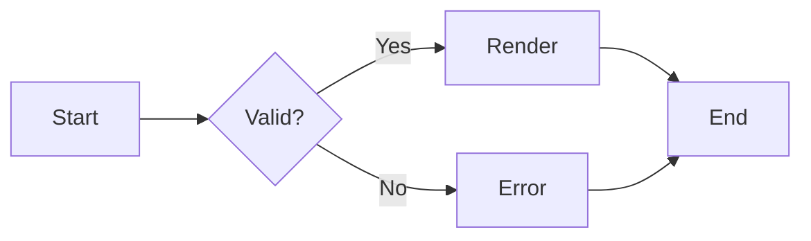

#### 3.2 Legacy graph alias

<!-- MDVU-MERMAID-STATUS: baseline -->
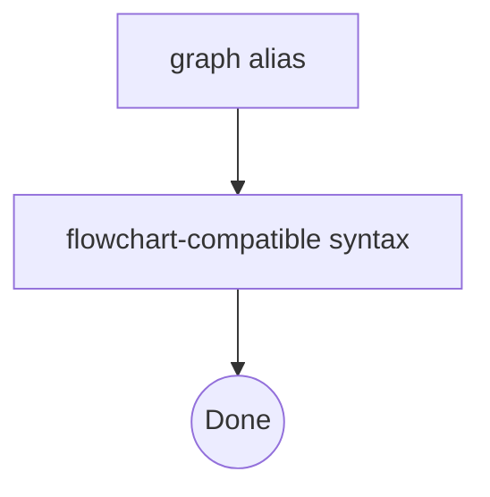

#### 3.3 Init directive (deprecated but compatibility-relevant)

<!-- MDVU-MERMAID-STATUS: baseline -->
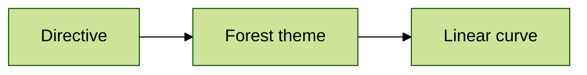

#### 3.4 Frontmatter theme config

<!-- MDVU-MERMAID-STATUS: baseline -->
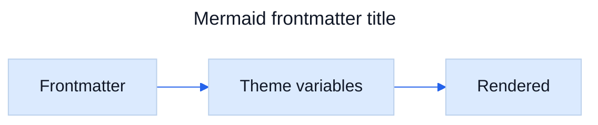

#### 3.5 Markdown auto-wrap disabled

<!-- MDVU-MERMAID-STATUS: baseline -->
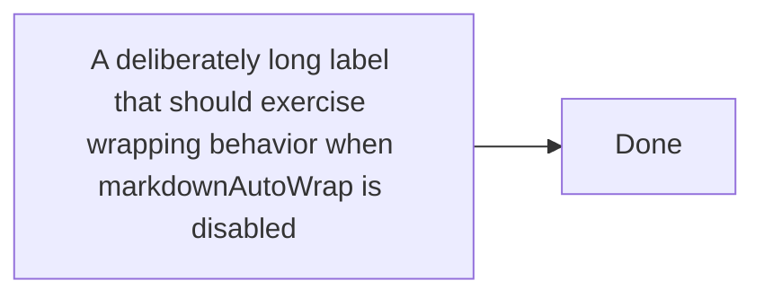

#### 3.6 Look / layout probe

<!-- MDVU-MERMAID-STATUS: version/build dependent -->


## 4. Mermaid Flowchart Exhaustive Matrix

#### 4.1 Direction TB

<!-- MDVU-MERMAID-STATUS: baseline -->
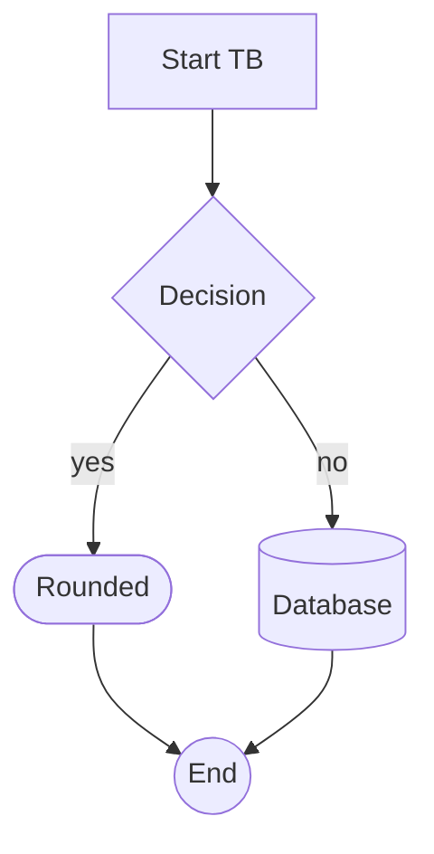

#### 4.1 Direction TD

<!-- MDVU-MERMAID-STATUS: baseline -->


#### 4.1 Direction BT

<!-- MDVU-MERMAID-STATUS: baseline -->
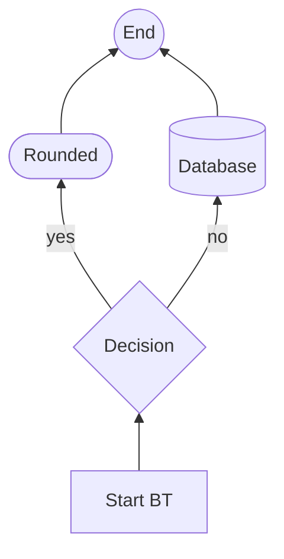

#### 4.1 Direction LR

<!-- MDVU-MERMAID-STATUS: baseline -->
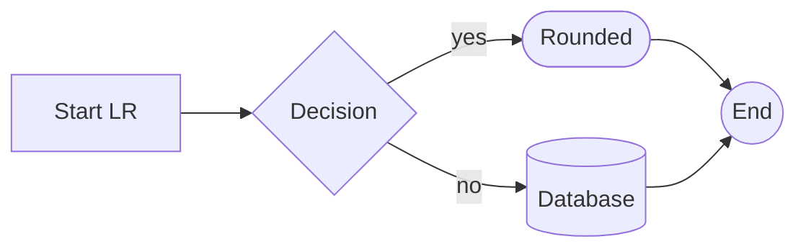

#### 4.1 Direction RL

<!-- MDVU-MERMAID-STATUS: baseline -->
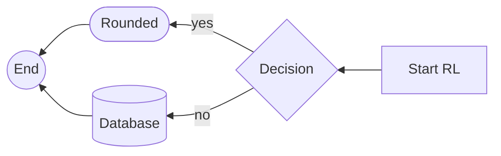

#### 4.2 Legacy node-shape syntax

<!-- MDVU-MERMAID-STATUS: baseline -->
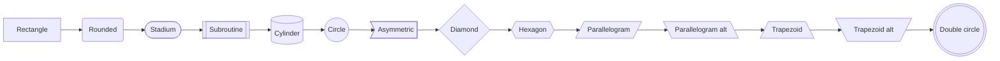

#### 4.3 Expanded flowchart shape DSL (v11.3+)

<!-- MDVU-MERMAID-STATUS: 11.3+ -->
```mermaid
flowchart TB
    S1@{ shape: bang, label: "bang · 1 · 中文 · 😀" }
    S2@{ shape: browser, label: "browser · 2 · 中文 · 😀" }
    S3@{ shape: bucket, label: "bucket · 3 · 中文 · 😀" }
    S4@{ shape: notch-rect, label: "notch-rect · 4 · 中文 · 😀" }
    S5@{ shape: cloud, label: "cloud · 5 · 中文 · 😀" }
    S6@{ shape: hourglass, label: "hourglass · 6 · 中文 · 😀" }
    S7@{ shape: bolt, label: "bolt · 7 · 中文 · 😀" }
    S8@{ shape: brace, label: "brace · 8 · 中文 · 😀" }
    S9@{ shape: brace-r, label: "brace-r · 9 · 中文 · 😀" }
    S10@{ shape: braces, label: "braces · 10 · 中文 · 😀" }
    S11@{ shape: console, label: "console · 11 · 中文 · 😀" }
    S12@{ shape: lean-r, label: "lean-r · 12 · 中文 · 😀" }
    S13@{ shape: lean-l, label: "lean-l · 13 · 中文 · 😀" }
    S14@{ shape: datastore, label: "datastore · 14 · 中文 · 😀" }
    S15@{ shape: cyl, label: "cyl · 15 · 中文 · 😀" }
    S16@{ shape: diam, label: "diam · 16 · 中文 · 😀" }
    S17@{ shape: delay, label: "delay · 17 · 中文 · 😀" }
    S18@{ shape: h-cyl, label: "h-cyl · 18 · 中文 · 😀" }
    S19@{ shape: lin-cyl, label: "lin-cyl · 19 · 中文 · 😀" }
    S20@{ shape: curv-trap, label: "curv-trap · 20 · 中文 · 😀" }
    S21@{ shape: div-rect, label: "div-rect · 21 · 中文 · 😀" }
    S22@{ shape: doc, label: "doc · 22 · 中文 · 😀" }
    S23@{ shape: rounded, label: "rounded · 23 · 中文 · 😀" }
    S24@{ shape: tri, label: "tri · 24 · 中文 · 😀" }
    S25@{ shape: folder, label: "folder · 25 · 中文 · 😀" }
    S26@{ shape: fork, label: "fork · 26 · 中文 · 😀" }
    S27@{ shape: win-pane, label: "win-pane · 27 · 中文 · 😀" }
    S28@{ shape: f-circ, label: "f-circ · 28 · 中文 · 😀" }
    S29@{ shape: lin-doc, label: "lin-doc · 29 · 中文 · 😀" }
    S30@{ shape: lin-rect, label: "lin-rect · 30 · 中文 · 😀" }
    S31@{ shape: notch-pent, label: "notch-pent · 31 · 中文 · 😀" }
    S32@{ shape: flip-tri, label: "flip-tri · 32 · 中文 · 😀" }
    S33@{ shape: sl-rect, label: "sl-rect · 33 · 中文 · 😀" }
    S34@{ shape: trap-t, label: "trap-t · 34 · 中文 · 😀" }
    S35@{ shape: docs, label: "docs · 35 · 中文 · 😀" }
    S36@{ shape: st-rect, label: "st-rect · 36 · 中文 · 😀" }
    S37@{ shape: odd, label: "odd · 37 · 中文 · 😀" }
    S38@{ shape: flag, label: "flag · 38 · 中文 · 😀" }
    S39@{ shape: person, label: "person · 39 · 中文 · 😀" }
    S40@{ shape: hex, label: "hex · 40 · 中文 · 😀" }
    S41@{ shape: trap-b, label: "trap-b · 41 · 中文 · 😀" }
    S42@{ shape: rect, label: "rect · 42 · 中文 · 😀" }
    S43@{ shape: circle, label: "circle · 43 · 中文 · 😀" }
    S44@{ shape: sm-circ, label: "sm-circ · 44 · 中文 · 😀" }
    S45@{ shape: dbl-circ, label: "dbl-circ · 45 · 中文 · 😀" }
    S46@{ shape: fr-circ, label: "fr-circ · 46 · 中文 · 😀" }
    S47@{ shape: bow-rect, label: "bow-rect · 47 · 中文 · 😀" }
    S48@{ shape: fr-rect, label: "fr-rect · 48 · 中文 · 😀" }
    S49@{ shape: cross-circ, label: "cross-circ · 49 · 中文 · 😀" }
    S50@{ shape: tag-doc, label: "tag-doc · 50 · 中文 · 😀" }
    S51@{ shape: tag-rect, label: "tag-rect · 51 · 中文 · 😀" }
    S52@{ shape: stadium, label: "stadium · 52 · 中文 · 😀" }
    S53@{ shape: text, label: "text · 53 · 中文 · 😀" }
    S1 --> S2
    S2 --> S3
    S3 --> S4
    S4 --> S5
    S5 --> S6
    S6 --> S7
    S7 --> S8
    S8 --> S9
    S9 --> S10
    S10 --> S11
    S11 --> S12
    S12 --> S13
    S13 --> S14
    S14 --> S15
    S15 --> S16
    S16 --> S17
    S17 --> S18
    S18 --> S19
    S19 --> S20
    S20 --> S21
    S21 --> S22
    S22 --> S23
    S23 --> S24
    S24 --> S25
    S25 --> S26
    S26 --> S27
    S27 --> S28
    S28 --> S29
    S29 --> S30
    S30 --> S31
    S31 --> S32
    S32 --> S33
    S33 --> S34
    S34 --> S35
    S35 --> S36
    S36 --> S37
    S37 --> S38
    S38 --> S39
    S39 --> S40
    S40 --> S41
    S41 --> S42
    S42 --> S43
    S43 --> S44
    S44 --> S45
    S45 --> S46
    S46 --> S47
    S47 --> S48
    S48 --> S49
    S49 --> S50
    S50 --> S51
    S51 --> S52
    S52 --> S53
```

#### 4.4 Edge varieties, lengths and labels

<!-- MDVU-MERMAID-STATUS: baseline -->
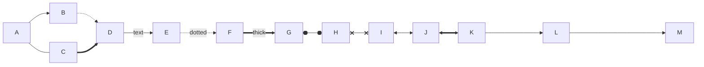

#### 4.5 Subgraphs, nested directions and boundary edges

<!-- MDVU-MERMAID-STATUS: baseline -->
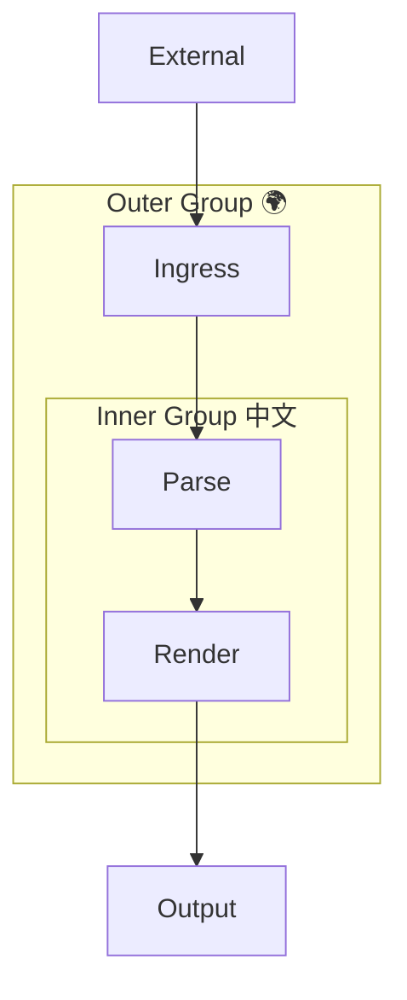

#### 4.6 Styling, classes and linkStyle

<!-- MDVU-MERMAID-STATUS: baseline -->
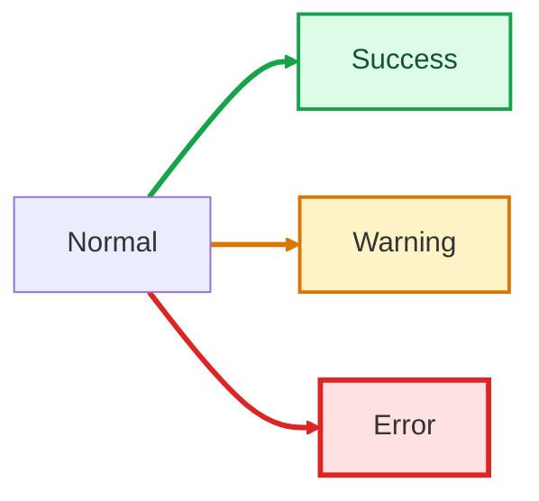

#### 4.7 Unicode, quoted labels, entities and HTML labels

<!-- MDVU-MERMAID-STATUS: baseline -->


#### 4.8 Markdown strings

<!-- MDVU-MERMAID-STATUS: modern Mermaid -->
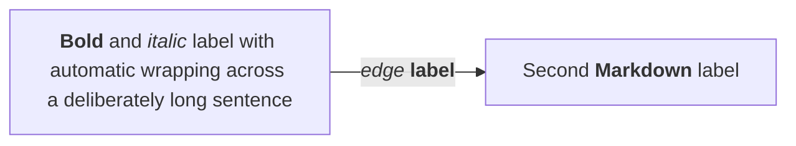

#### 4.9 Click/link interaction probe

<!-- MDVU-MERMAID-STATUS: requires non-strict security for interaction -->


#### 4.10 Edge IDs and animation metadata

<!-- MDVU-MERMAID-STATUS: newer flowchart feature -->


#### 4.11 Collapsible subgraph metadata

<!-- MDVU-MERMAID-STATUS: 11.17+ -->
```mermaid
flowchart LR
    subgraph sg1 [Collapsed implementation]
      A[Internal A] --> B[Internal B]
    end
    sg1@{ view: collapsed }
    X[Caller] --> A
    B --> Y[Consumer]
```

## 5. Mermaid Sequence / Class / State / ER

#### 5.1 Sequence: actors, aliases, notes, activation, loop, alt, opt

<!-- MDVU-MERMAID-STATUS: baseline -->
```mermaid
sequenceDiagram
    autonumber
    actor U as User 👤
    participant C as Client 中文
    participant A as API
    participant D as Database
    U->>+C: Open application
    C->>+A: GET /items
    A->>+D: SELECT items
    D-->>-A: rows
    alt rows found
      A-->>C: 200 + JSON
    else empty
      A-->>C: 204
    end
    opt telemetry enabled
      C-->>A: POST /telemetry
    end
    loop every page
      C->>C: render item
    end
    C-->>-U: UI ready
    Note over U,D: Mixed Unicode: Русский · العربية · 中文 · 😀
```

#### 5.2 Sequence: parallel, critical, break and boxes

<!-- MDVU-MERMAID-STATUS: baseline -->
```mermaid
sequenceDiagram
    box rgb(240,248,255) Frontend
      participant UI
      participant Cache
    end
    box Backend
      participant API
      participant DB
    end
    par fetch profile
      UI->>API: GET /profile
      API->>DB: query profile
    and fetch settings
      UI->>Cache: read settings
    end
    critical commit transaction
      API->>DB: COMMIT
    option deadlock
      DB-->>API: retryable error
    option timeout
      DB-->>API: timeout
    end
    break user cancelled
      UI-->>API: cancel
    end
```

#### 5.3 Sequence: message arrow variants

<!-- MDVU-MERMAID-STATUS: baseline -->
```mermaid
sequenceDiagram
    participant A
    participant B
    A->B: solid no arrow
    A-->B: dotted no arrow
    A->>B: solid arrow
    A-->>B: dotted arrow
    A-xB: solid cross
    A--xB: dotted cross
    A-)B: solid open
    A--)B: dotted open
```

#### 5.4 Class: relationships, cardinality, generics, annotations, namespace

<!-- MDVU-MERMAID-STATUS: baseline -->
```mermaid
classDiagram
    namespace Domain {
      class Repository~T~ {
        <<interface>>
        +save(T entity)
        +findById(String id) T
      }
      class User {
        +String id
        +String name
        +login() bool
      }
      class Order {
        +Decimal total
        +submit()
      }
    }
    class UserRepository {
      <<service>>
    }
    Repository~User~ <|.. UserRepository : implements
    User "1" --> "0..*" Order : places
    User o-- Order : aggregation
    Order *-- LineItem : composition
    User ..> AuditEvent : dependency
    note for User "Unicode note: 中文 / العربية / 😀"
```

#### 5.5 Class: link interaction probe

<!-- MDVU-MERMAID-STATUS: interaction security dependent -->
```mermaid
classDiagram
    class Shape
    class Shape2
    link Shape "https://example.com" "Example tooltip"
    click Shape2 href "https://github.com" "GitHub"
```

#### 5.6 State: nested states, choice, fork/join, notes, concurrency

<!-- MDVU-MERMAID-STATUS: baseline -->
```mermaid
stateDiagram-v2
    direction LR
    [*] --> Idle
    Idle --> Active : start
    state Active {
      [*] --> Validate
      state choice1 <<choice>>
      Validate --> choice1
      choice1 --> Process : valid
      choice1 --> Failed : invalid
      state fork1 <<fork>>
      Process --> fork1
      fork1 --> Persist
      fork1 --> Notify
      state join1 <<join>>
      Persist --> join1
      Notify --> join1
      join1 --> Done
      --
      [*] --> Monitoring
      Monitoring --> Monitoring : heartbeat
    }
    note right of Idle : Waiting / ожидание / 待機
    Active --> Idle : reset
    Active --> [*] : shutdown
```

#### 5.7 ER: cardinalities, keys and Unicode entities

<!-- MDVU-MERMAID-STATUS: baseline -->
```mermaid
erDiagram
    CUSTOMER ||--o{ ORDER : places
    ORDER ||--|{ LINE_ITEM : contains
    PRODUCT ||--o{ LINE_ITEM : referenced_by
    CUSTOMER {
      uuid id PK
      string name
      string email UK
    }
    ORDER {
      uuid id PK
      uuid customer_id FK
      datetime created_at
    }
    PRODUCT {
      uuid id PK
      string 名称
      decimal price
    }
    LINE_ITEM {
      uuid order_id FK
      uuid product_id FK
      int quantity
    }
```

## 6. Mermaid Specialized Diagram Types

#### 6.1 Gantt

<!-- MDVU-MERMAID-STATUS: baseline -->
```mermaid
gantt
    title Release plan — 版本计划 — План релиза
    dateFormat YYYY-MM-DD
    axisFormat %d %b
    excludes weekends
    section Build
    Parser           :done, p1, 2026-09-01, 2d
    Renderer         :active, p2, after p1, 3d
    section Validate
    Unicode suite    :crit, u1, 2026-09-06, 2d
    Mermaid suite    :m1, after u1, 3d
    Release          :milestone, rel, 2026-09-12, 0d
```

#### 6.2 Pie

<!-- MDVU-MERMAID-STATUS: baseline -->
```mermaid
pie showData
    title Unicode Script Mix
    "Latin" : 35
    "CJK 中文" : 25
    "Cyrillic Русский" : 15
    "Arabic العربية" : 12
    "Indic हिन्दी" : 8
    "Emoji 😀" : 5
```

#### 6.3 GitGraph

<!-- MDVU-MERMAID-STATUS: baseline -->
```mermaid
gitGraph LR:
    commit id: "init"
    branch develop
    checkout develop
    commit id: "feature-α"
    branch feature/unicode
    checkout feature/unicode
    commit id: "中文-😀"
    checkout develop
    merge feature/unicode
    checkout main
    merge develop tag: "v1.0.0"
    commit id: "release"
```

#### 6.4 Journey

<!-- MDVU-MERMAID-STATUS: baseline -->
```mermaid
journey
    title mdvu user journey
    section Open
      Select huge Markdown: 4: User
      Parse Markdown: 3: mdvu
    section Render
      Render text: 5: mdvu
      Render Mermaid: 3: mdvu, Mermaid
      Scroll huge file: 4: User
    section Verify
      Search marker: 5: User
      Inspect Unicode: 4: User
```

#### 6.5 Mindmap

<!-- MDVU-MERMAID-STATUS: baseline -->
```mermaid
mindmap
  root((mdvu 🧪))
    Markdown
      Tables
      Lists
      Code
      HTML
    Mermaid
      Flowchart
      Sequence
      Architecture
      New diagrams
    Unicode 🌍
      Latin ÅÄÖ
      Кириллица
      中文
      العربية
      😀 Emoji
```

#### 6.6 Timeline

<!-- MDVU-MERMAID-STATUS: baseline -->
```mermaid
timeline
    title Renderer compatibility timeline
    2024 : Baseline parser
         : Basic Mermaid
    2025 : Expanded shapes
         : Packet / Architecture
    2026 : Venn / Wardley / TreeView
         : Stress and Unicode regression suite
```

#### 6.7 Quadrant chart

<!-- MDVU-MERMAID-STATUS: baseline -->
```mermaid
quadrantChart
    title Coverage vs Rendering Cost
    x-axis Low coverage --> High coverage
    y-axis Low cost --> High cost
    quadrant-1 Valuable stress tests
    quadrant-2 Expensive edge cases
    quadrant-3 Cheap smoke tests
    quadrant-4 Efficient regression tests
    Small Markdown: [0.2, 0.2]
    Unicode sampler: [0.7, 0.4]
    Huge flowchart: [0.8, 0.9]
    Full fixture: [0.95, 0.8]
```

#### 6.8 Requirement diagram

<!-- MDVU-MERMAID-STATUS: baseline -->
```mermaid
requirementDiagram
    direction LR
    functionalRequirement render_unicode {
      id: REQ-001
      text: Render Unicode without data loss
      risk: high
      verifymethod: test
    }
    performanceRequirement render_large {
      id: REQ-002
      text: Render a large Markdown document responsively
      risk: medium
      verifymethod: demonstration
    }
    interfaceRequirement mermaid_api {
      id: REQ-003
      text: Integrate Mermaid renderer
      risk: medium
      verifymethod: inspection
    }
    element mdvu {
      type: application
      docref: mdvu-full-torture-test.md
    }
    mdvu - satisfies -> render_unicode
    mdvu - satisfies -> render_large
    mdvu - satisfies -> mermaid_api
```

#### 6.9 C4 Context

<!-- MDVU-MERMAID-STATUS: experimental C4 -->
```mermaid
C4Context
    title mdvu System Context
    Person(user, "Reader", "Opens Markdown files")
    System(mdvu, "mdvu", "Native Markdown viewer")
    System_Ext(mermaid, "Mermaid renderer", "Renders diagrams")
    Rel(user, mdvu, "Views", "Markdown")
    Rel(mdvu, mermaid, "Renders fenced diagrams")
```

#### 6.10 C4 Container

<!-- MDVU-MERMAID-STATUS: experimental C4 -->
```mermaid
C4Container
    title mdvu Containers
    Person(user, "User")
    System_Boundary(b1, "mdvu") {
      Container(ui, "Viewer", "Native UI", "Displays parsed document")
      Container(parser, "Markdown parser", "Parser", "Builds document model")
      Container(mermaid, "Mermaid bridge", "JavaScript", "Builds SVG diagrams")
    }
    Rel(user, ui, "Reads")
    Rel(ui, parser, "Requests parsed blocks")
    Rel(ui, mermaid, "Requests diagrams")
```

#### 6.11 ZenUML

<!-- MDVU-MERMAID-STATUS: ZenUML support/plugin dependent -->
```mermaid
zenuml
    @Actor User
    User->mdvu: open(file)
    mdvu->Parser: parse(markdown)
    if(hasMermaid) {
      mdvu->Mermaid: render(diagram)
      Mermaid->mdvu: svg
    } else {
      mdvu->mdvu: renderText()
    }
    opt {
      User->mdvu: search("PERF-MARKER")
    }
```

#### 6.12 Sankey

<!-- MDVU-MERMAID-STATUS: baseline -->
```mermaid
sankey
    Markdown,Parser,100
    Parser,Text renderer,55
    Parser,Mermaid renderer,35
    Parser,Code highlighter,10
    Mermaid renderer,SVG,35
    Text renderer,Screen,55
    SVG,Screen,35
    Code highlighter,Screen,10
```

#### 6.13 XY chart vertical

<!-- MDVU-MERMAID-STATUS: legend labels need newer Mermaid -->
```mermaid
xychart
    title "Render time by fixture size"
    x-axis ["1k", "5k", "10k", "20k", "30k"]
    y-axis "milliseconds" 0 --> 500
    bar "cold" [30, 80, 160, 310, 480]
    line "warm" [20, 55, 100, 190, 280]
```

#### 6.14 XY chart horizontal

<!-- MDVU-MERMAID-STATUS: baseline -->
```mermaid
xychart horizontal
    title "Throughput"
    x-axis "documents" 0 --> 5
    y-axis "score" 0 --> 100
    bar [20, 40, 60, 80, 100]
    line [15, 35, 55, 75, 95]
```

#### 6.15 Block diagram

<!-- MDVU-MERMAID-STATUS: baseline -->
```mermaid
block-beta
    columns 4
    A["Input"] B("Parser") C(("Renderer")) D[("Cache")]
    A --> B
    B --> C
    C --> D
    space:2 E{{"Decision"}} F[["Subroutine"]]
    E --> F
```

#### 6.16 Packet diagram ranges

<!-- MDVU-MERMAID-STATUS: baseline -->
```mermaid
packet
    title Synthetic IPv4-like Header
    0-3: "Version"
    4-7: "IHL"
    8-15: "DSCP/ECN"
    16-31: "Total Length"
    32-47: "Identification"
    48-50: "Flags"
    51-63: "Fragment Offset"
    64-71: "TTL"
    72-79: "Protocol"
    80-95: "Header Checksum"
    96-127: "Source Address"
    128-159: "Destination Address"
```

#### 6.17 Packet diagram +count syntax

<!-- MDVU-MERMAID-STATUS: 11.7+ -->
```mermaid
packet
    title Count-based Header
    +4: "Version"
    +4: "Flags"
    +8: "Type"
    +16: "Length"
    +32: "Sequence"
    +32: "Payload prefix"
```

#### 6.18 Kanban metadata

<!-- MDVU-MERMAID-STATUS: baseline -->
```mermaid
---
config:
  kanban:
    ticketBaseUrl: "https://example.invalid/ticket/#TICKET#"
---
kanban
  todo[Todo]
    parse[Parse Unicode]@{ ticket: MDVU-101, assigned: 'Parser Team', priority: 'High' }
    diagrams[Add Mermaid tests]@{ ticket: MDVU-102, priority: 'Very High' }
  progress[In Progress]
    perf[Performance profiling]@{ assigned: 'Runtime Team', priority: 'High' }
  done[Done]
    smoke[Smoke tests]@{ priority: 'Low' }
```

#### 6.19 Architecture diagram

<!-- MDVU-MERMAID-STATUS: 11.1+ -->
```mermaid
architecture-beta
    group client(cloud)[Client]
    group app(cloud)[mdvu Application]
    service user(internet)[Reader] in client
    service viewer(server)[Viewer] in app
    service parser(server)[Markdown Parser] in app
    service mermaid(server)[Mermaid Engine] in app
    service cache(database)[Render Cache] in app
    user:R --> L:viewer
    viewer:R --> L:parser
    viewer:B --> T:mermaid
    mermaid:R --> L:cache
```

#### 6.20 Radar diagram

<!-- MDVU-MERMAID-STATUS: 11.6+ -->
```mermaid
radar-beta
    title mdvu Coverage
    axis md["Markdown"], mm["Mermaid"], uc["Unicode"], pf["Performance"], rt["RTL"], er["Error recovery"]
    curve current["Fixture"]{98, 96, 100, 90, 95, 88}
    curve smoke["Small smoke"]{60, 40, 30, 100, 20, 50}
    min 0
    max 100
    graticule polygon
    ticks 5
```

#### 6.21 Swimlanes

<!-- MDVU-MERMAID-STATUS: forward 11.17-era feature -->
```mermaid
swimlane-beta LR
    subgraph User[User]
      A[Open file]
      D[Inspect result]
    end
    subgraph mdvu[mdvu]
      B[Parse Markdown]
      C[Render blocks]
    end
    A --> B
    B --> C
    C --> D
```

#### 6.22 Event Modeling compact syntax

<!-- MDVU-MERMAID-STATUS: 11.15+ -->
```mermaid
eventmodeling
    tf 01 ui FilePicker
    tf 02 cmd OpenDocument
    tf 03 evt DocumentOpened
    tf 04 rmo ParsedDocument
    tf 05 ui Viewer
```

#### 6.23 Event Modeling relaxed syntax + data

<!-- MDVU-MERMAID-STATUS: 11.15+ -->
```mermaid
eventmodeling
    timeframe 01 ui Viewer
    timeframe 02 command RenderDiagram [[RenderRequest]]
    timeframe 03 event DiagramRendered [[RenderResult]]
    data RenderRequest {
      language: 'mermaid'
      chars: 1200
    }
    data RenderResult {
      format: 'svg'
      ok: true
    }
```

#### 6.24 Treemap

<!-- MDVU-MERMAID-STATUS: new diagram type -->
```mermaid
treemap-beta
    "mdvu fixture"
      "Markdown"
        "Core syntax": 30
        "GFM": 20
      "Mermaid"
        "Baseline": 35
        "Forward probes": 15
      "Unicode"
        "Scripts": 25
        "Emoji": 10
```

#### 6.25 Venn

<!-- MDVU-MERMAID-STATUS: 11.12.3+ -->
```mermaid
venn-beta
    title "Renderer coverage"
    set Markdown["Markdown"]:80
      text md1["GFM"]
    set Mermaid["Mermaid"]:70
      text mm1["Diagrams"]
    set Unicode["Unicode"]:90
      text uc1["Scripts + Emoji"]
    union Markdown,Mermaid["Fenced diagrams"]:25
    union Mermaid,Unicode["Unicode labels"]:20
    union Markdown,Unicode["Multilingual prose"]:35
    union Markdown,Mermaid,Unicode["mdvu torture fixture"]:15
```

#### 6.26 Ishikawa

<!-- MDVU-MERMAID-STATUS: 11.12.3+ -->
```mermaid
ishikawa-beta
    Rendering Failure
      Markdown
        Fence parsing
        Nested lists
        HTML interaction
      Mermaid
        Grammar version
        SVG layout
        Large diagrams
      Unicode
        Font fallback
        Bidi handling
        Grapheme clusters
      Performance
        Parse time
        Layout time
        Memory pressure
```

#### 6.27 Wardley map

<!-- MDVU-MERMAID-STATUS: 11.14+ -->
```mermaid
wardley-beta
    title mdvu Rendering Stack
    size [1000, 650]
    evolution Genesis@0.25 -> Custom@0.5 -> Product@0.75 -> Commodity@1.0
    anchor Reader [0.95, 0.90]
    component "mdvu UI" [0.80, 0.65] (build)
    component "Markdown parser" [0.62, 0.82] (buy)
    component "Mermaid renderer" [0.55, 0.75] (buy)
    component "Unicode fonts" [0.35, 0.95] (market)
    Reader -> "mdvu UI"
    "mdvu UI" -> "Markdown parser"
    "mdvu UI" -> "Mermaid renderer"
    "Mermaid renderer" -> "Unicode fonts"
    evolve "mdvu UI" 0.82
    note "Regression suite drives confidence" [0.70, 0.50]
```

#### 6.28 Cynefin

<!-- MDVU-MERMAID-STATUS: 11.16+ -->
```mermaid
cynefin-beta
    title Rendering Problems
    complex
      "Unexpected bidi interaction"
      "Cross-parser edge case"
    complicated
      "SVG performance profiling"
      "Font fallback analysis"
    clear
      "Broken link"
      "Missing file"
    chaotic
      "Renderer crash"
      "Infinite layout loop"
    confusion
      "Unknown parser mismatch"
    complex --> complicated : "Pattern understood"
    chaotic --> complex : "Crash contained"
```

#### 6.29 TreeView standard

<!-- MDVU-MERMAID-STATUS: 11.14+ -->
```mermaid
treeView-beta
    ├── src/
    │   ├── parser/
    │   │   ├── markdown.swift
    │   │   └── mermaid.swift
    │   ├── ui/
    │   │   └── viewer.swift
    │   └── unicode/
    │       └── bidi.swift
    ├── tests/ :::highlight
    │   └── mdvu-full-torture-test.md ## this fixture
    └── README.md
```

#### 6.30 TreeView heavy box-drawing

<!-- MDVU-MERMAID-STATUS: 11.14+ -->
```mermaid
treeView-beta
    ┣━━ packages/
    ┃   ┣━━ core/
    ┃   ┃   ┗━━ src/
    ┃   ┗━━ renderer/
    ┃       ┣━━ mermaid/
    ┃       ┗━━ markdown/
    ┗━━ docs/
```

#### 6.31 Legacy stateDiagram syntax

<!-- MDVU-MERMAID-STATUS: legacy dialect -->
```mermaid
stateDiagram
    [*] --> Idle
    Idle --> Working : start
    Working --> Idle : stop
    Idle --> [*]
```

#### 6.32 Timeline TD + sections

<!-- MDVU-MERMAID-STATUS: direction 11.14+ -->
```mermaid
timeline TD
    title Direction and section probe — 方向 — اتجاه
    section Foundation
      2024 Q1 : Parser baseline : Unicode input
      2024 Q2 : Mermaid integration
    section Expansion
      2025 : Performance suite : Accessibility
      2026 : Forward-compatibility probes : Regression corpus
```

#### 6.33 Mindmap shape variants

<!-- MDVU-MERMAID-STATUS: baseline -->
```mermaid
mindmap
  root((Shape matrix))
    a[Square]
    b(Rounded square)
    c((Circle))
    d)Cloud(
    e{{Hexagon}}
    f))Bang((
    g["Unicode 中文 العربية 😀"]
```

#### 6.34 Math labels

<!-- MDVU-MERMAID-STATUS: math rendering / KaTeX integration dependent -->
```mermaid
flowchart LR
    A["$$E = mc^2$$"] --> B["$$\\int_0^1 x^2\\,dx = \\frac{1}{3}$$"]
    B --> C["Unicode math: α + β → γ"]
```

#### 6.35 C4 Component

<!-- MDVU-MERMAID-STATUS: experimental C4 -->
```mermaid
C4Component
    title mdvu Component Diagram
    Container(viewer, "Viewer", "Native UI", "Displays Markdown")
    ContainerDb(cache, "Cache", "Local", "Stores rendered fragments")
    Container_Boundary(core, "mdvu Core") {
      Component(parser, "Markdown Parser", "Parser", "Parses block and inline syntax")
      Component(bridge, "Mermaid Bridge", "JavaScript", "Renders Mermaid to SVG")
    }
    Rel(viewer, parser, "Parses document")
    Rel(viewer, bridge, "Renders diagrams")
    Rel(bridge, cache, "Caches SVG")
```

#### 6.36 C4 Dynamic

<!-- MDVU-MERMAID-STATUS: experimental C4 -->
```mermaid
C4Dynamic
    title mdvu Dynamic Render Path
    Container(ui, "Viewer", "Native UI", "Displays document")
    Container_Boundary(core, "Core") {
      Component(parser, "Parser", "Markdown", "Creates block model")
      Component(renderer, "Mermaid Renderer", "JavaScript", "Creates SVG")
    }
    Rel(ui, parser, "1. Parse Markdown")
    Rel(parser, renderer, "2. Render Mermaid block")
    Rel(renderer, ui, "3. Return SVG")
```

#### 6.37 C4 Deployment

<!-- MDVU-MERMAID-STATUS: experimental C4 -->
```mermaid
C4Deployment
    title mdvu Deployment Diagram
    Deployment_Node(mac, "macOS device", "Apple Silicon") {
      Deployment_Node(process, "mdvu process", "Native application") {
        Container(viewer, "Viewer", "Native UI", "Markdown document")
        Container(mermaid, "Mermaid runtime", "JavaScript", "SVG rendering")
      }
    }
    Rel(viewer, mermaid, "Render fenced diagram")
```

#### 6.38 ER direction + subgraphs

<!-- MDVU-MERMAID-STATUS: ER subgraphs 11.17+ -->
```mermaid
erDiagram
    direction LR
    subgraph IdentityDomain
      USER ||--o{ SESSION : opens
      USER {
        uuid id PK
        string display_name
      }
      SESSION {
        uuid id PK
        uuid user_id FK
      }
    end
    subgraph ContentDomain
      DOCUMENT ||--o{ DIAGRAM : contains
      DOCUMENT {
        uuid id PK
        string title
      }
      DIAGRAM {
        uuid id PK
        uuid document_id FK
      }
    end
    SESSION }o--o{ DOCUMENT : views
```

#### 6.39 Sequence math + autonumber

<!-- MDVU-MERMAID-STATUS: math rendering / KaTeX integration dependent -->
```mermaid
sequenceDiagram
    autonumber
    actor U as User 😀
    participant M as mdvu
    U->>M: Render $$x^2 + y^2 = r^2$$
    activate M
    M-->>U: SVG / MathML result
    deactivate M
```

## 7. Multilingual Mermaid Matrix

#### 7.01 Flowchart — English

<!-- MDVU-MERMAID-STATUS: baseline -->
```mermaid
flowchart LR
    A["Start · English · 😀"] --> B{"Validate?"}
    B -->|"Valid"| C["Render 🧪"]
    B -->|"Invalid"| D["⚠️ Invalid"]
    C --> E(("Done ✅"))
    D --> E
```

#### 7.02 Flowchart — Suomi

<!-- MDVU-MERMAID-STATUS: baseline -->
```mermaid
flowchart LR
    A["Aloita · Suomi · 😀"] --> B{"Tarkista?"}
    B -->|"Kelvollinen"| C["Renderöi 🧪"]
    B -->|"Virheellinen"| D["⚠️ Virheellinen"]
    C --> E(("Valmis ✅"))
    D --> E
```

#### 7.03 Flowchart — Deutsch

<!-- MDVU-MERMAID-STATUS: baseline -->
```mermaid
flowchart LR
    A["Start · Deutsch · 😀"] --> B{"Prüfen?"}
    B -->|"Gültig"| C["Rendern 🧪"]
    B -->|"Ungültig"| D["⚠️ Ungültig"]
    C --> E(("Fertig ✅"))
    D --> E
```

#### 7.04 Flowchart — Français

<!-- MDVU-MERMAID-STATUS: baseline -->
```mermaid
flowchart LR
    A["Début · Français · 😀"] --> B{"Valider?"}
    B -->|"Valide"| C["Rendre 🧪"]
    B -->|"Invalide"| D["⚠️ Invalide"]
    C --> E(("Terminé ✅"))
    D --> E
```

#### 7.05 Flowchart — Español

<!-- MDVU-MERMAID-STATUS: baseline -->
```mermaid
flowchart LR
    A["Inicio · Español · 😀"] --> B{"Validar?"}
    B -->|"Válido"| C["Renderizar 🧪"]
    B -->|"Inválido"| D["⚠️ Inválido"]
    C --> E(("Fin ✅"))
    D --> E
```

#### 7.06 Flowchart — Русский

<!-- MDVU-MERMAID-STATUS: baseline -->
```mermaid
flowchart LR
    A["Старт · Русский · 😀"] --> B{"Проверить?"}
    B -->|"Верно"| C["Отрисовать 🧪"]
    B -->|"Ошибка"| D["⚠️ Ошибка"]
    C --> E(("Готово ✅"))
    D --> E
```

#### 7.07 Flowchart — Українська

<!-- MDVU-MERMAID-STATUS: baseline -->
```mermaid
flowchart LR
    A["Старт · Українська · 😀"] --> B{"Перевірити?"}
    B -->|"Коректно"| C["Відобразити 🧪"]
    B -->|"Помилка"| D["⚠️ Помилка"]
    C --> E(("Готово ✅"))
    D --> E
```

#### 7.08 Flowchart — Ελληνικά

<!-- MDVU-MERMAID-STATUS: baseline -->
```mermaid
flowchart LR
    A["Έναρξη · Ελληνικά · 😀"] --> B{"Έλεγχος?"}
    B -->|"Έγκυρο"| C["Απόδοση 🧪"]
    B -->|"Άκυρο"| D["⚠️ Άκυρο"]
    C --> E(("Τέλος ✅"))
    D --> E
```

#### 7.09 Flowchart — עברית

<!-- MDVU-MERMAID-STATUS: baseline -->
```mermaid
flowchart LR
    A["התחלה · עברית · 😀"] --> B{"בדיקה?"}
    B -->|"תקין"| C["עיבוד 🧪"]
    B -->|"שגוי"| D["⚠️ שגוי"]
    C --> E(("סיום ✅"))
    D --> E
```

#### 7.10 Flowchart — العربية

<!-- MDVU-MERMAID-STATUS: baseline -->
```mermaid
flowchart LR
    A["ابدأ · العربية · 😀"] --> B{"تحقق?"}
    B -->|"صحيح"| C["اعرض 🧪"]
    B -->|"خطأ"| D["⚠️ خطأ"]
    C --> E(("انتهى ✅"))
    D --> E
```

#### 7.11 Flowchart — فارسی

<!-- MDVU-MERMAID-STATUS: baseline -->
```mermaid
flowchart LR
    A["شروع · فارسی · 😀"] --> B{"بررسی?"}
    B -->|"درست"| C["رندر 🧪"]
    B -->|"خطا"| D["⚠️ خطا"]
    C --> E(("پایان ✅"))
    D --> E
```

#### 7.12 Flowchart — हिन्दी

<!-- MDVU-MERMAID-STATUS: baseline -->
```mermaid
flowchart LR
    A["आरंभ · हिन्दी · 😀"] --> B{"जाँच?"}
    B -->|"मान्य"| C["रेंडर 🧪"]
    B -->|"अमान्य"| D["⚠️ अमान्य"]
    C --> E(("समाप्त ✅"))
    D --> E
```

#### 7.13 Flowchart — বাংলা

<!-- MDVU-MERMAID-STATUS: baseline -->
```mermaid
flowchart LR
    A["শুরু · বাংলা · 😀"] --> B{"যাচাই?"}
    B -->|"বৈধ"| C["রেন্ডার 🧪"]
    B -->|"অবৈধ"| D["⚠️ অবৈধ"]
    C --> E(("শেষ ✅"))
    D --> E
```

#### 7.14 Flowchart — ไทย

<!-- MDVU-MERMAID-STATUS: baseline -->
```mermaid
flowchart LR
    A["เริ่ม · ไทย · 😀"] --> B{"ตรวจสอบ?"}
    B -->|"ถูกต้อง"| C["แสดงผล 🧪"]
    B -->|"ไม่ถูกต้อง"| D["⚠️ ไม่ถูกต้อง"]
    C --> E(("จบ ✅"))
    D --> E
```

#### 7.15 Flowchart — 简体中文

<!-- MDVU-MERMAID-STATUS: baseline -->
```mermaid
flowchart LR
    A["开始 · 简体中文 · 😀"] --> B{"验证?"}
    B -->|"有效"| C["渲染 🧪"]
    B -->|"无效"| D["⚠️ 无效"]
    C --> E(("完成 ✅"))
    D --> E
```

#### 7.16 Flowchart — 繁體中文

<!-- MDVU-MERMAID-STATUS: baseline -->
```mermaid
flowchart LR
    A["開始 · 繁體中文 · 😀"] --> B{"驗證?"}
    B -->|"有效"| C["渲染 🧪"]
    B -->|"無效"| D["⚠️ 無效"]
    C --> E(("完成 ✅"))
    D --> E
```

#### 7.17 Flowchart — 日本語

<!-- MDVU-MERMAID-STATUS: baseline -->
```mermaid
flowchart LR
    A["開始 · 日本語 · 😀"] --> B{"検証?"}
    B -->|"有効"| C["描画 🧪"]
    B -->|"無効"| D["⚠️ 無効"]
    C --> E(("完了 ✅"))
    D --> E
```

#### 7.18 Flowchart — 한국어

<!-- MDVU-MERMAID-STATUS: baseline -->
```mermaid
flowchart LR
    A["시작 · 한국어 · 😀"] --> B{"검증?"}
    B -->|"유효"| C["렌더링 🧪"]
    B -->|"오류"| D["⚠️ 오류"]
    C --> E(("완료 ✅"))
    D --> E
```

#### 7.S1 Sequence — Русский

<!-- MDVU-MERMAID-STATUS: baseline -->
```mermaid
sequenceDiagram
    actor U as Пользователь
    participant C as Клиент
    participant S as Сервер
    U->>C: Открыть файл 😀
    C->>S: Разобрать Markdown
    S-->>C: Готово ✅
    C-->>U: SVG + text
```

#### 7.S2 Sequence — العربية

<!-- MDVU-MERMAID-STATUS: baseline -->
```mermaid
sequenceDiagram
    actor U as المستخدم
    participant C as العميل
    participant S as الخادم
    U->>C: فتح الملف 😀
    C->>S: تحليل Markdown
    S-->>C: تم ✅
    C-->>U: SVG + text
```

#### 7.S3 Sequence — עברית

<!-- MDVU-MERMAID-STATUS: baseline -->
```mermaid
sequenceDiagram
    actor U as משתמש
    participant C as לקוח
    participant S as שרת
    U->>C: פתיחת קובץ 😀
    C->>S: ניתוח Markdown
    S-->>C: מוכן ✅
    C-->>U: SVG + text
```

#### 7.S4 Sequence — 简体中文

<!-- MDVU-MERMAID-STATUS: baseline -->
```mermaid
sequenceDiagram
    actor U as 用户
    participant C as 客户端
    participant S as 服务器
    U->>C: 打开文件 😀
    C->>S: 解析 Markdown
    S-->>C: 完成 ✅
    C-->>U: SVG + text
```

#### 7.S5 Sequence — 日本語

<!-- MDVU-MERMAID-STATUS: baseline -->
```mermaid
sequenceDiagram
    actor U as 利用者
    participant C as クライアント
    participant S as サーバー
    U->>C: ファイルを開く 😀
    C->>S: Markdown を解析
    S-->>C: 完了 ✅
    C-->>U: SVG + text
```

#### 7.S6 Sequence — 한국어

<!-- MDVU-MERMAID-STATUS: baseline -->
```mermaid
sequenceDiagram
    actor U as 사용자
    participant C as 클라이언트
    participant S as 서버
    U->>C: 파일 열기 😀
    C->>S: Markdown 파싱
    S-->>C: 완료 ✅
    C-->>U: SVG + text
```

#### 7.S7 Sequence — हिन्दी

<!-- MDVU-MERMAID-STATUS: baseline -->
```mermaid
sequenceDiagram
    actor U as उपयोगकर्ता
    participant C as क्लाइंट
    participant S as सर्वर
    U->>C: फ़ाइल खोलें 😀
    C->>S: Markdown पार्स करें
    S-->>C: पूर्ण ✅
    C-->>U: SVG + text
```

## 8. Large Diagram and Rendering Stress

#### 8.1 Large flowchart — 25 nodes

<!-- MDVU-MERMAID-STATUS: performance -->
```mermaid
flowchart TB
    N0(("N000 · node · Åä · 中 · ع · 😀"))
    N1["N001 · node · Åä · 中 · ع · 😀"]
    N2["N002 · node · Åä · 中 · ع · 😀"]
    N3["N003 · node · Åä · 中 · ع · 😀"]
    N4["N004 · node · Åä · 中 · ع · 😀"]
    N5(("N005 · node · Åä · 中 · ع · 😀"))
    N6["N006 · node · Åä · 中 · ع · 😀"]
    N7["N007 · node · Åä · 中 · ع · 😀"]
    N8["N008 · node · Åä · 中 · ع · 😀"]
    N9["N009 · node · Åä · 中 · ع · 😀"]
    N10(("N010 · node · Åä · 中 · ع · 😀"))
    N11["N011 · node · Åä · 中 · ع · 😀"]
    N12["N012 · node · Åä · 中 · ع · 😀"]
    N13["N013 · node · Åä · 中 · ع · 😀"]
    N14["N014 · node · Åä · 中 · ع · 😀"]
    N15(("N015 · node · Åä · 中 · ع · 😀"))
    N16["N016 · node · Åä · 中 · ع · 😀"]
    N17["N017 · node · Åä · 中 · ع · 😀"]
    N18["N018 · node · Åä · 中 · ع · 😀"]
    N19["N019 · node · Åä · 中 · ع · 😀"]
    N20(("N020 · node · Åä · 中 · ع · 😀"))
    N21["N021 · node · Åä · 中 · ع · 😀"]
    N22["N022 · node · Åä · 中 · ع · 😀"]
    N23["N023 · node · Åä · 中 · ع · 😀"]
    N24["N024 · node · Åä · 中 · ع · 😀"]
    N0 -->|e0| N1
    N0 -.-> N7
    N0 ==> N13
    N1 -->|e1| N2
    N2 -->|e2| N3
    N3 -->|e3| N4
    N4 -->|e4| N5
    N5 -->|e5| N6
    N6 -->|e6| N7
    N7 -->|e7| N8
    N7 -.-> N14
    N8 -->|e8| N9
    N9 -->|e9| N10
    N10 -->|e10| N11
    N11 -->|e11| N12
    N12 -->|e12| N13
    N13 -->|e13| N14
    N14 -->|e14| N15
    N14 -.-> N21
    N15 -->|e15| N16
    N16 -->|e16| N17
    N17 -->|e17| N18
    N18 -->|e18| N19
    N19 -->|e19| N20
    N20 -->|e20| N21
    N21 -->|e21| N22
    N22 -->|e22| N23
    N23 -->|e23| N24
```

#### 8.1 Large flowchart — 50 nodes

<!-- MDVU-MERMAID-STATUS: performance -->
```mermaid
flowchart TB
    N0(("N000 · node · Åä · 中 · ع · 😀"))
    N1["N001 · node · Åä · 中 · ع · 😀"]
    N2["N002 · node · Åä · 中 · ع · 😀"]
    N3["N003 · node · Åä · 中 · ع · 😀"]
    N4["N004 · node · Åä · 中 · ع · 😀"]
    N5(("N005 · node · Åä · 中 · ع · 😀"))
    N6["N006 · node · Åä · 中 · ع · 😀"]
    N7["N007 · node · Åä · 中 · ع · 😀"]
    N8["N008 · node · Åä · 中 · ع · 😀"]
    N9["N009 · node · Åä · 中 · ع · 😀"]
    N10(("N010 · node · Åä · 中 · ع · 😀"))
    N11["N011 · node · Åä · 中 · ع · 😀"]
    N12["N012 · node · Åä · 中 · ع · 😀"]
    N13["N013 · node · Åä · 中 · ع · 😀"]
    N14["N014 · node · Åä · 中 · ع · 😀"]
    N15(("N015 · node · Åä · 中 · ع · 😀"))
    N16["N016 · node · Åä · 中 · ع · 😀"]
    N17["N017 · node · Åä · 中 · ع · 😀"]
    N18["N018 · node · Åä · 中 · ع · 😀"]
    N19["N019 · node · Åä · 中 · ع · 😀"]
    N20(("N020 · node · Åä · 中 · ع · 😀"))
    N21["N021 · node · Åä · 中 · ع · 😀"]
    N22["N022 · node · Åä · 中 · ع · 😀"]
    N23["N023 · node · Åä · 中 · ع · 😀"]
    N24["N024 · node · Åä · 中 · ع · 😀"]
    N25(("N025 · node · Åä · 中 · ع · 😀"))
    N26["N026 · node · Åä · 中 · ع · 😀"]
    N27["N027 · node · Åä · 中 · ع · 😀"]
    N28["N028 · node · Åä · 中 · ع · 😀"]
    N29["N029 · node · Åä · 中 · ع · 😀"]
    N30(("N030 · node · Åä · 中 · ع · 😀"))
    N31["N031 · node · Åä · 中 · ع · 😀"]
    N32["N032 · node · Åä · 中 · ع · 😀"]
    N33["N033 · node · Åä · 中 · ع · 😀"]
    N34["N034 · node · Åä · 中 · ع · 😀"]
    N35(("N035 · node · Åä · 中 · ع · 😀"))
    N36["N036 · node · Åä · 中 · ع · 😀"]
    N37["N037 · node · Åä · 中 · ع · 😀"]
    N38["N038 · node · Åä · 中 · ع · 😀"]
    N39["N039 · node · Åä · 中 · ع · 😀"]
    N40(("N040 · node · Åä · 中 · ع · 😀"))
    N41["N041 · node · Åä · 中 · ع · 😀"]
    N42["N042 · node · Åä · 中 · ع · 😀"]
    N43["N043 · node · Åä · 中 · ع · 😀"]
    N44["N044 · node · Åä · 中 · ع · 😀"]
    N45(("N045 · node · Åä · 中 · ع · 😀"))
    N46["N046 · node · Åä · 中 · ع · 😀"]
    N47["N047 · node · Åä · 中 · ع · 😀"]
    N48["N048 · node · Åä · 中 · ع · 😀"]
    N49["N049 · node · Åä · 中 · ع · 😀"]
    N0 -->|e0| N1
    N0 -.-> N7
    N0 ==> N13
    N1 -->|e1| N2
    N2 -->|e2| N3
    N3 -->|e3| N4
    N4 -->|e4| N5
    N5 -->|e5| N6
    N6 -->|e6| N7
    N7 -->|e7| N8
    N7 -.-> N14
    N8 -->|e8| N9
    N9 -->|e9| N10
    N10 -->|e10| N11
    N11 -->|e11| N12
    N12 -->|e12| N13
    N13 -->|e13| N14
    N13 ==> N26
    N14 -->|e14| N15
    N14 -.-> N21
    N15 -->|e15| N16
    N16 -->|e16| N17
    N17 -->|e17| N18
    N18 -->|e18| N19
    N19 -->|e19| N20
    N20 -->|e20| N21
    N21 -->|e21| N22
    N21 -.-> N28
    N22 -->|e22| N23
    N23 -->|e23| N24
    N24 -->|e24| N25
    N25 -->|e25| N26
    N26 -->|e26| N27
    N26 ==> N39
    N27 -->|e27| N28
    N28 -->|e28| N29
    N28 -.-> N35
    N29 -->|e29| N30
    N30 -->|e30| N31
    N31 -->|e31| N32
    N32 -->|e32| N33
    N33 -->|e33| N34
    N34 -->|e34| N35
    N35 -->|e35| N36
    N35 -.-> N42
    N36 -->|e36| N37
    N37 -->|e37| N38
    N38 -->|e38| N39
    N39 -->|e39| N40
    N40 -->|e40| N41
    N41 -->|e41| N42
    N42 -->|e42| N43
    N42 -.-> N49
    N43 -->|e43| N44
    N44 -->|e44| N45
    N45 -->|e45| N46
    N46 -->|e46| N47
    N47 -->|e47| N48
    N48 -->|e48| N49
```

#### 8.1 Large flowchart — 100 nodes

<!-- MDVU-MERMAID-STATUS: performance -->
```mermaid
flowchart TB
    N0(("N000 · node · Åä · 中 · ع · 😀"))
    N1["N001 · node · Åä · 中 · ع · 😀"]
    N2["N002 · node · Åä · 中 · ع · 😀"]
    N3["N003 · node · Åä · 中 · ع · 😀"]
    N4["N004 · node · Åä · 中 · ع · 😀"]
    N5(("N005 · node · Åä · 中 · ع · 😀"))
    N6["N006 · node · Åä · 中 · ع · 😀"]
    N7["N007 · node · Åä · 中 · ع · 😀"]
    N8["N008 · node · Åä · 中 · ع · 😀"]
    N9["N009 · node · Åä · 中 · ع · 😀"]
    N10(("N010 · node · Åä · 中 · ع · 😀"))
    N11["N011 · node · Åä · 中 · ع · 😀"]
    N12["N012 · node · Åä · 中 · ع · 😀"]
    N13["N013 · node · Åä · 中 · ع · 😀"]
    N14["N014 · node · Åä · 中 · ع · 😀"]
    N15(("N015 · node · Åä · 中 · ع · 😀"))
    N16["N016 · node · Åä · 中 · ع · 😀"]
    N17["N017 · node · Åä · 中 · ع · 😀"]
    N18["N018 · node · Åä · 中 · ع · 😀"]
    N19["N019 · node · Åä · 中 · ع · 😀"]
    N20(("N020 · node · Åä · 中 · ع · 😀"))
    N21["N021 · node · Åä · 中 · ع · 😀"]
    N22["N022 · node · Åä · 中 · ع · 😀"]
    N23["N023 · node · Åä · 中 · ع · 😀"]
    N24["N024 · node · Åä · 中 · ع · 😀"]
    N25(("N025 · node · Åä · 中 · ع · 😀"))
    N26["N026 · node · Åä · 中 · ع · 😀"]
    N27["N027 · node · Åä · 中 · ع · 😀"]
    N28["N028 · node · Åä · 中 · ع · 😀"]
    N29["N029 · node · Åä · 中 · ع · 😀"]
    N30(("N030 · node · Åä · 中 · ع · 😀"))
    N31["N031 · node · Åä · 中 · ع · 😀"]
    N32["N032 · node · Åä · 中 · ع · 😀"]
    N33["N033 · node · Åä · 中 · ع · 😀"]
    N34["N034 · node · Åä · 中 · ع · 😀"]
    N35(("N035 · node · Åä · 中 · ع · 😀"))
    N36["N036 · node · Åä · 中 · ع · 😀"]
    N37["N037 · node · Åä · 中 · ع · 😀"]
    N38["N038 · node · Åä · 中 · ع · 😀"]
    N39["N039 · node · Åä · 中 · ع · 😀"]
    N40(("N040 · node · Åä · 中 · ع · 😀"))
    N41["N041 · node · Åä · 中 · ع · 😀"]
    N42["N042 · node · Åä · 中 · ع · 😀"]
    N43["N043 · node · Åä · 中 · ع · 😀"]
    N44["N044 · node · Åä · 中 · ع · 😀"]
    N45(("N045 · node · Åä · 中 · ع · 😀"))
    N46["N046 · node · Åä · 中 · ع · 😀"]
    N47["N047 · node · Åä · 中 · ع · 😀"]
    N48["N048 · node · Åä · 中 · ع · 😀"]
    N49["N049 · node · Åä · 中 · ع · 😀"]
    N50(("N050 · node · Åä · 中 · ع · 😀"))
    N51["N051 · node · Åä · 中 · ع · 😀"]
    N52["N052 · node · Åä · 中 · ع · 😀"]
    N53["N053 · node · Åä · 中 · ع · 😀"]
    N54["N054 · node · Åä · 中 · ع · 😀"]
    N55(("N055 · node · Åä · 中 · ع · 😀"))
    N56["N056 · node · Åä · 中 · ع · 😀"]
    N57["N057 · node · Åä · 中 · ع · 😀"]
    N58["N058 · node · Åä · 中 · ع · 😀"]
    N59["N059 · node · Åä · 中 · ع · 😀"]
    N60(("N060 · node · Åä · 中 · ع · 😀"))
    N61["N061 · node · Åä · 中 · ع · 😀"]
    N62["N062 · node · Åä · 中 · ع · 😀"]
    N63["N063 · node · Åä · 中 · ع · 😀"]
    N64["N064 · node · Åä · 中 · ع · 😀"]
    N65(("N065 · node · Åä · 中 · ع · 😀"))
    N66["N066 · node · Åä · 中 · ع · 😀"]
    N67["N067 · node · Åä · 中 · ع · 😀"]
    N68["N068 · node · Åä · 中 · ع · 😀"]
    N69["N069 · node · Åä · 中 · ع · 😀"]
    N70(("N070 · node · Åä · 中 · ع · 😀"))
    N71["N071 · node · Åä · 中 · ع · 😀"]
    N72["N072 · node · Åä · 中 · ع · 😀"]
    N73["N073 · node · Åä · 中 · ع · 😀"]
    N74["N074 · node · Åä · 中 · ع · 😀"]
    N75(("N075 · node · Åä · 中 · ع · 😀"))
    N76["N076 · node · Åä · 中 · ع · 😀"]
    N77["N077 · node · Åä · 中 · ع · 😀"]
    N78["N078 · node · Åä · 中 · ع · 😀"]
    N79["N079 · node · Åä · 中 · ع · 😀"]
    N80(("N080 · node · Åä · 中 · ع · 😀"))
    N81["N081 · node · Åä · 中 · ع · 😀"]
    N82["N082 · node · Åä · 中 · ع · 😀"]
    N83["N083 · node · Åä · 中 · ع · 😀"]
    N84["N084 · node · Åä · 中 · ع · 😀"]
    N85(("N085 · node · Åä · 中 · ع · 😀"))
    N86["N086 · node · Åä · 中 · ع · 😀"]
    N87["N087 · node · Åä · 中 · ع · 😀"]
    N88["N088 · node · Åä · 中 · ع · 😀"]
    N89["N089 · node · Åä · 中 · ع · 😀"]
    N90(("N090 · node · Åä · 中 · ع · 😀"))
    N91["N091 · node · Åä · 中 · ع · 😀"]
    N92["N092 · node · Åä · 中 · ع · 😀"]
    N93["N093 · node · Åä · 中 · ع · 😀"]
    N94["N094 · node · Åä · 中 · ع · 😀"]
    N95(("N095 · node · Åä · 中 · ع · 😀"))
    N96["N096 · node · Åä · 中 · ع · 😀"]
    N97["N097 · node · Åä · 中 · ع · 😀"]
    N98["N098 · node · Åä · 中 · ع · 😀"]
    N99["N099 · node · Åä · 中 · ع · 😀"]
    N0 -->|e0| N1
    N0 -.-> N7
    N0 ==> N13
    N1 -->|e1| N2
    N2 -->|e2| N3
    N3 -->|e3| N4
    N4 -->|e4| N5
    N5 -->|e5| N6
    N6 -->|e6| N7
    N7 -->|e7| N8
    N7 -.-> N14
    N8 -->|e8| N9
    N9 -->|e9| N10
    N10 -->|e10| N11
    N11 -->|e11| N12
    N12 -->|e12| N13
    N13 -->|e13| N14
    N13 ==> N26
    N14 -->|e14| N15
    N14 -.-> N21
    N15 -->|e15| N16
    N16 -->|e16| N17
    N17 -->|e17| N18
    N18 -->|e18| N19
    N19 -->|e19| N20
    N20 -->|e20| N21
    N21 -->|e21| N22
    N21 -.-> N28
    N22 -->|e22| N23
    N23 -->|e23| N24
    N24 -->|e24| N25
    N25 -->|e25| N26
    N26 -->|e26| N27
    N26 ==> N39
    N27 -->|e27| N28
    N28 -->|e28| N29
    N28 -.-> N35
    N29 -->|e29| N30
    N30 -->|e30| N31
    N31 -->|e31| N32
    N32 -->|e32| N33
    N33 -->|e33| N34
    N34 -->|e34| N35
    N35 -->|e35| N36
    N35 -.-> N42
    N36 -->|e36| N37
    N37 -->|e37| N38
    N38 -->|e38| N39
    N39 -->|e39| N40
    N39 ==> N52
    N40 -->|e40| N41
    N41 -->|e41| N42
    N42 -->|e42| N43
    N42 -.-> N49
    N43 -->|e43| N44
    N44 -->|e44| N45
    N45 -->|e45| N46
    N46 -->|e46| N47
    N47 -->|e47| N48
    N48 -->|e48| N49
    N49 -->|e49| N50
    N49 -.-> N56
    N50 -->|e50| N51
    N51 -->|e51| N52
    N52 -->|e52| N53
    N52 ==> N65
    N53 -->|e53| N54
    N54 -->|e54| N55
    N55 -->|e55| N56
    N56 -->|e56| N57
    N56 -.-> N63
    N57 -->|e57| N58
    N58 -->|e58| N59
    N59 -->|e59| N60
    N60 -->|e60| N61
    N61 -->|e61| N62
    N62 -->|e62| N63
    N63 -->|e63| N64
    N63 -.-> N70
    N64 -->|e64| N65
    N65 -->|e65| N66
    N65 ==> N78
    N66 -->|e66| N67
    N67 -->|e67| N68
    N68 -->|e68| N69
    N69 -->|e69| N70
    N70 -->|e70| N71
    N70 -.-> N77
    N71 -->|e71| N72
    N72 -->|e72| N73
    N73 -->|e73| N74
    N74 -->|e74| N75
    N75 -->|e75| N76
    N76 -->|e76| N77
    N77 -->|e77| N78
    N77 -.-> N84
    N78 -->|e78| N79
    N78 ==> N91
    N79 -->|e79| N80
    N80 -->|e80| N81
    N81 -->|e81| N82
    N82 -->|e82| N83
    N83 -->|e83| N84
    N84 -->|e84| N85
    N84 -.-> N91
    N85 -->|e85| N86
    N86 -->|e86| N87
    N87 -->|e87| N88
    N88 -->|e88| N89
    N89 -->|e89| N90
    N90 -->|e90| N91
    N91 -->|e91| N92
    N91 -.-> N98
    N92 -->|e92| N93
    N93 -->|e93| N94
    N94 -->|e94| N95
    N95 -->|e95| N96
    N96 -->|e96| N97
    N97 -->|e97| N98
    N98 -->|e98| N99
```

#### 8.1 Large flowchart — 200 nodes

<!-- MDVU-MERMAID-STATUS: performance -->
```mermaid
flowchart TB
    N0(("N000 · node · Åä · 中 · ع · 😀"))
    N1["N001 · node · Åä · 中 · ع · 😀"]
    N2["N002 · node · Åä · 中 · ع · 😀"]
    N3["N003 · node · Åä · 中 · ع · 😀"]
    N4["N004 · node · Åä · 中 · ع · 😀"]
    N5(("N005 · node · Åä · 中 · ع · 😀"))
    N6["N006 · node · Åä · 中 · ع · 😀"]
    N7["N007 · node · Åä · 中 · ع · 😀"]
    N8["N008 · node · Åä · 中 · ع · 😀"]
    N9["N009 · node · Åä · 中 · ع · 😀"]
    N10(("N010 · node · Åä · 中 · ع · 😀"))
    N11["N011 · node · Åä · 中 · ع · 😀"]
    N12["N012 · node · Åä · 中 · ع · 😀"]
    N13["N013 · node · Åä · 中 · ع · 😀"]
    N14["N014 · node · Åä · 中 · ع · 😀"]
    N15(("N015 · node · Åä · 中 · ع · 😀"))
    N16["N016 · node · Åä · 中 · ع · 😀"]
    N17["N017 · node · Åä · 中 · ع · 😀"]
    N18["N018 · node · Åä · 中 · ع · 😀"]
    N19["N019 · node · Åä · 中 · ع · 😀"]
    N20(("N020 · node · Åä · 中 · ع · 😀"))
    N21["N021 · node · Åä · 中 · ع · 😀"]
    N22["N022 · node · Åä · 中 · ع · 😀"]
    N23["N023 · node · Åä · 中 · ع · 😀"]
    N24["N024 · node · Åä · 中 · ع · 😀"]
    N25(("N025 · node · Åä · 中 · ع · 😀"))
    N26["N026 · node · Åä · 中 · ع · 😀"]
    N27["N027 · node · Åä · 中 · ع · 😀"]
    N28["N028 · node · Åä · 中 · ع · 😀"]
    N29["N029 · node · Åä · 中 · ع · 😀"]
    N30(("N030 · node · Åä · 中 · ع · 😀"))
    N31["N031 · node · Åä · 中 · ع · 😀"]
    N32["N032 · node · Åä · 中 · ع · 😀"]
    N33["N033 · node · Åä · 中 · ع · 😀"]
    N34["N034 · node · Åä · 中 · ع · 😀"]
    N35(("N035 · node · Åä · 中 · ع · 😀"))
    N36["N036 · node · Åä · 中 · ع · 😀"]
    N37["N037 · node · Åä · 中 · ع · 😀"]
    N38["N038 · node · Åä · 中 · ع · 😀"]
    N39["N039 · node · Åä · 中 · ع · 😀"]
    N40(("N040 · node · Åä · 中 · ع · 😀"))
    N41["N041 · node · Åä · 中 · ع · 😀"]
    N42["N042 · node · Åä · 中 · ع · 😀"]
    N43["N043 · node · Åä · 中 · ع · 😀"]
    N44["N044 · node · Åä · 中 · ع · 😀"]
    N45(("N045 · node · Åä · 中 · ع · 😀"))
    N46["N046 · node · Åä · 中 · ع · 😀"]
    N47["N047 · node · Åä · 中 · ع · 😀"]
    N48["N048 · node · Åä · 中 · ع · 😀"]
    N49["N049 · node · Åä · 中 · ع · 😀"]
    N50(("N050 · node · Åä · 中 · ع · 😀"))
    N51["N051 · node · Åä · 中 · ع · 😀"]
    N52["N052 · node · Åä · 中 · ع · 😀"]
    N53["N053 · node · Åä · 中 · ع · 😀"]
    N54["N054 · node · Åä · 中 · ع · 😀"]
    N55(("N055 · node · Åä · 中 · ع · 😀"))
    N56["N056 · node · Åä · 中 · ع · 😀"]
    N57["N057 · node · Åä · 中 · ع · 😀"]
    N58["N058 · node · Åä · 中 · ع · 😀"]
    N59["N059 · node · Åä · 中 · ع · 😀"]
    N60(("N060 · node · Åä · 中 · ع · 😀"))
    N61["N061 · node · Åä · 中 · ع · 😀"]
    N62["N062 · node · Åä · 中 · ع · 😀"]
    N63["N063 · node · Åä · 中 · ع · 😀"]
    N64["N064 · node · Åä · 中 · ع · 😀"]
    N65(("N065 · node · Åä · 中 · ع · 😀"))
    N66["N066 · node · Åä · 中 · ع · 😀"]
    N67["N067 · node · Åä · 中 · ع · 😀"]
    N68["N068 · node · Åä · 中 · ع · 😀"]
    N69["N069 · node · Åä · 中 · ع · 😀"]
    N70(("N070 · node · Åä · 中 · ع · 😀"))
    N71["N071 · node · Åä · 中 · ع · 😀"]
    N72["N072 · node · Åä · 中 · ع · 😀"]
    N73["N073 · node · Åä · 中 · ع · 😀"]
    N74["N074 · node · Åä · 中 · ع · 😀"]
    N75(("N075 · node · Åä · 中 · ع · 😀"))
    N76["N076 · node · Åä · 中 · ع · 😀"]
    N77["N077 · node · Åä · 中 · ع · 😀"]
    N78["N078 · node · Åä · 中 · ع · 😀"]
    N79["N079 · node · Åä · 中 · ع · 😀"]
    N80(("N080 · node · Åä · 中 · ع · 😀"))
    N81["N081 · node · Åä · 中 · ع · 😀"]
    N82["N082 · node · Åä · 中 · ع · 😀"]
    N83["N083 · node · Åä · 中 · ع · 😀"]
    N84["N084 · node · Åä · 中 · ع · 😀"]
    N85(("N085 · node · Åä · 中 · ع · 😀"))
    N86["N086 · node · Åä · 中 · ع · 😀"]
    N87["N087 · node · Åä · 中 · ع · 😀"]
    N88["N088 · node · Åä · 中 · ع · 😀"]
    N89["N089 · node · Åä · 中 · ع · 😀"]
    N90(("N090 · node · Åä · 中 · ع · 😀"))
    N91["N091 · node · Åä · 中 · ع · 😀"]
    N92["N092 · node · Åä · 中 · ع · 😀"]
    N93["N093 · node · Åä · 中 · ع · 😀"]
    N94["N094 · node · Åä · 中 · ع · 😀"]
    N95(("N095 · node · Åä · 中 · ع · 😀"))
    N96["N096 · node · Åä · 中 · ع · 😀"]
    N97["N097 · node · Åä · 中 · ع · 😀"]
    N98["N098 · node · Åä · 中 · ع · 😀"]
    N99["N099 · node · Åä · 中 · ع · 😀"]
    N100(("N100 · node · Åä · 中 · ع · 😀"))
    N101["N101 · node · Åä · 中 · ع · 😀"]
    N102["N102 · node · Åä · 中 · ع · 😀"]
    N103["N103 · node · Åä · 中 · ع · 😀"]
    N104["N104 · node · Åä · 中 · ع · 😀"]
    N105(("N105 · node · Åä · 中 · ع · 😀"))
    N106["N106 · node · Åä · 中 · ع · 😀"]
    N107["N107 · node · Åä · 中 · ع · 😀"]
    N108["N108 · node · Åä · 中 · ع · 😀"]
    N109["N109 · node · Åä · 中 · ع · 😀"]
    N110(("N110 · node · Åä · 中 · ع · 😀"))
    N111["N111 · node · Åä · 中 · ع · 😀"]
    N112["N112 · node · Åä · 中 · ع · 😀"]
    N113["N113 · node · Åä · 中 · ع · 😀"]
    N114["N114 · node · Åä · 中 · ع · 😀"]
    N115(("N115 · node · Åä · 中 · ع · 😀"))
    N116["N116 · node · Åä · 中 · ع · 😀"]
    N117["N117 · node · Åä · 中 · ع · 😀"]
    N118["N118 · node · Åä · 中 · ع · 😀"]
    N119["N119 · node · Åä · 中 · ع · 😀"]
    N120(("N120 · node · Åä · 中 · ع · 😀"))
    N121["N121 · node · Åä · 中 · ع · 😀"]
    N122["N122 · node · Åä · 中 · ع · 😀"]
    N123["N123 · node · Åä · 中 · ع · 😀"]
    N124["N124 · node · Åä · 中 · ع · 😀"]
    N125(("N125 · node · Åä · 中 · ع · 😀"))
    N126["N126 · node · Åä · 中 · ع · 😀"]
    N127["N127 · node · Åä · 中 · ع · 😀"]
    N128["N128 · node · Åä · 中 · ع · 😀"]
    N129["N129 · node · Åä · 中 · ع · 😀"]
    N130(("N130 · node · Åä · 中 · ع · 😀"))
    N131["N131 · node · Åä · 中 · ع · 😀"]
    N132["N132 · node · Åä · 中 · ع · 😀"]
    N133["N133 · node · Åä · 中 · ع · 😀"]
    N134["N134 · node · Åä · 中 · ع · 😀"]
    N135(("N135 · node · Åä · 中 · ع · 😀"))
    N136["N136 · node · Åä · 中 · ع · 😀"]
    N137["N137 · node · Åä · 中 · ع · 😀"]
    N138["N138 · node · Åä · 中 · ع · 😀"]
    N139["N139 · node · Åä · 中 · ع · 😀"]
    N140(("N140 · node · Åä · 中 · ع · 😀"))
    N141["N141 · node · Åä · 中 · ع · 😀"]
    N142["N142 · node · Åä · 中 · ع · 😀"]
    N143["N143 · node · Åä · 中 · ع · 😀"]
    N144["N144 · node · Åä · 中 · ع · 😀"]
    N145(("N145 · node · Åä · 中 · ع · 😀"))
    N146["N146 · node · Åä · 中 · ع · 😀"]
    N147["N147 · node · Åä · 中 · ع · 😀"]
    N148["N148 · node · Åä · 中 · ع · 😀"]
    N149["N149 · node · Åä · 中 · ع · 😀"]
    N150(("N150 · node · Åä · 中 · ع · 😀"))
    N151["N151 · node · Åä · 中 · ع · 😀"]
    N152["N152 · node · Åä · 中 · ع · 😀"]
    N153["N153 · node · Åä · 中 · ع · 😀"]
    N154["N154 · node · Åä · 中 · ع · 😀"]
    N155(("N155 · node · Åä · 中 · ع · 😀"))
    N156["N156 · node · Åä · 中 · ع · 😀"]
    N157["N157 · node · Åä · 中 · ع · 😀"]
    N158["N158 · node · Åä · 中 · ع · 😀"]
    N159["N159 · node · Åä · 中 · ع · 😀"]
    N160(("N160 · node · Åä · 中 · ع · 😀"))
    N161["N161 · node · Åä · 中 · ع · 😀"]
    N162["N162 · node · Åä · 中 · ع · 😀"]
    N163["N163 · node · Åä · 中 · ع · 😀"]
    N164["N164 · node · Åä · 中 · ع · 😀"]
    N165(("N165 · node · Åä · 中 · ع · 😀"))
    N166["N166 · node · Åä · 中 · ع · 😀"]
    N167["N167 · node · Åä · 中 · ع · 😀"]
    N168["N168 · node · Åä · 中 · ع · 😀"]
    N169["N169 · node · Åä · 中 · ع · 😀"]
    N170(("N170 · node · Åä · 中 · ع · 😀"))
    N171["N171 · node · Åä · 中 · ع · 😀"]
    N172["N172 · node · Åä · 中 · ع · 😀"]
    N173["N173 · node · Åä · 中 · ع · 😀"]
    N174["N174 · node · Åä · 中 · ع · 😀"]
    N175(("N175 · node · Åä · 中 · ع · 😀"))
    N176["N176 · node · Åä · 中 · ع · 😀"]
    N177["N177 · node · Åä · 中 · ع · 😀"]
    N178["N178 · node · Åä · 中 · ع · 😀"]
    N179["N179 · node · Åä · 中 · ع · 😀"]
    N180(("N180 · node · Åä · 中 · ع · 😀"))
    N181["N181 · node · Åä · 中 · ع · 😀"]
    N182["N182 · node · Åä · 中 · ع · 😀"]
    N183["N183 · node · Åä · 中 · ع · 😀"]
    N184["N184 · node · Åä · 中 · ع · 😀"]
    N185(("N185 · node · Åä · 中 · ع · 😀"))
    N186["N186 · node · Åä · 中 · ع · 😀"]
    N187["N187 · node · Åä · 中 · ع · 😀"]
    N188["N188 · node · Åä · 中 · ع · 😀"]
    N189["N189 · node · Åä · 中 · ع · 😀"]
    N190(("N190 · node · Åä · 中 · ع · 😀"))
    N191["N191 · node · Åä · 中 · ع · 😀"]
    N192["N192 · node · Åä · 中 · ع · 😀"]
    N193["N193 · node · Åä · 中 · ع · 😀"]
    N194["N194 · node · Åä · 中 · ع · 😀"]
    N195(("N195 · node · Åä · 中 · ع · 😀"))
    N196["N196 · node · Åä · 中 · ع · 😀"]
    N197["N197 · node · Åä · 中 · ع · 😀"]
    N198["N198 · node · Åä · 中 · ع · 😀"]
    N199["N199 · node · Åä · 中 · ع · 😀"]
    N0 -->|e0| N1
    N0 -.-> N7
    N0 ==> N13
    N1 -->|e1| N2
    N2 -->|e2| N3
    N3 -->|e3| N4
    N4 -->|e4| N5
    N5 -->|e5| N6
    N6 -->|e6| N7
    N7 -->|e7| N8
    N7 -.-> N14
    N8 -->|e8| N9
    N9 -->|e9| N10
    N10 -->|e10| N11
    N11 -->|e11| N12
    N12 -->|e12| N13
    N13 -->|e13| N14
    N13 ==> N26
    N14 -->|e14| N15
    N14 -.-> N21
    N15 -->|e15| N16
    N16 -->|e16| N17
    N17 -->|e17| N18
    N18 -->|e18| N19
    N19 -->|e19| N20
    N20 -->|e20| N21
    N21 -->|e21| N22
    N21 -.-> N28
    N22 -->|e22| N23
    N23 -->|e23| N24
    N24 -->|e24| N25
    N25 -->|e25| N26
    N26 -->|e26| N27
    N26 ==> N39
    N27 -->|e27| N28
    N28 -->|e28| N29
    N28 -.-> N35
    N29 -->|e29| N30
    N30 -->|e30| N31
    N31 -->|e31| N32
    N32 -->|e32| N33
    N33 -->|e33| N34
    N34 -->|e34| N35
    N35 -->|e35| N36
    N35 -.-> N42
    N36 -->|e36| N37
    N37 -->|e37| N38
    N38 -->|e38| N39
    N39 -->|e39| N40
    N39 ==> N52
    N40 -->|e40| N41
    N41 -->|e41| N42
    N42 -->|e42| N43
    N42 -.-> N49
    N43 -->|e43| N44
    N44 -->|e44| N45
    N45 -->|e45| N46
    N46 -->|e46| N47
    N47 -->|e47| N48
    N48 -->|e48| N49
    N49 -->|e49| N50
    N49 -.-> N56
    N50 -->|e50| N51
    N51 -->|e51| N52
    N52 -->|e52| N53
    N52 ==> N65
    N53 -->|e53| N54
    N54 -->|e54| N55
    N55 -->|e55| N56
    N56 -->|e56| N57
    N56 -.-> N63
    N57 -->|e57| N58
    N58 -->|e58| N59
    N59 -->|e59| N60
    N60 -->|e60| N61
    N61 -->|e61| N62
    N62 -->|e62| N63
    N63 -->|e63| N64
    N63 -.-> N70
    N64 -->|e64| N65
    N65 -->|e65| N66
    N65 ==> N78
    N66 -->|e66| N67
    N67 -->|e67| N68
    N68 -->|e68| N69
    N69 -->|e69| N70
    N70 -->|e70| N71
    N70 -.-> N77
    N71 -->|e71| N72
    N72 -->|e72| N73
    N73 -->|e73| N74
    N74 -->|e74| N75
    N75 -->|e75| N76
    N76 -->|e76| N77
    N77 -->|e77| N78
    N77 -.-> N84
    N78 -->|e78| N79
    N78 ==> N91
    N79 -->|e79| N80
    N80 -->|e80| N81
    N81 -->|e81| N82
    N82 -->|e82| N83
    N83 -->|e83| N84
    N84 -->|e84| N85
    N84 -.-> N91
    N85 -->|e85| N86
    N86 -->|e86| N87
    N87 -->|e87| N88
    N88 -->|e88| N89
    N89 -->|e89| N90
    N90 -->|e90| N91
    N91 -->|e91| N92
    N91 -.-> N98
    N91 ==> N104
    N92 -->|e92| N93
    N93 -->|e93| N94
    N94 -->|e94| N95
    N95 -->|e95| N96
    N96 -->|e96| N97
    N97 -->|e97| N98
    N98 -->|e98| N99
    N98 -.-> N105
    N99 -->|e99| N100
    N100 -->|e100| N101
    N101 -->|e101| N102
    N102 -->|e102| N103
    N103 -->|e103| N104
    N104 -->|e104| N105
    N104 ==> N117
    N105 -->|e105| N106
    N105 -.-> N112
    N106 -->|e106| N107
    N107 -->|e107| N108
    N108 -->|e108| N109
    N109 -->|e109| N110
    N110 -->|e110| N111
    N111 -->|e111| N112
    N112 -->|e112| N113
    N112 -.-> N119
    N113 -->|e113| N114
    N114 -->|e114| N115
    N115 -->|e115| N116
    N116 -->|e116| N117
    N117 -->|e117| N118
    N117 ==> N130
    N118 -->|e118| N119
    N119 -->|e119| N120
    N119 -.-> N126
    N120 -->|e120| N121
    N121 -->|e121| N122
    N122 -->|e122| N123
    N123 -->|e123| N124
    N124 -->|e124| N125
    N125 -->|e125| N126
    N126 -->|e126| N127
    N126 -.-> N133
    N127 -->|e127| N128
    N128 -->|e128| N129
    N129 -->|e129| N130
    N130 -->|e130| N131
    N130 ==> N143
    N131 -->|e131| N132
    N132 -->|e132| N133
    N133 -->|e133| N134
    N133 -.-> N140
    N134 -->|e134| N135
    N135 -->|e135| N136
    N136 -->|e136| N137
    N137 -->|e137| N138
    N138 -->|e138| N139
    N139 -->|e139| N140
    N140 -->|e140| N141
    N140 -.-> N147
    N141 -->|e141| N142
    N142 -->|e142| N143
    N143 -->|e143| N144
    N143 ==> N156
    N144 -->|e144| N145
    N145 -->|e145| N146
    N146 -->|e146| N147
    N147 -->|e147| N148
    N147 -.-> N154
    N148 -->|e148| N149
    N149 -->|e149| N150
    N150 -->|e150| N151
    N151 -->|e151| N152
    N152 -->|e152| N153
    N153 -->|e153| N154
    N154 -->|e154| N155
    N154 -.-> N161
    N155 -->|e155| N156
    N156 -->|e156| N157
    N156 ==> N169
    N157 -->|e157| N158
    N158 -->|e158| N159
    N159 -->|e159| N160
    N160 -->|e160| N161
    N161 -->|e161| N162
    N161 -.-> N168
    N162 -->|e162| N163
    N163 -->|e163| N164
    N164 -->|e164| N165
    N165 -->|e165| N166
    N166 -->|e166| N167
    N167 -->|e167| N168
    N168 -->|e168| N169
    N168 -.-> N175
    N169 -->|e169| N170
    N169 ==> N182
    N170 -->|e170| N171
    N171 -->|e171| N172
    N172 -->|e172| N173
    N173 -->|e173| N174
    N174 -->|e174| N175
    N175 -->|e175| N176
    N175 -.-> N182
    N176 -->|e176| N177
    N177 -->|e177| N178
    N178 -->|e178| N179
    N179 -->|e179| N180
    N180 -->|e180| N181
    N181 -->|e181| N182
    N182 -->|e182| N183
    N182 -.-> N189
    N182 ==> N195
    N183 -->|e183| N184
    N184 -->|e184| N185
    N185 -->|e185| N186
    N186 -->|e186| N187
    N187 -->|e187| N188
    N188 -->|e188| N189
    N189 -->|e189| N190
    N189 -.-> N196
    N190 -->|e190| N191
    N191 -->|e191| N192
    N192 -->|e192| N193
    N193 -->|e193| N194
    N194 -->|e194| N195
    N195 -->|e195| N196
    N196 -->|e196| N197
    N197 -->|e197| N198
    N198 -->|e198| N199
```

#### 8.1 Large flowchart — 350 nodes

<!-- MDVU-MERMAID-STATUS: performance -->
```mermaid
flowchart TB
    N0(("N000 · node · Åä · 中 · ع · 😀"))
    N1["N001 · node · Åä · 中 · ع · 😀"]
    N2["N002 · node · Åä · 中 · ع · 😀"]
    N3["N003 · node · Åä · 中 · ع · 😀"]
    N4["N004 · node · Åä · 中 · ع · 😀"]
    N5(("N005 · node · Åä · 中 · ع · 😀"))
    N6["N006 · node · Åä · 中 · ع · 😀"]
    N7["N007 · node · Åä · 中 · ع · 😀"]
    N8["N008 · node · Åä · 中 · ع · 😀"]
    N9["N009 · node · Åä · 中 · ع · 😀"]
    N10(("N010 · node · Åä · 中 · ع · 😀"))
    N11["N011 · node · Åä · 中 · ع · 😀"]
    N12["N012 · node · Åä · 中 · ع · 😀"]
    N13["N013 · node · Åä · 中 · ع · 😀"]
    N14["N014 · node · Åä · 中 · ع · 😀"]
    N15(("N015 · node · Åä · 中 · ع · 😀"))
    N16["N016 · node · Åä · 中 · ع · 😀"]
    N17["N017 · node · Åä · 中 · ع · 😀"]
    N18["N018 · node · Åä · 中 · ع · 😀"]
    N19["N019 · node · Åä · 中 · ع · 😀"]
    N20(("N020 · node · Åä · 中 · ع · 😀"))
    N21["N021 · node · Åä · 中 · ع · 😀"]
    N22["N022 · node · Åä · 中 · ع · 😀"]
    N23["N023 · node · Åä · 中 · ع · 😀"]
    N24["N024 · node · Åä · 中 · ع · 😀"]
    N25(("N025 · node · Åä · 中 · ع · 😀"))
    N26["N026 · node · Åä · 中 · ع · 😀"]
    N27["N027 · node · Åä · 中 · ع · 😀"]
    N28["N028 · node · Åä · 中 · ع · 😀"]
    N29["N029 · node · Åä · 中 · ع · 😀"]
    N30(("N030 · node · Åä · 中 · ع · 😀"))
    N31["N031 · node · Åä · 中 · ع · 😀"]
    N32["N032 · node · Åä · 中 · ع · 😀"]
    N33["N033 · node · Åä · 中 · ع · 😀"]
    N34["N034 · node · Åä · 中 · ع · 😀"]
    N35(("N035 · node · Åä · 中 · ع · 😀"))
    N36["N036 · node · Åä · 中 · ع · 😀"]
    N37["N037 · node · Åä · 中 · ع · 😀"]
    N38["N038 · node · Åä · 中 · ع · 😀"]
    N39["N039 · node · Åä · 中 · ع · 😀"]
    N40(("N040 · node · Åä · 中 · ع · 😀"))
    N41["N041 · node · Åä · 中 · ع · 😀"]
    N42["N042 · node · Åä · 中 · ع · 😀"]
    N43["N043 · node · Åä · 中 · ع · 😀"]
    N44["N044 · node · Åä · 中 · ع · 😀"]
    N45(("N045 · node · Åä · 中 · ع · 😀"))
    N46["N046 · node · Åä · 中 · ع · 😀"]
    N47["N047 · node · Åä · 中 · ع · 😀"]
    N48["N048 · node · Åä · 中 · ع · 😀"]
    N49["N049 · node · Åä · 中 · ع · 😀"]
    N50(("N050 · node · Åä · 中 · ع · 😀"))
    N51["N051 · node · Åä · 中 · ع · 😀"]
    N52["N052 · node · Åä · 中 · ع · 😀"]
    N53["N053 · node · Åä · 中 · ع · 😀"]
    N54["N054 · node · Åä · 中 · ع · 😀"]
    N55(("N055 · node · Åä · 中 · ع · 😀"))
    N56["N056 · node · Åä · 中 · ع · 😀"]
    N57["N057 · node · Åä · 中 · ع · 😀"]
    N58["N058 · node · Åä · 中 · ع · 😀"]
    N59["N059 · node · Åä · 中 · ع · 😀"]
    N60(("N060 · node · Åä · 中 · ع · 😀"))
    N61["N061 · node · Åä · 中 · ع · 😀"]
    N62["N062 · node · Åä · 中 · ع · 😀"]
    N63["N063 · node · Åä · 中 · ع · 😀"]
    N64["N064 · node · Åä · 中 · ع · 😀"]
    N65(("N065 · node · Åä · 中 · ع · 😀"))
    N66["N066 · node · Åä · 中 · ع · 😀"]
    N67["N067 · node · Åä · 中 · ع · 😀"]
    N68["N068 · node · Åä · 中 · ع · 😀"]
    N69["N069 · node · Åä · 中 · ع · 😀"]
    N70(("N070 · node · Åä · 中 · ع · 😀"))
    N71["N071 · node · Åä · 中 · ع · 😀"]
    N72["N072 · node · Åä · 中 · ع · 😀"]
    N73["N073 · node · Åä · 中 · ع · 😀"]
    N74["N074 · node · Åä · 中 · ع · 😀"]
    N75(("N075 · node · Åä · 中 · ع · 😀"))
    N76["N076 · node · Åä · 中 · ع · 😀"]
    N77["N077 · node · Åä · 中 · ع · 😀"]
    N78["N078 · node · Åä · 中 · ع · 😀"]
    N79["N079 · node · Åä · 中 · ع · 😀"]
    N80(("N080 · node · Åä · 中 · ع · 😀"))
    N81["N081 · node · Åä · 中 · ع · 😀"]
    N82["N082 · node · Åä · 中 · ع · 😀"]
    N83["N083 · node · Åä · 中 · ع · 😀"]
    N84["N084 · node · Åä · 中 · ع · 😀"]
    N85(("N085 · node · Åä · 中 · ع · 😀"))
    N86["N086 · node · Åä · 中 · ع · 😀"]
    N87["N087 · node · Åä · 中 · ع · 😀"]
    N88["N088 · node · Åä · 中 · ع · 😀"]
    N89["N089 · node · Åä · 中 · ع · 😀"]
    N90(("N090 · node · Åä · 中 · ع · 😀"))
    N91["N091 · node · Åä · 中 · ع · 😀"]
    N92["N092 · node · Åä · 中 · ع · 😀"]
    N93["N093 · node · Åä · 中 · ع · 😀"]
    N94["N094 · node · Åä · 中 · ع · 😀"]
    N95(("N095 · node · Åä · 中 · ع · 😀"))
    N96["N096 · node · Åä · 中 · ع · 😀"]
    N97["N097 · node · Åä · 中 · ع · 😀"]
    N98["N098 · node · Åä · 中 · ع · 😀"]
    N99["N099 · node · Åä · 中 · ع · 😀"]
    N100(("N100 · node · Åä · 中 · ع · 😀"))
    N101["N101 · node · Åä · 中 · ع · 😀"]
    N102["N102 · node · Åä · 中 · ع · 😀"]
    N103["N103 · node · Åä · 中 · ع · 😀"]
    N104["N104 · node · Åä · 中 · ع · 😀"]
    N105(("N105 · node · Åä · 中 · ع · 😀"))
    N106["N106 · node · Åä · 中 · ع · 😀"]
    N107["N107 · node · Åä · 中 · ع · 😀"]
    N108["N108 · node · Åä · 中 · ع · 😀"]
    N109["N109 · node · Åä · 中 · ع · 😀"]
    N110(("N110 · node · Åä · 中 · ع · 😀"))
    N111["N111 · node · Åä · 中 · ع · 😀"]
    N112["N112 · node · Åä · 中 · ع · 😀"]
    N113["N113 · node · Åä · 中 · ع · 😀"]
    N114["N114 · node · Åä · 中 · ع · 😀"]
    N115(("N115 · node · Åä · 中 · ع · 😀"))
    N116["N116 · node · Åä · 中 · ع · 😀"]
    N117["N117 · node · Åä · 中 · ع · 😀"]
    N118["N118 · node · Åä · 中 · ع · 😀"]
    N119["N119 · node · Åä · 中 · ع · 😀"]
    N120(("N120 · node · Åä · 中 · ع · 😀"))
    N121["N121 · node · Åä · 中 · ع · 😀"]
    N122["N122 · node · Åä · 中 · ع · 😀"]
    N123["N123 · node · Åä · 中 · ع · 😀"]
    N124["N124 · node · Åä · 中 · ع · 😀"]
    N125(("N125 · node · Åä · 中 · ع · 😀"))
    N126["N126 · node · Åä · 中 · ع · 😀"]
    N127["N127 · node · Åä · 中 · ع · 😀"]
    N128["N128 · node · Åä · 中 · ع · 😀"]
    N129["N129 · node · Åä · 中 · ع · 😀"]
    N130(("N130 · node · Åä · 中 · ع · 😀"))
    N131["N131 · node · Åä · 中 · ع · 😀"]
    N132["N132 · node · Åä · 中 · ع · 😀"]
    N133["N133 · node · Åä · 中 · ع · 😀"]
    N134["N134 · node · Åä · 中 · ع · 😀"]
    N135(("N135 · node · Åä · 中 · ع · 😀"))
    N136["N136 · node · Åä · 中 · ع · 😀"]
    N137["N137 · node · Åä · 中 · ع · 😀"]
    N138["N138 · node · Åä · 中 · ع · 😀"]
    N139["N139 · node · Åä · 中 · ع · 😀"]
    N140(("N140 · node · Åä · 中 · ع · 😀"))
    N141["N141 · node · Åä · 中 · ع · 😀"]
    N142["N142 · node · Åä · 中 · ع · 😀"]
    N143["N143 · node · Åä · 中 · ع · 😀"]
    N144["N144 · node · Åä · 中 · ع · 😀"]
    N145(("N145 · node · Åä · 中 · ع · 😀"))
    N146["N146 · node · Åä · 中 · ع · 😀"]
    N147["N147 · node · Åä · 中 · ع · 😀"]
    N148["N148 · node · Åä · 中 · ع · 😀"]
    N149["N149 · node · Åä · 中 · ع · 😀"]
    N150(("N150 · node · Åä · 中 · ع · 😀"))
    N151["N151 · node · Åä · 中 · ع · 😀"]
    N152["N152 · node · Åä · 中 · ع · 😀"]
    N153["N153 · node · Åä · 中 · ع · 😀"]
    N154["N154 · node · Åä · 中 · ع · 😀"]
    N155(("N155 · node · Åä · 中 · ع · 😀"))
    N156["N156 · node · Åä · 中 · ع · 😀"]
    N157["N157 · node · Åä · 中 · ع · 😀"]
    N158["N158 · node · Åä · 中 · ع · 😀"]
    N159["N159 · node · Åä · 中 · ع · 😀"]
    N160(("N160 · node · Åä · 中 · ع · 😀"))
    N161["N161 · node · Åä · 中 · ع · 😀"]
    N162["N162 · node · Åä · 中 · ع · 😀"]
    N163["N163 · node · Åä · 中 · ع · 😀"]
    N164["N164 · node · Åä · 中 · ع · 😀"]
    N165(("N165 · node · Åä · 中 · ع · 😀"))
    N166["N166 · node · Åä · 中 · ع · 😀"]
    N167["N167 · node · Åä · 中 · ع · 😀"]
    N168["N168 · node · Åä · 中 · ع · 😀"]
    N169["N169 · node · Åä · 中 · ع · 😀"]
    N170(("N170 · node · Åä · 中 · ع · 😀"))
    N171["N171 · node · Åä · 中 · ع · 😀"]
    N172["N172 · node · Åä · 中 · ع · 😀"]
    N173["N173 · node · Åä · 中 · ع · 😀"]
    N174["N174 · node · Åä · 中 · ع · 😀"]
    N175(("N175 · node · Åä · 中 · ع · 😀"))
    N176["N176 · node · Åä · 中 · ع · 😀"]
    N177["N177 · node · Åä · 中 · ع · 😀"]
    N178["N178 · node · Åä · 中 · ع · 😀"]
    N179["N179 · node · Åä · 中 · ع · 😀"]
    N180(("N180 · node · Åä · 中 · ع · 😀"))
    N181["N181 · node · Åä · 中 · ع · 😀"]
    N182["N182 · node · Åä · 中 · ع · 😀"]
    N183["N183 · node · Åä · 中 · ع · 😀"]
    N184["N184 · node · Åä · 中 · ع · 😀"]
    N185(("N185 · node · Åä · 中 · ع · 😀"))
    N186["N186 · node · Åä · 中 · ع · 😀"]
    N187["N187 · node · Åä · 中 · ع · 😀"]
    N188["N188 · node · Åä · 中 · ع · 😀"]
    N189["N189 · node · Åä · 中 · ع · 😀"]
    N190(("N190 · node · Åä · 中 · ع · 😀"))
    N191["N191 · node · Åä · 中 · ع · 😀"]
    N192["N192 · node · Åä · 中 · ع · 😀"]
    N193["N193 · node · Åä · 中 · ع · 😀"]
    N194["N194 · node · Åä · 中 · ع · 😀"]
    N195(("N195 · node · Åä · 中 · ع · 😀"))
    N196["N196 · node · Åä · 中 · ع · 😀"]
    N197["N197 · node · Åä · 中 · ع · 😀"]
    N198["N198 · node · Åä · 中 · ع · 😀"]
    N199["N199 · node · Åä · 中 · ع · 😀"]
    N200(("N200 · node · Åä · 中 · ع · 😀"))
    N201["N201 · node · Åä · 中 · ع · 😀"]
    N202["N202 · node · Åä · 中 · ع · 😀"]
    N203["N203 · node · Åä · 中 · ع · 😀"]
    N204["N204 · node · Åä · 中 · ع · 😀"]
    N205(("N205 · node · Åä · 中 · ع · 😀"))
    N206["N206 · node · Åä · 中 · ع · 😀"]
    N207["N207 · node · Åä · 中 · ع · 😀"]
    N208["N208 · node · Åä · 中 · ع · 😀"]
    N209["N209 · node · Åä · 中 · ع · 😀"]
    N210(("N210 · node · Åä · 中 · ع · 😀"))
    N211["N211 · node · Åä · 中 · ع · 😀"]
    N212["N212 · node · Åä · 中 · ع · 😀"]
    N213["N213 · node · Åä · 中 · ع · 😀"]
    N214["N214 · node · Åä · 中 · ع · 😀"]
    N215(("N215 · node · Åä · 中 · ع · 😀"))
    N216["N216 · node · Åä · 中 · ع · 😀"]
    N217["N217 · node · Åä · 中 · ع · 😀"]
    N218["N218 · node · Åä · 中 · ع · 😀"]
    N219["N219 · node · Åä · 中 · ع · 😀"]
    N220(("N220 · node · Åä · 中 · ع · 😀"))
    N221["N221 · node · Åä · 中 · ع · 😀"]
    N222["N222 · node · Åä · 中 · ع · 😀"]
    N223["N223 · node · Åä · 中 · ع · 😀"]
    N224["N224 · node · Åä · 中 · ع · 😀"]
    N225(("N225 · node · Åä · 中 · ع · 😀"))
    N226["N226 · node · Åä · 中 · ع · 😀"]
    N227["N227 · node · Åä · 中 · ع · 😀"]
    N228["N228 · node · Åä · 中 · ع · 😀"]
    N229["N229 · node · Åä · 中 · ع · 😀"]
    N230(("N230 · node · Åä · 中 · ع · 😀"))
    N231["N231 · node · Åä · 中 · ع · 😀"]
    N232["N232 · node · Åä · 中 · ع · 😀"]
    N233["N233 · node · Åä · 中 · ع · 😀"]
    N234["N234 · node · Åä · 中 · ع · 😀"]
    N235(("N235 · node · Åä · 中 · ع · 😀"))
    N236["N236 · node · Åä · 中 · ع · 😀"]
    N237["N237 · node · Åä · 中 · ع · 😀"]
    N238["N238 · node · Åä · 中 · ع · 😀"]
    N239["N239 · node · Åä · 中 · ع · 😀"]
    N240(("N240 · node · Åä · 中 · ع · 😀"))
    N241["N241 · node · Åä · 中 · ع · 😀"]
    N242["N242 · node · Åä · 中 · ع · 😀"]
    N243["N243 · node · Åä · 中 · ع · 😀"]
    N244["N244 · node · Åä · 中 · ع · 😀"]
    N245(("N245 · node · Åä · 中 · ع · 😀"))
    N246["N246 · node · Åä · 中 · ع · 😀"]
    N247["N247 · node · Åä · 中 · ع · 😀"]
    N248["N248 · node · Åä · 中 · ع · 😀"]
    N249["N249 · node · Åä · 中 · ع · 😀"]
    N250(("N250 · node · Åä · 中 · ع · 😀"))
    N251["N251 · node · Åä · 中 · ع · 😀"]
    N252["N252 · node · Åä · 中 · ع · 😀"]
    N253["N253 · node · Åä · 中 · ع · 😀"]
    N254["N254 · node · Åä · 中 · ع · 😀"]
    N255(("N255 · node · Åä · 中 · ع · 😀"))
    N256["N256 · node · Åä · 中 · ع · 😀"]
    N257["N257 · node · Åä · 中 · ع · 😀"]
    N258["N258 · node · Åä · 中 · ع · 😀"]
    N259["N259 · node · Åä · 中 · ع · 😀"]
    N260(("N260 · node · Åä · 中 · ع · 😀"))
    N261["N261 · node · Åä · 中 · ع · 😀"]
    N262["N262 · node · Åä · 中 · ع · 😀"]
    N263["N263 · node · Åä · 中 · ع · 😀"]
    N264["N264 · node · Åä · 中 · ع · 😀"]
    N265(("N265 · node · Åä · 中 · ع · 😀"))
    N266["N266 · node · Åä · 中 · ع · 😀"]
    N267["N267 · node · Åä · 中 · ع · 😀"]
    N268["N268 · node · Åä · 中 · ع · 😀"]
    N269["N269 · node · Åä · 中 · ع · 😀"]
    N270(("N270 · node · Åä · 中 · ع · 😀"))
    N271["N271 · node · Åä · 中 · ع · 😀"]
    N272["N272 · node · Åä · 中 · ع · 😀"]
    N273["N273 · node · Åä · 中 · ع · 😀"]
    N274["N274 · node · Åä · 中 · ع · 😀"]
    N275(("N275 · node · Åä · 中 · ع · 😀"))
    N276["N276 · node · Åä · 中 · ع · 😀"]
    N277["N277 · node · Åä · 中 · ع · 😀"]
    N278["N278 · node · Åä · 中 · ع · 😀"]
    N279["N279 · node · Åä · 中 · ع · 😀"]
    N280(("N280 · node · Åä · 中 · ع · 😀"))
    N281["N281 · node · Åä · 中 · ع · 😀"]
    N282["N282 · node · Åä · 中 · ع · 😀"]
    N283["N283 · node · Åä · 中 · ع · 😀"]
    N284["N284 · node · Åä · 中 · ع · 😀"]
    N285(("N285 · node · Åä · 中 · ع · 😀"))
    N286["N286 · node · Åä · 中 · ع · 😀"]
    N287["N287 · node · Åä · 中 · ع · 😀"]
    N288["N288 · node · Åä · 中 · ع · 😀"]
    N289["N289 · node · Åä · 中 · ع · 😀"]
    N290(("N290 · node · Åä · 中 · ع · 😀"))
    N291["N291 · node · Åä · 中 · ع · 😀"]
    N292["N292 · node · Åä · 中 · ع · 😀"]
    N293["N293 · node · Åä · 中 · ع · 😀"]
    N294["N294 · node · Åä · 中 · ع · 😀"]
    N295(("N295 · node · Åä · 中 · ع · 😀"))
    N296["N296 · node · Åä · 中 · ع · 😀"]
    N297["N297 · node · Åä · 中 · ع · 😀"]
    N298["N298 · node · Åä · 中 · ع · 😀"]
    N299["N299 · node · Åä · 中 · ع · 😀"]
    N300(("N300 · node · Åä · 中 · ع · 😀"))
    N301["N301 · node · Åä · 中 · ع · 😀"]
    N302["N302 · node · Åä · 中 · ع · 😀"]
    N303["N303 · node · Åä · 中 · ع · 😀"]
    N304["N304 · node · Åä · 中 · ع · 😀"]
    N305(("N305 · node · Åä · 中 · ع · 😀"))
    N306["N306 · node · Åä · 中 · ع · 😀"]
    N307["N307 · node · Åä · 中 · ع · 😀"]
    N308["N308 · node · Åä · 中 · ع · 😀"]
    N309["N309 · node · Åä · 中 · ع · 😀"]
    N310(("N310 · node · Åä · 中 · ع · 😀"))
    N311["N311 · node · Åä · 中 · ع · 😀"]
    N312["N312 · node · Åä · 中 · ع · 😀"]
    N313["N313 · node · Åä · 中 · ع · 😀"]
    N314["N314 · node · Åä · 中 · ع · 😀"]
    N315(("N315 · node · Åä · 中 · ع · 😀"))
    N316["N316 · node · Åä · 中 · ع · 😀"]
    N317["N317 · node · Åä · 中 · ع · 😀"]
    N318["N318 · node · Åä · 中 · ع · 😀"]
    N319["N319 · node · Åä · 中 · ع · 😀"]
    N320(("N320 · node · Åä · 中 · ع · 😀"))
    N321["N321 · node · Åä · 中 · ع · 😀"]
    N322["N322 · node · Åä · 中 · ع · 😀"]
    N323["N323 · node · Åä · 中 · ع · 😀"]
    N324["N324 · node · Åä · 中 · ع · 😀"]
    N325(("N325 · node · Åä · 中 · ع · 😀"))
    N326["N326 · node · Åä · 中 · ع · 😀"]
    N327["N327 · node · Åä · 中 · ع · 😀"]
    N328["N328 · node · Åä · 中 · ع · 😀"]
    N329["N329 · node · Åä · 中 · ع · 😀"]
    N330(("N330 · node · Åä · 中 · ع · 😀"))
    N331["N331 · node · Åä · 中 · ع · 😀"]
    N332["N332 · node · Åä · 中 · ع · 😀"]
    N333["N333 · node · Åä · 中 · ع · 😀"]
    N334["N334 · node · Åä · 中 · ع · 😀"]
    N335(("N335 · node · Åä · 中 · ع · 😀"))
    N336["N336 · node · Åä · 中 · ع · 😀"]
    N337["N337 · node · Åä · 中 · ع · 😀"]
    N338["N338 · node · Åä · 中 · ع · 😀"]
    N339["N339 · node · Åä · 中 · ع · 😀"]
    N340(("N340 · node · Åä · 中 · ع · 😀"))
    N341["N341 · node · Åä · 中 · ع · 😀"]
    N342["N342 · node · Åä · 中 · ع · 😀"]
    N343["N343 · node · Åä · 中 · ع · 😀"]
    N344["N344 · node · Åä · 中 · ع · 😀"]
    N345(("N345 · node · Åä · 中 · ع · 😀"))
    N346["N346 · node · Åä · 中 · ع · 😀"]
    N347["N347 · node · Åä · 中 · ع · 😀"]
    N348["N348 · node · Åä · 中 · ع · 😀"]
    N349["N349 · node · Åä · 中 · ع · 😀"]
    N0 -->|e0| N1
    N0 -.-> N7
    N0 ==> N13
    N1 -->|e1| N2
    N2 -->|e2| N3
    N3 -->|e3| N4
    N4 -->|e4| N5
    N5 -->|e5| N6
    N6 -->|e6| N7
    N7 -->|e7| N8
    N7 -.-> N14
    N8 -->|e8| N9
    N9 -->|e9| N10
    N10 -->|e10| N11
    N11 -->|e11| N12
    N12 -->|e12| N13
    N13 -->|e13| N14
    N13 ==> N26
    N14 -->|e14| N15
    N14 -.-> N21
    N15 -->|e15| N16
    N16 -->|e16| N17
    N17 -->|e17| N18
    N18 -->|e18| N19
    N19 -->|e19| N20
    N20 -->|e20| N21
    N21 -->|e21| N22
    N21 -.-> N28
    N22 -->|e22| N23
    N23 -->|e23| N24
    N24 -->|e24| N25
    N25 -->|e25| N26
    N26 -->|e26| N27
    N26 ==> N39
    N27 -->|e27| N28
    N28 -->|e28| N29
    N28 -.-> N35
    N29 -->|e29| N30
    N30 -->|e30| N31
    N31 -->|e31| N32
    N32 -->|e32| N33
    N33 -->|e33| N34
    N34 -->|e34| N35
    N35 -->|e35| N36
    N35 -.-> N42
    N36 -->|e36| N37
    N37 -->|e37| N38
    N38 -->|e38| N39
    N39 -->|e39| N40
    N39 ==> N52
    N40 -->|e40| N41
    N41 -->|e41| N42
    N42 -->|e42| N43
    N42 -.-> N49
    N43 -->|e43| N44
    N44 -->|e44| N45
    N45 -->|e45| N46
    N46 -->|e46| N47
    N47 -->|e47| N48
    N48 -->|e48| N49
    N49 -->|e49| N50
    N49 -.-> N56
    N50 -->|e50| N51
    N51 -->|e51| N52
    N52 -->|e52| N53
    N52 ==> N65
    N53 -->|e53| N54
    N54 -->|e54| N55
    N55 -->|e55| N56
    N56 -->|e56| N57
    N56 -.-> N63
    N57 -->|e57| N58
    N58 -->|e58| N59
    N59 -->|e59| N60
    N60 -->|e60| N61
    N61 -->|e61| N62
    N62 -->|e62| N63
    N63 -->|e63| N64
    N63 -.-> N70
    N64 -->|e64| N65
    N65 -->|e65| N66
    N65 ==> N78
    N66 -->|e66| N67
    N67 -->|e67| N68
    N68 -->|e68| N69
    N69 -->|e69| N70
    N70 -->|e70| N71
    N70 -.-> N77
    N71 -->|e71| N72
    N72 -->|e72| N73
    N73 -->|e73| N74
    N74 -->|e74| N75
    N75 -->|e75| N76
    N76 -->|e76| N77
    N77 -->|e77| N78
    N77 -.-> N84
    N78 -->|e78| N79
    N78 ==> N91
    N79 -->|e79| N80
    N80 -->|e80| N81
    N81 -->|e81| N82
    N82 -->|e82| N83
    N83 -->|e83| N84
    N84 -->|e84| N85
    N84 -.-> N91
    N85 -->|e85| N86
    N86 -->|e86| N87
    N87 -->|e87| N88
    N88 -->|e88| N89
    N89 -->|e89| N90
    N90 -->|e90| N91
    N91 -->|e91| N92
    N91 -.-> N98
    N91 ==> N104
    N92 -->|e92| N93
    N93 -->|e93| N94
    N94 -->|e94| N95
    N95 -->|e95| N96
    N96 -->|e96| N97
    N97 -->|e97| N98
    N98 -->|e98| N99
    N98 -.-> N105
    N99 -->|e99| N100
    N100 -->|e100| N101
    N101 -->|e101| N102
    N102 -->|e102| N103
    N103 -->|e103| N104
    N104 -->|e104| N105
    N104 ==> N117
    N105 -->|e105| N106
    N105 -.-> N112
    N106 -->|e106| N107
    N107 -->|e107| N108
    N108 -->|e108| N109
    N109 -->|e109| N110
    N110 -->|e110| N111
    N111 -->|e111| N112
    N112 -->|e112| N113
    N112 -.-> N119
    N113 -->|e113| N114
    N114 -->|e114| N115
    N115 -->|e115| N116
    N116 -->|e116| N117
    N117 -->|e117| N118
    N117 ==> N130
    N118 -->|e118| N119
    N119 -->|e119| N120
    N119 -.-> N126
    N120 -->|e120| N121
    N121 -->|e121| N122
    N122 -->|e122| N123
    N123 -->|e123| N124
    N124 -->|e124| N125
    N125 -->|e125| N126
    N126 -->|e126| N127
    N126 -.-> N133
    N127 -->|e127| N128
    N128 -->|e128| N129
    N129 -->|e129| N130
    N130 -->|e130| N131
    N130 ==> N143
    N131 -->|e131| N132
    N132 -->|e132| N133
    N133 -->|e133| N134
    N133 -.-> N140
    N134 -->|e134| N135
    N135 -->|e135| N136
    N136 -->|e136| N137
    N137 -->|e137| N138
    N138 -->|e138| N139
    N139 -->|e139| N140
    N140 -->|e140| N141
    N140 -.-> N147
    N141 -->|e141| N142
    N142 -->|e142| N143
    N143 -->|e143| N144
    N143 ==> N156
    N144 -->|e144| N145
    N145 -->|e145| N146
    N146 -->|e146| N147
    N147 -->|e147| N148
    N147 -.-> N154
    N148 -->|e148| N149
    N149 -->|e149| N150
    N150 -->|e150| N151
    N151 -->|e151| N152
    N152 -->|e152| N153
    N153 -->|e153| N154
    N154 -->|e154| N155
    N154 -.-> N161
    N155 -->|e155| N156
    N156 -->|e156| N157
    N156 ==> N169
    N157 -->|e157| N158
    N158 -->|e158| N159
    N159 -->|e159| N160
    N160 -->|e160| N161
    N161 -->|e161| N162
    N161 -.-> N168
    N162 -->|e162| N163
    N163 -->|e163| N164
    N164 -->|e164| N165
    N165 -->|e165| N166
    N166 -->|e166| N167
    N167 -->|e167| N168
    N168 -->|e168| N169
    N168 -.-> N175
    N169 -->|e169| N170
    N169 ==> N182
    N170 -->|e170| N171
    N171 -->|e171| N172
    N172 -->|e172| N173
    N173 -->|e173| N174
    N174 -->|e174| N175
    N175 -->|e175| N176
    N175 -.-> N182
    N176 -->|e176| N177
    N177 -->|e177| N178
    N178 -->|e178| N179
    N179 -->|e179| N180
    N180 -->|e180| N181
    N181 -->|e181| N182
    N182 -->|e182| N183
    N182 -.-> N189
    N182 ==> N195
    N183 -->|e183| N184
    N184 -->|e184| N185
    N185 -->|e185| N186
    N186 -->|e186| N187
    N187 -->|e187| N188
    N188 -->|e188| N189
    N189 -->|e189| N190
    N189 -.-> N196
    N190 -->|e190| N191
    N191 -->|e191| N192
    N192 -->|e192| N193
    N193 -->|e193| N194
    N194 -->|e194| N195
    N195 -->|e195| N196
    N195 ==> N208
    N196 -->|e196| N197
    N196 -.-> N203
    N197 -->|e197| N198
    N198 -->|e198| N199
    N199 -->|e199| N200
    N200 -->|e200| N201
    N201 -->|e201| N202
    N202 -->|e202| N203
    N203 -->|e203| N204
    N203 -.-> N210
    N204 -->|e204| N205
    N205 -->|e205| N206
    N206 -->|e206| N207
    N207 -->|e207| N208
    N208 -->|e208| N209
    N208 ==> N221
    N209 -->|e209| N210
    N210 -->|e210| N211
    N210 -.-> N217
    N211 -->|e211| N212
    N212 -->|e212| N213
    N213 -->|e213| N214
    N214 -->|e214| N215
    N215 -->|e215| N216
    N216 -->|e216| N217
    N217 -->|e217| N218
    N217 -.-> N224
    N218 -->|e218| N219
    N219 -->|e219| N220
    N220 -->|e220| N221
    N221 -->|e221| N222
    N221 ==> N234
    N222 -->|e222| N223
    N223 -->|e223| N224
    N224 -->|e224| N225
    N224 -.-> N231
    N225 -->|e225| N226
    N226 -->|e226| N227
    N227 -->|e227| N228
    N228 -->|e228| N229
    N229 -->|e229| N230
    N230 -->|e230| N231
    N231 -->|e231| N232
    N231 -.-> N238
    N232 -->|e232| N233
    N233 -->|e233| N234
    N234 -->|e234| N235
    N234 ==> N247
    N235 -->|e235| N236
    N236 -->|e236| N237
    N237 -->|e237| N238
    N238 -->|e238| N239
    N238 -.-> N245
    N239 -->|e239| N240
    N240 -->|e240| N241
    N241 -->|e241| N242
    N242 -->|e242| N243
    N243 -->|e243| N244
    N244 -->|e244| N245
    N245 -->|e245| N246
    N245 -.-> N252
    N246 -->|e246| N247
    N247 -->|e247| N248
    N247 ==> N260
    N248 -->|e248| N249
    N249 -->|e249| N250
    N250 -->|e250| N251
    N251 -->|e251| N252
    N252 -->|e252| N253
    N252 -.-> N259
    N253 -->|e253| N254
    N254 -->|e254| N255
    N255 -->|e255| N256
    N256 -->|e256| N257
    N257 -->|e257| N258
    N258 -->|e258| N259
    N259 -->|e259| N260
    N259 -.-> N266
    N260 -->|e260| N261
    N260 ==> N273
    N261 -->|e261| N262
    N262 -->|e262| N263
    N263 -->|e263| N264
    N264 -->|e264| N265
    N265 -->|e265| N266
    N266 -->|e266| N267
    N266 -.-> N273
    N267 -->|e267| N268
    N268 -->|e268| N269
    N269 -->|e269| N270
    N270 -->|e270| N271
    N271 -->|e271| N272
    N272 -->|e272| N273
    N273 -->|e273| N274
    N273 -.-> N280
    N273 ==> N286
    N274 -->|e274| N275
    N275 -->|e275| N276
    N276 -->|e276| N277
    N277 -->|e277| N278
    N278 -->|e278| N279
    N279 -->|e279| N280
    N280 -->|e280| N281
    N280 -.-> N287
    N281 -->|e281| N282
    N282 -->|e282| N283
    N283 -->|e283| N284
    N284 -->|e284| N285
    N285 -->|e285| N286
    N286 -->|e286| N287
    N286 ==> N299
    N287 -->|e287| N288
    N287 -.-> N294
    N288 -->|e288| N289
    N289 -->|e289| N290
    N290 -->|e290| N291
    N291 -->|e291| N292
    N292 -->|e292| N293
    N293 -->|e293| N294
    N294 -->|e294| N295
    N294 -.-> N301
    N295 -->|e295| N296
    N296 -->|e296| N297
    N297 -->|e297| N298
    N298 -->|e298| N299
    N299 -->|e299| N300
    N299 ==> N312
    N300 -->|e300| N301
    N301 -->|e301| N302
    N301 -.-> N308
    N302 -->|e302| N303
    N303 -->|e303| N304
    N304 -->|e304| N305
    N305 -->|e305| N306
    N306 -->|e306| N307
    N307 -->|e307| N308
    N308 -->|e308| N309
    N308 -.-> N315
    N309 -->|e309| N310
    N310 -->|e310| N311
    N311 -->|e311| N312
    N312 -->|e312| N313
    N312 ==> N325
    N313 -->|e313| N314
    N314 -->|e314| N315
    N315 -->|e315| N316
    N315 -.-> N322
    N316 -->|e316| N317
    N317 -->|e317| N318
    N318 -->|e318| N319
    N319 -->|e319| N320
    N320 -->|e320| N321
    N321 -->|e321| N322
    N322 -->|e322| N323
    N322 -.-> N329
    N323 -->|e323| N324
    N324 -->|e324| N325
    N325 -->|e325| N326
    N325 ==> N338
    N326 -->|e326| N327
    N327 -->|e327| N328
    N328 -->|e328| N329
    N329 -->|e329| N330
    N329 -.-> N336
    N330 -->|e330| N331
    N331 -->|e331| N332
    N332 -->|e332| N333
    N333 -->|e333| N334
    N334 -->|e334| N335
    N335 -->|e335| N336
    N336 -->|e336| N337
    N336 -.-> N343
    N337 -->|e337| N338
    N338 -->|e338| N339
    N339 -->|e339| N340
    N340 -->|e340| N341
    N341 -->|e341| N342
    N342 -->|e342| N343
    N343 -->|e343| N344
    N344 -->|e344| N345
    N345 -->|e345| N346
    N346 -->|e346| N347
    N347 -->|e347| N348
    N348 -->|e348| N349
```

#### 8.2 Wide fan-out — 120 leaves

<!-- MDVU-MERMAID-STATUS: performance -->
```mermaid
flowchart LR
    ROOT((ROOT))
    ROOT --> N0["Leaf 000 · 中文 · 😀"]
    ROOT --> N1["Leaf 001 · 中文 · 😀"]
    ROOT --> N2["Leaf 002 · 中文 · 😀"]
    ROOT --> N3["Leaf 003 · 中文 · 😀"]
    ROOT --> N4["Leaf 004 · 中文 · 😀"]
    ROOT --> N5["Leaf 005 · 中文 · 😀"]
    ROOT --> N6["Leaf 006 · 中文 · 😀"]
    ROOT --> N7["Leaf 007 · 中文 · 😀"]
    ROOT --> N8["Leaf 008 · 中文 · 😀"]
    ROOT --> N9["Leaf 009 · 中文 · 😀"]
    ROOT --> N10["Leaf 010 · 中文 · 😀"]
    ROOT --> N11["Leaf 011 · 中文 · 😀"]
    ROOT --> N12["Leaf 012 · 中文 · 😀"]
    ROOT --> N13["Leaf 013 · 中文 · 😀"]
    ROOT --> N14["Leaf 014 · 中文 · 😀"]
    ROOT --> N15["Leaf 015 · 中文 · 😀"]
    ROOT --> N16["Leaf 016 · 中文 · 😀"]
    ROOT --> N17["Leaf 017 · 中文 · 😀"]
    ROOT --> N18["Leaf 018 · 中文 · 😀"]
    ROOT --> N19["Leaf 019 · 中文 · 😀"]
    ROOT --> N20["Leaf 020 · 中文 · 😀"]
    ROOT --> N21["Leaf 021 · 中文 · 😀"]
    ROOT --> N22["Leaf 022 · 中文 · 😀"]
    ROOT --> N23["Leaf 023 · 中文 · 😀"]
    ROOT --> N24["Leaf 024 · 中文 · 😀"]
    ROOT --> N25["Leaf 025 · 中文 · 😀"]
    ROOT --> N26["Leaf 026 · 中文 · 😀"]
    ROOT --> N27["Leaf 027 · 中文 · 😀"]
    ROOT --> N28["Leaf 028 · 中文 · 😀"]
    ROOT --> N29["Leaf 029 · 中文 · 😀"]
    ROOT --> N30["Leaf 030 · 中文 · 😀"]
    ROOT --> N31["Leaf 031 · 中文 · 😀"]
    ROOT --> N32["Leaf 032 · 中文 · 😀"]
    ROOT --> N33["Leaf 033 · 中文 · 😀"]
    ROOT --> N34["Leaf 034 · 中文 · 😀"]
    ROOT --> N35["Leaf 035 · 中文 · 😀"]
    ROOT --> N36["Leaf 036 · 中文 · 😀"]
    ROOT --> N37["Leaf 037 · 中文 · 😀"]
    ROOT --> N38["Leaf 038 · 中文 · 😀"]
    ROOT --> N39["Leaf 039 · 中文 · 😀"]
    ROOT --> N40["Leaf 040 · 中文 · 😀"]
    ROOT --> N41["Leaf 041 · 中文 · 😀"]
    ROOT --> N42["Leaf 042 · 中文 · 😀"]
    ROOT --> N43["Leaf 043 · 中文 · 😀"]
    ROOT --> N44["Leaf 044 · 中文 · 😀"]
    ROOT --> N45["Leaf 045 · 中文 · 😀"]
    ROOT --> N46["Leaf 046 · 中文 · 😀"]
    ROOT --> N47["Leaf 047 · 中文 · 😀"]
    ROOT --> N48["Leaf 048 · 中文 · 😀"]
    ROOT --> N49["Leaf 049 · 中文 · 😀"]
    ROOT --> N50["Leaf 050 · 中文 · 😀"]
    ROOT --> N51["Leaf 051 · 中文 · 😀"]
    ROOT --> N52["Leaf 052 · 中文 · 😀"]
    ROOT --> N53["Leaf 053 · 中文 · 😀"]
    ROOT --> N54["Leaf 054 · 中文 · 😀"]
    ROOT --> N55["Leaf 055 · 中文 · 😀"]
    ROOT --> N56["Leaf 056 · 中文 · 😀"]
    ROOT --> N57["Leaf 057 · 中文 · 😀"]
    ROOT --> N58["Leaf 058 · 中文 · 😀"]
    ROOT --> N59["Leaf 059 · 中文 · 😀"]
    ROOT --> N60["Leaf 060 · 中文 · 😀"]
    ROOT --> N61["Leaf 061 · 中文 · 😀"]
    ROOT --> N62["Leaf 062 · 中文 · 😀"]
    ROOT --> N63["Leaf 063 · 中文 · 😀"]
    ROOT --> N64["Leaf 064 · 中文 · 😀"]
    ROOT --> N65["Leaf 065 · 中文 · 😀"]
    ROOT --> N66["Leaf 066 · 中文 · 😀"]
    ROOT --> N67["Leaf 067 · 中文 · 😀"]
    ROOT --> N68["Leaf 068 · 中文 · 😀"]
    ROOT --> N69["Leaf 069 · 中文 · 😀"]
    ROOT --> N70["Leaf 070 · 中文 · 😀"]
    ROOT --> N71["Leaf 071 · 中文 · 😀"]
    ROOT --> N72["Leaf 072 · 中文 · 😀"]
    ROOT --> N73["Leaf 073 · 中文 · 😀"]
    ROOT --> N74["Leaf 074 · 中文 · 😀"]
    ROOT --> N75["Leaf 075 · 中文 · 😀"]
    ROOT --> N76["Leaf 076 · 中文 · 😀"]
    ROOT --> N77["Leaf 077 · 中文 · 😀"]
    ROOT --> N78["Leaf 078 · 中文 · 😀"]
    ROOT --> N79["Leaf 079 · 中文 · 😀"]
    ROOT --> N80["Leaf 080 · 中文 · 😀"]
    ROOT --> N81["Leaf 081 · 中文 · 😀"]
    ROOT --> N82["Leaf 082 · 中文 · 😀"]
    ROOT --> N83["Leaf 083 · 中文 · 😀"]
    ROOT --> N84["Leaf 084 · 中文 · 😀"]
    ROOT --> N85["Leaf 085 · 中文 · 😀"]
    ROOT --> N86["Leaf 086 · 中文 · 😀"]
    ROOT --> N87["Leaf 087 · 中文 · 😀"]
    ROOT --> N88["Leaf 088 · 中文 · 😀"]
    ROOT --> N89["Leaf 089 · 中文 · 😀"]
    ROOT --> N90["Leaf 090 · 中文 · 😀"]
    ROOT --> N91["Leaf 091 · 中文 · 😀"]
    ROOT --> N92["Leaf 092 · 中文 · 😀"]
    ROOT --> N93["Leaf 093 · 中文 · 😀"]
    ROOT --> N94["Leaf 094 · 中文 · 😀"]
    ROOT --> N95["Leaf 095 · 中文 · 😀"]
    ROOT --> N96["Leaf 096 · 中文 · 😀"]
    ROOT --> N97["Leaf 097 · 中文 · 😀"]
    ROOT --> N98["Leaf 098 · 中文 · 😀"]
    ROOT --> N99["Leaf 099 · 中文 · 😀"]
    ROOT --> N100["Leaf 100 · 中文 · 😀"]
    ROOT --> N101["Leaf 101 · 中文 · 😀"]
    ROOT --> N102["Leaf 102 · 中文 · 😀"]
    ROOT --> N103["Leaf 103 · 中文 · 😀"]
    ROOT --> N104["Leaf 104 · 中文 · 😀"]
    ROOT --> N105["Leaf 105 · 中文 · 😀"]
    ROOT --> N106["Leaf 106 · 中文 · 😀"]
    ROOT --> N107["Leaf 107 · 中文 · 😀"]
    ROOT --> N108["Leaf 108 · 中文 · 😀"]
    ROOT --> N109["Leaf 109 · 中文 · 😀"]
    ROOT --> N110["Leaf 110 · 中文 · 😀"]
    ROOT --> N111["Leaf 111 · 中文 · 😀"]
    ROOT --> N112["Leaf 112 · 中文 · 😀"]
    ROOT --> N113["Leaf 113 · 中文 · 😀"]
    ROOT --> N114["Leaf 114 · 中文 · 😀"]
    ROOT --> N115["Leaf 115 · 中文 · 😀"]
    ROOT --> N116["Leaf 116 · 中文 · 😀"]
    ROOT --> N117["Leaf 117 · 中文 · 😀"]
    ROOT --> N118["Leaf 118 · 中文 · 😀"]
    ROOT --> N119["Leaf 119 · 中文 · 😀"]
```

#### 8.3 Deeply nested subgraphs — depth 12

<!-- MDVU-MERMAID-STATUS: performance/edge-case -->
```mermaid
flowchart TB
subgraph G0["Depth 0 · 层级 0"]
    N0["Node 0"]
    subgraph G1["Depth 1 · 层级 1"]
        N1["Node 1"]
        subgraph G2["Depth 2 · 层级 2"]
            N2["Node 2"]
            subgraph G3["Depth 3 · 层级 3"]
                N3["Node 3"]
                subgraph G4["Depth 4 · 层级 4"]
                    N4["Node 4"]
                    subgraph G5["Depth 5 · 层级 5"]
                        N5["Node 5"]
                        subgraph G6["Depth 6 · 层级 6"]
                            N6["Node 6"]
                            subgraph G7["Depth 7 · 层级 7"]
                                N7["Node 7"]
                                subgraph G8["Depth 8 · 层级 8"]
                                    N8["Node 8"]
                                    subgraph G9["Depth 9 · 层级 9"]
                                        N9["Node 9"]
                                        subgraph G10["Depth 10 · 层级 10"]
                                            N10["Node 10"]
                                            subgraph G11["Depth 11 · 层级 11"]
                                                N11["Node 11"]
                                            end
                                        end
                                    end
                                end
                            end
                        end
                    end
                end
            end
        end
    end
end
    N0 --> N1
    N1 --> N2
    N2 --> N3
    N3 --> N4
    N4 --> N5
    N5 --> N6
    N6 --> N7
    N7 --> N8
    N8 --> N9
    N9 --> N10
    N10 --> N11
```

#### 8.M001 Micro diagram

<!-- MDVU-MERMAID-STATUS: incremental-render stress -->
```mermaid
sequenceDiagram
    participant A1
    participant B1
    A1->>B1: ping 1 😀
    B1-->>A1: pong 1
```

#### 8.M002 Micro diagram

<!-- MDVU-MERMAID-STATUS: incremental-render stress -->
```mermaid
pie title Small Pie 2
    "A" : 22
    "B" : 78
```

#### 8.M003 Micro diagram

<!-- MDVU-MERMAID-STATUS: incremental-render stress -->
```mermaid
timeline
    title Tiny Timeline 3
    2025 : before 3
    2026 : after 3
```

#### 8.M004 Micro diagram

<!-- MDVU-MERMAID-STATUS: incremental-render stress -->
```mermaid
mindmap
  root((Test 4))
    Markdown
    Mermaid
    Unicode 😀
```

#### 8.M005 Micro diagram

<!-- MDVU-MERMAID-STATUS: incremental-render stress -->
```mermaid
stateDiagram-v2
    [*] --> S5
    S5 --> T5: event
    T5 --> [*]
```

#### 8.M006 Micro diagram

<!-- MDVU-MERMAID-STATUS: incremental-render stress -->
```mermaid
flowchart LR
    A6[A6] --> B6[B6] --> C6["中文 6 😀"]
```

#### 8.M007 Micro diagram

<!-- MDVU-MERMAID-STATUS: incremental-render stress -->
```mermaid
sequenceDiagram
    participant A7
    participant B7
    A7->>B7: ping 7 😀
    B7-->>A7: pong 7
```

#### 8.M008 Micro diagram

<!-- MDVU-MERMAID-STATUS: incremental-render stress -->
```mermaid
pie title Small Pie 8
    "A" : 28
    "B" : 72
```

#### 8.M009 Micro diagram

<!-- MDVU-MERMAID-STATUS: incremental-render stress -->
```mermaid
timeline
    title Tiny Timeline 9
    2025 : before 9
    2026 : after 9
```

#### 8.M010 Micro diagram

<!-- MDVU-MERMAID-STATUS: incremental-render stress -->
```mermaid
mindmap
  root((Test 10))
    Markdown
    Mermaid
    Unicode 😀
```

PERF-MARKER-0010 — reached micro diagram 10.

#### 8.M011 Micro diagram

<!-- MDVU-MERMAID-STATUS: incremental-render stress -->
```mermaid
stateDiagram-v2
    [*] --> S11
    S11 --> T11: event
    T11 --> [*]
```

#### 8.M012 Micro diagram

<!-- MDVU-MERMAID-STATUS: incremental-render stress -->
```mermaid
flowchart LR
    A12[A12] --> B12[B12] --> C12["中文 12 😀"]
```

#### 8.M013 Micro diagram

<!-- MDVU-MERMAID-STATUS: incremental-render stress -->
```mermaid
sequenceDiagram
    participant A13
    participant B13
    A13->>B13: ping 13 😀
    B13-->>A13: pong 13
```

#### 8.M014 Micro diagram

<!-- MDVU-MERMAID-STATUS: incremental-render stress -->
```mermaid
pie title Small Pie 14
    "A" : 34
    "B" : 66
```

#### 8.M015 Micro diagram

<!-- MDVU-MERMAID-STATUS: incremental-render stress -->
```mermaid
timeline
    title Tiny Timeline 15
    2025 : before 15
    2026 : after 15
```

#### 8.M016 Micro diagram

<!-- MDVU-MERMAID-STATUS: incremental-render stress -->
```mermaid
mindmap
  root((Test 16))
    Markdown
    Mermaid
    Unicode 😀
```

#### 8.M017 Micro diagram

<!-- MDVU-MERMAID-STATUS: incremental-render stress -->
```mermaid
stateDiagram-v2
    [*] --> S17
    S17 --> T17: event
    T17 --> [*]
```

#### 8.M018 Micro diagram

<!-- MDVU-MERMAID-STATUS: incremental-render stress -->
```mermaid
flowchart LR
    A18[A18] --> B18[B18] --> C18["中文 18 😀"]
```

#### 8.M019 Micro diagram

<!-- MDVU-MERMAID-STATUS: incremental-render stress -->
```mermaid
sequenceDiagram
    participant A19
    participant B19
    A19->>B19: ping 19 😀
    B19-->>A19: pong 19
```

#### 8.M020 Micro diagram

<!-- MDVU-MERMAID-STATUS: incremental-render stress -->
```mermaid
pie title Small Pie 20
    "A" : 40
    "B" : 60
```

PERF-MARKER-0020 — reached micro diagram 20.

#### 8.M021 Micro diagram

<!-- MDVU-MERMAID-STATUS: incremental-render stress -->
```mermaid
timeline
    title Tiny Timeline 21
    2025 : before 21
    2026 : after 21
```

#### 8.M022 Micro diagram

<!-- MDVU-MERMAID-STATUS: incremental-render stress -->
```mermaid
mindmap
  root((Test 22))
    Markdown
    Mermaid
    Unicode 😀
```

#### 8.M023 Micro diagram

<!-- MDVU-MERMAID-STATUS: incremental-render stress -->
```mermaid
stateDiagram-v2
    [*] --> S23
    S23 --> T23: event
    T23 --> [*]
```

#### 8.M024 Micro diagram

<!-- MDVU-MERMAID-STATUS: incremental-render stress -->
```mermaid
flowchart LR
    A24[A24] --> B24[B24] --> C24["中文 24 😀"]
```

#### 8.M025 Micro diagram

<!-- MDVU-MERMAID-STATUS: incremental-render stress -->
```mermaid
sequenceDiagram
    participant A25
    participant B25
    A25->>B25: ping 25 😀
    B25-->>A25: pong 25
```

#### 8.M026 Micro diagram

<!-- MDVU-MERMAID-STATUS: incremental-render stress -->
```mermaid
pie title Small Pie 26
    "A" : 46
    "B" : 54
```

#### 8.M027 Micro diagram

<!-- MDVU-MERMAID-STATUS: incremental-render stress -->
```mermaid
timeline
    title Tiny Timeline 27
    2025 : before 27
    2026 : after 27
```

#### 8.M028 Micro diagram

<!-- MDVU-MERMAID-STATUS: incremental-render stress -->
```mermaid
mindmap
  root((Test 28))
    Markdown
    Mermaid
    Unicode 😀
```

#### 8.M029 Micro diagram

<!-- MDVU-MERMAID-STATUS: incremental-render stress -->
```mermaid
stateDiagram-v2
    [*] --> S29
    S29 --> T29: event
    T29 --> [*]
```

#### 8.M030 Micro diagram

<!-- MDVU-MERMAID-STATUS: incremental-render stress -->
```mermaid
flowchart LR
    A30[A30] --> B30[B30] --> C30["中文 30 😀"]
```

PERF-MARKER-0030 — reached micro diagram 30.

#### 8.M031 Micro diagram

<!-- MDVU-MERMAID-STATUS: incremental-render stress -->
```mermaid
sequenceDiagram
    participant A31
    participant B31
    A31->>B31: ping 31 😀
    B31-->>A31: pong 31
```

#### 8.M032 Micro diagram

<!-- MDVU-MERMAID-STATUS: incremental-render stress -->
```mermaid
pie title Small Pie 32
    "A" : 52
    "B" : 48
```

#### 8.M033 Micro diagram

<!-- MDVU-MERMAID-STATUS: incremental-render stress -->
```mermaid
timeline
    title Tiny Timeline 33
    2025 : before 33
    2026 : after 33
```

#### 8.M034 Micro diagram

<!-- MDVU-MERMAID-STATUS: incremental-render stress -->
```mermaid
mindmap
  root((Test 34))
    Markdown
    Mermaid
    Unicode 😀
```

#### 8.M035 Micro diagram

<!-- MDVU-MERMAID-STATUS: incremental-render stress -->
```mermaid
stateDiagram-v2
    [*] --> S35
    S35 --> T35: event
    T35 --> [*]
```

#### 8.M036 Micro diagram

<!-- MDVU-MERMAID-STATUS: incremental-render stress -->
```mermaid
flowchart LR
    A36[A36] --> B36[B36] --> C36["中文 36 😀"]
```

#### 8.M037 Micro diagram

<!-- MDVU-MERMAID-STATUS: incremental-render stress -->
```mermaid
sequenceDiagram
    participant A37
    participant B37
    A37->>B37: ping 37 😀
    B37-->>A37: pong 37
```

#### 8.M038 Micro diagram

<!-- MDVU-MERMAID-STATUS: incremental-render stress -->
```mermaid
pie title Small Pie 38
    "A" : 58
    "B" : 42
```

#### 8.M039 Micro diagram

<!-- MDVU-MERMAID-STATUS: incremental-render stress -->
```mermaid
timeline
    title Tiny Timeline 39
    2025 : before 39
    2026 : after 39
```

#### 8.M040 Micro diagram

<!-- MDVU-MERMAID-STATUS: incremental-render stress -->
```mermaid
mindmap
  root((Test 40))
    Markdown
    Mermaid
    Unicode 😀
```

PERF-MARKER-0040 — reached micro diagram 40.

#### 8.M041 Micro diagram

<!-- MDVU-MERMAID-STATUS: incremental-render stress -->
```mermaid
stateDiagram-v2
    [*] --> S41
    S41 --> T41: event
    T41 --> [*]
```

#### 8.M042 Micro diagram

<!-- MDVU-MERMAID-STATUS: incremental-render stress -->
```mermaid
flowchart LR
    A42[A42] --> B42[B42] --> C42["中文 42 😀"]
```

#### 8.M043 Micro diagram

<!-- MDVU-MERMAID-STATUS: incremental-render stress -->
```mermaid
sequenceDiagram
    participant A43
    participant B43
    A43->>B43: ping 43 😀
    B43-->>A43: pong 43
```

#### 8.M044 Micro diagram

<!-- MDVU-MERMAID-STATUS: incremental-render stress -->
```mermaid
pie title Small Pie 44
    "A" : 64
    "B" : 36
```

#### 8.M045 Micro diagram

<!-- MDVU-MERMAID-STATUS: incremental-render stress -->
```mermaid
timeline
    title Tiny Timeline 45
    2025 : before 45
    2026 : after 45
```

#### 8.M046 Micro diagram

<!-- MDVU-MERMAID-STATUS: incremental-render stress -->
```mermaid
mindmap
  root((Test 46))
    Markdown
    Mermaid
    Unicode 😀
```

#### 8.M047 Micro diagram

<!-- MDVU-MERMAID-STATUS: incremental-render stress -->
```mermaid
stateDiagram-v2
    [*] --> S47
    S47 --> T47: event
    T47 --> [*]
```

#### 8.M048 Micro diagram

<!-- MDVU-MERMAID-STATUS: incremental-render stress -->
```mermaid
flowchart LR
    A48[A48] --> B48[B48] --> C48["中文 48 😀"]
```

#### 8.M049 Micro diagram

<!-- MDVU-MERMAID-STATUS: incremental-render stress -->
```mermaid
sequenceDiagram
    participant A49
    participant B49
    A49->>B49: ping 49 😀
    B49-->>A49: pong 49
```

#### 8.M050 Micro diagram

<!-- MDVU-MERMAID-STATUS: incremental-render stress -->
```mermaid
pie title Small Pie 50
    "A" : 70
    "B" : 30
```

PERF-MARKER-0050 — reached micro diagram 50.

#### 8.M051 Micro diagram

<!-- MDVU-MERMAID-STATUS: incremental-render stress -->
```mermaid
timeline
    title Tiny Timeline 51
    2025 : before 51
    2026 : after 51
```

#### 8.M052 Micro diagram

<!-- MDVU-MERMAID-STATUS: incremental-render stress -->
```mermaid
mindmap
  root((Test 52))
    Markdown
    Mermaid
    Unicode 😀
```

#### 8.M053 Micro diagram

<!-- MDVU-MERMAID-STATUS: incremental-render stress -->
```mermaid
stateDiagram-v2
    [*] --> S53
    S53 --> T53: event
    T53 --> [*]
```

#### 8.M054 Micro diagram

<!-- MDVU-MERMAID-STATUS: incremental-render stress -->
```mermaid
flowchart LR
    A54[A54] --> B54[B54] --> C54["中文 54 😀"]
```

#### 8.M055 Micro diagram

<!-- MDVU-MERMAID-STATUS: incremental-render stress -->
```mermaid
sequenceDiagram
    participant A55
    participant B55
    A55->>B55: ping 55 😀
    B55-->>A55: pong 55
```

#### 8.M056 Micro diagram

<!-- MDVU-MERMAID-STATUS: incremental-render stress -->
```mermaid
pie title Small Pie 56
    "A" : 76
    "B" : 24
```

#### 8.M057 Micro diagram

<!-- MDVU-MERMAID-STATUS: incremental-render stress -->
```mermaid
timeline
    title Tiny Timeline 57
    2025 : before 57
    2026 : after 57
```

#### 8.M058 Micro diagram

<!-- MDVU-MERMAID-STATUS: incremental-render stress -->
```mermaid
mindmap
  root((Test 58))
    Markdown
    Mermaid
    Unicode 😀
```

#### 8.M059 Micro diagram

<!-- MDVU-MERMAID-STATUS: incremental-render stress -->
```mermaid
stateDiagram-v2
    [*] --> S59
    S59 --> T59: event
    T59 --> [*]
```

#### 8.M060 Micro diagram

<!-- MDVU-MERMAID-STATUS: incremental-render stress -->
```mermaid
flowchart LR
    A60[A60] --> B60[B60] --> C60["中文 60 😀"]
```

PERF-MARKER-0060 — reached micro diagram 60.

#### 8.M061 Micro diagram

<!-- MDVU-MERMAID-STATUS: incremental-render stress -->
```mermaid
sequenceDiagram
    participant A61
    participant B61
    A61->>B61: ping 61 😀
    B61-->>A61: pong 61
```

#### 8.M062 Micro diagram

<!-- MDVU-MERMAID-STATUS: incremental-render stress -->
```mermaid
pie title Small Pie 62
    "A" : 22
    "B" : 78
```

#### 8.M063 Micro diagram

<!-- MDVU-MERMAID-STATUS: incremental-render stress -->
```mermaid
timeline
    title Tiny Timeline 63
    2025 : before 63
    2026 : after 63
```

#### 8.M064 Micro diagram

<!-- MDVU-MERMAID-STATUS: incremental-render stress -->
```mermaid
mindmap
  root((Test 64))
    Markdown
    Mermaid
    Unicode 😀
```

#### 8.M065 Micro diagram

<!-- MDVU-MERMAID-STATUS: incremental-render stress -->
```mermaid
stateDiagram-v2
    [*] --> S65
    S65 --> T65: event
    T65 --> [*]
```

#### 8.M066 Micro diagram

<!-- MDVU-MERMAID-STATUS: incremental-render stress -->
```mermaid
flowchart LR
    A66[A66] --> B66[B66] --> C66["中文 66 😀"]
```

#### 8.M067 Micro diagram

<!-- MDVU-MERMAID-STATUS: incremental-render stress -->
```mermaid
sequenceDiagram
    participant A67
    participant B67
    A67->>B67: ping 67 😀
    B67-->>A67: pong 67
```

#### 8.M068 Micro diagram

<!-- MDVU-MERMAID-STATUS: incremental-render stress -->
```mermaid
pie title Small Pie 68
    "A" : 28
    "B" : 72
```

#### 8.M069 Micro diagram

<!-- MDVU-MERMAID-STATUS: incremental-render stress -->
```mermaid
timeline
    title Tiny Timeline 69
    2025 : before 69
    2026 : after 69
```

#### 8.M070 Micro diagram

<!-- MDVU-MERMAID-STATUS: incremental-render stress -->
```mermaid
mindmap
  root((Test 70))
    Markdown
    Mermaid
    Unicode 😀
```

PERF-MARKER-0070 — reached micro diagram 70.

#### 8.M071 Micro diagram

<!-- MDVU-MERMAID-STATUS: incremental-render stress -->
```mermaid
stateDiagram-v2
    [*] --> S71
    S71 --> T71: event
    T71 --> [*]
```

#### 8.M072 Micro diagram

<!-- MDVU-MERMAID-STATUS: incremental-render stress -->
```mermaid
flowchart LR
    A72[A72] --> B72[B72] --> C72["中文 72 😀"]
```

#### 8.M073 Micro diagram

<!-- MDVU-MERMAID-STATUS: incremental-render stress -->
```mermaid
sequenceDiagram
    participant A73
    participant B73
    A73->>B73: ping 73 😀
    B73-->>A73: pong 73
```

#### 8.M074 Micro diagram

<!-- MDVU-MERMAID-STATUS: incremental-render stress -->
```mermaid
pie title Small Pie 74
    "A" : 34
    "B" : 66
```

#### 8.M075 Micro diagram

<!-- MDVU-MERMAID-STATUS: incremental-render stress -->
```mermaid
timeline
    title Tiny Timeline 75
    2025 : before 75
    2026 : after 75
```

#### 8.M076 Micro diagram

<!-- MDVU-MERMAID-STATUS: incremental-render stress -->
```mermaid
mindmap
  root((Test 76))
    Markdown
    Mermaid
    Unicode 😀
```

#### 8.M077 Micro diagram

<!-- MDVU-MERMAID-STATUS: incremental-render stress -->
```mermaid
stateDiagram-v2
    [*] --> S77
    S77 --> T77: event
    T77 --> [*]
```

#### 8.M078 Micro diagram

<!-- MDVU-MERMAID-STATUS: incremental-render stress -->
```mermaid
flowchart LR
    A78[A78] --> B78[B78] --> C78["中文 78 😀"]
```

#### 8.M079 Micro diagram

<!-- MDVU-MERMAID-STATUS: incremental-render stress -->
```mermaid
sequenceDiagram
    participant A79
    participant B79
    A79->>B79: ping 79 😀
    B79-->>A79: pong 79
```

#### 8.M080 Micro diagram

<!-- MDVU-MERMAID-STATUS: incremental-render stress -->
```mermaid
pie title Small Pie 80
    "A" : 40
    "B" : 60
```

PERF-MARKER-0080 — reached micro diagram 80.

#### 8.M081 Micro diagram

<!-- MDVU-MERMAID-STATUS: incremental-render stress -->
```mermaid
timeline
    title Tiny Timeline 81
    2025 : before 81
    2026 : after 81
```

#### 8.M082 Micro diagram

<!-- MDVU-MERMAID-STATUS: incremental-render stress -->
```mermaid
mindmap
  root((Test 82))
    Markdown
    Mermaid
    Unicode 😀
```

#### 8.M083 Micro diagram

<!-- MDVU-MERMAID-STATUS: incremental-render stress -->
```mermaid
stateDiagram-v2
    [*] --> S83
    S83 --> T83: event
    T83 --> [*]
```

#### 8.M084 Micro diagram

<!-- MDVU-MERMAID-STATUS: incremental-render stress -->
```mermaid
flowchart LR
    A84[A84] --> B84[B84] --> C84["中文 84 😀"]
```

#### 8.M085 Micro diagram

<!-- MDVU-MERMAID-STATUS: incremental-render stress -->
```mermaid
sequenceDiagram
    participant A85
    participant B85
    A85->>B85: ping 85 😀
    B85-->>A85: pong 85
```

#### 8.M086 Micro diagram

<!-- MDVU-MERMAID-STATUS: incremental-render stress -->
```mermaid
pie title Small Pie 86
    "A" : 46
    "B" : 54
```

#### 8.M087 Micro diagram

<!-- MDVU-MERMAID-STATUS: incremental-render stress -->
```mermaid
timeline
    title Tiny Timeline 87
    2025 : before 87
    2026 : after 87
```

#### 8.M088 Micro diagram

<!-- MDVU-MERMAID-STATUS: incremental-render stress -->
```mermaid
mindmap
  root((Test 88))
    Markdown
    Mermaid
    Unicode 😀
```

#### 8.M089 Micro diagram

<!-- MDVU-MERMAID-STATUS: incremental-render stress -->
```mermaid
stateDiagram-v2
    [*] --> S89
    S89 --> T89: event
    T89 --> [*]
```

#### 8.M090 Micro diagram

<!-- MDVU-MERMAID-STATUS: incremental-render stress -->
```mermaid
flowchart LR
    A90[A90] --> B90[B90] --> C90["中文 90 😀"]
```

PERF-MARKER-0090 — reached micro diagram 90.

#### 8.M091 Micro diagram

<!-- MDVU-MERMAID-STATUS: incremental-render stress -->
```mermaid
sequenceDiagram
    participant A91
    participant B91
    A91->>B91: ping 91 😀
    B91-->>A91: pong 91
```

#### 8.M092 Micro diagram

<!-- MDVU-MERMAID-STATUS: incremental-render stress -->
```mermaid
pie title Small Pie 92
    "A" : 52
    "B" : 48
```

#### 8.M093 Micro diagram

<!-- MDVU-MERMAID-STATUS: incremental-render stress -->
```mermaid
timeline
    title Tiny Timeline 93
    2025 : before 93
    2026 : after 93
```

#### 8.M094 Micro diagram

<!-- MDVU-MERMAID-STATUS: incremental-render stress -->
```mermaid
mindmap
  root((Test 94))
    Markdown
    Mermaid
    Unicode 😀
```

#### 8.M095 Micro diagram

<!-- MDVU-MERMAID-STATUS: incremental-render stress -->
```mermaid
stateDiagram-v2
    [*] --> S95
    S95 --> T95: event
    T95 --> [*]
```

#### 8.M096 Micro diagram

<!-- MDVU-MERMAID-STATUS: incremental-render stress -->
```mermaid
flowchart LR
    A96[A96] --> B96[B96] --> C96["中文 96 😀"]
```

#### 8.M097 Micro diagram

<!-- MDVU-MERMAID-STATUS: incremental-render stress -->
```mermaid
sequenceDiagram
    participant A97
    participant B97
    A97->>B97: ping 97 😀
    B97-->>A97: pong 97
```

#### 8.M098 Micro diagram

<!-- MDVU-MERMAID-STATUS: incremental-render stress -->
```mermaid
pie title Small Pie 98
    "A" : 58
    "B" : 42
```

#### 8.M099 Micro diagram

<!-- MDVU-MERMAID-STATUS: incremental-render stress -->
```mermaid
timeline
    title Tiny Timeline 99
    2025 : before 99
    2026 : after 99
```

#### 8.M100 Micro diagram

<!-- MDVU-MERMAID-STATUS: incremental-render stress -->
```mermaid
mindmap
  root((Test 100))
    Markdown
    Mermaid
    Unicode 😀
```

PERF-MARKER-0100 — reached micro diagram 100.

#### 8.M101 Micro diagram

<!-- MDVU-MERMAID-STATUS: incremental-render stress -->
```mermaid
stateDiagram-v2
    [*] --> S101
    S101 --> T101: event
    T101 --> [*]
```

#### 8.M102 Micro diagram

<!-- MDVU-MERMAID-STATUS: incremental-render stress -->
```mermaid
flowchart LR
    A102[A102] --> B102[B102] --> C102["中文 102 😀"]
```

#### 8.M103 Micro diagram

<!-- MDVU-MERMAID-STATUS: incremental-render stress -->
```mermaid
sequenceDiagram
    participant A103
    participant B103
    A103->>B103: ping 103 😀
    B103-->>A103: pong 103
```

#### 8.M104 Micro diagram

<!-- MDVU-MERMAID-STATUS: incremental-render stress -->
```mermaid
pie title Small Pie 104
    "A" : 64
    "B" : 36
```

#### 8.M105 Micro diagram

<!-- MDVU-MERMAID-STATUS: incremental-render stress -->
```mermaid
timeline
    title Tiny Timeline 105
    2025 : before 105
    2026 : after 105
```

#### 8.M106 Micro diagram

<!-- MDVU-MERMAID-STATUS: incremental-render stress -->
```mermaid
mindmap
  root((Test 106))
    Markdown
    Mermaid
    Unicode 😀
```

#### 8.M107 Micro diagram

<!-- MDVU-MERMAID-STATUS: incremental-render stress -->
```mermaid
stateDiagram-v2
    [*] --> S107
    S107 --> T107: event
    T107 --> [*]
```

#### 8.M108 Micro diagram

<!-- MDVU-MERMAID-STATUS: incremental-render stress -->
```mermaid
flowchart LR
    A108[A108] --> B108[B108] --> C108["中文 108 😀"]
```

#### 8.M109 Micro diagram

<!-- MDVU-MERMAID-STATUS: incremental-render stress -->
```mermaid
sequenceDiagram
    participant A109
    participant B109
    A109->>B109: ping 109 😀
    B109-->>A109: pong 109
```

#### 8.M110 Micro diagram

<!-- MDVU-MERMAID-STATUS: incremental-render stress -->
```mermaid
pie title Small Pie 110
    "A" : 70
    "B" : 30
```

PERF-MARKER-0110 — reached micro diagram 110.

#### 8.M111 Micro diagram

<!-- MDVU-MERMAID-STATUS: incremental-render stress -->
```mermaid
timeline
    title Tiny Timeline 111
    2025 : before 111
    2026 : after 111
```

#### 8.M112 Micro diagram

<!-- MDVU-MERMAID-STATUS: incremental-render stress -->
```mermaid
mindmap
  root((Test 112))
    Markdown
    Mermaid
    Unicode 😀
```

#### 8.M113 Micro diagram

<!-- MDVU-MERMAID-STATUS: incremental-render stress -->
```mermaid
stateDiagram-v2
    [*] --> S113
    S113 --> T113: event
    T113 --> [*]
```

#### 8.M114 Micro diagram

<!-- MDVU-MERMAID-STATUS: incremental-render stress -->
```mermaid
flowchart LR
    A114[A114] --> B114[B114] --> C114["中文 114 😀"]
```

#### 8.M115 Micro diagram

<!-- MDVU-MERMAID-STATUS: incremental-render stress -->
```mermaid
sequenceDiagram
    participant A115
    participant B115
    A115->>B115: ping 115 😀
    B115-->>A115: pong 115
```

#### 8.M116 Micro diagram

<!-- MDVU-MERMAID-STATUS: incremental-render stress -->
```mermaid
pie title Small Pie 116
    "A" : 76
    "B" : 24
```

#### 8.M117 Micro diagram

<!-- MDVU-MERMAID-STATUS: incremental-render stress -->
```mermaid
timeline
    title Tiny Timeline 117
    2025 : before 117
    2026 : after 117
```

#### 8.M118 Micro diagram

<!-- MDVU-MERMAID-STATUS: incremental-render stress -->
```mermaid
mindmap
  root((Test 118))
    Markdown
    Mermaid
    Unicode 😀
```

#### 8.M119 Micro diagram

<!-- MDVU-MERMAID-STATUS: incremental-render stress -->
```mermaid
stateDiagram-v2
    [*] --> S119
    S119 --> T119: event
    T119 --> [*]
```

#### 8.M120 Micro diagram

<!-- MDVU-MERMAID-STATUS: incremental-render stress -->
```mermaid
flowchart LR
    A120[A120] --> B120[B120] --> C120["中文 120 😀"]
```

PERF-MARKER-0120 — reached micro diagram 120.

### 8.4 Large table — 300 rows

| # | Key | Unicode | Hash-like | Link | Code |
|---:|---|---|---|---|---|
| 1 | key-0001 | Åä 中文 العربية 😀 | `6b86b273ff34fce1` | [anchor](#row-0001) | `x[1] = 1` |
| 2 | key-0002 | Åä 中文 العربية 😀 | `d4735e3a265e16ee` | [anchor](#row-0002) | `x[2] = 4` |
| 3 | key-0003 | Åä 中文 العربية 😀 | `4e07408562bedb8b` | [anchor](#row-0003) | `x[3] = 9` |
| 4 | key-0004 | Åä 中文 العربية 😀 | `4b227777d4dd1fc6` | [anchor](#row-0004) | `x[4] = 16` |
| 5 | key-0005 | Åä 中文 العربية 😀 | `ef2d127de37b942b` | [anchor](#row-0005) | `x[5] = 25` |
| 6 | key-0006 | Åä 中文 العربية 😀 | `e7f6c011776e8db7` | [anchor](#row-0006) | `x[6] = 36` |
| 7 | key-0007 | Åä 中文 العربية 😀 | `7902699be42c8a8e` | [anchor](#row-0007) | `x[7] = 49` |
| 8 | key-0008 | Åä 中文 العربية 😀 | `2c624232cdd22177` | [anchor](#row-0008) | `x[8] = 64` |
| 9 | key-0009 | Åä 中文 العربية 😀 | `19581e27de7ced00` | [anchor](#row-0009) | `x[9] = 81` |
| 10 | key-0010 | Åä 中文 العربية 😀 | `4a44dc15364204a8` | [anchor](#row-0010) | `x[10] = 100` |
| 11 | key-0011 | Åä 中文 العربية 😀 | `4fc82b26aecb47d2` | [anchor](#row-0011) | `x[11] = 121` |
| 12 | key-0012 | Åä 中文 العربية 😀 | `6b51d431df5d7f14` | [anchor](#row-0012) | `x[12] = 144` |
| 13 | key-0013 | Åä 中文 العربية 😀 | `3fdba35f04dc8c46` | [anchor](#row-0013) | `x[13] = 169` |
| 14 | key-0014 | Åä 中文 العربية 😀 | `8527a891e2241369` | [anchor](#row-0014) | `x[14] = 196` |
| 15 | key-0015 | Åä 中文 العربية 😀 | `e629fa6598d73276` | [anchor](#row-0015) | `x[15] = 225` |
| 16 | key-0016 | Åä 中文 العربية 😀 | `b17ef6d19c7a5b1e` | [anchor](#row-0016) | `x[16] = 256` |
| 17 | key-0017 | Åä 中文 العربية 😀 | `4523540f1504cd17` | [anchor](#row-0017) | `x[17] = 289` |
| 18 | key-0018 | Åä 中文 العربية 😀 | `4ec9599fc203d176` | [anchor](#row-0018) | `x[18] = 324` |
| 19 | key-0019 | Åä 中文 العربية 😀 | `9400f1b21cb527d7` | [anchor](#row-0019) | `x[19] = 361` |
| 20 | key-0020 | Åä 中文 العربية 😀 | `f5ca38f748a1d6ea` | [anchor](#row-0020) | `x[20] = 400` |
| 21 | key-0021 | Åä 中文 العربية 😀 | `6f4b6612125fb3a0` | [anchor](#row-0021) | `x[21] = 441` |
| 22 | key-0022 | Åä 中文 العربية 😀 | `785f3ec7eb32f30b` | [anchor](#row-0022) | `x[22] = 484` |
| 23 | key-0023 | Åä 中文 العربية 😀 | `535fa30d7e25dd8a` | [anchor](#row-0023) | `x[23] = 529` |
| 24 | key-0024 | Åä 中文 العربية 😀 | `c2356069e9d1e79c` | [anchor](#row-0024) | `x[24] = 576` |
| 25 | key-0025 | Åä 中文 العربية 😀 | `b7a56873cd771f2c` | [anchor](#row-0025) | `x[25] = 625` |
| 26 | key-0026 | Åä 中文 العربية 😀 | `5f9c4ab08cac7457` | [anchor](#row-0026) | `x[26] = 676` |
| 27 | key-0027 | Åä 中文 العربية 😀 | `670671cd97404156` | [anchor](#row-0027) | `x[27] = 729` |
| 28 | key-0028 | Åä 中文 العربية 😀 | `59e19706d51d39f6` | [anchor](#row-0028) | `x[28] = 784` |
| 29 | key-0029 | Åä 中文 العربية 😀 | `35135aaa6cc23891` | [anchor](#row-0029) | `x[29] = 841` |
| 30 | key-0030 | Åä 中文 العربية 😀 | `624b60c58c9d8bfb` | [anchor](#row-0030) | `x[30] = 900` |
| 31 | key-0031 | Åä 中文 العربية 😀 | `eb1e33e8a81b697b` | [anchor](#row-0031) | `x[31] = 961` |
| 32 | key-0032 | Åä 中文 العربية 😀 | `e29c9c180c6279b0` | [anchor](#row-0032) | `x[32] = 1024` |
| 33 | key-0033 | Åä 中文 العربية 😀 | `c6f3ac57944a5314` | [anchor](#row-0033) | `x[33] = 1089` |
| 34 | key-0034 | Åä 中文 العربية 😀 | `86e5014965866131` | [anchor](#row-0034) | `x[34] = 1156` |
| 35 | key-0035 | Åä 中文 العربية 😀 | `9f14025af0065b30` | [anchor](#row-0035) | `x[35] = 1225` |
| 36 | key-0036 | Åä 中文 العربية 😀 | `76a50887d8f1c2e9` | [anchor](#row-0036) | `x[36] = 1296` |
| 37 | key-0037 | Åä 中文 العربية 😀 | `7a61b53701befdae` | [anchor](#row-0037) | `x[37] = 1369` |
| 38 | key-0038 | Åä 中文 العربية 😀 | `aea92132c4cbeb26` | [anchor](#row-0038) | `x[38] = 1444` |
| 39 | key-0039 | Åä 中文 العربية 😀 | `0b918943df0962bc` | [anchor](#row-0039) | `x[39] = 1521` |
| 40 | key-0040 | Åä 中文 العربية 😀 | `d59eced1ded07f84` | [anchor](#row-0040) | `x[40] = 1600` |
| 41 | key-0041 | Åä 中文 العربية 😀 | `3d914f9348c9cc0f` | [anchor](#row-0041) | `x[41] = 1681` |
| 42 | key-0042 | Åä 中文 العربية 😀 | `73475cb40a568e8d` | [anchor](#row-0042) | `x[42] = 1764` |
| 43 | key-0043 | Åä 中文 العربية 😀 | `44cb730c420480a0` | [anchor](#row-0043) | `x[43] = 1849` |
| 44 | key-0044 | Åä 中文 العربية 😀 | `71ee45a3c0db9a98` | [anchor](#row-0044) | `x[44] = 1936` |
| 45 | key-0045 | Åä 中文 العربية 😀 | `811786ad1ae74adf` | [anchor](#row-0045) | `x[45] = 2025` |
| 46 | key-0046 | Åä 中文 العربية 😀 | `25fc0e7096fc6537` | [anchor](#row-0046) | `x[46] = 2116` |
| 47 | key-0047 | Åä 中文 العربية 😀 | `31489056e0916d59` | [anchor](#row-0047) | `x[47] = 2209` |
| 48 | key-0048 | Åä 中文 العربية 😀 | `98010bd9270f9b10` | [anchor](#row-0048) | `x[48] = 2304` |
| 49 | key-0049 | Åä 中文 العربية 😀 | `0e17daca5f3e175f` | [anchor](#row-0049) | `x[49] = 2401` |
| 50 | key-0050 | Åä 中文 العربية 😀 | `1a6562590ef19d10` | [anchor](#row-0050) | `x[50] = 2500` |
| 51 | key-0051 | Åä 中文 العربية 😀 | `031b4af5197ec30a` | [anchor](#row-0051) | `x[51] = 2601` |
| 52 | key-0052 | Åä 中文 العربية 😀 | `41cfc0d1f2d127b0` | [anchor](#row-0052) | `x[52] = 2704` |
| 53 | key-0053 | Åä 中文 العربية 😀 | `2858dcd1057d3eae` | [anchor](#row-0053) | `x[53] = 2809` |
| 54 | key-0054 | Åä 中文 العربية 😀 | `2fca346db6561871` | [anchor](#row-0054) | `x[54] = 2916` |
| 55 | key-0055 | Åä 中文 العربية 😀 | `02d20bbd7e394ad5` | [anchor](#row-0055) | `x[55] = 3025` |
| 56 | key-0056 | Åä 中文 العربية 😀 | `7688b6ef52555962` | [anchor](#row-0056) | `x[56] = 3136` |
| 57 | key-0057 | Åä 中文 العربية 😀 | `c837649cce43f272` | [anchor](#row-0057) | `x[57] = 3249` |
| 58 | key-0058 | Åä 中文 العربية 😀 | `6208ef0f7750c111` | [anchor](#row-0058) | `x[58] = 3364` |
| 59 | key-0059 | Åä 中文 العربية 😀 | `3e1e967e9b793e90` | [anchor](#row-0059) | `x[59] = 3481` |
| 60 | key-0060 | Åä 中文 العربية 😀 | `39fa9ec190eee7b6` | [anchor](#row-0060) | `x[60] = 3600` |
| 61 | key-0061 | Åä 中文 العربية 😀 | `d029fa3a95e174a1` | [anchor](#row-0061) | `x[61] = 3721` |
| 62 | key-0062 | Åä 中文 العربية 😀 | `81b8a03f97e8787c` | [anchor](#row-0062) | `x[62] = 3844` |
| 63 | key-0063 | Åä 中文 العربية 😀 | `da4ea2a5506f2693` | [anchor](#row-0063) | `x[63] = 3969` |
| 64 | key-0064 | Åä 中文 العربية 😀 | `a68b412c4282555f` | [anchor](#row-0064) | `x[64] = 4096` |
| 65 | key-0065 | Åä 中文 العربية 😀 | `108c995b953c8a35` | [anchor](#row-0065) | `x[65] = 4225` |
| 66 | key-0066 | Åä 中文 العربية 😀 | `3ada92f28b4ceda3` | [anchor](#row-0066) | `x[66] = 4356` |
| 67 | key-0067 | Åä 中文 العربية 😀 | `49d180ecf5613281` | [anchor](#row-0067) | `x[67] = 4489` |
| 68 | key-0068 | Åä 中文 العربية 😀 | `a21855da08cb102d` | [anchor](#row-0068) | `x[68] = 4624` |
| 69 | key-0069 | Åä 中文 العربية 😀 | `c75cb66ae28d8ebc` | [anchor](#row-0069) | `x[69] = 4761` |
| 70 | key-0070 | Åä 中文 العربية 😀 | `ff5a1ae012afa5d4` | [anchor](#row-0070) | `x[70] = 4900` |
| 71 | key-0071 | Åä 中文 العربية 😀 | `7f2253d7e228b22a` | [anchor](#row-0071) | `x[71] = 5041` |
| 72 | key-0072 | Åä 中文 العربية 😀 | `8722616204217edd` | [anchor](#row-0072) | `x[72] = 5184` |
| 73 | key-0073 | Åä 中文 العربية 😀 | `96061e92f58e4bdc` | [anchor](#row-0073) | `x[73] = 5329` |
| 74 | key-0074 | Åä 中文 العربية 😀 | `eb624dbe56eb6620` | [anchor](#row-0074) | `x[74] = 5476` |
| 75 | key-0075 | Åä 中文 العربية 😀 | `f369cb89fc627e66` | [anchor](#row-0075) | `x[75] = 5625` |
| 76 | key-0076 | Åä 中文 العربية 😀 | `f74efabef12ea619` | [anchor](#row-0076) | `x[76] = 5776` |
| 77 | key-0077 | Åä 中文 العربية 😀 | `a88a7902cb4ef697` | [anchor](#row-0077) | `x[77] = 5929` |
| 78 | key-0078 | Åä 中文 العربية 😀 | `349c41201b62db85` | [anchor](#row-0078) | `x[78] = 6084` |
| 79 | key-0079 | Åä 中文 العربية 😀 | `98a3ab7c340e8a03` | [anchor](#row-0079) | `x[79] = 6241` |
| 80 | key-0080 | Åä 中文 العربية 😀 | `48449a14a4ff7d79` | [anchor](#row-0080) | `x[80] = 6400` |
| 81 | key-0081 | Åä 中文 العربية 😀 | `5316ca1c5ddca8e6` | [anchor](#row-0081) | `x[81] = 6561` |
| 82 | key-0082 | Åä 中文 العربية 😀 | `a46e37632fa6ca51` | [anchor](#row-0082) | `x[82] = 6724` |
| 83 | key-0083 | Åä 中文 العربية 😀 | `bbb965ab0c80d653` | [anchor](#row-0083) | `x[83] = 6889` |
| 84 | key-0084 | Åä 中文 العربية 😀 | `44c8031cb036a735` | [anchor](#row-0084) | `x[84] = 7056` |
| 85 | key-0085 | Åä 中文 العربية 😀 | `b4944c6ff08dc6f4` | [anchor](#row-0085) | `x[85] = 7225` |
| 86 | key-0086 | Åä 中文 العربية 😀 | `434c9b5ae514646b` | [anchor](#row-0086) | `x[86] = 7396` |
| 87 | key-0087 | Åä 中文 العربية 😀 | `bdd2d3af3a5a1213` | [anchor](#row-0087) | `x[87] = 7569` |
| 88 | key-0088 | Åä 中文 العربية 😀 | `8b940be7fb78aaa6` | [anchor](#row-0088) | `x[88] = 7744` |
| 89 | key-0089 | Åä 中文 العربية 😀 | `cd70bea023f752a0` | [anchor](#row-0089) | `x[89] = 7921` |
| 90 | key-0090 | Åä 中文 العربية 😀 | `69f59c273b6e669a` | [anchor](#row-0090) | `x[90] = 8100` |
| 91 | key-0091 | Åä 中文 العربية 😀 | `1da51b8d8ff98f6a` | [anchor](#row-0091) | `x[91] = 8281` |
| 92 | key-0092 | Åä 中文 العربية 😀 | `8241649609f88ccd` | [anchor](#row-0092) | `x[92] = 8464` |
| 93 | key-0093 | Åä 中文 العربية 😀 | `6e4001871c0cf27c` | [anchor](#row-0093) | `x[93] = 8649` |
| 94 | key-0094 | Åä 中文 العربية 😀 | `e3d6c4d4599e0088` | [anchor](#row-0094) | `x[94] = 8836` |
| 95 | key-0095 | Åä 中文 العربية 😀 | `ad48ff99415b2f00` | [anchor](#row-0095) | `x[95] = 9025` |
| 96 | key-0096 | Åä 中文 العربية 😀 | `7b1a278f5abe8e9d` | [anchor](#row-0096) | `x[96] = 9216` |
| 97 | key-0097 | Åä 中文 العربية 😀 | `d6d824abba4afde8` | [anchor](#row-0097) | `x[97] = 9409` |
| 98 | key-0098 | Åä 中文 العربية 😀 | `29db0c6782dbd500` | [anchor](#row-0098) | `x[98] = 9604` |
| 99 | key-0099 | Åä 中文 العربية 😀 | `8c1f1046219ddd21` | [anchor](#row-0099) | `x[99] = 9801` |
| 100 | key-0100 | Åä 中文 العربية 😀 | `ad57366865126e55` | [anchor](#row-0100) | `x[100] = 10000` |
| 101 | key-0101 | Åä 中文 العربية 😀 | `16dc368a89b428b2` | [anchor](#row-0101) | `x[101] = 10201` |
| 102 | key-0102 | Åä 中文 العربية 😀 | `37834f2f25762f23` | [anchor](#row-0102) | `x[102] = 10404` |
| 103 | key-0103 | Åä 中文 العربية 😀 | `454f63ac30c83229` | [anchor](#row-0103) | `x[103] = 10609` |
| 104 | key-0104 | Åä 中文 العربية 😀 | `5ef6fdf32513aa7c` | [anchor](#row-0104) | `x[104] = 10816` |
| 105 | key-0105 | Åä 中文 العربية 😀 | `1253e9373e781b75` | [anchor](#row-0105) | `x[105] = 11025` |
| 106 | key-0106 | Åä 中文 العربية 😀 | `482d9673cfee5de3` | [anchor](#row-0106) | `x[106] = 11236` |
| 107 | key-0107 | Åä 中文 العربية 😀 | `3346f2bbf6c34bd2` | [anchor](#row-0107) | `x[107] = 11449` |
| 108 | key-0108 | Åä 中文 العربية 😀 | `9537f32ec7599e1a` | [anchor](#row-0108) | `x[108] = 11664` |
| 109 | key-0109 | Åä 中文 العربية 😀 | `0fd42b3f73c448b3` | [anchor](#row-0109) | `x[109] = 11881` |
| 110 | key-0110 | Åä 中文 العربية 😀 | `9bdb2af6799204a2` | [anchor](#row-0110) | `x[110] = 12100` |
| 111 | key-0111 | Åä 中文 العربية 😀 | `f6e0a1e2ac41945a` | [anchor](#row-0111) | `x[111] = 12321` |
| 112 | key-0112 | Åä 中文 العربية 😀 | `b1556dea32e9d0cd` | [anchor](#row-0112) | `x[112] = 12544` |
| 113 | key-0113 | Åä 中文 العربية 😀 | `6c658ee83fb7e812` | [anchor](#row-0113) | `x[113] = 12769` |
| 114 | key-0114 | Åä 中文 العربية 😀 | `9f1f9dce319c4700` | [anchor](#row-0114) | `x[114] = 12996` |
| 115 | key-0115 | Åä 中文 العربية 😀 | `28dae7c8bde2f3ca` | [anchor](#row-0115) | `x[115] = 13225` |
| 116 | key-0116 | Åä 中文 العربية 😀 | `e5b861a6d8a966df` | [anchor](#row-0116) | `x[116] = 13456` |
| 117 | key-0117 | Åä 中文 العربية 😀 | `2ac878b0e2180616` | [anchor](#row-0117) | `x[117] = 13689` |
| 118 | key-0118 | Åä 中文 العربية 😀 | `85daaf6f7055cd57` | [anchor](#row-0118) | `x[118] = 13924` |
| 119 | key-0119 | Åä 中文 العربية 😀 | `3038bfb575bee6a0` | [anchor](#row-0119) | `x[119] = 14161` |
| 120 | key-0120 | Åä 中文 العربية 😀 | `2abaca4911e68fa9` | [anchor](#row-0120) | `x[120] = 14400` |
| 121 | key-0121 | Åä 中文 العربية 😀 | `89aa1e580023722d` | [anchor](#row-0121) | `x[121] = 14641` |
| 122 | key-0122 | Åä 中文 العربية 😀 | `1be00341082e25c4` | [anchor](#row-0122) | `x[122] = 14884` |
| 123 | key-0123 | Åä 中文 العربية 😀 | `a665a45920422f9d` | [anchor](#row-0123) | `x[123] = 15129` |
| 124 | key-0124 | Åä 中文 العربية 😀 | `6affdae3b3c1aa6a` | [anchor](#row-0124) | `x[124] = 15376` |
| 125 | key-0125 | Åä 中文 العربية 😀 | `0f8ef3377b30fc47` | [anchor](#row-0125) | `x[125] = 15625` |
| 126 | key-0126 | Åä 中文 العربية 😀 | `65a699905c026193` | [anchor](#row-0126) | `x[126] = 15876` |
| 127 | key-0127 | Åä 中文 العربية 😀 | `922c7954216ccfe7` | [anchor](#row-0127) | `x[127] = 16129` |
| 128 | key-0128 | Åä 中文 العربية 😀 | `2747b7c718564ba5` | [anchor](#row-0128) | `x[128] = 16384` |
| 129 | key-0129 | Åä 中文 العربية 😀 | `6566230e3a3ce377` | [anchor](#row-0129) | `x[129] = 16641` |
| 130 | key-0130 | Åä 中文 العربية 😀 | `38d66d9692ac5900` | [anchor](#row-0130) | `x[130] = 16900` |
| 131 | key-0131 | Åä 中文 العربية 😀 | `eeca91fd439b6d5e` | [anchor](#row-0131) | `x[131] = 17161` |
| 132 | key-0132 | Åä 中文 العربية 😀 | `dbb1ded63bc70732` | [anchor](#row-0132) | `x[132] = 17424` |
| 133 | key-0133 | Åä 中文 العربية 😀 | `d2f483672c0239f6` | [anchor](#row-0133) | `x[133] = 17689` |
| 134 | key-0134 | Åä 中文 العربية 😀 | `5d389f5e2e34c6b0` | [anchor](#row-0134) | `x[134] = 17956` |
| 135 | key-0135 | Åä 中文 العربية 😀 | `13671077b66a2987` | [anchor](#row-0135) | `x[135] = 18225` |
| 136 | key-0136 | Åä 中文 العربية 😀 | `36ebe205bcdfc499` | [anchor](#row-0136) | `x[136] = 18496` |
| 137 | key-0137 | Åä 中文 العربية 😀 | `d80eae6e96d148b3` | [anchor](#row-0137) | `x[137] = 18769` |
| 138 | key-0138 | Åä 中文 العربية 😀 | `d6a4031733610bb0` | [anchor](#row-0138) | `x[138] = 19044` |
| 139 | key-0139 | Åä 中文 العربية 😀 | `8d27ba37c5d81010` | [anchor](#row-0139) | `x[139] = 19321` |
| 140 | key-0140 | Åä 中文 العربية 😀 | `dbae772db29058a8` | [anchor](#row-0140) | `x[140] = 19600` |
| 141 | key-0141 | Åä 中文 العربية 😀 | `2c7d5490e6050836` | [anchor](#row-0141) | `x[141] = 19881` |
| 142 | key-0142 | Åä 中文 العربية 😀 | `d4ee9f58e5860574` | [anchor](#row-0142) | `x[142] = 20164` |
| 143 | key-0143 | Åä 中文 العربية 😀 | `d6f0c71ef0c88e45` | [anchor](#row-0143) | `x[143] = 20449` |
| 144 | key-0144 | Åä 中文 العربية 😀 | `5ec1a0c99d428601` | [anchor](#row-0144) | `x[144] = 20736` |
| 145 | key-0145 | Åä 中文 العربية 😀 | `be47addbcb8f6056` | [anchor](#row-0145) | `x[145] = 21025` |
| 146 | key-0146 | Åä 中文 العربية 😀 | `0a5b046d07f6f971` | [anchor](#row-0146) | `x[146] = 21316` |
| 147 | key-0147 | Åä 中文 العربية 😀 | `1d28c120568c10e1` | [anchor](#row-0147) | `x[147] = 21609` |
| 148 | key-0148 | Åä 中文 العربية 😀 | `ec2e990b934dde55` | [anchor](#row-0148) | `x[148] = 21904` |
| 149 | key-0149 | Åä 中文 العربية 😀 | `05ada863a4cf9660` | [anchor](#row-0149) | `x[149] = 22201` |
| 150 | key-0150 | Åä 中文 العربية 😀 | `9ae2bdd7beedc2e7` | [anchor](#row-0150) | `x[150] = 22500` |
| 151 | key-0151 | Åä 中文 العربية 😀 | `8e612bd1f5d132a3` | [anchor](#row-0151) | `x[151] = 22801` |
| 152 | key-0152 | Åä 中文 العربية 😀 | `043066daf2109523` | [anchor](#row-0152) | `x[152] = 23104` |
| 153 | key-0153 | Åä 中文 العربية 😀 | `620c9c332101a5ba` | [anchor](#row-0153) | `x[153] = 23409` |
| 154 | key-0154 | Åä 中文 العربية 😀 | `1d0ebea552eb43d0` | [anchor](#row-0154) | `x[154] = 23716` |
| 155 | key-0155 | Åä 中文 العربية 😀 | `210e3b160c355818` | [anchor](#row-0155) | `x[155] = 24025` |
| 156 | key-0156 | Åä 中文 العربية 😀 | `0fecf9247f3ddc84` | [anchor](#row-0156) | `x[156] = 24336` |
| 157 | key-0157 | Åä 中文 العربية 😀 | `c75de23d89df36ba` | [anchor](#row-0157) | `x[157] = 24649` |
| 158 | key-0158 | Åä 中文 العربية 😀 | `7ed8f0f3b707956d` | [anchor](#row-0158) | `x[158] = 24964` |
| 159 | key-0159 | Åä 中文 العربية 😀 | `ff2ccb6ba423d356` | [anchor](#row-0159) | `x[159] = 25281` |
| 160 | key-0160 | Åä 中文 العربية 😀 | `a512db2741cd2069` | [anchor](#row-0160) | `x[160] = 25600` |
| 161 | key-0161 | Åä 中文 العربية 😀 | `bb668ca955632160` | [anchor](#row-0161) | `x[161] = 25921` |
| 162 | key-0162 | Åä 中文 العربية 😀 | `79d6eaa2676189eb` | [anchor](#row-0162) | `x[162] = 26244` |
| 163 | key-0163 | Åä 中文 العربية 😀 | `3d3286f7cd19074f` | [anchor](#row-0163) | `x[163] = 26569` |
| 164 | key-0164 | Åä 中文 العربية 😀 | `3f9807cb9ae9fb6c` | [anchor](#row-0164) | `x[164] = 26896` |
| 165 | key-0165 | Åä 中文 العربية 😀 | `bc52dd634277c4a3` | [anchor](#row-0165) | `x[165] = 27225` |
| 166 | key-0166 | Åä 中文 العربية 😀 | `e0f05da93a0f5a86` | [anchor](#row-0166) | `x[166] = 27556` |
| 167 | key-0167 | Åä 中文 العربية 😀 | `73d3f1ba062585bc` | [anchor](#row-0167) | `x[167] = 27889` |
| 168 | key-0168 | Åä 中文 العربية 😀 | `80c3cd40fa35f908` | [anchor](#row-0168) | `x[168] = 28224` |
| 169 | key-0169 | Åä 中文 العربية 😀 | `f57e5cb1f4532c00` | [anchor](#row-0169) | `x[169] = 28561` |
| 170 | key-0170 | Åä 中文 العربية 😀 | `734d0759cdb4e0d0` | [anchor](#row-0170) | `x[170] = 28900` |
| 171 | key-0171 | Åä 中文 العربية 😀 | `284de502c9847342` | [anchor](#row-0171) | `x[171] = 29241` |
| 172 | key-0172 | Åä 中文 العربية 😀 | `68519a9eca55c68c` | [anchor](#row-0172) | `x[172] = 29584` |
| 173 | key-0173 | Åä 中文 العربية 😀 | `4a8596a7790b5ca9` | [anchor](#row-0173) | `x[173] = 29929` |
| 174 | key-0174 | Åä 中文 العربية 😀 | `41e521adf8ae7a0f` | [anchor](#row-0174) | `x[174] = 30276` |
| 175 | key-0175 | Åä 中文 العربية 😀 | `dac53c17c250fd4d` | [anchor](#row-0175) | `x[175] = 30625` |
| 176 | key-0176 | Åä 中文 العربية 😀 | `cba28b89eb859497` | [anchor](#row-0176) | `x[176] = 30976` |
| 177 | key-0177 | Åä 中文 العربية 😀 | `8cd2510271575d84` | [anchor](#row-0177) | `x[177] = 31329` |
| 178 | key-0178 | Åä 中文 العربية 😀 | `01d54579da446ae1` | [anchor](#row-0178) | `x[178] = 31684` |
| 179 | key-0179 | Åä 中文 العربية 😀 | `3068430da9e4b7a6` | [anchor](#row-0179) | `x[179] = 32041` |
| 180 | key-0180 | Åä 中文 العربية 😀 | `7b69759630f869f2` | [anchor](#row-0180) | `x[180] = 32400` |
| 181 | key-0181 | Åä 中文 العربية 😀 | `580811fa95269f3e` | [anchor](#row-0181) | `x[181] = 32761` |
| 182 | key-0182 | Åä 中文 العربية 😀 | `bfa7634640c53da7` | [anchor](#row-0182) | `x[182] = 33124` |
| 183 | key-0183 | Åä 中文 العربية 😀 | `b8aed072d29403ec` | [anchor](#row-0183) | `x[183] = 33489` |
| 184 | key-0184 | Åä 中文 العربية 😀 | `52f11620e397f867` | [anchor](#row-0184) | `x[184] = 33856` |
| 185 | key-0185 | Åä 中文 العربية 😀 | `61a229bae1e90331` | [anchor](#row-0185) | `x[185] = 34225` |
| 186 | key-0186 | Åä 中文 العربية 😀 | `2811745d7b8d8874` | [anchor](#row-0186) | `x[186] = 34596` |
| 187 | key-0187 | Åä 中文 العربية 😀 | `38b2d03f3256502b` | [anchor](#row-0187) | `x[187] = 34969` |
| 188 | key-0188 | Åä 中文 العربية 😀 | `d6061bbee6cf13bd` | [anchor](#row-0188) | `x[188] = 35344` |
| 189 | key-0189 | Åä 中文 العربية 😀 | `7045d16ae7f043ec` | [anchor](#row-0189) | `x[189] = 35721` |
| 190 | key-0190 | Åä 中文 العربية 😀 | `2397346b45823e07` | [anchor](#row-0190) | `x[190] = 36100` |
| 191 | key-0191 | Åä 中文 العربية 😀 | `70260742c2952154` | [anchor](#row-0191) | `x[191] = 36481` |
| 192 | key-0192 | Åä 中文 العربية 😀 | `eb3be230bbd2844b` | [anchor](#row-0192) | `x[192] = 36864` |
| 193 | key-0193 | Åä 中文 العربية 😀 | `684fe39f03758de6` | [anchor](#row-0193) | `x[193] = 37249` |
| 194 | key-0194 | Åä 中文 العربية 😀 | `7559ca4a957c8c82` | [anchor](#row-0194) | `x[194] = 37636` |
| 195 | key-0195 | Åä 中文 العربية 😀 | `1dfacb2ea5a03e0a` | [anchor](#row-0195) | `x[195] = 38025` |
| 196 | key-0196 | Åä 中文 العربية 😀 | `b4bbe448fde336bb` | [anchor](#row-0196) | `x[196] = 38416` |
| 197 | key-0197 | Åä 中文 العربية 😀 | `8bcbb4c131df56f7` | [anchor](#row-0197) | `x[197] = 38809` |
| 198 | key-0198 | Åä 中文 العربية 😀 | `a4e00d7e6aa82111` | [anchor](#row-0198) | `x[198] = 39204` |
| 199 | key-0199 | Åä 中文 العربية 😀 | `5a39cadd1b007093` | [anchor](#row-0199) | `x[199] = 39601` |
| 200 | key-0200 | Åä 中文 العربية 😀 | `27badc983df1780b` | [anchor](#row-0200) | `x[200] = 40000` |
| 201 | key-0201 | Åä 中文 العربية 😀 | `43974ed74066b207` | [anchor](#row-0201) | `x[201] = 40401` |
| 202 | key-0202 | Åä 中文 العربية 😀 | `c17edaae86e4016a` | [anchor](#row-0202) | `x[202] = 40804` |
| 203 | key-0203 | Åä 中文 العربية 😀 | `4621c1d55fa4e86c` | [anchor](#row-0203) | `x[203] = 41209` |
| 204 | key-0204 | Åä 中文 العربية 😀 | `fc56dbc6d4652b31` | [anchor](#row-0204) | `x[204] = 41616` |
| 205 | key-0205 | Åä 中文 العربية 😀 | `f8809aff4d69bece` | [anchor](#row-0205) | `x[205] = 42025` |
| 206 | key-0206 | Åä 中文 العربية 😀 | `5cf4e26bd3d87da5` | [anchor](#row-0206) | `x[206] = 42436` |
| 207 | key-0207 | Åä 中文 العربية 😀 | `968076be2e38cf89` | [anchor](#row-0207) | `x[207] = 42849` |
| 208 | key-0208 | Åä 中文 العربية 😀 | `8df66f64b5742439` | [anchor](#row-0208) | `x[208] = 43264` |
| 209 | key-0209 | Åä 中文 العربية 😀 | `83f814f7a92e365c` | [anchor](#row-0209) | `x[209] = 43681` |
| 210 | key-0210 | Åä 中文 العربية 😀 | `d29d53701d3c859e` | [anchor](#row-0210) | `x[210] = 44100` |
| 211 | key-0211 | Åä 中文 العربية 😀 | `093434a3ee9e0a01` | [anchor](#row-0211) | `x[211] = 44521` |
| 212 | key-0212 | Åä 中文 العربية 😀 | `fa2b7af0a811b9ac` | [anchor](#row-0212) | `x[212] = 44944` |
| 213 | key-0213 | Åä 中文 العربية 😀 | `d48ff4b2f68a10fd` | [anchor](#row-0213) | `x[213] = 45369` |
| 214 | key-0214 | Åä 中文 العربية 😀 | `802b906a18591ead` | [anchor](#row-0214) | `x[214] = 45796` |
| 215 | key-0215 | Åä 中文 العربية 😀 | `d86580a57f7bf542` | [anchor](#row-0215) | `x[215] = 46225` |
| 216 | key-0216 | Åä 中文 العربية 😀 | `0f4121d0ef1df4c8` | [anchor](#row-0216) | `x[216] = 46656` |
| 217 | key-0217 | Åä 中文 العربية 😀 | `16badfc6202cb3f8` | [anchor](#row-0217) | `x[217] = 47089` |
| 218 | key-0218 | Åä 中文 العربية 😀 | `5966abd0cbfc86f9` | [anchor](#row-0218) | `x[218] = 47524` |
| 219 | key-0219 | Åä 中文 العربية 😀 | `314f04b30f62e005` | [anchor](#row-0219) | `x[219] = 47961` |
| 220 | key-0220 | Åä 中文 العربية 😀 | `36790ecd55c2030d` | [anchor](#row-0220) | `x[220] = 48400` |
| 221 | key-0221 | Åä 中文 العربية 😀 | `67e9c3acebb154a2` | [anchor](#row-0221) | `x[221] = 48841` |
| 222 | key-0222 | Åä 中文 العربية 😀 | `9b871512327c09ce` | [anchor](#row-0222) | `x[222] = 49284` |
| 223 | key-0223 | Åä 中文 العربية 😀 | `56f4da26ed956730` | [anchor](#row-0223) | `x[223] = 49729` |
| 224 | key-0224 | Åä 中文 العربية 😀 | `84a5092e4a5b6fe9` | [anchor](#row-0224) | `x[224] = 50176` |
| 225 | key-0225 | Åä 中文 العربية 😀 | `0e6523810856a138` | [anchor](#row-0225) | `x[225] = 50625` |
| 226 | key-0226 | Åä 中文 العربية 😀 | `8f1f64db81c40ea1` | [anchor](#row-0226) | `x[226] = 51076` |
| 227 | key-0227 | Åä 中文 العربية 😀 | `dfe62e836a0a6f26` | [anchor](#row-0227) | `x[227] = 51529` |
| 228 | key-0228 | Åä 中文 العربية 😀 | `9d693eeee1d1899c` | [anchor](#row-0228) | `x[228] = 51984` |
| 229 | key-0229 | Åä 中文 العربية 😀 | `08490295488a1189` | [anchor](#row-0229) | `x[229] = 52441` |
| 230 | key-0230 | Åä 中文 العربية 😀 | `a0eaec5a55dc2f5b` | [anchor](#row-0230) | `x[230] = 52900` |
| 231 | key-0231 | Åä 中文 العربية 😀 | `138d9e809e386a7b` | [anchor](#row-0231) | `x[231] = 53361` |
| 232 | key-0232 | Åä 中文 العربية 😀 | `835d5e8314340ab8` | [anchor](#row-0232) | `x[232] = 53824` |
| 233 | key-0233 | Åä 中文 العربية 😀 | `c0509a487a18b003` | [anchor](#row-0233) | `x[233] = 54289` |
| 234 | key-0234 | Åä 中文 العربية 😀 | `114bd151f8fb0c58` | [anchor](#row-0234) | `x[234] = 54756` |
| 235 | key-0235 | Åä 中文 العربية 😀 | `0a2d643bfd24a028` | [anchor](#row-0235) | `x[235] = 55225` |
| 236 | key-0236 | Åä 中文 العربية 😀 | `9a049b03f6fc40bf` | [anchor](#row-0236) | `x[236] = 55696` |
| 237 | key-0237 | Åä 中文 العربية 😀 | `f0bc318fb8965cad` | [anchor](#row-0237) | `x[237] = 56169` |
| 238 | key-0238 | Åä 中文 العربية 😀 | `8ae4c23b80d1e7c8` | [anchor](#row-0238) | `x[238] = 56644` |
| 239 | key-0239 | Åä 中文 العربية 😀 | `79bf08685d3138f9` | [anchor](#row-0239) | `x[239] = 57121` |
| 240 | key-0240 | Åä 中文 العربية 😀 | `6af1f692e9496c6d` | [anchor](#row-0240) | `x[240] = 57600` |
| 241 | key-0241 | Åä 中文 العربية 😀 | `749fc650cacb0f06` | [anchor](#row-0241) | `x[241] = 58081` |
| 242 | key-0242 | Åä 中文 العربية 😀 | `14063697603e22d6` | [anchor](#row-0242) | `x[242] = 58564` |
| 243 | key-0243 | Åä 中文 العربية 😀 | `72440a20f54075ac` | [anchor](#row-0243) | `x[243] = 59049` |
| 244 | key-0244 | Åä 中文 العربية 😀 | `82c01ce15b431d42` | [anchor](#row-0244) | `x[244] = 59536` |
| 245 | key-0245 | Åä 中文 العربية 😀 | `011af72a910ac4ac` | [anchor](#row-0245) | `x[245] = 60025` |
| 246 | key-0246 | Åä 中文 العربية 😀 | `37c20f19f3272b5c` | [anchor](#row-0246) | `x[246] = 60516` |
| 247 | key-0247 | Åä 中文 العربية 😀 | `396f804443825586` | [anchor](#row-0247) | `x[247] = 61009` |
| 248 | key-0248 | Åä 中文 العربية 😀 | `766cb53c753baeda` | [anchor](#row-0248) | `x[248] = 61504` |
| 249 | key-0249 | Åä 中文 العربية 😀 | `9f484139a27415ae` | [anchor](#row-0249) | `x[249] = 62001` |
| 250 | key-0250 | Åä 中文 العربية 😀 | `1e472b39b105d349` | [anchor](#row-0250) | `x[250] = 62500` |
| 251 | key-0251 | Åä 中文 العربية 😀 | `c75d3f1f5bcd6914` | [anchor](#row-0251) | `x[251] = 63001` |
| 252 | key-0252 | Åä 中文 العربية 😀 | `d6e5a20b30f87216` | [anchor](#row-0252) | `x[252] = 63504` |
| 253 | key-0253 | Åä 中文 العربية 😀 | `e7866fdc6672f827` | [anchor](#row-0253) | `x[253] = 64009` |
| 254 | key-0254 | Åä 中文 العربية 😀 | `9512d95d00d61bde` | [anchor](#row-0254) | `x[254] = 64516` |
| 255 | key-0255 | Åä 中文 العربية 😀 | `9556b82499cc0aaf` | [anchor](#row-0255) | `x[255] = 65025` |
| 256 | key-0256 | Åä 中文 العربية 😀 | `51e8ea280b44e169` | [anchor](#row-0256) | `x[256] = 65536` |
| 257 | key-0257 | Åä 中文 العربية 😀 | `4c970004b0678d43` | [anchor](#row-0257) | `x[257] = 66049` |
| 258 | key-0258 | Åä 中文 العربية 😀 | `a30f4ef42176d28f` | [anchor](#row-0258) | `x[258] = 66564` |
| 259 | key-0259 | Åä 中文 العربية 😀 | `7c252ab334fb8fd8` | [anchor](#row-0259) | `x[259] = 67081` |
| 260 | key-0260 | Åä 中文 العربية 😀 | `39bb88f40d3aa2b2` | [anchor](#row-0260) | `x[260] = 67600` |
| 261 | key-0261 | Åä 中文 العربية 😀 | `e888a676e1926d0c` | [anchor](#row-0261) | `x[261] = 68121` |
| 262 | key-0262 | Åä 中文 العربية 😀 | `9e6a72557ada15d0` | [anchor](#row-0262) | `x[262] = 68644` |
| 263 | key-0263 | Åä 中文 العربية 😀 | `4be84111a613654b` | [anchor](#row-0263) | `x[263] = 69169` |
| 264 | key-0264 | Åä 中文 العربية 😀 | `bba58959c32abe68` | [anchor](#row-0264) | `x[264] = 69696` |
| 265 | key-0265 | Åä 中文 العربية 😀 | `768b84ef05f655d5` | [anchor](#row-0265) | `x[265] = 70225` |
| 266 | key-0266 | Åä 中文 العربية 😀 | `ea5b27556fbb134d` | [anchor](#row-0266) | `x[266] = 70756` |
| 267 | key-0267 | Åä 中文 العربية 😀 | `8acc23987b8960d8` | [anchor](#row-0267) | `x[267] = 71289` |
| 268 | key-0268 | Åä 中文 العربية 😀 | `8b496bf96bbcc9e5` | [anchor](#row-0268) | `x[268] = 71824` |
| 269 | key-0269 | Åä 中文 العربية 😀 | `f747870ae666c39b` | [anchor](#row-0269) | `x[269] = 72361` |
| 270 | key-0270 | Åä 中文 العربية 😀 | `d8d1790737d57ac4` | [anchor](#row-0270) | `x[270] = 72900` |
| 271 | key-0271 | Åä 中文 العربية 😀 | `3635a91e3da857f7` | [anchor](#row-0271) | `x[271] = 73441` |
| 272 | key-0272 | Åä 中文 العربية 😀 | `1c6c0bb2c7ecdc3b` | [anchor](#row-0272) | `x[272] = 73984` |
| 273 | key-0273 | Åä 中文 العربية 😀 | `303c8bd55875dda2` | [anchor](#row-0273) | `x[273] = 74529` |
| 274 | key-0274 | Åä 中文 العربية 😀 | `718127812c05853f` | [anchor](#row-0274) | `x[274] = 75076` |
| 275 | key-0275 | Åä 中文 العربية 😀 | `3a1dfb05d7257530` | [anchor](#row-0275) | `x[275] = 75625` |
| 276 | key-0276 | Åä 中文 العربية 😀 | `c76b405781134be1` | [anchor](#row-0276) | `x[276] = 76176` |
| 277 | key-0277 | Åä 中文 العربية 😀 | `27d719c754aacd49` | [anchor](#row-0277) | `x[277] = 76729` |
| 278 | key-0278 | Åä 中文 العربية 😀 | `ee62de25ccc2b55d` | [anchor](#row-0278) | `x[278] = 77284` |
| 279 | key-0279 | Åä 中文 العربية 😀 | `efd96aedf377e20a` | [anchor](#row-0279) | `x[279] = 77841` |
| 280 | key-0280 | Åä 中文 العربية 😀 | `7f0a22117f8fe017` | [anchor](#row-0280) | `x[280] = 78400` |
| 281 | key-0281 | Åä 中文 العربية 😀 | `71a1c003a2b855d8` | [anchor](#row-0281) | `x[281] = 78961` |
| 282 | key-0282 | Åä 中文 العربية 😀 | `27e1615212f3c6ea` | [anchor](#row-0282) | `x[282] = 79524` |
| 283 | key-0283 | Åä 中文 العربية 😀 | `e0850a775c17a870` | [anchor](#row-0283) | `x[283] = 80089` |
| 284 | key-0284 | Åä 中文 العربية 😀 | `1e68ed4e3d58a510` | [anchor](#row-0284) | `x[284] = 80656` |
| 285 | key-0285 | Åä 中文 العربية 😀 | `a0d177b4967a6d99` | [anchor](#row-0285) | `x[285] = 81225` |
| 286 | key-0286 | Åä 中文 العربية 😀 | `00328ce57bbc14b3` | [anchor](#row-0286) | `x[286] = 81796` |
| 287 | key-0287 | Åä 中文 العربية 😀 | `d7cdaa5ca0582076` | [anchor](#row-0287) | `x[287] = 82369` |
| 288 | key-0288 | Åä 中文 العربية 😀 | `23c657f2efda7731` | [anchor](#row-0288) | `x[288] = 82944` |
| 289 | key-0289 | Åä 中文 العربية 😀 | `af180e4359fc6179` | [anchor](#row-0289) | `x[289] = 83521` |
| 290 | key-0290 | Åä 中文 العربية 😀 | `09895de0407bcb03` | [anchor](#row-0290) | `x[290] = 84100` |
| 291 | key-0291 | Åä 中文 العربية 😀 | `33512007840ced1b` | [anchor](#row-0291) | `x[291] = 84681` |
| 292 | key-0292 | Åä 中文 العربية 😀 | `6db6eb4af1e18ab8` | [anchor](#row-0292) | `x[292] = 85264` |
| 293 | key-0293 | Åä 中文 العربية 😀 | `7cb676d57114874e` | [anchor](#row-0293) | `x[293] = 85849` |
| 294 | key-0294 | Åä 中文 العربية 😀 | `2cfc8ccbd7c0b176` | [anchor](#row-0294) | `x[294] = 86436` |
| 295 | key-0295 | Åä 中文 العربية 😀 | `9cfd3c755be26b4e` | [anchor](#row-0295) | `x[295] = 87025` |
| 296 | key-0296 | Åä 中文 العربية 😀 | `a0f8b2c4cb1ac82a` | [anchor](#row-0296) | `x[296] = 87616` |
| 297 | key-0297 | Åä 中文 العربية 😀 | `4c15f47afe7f817f` | [anchor](#row-0297) | `x[297] = 88209` |
| 298 | key-0298 | Åä 中文 العربية 😀 | `76ebdb6d45c61ca1` | [anchor](#row-0298) | `x[298] = 88804` |
| 299 | key-0299 | Åä 中文 العربية 😀 | `308831041ea4863c` | [anchor](#row-0299) | `x[299] = 89401` |
| 300 | key-0300 | Åä 中文 العربية 😀 | `983bd614bb5afece` | [anchor](#row-0300) | `x[300] = 90000` |

### 8.5 Dense prose and anchor stress

##### Dense section 0001 — PERF-MARKER-1001

A regression fixture is useful only when failures are attributable, so each segment carries deterministic markers, predictable headings, fixed counters, and deliberately repeated structural motifs. Large documents stress memory allocation, incremental parsing, scroll virtualization, text measurement, font fallback, SVG insertion, image sizing, anchor indexing, search, and selection behavior. Mixed scripts require careful handling of grapheme clusters, bidirectional ordering, normalization, shaping, line breaking, fallback fonts, punctuation mirroring, cursor movement, and accessibility text. Mermaid blocks add a second parser and a layout engine, which means failures can arise from Markdown fencing, Mermaid grammar, SVG generation, CSS isolation, security settings, or viewport integration. The renderer parses a block, preserves source order, resolves inline spans, computes layout, and emits a stable visual representation without mutating the original Unicode scalar sequence. Section identifier 0001; hexadecimal 0x0001; Unicode marker ΩЖ中ع😀; synthetic URI mdvu://fixture/section/0001?q=Åä%20中文#anchor.

##### Dense section 0002 — PERF-MARKER-1002

Large documents stress memory allocation, incremental parsing, scroll virtualization, text measurement, font fallback, SVG insertion, image sizing, anchor indexing, search, and selection behavior. Mixed scripts require careful handling of grapheme clusters, bidirectional ordering, normalization, shaping, line breaking, fallback fonts, punctuation mirroring, cursor movement, and accessibility text. Mermaid blocks add a second parser and a layout engine, which means failures can arise from Markdown fencing, Mermaid grammar, SVG generation, CSS isolation, security settings, or viewport integration. The renderer parses a block, preserves source order, resolves inline spans, computes layout, and emits a stable visual representation without mutating the original Unicode scalar sequence. A regression fixture is useful only when failures are attributable, so each segment carries deterministic markers, predictable headings, fixed counters, and deliberately repeated structural motifs. Section identifier 0002; hexadecimal 0x0002; Unicode marker ΩЖ中ع😀; synthetic URI mdvu://fixture/section/0002?q=Åä%20中文#anchor.

##### Dense section 0003 — PERF-MARKER-1003

Mixed scripts require careful handling of grapheme clusters, bidirectional ordering, normalization, shaping, line breaking, fallback fonts, punctuation mirroring, cursor movement, and accessibility text. Mermaid blocks add a second parser and a layout engine, which means failures can arise from Markdown fencing, Mermaid grammar, SVG generation, CSS isolation, security settings, or viewport integration. The renderer parses a block, preserves source order, resolves inline spans, computes layout, and emits a stable visual representation without mutating the original Unicode scalar sequence. A regression fixture is useful only when failures are attributable, so each segment carries deterministic markers, predictable headings, fixed counters, and deliberately repeated structural motifs. Large documents stress memory allocation, incremental parsing, scroll virtualization, text measurement, font fallback, SVG insertion, image sizing, anchor indexing, search, and selection behavior. Section identifier 0003; hexadecimal 0x0003; Unicode marker ΩЖ中ع😀; synthetic URI mdvu://fixture/section/0003?q=Åä%20中文#anchor.

##### Dense section 0004 — PERF-MARKER-1004

Mermaid blocks add a second parser and a layout engine, which means failures can arise from Markdown fencing, Mermaid grammar, SVG generation, CSS isolation, security settings, or viewport integration. The renderer parses a block, preserves source order, resolves inline spans, computes layout, and emits a stable visual representation without mutating the original Unicode scalar sequence. A regression fixture is useful only when failures are attributable, so each segment carries deterministic markers, predictable headings, fixed counters, and deliberately repeated structural motifs. Large documents stress memory allocation, incremental parsing, scroll virtualization, text measurement, font fallback, SVG insertion, image sizing, anchor indexing, search, and selection behavior. Mixed scripts require careful handling of grapheme clusters, bidirectional ordering, normalization, shaping, line breaking, fallback fonts, punctuation mirroring, cursor movement, and accessibility text. Section identifier 0004; hexadecimal 0x0004; Unicode marker ΩЖ中ع😀; synthetic URI mdvu://fixture/section/0004?q=Åä%20中文#anchor.

##### Dense section 0005 — PERF-MARKER-1005

The renderer parses a block, preserves source order, resolves inline spans, computes layout, and emits a stable visual representation without mutating the original Unicode scalar sequence. A regression fixture is useful only when failures are attributable, so each segment carries deterministic markers, predictable headings, fixed counters, and deliberately repeated structural motifs. Large documents stress memory allocation, incremental parsing, scroll virtualization, text measurement, font fallback, SVG insertion, image sizing, anchor indexing, search, and selection behavior. Mixed scripts require careful handling of grapheme clusters, bidirectional ordering, normalization, shaping, line breaking, fallback fonts, punctuation mirroring, cursor movement, and accessibility text. Mermaid blocks add a second parser and a layout engine, which means failures can arise from Markdown fencing, Mermaid grammar, SVG generation, CSS isolation, security settings, or viewport integration. Section identifier 0005; hexadecimal 0x0005; Unicode marker ΩЖ中ع😀; synthetic URI mdvu://fixture/section/0005?q=Åä%20中文#anchor.

##### Dense section 0006 — PERF-MARKER-1006

A regression fixture is useful only when failures are attributable, so each segment carries deterministic markers, predictable headings, fixed counters, and deliberately repeated structural motifs. Large documents stress memory allocation, incremental parsing, scroll virtualization, text measurement, font fallback, SVG insertion, image sizing, anchor indexing, search, and selection behavior. Mixed scripts require careful handling of grapheme clusters, bidirectional ordering, normalization, shaping, line breaking, fallback fonts, punctuation mirroring, cursor movement, and accessibility text. Mermaid blocks add a second parser and a layout engine, which means failures can arise from Markdown fencing, Mermaid grammar, SVG generation, CSS isolation, security settings, or viewport integration. The renderer parses a block, preserves source order, resolves inline spans, computes layout, and emits a stable visual representation without mutating the original Unicode scalar sequence. Section identifier 0006; hexadecimal 0x0006; Unicode marker ΩЖ中ع😀; synthetic URI mdvu://fixture/section/0006?q=Åä%20中文#anchor.

##### Dense section 0007 — PERF-MARKER-1007

Large documents stress memory allocation, incremental parsing, scroll virtualization, text measurement, font fallback, SVG insertion, image sizing, anchor indexing, search, and selection behavior. Mixed scripts require careful handling of grapheme clusters, bidirectional ordering, normalization, shaping, line breaking, fallback fonts, punctuation mirroring, cursor movement, and accessibility text. Mermaid blocks add a second parser and a layout engine, which means failures can arise from Markdown fencing, Mermaid grammar, SVG generation, CSS isolation, security settings, or viewport integration. The renderer parses a block, preserves source order, resolves inline spans, computes layout, and emits a stable visual representation without mutating the original Unicode scalar sequence. A regression fixture is useful only when failures are attributable, so each segment carries deterministic markers, predictable headings, fixed counters, and deliberately repeated structural motifs. Section identifier 0007; hexadecimal 0x0007; Unicode marker ΩЖ中ع😀; synthetic URI mdvu://fixture/section/0007?q=Åä%20中文#anchor.

##### Dense section 0008 — PERF-MARKER-1008

Mixed scripts require careful handling of grapheme clusters, bidirectional ordering, normalization, shaping, line breaking, fallback fonts, punctuation mirroring, cursor movement, and accessibility text. Mermaid blocks add a second parser and a layout engine, which means failures can arise from Markdown fencing, Mermaid grammar, SVG generation, CSS isolation, security settings, or viewport integration. The renderer parses a block, preserves source order, resolves inline spans, computes layout, and emits a stable visual representation without mutating the original Unicode scalar sequence. A regression fixture is useful only when failures are attributable, so each segment carries deterministic markers, predictable headings, fixed counters, and deliberately repeated structural motifs. Large documents stress memory allocation, incremental parsing, scroll virtualization, text measurement, font fallback, SVG insertion, image sizing, anchor indexing, search, and selection behavior. Section identifier 0008; hexadecimal 0x0008; Unicode marker ΩЖ中ع😀; synthetic URI mdvu://fixture/section/0008?q=Åä%20中文#anchor.

##### Dense section 0009 — PERF-MARKER-1009

Mermaid blocks add a second parser and a layout engine, which means failures can arise from Markdown fencing, Mermaid grammar, SVG generation, CSS isolation, security settings, or viewport integration. The renderer parses a block, preserves source order, resolves inline spans, computes layout, and emits a stable visual representation without mutating the original Unicode scalar sequence. A regression fixture is useful only when failures are attributable, so each segment carries deterministic markers, predictable headings, fixed counters, and deliberately repeated structural motifs. Large documents stress memory allocation, incremental parsing, scroll virtualization, text measurement, font fallback, SVG insertion, image sizing, anchor indexing, search, and selection behavior. Mixed scripts require careful handling of grapheme clusters, bidirectional ordering, normalization, shaping, line breaking, fallback fonts, punctuation mirroring, cursor movement, and accessibility text. Section identifier 0009; hexadecimal 0x0009; Unicode marker ΩЖ中ع😀; synthetic URI mdvu://fixture/section/0009?q=Åä%20中文#anchor.

##### Dense section 0010 — PERF-MARKER-1010

The renderer parses a block, preserves source order, resolves inline spans, computes layout, and emits a stable visual representation without mutating the original Unicode scalar sequence. A regression fixture is useful only when failures are attributable, so each segment carries deterministic markers, predictable headings, fixed counters, and deliberately repeated structural motifs. Large documents stress memory allocation, incremental parsing, scroll virtualization, text measurement, font fallback, SVG insertion, image sizing, anchor indexing, search, and selection behavior. Mixed scripts require careful handling of grapheme clusters, bidirectional ordering, normalization, shaping, line breaking, fallback fonts, punctuation mirroring, cursor movement, and accessibility text. Mermaid blocks add a second parser and a layout engine, which means failures can arise from Markdown fencing, Mermaid grammar, SVG generation, CSS isolation, security settings, or viewport integration. Section identifier 0010; hexadecimal 0x000A; Unicode marker ΩЖ中ع😀; synthetic URI mdvu://fixture/section/0010?q=Åä%20中文#anchor.

##### Dense section 0011 — PERF-MARKER-1011

A regression fixture is useful only when failures are attributable, so each segment carries deterministic markers, predictable headings, fixed counters, and deliberately repeated structural motifs. Large documents stress memory allocation, incremental parsing, scroll virtualization, text measurement, font fallback, SVG insertion, image sizing, anchor indexing, search, and selection behavior. Mixed scripts require careful handling of grapheme clusters, bidirectional ordering, normalization, shaping, line breaking, fallback fonts, punctuation mirroring, cursor movement, and accessibility text. Mermaid blocks add a second parser and a layout engine, which means failures can arise from Markdown fencing, Mermaid grammar, SVG generation, CSS isolation, security settings, or viewport integration. The renderer parses a block, preserves source order, resolves inline spans, computes layout, and emits a stable visual representation without mutating the original Unicode scalar sequence. Section identifier 0011; hexadecimal 0x000B; Unicode marker ΩЖ中ع😀; synthetic URI mdvu://fixture/section/0011?q=Åä%20中文#anchor.

##### Dense section 0012 — PERF-MARKER-1012

Large documents stress memory allocation, incremental parsing, scroll virtualization, text measurement, font fallback, SVG insertion, image sizing, anchor indexing, search, and selection behavior. Mixed scripts require careful handling of grapheme clusters, bidirectional ordering, normalization, shaping, line breaking, fallback fonts, punctuation mirroring, cursor movement, and accessibility text. Mermaid blocks add a second parser and a layout engine, which means failures can arise from Markdown fencing, Mermaid grammar, SVG generation, CSS isolation, security settings, or viewport integration. The renderer parses a block, preserves source order, resolves inline spans, computes layout, and emits a stable visual representation without mutating the original Unicode scalar sequence. A regression fixture is useful only when failures are attributable, so each segment carries deterministic markers, predictable headings, fixed counters, and deliberately repeated structural motifs. Section identifier 0012; hexadecimal 0x000C; Unicode marker ΩЖ中ع😀; synthetic URI mdvu://fixture/section/0012?q=Åä%20中文#anchor.

##### Dense section 0013 — PERF-MARKER-1013

Mixed scripts require careful handling of grapheme clusters, bidirectional ordering, normalization, shaping, line breaking, fallback fonts, punctuation mirroring, cursor movement, and accessibility text. Mermaid blocks add a second parser and a layout engine, which means failures can arise from Markdown fencing, Mermaid grammar, SVG generation, CSS isolation, security settings, or viewport integration. The renderer parses a block, preserves source order, resolves inline spans, computes layout, and emits a stable visual representation without mutating the original Unicode scalar sequence. A regression fixture is useful only when failures are attributable, so each segment carries deterministic markers, predictable headings, fixed counters, and deliberately repeated structural motifs. Large documents stress memory allocation, incremental parsing, scroll virtualization, text measurement, font fallback, SVG insertion, image sizing, anchor indexing, search, and selection behavior. Section identifier 0013; hexadecimal 0x000D; Unicode marker ΩЖ中ع😀; synthetic URI mdvu://fixture/section/0013?q=Åä%20中文#anchor.

##### Dense section 0014 — PERF-MARKER-1014

Mermaid blocks add a second parser and a layout engine, which means failures can arise from Markdown fencing, Mermaid grammar, SVG generation, CSS isolation, security settings, or viewport integration. The renderer parses a block, preserves source order, resolves inline spans, computes layout, and emits a stable visual representation without mutating the original Unicode scalar sequence. A regression fixture is useful only when failures are attributable, so each segment carries deterministic markers, predictable headings, fixed counters, and deliberately repeated structural motifs. Large documents stress memory allocation, incremental parsing, scroll virtualization, text measurement, font fallback, SVG insertion, image sizing, anchor indexing, search, and selection behavior. Mixed scripts require careful handling of grapheme clusters, bidirectional ordering, normalization, shaping, line breaking, fallback fonts, punctuation mirroring, cursor movement, and accessibility text. Section identifier 0014; hexadecimal 0x000E; Unicode marker ΩЖ中ع😀; synthetic URI mdvu://fixture/section/0014?q=Åä%20中文#anchor.

##### Dense section 0015 — PERF-MARKER-1015

The renderer parses a block, preserves source order, resolves inline spans, computes layout, and emits a stable visual representation without mutating the original Unicode scalar sequence. A regression fixture is useful only when failures are attributable, so each segment carries deterministic markers, predictable headings, fixed counters, and deliberately repeated structural motifs. Large documents stress memory allocation, incremental parsing, scroll virtualization, text measurement, font fallback, SVG insertion, image sizing, anchor indexing, search, and selection behavior. Mixed scripts require careful handling of grapheme clusters, bidirectional ordering, normalization, shaping, line breaking, fallback fonts, punctuation mirroring, cursor movement, and accessibility text. Mermaid blocks add a second parser and a layout engine, which means failures can arise from Markdown fencing, Mermaid grammar, SVG generation, CSS isolation, security settings, or viewport integration. Section identifier 0015; hexadecimal 0x000F; Unicode marker ΩЖ中ع😀; synthetic URI mdvu://fixture/section/0015?q=Åä%20中文#anchor.

##### Dense section 0016 — PERF-MARKER-1016

A regression fixture is useful only when failures are attributable, so each segment carries deterministic markers, predictable headings, fixed counters, and deliberately repeated structural motifs. Large documents stress memory allocation, incremental parsing, scroll virtualization, text measurement, font fallback, SVG insertion, image sizing, anchor indexing, search, and selection behavior. Mixed scripts require careful handling of grapheme clusters, bidirectional ordering, normalization, shaping, line breaking, fallback fonts, punctuation mirroring, cursor movement, and accessibility text. Mermaid blocks add a second parser and a layout engine, which means failures can arise from Markdown fencing, Mermaid grammar, SVG generation, CSS isolation, security settings, or viewport integration. The renderer parses a block, preserves source order, resolves inline spans, computes layout, and emits a stable visual representation without mutating the original Unicode scalar sequence. Section identifier 0016; hexadecimal 0x0010; Unicode marker ΩЖ中ع😀; synthetic URI mdvu://fixture/section/0016?q=Åä%20中文#anchor.

##### Dense section 0017 — PERF-MARKER-1017

Large documents stress memory allocation, incremental parsing, scroll virtualization, text measurement, font fallback, SVG insertion, image sizing, anchor indexing, search, and selection behavior. Mixed scripts require careful handling of grapheme clusters, bidirectional ordering, normalization, shaping, line breaking, fallback fonts, punctuation mirroring, cursor movement, and accessibility text. Mermaid blocks add a second parser and a layout engine, which means failures can arise from Markdown fencing, Mermaid grammar, SVG generation, CSS isolation, security settings, or viewport integration. The renderer parses a block, preserves source order, resolves inline spans, computes layout, and emits a stable visual representation without mutating the original Unicode scalar sequence. A regression fixture is useful only when failures are attributable, so each segment carries deterministic markers, predictable headings, fixed counters, and deliberately repeated structural motifs. Section identifier 0017; hexadecimal 0x0011; Unicode marker ΩЖ中ع😀; synthetic URI mdvu://fixture/section/0017?q=Åä%20中文#anchor.

##### Dense section 0018 — PERF-MARKER-1018

Mixed scripts require careful handling of grapheme clusters, bidirectional ordering, normalization, shaping, line breaking, fallback fonts, punctuation mirroring, cursor movement, and accessibility text. Mermaid blocks add a second parser and a layout engine, which means failures can arise from Markdown fencing, Mermaid grammar, SVG generation, CSS isolation, security settings, or viewport integration. The renderer parses a block, preserves source order, resolves inline spans, computes layout, and emits a stable visual representation without mutating the original Unicode scalar sequence. A regression fixture is useful only when failures are attributable, so each segment carries deterministic markers, predictable headings, fixed counters, and deliberately repeated structural motifs. Large documents stress memory allocation, incremental parsing, scroll virtualization, text measurement, font fallback, SVG insertion, image sizing, anchor indexing, search, and selection behavior. Section identifier 0018; hexadecimal 0x0012; Unicode marker ΩЖ中ع😀; synthetic URI mdvu://fixture/section/0018?q=Åä%20中文#anchor.

##### Dense section 0019 — PERF-MARKER-1019

Mermaid blocks add a second parser and a layout engine, which means failures can arise from Markdown fencing, Mermaid grammar, SVG generation, CSS isolation, security settings, or viewport integration. The renderer parses a block, preserves source order, resolves inline spans, computes layout, and emits a stable visual representation without mutating the original Unicode scalar sequence. A regression fixture is useful only when failures are attributable, so each segment carries deterministic markers, predictable headings, fixed counters, and deliberately repeated structural motifs. Large documents stress memory allocation, incremental parsing, scroll virtualization, text measurement, font fallback, SVG insertion, image sizing, anchor indexing, search, and selection behavior. Mixed scripts require careful handling of grapheme clusters, bidirectional ordering, normalization, shaping, line breaking, fallback fonts, punctuation mirroring, cursor movement, and accessibility text. Section identifier 0019; hexadecimal 0x0013; Unicode marker ΩЖ中ع😀; synthetic URI mdvu://fixture/section/0019?q=Åä%20中文#anchor.

##### Dense section 0020 — PERF-MARKER-1020

The renderer parses a block, preserves source order, resolves inline spans, computes layout, and emits a stable visual representation without mutating the original Unicode scalar sequence. A regression fixture is useful only when failures are attributable, so each segment carries deterministic markers, predictable headings, fixed counters, and deliberately repeated structural motifs. Large documents stress memory allocation, incremental parsing, scroll virtualization, text measurement, font fallback, SVG insertion, image sizing, anchor indexing, search, and selection behavior. Mixed scripts require careful handling of grapheme clusters, bidirectional ordering, normalization, shaping, line breaking, fallback fonts, punctuation mirroring, cursor movement, and accessibility text. Mermaid blocks add a second parser and a layout engine, which means failures can arise from Markdown fencing, Mermaid grammar, SVG generation, CSS isolation, security settings, or viewport integration. Section identifier 0020; hexadecimal 0x0014; Unicode marker ΩЖ中ع😀; synthetic URI mdvu://fixture/section/0020?q=Åä%20中文#anchor.

##### Dense section 0021 — PERF-MARKER-1021

A regression fixture is useful only when failures are attributable, so each segment carries deterministic markers, predictable headings, fixed counters, and deliberately repeated structural motifs. Large documents stress memory allocation, incremental parsing, scroll virtualization, text measurement, font fallback, SVG insertion, image sizing, anchor indexing, search, and selection behavior. Mixed scripts require careful handling of grapheme clusters, bidirectional ordering, normalization, shaping, line breaking, fallback fonts, punctuation mirroring, cursor movement, and accessibility text. Mermaid blocks add a second parser and a layout engine, which means failures can arise from Markdown fencing, Mermaid grammar, SVG generation, CSS isolation, security settings, or viewport integration. The renderer parses a block, preserves source order, resolves inline spans, computes layout, and emits a stable visual representation without mutating the original Unicode scalar sequence. Section identifier 0021; hexadecimal 0x0015; Unicode marker ΩЖ中ع😀; synthetic URI mdvu://fixture/section/0021?q=Åä%20中文#anchor.

##### Dense section 0022 — PERF-MARKER-1022

Large documents stress memory allocation, incremental parsing, scroll virtualization, text measurement, font fallback, SVG insertion, image sizing, anchor indexing, search, and selection behavior. Mixed scripts require careful handling of grapheme clusters, bidirectional ordering, normalization, shaping, line breaking, fallback fonts, punctuation mirroring, cursor movement, and accessibility text. Mermaid blocks add a second parser and a layout engine, which means failures can arise from Markdown fencing, Mermaid grammar, SVG generation, CSS isolation, security settings, or viewport integration. The renderer parses a block, preserves source order, resolves inline spans, computes layout, and emits a stable visual representation without mutating the original Unicode scalar sequence. A regression fixture is useful only when failures are attributable, so each segment carries deterministic markers, predictable headings, fixed counters, and deliberately repeated structural motifs. Section identifier 0022; hexadecimal 0x0016; Unicode marker ΩЖ中ع😀; synthetic URI mdvu://fixture/section/0022?q=Åä%20中文#anchor.

##### Dense section 0023 — PERF-MARKER-1023

Mixed scripts require careful handling of grapheme clusters, bidirectional ordering, normalization, shaping, line breaking, fallback fonts, punctuation mirroring, cursor movement, and accessibility text. Mermaid blocks add a second parser and a layout engine, which means failures can arise from Markdown fencing, Mermaid grammar, SVG generation, CSS isolation, security settings, or viewport integration. The renderer parses a block, preserves source order, resolves inline spans, computes layout, and emits a stable visual representation without mutating the original Unicode scalar sequence. A regression fixture is useful only when failures are attributable, so each segment carries deterministic markers, predictable headings, fixed counters, and deliberately repeated structural motifs. Large documents stress memory allocation, incremental parsing, scroll virtualization, text measurement, font fallback, SVG insertion, image sizing, anchor indexing, search, and selection behavior. Section identifier 0023; hexadecimal 0x0017; Unicode marker ΩЖ中ع😀; synthetic URI mdvu://fixture/section/0023?q=Åä%20中文#anchor.

##### Dense section 0024 — PERF-MARKER-1024

Mermaid blocks add a second parser and a layout engine, which means failures can arise from Markdown fencing, Mermaid grammar, SVG generation, CSS isolation, security settings, or viewport integration. The renderer parses a block, preserves source order, resolves inline spans, computes layout, and emits a stable visual representation without mutating the original Unicode scalar sequence. A regression fixture is useful only when failures are attributable, so each segment carries deterministic markers, predictable headings, fixed counters, and deliberately repeated structural motifs. Large documents stress memory allocation, incremental parsing, scroll virtualization, text measurement, font fallback, SVG insertion, image sizing, anchor indexing, search, and selection behavior. Mixed scripts require careful handling of grapheme clusters, bidirectional ordering, normalization, shaping, line breaking, fallback fonts, punctuation mirroring, cursor movement, and accessibility text. Section identifier 0024; hexadecimal 0x0018; Unicode marker ΩЖ中ع😀; synthetic URI mdvu://fixture/section/0024?q=Åä%20中文#anchor.

##### Dense section 0025 — PERF-MARKER-1025

The renderer parses a block, preserves source order, resolves inline spans, computes layout, and emits a stable visual representation without mutating the original Unicode scalar sequence. A regression fixture is useful only when failures are attributable, so each segment carries deterministic markers, predictable headings, fixed counters, and deliberately repeated structural motifs. Large documents stress memory allocation, incremental parsing, scroll virtualization, text measurement, font fallback, SVG insertion, image sizing, anchor indexing, search, and selection behavior. Mixed scripts require careful handling of grapheme clusters, bidirectional ordering, normalization, shaping, line breaking, fallback fonts, punctuation mirroring, cursor movement, and accessibility text. Mermaid blocks add a second parser and a layout engine, which means failures can arise from Markdown fencing, Mermaid grammar, SVG generation, CSS isolation, security settings, or viewport integration. Section identifier 0025; hexadecimal 0x0019; Unicode marker ΩЖ中ع😀; synthetic URI mdvu://fixture/section/0025?q=Åä%20中文#anchor.

##### Dense section 0026 — PERF-MARKER-1026

A regression fixture is useful only when failures are attributable, so each segment carries deterministic markers, predictable headings, fixed counters, and deliberately repeated structural motifs. Large documents stress memory allocation, incremental parsing, scroll virtualization, text measurement, font fallback, SVG insertion, image sizing, anchor indexing, search, and selection behavior. Mixed scripts require careful handling of grapheme clusters, bidirectional ordering, normalization, shaping, line breaking, fallback fonts, punctuation mirroring, cursor movement, and accessibility text. Mermaid blocks add a second parser and a layout engine, which means failures can arise from Markdown fencing, Mermaid grammar, SVG generation, CSS isolation, security settings, or viewport integration. The renderer parses a block, preserves source order, resolves inline spans, computes layout, and emits a stable visual representation without mutating the original Unicode scalar sequence. Section identifier 0026; hexadecimal 0x001A; Unicode marker ΩЖ中ع😀; synthetic URI mdvu://fixture/section/0026?q=Åä%20中文#anchor.

##### Dense section 0027 — PERF-MARKER-1027

Large documents stress memory allocation, incremental parsing, scroll virtualization, text measurement, font fallback, SVG insertion, image sizing, anchor indexing, search, and selection behavior. Mixed scripts require careful handling of grapheme clusters, bidirectional ordering, normalization, shaping, line breaking, fallback fonts, punctuation mirroring, cursor movement, and accessibility text. Mermaid blocks add a second parser and a layout engine, which means failures can arise from Markdown fencing, Mermaid grammar, SVG generation, CSS isolation, security settings, or viewport integration. The renderer parses a block, preserves source order, resolves inline spans, computes layout, and emits a stable visual representation without mutating the original Unicode scalar sequence. A regression fixture is useful only when failures are attributable, so each segment carries deterministic markers, predictable headings, fixed counters, and deliberately repeated structural motifs. Section identifier 0027; hexadecimal 0x001B; Unicode marker ΩЖ中ع😀; synthetic URI mdvu://fixture/section/0027?q=Åä%20中文#anchor.

##### Dense section 0028 — PERF-MARKER-1028

Mixed scripts require careful handling of grapheme clusters, bidirectional ordering, normalization, shaping, line breaking, fallback fonts, punctuation mirroring, cursor movement, and accessibility text. Mermaid blocks add a second parser and a layout engine, which means failures can arise from Markdown fencing, Mermaid grammar, SVG generation, CSS isolation, security settings, or viewport integration. The renderer parses a block, preserves source order, resolves inline spans, computes layout, and emits a stable visual representation without mutating the original Unicode scalar sequence. A regression fixture is useful only when failures are attributable, so each segment carries deterministic markers, predictable headings, fixed counters, and deliberately repeated structural motifs. Large documents stress memory allocation, incremental parsing, scroll virtualization, text measurement, font fallback, SVG insertion, image sizing, anchor indexing, search, and selection behavior. Section identifier 0028; hexadecimal 0x001C; Unicode marker ΩЖ中ع😀; synthetic URI mdvu://fixture/section/0028?q=Åä%20中文#anchor.

##### Dense section 0029 — PERF-MARKER-1029

Mermaid blocks add a second parser and a layout engine, which means failures can arise from Markdown fencing, Mermaid grammar, SVG generation, CSS isolation, security settings, or viewport integration. The renderer parses a block, preserves source order, resolves inline spans, computes layout, and emits a stable visual representation without mutating the original Unicode scalar sequence. A regression fixture is useful only when failures are attributable, so each segment carries deterministic markers, predictable headings, fixed counters, and deliberately repeated structural motifs. Large documents stress memory allocation, incremental parsing, scroll virtualization, text measurement, font fallback, SVG insertion, image sizing, anchor indexing, search, and selection behavior. Mixed scripts require careful handling of grapheme clusters, bidirectional ordering, normalization, shaping, line breaking, fallback fonts, punctuation mirroring, cursor movement, and accessibility text. Section identifier 0029; hexadecimal 0x001D; Unicode marker ΩЖ中ع😀; synthetic URI mdvu://fixture/section/0029?q=Åä%20中文#anchor.

##### Dense section 0030 — PERF-MARKER-1030

The renderer parses a block, preserves source order, resolves inline spans, computes layout, and emits a stable visual representation without mutating the original Unicode scalar sequence. A regression fixture is useful only when failures are attributable, so each segment carries deterministic markers, predictable headings, fixed counters, and deliberately repeated structural motifs. Large documents stress memory allocation, incremental parsing, scroll virtualization, text measurement, font fallback, SVG insertion, image sizing, anchor indexing, search, and selection behavior. Mixed scripts require careful handling of grapheme clusters, bidirectional ordering, normalization, shaping, line breaking, fallback fonts, punctuation mirroring, cursor movement, and accessibility text. Mermaid blocks add a second parser and a layout engine, which means failures can arise from Markdown fencing, Mermaid grammar, SVG generation, CSS isolation, security settings, or viewport integration. Section identifier 0030; hexadecimal 0x001E; Unicode marker ΩЖ中ع😀; synthetic URI mdvu://fixture/section/0030?q=Åä%20中文#anchor.

##### Dense section 0031 — PERF-MARKER-1031

A regression fixture is useful only when failures are attributable, so each segment carries deterministic markers, predictable headings, fixed counters, and deliberately repeated structural motifs. Large documents stress memory allocation, incremental parsing, scroll virtualization, text measurement, font fallback, SVG insertion, image sizing, anchor indexing, search, and selection behavior. Mixed scripts require careful handling of grapheme clusters, bidirectional ordering, normalization, shaping, line breaking, fallback fonts, punctuation mirroring, cursor movement, and accessibility text. Mermaid blocks add a second parser and a layout engine, which means failures can arise from Markdown fencing, Mermaid grammar, SVG generation, CSS isolation, security settings, or viewport integration. The renderer parses a block, preserves source order, resolves inline spans, computes layout, and emits a stable visual representation without mutating the original Unicode scalar sequence. Section identifier 0031; hexadecimal 0x001F; Unicode marker ΩЖ中ع😀; synthetic URI mdvu://fixture/section/0031?q=Åä%20中文#anchor.

##### Dense section 0032 — PERF-MARKER-1032

Large documents stress memory allocation, incremental parsing, scroll virtualization, text measurement, font fallback, SVG insertion, image sizing, anchor indexing, search, and selection behavior. Mixed scripts require careful handling of grapheme clusters, bidirectional ordering, normalization, shaping, line breaking, fallback fonts, punctuation mirroring, cursor movement, and accessibility text. Mermaid blocks add a second parser and a layout engine, which means failures can arise from Markdown fencing, Mermaid grammar, SVG generation, CSS isolation, security settings, or viewport integration. The renderer parses a block, preserves source order, resolves inline spans, computes layout, and emits a stable visual representation without mutating the original Unicode scalar sequence. A regression fixture is useful only when failures are attributable, so each segment carries deterministic markers, predictable headings, fixed counters, and deliberately repeated structural motifs. Section identifier 0032; hexadecimal 0x0020; Unicode marker ΩЖ中ع😀; synthetic URI mdvu://fixture/section/0032?q=Åä%20中文#anchor.

##### Dense section 0033 — PERF-MARKER-1033

Mixed scripts require careful handling of grapheme clusters, bidirectional ordering, normalization, shaping, line breaking, fallback fonts, punctuation mirroring, cursor movement, and accessibility text. Mermaid blocks add a second parser and a layout engine, which means failures can arise from Markdown fencing, Mermaid grammar, SVG generation, CSS isolation, security settings, or viewport integration. The renderer parses a block, preserves source order, resolves inline spans, computes layout, and emits a stable visual representation without mutating the original Unicode scalar sequence. A regression fixture is useful only when failures are attributable, so each segment carries deterministic markers, predictable headings, fixed counters, and deliberately repeated structural motifs. Large documents stress memory allocation, incremental parsing, scroll virtualization, text measurement, font fallback, SVG insertion, image sizing, anchor indexing, search, and selection behavior. Section identifier 0033; hexadecimal 0x0021; Unicode marker ΩЖ中ع😀; synthetic URI mdvu://fixture/section/0033?q=Åä%20中文#anchor.

##### Dense section 0034 — PERF-MARKER-1034

Mermaid blocks add a second parser and a layout engine, which means failures can arise from Markdown fencing, Mermaid grammar, SVG generation, CSS isolation, security settings, or viewport integration. The renderer parses a block, preserves source order, resolves inline spans, computes layout, and emits a stable visual representation without mutating the original Unicode scalar sequence. A regression fixture is useful only when failures are attributable, so each segment carries deterministic markers, predictable headings, fixed counters, and deliberately repeated structural motifs. Large documents stress memory allocation, incremental parsing, scroll virtualization, text measurement, font fallback, SVG insertion, image sizing, anchor indexing, search, and selection behavior. Mixed scripts require careful handling of grapheme clusters, bidirectional ordering, normalization, shaping, line breaking, fallback fonts, punctuation mirroring, cursor movement, and accessibility text. Section identifier 0034; hexadecimal 0x0022; Unicode marker ΩЖ中ع😀; synthetic URI mdvu://fixture/section/0034?q=Åä%20中文#anchor.

##### Dense section 0035 — PERF-MARKER-1035

The renderer parses a block, preserves source order, resolves inline spans, computes layout, and emits a stable visual representation without mutating the original Unicode scalar sequence. A regression fixture is useful only when failures are attributable, so each segment carries deterministic markers, predictable headings, fixed counters, and deliberately repeated structural motifs. Large documents stress memory allocation, incremental parsing, scroll virtualization, text measurement, font fallback, SVG insertion, image sizing, anchor indexing, search, and selection behavior. Mixed scripts require careful handling of grapheme clusters, bidirectional ordering, normalization, shaping, line breaking, fallback fonts, punctuation mirroring, cursor movement, and accessibility text. Mermaid blocks add a second parser and a layout engine, which means failures can arise from Markdown fencing, Mermaid grammar, SVG generation, CSS isolation, security settings, or viewport integration. Section identifier 0035; hexadecimal 0x0023; Unicode marker ΩЖ中ع😀; synthetic URI mdvu://fixture/section/0035?q=Åä%20中文#anchor.

##### Dense section 0036 — PERF-MARKER-1036

A regression fixture is useful only when failures are attributable, so each segment carries deterministic markers, predictable headings, fixed counters, and deliberately repeated structural motifs. Large documents stress memory allocation, incremental parsing, scroll virtualization, text measurement, font fallback, SVG insertion, image sizing, anchor indexing, search, and selection behavior. Mixed scripts require careful handling of grapheme clusters, bidirectional ordering, normalization, shaping, line breaking, fallback fonts, punctuation mirroring, cursor movement, and accessibility text. Mermaid blocks add a second parser and a layout engine, which means failures can arise from Markdown fencing, Mermaid grammar, SVG generation, CSS isolation, security settings, or viewport integration. The renderer parses a block, preserves source order, resolves inline spans, computes layout, and emits a stable visual representation without mutating the original Unicode scalar sequence. Section identifier 0036; hexadecimal 0x0024; Unicode marker ΩЖ中ع😀; synthetic URI mdvu://fixture/section/0036?q=Åä%20中文#anchor.

##### Dense section 0037 — PERF-MARKER-1037

Large documents stress memory allocation, incremental parsing, scroll virtualization, text measurement, font fallback, SVG insertion, image sizing, anchor indexing, search, and selection behavior. Mixed scripts require careful handling of grapheme clusters, bidirectional ordering, normalization, shaping, line breaking, fallback fonts, punctuation mirroring, cursor movement, and accessibility text. Mermaid blocks add a second parser and a layout engine, which means failures can arise from Markdown fencing, Mermaid grammar, SVG generation, CSS isolation, security settings, or viewport integration. The renderer parses a block, preserves source order, resolves inline spans, computes layout, and emits a stable visual representation without mutating the original Unicode scalar sequence. A regression fixture is useful only when failures are attributable, so each segment carries deterministic markers, predictable headings, fixed counters, and deliberately repeated structural motifs. Section identifier 0037; hexadecimal 0x0025; Unicode marker ΩЖ中ع😀; synthetic URI mdvu://fixture/section/0037?q=Åä%20中文#anchor.

##### Dense section 0038 — PERF-MARKER-1038

Mixed scripts require careful handling of grapheme clusters, bidirectional ordering, normalization, shaping, line breaking, fallback fonts, punctuation mirroring, cursor movement, and accessibility text. Mermaid blocks add a second parser and a layout engine, which means failures can arise from Markdown fencing, Mermaid grammar, SVG generation, CSS isolation, security settings, or viewport integration. The renderer parses a block, preserves source order, resolves inline spans, computes layout, and emits a stable visual representation without mutating the original Unicode scalar sequence. A regression fixture is useful only when failures are attributable, so each segment carries deterministic markers, predictable headings, fixed counters, and deliberately repeated structural motifs. Large documents stress memory allocation, incremental parsing, scroll virtualization, text measurement, font fallback, SVG insertion, image sizing, anchor indexing, search, and selection behavior. Section identifier 0038; hexadecimal 0x0026; Unicode marker ΩЖ中ع😀; synthetic URI mdvu://fixture/section/0038?q=Åä%20中文#anchor.

##### Dense section 0039 — PERF-MARKER-1039

Mermaid blocks add a second parser and a layout engine, which means failures can arise from Markdown fencing, Mermaid grammar, SVG generation, CSS isolation, security settings, or viewport integration. The renderer parses a block, preserves source order, resolves inline spans, computes layout, and emits a stable visual representation without mutating the original Unicode scalar sequence. A regression fixture is useful only when failures are attributable, so each segment carries deterministic markers, predictable headings, fixed counters, and deliberately repeated structural motifs. Large documents stress memory allocation, incremental parsing, scroll virtualization, text measurement, font fallback, SVG insertion, image sizing, anchor indexing, search, and selection behavior. Mixed scripts require careful handling of grapheme clusters, bidirectional ordering, normalization, shaping, line breaking, fallback fonts, punctuation mirroring, cursor movement, and accessibility text. Section identifier 0039; hexadecimal 0x0027; Unicode marker ΩЖ中ع😀; synthetic URI mdvu://fixture/section/0039?q=Åä%20中文#anchor.

##### Dense section 0040 — PERF-MARKER-1040

The renderer parses a block, preserves source order, resolves inline spans, computes layout, and emits a stable visual representation without mutating the original Unicode scalar sequence. A regression fixture is useful only when failures are attributable, so each segment carries deterministic markers, predictable headings, fixed counters, and deliberately repeated structural motifs. Large documents stress memory allocation, incremental parsing, scroll virtualization, text measurement, font fallback, SVG insertion, image sizing, anchor indexing, search, and selection behavior. Mixed scripts require careful handling of grapheme clusters, bidirectional ordering, normalization, shaping, line breaking, fallback fonts, punctuation mirroring, cursor movement, and accessibility text. Mermaid blocks add a second parser and a layout engine, which means failures can arise from Markdown fencing, Mermaid grammar, SVG generation, CSS isolation, security settings, or viewport integration. Section identifier 0040; hexadecimal 0x0028; Unicode marker ΩЖ中ع😀; synthetic URI mdvu://fixture/section/0040?q=Åä%20中文#anchor.

##### Dense section 0041 — PERF-MARKER-1041

A regression fixture is useful only when failures are attributable, so each segment carries deterministic markers, predictable headings, fixed counters, and deliberately repeated structural motifs. Large documents stress memory allocation, incremental parsing, scroll virtualization, text measurement, font fallback, SVG insertion, image sizing, anchor indexing, search, and selection behavior. Mixed scripts require careful handling of grapheme clusters, bidirectional ordering, normalization, shaping, line breaking, fallback fonts, punctuation mirroring, cursor movement, and accessibility text. Mermaid blocks add a second parser and a layout engine, which means failures can arise from Markdown fencing, Mermaid grammar, SVG generation, CSS isolation, security settings, or viewport integration. The renderer parses a block, preserves source order, resolves inline spans, computes layout, and emits a stable visual representation without mutating the original Unicode scalar sequence. Section identifier 0041; hexadecimal 0x0029; Unicode marker ΩЖ中ع😀; synthetic URI mdvu://fixture/section/0041?q=Åä%20中文#anchor.

##### Dense section 0042 — PERF-MARKER-1042

Large documents stress memory allocation, incremental parsing, scroll virtualization, text measurement, font fallback, SVG insertion, image sizing, anchor indexing, search, and selection behavior. Mixed scripts require careful handling of grapheme clusters, bidirectional ordering, normalization, shaping, line breaking, fallback fonts, punctuation mirroring, cursor movement, and accessibility text. Mermaid blocks add a second parser and a layout engine, which means failures can arise from Markdown fencing, Mermaid grammar, SVG generation, CSS isolation, security settings, or viewport integration. The renderer parses a block, preserves source order, resolves inline spans, computes layout, and emits a stable visual representation without mutating the original Unicode scalar sequence. A regression fixture is useful only when failures are attributable, so each segment carries deterministic markers, predictable headings, fixed counters, and deliberately repeated structural motifs. Section identifier 0042; hexadecimal 0x002A; Unicode marker ΩЖ中ع😀; synthetic URI mdvu://fixture/section/0042?q=Åä%20中文#anchor.

##### Dense section 0043 — PERF-MARKER-1043

Mixed scripts require careful handling of grapheme clusters, bidirectional ordering, normalization, shaping, line breaking, fallback fonts, punctuation mirroring, cursor movement, and accessibility text. Mermaid blocks add a second parser and a layout engine, which means failures can arise from Markdown fencing, Mermaid grammar, SVG generation, CSS isolation, security settings, or viewport integration. The renderer parses a block, preserves source order, resolves inline spans, computes layout, and emits a stable visual representation without mutating the original Unicode scalar sequence. A regression fixture is useful only when failures are attributable, so each segment carries deterministic markers, predictable headings, fixed counters, and deliberately repeated structural motifs. Large documents stress memory allocation, incremental parsing, scroll virtualization, text measurement, font fallback, SVG insertion, image sizing, anchor indexing, search, and selection behavior. Section identifier 0043; hexadecimal 0x002B; Unicode marker ΩЖ中ع😀; synthetic URI mdvu://fixture/section/0043?q=Åä%20中文#anchor.

##### Dense section 0044 — PERF-MARKER-1044

Mermaid blocks add a second parser and a layout engine, which means failures can arise from Markdown fencing, Mermaid grammar, SVG generation, CSS isolation, security settings, or viewport integration. The renderer parses a block, preserves source order, resolves inline spans, computes layout, and emits a stable visual representation without mutating the original Unicode scalar sequence. A regression fixture is useful only when failures are attributable, so each segment carries deterministic markers, predictable headings, fixed counters, and deliberately repeated structural motifs. Large documents stress memory allocation, incremental parsing, scroll virtualization, text measurement, font fallback, SVG insertion, image sizing, anchor indexing, search, and selection behavior. Mixed scripts require careful handling of grapheme clusters, bidirectional ordering, normalization, shaping, line breaking, fallback fonts, punctuation mirroring, cursor movement, and accessibility text. Section identifier 0044; hexadecimal 0x002C; Unicode marker ΩЖ中ع😀; synthetic URI mdvu://fixture/section/0044?q=Åä%20中文#anchor.

##### Dense section 0045 — PERF-MARKER-1045

The renderer parses a block, preserves source order, resolves inline spans, computes layout, and emits a stable visual representation without mutating the original Unicode scalar sequence. A regression fixture is useful only when failures are attributable, so each segment carries deterministic markers, predictable headings, fixed counters, and deliberately repeated structural motifs. Large documents stress memory allocation, incremental parsing, scroll virtualization, text measurement, font fallback, SVG insertion, image sizing, anchor indexing, search, and selection behavior. Mixed scripts require careful handling of grapheme clusters, bidirectional ordering, normalization, shaping, line breaking, fallback fonts, punctuation mirroring, cursor movement, and accessibility text. Mermaid blocks add a second parser and a layout engine, which means failures can arise from Markdown fencing, Mermaid grammar, SVG generation, CSS isolation, security settings, or viewport integration. Section identifier 0045; hexadecimal 0x002D; Unicode marker ΩЖ中ع😀; synthetic URI mdvu://fixture/section/0045?q=Åä%20中文#anchor.

##### Dense section 0046 — PERF-MARKER-1046

A regression fixture is useful only when failures are attributable, so each segment carries deterministic markers, predictable headings, fixed counters, and deliberately repeated structural motifs. Large documents stress memory allocation, incremental parsing, scroll virtualization, text measurement, font fallback, SVG insertion, image sizing, anchor indexing, search, and selection behavior. Mixed scripts require careful handling of grapheme clusters, bidirectional ordering, normalization, shaping, line breaking, fallback fonts, punctuation mirroring, cursor movement, and accessibility text. Mermaid blocks add a second parser and a layout engine, which means failures can arise from Markdown fencing, Mermaid grammar, SVG generation, CSS isolation, security settings, or viewport integration. The renderer parses a block, preserves source order, resolves inline spans, computes layout, and emits a stable visual representation without mutating the original Unicode scalar sequence. Section identifier 0046; hexadecimal 0x002E; Unicode marker ΩЖ中ع😀; synthetic URI mdvu://fixture/section/0046?q=Åä%20中文#anchor.

##### Dense section 0047 — PERF-MARKER-1047

Large documents stress memory allocation, incremental parsing, scroll virtualization, text measurement, font fallback, SVG insertion, image sizing, anchor indexing, search, and selection behavior. Mixed scripts require careful handling of grapheme clusters, bidirectional ordering, normalization, shaping, line breaking, fallback fonts, punctuation mirroring, cursor movement, and accessibility text. Mermaid blocks add a second parser and a layout engine, which means failures can arise from Markdown fencing, Mermaid grammar, SVG generation, CSS isolation, security settings, or viewport integration. The renderer parses a block, preserves source order, resolves inline spans, computes layout, and emits a stable visual representation without mutating the original Unicode scalar sequence. A regression fixture is useful only when failures are attributable, so each segment carries deterministic markers, predictable headings, fixed counters, and deliberately repeated structural motifs. Section identifier 0047; hexadecimal 0x002F; Unicode marker ΩЖ中ع😀; synthetic URI mdvu://fixture/section/0047?q=Åä%20中文#anchor.

##### Dense section 0048 — PERF-MARKER-1048

Mixed scripts require careful handling of grapheme clusters, bidirectional ordering, normalization, shaping, line breaking, fallback fonts, punctuation mirroring, cursor movement, and accessibility text. Mermaid blocks add a second parser and a layout engine, which means failures can arise from Markdown fencing, Mermaid grammar, SVG generation, CSS isolation, security settings, or viewport integration. The renderer parses a block, preserves source order, resolves inline spans, computes layout, and emits a stable visual representation without mutating the original Unicode scalar sequence. A regression fixture is useful only when failures are attributable, so each segment carries deterministic markers, predictable headings, fixed counters, and deliberately repeated structural motifs. Large documents stress memory allocation, incremental parsing, scroll virtualization, text measurement, font fallback, SVG insertion, image sizing, anchor indexing, search, and selection behavior. Section identifier 0048; hexadecimal 0x0030; Unicode marker ΩЖ中ع😀; synthetic URI mdvu://fixture/section/0048?q=Åä%20中文#anchor.

##### Dense section 0049 — PERF-MARKER-1049

Mermaid blocks add a second parser and a layout engine, which means failures can arise from Markdown fencing, Mermaid grammar, SVG generation, CSS isolation, security settings, or viewport integration. The renderer parses a block, preserves source order, resolves inline spans, computes layout, and emits a stable visual representation without mutating the original Unicode scalar sequence. A regression fixture is useful only when failures are attributable, so each segment carries deterministic markers, predictable headings, fixed counters, and deliberately repeated structural motifs. Large documents stress memory allocation, incremental parsing, scroll virtualization, text measurement, font fallback, SVG insertion, image sizing, anchor indexing, search, and selection behavior. Mixed scripts require careful handling of grapheme clusters, bidirectional ordering, normalization, shaping, line breaking, fallback fonts, punctuation mirroring, cursor movement, and accessibility text. Section identifier 0049; hexadecimal 0x0031; Unicode marker ΩЖ中ع😀; synthetic URI mdvu://fixture/section/0049?q=Åä%20中文#anchor.

##### Dense section 0050 — PERF-MARKER-1050

The renderer parses a block, preserves source order, resolves inline spans, computes layout, and emits a stable visual representation without mutating the original Unicode scalar sequence. A regression fixture is useful only when failures are attributable, so each segment carries deterministic markers, predictable headings, fixed counters, and deliberately repeated structural motifs. Large documents stress memory allocation, incremental parsing, scroll virtualization, text measurement, font fallback, SVG insertion, image sizing, anchor indexing, search, and selection behavior. Mixed scripts require careful handling of grapheme clusters, bidirectional ordering, normalization, shaping, line breaking, fallback fonts, punctuation mirroring, cursor movement, and accessibility text. Mermaid blocks add a second parser and a layout engine, which means failures can arise from Markdown fencing, Mermaid grammar, SVG generation, CSS isolation, security settings, or viewport integration. Section identifier 0050; hexadecimal 0x0032; Unicode marker ΩЖ中ع😀; synthetic URI mdvu://fixture/section/0050?q=Åä%20中文#anchor.

##### Dense section 0051 — PERF-MARKER-1051

A regression fixture is useful only when failures are attributable, so each segment carries deterministic markers, predictable headings, fixed counters, and deliberately repeated structural motifs. Large documents stress memory allocation, incremental parsing, scroll virtualization, text measurement, font fallback, SVG insertion, image sizing, anchor indexing, search, and selection behavior. Mixed scripts require careful handling of grapheme clusters, bidirectional ordering, normalization, shaping, line breaking, fallback fonts, punctuation mirroring, cursor movement, and accessibility text. Mermaid blocks add a second parser and a layout engine, which means failures can arise from Markdown fencing, Mermaid grammar, SVG generation, CSS isolation, security settings, or viewport integration. The renderer parses a block, preserves source order, resolves inline spans, computes layout, and emits a stable visual representation without mutating the original Unicode scalar sequence. Section identifier 0051; hexadecimal 0x0033; Unicode marker ΩЖ中ع😀; synthetic URI mdvu://fixture/section/0051?q=Åä%20中文#anchor.

##### Dense section 0052 — PERF-MARKER-1052

Large documents stress memory allocation, incremental parsing, scroll virtualization, text measurement, font fallback, SVG insertion, image sizing, anchor indexing, search, and selection behavior. Mixed scripts require careful handling of grapheme clusters, bidirectional ordering, normalization, shaping, line breaking, fallback fonts, punctuation mirroring, cursor movement, and accessibility text. Mermaid blocks add a second parser and a layout engine, which means failures can arise from Markdown fencing, Mermaid grammar, SVG generation, CSS isolation, security settings, or viewport integration. The renderer parses a block, preserves source order, resolves inline spans, computes layout, and emits a stable visual representation without mutating the original Unicode scalar sequence. A regression fixture is useful only when failures are attributable, so each segment carries deterministic markers, predictable headings, fixed counters, and deliberately repeated structural motifs. Section identifier 0052; hexadecimal 0x0034; Unicode marker ΩЖ中ع😀; synthetic URI mdvu://fixture/section/0052?q=Åä%20中文#anchor.

##### Dense section 0053 — PERF-MARKER-1053

Mixed scripts require careful handling of grapheme clusters, bidirectional ordering, normalization, shaping, line breaking, fallback fonts, punctuation mirroring, cursor movement, and accessibility text. Mermaid blocks add a second parser and a layout engine, which means failures can arise from Markdown fencing, Mermaid grammar, SVG generation, CSS isolation, security settings, or viewport integration. The renderer parses a block, preserves source order, resolves inline spans, computes layout, and emits a stable visual representation without mutating the original Unicode scalar sequence. A regression fixture is useful only when failures are attributable, so each segment carries deterministic markers, predictable headings, fixed counters, and deliberately repeated structural motifs. Large documents stress memory allocation, incremental parsing, scroll virtualization, text measurement, font fallback, SVG insertion, image sizing, anchor indexing, search, and selection behavior. Section identifier 0053; hexadecimal 0x0035; Unicode marker ΩЖ中ع😀; synthetic URI mdvu://fixture/section/0053?q=Åä%20中文#anchor.

##### Dense section 0054 — PERF-MARKER-1054

Mermaid blocks add a second parser and a layout engine, which means failures can arise from Markdown fencing, Mermaid grammar, SVG generation, CSS isolation, security settings, or viewport integration. The renderer parses a block, preserves source order, resolves inline spans, computes layout, and emits a stable visual representation without mutating the original Unicode scalar sequence. A regression fixture is useful only when failures are attributable, so each segment carries deterministic markers, predictable headings, fixed counters, and deliberately repeated structural motifs. Large documents stress memory allocation, incremental parsing, scroll virtualization, text measurement, font fallback, SVG insertion, image sizing, anchor indexing, search, and selection behavior. Mixed scripts require careful handling of grapheme clusters, bidirectional ordering, normalization, shaping, line breaking, fallback fonts, punctuation mirroring, cursor movement, and accessibility text. Section identifier 0054; hexadecimal 0x0036; Unicode marker ΩЖ中ع😀; synthetic URI mdvu://fixture/section/0054?q=Åä%20中文#anchor.

##### Dense section 0055 — PERF-MARKER-1055

The renderer parses a block, preserves source order, resolves inline spans, computes layout, and emits a stable visual representation without mutating the original Unicode scalar sequence. A regression fixture is useful only when failures are attributable, so each segment carries deterministic markers, predictable headings, fixed counters, and deliberately repeated structural motifs. Large documents stress memory allocation, incremental parsing, scroll virtualization, text measurement, font fallback, SVG insertion, image sizing, anchor indexing, search, and selection behavior. Mixed scripts require careful handling of grapheme clusters, bidirectional ordering, normalization, shaping, line breaking, fallback fonts, punctuation mirroring, cursor movement, and accessibility text. Mermaid blocks add a second parser and a layout engine, which means failures can arise from Markdown fencing, Mermaid grammar, SVG generation, CSS isolation, security settings, or viewport integration. Section identifier 0055; hexadecimal 0x0037; Unicode marker ΩЖ中ع😀; synthetic URI mdvu://fixture/section/0055?q=Åä%20中文#anchor.

##### Dense section 0056 — PERF-MARKER-1056

A regression fixture is useful only when failures are attributable, so each segment carries deterministic markers, predictable headings, fixed counters, and deliberately repeated structural motifs. Large documents stress memory allocation, incremental parsing, scroll virtualization, text measurement, font fallback, SVG insertion, image sizing, anchor indexing, search, and selection behavior. Mixed scripts require careful handling of grapheme clusters, bidirectional ordering, normalization, shaping, line breaking, fallback fonts, punctuation mirroring, cursor movement, and accessibility text. Mermaid blocks add a second parser and a layout engine, which means failures can arise from Markdown fencing, Mermaid grammar, SVG generation, CSS isolation, security settings, or viewport integration. The renderer parses a block, preserves source order, resolves inline spans, computes layout, and emits a stable visual representation without mutating the original Unicode scalar sequence. Section identifier 0056; hexadecimal 0x0038; Unicode marker ΩЖ中ع😀; synthetic URI mdvu://fixture/section/0056?q=Åä%20中文#anchor.

##### Dense section 0057 — PERF-MARKER-1057

Large documents stress memory allocation, incremental parsing, scroll virtualization, text measurement, font fallback, SVG insertion, image sizing, anchor indexing, search, and selection behavior. Mixed scripts require careful handling of grapheme clusters, bidirectional ordering, normalization, shaping, line breaking, fallback fonts, punctuation mirroring, cursor movement, and accessibility text. Mermaid blocks add a second parser and a layout engine, which means failures can arise from Markdown fencing, Mermaid grammar, SVG generation, CSS isolation, security settings, or viewport integration. The renderer parses a block, preserves source order, resolves inline spans, computes layout, and emits a stable visual representation without mutating the original Unicode scalar sequence. A regression fixture is useful only when failures are attributable, so each segment carries deterministic markers, predictable headings, fixed counters, and deliberately repeated structural motifs. Section identifier 0057; hexadecimal 0x0039; Unicode marker ΩЖ中ع😀; synthetic URI mdvu://fixture/section/0057?q=Åä%20中文#anchor.

##### Dense section 0058 — PERF-MARKER-1058

Mixed scripts require careful handling of grapheme clusters, bidirectional ordering, normalization, shaping, line breaking, fallback fonts, punctuation mirroring, cursor movement, and accessibility text. Mermaid blocks add a second parser and a layout engine, which means failures can arise from Markdown fencing, Mermaid grammar, SVG generation, CSS isolation, security settings, or viewport integration. The renderer parses a block, preserves source order, resolves inline spans, computes layout, and emits a stable visual representation without mutating the original Unicode scalar sequence. A regression fixture is useful only when failures are attributable, so each segment carries deterministic markers, predictable headings, fixed counters, and deliberately repeated structural motifs. Large documents stress memory allocation, incremental parsing, scroll virtualization, text measurement, font fallback, SVG insertion, image sizing, anchor indexing, search, and selection behavior. Section identifier 0058; hexadecimal 0x003A; Unicode marker ΩЖ中ع😀; synthetic URI mdvu://fixture/section/0058?q=Åä%20中文#anchor.

##### Dense section 0059 — PERF-MARKER-1059

Mermaid blocks add a second parser and a layout engine, which means failures can arise from Markdown fencing, Mermaid grammar, SVG generation, CSS isolation, security settings, or viewport integration. The renderer parses a block, preserves source order, resolves inline spans, computes layout, and emits a stable visual representation without mutating the original Unicode scalar sequence. A regression fixture is useful only when failures are attributable, so each segment carries deterministic markers, predictable headings, fixed counters, and deliberately repeated structural motifs. Large documents stress memory allocation, incremental parsing, scroll virtualization, text measurement, font fallback, SVG insertion, image sizing, anchor indexing, search, and selection behavior. Mixed scripts require careful handling of grapheme clusters, bidirectional ordering, normalization, shaping, line breaking, fallback fonts, punctuation mirroring, cursor movement, and accessibility text. Section identifier 0059; hexadecimal 0x003B; Unicode marker ΩЖ中ع😀; synthetic URI mdvu://fixture/section/0059?q=Åä%20中文#anchor.

##### Dense section 0060 — PERF-MARKER-1060

The renderer parses a block, preserves source order, resolves inline spans, computes layout, and emits a stable visual representation without mutating the original Unicode scalar sequence. A regression fixture is useful only when failures are attributable, so each segment carries deterministic markers, predictable headings, fixed counters, and deliberately repeated structural motifs. Large documents stress memory allocation, incremental parsing, scroll virtualization, text measurement, font fallback, SVG insertion, image sizing, anchor indexing, search, and selection behavior. Mixed scripts require careful handling of grapheme clusters, bidirectional ordering, normalization, shaping, line breaking, fallback fonts, punctuation mirroring, cursor movement, and accessibility text. Mermaid blocks add a second parser and a layout engine, which means failures can arise from Markdown fencing, Mermaid grammar, SVG generation, CSS isolation, security settings, or viewport integration. Section identifier 0060; hexadecimal 0x003C; Unicode marker ΩЖ中ع😀; synthetic URI mdvu://fixture/section/0060?q=Åä%20中文#anchor.

##### Dense section 0061 — PERF-MARKER-1061

A regression fixture is useful only when failures are attributable, so each segment carries deterministic markers, predictable headings, fixed counters, and deliberately repeated structural motifs. Large documents stress memory allocation, incremental parsing, scroll virtualization, text measurement, font fallback, SVG insertion, image sizing, anchor indexing, search, and selection behavior. Mixed scripts require careful handling of grapheme clusters, bidirectional ordering, normalization, shaping, line breaking, fallback fonts, punctuation mirroring, cursor movement, and accessibility text. Mermaid blocks add a second parser and a layout engine, which means failures can arise from Markdown fencing, Mermaid grammar, SVG generation, CSS isolation, security settings, or viewport integration. The renderer parses a block, preserves source order, resolves inline spans, computes layout, and emits a stable visual representation without mutating the original Unicode scalar sequence. Section identifier 0061; hexadecimal 0x003D; Unicode marker ΩЖ中ع😀; synthetic URI mdvu://fixture/section/0061?q=Åä%20中文#anchor.

##### Dense section 0062 — PERF-MARKER-1062

Large documents stress memory allocation, incremental parsing, scroll virtualization, text measurement, font fallback, SVG insertion, image sizing, anchor indexing, search, and selection behavior. Mixed scripts require careful handling of grapheme clusters, bidirectional ordering, normalization, shaping, line breaking, fallback fonts, punctuation mirroring, cursor movement, and accessibility text. Mermaid blocks add a second parser and a layout engine, which means failures can arise from Markdown fencing, Mermaid grammar, SVG generation, CSS isolation, security settings, or viewport integration. The renderer parses a block, preserves source order, resolves inline spans, computes layout, and emits a stable visual representation without mutating the original Unicode scalar sequence. A regression fixture is useful only when failures are attributable, so each segment carries deterministic markers, predictable headings, fixed counters, and deliberately repeated structural motifs. Section identifier 0062; hexadecimal 0x003E; Unicode marker ΩЖ中ع😀; synthetic URI mdvu://fixture/section/0062?q=Åä%20中文#anchor.

##### Dense section 0063 — PERF-MARKER-1063

Mixed scripts require careful handling of grapheme clusters, bidirectional ordering, normalization, shaping, line breaking, fallback fonts, punctuation mirroring, cursor movement, and accessibility text. Mermaid blocks add a second parser and a layout engine, which means failures can arise from Markdown fencing, Mermaid grammar, SVG generation, CSS isolation, security settings, or viewport integration. The renderer parses a block, preserves source order, resolves inline spans, computes layout, and emits a stable visual representation without mutating the original Unicode scalar sequence. A regression fixture is useful only when failures are attributable, so each segment carries deterministic markers, predictable headings, fixed counters, and deliberately repeated structural motifs. Large documents stress memory allocation, incremental parsing, scroll virtualization, text measurement, font fallback, SVG insertion, image sizing, anchor indexing, search, and selection behavior. Section identifier 0063; hexadecimal 0x003F; Unicode marker ΩЖ中ع😀; synthetic URI mdvu://fixture/section/0063?q=Åä%20中文#anchor.

##### Dense section 0064 — PERF-MARKER-1064

Mermaid blocks add a second parser and a layout engine, which means failures can arise from Markdown fencing, Mermaid grammar, SVG generation, CSS isolation, security settings, or viewport integration. The renderer parses a block, preserves source order, resolves inline spans, computes layout, and emits a stable visual representation without mutating the original Unicode scalar sequence. A regression fixture is useful only when failures are attributable, so each segment carries deterministic markers, predictable headings, fixed counters, and deliberately repeated structural motifs. Large documents stress memory allocation, incremental parsing, scroll virtualization, text measurement, font fallback, SVG insertion, image sizing, anchor indexing, search, and selection behavior. Mixed scripts require careful handling of grapheme clusters, bidirectional ordering, normalization, shaping, line breaking, fallback fonts, punctuation mirroring, cursor movement, and accessibility text. Section identifier 0064; hexadecimal 0x0040; Unicode marker ΩЖ中ع😀; synthetic URI mdvu://fixture/section/0064?q=Åä%20中文#anchor.

##### Dense section 0065 — PERF-MARKER-1065

The renderer parses a block, preserves source order, resolves inline spans, computes layout, and emits a stable visual representation without mutating the original Unicode scalar sequence. A regression fixture is useful only when failures are attributable, so each segment carries deterministic markers, predictable headings, fixed counters, and deliberately repeated structural motifs. Large documents stress memory allocation, incremental parsing, scroll virtualization, text measurement, font fallback, SVG insertion, image sizing, anchor indexing, search, and selection behavior. Mixed scripts require careful handling of grapheme clusters, bidirectional ordering, normalization, shaping, line breaking, fallback fonts, punctuation mirroring, cursor movement, and accessibility text. Mermaid blocks add a second parser and a layout engine, which means failures can arise from Markdown fencing, Mermaid grammar, SVG generation, CSS isolation, security settings, or viewport integration. Section identifier 0065; hexadecimal 0x0041; Unicode marker ΩЖ中ع😀; synthetic URI mdvu://fixture/section/0065?q=Åä%20中文#anchor.

##### Dense section 0066 — PERF-MARKER-1066

A regression fixture is useful only when failures are attributable, so each segment carries deterministic markers, predictable headings, fixed counters, and deliberately repeated structural motifs. Large documents stress memory allocation, incremental parsing, scroll virtualization, text measurement, font fallback, SVG insertion, image sizing, anchor indexing, search, and selection behavior. Mixed scripts require careful handling of grapheme clusters, bidirectional ordering, normalization, shaping, line breaking, fallback fonts, punctuation mirroring, cursor movement, and accessibility text. Mermaid blocks add a second parser and a layout engine, which means failures can arise from Markdown fencing, Mermaid grammar, SVG generation, CSS isolation, security settings, or viewport integration. The renderer parses a block, preserves source order, resolves inline spans, computes layout, and emits a stable visual representation without mutating the original Unicode scalar sequence. Section identifier 0066; hexadecimal 0x0042; Unicode marker ΩЖ中ع😀; synthetic URI mdvu://fixture/section/0066?q=Åä%20中文#anchor.

##### Dense section 0067 — PERF-MARKER-1067

Large documents stress memory allocation, incremental parsing, scroll virtualization, text measurement, font fallback, SVG insertion, image sizing, anchor indexing, search, and selection behavior. Mixed scripts require careful handling of grapheme clusters, bidirectional ordering, normalization, shaping, line breaking, fallback fonts, punctuation mirroring, cursor movement, and accessibility text. Mermaid blocks add a second parser and a layout engine, which means failures can arise from Markdown fencing, Mermaid grammar, SVG generation, CSS isolation, security settings, or viewport integration. The renderer parses a block, preserves source order, resolves inline spans, computes layout, and emits a stable visual representation without mutating the original Unicode scalar sequence. A regression fixture is useful only when failures are attributable, so each segment carries deterministic markers, predictable headings, fixed counters, and deliberately repeated structural motifs. Section identifier 0067; hexadecimal 0x0043; Unicode marker ΩЖ中ع😀; synthetic URI mdvu://fixture/section/0067?q=Åä%20中文#anchor.

##### Dense section 0068 — PERF-MARKER-1068

Mixed scripts require careful handling of grapheme clusters, bidirectional ordering, normalization, shaping, line breaking, fallback fonts, punctuation mirroring, cursor movement, and accessibility text. Mermaid blocks add a second parser and a layout engine, which means failures can arise from Markdown fencing, Mermaid grammar, SVG generation, CSS isolation, security settings, or viewport integration. The renderer parses a block, preserves source order, resolves inline spans, computes layout, and emits a stable visual representation without mutating the original Unicode scalar sequence. A regression fixture is useful only when failures are attributable, so each segment carries deterministic markers, predictable headings, fixed counters, and deliberately repeated structural motifs. Large documents stress memory allocation, incremental parsing, scroll virtualization, text measurement, font fallback, SVG insertion, image sizing, anchor indexing, search, and selection behavior. Section identifier 0068; hexadecimal 0x0044; Unicode marker ΩЖ中ع😀; synthetic URI mdvu://fixture/section/0068?q=Åä%20中文#anchor.

##### Dense section 0069 — PERF-MARKER-1069

Mermaid blocks add a second parser and a layout engine, which means failures can arise from Markdown fencing, Mermaid grammar, SVG generation, CSS isolation, security settings, or viewport integration. The renderer parses a block, preserves source order, resolves inline spans, computes layout, and emits a stable visual representation without mutating the original Unicode scalar sequence. A regression fixture is useful only when failures are attributable, so each segment carries deterministic markers, predictable headings, fixed counters, and deliberately repeated structural motifs. Large documents stress memory allocation, incremental parsing, scroll virtualization, text measurement, font fallback, SVG insertion, image sizing, anchor indexing, search, and selection behavior. Mixed scripts require careful handling of grapheme clusters, bidirectional ordering, normalization, shaping, line breaking, fallback fonts, punctuation mirroring, cursor movement, and accessibility text. Section identifier 0069; hexadecimal 0x0045; Unicode marker ΩЖ中ع😀; synthetic URI mdvu://fixture/section/0069?q=Åä%20中文#anchor.

##### Dense section 0070 — PERF-MARKER-1070

The renderer parses a block, preserves source order, resolves inline spans, computes layout, and emits a stable visual representation without mutating the original Unicode scalar sequence. A regression fixture is useful only when failures are attributable, so each segment carries deterministic markers, predictable headings, fixed counters, and deliberately repeated structural motifs. Large documents stress memory allocation, incremental parsing, scroll virtualization, text measurement, font fallback, SVG insertion, image sizing, anchor indexing, search, and selection behavior. Mixed scripts require careful handling of grapheme clusters, bidirectional ordering, normalization, shaping, line breaking, fallback fonts, punctuation mirroring, cursor movement, and accessibility text. Mermaid blocks add a second parser and a layout engine, which means failures can arise from Markdown fencing, Mermaid grammar, SVG generation, CSS isolation, security settings, or viewport integration. Section identifier 0070; hexadecimal 0x0046; Unicode marker ΩЖ中ع😀; synthetic URI mdvu://fixture/section/0070?q=Åä%20中文#anchor.

##### Dense section 0071 — PERF-MARKER-1071

A regression fixture is useful only when failures are attributable, so each segment carries deterministic markers, predictable headings, fixed counters, and deliberately repeated structural motifs. Large documents stress memory allocation, incremental parsing, scroll virtualization, text measurement, font fallback, SVG insertion, image sizing, anchor indexing, search, and selection behavior. Mixed scripts require careful handling of grapheme clusters, bidirectional ordering, normalization, shaping, line breaking, fallback fonts, punctuation mirroring, cursor movement, and accessibility text. Mermaid blocks add a second parser and a layout engine, which means failures can arise from Markdown fencing, Mermaid grammar, SVG generation, CSS isolation, security settings, or viewport integration. The renderer parses a block, preserves source order, resolves inline spans, computes layout, and emits a stable visual representation without mutating the original Unicode scalar sequence. Section identifier 0071; hexadecimal 0x0047; Unicode marker ΩЖ中ع😀; synthetic URI mdvu://fixture/section/0071?q=Åä%20中文#anchor.

##### Dense section 0072 — PERF-MARKER-1072

Large documents stress memory allocation, incremental parsing, scroll virtualization, text measurement, font fallback, SVG insertion, image sizing, anchor indexing, search, and selection behavior. Mixed scripts require careful handling of grapheme clusters, bidirectional ordering, normalization, shaping, line breaking, fallback fonts, punctuation mirroring, cursor movement, and accessibility text. Mermaid blocks add a second parser and a layout engine, which means failures can arise from Markdown fencing, Mermaid grammar, SVG generation, CSS isolation, security settings, or viewport integration. The renderer parses a block, preserves source order, resolves inline spans, computes layout, and emits a stable visual representation without mutating the original Unicode scalar sequence. A regression fixture is useful only when failures are attributable, so each segment carries deterministic markers, predictable headings, fixed counters, and deliberately repeated structural motifs. Section identifier 0072; hexadecimal 0x0048; Unicode marker ΩЖ中ع😀; synthetic URI mdvu://fixture/section/0072?q=Åä%20中文#anchor.

##### Dense section 0073 — PERF-MARKER-1073

Mixed scripts require careful handling of grapheme clusters, bidirectional ordering, normalization, shaping, line breaking, fallback fonts, punctuation mirroring, cursor movement, and accessibility text. Mermaid blocks add a second parser and a layout engine, which means failures can arise from Markdown fencing, Mermaid grammar, SVG generation, CSS isolation, security settings, or viewport integration. The renderer parses a block, preserves source order, resolves inline spans, computes layout, and emits a stable visual representation without mutating the original Unicode scalar sequence. A regression fixture is useful only when failures are attributable, so each segment carries deterministic markers, predictable headings, fixed counters, and deliberately repeated structural motifs. Large documents stress memory allocation, incremental parsing, scroll virtualization, text measurement, font fallback, SVG insertion, image sizing, anchor indexing, search, and selection behavior. Section identifier 0073; hexadecimal 0x0049; Unicode marker ΩЖ中ع😀; synthetic URI mdvu://fixture/section/0073?q=Åä%20中文#anchor.

##### Dense section 0074 — PERF-MARKER-1074

Mermaid blocks add a second parser and a layout engine, which means failures can arise from Markdown fencing, Mermaid grammar, SVG generation, CSS isolation, security settings, or viewport integration. The renderer parses a block, preserves source order, resolves inline spans, computes layout, and emits a stable visual representation without mutating the original Unicode scalar sequence. A regression fixture is useful only when failures are attributable, so each segment carries deterministic markers, predictable headings, fixed counters, and deliberately repeated structural motifs. Large documents stress memory allocation, incremental parsing, scroll virtualization, text measurement, font fallback, SVG insertion, image sizing, anchor indexing, search, and selection behavior. Mixed scripts require careful handling of grapheme clusters, bidirectional ordering, normalization, shaping, line breaking, fallback fonts, punctuation mirroring, cursor movement, and accessibility text. Section identifier 0074; hexadecimal 0x004A; Unicode marker ΩЖ中ع😀; synthetic URI mdvu://fixture/section/0074?q=Åä%20中文#anchor.

##### Dense section 0075 — PERF-MARKER-1075

The renderer parses a block, preserves source order, resolves inline spans, computes layout, and emits a stable visual representation without mutating the original Unicode scalar sequence. A regression fixture is useful only when failures are attributable, so each segment carries deterministic markers, predictable headings, fixed counters, and deliberately repeated structural motifs. Large documents stress memory allocation, incremental parsing, scroll virtualization, text measurement, font fallback, SVG insertion, image sizing, anchor indexing, search, and selection behavior. Mixed scripts require careful handling of grapheme clusters, bidirectional ordering, normalization, shaping, line breaking, fallback fonts, punctuation mirroring, cursor movement, and accessibility text. Mermaid blocks add a second parser and a layout engine, which means failures can arise from Markdown fencing, Mermaid grammar, SVG generation, CSS isolation, security settings, or viewport integration. Section identifier 0075; hexadecimal 0x004B; Unicode marker ΩЖ中ع😀; synthetic URI mdvu://fixture/section/0075?q=Åä%20中文#anchor.

##### Dense section 0076 — PERF-MARKER-1076

A regression fixture is useful only when failures are attributable, so each segment carries deterministic markers, predictable headings, fixed counters, and deliberately repeated structural motifs. Large documents stress memory allocation, incremental parsing, scroll virtualization, text measurement, font fallback, SVG insertion, image sizing, anchor indexing, search, and selection behavior. Mixed scripts require careful handling of grapheme clusters, bidirectional ordering, normalization, shaping, line breaking, fallback fonts, punctuation mirroring, cursor movement, and accessibility text. Mermaid blocks add a second parser and a layout engine, which means failures can arise from Markdown fencing, Mermaid grammar, SVG generation, CSS isolation, security settings, or viewport integration. The renderer parses a block, preserves source order, resolves inline spans, computes layout, and emits a stable visual representation without mutating the original Unicode scalar sequence. Section identifier 0076; hexadecimal 0x004C; Unicode marker ΩЖ中ع😀; synthetic URI mdvu://fixture/section/0076?q=Åä%20中文#anchor.

##### Dense section 0077 — PERF-MARKER-1077

Large documents stress memory allocation, incremental parsing, scroll virtualization, text measurement, font fallback, SVG insertion, image sizing, anchor indexing, search, and selection behavior. Mixed scripts require careful handling of grapheme clusters, bidirectional ordering, normalization, shaping, line breaking, fallback fonts, punctuation mirroring, cursor movement, and accessibility text. Mermaid blocks add a second parser and a layout engine, which means failures can arise from Markdown fencing, Mermaid grammar, SVG generation, CSS isolation, security settings, or viewport integration. The renderer parses a block, preserves source order, resolves inline spans, computes layout, and emits a stable visual representation without mutating the original Unicode scalar sequence. A regression fixture is useful only when failures are attributable, so each segment carries deterministic markers, predictable headings, fixed counters, and deliberately repeated structural motifs. Section identifier 0077; hexadecimal 0x004D; Unicode marker ΩЖ中ع😀; synthetic URI mdvu://fixture/section/0077?q=Åä%20中文#anchor.

##### Dense section 0078 — PERF-MARKER-1078

Mixed scripts require careful handling of grapheme clusters, bidirectional ordering, normalization, shaping, line breaking, fallback fonts, punctuation mirroring, cursor movement, and accessibility text. Mermaid blocks add a second parser and a layout engine, which means failures can arise from Markdown fencing, Mermaid grammar, SVG generation, CSS isolation, security settings, or viewport integration. The renderer parses a block, preserves source order, resolves inline spans, computes layout, and emits a stable visual representation without mutating the original Unicode scalar sequence. A regression fixture is useful only when failures are attributable, so each segment carries deterministic markers, predictable headings, fixed counters, and deliberately repeated structural motifs. Large documents stress memory allocation, incremental parsing, scroll virtualization, text measurement, font fallback, SVG insertion, image sizing, anchor indexing, search, and selection behavior. Section identifier 0078; hexadecimal 0x004E; Unicode marker ΩЖ中ع😀; synthetic URI mdvu://fixture/section/0078?q=Åä%20中文#anchor.

##### Dense section 0079 — PERF-MARKER-1079

Mermaid blocks add a second parser and a layout engine, which means failures can arise from Markdown fencing, Mermaid grammar, SVG generation, CSS isolation, security settings, or viewport integration. The renderer parses a block, preserves source order, resolves inline spans, computes layout, and emits a stable visual representation without mutating the original Unicode scalar sequence. A regression fixture is useful only when failures are attributable, so each segment carries deterministic markers, predictable headings, fixed counters, and deliberately repeated structural motifs. Large documents stress memory allocation, incremental parsing, scroll virtualization, text measurement, font fallback, SVG insertion, image sizing, anchor indexing, search, and selection behavior. Mixed scripts require careful handling of grapheme clusters, bidirectional ordering, normalization, shaping, line breaking, fallback fonts, punctuation mirroring, cursor movement, and accessibility text. Section identifier 0079; hexadecimal 0x004F; Unicode marker ΩЖ中ع😀; synthetic URI mdvu://fixture/section/0079?q=Åä%20中文#anchor.

##### Dense section 0080 — PERF-MARKER-1080

The renderer parses a block, preserves source order, resolves inline spans, computes layout, and emits a stable visual representation without mutating the original Unicode scalar sequence. A regression fixture is useful only when failures are attributable, so each segment carries deterministic markers, predictable headings, fixed counters, and deliberately repeated structural motifs. Large documents stress memory allocation, incremental parsing, scroll virtualization, text measurement, font fallback, SVG insertion, image sizing, anchor indexing, search, and selection behavior. Mixed scripts require careful handling of grapheme clusters, bidirectional ordering, normalization, shaping, line breaking, fallback fonts, punctuation mirroring, cursor movement, and accessibility text. Mermaid blocks add a second parser and a layout engine, which means failures can arise from Markdown fencing, Mermaid grammar, SVG generation, CSS isolation, security settings, or viewport integration. Section identifier 0080; hexadecimal 0x0050; Unicode marker ΩЖ中ع😀; synthetic URI mdvu://fixture/section/0080?q=Åä%20中文#anchor.

##### Dense section 0081 — PERF-MARKER-1081

A regression fixture is useful only when failures are attributable, so each segment carries deterministic markers, predictable headings, fixed counters, and deliberately repeated structural motifs. Large documents stress memory allocation, incremental parsing, scroll virtualization, text measurement, font fallback, SVG insertion, image sizing, anchor indexing, search, and selection behavior. Mixed scripts require careful handling of grapheme clusters, bidirectional ordering, normalization, shaping, line breaking, fallback fonts, punctuation mirroring, cursor movement, and accessibility text. Mermaid blocks add a second parser and a layout engine, which means failures can arise from Markdown fencing, Mermaid grammar, SVG generation, CSS isolation, security settings, or viewport integration. The renderer parses a block, preserves source order, resolves inline spans, computes layout, and emits a stable visual representation without mutating the original Unicode scalar sequence. Section identifier 0081; hexadecimal 0x0051; Unicode marker ΩЖ中ع😀; synthetic URI mdvu://fixture/section/0081?q=Åä%20中文#anchor.

##### Dense section 0082 — PERF-MARKER-1082

Large documents stress memory allocation, incremental parsing, scroll virtualization, text measurement, font fallback, SVG insertion, image sizing, anchor indexing, search, and selection behavior. Mixed scripts require careful handling of grapheme clusters, bidirectional ordering, normalization, shaping, line breaking, fallback fonts, punctuation mirroring, cursor movement, and accessibility text. Mermaid blocks add a second parser and a layout engine, which means failures can arise from Markdown fencing, Mermaid grammar, SVG generation, CSS isolation, security settings, or viewport integration. The renderer parses a block, preserves source order, resolves inline spans, computes layout, and emits a stable visual representation without mutating the original Unicode scalar sequence. A regression fixture is useful only when failures are attributable, so each segment carries deterministic markers, predictable headings, fixed counters, and deliberately repeated structural motifs. Section identifier 0082; hexadecimal 0x0052; Unicode marker ΩЖ中ع😀; synthetic URI mdvu://fixture/section/0082?q=Åä%20中文#anchor.

##### Dense section 0083 — PERF-MARKER-1083

Mixed scripts require careful handling of grapheme clusters, bidirectional ordering, normalization, shaping, line breaking, fallback fonts, punctuation mirroring, cursor movement, and accessibility text. Mermaid blocks add a second parser and a layout engine, which means failures can arise from Markdown fencing, Mermaid grammar, SVG generation, CSS isolation, security settings, or viewport integration. The renderer parses a block, preserves source order, resolves inline spans, computes layout, and emits a stable visual representation without mutating the original Unicode scalar sequence. A regression fixture is useful only when failures are attributable, so each segment carries deterministic markers, predictable headings, fixed counters, and deliberately repeated structural motifs. Large documents stress memory allocation, incremental parsing, scroll virtualization, text measurement, font fallback, SVG insertion, image sizing, anchor indexing, search, and selection behavior. Section identifier 0083; hexadecimal 0x0053; Unicode marker ΩЖ中ع😀; synthetic URI mdvu://fixture/section/0083?q=Åä%20中文#anchor.

##### Dense section 0084 — PERF-MARKER-1084

Mermaid blocks add a second parser and a layout engine, which means failures can arise from Markdown fencing, Mermaid grammar, SVG generation, CSS isolation, security settings, or viewport integration. The renderer parses a block, preserves source order, resolves inline spans, computes layout, and emits a stable visual representation without mutating the original Unicode scalar sequence. A regression fixture is useful only when failures are attributable, so each segment carries deterministic markers, predictable headings, fixed counters, and deliberately repeated structural motifs. Large documents stress memory allocation, incremental parsing, scroll virtualization, text measurement, font fallback, SVG insertion, image sizing, anchor indexing, search, and selection behavior. Mixed scripts require careful handling of grapheme clusters, bidirectional ordering, normalization, shaping, line breaking, fallback fonts, punctuation mirroring, cursor movement, and accessibility text. Section identifier 0084; hexadecimal 0x0054; Unicode marker ΩЖ中ع😀; synthetic URI mdvu://fixture/section/0084?q=Åä%20中文#anchor.

##### Dense section 0085 — PERF-MARKER-1085

The renderer parses a block, preserves source order, resolves inline spans, computes layout, and emits a stable visual representation without mutating the original Unicode scalar sequence. A regression fixture is useful only when failures are attributable, so each segment carries deterministic markers, predictable headings, fixed counters, and deliberately repeated structural motifs. Large documents stress memory allocation, incremental parsing, scroll virtualization, text measurement, font fallback, SVG insertion, image sizing, anchor indexing, search, and selection behavior. Mixed scripts require careful handling of grapheme clusters, bidirectional ordering, normalization, shaping, line breaking, fallback fonts, punctuation mirroring, cursor movement, and accessibility text. Mermaid blocks add a second parser and a layout engine, which means failures can arise from Markdown fencing, Mermaid grammar, SVG generation, CSS isolation, security settings, or viewport integration. Section identifier 0085; hexadecimal 0x0055; Unicode marker ΩЖ中ع😀; synthetic URI mdvu://fixture/section/0085?q=Åä%20中文#anchor.

##### Dense section 0086 — PERF-MARKER-1086

A regression fixture is useful only when failures are attributable, so each segment carries deterministic markers, predictable headings, fixed counters, and deliberately repeated structural motifs. Large documents stress memory allocation, incremental parsing, scroll virtualization, text measurement, font fallback, SVG insertion, image sizing, anchor indexing, search, and selection behavior. Mixed scripts require careful handling of grapheme clusters, bidirectional ordering, normalization, shaping, line breaking, fallback fonts, punctuation mirroring, cursor movement, and accessibility text. Mermaid blocks add a second parser and a layout engine, which means failures can arise from Markdown fencing, Mermaid grammar, SVG generation, CSS isolation, security settings, or viewport integration. The renderer parses a block, preserves source order, resolves inline spans, computes layout, and emits a stable visual representation without mutating the original Unicode scalar sequence. Section identifier 0086; hexadecimal 0x0056; Unicode marker ΩЖ中ع😀; synthetic URI mdvu://fixture/section/0086?q=Åä%20中文#anchor.

##### Dense section 0087 — PERF-MARKER-1087

Large documents stress memory allocation, incremental parsing, scroll virtualization, text measurement, font fallback, SVG insertion, image sizing, anchor indexing, search, and selection behavior. Mixed scripts require careful handling of grapheme clusters, bidirectional ordering, normalization, shaping, line breaking, fallback fonts, punctuation mirroring, cursor movement, and accessibility text. Mermaid blocks add a second parser and a layout engine, which means failures can arise from Markdown fencing, Mermaid grammar, SVG generation, CSS isolation, security settings, or viewport integration. The renderer parses a block, preserves source order, resolves inline spans, computes layout, and emits a stable visual representation without mutating the original Unicode scalar sequence. A regression fixture is useful only when failures are attributable, so each segment carries deterministic markers, predictable headings, fixed counters, and deliberately repeated structural motifs. Section identifier 0087; hexadecimal 0x0057; Unicode marker ΩЖ中ع😀; synthetic URI mdvu://fixture/section/0087?q=Åä%20中文#anchor.

##### Dense section 0088 — PERF-MARKER-1088

Mixed scripts require careful handling of grapheme clusters, bidirectional ordering, normalization, shaping, line breaking, fallback fonts, punctuation mirroring, cursor movement, and accessibility text. Mermaid blocks add a second parser and a layout engine, which means failures can arise from Markdown fencing, Mermaid grammar, SVG generation, CSS isolation, security settings, or viewport integration. The renderer parses a block, preserves source order, resolves inline spans, computes layout, and emits a stable visual representation without mutating the original Unicode scalar sequence. A regression fixture is useful only when failures are attributable, so each segment carries deterministic markers, predictable headings, fixed counters, and deliberately repeated structural motifs. Large documents stress memory allocation, incremental parsing, scroll virtualization, text measurement, font fallback, SVG insertion, image sizing, anchor indexing, search, and selection behavior. Section identifier 0088; hexadecimal 0x0058; Unicode marker ΩЖ中ع😀; synthetic URI mdvu://fixture/section/0088?q=Åä%20中文#anchor.

##### Dense section 0089 — PERF-MARKER-1089

Mermaid blocks add a second parser and a layout engine, which means failures can arise from Markdown fencing, Mermaid grammar, SVG generation, CSS isolation, security settings, or viewport integration. The renderer parses a block, preserves source order, resolves inline spans, computes layout, and emits a stable visual representation without mutating the original Unicode scalar sequence. A regression fixture is useful only when failures are attributable, so each segment carries deterministic markers, predictable headings, fixed counters, and deliberately repeated structural motifs. Large documents stress memory allocation, incremental parsing, scroll virtualization, text measurement, font fallback, SVG insertion, image sizing, anchor indexing, search, and selection behavior. Mixed scripts require careful handling of grapheme clusters, bidirectional ordering, normalization, shaping, line breaking, fallback fonts, punctuation mirroring, cursor movement, and accessibility text. Section identifier 0089; hexadecimal 0x0059; Unicode marker ΩЖ中ع😀; synthetic URI mdvu://fixture/section/0089?q=Åä%20中文#anchor.

##### Dense section 0090 — PERF-MARKER-1090

The renderer parses a block, preserves source order, resolves inline spans, computes layout, and emits a stable visual representation without mutating the original Unicode scalar sequence. A regression fixture is useful only when failures are attributable, so each segment carries deterministic markers, predictable headings, fixed counters, and deliberately repeated structural motifs. Large documents stress memory allocation, incremental parsing, scroll virtualization, text measurement, font fallback, SVG insertion, image sizing, anchor indexing, search, and selection behavior. Mixed scripts require careful handling of grapheme clusters, bidirectional ordering, normalization, shaping, line breaking, fallback fonts, punctuation mirroring, cursor movement, and accessibility text. Mermaid blocks add a second parser and a layout engine, which means failures can arise from Markdown fencing, Mermaid grammar, SVG generation, CSS isolation, security settings, or viewport integration. Section identifier 0090; hexadecimal 0x005A; Unicode marker ΩЖ中ع😀; synthetic URI mdvu://fixture/section/0090?q=Åä%20中文#anchor.

##### Dense section 0091 — PERF-MARKER-1091

A regression fixture is useful only when failures are attributable, so each segment carries deterministic markers, predictable headings, fixed counters, and deliberately repeated structural motifs. Large documents stress memory allocation, incremental parsing, scroll virtualization, text measurement, font fallback, SVG insertion, image sizing, anchor indexing, search, and selection behavior. Mixed scripts require careful handling of grapheme clusters, bidirectional ordering, normalization, shaping, line breaking, fallback fonts, punctuation mirroring, cursor movement, and accessibility text. Mermaid blocks add a second parser and a layout engine, which means failures can arise from Markdown fencing, Mermaid grammar, SVG generation, CSS isolation, security settings, or viewport integration. The renderer parses a block, preserves source order, resolves inline spans, computes layout, and emits a stable visual representation without mutating the original Unicode scalar sequence. Section identifier 0091; hexadecimal 0x005B; Unicode marker ΩЖ中ع😀; synthetic URI mdvu://fixture/section/0091?q=Åä%20中文#anchor.

##### Dense section 0092 — PERF-MARKER-1092

Large documents stress memory allocation, incremental parsing, scroll virtualization, text measurement, font fallback, SVG insertion, image sizing, anchor indexing, search, and selection behavior. Mixed scripts require careful handling of grapheme clusters, bidirectional ordering, normalization, shaping, line breaking, fallback fonts, punctuation mirroring, cursor movement, and accessibility text. Mermaid blocks add a second parser and a layout engine, which means failures can arise from Markdown fencing, Mermaid grammar, SVG generation, CSS isolation, security settings, or viewport integration. The renderer parses a block, preserves source order, resolves inline spans, computes layout, and emits a stable visual representation without mutating the original Unicode scalar sequence. A regression fixture is useful only when failures are attributable, so each segment carries deterministic markers, predictable headings, fixed counters, and deliberately repeated structural motifs. Section identifier 0092; hexadecimal 0x005C; Unicode marker ΩЖ中ع😀; synthetic URI mdvu://fixture/section/0092?q=Åä%20中文#anchor.

##### Dense section 0093 — PERF-MARKER-1093

Mixed scripts require careful handling of grapheme clusters, bidirectional ordering, normalization, shaping, line breaking, fallback fonts, punctuation mirroring, cursor movement, and accessibility text. Mermaid blocks add a second parser and a layout engine, which means failures can arise from Markdown fencing, Mermaid grammar, SVG generation, CSS isolation, security settings, or viewport integration. The renderer parses a block, preserves source order, resolves inline spans, computes layout, and emits a stable visual representation without mutating the original Unicode scalar sequence. A regression fixture is useful only when failures are attributable, so each segment carries deterministic markers, predictable headings, fixed counters, and deliberately repeated structural motifs. Large documents stress memory allocation, incremental parsing, scroll virtualization, text measurement, font fallback, SVG insertion, image sizing, anchor indexing, search, and selection behavior. Section identifier 0093; hexadecimal 0x005D; Unicode marker ΩЖ中ع😀; synthetic URI mdvu://fixture/section/0093?q=Åä%20中文#anchor.

##### Dense section 0094 — PERF-MARKER-1094

Mermaid blocks add a second parser and a layout engine, which means failures can arise from Markdown fencing, Mermaid grammar, SVG generation, CSS isolation, security settings, or viewport integration. The renderer parses a block, preserves source order, resolves inline spans, computes layout, and emits a stable visual representation without mutating the original Unicode scalar sequence. A regression fixture is useful only when failures are attributable, so each segment carries deterministic markers, predictable headings, fixed counters, and deliberately repeated structural motifs. Large documents stress memory allocation, incremental parsing, scroll virtualization, text measurement, font fallback, SVG insertion, image sizing, anchor indexing, search, and selection behavior. Mixed scripts require careful handling of grapheme clusters, bidirectional ordering, normalization, shaping, line breaking, fallback fonts, punctuation mirroring, cursor movement, and accessibility text. Section identifier 0094; hexadecimal 0x005E; Unicode marker ΩЖ中ع😀; synthetic URI mdvu://fixture/section/0094?q=Åä%20中文#anchor.

##### Dense section 0095 — PERF-MARKER-1095

The renderer parses a block, preserves source order, resolves inline spans, computes layout, and emits a stable visual representation without mutating the original Unicode scalar sequence. A regression fixture is useful only when failures are attributable, so each segment carries deterministic markers, predictable headings, fixed counters, and deliberately repeated structural motifs. Large documents stress memory allocation, incremental parsing, scroll virtualization, text measurement, font fallback, SVG insertion, image sizing, anchor indexing, search, and selection behavior. Mixed scripts require careful handling of grapheme clusters, bidirectional ordering, normalization, shaping, line breaking, fallback fonts, punctuation mirroring, cursor movement, and accessibility text. Mermaid blocks add a second parser and a layout engine, which means failures can arise from Markdown fencing, Mermaid grammar, SVG generation, CSS isolation, security settings, or viewport integration. Section identifier 0095; hexadecimal 0x005F; Unicode marker ΩЖ中ع😀; synthetic URI mdvu://fixture/section/0095?q=Åä%20中文#anchor.

##### Dense section 0096 — PERF-MARKER-1096

A regression fixture is useful only when failures are attributable, so each segment carries deterministic markers, predictable headings, fixed counters, and deliberately repeated structural motifs. Large documents stress memory allocation, incremental parsing, scroll virtualization, text measurement, font fallback, SVG insertion, image sizing, anchor indexing, search, and selection behavior. Mixed scripts require careful handling of grapheme clusters, bidirectional ordering, normalization, shaping, line breaking, fallback fonts, punctuation mirroring, cursor movement, and accessibility text. Mermaid blocks add a second parser and a layout engine, which means failures can arise from Markdown fencing, Mermaid grammar, SVG generation, CSS isolation, security settings, or viewport integration. The renderer parses a block, preserves source order, resolves inline spans, computes layout, and emits a stable visual representation without mutating the original Unicode scalar sequence. Section identifier 0096; hexadecimal 0x0060; Unicode marker ΩЖ中ع😀; synthetic URI mdvu://fixture/section/0096?q=Åä%20中文#anchor.

##### Dense section 0097 — PERF-MARKER-1097

Large documents stress memory allocation, incremental parsing, scroll virtualization, text measurement, font fallback, SVG insertion, image sizing, anchor indexing, search, and selection behavior. Mixed scripts require careful handling of grapheme clusters, bidirectional ordering, normalization, shaping, line breaking, fallback fonts, punctuation mirroring, cursor movement, and accessibility text. Mermaid blocks add a second parser and a layout engine, which means failures can arise from Markdown fencing, Mermaid grammar, SVG generation, CSS isolation, security settings, or viewport integration. The renderer parses a block, preserves source order, resolves inline spans, computes layout, and emits a stable visual representation without mutating the original Unicode scalar sequence. A regression fixture is useful only when failures are attributable, so each segment carries deterministic markers, predictable headings, fixed counters, and deliberately repeated structural motifs. Section identifier 0097; hexadecimal 0x0061; Unicode marker ΩЖ中ع😀; synthetic URI mdvu://fixture/section/0097?q=Åä%20中文#anchor.

##### Dense section 0098 — PERF-MARKER-1098

Mixed scripts require careful handling of grapheme clusters, bidirectional ordering, normalization, shaping, line breaking, fallback fonts, punctuation mirroring, cursor movement, and accessibility text. Mermaid blocks add a second parser and a layout engine, which means failures can arise from Markdown fencing, Mermaid grammar, SVG generation, CSS isolation, security settings, or viewport integration. The renderer parses a block, preserves source order, resolves inline spans, computes layout, and emits a stable visual representation without mutating the original Unicode scalar sequence. A regression fixture is useful only when failures are attributable, so each segment carries deterministic markers, predictable headings, fixed counters, and deliberately repeated structural motifs. Large documents stress memory allocation, incremental parsing, scroll virtualization, text measurement, font fallback, SVG insertion, image sizing, anchor indexing, search, and selection behavior. Section identifier 0098; hexadecimal 0x0062; Unicode marker ΩЖ中ع😀; synthetic URI mdvu://fixture/section/0098?q=Åä%20中文#anchor.

##### Dense section 0099 — PERF-MARKER-1099

Mermaid blocks add a second parser and a layout engine, which means failures can arise from Markdown fencing, Mermaid grammar, SVG generation, CSS isolation, security settings, or viewport integration. The renderer parses a block, preserves source order, resolves inline spans, computes layout, and emits a stable visual representation without mutating the original Unicode scalar sequence. A regression fixture is useful only when failures are attributable, so each segment carries deterministic markers, predictable headings, fixed counters, and deliberately repeated structural motifs. Large documents stress memory allocation, incremental parsing, scroll virtualization, text measurement, font fallback, SVG insertion, image sizing, anchor indexing, search, and selection behavior. Mixed scripts require careful handling of grapheme clusters, bidirectional ordering, normalization, shaping, line breaking, fallback fonts, punctuation mirroring, cursor movement, and accessibility text. Section identifier 0099; hexadecimal 0x0063; Unicode marker ΩЖ中ع😀; synthetic URI mdvu://fixture/section/0099?q=Åä%20中文#anchor.

##### Dense section 0100 — PERF-MARKER-1100

The renderer parses a block, preserves source order, resolves inline spans, computes layout, and emits a stable visual representation without mutating the original Unicode scalar sequence. A regression fixture is useful only when failures are attributable, so each segment carries deterministic markers, predictable headings, fixed counters, and deliberately repeated structural motifs. Large documents stress memory allocation, incremental parsing, scroll virtualization, text measurement, font fallback, SVG insertion, image sizing, anchor indexing, search, and selection behavior. Mixed scripts require careful handling of grapheme clusters, bidirectional ordering, normalization, shaping, line breaking, fallback fonts, punctuation mirroring, cursor movement, and accessibility text. Mermaid blocks add a second parser and a layout engine, which means failures can arise from Markdown fencing, Mermaid grammar, SVG generation, CSS isolation, security settings, or viewport integration. Section identifier 0100; hexadecimal 0x0064; Unicode marker ΩЖ中ع😀; synthetic URI mdvu://fixture/section/0100?q=Åä%20中文#anchor.

##### Dense section 0101 — PERF-MARKER-1101

A regression fixture is useful only when failures are attributable, so each segment carries deterministic markers, predictable headings, fixed counters, and deliberately repeated structural motifs. Large documents stress memory allocation, incremental parsing, scroll virtualization, text measurement, font fallback, SVG insertion, image sizing, anchor indexing, search, and selection behavior. Mixed scripts require careful handling of grapheme clusters, bidirectional ordering, normalization, shaping, line breaking, fallback fonts, punctuation mirroring, cursor movement, and accessibility text. Mermaid blocks add a second parser and a layout engine, which means failures can arise from Markdown fencing, Mermaid grammar, SVG generation, CSS isolation, security settings, or viewport integration. The renderer parses a block, preserves source order, resolves inline spans, computes layout, and emits a stable visual representation without mutating the original Unicode scalar sequence. Section identifier 0101; hexadecimal 0x0065; Unicode marker ΩЖ中ع😀; synthetic URI mdvu://fixture/section/0101?q=Åä%20中文#anchor.

##### Dense section 0102 — PERF-MARKER-1102

Large documents stress memory allocation, incremental parsing, scroll virtualization, text measurement, font fallback, SVG insertion, image sizing, anchor indexing, search, and selection behavior. Mixed scripts require careful handling of grapheme clusters, bidirectional ordering, normalization, shaping, line breaking, fallback fonts, punctuation mirroring, cursor movement, and accessibility text. Mermaid blocks add a second parser and a layout engine, which means failures can arise from Markdown fencing, Mermaid grammar, SVG generation, CSS isolation, security settings, or viewport integration. The renderer parses a block, preserves source order, resolves inline spans, computes layout, and emits a stable visual representation without mutating the original Unicode scalar sequence. A regression fixture is useful only when failures are attributable, so each segment carries deterministic markers, predictable headings, fixed counters, and deliberately repeated structural motifs. Section identifier 0102; hexadecimal 0x0066; Unicode marker ΩЖ中ع😀; synthetic URI mdvu://fixture/section/0102?q=Åä%20中文#anchor.

##### Dense section 0103 — PERF-MARKER-1103

Mixed scripts require careful handling of grapheme clusters, bidirectional ordering, normalization, shaping, line breaking, fallback fonts, punctuation mirroring, cursor movement, and accessibility text. Mermaid blocks add a second parser and a layout engine, which means failures can arise from Markdown fencing, Mermaid grammar, SVG generation, CSS isolation, security settings, or viewport integration. The renderer parses a block, preserves source order, resolves inline spans, computes layout, and emits a stable visual representation without mutating the original Unicode scalar sequence. A regression fixture is useful only when failures are attributable, so each segment carries deterministic markers, predictable headings, fixed counters, and deliberately repeated structural motifs. Large documents stress memory allocation, incremental parsing, scroll virtualization, text measurement, font fallback, SVG insertion, image sizing, anchor indexing, search, and selection behavior. Section identifier 0103; hexadecimal 0x0067; Unicode marker ΩЖ中ع😀; synthetic URI mdvu://fixture/section/0103?q=Åä%20中文#anchor.

##### Dense section 0104 — PERF-MARKER-1104

Mermaid blocks add a second parser and a layout engine, which means failures can arise from Markdown fencing, Mermaid grammar, SVG generation, CSS isolation, security settings, or viewport integration. The renderer parses a block, preserves source order, resolves inline spans, computes layout, and emits a stable visual representation without mutating the original Unicode scalar sequence. A regression fixture is useful only when failures are attributable, so each segment carries deterministic markers, predictable headings, fixed counters, and deliberately repeated structural motifs. Large documents stress memory allocation, incremental parsing, scroll virtualization, text measurement, font fallback, SVG insertion, image sizing, anchor indexing, search, and selection behavior. Mixed scripts require careful handling of grapheme clusters, bidirectional ordering, normalization, shaping, line breaking, fallback fonts, punctuation mirroring, cursor movement, and accessibility text. Section identifier 0104; hexadecimal 0x0068; Unicode marker ΩЖ中ع😀; synthetic URI mdvu://fixture/section/0104?q=Åä%20中文#anchor.

##### Dense section 0105 — PERF-MARKER-1105

The renderer parses a block, preserves source order, resolves inline spans, computes layout, and emits a stable visual representation without mutating the original Unicode scalar sequence. A regression fixture is useful only when failures are attributable, so each segment carries deterministic markers, predictable headings, fixed counters, and deliberately repeated structural motifs. Large documents stress memory allocation, incremental parsing, scroll virtualization, text measurement, font fallback, SVG insertion, image sizing, anchor indexing, search, and selection behavior. Mixed scripts require careful handling of grapheme clusters, bidirectional ordering, normalization, shaping, line breaking, fallback fonts, punctuation mirroring, cursor movement, and accessibility text. Mermaid blocks add a second parser and a layout engine, which means failures can arise from Markdown fencing, Mermaid grammar, SVG generation, CSS isolation, security settings, or viewport integration. Section identifier 0105; hexadecimal 0x0069; Unicode marker ΩЖ中ع😀; synthetic URI mdvu://fixture/section/0105?q=Åä%20中文#anchor.

##### Dense section 0106 — PERF-MARKER-1106

A regression fixture is useful only when failures are attributable, so each segment carries deterministic markers, predictable headings, fixed counters, and deliberately repeated structural motifs. Large documents stress memory allocation, incremental parsing, scroll virtualization, text measurement, font fallback, SVG insertion, image sizing, anchor indexing, search, and selection behavior. Mixed scripts require careful handling of grapheme clusters, bidirectional ordering, normalization, shaping, line breaking, fallback fonts, punctuation mirroring, cursor movement, and accessibility text. Mermaid blocks add a second parser and a layout engine, which means failures can arise from Markdown fencing, Mermaid grammar, SVG generation, CSS isolation, security settings, or viewport integration. The renderer parses a block, preserves source order, resolves inline spans, computes layout, and emits a stable visual representation without mutating the original Unicode scalar sequence. Section identifier 0106; hexadecimal 0x006A; Unicode marker ΩЖ中ع😀; synthetic URI mdvu://fixture/section/0106?q=Åä%20中文#anchor.

##### Dense section 0107 — PERF-MARKER-1107

Large documents stress memory allocation, incremental parsing, scroll virtualization, text measurement, font fallback, SVG insertion, image sizing, anchor indexing, search, and selection behavior. Mixed scripts require careful handling of grapheme clusters, bidirectional ordering, normalization, shaping, line breaking, fallback fonts, punctuation mirroring, cursor movement, and accessibility text. Mermaid blocks add a second parser and a layout engine, which means failures can arise from Markdown fencing, Mermaid grammar, SVG generation, CSS isolation, security settings, or viewport integration. The renderer parses a block, preserves source order, resolves inline spans, computes layout, and emits a stable visual representation without mutating the original Unicode scalar sequence. A regression fixture is useful only when failures are attributable, so each segment carries deterministic markers, predictable headings, fixed counters, and deliberately repeated structural motifs. Section identifier 0107; hexadecimal 0x006B; Unicode marker ΩЖ中ع😀; synthetic URI mdvu://fixture/section/0107?q=Åä%20中文#anchor.

##### Dense section 0108 — PERF-MARKER-1108

Mixed scripts require careful handling of grapheme clusters, bidirectional ordering, normalization, shaping, line breaking, fallback fonts, punctuation mirroring, cursor movement, and accessibility text. Mermaid blocks add a second parser and a layout engine, which means failures can arise from Markdown fencing, Mermaid grammar, SVG generation, CSS isolation, security settings, or viewport integration. The renderer parses a block, preserves source order, resolves inline spans, computes layout, and emits a stable visual representation without mutating the original Unicode scalar sequence. A regression fixture is useful only when failures are attributable, so each segment carries deterministic markers, predictable headings, fixed counters, and deliberately repeated structural motifs. Large documents stress memory allocation, incremental parsing, scroll virtualization, text measurement, font fallback, SVG insertion, image sizing, anchor indexing, search, and selection behavior. Section identifier 0108; hexadecimal 0x006C; Unicode marker ΩЖ中ع😀; synthetic URI mdvu://fixture/section/0108?q=Åä%20中文#anchor.

##### Dense section 0109 — PERF-MARKER-1109

Mermaid blocks add a second parser and a layout engine, which means failures can arise from Markdown fencing, Mermaid grammar, SVG generation, CSS isolation, security settings, or viewport integration. The renderer parses a block, preserves source order, resolves inline spans, computes layout, and emits a stable visual representation without mutating the original Unicode scalar sequence. A regression fixture is useful only when failures are attributable, so each segment carries deterministic markers, predictable headings, fixed counters, and deliberately repeated structural motifs. Large documents stress memory allocation, incremental parsing, scroll virtualization, text measurement, font fallback, SVG insertion, image sizing, anchor indexing, search, and selection behavior. Mixed scripts require careful handling of grapheme clusters, bidirectional ordering, normalization, shaping, line breaking, fallback fonts, punctuation mirroring, cursor movement, and accessibility text. Section identifier 0109; hexadecimal 0x006D; Unicode marker ΩЖ中ع😀; synthetic URI mdvu://fixture/section/0109?q=Åä%20中文#anchor.

##### Dense section 0110 — PERF-MARKER-1110

The renderer parses a block, preserves source order, resolves inline spans, computes layout, and emits a stable visual representation without mutating the original Unicode scalar sequence. A regression fixture is useful only when failures are attributable, so each segment carries deterministic markers, predictable headings, fixed counters, and deliberately repeated structural motifs. Large documents stress memory allocation, incremental parsing, scroll virtualization, text measurement, font fallback, SVG insertion, image sizing, anchor indexing, search, and selection behavior. Mixed scripts require careful handling of grapheme clusters, bidirectional ordering, normalization, shaping, line breaking, fallback fonts, punctuation mirroring, cursor movement, and accessibility text. Mermaid blocks add a second parser and a layout engine, which means failures can arise from Markdown fencing, Mermaid grammar, SVG generation, CSS isolation, security settings, or viewport integration. Section identifier 0110; hexadecimal 0x006E; Unicode marker ΩЖ中ع😀; synthetic URI mdvu://fixture/section/0110?q=Åä%20中文#anchor.

##### Dense section 0111 — PERF-MARKER-1111

A regression fixture is useful only when failures are attributable, so each segment carries deterministic markers, predictable headings, fixed counters, and deliberately repeated structural motifs. Large documents stress memory allocation, incremental parsing, scroll virtualization, text measurement, font fallback, SVG insertion, image sizing, anchor indexing, search, and selection behavior. Mixed scripts require careful handling of grapheme clusters, bidirectional ordering, normalization, shaping, line breaking, fallback fonts, punctuation mirroring, cursor movement, and accessibility text. Mermaid blocks add a second parser and a layout engine, which means failures can arise from Markdown fencing, Mermaid grammar, SVG generation, CSS isolation, security settings, or viewport integration. The renderer parses a block, preserves source order, resolves inline spans, computes layout, and emits a stable visual representation without mutating the original Unicode scalar sequence. Section identifier 0111; hexadecimal 0x006F; Unicode marker ΩЖ中ع😀; synthetic URI mdvu://fixture/section/0111?q=Åä%20中文#anchor.

##### Dense section 0112 — PERF-MARKER-1112

Large documents stress memory allocation, incremental parsing, scroll virtualization, text measurement, font fallback, SVG insertion, image sizing, anchor indexing, search, and selection behavior. Mixed scripts require careful handling of grapheme clusters, bidirectional ordering, normalization, shaping, line breaking, fallback fonts, punctuation mirroring, cursor movement, and accessibility text. Mermaid blocks add a second parser and a layout engine, which means failures can arise from Markdown fencing, Mermaid grammar, SVG generation, CSS isolation, security settings, or viewport integration. The renderer parses a block, preserves source order, resolves inline spans, computes layout, and emits a stable visual representation without mutating the original Unicode scalar sequence. A regression fixture is useful only when failures are attributable, so each segment carries deterministic markers, predictable headings, fixed counters, and deliberately repeated structural motifs. Section identifier 0112; hexadecimal 0x0070; Unicode marker ΩЖ中ع😀; synthetic URI mdvu://fixture/section/0112?q=Åä%20中文#anchor.

##### Dense section 0113 — PERF-MARKER-1113

Mixed scripts require careful handling of grapheme clusters, bidirectional ordering, normalization, shaping, line breaking, fallback fonts, punctuation mirroring, cursor movement, and accessibility text. Mermaid blocks add a second parser and a layout engine, which means failures can arise from Markdown fencing, Mermaid grammar, SVG generation, CSS isolation, security settings, or viewport integration. The renderer parses a block, preserves source order, resolves inline spans, computes layout, and emits a stable visual representation without mutating the original Unicode scalar sequence. A regression fixture is useful only when failures are attributable, so each segment carries deterministic markers, predictable headings, fixed counters, and deliberately repeated structural motifs. Large documents stress memory allocation, incremental parsing, scroll virtualization, text measurement, font fallback, SVG insertion, image sizing, anchor indexing, search, and selection behavior. Section identifier 0113; hexadecimal 0x0071; Unicode marker ΩЖ中ع😀; synthetic URI mdvu://fixture/section/0113?q=Åä%20中文#anchor.

##### Dense section 0114 — PERF-MARKER-1114

Mermaid blocks add a second parser and a layout engine, which means failures can arise from Markdown fencing, Mermaid grammar, SVG generation, CSS isolation, security settings, or viewport integration. The renderer parses a block, preserves source order, resolves inline spans, computes layout, and emits a stable visual representation without mutating the original Unicode scalar sequence. A regression fixture is useful only when failures are attributable, so each segment carries deterministic markers, predictable headings, fixed counters, and deliberately repeated structural motifs. Large documents stress memory allocation, incremental parsing, scroll virtualization, text measurement, font fallback, SVG insertion, image sizing, anchor indexing, search, and selection behavior. Mixed scripts require careful handling of grapheme clusters, bidirectional ordering, normalization, shaping, line breaking, fallback fonts, punctuation mirroring, cursor movement, and accessibility text. Section identifier 0114; hexadecimal 0x0072; Unicode marker ΩЖ中ع😀; synthetic URI mdvu://fixture/section/0114?q=Åä%20中文#anchor.

##### Dense section 0115 — PERF-MARKER-1115

The renderer parses a block, preserves source order, resolves inline spans, computes layout, and emits a stable visual representation without mutating the original Unicode scalar sequence. A regression fixture is useful only when failures are attributable, so each segment carries deterministic markers, predictable headings, fixed counters, and deliberately repeated structural motifs. Large documents stress memory allocation, incremental parsing, scroll virtualization, text measurement, font fallback, SVG insertion, image sizing, anchor indexing, search, and selection behavior. Mixed scripts require careful handling of grapheme clusters, bidirectional ordering, normalization, shaping, line breaking, fallback fonts, punctuation mirroring, cursor movement, and accessibility text. Mermaid blocks add a second parser and a layout engine, which means failures can arise from Markdown fencing, Mermaid grammar, SVG generation, CSS isolation, security settings, or viewport integration. Section identifier 0115; hexadecimal 0x0073; Unicode marker ΩЖ中ع😀; synthetic URI mdvu://fixture/section/0115?q=Åä%20中文#anchor.

##### Dense section 0116 — PERF-MARKER-1116

A regression fixture is useful only when failures are attributable, so each segment carries deterministic markers, predictable headings, fixed counters, and deliberately repeated structural motifs. Large documents stress memory allocation, incremental parsing, scroll virtualization, text measurement, font fallback, SVG insertion, image sizing, anchor indexing, search, and selection behavior. Mixed scripts require careful handling of grapheme clusters, bidirectional ordering, normalization, shaping, line breaking, fallback fonts, punctuation mirroring, cursor movement, and accessibility text. Mermaid blocks add a second parser and a layout engine, which means failures can arise from Markdown fencing, Mermaid grammar, SVG generation, CSS isolation, security settings, or viewport integration. The renderer parses a block, preserves source order, resolves inline spans, computes layout, and emits a stable visual representation without mutating the original Unicode scalar sequence. Section identifier 0116; hexadecimal 0x0074; Unicode marker ΩЖ中ع😀; synthetic URI mdvu://fixture/section/0116?q=Åä%20中文#anchor.

##### Dense section 0117 — PERF-MARKER-1117

Large documents stress memory allocation, incremental parsing, scroll virtualization, text measurement, font fallback, SVG insertion, image sizing, anchor indexing, search, and selection behavior. Mixed scripts require careful handling of grapheme clusters, bidirectional ordering, normalization, shaping, line breaking, fallback fonts, punctuation mirroring, cursor movement, and accessibility text. Mermaid blocks add a second parser and a layout engine, which means failures can arise from Markdown fencing, Mermaid grammar, SVG generation, CSS isolation, security settings, or viewport integration. The renderer parses a block, preserves source order, resolves inline spans, computes layout, and emits a stable visual representation without mutating the original Unicode scalar sequence. A regression fixture is useful only when failures are attributable, so each segment carries deterministic markers, predictable headings, fixed counters, and deliberately repeated structural motifs. Section identifier 0117; hexadecimal 0x0075; Unicode marker ΩЖ中ع😀; synthetic URI mdvu://fixture/section/0117?q=Åä%20中文#anchor.

##### Dense section 0118 — PERF-MARKER-1118

Mixed scripts require careful handling of grapheme clusters, bidirectional ordering, normalization, shaping, line breaking, fallback fonts, punctuation mirroring, cursor movement, and accessibility text. Mermaid blocks add a second parser and a layout engine, which means failures can arise from Markdown fencing, Mermaid grammar, SVG generation, CSS isolation, security settings, or viewport integration. The renderer parses a block, preserves source order, resolves inline spans, computes layout, and emits a stable visual representation without mutating the original Unicode scalar sequence. A regression fixture is useful only when failures are attributable, so each segment carries deterministic markers, predictable headings, fixed counters, and deliberately repeated structural motifs. Large documents stress memory allocation, incremental parsing, scroll virtualization, text measurement, font fallback, SVG insertion, image sizing, anchor indexing, search, and selection behavior. Section identifier 0118; hexadecimal 0x0076; Unicode marker ΩЖ中ع😀; synthetic URI mdvu://fixture/section/0118?q=Åä%20中文#anchor.

##### Dense section 0119 — PERF-MARKER-1119

Mermaid blocks add a second parser and a layout engine, which means failures can arise from Markdown fencing, Mermaid grammar, SVG generation, CSS isolation, security settings, or viewport integration. The renderer parses a block, preserves source order, resolves inline spans, computes layout, and emits a stable visual representation without mutating the original Unicode scalar sequence. A regression fixture is useful only when failures are attributable, so each segment carries deterministic markers, predictable headings, fixed counters, and deliberately repeated structural motifs. Large documents stress memory allocation, incremental parsing, scroll virtualization, text measurement, font fallback, SVG insertion, image sizing, anchor indexing, search, and selection behavior. Mixed scripts require careful handling of grapheme clusters, bidirectional ordering, normalization, shaping, line breaking, fallback fonts, punctuation mirroring, cursor movement, and accessibility text. Section identifier 0119; hexadecimal 0x0077; Unicode marker ΩЖ中ع😀; synthetic URI mdvu://fixture/section/0119?q=Åä%20中文#anchor.

##### Dense section 0120 — PERF-MARKER-1120

The renderer parses a block, preserves source order, resolves inline spans, computes layout, and emits a stable visual representation without mutating the original Unicode scalar sequence. A regression fixture is useful only when failures are attributable, so each segment carries deterministic markers, predictable headings, fixed counters, and deliberately repeated structural motifs. Large documents stress memory allocation, incremental parsing, scroll virtualization, text measurement, font fallback, SVG insertion, image sizing, anchor indexing, search, and selection behavior. Mixed scripts require careful handling of grapheme clusters, bidirectional ordering, normalization, shaping, line breaking, fallback fonts, punctuation mirroring, cursor movement, and accessibility text. Mermaid blocks add a second parser and a layout engine, which means failures can arise from Markdown fencing, Mermaid grammar, SVG generation, CSS isolation, security settings, or viewport integration. Section identifier 0120; hexadecimal 0x0078; Unicode marker ΩЖ中ع😀; synthetic URI mdvu://fixture/section/0120?q=Åä%20中文#anchor.

##### Dense section 0121 — PERF-MARKER-1121

A regression fixture is useful only when failures are attributable, so each segment carries deterministic markers, predictable headings, fixed counters, and deliberately repeated structural motifs. Large documents stress memory allocation, incremental parsing, scroll virtualization, text measurement, font fallback, SVG insertion, image sizing, anchor indexing, search, and selection behavior. Mixed scripts require careful handling of grapheme clusters, bidirectional ordering, normalization, shaping, line breaking, fallback fonts, punctuation mirroring, cursor movement, and accessibility text. Mermaid blocks add a second parser and a layout engine, which means failures can arise from Markdown fencing, Mermaid grammar, SVG generation, CSS isolation, security settings, or viewport integration. The renderer parses a block, preserves source order, resolves inline spans, computes layout, and emits a stable visual representation without mutating the original Unicode scalar sequence. Section identifier 0121; hexadecimal 0x0079; Unicode marker ΩЖ中ع😀; synthetic URI mdvu://fixture/section/0121?q=Åä%20中文#anchor.

##### Dense section 0122 — PERF-MARKER-1122

Large documents stress memory allocation, incremental parsing, scroll virtualization, text measurement, font fallback, SVG insertion, image sizing, anchor indexing, search, and selection behavior. Mixed scripts require careful handling of grapheme clusters, bidirectional ordering, normalization, shaping, line breaking, fallback fonts, punctuation mirroring, cursor movement, and accessibility text. Mermaid blocks add a second parser and a layout engine, which means failures can arise from Markdown fencing, Mermaid grammar, SVG generation, CSS isolation, security settings, or viewport integration. The renderer parses a block, preserves source order, resolves inline spans, computes layout, and emits a stable visual representation without mutating the original Unicode scalar sequence. A regression fixture is useful only when failures are attributable, so each segment carries deterministic markers, predictable headings, fixed counters, and deliberately repeated structural motifs. Section identifier 0122; hexadecimal 0x007A; Unicode marker ΩЖ中ع😀; synthetic URI mdvu://fixture/section/0122?q=Åä%20中文#anchor.

##### Dense section 0123 — PERF-MARKER-1123

Mixed scripts require careful handling of grapheme clusters, bidirectional ordering, normalization, shaping, line breaking, fallback fonts, punctuation mirroring, cursor movement, and accessibility text. Mermaid blocks add a second parser and a layout engine, which means failures can arise from Markdown fencing, Mermaid grammar, SVG generation, CSS isolation, security settings, or viewport integration. The renderer parses a block, preserves source order, resolves inline spans, computes layout, and emits a stable visual representation without mutating the original Unicode scalar sequence. A regression fixture is useful only when failures are attributable, so each segment carries deterministic markers, predictable headings, fixed counters, and deliberately repeated structural motifs. Large documents stress memory allocation, incremental parsing, scroll virtualization, text measurement, font fallback, SVG insertion, image sizing, anchor indexing, search, and selection behavior. Section identifier 0123; hexadecimal 0x007B; Unicode marker ΩЖ中ع😀; synthetic URI mdvu://fixture/section/0123?q=Åä%20中文#anchor.

##### Dense section 0124 — PERF-MARKER-1124

Mermaid blocks add a second parser and a layout engine, which means failures can arise from Markdown fencing, Mermaid grammar, SVG generation, CSS isolation, security settings, or viewport integration. The renderer parses a block, preserves source order, resolves inline spans, computes layout, and emits a stable visual representation without mutating the original Unicode scalar sequence. A regression fixture is useful only when failures are attributable, so each segment carries deterministic markers, predictable headings, fixed counters, and deliberately repeated structural motifs. Large documents stress memory allocation, incremental parsing, scroll virtualization, text measurement, font fallback, SVG insertion, image sizing, anchor indexing, search, and selection behavior. Mixed scripts require careful handling of grapheme clusters, bidirectional ordering, normalization, shaping, line breaking, fallback fonts, punctuation mirroring, cursor movement, and accessibility text. Section identifier 0124; hexadecimal 0x007C; Unicode marker ΩЖ中ع😀; synthetic URI mdvu://fixture/section/0124?q=Åä%20中文#anchor.

##### Dense section 0125 — PERF-MARKER-1125

The renderer parses a block, preserves source order, resolves inline spans, computes layout, and emits a stable visual representation without mutating the original Unicode scalar sequence. A regression fixture is useful only when failures are attributable, so each segment carries deterministic markers, predictable headings, fixed counters, and deliberately repeated structural motifs. Large documents stress memory allocation, incremental parsing, scroll virtualization, text measurement, font fallback, SVG insertion, image sizing, anchor indexing, search, and selection behavior. Mixed scripts require careful handling of grapheme clusters, bidirectional ordering, normalization, shaping, line breaking, fallback fonts, punctuation mirroring, cursor movement, and accessibility text. Mermaid blocks add a second parser and a layout engine, which means failures can arise from Markdown fencing, Mermaid grammar, SVG generation, CSS isolation, security settings, or viewport integration. Section identifier 0125; hexadecimal 0x007D; Unicode marker ΩЖ中ع😀; synthetic URI mdvu://fixture/section/0125?q=Åä%20中文#anchor.

##### Dense section 0126 — PERF-MARKER-1126

A regression fixture is useful only when failures are attributable, so each segment carries deterministic markers, predictable headings, fixed counters, and deliberately repeated structural motifs. Large documents stress memory allocation, incremental parsing, scroll virtualization, text measurement, font fallback, SVG insertion, image sizing, anchor indexing, search, and selection behavior. Mixed scripts require careful handling of grapheme clusters, bidirectional ordering, normalization, shaping, line breaking, fallback fonts, punctuation mirroring, cursor movement, and accessibility text. Mermaid blocks add a second parser and a layout engine, which means failures can arise from Markdown fencing, Mermaid grammar, SVG generation, CSS isolation, security settings, or viewport integration. The renderer parses a block, preserves source order, resolves inline spans, computes layout, and emits a stable visual representation without mutating the original Unicode scalar sequence. Section identifier 0126; hexadecimal 0x007E; Unicode marker ΩЖ中ع😀; synthetic URI mdvu://fixture/section/0126?q=Åä%20中文#anchor.

##### Dense section 0127 — PERF-MARKER-1127

Large documents stress memory allocation, incremental parsing, scroll virtualization, text measurement, font fallback, SVG insertion, image sizing, anchor indexing, search, and selection behavior. Mixed scripts require careful handling of grapheme clusters, bidirectional ordering, normalization, shaping, line breaking, fallback fonts, punctuation mirroring, cursor movement, and accessibility text. Mermaid blocks add a second parser and a layout engine, which means failures can arise from Markdown fencing, Mermaid grammar, SVG generation, CSS isolation, security settings, or viewport integration. The renderer parses a block, preserves source order, resolves inline spans, computes layout, and emits a stable visual representation without mutating the original Unicode scalar sequence. A regression fixture is useful only when failures are attributable, so each segment carries deterministic markers, predictable headings, fixed counters, and deliberately repeated structural motifs. Section identifier 0127; hexadecimal 0x007F; Unicode marker ΩЖ中ع😀; synthetic URI mdvu://fixture/section/0127?q=Åä%20中文#anchor.

##### Dense section 0128 — PERF-MARKER-1128

Mixed scripts require careful handling of grapheme clusters, bidirectional ordering, normalization, shaping, line breaking, fallback fonts, punctuation mirroring, cursor movement, and accessibility text. Mermaid blocks add a second parser and a layout engine, which means failures can arise from Markdown fencing, Mermaid grammar, SVG generation, CSS isolation, security settings, or viewport integration. The renderer parses a block, preserves source order, resolves inline spans, computes layout, and emits a stable visual representation without mutating the original Unicode scalar sequence. A regression fixture is useful only when failures are attributable, so each segment carries deterministic markers, predictable headings, fixed counters, and deliberately repeated structural motifs. Large documents stress memory allocation, incremental parsing, scroll virtualization, text measurement, font fallback, SVG insertion, image sizing, anchor indexing, search, and selection behavior. Section identifier 0128; hexadecimal 0x0080; Unicode marker ΩЖ中ع😀; synthetic URI mdvu://fixture/section/0128?q=Åä%20中文#anchor.

##### Dense section 0129 — PERF-MARKER-1129

Mermaid blocks add a second parser and a layout engine, which means failures can arise from Markdown fencing, Mermaid grammar, SVG generation, CSS isolation, security settings, or viewport integration. The renderer parses a block, preserves source order, resolves inline spans, computes layout, and emits a stable visual representation without mutating the original Unicode scalar sequence. A regression fixture is useful only when failures are attributable, so each segment carries deterministic markers, predictable headings, fixed counters, and deliberately repeated structural motifs. Large documents stress memory allocation, incremental parsing, scroll virtualization, text measurement, font fallback, SVG insertion, image sizing, anchor indexing, search, and selection behavior. Mixed scripts require careful handling of grapheme clusters, bidirectional ordering, normalization, shaping, line breaking, fallback fonts, punctuation mirroring, cursor movement, and accessibility text. Section identifier 0129; hexadecimal 0x0081; Unicode marker ΩЖ中ع😀; synthetic URI mdvu://fixture/section/0129?q=Åä%20中文#anchor.

##### Dense section 0130 — PERF-MARKER-1130

The renderer parses a block, preserves source order, resolves inline spans, computes layout, and emits a stable visual representation without mutating the original Unicode scalar sequence. A regression fixture is useful only when failures are attributable, so each segment carries deterministic markers, predictable headings, fixed counters, and deliberately repeated structural motifs. Large documents stress memory allocation, incremental parsing, scroll virtualization, text measurement, font fallback, SVG insertion, image sizing, anchor indexing, search, and selection behavior. Mixed scripts require careful handling of grapheme clusters, bidirectional ordering, normalization, shaping, line breaking, fallback fonts, punctuation mirroring, cursor movement, and accessibility text. Mermaid blocks add a second parser and a layout engine, which means failures can arise from Markdown fencing, Mermaid grammar, SVG generation, CSS isolation, security settings, or viewport integration. Section identifier 0130; hexadecimal 0x0082; Unicode marker ΩЖ中ع😀; synthetic URI mdvu://fixture/section/0130?q=Åä%20中文#anchor.

##### Dense section 0131 — PERF-MARKER-1131

A regression fixture is useful only when failures are attributable, so each segment carries deterministic markers, predictable headings, fixed counters, and deliberately repeated structural motifs. Large documents stress memory allocation, incremental parsing, scroll virtualization, text measurement, font fallback, SVG insertion, image sizing, anchor indexing, search, and selection behavior. Mixed scripts require careful handling of grapheme clusters, bidirectional ordering, normalization, shaping, line breaking, fallback fonts, punctuation mirroring, cursor movement, and accessibility text. Mermaid blocks add a second parser and a layout engine, which means failures can arise from Markdown fencing, Mermaid grammar, SVG generation, CSS isolation, security settings, or viewport integration. The renderer parses a block, preserves source order, resolves inline spans, computes layout, and emits a stable visual representation without mutating the original Unicode scalar sequence. Section identifier 0131; hexadecimal 0x0083; Unicode marker ΩЖ中ع😀; synthetic URI mdvu://fixture/section/0131?q=Åä%20中文#anchor.

##### Dense section 0132 — PERF-MARKER-1132

Large documents stress memory allocation, incremental parsing, scroll virtualization, text measurement, font fallback, SVG insertion, image sizing, anchor indexing, search, and selection behavior. Mixed scripts require careful handling of grapheme clusters, bidirectional ordering, normalization, shaping, line breaking, fallback fonts, punctuation mirroring, cursor movement, and accessibility text. Mermaid blocks add a second parser and a layout engine, which means failures can arise from Markdown fencing, Mermaid grammar, SVG generation, CSS isolation, security settings, or viewport integration. The renderer parses a block, preserves source order, resolves inline spans, computes layout, and emits a stable visual representation without mutating the original Unicode scalar sequence. A regression fixture is useful only when failures are attributable, so each segment carries deterministic markers, predictable headings, fixed counters, and deliberately repeated structural motifs. Section identifier 0132; hexadecimal 0x0084; Unicode marker ΩЖ中ع😀; synthetic URI mdvu://fixture/section/0132?q=Åä%20中文#anchor.

##### Dense section 0133 — PERF-MARKER-1133

Mixed scripts require careful handling of grapheme clusters, bidirectional ordering, normalization, shaping, line breaking, fallback fonts, punctuation mirroring, cursor movement, and accessibility text. Mermaid blocks add a second parser and a layout engine, which means failures can arise from Markdown fencing, Mermaid grammar, SVG generation, CSS isolation, security settings, or viewport integration. The renderer parses a block, preserves source order, resolves inline spans, computes layout, and emits a stable visual representation without mutating the original Unicode scalar sequence. A regression fixture is useful only when failures are attributable, so each segment carries deterministic markers, predictable headings, fixed counters, and deliberately repeated structural motifs. Large documents stress memory allocation, incremental parsing, scroll virtualization, text measurement, font fallback, SVG insertion, image sizing, anchor indexing, search, and selection behavior. Section identifier 0133; hexadecimal 0x0085; Unicode marker ΩЖ中ع😀; synthetic URI mdvu://fixture/section/0133?q=Åä%20中文#anchor.

##### Dense section 0134 — PERF-MARKER-1134

Mermaid blocks add a second parser and a layout engine, which means failures can arise from Markdown fencing, Mermaid grammar, SVG generation, CSS isolation, security settings, or viewport integration. The renderer parses a block, preserves source order, resolves inline spans, computes layout, and emits a stable visual representation without mutating the original Unicode scalar sequence. A regression fixture is useful only when failures are attributable, so each segment carries deterministic markers, predictable headings, fixed counters, and deliberately repeated structural motifs. Large documents stress memory allocation, incremental parsing, scroll virtualization, text measurement, font fallback, SVG insertion, image sizing, anchor indexing, search, and selection behavior. Mixed scripts require careful handling of grapheme clusters, bidirectional ordering, normalization, shaping, line breaking, fallback fonts, punctuation mirroring, cursor movement, and accessibility text. Section identifier 0134; hexadecimal 0x0086; Unicode marker ΩЖ中ع😀; synthetic URI mdvu://fixture/section/0134?q=Åä%20中文#anchor.

##### Dense section 0135 — PERF-MARKER-1135

The renderer parses a block, preserves source order, resolves inline spans, computes layout, and emits a stable visual representation without mutating the original Unicode scalar sequence. A regression fixture is useful only when failures are attributable, so each segment carries deterministic markers, predictable headings, fixed counters, and deliberately repeated structural motifs. Large documents stress memory allocation, incremental parsing, scroll virtualization, text measurement, font fallback, SVG insertion, image sizing, anchor indexing, search, and selection behavior. Mixed scripts require careful handling of grapheme clusters, bidirectional ordering, normalization, shaping, line breaking, fallback fonts, punctuation mirroring, cursor movement, and accessibility text. Mermaid blocks add a second parser and a layout engine, which means failures can arise from Markdown fencing, Mermaid grammar, SVG generation, CSS isolation, security settings, or viewport integration. Section identifier 0135; hexadecimal 0x0087; Unicode marker ΩЖ中ع😀; synthetic URI mdvu://fixture/section/0135?q=Åä%20中文#anchor.

##### Dense section 0136 — PERF-MARKER-1136

A regression fixture is useful only when failures are attributable, so each segment carries deterministic markers, predictable headings, fixed counters, and deliberately repeated structural motifs. Large documents stress memory allocation, incremental parsing, scroll virtualization, text measurement, font fallback, SVG insertion, image sizing, anchor indexing, search, and selection behavior. Mixed scripts require careful handling of grapheme clusters, bidirectional ordering, normalization, shaping, line breaking, fallback fonts, punctuation mirroring, cursor movement, and accessibility text. Mermaid blocks add a second parser and a layout engine, which means failures can arise from Markdown fencing, Mermaid grammar, SVG generation, CSS isolation, security settings, or viewport integration. The renderer parses a block, preserves source order, resolves inline spans, computes layout, and emits a stable visual representation without mutating the original Unicode scalar sequence. Section identifier 0136; hexadecimal 0x0088; Unicode marker ΩЖ中ع😀; synthetic URI mdvu://fixture/section/0136?q=Åä%20中文#anchor.

##### Dense section 0137 — PERF-MARKER-1137

Large documents stress memory allocation, incremental parsing, scroll virtualization, text measurement, font fallback, SVG insertion, image sizing, anchor indexing, search, and selection behavior. Mixed scripts require careful handling of grapheme clusters, bidirectional ordering, normalization, shaping, line breaking, fallback fonts, punctuation mirroring, cursor movement, and accessibility text. Mermaid blocks add a second parser and a layout engine, which means failures can arise from Markdown fencing, Mermaid grammar, SVG generation, CSS isolation, security settings, or viewport integration. The renderer parses a block, preserves source order, resolves inline spans, computes layout, and emits a stable visual representation without mutating the original Unicode scalar sequence. A regression fixture is useful only when failures are attributable, so each segment carries deterministic markers, predictable headings, fixed counters, and deliberately repeated structural motifs. Section identifier 0137; hexadecimal 0x0089; Unicode marker ΩЖ中ع😀; synthetic URI mdvu://fixture/section/0137?q=Åä%20中文#anchor.

##### Dense section 0138 — PERF-MARKER-1138

Mixed scripts require careful handling of grapheme clusters, bidirectional ordering, normalization, shaping, line breaking, fallback fonts, punctuation mirroring, cursor movement, and accessibility text. Mermaid blocks add a second parser and a layout engine, which means failures can arise from Markdown fencing, Mermaid grammar, SVG generation, CSS isolation, security settings, or viewport integration. The renderer parses a block, preserves source order, resolves inline spans, computes layout, and emits a stable visual representation without mutating the original Unicode scalar sequence. A regression fixture is useful only when failures are attributable, so each segment carries deterministic markers, predictable headings, fixed counters, and deliberately repeated structural motifs. Large documents stress memory allocation, incremental parsing, scroll virtualization, text measurement, font fallback, SVG insertion, image sizing, anchor indexing, search, and selection behavior. Section identifier 0138; hexadecimal 0x008A; Unicode marker ΩЖ中ع😀; synthetic URI mdvu://fixture/section/0138?q=Åä%20中文#anchor.

##### Dense section 0139 — PERF-MARKER-1139

Mermaid blocks add a second parser and a layout engine, which means failures can arise from Markdown fencing, Mermaid grammar, SVG generation, CSS isolation, security settings, or viewport integration. The renderer parses a block, preserves source order, resolves inline spans, computes layout, and emits a stable visual representation without mutating the original Unicode scalar sequence. A regression fixture is useful only when failures are attributable, so each segment carries deterministic markers, predictable headings, fixed counters, and deliberately repeated structural motifs. Large documents stress memory allocation, incremental parsing, scroll virtualization, text measurement, font fallback, SVG insertion, image sizing, anchor indexing, search, and selection behavior. Mixed scripts require careful handling of grapheme clusters, bidirectional ordering, normalization, shaping, line breaking, fallback fonts, punctuation mirroring, cursor movement, and accessibility text. Section identifier 0139; hexadecimal 0x008B; Unicode marker ΩЖ中ع😀; synthetic URI mdvu://fixture/section/0139?q=Åä%20中文#anchor.

##### Dense section 0140 — PERF-MARKER-1140

The renderer parses a block, preserves source order, resolves inline spans, computes layout, and emits a stable visual representation without mutating the original Unicode scalar sequence. A regression fixture is useful only when failures are attributable, so each segment carries deterministic markers, predictable headings, fixed counters, and deliberately repeated structural motifs. Large documents stress memory allocation, incremental parsing, scroll virtualization, text measurement, font fallback, SVG insertion, image sizing, anchor indexing, search, and selection behavior. Mixed scripts require careful handling of grapheme clusters, bidirectional ordering, normalization, shaping, line breaking, fallback fonts, punctuation mirroring, cursor movement, and accessibility text. Mermaid blocks add a second parser and a layout engine, which means failures can arise from Markdown fencing, Mermaid grammar, SVG generation, CSS isolation, security settings, or viewport integration. Section identifier 0140; hexadecimal 0x008C; Unicode marker ΩЖ中ع😀; synthetic URI mdvu://fixture/section/0140?q=Åä%20中文#anchor.

##### Dense section 0141 — PERF-MARKER-1141

A regression fixture is useful only when failures are attributable, so each segment carries deterministic markers, predictable headings, fixed counters, and deliberately repeated structural motifs. Large documents stress memory allocation, incremental parsing, scroll virtualization, text measurement, font fallback, SVG insertion, image sizing, anchor indexing, search, and selection behavior. Mixed scripts require careful handling of grapheme clusters, bidirectional ordering, normalization, shaping, line breaking, fallback fonts, punctuation mirroring, cursor movement, and accessibility text. Mermaid blocks add a second parser and a layout engine, which means failures can arise from Markdown fencing, Mermaid grammar, SVG generation, CSS isolation, security settings, or viewport integration. The renderer parses a block, preserves source order, resolves inline spans, computes layout, and emits a stable visual representation without mutating the original Unicode scalar sequence. Section identifier 0141; hexadecimal 0x008D; Unicode marker ΩЖ中ع😀; synthetic URI mdvu://fixture/section/0141?q=Åä%20中文#anchor.

##### Dense section 0142 — PERF-MARKER-1142

Large documents stress memory allocation, incremental parsing, scroll virtualization, text measurement, font fallback, SVG insertion, image sizing, anchor indexing, search, and selection behavior. Mixed scripts require careful handling of grapheme clusters, bidirectional ordering, normalization, shaping, line breaking, fallback fonts, punctuation mirroring, cursor movement, and accessibility text. Mermaid blocks add a second parser and a layout engine, which means failures can arise from Markdown fencing, Mermaid grammar, SVG generation, CSS isolation, security settings, or viewport integration. The renderer parses a block, preserves source order, resolves inline spans, computes layout, and emits a stable visual representation without mutating the original Unicode scalar sequence. A regression fixture is useful only when failures are attributable, so each segment carries deterministic markers, predictable headings, fixed counters, and deliberately repeated structural motifs. Section identifier 0142; hexadecimal 0x008E; Unicode marker ΩЖ中ع😀; synthetic URI mdvu://fixture/section/0142?q=Åä%20中文#anchor.

##### Dense section 0143 — PERF-MARKER-1143

Mixed scripts require careful handling of grapheme clusters, bidirectional ordering, normalization, shaping, line breaking, fallback fonts, punctuation mirroring, cursor movement, and accessibility text. Mermaid blocks add a second parser and a layout engine, which means failures can arise from Markdown fencing, Mermaid grammar, SVG generation, CSS isolation, security settings, or viewport integration. The renderer parses a block, preserves source order, resolves inline spans, computes layout, and emits a stable visual representation without mutating the original Unicode scalar sequence. A regression fixture is useful only when failures are attributable, so each segment carries deterministic markers, predictable headings, fixed counters, and deliberately repeated structural motifs. Large documents stress memory allocation, incremental parsing, scroll virtualization, text measurement, font fallback, SVG insertion, image sizing, anchor indexing, search, and selection behavior. Section identifier 0143; hexadecimal 0x008F; Unicode marker ΩЖ中ع😀; synthetic URI mdvu://fixture/section/0143?q=Åä%20中文#anchor.

##### Dense section 0144 — PERF-MARKER-1144

Mermaid blocks add a second parser and a layout engine, which means failures can arise from Markdown fencing, Mermaid grammar, SVG generation, CSS isolation, security settings, or viewport integration. The renderer parses a block, preserves source order, resolves inline spans, computes layout, and emits a stable visual representation without mutating the original Unicode scalar sequence. A regression fixture is useful only when failures are attributable, so each segment carries deterministic markers, predictable headings, fixed counters, and deliberately repeated structural motifs. Large documents stress memory allocation, incremental parsing, scroll virtualization, text measurement, font fallback, SVG insertion, image sizing, anchor indexing, search, and selection behavior. Mixed scripts require careful handling of grapheme clusters, bidirectional ordering, normalization, shaping, line breaking, fallback fonts, punctuation mirroring, cursor movement, and accessibility text. Section identifier 0144; hexadecimal 0x0090; Unicode marker ΩЖ中ع😀; synthetic URI mdvu://fixture/section/0144?q=Åä%20中文#anchor.

##### Dense section 0145 — PERF-MARKER-1145

The renderer parses a block, preserves source order, resolves inline spans, computes layout, and emits a stable visual representation without mutating the original Unicode scalar sequence. A regression fixture is useful only when failures are attributable, so each segment carries deterministic markers, predictable headings, fixed counters, and deliberately repeated structural motifs. Large documents stress memory allocation, incremental parsing, scroll virtualization, text measurement, font fallback, SVG insertion, image sizing, anchor indexing, search, and selection behavior. Mixed scripts require careful handling of grapheme clusters, bidirectional ordering, normalization, shaping, line breaking, fallback fonts, punctuation mirroring, cursor movement, and accessibility text. Mermaid blocks add a second parser and a layout engine, which means failures can arise from Markdown fencing, Mermaid grammar, SVG generation, CSS isolation, security settings, or viewport integration. Section identifier 0145; hexadecimal 0x0091; Unicode marker ΩЖ中ع😀; synthetic URI mdvu://fixture/section/0145?q=Åä%20中文#anchor.

##### Dense section 0146 — PERF-MARKER-1146

A regression fixture is useful only when failures are attributable, so each segment carries deterministic markers, predictable headings, fixed counters, and deliberately repeated structural motifs. Large documents stress memory allocation, incremental parsing, scroll virtualization, text measurement, font fallback, SVG insertion, image sizing, anchor indexing, search, and selection behavior. Mixed scripts require careful handling of grapheme clusters, bidirectional ordering, normalization, shaping, line breaking, fallback fonts, punctuation mirroring, cursor movement, and accessibility text. Mermaid blocks add a second parser and a layout engine, which means failures can arise from Markdown fencing, Mermaid grammar, SVG generation, CSS isolation, security settings, or viewport integration. The renderer parses a block, preserves source order, resolves inline spans, computes layout, and emits a stable visual representation without mutating the original Unicode scalar sequence. Section identifier 0146; hexadecimal 0x0092; Unicode marker ΩЖ中ع😀; synthetic URI mdvu://fixture/section/0146?q=Åä%20中文#anchor.

##### Dense section 0147 — PERF-MARKER-1147

Large documents stress memory allocation, incremental parsing, scroll virtualization, text measurement, font fallback, SVG insertion, image sizing, anchor indexing, search, and selection behavior. Mixed scripts require careful handling of grapheme clusters, bidirectional ordering, normalization, shaping, line breaking, fallback fonts, punctuation mirroring, cursor movement, and accessibility text. Mermaid blocks add a second parser and a layout engine, which means failures can arise from Markdown fencing, Mermaid grammar, SVG generation, CSS isolation, security settings, or viewport integration. The renderer parses a block, preserves source order, resolves inline spans, computes layout, and emits a stable visual representation without mutating the original Unicode scalar sequence. A regression fixture is useful only when failures are attributable, so each segment carries deterministic markers, predictable headings, fixed counters, and deliberately repeated structural motifs. Section identifier 0147; hexadecimal 0x0093; Unicode marker ΩЖ中ع😀; synthetic URI mdvu://fixture/section/0147?q=Åä%20中文#anchor.

##### Dense section 0148 — PERF-MARKER-1148

Mixed scripts require careful handling of grapheme clusters, bidirectional ordering, normalization, shaping, line breaking, fallback fonts, punctuation mirroring, cursor movement, and accessibility text. Mermaid blocks add a second parser and a layout engine, which means failures can arise from Markdown fencing, Mermaid grammar, SVG generation, CSS isolation, security settings, or viewport integration. The renderer parses a block, preserves source order, resolves inline spans, computes layout, and emits a stable visual representation without mutating the original Unicode scalar sequence. A regression fixture is useful only when failures are attributable, so each segment carries deterministic markers, predictable headings, fixed counters, and deliberately repeated structural motifs. Large documents stress memory allocation, incremental parsing, scroll virtualization, text measurement, font fallback, SVG insertion, image sizing, anchor indexing, search, and selection behavior. Section identifier 0148; hexadecimal 0x0094; Unicode marker ΩЖ中ع😀; synthetic URI mdvu://fixture/section/0148?q=Åä%20中文#anchor.

##### Dense section 0149 — PERF-MARKER-1149

Mermaid blocks add a second parser and a layout engine, which means failures can arise from Markdown fencing, Mermaid grammar, SVG generation, CSS isolation, security settings, or viewport integration. The renderer parses a block, preserves source order, resolves inline spans, computes layout, and emits a stable visual representation without mutating the original Unicode scalar sequence. A regression fixture is useful only when failures are attributable, so each segment carries deterministic markers, predictable headings, fixed counters, and deliberately repeated structural motifs. Large documents stress memory allocation, incremental parsing, scroll virtualization, text measurement, font fallback, SVG insertion, image sizing, anchor indexing, search, and selection behavior. Mixed scripts require careful handling of grapheme clusters, bidirectional ordering, normalization, shaping, line breaking, fallback fonts, punctuation mirroring, cursor movement, and accessibility text. Section identifier 0149; hexadecimal 0x0095; Unicode marker ΩЖ中ع😀; synthetic URI mdvu://fixture/section/0149?q=Åä%20中文#anchor.

##### Dense section 0150 — PERF-MARKER-1150

The renderer parses a block, preserves source order, resolves inline spans, computes layout, and emits a stable visual representation without mutating the original Unicode scalar sequence. A regression fixture is useful only when failures are attributable, so each segment carries deterministic markers, predictable headings, fixed counters, and deliberately repeated structural motifs. Large documents stress memory allocation, incremental parsing, scroll virtualization, text measurement, font fallback, SVG insertion, image sizing, anchor indexing, search, and selection behavior. Mixed scripts require careful handling of grapheme clusters, bidirectional ordering, normalization, shaping, line breaking, fallback fonts, punctuation mirroring, cursor movement, and accessibility text. Mermaid blocks add a second parser and a layout engine, which means failures can arise from Markdown fencing, Mermaid grammar, SVG generation, CSS isolation, security settings, or viewport integration. Section identifier 0150; hexadecimal 0x0096; Unicode marker ΩЖ中ع😀; synthetic URI mdvu://fixture/section/0150?q=Åä%20中文#anchor.

##### Dense section 0151 — PERF-MARKER-1151

A regression fixture is useful only when failures are attributable, so each segment carries deterministic markers, predictable headings, fixed counters, and deliberately repeated structural motifs. Large documents stress memory allocation, incremental parsing, scroll virtualization, text measurement, font fallback, SVG insertion, image sizing, anchor indexing, search, and selection behavior. Mixed scripts require careful handling of grapheme clusters, bidirectional ordering, normalization, shaping, line breaking, fallback fonts, punctuation mirroring, cursor movement, and accessibility text. Mermaid blocks add a second parser and a layout engine, which means failures can arise from Markdown fencing, Mermaid grammar, SVG generation, CSS isolation, security settings, or viewport integration. The renderer parses a block, preserves source order, resolves inline spans, computes layout, and emits a stable visual representation without mutating the original Unicode scalar sequence. Section identifier 0151; hexadecimal 0x0097; Unicode marker ΩЖ中ع😀; synthetic URI mdvu://fixture/section/0151?q=Åä%20中文#anchor.

##### Dense section 0152 — PERF-MARKER-1152

Large documents stress memory allocation, incremental parsing, scroll virtualization, text measurement, font fallback, SVG insertion, image sizing, anchor indexing, search, and selection behavior. Mixed scripts require careful handling of grapheme clusters, bidirectional ordering, normalization, shaping, line breaking, fallback fonts, punctuation mirroring, cursor movement, and accessibility text. Mermaid blocks add a second parser and a layout engine, which means failures can arise from Markdown fencing, Mermaid grammar, SVG generation, CSS isolation, security settings, or viewport integration. The renderer parses a block, preserves source order, resolves inline spans, computes layout, and emits a stable visual representation without mutating the original Unicode scalar sequence. A regression fixture is useful only when failures are attributable, so each segment carries deterministic markers, predictable headings, fixed counters, and deliberately repeated structural motifs. Section identifier 0152; hexadecimal 0x0098; Unicode marker ΩЖ中ع😀; synthetic URI mdvu://fixture/section/0152?q=Åä%20中文#anchor.

##### Dense section 0153 — PERF-MARKER-1153

Mixed scripts require careful handling of grapheme clusters, bidirectional ordering, normalization, shaping, line breaking, fallback fonts, punctuation mirroring, cursor movement, and accessibility text. Mermaid blocks add a second parser and a layout engine, which means failures can arise from Markdown fencing, Mermaid grammar, SVG generation, CSS isolation, security settings, or viewport integration. The renderer parses a block, preserves source order, resolves inline spans, computes layout, and emits a stable visual representation without mutating the original Unicode scalar sequence. A regression fixture is useful only when failures are attributable, so each segment carries deterministic markers, predictable headings, fixed counters, and deliberately repeated structural motifs. Large documents stress memory allocation, incremental parsing, scroll virtualization, text measurement, font fallback, SVG insertion, image sizing, anchor indexing, search, and selection behavior. Section identifier 0153; hexadecimal 0x0099; Unicode marker ΩЖ中ع😀; synthetic URI mdvu://fixture/section/0153?q=Åä%20中文#anchor.

##### Dense section 0154 — PERF-MARKER-1154

Mermaid blocks add a second parser and a layout engine, which means failures can arise from Markdown fencing, Mermaid grammar, SVG generation, CSS isolation, security settings, or viewport integration. The renderer parses a block, preserves source order, resolves inline spans, computes layout, and emits a stable visual representation without mutating the original Unicode scalar sequence. A regression fixture is useful only when failures are attributable, so each segment carries deterministic markers, predictable headings, fixed counters, and deliberately repeated structural motifs. Large documents stress memory allocation, incremental parsing, scroll virtualization, text measurement, font fallback, SVG insertion, image sizing, anchor indexing, search, and selection behavior. Mixed scripts require careful handling of grapheme clusters, bidirectional ordering, normalization, shaping, line breaking, fallback fonts, punctuation mirroring, cursor movement, and accessibility text. Section identifier 0154; hexadecimal 0x009A; Unicode marker ΩЖ中ع😀; synthetic URI mdvu://fixture/section/0154?q=Åä%20中文#anchor.

##### Dense section 0155 — PERF-MARKER-1155

The renderer parses a block, preserves source order, resolves inline spans, computes layout, and emits a stable visual representation without mutating the original Unicode scalar sequence. A regression fixture is useful only when failures are attributable, so each segment carries deterministic markers, predictable headings, fixed counters, and deliberately repeated structural motifs. Large documents stress memory allocation, incremental parsing, scroll virtualization, text measurement, font fallback, SVG insertion, image sizing, anchor indexing, search, and selection behavior. Mixed scripts require careful handling of grapheme clusters, bidirectional ordering, normalization, shaping, line breaking, fallback fonts, punctuation mirroring, cursor movement, and accessibility text. Mermaid blocks add a second parser and a layout engine, which means failures can arise from Markdown fencing, Mermaid grammar, SVG generation, CSS isolation, security settings, or viewport integration. Section identifier 0155; hexadecimal 0x009B; Unicode marker ΩЖ中ع😀; synthetic URI mdvu://fixture/section/0155?q=Åä%20中文#anchor.

##### Dense section 0156 — PERF-MARKER-1156

A regression fixture is useful only when failures are attributable, so each segment carries deterministic markers, predictable headings, fixed counters, and deliberately repeated structural motifs. Large documents stress memory allocation, incremental parsing, scroll virtualization, text measurement, font fallback, SVG insertion, image sizing, anchor indexing, search, and selection behavior. Mixed scripts require careful handling of grapheme clusters, bidirectional ordering, normalization, shaping, line breaking, fallback fonts, punctuation mirroring, cursor movement, and accessibility text. Mermaid blocks add a second parser and a layout engine, which means failures can arise from Markdown fencing, Mermaid grammar, SVG generation, CSS isolation, security settings, or viewport integration. The renderer parses a block, preserves source order, resolves inline spans, computes layout, and emits a stable visual representation without mutating the original Unicode scalar sequence. Section identifier 0156; hexadecimal 0x009C; Unicode marker ΩЖ中ع😀; synthetic URI mdvu://fixture/section/0156?q=Åä%20中文#anchor.

##### Dense section 0157 — PERF-MARKER-1157

Large documents stress memory allocation, incremental parsing, scroll virtualization, text measurement, font fallback, SVG insertion, image sizing, anchor indexing, search, and selection behavior. Mixed scripts require careful handling of grapheme clusters, bidirectional ordering, normalization, shaping, line breaking, fallback fonts, punctuation mirroring, cursor movement, and accessibility text. Mermaid blocks add a second parser and a layout engine, which means failures can arise from Markdown fencing, Mermaid grammar, SVG generation, CSS isolation, security settings, or viewport integration. The renderer parses a block, preserves source order, resolves inline spans, computes layout, and emits a stable visual representation without mutating the original Unicode scalar sequence. A regression fixture is useful only when failures are attributable, so each segment carries deterministic markers, predictable headings, fixed counters, and deliberately repeated structural motifs. Section identifier 0157; hexadecimal 0x009D; Unicode marker ΩЖ中ع😀; synthetic URI mdvu://fixture/section/0157?q=Åä%20中文#anchor.

##### Dense section 0158 — PERF-MARKER-1158

Mixed scripts require careful handling of grapheme clusters, bidirectional ordering, normalization, shaping, line breaking, fallback fonts, punctuation mirroring, cursor movement, and accessibility text. Mermaid blocks add a second parser and a layout engine, which means failures can arise from Markdown fencing, Mermaid grammar, SVG generation, CSS isolation, security settings, or viewport integration. The renderer parses a block, preserves source order, resolves inline spans, computes layout, and emits a stable visual representation without mutating the original Unicode scalar sequence. A regression fixture is useful only when failures are attributable, so each segment carries deterministic markers, predictable headings, fixed counters, and deliberately repeated structural motifs. Large documents stress memory allocation, incremental parsing, scroll virtualization, text measurement, font fallback, SVG insertion, image sizing, anchor indexing, search, and selection behavior. Section identifier 0158; hexadecimal 0x009E; Unicode marker ΩЖ中ع😀; synthetic URI mdvu://fixture/section/0158?q=Åä%20中文#anchor.

##### Dense section 0159 — PERF-MARKER-1159

Mermaid blocks add a second parser and a layout engine, which means failures can arise from Markdown fencing, Mermaid grammar, SVG generation, CSS isolation, security settings, or viewport integration. The renderer parses a block, preserves source order, resolves inline spans, computes layout, and emits a stable visual representation without mutating the original Unicode scalar sequence. A regression fixture is useful only when failures are attributable, so each segment carries deterministic markers, predictable headings, fixed counters, and deliberately repeated structural motifs. Large documents stress memory allocation, incremental parsing, scroll virtualization, text measurement, font fallback, SVG insertion, image sizing, anchor indexing, search, and selection behavior. Mixed scripts require careful handling of grapheme clusters, bidirectional ordering, normalization, shaping, line breaking, fallback fonts, punctuation mirroring, cursor movement, and accessibility text. Section identifier 0159; hexadecimal 0x009F; Unicode marker ΩЖ中ع😀; synthetic URI mdvu://fixture/section/0159?q=Åä%20中文#anchor.

##### Dense section 0160 — PERF-MARKER-1160

The renderer parses a block, preserves source order, resolves inline spans, computes layout, and emits a stable visual representation without mutating the original Unicode scalar sequence. A regression fixture is useful only when failures are attributable, so each segment carries deterministic markers, predictable headings, fixed counters, and deliberately repeated structural motifs. Large documents stress memory allocation, incremental parsing, scroll virtualization, text measurement, font fallback, SVG insertion, image sizing, anchor indexing, search, and selection behavior. Mixed scripts require careful handling of grapheme clusters, bidirectional ordering, normalization, shaping, line breaking, fallback fonts, punctuation mirroring, cursor movement, and accessibility text. Mermaid blocks add a second parser and a layout engine, which means failures can arise from Markdown fencing, Mermaid grammar, SVG generation, CSS isolation, security settings, or viewport integration. Section identifier 0160; hexadecimal 0x00A0; Unicode marker ΩЖ中ع😀; synthetic URI mdvu://fixture/section/0160?q=Åä%20中文#anchor.

##### Dense section 0161 — PERF-MARKER-1161

A regression fixture is useful only when failures are attributable, so each segment carries deterministic markers, predictable headings, fixed counters, and deliberately repeated structural motifs. Large documents stress memory allocation, incremental parsing, scroll virtualization, text measurement, font fallback, SVG insertion, image sizing, anchor indexing, search, and selection behavior. Mixed scripts require careful handling of grapheme clusters, bidirectional ordering, normalization, shaping, line breaking, fallback fonts, punctuation mirroring, cursor movement, and accessibility text. Mermaid blocks add a second parser and a layout engine, which means failures can arise from Markdown fencing, Mermaid grammar, SVG generation, CSS isolation, security settings, or viewport integration. The renderer parses a block, preserves source order, resolves inline spans, computes layout, and emits a stable visual representation without mutating the original Unicode scalar sequence. Section identifier 0161; hexadecimal 0x00A1; Unicode marker ΩЖ中ع😀; synthetic URI mdvu://fixture/section/0161?q=Åä%20中文#anchor.

##### Dense section 0162 — PERF-MARKER-1162

Large documents stress memory allocation, incremental parsing, scroll virtualization, text measurement, font fallback, SVG insertion, image sizing, anchor indexing, search, and selection behavior. Mixed scripts require careful handling of grapheme clusters, bidirectional ordering, normalization, shaping, line breaking, fallback fonts, punctuation mirroring, cursor movement, and accessibility text. Mermaid blocks add a second parser and a layout engine, which means failures can arise from Markdown fencing, Mermaid grammar, SVG generation, CSS isolation, security settings, or viewport integration. The renderer parses a block, preserves source order, resolves inline spans, computes layout, and emits a stable visual representation without mutating the original Unicode scalar sequence. A regression fixture is useful only when failures are attributable, so each segment carries deterministic markers, predictable headings, fixed counters, and deliberately repeated structural motifs. Section identifier 0162; hexadecimal 0x00A2; Unicode marker ΩЖ中ع😀; synthetic URI mdvu://fixture/section/0162?q=Åä%20中文#anchor.

##### Dense section 0163 — PERF-MARKER-1163

Mixed scripts require careful handling of grapheme clusters, bidirectional ordering, normalization, shaping, line breaking, fallback fonts, punctuation mirroring, cursor movement, and accessibility text. Mermaid blocks add a second parser and a layout engine, which means failures can arise from Markdown fencing, Mermaid grammar, SVG generation, CSS isolation, security settings, or viewport integration. The renderer parses a block, preserves source order, resolves inline spans, computes layout, and emits a stable visual representation without mutating the original Unicode scalar sequence. A regression fixture is useful only when failures are attributable, so each segment carries deterministic markers, predictable headings, fixed counters, and deliberately repeated structural motifs. Large documents stress memory allocation, incremental parsing, scroll virtualization, text measurement, font fallback, SVG insertion, image sizing, anchor indexing, search, and selection behavior. Section identifier 0163; hexadecimal 0x00A3; Unicode marker ΩЖ中ع😀; synthetic URI mdvu://fixture/section/0163?q=Åä%20中文#anchor.

##### Dense section 0164 — PERF-MARKER-1164

Mermaid blocks add a second parser and a layout engine, which means failures can arise from Markdown fencing, Mermaid grammar, SVG generation, CSS isolation, security settings, or viewport integration. The renderer parses a block, preserves source order, resolves inline spans, computes layout, and emits a stable visual representation without mutating the original Unicode scalar sequence. A regression fixture is useful only when failures are attributable, so each segment carries deterministic markers, predictable headings, fixed counters, and deliberately repeated structural motifs. Large documents stress memory allocation, incremental parsing, scroll virtualization, text measurement, font fallback, SVG insertion, image sizing, anchor indexing, search, and selection behavior. Mixed scripts require careful handling of grapheme clusters, bidirectional ordering, normalization, shaping, line breaking, fallback fonts, punctuation mirroring, cursor movement, and accessibility text. Section identifier 0164; hexadecimal 0x00A4; Unicode marker ΩЖ中ع😀; synthetic URI mdvu://fixture/section/0164?q=Åä%20中文#anchor.

##### Dense section 0165 — PERF-MARKER-1165

The renderer parses a block, preserves source order, resolves inline spans, computes layout, and emits a stable visual representation without mutating the original Unicode scalar sequence. A regression fixture is useful only when failures are attributable, so each segment carries deterministic markers, predictable headings, fixed counters, and deliberately repeated structural motifs. Large documents stress memory allocation, incremental parsing, scroll virtualization, text measurement, font fallback, SVG insertion, image sizing, anchor indexing, search, and selection behavior. Mixed scripts require careful handling of grapheme clusters, bidirectional ordering, normalization, shaping, line breaking, fallback fonts, punctuation mirroring, cursor movement, and accessibility text. Mermaid blocks add a second parser and a layout engine, which means failures can arise from Markdown fencing, Mermaid grammar, SVG generation, CSS isolation, security settings, or viewport integration. Section identifier 0165; hexadecimal 0x00A5; Unicode marker ΩЖ中ع😀; synthetic URI mdvu://fixture/section/0165?q=Åä%20中文#anchor.

##### Dense section 0166 — PERF-MARKER-1166

A regression fixture is useful only when failures are attributable, so each segment carries deterministic markers, predictable headings, fixed counters, and deliberately repeated structural motifs. Large documents stress memory allocation, incremental parsing, scroll virtualization, text measurement, font fallback, SVG insertion, image sizing, anchor indexing, search, and selection behavior. Mixed scripts require careful handling of grapheme clusters, bidirectional ordering, normalization, shaping, line breaking, fallback fonts, punctuation mirroring, cursor movement, and accessibility text. Mermaid blocks add a second parser and a layout engine, which means failures can arise from Markdown fencing, Mermaid grammar, SVG generation, CSS isolation, security settings, or viewport integration. The renderer parses a block, preserves source order, resolves inline spans, computes layout, and emits a stable visual representation without mutating the original Unicode scalar sequence. Section identifier 0166; hexadecimal 0x00A6; Unicode marker ΩЖ中ع😀; synthetic URI mdvu://fixture/section/0166?q=Åä%20中文#anchor.

##### Dense section 0167 — PERF-MARKER-1167

Large documents stress memory allocation, incremental parsing, scroll virtualization, text measurement, font fallback, SVG insertion, image sizing, anchor indexing, search, and selection behavior. Mixed scripts require careful handling of grapheme clusters, bidirectional ordering, normalization, shaping, line breaking, fallback fonts, punctuation mirroring, cursor movement, and accessibility text. Mermaid blocks add a second parser and a layout engine, which means failures can arise from Markdown fencing, Mermaid grammar, SVG generation, CSS isolation, security settings, or viewport integration. The renderer parses a block, preserves source order, resolves inline spans, computes layout, and emits a stable visual representation without mutating the original Unicode scalar sequence. A regression fixture is useful only when failures are attributable, so each segment carries deterministic markers, predictable headings, fixed counters, and deliberately repeated structural motifs. Section identifier 0167; hexadecimal 0x00A7; Unicode marker ΩЖ中ع😀; synthetic URI mdvu://fixture/section/0167?q=Åä%20中文#anchor.

##### Dense section 0168 — PERF-MARKER-1168

Mixed scripts require careful handling of grapheme clusters, bidirectional ordering, normalization, shaping, line breaking, fallback fonts, punctuation mirroring, cursor movement, and accessibility text. Mermaid blocks add a second parser and a layout engine, which means failures can arise from Markdown fencing, Mermaid grammar, SVG generation, CSS isolation, security settings, or viewport integration. The renderer parses a block, preserves source order, resolves inline spans, computes layout, and emits a stable visual representation without mutating the original Unicode scalar sequence. A regression fixture is useful only when failures are attributable, so each segment carries deterministic markers, predictable headings, fixed counters, and deliberately repeated structural motifs. Large documents stress memory allocation, incremental parsing, scroll virtualization, text measurement, font fallback, SVG insertion, image sizing, anchor indexing, search, and selection behavior. Section identifier 0168; hexadecimal 0x00A8; Unicode marker ΩЖ中ع😀; synthetic URI mdvu://fixture/section/0168?q=Åä%20中文#anchor.

##### Dense section 0169 — PERF-MARKER-1169

Mermaid blocks add a second parser and a layout engine, which means failures can arise from Markdown fencing, Mermaid grammar, SVG generation, CSS isolation, security settings, or viewport integration. The renderer parses a block, preserves source order, resolves inline spans, computes layout, and emits a stable visual representation without mutating the original Unicode scalar sequence. A regression fixture is useful only when failures are attributable, so each segment carries deterministic markers, predictable headings, fixed counters, and deliberately repeated structural motifs. Large documents stress memory allocation, incremental parsing, scroll virtualization, text measurement, font fallback, SVG insertion, image sizing, anchor indexing, search, and selection behavior. Mixed scripts require careful handling of grapheme clusters, bidirectional ordering, normalization, shaping, line breaking, fallback fonts, punctuation mirroring, cursor movement, and accessibility text. Section identifier 0169; hexadecimal 0x00A9; Unicode marker ΩЖ中ع😀; synthetic URI mdvu://fixture/section/0169?q=Åä%20中文#anchor.

##### Dense section 0170 — PERF-MARKER-1170

The renderer parses a block, preserves source order, resolves inline spans, computes layout, and emits a stable visual representation without mutating the original Unicode scalar sequence. A regression fixture is useful only when failures are attributable, so each segment carries deterministic markers, predictable headings, fixed counters, and deliberately repeated structural motifs. Large documents stress memory allocation, incremental parsing, scroll virtualization, text measurement, font fallback, SVG insertion, image sizing, anchor indexing, search, and selection behavior. Mixed scripts require careful handling of grapheme clusters, bidirectional ordering, normalization, shaping, line breaking, fallback fonts, punctuation mirroring, cursor movement, and accessibility text. Mermaid blocks add a second parser and a layout engine, which means failures can arise from Markdown fencing, Mermaid grammar, SVG generation, CSS isolation, security settings, or viewport integration. Section identifier 0170; hexadecimal 0x00AA; Unicode marker ΩЖ中ع😀; synthetic URI mdvu://fixture/section/0170?q=Åä%20中文#anchor.

##### Dense section 0171 — PERF-MARKER-1171

A regression fixture is useful only when failures are attributable, so each segment carries deterministic markers, predictable headings, fixed counters, and deliberately repeated structural motifs. Large documents stress memory allocation, incremental parsing, scroll virtualization, text measurement, font fallback, SVG insertion, image sizing, anchor indexing, search, and selection behavior. Mixed scripts require careful handling of grapheme clusters, bidirectional ordering, normalization, shaping, line breaking, fallback fonts, punctuation mirroring, cursor movement, and accessibility text. Mermaid blocks add a second parser and a layout engine, which means failures can arise from Markdown fencing, Mermaid grammar, SVG generation, CSS isolation, security settings, or viewport integration. The renderer parses a block, preserves source order, resolves inline spans, computes layout, and emits a stable visual representation without mutating the original Unicode scalar sequence. Section identifier 0171; hexadecimal 0x00AB; Unicode marker ΩЖ中ع😀; synthetic URI mdvu://fixture/section/0171?q=Åä%20中文#anchor.

##### Dense section 0172 — PERF-MARKER-1172

Large documents stress memory allocation, incremental parsing, scroll virtualization, text measurement, font fallback, SVG insertion, image sizing, anchor indexing, search, and selection behavior. Mixed scripts require careful handling of grapheme clusters, bidirectional ordering, normalization, shaping, line breaking, fallback fonts, punctuation mirroring, cursor movement, and accessibility text. Mermaid blocks add a second parser and a layout engine, which means failures can arise from Markdown fencing, Mermaid grammar, SVG generation, CSS isolation, security settings, or viewport integration. The renderer parses a block, preserves source order, resolves inline spans, computes layout, and emits a stable visual representation without mutating the original Unicode scalar sequence. A regression fixture is useful only when failures are attributable, so each segment carries deterministic markers, predictable headings, fixed counters, and deliberately repeated structural motifs. Section identifier 0172; hexadecimal 0x00AC; Unicode marker ΩЖ中ع😀; synthetic URI mdvu://fixture/section/0172?q=Åä%20中文#anchor.

##### Dense section 0173 — PERF-MARKER-1173

Mixed scripts require careful handling of grapheme clusters, bidirectional ordering, normalization, shaping, line breaking, fallback fonts, punctuation mirroring, cursor movement, and accessibility text. Mermaid blocks add a second parser and a layout engine, which means failures can arise from Markdown fencing, Mermaid grammar, SVG generation, CSS isolation, security settings, or viewport integration. The renderer parses a block, preserves source order, resolves inline spans, computes layout, and emits a stable visual representation without mutating the original Unicode scalar sequence. A regression fixture is useful only when failures are attributable, so each segment carries deterministic markers, predictable headings, fixed counters, and deliberately repeated structural motifs. Large documents stress memory allocation, incremental parsing, scroll virtualization, text measurement, font fallback, SVG insertion, image sizing, anchor indexing, search, and selection behavior. Section identifier 0173; hexadecimal 0x00AD; Unicode marker ΩЖ中ع😀; synthetic URI mdvu://fixture/section/0173?q=Åä%20中文#anchor.

##### Dense section 0174 — PERF-MARKER-1174

Mermaid blocks add a second parser and a layout engine, which means failures can arise from Markdown fencing, Mermaid grammar, SVG generation, CSS isolation, security settings, or viewport integration. The renderer parses a block, preserves source order, resolves inline spans, computes layout, and emits a stable visual representation without mutating the original Unicode scalar sequence. A regression fixture is useful only when failures are attributable, so each segment carries deterministic markers, predictable headings, fixed counters, and deliberately repeated structural motifs. Large documents stress memory allocation, incremental parsing, scroll virtualization, text measurement, font fallback, SVG insertion, image sizing, anchor indexing, search, and selection behavior. Mixed scripts require careful handling of grapheme clusters, bidirectional ordering, normalization, shaping, line breaking, fallback fonts, punctuation mirroring, cursor movement, and accessibility text. Section identifier 0174; hexadecimal 0x00AE; Unicode marker ΩЖ中ع😀; synthetic URI mdvu://fixture/section/0174?q=Åä%20中文#anchor.

##### Dense section 0175 — PERF-MARKER-1175

The renderer parses a block, preserves source order, resolves inline spans, computes layout, and emits a stable visual representation without mutating the original Unicode scalar sequence. A regression fixture is useful only when failures are attributable, so each segment carries deterministic markers, predictable headings, fixed counters, and deliberately repeated structural motifs. Large documents stress memory allocation, incremental parsing, scroll virtualization, text measurement, font fallback, SVG insertion, image sizing, anchor indexing, search, and selection behavior. Mixed scripts require careful handling of grapheme clusters, bidirectional ordering, normalization, shaping, line breaking, fallback fonts, punctuation mirroring, cursor movement, and accessibility text. Mermaid blocks add a second parser and a layout engine, which means failures can arise from Markdown fencing, Mermaid grammar, SVG generation, CSS isolation, security settings, or viewport integration. Section identifier 0175; hexadecimal 0x00AF; Unicode marker ΩЖ中ع😀; synthetic URI mdvu://fixture/section/0175?q=Åä%20中文#anchor.

##### Dense section 0176 — PERF-MARKER-1176

A regression fixture is useful only when failures are attributable, so each segment carries deterministic markers, predictable headings, fixed counters, and deliberately repeated structural motifs. Large documents stress memory allocation, incremental parsing, scroll virtualization, text measurement, font fallback, SVG insertion, image sizing, anchor indexing, search, and selection behavior. Mixed scripts require careful handling of grapheme clusters, bidirectional ordering, normalization, shaping, line breaking, fallback fonts, punctuation mirroring, cursor movement, and accessibility text. Mermaid blocks add a second parser and a layout engine, which means failures can arise from Markdown fencing, Mermaid grammar, SVG generation, CSS isolation, security settings, or viewport integration. The renderer parses a block, preserves source order, resolves inline spans, computes layout, and emits a stable visual representation without mutating the original Unicode scalar sequence. Section identifier 0176; hexadecimal 0x00B0; Unicode marker ΩЖ中ع😀; synthetic URI mdvu://fixture/section/0176?q=Åä%20中文#anchor.

##### Dense section 0177 — PERF-MARKER-1177

Large documents stress memory allocation, incremental parsing, scroll virtualization, text measurement, font fallback, SVG insertion, image sizing, anchor indexing, search, and selection behavior. Mixed scripts require careful handling of grapheme clusters, bidirectional ordering, normalization, shaping, line breaking, fallback fonts, punctuation mirroring, cursor movement, and accessibility text. Mermaid blocks add a second parser and a layout engine, which means failures can arise from Markdown fencing, Mermaid grammar, SVG generation, CSS isolation, security settings, or viewport integration. The renderer parses a block, preserves source order, resolves inline spans, computes layout, and emits a stable visual representation without mutating the original Unicode scalar sequence. A regression fixture is useful only when failures are attributable, so each segment carries deterministic markers, predictable headings, fixed counters, and deliberately repeated structural motifs. Section identifier 0177; hexadecimal 0x00B1; Unicode marker ΩЖ中ع😀; synthetic URI mdvu://fixture/section/0177?q=Åä%20中文#anchor.

##### Dense section 0178 — PERF-MARKER-1178

Mixed scripts require careful handling of grapheme clusters, bidirectional ordering, normalization, shaping, line breaking, fallback fonts, punctuation mirroring, cursor movement, and accessibility text. Mermaid blocks add a second parser and a layout engine, which means failures can arise from Markdown fencing, Mermaid grammar, SVG generation, CSS isolation, security settings, or viewport integration. The renderer parses a block, preserves source order, resolves inline spans, computes layout, and emits a stable visual representation without mutating the original Unicode scalar sequence. A regression fixture is useful only when failures are attributable, so each segment carries deterministic markers, predictable headings, fixed counters, and deliberately repeated structural motifs. Large documents stress memory allocation, incremental parsing, scroll virtualization, text measurement, font fallback, SVG insertion, image sizing, anchor indexing, search, and selection behavior. Section identifier 0178; hexadecimal 0x00B2; Unicode marker ΩЖ中ع😀; synthetic URI mdvu://fixture/section/0178?q=Åä%20中文#anchor.

##### Dense section 0179 — PERF-MARKER-1179

Mermaid blocks add a second parser and a layout engine, which means failures can arise from Markdown fencing, Mermaid grammar, SVG generation, CSS isolation, security settings, or viewport integration. The renderer parses a block, preserves source order, resolves inline spans, computes layout, and emits a stable visual representation without mutating the original Unicode scalar sequence. A regression fixture is useful only when failures are attributable, so each segment carries deterministic markers, predictable headings, fixed counters, and deliberately repeated structural motifs. Large documents stress memory allocation, incremental parsing, scroll virtualization, text measurement, font fallback, SVG insertion, image sizing, anchor indexing, search, and selection behavior. Mixed scripts require careful handling of grapheme clusters, bidirectional ordering, normalization, shaping, line breaking, fallback fonts, punctuation mirroring, cursor movement, and accessibility text. Section identifier 0179; hexadecimal 0x00B3; Unicode marker ΩЖ中ع😀; synthetic URI mdvu://fixture/section/0179?q=Åä%20中文#anchor.

##### Dense section 0180 — PERF-MARKER-1180

The renderer parses a block, preserves source order, resolves inline spans, computes layout, and emits a stable visual representation without mutating the original Unicode scalar sequence. A regression fixture is useful only when failures are attributable, so each segment carries deterministic markers, predictable headings, fixed counters, and deliberately repeated structural motifs. Large documents stress memory allocation, incremental parsing, scroll virtualization, text measurement, font fallback, SVG insertion, image sizing, anchor indexing, search, and selection behavior. Mixed scripts require careful handling of grapheme clusters, bidirectional ordering, normalization, shaping, line breaking, fallback fonts, punctuation mirroring, cursor movement, and accessibility text. Mermaid blocks add a second parser and a layout engine, which means failures can arise from Markdown fencing, Mermaid grammar, SVG generation, CSS isolation, security settings, or viewport integration. Section identifier 0180; hexadecimal 0x00B4; Unicode marker ΩЖ中ع😀; synthetic URI mdvu://fixture/section/0180?q=Åä%20中文#anchor.

##### Dense section 0181 — PERF-MARKER-1181

A regression fixture is useful only when failures are attributable, so each segment carries deterministic markers, predictable headings, fixed counters, and deliberately repeated structural motifs. Large documents stress memory allocation, incremental parsing, scroll virtualization, text measurement, font fallback, SVG insertion, image sizing, anchor indexing, search, and selection behavior. Mixed scripts require careful handling of grapheme clusters, bidirectional ordering, normalization, shaping, line breaking, fallback fonts, punctuation mirroring, cursor movement, and accessibility text. Mermaid blocks add a second parser and a layout engine, which means failures can arise from Markdown fencing, Mermaid grammar, SVG generation, CSS isolation, security settings, or viewport integration. The renderer parses a block, preserves source order, resolves inline spans, computes layout, and emits a stable visual representation without mutating the original Unicode scalar sequence. Section identifier 0181; hexadecimal 0x00B5; Unicode marker ΩЖ中ع😀; synthetic URI mdvu://fixture/section/0181?q=Åä%20中文#anchor.

##### Dense section 0182 — PERF-MARKER-1182

Large documents stress memory allocation, incremental parsing, scroll virtualization, text measurement, font fallback, SVG insertion, image sizing, anchor indexing, search, and selection behavior. Mixed scripts require careful handling of grapheme clusters, bidirectional ordering, normalization, shaping, line breaking, fallback fonts, punctuation mirroring, cursor movement, and accessibility text. Mermaid blocks add a second parser and a layout engine, which means failures can arise from Markdown fencing, Mermaid grammar, SVG generation, CSS isolation, security settings, or viewport integration. The renderer parses a block, preserves source order, resolves inline spans, computes layout, and emits a stable visual representation without mutating the original Unicode scalar sequence. A regression fixture is useful only when failures are attributable, so each segment carries deterministic markers, predictable headings, fixed counters, and deliberately repeated structural motifs. Section identifier 0182; hexadecimal 0x00B6; Unicode marker ΩЖ中ع😀; synthetic URI mdvu://fixture/section/0182?q=Åä%20中文#anchor.

##### Dense section 0183 — PERF-MARKER-1183

Mixed scripts require careful handling of grapheme clusters, bidirectional ordering, normalization, shaping, line breaking, fallback fonts, punctuation mirroring, cursor movement, and accessibility text. Mermaid blocks add a second parser and a layout engine, which means failures can arise from Markdown fencing, Mermaid grammar, SVG generation, CSS isolation, security settings, or viewport integration. The renderer parses a block, preserves source order, resolves inline spans, computes layout, and emits a stable visual representation without mutating the original Unicode scalar sequence. A regression fixture is useful only when failures are attributable, so each segment carries deterministic markers, predictable headings, fixed counters, and deliberately repeated structural motifs. Large documents stress memory allocation, incremental parsing, scroll virtualization, text measurement, font fallback, SVG insertion, image sizing, anchor indexing, search, and selection behavior. Section identifier 0183; hexadecimal 0x00B7; Unicode marker ΩЖ中ع😀; synthetic URI mdvu://fixture/section/0183?q=Åä%20中文#anchor.

##### Dense section 0184 — PERF-MARKER-1184

Mermaid blocks add a second parser and a layout engine, which means failures can arise from Markdown fencing, Mermaid grammar, SVG generation, CSS isolation, security settings, or viewport integration. The renderer parses a block, preserves source order, resolves inline spans, computes layout, and emits a stable visual representation without mutating the original Unicode scalar sequence. A regression fixture is useful only when failures are attributable, so each segment carries deterministic markers, predictable headings, fixed counters, and deliberately repeated structural motifs. Large documents stress memory allocation, incremental parsing, scroll virtualization, text measurement, font fallback, SVG insertion, image sizing, anchor indexing, search, and selection behavior. Mixed scripts require careful handling of grapheme clusters, bidirectional ordering, normalization, shaping, line breaking, fallback fonts, punctuation mirroring, cursor movement, and accessibility text. Section identifier 0184; hexadecimal 0x00B8; Unicode marker ΩЖ中ع😀; synthetic URI mdvu://fixture/section/0184?q=Åä%20中文#anchor.

##### Dense section 0185 — PERF-MARKER-1185

The renderer parses a block, preserves source order, resolves inline spans, computes layout, and emits a stable visual representation without mutating the original Unicode scalar sequence. A regression fixture is useful only when failures are attributable, so each segment carries deterministic markers, predictable headings, fixed counters, and deliberately repeated structural motifs. Large documents stress memory allocation, incremental parsing, scroll virtualization, text measurement, font fallback, SVG insertion, image sizing, anchor indexing, search, and selection behavior. Mixed scripts require careful handling of grapheme clusters, bidirectional ordering, normalization, shaping, line breaking, fallback fonts, punctuation mirroring, cursor movement, and accessibility text. Mermaid blocks add a second parser and a layout engine, which means failures can arise from Markdown fencing, Mermaid grammar, SVG generation, CSS isolation, security settings, or viewport integration. Section identifier 0185; hexadecimal 0x00B9; Unicode marker ΩЖ中ع😀; synthetic URI mdvu://fixture/section/0185?q=Åä%20中文#anchor.

##### Dense section 0186 — PERF-MARKER-1186

A regression fixture is useful only when failures are attributable, so each segment carries deterministic markers, predictable headings, fixed counters, and deliberately repeated structural motifs. Large documents stress memory allocation, incremental parsing, scroll virtualization, text measurement, font fallback, SVG insertion, image sizing, anchor indexing, search, and selection behavior. Mixed scripts require careful handling of grapheme clusters, bidirectional ordering, normalization, shaping, line breaking, fallback fonts, punctuation mirroring, cursor movement, and accessibility text. Mermaid blocks add a second parser and a layout engine, which means failures can arise from Markdown fencing, Mermaid grammar, SVG generation, CSS isolation, security settings, or viewport integration. The renderer parses a block, preserves source order, resolves inline spans, computes layout, and emits a stable visual representation without mutating the original Unicode scalar sequence. Section identifier 0186; hexadecimal 0x00BA; Unicode marker ΩЖ中ع😀; synthetic URI mdvu://fixture/section/0186?q=Åä%20中文#anchor.

##### Dense section 0187 — PERF-MARKER-1187

Large documents stress memory allocation, incremental parsing, scroll virtualization, text measurement, font fallback, SVG insertion, image sizing, anchor indexing, search, and selection behavior. Mixed scripts require careful handling of grapheme clusters, bidirectional ordering, normalization, shaping, line breaking, fallback fonts, punctuation mirroring, cursor movement, and accessibility text. Mermaid blocks add a second parser and a layout engine, which means failures can arise from Markdown fencing, Mermaid grammar, SVG generation, CSS isolation, security settings, or viewport integration. The renderer parses a block, preserves source order, resolves inline spans, computes layout, and emits a stable visual representation without mutating the original Unicode scalar sequence. A regression fixture is useful only when failures are attributable, so each segment carries deterministic markers, predictable headings, fixed counters, and deliberately repeated structural motifs. Section identifier 0187; hexadecimal 0x00BB; Unicode marker ΩЖ中ع😀; synthetic URI mdvu://fixture/section/0187?q=Åä%20中文#anchor.

##### Dense section 0188 — PERF-MARKER-1188

Mixed scripts require careful handling of grapheme clusters, bidirectional ordering, normalization, shaping, line breaking, fallback fonts, punctuation mirroring, cursor movement, and accessibility text. Mermaid blocks add a second parser and a layout engine, which means failures can arise from Markdown fencing, Mermaid grammar, SVG generation, CSS isolation, security settings, or viewport integration. The renderer parses a block, preserves source order, resolves inline spans, computes layout, and emits a stable visual representation without mutating the original Unicode scalar sequence. A regression fixture is useful only when failures are attributable, so each segment carries deterministic markers, predictable headings, fixed counters, and deliberately repeated structural motifs. Large documents stress memory allocation, incremental parsing, scroll virtualization, text measurement, font fallback, SVG insertion, image sizing, anchor indexing, search, and selection behavior. Section identifier 0188; hexadecimal 0x00BC; Unicode marker ΩЖ中ع😀; synthetic URI mdvu://fixture/section/0188?q=Åä%20中文#anchor.

##### Dense section 0189 — PERF-MARKER-1189

Mermaid blocks add a second parser and a layout engine, which means failures can arise from Markdown fencing, Mermaid grammar, SVG generation, CSS isolation, security settings, or viewport integration. The renderer parses a block, preserves source order, resolves inline spans, computes layout, and emits a stable visual representation without mutating the original Unicode scalar sequence. A regression fixture is useful only when failures are attributable, so each segment carries deterministic markers, predictable headings, fixed counters, and deliberately repeated structural motifs. Large documents stress memory allocation, incremental parsing, scroll virtualization, text measurement, font fallback, SVG insertion, image sizing, anchor indexing, search, and selection behavior. Mixed scripts require careful handling of grapheme clusters, bidirectional ordering, normalization, shaping, line breaking, fallback fonts, punctuation mirroring, cursor movement, and accessibility text. Section identifier 0189; hexadecimal 0x00BD; Unicode marker ΩЖ中ع😀; synthetic URI mdvu://fixture/section/0189?q=Åä%20中文#anchor.

##### Dense section 0190 — PERF-MARKER-1190

The renderer parses a block, preserves source order, resolves inline spans, computes layout, and emits a stable visual representation without mutating the original Unicode scalar sequence. A regression fixture is useful only when failures are attributable, so each segment carries deterministic markers, predictable headings, fixed counters, and deliberately repeated structural motifs. Large documents stress memory allocation, incremental parsing, scroll virtualization, text measurement, font fallback, SVG insertion, image sizing, anchor indexing, search, and selection behavior. Mixed scripts require careful handling of grapheme clusters, bidirectional ordering, normalization, shaping, line breaking, fallback fonts, punctuation mirroring, cursor movement, and accessibility text. Mermaid blocks add a second parser and a layout engine, which means failures can arise from Markdown fencing, Mermaid grammar, SVG generation, CSS isolation, security settings, or viewport integration. Section identifier 0190; hexadecimal 0x00BE; Unicode marker ΩЖ中ع😀; synthetic URI mdvu://fixture/section/0190?q=Åä%20中文#anchor.

##### Dense section 0191 — PERF-MARKER-1191

A regression fixture is useful only when failures are attributable, so each segment carries deterministic markers, predictable headings, fixed counters, and deliberately repeated structural motifs. Large documents stress memory allocation, incremental parsing, scroll virtualization, text measurement, font fallback, SVG insertion, image sizing, anchor indexing, search, and selection behavior. Mixed scripts require careful handling of grapheme clusters, bidirectional ordering, normalization, shaping, line breaking, fallback fonts, punctuation mirroring, cursor movement, and accessibility text. Mermaid blocks add a second parser and a layout engine, which means failures can arise from Markdown fencing, Mermaid grammar, SVG generation, CSS isolation, security settings, or viewport integration. The renderer parses a block, preserves source order, resolves inline spans, computes layout, and emits a stable visual representation without mutating the original Unicode scalar sequence. Section identifier 0191; hexadecimal 0x00BF; Unicode marker ΩЖ中ع😀; synthetic URI mdvu://fixture/section/0191?q=Åä%20中文#anchor.

##### Dense section 0192 — PERF-MARKER-1192

Large documents stress memory allocation, incremental parsing, scroll virtualization, text measurement, font fallback, SVG insertion, image sizing, anchor indexing, search, and selection behavior. Mixed scripts require careful handling of grapheme clusters, bidirectional ordering, normalization, shaping, line breaking, fallback fonts, punctuation mirroring, cursor movement, and accessibility text. Mermaid blocks add a second parser and a layout engine, which means failures can arise from Markdown fencing, Mermaid grammar, SVG generation, CSS isolation, security settings, or viewport integration. The renderer parses a block, preserves source order, resolves inline spans, computes layout, and emits a stable visual representation without mutating the original Unicode scalar sequence. A regression fixture is useful only when failures are attributable, so each segment carries deterministic markers, predictable headings, fixed counters, and deliberately repeated structural motifs. Section identifier 0192; hexadecimal 0x00C0; Unicode marker ΩЖ中ع😀; synthetic URI mdvu://fixture/section/0192?q=Åä%20中文#anchor.

##### Dense section 0193 — PERF-MARKER-1193

Mixed scripts require careful handling of grapheme clusters, bidirectional ordering, normalization, shaping, line breaking, fallback fonts, punctuation mirroring, cursor movement, and accessibility text. Mermaid blocks add a second parser and a layout engine, which means failures can arise from Markdown fencing, Mermaid grammar, SVG generation, CSS isolation, security settings, or viewport integration. The renderer parses a block, preserves source order, resolves inline spans, computes layout, and emits a stable visual representation without mutating the original Unicode scalar sequence. A regression fixture is useful only when failures are attributable, so each segment carries deterministic markers, predictable headings, fixed counters, and deliberately repeated structural motifs. Large documents stress memory allocation, incremental parsing, scroll virtualization, text measurement, font fallback, SVG insertion, image sizing, anchor indexing, search, and selection behavior. Section identifier 0193; hexadecimal 0x00C1; Unicode marker ΩЖ中ع😀; synthetic URI mdvu://fixture/section/0193?q=Åä%20中文#anchor.

##### Dense section 0194 — PERF-MARKER-1194

Mermaid blocks add a second parser and a layout engine, which means failures can arise from Markdown fencing, Mermaid grammar, SVG generation, CSS isolation, security settings, or viewport integration. The renderer parses a block, preserves source order, resolves inline spans, computes layout, and emits a stable visual representation without mutating the original Unicode scalar sequence. A regression fixture is useful only when failures are attributable, so each segment carries deterministic markers, predictable headings, fixed counters, and deliberately repeated structural motifs. Large documents stress memory allocation, incremental parsing, scroll virtualization, text measurement, font fallback, SVG insertion, image sizing, anchor indexing, search, and selection behavior. Mixed scripts require careful handling of grapheme clusters, bidirectional ordering, normalization, shaping, line breaking, fallback fonts, punctuation mirroring, cursor movement, and accessibility text. Section identifier 0194; hexadecimal 0x00C2; Unicode marker ΩЖ中ع😀; synthetic URI mdvu://fixture/section/0194?q=Åä%20中文#anchor.

##### Dense section 0195 — PERF-MARKER-1195

The renderer parses a block, preserves source order, resolves inline spans, computes layout, and emits a stable visual representation without mutating the original Unicode scalar sequence. A regression fixture is useful only when failures are attributable, so each segment carries deterministic markers, predictable headings, fixed counters, and deliberately repeated structural motifs. Large documents stress memory allocation, incremental parsing, scroll virtualization, text measurement, font fallback, SVG insertion, image sizing, anchor indexing, search, and selection behavior. Mixed scripts require careful handling of grapheme clusters, bidirectional ordering, normalization, shaping, line breaking, fallback fonts, punctuation mirroring, cursor movement, and accessibility text. Mermaid blocks add a second parser and a layout engine, which means failures can arise from Markdown fencing, Mermaid grammar, SVG generation, CSS isolation, security settings, or viewport integration. Section identifier 0195; hexadecimal 0x00C3; Unicode marker ΩЖ中ع😀; synthetic URI mdvu://fixture/section/0195?q=Åä%20中文#anchor.

##### Dense section 0196 — PERF-MARKER-1196

A regression fixture is useful only when failures are attributable, so each segment carries deterministic markers, predictable headings, fixed counters, and deliberately repeated structural motifs. Large documents stress memory allocation, incremental parsing, scroll virtualization, text measurement, font fallback, SVG insertion, image sizing, anchor indexing, search, and selection behavior. Mixed scripts require careful handling of grapheme clusters, bidirectional ordering, normalization, shaping, line breaking, fallback fonts, punctuation mirroring, cursor movement, and accessibility text. Mermaid blocks add a second parser and a layout engine, which means failures can arise from Markdown fencing, Mermaid grammar, SVG generation, CSS isolation, security settings, or viewport integration. The renderer parses a block, preserves source order, resolves inline spans, computes layout, and emits a stable visual representation without mutating the original Unicode scalar sequence. Section identifier 0196; hexadecimal 0x00C4; Unicode marker ΩЖ中ع😀; synthetic URI mdvu://fixture/section/0196?q=Åä%20中文#anchor.

##### Dense section 0197 — PERF-MARKER-1197

Large documents stress memory allocation, incremental parsing, scroll virtualization, text measurement, font fallback, SVG insertion, image sizing, anchor indexing, search, and selection behavior. Mixed scripts require careful handling of grapheme clusters, bidirectional ordering, normalization, shaping, line breaking, fallback fonts, punctuation mirroring, cursor movement, and accessibility text. Mermaid blocks add a second parser and a layout engine, which means failures can arise from Markdown fencing, Mermaid grammar, SVG generation, CSS isolation, security settings, or viewport integration. The renderer parses a block, preserves source order, resolves inline spans, computes layout, and emits a stable visual representation without mutating the original Unicode scalar sequence. A regression fixture is useful only when failures are attributable, so each segment carries deterministic markers, predictable headings, fixed counters, and deliberately repeated structural motifs. Section identifier 0197; hexadecimal 0x00C5; Unicode marker ΩЖ中ع😀; synthetic URI mdvu://fixture/section/0197?q=Åä%20中文#anchor.

##### Dense section 0198 — PERF-MARKER-1198

Mixed scripts require careful handling of grapheme clusters, bidirectional ordering, normalization, shaping, line breaking, fallback fonts, punctuation mirroring, cursor movement, and accessibility text. Mermaid blocks add a second parser and a layout engine, which means failures can arise from Markdown fencing, Mermaid grammar, SVG generation, CSS isolation, security settings, or viewport integration. The renderer parses a block, preserves source order, resolves inline spans, computes layout, and emits a stable visual representation without mutating the original Unicode scalar sequence. A regression fixture is useful only when failures are attributable, so each segment carries deterministic markers, predictable headings, fixed counters, and deliberately repeated structural motifs. Large documents stress memory allocation, incremental parsing, scroll virtualization, text measurement, font fallback, SVG insertion, image sizing, anchor indexing, search, and selection behavior. Section identifier 0198; hexadecimal 0x00C6; Unicode marker ΩЖ中ع😀; synthetic URI mdvu://fixture/section/0198?q=Åä%20中文#anchor.

##### Dense section 0199 — PERF-MARKER-1199

Mermaid blocks add a second parser and a layout engine, which means failures can arise from Markdown fencing, Mermaid grammar, SVG generation, CSS isolation, security settings, or viewport integration. The renderer parses a block, preserves source order, resolves inline spans, computes layout, and emits a stable visual representation without mutating the original Unicode scalar sequence. A regression fixture is useful only when failures are attributable, so each segment carries deterministic markers, predictable headings, fixed counters, and deliberately repeated structural motifs. Large documents stress memory allocation, incremental parsing, scroll virtualization, text measurement, font fallback, SVG insertion, image sizing, anchor indexing, search, and selection behavior. Mixed scripts require careful handling of grapheme clusters, bidirectional ordering, normalization, shaping, line breaking, fallback fonts, punctuation mirroring, cursor movement, and accessibility text. Section identifier 0199; hexadecimal 0x00C7; Unicode marker ΩЖ中ع😀; synthetic URI mdvu://fixture/section/0199?q=Åä%20中文#anchor.

##### Dense section 0200 — PERF-MARKER-1200

The renderer parses a block, preserves source order, resolves inline spans, computes layout, and emits a stable visual representation without mutating the original Unicode scalar sequence. A regression fixture is useful only when failures are attributable, so each segment carries deterministic markers, predictable headings, fixed counters, and deliberately repeated structural motifs. Large documents stress memory allocation, incremental parsing, scroll virtualization, text measurement, font fallback, SVG insertion, image sizing, anchor indexing, search, and selection behavior. Mixed scripts require careful handling of grapheme clusters, bidirectional ordering, normalization, shaping, line breaking, fallback fonts, punctuation mirroring, cursor movement, and accessibility text. Mermaid blocks add a second parser and a layout engine, which means failures can arise from Markdown fencing, Mermaid grammar, SVG generation, CSS isolation, security settings, or viewport integration. Section identifier 0200; hexadecimal 0x00C8; Unicode marker ΩЖ中ع😀; synthetic URI mdvu://fixture/section/0200?q=Åä%20中文#anchor.

##### Dense section 0201 — PERF-MARKER-1201

A regression fixture is useful only when failures are attributable, so each segment carries deterministic markers, predictable headings, fixed counters, and deliberately repeated structural motifs. Large documents stress memory allocation, incremental parsing, scroll virtualization, text measurement, font fallback, SVG insertion, image sizing, anchor indexing, search, and selection behavior. Mixed scripts require careful handling of grapheme clusters, bidirectional ordering, normalization, shaping, line breaking, fallback fonts, punctuation mirroring, cursor movement, and accessibility text. Mermaid blocks add a second parser and a layout engine, which means failures can arise from Markdown fencing, Mermaid grammar, SVG generation, CSS isolation, security settings, or viewport integration. The renderer parses a block, preserves source order, resolves inline spans, computes layout, and emits a stable visual representation without mutating the original Unicode scalar sequence. Section identifier 0201; hexadecimal 0x00C9; Unicode marker ΩЖ中ع😀; synthetic URI mdvu://fixture/section/0201?q=Åä%20中文#anchor.

##### Dense section 0202 — PERF-MARKER-1202

Large documents stress memory allocation, incremental parsing, scroll virtualization, text measurement, font fallback, SVG insertion, image sizing, anchor indexing, search, and selection behavior. Mixed scripts require careful handling of grapheme clusters, bidirectional ordering, normalization, shaping, line breaking, fallback fonts, punctuation mirroring, cursor movement, and accessibility text. Mermaid blocks add a second parser and a layout engine, which means failures can arise from Markdown fencing, Mermaid grammar, SVG generation, CSS isolation, security settings, or viewport integration. The renderer parses a block, preserves source order, resolves inline spans, computes layout, and emits a stable visual representation without mutating the original Unicode scalar sequence. A regression fixture is useful only when failures are attributable, so each segment carries deterministic markers, predictable headings, fixed counters, and deliberately repeated structural motifs. Section identifier 0202; hexadecimal 0x00CA; Unicode marker ΩЖ中ع😀; synthetic URI mdvu://fixture/section/0202?q=Åä%20中文#anchor.

##### Dense section 0203 — PERF-MARKER-1203

Mixed scripts require careful handling of grapheme clusters, bidirectional ordering, normalization, shaping, line breaking, fallback fonts, punctuation mirroring, cursor movement, and accessibility text. Mermaid blocks add a second parser and a layout engine, which means failures can arise from Markdown fencing, Mermaid grammar, SVG generation, CSS isolation, security settings, or viewport integration. The renderer parses a block, preserves source order, resolves inline spans, computes layout, and emits a stable visual representation without mutating the original Unicode scalar sequence. A regression fixture is useful only when failures are attributable, so each segment carries deterministic markers, predictable headings, fixed counters, and deliberately repeated structural motifs. Large documents stress memory allocation, incremental parsing, scroll virtualization, text measurement, font fallback, SVG insertion, image sizing, anchor indexing, search, and selection behavior. Section identifier 0203; hexadecimal 0x00CB; Unicode marker ΩЖ中ع😀; synthetic URI mdvu://fixture/section/0203?q=Åä%20中文#anchor.

##### Dense section 0204 — PERF-MARKER-1204

Mermaid blocks add a second parser and a layout engine, which means failures can arise from Markdown fencing, Mermaid grammar, SVG generation, CSS isolation, security settings, or viewport integration. The renderer parses a block, preserves source order, resolves inline spans, computes layout, and emits a stable visual representation without mutating the original Unicode scalar sequence. A regression fixture is useful only when failures are attributable, so each segment carries deterministic markers, predictable headings, fixed counters, and deliberately repeated structural motifs. Large documents stress memory allocation, incremental parsing, scroll virtualization, text measurement, font fallback, SVG insertion, image sizing, anchor indexing, search, and selection behavior. Mixed scripts require careful handling of grapheme clusters, bidirectional ordering, normalization, shaping, line breaking, fallback fonts, punctuation mirroring, cursor movement, and accessibility text. Section identifier 0204; hexadecimal 0x00CC; Unicode marker ΩЖ中ع😀; synthetic URI mdvu://fixture/section/0204?q=Åä%20中文#anchor.

##### Dense section 0205 — PERF-MARKER-1205

The renderer parses a block, preserves source order, resolves inline spans, computes layout, and emits a stable visual representation without mutating the original Unicode scalar sequence. A regression fixture is useful only when failures are attributable, so each segment carries deterministic markers, predictable headings, fixed counters, and deliberately repeated structural motifs. Large documents stress memory allocation, incremental parsing, scroll virtualization, text measurement, font fallback, SVG insertion, image sizing, anchor indexing, search, and selection behavior. Mixed scripts require careful handling of grapheme clusters, bidirectional ordering, normalization, shaping, line breaking, fallback fonts, punctuation mirroring, cursor movement, and accessibility text. Mermaid blocks add a second parser and a layout engine, which means failures can arise from Markdown fencing, Mermaid grammar, SVG generation, CSS isolation, security settings, or viewport integration. Section identifier 0205; hexadecimal 0x00CD; Unicode marker ΩЖ中ع😀; synthetic URI mdvu://fixture/section/0205?q=Åä%20中文#anchor.

##### Dense section 0206 — PERF-MARKER-1206

A regression fixture is useful only when failures are attributable, so each segment carries deterministic markers, predictable headings, fixed counters, and deliberately repeated structural motifs. Large documents stress memory allocation, incremental parsing, scroll virtualization, text measurement, font fallback, SVG insertion, image sizing, anchor indexing, search, and selection behavior. Mixed scripts require careful handling of grapheme clusters, bidirectional ordering, normalization, shaping, line breaking, fallback fonts, punctuation mirroring, cursor movement, and accessibility text. Mermaid blocks add a second parser and a layout engine, which means failures can arise from Markdown fencing, Mermaid grammar, SVG generation, CSS isolation, security settings, or viewport integration. The renderer parses a block, preserves source order, resolves inline spans, computes layout, and emits a stable visual representation without mutating the original Unicode scalar sequence. Section identifier 0206; hexadecimal 0x00CE; Unicode marker ΩЖ中ع😀; synthetic URI mdvu://fixture/section/0206?q=Åä%20中文#anchor.

##### Dense section 0207 — PERF-MARKER-1207

Large documents stress memory allocation, incremental parsing, scroll virtualization, text measurement, font fallback, SVG insertion, image sizing, anchor indexing, search, and selection behavior. Mixed scripts require careful handling of grapheme clusters, bidirectional ordering, normalization, shaping, line breaking, fallback fonts, punctuation mirroring, cursor movement, and accessibility text. Mermaid blocks add a second parser and a layout engine, which means failures can arise from Markdown fencing, Mermaid grammar, SVG generation, CSS isolation, security settings, or viewport integration. The renderer parses a block, preserves source order, resolves inline spans, computes layout, and emits a stable visual representation without mutating the original Unicode scalar sequence. A regression fixture is useful only when failures are attributable, so each segment carries deterministic markers, predictable headings, fixed counters, and deliberately repeated structural motifs. Section identifier 0207; hexadecimal 0x00CF; Unicode marker ΩЖ中ع😀; synthetic URI mdvu://fixture/section/0207?q=Åä%20中文#anchor.

##### Dense section 0208 — PERF-MARKER-1208

Mixed scripts require careful handling of grapheme clusters, bidirectional ordering, normalization, shaping, line breaking, fallback fonts, punctuation mirroring, cursor movement, and accessibility text. Mermaid blocks add a second parser and a layout engine, which means failures can arise from Markdown fencing, Mermaid grammar, SVG generation, CSS isolation, security settings, or viewport integration. The renderer parses a block, preserves source order, resolves inline spans, computes layout, and emits a stable visual representation without mutating the original Unicode scalar sequence. A regression fixture is useful only when failures are attributable, so each segment carries deterministic markers, predictable headings, fixed counters, and deliberately repeated structural motifs. Large documents stress memory allocation, incremental parsing, scroll virtualization, text measurement, font fallback, SVG insertion, image sizing, anchor indexing, search, and selection behavior. Section identifier 0208; hexadecimal 0x00D0; Unicode marker ΩЖ中ع😀; synthetic URI mdvu://fixture/section/0208?q=Åä%20中文#anchor.

##### Dense section 0209 — PERF-MARKER-1209

Mermaid blocks add a second parser and a layout engine, which means failures can arise from Markdown fencing, Mermaid grammar, SVG generation, CSS isolation, security settings, or viewport integration. The renderer parses a block, preserves source order, resolves inline spans, computes layout, and emits a stable visual representation without mutating the original Unicode scalar sequence. A regression fixture is useful only when failures are attributable, so each segment carries deterministic markers, predictable headings, fixed counters, and deliberately repeated structural motifs. Large documents stress memory allocation, incremental parsing, scroll virtualization, text measurement, font fallback, SVG insertion, image sizing, anchor indexing, search, and selection behavior. Mixed scripts require careful handling of grapheme clusters, bidirectional ordering, normalization, shaping, line breaking, fallback fonts, punctuation mirroring, cursor movement, and accessibility text. Section identifier 0209; hexadecimal 0x00D1; Unicode marker ΩЖ中ع😀; synthetic URI mdvu://fixture/section/0209?q=Åä%20中文#anchor.

##### Dense section 0210 — PERF-MARKER-1210

The renderer parses a block, preserves source order, resolves inline spans, computes layout, and emits a stable visual representation without mutating the original Unicode scalar sequence. A regression fixture is useful only when failures are attributable, so each segment carries deterministic markers, predictable headings, fixed counters, and deliberately repeated structural motifs. Large documents stress memory allocation, incremental parsing, scroll virtualization, text measurement, font fallback, SVG insertion, image sizing, anchor indexing, search, and selection behavior. Mixed scripts require careful handling of grapheme clusters, bidirectional ordering, normalization, shaping, line breaking, fallback fonts, punctuation mirroring, cursor movement, and accessibility text. Mermaid blocks add a second parser and a layout engine, which means failures can arise from Markdown fencing, Mermaid grammar, SVG generation, CSS isolation, security settings, or viewport integration. Section identifier 0210; hexadecimal 0x00D2; Unicode marker ΩЖ中ع😀; synthetic URI mdvu://fixture/section/0210?q=Åä%20中文#anchor.

##### Dense section 0211 — PERF-MARKER-1211

A regression fixture is useful only when failures are attributable, so each segment carries deterministic markers, predictable headings, fixed counters, and deliberately repeated structural motifs. Large documents stress memory allocation, incremental parsing, scroll virtualization, text measurement, font fallback, SVG insertion, image sizing, anchor indexing, search, and selection behavior. Mixed scripts require careful handling of grapheme clusters, bidirectional ordering, normalization, shaping, line breaking, fallback fonts, punctuation mirroring, cursor movement, and accessibility text. Mermaid blocks add a second parser and a layout engine, which means failures can arise from Markdown fencing, Mermaid grammar, SVG generation, CSS isolation, security settings, or viewport integration. The renderer parses a block, preserves source order, resolves inline spans, computes layout, and emits a stable visual representation without mutating the original Unicode scalar sequence. Section identifier 0211; hexadecimal 0x00D3; Unicode marker ΩЖ中ع😀; synthetic URI mdvu://fixture/section/0211?q=Åä%20中文#anchor.

##### Dense section 0212 — PERF-MARKER-1212

Large documents stress memory allocation, incremental parsing, scroll virtualization, text measurement, font fallback, SVG insertion, image sizing, anchor indexing, search, and selection behavior. Mixed scripts require careful handling of grapheme clusters, bidirectional ordering, normalization, shaping, line breaking, fallback fonts, punctuation mirroring, cursor movement, and accessibility text. Mermaid blocks add a second parser and a layout engine, which means failures can arise from Markdown fencing, Mermaid grammar, SVG generation, CSS isolation, security settings, or viewport integration. The renderer parses a block, preserves source order, resolves inline spans, computes layout, and emits a stable visual representation without mutating the original Unicode scalar sequence. A regression fixture is useful only when failures are attributable, so each segment carries deterministic markers, predictable headings, fixed counters, and deliberately repeated structural motifs. Section identifier 0212; hexadecimal 0x00D4; Unicode marker ΩЖ中ع😀; synthetic URI mdvu://fixture/section/0212?q=Åä%20中文#anchor.

##### Dense section 0213 — PERF-MARKER-1213

Mixed scripts require careful handling of grapheme clusters, bidirectional ordering, normalization, shaping, line breaking, fallback fonts, punctuation mirroring, cursor movement, and accessibility text. Mermaid blocks add a second parser and a layout engine, which means failures can arise from Markdown fencing, Mermaid grammar, SVG generation, CSS isolation, security settings, or viewport integration. The renderer parses a block, preserves source order, resolves inline spans, computes layout, and emits a stable visual representation without mutating the original Unicode scalar sequence. A regression fixture is useful only when failures are attributable, so each segment carries deterministic markers, predictable headings, fixed counters, and deliberately repeated structural motifs. Large documents stress memory allocation, incremental parsing, scroll virtualization, text measurement, font fallback, SVG insertion, image sizing, anchor indexing, search, and selection behavior. Section identifier 0213; hexadecimal 0x00D5; Unicode marker ΩЖ中ع😀; synthetic URI mdvu://fixture/section/0213?q=Åä%20中文#anchor.

##### Dense section 0214 — PERF-MARKER-1214

Mermaid blocks add a second parser and a layout engine, which means failures can arise from Markdown fencing, Mermaid grammar, SVG generation, CSS isolation, security settings, or viewport integration. The renderer parses a block, preserves source order, resolves inline spans, computes layout, and emits a stable visual representation without mutating the original Unicode scalar sequence. A regression fixture is useful only when failures are attributable, so each segment carries deterministic markers, predictable headings, fixed counters, and deliberately repeated structural motifs. Large documents stress memory allocation, incremental parsing, scroll virtualization, text measurement, font fallback, SVG insertion, image sizing, anchor indexing, search, and selection behavior. Mixed scripts require careful handling of grapheme clusters, bidirectional ordering, normalization, shaping, line breaking, fallback fonts, punctuation mirroring, cursor movement, and accessibility text. Section identifier 0214; hexadecimal 0x00D6; Unicode marker ΩЖ中ع😀; synthetic URI mdvu://fixture/section/0214?q=Åä%20中文#anchor.

##### Dense section 0215 — PERF-MARKER-1215

The renderer parses a block, preserves source order, resolves inline spans, computes layout, and emits a stable visual representation without mutating the original Unicode scalar sequence. A regression fixture is useful only when failures are attributable, so each segment carries deterministic markers, predictable headings, fixed counters, and deliberately repeated structural motifs. Large documents stress memory allocation, incremental parsing, scroll virtualization, text measurement, font fallback, SVG insertion, image sizing, anchor indexing, search, and selection behavior. Mixed scripts require careful handling of grapheme clusters, bidirectional ordering, normalization, shaping, line breaking, fallback fonts, punctuation mirroring, cursor movement, and accessibility text. Mermaid blocks add a second parser and a layout engine, which means failures can arise from Markdown fencing, Mermaid grammar, SVG generation, CSS isolation, security settings, or viewport integration. Section identifier 0215; hexadecimal 0x00D7; Unicode marker ΩЖ中ع😀; synthetic URI mdvu://fixture/section/0215?q=Åä%20中文#anchor.

##### Dense section 0216 — PERF-MARKER-1216

A regression fixture is useful only when failures are attributable, so each segment carries deterministic markers, predictable headings, fixed counters, and deliberately repeated structural motifs. Large documents stress memory allocation, incremental parsing, scroll virtualization, text measurement, font fallback, SVG insertion, image sizing, anchor indexing, search, and selection behavior. Mixed scripts require careful handling of grapheme clusters, bidirectional ordering, normalization, shaping, line breaking, fallback fonts, punctuation mirroring, cursor movement, and accessibility text. Mermaid blocks add a second parser and a layout engine, which means failures can arise from Markdown fencing, Mermaid grammar, SVG generation, CSS isolation, security settings, or viewport integration. The renderer parses a block, preserves source order, resolves inline spans, computes layout, and emits a stable visual representation without mutating the original Unicode scalar sequence. Section identifier 0216; hexadecimal 0x00D8; Unicode marker ΩЖ中ع😀; synthetic URI mdvu://fixture/section/0216?q=Åä%20中文#anchor.

##### Dense section 0217 — PERF-MARKER-1217

Large documents stress memory allocation, incremental parsing, scroll virtualization, text measurement, font fallback, SVG insertion, image sizing, anchor indexing, search, and selection behavior. Mixed scripts require careful handling of grapheme clusters, bidirectional ordering, normalization, shaping, line breaking, fallback fonts, punctuation mirroring, cursor movement, and accessibility text. Mermaid blocks add a second parser and a layout engine, which means failures can arise from Markdown fencing, Mermaid grammar, SVG generation, CSS isolation, security settings, or viewport integration. The renderer parses a block, preserves source order, resolves inline spans, computes layout, and emits a stable visual representation without mutating the original Unicode scalar sequence. A regression fixture is useful only when failures are attributable, so each segment carries deterministic markers, predictable headings, fixed counters, and deliberately repeated structural motifs. Section identifier 0217; hexadecimal 0x00D9; Unicode marker ΩЖ中ع😀; synthetic URI mdvu://fixture/section/0217?q=Åä%20中文#anchor.

##### Dense section 0218 — PERF-MARKER-1218

Mixed scripts require careful handling of grapheme clusters, bidirectional ordering, normalization, shaping, line breaking, fallback fonts, punctuation mirroring, cursor movement, and accessibility text. Mermaid blocks add a second parser and a layout engine, which means failures can arise from Markdown fencing, Mermaid grammar, SVG generation, CSS isolation, security settings, or viewport integration. The renderer parses a block, preserves source order, resolves inline spans, computes layout, and emits a stable visual representation without mutating the original Unicode scalar sequence. A regression fixture is useful only when failures are attributable, so each segment carries deterministic markers, predictable headings, fixed counters, and deliberately repeated structural motifs. Large documents stress memory allocation, incremental parsing, scroll virtualization, text measurement, font fallback, SVG insertion, image sizing, anchor indexing, search, and selection behavior. Section identifier 0218; hexadecimal 0x00DA; Unicode marker ΩЖ中ع😀; synthetic URI mdvu://fixture/section/0218?q=Åä%20中文#anchor.

##### Dense section 0219 — PERF-MARKER-1219

Mermaid blocks add a second parser and a layout engine, which means failures can arise from Markdown fencing, Mermaid grammar, SVG generation, CSS isolation, security settings, or viewport integration. The renderer parses a block, preserves source order, resolves inline spans, computes layout, and emits a stable visual representation without mutating the original Unicode scalar sequence. A regression fixture is useful only when failures are attributable, so each segment carries deterministic markers, predictable headings, fixed counters, and deliberately repeated structural motifs. Large documents stress memory allocation, incremental parsing, scroll virtualization, text measurement, font fallback, SVG insertion, image sizing, anchor indexing, search, and selection behavior. Mixed scripts require careful handling of grapheme clusters, bidirectional ordering, normalization, shaping, line breaking, fallback fonts, punctuation mirroring, cursor movement, and accessibility text. Section identifier 0219; hexadecimal 0x00DB; Unicode marker ΩЖ中ع😀; synthetic URI mdvu://fixture/section/0219?q=Åä%20中文#anchor.

##### Dense section 0220 — PERF-MARKER-1220

The renderer parses a block, preserves source order, resolves inline spans, computes layout, and emits a stable visual representation without mutating the original Unicode scalar sequence. A regression fixture is useful only when failures are attributable, so each segment carries deterministic markers, predictable headings, fixed counters, and deliberately repeated structural motifs. Large documents stress memory allocation, incremental parsing, scroll virtualization, text measurement, font fallback, SVG insertion, image sizing, anchor indexing, search, and selection behavior. Mixed scripts require careful handling of grapheme clusters, bidirectional ordering, normalization, shaping, line breaking, fallback fonts, punctuation mirroring, cursor movement, and accessibility text. Mermaid blocks add a second parser and a layout engine, which means failures can arise from Markdown fencing, Mermaid grammar, SVG generation, CSS isolation, security settings, or viewport integration. Section identifier 0220; hexadecimal 0x00DC; Unicode marker ΩЖ中ع😀; synthetic URI mdvu://fixture/section/0220?q=Åä%20中文#anchor.

##### Dense section 0221 — PERF-MARKER-1221

A regression fixture is useful only when failures are attributable, so each segment carries deterministic markers, predictable headings, fixed counters, and deliberately repeated structural motifs. Large documents stress memory allocation, incremental parsing, scroll virtualization, text measurement, font fallback, SVG insertion, image sizing, anchor indexing, search, and selection behavior. Mixed scripts require careful handling of grapheme clusters, bidirectional ordering, normalization, shaping, line breaking, fallback fonts, punctuation mirroring, cursor movement, and accessibility text. Mermaid blocks add a second parser and a layout engine, which means failures can arise from Markdown fencing, Mermaid grammar, SVG generation, CSS isolation, security settings, or viewport integration. The renderer parses a block, preserves source order, resolves inline spans, computes layout, and emits a stable visual representation without mutating the original Unicode scalar sequence. Section identifier 0221; hexadecimal 0x00DD; Unicode marker ΩЖ中ع😀; synthetic URI mdvu://fixture/section/0221?q=Åä%20中文#anchor.

##### Dense section 0222 — PERF-MARKER-1222

Large documents stress memory allocation, incremental parsing, scroll virtualization, text measurement, font fallback, SVG insertion, image sizing, anchor indexing, search, and selection behavior. Mixed scripts require careful handling of grapheme clusters, bidirectional ordering, normalization, shaping, line breaking, fallback fonts, punctuation mirroring, cursor movement, and accessibility text. Mermaid blocks add a second parser and a layout engine, which means failures can arise from Markdown fencing, Mermaid grammar, SVG generation, CSS isolation, security settings, or viewport integration. The renderer parses a block, preserves source order, resolves inline spans, computes layout, and emits a stable visual representation without mutating the original Unicode scalar sequence. A regression fixture is useful only when failures are attributable, so each segment carries deterministic markers, predictable headings, fixed counters, and deliberately repeated structural motifs. Section identifier 0222; hexadecimal 0x00DE; Unicode marker ΩЖ中ع😀; synthetic URI mdvu://fixture/section/0222?q=Åä%20中文#anchor.

##### Dense section 0223 — PERF-MARKER-1223

Mixed scripts require careful handling of grapheme clusters, bidirectional ordering, normalization, shaping, line breaking, fallback fonts, punctuation mirroring, cursor movement, and accessibility text. Mermaid blocks add a second parser and a layout engine, which means failures can arise from Markdown fencing, Mermaid grammar, SVG generation, CSS isolation, security settings, or viewport integration. The renderer parses a block, preserves source order, resolves inline spans, computes layout, and emits a stable visual representation without mutating the original Unicode scalar sequence. A regression fixture is useful only when failures are attributable, so each segment carries deterministic markers, predictable headings, fixed counters, and deliberately repeated structural motifs. Large documents stress memory allocation, incremental parsing, scroll virtualization, text measurement, font fallback, SVG insertion, image sizing, anchor indexing, search, and selection behavior. Section identifier 0223; hexadecimal 0x00DF; Unicode marker ΩЖ中ع😀; synthetic URI mdvu://fixture/section/0223?q=Åä%20中文#anchor.

##### Dense section 0224 — PERF-MARKER-1224

Mermaid blocks add a second parser and a layout engine, which means failures can arise from Markdown fencing, Mermaid grammar, SVG generation, CSS isolation, security settings, or viewport integration. The renderer parses a block, preserves source order, resolves inline spans, computes layout, and emits a stable visual representation without mutating the original Unicode scalar sequence. A regression fixture is useful only when failures are attributable, so each segment carries deterministic markers, predictable headings, fixed counters, and deliberately repeated structural motifs. Large documents stress memory allocation, incremental parsing, scroll virtualization, text measurement, font fallback, SVG insertion, image sizing, anchor indexing, search, and selection behavior. Mixed scripts require careful handling of grapheme clusters, bidirectional ordering, normalization, shaping, line breaking, fallback fonts, punctuation mirroring, cursor movement, and accessibility text. Section identifier 0224; hexadecimal 0x00E0; Unicode marker ΩЖ中ع😀; synthetic URI mdvu://fixture/section/0224?q=Åä%20中文#anchor.

##### Dense section 0225 — PERF-MARKER-1225

The renderer parses a block, preserves source order, resolves inline spans, computes layout, and emits a stable visual representation without mutating the original Unicode scalar sequence. A regression fixture is useful only when failures are attributable, so each segment carries deterministic markers, predictable headings, fixed counters, and deliberately repeated structural motifs. Large documents stress memory allocation, incremental parsing, scroll virtualization, text measurement, font fallback, SVG insertion, image sizing, anchor indexing, search, and selection behavior. Mixed scripts require careful handling of grapheme clusters, bidirectional ordering, normalization, shaping, line breaking, fallback fonts, punctuation mirroring, cursor movement, and accessibility text. Mermaid blocks add a second parser and a layout engine, which means failures can arise from Markdown fencing, Mermaid grammar, SVG generation, CSS isolation, security settings, or viewport integration. Section identifier 0225; hexadecimal 0x00E1; Unicode marker ΩЖ中ع😀; synthetic URI mdvu://fixture/section/0225?q=Åä%20中文#anchor.

##### Dense section 0226 — PERF-MARKER-1226

A regression fixture is useful only when failures are attributable, so each segment carries deterministic markers, predictable headings, fixed counters, and deliberately repeated structural motifs. Large documents stress memory allocation, incremental parsing, scroll virtualization, text measurement, font fallback, SVG insertion, image sizing, anchor indexing, search, and selection behavior. Mixed scripts require careful handling of grapheme clusters, bidirectional ordering, normalization, shaping, line breaking, fallback fonts, punctuation mirroring, cursor movement, and accessibility text. Mermaid blocks add a second parser and a layout engine, which means failures can arise from Markdown fencing, Mermaid grammar, SVG generation, CSS isolation, security settings, or viewport integration. The renderer parses a block, preserves source order, resolves inline spans, computes layout, and emits a stable visual representation without mutating the original Unicode scalar sequence. Section identifier 0226; hexadecimal 0x00E2; Unicode marker ΩЖ中ع😀; synthetic URI mdvu://fixture/section/0226?q=Åä%20中文#anchor.

##### Dense section 0227 — PERF-MARKER-1227

Large documents stress memory allocation, incremental parsing, scroll virtualization, text measurement, font fallback, SVG insertion, image sizing, anchor indexing, search, and selection behavior. Mixed scripts require careful handling of grapheme clusters, bidirectional ordering, normalization, shaping, line breaking, fallback fonts, punctuation mirroring, cursor movement, and accessibility text. Mermaid blocks add a second parser and a layout engine, which means failures can arise from Markdown fencing, Mermaid grammar, SVG generation, CSS isolation, security settings, or viewport integration. The renderer parses a block, preserves source order, resolves inline spans, computes layout, and emits a stable visual representation without mutating the original Unicode scalar sequence. A regression fixture is useful only when failures are attributable, so each segment carries deterministic markers, predictable headings, fixed counters, and deliberately repeated structural motifs. Section identifier 0227; hexadecimal 0x00E3; Unicode marker ΩЖ中ع😀; synthetic URI mdvu://fixture/section/0227?q=Åä%20中文#anchor.

##### Dense section 0228 — PERF-MARKER-1228

Mixed scripts require careful handling of grapheme clusters, bidirectional ordering, normalization, shaping, line breaking, fallback fonts, punctuation mirroring, cursor movement, and accessibility text. Mermaid blocks add a second parser and a layout engine, which means failures can arise from Markdown fencing, Mermaid grammar, SVG generation, CSS isolation, security settings, or viewport integration. The renderer parses a block, preserves source order, resolves inline spans, computes layout, and emits a stable visual representation without mutating the original Unicode scalar sequence. A regression fixture is useful only when failures are attributable, so each segment carries deterministic markers, predictable headings, fixed counters, and deliberately repeated structural motifs. Large documents stress memory allocation, incremental parsing, scroll virtualization, text measurement, font fallback, SVG insertion, image sizing, anchor indexing, search, and selection behavior. Section identifier 0228; hexadecimal 0x00E4; Unicode marker ΩЖ中ع😀; synthetic URI mdvu://fixture/section/0228?q=Åä%20中文#anchor.

##### Dense section 0229 — PERF-MARKER-1229

Mermaid blocks add a second parser and a layout engine, which means failures can arise from Markdown fencing, Mermaid grammar, SVG generation, CSS isolation, security settings, or viewport integration. The renderer parses a block, preserves source order, resolves inline spans, computes layout, and emits a stable visual representation without mutating the original Unicode scalar sequence. A regression fixture is useful only when failures are attributable, so each segment carries deterministic markers, predictable headings, fixed counters, and deliberately repeated structural motifs. Large documents stress memory allocation, incremental parsing, scroll virtualization, text measurement, font fallback, SVG insertion, image sizing, anchor indexing, search, and selection behavior. Mixed scripts require careful handling of grapheme clusters, bidirectional ordering, normalization, shaping, line breaking, fallback fonts, punctuation mirroring, cursor movement, and accessibility text. Section identifier 0229; hexadecimal 0x00E5; Unicode marker ΩЖ中ع😀; synthetic URI mdvu://fixture/section/0229?q=Åä%20中文#anchor.

##### Dense section 0230 — PERF-MARKER-1230

The renderer parses a block, preserves source order, resolves inline spans, computes layout, and emits a stable visual representation without mutating the original Unicode scalar sequence. A regression fixture is useful only when failures are attributable, so each segment carries deterministic markers, predictable headings, fixed counters, and deliberately repeated structural motifs. Large documents stress memory allocation, incremental parsing, scroll virtualization, text measurement, font fallback, SVG insertion, image sizing, anchor indexing, search, and selection behavior. Mixed scripts require careful handling of grapheme clusters, bidirectional ordering, normalization, shaping, line breaking, fallback fonts, punctuation mirroring, cursor movement, and accessibility text. Mermaid blocks add a second parser and a layout engine, which means failures can arise from Markdown fencing, Mermaid grammar, SVG generation, CSS isolation, security settings, or viewport integration. Section identifier 0230; hexadecimal 0x00E6; Unicode marker ΩЖ中ع😀; synthetic URI mdvu://fixture/section/0230?q=Åä%20中文#anchor.

##### Dense section 0231 — PERF-MARKER-1231

A regression fixture is useful only when failures are attributable, so each segment carries deterministic markers, predictable headings, fixed counters, and deliberately repeated structural motifs. Large documents stress memory allocation, incremental parsing, scroll virtualization, text measurement, font fallback, SVG insertion, image sizing, anchor indexing, search, and selection behavior. Mixed scripts require careful handling of grapheme clusters, bidirectional ordering, normalization, shaping, line breaking, fallback fonts, punctuation mirroring, cursor movement, and accessibility text. Mermaid blocks add a second parser and a layout engine, which means failures can arise from Markdown fencing, Mermaid grammar, SVG generation, CSS isolation, security settings, or viewport integration. The renderer parses a block, preserves source order, resolves inline spans, computes layout, and emits a stable visual representation without mutating the original Unicode scalar sequence. Section identifier 0231; hexadecimal 0x00E7; Unicode marker ΩЖ中ع😀; synthetic URI mdvu://fixture/section/0231?q=Åä%20中文#anchor.

##### Dense section 0232 — PERF-MARKER-1232

Large documents stress memory allocation, incremental parsing, scroll virtualization, text measurement, font fallback, SVG insertion, image sizing, anchor indexing, search, and selection behavior. Mixed scripts require careful handling of grapheme clusters, bidirectional ordering, normalization, shaping, line breaking, fallback fonts, punctuation mirroring, cursor movement, and accessibility text. Mermaid blocks add a second parser and a layout engine, which means failures can arise from Markdown fencing, Mermaid grammar, SVG generation, CSS isolation, security settings, or viewport integration. The renderer parses a block, preserves source order, resolves inline spans, computes layout, and emits a stable visual representation without mutating the original Unicode scalar sequence. A regression fixture is useful only when failures are attributable, so each segment carries deterministic markers, predictable headings, fixed counters, and deliberately repeated structural motifs. Section identifier 0232; hexadecimal 0x00E8; Unicode marker ΩЖ中ع😀; synthetic URI mdvu://fixture/section/0232?q=Åä%20中文#anchor.

##### Dense section 0233 — PERF-MARKER-1233

Mixed scripts require careful handling of grapheme clusters, bidirectional ordering, normalization, shaping, line breaking, fallback fonts, punctuation mirroring, cursor movement, and accessibility text. Mermaid blocks add a second parser and a layout engine, which means failures can arise from Markdown fencing, Mermaid grammar, SVG generation, CSS isolation, security settings, or viewport integration. The renderer parses a block, preserves source order, resolves inline spans, computes layout, and emits a stable visual representation without mutating the original Unicode scalar sequence. A regression fixture is useful only when failures are attributable, so each segment carries deterministic markers, predictable headings, fixed counters, and deliberately repeated structural motifs. Large documents stress memory allocation, incremental parsing, scroll virtualization, text measurement, font fallback, SVG insertion, image sizing, anchor indexing, search, and selection behavior. Section identifier 0233; hexadecimal 0x00E9; Unicode marker ΩЖ中ع😀; synthetic URI mdvu://fixture/section/0233?q=Åä%20中文#anchor.

##### Dense section 0234 — PERF-MARKER-1234

Mermaid blocks add a second parser and a layout engine, which means failures can arise from Markdown fencing, Mermaid grammar, SVG generation, CSS isolation, security settings, or viewport integration. The renderer parses a block, preserves source order, resolves inline spans, computes layout, and emits a stable visual representation without mutating the original Unicode scalar sequence. A regression fixture is useful only when failures are attributable, so each segment carries deterministic markers, predictable headings, fixed counters, and deliberately repeated structural motifs. Large documents stress memory allocation, incremental parsing, scroll virtualization, text measurement, font fallback, SVG insertion, image sizing, anchor indexing, search, and selection behavior. Mixed scripts require careful handling of grapheme clusters, bidirectional ordering, normalization, shaping, line breaking, fallback fonts, punctuation mirroring, cursor movement, and accessibility text. Section identifier 0234; hexadecimal 0x00EA; Unicode marker ΩЖ中ع😀; synthetic URI mdvu://fixture/section/0234?q=Åä%20中文#anchor.

##### Dense section 0235 — PERF-MARKER-1235

The renderer parses a block, preserves source order, resolves inline spans, computes layout, and emits a stable visual representation without mutating the original Unicode scalar sequence. A regression fixture is useful only when failures are attributable, so each segment carries deterministic markers, predictable headings, fixed counters, and deliberately repeated structural motifs. Large documents stress memory allocation, incremental parsing, scroll virtualization, text measurement, font fallback, SVG insertion, image sizing, anchor indexing, search, and selection behavior. Mixed scripts require careful handling of grapheme clusters, bidirectional ordering, normalization, shaping, line breaking, fallback fonts, punctuation mirroring, cursor movement, and accessibility text. Mermaid blocks add a second parser and a layout engine, which means failures can arise from Markdown fencing, Mermaid grammar, SVG generation, CSS isolation, security settings, or viewport integration. Section identifier 0235; hexadecimal 0x00EB; Unicode marker ΩЖ中ع😀; synthetic URI mdvu://fixture/section/0235?q=Åä%20中文#anchor.

##### Dense section 0236 — PERF-MARKER-1236

A regression fixture is useful only when failures are attributable, so each segment carries deterministic markers, predictable headings, fixed counters, and deliberately repeated structural motifs. Large documents stress memory allocation, incremental parsing, scroll virtualization, text measurement, font fallback, SVG insertion, image sizing, anchor indexing, search, and selection behavior. Mixed scripts require careful handling of grapheme clusters, bidirectional ordering, normalization, shaping, line breaking, fallback fonts, punctuation mirroring, cursor movement, and accessibility text. Mermaid blocks add a second parser and a layout engine, which means failures can arise from Markdown fencing, Mermaid grammar, SVG generation, CSS isolation, security settings, or viewport integration. The renderer parses a block, preserves source order, resolves inline spans, computes layout, and emits a stable visual representation without mutating the original Unicode scalar sequence. Section identifier 0236; hexadecimal 0x00EC; Unicode marker ΩЖ中ع😀; synthetic URI mdvu://fixture/section/0236?q=Åä%20中文#anchor.

##### Dense section 0237 — PERF-MARKER-1237

Large documents stress memory allocation, incremental parsing, scroll virtualization, text measurement, font fallback, SVG insertion, image sizing, anchor indexing, search, and selection behavior. Mixed scripts require careful handling of grapheme clusters, bidirectional ordering, normalization, shaping, line breaking, fallback fonts, punctuation mirroring, cursor movement, and accessibility text. Mermaid blocks add a second parser and a layout engine, which means failures can arise from Markdown fencing, Mermaid grammar, SVG generation, CSS isolation, security settings, or viewport integration. The renderer parses a block, preserves source order, resolves inline spans, computes layout, and emits a stable visual representation without mutating the original Unicode scalar sequence. A regression fixture is useful only when failures are attributable, so each segment carries deterministic markers, predictable headings, fixed counters, and deliberately repeated structural motifs. Section identifier 0237; hexadecimal 0x00ED; Unicode marker ΩЖ中ع😀; synthetic URI mdvu://fixture/section/0237?q=Åä%20中文#anchor.

##### Dense section 0238 — PERF-MARKER-1238

Mixed scripts require careful handling of grapheme clusters, bidirectional ordering, normalization, shaping, line breaking, fallback fonts, punctuation mirroring, cursor movement, and accessibility text. Mermaid blocks add a second parser and a layout engine, which means failures can arise from Markdown fencing, Mermaid grammar, SVG generation, CSS isolation, security settings, or viewport integration. The renderer parses a block, preserves source order, resolves inline spans, computes layout, and emits a stable visual representation without mutating the original Unicode scalar sequence. A regression fixture is useful only when failures are attributable, so each segment carries deterministic markers, predictable headings, fixed counters, and deliberately repeated structural motifs. Large documents stress memory allocation, incremental parsing, scroll virtualization, text measurement, font fallback, SVG insertion, image sizing, anchor indexing, search, and selection behavior. Section identifier 0238; hexadecimal 0x00EE; Unicode marker ΩЖ中ع😀; synthetic URI mdvu://fixture/section/0238?q=Åä%20中文#anchor.

##### Dense section 0239 — PERF-MARKER-1239

Mermaid blocks add a second parser and a layout engine, which means failures can arise from Markdown fencing, Mermaid grammar, SVG generation, CSS isolation, security settings, or viewport integration. The renderer parses a block, preserves source order, resolves inline spans, computes layout, and emits a stable visual representation without mutating the original Unicode scalar sequence. A regression fixture is useful only when failures are attributable, so each segment carries deterministic markers, predictable headings, fixed counters, and deliberately repeated structural motifs. Large documents stress memory allocation, incremental parsing, scroll virtualization, text measurement, font fallback, SVG insertion, image sizing, anchor indexing, search, and selection behavior. Mixed scripts require careful handling of grapheme clusters, bidirectional ordering, normalization, shaping, line breaking, fallback fonts, punctuation mirroring, cursor movement, and accessibility text. Section identifier 0239; hexadecimal 0x00EF; Unicode marker ΩЖ中ع😀; synthetic URI mdvu://fixture/section/0239?q=Åä%20中文#anchor.

##### Dense section 0240 — PERF-MARKER-1240

The renderer parses a block, preserves source order, resolves inline spans, computes layout, and emits a stable visual representation without mutating the original Unicode scalar sequence. A regression fixture is useful only when failures are attributable, so each segment carries deterministic markers, predictable headings, fixed counters, and deliberately repeated structural motifs. Large documents stress memory allocation, incremental parsing, scroll virtualization, text measurement, font fallback, SVG insertion, image sizing, anchor indexing, search, and selection behavior. Mixed scripts require careful handling of grapheme clusters, bidirectional ordering, normalization, shaping, line breaking, fallback fonts, punctuation mirroring, cursor movement, and accessibility text. Mermaid blocks add a second parser and a layout engine, which means failures can arise from Markdown fencing, Mermaid grammar, SVG generation, CSS isolation, security settings, or viewport integration. Section identifier 0240; hexadecimal 0x00F0; Unicode marker ΩЖ中ع😀; synthetic URI mdvu://fixture/section/0240?q=Åä%20中文#anchor.

##### Dense section 0241 — PERF-MARKER-1241

A regression fixture is useful only when failures are attributable, so each segment carries deterministic markers, predictable headings, fixed counters, and deliberately repeated structural motifs. Large documents stress memory allocation, incremental parsing, scroll virtualization, text measurement, font fallback, SVG insertion, image sizing, anchor indexing, search, and selection behavior. Mixed scripts require careful handling of grapheme clusters, bidirectional ordering, normalization, shaping, line breaking, fallback fonts, punctuation mirroring, cursor movement, and accessibility text. Mermaid blocks add a second parser and a layout engine, which means failures can arise from Markdown fencing, Mermaid grammar, SVG generation, CSS isolation, security settings, or viewport integration. The renderer parses a block, preserves source order, resolves inline spans, computes layout, and emits a stable visual representation without mutating the original Unicode scalar sequence. Section identifier 0241; hexadecimal 0x00F1; Unicode marker ΩЖ中ع😀; synthetic URI mdvu://fixture/section/0241?q=Åä%20中文#anchor.

##### Dense section 0242 — PERF-MARKER-1242

Large documents stress memory allocation, incremental parsing, scroll virtualization, text measurement, font fallback, SVG insertion, image sizing, anchor indexing, search, and selection behavior. Mixed scripts require careful handling of grapheme clusters, bidirectional ordering, normalization, shaping, line breaking, fallback fonts, punctuation mirroring, cursor movement, and accessibility text. Mermaid blocks add a second parser and a layout engine, which means failures can arise from Markdown fencing, Mermaid grammar, SVG generation, CSS isolation, security settings, or viewport integration. The renderer parses a block, preserves source order, resolves inline spans, computes layout, and emits a stable visual representation without mutating the original Unicode scalar sequence. A regression fixture is useful only when failures are attributable, so each segment carries deterministic markers, predictable headings, fixed counters, and deliberately repeated structural motifs. Section identifier 0242; hexadecimal 0x00F2; Unicode marker ΩЖ中ع😀; synthetic URI mdvu://fixture/section/0242?q=Åä%20中文#anchor.

##### Dense section 0243 — PERF-MARKER-1243

Mixed scripts require careful handling of grapheme clusters, bidirectional ordering, normalization, shaping, line breaking, fallback fonts, punctuation mirroring, cursor movement, and accessibility text. Mermaid blocks add a second parser and a layout engine, which means failures can arise from Markdown fencing, Mermaid grammar, SVG generation, CSS isolation, security settings, or viewport integration. The renderer parses a block, preserves source order, resolves inline spans, computes layout, and emits a stable visual representation without mutating the original Unicode scalar sequence. A regression fixture is useful only when failures are attributable, so each segment carries deterministic markers, predictable headings, fixed counters, and deliberately repeated structural motifs. Large documents stress memory allocation, incremental parsing, scroll virtualization, text measurement, font fallback, SVG insertion, image sizing, anchor indexing, search, and selection behavior. Section identifier 0243; hexadecimal 0x00F3; Unicode marker ΩЖ中ع😀; synthetic URI mdvu://fixture/section/0243?q=Åä%20中文#anchor.

##### Dense section 0244 — PERF-MARKER-1244

Mermaid blocks add a second parser and a layout engine, which means failures can arise from Markdown fencing, Mermaid grammar, SVG generation, CSS isolation, security settings, or viewport integration. The renderer parses a block, preserves source order, resolves inline spans, computes layout, and emits a stable visual representation without mutating the original Unicode scalar sequence. A regression fixture is useful only when failures are attributable, so each segment carries deterministic markers, predictable headings, fixed counters, and deliberately repeated structural motifs. Large documents stress memory allocation, incremental parsing, scroll virtualization, text measurement, font fallback, SVG insertion, image sizing, anchor indexing, search, and selection behavior. Mixed scripts require careful handling of grapheme clusters, bidirectional ordering, normalization, shaping, line breaking, fallback fonts, punctuation mirroring, cursor movement, and accessibility text. Section identifier 0244; hexadecimal 0x00F4; Unicode marker ΩЖ中ع😀; synthetic URI mdvu://fixture/section/0244?q=Åä%20中文#anchor.

##### Dense section 0245 — PERF-MARKER-1245

The renderer parses a block, preserves source order, resolves inline spans, computes layout, and emits a stable visual representation without mutating the original Unicode scalar sequence. A regression fixture is useful only when failures are attributable, so each segment carries deterministic markers, predictable headings, fixed counters, and deliberately repeated structural motifs. Large documents stress memory allocation, incremental parsing, scroll virtualization, text measurement, font fallback, SVG insertion, image sizing, anchor indexing, search, and selection behavior. Mixed scripts require careful handling of grapheme clusters, bidirectional ordering, normalization, shaping, line breaking, fallback fonts, punctuation mirroring, cursor movement, and accessibility text. Mermaid blocks add a second parser and a layout engine, which means failures can arise from Markdown fencing, Mermaid grammar, SVG generation, CSS isolation, security settings, or viewport integration. Section identifier 0245; hexadecimal 0x00F5; Unicode marker ΩЖ中ع😀; synthetic URI mdvu://fixture/section/0245?q=Åä%20中文#anchor.

##### Dense section 0246 — PERF-MARKER-1246

A regression fixture is useful only when failures are attributable, so each segment carries deterministic markers, predictable headings, fixed counters, and deliberately repeated structural motifs. Large documents stress memory allocation, incremental parsing, scroll virtualization, text measurement, font fallback, SVG insertion, image sizing, anchor indexing, search, and selection behavior. Mixed scripts require careful handling of grapheme clusters, bidirectional ordering, normalization, shaping, line breaking, fallback fonts, punctuation mirroring, cursor movement, and accessibility text. Mermaid blocks add a second parser and a layout engine, which means failures can arise from Markdown fencing, Mermaid grammar, SVG generation, CSS isolation, security settings, or viewport integration. The renderer parses a block, preserves source order, resolves inline spans, computes layout, and emits a stable visual representation without mutating the original Unicode scalar sequence. Section identifier 0246; hexadecimal 0x00F6; Unicode marker ΩЖ中ع😀; synthetic URI mdvu://fixture/section/0246?q=Åä%20中文#anchor.

##### Dense section 0247 — PERF-MARKER-1247

Large documents stress memory allocation, incremental parsing, scroll virtualization, text measurement, font fallback, SVG insertion, image sizing, anchor indexing, search, and selection behavior. Mixed scripts require careful handling of grapheme clusters, bidirectional ordering, normalization, shaping, line breaking, fallback fonts, punctuation mirroring, cursor movement, and accessibility text. Mermaid blocks add a second parser and a layout engine, which means failures can arise from Markdown fencing, Mermaid grammar, SVG generation, CSS isolation, security settings, or viewport integration. The renderer parses a block, preserves source order, resolves inline spans, computes layout, and emits a stable visual representation without mutating the original Unicode scalar sequence. A regression fixture is useful only when failures are attributable, so each segment carries deterministic markers, predictable headings, fixed counters, and deliberately repeated structural motifs. Section identifier 0247; hexadecimal 0x00F7; Unicode marker ΩЖ中ع😀; synthetic URI mdvu://fixture/section/0247?q=Åä%20中文#anchor.

##### Dense section 0248 — PERF-MARKER-1248

Mixed scripts require careful handling of grapheme clusters, bidirectional ordering, normalization, shaping, line breaking, fallback fonts, punctuation mirroring, cursor movement, and accessibility text. Mermaid blocks add a second parser and a layout engine, which means failures can arise from Markdown fencing, Mermaid grammar, SVG generation, CSS isolation, security settings, or viewport integration. The renderer parses a block, preserves source order, resolves inline spans, computes layout, and emits a stable visual representation without mutating the original Unicode scalar sequence. A regression fixture is useful only when failures are attributable, so each segment carries deterministic markers, predictable headings, fixed counters, and deliberately repeated structural motifs. Large documents stress memory allocation, incremental parsing, scroll virtualization, text measurement, font fallback, SVG insertion, image sizing, anchor indexing, search, and selection behavior. Section identifier 0248; hexadecimal 0x00F8; Unicode marker ΩЖ中ع😀; synthetic URI mdvu://fixture/section/0248?q=Åä%20中文#anchor.

##### Dense section 0249 — PERF-MARKER-1249

Mermaid blocks add a second parser and a layout engine, which means failures can arise from Markdown fencing, Mermaid grammar, SVG generation, CSS isolation, security settings, or viewport integration. The renderer parses a block, preserves source order, resolves inline spans, computes layout, and emits a stable visual representation without mutating the original Unicode scalar sequence. A regression fixture is useful only when failures are attributable, so each segment carries deterministic markers, predictable headings, fixed counters, and deliberately repeated structural motifs. Large documents stress memory allocation, incremental parsing, scroll virtualization, text measurement, font fallback, SVG insertion, image sizing, anchor indexing, search, and selection behavior. Mixed scripts require careful handling of grapheme clusters, bidirectional ordering, normalization, shaping, line breaking, fallback fonts, punctuation mirroring, cursor movement, and accessibility text. Section identifier 0249; hexadecimal 0x00F9; Unicode marker ΩЖ中ع😀; synthetic URI mdvu://fixture/section/0249?q=Åä%20中文#anchor.

##### Dense section 0250 — PERF-MARKER-1250

The renderer parses a block, preserves source order, resolves inline spans, computes layout, and emits a stable visual representation without mutating the original Unicode scalar sequence. A regression fixture is useful only when failures are attributable, so each segment carries deterministic markers, predictable headings, fixed counters, and deliberately repeated structural motifs. Large documents stress memory allocation, incremental parsing, scroll virtualization, text measurement, font fallback, SVG insertion, image sizing, anchor indexing, search, and selection behavior. Mixed scripts require careful handling of grapheme clusters, bidirectional ordering, normalization, shaping, line breaking, fallback fonts, punctuation mirroring, cursor movement, and accessibility text. Mermaid blocks add a second parser and a layout engine, which means failures can arise from Markdown fencing, Mermaid grammar, SVG generation, CSS isolation, security settings, or viewport integration. Section identifier 0250; hexadecimal 0x00FA; Unicode marker ΩЖ中ع😀; synthetic URI mdvu://fixture/section/0250?q=Åä%20中文#anchor.

##### Dense section 0251 — PERF-MARKER-1251

A regression fixture is useful only when failures are attributable, so each segment carries deterministic markers, predictable headings, fixed counters, and deliberately repeated structural motifs. Large documents stress memory allocation, incremental parsing, scroll virtualization, text measurement, font fallback, SVG insertion, image sizing, anchor indexing, search, and selection behavior. Mixed scripts require careful handling of grapheme clusters, bidirectional ordering, normalization, shaping, line breaking, fallback fonts, punctuation mirroring, cursor movement, and accessibility text. Mermaid blocks add a second parser and a layout engine, which means failures can arise from Markdown fencing, Mermaid grammar, SVG generation, CSS isolation, security settings, or viewport integration. The renderer parses a block, preserves source order, resolves inline spans, computes layout, and emits a stable visual representation without mutating the original Unicode scalar sequence. Section identifier 0251; hexadecimal 0x00FB; Unicode marker ΩЖ中ع😀; synthetic URI mdvu://fixture/section/0251?q=Åä%20中文#anchor.

##### Dense section 0252 — PERF-MARKER-1252

Large documents stress memory allocation, incremental parsing, scroll virtualization, text measurement, font fallback, SVG insertion, image sizing, anchor indexing, search, and selection behavior. Mixed scripts require careful handling of grapheme clusters, bidirectional ordering, normalization, shaping, line breaking, fallback fonts, punctuation mirroring, cursor movement, and accessibility text. Mermaid blocks add a second parser and a layout engine, which means failures can arise from Markdown fencing, Mermaid grammar, SVG generation, CSS isolation, security settings, or viewport integration. The renderer parses a block, preserves source order, resolves inline spans, computes layout, and emits a stable visual representation without mutating the original Unicode scalar sequence. A regression fixture is useful only when failures are attributable, so each segment carries deterministic markers, predictable headings, fixed counters, and deliberately repeated structural motifs. Section identifier 0252; hexadecimal 0x00FC; Unicode marker ΩЖ中ع😀; synthetic URI mdvu://fixture/section/0252?q=Åä%20中文#anchor.

##### Dense section 0253 — PERF-MARKER-1253

Mixed scripts require careful handling of grapheme clusters, bidirectional ordering, normalization, shaping, line breaking, fallback fonts, punctuation mirroring, cursor movement, and accessibility text. Mermaid blocks add a second parser and a layout engine, which means failures can arise from Markdown fencing, Mermaid grammar, SVG generation, CSS isolation, security settings, or viewport integration. The renderer parses a block, preserves source order, resolves inline spans, computes layout, and emits a stable visual representation without mutating the original Unicode scalar sequence. A regression fixture is useful only when failures are attributable, so each segment carries deterministic markers, predictable headings, fixed counters, and deliberately repeated structural motifs. Large documents stress memory allocation, incremental parsing, scroll virtualization, text measurement, font fallback, SVG insertion, image sizing, anchor indexing, search, and selection behavior. Section identifier 0253; hexadecimal 0x00FD; Unicode marker ΩЖ中ع😀; synthetic URI mdvu://fixture/section/0253?q=Åä%20中文#anchor.

##### Dense section 0254 — PERF-MARKER-1254

Mermaid blocks add a second parser and a layout engine, which means failures can arise from Markdown fencing, Mermaid grammar, SVG generation, CSS isolation, security settings, or viewport integration. The renderer parses a block, preserves source order, resolves inline spans, computes layout, and emits a stable visual representation without mutating the original Unicode scalar sequence. A regression fixture is useful only when failures are attributable, so each segment carries deterministic markers, predictable headings, fixed counters, and deliberately repeated structural motifs. Large documents stress memory allocation, incremental parsing, scroll virtualization, text measurement, font fallback, SVG insertion, image sizing, anchor indexing, search, and selection behavior. Mixed scripts require careful handling of grapheme clusters, bidirectional ordering, normalization, shaping, line breaking, fallback fonts, punctuation mirroring, cursor movement, and accessibility text. Section identifier 0254; hexadecimal 0x00FE; Unicode marker ΩЖ中ع😀; synthetic URI mdvu://fixture/section/0254?q=Åä%20中文#anchor.

##### Dense section 0255 — PERF-MARKER-1255

The renderer parses a block, preserves source order, resolves inline spans, computes layout, and emits a stable visual representation without mutating the original Unicode scalar sequence. A regression fixture is useful only when failures are attributable, so each segment carries deterministic markers, predictable headings, fixed counters, and deliberately repeated structural motifs. Large documents stress memory allocation, incremental parsing, scroll virtualization, text measurement, font fallback, SVG insertion, image sizing, anchor indexing, search, and selection behavior. Mixed scripts require careful handling of grapheme clusters, bidirectional ordering, normalization, shaping, line breaking, fallback fonts, punctuation mirroring, cursor movement, and accessibility text. Mermaid blocks add a second parser and a layout engine, which means failures can arise from Markdown fencing, Mermaid grammar, SVG generation, CSS isolation, security settings, or viewport integration. Section identifier 0255; hexadecimal 0x00FF; Unicode marker ΩЖ中ع😀; synthetic URI mdvu://fixture/section/0255?q=Åä%20中文#anchor.

##### Dense section 0256 — PERF-MARKER-1256

A regression fixture is useful only when failures are attributable, so each segment carries deterministic markers, predictable headings, fixed counters, and deliberately repeated structural motifs. Large documents stress memory allocation, incremental parsing, scroll virtualization, text measurement, font fallback, SVG insertion, image sizing, anchor indexing, search, and selection behavior. Mixed scripts require careful handling of grapheme clusters, bidirectional ordering, normalization, shaping, line breaking, fallback fonts, punctuation mirroring, cursor movement, and accessibility text. Mermaid blocks add a second parser and a layout engine, which means failures can arise from Markdown fencing, Mermaid grammar, SVG generation, CSS isolation, security settings, or viewport integration. The renderer parses a block, preserves source order, resolves inline spans, computes layout, and emits a stable visual representation without mutating the original Unicode scalar sequence. Section identifier 0256; hexadecimal 0x0100; Unicode marker ΩЖ中ع😀; synthetic URI mdvu://fixture/section/0256?q=Åä%20中文#anchor.

##### Dense section 0257 — PERF-MARKER-1257

Large documents stress memory allocation, incremental parsing, scroll virtualization, text measurement, font fallback, SVG insertion, image sizing, anchor indexing, search, and selection behavior. Mixed scripts require careful handling of grapheme clusters, bidirectional ordering, normalization, shaping, line breaking, fallback fonts, punctuation mirroring, cursor movement, and accessibility text. Mermaid blocks add a second parser and a layout engine, which means failures can arise from Markdown fencing, Mermaid grammar, SVG generation, CSS isolation, security settings, or viewport integration. The renderer parses a block, preserves source order, resolves inline spans, computes layout, and emits a stable visual representation without mutating the original Unicode scalar sequence. A regression fixture is useful only when failures are attributable, so each segment carries deterministic markers, predictable headings, fixed counters, and deliberately repeated structural motifs. Section identifier 0257; hexadecimal 0x0101; Unicode marker ΩЖ中ع😀; synthetic URI mdvu://fixture/section/0257?q=Åä%20中文#anchor.

##### Dense section 0258 — PERF-MARKER-1258

Mixed scripts require careful handling of grapheme clusters, bidirectional ordering, normalization, shaping, line breaking, fallback fonts, punctuation mirroring, cursor movement, and accessibility text. Mermaid blocks add a second parser and a layout engine, which means failures can arise from Markdown fencing, Mermaid grammar, SVG generation, CSS isolation, security settings, or viewport integration. The renderer parses a block, preserves source order, resolves inline spans, computes layout, and emits a stable visual representation without mutating the original Unicode scalar sequence. A regression fixture is useful only when failures are attributable, so each segment carries deterministic markers, predictable headings, fixed counters, and deliberately repeated structural motifs. Large documents stress memory allocation, incremental parsing, scroll virtualization, text measurement, font fallback, SVG insertion, image sizing, anchor indexing, search, and selection behavior. Section identifier 0258; hexadecimal 0x0102; Unicode marker ΩЖ中ع😀; synthetic URI mdvu://fixture/section/0258?q=Åä%20中文#anchor.

##### Dense section 0259 — PERF-MARKER-1259

Mermaid blocks add a second parser and a layout engine, which means failures can arise from Markdown fencing, Mermaid grammar, SVG generation, CSS isolation, security settings, or viewport integration. The renderer parses a block, preserves source order, resolves inline spans, computes layout, and emits a stable visual representation without mutating the original Unicode scalar sequence. A regression fixture is useful only when failures are attributable, so each segment carries deterministic markers, predictable headings, fixed counters, and deliberately repeated structural motifs. Large documents stress memory allocation, incremental parsing, scroll virtualization, text measurement, font fallback, SVG insertion, image sizing, anchor indexing, search, and selection behavior. Mixed scripts require careful handling of grapheme clusters, bidirectional ordering, normalization, shaping, line breaking, fallback fonts, punctuation mirroring, cursor movement, and accessibility text. Section identifier 0259; hexadecimal 0x0103; Unicode marker ΩЖ中ع😀; synthetic URI mdvu://fixture/section/0259?q=Åä%20中文#anchor.

##### Dense section 0260 — PERF-MARKER-1260

The renderer parses a block, preserves source order, resolves inline spans, computes layout, and emits a stable visual representation without mutating the original Unicode scalar sequence. A regression fixture is useful only when failures are attributable, so each segment carries deterministic markers, predictable headings, fixed counters, and deliberately repeated structural motifs. Large documents stress memory allocation, incremental parsing, scroll virtualization, text measurement, font fallback, SVG insertion, image sizing, anchor indexing, search, and selection behavior. Mixed scripts require careful handling of grapheme clusters, bidirectional ordering, normalization, shaping, line breaking, fallback fonts, punctuation mirroring, cursor movement, and accessibility text. Mermaid blocks add a second parser and a layout engine, which means failures can arise from Markdown fencing, Mermaid grammar, SVG generation, CSS isolation, security settings, or viewport integration. Section identifier 0260; hexadecimal 0x0104; Unicode marker ΩЖ中ع😀; synthetic URI mdvu://fixture/section/0260?q=Åä%20中文#anchor.

##### Dense section 0261 — PERF-MARKER-1261

A regression fixture is useful only when failures are attributable, so each segment carries deterministic markers, predictable headings, fixed counters, and deliberately repeated structural motifs. Large documents stress memory allocation, incremental parsing, scroll virtualization, text measurement, font fallback, SVG insertion, image sizing, anchor indexing, search, and selection behavior. Mixed scripts require careful handling of grapheme clusters, bidirectional ordering, normalization, shaping, line breaking, fallback fonts, punctuation mirroring, cursor movement, and accessibility text. Mermaid blocks add a second parser and a layout engine, which means failures can arise from Markdown fencing, Mermaid grammar, SVG generation, CSS isolation, security settings, or viewport integration. The renderer parses a block, preserves source order, resolves inline spans, computes layout, and emits a stable visual representation without mutating the original Unicode scalar sequence. Section identifier 0261; hexadecimal 0x0105; Unicode marker ΩЖ中ع😀; synthetic URI mdvu://fixture/section/0261?q=Åä%20中文#anchor.

##### Dense section 0262 — PERF-MARKER-1262

Large documents stress memory allocation, incremental parsing, scroll virtualization, text measurement, font fallback, SVG insertion, image sizing, anchor indexing, search, and selection behavior. Mixed scripts require careful handling of grapheme clusters, bidirectional ordering, normalization, shaping, line breaking, fallback fonts, punctuation mirroring, cursor movement, and accessibility text. Mermaid blocks add a second parser and a layout engine, which means failures can arise from Markdown fencing, Mermaid grammar, SVG generation, CSS isolation, security settings, or viewport integration. The renderer parses a block, preserves source order, resolves inline spans, computes layout, and emits a stable visual representation without mutating the original Unicode scalar sequence. A regression fixture is useful only when failures are attributable, so each segment carries deterministic markers, predictable headings, fixed counters, and deliberately repeated structural motifs. Section identifier 0262; hexadecimal 0x0106; Unicode marker ΩЖ中ع😀; synthetic URI mdvu://fixture/section/0262?q=Åä%20中文#anchor.

##### Dense section 0263 — PERF-MARKER-1263

Mixed scripts require careful handling of grapheme clusters, bidirectional ordering, normalization, shaping, line breaking, fallback fonts, punctuation mirroring, cursor movement, and accessibility text. Mermaid blocks add a second parser and a layout engine, which means failures can arise from Markdown fencing, Mermaid grammar, SVG generation, CSS isolation, security settings, or viewport integration. The renderer parses a block, preserves source order, resolves inline spans, computes layout, and emits a stable visual representation without mutating the original Unicode scalar sequence. A regression fixture is useful only when failures are attributable, so each segment carries deterministic markers, predictable headings, fixed counters, and deliberately repeated structural motifs. Large documents stress memory allocation, incremental parsing, scroll virtualization, text measurement, font fallback, SVG insertion, image sizing, anchor indexing, search, and selection behavior. Section identifier 0263; hexadecimal 0x0107; Unicode marker ΩЖ中ع😀; synthetic URI mdvu://fixture/section/0263?q=Åä%20中文#anchor.

##### Dense section 0264 — PERF-MARKER-1264

Mermaid blocks add a second parser and a layout engine, which means failures can arise from Markdown fencing, Mermaid grammar, SVG generation, CSS isolation, security settings, or viewport integration. The renderer parses a block, preserves source order, resolves inline spans, computes layout, and emits a stable visual representation without mutating the original Unicode scalar sequence. A regression fixture is useful only when failures are attributable, so each segment carries deterministic markers, predictable headings, fixed counters, and deliberately repeated structural motifs. Large documents stress memory allocation, incremental parsing, scroll virtualization, text measurement, font fallback, SVG insertion, image sizing, anchor indexing, search, and selection behavior. Mixed scripts require careful handling of grapheme clusters, bidirectional ordering, normalization, shaping, line breaking, fallback fonts, punctuation mirroring, cursor movement, and accessibility text. Section identifier 0264; hexadecimal 0x0108; Unicode marker ΩЖ中ع😀; synthetic URI mdvu://fixture/section/0264?q=Åä%20中文#anchor.

##### Dense section 0265 — PERF-MARKER-1265

The renderer parses a block, preserves source order, resolves inline spans, computes layout, and emits a stable visual representation without mutating the original Unicode scalar sequence. A regression fixture is useful only when failures are attributable, so each segment carries deterministic markers, predictable headings, fixed counters, and deliberately repeated structural motifs. Large documents stress memory allocation, incremental parsing, scroll virtualization, text measurement, font fallback, SVG insertion, image sizing, anchor indexing, search, and selection behavior. Mixed scripts require careful handling of grapheme clusters, bidirectional ordering, normalization, shaping, line breaking, fallback fonts, punctuation mirroring, cursor movement, and accessibility text. Mermaid blocks add a second parser and a layout engine, which means failures can arise from Markdown fencing, Mermaid grammar, SVG generation, CSS isolation, security settings, or viewport integration. Section identifier 0265; hexadecimal 0x0109; Unicode marker ΩЖ中ع😀; synthetic URI mdvu://fixture/section/0265?q=Åä%20中文#anchor.

##### Dense section 0266 — PERF-MARKER-1266

A regression fixture is useful only when failures are attributable, so each segment carries deterministic markers, predictable headings, fixed counters, and deliberately repeated structural motifs. Large documents stress memory allocation, incremental parsing, scroll virtualization, text measurement, font fallback, SVG insertion, image sizing, anchor indexing, search, and selection behavior. Mixed scripts require careful handling of grapheme clusters, bidirectional ordering, normalization, shaping, line breaking, fallback fonts, punctuation mirroring, cursor movement, and accessibility text. Mermaid blocks add a second parser and a layout engine, which means failures can arise from Markdown fencing, Mermaid grammar, SVG generation, CSS isolation, security settings, or viewport integration. The renderer parses a block, preserves source order, resolves inline spans, computes layout, and emits a stable visual representation without mutating the original Unicode scalar sequence. Section identifier 0266; hexadecimal 0x010A; Unicode marker ΩЖ中ع😀; synthetic URI mdvu://fixture/section/0266?q=Åä%20中文#anchor.

##### Dense section 0267 — PERF-MARKER-1267

Large documents stress memory allocation, incremental parsing, scroll virtualization, text measurement, font fallback, SVG insertion, image sizing, anchor indexing, search, and selection behavior. Mixed scripts require careful handling of grapheme clusters, bidirectional ordering, normalization, shaping, line breaking, fallback fonts, punctuation mirroring, cursor movement, and accessibility text. Mermaid blocks add a second parser and a layout engine, which means failures can arise from Markdown fencing, Mermaid grammar, SVG generation, CSS isolation, security settings, or viewport integration. The renderer parses a block, preserves source order, resolves inline spans, computes layout, and emits a stable visual representation without mutating the original Unicode scalar sequence. A regression fixture is useful only when failures are attributable, so each segment carries deterministic markers, predictable headings, fixed counters, and deliberately repeated structural motifs. Section identifier 0267; hexadecimal 0x010B; Unicode marker ΩЖ中ع😀; synthetic URI mdvu://fixture/section/0267?q=Åä%20中文#anchor.

##### Dense section 0268 — PERF-MARKER-1268

Mixed scripts require careful handling of grapheme clusters, bidirectional ordering, normalization, shaping, line breaking, fallback fonts, punctuation mirroring, cursor movement, and accessibility text. Mermaid blocks add a second parser and a layout engine, which means failures can arise from Markdown fencing, Mermaid grammar, SVG generation, CSS isolation, security settings, or viewport integration. The renderer parses a block, preserves source order, resolves inline spans, computes layout, and emits a stable visual representation without mutating the original Unicode scalar sequence. A regression fixture is useful only when failures are attributable, so each segment carries deterministic markers, predictable headings, fixed counters, and deliberately repeated structural motifs. Large documents stress memory allocation, incremental parsing, scroll virtualization, text measurement, font fallback, SVG insertion, image sizing, anchor indexing, search, and selection behavior. Section identifier 0268; hexadecimal 0x010C; Unicode marker ΩЖ中ع😀; synthetic URI mdvu://fixture/section/0268?q=Åä%20中文#anchor.

##### Dense section 0269 — PERF-MARKER-1269

Mermaid blocks add a second parser and a layout engine, which means failures can arise from Markdown fencing, Mermaid grammar, SVG generation, CSS isolation, security settings, or viewport integration. The renderer parses a block, preserves source order, resolves inline spans, computes layout, and emits a stable visual representation without mutating the original Unicode scalar sequence. A regression fixture is useful only when failures are attributable, so each segment carries deterministic markers, predictable headings, fixed counters, and deliberately repeated structural motifs. Large documents stress memory allocation, incremental parsing, scroll virtualization, text measurement, font fallback, SVG insertion, image sizing, anchor indexing, search, and selection behavior. Mixed scripts require careful handling of grapheme clusters, bidirectional ordering, normalization, shaping, line breaking, fallback fonts, punctuation mirroring, cursor movement, and accessibility text. Section identifier 0269; hexadecimal 0x010D; Unicode marker ΩЖ中ع😀; synthetic URI mdvu://fixture/section/0269?q=Åä%20中文#anchor.

##### Dense section 0270 — PERF-MARKER-1270

The renderer parses a block, preserves source order, resolves inline spans, computes layout, and emits a stable visual representation without mutating the original Unicode scalar sequence. A regression fixture is useful only when failures are attributable, so each segment carries deterministic markers, predictable headings, fixed counters, and deliberately repeated structural motifs. Large documents stress memory allocation, incremental parsing, scroll virtualization, text measurement, font fallback, SVG insertion, image sizing, anchor indexing, search, and selection behavior. Mixed scripts require careful handling of grapheme clusters, bidirectional ordering, normalization, shaping, line breaking, fallback fonts, punctuation mirroring, cursor movement, and accessibility text. Mermaid blocks add a second parser and a layout engine, which means failures can arise from Markdown fencing, Mermaid grammar, SVG generation, CSS isolation, security settings, or viewport integration. Section identifier 0270; hexadecimal 0x010E; Unicode marker ΩЖ中ع😀; synthetic URI mdvu://fixture/section/0270?q=Åä%20中文#anchor.

##### Dense section 0271 — PERF-MARKER-1271

A regression fixture is useful only when failures are attributable, so each segment carries deterministic markers, predictable headings, fixed counters, and deliberately repeated structural motifs. Large documents stress memory allocation, incremental parsing, scroll virtualization, text measurement, font fallback, SVG insertion, image sizing, anchor indexing, search, and selection behavior. Mixed scripts require careful handling of grapheme clusters, bidirectional ordering, normalization, shaping, line breaking, fallback fonts, punctuation mirroring, cursor movement, and accessibility text. Mermaid blocks add a second parser and a layout engine, which means failures can arise from Markdown fencing, Mermaid grammar, SVG generation, CSS isolation, security settings, or viewport integration. The renderer parses a block, preserves source order, resolves inline spans, computes layout, and emits a stable visual representation without mutating the original Unicode scalar sequence. Section identifier 0271; hexadecimal 0x010F; Unicode marker ΩЖ中ع😀; synthetic URI mdvu://fixture/section/0271?q=Åä%20中文#anchor.

##### Dense section 0272 — PERF-MARKER-1272

Large documents stress memory allocation, incremental parsing, scroll virtualization, text measurement, font fallback, SVG insertion, image sizing, anchor indexing, search, and selection behavior. Mixed scripts require careful handling of grapheme clusters, bidirectional ordering, normalization, shaping, line breaking, fallback fonts, punctuation mirroring, cursor movement, and accessibility text. Mermaid blocks add a second parser and a layout engine, which means failures can arise from Markdown fencing, Mermaid grammar, SVG generation, CSS isolation, security settings, or viewport integration. The renderer parses a block, preserves source order, resolves inline spans, computes layout, and emits a stable visual representation without mutating the original Unicode scalar sequence. A regression fixture is useful only when failures are attributable, so each segment carries deterministic markers, predictable headings, fixed counters, and deliberately repeated structural motifs. Section identifier 0272; hexadecimal 0x0110; Unicode marker ΩЖ中ع😀; synthetic URI mdvu://fixture/section/0272?q=Åä%20中文#anchor.

##### Dense section 0273 — PERF-MARKER-1273

Mixed scripts require careful handling of grapheme clusters, bidirectional ordering, normalization, shaping, line breaking, fallback fonts, punctuation mirroring, cursor movement, and accessibility text. Mermaid blocks add a second parser and a layout engine, which means failures can arise from Markdown fencing, Mermaid grammar, SVG generation, CSS isolation, security settings, or viewport integration. The renderer parses a block, preserves source order, resolves inline spans, computes layout, and emits a stable visual representation without mutating the original Unicode scalar sequence. A regression fixture is useful only when failures are attributable, so each segment carries deterministic markers, predictable headings, fixed counters, and deliberately repeated structural motifs. Large documents stress memory allocation, incremental parsing, scroll virtualization, text measurement, font fallback, SVG insertion, image sizing, anchor indexing, search, and selection behavior. Section identifier 0273; hexadecimal 0x0111; Unicode marker ΩЖ中ع😀; synthetic URI mdvu://fixture/section/0273?q=Åä%20中文#anchor.

##### Dense section 0274 — PERF-MARKER-1274

Mermaid blocks add a second parser and a layout engine, which means failures can arise from Markdown fencing, Mermaid grammar, SVG generation, CSS isolation, security settings, or viewport integration. The renderer parses a block, preserves source order, resolves inline spans, computes layout, and emits a stable visual representation without mutating the original Unicode scalar sequence. A regression fixture is useful only when failures are attributable, so each segment carries deterministic markers, predictable headings, fixed counters, and deliberately repeated structural motifs. Large documents stress memory allocation, incremental parsing, scroll virtualization, text measurement, font fallback, SVG insertion, image sizing, anchor indexing, search, and selection behavior. Mixed scripts require careful handling of grapheme clusters, bidirectional ordering, normalization, shaping, line breaking, fallback fonts, punctuation mirroring, cursor movement, and accessibility text. Section identifier 0274; hexadecimal 0x0112; Unicode marker ΩЖ中ع😀; synthetic URI mdvu://fixture/section/0274?q=Åä%20中文#anchor.

##### Dense section 0275 — PERF-MARKER-1275

The renderer parses a block, preserves source order, resolves inline spans, computes layout, and emits a stable visual representation without mutating the original Unicode scalar sequence. A regression fixture is useful only when failures are attributable, so each segment carries deterministic markers, predictable headings, fixed counters, and deliberately repeated structural motifs. Large documents stress memory allocation, incremental parsing, scroll virtualization, text measurement, font fallback, SVG insertion, image sizing, anchor indexing, search, and selection behavior. Mixed scripts require careful handling of grapheme clusters, bidirectional ordering, normalization, shaping, line breaking, fallback fonts, punctuation mirroring, cursor movement, and accessibility text. Mermaid blocks add a second parser and a layout engine, which means failures can arise from Markdown fencing, Mermaid grammar, SVG generation, CSS isolation, security settings, or viewport integration. Section identifier 0275; hexadecimal 0x0113; Unicode marker ΩЖ中ع😀; synthetic URI mdvu://fixture/section/0275?q=Åä%20中文#anchor.

##### Dense section 0276 — PERF-MARKER-1276

A regression fixture is useful only when failures are attributable, so each segment carries deterministic markers, predictable headings, fixed counters, and deliberately repeated structural motifs. Large documents stress memory allocation, incremental parsing, scroll virtualization, text measurement, font fallback, SVG insertion, image sizing, anchor indexing, search, and selection behavior. Mixed scripts require careful handling of grapheme clusters, bidirectional ordering, normalization, shaping, line breaking, fallback fonts, punctuation mirroring, cursor movement, and accessibility text. Mermaid blocks add a second parser and a layout engine, which means failures can arise from Markdown fencing, Mermaid grammar, SVG generation, CSS isolation, security settings, or viewport integration. The renderer parses a block, preserves source order, resolves inline spans, computes layout, and emits a stable visual representation without mutating the original Unicode scalar sequence. Section identifier 0276; hexadecimal 0x0114; Unicode marker ΩЖ中ع😀; synthetic URI mdvu://fixture/section/0276?q=Åä%20中文#anchor.

##### Dense section 0277 — PERF-MARKER-1277

Large documents stress memory allocation, incremental parsing, scroll virtualization, text measurement, font fallback, SVG insertion, image sizing, anchor indexing, search, and selection behavior. Mixed scripts require careful handling of grapheme clusters, bidirectional ordering, normalization, shaping, line breaking, fallback fonts, punctuation mirroring, cursor movement, and accessibility text. Mermaid blocks add a second parser and a layout engine, which means failures can arise from Markdown fencing, Mermaid grammar, SVG generation, CSS isolation, security settings, or viewport integration. The renderer parses a block, preserves source order, resolves inline spans, computes layout, and emits a stable visual representation without mutating the original Unicode scalar sequence. A regression fixture is useful only when failures are attributable, so each segment carries deterministic markers, predictable headings, fixed counters, and deliberately repeated structural motifs. Section identifier 0277; hexadecimal 0x0115; Unicode marker ΩЖ中ع😀; synthetic URI mdvu://fixture/section/0277?q=Åä%20中文#anchor.

##### Dense section 0278 — PERF-MARKER-1278

Mixed scripts require careful handling of grapheme clusters, bidirectional ordering, normalization, shaping, line breaking, fallback fonts, punctuation mirroring, cursor movement, and accessibility text. Mermaid blocks add a second parser and a layout engine, which means failures can arise from Markdown fencing, Mermaid grammar, SVG generation, CSS isolation, security settings, or viewport integration. The renderer parses a block, preserves source order, resolves inline spans, computes layout, and emits a stable visual representation without mutating the original Unicode scalar sequence. A regression fixture is useful only when failures are attributable, so each segment carries deterministic markers, predictable headings, fixed counters, and deliberately repeated structural motifs. Large documents stress memory allocation, incremental parsing, scroll virtualization, text measurement, font fallback, SVG insertion, image sizing, anchor indexing, search, and selection behavior. Section identifier 0278; hexadecimal 0x0116; Unicode marker ΩЖ中ع😀; synthetic URI mdvu://fixture/section/0278?q=Åä%20中文#anchor.

##### Dense section 0279 — PERF-MARKER-1279

Mermaid blocks add a second parser and a layout engine, which means failures can arise from Markdown fencing, Mermaid grammar, SVG generation, CSS isolation, security settings, or viewport integration. The renderer parses a block, preserves source order, resolves inline spans, computes layout, and emits a stable visual representation without mutating the original Unicode scalar sequence. A regression fixture is useful only when failures are attributable, so each segment carries deterministic markers, predictable headings, fixed counters, and deliberately repeated structural motifs. Large documents stress memory allocation, incremental parsing, scroll virtualization, text measurement, font fallback, SVG insertion, image sizing, anchor indexing, search, and selection behavior. Mixed scripts require careful handling of grapheme clusters, bidirectional ordering, normalization, shaping, line breaking, fallback fonts, punctuation mirroring, cursor movement, and accessibility text. Section identifier 0279; hexadecimal 0x0117; Unicode marker ΩЖ中ع😀; synthetic URI mdvu://fixture/section/0279?q=Åä%20中文#anchor.

##### Dense section 0280 — PERF-MARKER-1280

The renderer parses a block, preserves source order, resolves inline spans, computes layout, and emits a stable visual representation without mutating the original Unicode scalar sequence. A regression fixture is useful only when failures are attributable, so each segment carries deterministic markers, predictable headings, fixed counters, and deliberately repeated structural motifs. Large documents stress memory allocation, incremental parsing, scroll virtualization, text measurement, font fallback, SVG insertion, image sizing, anchor indexing, search, and selection behavior. Mixed scripts require careful handling of grapheme clusters, bidirectional ordering, normalization, shaping, line breaking, fallback fonts, punctuation mirroring, cursor movement, and accessibility text. Mermaid blocks add a second parser and a layout engine, which means failures can arise from Markdown fencing, Mermaid grammar, SVG generation, CSS isolation, security settings, or viewport integration. Section identifier 0280; hexadecimal 0x0118; Unicode marker ΩЖ中ع😀; synthetic URI mdvu://fixture/section/0280?q=Åä%20中文#anchor.

##### Dense section 0281 — PERF-MARKER-1281

A regression fixture is useful only when failures are attributable, so each segment carries deterministic markers, predictable headings, fixed counters, and deliberately repeated structural motifs. Large documents stress memory allocation, incremental parsing, scroll virtualization, text measurement, font fallback, SVG insertion, image sizing, anchor indexing, search, and selection behavior. Mixed scripts require careful handling of grapheme clusters, bidirectional ordering, normalization, shaping, line breaking, fallback fonts, punctuation mirroring, cursor movement, and accessibility text. Mermaid blocks add a second parser and a layout engine, which means failures can arise from Markdown fencing, Mermaid grammar, SVG generation, CSS isolation, security settings, or viewport integration. The renderer parses a block, preserves source order, resolves inline spans, computes layout, and emits a stable visual representation without mutating the original Unicode scalar sequence. Section identifier 0281; hexadecimal 0x0119; Unicode marker ΩЖ中ع😀; synthetic URI mdvu://fixture/section/0281?q=Åä%20中文#anchor.

##### Dense section 0282 — PERF-MARKER-1282

Large documents stress memory allocation, incremental parsing, scroll virtualization, text measurement, font fallback, SVG insertion, image sizing, anchor indexing, search, and selection behavior. Mixed scripts require careful handling of grapheme clusters, bidirectional ordering, normalization, shaping, line breaking, fallback fonts, punctuation mirroring, cursor movement, and accessibility text. Mermaid blocks add a second parser and a layout engine, which means failures can arise from Markdown fencing, Mermaid grammar, SVG generation, CSS isolation, security settings, or viewport integration. The renderer parses a block, preserves source order, resolves inline spans, computes layout, and emits a stable visual representation without mutating the original Unicode scalar sequence. A regression fixture is useful only when failures are attributable, so each segment carries deterministic markers, predictable headings, fixed counters, and deliberately repeated structural motifs. Section identifier 0282; hexadecimal 0x011A; Unicode marker ΩЖ中ع😀; synthetic URI mdvu://fixture/section/0282?q=Åä%20中文#anchor.

##### Dense section 0283 — PERF-MARKER-1283

Mixed scripts require careful handling of grapheme clusters, bidirectional ordering, normalization, shaping, line breaking, fallback fonts, punctuation mirroring, cursor movement, and accessibility text. Mermaid blocks add a second parser and a layout engine, which means failures can arise from Markdown fencing, Mermaid grammar, SVG generation, CSS isolation, security settings, or viewport integration. The renderer parses a block, preserves source order, resolves inline spans, computes layout, and emits a stable visual representation without mutating the original Unicode scalar sequence. A regression fixture is useful only when failures are attributable, so each segment carries deterministic markers, predictable headings, fixed counters, and deliberately repeated structural motifs. Large documents stress memory allocation, incremental parsing, scroll virtualization, text measurement, font fallback, SVG insertion, image sizing, anchor indexing, search, and selection behavior. Section identifier 0283; hexadecimal 0x011B; Unicode marker ΩЖ中ع😀; synthetic URI mdvu://fixture/section/0283?q=Åä%20中文#anchor.

##### Dense section 0284 — PERF-MARKER-1284

Mermaid blocks add a second parser and a layout engine, which means failures can arise from Markdown fencing, Mermaid grammar, SVG generation, CSS isolation, security settings, or viewport integration. The renderer parses a block, preserves source order, resolves inline spans, computes layout, and emits a stable visual representation without mutating the original Unicode scalar sequence. A regression fixture is useful only when failures are attributable, so each segment carries deterministic markers, predictable headings, fixed counters, and deliberately repeated structural motifs. Large documents stress memory allocation, incremental parsing, scroll virtualization, text measurement, font fallback, SVG insertion, image sizing, anchor indexing, search, and selection behavior. Mixed scripts require careful handling of grapheme clusters, bidirectional ordering, normalization, shaping, line breaking, fallback fonts, punctuation mirroring, cursor movement, and accessibility text. Section identifier 0284; hexadecimal 0x011C; Unicode marker ΩЖ中ع😀; synthetic URI mdvu://fixture/section/0284?q=Åä%20中文#anchor.

##### Dense section 0285 — PERF-MARKER-1285

The renderer parses a block, preserves source order, resolves inline spans, computes layout, and emits a stable visual representation without mutating the original Unicode scalar sequence. A regression fixture is useful only when failures are attributable, so each segment carries deterministic markers, predictable headings, fixed counters, and deliberately repeated structural motifs. Large documents stress memory allocation, incremental parsing, scroll virtualization, text measurement, font fallback, SVG insertion, image sizing, anchor indexing, search, and selection behavior. Mixed scripts require careful handling of grapheme clusters, bidirectional ordering, normalization, shaping, line breaking, fallback fonts, punctuation mirroring, cursor movement, and accessibility text. Mermaid blocks add a second parser and a layout engine, which means failures can arise from Markdown fencing, Mermaid grammar, SVG generation, CSS isolation, security settings, or viewport integration. Section identifier 0285; hexadecimal 0x011D; Unicode marker ΩЖ中ع😀; synthetic URI mdvu://fixture/section/0285?q=Åä%20中文#anchor.

##### Dense section 0286 — PERF-MARKER-1286

A regression fixture is useful only when failures are attributable, so each segment carries deterministic markers, predictable headings, fixed counters, and deliberately repeated structural motifs. Large documents stress memory allocation, incremental parsing, scroll virtualization, text measurement, font fallback, SVG insertion, image sizing, anchor indexing, search, and selection behavior. Mixed scripts require careful handling of grapheme clusters, bidirectional ordering, normalization, shaping, line breaking, fallback fonts, punctuation mirroring, cursor movement, and accessibility text. Mermaid blocks add a second parser and a layout engine, which means failures can arise from Markdown fencing, Mermaid grammar, SVG generation, CSS isolation, security settings, or viewport integration. The renderer parses a block, preserves source order, resolves inline spans, computes layout, and emits a stable visual representation without mutating the original Unicode scalar sequence. Section identifier 0286; hexadecimal 0x011E; Unicode marker ΩЖ中ع😀; synthetic URI mdvu://fixture/section/0286?q=Åä%20中文#anchor.

##### Dense section 0287 — PERF-MARKER-1287

Large documents stress memory allocation, incremental parsing, scroll virtualization, text measurement, font fallback, SVG insertion, image sizing, anchor indexing, search, and selection behavior. Mixed scripts require careful handling of grapheme clusters, bidirectional ordering, normalization, shaping, line breaking, fallback fonts, punctuation mirroring, cursor movement, and accessibility text. Mermaid blocks add a second parser and a layout engine, which means failures can arise from Markdown fencing, Mermaid grammar, SVG generation, CSS isolation, security settings, or viewport integration. The renderer parses a block, preserves source order, resolves inline spans, computes layout, and emits a stable visual representation without mutating the original Unicode scalar sequence. A regression fixture is useful only when failures are attributable, so each segment carries deterministic markers, predictable headings, fixed counters, and deliberately repeated structural motifs. Section identifier 0287; hexadecimal 0x011F; Unicode marker ΩЖ中ع😀; synthetic URI mdvu://fixture/section/0287?q=Åä%20中文#anchor.

##### Dense section 0288 — PERF-MARKER-1288

Mixed scripts require careful handling of grapheme clusters, bidirectional ordering, normalization, shaping, line breaking, fallback fonts, punctuation mirroring, cursor movement, and accessibility text. Mermaid blocks add a second parser and a layout engine, which means failures can arise from Markdown fencing, Mermaid grammar, SVG generation, CSS isolation, security settings, or viewport integration. The renderer parses a block, preserves source order, resolves inline spans, computes layout, and emits a stable visual representation without mutating the original Unicode scalar sequence. A regression fixture is useful only when failures are attributable, so each segment carries deterministic markers, predictable headings, fixed counters, and deliberately repeated structural motifs. Large documents stress memory allocation, incremental parsing, scroll virtualization, text measurement, font fallback, SVG insertion, image sizing, anchor indexing, search, and selection behavior. Section identifier 0288; hexadecimal 0x0120; Unicode marker ΩЖ中ع😀; synthetic URI mdvu://fixture/section/0288?q=Åä%20中文#anchor.

##### Dense section 0289 — PERF-MARKER-1289

Mermaid blocks add a second parser and a layout engine, which means failures can arise from Markdown fencing, Mermaid grammar, SVG generation, CSS isolation, security settings, or viewport integration. The renderer parses a block, preserves source order, resolves inline spans, computes layout, and emits a stable visual representation without mutating the original Unicode scalar sequence. A regression fixture is useful only when failures are attributable, so each segment carries deterministic markers, predictable headings, fixed counters, and deliberately repeated structural motifs. Large documents stress memory allocation, incremental parsing, scroll virtualization, text measurement, font fallback, SVG insertion, image sizing, anchor indexing, search, and selection behavior. Mixed scripts require careful handling of grapheme clusters, bidirectional ordering, normalization, shaping, line breaking, fallback fonts, punctuation mirroring, cursor movement, and accessibility text. Section identifier 0289; hexadecimal 0x0121; Unicode marker ΩЖ中ع😀; synthetic URI mdvu://fixture/section/0289?q=Åä%20中文#anchor.

##### Dense section 0290 — PERF-MARKER-1290

The renderer parses a block, preserves source order, resolves inline spans, computes layout, and emits a stable visual representation without mutating the original Unicode scalar sequence. A regression fixture is useful only when failures are attributable, so each segment carries deterministic markers, predictable headings, fixed counters, and deliberately repeated structural motifs. Large documents stress memory allocation, incremental parsing, scroll virtualization, text measurement, font fallback, SVG insertion, image sizing, anchor indexing, search, and selection behavior. Mixed scripts require careful handling of grapheme clusters, bidirectional ordering, normalization, shaping, line breaking, fallback fonts, punctuation mirroring, cursor movement, and accessibility text. Mermaid blocks add a second parser and a layout engine, which means failures can arise from Markdown fencing, Mermaid grammar, SVG generation, CSS isolation, security settings, or viewport integration. Section identifier 0290; hexadecimal 0x0122; Unicode marker ΩЖ中ع😀; synthetic URI mdvu://fixture/section/0290?q=Åä%20中文#anchor.

##### Dense section 0291 — PERF-MARKER-1291

A regression fixture is useful only when failures are attributable, so each segment carries deterministic markers, predictable headings, fixed counters, and deliberately repeated structural motifs. Large documents stress memory allocation, incremental parsing, scroll virtualization, text measurement, font fallback, SVG insertion, image sizing, anchor indexing, search, and selection behavior. Mixed scripts require careful handling of grapheme clusters, bidirectional ordering, normalization, shaping, line breaking, fallback fonts, punctuation mirroring, cursor movement, and accessibility text. Mermaid blocks add a second parser and a layout engine, which means failures can arise from Markdown fencing, Mermaid grammar, SVG generation, CSS isolation, security settings, or viewport integration. The renderer parses a block, preserves source order, resolves inline spans, computes layout, and emits a stable visual representation without mutating the original Unicode scalar sequence. Section identifier 0291; hexadecimal 0x0123; Unicode marker ΩЖ中ع😀; synthetic URI mdvu://fixture/section/0291?q=Åä%20中文#anchor.

##### Dense section 0292 — PERF-MARKER-1292

Large documents stress memory allocation, incremental parsing, scroll virtualization, text measurement, font fallback, SVG insertion, image sizing, anchor indexing, search, and selection behavior. Mixed scripts require careful handling of grapheme clusters, bidirectional ordering, normalization, shaping, line breaking, fallback fonts, punctuation mirroring, cursor movement, and accessibility text. Mermaid blocks add a second parser and a layout engine, which means failures can arise from Markdown fencing, Mermaid grammar, SVG generation, CSS isolation, security settings, or viewport integration. The renderer parses a block, preserves source order, resolves inline spans, computes layout, and emits a stable visual representation without mutating the original Unicode scalar sequence. A regression fixture is useful only when failures are attributable, so each segment carries deterministic markers, predictable headings, fixed counters, and deliberately repeated structural motifs. Section identifier 0292; hexadecimal 0x0124; Unicode marker ΩЖ中ع😀; synthetic URI mdvu://fixture/section/0292?q=Åä%20中文#anchor.

##### Dense section 0293 — PERF-MARKER-1293

Mixed scripts require careful handling of grapheme clusters, bidirectional ordering, normalization, shaping, line breaking, fallback fonts, punctuation mirroring, cursor movement, and accessibility text. Mermaid blocks add a second parser and a layout engine, which means failures can arise from Markdown fencing, Mermaid grammar, SVG generation, CSS isolation, security settings, or viewport integration. The renderer parses a block, preserves source order, resolves inline spans, computes layout, and emits a stable visual representation without mutating the original Unicode scalar sequence. A regression fixture is useful only when failures are attributable, so each segment carries deterministic markers, predictable headings, fixed counters, and deliberately repeated structural motifs. Large documents stress memory allocation, incremental parsing, scroll virtualization, text measurement, font fallback, SVG insertion, image sizing, anchor indexing, search, and selection behavior. Section identifier 0293; hexadecimal 0x0125; Unicode marker ΩЖ中ع😀; synthetic URI mdvu://fixture/section/0293?q=Åä%20中文#anchor.

##### Dense section 0294 — PERF-MARKER-1294

Mermaid blocks add a second parser and a layout engine, which means failures can arise from Markdown fencing, Mermaid grammar, SVG generation, CSS isolation, security settings, or viewport integration. The renderer parses a block, preserves source order, resolves inline spans, computes layout, and emits a stable visual representation without mutating the original Unicode scalar sequence. A regression fixture is useful only when failures are attributable, so each segment carries deterministic markers, predictable headings, fixed counters, and deliberately repeated structural motifs. Large documents stress memory allocation, incremental parsing, scroll virtualization, text measurement, font fallback, SVG insertion, image sizing, anchor indexing, search, and selection behavior. Mixed scripts require careful handling of grapheme clusters, bidirectional ordering, normalization, shaping, line breaking, fallback fonts, punctuation mirroring, cursor movement, and accessibility text. Section identifier 0294; hexadecimal 0x0126; Unicode marker ΩЖ中ع😀; synthetic URI mdvu://fixture/section/0294?q=Åä%20中文#anchor.

##### Dense section 0295 — PERF-MARKER-1295

The renderer parses a block, preserves source order, resolves inline spans, computes layout, and emits a stable visual representation without mutating the original Unicode scalar sequence. A regression fixture is useful only when failures are attributable, so each segment carries deterministic markers, predictable headings, fixed counters, and deliberately repeated structural motifs. Large documents stress memory allocation, incremental parsing, scroll virtualization, text measurement, font fallback, SVG insertion, image sizing, anchor indexing, search, and selection behavior. Mixed scripts require careful handling of grapheme clusters, bidirectional ordering, normalization, shaping, line breaking, fallback fonts, punctuation mirroring, cursor movement, and accessibility text. Mermaid blocks add a second parser and a layout engine, which means failures can arise from Markdown fencing, Mermaid grammar, SVG generation, CSS isolation, security settings, or viewport integration. Section identifier 0295; hexadecimal 0x0127; Unicode marker ΩЖ中ع😀; synthetic URI mdvu://fixture/section/0295?q=Åä%20中文#anchor.

##### Dense section 0296 — PERF-MARKER-1296

A regression fixture is useful only when failures are attributable, so each segment carries deterministic markers, predictable headings, fixed counters, and deliberately repeated structural motifs. Large documents stress memory allocation, incremental parsing, scroll virtualization, text measurement, font fallback, SVG insertion, image sizing, anchor indexing, search, and selection behavior. Mixed scripts require careful handling of grapheme clusters, bidirectional ordering, normalization, shaping, line breaking, fallback fonts, punctuation mirroring, cursor movement, and accessibility text. Mermaid blocks add a second parser and a layout engine, which means failures can arise from Markdown fencing, Mermaid grammar, SVG generation, CSS isolation, security settings, or viewport integration. The renderer parses a block, preserves source order, resolves inline spans, computes layout, and emits a stable visual representation without mutating the original Unicode scalar sequence. Section identifier 0296; hexadecimal 0x0128; Unicode marker ΩЖ中ع😀; synthetic URI mdvu://fixture/section/0296?q=Åä%20中文#anchor.

##### Dense section 0297 — PERF-MARKER-1297

Large documents stress memory allocation, incremental parsing, scroll virtualization, text measurement, font fallback, SVG insertion, image sizing, anchor indexing, search, and selection behavior. Mixed scripts require careful handling of grapheme clusters, bidirectional ordering, normalization, shaping, line breaking, fallback fonts, punctuation mirroring, cursor movement, and accessibility text. Mermaid blocks add a second parser and a layout engine, which means failures can arise from Markdown fencing, Mermaid grammar, SVG generation, CSS isolation, security settings, or viewport integration. The renderer parses a block, preserves source order, resolves inline spans, computes layout, and emits a stable visual representation without mutating the original Unicode scalar sequence. A regression fixture is useful only when failures are attributable, so each segment carries deterministic markers, predictable headings, fixed counters, and deliberately repeated structural motifs. Section identifier 0297; hexadecimal 0x0129; Unicode marker ΩЖ中ع😀; synthetic URI mdvu://fixture/section/0297?q=Åä%20中文#anchor.

##### Dense section 0298 — PERF-MARKER-1298

Mixed scripts require careful handling of grapheme clusters, bidirectional ordering, normalization, shaping, line breaking, fallback fonts, punctuation mirroring, cursor movement, and accessibility text. Mermaid blocks add a second parser and a layout engine, which means failures can arise from Markdown fencing, Mermaid grammar, SVG generation, CSS isolation, security settings, or viewport integration. The renderer parses a block, preserves source order, resolves inline spans, computes layout, and emits a stable visual representation without mutating the original Unicode scalar sequence. A regression fixture is useful only when failures are attributable, so each segment carries deterministic markers, predictable headings, fixed counters, and deliberately repeated structural motifs. Large documents stress memory allocation, incremental parsing, scroll virtualization, text measurement, font fallback, SVG insertion, image sizing, anchor indexing, search, and selection behavior. Section identifier 0298; hexadecimal 0x012A; Unicode marker ΩЖ中ع😀; synthetic URI mdvu://fixture/section/0298?q=Åä%20中文#anchor.

##### Dense section 0299 — PERF-MARKER-1299

Mermaid blocks add a second parser and a layout engine, which means failures can arise from Markdown fencing, Mermaid grammar, SVG generation, CSS isolation, security settings, or viewport integration. The renderer parses a block, preserves source order, resolves inline spans, computes layout, and emits a stable visual representation without mutating the original Unicode scalar sequence. A regression fixture is useful only when failures are attributable, so each segment carries deterministic markers, predictable headings, fixed counters, and deliberately repeated structural motifs. Large documents stress memory allocation, incremental parsing, scroll virtualization, text measurement, font fallback, SVG insertion, image sizing, anchor indexing, search, and selection behavior. Mixed scripts require careful handling of grapheme clusters, bidirectional ordering, normalization, shaping, line breaking, fallback fonts, punctuation mirroring, cursor movement, and accessibility text. Section identifier 0299; hexadecimal 0x012B; Unicode marker ΩЖ中ع😀; synthetic URI mdvu://fixture/section/0299?q=Åä%20中文#anchor.

##### Dense section 0300 — PERF-MARKER-1300

The renderer parses a block, preserves source order, resolves inline spans, computes layout, and emits a stable visual representation without mutating the original Unicode scalar sequence. A regression fixture is useful only when failures are attributable, so each segment carries deterministic markers, predictable headings, fixed counters, and deliberately repeated structural motifs. Large documents stress memory allocation, incremental parsing, scroll virtualization, text measurement, font fallback, SVG insertion, image sizing, anchor indexing, search, and selection behavior. Mixed scripts require careful handling of grapheme clusters, bidirectional ordering, normalization, shaping, line breaking, fallback fonts, punctuation mirroring, cursor movement, and accessibility text. Mermaid blocks add a second parser and a layout engine, which means failures can arise from Markdown fencing, Mermaid grammar, SVG generation, CSS isolation, security settings, or viewport integration. Section identifier 0300; hexadecimal 0x012C; Unicode marker ΩЖ中ع😀; synthetic URI mdvu://fixture/section/0300?q=Åä%20中文#anchor.

##### Dense section 0301 — PERF-MARKER-1301

A regression fixture is useful only when failures are attributable, so each segment carries deterministic markers, predictable headings, fixed counters, and deliberately repeated structural motifs. Large documents stress memory allocation, incremental parsing, scroll virtualization, text measurement, font fallback, SVG insertion, image sizing, anchor indexing, search, and selection behavior. Mixed scripts require careful handling of grapheme clusters, bidirectional ordering, normalization, shaping, line breaking, fallback fonts, punctuation mirroring, cursor movement, and accessibility text. Mermaid blocks add a second parser and a layout engine, which means failures can arise from Markdown fencing, Mermaid grammar, SVG generation, CSS isolation, security settings, or viewport integration. The renderer parses a block, preserves source order, resolves inline spans, computes layout, and emits a stable visual representation without mutating the original Unicode scalar sequence. Section identifier 0301; hexadecimal 0x012D; Unicode marker ΩЖ中ع😀; synthetic URI mdvu://fixture/section/0301?q=Åä%20中文#anchor.

##### Dense section 0302 — PERF-MARKER-1302

Large documents stress memory allocation, incremental parsing, scroll virtualization, text measurement, font fallback, SVG insertion, image sizing, anchor indexing, search, and selection behavior. Mixed scripts require careful handling of grapheme clusters, bidirectional ordering, normalization, shaping, line breaking, fallback fonts, punctuation mirroring, cursor movement, and accessibility text. Mermaid blocks add a second parser and a layout engine, which means failures can arise from Markdown fencing, Mermaid grammar, SVG generation, CSS isolation, security settings, or viewport integration. The renderer parses a block, preserves source order, resolves inline spans, computes layout, and emits a stable visual representation without mutating the original Unicode scalar sequence. A regression fixture is useful only when failures are attributable, so each segment carries deterministic markers, predictable headings, fixed counters, and deliberately repeated structural motifs. Section identifier 0302; hexadecimal 0x012E; Unicode marker ΩЖ中ع😀; synthetic URI mdvu://fixture/section/0302?q=Åä%20中文#anchor.

##### Dense section 0303 — PERF-MARKER-1303

Mixed scripts require careful handling of grapheme clusters, bidirectional ordering, normalization, shaping, line breaking, fallback fonts, punctuation mirroring, cursor movement, and accessibility text. Mermaid blocks add a second parser and a layout engine, which means failures can arise from Markdown fencing, Mermaid grammar, SVG generation, CSS isolation, security settings, or viewport integration. The renderer parses a block, preserves source order, resolves inline spans, computes layout, and emits a stable visual representation without mutating the original Unicode scalar sequence. A regression fixture is useful only when failures are attributable, so each segment carries deterministic markers, predictable headings, fixed counters, and deliberately repeated structural motifs. Large documents stress memory allocation, incremental parsing, scroll virtualization, text measurement, font fallback, SVG insertion, image sizing, anchor indexing, search, and selection behavior. Section identifier 0303; hexadecimal 0x012F; Unicode marker ΩЖ中ع😀; synthetic URI mdvu://fixture/section/0303?q=Åä%20中文#anchor.

##### Dense section 0304 — PERF-MARKER-1304

Mermaid blocks add a second parser and a layout engine, which means failures can arise from Markdown fencing, Mermaid grammar, SVG generation, CSS isolation, security settings, or viewport integration. The renderer parses a block, preserves source order, resolves inline spans, computes layout, and emits a stable visual representation without mutating the original Unicode scalar sequence. A regression fixture is useful only when failures are attributable, so each segment carries deterministic markers, predictable headings, fixed counters, and deliberately repeated structural motifs. Large documents stress memory allocation, incremental parsing, scroll virtualization, text measurement, font fallback, SVG insertion, image sizing, anchor indexing, search, and selection behavior. Mixed scripts require careful handling of grapheme clusters, bidirectional ordering, normalization, shaping, line breaking, fallback fonts, punctuation mirroring, cursor movement, and accessibility text. Section identifier 0304; hexadecimal 0x0130; Unicode marker ΩЖ中ع😀; synthetic URI mdvu://fixture/section/0304?q=Åä%20中文#anchor.

##### Dense section 0305 — PERF-MARKER-1305

The renderer parses a block, preserves source order, resolves inline spans, computes layout, and emits a stable visual representation without mutating the original Unicode scalar sequence. A regression fixture is useful only when failures are attributable, so each segment carries deterministic markers, predictable headings, fixed counters, and deliberately repeated structural motifs. Large documents stress memory allocation, incremental parsing, scroll virtualization, text measurement, font fallback, SVG insertion, image sizing, anchor indexing, search, and selection behavior. Mixed scripts require careful handling of grapheme clusters, bidirectional ordering, normalization, shaping, line breaking, fallback fonts, punctuation mirroring, cursor movement, and accessibility text. Mermaid blocks add a second parser and a layout engine, which means failures can arise from Markdown fencing, Mermaid grammar, SVG generation, CSS isolation, security settings, or viewport integration. Section identifier 0305; hexadecimal 0x0131; Unicode marker ΩЖ中ع😀; synthetic URI mdvu://fixture/section/0305?q=Åä%20中文#anchor.

##### Dense section 0306 — PERF-MARKER-1306

A regression fixture is useful only when failures are attributable, so each segment carries deterministic markers, predictable headings, fixed counters, and deliberately repeated structural motifs. Large documents stress memory allocation, incremental parsing, scroll virtualization, text measurement, font fallback, SVG insertion, image sizing, anchor indexing, search, and selection behavior. Mixed scripts require careful handling of grapheme clusters, bidirectional ordering, normalization, shaping, line breaking, fallback fonts, punctuation mirroring, cursor movement, and accessibility text. Mermaid blocks add a second parser and a layout engine, which means failures can arise from Markdown fencing, Mermaid grammar, SVG generation, CSS isolation, security settings, or viewport integration. The renderer parses a block, preserves source order, resolves inline spans, computes layout, and emits a stable visual representation without mutating the original Unicode scalar sequence. Section identifier 0306; hexadecimal 0x0132; Unicode marker ΩЖ中ع😀; synthetic URI mdvu://fixture/section/0306?q=Åä%20中文#anchor.

##### Dense section 0307 — PERF-MARKER-1307

Large documents stress memory allocation, incremental parsing, scroll virtualization, text measurement, font fallback, SVG insertion, image sizing, anchor indexing, search, and selection behavior. Mixed scripts require careful handling of grapheme clusters, bidirectional ordering, normalization, shaping, line breaking, fallback fonts, punctuation mirroring, cursor movement, and accessibility text. Mermaid blocks add a second parser and a layout engine, which means failures can arise from Markdown fencing, Mermaid grammar, SVG generation, CSS isolation, security settings, or viewport integration. The renderer parses a block, preserves source order, resolves inline spans, computes layout, and emits a stable visual representation without mutating the original Unicode scalar sequence. A regression fixture is useful only when failures are attributable, so each segment carries deterministic markers, predictable headings, fixed counters, and deliberately repeated structural motifs. Section identifier 0307; hexadecimal 0x0133; Unicode marker ΩЖ中ع😀; synthetic URI mdvu://fixture/section/0307?q=Åä%20中文#anchor.

##### Dense section 0308 — PERF-MARKER-1308

Mixed scripts require careful handling of grapheme clusters, bidirectional ordering, normalization, shaping, line breaking, fallback fonts, punctuation mirroring, cursor movement, and accessibility text. Mermaid blocks add a second parser and a layout engine, which means failures can arise from Markdown fencing, Mermaid grammar, SVG generation, CSS isolation, security settings, or viewport integration. The renderer parses a block, preserves source order, resolves inline spans, computes layout, and emits a stable visual representation without mutating the original Unicode scalar sequence. A regression fixture is useful only when failures are attributable, so each segment carries deterministic markers, predictable headings, fixed counters, and deliberately repeated structural motifs. Large documents stress memory allocation, incremental parsing, scroll virtualization, text measurement, font fallback, SVG insertion, image sizing, anchor indexing, search, and selection behavior. Section identifier 0308; hexadecimal 0x0134; Unicode marker ΩЖ中ع😀; synthetic URI mdvu://fixture/section/0308?q=Åä%20中文#anchor.

##### Dense section 0309 — PERF-MARKER-1309

Mermaid blocks add a second parser and a layout engine, which means failures can arise from Markdown fencing, Mermaid grammar, SVG generation, CSS isolation, security settings, or viewport integration. The renderer parses a block, preserves source order, resolves inline spans, computes layout, and emits a stable visual representation without mutating the original Unicode scalar sequence. A regression fixture is useful only when failures are attributable, so each segment carries deterministic markers, predictable headings, fixed counters, and deliberately repeated structural motifs. Large documents stress memory allocation, incremental parsing, scroll virtualization, text measurement, font fallback, SVG insertion, image sizing, anchor indexing, search, and selection behavior. Mixed scripts require careful handling of grapheme clusters, bidirectional ordering, normalization, shaping, line breaking, fallback fonts, punctuation mirroring, cursor movement, and accessibility text. Section identifier 0309; hexadecimal 0x0135; Unicode marker ΩЖ中ع😀; synthetic URI mdvu://fixture/section/0309?q=Åä%20中文#anchor.

##### Dense section 0310 — PERF-MARKER-1310

The renderer parses a block, preserves source order, resolves inline spans, computes layout, and emits a stable visual representation without mutating the original Unicode scalar sequence. A regression fixture is useful only when failures are attributable, so each segment carries deterministic markers, predictable headings, fixed counters, and deliberately repeated structural motifs. Large documents stress memory allocation, incremental parsing, scroll virtualization, text measurement, font fallback, SVG insertion, image sizing, anchor indexing, search, and selection behavior. Mixed scripts require careful handling of grapheme clusters, bidirectional ordering, normalization, shaping, line breaking, fallback fonts, punctuation mirroring, cursor movement, and accessibility text. Mermaid blocks add a second parser and a layout engine, which means failures can arise from Markdown fencing, Mermaid grammar, SVG generation, CSS isolation, security settings, or viewport integration. Section identifier 0310; hexadecimal 0x0136; Unicode marker ΩЖ中ع😀; synthetic URI mdvu://fixture/section/0310?q=Åä%20中文#anchor.

##### Dense section 0311 — PERF-MARKER-1311

A regression fixture is useful only when failures are attributable, so each segment carries deterministic markers, predictable headings, fixed counters, and deliberately repeated structural motifs. Large documents stress memory allocation, incremental parsing, scroll virtualization, text measurement, font fallback, SVG insertion, image sizing, anchor indexing, search, and selection behavior. Mixed scripts require careful handling of grapheme clusters, bidirectional ordering, normalization, shaping, line breaking, fallback fonts, punctuation mirroring, cursor movement, and accessibility text. Mermaid blocks add a second parser and a layout engine, which means failures can arise from Markdown fencing, Mermaid grammar, SVG generation, CSS isolation, security settings, or viewport integration. The renderer parses a block, preserves source order, resolves inline spans, computes layout, and emits a stable visual representation without mutating the original Unicode scalar sequence. Section identifier 0311; hexadecimal 0x0137; Unicode marker ΩЖ中ع😀; synthetic URI mdvu://fixture/section/0311?q=Åä%20中文#anchor.

##### Dense section 0312 — PERF-MARKER-1312

Large documents stress memory allocation, incremental parsing, scroll virtualization, text measurement, font fallback, SVG insertion, image sizing, anchor indexing, search, and selection behavior. Mixed scripts require careful handling of grapheme clusters, bidirectional ordering, normalization, shaping, line breaking, fallback fonts, punctuation mirroring, cursor movement, and accessibility text. Mermaid blocks add a second parser and a layout engine, which means failures can arise from Markdown fencing, Mermaid grammar, SVG generation, CSS isolation, security settings, or viewport integration. The renderer parses a block, preserves source order, resolves inline spans, computes layout, and emits a stable visual representation without mutating the original Unicode scalar sequence. A regression fixture is useful only when failures are attributable, so each segment carries deterministic markers, predictable headings, fixed counters, and deliberately repeated structural motifs. Section identifier 0312; hexadecimal 0x0138; Unicode marker ΩЖ中ع😀; synthetic URI mdvu://fixture/section/0312?q=Åä%20中文#anchor.

##### Dense section 0313 — PERF-MARKER-1313

Mixed scripts require careful handling of grapheme clusters, bidirectional ordering, normalization, shaping, line breaking, fallback fonts, punctuation mirroring, cursor movement, and accessibility text. Mermaid blocks add a second parser and a layout engine, which means failures can arise from Markdown fencing, Mermaid grammar, SVG generation, CSS isolation, security settings, or viewport integration. The renderer parses a block, preserves source order, resolves inline spans, computes layout, and emits a stable visual representation without mutating the original Unicode scalar sequence. A regression fixture is useful only when failures are attributable, so each segment carries deterministic markers, predictable headings, fixed counters, and deliberately repeated structural motifs. Large documents stress memory allocation, incremental parsing, scroll virtualization, text measurement, font fallback, SVG insertion, image sizing, anchor indexing, search, and selection behavior. Section identifier 0313; hexadecimal 0x0139; Unicode marker ΩЖ中ع😀; synthetic URI mdvu://fixture/section/0313?q=Åä%20中文#anchor.

##### Dense section 0314 — PERF-MARKER-1314

Mermaid blocks add a second parser and a layout engine, which means failures can arise from Markdown fencing, Mermaid grammar, SVG generation, CSS isolation, security settings, or viewport integration. The renderer parses a block, preserves source order, resolves inline spans, computes layout, and emits a stable visual representation without mutating the original Unicode scalar sequence. A regression fixture is useful only when failures are attributable, so each segment carries deterministic markers, predictable headings, fixed counters, and deliberately repeated structural motifs. Large documents stress memory allocation, incremental parsing, scroll virtualization, text measurement, font fallback, SVG insertion, image sizing, anchor indexing, search, and selection behavior. Mixed scripts require careful handling of grapheme clusters, bidirectional ordering, normalization, shaping, line breaking, fallback fonts, punctuation mirroring, cursor movement, and accessibility text. Section identifier 0314; hexadecimal 0x013A; Unicode marker ΩЖ中ع😀; synthetic URI mdvu://fixture/section/0314?q=Åä%20中文#anchor.

##### Dense section 0315 — PERF-MARKER-1315

The renderer parses a block, preserves source order, resolves inline spans, computes layout, and emits a stable visual representation without mutating the original Unicode scalar sequence. A regression fixture is useful only when failures are attributable, so each segment carries deterministic markers, predictable headings, fixed counters, and deliberately repeated structural motifs. Large documents stress memory allocation, incremental parsing, scroll virtualization, text measurement, font fallback, SVG insertion, image sizing, anchor indexing, search, and selection behavior. Mixed scripts require careful handling of grapheme clusters, bidirectional ordering, normalization, shaping, line breaking, fallback fonts, punctuation mirroring, cursor movement, and accessibility text. Mermaid blocks add a second parser and a layout engine, which means failures can arise from Markdown fencing, Mermaid grammar, SVG generation, CSS isolation, security settings, or viewport integration. Section identifier 0315; hexadecimal 0x013B; Unicode marker ΩЖ中ع😀; synthetic URI mdvu://fixture/section/0315?q=Åä%20中文#anchor.

##### Dense section 0316 — PERF-MARKER-1316

A regression fixture is useful only when failures are attributable, so each segment carries deterministic markers, predictable headings, fixed counters, and deliberately repeated structural motifs. Large documents stress memory allocation, incremental parsing, scroll virtualization, text measurement, font fallback, SVG insertion, image sizing, anchor indexing, search, and selection behavior. Mixed scripts require careful handling of grapheme clusters, bidirectional ordering, normalization, shaping, line breaking, fallback fonts, punctuation mirroring, cursor movement, and accessibility text. Mermaid blocks add a second parser and a layout engine, which means failures can arise from Markdown fencing, Mermaid grammar, SVG generation, CSS isolation, security settings, or viewport integration. The renderer parses a block, preserves source order, resolves inline spans, computes layout, and emits a stable visual representation without mutating the original Unicode scalar sequence. Section identifier 0316; hexadecimal 0x013C; Unicode marker ΩЖ中ع😀; synthetic URI mdvu://fixture/section/0316?q=Åä%20中文#anchor.

##### Dense section 0317 — PERF-MARKER-1317

Large documents stress memory allocation, incremental parsing, scroll virtualization, text measurement, font fallback, SVG insertion, image sizing, anchor indexing, search, and selection behavior. Mixed scripts require careful handling of grapheme clusters, bidirectional ordering, normalization, shaping, line breaking, fallback fonts, punctuation mirroring, cursor movement, and accessibility text. Mermaid blocks add a second parser and a layout engine, which means failures can arise from Markdown fencing, Mermaid grammar, SVG generation, CSS isolation, security settings, or viewport integration. The renderer parses a block, preserves source order, resolves inline spans, computes layout, and emits a stable visual representation without mutating the original Unicode scalar sequence. A regression fixture is useful only when failures are attributable, so each segment carries deterministic markers, predictable headings, fixed counters, and deliberately repeated structural motifs. Section identifier 0317; hexadecimal 0x013D; Unicode marker ΩЖ中ع😀; synthetic URI mdvu://fixture/section/0317?q=Åä%20中文#anchor.

##### Dense section 0318 — PERF-MARKER-1318

Mixed scripts require careful handling of grapheme clusters, bidirectional ordering, normalization, shaping, line breaking, fallback fonts, punctuation mirroring, cursor movement, and accessibility text. Mermaid blocks add a second parser and a layout engine, which means failures can arise from Markdown fencing, Mermaid grammar, SVG generation, CSS isolation, security settings, or viewport integration. The renderer parses a block, preserves source order, resolves inline spans, computes layout, and emits a stable visual representation without mutating the original Unicode scalar sequence. A regression fixture is useful only when failures are attributable, so each segment carries deterministic markers, predictable headings, fixed counters, and deliberately repeated structural motifs. Large documents stress memory allocation, incremental parsing, scroll virtualization, text measurement, font fallback, SVG insertion, image sizing, anchor indexing, search, and selection behavior. Section identifier 0318; hexadecimal 0x013E; Unicode marker ΩЖ中ع😀; synthetic URI mdvu://fixture/section/0318?q=Åä%20中文#anchor.

##### Dense section 0319 — PERF-MARKER-1319

Mermaid blocks add a second parser and a layout engine, which means failures can arise from Markdown fencing, Mermaid grammar, SVG generation, CSS isolation, security settings, or viewport integration. The renderer parses a block, preserves source order, resolves inline spans, computes layout, and emits a stable visual representation without mutating the original Unicode scalar sequence. A regression fixture is useful only when failures are attributable, so each segment carries deterministic markers, predictable headings, fixed counters, and deliberately repeated structural motifs. Large documents stress memory allocation, incremental parsing, scroll virtualization, text measurement, font fallback, SVG insertion, image sizing, anchor indexing, search, and selection behavior. Mixed scripts require careful handling of grapheme clusters, bidirectional ordering, normalization, shaping, line breaking, fallback fonts, punctuation mirroring, cursor movement, and accessibility text. Section identifier 0319; hexadecimal 0x013F; Unicode marker ΩЖ中ع😀; synthetic URI mdvu://fixture/section/0319?q=Åä%20中文#anchor.

##### Dense section 0320 — PERF-MARKER-1320

The renderer parses a block, preserves source order, resolves inline spans, computes layout, and emits a stable visual representation without mutating the original Unicode scalar sequence. A regression fixture is useful only when failures are attributable, so each segment carries deterministic markers, predictable headings, fixed counters, and deliberately repeated structural motifs. Large documents stress memory allocation, incremental parsing, scroll virtualization, text measurement, font fallback, SVG insertion, image sizing, anchor indexing, search, and selection behavior. Mixed scripts require careful handling of grapheme clusters, bidirectional ordering, normalization, shaping, line breaking, fallback fonts, punctuation mirroring, cursor movement, and accessibility text. Mermaid blocks add a second parser and a layout engine, which means failures can arise from Markdown fencing, Mermaid grammar, SVG generation, CSS isolation, security settings, or viewport integration. Section identifier 0320; hexadecimal 0x0140; Unicode marker ΩЖ中ع😀; synthetic URI mdvu://fixture/section/0320?q=Åä%20中文#anchor.

##### Dense section 0321 — PERF-MARKER-1321

A regression fixture is useful only when failures are attributable, so each segment carries deterministic markers, predictable headings, fixed counters, and deliberately repeated structural motifs. Large documents stress memory allocation, incremental parsing, scroll virtualization, text measurement, font fallback, SVG insertion, image sizing, anchor indexing, search, and selection behavior. Mixed scripts require careful handling of grapheme clusters, bidirectional ordering, normalization, shaping, line breaking, fallback fonts, punctuation mirroring, cursor movement, and accessibility text. Mermaid blocks add a second parser and a layout engine, which means failures can arise from Markdown fencing, Mermaid grammar, SVG generation, CSS isolation, security settings, or viewport integration. The renderer parses a block, preserves source order, resolves inline spans, computes layout, and emits a stable visual representation without mutating the original Unicode scalar sequence. Section identifier 0321; hexadecimal 0x0141; Unicode marker ΩЖ中ع😀; synthetic URI mdvu://fixture/section/0321?q=Åä%20中文#anchor.

##### Dense section 0322 — PERF-MARKER-1322

Large documents stress memory allocation, incremental parsing, scroll virtualization, text measurement, font fallback, SVG insertion, image sizing, anchor indexing, search, and selection behavior. Mixed scripts require careful handling of grapheme clusters, bidirectional ordering, normalization, shaping, line breaking, fallback fonts, punctuation mirroring, cursor movement, and accessibility text. Mermaid blocks add a second parser and a layout engine, which means failures can arise from Markdown fencing, Mermaid grammar, SVG generation, CSS isolation, security settings, or viewport integration. The renderer parses a block, preserves source order, resolves inline spans, computes layout, and emits a stable visual representation without mutating the original Unicode scalar sequence. A regression fixture is useful only when failures are attributable, so each segment carries deterministic markers, predictable headings, fixed counters, and deliberately repeated structural motifs. Section identifier 0322; hexadecimal 0x0142; Unicode marker ΩЖ中ع😀; synthetic URI mdvu://fixture/section/0322?q=Åä%20中文#anchor.

##### Dense section 0323 — PERF-MARKER-1323

Mixed scripts require careful handling of grapheme clusters, bidirectional ordering, normalization, shaping, line breaking, fallback fonts, punctuation mirroring, cursor movement, and accessibility text. Mermaid blocks add a second parser and a layout engine, which means failures can arise from Markdown fencing, Mermaid grammar, SVG generation, CSS isolation, security settings, or viewport integration. The renderer parses a block, preserves source order, resolves inline spans, computes layout, and emits a stable visual representation without mutating the original Unicode scalar sequence. A regression fixture is useful only when failures are attributable, so each segment carries deterministic markers, predictable headings, fixed counters, and deliberately repeated structural motifs. Large documents stress memory allocation, incremental parsing, scroll virtualization, text measurement, font fallback, SVG insertion, image sizing, anchor indexing, search, and selection behavior. Section identifier 0323; hexadecimal 0x0143; Unicode marker ΩЖ中ع😀; synthetic URI mdvu://fixture/section/0323?q=Åä%20中文#anchor.

##### Dense section 0324 — PERF-MARKER-1324

Mermaid blocks add a second parser and a layout engine, which means failures can arise from Markdown fencing, Mermaid grammar, SVG generation, CSS isolation, security settings, or viewport integration. The renderer parses a block, preserves source order, resolves inline spans, computes layout, and emits a stable visual representation without mutating the original Unicode scalar sequence. A regression fixture is useful only when failures are attributable, so each segment carries deterministic markers, predictable headings, fixed counters, and deliberately repeated structural motifs. Large documents stress memory allocation, incremental parsing, scroll virtualization, text measurement, font fallback, SVG insertion, image sizing, anchor indexing, search, and selection behavior. Mixed scripts require careful handling of grapheme clusters, bidirectional ordering, normalization, shaping, line breaking, fallback fonts, punctuation mirroring, cursor movement, and accessibility text. Section identifier 0324; hexadecimal 0x0144; Unicode marker ΩЖ中ع😀; synthetic URI mdvu://fixture/section/0324?q=Åä%20中文#anchor.

##### Dense section 0325 — PERF-MARKER-1325

The renderer parses a block, preserves source order, resolves inline spans, computes layout, and emits a stable visual representation without mutating the original Unicode scalar sequence. A regression fixture is useful only when failures are attributable, so each segment carries deterministic markers, predictable headings, fixed counters, and deliberately repeated structural motifs. Large documents stress memory allocation, incremental parsing, scroll virtualization, text measurement, font fallback, SVG insertion, image sizing, anchor indexing, search, and selection behavior. Mixed scripts require careful handling of grapheme clusters, bidirectional ordering, normalization, shaping, line breaking, fallback fonts, punctuation mirroring, cursor movement, and accessibility text. Mermaid blocks add a second parser and a layout engine, which means failures can arise from Markdown fencing, Mermaid grammar, SVG generation, CSS isolation, security settings, or viewport integration. Section identifier 0325; hexadecimal 0x0145; Unicode marker ΩЖ中ع😀; synthetic URI mdvu://fixture/section/0325?q=Åä%20中文#anchor.

##### Dense section 0326 — PERF-MARKER-1326

A regression fixture is useful only when failures are attributable, so each segment carries deterministic markers, predictable headings, fixed counters, and deliberately repeated structural motifs. Large documents stress memory allocation, incremental parsing, scroll virtualization, text measurement, font fallback, SVG insertion, image sizing, anchor indexing, search, and selection behavior. Mixed scripts require careful handling of grapheme clusters, bidirectional ordering, normalization, shaping, line breaking, fallback fonts, punctuation mirroring, cursor movement, and accessibility text. Mermaid blocks add a second parser and a layout engine, which means failures can arise from Markdown fencing, Mermaid grammar, SVG generation, CSS isolation, security settings, or viewport integration. The renderer parses a block, preserves source order, resolves inline spans, computes layout, and emits a stable visual representation without mutating the original Unicode scalar sequence. Section identifier 0326; hexadecimal 0x0146; Unicode marker ΩЖ中ع😀; synthetic URI mdvu://fixture/section/0326?q=Åä%20中文#anchor.

##### Dense section 0327 — PERF-MARKER-1327

Large documents stress memory allocation, incremental parsing, scroll virtualization, text measurement, font fallback, SVG insertion, image sizing, anchor indexing, search, and selection behavior. Mixed scripts require careful handling of grapheme clusters, bidirectional ordering, normalization, shaping, line breaking, fallback fonts, punctuation mirroring, cursor movement, and accessibility text. Mermaid blocks add a second parser and a layout engine, which means failures can arise from Markdown fencing, Mermaid grammar, SVG generation, CSS isolation, security settings, or viewport integration. The renderer parses a block, preserves source order, resolves inline spans, computes layout, and emits a stable visual representation without mutating the original Unicode scalar sequence. A regression fixture is useful only when failures are attributable, so each segment carries deterministic markers, predictable headings, fixed counters, and deliberately repeated structural motifs. Section identifier 0327; hexadecimal 0x0147; Unicode marker ΩЖ中ع😀; synthetic URI mdvu://fixture/section/0327?q=Åä%20中文#anchor.

##### Dense section 0328 — PERF-MARKER-1328

Mixed scripts require careful handling of grapheme clusters, bidirectional ordering, normalization, shaping, line breaking, fallback fonts, punctuation mirroring, cursor movement, and accessibility text. Mermaid blocks add a second parser and a layout engine, which means failures can arise from Markdown fencing, Mermaid grammar, SVG generation, CSS isolation, security settings, or viewport integration. The renderer parses a block, preserves source order, resolves inline spans, computes layout, and emits a stable visual representation without mutating the original Unicode scalar sequence. A regression fixture is useful only when failures are attributable, so each segment carries deterministic markers, predictable headings, fixed counters, and deliberately repeated structural motifs. Large documents stress memory allocation, incremental parsing, scroll virtualization, text measurement, font fallback, SVG insertion, image sizing, anchor indexing, search, and selection behavior. Section identifier 0328; hexadecimal 0x0148; Unicode marker ΩЖ中ع😀; synthetic URI mdvu://fixture/section/0328?q=Åä%20中文#anchor.

##### Dense section 0329 — PERF-MARKER-1329

Mermaid blocks add a second parser and a layout engine, which means failures can arise from Markdown fencing, Mermaid grammar, SVG generation, CSS isolation, security settings, or viewport integration. The renderer parses a block, preserves source order, resolves inline spans, computes layout, and emits a stable visual representation without mutating the original Unicode scalar sequence. A regression fixture is useful only when failures are attributable, so each segment carries deterministic markers, predictable headings, fixed counters, and deliberately repeated structural motifs. Large documents stress memory allocation, incremental parsing, scroll virtualization, text measurement, font fallback, SVG insertion, image sizing, anchor indexing, search, and selection behavior. Mixed scripts require careful handling of grapheme clusters, bidirectional ordering, normalization, shaping, line breaking, fallback fonts, punctuation mirroring, cursor movement, and accessibility text. Section identifier 0329; hexadecimal 0x0149; Unicode marker ΩЖ中ع😀; synthetic URI mdvu://fixture/section/0329?q=Åä%20中文#anchor.

##### Dense section 0330 — PERF-MARKER-1330

The renderer parses a block, preserves source order, resolves inline spans, computes layout, and emits a stable visual representation without mutating the original Unicode scalar sequence. A regression fixture is useful only when failures are attributable, so each segment carries deterministic markers, predictable headings, fixed counters, and deliberately repeated structural motifs. Large documents stress memory allocation, incremental parsing, scroll virtualization, text measurement, font fallback, SVG insertion, image sizing, anchor indexing, search, and selection behavior. Mixed scripts require careful handling of grapheme clusters, bidirectional ordering, normalization, shaping, line breaking, fallback fonts, punctuation mirroring, cursor movement, and accessibility text. Mermaid blocks add a second parser and a layout engine, which means failures can arise from Markdown fencing, Mermaid grammar, SVG generation, CSS isolation, security settings, or viewport integration. Section identifier 0330; hexadecimal 0x014A; Unicode marker ΩЖ中ع😀; synthetic URI mdvu://fixture/section/0330?q=Åä%20中文#anchor.

##### Dense section 0331 — PERF-MARKER-1331

A regression fixture is useful only when failures are attributable, so each segment carries deterministic markers, predictable headings, fixed counters, and deliberately repeated structural motifs. Large documents stress memory allocation, incremental parsing, scroll virtualization, text measurement, font fallback, SVG insertion, image sizing, anchor indexing, search, and selection behavior. Mixed scripts require careful handling of grapheme clusters, bidirectional ordering, normalization, shaping, line breaking, fallback fonts, punctuation mirroring, cursor movement, and accessibility text. Mermaid blocks add a second parser and a layout engine, which means failures can arise from Markdown fencing, Mermaid grammar, SVG generation, CSS isolation, security settings, or viewport integration. The renderer parses a block, preserves source order, resolves inline spans, computes layout, and emits a stable visual representation without mutating the original Unicode scalar sequence. Section identifier 0331; hexadecimal 0x014B; Unicode marker ΩЖ中ع😀; synthetic URI mdvu://fixture/section/0331?q=Åä%20中文#anchor.

##### Dense section 0332 — PERF-MARKER-1332

Large documents stress memory allocation, incremental parsing, scroll virtualization, text measurement, font fallback, SVG insertion, image sizing, anchor indexing, search, and selection behavior. Mixed scripts require careful handling of grapheme clusters, bidirectional ordering, normalization, shaping, line breaking, fallback fonts, punctuation mirroring, cursor movement, and accessibility text. Mermaid blocks add a second parser and a layout engine, which means failures can arise from Markdown fencing, Mermaid grammar, SVG generation, CSS isolation, security settings, or viewport integration. The renderer parses a block, preserves source order, resolves inline spans, computes layout, and emits a stable visual representation without mutating the original Unicode scalar sequence. A regression fixture is useful only when failures are attributable, so each segment carries deterministic markers, predictable headings, fixed counters, and deliberately repeated structural motifs. Section identifier 0332; hexadecimal 0x014C; Unicode marker ΩЖ中ع😀; synthetic URI mdvu://fixture/section/0332?q=Åä%20中文#anchor.

##### Dense section 0333 — PERF-MARKER-1333

Mixed scripts require careful handling of grapheme clusters, bidirectional ordering, normalization, shaping, line breaking, fallback fonts, punctuation mirroring, cursor movement, and accessibility text. Mermaid blocks add a second parser and a layout engine, which means failures can arise from Markdown fencing, Mermaid grammar, SVG generation, CSS isolation, security settings, or viewport integration. The renderer parses a block, preserves source order, resolves inline spans, computes layout, and emits a stable visual representation without mutating the original Unicode scalar sequence. A regression fixture is useful only when failures are attributable, so each segment carries deterministic markers, predictable headings, fixed counters, and deliberately repeated structural motifs. Large documents stress memory allocation, incremental parsing, scroll virtualization, text measurement, font fallback, SVG insertion, image sizing, anchor indexing, search, and selection behavior. Section identifier 0333; hexadecimal 0x014D; Unicode marker ΩЖ中ع😀; synthetic URI mdvu://fixture/section/0333?q=Åä%20中文#anchor.

##### Dense section 0334 — PERF-MARKER-1334

Mermaid blocks add a second parser and a layout engine, which means failures can arise from Markdown fencing, Mermaid grammar, SVG generation, CSS isolation, security settings, or viewport integration. The renderer parses a block, preserves source order, resolves inline spans, computes layout, and emits a stable visual representation without mutating the original Unicode scalar sequence. A regression fixture is useful only when failures are attributable, so each segment carries deterministic markers, predictable headings, fixed counters, and deliberately repeated structural motifs. Large documents stress memory allocation, incremental parsing, scroll virtualization, text measurement, font fallback, SVG insertion, image sizing, anchor indexing, search, and selection behavior. Mixed scripts require careful handling of grapheme clusters, bidirectional ordering, normalization, shaping, line breaking, fallback fonts, punctuation mirroring, cursor movement, and accessibility text. Section identifier 0334; hexadecimal 0x014E; Unicode marker ΩЖ中ع😀; synthetic URI mdvu://fixture/section/0334?q=Åä%20中文#anchor.

##### Dense section 0335 — PERF-MARKER-1335

The renderer parses a block, preserves source order, resolves inline spans, computes layout, and emits a stable visual representation without mutating the original Unicode scalar sequence. A regression fixture is useful only when failures are attributable, so each segment carries deterministic markers, predictable headings, fixed counters, and deliberately repeated structural motifs. Large documents stress memory allocation, incremental parsing, scroll virtualization, text measurement, font fallback, SVG insertion, image sizing, anchor indexing, search, and selection behavior. Mixed scripts require careful handling of grapheme clusters, bidirectional ordering, normalization, shaping, line breaking, fallback fonts, punctuation mirroring, cursor movement, and accessibility text. Mermaid blocks add a second parser and a layout engine, which means failures can arise from Markdown fencing, Mermaid grammar, SVG generation, CSS isolation, security settings, or viewport integration. Section identifier 0335; hexadecimal 0x014F; Unicode marker ΩЖ中ع😀; synthetic URI mdvu://fixture/section/0335?q=Åä%20中文#anchor.

##### Dense section 0336 — PERF-MARKER-1336

A regression fixture is useful only when failures are attributable, so each segment carries deterministic markers, predictable headings, fixed counters, and deliberately repeated structural motifs. Large documents stress memory allocation, incremental parsing, scroll virtualization, text measurement, font fallback, SVG insertion, image sizing, anchor indexing, search, and selection behavior. Mixed scripts require careful handling of grapheme clusters, bidirectional ordering, normalization, shaping, line breaking, fallback fonts, punctuation mirroring, cursor movement, and accessibility text. Mermaid blocks add a second parser and a layout engine, which means failures can arise from Markdown fencing, Mermaid grammar, SVG generation, CSS isolation, security settings, or viewport integration. The renderer parses a block, preserves source order, resolves inline spans, computes layout, and emits a stable visual representation without mutating the original Unicode scalar sequence. Section identifier 0336; hexadecimal 0x0150; Unicode marker ΩЖ中ع😀; synthetic URI mdvu://fixture/section/0336?q=Åä%20中文#anchor.

##### Dense section 0337 — PERF-MARKER-1337

Large documents stress memory allocation, incremental parsing, scroll virtualization, text measurement, font fallback, SVG insertion, image sizing, anchor indexing, search, and selection behavior. Mixed scripts require careful handling of grapheme clusters, bidirectional ordering, normalization, shaping, line breaking, fallback fonts, punctuation mirroring, cursor movement, and accessibility text. Mermaid blocks add a second parser and a layout engine, which means failures can arise from Markdown fencing, Mermaid grammar, SVG generation, CSS isolation, security settings, or viewport integration. The renderer parses a block, preserves source order, resolves inline spans, computes layout, and emits a stable visual representation without mutating the original Unicode scalar sequence. A regression fixture is useful only when failures are attributable, so each segment carries deterministic markers, predictable headings, fixed counters, and deliberately repeated structural motifs. Section identifier 0337; hexadecimal 0x0151; Unicode marker ΩЖ中ع😀; synthetic URI mdvu://fixture/section/0337?q=Åä%20中文#anchor.

##### Dense section 0338 — PERF-MARKER-1338

Mixed scripts require careful handling of grapheme clusters, bidirectional ordering, normalization, shaping, line breaking, fallback fonts, punctuation mirroring, cursor movement, and accessibility text. Mermaid blocks add a second parser and a layout engine, which means failures can arise from Markdown fencing, Mermaid grammar, SVG generation, CSS isolation, security settings, or viewport integration. The renderer parses a block, preserves source order, resolves inline spans, computes layout, and emits a stable visual representation without mutating the original Unicode scalar sequence. A regression fixture is useful only when failures are attributable, so each segment carries deterministic markers, predictable headings, fixed counters, and deliberately repeated structural motifs. Large documents stress memory allocation, incremental parsing, scroll virtualization, text measurement, font fallback, SVG insertion, image sizing, anchor indexing, search, and selection behavior. Section identifier 0338; hexadecimal 0x0152; Unicode marker ΩЖ中ع😀; synthetic URI mdvu://fixture/section/0338?q=Åä%20中文#anchor.

##### Dense section 0339 — PERF-MARKER-1339

Mermaid blocks add a second parser and a layout engine, which means failures can arise from Markdown fencing, Mermaid grammar, SVG generation, CSS isolation, security settings, or viewport integration. The renderer parses a block, preserves source order, resolves inline spans, computes layout, and emits a stable visual representation without mutating the original Unicode scalar sequence. A regression fixture is useful only when failures are attributable, so each segment carries deterministic markers, predictable headings, fixed counters, and deliberately repeated structural motifs. Large documents stress memory allocation, incremental parsing, scroll virtualization, text measurement, font fallback, SVG insertion, image sizing, anchor indexing, search, and selection behavior. Mixed scripts require careful handling of grapheme clusters, bidirectional ordering, normalization, shaping, line breaking, fallback fonts, punctuation mirroring, cursor movement, and accessibility text. Section identifier 0339; hexadecimal 0x0153; Unicode marker ΩЖ中ع😀; synthetic URI mdvu://fixture/section/0339?q=Åä%20中文#anchor.

##### Dense section 0340 — PERF-MARKER-1340

The renderer parses a block, preserves source order, resolves inline spans, computes layout, and emits a stable visual representation without mutating the original Unicode scalar sequence. A regression fixture is useful only when failures are attributable, so each segment carries deterministic markers, predictable headings, fixed counters, and deliberately repeated structural motifs. Large documents stress memory allocation, incremental parsing, scroll virtualization, text measurement, font fallback, SVG insertion, image sizing, anchor indexing, search, and selection behavior. Mixed scripts require careful handling of grapheme clusters, bidirectional ordering, normalization, shaping, line breaking, fallback fonts, punctuation mirroring, cursor movement, and accessibility text. Mermaid blocks add a second parser and a layout engine, which means failures can arise from Markdown fencing, Mermaid grammar, SVG generation, CSS isolation, security settings, or viewport integration. Section identifier 0340; hexadecimal 0x0154; Unicode marker ΩЖ中ع😀; synthetic URI mdvu://fixture/section/0340?q=Åä%20中文#anchor.

##### Dense section 0341 — PERF-MARKER-1341

A regression fixture is useful only when failures are attributable, so each segment carries deterministic markers, predictable headings, fixed counters, and deliberately repeated structural motifs. Large documents stress memory allocation, incremental parsing, scroll virtualization, text measurement, font fallback, SVG insertion, image sizing, anchor indexing, search, and selection behavior. Mixed scripts require careful handling of grapheme clusters, bidirectional ordering, normalization, shaping, line breaking, fallback fonts, punctuation mirroring, cursor movement, and accessibility text. Mermaid blocks add a second parser and a layout engine, which means failures can arise from Markdown fencing, Mermaid grammar, SVG generation, CSS isolation, security settings, or viewport integration. The renderer parses a block, preserves source order, resolves inline spans, computes layout, and emits a stable visual representation without mutating the original Unicode scalar sequence. Section identifier 0341; hexadecimal 0x0155; Unicode marker ΩЖ中ع😀; synthetic URI mdvu://fixture/section/0341?q=Åä%20中文#anchor.

##### Dense section 0342 — PERF-MARKER-1342

Large documents stress memory allocation, incremental parsing, scroll virtualization, text measurement, font fallback, SVG insertion, image sizing, anchor indexing, search, and selection behavior. Mixed scripts require careful handling of grapheme clusters, bidirectional ordering, normalization, shaping, line breaking, fallback fonts, punctuation mirroring, cursor movement, and accessibility text. Mermaid blocks add a second parser and a layout engine, which means failures can arise from Markdown fencing, Mermaid grammar, SVG generation, CSS isolation, security settings, or viewport integration. The renderer parses a block, preserves source order, resolves inline spans, computes layout, and emits a stable visual representation without mutating the original Unicode scalar sequence. A regression fixture is useful only when failures are attributable, so each segment carries deterministic markers, predictable headings, fixed counters, and deliberately repeated structural motifs. Section identifier 0342; hexadecimal 0x0156; Unicode marker ΩЖ中ع😀; synthetic URI mdvu://fixture/section/0342?q=Åä%20中文#anchor.

##### Dense section 0343 — PERF-MARKER-1343

Mixed scripts require careful handling of grapheme clusters, bidirectional ordering, normalization, shaping, line breaking, fallback fonts, punctuation mirroring, cursor movement, and accessibility text. Mermaid blocks add a second parser and a layout engine, which means failures can arise from Markdown fencing, Mermaid grammar, SVG generation, CSS isolation, security settings, or viewport integration. The renderer parses a block, preserves source order, resolves inline spans, computes layout, and emits a stable visual representation without mutating the original Unicode scalar sequence. A regression fixture is useful only when failures are attributable, so each segment carries deterministic markers, predictable headings, fixed counters, and deliberately repeated structural motifs. Large documents stress memory allocation, incremental parsing, scroll virtualization, text measurement, font fallback, SVG insertion, image sizing, anchor indexing, search, and selection behavior. Section identifier 0343; hexadecimal 0x0157; Unicode marker ΩЖ中ع😀; synthetic URI mdvu://fixture/section/0343?q=Åä%20中文#anchor.

##### Dense section 0344 — PERF-MARKER-1344

Mermaid blocks add a second parser and a layout engine, which means failures can arise from Markdown fencing, Mermaid grammar, SVG generation, CSS isolation, security settings, or viewport integration. The renderer parses a block, preserves source order, resolves inline spans, computes layout, and emits a stable visual representation without mutating the original Unicode scalar sequence. A regression fixture is useful only when failures are attributable, so each segment carries deterministic markers, predictable headings, fixed counters, and deliberately repeated structural motifs. Large documents stress memory allocation, incremental parsing, scroll virtualization, text measurement, font fallback, SVG insertion, image sizing, anchor indexing, search, and selection behavior. Mixed scripts require careful handling of grapheme clusters, bidirectional ordering, normalization, shaping, line breaking, fallback fonts, punctuation mirroring, cursor movement, and accessibility text. Section identifier 0344; hexadecimal 0x0158; Unicode marker ΩЖ中ع😀; synthetic URI mdvu://fixture/section/0344?q=Åä%20中文#anchor.

##### Dense section 0345 — PERF-MARKER-1345

The renderer parses a block, preserves source order, resolves inline spans, computes layout, and emits a stable visual representation without mutating the original Unicode scalar sequence. A regression fixture is useful only when failures are attributable, so each segment carries deterministic markers, predictable headings, fixed counters, and deliberately repeated structural motifs. Large documents stress memory allocation, incremental parsing, scroll virtualization, text measurement, font fallback, SVG insertion, image sizing, anchor indexing, search, and selection behavior. Mixed scripts require careful handling of grapheme clusters, bidirectional ordering, normalization, shaping, line breaking, fallback fonts, punctuation mirroring, cursor movement, and accessibility text. Mermaid blocks add a second parser and a layout engine, which means failures can arise from Markdown fencing, Mermaid grammar, SVG generation, CSS isolation, security settings, or viewport integration. Section identifier 0345; hexadecimal 0x0159; Unicode marker ΩЖ中ع😀; synthetic URI mdvu://fixture/section/0345?q=Åä%20中文#anchor.

##### Dense section 0346 — PERF-MARKER-1346

A regression fixture is useful only when failures are attributable, so each segment carries deterministic markers, predictable headings, fixed counters, and deliberately repeated structural motifs. Large documents stress memory allocation, incremental parsing, scroll virtualization, text measurement, font fallback, SVG insertion, image sizing, anchor indexing, search, and selection behavior. Mixed scripts require careful handling of grapheme clusters, bidirectional ordering, normalization, shaping, line breaking, fallback fonts, punctuation mirroring, cursor movement, and accessibility text. Mermaid blocks add a second parser and a layout engine, which means failures can arise from Markdown fencing, Mermaid grammar, SVG generation, CSS isolation, security settings, or viewport integration. The renderer parses a block, preserves source order, resolves inline spans, computes layout, and emits a stable visual representation without mutating the original Unicode scalar sequence. Section identifier 0346; hexadecimal 0x015A; Unicode marker ΩЖ中ع😀; synthetic URI mdvu://fixture/section/0346?q=Åä%20中文#anchor.

##### Dense section 0347 — PERF-MARKER-1347

Large documents stress memory allocation, incremental parsing, scroll virtualization, text measurement, font fallback, SVG insertion, image sizing, anchor indexing, search, and selection behavior. Mixed scripts require careful handling of grapheme clusters, bidirectional ordering, normalization, shaping, line breaking, fallback fonts, punctuation mirroring, cursor movement, and accessibility text. Mermaid blocks add a second parser and a layout engine, which means failures can arise from Markdown fencing, Mermaid grammar, SVG generation, CSS isolation, security settings, or viewport integration. The renderer parses a block, preserves source order, resolves inline spans, computes layout, and emits a stable visual representation without mutating the original Unicode scalar sequence. A regression fixture is useful only when failures are attributable, so each segment carries deterministic markers, predictable headings, fixed counters, and deliberately repeated structural motifs. Section identifier 0347; hexadecimal 0x015B; Unicode marker ΩЖ中ع😀; synthetic URI mdvu://fixture/section/0347?q=Åä%20中文#anchor.

##### Dense section 0348 — PERF-MARKER-1348

Mixed scripts require careful handling of grapheme clusters, bidirectional ordering, normalization, shaping, line breaking, fallback fonts, punctuation mirroring, cursor movement, and accessibility text. Mermaid blocks add a second parser and a layout engine, which means failures can arise from Markdown fencing, Mermaid grammar, SVG generation, CSS isolation, security settings, or viewport integration. The renderer parses a block, preserves source order, resolves inline spans, computes layout, and emits a stable visual representation without mutating the original Unicode scalar sequence. A regression fixture is useful only when failures are attributable, so each segment carries deterministic markers, predictable headings, fixed counters, and deliberately repeated structural motifs. Large documents stress memory allocation, incremental parsing, scroll virtualization, text measurement, font fallback, SVG insertion, image sizing, anchor indexing, search, and selection behavior. Section identifier 0348; hexadecimal 0x015C; Unicode marker ΩЖ中ع😀; synthetic URI mdvu://fixture/section/0348?q=Åä%20中文#anchor.

##### Dense section 0349 — PERF-MARKER-1349

Mermaid blocks add a second parser and a layout engine, which means failures can arise from Markdown fencing, Mermaid grammar, SVG generation, CSS isolation, security settings, or viewport integration. The renderer parses a block, preserves source order, resolves inline spans, computes layout, and emits a stable visual representation without mutating the original Unicode scalar sequence. A regression fixture is useful only when failures are attributable, so each segment carries deterministic markers, predictable headings, fixed counters, and deliberately repeated structural motifs. Large documents stress memory allocation, incremental parsing, scroll virtualization, text measurement, font fallback, SVG insertion, image sizing, anchor indexing, search, and selection behavior. Mixed scripts require careful handling of grapheme clusters, bidirectional ordering, normalization, shaping, line breaking, fallback fonts, punctuation mirroring, cursor movement, and accessibility text. Section identifier 0349; hexadecimal 0x015D; Unicode marker ΩЖ中ع😀; synthetic URI mdvu://fixture/section/0349?q=Åä%20中文#anchor.

##### Dense section 0350 — PERF-MARKER-1350

The renderer parses a block, preserves source order, resolves inline spans, computes layout, and emits a stable visual representation without mutating the original Unicode scalar sequence. A regression fixture is useful only when failures are attributable, so each segment carries deterministic markers, predictable headings, fixed counters, and deliberately repeated structural motifs. Large documents stress memory allocation, incremental parsing, scroll virtualization, text measurement, font fallback, SVG insertion, image sizing, anchor indexing, search, and selection behavior. Mixed scripts require careful handling of grapheme clusters, bidirectional ordering, normalization, shaping, line breaking, fallback fonts, punctuation mirroring, cursor movement, and accessibility text. Mermaid blocks add a second parser and a layout engine, which means failures can arise from Markdown fencing, Mermaid grammar, SVG generation, CSS isolation, security settings, or viewport integration. Section identifier 0350; hexadecimal 0x015E; Unicode marker ΩЖ中ع😀; synthetic URI mdvu://fixture/section/0350?q=Åä%20中文#anchor.

##### Dense section 0351 — PERF-MARKER-1351

A regression fixture is useful only when failures are attributable, so each segment carries deterministic markers, predictable headings, fixed counters, and deliberately repeated structural motifs. Large documents stress memory allocation, incremental parsing, scroll virtualization, text measurement, font fallback, SVG insertion, image sizing, anchor indexing, search, and selection behavior. Mixed scripts require careful handling of grapheme clusters, bidirectional ordering, normalization, shaping, line breaking, fallback fonts, punctuation mirroring, cursor movement, and accessibility text. Mermaid blocks add a second parser and a layout engine, which means failures can arise from Markdown fencing, Mermaid grammar, SVG generation, CSS isolation, security settings, or viewport integration. The renderer parses a block, preserves source order, resolves inline spans, computes layout, and emits a stable visual representation without mutating the original Unicode scalar sequence. Section identifier 0351; hexadecimal 0x015F; Unicode marker ΩЖ中ع😀; synthetic URI mdvu://fixture/section/0351?q=Åä%20中文#anchor.

##### Dense section 0352 — PERF-MARKER-1352

Large documents stress memory allocation, incremental parsing, scroll virtualization, text measurement, font fallback, SVG insertion, image sizing, anchor indexing, search, and selection behavior. Mixed scripts require careful handling of grapheme clusters, bidirectional ordering, normalization, shaping, line breaking, fallback fonts, punctuation mirroring, cursor movement, and accessibility text. Mermaid blocks add a second parser and a layout engine, which means failures can arise from Markdown fencing, Mermaid grammar, SVG generation, CSS isolation, security settings, or viewport integration. The renderer parses a block, preserves source order, resolves inline spans, computes layout, and emits a stable visual representation without mutating the original Unicode scalar sequence. A regression fixture is useful only when failures are attributable, so each segment carries deterministic markers, predictable headings, fixed counters, and deliberately repeated structural motifs. Section identifier 0352; hexadecimal 0x0160; Unicode marker ΩЖ中ع😀; synthetic URI mdvu://fixture/section/0352?q=Åä%20中文#anchor.

##### Dense section 0353 — PERF-MARKER-1353

Mixed scripts require careful handling of grapheme clusters, bidirectional ordering, normalization, shaping, line breaking, fallback fonts, punctuation mirroring, cursor movement, and accessibility text. Mermaid blocks add a second parser and a layout engine, which means failures can arise from Markdown fencing, Mermaid grammar, SVG generation, CSS isolation, security settings, or viewport integration. The renderer parses a block, preserves source order, resolves inline spans, computes layout, and emits a stable visual representation without mutating the original Unicode scalar sequence. A regression fixture is useful only when failures are attributable, so each segment carries deterministic markers, predictable headings, fixed counters, and deliberately repeated structural motifs. Large documents stress memory allocation, incremental parsing, scroll virtualization, text measurement, font fallback, SVG insertion, image sizing, anchor indexing, search, and selection behavior. Section identifier 0353; hexadecimal 0x0161; Unicode marker ΩЖ中ع😀; synthetic URI mdvu://fixture/section/0353?q=Åä%20中文#anchor.

##### Dense section 0354 — PERF-MARKER-1354

Mermaid blocks add a second parser and a layout engine, which means failures can arise from Markdown fencing, Mermaid grammar, SVG generation, CSS isolation, security settings, or viewport integration. The renderer parses a block, preserves source order, resolves inline spans, computes layout, and emits a stable visual representation without mutating the original Unicode scalar sequence. A regression fixture is useful only when failures are attributable, so each segment carries deterministic markers, predictable headings, fixed counters, and deliberately repeated structural motifs. Large documents stress memory allocation, incremental parsing, scroll virtualization, text measurement, font fallback, SVG insertion, image sizing, anchor indexing, search, and selection behavior. Mixed scripts require careful handling of grapheme clusters, bidirectional ordering, normalization, shaping, line breaking, fallback fonts, punctuation mirroring, cursor movement, and accessibility text. Section identifier 0354; hexadecimal 0x0162; Unicode marker ΩЖ中ع😀; synthetic URI mdvu://fixture/section/0354?q=Åä%20中文#anchor.

##### Dense section 0355 — PERF-MARKER-1355

The renderer parses a block, preserves source order, resolves inline spans, computes layout, and emits a stable visual representation without mutating the original Unicode scalar sequence. A regression fixture is useful only when failures are attributable, so each segment carries deterministic markers, predictable headings, fixed counters, and deliberately repeated structural motifs. Large documents stress memory allocation, incremental parsing, scroll virtualization, text measurement, font fallback, SVG insertion, image sizing, anchor indexing, search, and selection behavior. Mixed scripts require careful handling of grapheme clusters, bidirectional ordering, normalization, shaping, line breaking, fallback fonts, punctuation mirroring, cursor movement, and accessibility text. Mermaid blocks add a second parser and a layout engine, which means failures can arise from Markdown fencing, Mermaid grammar, SVG generation, CSS isolation, security settings, or viewport integration. Section identifier 0355; hexadecimal 0x0163; Unicode marker ΩЖ中ع😀; synthetic URI mdvu://fixture/section/0355?q=Åä%20中文#anchor.

##### Dense section 0356 — PERF-MARKER-1356

A regression fixture is useful only when failures are attributable, so each segment carries deterministic markers, predictable headings, fixed counters, and deliberately repeated structural motifs. Large documents stress memory allocation, incremental parsing, scroll virtualization, text measurement, font fallback, SVG insertion, image sizing, anchor indexing, search, and selection behavior. Mixed scripts require careful handling of grapheme clusters, bidirectional ordering, normalization, shaping, line breaking, fallback fonts, punctuation mirroring, cursor movement, and accessibility text. Mermaid blocks add a second parser and a layout engine, which means failures can arise from Markdown fencing, Mermaid grammar, SVG generation, CSS isolation, security settings, or viewport integration. The renderer parses a block, preserves source order, resolves inline spans, computes layout, and emits a stable visual representation without mutating the original Unicode scalar sequence. Section identifier 0356; hexadecimal 0x0164; Unicode marker ΩЖ中ع😀; synthetic URI mdvu://fixture/section/0356?q=Åä%20中文#anchor.

##### Dense section 0357 — PERF-MARKER-1357

Large documents stress memory allocation, incremental parsing, scroll virtualization, text measurement, font fallback, SVG insertion, image sizing, anchor indexing, search, and selection behavior. Mixed scripts require careful handling of grapheme clusters, bidirectional ordering, normalization, shaping, line breaking, fallback fonts, punctuation mirroring, cursor movement, and accessibility text. Mermaid blocks add a second parser and a layout engine, which means failures can arise from Markdown fencing, Mermaid grammar, SVG generation, CSS isolation, security settings, or viewport integration. The renderer parses a block, preserves source order, resolves inline spans, computes layout, and emits a stable visual representation without mutating the original Unicode scalar sequence. A regression fixture is useful only when failures are attributable, so each segment carries deterministic markers, predictable headings, fixed counters, and deliberately repeated structural motifs. Section identifier 0357; hexadecimal 0x0165; Unicode marker ΩЖ中ع😀; synthetic URI mdvu://fixture/section/0357?q=Åä%20中文#anchor.

##### Dense section 0358 — PERF-MARKER-1358

Mixed scripts require careful handling of grapheme clusters, bidirectional ordering, normalization, shaping, line breaking, fallback fonts, punctuation mirroring, cursor movement, and accessibility text. Mermaid blocks add a second parser and a layout engine, which means failures can arise from Markdown fencing, Mermaid grammar, SVG generation, CSS isolation, security settings, or viewport integration. The renderer parses a block, preserves source order, resolves inline spans, computes layout, and emits a stable visual representation without mutating the original Unicode scalar sequence. A regression fixture is useful only when failures are attributable, so each segment carries deterministic markers, predictable headings, fixed counters, and deliberately repeated structural motifs. Large documents stress memory allocation, incremental parsing, scroll virtualization, text measurement, font fallback, SVG insertion, image sizing, anchor indexing, search, and selection behavior. Section identifier 0358; hexadecimal 0x0166; Unicode marker ΩЖ中ع😀; synthetic URI mdvu://fixture/section/0358?q=Åä%20中文#anchor.

##### Dense section 0359 — PERF-MARKER-1359

Mermaid blocks add a second parser and a layout engine, which means failures can arise from Markdown fencing, Mermaid grammar, SVG generation, CSS isolation, security settings, or viewport integration. The renderer parses a block, preserves source order, resolves inline spans, computes layout, and emits a stable visual representation without mutating the original Unicode scalar sequence. A regression fixture is useful only when failures are attributable, so each segment carries deterministic markers, predictable headings, fixed counters, and deliberately repeated structural motifs. Large documents stress memory allocation, incremental parsing, scroll virtualization, text measurement, font fallback, SVG insertion, image sizing, anchor indexing, search, and selection behavior. Mixed scripts require careful handling of grapheme clusters, bidirectional ordering, normalization, shaping, line breaking, fallback fonts, punctuation mirroring, cursor movement, and accessibility text. Section identifier 0359; hexadecimal 0x0167; Unicode marker ΩЖ中ع😀; synthetic URI mdvu://fixture/section/0359?q=Åä%20中文#anchor.

##### Dense section 0360 — PERF-MARKER-1360

The renderer parses a block, preserves source order, resolves inline spans, computes layout, and emits a stable visual representation without mutating the original Unicode scalar sequence. A regression fixture is useful only when failures are attributable, so each segment carries deterministic markers, predictable headings, fixed counters, and deliberately repeated structural motifs. Large documents stress memory allocation, incremental parsing, scroll virtualization, text measurement, font fallback, SVG insertion, image sizing, anchor indexing, search, and selection behavior. Mixed scripts require careful handling of grapheme clusters, bidirectional ordering, normalization, shaping, line breaking, fallback fonts, punctuation mirroring, cursor movement, and accessibility text. Mermaid blocks add a second parser and a layout engine, which means failures can arise from Markdown fencing, Mermaid grammar, SVG generation, CSS isolation, security settings, or viewport integration. Section identifier 0360; hexadecimal 0x0168; Unicode marker ΩЖ中ع😀; synthetic URI mdvu://fixture/section/0360?q=Åä%20中文#anchor.

##### Dense section 0361 — PERF-MARKER-1361

A regression fixture is useful only when failures are attributable, so each segment carries deterministic markers, predictable headings, fixed counters, and deliberately repeated structural motifs. Large documents stress memory allocation, incremental parsing, scroll virtualization, text measurement, font fallback, SVG insertion, image sizing, anchor indexing, search, and selection behavior. Mixed scripts require careful handling of grapheme clusters, bidirectional ordering, normalization, shaping, line breaking, fallback fonts, punctuation mirroring, cursor movement, and accessibility text. Mermaid blocks add a second parser and a layout engine, which means failures can arise from Markdown fencing, Mermaid grammar, SVG generation, CSS isolation, security settings, or viewport integration. The renderer parses a block, preserves source order, resolves inline spans, computes layout, and emits a stable visual representation without mutating the original Unicode scalar sequence. Section identifier 0361; hexadecimal 0x0169; Unicode marker ΩЖ中ع😀; synthetic URI mdvu://fixture/section/0361?q=Åä%20中文#anchor.

##### Dense section 0362 — PERF-MARKER-1362

Large documents stress memory allocation, incremental parsing, scroll virtualization, text measurement, font fallback, SVG insertion, image sizing, anchor indexing, search, and selection behavior. Mixed scripts require careful handling of grapheme clusters, bidirectional ordering, normalization, shaping, line breaking, fallback fonts, punctuation mirroring, cursor movement, and accessibility text. Mermaid blocks add a second parser and a layout engine, which means failures can arise from Markdown fencing, Mermaid grammar, SVG generation, CSS isolation, security settings, or viewport integration. The renderer parses a block, preserves source order, resolves inline spans, computes layout, and emits a stable visual representation without mutating the original Unicode scalar sequence. A regression fixture is useful only when failures are attributable, so each segment carries deterministic markers, predictable headings, fixed counters, and deliberately repeated structural motifs. Section identifier 0362; hexadecimal 0x016A; Unicode marker ΩЖ中ع😀; synthetic URI mdvu://fixture/section/0362?q=Åä%20中文#anchor.

##### Dense section 0363 — PERF-MARKER-1363

Mixed scripts require careful handling of grapheme clusters, bidirectional ordering, normalization, shaping, line breaking, fallback fonts, punctuation mirroring, cursor movement, and accessibility text. Mermaid blocks add a second parser and a layout engine, which means failures can arise from Markdown fencing, Mermaid grammar, SVG generation, CSS isolation, security settings, or viewport integration. The renderer parses a block, preserves source order, resolves inline spans, computes layout, and emits a stable visual representation without mutating the original Unicode scalar sequence. A regression fixture is useful only when failures are attributable, so each segment carries deterministic markers, predictable headings, fixed counters, and deliberately repeated structural motifs. Large documents stress memory allocation, incremental parsing, scroll virtualization, text measurement, font fallback, SVG insertion, image sizing, anchor indexing, search, and selection behavior. Section identifier 0363; hexadecimal 0x016B; Unicode marker ΩЖ中ع😀; synthetic URI mdvu://fixture/section/0363?q=Åä%20中文#anchor.

##### Dense section 0364 — PERF-MARKER-1364

Mermaid blocks add a second parser and a layout engine, which means failures can arise from Markdown fencing, Mermaid grammar, SVG generation, CSS isolation, security settings, or viewport integration. The renderer parses a block, preserves source order, resolves inline spans, computes layout, and emits a stable visual representation without mutating the original Unicode scalar sequence. A regression fixture is useful only when failures are attributable, so each segment carries deterministic markers, predictable headings, fixed counters, and deliberately repeated structural motifs. Large documents stress memory allocation, incremental parsing, scroll virtualization, text measurement, font fallback, SVG insertion, image sizing, anchor indexing, search, and selection behavior. Mixed scripts require careful handling of grapheme clusters, bidirectional ordering, normalization, shaping, line breaking, fallback fonts, punctuation mirroring, cursor movement, and accessibility text. Section identifier 0364; hexadecimal 0x016C; Unicode marker ΩЖ中ع😀; synthetic URI mdvu://fixture/section/0364?q=Åä%20中文#anchor.

##### Dense section 0365 — PERF-MARKER-1365

The renderer parses a block, preserves source order, resolves inline spans, computes layout, and emits a stable visual representation without mutating the original Unicode scalar sequence. A regression fixture is useful only when failures are attributable, so each segment carries deterministic markers, predictable headings, fixed counters, and deliberately repeated structural motifs. Large documents stress memory allocation, incremental parsing, scroll virtualization, text measurement, font fallback, SVG insertion, image sizing, anchor indexing, search, and selection behavior. Mixed scripts require careful handling of grapheme clusters, bidirectional ordering, normalization, shaping, line breaking, fallback fonts, punctuation mirroring, cursor movement, and accessibility text. Mermaid blocks add a second parser and a layout engine, which means failures can arise from Markdown fencing, Mermaid grammar, SVG generation, CSS isolation, security settings, or viewport integration. Section identifier 0365; hexadecimal 0x016D; Unicode marker ΩЖ中ع😀; synthetic URI mdvu://fixture/section/0365?q=Åä%20中文#anchor.

##### Dense section 0366 — PERF-MARKER-1366

A regression fixture is useful only when failures are attributable, so each segment carries deterministic markers, predictable headings, fixed counters, and deliberately repeated structural motifs. Large documents stress memory allocation, incremental parsing, scroll virtualization, text measurement, font fallback, SVG insertion, image sizing, anchor indexing, search, and selection behavior. Mixed scripts require careful handling of grapheme clusters, bidirectional ordering, normalization, shaping, line breaking, fallback fonts, punctuation mirroring, cursor movement, and accessibility text. Mermaid blocks add a second parser and a layout engine, which means failures can arise from Markdown fencing, Mermaid grammar, SVG generation, CSS isolation, security settings, or viewport integration. The renderer parses a block, preserves source order, resolves inline spans, computes layout, and emits a stable visual representation without mutating the original Unicode scalar sequence. Section identifier 0366; hexadecimal 0x016E; Unicode marker ΩЖ中ع😀; synthetic URI mdvu://fixture/section/0366?q=Åä%20中文#anchor.

##### Dense section 0367 — PERF-MARKER-1367

Large documents stress memory allocation, incremental parsing, scroll virtualization, text measurement, font fallback, SVG insertion, image sizing, anchor indexing, search, and selection behavior. Mixed scripts require careful handling of grapheme clusters, bidirectional ordering, normalization, shaping, line breaking, fallback fonts, punctuation mirroring, cursor movement, and accessibility text. Mermaid blocks add a second parser and a layout engine, which means failures can arise from Markdown fencing, Mermaid grammar, SVG generation, CSS isolation, security settings, or viewport integration. The renderer parses a block, preserves source order, resolves inline spans, computes layout, and emits a stable visual representation without mutating the original Unicode scalar sequence. A regression fixture is useful only when failures are attributable, so each segment carries deterministic markers, predictable headings, fixed counters, and deliberately repeated structural motifs. Section identifier 0367; hexadecimal 0x016F; Unicode marker ΩЖ中ع😀; synthetic URI mdvu://fixture/section/0367?q=Åä%20中文#anchor.

##### Dense section 0368 — PERF-MARKER-1368

Mixed scripts require careful handling of grapheme clusters, bidirectional ordering, normalization, shaping, line breaking, fallback fonts, punctuation mirroring, cursor movement, and accessibility text. Mermaid blocks add a second parser and a layout engine, which means failures can arise from Markdown fencing, Mermaid grammar, SVG generation, CSS isolation, security settings, or viewport integration. The renderer parses a block, preserves source order, resolves inline spans, computes layout, and emits a stable visual representation without mutating the original Unicode scalar sequence. A regression fixture is useful only when failures are attributable, so each segment carries deterministic markers, predictable headings, fixed counters, and deliberately repeated structural motifs. Large documents stress memory allocation, incremental parsing, scroll virtualization, text measurement, font fallback, SVG insertion, image sizing, anchor indexing, search, and selection behavior. Section identifier 0368; hexadecimal 0x0170; Unicode marker ΩЖ中ع😀; synthetic URI mdvu://fixture/section/0368?q=Åä%20中文#anchor.

##### Dense section 0369 — PERF-MARKER-1369

Mermaid blocks add a second parser and a layout engine, which means failures can arise from Markdown fencing, Mermaid grammar, SVG generation, CSS isolation, security settings, or viewport integration. The renderer parses a block, preserves source order, resolves inline spans, computes layout, and emits a stable visual representation without mutating the original Unicode scalar sequence. A regression fixture is useful only when failures are attributable, so each segment carries deterministic markers, predictable headings, fixed counters, and deliberately repeated structural motifs. Large documents stress memory allocation, incremental parsing, scroll virtualization, text measurement, font fallback, SVG insertion, image sizing, anchor indexing, search, and selection behavior. Mixed scripts require careful handling of grapheme clusters, bidirectional ordering, normalization, shaping, line breaking, fallback fonts, punctuation mirroring, cursor movement, and accessibility text. Section identifier 0369; hexadecimal 0x0171; Unicode marker ΩЖ中ع😀; synthetic URI mdvu://fixture/section/0369?q=Åä%20中文#anchor.

##### Dense section 0370 — PERF-MARKER-1370

The renderer parses a block, preserves source order, resolves inline spans, computes layout, and emits a stable visual representation without mutating the original Unicode scalar sequence. A regression fixture is useful only when failures are attributable, so each segment carries deterministic markers, predictable headings, fixed counters, and deliberately repeated structural motifs. Large documents stress memory allocation, incremental parsing, scroll virtualization, text measurement, font fallback, SVG insertion, image sizing, anchor indexing, search, and selection behavior. Mixed scripts require careful handling of grapheme clusters, bidirectional ordering, normalization, shaping, line breaking, fallback fonts, punctuation mirroring, cursor movement, and accessibility text. Mermaid blocks add a second parser and a layout engine, which means failures can arise from Markdown fencing, Mermaid grammar, SVG generation, CSS isolation, security settings, or viewport integration. Section identifier 0370; hexadecimal 0x0172; Unicode marker ΩЖ中ع😀; synthetic URI mdvu://fixture/section/0370?q=Åä%20中文#anchor.

##### Dense section 0371 — PERF-MARKER-1371

A regression fixture is useful only when failures are attributable, so each segment carries deterministic markers, predictable headings, fixed counters, and deliberately repeated structural motifs. Large documents stress memory allocation, incremental parsing, scroll virtualization, text measurement, font fallback, SVG insertion, image sizing, anchor indexing, search, and selection behavior. Mixed scripts require careful handling of grapheme clusters, bidirectional ordering, normalization, shaping, line breaking, fallback fonts, punctuation mirroring, cursor movement, and accessibility text. Mermaid blocks add a second parser and a layout engine, which means failures can arise from Markdown fencing, Mermaid grammar, SVG generation, CSS isolation, security settings, or viewport integration. The renderer parses a block, preserves source order, resolves inline spans, computes layout, and emits a stable visual representation without mutating the original Unicode scalar sequence. Section identifier 0371; hexadecimal 0x0173; Unicode marker ΩЖ中ع😀; synthetic URI mdvu://fixture/section/0371?q=Åä%20中文#anchor.

##### Dense section 0372 — PERF-MARKER-1372

Large documents stress memory allocation, incremental parsing, scroll virtualization, text measurement, font fallback, SVG insertion, image sizing, anchor indexing, search, and selection behavior. Mixed scripts require careful handling of grapheme clusters, bidirectional ordering, normalization, shaping, line breaking, fallback fonts, punctuation mirroring, cursor movement, and accessibility text. Mermaid blocks add a second parser and a layout engine, which means failures can arise from Markdown fencing, Mermaid grammar, SVG generation, CSS isolation, security settings, or viewport integration. The renderer parses a block, preserves source order, resolves inline spans, computes layout, and emits a stable visual representation without mutating the original Unicode scalar sequence. A regression fixture is useful only when failures are attributable, so each segment carries deterministic markers, predictable headings, fixed counters, and deliberately repeated structural motifs. Section identifier 0372; hexadecimal 0x0174; Unicode marker ΩЖ中ع😀; synthetic URI mdvu://fixture/section/0372?q=Åä%20中文#anchor.

##### Dense section 0373 — PERF-MARKER-1373

Mixed scripts require careful handling of grapheme clusters, bidirectional ordering, normalization, shaping, line breaking, fallback fonts, punctuation mirroring, cursor movement, and accessibility text. Mermaid blocks add a second parser and a layout engine, which means failures can arise from Markdown fencing, Mermaid grammar, SVG generation, CSS isolation, security settings, or viewport integration. The renderer parses a block, preserves source order, resolves inline spans, computes layout, and emits a stable visual representation without mutating the original Unicode scalar sequence. A regression fixture is useful only when failures are attributable, so each segment carries deterministic markers, predictable headings, fixed counters, and deliberately repeated structural motifs. Large documents stress memory allocation, incremental parsing, scroll virtualization, text measurement, font fallback, SVG insertion, image sizing, anchor indexing, search, and selection behavior. Section identifier 0373; hexadecimal 0x0175; Unicode marker ΩЖ中ع😀; synthetic URI mdvu://fixture/section/0373?q=Åä%20中文#anchor.

##### Dense section 0374 — PERF-MARKER-1374

Mermaid blocks add a second parser and a layout engine, which means failures can arise from Markdown fencing, Mermaid grammar, SVG generation, CSS isolation, security settings, or viewport integration. The renderer parses a block, preserves source order, resolves inline spans, computes layout, and emits a stable visual representation without mutating the original Unicode scalar sequence. A regression fixture is useful only when failures are attributable, so each segment carries deterministic markers, predictable headings, fixed counters, and deliberately repeated structural motifs. Large documents stress memory allocation, incremental parsing, scroll virtualization, text measurement, font fallback, SVG insertion, image sizing, anchor indexing, search, and selection behavior. Mixed scripts require careful handling of grapheme clusters, bidirectional ordering, normalization, shaping, line breaking, fallback fonts, punctuation mirroring, cursor movement, and accessibility text. Section identifier 0374; hexadecimal 0x0176; Unicode marker ΩЖ中ع😀; synthetic URI mdvu://fixture/section/0374?q=Åä%20中文#anchor.

##### Dense section 0375 — PERF-MARKER-1375

The renderer parses a block, preserves source order, resolves inline spans, computes layout, and emits a stable visual representation without mutating the original Unicode scalar sequence. A regression fixture is useful only when failures are attributable, so each segment carries deterministic markers, predictable headings, fixed counters, and deliberately repeated structural motifs. Large documents stress memory allocation, incremental parsing, scroll virtualization, text measurement, font fallback, SVG insertion, image sizing, anchor indexing, search, and selection behavior. Mixed scripts require careful handling of grapheme clusters, bidirectional ordering, normalization, shaping, line breaking, fallback fonts, punctuation mirroring, cursor movement, and accessibility text. Mermaid blocks add a second parser and a layout engine, which means failures can arise from Markdown fencing, Mermaid grammar, SVG generation, CSS isolation, security settings, or viewport integration. Section identifier 0375; hexadecimal 0x0177; Unicode marker ΩЖ中ع😀; synthetic URI mdvu://fixture/section/0375?q=Åä%20中文#anchor.

##### Dense section 0376 — PERF-MARKER-1376

A regression fixture is useful only when failures are attributable, so each segment carries deterministic markers, predictable headings, fixed counters, and deliberately repeated structural motifs. Large documents stress memory allocation, incremental parsing, scroll virtualization, text measurement, font fallback, SVG insertion, image sizing, anchor indexing, search, and selection behavior. Mixed scripts require careful handling of grapheme clusters, bidirectional ordering, normalization, shaping, line breaking, fallback fonts, punctuation mirroring, cursor movement, and accessibility text. Mermaid blocks add a second parser and a layout engine, which means failures can arise from Markdown fencing, Mermaid grammar, SVG generation, CSS isolation, security settings, or viewport integration. The renderer parses a block, preserves source order, resolves inline spans, computes layout, and emits a stable visual representation without mutating the original Unicode scalar sequence. Section identifier 0376; hexadecimal 0x0178; Unicode marker ΩЖ中ع😀; synthetic URI mdvu://fixture/section/0376?q=Åä%20中文#anchor.

##### Dense section 0377 — PERF-MARKER-1377

Large documents stress memory allocation, incremental parsing, scroll virtualization, text measurement, font fallback, SVG insertion, image sizing, anchor indexing, search, and selection behavior. Mixed scripts require careful handling of grapheme clusters, bidirectional ordering, normalization, shaping, line breaking, fallback fonts, punctuation mirroring, cursor movement, and accessibility text. Mermaid blocks add a second parser and a layout engine, which means failures can arise from Markdown fencing, Mermaid grammar, SVG generation, CSS isolation, security settings, or viewport integration. The renderer parses a block, preserves source order, resolves inline spans, computes layout, and emits a stable visual representation without mutating the original Unicode scalar sequence. A regression fixture is useful only when failures are attributable, so each segment carries deterministic markers, predictable headings, fixed counters, and deliberately repeated structural motifs. Section identifier 0377; hexadecimal 0x0179; Unicode marker ΩЖ中ع😀; synthetic URI mdvu://fixture/section/0377?q=Åä%20中文#anchor.

##### Dense section 0378 — PERF-MARKER-1378

Mixed scripts require careful handling of grapheme clusters, bidirectional ordering, normalization, shaping, line breaking, fallback fonts, punctuation mirroring, cursor movement, and accessibility text. Mermaid blocks add a second parser and a layout engine, which means failures can arise from Markdown fencing, Mermaid grammar, SVG generation, CSS isolation, security settings, or viewport integration. The renderer parses a block, preserves source order, resolves inline spans, computes layout, and emits a stable visual representation without mutating the original Unicode scalar sequence. A regression fixture is useful only when failures are attributable, so each segment carries deterministic markers, predictable headings, fixed counters, and deliberately repeated structural motifs. Large documents stress memory allocation, incremental parsing, scroll virtualization, text measurement, font fallback, SVG insertion, image sizing, anchor indexing, search, and selection behavior. Section identifier 0378; hexadecimal 0x017A; Unicode marker ΩЖ中ع😀; synthetic URI mdvu://fixture/section/0378?q=Åä%20中文#anchor.

##### Dense section 0379 — PERF-MARKER-1379

Mermaid blocks add a second parser and a layout engine, which means failures can arise from Markdown fencing, Mermaid grammar, SVG generation, CSS isolation, security settings, or viewport integration. The renderer parses a block, preserves source order, resolves inline spans, computes layout, and emits a stable visual representation without mutating the original Unicode scalar sequence. A regression fixture is useful only when failures are attributable, so each segment carries deterministic markers, predictable headings, fixed counters, and deliberately repeated structural motifs. Large documents stress memory allocation, incremental parsing, scroll virtualization, text measurement, font fallback, SVG insertion, image sizing, anchor indexing, search, and selection behavior. Mixed scripts require careful handling of grapheme clusters, bidirectional ordering, normalization, shaping, line breaking, fallback fonts, punctuation mirroring, cursor movement, and accessibility text. Section identifier 0379; hexadecimal 0x017B; Unicode marker ΩЖ中ع😀; synthetic URI mdvu://fixture/section/0379?q=Åä%20中文#anchor.

##### Dense section 0380 — PERF-MARKER-1380

The renderer parses a block, preserves source order, resolves inline spans, computes layout, and emits a stable visual representation without mutating the original Unicode scalar sequence. A regression fixture is useful only when failures are attributable, so each segment carries deterministic markers, predictable headings, fixed counters, and deliberately repeated structural motifs. Large documents stress memory allocation, incremental parsing, scroll virtualization, text measurement, font fallback, SVG insertion, image sizing, anchor indexing, search, and selection behavior. Mixed scripts require careful handling of grapheme clusters, bidirectional ordering, normalization, shaping, line breaking, fallback fonts, punctuation mirroring, cursor movement, and accessibility text. Mermaid blocks add a second parser and a layout engine, which means failures can arise from Markdown fencing, Mermaid grammar, SVG generation, CSS isolation, security settings, or viewport integration. Section identifier 0380; hexadecimal 0x017C; Unicode marker ΩЖ中ع😀; synthetic URI mdvu://fixture/section/0380?q=Åä%20中文#anchor.

##### Dense section 0381 — PERF-MARKER-1381

A regression fixture is useful only when failures are attributable, so each segment carries deterministic markers, predictable headings, fixed counters, and deliberately repeated structural motifs. Large documents stress memory allocation, incremental parsing, scroll virtualization, text measurement, font fallback, SVG insertion, image sizing, anchor indexing, search, and selection behavior. Mixed scripts require careful handling of grapheme clusters, bidirectional ordering, normalization, shaping, line breaking, fallback fonts, punctuation mirroring, cursor movement, and accessibility text. Mermaid blocks add a second parser and a layout engine, which means failures can arise from Markdown fencing, Mermaid grammar, SVG generation, CSS isolation, security settings, or viewport integration. The renderer parses a block, preserves source order, resolves inline spans, computes layout, and emits a stable visual representation without mutating the original Unicode scalar sequence. Section identifier 0381; hexadecimal 0x017D; Unicode marker ΩЖ中ع😀; synthetic URI mdvu://fixture/section/0381?q=Åä%20中文#anchor.

##### Dense section 0382 — PERF-MARKER-1382

Large documents stress memory allocation, incremental parsing, scroll virtualization, text measurement, font fallback, SVG insertion, image sizing, anchor indexing, search, and selection behavior. Mixed scripts require careful handling of grapheme clusters, bidirectional ordering, normalization, shaping, line breaking, fallback fonts, punctuation mirroring, cursor movement, and accessibility text. Mermaid blocks add a second parser and a layout engine, which means failures can arise from Markdown fencing, Mermaid grammar, SVG generation, CSS isolation, security settings, or viewport integration. The renderer parses a block, preserves source order, resolves inline spans, computes layout, and emits a stable visual representation without mutating the original Unicode scalar sequence. A regression fixture is useful only when failures are attributable, so each segment carries deterministic markers, predictable headings, fixed counters, and deliberately repeated structural motifs. Section identifier 0382; hexadecimal 0x017E; Unicode marker ΩЖ中ع😀; synthetic URI mdvu://fixture/section/0382?q=Åä%20中文#anchor.

##### Dense section 0383 — PERF-MARKER-1383

Mixed scripts require careful handling of grapheme clusters, bidirectional ordering, normalization, shaping, line breaking, fallback fonts, punctuation mirroring, cursor movement, and accessibility text. Mermaid blocks add a second parser and a layout engine, which means failures can arise from Markdown fencing, Mermaid grammar, SVG generation, CSS isolation, security settings, or viewport integration. The renderer parses a block, preserves source order, resolves inline spans, computes layout, and emits a stable visual representation without mutating the original Unicode scalar sequence. A regression fixture is useful only when failures are attributable, so each segment carries deterministic markers, predictable headings, fixed counters, and deliberately repeated structural motifs. Large documents stress memory allocation, incremental parsing, scroll virtualization, text measurement, font fallback, SVG insertion, image sizing, anchor indexing, search, and selection behavior. Section identifier 0383; hexadecimal 0x017F; Unicode marker ΩЖ中ع😀; synthetic URI mdvu://fixture/section/0383?q=Åä%20中文#anchor.

##### Dense section 0384 — PERF-MARKER-1384

Mermaid blocks add a second parser and a layout engine, which means failures can arise from Markdown fencing, Mermaid grammar, SVG generation, CSS isolation, security settings, or viewport integration. The renderer parses a block, preserves source order, resolves inline spans, computes layout, and emits a stable visual representation without mutating the original Unicode scalar sequence. A regression fixture is useful only when failures are attributable, so each segment carries deterministic markers, predictable headings, fixed counters, and deliberately repeated structural motifs. Large documents stress memory allocation, incremental parsing, scroll virtualization, text measurement, font fallback, SVG insertion, image sizing, anchor indexing, search, and selection behavior. Mixed scripts require careful handling of grapheme clusters, bidirectional ordering, normalization, shaping, line breaking, fallback fonts, punctuation mirroring, cursor movement, and accessibility text. Section identifier 0384; hexadecimal 0x0180; Unicode marker ΩЖ中ع😀; synthetic URI mdvu://fixture/section/0384?q=Åä%20中文#anchor.

##### Dense section 0385 — PERF-MARKER-1385

The renderer parses a block, preserves source order, resolves inline spans, computes layout, and emits a stable visual representation without mutating the original Unicode scalar sequence. A regression fixture is useful only when failures are attributable, so each segment carries deterministic markers, predictable headings, fixed counters, and deliberately repeated structural motifs. Large documents stress memory allocation, incremental parsing, scroll virtualization, text measurement, font fallback, SVG insertion, image sizing, anchor indexing, search, and selection behavior. Mixed scripts require careful handling of grapheme clusters, bidirectional ordering, normalization, shaping, line breaking, fallback fonts, punctuation mirroring, cursor movement, and accessibility text. Mermaid blocks add a second parser and a layout engine, which means failures can arise from Markdown fencing, Mermaid grammar, SVG generation, CSS isolation, security settings, or viewport integration. Section identifier 0385; hexadecimal 0x0181; Unicode marker ΩЖ中ع😀; synthetic URI mdvu://fixture/section/0385?q=Åä%20中文#anchor.

##### Dense section 0386 — PERF-MARKER-1386

A regression fixture is useful only when failures are attributable, so each segment carries deterministic markers, predictable headings, fixed counters, and deliberately repeated structural motifs. Large documents stress memory allocation, incremental parsing, scroll virtualization, text measurement, font fallback, SVG insertion, image sizing, anchor indexing, search, and selection behavior. Mixed scripts require careful handling of grapheme clusters, bidirectional ordering, normalization, shaping, line breaking, fallback fonts, punctuation mirroring, cursor movement, and accessibility text. Mermaid blocks add a second parser and a layout engine, which means failures can arise from Markdown fencing, Mermaid grammar, SVG generation, CSS isolation, security settings, or viewport integration. The renderer parses a block, preserves source order, resolves inline spans, computes layout, and emits a stable visual representation without mutating the original Unicode scalar sequence. Section identifier 0386; hexadecimal 0x0182; Unicode marker ΩЖ中ع😀; synthetic URI mdvu://fixture/section/0386?q=Åä%20中文#anchor.

##### Dense section 0387 — PERF-MARKER-1387

Large documents stress memory allocation, incremental parsing, scroll virtualization, text measurement, font fallback, SVG insertion, image sizing, anchor indexing, search, and selection behavior. Mixed scripts require careful handling of grapheme clusters, bidirectional ordering, normalization, shaping, line breaking, fallback fonts, punctuation mirroring, cursor movement, and accessibility text. Mermaid blocks add a second parser and a layout engine, which means failures can arise from Markdown fencing, Mermaid grammar, SVG generation, CSS isolation, security settings, or viewport integration. The renderer parses a block, preserves source order, resolves inline spans, computes layout, and emits a stable visual representation without mutating the original Unicode scalar sequence. A regression fixture is useful only when failures are attributable, so each segment carries deterministic markers, predictable headings, fixed counters, and deliberately repeated structural motifs. Section identifier 0387; hexadecimal 0x0183; Unicode marker ΩЖ中ع😀; synthetic URI mdvu://fixture/section/0387?q=Åä%20中文#anchor.

##### Dense section 0388 — PERF-MARKER-1388

Mixed scripts require careful handling of grapheme clusters, bidirectional ordering, normalization, shaping, line breaking, fallback fonts, punctuation mirroring, cursor movement, and accessibility text. Mermaid blocks add a second parser and a layout engine, which means failures can arise from Markdown fencing, Mermaid grammar, SVG generation, CSS isolation, security settings, or viewport integration. The renderer parses a block, preserves source order, resolves inline spans, computes layout, and emits a stable visual representation without mutating the original Unicode scalar sequence. A regression fixture is useful only when failures are attributable, so each segment carries deterministic markers, predictable headings, fixed counters, and deliberately repeated structural motifs. Large documents stress memory allocation, incremental parsing, scroll virtualization, text measurement, font fallback, SVG insertion, image sizing, anchor indexing, search, and selection behavior. Section identifier 0388; hexadecimal 0x0184; Unicode marker ΩЖ中ع😀; synthetic URI mdvu://fixture/section/0388?q=Åä%20中文#anchor.

##### Dense section 0389 — PERF-MARKER-1389

Mermaid blocks add a second parser and a layout engine, which means failures can arise from Markdown fencing, Mermaid grammar, SVG generation, CSS isolation, security settings, or viewport integration. The renderer parses a block, preserves source order, resolves inline spans, computes layout, and emits a stable visual representation without mutating the original Unicode scalar sequence. A regression fixture is useful only when failures are attributable, so each segment carries deterministic markers, predictable headings, fixed counters, and deliberately repeated structural motifs. Large documents stress memory allocation, incremental parsing, scroll virtualization, text measurement, font fallback, SVG insertion, image sizing, anchor indexing, search, and selection behavior. Mixed scripts require careful handling of grapheme clusters, bidirectional ordering, normalization, shaping, line breaking, fallback fonts, punctuation mirroring, cursor movement, and accessibility text. Section identifier 0389; hexadecimal 0x0185; Unicode marker ΩЖ中ع😀; synthetic URI mdvu://fixture/section/0389?q=Åä%20中文#anchor.

##### Dense section 0390 — PERF-MARKER-1390

The renderer parses a block, preserves source order, resolves inline spans, computes layout, and emits a stable visual representation without mutating the original Unicode scalar sequence. A regression fixture is useful only when failures are attributable, so each segment carries deterministic markers, predictable headings, fixed counters, and deliberately repeated structural motifs. Large documents stress memory allocation, incremental parsing, scroll virtualization, text measurement, font fallback, SVG insertion, image sizing, anchor indexing, search, and selection behavior. Mixed scripts require careful handling of grapheme clusters, bidirectional ordering, normalization, shaping, line breaking, fallback fonts, punctuation mirroring, cursor movement, and accessibility text. Mermaid blocks add a second parser and a layout engine, which means failures can arise from Markdown fencing, Mermaid grammar, SVG generation, CSS isolation, security settings, or viewport integration. Section identifier 0390; hexadecimal 0x0186; Unicode marker ΩЖ中ع😀; synthetic URI mdvu://fixture/section/0390?q=Åä%20中文#anchor.

##### Dense section 0391 — PERF-MARKER-1391

A regression fixture is useful only when failures are attributable, so each segment carries deterministic markers, predictable headings, fixed counters, and deliberately repeated structural motifs. Large documents stress memory allocation, incremental parsing, scroll virtualization, text measurement, font fallback, SVG insertion, image sizing, anchor indexing, search, and selection behavior. Mixed scripts require careful handling of grapheme clusters, bidirectional ordering, normalization, shaping, line breaking, fallback fonts, punctuation mirroring, cursor movement, and accessibility text. Mermaid blocks add a second parser and a layout engine, which means failures can arise from Markdown fencing, Mermaid grammar, SVG generation, CSS isolation, security settings, or viewport integration. The renderer parses a block, preserves source order, resolves inline spans, computes layout, and emits a stable visual representation without mutating the original Unicode scalar sequence. Section identifier 0391; hexadecimal 0x0187; Unicode marker ΩЖ中ع😀; synthetic URI mdvu://fixture/section/0391?q=Åä%20中文#anchor.

##### Dense section 0392 — PERF-MARKER-1392

Large documents stress memory allocation, incremental parsing, scroll virtualization, text measurement, font fallback, SVG insertion, image sizing, anchor indexing, search, and selection behavior. Mixed scripts require careful handling of grapheme clusters, bidirectional ordering, normalization, shaping, line breaking, fallback fonts, punctuation mirroring, cursor movement, and accessibility text. Mermaid blocks add a second parser and a layout engine, which means failures can arise from Markdown fencing, Mermaid grammar, SVG generation, CSS isolation, security settings, or viewport integration. The renderer parses a block, preserves source order, resolves inline spans, computes layout, and emits a stable visual representation without mutating the original Unicode scalar sequence. A regression fixture is useful only when failures are attributable, so each segment carries deterministic markers, predictable headings, fixed counters, and deliberately repeated structural motifs. Section identifier 0392; hexadecimal 0x0188; Unicode marker ΩЖ中ع😀; synthetic URI mdvu://fixture/section/0392?q=Åä%20中文#anchor.

##### Dense section 0393 — PERF-MARKER-1393

Mixed scripts require careful handling of grapheme clusters, bidirectional ordering, normalization, shaping, line breaking, fallback fonts, punctuation mirroring, cursor movement, and accessibility text. Mermaid blocks add a second parser and a layout engine, which means failures can arise from Markdown fencing, Mermaid grammar, SVG generation, CSS isolation, security settings, or viewport integration. The renderer parses a block, preserves source order, resolves inline spans, computes layout, and emits a stable visual representation without mutating the original Unicode scalar sequence. A regression fixture is useful only when failures are attributable, so each segment carries deterministic markers, predictable headings, fixed counters, and deliberately repeated structural motifs. Large documents stress memory allocation, incremental parsing, scroll virtualization, text measurement, font fallback, SVG insertion, image sizing, anchor indexing, search, and selection behavior. Section identifier 0393; hexadecimal 0x0189; Unicode marker ΩЖ中ع😀; synthetic URI mdvu://fixture/section/0393?q=Åä%20中文#anchor.

##### Dense section 0394 — PERF-MARKER-1394

Mermaid blocks add a second parser and a layout engine, which means failures can arise from Markdown fencing, Mermaid grammar, SVG generation, CSS isolation, security settings, or viewport integration. The renderer parses a block, preserves source order, resolves inline spans, computes layout, and emits a stable visual representation without mutating the original Unicode scalar sequence. A regression fixture is useful only when failures are attributable, so each segment carries deterministic markers, predictable headings, fixed counters, and deliberately repeated structural motifs. Large documents stress memory allocation, incremental parsing, scroll virtualization, text measurement, font fallback, SVG insertion, image sizing, anchor indexing, search, and selection behavior. Mixed scripts require careful handling of grapheme clusters, bidirectional ordering, normalization, shaping, line breaking, fallback fonts, punctuation mirroring, cursor movement, and accessibility text. Section identifier 0394; hexadecimal 0x018A; Unicode marker ΩЖ中ع😀; synthetic URI mdvu://fixture/section/0394?q=Åä%20中文#anchor.

##### Dense section 0395 — PERF-MARKER-1395

The renderer parses a block, preserves source order, resolves inline spans, computes layout, and emits a stable visual representation without mutating the original Unicode scalar sequence. A regression fixture is useful only when failures are attributable, so each segment carries deterministic markers, predictable headings, fixed counters, and deliberately repeated structural motifs. Large documents stress memory allocation, incremental parsing, scroll virtualization, text measurement, font fallback, SVG insertion, image sizing, anchor indexing, search, and selection behavior. Mixed scripts require careful handling of grapheme clusters, bidirectional ordering, normalization, shaping, line breaking, fallback fonts, punctuation mirroring, cursor movement, and accessibility text. Mermaid blocks add a second parser and a layout engine, which means failures can arise from Markdown fencing, Mermaid grammar, SVG generation, CSS isolation, security settings, or viewport integration. Section identifier 0395; hexadecimal 0x018B; Unicode marker ΩЖ中ع😀; synthetic URI mdvu://fixture/section/0395?q=Åä%20中文#anchor.

##### Dense section 0396 — PERF-MARKER-1396

A regression fixture is useful only when failures are attributable, so each segment carries deterministic markers, predictable headings, fixed counters, and deliberately repeated structural motifs. Large documents stress memory allocation, incremental parsing, scroll virtualization, text measurement, font fallback, SVG insertion, image sizing, anchor indexing, search, and selection behavior. Mixed scripts require careful handling of grapheme clusters, bidirectional ordering, normalization, shaping, line breaking, fallback fonts, punctuation mirroring, cursor movement, and accessibility text. Mermaid blocks add a second parser and a layout engine, which means failures can arise from Markdown fencing, Mermaid grammar, SVG generation, CSS isolation, security settings, or viewport integration. The renderer parses a block, preserves source order, resolves inline spans, computes layout, and emits a stable visual representation without mutating the original Unicode scalar sequence. Section identifier 0396; hexadecimal 0x018C; Unicode marker ΩЖ中ع😀; synthetic URI mdvu://fixture/section/0396?q=Åä%20中文#anchor.

##### Dense section 0397 — PERF-MARKER-1397

Large documents stress memory allocation, incremental parsing, scroll virtualization, text measurement, font fallback, SVG insertion, image sizing, anchor indexing, search, and selection behavior. Mixed scripts require careful handling of grapheme clusters, bidirectional ordering, normalization, shaping, line breaking, fallback fonts, punctuation mirroring, cursor movement, and accessibility text. Mermaid blocks add a second parser and a layout engine, which means failures can arise from Markdown fencing, Mermaid grammar, SVG generation, CSS isolation, security settings, or viewport integration. The renderer parses a block, preserves source order, resolves inline spans, computes layout, and emits a stable visual representation without mutating the original Unicode scalar sequence. A regression fixture is useful only when failures are attributable, so each segment carries deterministic markers, predictable headings, fixed counters, and deliberately repeated structural motifs. Section identifier 0397; hexadecimal 0x018D; Unicode marker ΩЖ中ع😀; synthetic URI mdvu://fixture/section/0397?q=Åä%20中文#anchor.

##### Dense section 0398 — PERF-MARKER-1398

Mixed scripts require careful handling of grapheme clusters, bidirectional ordering, normalization, shaping, line breaking, fallback fonts, punctuation mirroring, cursor movement, and accessibility text. Mermaid blocks add a second parser and a layout engine, which means failures can arise from Markdown fencing, Mermaid grammar, SVG generation, CSS isolation, security settings, or viewport integration. The renderer parses a block, preserves source order, resolves inline spans, computes layout, and emits a stable visual representation without mutating the original Unicode scalar sequence. A regression fixture is useful only when failures are attributable, so each segment carries deterministic markers, predictable headings, fixed counters, and deliberately repeated structural motifs. Large documents stress memory allocation, incremental parsing, scroll virtualization, text measurement, font fallback, SVG insertion, image sizing, anchor indexing, search, and selection behavior. Section identifier 0398; hexadecimal 0x018E; Unicode marker ΩЖ中ع😀; synthetic URI mdvu://fixture/section/0398?q=Åä%20中文#anchor.

##### Dense section 0399 — PERF-MARKER-1399

Mermaid blocks add a second parser and a layout engine, which means failures can arise from Markdown fencing, Mermaid grammar, SVG generation, CSS isolation, security settings, or viewport integration. The renderer parses a block, preserves source order, resolves inline spans, computes layout, and emits a stable visual representation without mutating the original Unicode scalar sequence. A regression fixture is useful only when failures are attributable, so each segment carries deterministic markers, predictable headings, fixed counters, and deliberately repeated structural motifs. Large documents stress memory allocation, incremental parsing, scroll virtualization, text measurement, font fallback, SVG insertion, image sizing, anchor indexing, search, and selection behavior. Mixed scripts require careful handling of grapheme clusters, bidirectional ordering, normalization, shaping, line breaking, fallback fonts, punctuation mirroring, cursor movement, and accessibility text. Section identifier 0399; hexadecimal 0x018F; Unicode marker ΩЖ中ع😀; synthetic URI mdvu://fixture/section/0399?q=Åä%20中文#anchor.

##### Dense section 0400 — PERF-MARKER-1400

The renderer parses a block, preserves source order, resolves inline spans, computes layout, and emits a stable visual representation without mutating the original Unicode scalar sequence. A regression fixture is useful only when failures are attributable, so each segment carries deterministic markers, predictable headings, fixed counters, and deliberately repeated structural motifs. Large documents stress memory allocation, incremental parsing, scroll virtualization, text measurement, font fallback, SVG insertion, image sizing, anchor indexing, search, and selection behavior. Mixed scripts require careful handling of grapheme clusters, bidirectional ordering, normalization, shaping, line breaking, fallback fonts, punctuation mirroring, cursor movement, and accessibility text. Mermaid blocks add a second parser and a layout engine, which means failures can arise from Markdown fencing, Mermaid grammar, SVG generation, CSS isolation, security settings, or viewport integration. Section identifier 0400; hexadecimal 0x0190; Unicode marker ΩЖ中ع😀; synthetic URI mdvu://fixture/section/0400?q=Åä%20中文#anchor.

## 9. Markdown × Mermaid Interaction Tests

### 9.1 Mermaid after list

- Item before diagram
  - nested item
  - next item

```mermaid
flowchart LR
    A[List context ended] --> B[Diagram]
```

### 9.2 Mermaid inside blockquote syntax (should be treated according to Markdown parser rules)

> ```mermaid
> flowchart LR
>   A[Quoted] --> B[Diagram]
> ```

### 9.3 Mermaid inside details

<details>
<summary>Open diagram</summary>

```mermaid
sequenceDiagram
  A->>B: details container
  B-->>A: rendered?
```

</details>

### 9.4 Adjacent fences without prose

```mermaid
flowchart LR
  A1-->B1
```

```python
print("between diagrams")
```

```mermaid
flowchart RL
  A2-->B2
```

### 9.5 HTML adjacent to Mermaid

<div data-test="before-mermaid">HTML before</div>
```mermaid
flowchart TD
  HTML --> Mermaid --> SVG
```

<div data-test="after-mermaid">HTML after</div>

## 10. Embedded Source Fixtures

The following appendices preserve the supplied source fixtures as-is (apart from being preceded by an appendix heading). They provide realistic content in addition to synthetic feature probes.

### 10.1 SOURCE BEGIN — kitchen-sink-small.md

<!-- SOURCE-FILE-BEGIN: kitchen-sink-small.md -->
# mdvu fixture — Unicode: Ääkköset 中文 العربية 🚀

> [!NOTE] Native and fast
> Callouts, **formatting**, `inline code`, and [links](https://example.com).

| Feature | Status |
|:--|--:|
| GFM tables | ✅ |
| Tasks | ✅ |

- [x] rendered
- [ ] future work

```swift
let greeting = "hello"
print(greeting)
```

```mermaid
sequenceDiagram
  User->>mdvu: Open file
  mdvu-->>User: Text first
  mdvu-->>User: Diagram later
```
<!-- SOURCE-FILE-END: kitchen-sink-small.md -->

### 10.2 SOURCE BEGIN — MERMAID_EXAMPLES.md

<!-- SOURCE-FILE-BEGIN: MERMAID_EXAMPLES.md -->
# Mermaid 图表示例集合

这个文档包含了各种 Mermaid 图表类型的示例，包括中文、英文、日文等多语言示例。

## 📊 目录
- [流程图 (Flowchart)](#流程图-flowchart)
- [序列图 (Sequence Diagram)](#序列图-sequence-diagram)
- [类图 (Class Diagram)](#类图-class-diagram)
- [状态图 (State Diagram)](#状态图-state-diagram)
- [实体关系图 (ER Diagram)](#实体关系图-er-diagram)
- [甘特图 (Gantt Chart)](#甘特图-gantt-chart)
- [饼图 (Pie Chart)](#饼图-pie-chart)
- [Git 图 (Git Graph)](#git-图-git-graph)
- [用户旅程图 (User Journey)](#用户旅程图-user-journey)
- [思维导图 (Mindmap)](#思维导图-mindmap)
- [时间线图 (Timeline)](#时间线图-timeline)

---

## 流程图 (Flowchart)

### 示例 1: 用户登录流程（中文）
```mermaid
flowchart TD
    Start([开始]) --> Input[输入用户名和密码]
    Input --> Validate{验证信息}
    Validate -->|有效| CheckDB[检查数据库]
    Validate -->|无效| Error1[显示错误信息]
    Error1 --> Input
    CheckDB --> Match{匹配成功?}
    Match -->|是| Success[登录成功]
    Match -->|否| Error2[用户名或密码错误]
    Error2 --> Input
    Success --> Dashboard[跳转到仪表板]
    Dashboard --> End([结束])
```

### 示例 2: E-commerce Purchase Flow (English)
```mermaid
flowchart LR
    A[Browse Products] --> B{Item in Stock?}
    B -->|Yes| C[Add to Cart]
    B -->|No| D[Show Out of Stock]
    C --> E[Review Cart]
    E --> F{Proceed to Checkout?}
    F -->|Yes| G[Enter Shipping Info]
    F -->|No| A
    G --> H[Select Payment Method]
    H --> I{Payment Successful?}
    I -->|Yes| J[Order Confirmed]
    I -->|No| K[Payment Failed]
    K --> H
    J --> L[Send Confirmation Email]
```

### 示例 3: コーヒー注文プロセス（日本語）
```mermaid
flowchart TD
    開始([スタート]) --> 注文[コーヒーを注文]
    注文 --> サイズ{サイズを選択}
    サイズ -->|S| 小
    サイズ -->|M| 中
    サイズ -->|L| 大
    小 --> 支払い[支払い]
    中 --> 支払い
    大 --> 支払い
    支払い --> 完了([完了])
```

### 示例 4: Algoritmo de Ordenación (Español)
```mermaid
flowchart TD
    A[Inicio] --> B[Leer Array]
    B --> C{Tamaño > 1?}
    C -->|No| D[Retornar Array]
    C -->|Sí| E[Dividir en Mitades]
    E --> F[Ordenar Izquierda]
    E --> G[Ordenar Derecha]
    F --> H[Combinar]
    G --> H
    H --> I[Array Ordenado]
    I --> J[Fin]
```

---

## 序列图 (Sequence Diagram)

### 示例 1: 在线支付流程（中文）
```mermaid
sequenceDiagram
    participant 用户
    participant 网站
    participant 支付网关
    participant 银行

    用户->>网站: 选择商品并结账
    网站->>用户: 显示支付页面
    用户->>网站: 输入支付信息
    网站->>支付网关: 发送支付请求
    支付网关->>银行: 验证支付信息
    
    alt 支付成功
        银行-->>支付网关: 授权成功
        支付网关-->>网站: 支付确认
        网站-->>用户: 显示支付成功
    else 支付失败
        银行-->>支付网关: 授权失败
        支付网关-->>网站: 支付失败
        网站-->>用户: 显示错误信息
    end
```

### 示例 2: API Authentication (English)
```mermaid
sequenceDiagram
    actor User
    participant Client
    participant API
    participant AuthService
    participant Database

    User->>Client: Enter credentials
    Client->>API: POST /auth/login
    API->>AuthService: Validate credentials
    AuthService->>Database: Query user
    Database-->>AuthService: User data
    
    alt Valid credentials
        AuthService->>AuthService: Generate JWT token
        AuthService-->>API: Token + User info
        API-->>Client: 200 OK + Token
        Client->>Client: Store token
        Client-->>User: Login successful
    else Invalid credentials
        AuthService-->>API: Authentication failed
        API-->>Client: 401 Unauthorized
        Client-->>User: Show error message
    end
    
    Note over Client,API: Subsequent requests include token
    Client->>API: GET /api/data (with token)
    API->>AuthService: Verify token
    AuthService-->>API: Token valid
    API-->>Client: Return data
```

### 示例 3: レストラン予約システム（日本語）
```mermaid
sequenceDiagram
    participant 顧客
    participant ウェブサイト
    participant 予約システム
    participant データベース
    participant メール送信

    顧客->>ウェブサイト: 予約フォームを開く
    ウェブサイト->>予約システム: 空席状況を確認
    予約システム->>データベース: クエリ実行
    データベース-->>予約システム: 空席情報
    予約システム-->>ウェブサイト: 空席リスト
    ウェブサイト-->>顧客: 選択可能な時間を表示
    
    顧客->>ウェブサイト: 日時と人数を選択
    ウェブサイト->>予約システム: 予約リクエスト
    予約システム->>データベース: 予約情報を保存
    
    loop 確認メール送信
        予約システム->>メール送信: 確認メール
        メール送信-->>顧客: メール受信
    end
    
    データベース-->>予約システム: 保存成功
    予約システム-->>ウェブサイト: 予約完了
    ウェブサイト-->>顧客: 予約確認画面
```

### 示例 4: Système de Chat (Français)
```mermaid
sequenceDiagram
    participant Alice
    participant Serveur
    participant Bob

    Alice->>Serveur: Se connecter
    Bob->>Serveur: Se connecter
    Serveur-->>Alice: Connexion réussie
    Serveur-->>Bob: Connexion réussie
    
    Alice->>Serveur: Envoyer message "Bonjour"
    Serveur->>Bob: Transmettre message
    Bob-->>Serveur: Message reçu
    Serveur-->>Alice: Confirmation d'envoi
    
    Bob->>Serveur: Envoyer message "Salut!"
    Serveur->>Alice: Transmettre message
```

---

## 类图 (Class Diagram)

### 示例 1: 电商系统（中文）
```mermaid
classDiagram
    class 用户 {
        +int 用户ID
        +string 用户名
        +string 邮箱
        +string 密码
        +登录()
        +注册()
        +更新资料()
    }
    
    class 商品 {
        +int 商品ID
        +string 名称
        +decimal 价格
        +int 库存
        +string 描述
        +更新库存()
        +获取详情()
    }
    
    class 订单 {
        +int 订单ID
        +datetime 创建时间
        +decimal 总金额
        +string 状态
        +创建订单()
        +取消订单()
        +更新状态()
    }
    
    class 购物车 {
        +int 购物车ID
        +添加商品()
        +移除商品()
        +清空()
        +计算总价()
    }
    
    用户 "1" --> "0..*" 订单 : 拥有
    用户 "1" --> "1" 购物车 : 拥有
    订单 "1" --> "1..*" 商品 : 包含
    购物车 "1" --> "0..*" 商品 : 包含
```

### 示例 2: Library Management System (English)
```mermaid
classDiagram
    class Library {
        +string name
        +string address
        +List~Book~ books
        +addBook(Book)
        +removeBook(Book)
        +searchBook(string) Book
    }
    
    class Book {
        +string ISBN
        +string title
        +string author
        +int publicationYear
        +bool isAvailable
        +borrow()
        +return()
    }
    
    class Member {
        +int memberID
        +string name
        +string email
        +Date membershipDate
        +List~Book~ borrowedBooks
        +borrowBook(Book)
        +returnBook(Book)
    }
    
    class Librarian {
        +int employeeID
        +string name
        +addMember(Member)
        +removeMember(Member)
        +manageCatalog()
    }
    
    class Transaction {
        +int transactionID
        +Date borrowDate
        +Date returnDate
        +decimal fine
        +calculateFine()
    }
    
    Library "1" --> "*" Book : contains
    Library "1" --> "*" Member : has
    Library "1" --> "*" Librarian : employs
    Member "1" --> "*" Transaction : makes
    Book "1" --> "*" Transaction : involved in
```

### 示例 3: ゲーム開発システム（日本語）
```mermaid
classDiagram
    class ゲーム {
        +string タイトル
        +string バージョン
        +開始()
        +一時停止()
        +終了()
    }
    
    class プレイヤー {
        +string 名前
        +int レベル
        +int HP
        +int MP
        +攻撃()
        +防御()
        +回復()
    }
    
    class 敵 {
        +string 名前
        +int HP
        +int 攻撃力
        +攻撃()
        +ダメージを受ける()
    }
    
    class アイテム {
        +string 名前
        +string 説明
        +int 価値
        +使用()
    }
    
    class インベントリ {
        +List~アイテム~ アイテムリスト
        +追加(アイテム)
        +削除(アイテム)
        +表示()
    }
    
    ゲーム "1" --> "1..*" プレイヤー : 含む
    ゲーム "1" --> "*" 敵 : 生成する
    プレイヤー "1" --> "1" インベントリ : 持つ
    インベントリ "1" --> "*" アイテム : 保管する
```

---

## 状态图 (State Diagram)

### 示例 1: 订单状态流转（中文）
```mermaid
stateDiagram-v2
    [*] --> 待支付
    待支付 --> 已取消 : 取消订单
    待支付 --> 待发货 : 支付成功
    待发货 --> 已发货 : 商家发货
    已发货 --> 运输中 : 物流接收
    运输中 --> 派送中 : 到达配送站
    派送中 --> 已签收 : 用户签收
    已签收 --> 已完成 : 确认收货
    已签收 --> 退货中 : 申请退货
    退货中 --> 已退货 : 退货完成
    已退货 --> [*]
    已完成 --> [*]
    已取消 --> [*]
```

### 示例 2: Connection States (English)
```mermaid
stateDiagram-v2
    [*] --> Disconnected
    Disconnected --> Connecting : connect()
    Connecting --> Connected : success
    Connecting --> Failed : timeout/error
    Failed --> Disconnected : retry
    Connected --> Active : authenticate
    Active --> Idle : no activity
    Idle --> Active : user action
    Active --> Disconnected : disconnect()
    Connected --> Disconnected : connection lost
    Disconnected --> [*]
```

### 示例 3: 自動販売機の状態（日本語）
```mermaid
stateDiagram-v2
    [*] --> 待機中
    待機中 --> お金投入済み : お金を入れる
    お金投入済み --> 商品選択中 : 金額確認OK
    お金投入済み --> 待機中 : 返金ボタン
    商品選択中 --> 商品提供中 : 商品選択
    商品提供中 --> おつり返却中 : 商品提供完了
    おつり返却中 --> 待機中 : おつり返却完了
    待機中 --> [*]
```

---

## 实体关系图 (ER Diagram)

### 示例 1: 博客系统（中文）
```mermaid
erDiagram
    用户 ||--o{ 文章 : 发布
    用户 ||--o{ 评论 : 发表
    文章 ||--o{ 评论 : 包含
    文章 }o--o{ 标签 : 关联
    文章 }o--|| 分类 : 属于
    
    用户 {
        int 用户ID PK
        string 用户名
        string 邮箱
        datetime 注册时间
    }
    
    文章 {
        int 文章ID PK
        int 作者ID FK
        string 标题
        text 内容
        datetime 发布时间
        int 分类ID FK
    }
    
    评论 {
        int 评论ID PK
        int 文章ID FK
        int 用户ID FK
        text 内容
        datetime 评论时间
    }
    
    标签 {
        int 标签ID PK
        string 标签名
    }
    
    分类 {
        int 分类ID PK
        string 分类名
    }
```

### 示例 2: School Database (English)
```mermaid
erDiagram
    STUDENT ||--o{ ENROLLMENT : enrolls
    COURSE ||--o{ ENROLLMENT : has
    COURSE }o--|| DEPARTMENT : belongs-to
    TEACHER ||--o{ COURSE : teaches
    TEACHER }o--|| DEPARTMENT : works-in
    
    STUDENT {
        int student_id PK
        string name
        string email
        date enrollment_date
    }
    
    COURSE {
        int course_id PK
        string course_name
        int credits
        int teacher_id FK
        int dept_id FK
    }
    
    ENROLLMENT {
        int enrollment_id PK
        int student_id FK
        int course_id FK
        date enrollment_date
        string grade
    }
    
    TEACHER {
        int teacher_id PK
        string name
        string specialization
        int dept_id FK
    }
    
    DEPARTMENT {
        int dept_id PK
        string dept_name
        string location
    }
```

---

## 甘特图 (Gantt Chart)

### 示例 1: 网站开发项目（中文）
```mermaid
gantt
    title 网站开发项目时间表
    dateFormat YYYY-MM-DD
    section 需求分析
    需求收集           :a1, 2024-01-01, 7d
    需求评审           :after a1, 3d
    section 设计阶段
    UI/UX设计          :2024-01-11, 10d
    数据库设计         :2024-01-11, 5d
    架构设计           :2024-01-16, 5d
    section 开发阶段
    前端开发           :2024-01-21, 20d
    后端开发           :2024-01-21, 20d
    API集成            :2024-02-05, 10d
    section 测试阶段
    单元测试           :2024-02-10, 7d
    集成测试           :2024-02-15, 7d
    用户验收测试       :2024-02-20, 5d
    section 部署上线
    生产环境部署       :2024-02-25, 3d
    上线监控           :2024-02-28, 7d
```

### 示例 2: Product Launch (English)
```mermaid
gantt
    title Product Launch Timeline
    dateFormat YYYY-MM-DD
    section Research
    Market Research        :done, a1, 2024-01-01, 14d
    Competitor Analysis    :done, after a1, 7d
    section Development
    Prototype Development  :active, 2024-01-22, 21d
    Testing Phase         :2024-02-12, 14d
    section Marketing
    Campaign Planning     :2024-02-01, 15d
    Content Creation      :2024-02-10, 20d
    Social Media Setup    :2024-02-15, 10d
    section Launch
    Soft Launch           :milestone, 2024-03-01, 0d
    Official Launch       :milestone, 2024-03-15, 0d
```

---

## 饼图 (Pie Chart)

### 示例 1: 市场份额（中文）
```mermaid
pie title 2024年智能手机市场份额
    "苹果" : 28
    "三星" : 24
    "华为" : 18
    "小米" : 15
    "其他" : 15
```

### 示例 2: Budget Distribution (English)
```mermaid
pie title Annual Budget Distribution
    "Salaries" : 45
    "Marketing" : 20
    "Operations" : 15
    "R&D" : 12
    "Others" : 8
```

### 示例 3: 時間の使い方（日本語）
```mermaid
pie title 一日の時間配分
    "睡眠" : 8
    "仕事" : 9
    "通勤" : 2
    "食事" : 2
    "自由時間" : 3
```

---

## Git 图 (Git Graph)

### 示例 1: 功能开发分支（中文）
```mermaid
gitGraph
    commit id: "初始化项目"
    commit id: "添加基础结构"
    branch 开发分支
    checkout 开发分支
    commit id: "添加登录功能"
    commit id: "添加注册功能"
    checkout main
    merge 开发分支
    branch 功能A
    checkout 功能A
    commit id: "开发功能A-1"
    commit id: "开发功能A-2"
    checkout main
    branch 功能B
    checkout 功能B
    commit id: "开发功能B"
    checkout main
    merge 功能A
    merge 功能B
    commit id: "发布v1.0"
```

### 示例 2: Release Flow (English)
```mermaid
gitGraph
    commit id: "Initial commit"
    commit id: "Add README"
    branch develop
    checkout develop
    commit id: "Feature: User auth"
    commit id: "Feature: Dashboard"
    branch feature/payment
    checkout feature/payment
    commit id: "Add payment gateway"
    commit id: "Add payment tests"
    checkout develop
    merge feature/payment
    checkout main
    merge develop tag: "v1.0.0"
    checkout develop
    commit id: "Bugfix: Login issue"
    checkout main
    merge develop tag: "v1.0.1"
```

---

## 用户旅程图 (User Journey)

### 示例 1: 在线购物体验（中文）
```mermaid
journey
    title 用户在线购物旅程
    section 浏览商品
      访问网站: 5: 用户
      搜索商品: 4: 用户
      查看详情: 5: 用户
    section 购买决策
      对比价格: 3: 用户
      查看评价: 4: 用户
      加入购物车: 5: 用户
    section 结账流程
      查看购物车: 5: 用户
      填写地址: 3: 用户
      选择支付: 4: 用户
      完成支付: 5: 用户
    section 售后服务
      等待发货: 3: 用户
      物流追踪: 4: 用户
      确认收货: 5: 用户
      评价商品: 4: 用户
```

### 示例 2: Mobile App Experience (English)
```mermaid
journey
    title User's Mobile Banking Experience
    section Account Access
      Open app: 5: User
      Biometric login: 5: User
      View dashboard: 5: User
    section Make Transaction
      Select transfer: 4: User
      Enter details: 3: User
      Confirm with OTP: 2: User
      Transaction complete: 5: User
    section Check History
      View transactions: 5: User
      Download statement: 4: User
```

---

## 思维导图 (Mindmap)

### 示例 1: 项目规划（中文）
```mermaid
mindmap
  root((网站开发项目))
    前端开发
      React框架
      组件设计
      状态管理
        Redux
        Context API
      样式方案
        Tailwind CSS
        CSS Modules
    后端开发
      Node.js
      Express框架
      数据库
        MongoDB
        PostgreSQL
      API设计
        RESTful API
        GraphQL
    部署运维
      CI/CD
        GitHub Actions
        Jenkins
      云服务
        AWS
        Azure
      监控
        日志管理
        性能监控
```

### 示例 2: Learning Path (English)
```mermaid
mindmap
  root((Web Development))
    Frontend
      HTML/CSS
      JavaScript
        ES6+
        TypeScript
      Frameworks
        React
        Vue
        Angular
    Backend
      Node.js
      Python
        Django
        Flask
      Database
        SQL
        NoSQL
    DevOps
      Docker
      Kubernetes
      CI/CD
```

---

## 时间线图 (Timeline)

### 示例 1: 公司发展历程（中文）
```mermaid
timeline
    title 公司发展历程
    2020 : 公司成立
         : 获得天使轮投资
    2021 : 产品上线
         : 用户突破10万
         : 完成A轮融资
    2022 : 开设海外办公室
         : 推出移动应用
         : 用户突破100万
    2023 : 完成B轮融资
         : 推出企业版
         : 获得行业大奖
    2024 : 上市准备
         : 全球扩张
```

### 示例 2: Product Evolution (English)
```mermaid
timeline
    title Product Development Timeline
    2022 Q1 : Concept & Research
            : Team Formation
    2022 Q2 : Prototype Development
            : User Testing
    2022 Q3 : Beta Launch
            : Feedback Integration
    2022 Q4 : Official Launch
            : Marketing Campaign
    2023 Q1 : Feature Updates
            : Mobile App Release
    2023 Q2 : International Expansion
            : 1M Users Milestone
```

---

## 高级示例

### 复杂流程图：软件开发生命周期（中文）
```mermaid
flowchart TB
    subgraph 需求阶段
        A[需求收集] --> B[需求分析]
        B --> C[需求评审]
    end
    
    subgraph 设计阶段
        D[系统设计] --> E[数据库设计]
        E --> F[接口设计]
    end
    
    subgraph 开发阶段
        G[编码实现] --> H[代码审查]
        H --> I[单元测试]
    end
    
    subgraph 测试阶段
        J[集成测试] --> K[系统测试]
        K --> L[UAT测试]
    end
    
    subgraph 部署阶段
        M[预生产部署] --> N[生产部署]
        N --> O[监控运维]
    end
    
    C --> D
    F --> G
    I --> J
    L --> M
    
    O --> P{需要更新?}
    P -->|是| A
    P -->|否| Q[持续运营]
    
    style 需求阶段 fill:#e1f5ff
    style 设计阶段 fill:#fff4e1
    style 开发阶段 fill:#e8f5e9
    style 测试阶段 fill:#fce4ec
    style 部署阶段 fill:#f3e5f5
```

### 微服务架构序列图 (English)
```mermaid
sequenceDiagram
    actor User
    participant Gateway as API Gateway
    participant Auth as Auth Service
    participant User Service
    participant Order Service
    participant Payment Service
    participant Notification Service
    participant Queue as Message Queue
    participant DB as Database

    User->>Gateway: POST /api/orders
    Gateway->>Auth: Verify JWT token
    Auth->>Auth: Validate token
    Auth-->>Gateway: Token valid
    
    Gateway->>Order Service: Create order
    Order Service->>DB: Check inventory
    DB-->>Order Service: Inventory available
    
    Order Service->>Payment Service: Process payment
    Payment Service->>Payment Service: Charge card
    
    alt Payment successful
        Payment Service-->>Order Service: Payment confirmed
        Order Service->>DB: Save order
        Order Service->>Queue: Publish order.created event
        Queue->>Notification Service: Consume event
        Notification Service->>User: Send confirmation email
        Order Service-->>Gateway: 201 Created
        Gateway-->>User: Order confirmed
    else Payment failed
        Payment Service-->>Order Service: Payment declined
        Order Service-->>Gateway: 400 Bad Request
        Gateway-->>User: Payment failed
    end
```

---

## 使用技巧

### 1. 子图 (Subgraphs)
使用子图可以更好地组织复杂的流程图：
```mermaid
flowchart TB
    subgraph 输入层
        A[输入A]
        B[输入B]
    end
    
    subgraph 处理层
        C[处理1]
        D[处理2]
    end
    
    subgraph 输出层
        E[输出]
    end
    
    A --> C
    B --> C
    C --> D
    D --> E
```

### 2. 样式自定义
可以为节点添加自定义样式：
```mermaid
flowchart LR
    A[Normal] --> B[Success]
    A --> C[Warning]
    A --> D[Error]
    
    classDef successStyle fill:#4caf50,stroke:#2e7d32,color:#fff
    classDef warningStyle fill:#ff9800,stroke:#f57c00,color:#fff
    classDef errorStyle fill:#f44336,stroke:#c62828,color:#fff
    
    class B successStyle
    class C warningStyle
    class D errorStyle
```

### 3. 注释和备注
使用 Note 添加说明：
```mermaid
sequenceDiagram
    participant A as 客户端
    participant B as 服务器
    
    A->>B: 请求数据
    Note right of B: 服务器处理请求<br/>验证权限<br/>查询数据库
    B-->>A: 返回结果
    Note over A,B: 整个过程需要<br/>200-300ms
```

---

## 建议

1. **保持简洁**：不要在一个图中放入太多信息
2. **使用中文字符**：Mermaid 完全支持中文、日文等多字节字符
3. **合理分组**：使用 subgraph 组织复杂的流程
4. **添加样式**：使用颜色和样式区分不同类型的节点
5. **注释说明**：适当添加 Note 帮助理解
6. **选择合适的图表类型**：根据实际需求选择最合适的图表

---

## 更多资源

- [Mermaid 官方文档](https://mermaid.js.org/)
- [Mermaid Live Editor](https://mermaid.live/)
- [语法速查表](https://mermaid.js.org/intro/syntax-reference.html)
<!-- SOURCE-FILE-END: MERMAID_EXAMPLES.md -->

### 10.3 SOURCE BEGIN — README(1).md

<!-- SOURCE-FILE-BEGIN: README(1).md -->
<a name="readme-top"></a>

<div align="center">


<!-- 👆 请在此处添加项目横幅截图 -->

[](https://modern-mermaid.live/)
[](https://discord.gg/tGxevHhz)
[](LICENSE)
[](https://reactjs.org/)
[](https://mermaid.js.org/)

**A modern, powerful, and beautiful Mermaid.js diagram editor and previewer**

[English](README.md) | [简体中文](README.zh-CN.md) | [日本語](README.ja.md) | [Español](README.es.md) | [Português](README.pt.md)

[🎯 Features](#features) • [🚀 Quick Start](#quick-start) • [📖 Documentation](#documentation) • [🤝 Contributing](#contributing)

<a href="https://www.producthunt.com/products/modern-mermaid?embed=true&utm_source=badge-featured&utm_medium=badge&utm_source=badge-modern&#0045;mermaid" target="_blank"></a>

</div>

---

Live Experience: [https://modern-mermaid.live/](https://modern-mermaid.live/)


<a name="features"></a>
<p align="right">(<a href="#readme-top">back to top</a>)</p>

## ✨ Features

### 🎨 **Professional Themes**
- **10+ Beautiful Themes**: Linear Light/Dark, Industrial, Hand Drawn, Studio Ghibli, Retro, and more
- **Custom Backgrounds**: Gradient, solid colors, and patterns
- **Font Selection**: Multiple professional fonts including Fira Code, JetBrains Mono, and more
- **Dark Mode**: Full dark mode support with automatic theme switching

### ⚡ **Powerful Editor**
- **Syntax Highlighting**: Real-time Mermaid syntax highlighting with color-coded keywords
- **Line Numbers**: Clear line numbering for easy reference
- **Auto-completion**: Smart suggestions for Mermaid syntax
- **Resizable Panels**: Adjustable editor and preview pane sizes

### 🖼️ **Advanced Export**
- **High-Quality Export**: Export diagrams in PNG (transparent) or JPG (with background)
- **Clipboard Copy**: One-click copy diagrams to clipboard with/without background
- **Custom Resolution**: Export at 3x resolution for crystal-clear images
- **Batch Export**: Export multiple diagrams at once

### 🎯 **Annotation Tools**
- **Drawing Tools**: Arrows, rectangles, circles, lines, and text annotations
- **Color Customization**: Customize annotation colors to match your theme
- **Multi-language Support**: Interface available in 6 languages

### 🔧 **Interactive Features**
- **Live Preview**: Real-time rendering as you type
- **Auto-scaling**: Diagrams automatically scale to fit the viewport
- **Zoom & Pan**: Smooth zoom and pan controls with mouse/trackpad
- **Fullscreen Mode**: Distraction-free editing experience
- **Node Coloring**: Right-click on nodes to change colors

### 📊 **Supported Diagram Types**
- Flowcharts & Flow Diagrams
- Sequence Diagrams
- Class Diagrams
- State Diagrams
- Entity Relationship Diagrams
- User Journey Diagrams
- Gantt Charts
- Pie Charts
- Git Graphs
- Mindmaps
- Timeline Diagrams
- Quadrant Charts
- XY Charts
- And more!

---

## 🖼️ Screenshots

<details>
<summary>Click to expand screenshots</summary>

### Main Interface

<!-- 👆 请添加主界面截图 -->

### Themes

<br/>

<table>
  <tr>
    <td width="33%"><a href="https://modern-mermaid.live/?c=OYJwhgDgFgBAKgEQFA1TAggbQBIFMA2%2BA9gLoprowC0VAfDAEKYCyRAJriAHZlqPV0YAYRacAtmACWbEkA&theme=brutalist&bg=default&font=default" target="_blank"></a><br/><b>Brutalist</b></td>
    <td width="33%"><a target="_blank" href="https://modern-mermaid.live/?theme=cyberpunk&example=sequence-payment"></a><br/><b>Cyberpunk</b></td>
    <td width="33%"><a target="_blank" href="https://modern-mermaid.live/?theme=ghibli&example=pie-market"></a><br/><b>Ghibli</b></td>
  </tr>
  <tr>
    <td><a target="_blank" href="https://modern-mermaid.live/?theme=memphis&example=flowchart-simple"></a><br/><b>Merphis</b></td>
    <td><a target="_blank" href="https://modern-mermaid.live/?theme=spotless&example=flowchart-simple"></a><br/><b>Spotless</b></td>
    <td><a target="_blank" href="https://modern-mermaid.live/?theme=handDrawn&example=pie-market"></a><br/><b>HandDrawn</b></td>
  </tr>
</table>

</details>

---

<a name="quick-start"></a>
<p align="right">(<a href="#readme-top">back to top</a>)</p>

## 🚀 Quick Start

### Prerequisites

- Node.js 20.19+ or 22.12+
- npm, pnpm, or yarn

### Installation

```bash
# Clone the repository
git clone https://github.com/gotoailab/modern_mermaid.git
cd modern_mermaid

# Install dependencies (using pnpm recommended)
pnpm install

# Or using npm
npm install

# Or using yarn
yarn install
```

### Development

```bash
# Start development server
pnpm dev

# The app will be available at http://localhost:5173
```

### Production Build

```bash
# Build for web production
pnpm build

# Preview production build
pnpm preview
```

### Browser Extension

```bash
# Build as a Chrome Extension
pnpm build:extension

# The extension will be built in the dist-extension directory
```

---

## 🛠️ Tech Stack

| Technology | Version | Purpose |
|------------|---------|---------|
| **React** | 19.2 | UI Framework |
| **TypeScript** | 5.9 | Type Safety |
| **Vite** | 7.2 | Build Tool |
| **Tailwind CSS** | 4.1 | Styling |
| **Mermaid.js** | 11.12 | Diagram Rendering |
| **Lucide React** | 0.554 | Icons |
| **html-to-image** | 1.11 | Image Export |

---

<a name="documentation"></a>
<p align="right">(<a href="#readme-top">back to top</a>)</p>

## 📖 Documentation

### Basic Usage

1. **Enter Mermaid Code**: Type your Mermaid diagram code in the left editor panel
2. **See Live Preview**: The diagram renders in real-time on the right
3. **Customize**: Choose themes, backgrounds, and fonts from the toolbar
4. **Annotate**: Use annotation tools to highlight important parts
5. **Export**: Download or copy your diagram in your preferred format

### Keyboard Shortcuts

| Shortcut | Action |
|----------|--------|
| `Ctrl/Cmd + S` | Download diagram |
| `Ctrl/Cmd + C` | Copy to clipboard |
| `Ctrl/Cmd + Z` | Undo |
| `Ctrl/Cmd + Y` | Redo |
| `Esc` | Exit fullscreen |

### Example Diagrams

```mermaid
graph TD
    A[Start] --> B{Is it working?}
    B -- Yes --> C[Great!]
    B -- No --> D[Debug]
    D --> A
```

More examples available in the [examples directory](src/utils/examples.ts).

---

<a name="contributing"></a>
<p align="right">(<a href="#readme-top">back to top</a>)</p>

## 🤝 Contributing

We love contributions! Here's how you can help:

### Ways to Contribute

- 🐛 **Report Bugs**: Open an issue describing the bug
- 💡 **Suggest Features**: Share your ideas for new features
- 📝 **Improve Documentation**: Help us improve our docs
- 🌍 **Translations**: Add support for more languages
- 💻 **Code Contributions**: Submit pull requests

### Development Process

1. Fork the repository
2. Create your feature branch (`git checkout -b feature/AmazingFeature`)
3. Commit your changes (`git commit -m 'Add some AmazingFeature'`)
4. Push to the branch (`git push origin feature/AmazingFeature`)
5. Open a Pull Request

### Code Style

- Follow the existing code style
- Run `pnpm lint` before committing
- Write meaningful commit messages
- Add tests for new features

---

## 🌟 Star History

[](https://star-history.com/#gotoailab/modern_mermaid&Date)

---

## 📄 License

This project is licensed under the MIT License - see the [LICENSE](LICENSE) file for details.

---

## 🙏 Acknowledgments

- [Mermaid.js](https://mermaid.js.org/) - Amazing diagram library
- [React](https://reactjs.org/) - UI framework
- [Tailwind CSS](https://tailwindcss.com/) - Styling framework
- [Vite](https://vitejs.dev/) - Build tool
- All our [contributors](https://github.com/gotoailab/modern_mermaid/graphs/contributors)

---

## 📞 Contact & Support

- 🌐 **Website**: [modern-mermaid.live](https://modern-mermaid.live/)
- 💬 **Discord**: [Join our community](https://discord.gg/tGxevHhz)
- 🐛 **Issues**: [GitHub Issues](https://github.com/gotoailab/modern_mermaid/issues)
- 📧 **Email**: chg80333@gmail.com
- 𝕏 **𝕏（Twitter）**: @chg80333

---

<div align="center">

**Made with ❤️ by the Modern Mermaid Team**

[⬆ Back to Top](#readme-top)

</div>
<!-- SOURCE-FILE-END: README(1).md -->

### 10.4 SOURCE BEGIN — kitchen-sink.md

<!-- SOURCE-FILE-BEGIN: kitchen-sink.md -->
# TED system — Solution Architecture

## Table of Contents

- [1. Executive Summary](#1-executive-summary)
  - [1.1 Purpose and Goals](#11-purpose-and-goals)
  - [1.2 Architecture at a Glance](#12-architecture-at-a-glance)
  - [1.3 Status and Known Gaps](#13-status-and-known-gaps)
- [2. Context and Drivers](#2-context-and-drivers)
  - [2.1 Business Context, Goals and Value](#21-business-context-goals-and-value)
  - [2.2 System Context](#22-system-context)
  - [2.3 Stakeholders, Users and External Systems](#23-stakeholders-users-and-external-systems)
  - [2.4 Scope, Boundaries and Ownership](#24-scope-boundaries-and-ownership)
  - [2.5 Requirements, Constraints, Assumptions and Compliance Obligations](#25-requirements-constraints-assumptions-and-compliance-obligations)
  - [2.6 Quality Attributes and Architecture Principles](#26-quality-attributes-and-architecture-principles)
  - [2.7 Architecturally Significant Use Cases](#27-architecturally-significant-use-cases)
- [3. Solution Architecture](#3-solution-architecture)
  - [3.1 Logical Architecture](#31-logical-architecture)
  - [3.2 Architecture Building Blocks](#32-architecture-building-blocks)
  - [3.3 Technology View](#33-technology-view)
  - [3.4 Cross-Cutting Responsibilities and Dependencies](#34-crosscutting-responsibilities-and-dependencies)
- [4. Data and Integration](#4-data-and-integration)
  - [4.1 Information and Data Stores](#41-information-and-data-stores)
  - [4.2 Data Classification, Ownership and Lifecycle](#42-data-classification-ownership-and-lifecycle)
  - [4.3 Integration Overview](#43-integration-overview)
  - [4.4 Interfaces, Protocols and Messaging](#44-interfaces-protocols-and-messaging)
  - [4.5 Data Flows](#45-data-flows)
  - [4.6 Runtime Scenarios](#46-runtime-scenarios)
- [5. Security and Identity](#5-security-and-identity)
  - [5.1 Security Overview and Trust Boundaries](#51-security-overview-and-trust-boundaries)
  - [5.2 Threats and Risks](#52-threats-and-risks)
  - [5.3 Authentication and Identity Federation](#53-authentication-and-identity-federation)
  - [5.4 Authorization, Roles and Access Lifecycle](#54-authorization-roles-and-access-lifecycle)
  - [5.5 Data Protection and Secrets](#55-data-protection-and-secrets)
  - [5.6 Security Controls](#56-security-controls)
- [6. Deployment and Delivery](#6-deployment-and-delivery)
  - [6.1 Deployment Overview](#61-deployment-overview)
  - [6.2 Environments and Deployment Zones](#62-environments-and-deployment-zones)
  - [6.3 Network and Connectivity](#63-network-and-connectivity)
  - [6.4 Deployment Topology](#64-deployment-topology)
  - [6.5 Platform and Infrastructure Dependencies](#65-platform-and-infrastructure-dependencies)
  - [6.6 Build, Release and Deployment Automation](#66-build-release-and-deployment-automation)
- [7. Operations and Resilience](#7-operations-and-resilience)
  - [7.1 Configuration, Logging and Observability](#71-configuration-logging-and-observability)
  - [7.2 Availability, Capacity, Performance and Resilience](#72-availability-capacity-performance-and-resilience)
  - [7.3 Backup, Recovery and Disaster Recovery](#73-backup-recovery-and-disaster-recovery)
  - [7.4 Operational Security and Support](#74-operational-security-and-support)
- [8. Evolution, Decisions and Risks](#8-evolution-decisions-and-risks)
  - [8.1 Current / Target State and Transition](#81-current-target-state-and-transition)
  - [8.2 Architecture Decisions](#82-architecture-decisions)
  - [8.3 Architecture Risks](#83-architecture-risks)
  - [8.4 Open Questions, Conflicts and Gaps](#84-open-questions-conflicts-and-gaps)
- [9. Traceability and Validation](#9-traceability-and-validation)
  - [9.1 Sources and Evidence](#91-sources-and-evidence)
  - [9.2 Requirements and Element Traceability](#92-requirements-and-element-traceability)
  - [9.3 Coverage and Confidence](#93-coverage-and-confidence)
  - [9.4 Architecture Validation and Fitness Criteria](#94-architecture-validation-and-fitness-criteria)
- [Appendix A — Architecture Element Catalog](#appendix-a-architecture-element-catalog)
- [Appendix B — Interface Catalog](#appendix-b-interface-catalog)
- [Appendix C — Data Catalog](#appendix-c-data-catalog)
- [Appendix D — Deployment Catalog](#appendix-d-deployment-catalog)
- [Appendix E — Security and Identity Catalog](#appendix-e-security-and-identity-catalog)
- [Appendix F — Evidence and Diagnostics](#appendix-f-evidence-and-diagnostics)
- [Appendix G — Glossary](#appendix-g-glossary)

# 1. Executive Summary

## 1.1 Purpose and Goals

The primary objectives of the system are the production and dissemination of the Supplement to the Official Journal of the European Union, alongside addressing a comprehensive range of reporting needs. These reporting capabilities encompass lists, charts, crosstabs, and compound reports to support diverse operational requirements. Delivery of these capabilities is guided by key organizational stakeholders, specifically the Publications Office Project Team and the Developments Project Team.

Core architectural principles enforce separation of concerns, programming to interfaces, and dependency injection across the solution. Separation of concerns is applied directly to the presentation tier, keeping the user view distinct from business data and underlying processes. System components implement programming to interfaces so implementation classes avoid direct dependencies on one another, while dependency injection relies on configuration files rather than explicit Java code to resolve implementation dependencies.

Key engineering decisions address critical operational requirements and format generation standards. A customized Apache Formatting Objects Processor (Apache FOP) was implemented to support the PDF/A-1a standard for PDF document generation. Additionally, Spring declarative transaction management using DataSourceTransactionManager provides transactional consistency to mitigate concurrent database modification risks.

Specific mechanisms resolve extraction, versioning, and interface challenges while managing operational risks such as spam and undesirable email threats. To overcome the inability to extract Contracting Authority emails via standard methods, XPath configuration in DOCUMENT_XML_INFO avoids hardcoded logic and offers flexibility for new forms. Reference data alterations rely on a versioning algorithm and a Reference Data Version Validity Condition validation criterion to translate legacy code versions without altering document content, alongside handling front-end issues such as Internet Explorer 6 (IE6) lacking hover support on non-anchor HTML tags.

## 1.2 Architecture at a Glance

The TED system is structured around the Java 2 Platform, Enterprise Edition (J2EE) application architecture, which is decomposed into distinct tiers and layers. Within this architecture, the TED system encompasses core components including the TED Website, Notice viewer, Monitoring data-warehouse, License Holder environment, Workflow engine, and Email analysis and notifications.

The operational capabilities rely on key interactions and supporting infrastructure across these application components. The Workflow engine interfaces directly with the MySQL Database while serving Apache FOP, iText, and the mkisofs tool. In addition, the TED Website serves both the MySQL Database and Apache Lucene, and Email analysis and notifications realizes the Apache JAMES server.

### System Landscape

```mermaid
flowchart TB
    subgraph g2["TED system boundary"]
        direction TB
        n5["TED system<br/><small>[Component]</small>"]
        n6["TED Website<br/><small>[Component]</small>"]
        n2["Notice viewer<br/><small>[Component]</small>"]
        n10["Workflow engine<br/><small>[Component]</small>"]
        subgraph g1["TED Website"]
            direction TB
            n3["Service Layer<br/><small>[Component]</small>"]
        end
    end
    subgraph g3["Connected Components"]
        direction TB
        n8["Tomcat Application Server<br/><small>[Software]</small>"]
        n7["TED Workflow Application<br/><small>[Component]</small>"]
    end
    subgraph g4["External Environment"]
        direction TB
        n9(["Web site users<br/><small>[Person]</small>"])
        n1(["Contracting Authorities<br/><small>[Person]</small>"])
        n4(["Subscriber / License Holder<br/><small>[Person]</small>"])
    end
    classDef application fill:#E8F1FF,stroke:#2563EB,color:#0F172A,stroke-width:1.5px
    class n3,n6,n7,n2,n5,n10 application
    classDef business fill:#FFF7E6,stroke:#B7791F,color:#0F172A,stroke-width:1.5px
    class n1 business
    classDef other fill:#F8FAFC,stroke:#64748B,color:#0F172A,stroke-width:1.5px
    class n9,n4 other
    classDef technology fill:#F1F5F9,stroke:#475569,color:#0F172A,stroke-width:1.5px
    class n8 technology
    style g1 fill:#EFF6FF,stroke:#2563EB,stroke-width:1.5px
    style g2 fill:#EFF6FF,stroke:#2563EB,stroke-width:1.5px
    style g3 fill:#F8FAFC,stroke:#94A3B8,stroke-width:1.5px
    style g4 fill:#F8FAFC,stroke:#94A3B8,stroke-width:1.5px
    n1 ~~~ n2 ~~~ n3 ~~~ n4
    n5 ~~~ n6 ~~~ n7 ~~~ n8
    n9 ~~~ n10
    n1 ~~~ n5
    n5 ~~~ n9
    n7 -->|"serves"| n10
    n8 -->|"serves"| n6
    n5 -.->|"Contains (Composition)"| n10
    n5 -->|"serves"| n1
    n5 -.->|"Contains (Composition)"| n6
    n5 -.->|"Contains (Composition)"| n2
    n5 -->|"serves"| n4
    n6 -.->|"Contains (Composition)"| n3
    n6 -->|"assigned to"| n8
    n6 -->|"serves"| n9
    n5 -->|"serves"| n9
```

## 1.3 Status and Known Gaps

Data extraction and formatting mechanisms have addressed specific structural challenges across the system's architecture. Standard extraction of Contracting Authority email addresses previously posed an issue because the necessary information is absent from the common notice XML header. To resolve this without hardcoding rules into application code, an XML Path Language (XPath) configuration in DOCUMENT_XML_INFO was introduced, providing flexible support for new forms. In addition, generating compliant output required a customized Apache Formatting Objects Processor (Apache FOP) deployment configured specifically for PDF/A-1a support.

System data management strategies also account for reference data evolution alongside technical operational constraints. A dedicated versioning algorithm governs reference data alterations, accompanied by a strict validity condition requiring all documents to be re-indexed using the new code version and the XXX_CURRENT_VERSION column in the DOCUMENT table updated before the new version becomes valid. Architecture considerations further identify risks surrounding concurrent database modifications, while presentation-layer gaps include a lack of Internet Explorer 6 (IE6) hover support on non-anchor HTML tags.

[Back to table of contents](#table-of-contents)

# 2. Context and Drivers

## 2.1 Business Context, Goals and Value

The architecture is driven by the primary business goal to address a wide range of reporting needs within the TED project. Specifically, the initiative is designed to deliver diverse reporting formats, including lists, charts, crosstabs, and compound reports. This functional breadth ensures that diverse analytical and operational reporting requirements across the project environment are fully satisfied.

Multiple key stakeholder groups guide and support these reporting objectives across organizational boundaries. The Developments Project Team and the Publications Office Project Team represent principal stakeholders steering the solution requirements. Their collective engagement ensures that the reporting platform aligns with ongoing implementation efforts and overarching organizational publication standards.

## 2.2 System Context

The TED system is an internal application component positioned squarely in scope as the primary system of interest. Within its broader operational context, the system operates alongside institutional stakeholders, including the Publications Office business actor. Its core function involves supporting operational administration while providing dedicated services across a varied landscape of external and internal consumers.

Externally, the TED system serves external Contracting Authorities who interact with the platform as primary business actors. It also delivers tailored functional services to external Web site users and external Subscriber / License Holder roles. In addition to accommodating these external roles and actors, the TED system directly serves the Administrator role to sustain internal governance and platform operations.

### System of Interest

| Name | Architectural role |
| --- | --- |
| TED system | Application Component |

## 2.3 Stakeholders, Users and External Systems

The operational landscape comprises key organizational entities and project-level stakeholders that guide system direction and delivery. The Publications Office functions as a core business actor alongside the external Contracting Authorities. Supporting the initiative, organizational oversight and development efforts are driven by the Publications Office Project Team and the Developments Project Team.

User roles define distinct access models and responsibilities across internal administration and external consumers. The Administrator role is designated for accessing data warehouse information through the web interface. External engagement is accommodated via general Web site users as well as the Subscriber / License Holder role, which provides subscribers with privileged access to the contents of Tenders Electronic Daily (TED).

### Stakeholders, Actors and Roles

| Name | Architectural role | Responsibility / purpose |
| --- | --- | --- |
| Administrator | Role | Accessing the data warehouse information using the web interface. |
| Contracting Authorities | Business Actor | — |
| Developments Project Team | Stakeholder | — |
| Publications Office | Business Actor | — |
| Publications Office Project Team | Stakeholder | — |
| Subscriber / License Holder | Role | — |
| Web site users | Role | — |

## 2.4 Scope, Boundaries and Ownership

The Tenders Electronic Daily (TED) system serves as the internal application component and primary system of interest explicitly within the architecture scope. Internally, the TED system encompasses a core set of application components, including the TED Website, the Notice viewer, and the License Holder environment. It also incorporates background processing and operational facilities comprising the Workflow engine, Email analysis and notifications, and the Monitoring data-warehouse.

Ownership and business governance are held by the Publications Office, which operates as a designated business actor and owner. The operational boundaries interact with distinct external stakeholders, notably Contracting Authorities acting as external business entities. External user roles interfacing across the solution boundary also include Web site users and the Subscriber / License Holder role.

### Scope

| Concept | State |
| --- | --- |
| Production Lane 1 | In scope |
| Production Lane 2 | In scope |
| TED system | In scope |

## 2.5 Requirements, Constraints, Assumptions and Compliance Obligations

The section was examined; no relevant source evidence was found.

## 2.6 Quality Attributes and Architecture Principles

The architecture is structured around core design principles that enforce loose coupling and modularity across the system. Under the Programming to Interfaces principle, software components avoid direct dependencies on concrete implementation classes, relying instead on interface contracts. This approach directly improves software scalability and maintainability because alternative implementations can be substituted with minimal impact on dependent modules. Furthermore, the Dependency Injection principle reinforces and influences Programming to Interfaces by delegating dependency management to configuration files, thereby removing the need for Java objects to explicitly declare implementation dependencies in code.

In addition to interface-driven development, the system relies on the Separation of Concerns principle to clearly delineate architectural roles. This principle isolates user interface views from business data and underlying business processes. Within this structural model, the controller is dedicated to handling incoming requests and serving as an intermediary mediator between the data model and the presentation view.

## 2.7 Architecturally Significant Use Cases

The core operational processes center on the publication lifecycle and stakeholder interactions across multiple defined system roles, including Administrator, Web site users, and Subscriber / License Holder. A primary workflow is the Daily OJS publication flow execution managed by the Workflow engine, which achieves the outcome where notices are indexed and content is formatted for publication. As part of this data preparation, the Validation and files transformation process creates formatted content to be published from incoming XML notices and stores it directly in the content library.

Beyond online publication, secondary distribution involves the Daily DVD image creation process, which is triggered when the publishing operations team initiates automated DVD image creation to produce a finished DVD image. Following successful publication runs, the contracting authority notification process directly engages Contracting Authorities by dispatching notifications containing a UDL link and a time-stamped PDF/A 1a to inform them that their notices have appeared in the OJS.

Email analysis and notifications encompasses automated routing and threat mitigation rules for inbound communication. Under the out-of-office reply handling process, any incoming email matching the '*out of office*' pattern in its subject or content is flagged and routed to the dedicated out-of-office folder. Concurrently, spam detection and routing evaluates incoming messages against an internet blacklist, automatically forwarding matching senders to the spam folder to mitigate spam and undesirable email threats.

[Back to table of contents](#table-of-contents)

# 3. Solution Architecture

## 3.1 Logical Architecture

The TED system is organized into several major application components that manage core functional operations, monitoring, and communication. It encompasses the TED Website alongside the License Holder environment, Notice viewer, and Workflow engine. Additionally, the system incorporates dedicated components for Email analysis and notifications as well as a Monitoring data-warehouse.

Within the TED Website, functionality is decomposed into distinct architectural tiers, comprising the Web Layer, Domain Layer, Service Layer, and Data Access Layer. Cross-tier collaboration is structured such that the Data Access Layer directly serves the Service Layer, supporting overall application data operations.

### System Decomposition

```mermaid
flowchart TB
    subgraph g1["TED system boundary"]
        direction TB
        n5["TED system<br/><small>[Component]</small>"]
        n1["Email analysis and notifications<br/><small>[Component]</small>"]
        n6["TED Website<br/><small>[Component]</small>"]
        n4["Notice viewer<br/><small>[Component]</small>"]
        n3["Monitoring data-warehouse<br/><small>[Component]</small>"]
        n7["Workflow engine<br/><small>[Component]</small>"]
        n2["License Holder environment<br/><small>[Component]</small>"]
    end
    classDef application fill:#E8F1FF,stroke:#2563EB,color:#0F172A,stroke-width:1.5px
    class n1,n6,n4,n3,n5,n7,n2 application
    style g1 fill:#EFF6FF,stroke:#2563EB,stroke-width:1.5px
    n1 ~~~ n2 ~~~ n3
    n4 ~~~ n5 ~~~ n6
    n1 ~~~ n4
    n4 ~~~ n7
    n5 -.->|"Contains (Composition)"| n3
    n5 -.->|"Contains (Composition)"| n7
    n5 -.->|"Contains (Composition)"| n1
    n5 -.->|"Contains (Composition)"| n6
    n5 -.->|"Contains (Composition)"| n4
    n5 -.->|"Contains (Composition)"| n2
```

### Logical Components and Dependencies

```mermaid
flowchart TB
    subgraph g2["TED system boundary"]
        direction TB
        n8["TED system<br/><small>[Component]</small>"]
        n3["Email analysis and notifications<br/><small>[Component]</small>"]
        n9["TED Website<br/><small>[Component]</small>"]
        n6["Notice viewer<br/><small>[Component]</small>"]
        n5["Monitoring data-warehouse<br/><small>[Component]</small>"]
        n12["Workflow engine<br/><small>[Component]</small>"]
        n4["License Holder environment<br/><small>[Component]</small>"]
        subgraph g1["TED Website"]
            direction TB
            n2["Domain Layer<br/><small>[Component]</small>"]
            n7["Service Layer<br/><small>[Component]</small>"]
            n11["Web Layer<br/><small>[Component]</small>"]
            n1["Data Access Layer<br/><small>[Component]</small>"]
        end
    end
    n10["TED Workflow Application<br/><small>[Component]</small>"]
    classDef application fill:#E8F1FF,stroke:#2563EB,color:#0F172A,stroke-width:1.5px
    class n2,n3,n7,n9,n11,n10,n6,n5,n1,n8,n12,n4 application
    style g1 fill:#EFF6FF,stroke:#2563EB,stroke-width:1.5px
    style g2 fill:#EFF6FF,stroke:#2563EB,stroke-width:1.5px
    n1 ~~~ n2 ~~~ n3 ~~~ n4
    n5 ~~~ n6 ~~~ n7 ~~~ n8
    n9 ~~~ n10 ~~~ n11 ~~~ n12
    n1 ~~~ n5
    n5 ~~~ n9
    n10 -->|"serves"| n12
    n8 -.->|"Contains (Composition)"| n5
    n9 -.->|"Contains (Composition)"| n2
    n1 -->|"serves"| n7
    n8 -.->|"Contains (Composition)"| n12
    n8 -.->|"Contains (Composition)"| n3
    n11 -->|"serves"| n7
    n8 -.->|"Contains (Composition)"| n9
    n9 -.->|"Contains (Composition)"| n11
    n8 -.->|"Contains (Composition)"| n6
    n8 -.->|"Contains (Composition)"| n4
    n7 -->|"serves"| n11
    n7 -->|"accesses"| n1
    n9 -.->|"Contains (Composition)"| n7
    n9 -.->|"Contains (Composition)"| n1
    n1 -->|"serves"| n2
```

### Top to L1 Decomposition

```mermaid
flowchart TB
    subgraph g1["TED Website boundary"]
        direction TB
        n8["TED Website<br/><small>[Component]</small>"]
        n2["Domain Layer<br/><small>[Component]</small>"]
        n7["Service Layer<br/><small>[Component]</small>"]
        n9["Web Layer<br/><small>[Component]</small>"]
        n1["Data Access Layer<br/><small>[Component]</small>"]
    end
    n3["Email analysis and notifications<br/><small>[Component]</small>"]
    n6["Notice viewer<br/><small>[Component]</small>"]
    n5["Monitoring data-warehouse<br/><small>[Component]</small>"]
    n10["Workflow engine<br/><small>[Component]</small>"]
    n4["License Holder environment<br/><small>[Component]</small>"]
    classDef application fill:#E8F1FF,stroke:#2563EB,color:#0F172A,stroke-width:1.5px
    class n2,n3,n7,n8,n9,n6,n5,n1,n10,n4 application
    style g1 fill:#EFF6FF,stroke:#2563EB,stroke-width:1.5px
    n1 ~~~ n2 ~~~ n3 ~~~ n4
    n5 ~~~ n6 ~~~ n7 ~~~ n8
    n9 ~~~ n10
    n1 ~~~ n5
    n5 ~~~ n9
    n8 -.->|"Contains (Composition)"| n2
    n1 -->|"serves"| n7
    n7 -->|"serves"| n1
    n9 -->|"serves"| n7
    n8 -.->|"Contains (Composition)"| n9
    n7 -->|"serves"| n9
    n7 -->|"accesses"| n1
    n8 -.->|"Contains (Composition)"| n7
    n8 -.->|"Contains (Composition)"| n1
    n1 -->|"serves"| n2
```

## 3.2 Architecture Building Blocks

The Tenders Electronic Daily (TED) system contains several core application components dedicated to public interaction, privileged distribution, and operational processing. The TED Website provides all necessary components for the system's public web interface, while the License Holder environment serves subscribers requiring privileged access to TED content, scoped specifically to the ProFTPD server and its modules. Core document operations are driven by the Workflow engine, which manages the end-to-end processing of document files received by the Publications Office, overseeing production management, indexing, file transformations, and DVD image creation.

Complementary application components deliver presentation formatting, administrative reporting, and communication capabilities across the TED system. The Notice viewer functions as a standalone Java application designed to transform Extensible Markup Language (XML) files into well-formatted versions suited for direct display. Operational monitoring is handled by the Monitoring data-warehouse, which incorporates a user interface allowing administrators to access data warehouse information through web reports. In addition, the Email analysis and notifications component oversees incoming email analysis while handling the dispatch of notifications and reminders to Contracting Authorities and website users.

### 3.2.1 Adobe Acrobat Professional

#### Dependencies and Interfaces

```mermaid
flowchart TB
    n2["Windows XP<br/><small>[Software]</small>"]
    n1["Adobe Acrobat Professional<br/><small>[Component]</small>"]
    classDef application fill:#E8F1FF,stroke:#2563EB,color:#0F172A,stroke-width:1.5px
    class n1 application
    classDef technology fill:#F1F5F9,stroke:#475569,color:#0F172A,stroke-width:1.5px
    class n2 technology
    n1 ~~~ n2
    n2 -->|"serves"| n1
```

### Building Block Profile

| Attribute | Value |
| --- | --- |
| Architectural role | Application Component |

### Dependencies and Interactions

| Source | Relationship | Target | Context |
| --- | --- | --- | --- |
| Windows XP | Serves | Adobe Acrobat Professional | Current state |

### 3.2.2 Apache FOP

#### Dependencies and Interfaces

```mermaid
flowchart TB
    n2["Customized Apache FOP for PDF/A-1a support<br/><small>[Decision]</small>"]
    n1["Apache FOP<br/><small>[Component]</small>"]
    n4["TED Workflow Application<br/><small>[Component]</small>"]
    n3["Notice viewer<br/><small>[Component]</small>"]
    n5["Workflow engine<br/><small>[Component]</small>"]
    classDef application fill:#E8F1FF,stroke:#2563EB,color:#0F172A,stroke-width:1.5px
    class n1,n4,n3,n5 application
    classDef motivation fill:#FFF1F2,stroke:#BE123C,color:#0F172A,stroke-width:1.5px
    class n2 motivation
    n1 ~~~ n2 ~~~ n3
    n4 ~~~ n5
    n1 ~~~ n4
    n3 -->|"associated with"| n1
    n5 -->|"serves"| n1
    n2 -->|"realizes"| n1
    n3 -->|"realizes"| n1
    n4 -->|"realizes"| n1
    n4 -->|"associated with"| n1
```

### Building Block Profile

| Attribute | Value |
| --- | --- |
| Architectural role | Application Component |

### Dependencies and Interactions

| Source | Relationship | Target | Context |
| --- | --- | --- | --- |
| Customized Apache FOP for PDF/A-1a support | Realizes | Apache FOP | Current state |
| Notice viewer | Associated with | Apache FOP | Current state |
| Notice viewer | Realizes | Apache FOP | Current state |
| TED Workflow Application | Associated with | Apache FOP | Current state |
| TED Workflow Application | Realizes | Apache FOP | Current state |
| Workflow engine | Serves | Apache FOP | Current state |

### 3.2.3 Apache JAMES server

#### Dependencies and Interfaces

```mermaid
flowchart TB
    n4["Email analysis and notifications<br/><small>[Component]</small>"]
    n1["Apache JAMES server<br/><small>[Component]</small>"]
    n2["DNS MX Endpoint mail1.ted.europa.eu<br/><small>[Interface]</small>"]
    n5["Physical frontend server<br/><small>[Node]</small>"]
    n3["DNS MX Endpoint mail2.ted.europa.eu<br/><small>[Interface]</small>"]
    classDef application fill:#E8F1FF,stroke:#2563EB,color:#0F172A,stroke-width:1.5px
    class n4,n1 application
    classDef technology fill:#F1F5F9,stroke:#475569,color:#0F172A,stroke-width:1.5px
    class n2,n5,n3 technology
    n1 ~~~ n2 ~~~ n3
    n4 ~~~ n5
    n1 ~~~ n4
    n5 -->|"assigned to"| n1
    n3 -->|"serves"| n1
    n4 -->|"realizes"| n1
    n2 -->|"serves"| n1
    n4 -->|"assigned to"| n1
    n1 -->|"assigned to"| n5
```

### Building Block Profile

| Attribute | Value |
| --- | --- |
| Architectural role | Application Component |

### Dependencies and Interactions

| Source | Relationship | Target | Context |
| --- | --- | --- | --- |
| Apache JAMES server | Assigned to | Physical frontend server | Current state |
| DNS MX Endpoint mail1.ted.europa.eu | Serves | Apache JAMES server | Current state |
| DNS MX Endpoint mail2.ted.europa.eu | Serves | Apache JAMES server | Current state |
| Email analysis and notifications | Assigned to | Apache JAMES server | Current state |
| Email analysis and notifications | Realizes | Apache JAMES server | Current state |
| Physical frontend server | Assigned to | Apache JAMES server | Current state |

### 3.2.4 Apache Lucene

#### Dependencies and Interfaces

```mermaid
flowchart TB
    n2[("Lucene Document object<br/><small>[Data]</small>")]
    n1["Apache Lucene<br/><small>[Component]</small>"]
    n3["TED Website<br/><small>[Component]</small>"]
    classDef application fill:#E8F1FF,stroke:#2563EB,color:#0F172A,stroke-width:1.5px
    class n1,n3 application
    classDef data fill:#ECFDF5,stroke:#059669,color:#0F172A,stroke-width:1.5px
    class n2 data
    n1 ~~~ n2
    n1 ~~~ n3
    n3 -->|"realizes"| n1
    n1 -->|"flows to"| n2
    n3 -->|"associated with"| n1
    n3 -->|"serves"| n1
```

### Building Block Profile

| Attribute | Value |
| --- | --- |
| Architectural role | Application Component |
| Runtime | Java |

### Dependencies and Interactions

| Source | Relationship | Target | Context |
| --- | --- | --- | --- |
| Apache Lucene | Flows to | Lucene Document object | Current state |
| TED Website | Associated with | Apache Lucene | Current state |
| TED Website | Realizes | Apache Lucene | Current state |
| TED Website | Serves | Apache Lucene | Current state |

### 3.2.5 Apache Web Server

#### Dependencies and Interfaces

```mermaid
flowchart TB
    n3["Tomcat Application Server<br/><small>[Software]</small>"]
    n2["Physical frontend server<br/><small>[Node]</small>"]
    n1["Apache Web Server<br/><small>[Software]</small>"]
    classDef technology fill:#F1F5F9,stroke:#475569,color:#0F172A,stroke-width:1.5px
    class n3,n2,n1 technology
    n1 ~~~ n2
    n1 ~~~ n3
    n2 -->|"assigned to"| n1
    n1 -->|"serves"| n3
    n1 -->|"assigned to"| n2
```

### Building Block Profile

| Attribute | Value |
| --- | --- |
| Architectural role | System Software |

### Dependencies and Interactions

| Source | Relationship | Target | Context |
| --- | --- | --- | --- |
| Apache Web Server | Assigned to | Physical frontend server | Current state |
| Apache Web Server | Serves | Tomcat Application Server | Current state |
| Physical frontend server | Assigned to | Apache Web Server | Current state |

### 3.2.6 BIRT

#### Dependencies and Interfaces

```mermaid
flowchart TB
    n3["JDBC Connector<br/><small>[Interface]</small>"]
    n2["BIRT<br/><small>[Component]</small>"]
    n1["Address a wide range of reporting needs<br/><small>[Goal]</small>"]
    n4[("TED_DATAWAREHOUSE database<br/><small>[Data]</small>")]
    classDef application fill:#E8F1FF,stroke:#2563EB,color:#0F172A,stroke-width:1.5px
    class n2 application
    classDef data fill:#ECFDF5,stroke:#059669,color:#0F172A,stroke-width:1.5px
    class n4 data
    classDef motivation fill:#FFF1F2,stroke:#BE123C,color:#0F172A,stroke-width:1.5px
    class n1 motivation
    classDef technology fill:#F1F5F9,stroke:#475569,color:#0F172A,stroke-width:1.5px
    class n3 technology
    n1 ~~~ n2
    n3 ~~~ n4
    n1 ~~~ n3
    n2 -->|"realizes"| n1
    n3 -->|"serves"| n2
    n2 -->|"accesses · read"| n4
```

### Building Block Profile

| Attribute | Value |
| --- | --- |
| Architectural role | Application Component |
| Description | Reporting system for web applications comprising a report designer and runtime component with charting engine for lists, charts, crosstabs, and compound reports.; A reporting system for web applications consisting of report designer and runtime component. |

### Dependencies and Interactions

| Source | Relationship | Target | Context |
| --- | --- | --- | --- |
| BIRT | Accesses | TED_DATAWAREHOUSE database | Current state |
| BIRT | Realizes | Address a wide range of reporting needs | Current state |
| JDBC Connector | Serves | BIRT | Current state |

### 3.2.7 Data Access Layer

#### Dependencies and Interfaces

```mermaid
flowchart TB
    n2["Domain Layer<br/><small>[Component]</small>"]
    n4["Service Layer<br/><small>[Component]</small>"]
    n5["TED Website<br/><small>[Component]</small>"]
    n3["MySQL Database<br/><small>[Component]</small>"]
    n1["Data Access Layer<br/><small>[Component]</small>"]
    classDef application fill:#E8F1FF,stroke:#2563EB,color:#0F172A,stroke-width:1.5px
    class n2,n4,n5,n3,n1 application
    n1 ~~~ n2 ~~~ n3
    n4 ~~~ n5
    n1 ~~~ n4
    n5 -.->|"Contains (Composition)"| n2
    n1 -->|"serves"| n4
    n1 -->|"accesses"| n3
    n4 -->|"serves"| n1
    n4 -->|"accesses"| n1
    n5 -.->|"Contains (Composition)"| n4
    n5 -.->|"Contains (Composition)"| n1
    n1 -->|"serves"| n2
```

### Building Block Profile

| Attribute | Value |
| --- | --- |
| Architectural role | Application Component |
| Purpose | Acts as a medium between the entities of the Domain Layer and the technical solutions insuring its durability. |
| Responsibility | Acts as a medium between the entities of the Domain Layer and technical persistence solutions, knowing how and where persistent entities are stored. |

### Dependencies and Interactions

| Source | Relationship | Target | Context |
| --- | --- | --- | --- |
| Data Access Layer | Accesses | MySQL Database | Current state |
| Data Access Layer | Serves | Domain Layer | Current state |
| Data Access Layer | Serves | Service Layer | Current state |
| Service Layer | Accesses | Data Access Layer | Current state |
| Service Layer | Serves | Data Access Layer | Current state |
| TED Website | Contains | Data Access Layer | Current state |

### 3.2.8 DNS MX Endpoint mail1.ted.europa.eu

#### Dependencies and Interfaces

```mermaid
flowchart TB
    n1["Apache JAMES server<br/><small>[Component]</small>"]
    n2["DNS MX Endpoint mail1.ted.europa.eu<br/><small>[Interface]</small>"]
    classDef application fill:#E8F1FF,stroke:#2563EB,color:#0F172A,stroke-width:1.5px
    class n1 application
    classDef technology fill:#F1F5F9,stroke:#475569,color:#0F172A,stroke-width:1.5px
    class n2 technology
    n1 ~~~ n2
    n2 -->|"serves"| n1
```

### Building Block Profile

| Attribute | Value |
| --- | --- |
| Architectural role | Technology Interface |

### Dependencies and Interactions

| Source | Relationship | Target | Context |
| --- | --- | --- | --- |
| DNS MX Endpoint mail1.ted.europa.eu | Serves | Apache JAMES server | Current state |

### 3.2.9 DNS MX Endpoint mail2.ted.europa.eu

#### Dependencies and Interfaces

```mermaid
flowchart TB
    n1["Apache JAMES server<br/><small>[Component]</small>"]
    n2["DNS MX Endpoint mail2.ted.europa.eu<br/><small>[Interface]</small>"]
    classDef application fill:#E8F1FF,stroke:#2563EB,color:#0F172A,stroke-width:1.5px
    class n1 application
    classDef technology fill:#F1F5F9,stroke:#475569,color:#0F172A,stroke-width:1.5px
    class n2 technology
    n1 ~~~ n2
    n2 -->|"serves"| n1
```

### Building Block Profile

| Attribute | Value |
| --- | --- |
| Architectural role | Technology Interface |

### Dependencies and Interactions

| Source | Relationship | Target | Context |
| --- | --- | --- | --- |
| DNS MX Endpoint mail2.ted.europa.eu | Serves | Apache JAMES server | Current state |

### 3.2.10 Domain Layer

#### Dependencies and Interfaces

```mermaid
flowchart TB
    n2["Domain Layer<br/><small>[Component]</small>"]
    n3["TED Website<br/><small>[Component]</small>"]
    n1["Data Access Layer<br/><small>[Component]</small>"]
    classDef application fill:#E8F1FF,stroke:#2563EB,color:#0F172A,stroke-width:1.5px
    class n2,n3,n1 application
    n1 ~~~ n2
    n1 ~~~ n3
    n3 -.->|"Contains (Composition)"| n2
    n3 -.->|"Contains (Composition)"| n1
    n1 -->|"serves"| n2
```

### Building Block Profile

| Attribute | Value |
| --- | --- |
| Architectural role | Application Component |
| Description | Contains data, common rules and logic of the model: business or technical, persistent or transient. |

### Dependencies and Interactions

| Source | Relationship | Target | Context |
| --- | --- | --- | --- |
| Data Access Layer | Serves | Domain Layer | Current state |
| TED Website | Contains | Domain Layer | Current state |

### 3.2.11 Email analysis and notifications

#### Dependencies and Interfaces

```mermaid
flowchart TB
    n3[("Email analysis and notifications JAR<br/><small>[Artifact]</small>")]
    n2["Email analysis and notifications<br/><small>[Component]</small>"]
    n6["Spam detection and routing<br/><small>[Process]</small>"]
    n4["Internet blacklist spam filtering control<br/><small>[Control]</small>"]
    n1["Apache JAMES server<br/><small>[Component]</small>"]
    n5["Out-of-office reply handling<br/><small>[Process]</small>"]
    n7["TED system<br/><small>[Component]</small>"]
    classDef application fill:#E8F1FF,stroke:#2563EB,color:#0F172A,stroke-width:1.5px
    class n2,n1,n7 application
    classDef behavior fill:#F5F3FF,stroke:#7C3AED,color:#0F172A,stroke-width:1.5px
    class n6,n4,n5 behavior
    classDef data fill:#ECFDF5,stroke:#059669,color:#0F172A,stroke-width:1.5px
    class n3 data
    n1 ~~~ n2 ~~~ n3
    n4 ~~~ n5 ~~~ n6
    n1 ~~~ n4
    n4 ~~~ n7
    n4 -->|"realizes"| n2
    n2 -->|"assigned to"| n6
    n2 -->|"assigned to"| n5
    n2 -->|"realizes"| n1
    n2 -->|"assigned to"| n1
    n3 -->|"realizes"| n2
    n7 -.->|"Contains (Composition)"| n2
```

### Building Block Profile

| Attribute | Value |
| --- | --- |
| Architectural role | Application Component |
| Responsibility | In charge of the analysis of received emails and the mailing of notifications and reminders to Contracting Authorities or web site users.; Responsible for the mailing of notifications and reminders to Contracting Authorities or web site users and received emails analysis.; Responsible for the mailing of notifications and received emails analysis. |

### Dependencies and Interactions

| Source | Relationship | Target | Context |
| --- | --- | --- | --- |
| Email analysis and notifications | Assigned to | Apache JAMES server | Current state |
| Email analysis and notifications | Assigned to | Out-of-office reply handling | Current state |
| Email analysis and notifications | Assigned to | Spam detection and routing | Current state |
| Email analysis and notifications | Realizes | Apache JAMES server | Current state |
| Email analysis and notifications JAR | Realizes | Email analysis and notifications | Current state |
| Internet blacklist spam filtering control | Realizes | Email analysis and notifications | Current state |
| TED system | Contains | Email analysis and notifications | Current state |

### 3.2.12 HSQL

#### Dependencies and Interfaces

```mermaid
flowchart TB
    n1["HSQL<br/><small>[Component]</small>"]
    n2["Notice viewer<br/><small>[Component]</small>"]
    classDef application fill:#E8F1FF,stroke:#2563EB,color:#0F172A,stroke-width:1.5px
    class n1,n2 application
    n1 ~~~ n2
    n2 -->|"accesses"| n1
    n2 -->|"associated with"| n1
```

### Building Block Profile

| Attribute | Value |
| --- | --- |
| Architectural role | Application Component |

### Dependencies and Interactions

| Source | Relationship | Target | Context |
| --- | --- | --- | --- |
| Notice viewer | Accesses | HSQL | Current state |
| Notice viewer | Associated with | HSQL | Current state |

### 3.2.13 inotify

#### Dependencies and Interfaces

```mermaid
flowchart TB
    n2["inotify<br/><small>[Software]</small>"]
    n1["Daily Back-end backup procedure<br/><small>[Process]</small>"]
    classDef behavior fill:#F5F3FF,stroke:#7C3AED,color:#0F172A,stroke-width:1.5px
    class n1 behavior
    classDef technology fill:#F1F5F9,stroke:#475569,color:#0F172A,stroke-width:1.5px
    class n2 technology
    n1 ~~~ n2
    n1 -->|"serves"| n2
```

### Building Block Profile

| Attribute | Value |
| --- | --- |
| Architectural role | System Software |
| Purpose | file change notification system used to reduce the time of the file system backup and log modifications |

### Dependencies and Interactions

| Source | Relationship | Target | Context |
| --- | --- | --- | --- |
| Daily Back-end backup procedure | Serves | inotify | Current state |

### 3.2.14 JDBC Connector

#### Dependencies and Interfaces

```mermaid
flowchart TB
    n2["JDBC Connector<br/><small>[Interface]</small>"]
    n1["BIRT<br/><small>[Component]</small>"]
    classDef application fill:#E8F1FF,stroke:#2563EB,color:#0F172A,stroke-width:1.5px
    class n1 application
    classDef technology fill:#F1F5F9,stroke:#475569,color:#0F172A,stroke-width:1.5px
    class n2 technology
    n1 ~~~ n2
    n2 -->|"serves"| n1
```

### Building Block Profile

| Attribute | Value |
| --- | --- |
| Architectural role | Technology Interface |
| Technology | JDBC |

### Dependencies and Interactions

| Source | Relationship | Target | Context |
| --- | --- | --- | --- |
| JDBC Connector | Serves | BIRT | Current state |

### 3.2.15 License Holder environment

#### Dependencies and Interfaces

```mermaid
flowchart TB
    n2(["Subscriber / License Holder<br/><small>[Person]</small>"])
    n3["TED system<br/><small>[Component]</small>"]
    n1["License Holder environment<br/><small>[Component]</small>"]
    classDef application fill:#E8F1FF,stroke:#2563EB,color:#0F172A,stroke-width:1.5px
    class n3,n1 application
    classDef other fill:#F8FAFC,stroke:#64748B,color:#0F172A,stroke-width:1.5px
    class n2 other
    n1 ~~~ n2
    n1 ~~~ n3
    n1 -->|"serves"| n2
    n3 -.->|"Contains (Composition)"| n1
```

### Building Block Profile

| Attribute | Value |
| --- | --- |
| Architectural role | Application Component |
| Description | The environment available for subscriber having a privileged access to the contents of the TED. |
| Purpose | Environment available for subscribers having privileged access to the contents of TED, limited as the ProFTPD server and its modules.; The environment available for subscriber having a privileged access to the contents of the TED. |

### Dependencies and Interactions

| Source | Relationship | Target | Context |
| --- | --- | --- | --- |
| License Holder environment | Serves | Subscriber / License Holder | Current state |
| TED system | Contains | License Holder environment | Current state |

### 3.2.16 Main Loadbalancer

#### Dependencies and Interfaces

```mermaid
flowchart TB
    n2["Production Lane 1<br/><small>[Environment]</small>"]
    n3["Production Lane 2<br/><small>[Environment]</small>"]
    n1["Main Loadbalancer<br/><small>[Node]</small>"]
    classDef technology fill:#F1F5F9,stroke:#475569,color:#0F172A,stroke-width:1.5px
    class n2,n3,n1 technology
    n1 ~~~ n2
    n1 ~~~ n3
    n1 -->|"serves"| n3
    n1 -->|"serves"| n2
```

### Building Block Profile

| Attribute | Value |
| --- | --- |
| Architectural role | Node |
| Purpose | routing any requests to a production lane |
| Responsibility | Routing any requests to a production lane and dispatching incoming requests based on the load of each server; In charge of routing any requests to a production lane. |

### Dependencies and Interactions

| Source | Relationship | Target | Context |
| --- | --- | --- | --- |
| Main Loadbalancer | Serves | Production Lane 1 | Current state · Current state · Production environment |
| Main Loadbalancer | Serves | Production Lane 2 | Current state · Current state · Production environment |

### 3.2.17 mkisofs tool

#### Dependencies and Interfaces

```mermaid
flowchart TB
    n1["mkisofs tool<br/><small>[Software]</small>"]
    n2["TED Workflow Application<br/><small>[Component]</small>"]
    n3["Workflow engine<br/><small>[Component]</small>"]
    classDef application fill:#E8F1FF,stroke:#2563EB,color:#0F172A,stroke-width:1.5px
    class n2,n3 application
    classDef technology fill:#F1F5F9,stroke:#475569,color:#0F172A,stroke-width:1.5px
    class n1 technology
    n1 ~~~ n2
    n1 ~~~ n3
    n2 -->|"associated with"| n1
    n3 -->|"serves"| n1
    n2 -->|"realizes"| n1
```

### Building Block Profile

| Attribute | Value |
| --- | --- |
| Architectural role | System Software |

### Dependencies and Interactions

| Source | Relationship | Target | Context |
| --- | --- | --- | --- |
| TED Workflow Application | Associated with | mkisofs tool | Current state |
| TED Workflow Application | Realizes | mkisofs tool | Current state |
| Workflow engine | Serves | mkisofs tool | Current state |

### 3.2.18 mod_sql

#### Dependencies and Interfaces

```mermaid
flowchart TB
    n1["mod_sql<br/><small>[Component]</small>"]
    n2["ProFTPD Server<br/><small>[Component]</small>"]
    classDef application fill:#E8F1FF,stroke:#2563EB,color:#0F172A,stroke-width:1.5px
    class n1,n2 application
    n1 ~~~ n2
    n2 -.->|"Contains (Composition)"| n1
```

### Building Block Profile

| Attribute | Value |
| --- | --- |
| Architectural role | Application Component |

### Dependencies and Interactions

| Source | Relationship | Target | Context |
| --- | --- | --- | --- |
| ProFTPD Server | Contains | mod_sql | — |

### 3.2.19 Monitoring data-warehouse

#### Dependencies and Interfaces

```mermaid
flowchart TB
    n6["Webalizer Website Traffic Analysis<br/><small>[Function]</small>"]
    n1(["Administrator<br/><small>[Person]</small>"])
    n3[("Data-warehouse Web Archive (WAR)<br/><small>[Artifact]</small>")]
    n4["Monitoring data-warehouse<br/><small>[Component]</small>"]
    n2["Cacti Network Graphing and Active Session Monitoring<br/><small>[Function]</small>"]
    n5["TED system<br/><small>[Component]</small>"]
    classDef application fill:#E8F1FF,stroke:#2563EB,color:#0F172A,stroke-width:1.5px
    class n4,n5 application
    classDef behavior fill:#F5F3FF,stroke:#7C3AED,color:#0F172A,stroke-width:1.5px
    class n6,n2 behavior
    classDef data fill:#ECFDF5,stroke:#059669,color:#0F172A,stroke-width:1.5px
    class n3 data
    classDef other fill:#F8FAFC,stroke:#64748B,color:#0F172A,stroke-width:1.5px
    class n1 other
    n1 ~~~ n2 ~~~ n3
    n4 ~~~ n5 ~~~ n6
    n1 ~~~ n4
    n5 -.->|"Contains (Composition)"| n4
    n3 -->|"realizes"| n4
    n4 -->|"realizes"| n2
    n4 -->|"serves"| n1
    n4 -->|"realizes"| n6
```

### Building Block Profile

| Attribute | Value |
| --- | --- |
| Architectural role | Application Component |
| Description | This module contains the data-warehouse user interface. |
| Purpose | Contains the data-warehouse user interface to make data warehouse information available for administrators using web reports. |

### Dependencies and Interactions

| Source | Relationship | Target | Context |
| --- | --- | --- | --- |
| Data-warehouse Web Archive (WAR) | Realizes | Monitoring data-warehouse | Current state |
| Monitoring data-warehouse | Realizes | Cacti Network Graphing and Active Session Monitoring | Current state |
| Monitoring data-warehouse | Realizes | Webalizer Website Traffic Analysis | Current state |
| Monitoring data-warehouse | Serves | Administrator | Current state |
| TED system | Contains | Monitoring data-warehouse | Current state |

### 3.2.20 MySQL cluster manager node

#### Dependencies and Interfaces

```mermaid
flowchart TB
    subgraph g1["MySQL cluster manager node boundary"]
        direction TB
        n1["MySQL cluster manager node<br/><small>[Node]</small>"]
        n2["Network File System server<br/><small>[Node]</small>"]
    end
    classDef technology fill:#F1F5F9,stroke:#475569,color:#0F172A,stroke-width:1.5px
    class n1,n2 technology
    style g1 fill:#EFF6FF,stroke:#2563EB,stroke-width:1.5px
    n1 ~~~ n2
    n1 -.->|"Contains (Composition)"| n2
    n1 -->|"assigned to"| n2
```

### Building Block Profile

| Attribute | Value |
| --- | --- |
| Architectural role | Node |

### Dependencies and Interactions

| Source | Relationship | Target | Context |
| --- | --- | --- | --- |
| MySQL cluster manager node | Assigned to | Network File System server | Current state |
| MySQL cluster manager node | Contains | Network File System server | Current state |

### 3.2.21 MySQL Database

#### Dependencies and Interfaces

```mermaid
flowchart TB
    n3["TED Website<br/><small>[Component]</small>"]
    n4["TED Workflow Application<br/><small>[Component]</small>"]
    n2["MySQL Database<br/><small>[Component]</small>"]
    n1["Data Access Layer<br/><small>[Component]</small>"]
    n5["Workflow engine<br/><small>[Component]</small>"]
    classDef application fill:#E8F1FF,stroke:#2563EB,color:#0F172A,stroke-width:1.5px
    class n3,n4,n2,n1,n5 application
    n1 ~~~ n2 ~~~ n3
    n4 ~~~ n5
    n1 ~~~ n4
    n3 -->|"serves"| n2
    n1 -->|"accesses"| n2
    n4 -->|"associated with"| n2
    n5 -->|"serves"| n2
    n3 -.->|"Contains (Composition)"| n1
    n3 -->|"associated with"| n2
```

### Building Block Profile

| Attribute | Value |
| --- | --- |
| Architectural role | Application Component |

### Dependencies and Interactions

| Source | Relationship | Target | Context |
| --- | --- | --- | --- |
| Data Access Layer | Accesses | MySQL Database | Current state |
| TED Website | Associated with | MySQL Database | Current state |
| TED Website | Serves | MySQL Database | Current state |
| TED Workflow Application | Associated with | MySQL Database | Current state |
| Workflow engine | Serves | MySQL Database | Current state |

### 3.2.22 Network File System (NFS-A)

#### Dependencies and Interfaces

```mermaid
flowchart TB
    n2["Network File System (NFS-A)<br/><small>[Node]</small>"]
    n1[("Content Library<br/><small>[Data]</small>")]
    n3["Production Lane 1<br/><small>[Environment]</small>"]
    classDef data fill:#ECFDF5,stroke:#059669,color:#0F172A,stroke-width:1.5px
    class n1 data
    classDef technology fill:#F1F5F9,stroke:#475569,color:#0F172A,stroke-width:1.5px
    class n2,n3 technology
    n1 ~~~ n2
    n1 ~~~ n3
    n3 -.->|"Contains (Composition)"| n2
    n2 -->|"assigned to"| n1
    n1 -->|"assigned to"| n2
```

### Building Block Profile

| Attribute | Value |
| --- | --- |
| Architectural role | Node |

### Dependencies and Interactions

| Source | Relationship | Target | Context |
| --- | --- | --- | --- |
| Content Library | Assigned to | Network File System (NFS-A) | Current state |
| Network File System (NFS-A) | Assigned to | Content Library | Current state |
| Production Lane 1 | Contains | Network File System (NFS-A) | Current state |
| Production Lane 1 | Contains | Network File System (NFS-A) | Current state |

### 3.2.23 Network File System server

#### Dependencies and Interfaces

```mermaid
flowchart TB
    n1["MySQL cluster manager node<br/><small>[Node]</small>"]
    n2["Network File System server<br/><small>[Node]</small>"]
    classDef technology fill:#F1F5F9,stroke:#475569,color:#0F172A,stroke-width:1.5px
    class n1,n2 technology
    n1 ~~~ n2
    n1 -.->|"Contains (Composition)"| n2
    n1 -->|"assigned to"| n2
```

### Building Block Profile

| Attribute | Value |
| --- | --- |
| Architectural role | Node |
| Purpose | Mainly in charge of hosting the content library using RAID level 5 to provide high fault tolerance and performance. |
| Responsibility | hosting the content library and holding the TED backup |
| Technology | RAID level 5 |

### Dependencies and Interactions

| Source | Relationship | Target | Context |
| --- | --- | --- | --- |
| MySQL cluster manager node | Assigned to | Network File System server | Current state |
| MySQL cluster manager node | Contains | Network File System server | Current state |

### 3.2.24 Notice viewer

#### Dependencies and Interfaces

```mermaid
flowchart TB
    n6["Spring Integration<br/><small>[Component]</small>"]
    n5[("Notice viewer tar.gz archive<br/><small>[Artifact]</small>")]
    n1["Apache FOP<br/><small>[Component]</small>"]
    n2[("Embedded HSQL database<br/><small>[Data]</small>")]
    n3["HSQL<br/><small>[Component]</small>"]
    n4["Notice viewer<br/><small>[Component]</small>"]
    n8["XML Schema and UTF-8 Notice Validation<br/><small>[Control]</small>"]
    n7["TED system<br/><small>[Component]</small>"]
    classDef application fill:#E8F1FF,stroke:#2563EB,color:#0F172A,stroke-width:1.5px
    class n6,n1,n3,n4,n7 application
    classDef behavior fill:#F5F3FF,stroke:#7C3AED,color:#0F172A,stroke-width:1.5px
    class n8 behavior
    classDef data fill:#ECFDF5,stroke:#059669,color:#0F172A,stroke-width:1.5px
    class n5,n2 data
    n1 ~~~ n2 ~~~ n3
    n4 ~~~ n5 ~~~ n6
    n7 ~~~ n8
    n1 ~~~ n4
    n4 ~~~ n7
    n4 -->|"accesses"| n3
    n4 -->|"associated with"| n1
    n8 -->|"realizes"| n4
    n4 -->|"realizes"| n1
    n4 -->|"accesses"| n2
    n4 -->|"associated with"| n3
    n4 -->|"realizes"| n8
    n5 -->|"realizes"| n4
    n4 -->|"associated with"| n6
    n7 -.->|"Contains (Composition)"| n4
```

### Building Block Profile

| Attribute | Value |
| --- | --- |
| Architectural role | Application Component |
| Description | A simple stand alone Java application that executes the transformations on the given XML files. |
| Purpose | A stand alone Java application responsible for the transformation of XML files in a well formatted version suited to be directly displayed. |
| Responsibility | Responsible for the transformation of XML files into HTML and PDF output formats without UI or persistence capabilities.; Responsible for the transformation of XML files in a well formatted version suited to be directly displayed.; A stand alone Java application that executes the transformations on the given XML files. |
| Runtime | Java |

### Dependencies and Interactions

| Source | Relationship | Target | Context |
| --- | --- | --- | --- |
| Notice viewer | Accesses | Embedded HSQL database | Current state |
| Notice viewer | Accesses | HSQL | Current state |
| Notice viewer | Associated with | Apache FOP | Current state |
| Notice viewer | Associated with | HSQL | Current state |
| Notice viewer | Associated with | Spring Integration | Current state |
| Notice viewer | Realizes | Apache FOP | Current state |
| Notice viewer | Realizes | XML Schema and UTF-8 Notice Validation | — |
| Notice viewer tar.gz archive | Realizes | Notice viewer | Current state |
| TED system | Contains | Notice viewer | Current state |
| XML Schema and UTF-8 Notice Validation | Realizes | Notice viewer | Current state |

### 3.2.25 PDF Time Stamping tool

#### Dependencies and Interfaces

```mermaid
flowchart TB
    n2["PDF Time Stamping tool<br/><small>[Component]</small>"]
    n1["Degraded mode flag for PDF time-stamping<br/><small>[Control]</small>"]
    classDef application fill:#E8F1FF,stroke:#2563EB,color:#0F172A,stroke-width:1.5px
    class n2 application
    classDef behavior fill:#F5F3FF,stroke:#7C3AED,color:#0F172A,stroke-width:1.5px
    class n1 behavior
    n1 ~~~ n2
    n1 -->|"realizes"| n2
```

### Building Block Profile

| Attribute | Value |
| --- | --- |
| Architectural role | Application Component |

### Dependencies and Interactions

| Source | Relationship | Target | Context |
| --- | --- | --- | --- |
| Degraded mode flag for PDF time-stamping | Realizes | PDF Time Stamping tool | Current state |

### 3.2.26 Physical backend server A1

#### Dependencies and Interfaces

```mermaid
flowchart TB
    n4["Tomcat Application Server<br/><small>[Software]</small>"]
    n3["TED Website<br/><small>[Component]</small>"]
    n2["Production Lane 1<br/><small>[Environment]</small>"]
    n1["Physical backend server A1<br/><small>[Node]</small>"]
    classDef application fill:#E8F1FF,stroke:#2563EB,color:#0F172A,stroke-width:1.5px
    class n3 application
    classDef technology fill:#F1F5F9,stroke:#475569,color:#0F172A,stroke-width:1.5px
    class n4,n2,n1 technology
    n1 ~~~ n2
    n3 ~~~ n4
    n1 ~~~ n3
    n4 -->|"assigned to"| n1
    n2 -.->|"Contains (Composition)"| n1
    n3 -->|"assigned to"| n1
```

### Building Block Profile

| Attribute | Value |
| --- | --- |
| Architectural role | Node |

### Dependencies and Interactions

| Source | Relationship | Target | Context |
| --- | --- | --- | --- |
| Physical backend server A1 | Contains | Production Lane 1 | Current state |
| Production Lane 1 | Contains | Physical backend server A1 | Current state |
| Production Lane 1 | Contains | Physical backend server A1 | Current state |
| TED Website | Assigned to | Physical backend server A1 | Current state |
| Tomcat Application Server | Assigned to | Physical backend server A1 | Current state |

### 3.2.27 Physical backend server A2

#### Dependencies and Interfaces

```mermaid
flowchart TB
    n4["Tomcat Application Server<br/><small>[Software]</small>"]
    n1["Physical backend server A2<br/><small>[Node]</small>"]
    n3["TED Website<br/><small>[Component]</small>"]
    n2["Production Lane 1<br/><small>[Environment]</small>"]
    classDef application fill:#E8F1FF,stroke:#2563EB,color:#0F172A,stroke-width:1.5px
    class n3 application
    classDef technology fill:#F1F5F9,stroke:#475569,color:#0F172A,stroke-width:1.5px
    class n4,n1,n2 technology
    n1 ~~~ n2
    n3 ~~~ n4
    n1 ~~~ n3
    n4 -->|"assigned to"| n1
    n2 -.->|"Contains (Composition)"| n1
    n3 -->|"assigned to"| n1
```

### Building Block Profile

| Attribute | Value |
| --- | --- |
| Architectural role | Node |

### Dependencies and Interactions

| Source | Relationship | Target | Context |
| --- | --- | --- | --- |
| Physical backend server A2 | Contains | Production Lane 1 | Current state |
| Production Lane 1 | Contains | Physical backend server A2 | Current state |
| Production Lane 1 | Contains | Physical backend server A2 | Current state |
| TED Website | Assigned to | Physical backend server A2 | Current state |
| Tomcat Application Server | Assigned to | Physical backend server A2 | Current state |

### 3.2.28 Physical frontend server

#### Dependencies and Interfaces

```mermaid
flowchart TB
    n1["Apache JAMES server<br/><small>[Component]</small>"]
    n3["Physical frontend server<br/><small>[Node]</small>"]
    n6[("TED_DATAWAREHOUSE database<br/><small>[Data]</small>")]
    n5["ProFTPD Server<br/><small>[Component]</small>"]
    n4["Production Lane 1<br/><small>[Environment]</small>"]
    n2["Apache Web Server<br/><small>[Software]</small>"]
    classDef application fill:#E8F1FF,stroke:#2563EB,color:#0F172A,stroke-width:1.5px
    class n1,n5 application
    classDef data fill:#ECFDF5,stroke:#059669,color:#0F172A,stroke-width:1.5px
    class n6 data
    classDef technology fill:#F1F5F9,stroke:#475569,color:#0F172A,stroke-width:1.5px
    class n3,n4,n2 technology
    n1 ~~~ n2 ~~~ n3
    n4 ~~~ n5 ~~~ n6
    n1 ~~~ n4
    n3 -->|"assigned to"| n2
    n4 -.->|"Contains (Composition)"| n3
    n6 -->|"assigned to"| n3
    n3 -->|"assigned to"| n1
    n1 -->|"assigned to"| n3
    n5 -->|"assigned to"| n3
    n2 -->|"assigned to"| n3
    n3 -->|"assigned to"| n5
    n3 -->|"assigned to"| n6
```

### Building Block Profile

| Attribute | Value |
| --- | --- |
| Architectural role | Node |

### Dependencies and Interactions

| Source | Relationship | Target | Context |
| --- | --- | --- | --- |
| Apache JAMES server | Assigned to | Physical frontend server | Current state |
| Apache Web Server | Assigned to | Physical frontend server | Current state |
| Physical frontend server | Assigned to | Apache JAMES server | Current state |
| Physical frontend server | Assigned to | Apache Web Server | Current state |
| Physical frontend server | Assigned to | ProFTPD Server | Current state |
| Physical frontend server | Assigned to | TED_DATAWAREHOUSE database | Current state |
| Physical frontend server | Contains | Production Lane 1 | Current state |
| Production Lane 1 | Contains | Physical frontend server | Current state |
| Production Lane 1 | Contains | Physical frontend server | Current state |
| ProFTPD Server | Assigned to | Physical frontend server | Current state |
| TED_DATAWAREHOUSE database | Assigned to | Physical frontend server | Current state |

### 3.2.29 ProFTPD Server

#### Dependencies and Interfaces

```mermaid
flowchart TB
    subgraph g1["ProFTPD Server boundary"]
        direction TB
        n5["ProFTPD Server<br/><small>[Component]</small>"]
        n2["mod_sql<br/><small>[Component]</small>"]
    end
    n4["ProFTPD MySQL Authentication Control<br/><small>[Control]</small>"]
    n1["License Holder Usage Statistics Logging<br/><small>[Control]</small>"]
    n3["Physical frontend server<br/><small>[Node]</small>"]
    classDef application fill:#E8F1FF,stroke:#2563EB,color:#0F172A,stroke-width:1.5px
    class n2,n5 application
    classDef behavior fill:#F5F3FF,stroke:#7C3AED,color:#0F172A,stroke-width:1.5px
    class n4,n1 behavior
    classDef technology fill:#F1F5F9,stroke:#475569,color:#0F172A,stroke-width:1.5px
    class n3 technology
    style g1 fill:#EFF6FF,stroke:#2563EB,stroke-width:1.5px
    n1 ~~~ n2 ~~~ n3
    n4 ~~~ n5
    n1 ~~~ n4
    n5 -.->|"Contains (Composition)"| n2
    n5 -->|"realizes"| n4
    n4 -->|"realizes"| n5
    n5 -->|"serves"| n1
    n5 -->|"assigned to"| n3
    n3 -->|"assigned to"| n5
```

### Building Block Profile

| Attribute | Value |
| --- | --- |
| Architectural role | Application Component |

### Dependencies and Interactions

| Source | Relationship | Target | Context |
| --- | --- | --- | --- |
| Physical frontend server | Assigned to | ProFTPD Server | Current state |
| ProFTPD MySQL Authentication Control | Realizes | ProFTPD Server | Current state |
| ProFTPD Server | Assigned to | Physical frontend server | Current state |
| ProFTPD Server | Contains | mod_sql | — |
| ProFTPD Server | Realizes | ProFTPD MySQL Authentication Control | Current state |
| ProFTPD Server | Serves | License Holder Usage Statistics Logging | Current state |

### 3.2.30 Service Layer

#### Dependencies and Interfaces

```mermaid
flowchart TB
    n2["Service Layer<br/><small>[Component]</small>"]
    n4["TED Website<br/><small>[Component]</small>"]
    n5["Web Layer<br/><small>[Component]</small>"]
    n3["Spring declarative transaction management with DataSourceTransactionManager<br/><small>[Decision]</small>"]
    n1["Data Access Layer<br/><small>[Component]</small>"]
    classDef application fill:#E8F1FF,stroke:#2563EB,color:#0F172A,stroke-width:1.5px
    class n2,n4,n5,n1 application
    classDef motivation fill:#FFF1F2,stroke:#BE123C,color:#0F172A,stroke-width:1.5px
    class n3 motivation
    n1 ~~~ n2 ~~~ n3
    n4 ~~~ n5
    n1 ~~~ n4
    n1 -->|"serves"| n2
    n3 -->|"realizes"| n2
    n2 -->|"serves"| n1
    n5 -->|"serves"| n2
    n4 -.->|"Contains (Composition)"| n5
    n2 -->|"serves"| n5
    n2 -->|"accesses"| n1
    n4 -.->|"Contains (Composition)"| n2
    n4 -.->|"Contains (Composition)"| n1
```

### Building Block Profile

| Attribute | Value |
| --- | --- |
| Architectural role | Application Component |
| Purpose | Contains the business logic structured in high-level methods oriented around use cases that may result in CRUD operations on entities of the Domain Layer. |
| Responsibility | Contains the business logic structured in high-level methods oriented around use cases that may result in CRUD operations realized by accessing the Data Access Layer. |

### Dependencies and Interactions

| Source | Relationship | Target | Context |
| --- | --- | --- | --- |
| Data Access Layer | Serves | Service Layer | Current state |
| Service Layer | Accesses | Data Access Layer | Current state |
| Service Layer | Serves | Data Access Layer | Current state |
| Service Layer | Serves | Web Layer | Current state |
| Spring declarative transaction management with DataSourceTransactionManager | Realizes | Service Layer | Current state |
| TED Website | Contains | Service Layer | Current state |
| Web Layer | Serves | Service Layer | Current state |

### 3.2.31 Spring Integration

#### Dependencies and Interfaces

```mermaid
flowchart TB
    n2["Spring Integration<br/><small>[Component]</small>"]
    n3["TED Website<br/><small>[Component]</small>"]
    n4["TED Workflow Application<br/><small>[Component]</small>"]
    n1["Notice viewer<br/><small>[Component]</small>"]
    classDef application fill:#E8F1FF,stroke:#2563EB,color:#0F172A,stroke-width:1.5px
    class n2,n3,n4,n1 application
    n1 ~~~ n2
    n3 ~~~ n4
    n1 ~~~ n3
    n4 -->|"associated with"| n2
    n3 -->|"associated with"| n2
    n1 -->|"associated with"| n2
```

### Building Block Profile

| Attribute | Value |
| --- | --- |
| Architectural role | Application Component |

### Dependencies and Interactions

| Source | Relationship | Target | Context |
| --- | --- | --- | --- |
| Notice viewer | Associated with | Spring Integration | Current state |
| TED Website | Associated with | Spring Integration | Current state |
| TED Workflow Application | Associated with | Spring Integration | Current state |

### 3.2.32 Spring MVC

#### Dependencies and Interfaces

```mermaid
flowchart TB
    n1["Spring MVC<br/><small>[Component]</small>"]
    n2["TED Website<br/><small>[Component]</small>"]
    n3["Web Layer<br/><small>[Component]</small>"]
    classDef application fill:#E8F1FF,stroke:#2563EB,color:#0F172A,stroke-width:1.5px
    class n1,n2,n3 application
    n1 ~~~ n2
    n1 ~~~ n3
    n3 -->|"realizes"| n1
    n2 -->|"associated with"| n1
    n2 -.->|"Contains (Composition)"| n3
```

### Building Block Profile

| Attribute | Value |
| --- | --- |
| Architectural role | Application Component |

### Dependencies and Interactions

| Source | Relationship | Target | Context |
| --- | --- | --- | --- |
| TED Website | Associated with | Spring MVC | Current state |
| Web Layer | Realizes | Spring MVC | Current state |

### 3.2.33 Spring Security

#### Dependencies and Interfaces

```mermaid
flowchart TB
    n1["Spring Security<br/><small>[Component]</small>"]
    n3["TED Website<br/><small>[Component]</small>"]
    n4["Web Layer<br/><small>[Component]</small>"]
    n2["Spring Security Filter Chain Access Control<br/><small>[Control]</small>"]
    classDef application fill:#E8F1FF,stroke:#2563EB,color:#0F172A,stroke-width:1.5px
    class n1,n3,n4 application
    classDef behavior fill:#F5F3FF,stroke:#7C3AED,color:#0F172A,stroke-width:1.5px
    class n2 behavior
    n1 ~~~ n2
    n3 ~~~ n4
    n1 ~~~ n3
    n3 -->|"associated with"| n1
    n4 -->|"realizes"| n1
    n3 -.->|"Contains (Composition)"| n4
    n2 -->|"realizes"| n1
    n1 -->|"realizes"| n2
```

### Building Block Profile

| Attribute | Value |
| --- | --- |
| Architectural role | Application Component |

### Dependencies and Interactions

| Source | Relationship | Target | Context |
| --- | --- | --- | --- |
| Spring Security | Realizes | Spring Security Filter Chain Access Control | Current state |
| Spring Security Filter Chain Access Control | Realizes | Spring Security | Current state |
| TED Website | Associated with | Spring Security | Current state |
| Web Layer | Realizes | Spring Security | Current state |

### 3.2.34 TED system

#### Dependencies and Interfaces

```mermaid
flowchart TB
    subgraph g1["TED system boundary"]
        direction TB
        n6["TED system<br/><small>[Component]</small>"]
        n2["Email analysis and notifications<br/><small>[Component]</small>"]
        n7["TED Website<br/><small>[Component]</small>"]
        n5["Notice viewer<br/><small>[Component]</small>"]
        n4["Monitoring data-warehouse<br/><small>[Component]</small>"]
        n8["Workflow engine<br/><small>[Component]</small>"]
        n3["License Holder environment<br/><small>[Component]</small>"]
    end
    n1(["Administrator<br/><small>[Person]</small>"])
    classDef application fill:#E8F1FF,stroke:#2563EB,color:#0F172A,stroke-width:1.5px
    class n2,n7,n5,n4,n6,n8,n3 application
    classDef other fill:#F8FAFC,stroke:#64748B,color:#0F172A,stroke-width:1.5px
    class n1 other
    style g1 fill:#EFF6FF,stroke:#2563EB,stroke-width:1.5px
    n1 ~~~ n2 ~~~ n3
    n4 ~~~ n5 ~~~ n6
    n7 ~~~ n8
    n1 ~~~ n4
    n4 ~~~ n7
    n6 -.->|"Contains (Composition)"| n4
    n6 -->|"serves"| n1
    n6 -.->|"Contains (Composition)"| n8
    n6 -.->|"Contains (Composition)"| n2
    n6 -.->|"Contains (Composition)"| n7
    n6 -.->|"Contains (Composition)"| n5
    n6 -.->|"Contains (Composition)"| n3
```

### Building Block Profile

| Attribute | Value |
| --- | --- |
| Architectural role | Application Component |
| Description | The TED system architecture is based on the J2EE application architecture decomposed into tiers and layers. |
| Purpose | Production and dissemination of the Supplement to the Official Journal of the European Union: TED website, OJS DVD-ROM and related offline and online media |

### Dependencies and Interactions

| Source | Relationship | Target | Context |
| --- | --- | --- | --- |
| TED system | Contains | Email analysis and notifications | Current state |
| TED system | Contains | License Holder environment | Current state |
| TED system | Contains | Monitoring data-warehouse | Current state |
| TED system | Contains | Notice viewer | Current state |
| TED system | Contains | TED Website | Current state |
| TED system | Contains | Workflow engine | Current state |
| TED system | Serves | Administrator | Current state |
| TED system | Serves | Contracting Authorities | Current state |
| TED system | Serves | Subscriber / License Holder | Current state |
| TED system | Serves | Web site users | Current state |

### 3.2.35 TED Website

#### Dependencies and Interfaces

```mermaid
flowchart TB
    subgraph g1["TED Website boundary"]
        direction TB
        n6["TED Website<br/><small>[Component]</small>"]
        n4["Service Layer<br/><small>[Component]</small>"]
        n8["Web Layer<br/><small>[Component]</small>"]
        n2["Data Access Layer<br/><small>[Component]</small>"]
    end
    n7["Tomcat Application Server<br/><small>[Software]</small>"]
    n1["Apache Lucene<br/><small>[Component]</small>"]
    n3["MySQL Database<br/><small>[Component]</small>"]
    n5["TED system<br/><small>[Component]</small>"]
    classDef application fill:#E8F1FF,stroke:#2563EB,color:#0F172A,stroke-width:1.5px
    class n1,n4,n6,n8,n3,n2,n5 application
    classDef technology fill:#F1F5F9,stroke:#475569,color:#0F172A,stroke-width:1.5px
    class n7 technology
    style g1 fill:#EFF6FF,stroke:#2563EB,stroke-width:1.5px
    n1 ~~~ n2 ~~~ n3
    n4 ~~~ n5 ~~~ n6
    n7 ~~~ n8
    n1 ~~~ n4
    n4 ~~~ n7
    n6 -->|"realizes"| n1
    n6 -->|"associated with"| n1
    n6 -->|"serves"| n3
    n7 -->|"serves"| n6
    n5 -.->|"Contains (Composition)"| n6
    n6 -.->|"Contains (Composition)"| n8
    n6 -->|"serves"| n1
    n6 -.->|"Contains (Composition)"| n4
    n6 -->|"assigned to"| n7
    n6 -.->|"Contains (Composition)"| n2
    n6 -->|"associated with"| n3
```

### Building Block Profile

| Attribute | Value |
| --- | --- |
| Architectural role | Application Component |
| Description | This module represents all the components needed for the public web interface of the TED system. |
| Purpose | Represents all the components needed for the public web interface of the TED system. |
| Technology | J2EE |
| Framework | Spring MVC |

### Dependencies and Interactions

| Source | Relationship | Target | Context |
| --- | --- | --- | --- |
| TED system | Contains | TED Website | Current state |
| TED Website | Assigned to | Physical backend server A1 | Current state |
| TED Website | Assigned to | Physical backend server A2 | Current state |
| TED Website | Assigned to | Tomcat Application Server | Current state |
| TED Website | Associated with | Apache Lucene | Current state |
| TED Website | Associated with | MySQL Database | Current state |
| TED Website | Associated with | Spring Integration | Current state |
| TED Website | Associated with | Spring MVC | Current state |
| TED Website | Associated with | Spring Security | Current state |
| TED Website | Contains | Data Access Layer | Current state |
| TED Website | Contains | Domain Layer | Current state |
| TED Website | Contains | Service Layer | Current state |
| TED Website | Contains | Web Layer | Current state |
| TED Website | Realizes | Apache Lucene | Current state |
| TED Website | Serves | Apache Lucene | Current state |
| TED Website | Serves | MySQL Database | Current state |
| TED Website | Serves | Web site users | Current state |
| TED website Web Archive (WAR) | Realizes | TED Website | Current state |
| Tomcat Application Server | Serves | TED Website | Current state |

### 3.2.36 TED Workflow Application

#### Dependencies and Interfaces

```mermaid
flowchart TB
    n5["Spring Integration<br/><small>[Component]</small>"]
    n3["mkisofs tool<br/><small>[Software]</small>"]
    n1["Apache FOP<br/><small>[Component]</small>"]
    n6["TED Workflow Application<br/><small>[Component]</small>"]
    n4["MySQL Database<br/><small>[Component]</small>"]
    n2[("iText<br/><small>[Artifact]</small>")]
    n7["Workflow engine<br/><small>[Component]</small>"]
    classDef application fill:#E8F1FF,stroke:#2563EB,color:#0F172A,stroke-width:1.5px
    class n5,n1,n6,n4,n7 application
    classDef data fill:#ECFDF5,stroke:#059669,color:#0F172A,stroke-width:1.5px
    class n2 data
    classDef technology fill:#F1F5F9,stroke:#475569,color:#0F172A,stroke-width:1.5px
    class n3 technology
    n1 ~~~ n2 ~~~ n3
    n4 ~~~ n5 ~~~ n6
    n1 ~~~ n4
    n4 ~~~ n7
    n6 -->|"serves"| n7
    n6 -->|"associated with"| n2
    n6 -->|"associated with"| n3
    n6 -->|"associated with"| n5
    n6 -->|"realizes"| n2
    n6 -->|"realizes"| n1
    n6 -->|"associated with"| n4
    n6 -->|"associated with"| n1
    n6 -->|"realizes"| n3
```

### Building Block Profile

| Attribute | Value |
| --- | --- |
| Architectural role | Application Component |

### Dependencies and Interactions

| Source | Relationship | Target | Context |
| --- | --- | --- | --- |
| TED Workflow Application | Associated with | Apache FOP | Current state |
| TED Workflow Application | Associated with | iText | Current state |
| TED Workflow Application | Associated with | mkisofs tool | Current state |
| TED Workflow Application | Associated with | MySQL Database | Current state |
| TED Workflow Application | Associated with | Spring Integration | Current state |
| TED Workflow Application | Realizes | Apache FOP | Current state |
| TED Workflow Application | Realizes | iText | Current state |
| TED Workflow Application | Realizes | mkisofs tool | Current state |
| TED Workflow Application | Serves | Workflow engine | Current state |

### 3.2.37 Tomcat Application Server

#### Dependencies and Interfaces

```mermaid
flowchart TB
    n5["Tomcat Application Server<br/><small>[Software]</small>"]
    n3["Physical backend server A2<br/><small>[Node]</small>"]
    n4["TED Website<br/><small>[Component]</small>"]
    n2["Physical backend server A1<br/><small>[Node]</small>"]
    n1["Apache Web Server<br/><small>[Software]</small>"]
    classDef application fill:#E8F1FF,stroke:#2563EB,color:#0F172A,stroke-width:1.5px
    class n4 application
    classDef technology fill:#F1F5F9,stroke:#475569,color:#0F172A,stroke-width:1.5px
    class n5,n3,n2,n1 technology
    n1 ~~~ n2 ~~~ n3
    n4 ~~~ n5
    n1 ~~~ n4
    n5 -->|"assigned to"| n3
    n5 -->|"assigned to"| n2
    n5 -->|"serves"| n4
    n1 -->|"serves"| n5
    n4 -->|"assigned to"| n5
```

### Building Block Profile

| Attribute | Value |
| --- | --- |
| Architectural role | System Software |

### Dependencies and Interactions

| Source | Relationship | Target | Context |
| --- | --- | --- | --- |
| Apache Web Server | Serves | Tomcat Application Server | Current state |
| TED Website | Assigned to | Tomcat Application Server | Current state |
| Tomcat Application Server | Assigned to | Physical backend server A1 | Current state |
| Tomcat Application Server | Assigned to | Physical backend server A2 | Current state |
| Tomcat Application Server | Serves | TED Website | Current state |

### 3.2.38 VMWare

#### Dependencies and Interfaces

```mermaid
flowchart TB
    n2["Windows XP<br/><small>[Software]</small>"]
    n1["VMWare<br/><small>[Software]</small>"]
    classDef technology fill:#F1F5F9,stroke:#475569,color:#0F172A,stroke-width:1.5px
    class n2,n1 technology
    n1 ~~~ n2
    n1 -->|"serves"| n2
```

### Building Block Profile

| Attribute | Value |
| --- | --- |
| Architectural role | System Software |

### Dependencies and Interactions

| Source | Relationship | Target | Context |
| --- | --- | --- | --- |
| VMWare | Serves | Windows XP | Current state |

### 3.2.39 Web Layer

#### Dependencies and Interfaces

```mermaid
flowchart TB
    n3["Spring Security<br/><small>[Component]</small>"]
    n2["Spring MVC<br/><small>[Component]</small>"]
    n1["Service Layer<br/><small>[Component]</small>"]
    n4["TED Website<br/><small>[Component]</small>"]
    n5["Web Layer<br/><small>[Component]</small>"]
    classDef application fill:#E8F1FF,stroke:#2563EB,color:#0F172A,stroke-width:1.5px
    class n3,n2,n1,n4,n5 application
    n1 ~~~ n2 ~~~ n3
    n4 ~~~ n5
    n1 ~~~ n4
    n5 -->|"realizes"| n2
    n5 -->|"realizes"| n3
    n5 -->|"serves"| n1
    n4 -.->|"Contains (Composition)"| n5
    n1 -->|"serves"| n5
    n4 -.->|"Contains (Composition)"| n1
```

### Building Block Profile

| Attribute | Value |
| --- | --- |
| Architectural role | Application Component |
| Purpose | Contains the logic to handle the interaction between the user and the system via a Web Browser. |
| Responsibility | Contains the logic to handle the interaction between the user and the system via a Web Browser, calling high-level functions in the Service Layer and manipulating domain models. |

### Dependencies and Interactions

| Source | Relationship | Target | Context |
| --- | --- | --- | --- |
| Service Layer | Serves | Web Layer | Current state |
| TED Website | Contains | Web Layer | Current state |
| Web Layer | Realizes | Spring MVC | Current state |
| Web Layer | Realizes | Spring Security | Current state |
| Web Layer | Serves | Service Layer | Current state |

### 3.2.40 Windows XP

#### Dependencies and Interfaces

```mermaid
flowchart TB
    n3["Windows XP<br/><small>[Software]</small>"]
    n1["Adobe Acrobat Professional<br/><small>[Component]</small>"]
    n2["VMWare<br/><small>[Software]</small>"]
    classDef application fill:#E8F1FF,stroke:#2563EB,color:#0F172A,stroke-width:1.5px
    class n1 application
    classDef technology fill:#F1F5F9,stroke:#475569,color:#0F172A,stroke-width:1.5px
    class n3,n2 technology
    n1 ~~~ n2
    n1 ~~~ n3
    n3 -->|"serves"| n1
    n2 -->|"serves"| n3
```

### Building Block Profile

| Attribute | Value |
| --- | --- |
| Architectural role | System Software |

### Dependencies and Interactions

| Source | Relationship | Target | Context |
| --- | --- | --- | --- |
| VMWare | Serves | Windows XP | Current state |
| Windows XP | Serves | Adobe Acrobat Professional | Current state |

### 3.2.41 Workflow engine

#### Dependencies and Interfaces

```mermaid
flowchart TB
    n4["mkisofs tool<br/><small>[Software]</small>"]
    n1["Apache FOP<br/><small>[Component]</small>"]
    n2[("Content Library<br/><small>[Data]</small>")]
    n7["TED Workflow Application<br/><small>[Component]</small>"]
    n5["MySQL Database<br/><small>[Component]</small>"]
    n6["TED system<br/><small>[Component]</small>"]
    n3["Daily OJS publication flow execution<br/><small>[Process]</small>"]
    n8["Workflow engine<br/><small>[Component]</small>"]
    classDef application fill:#E8F1FF,stroke:#2563EB,color:#0F172A,stroke-width:1.5px
    class n1,n7,n5,n6,n8 application
    classDef behavior fill:#F5F3FF,stroke:#7C3AED,color:#0F172A,stroke-width:1.5px
    class n3 behavior
    classDef data fill:#ECFDF5,stroke:#059669,color:#0F172A,stroke-width:1.5px
    class n2 data
    classDef technology fill:#F1F5F9,stroke:#475569,color:#0F172A,stroke-width:1.5px
    class n4 technology
    n1 ~~~ n2 ~~~ n3
    n4 ~~~ n5 ~~~ n6
    n7 ~~~ n8
    n1 ~~~ n4
    n4 ~~~ n7
    n7 -->|"serves"| n8
    n8 -->|"serves"| n1
    n8 -->|"accesses · write"| n2
    n8 -->|"serves"| n4
    n6 -.->|"Contains (Composition)"| n8
    n8 -->|"assigned to"| n3
    n8 -->|"serves"| n5
```

### Building Block Profile

| Attribute | Value |
| --- | --- |
| Architectural role | Application Component |
| Responsibility | Responsible for the processing of the document files received by the Publications Office and the creation of the file system used for the creation of the DVD images (daily, weekly and monthly images).; Responsible for the processing of document files received by the Publications Office, production management, indexing, creation of DVD images, and file transformations.; Responsible for the processing of document files received by the Publications Office, XML transformations, indexing, and the creation of DVD images. |

### Dependencies and Interactions

| Source | Relationship | Target | Context |
| --- | --- | --- | --- |
| TED system | Contains | Workflow engine | Current state |
| TED Workflow Application | Serves | Workflow engine | Current state |
| Workflow engine | Accesses | Content Library | Current state |
| Workflow engine | Assigned to | Daily OJS publication flow execution | Current state |
| Workflow engine | Assigned to | Validation and files transformation | Current state |
| Workflow engine | Flows to | TED_INTERNAL XML | Current state |
| Workflow engine | Serves | Apache FOP | Current state |
| Workflow engine | Serves | iText | Current state |
| Workflow engine | Serves | mkisofs tool | Current state |
| Workflow engine | Serves | MySQL Database | Current state |
| Workflow engine executable JAR | Realizes | Workflow engine | Current state |

## 3.3 Technology View

The web tier is structured around the Apache Web Server, which serves the Tomcat Application Server. In turn, Tomcat hosts the TED Website, built on Java 2 Platform Enterprise Edition (J2EE) technology and the Spring MVC framework. Core infrastructure software supporting the enterprise Java layer includes the Spring Framework alongside Spring JDBC.

Enterprise application services incorporate Spring Integration and Spring Security for connectivity and access control, while search and viewing capabilities rely on Java runtimes within Apache Lucene and the Notice viewer. Relational data management spans MySQL Cluster utilizing NDBCLUSTER storage technology alongside the HSQL application component. The underlying file storage utilizes a Network File System server configured with RAID level 5.

Virtualization and client-side processing are provided through VMWare, which serves a Windows XP environment that runs the Adobe Acrobat Professional application component. Document generation and reporting capabilities are supplemented by Business Intelligence and Reporting Tools (BIRT) and the iText artifact. Additional specialized system software tools include inotify and the mkisofs tool.

Operational monitoring, communications, and data transfer are handled by several supporting components. Cacti performs operational monitoring using RRDTool system software, while Webalizer provides web analytics. Message handling and file transmission services are delivered via the Apache JAMES server and the ProFTPD Server.

### Architectural Properties

| Subject | Subject type | Property | Value |
| --- | --- | --- | --- |
| Apache Lucene | Application Component | Runtime | Java |
| BIRT → TED_DATAWAREHOUSE database | Access | Technology | JDBC |
| Cacti | Application Component | Technology | RRDTool |
| JDBC Connector | Technology Interface | Technology | JDBC |
| MySQL Cluster | System Software | Technology | NDBCLUSTER |
| Network File System server | Node | Technology | RAID level 5 |
| Notice viewer | Application Component | Runtime | Java |
| Samba Protocol Connection | Path | Technology | Samba |
| Socket API | Technology Interface | Technology | Socket API |
| TED Website | Application Component | Framework | Spring MVC |
| TED Website | Application Component | Technology | J2EE |

## 3.4 Cross-Cutting Responsibilities and Dependencies

The core application architecture organizes cross-cutting responsibilities across distinct structural layers. The Web Layer manages user interactions through web browsers, manipulating domain models and invoking high-level business functions in the Service Layer. The Service Layer encapsulates business logic organized into use-case-oriented methods that execute create, read, update, and delete operations via the Data Access Layer, which it serves. In turn, the Data Access Layer serves the Domain Layer by acting as an intermediary between domain entities and technical persistence mechanisms, maintaining specific knowledge of how and where persistent records are stored.

Additional specialized components govern asynchronous communication, rendering, and background processing workflows. The email analysis and notifications subsystem inspects incoming email messages while dispatching reminders and notifications to website users and Contracting Authorities. Concurrently, the Workflow engine handles document files delivered to the Publications Office, executing Extensible Markup Language transformations, content indexing, and the generation of DVD images. Complementing these processing pipelines, the Notice viewer executes XML file transformations into HyperText Markup Language and Portable Document Format outputs without incorporating user interface or persistence capabilities.

### Integration and Dependencies

| Source | Relationship | Target | Context |
| --- | --- | --- | --- |
| Apache JAMES server | Assigned to | Physical frontend server | Current state |
| Apache Lucene | Flows to | Lucene Document object | Current state |
| Apache Web Server | Assigned to | Physical frontend server | Current state |
| Apache Web Server | Serves | Tomcat Application Server | Current state |
| BIRT | Accesses | TED_DATAWAREHOUSE database | Current state |
| BIRT | Realizes | Address a wide range of reporting needs | Current state |
| Content Library | Assigned to | Network File System (NFS-A) | Current state |
| Contracting authority notification process | Flows to | Contracting Authorities | Current state |
| Customized Apache FOP for PDF/A-1a support | Realizes | Apache FOP | Current state |
| Daily Back-end backup procedure | Serves | inotify | Current state |
| Daily DVD image creation | Associated with | DVD image created | Current state |
| Daily OJS publication flow execution | Associated with | Notices indexed and content formatted for publication | Current state |
| Data Access Layer | Accesses | MySQL Database | Current state |
| Data Access Layer | Serves | Domain Layer | Current state |
| Data Access Layer | Serves | Service Layer | Current state |
| Data-warehouse Web Archive (WAR) | Realizes | Monitoring data-warehouse | Current state |
| Degraded mode flag for PDF time-stamping | Realizes | PDF Time Stamping tool | Current state |
| Dependency Injection | Influences | Programming to Interfaces | Current state |
| DNS MX Endpoint mail1.ted.europa.eu | Serves | Apache JAMES server | Current state |
| DNS MX Endpoint mail2.ted.europa.eu | Serves | Apache JAMES server | Current state |
| Email analysis and notifications | Assigned to | Apache JAMES server | Current state |
| Email analysis and notifications | Assigned to | Out-of-office reply handling | Current state |
| Email analysis and notifications | Assigned to | Spam detection and routing | Current state |
| Email analysis and notifications | Realizes | Apache JAMES server | Current state |
| Email analysis and notifications JAR | Realizes | Email analysis and notifications | Current state |
| Files reception | Triggers | Validation and files transformation | Current state |
| Internet blacklist spam filtering control | Mitigates | Spam and undesirable email threat | Current state |
| Internet blacklist spam filtering control | Realizes | Email analysis and notifications | Current state |
| JDBC Connector | Serves | BIRT | Current state |
| License Holder environment | Serves | Subscriber / License Holder | Current state |
| Main Loadbalancer | Serves | Production Lane 1 | Current state · Current state · Production environment |
| Main Loadbalancer | Serves | Production Lane 2 | Current state · Current state · Production environment |
| Monitoring data-warehouse | Realizes | Cacti Network Graphing and Active Session Monitoring | Current state |
| Monitoring data-warehouse | Realizes | Webalizer Website Traffic Analysis | Current state |
| Monitoring data-warehouse | Serves | Administrator | Current state |
| MySQL cluster manager node | Assigned to | Network File System server | Current state |
| MySQL cluster manager node | Contains | Network File System server | Current state |
| Network File System (NFS-A) | Assigned to | Content Library | Current state |
| Notice viewer | Accesses | Embedded HSQL database | Current state |
| Notice viewer | Accesses | HSQL | Current state |
| Notice viewer | Associated with | Apache FOP | Current state |
| Notice viewer | Associated with | HSQL | Current state |
| Notice viewer | Associated with | Spring Integration | Current state |
| Notice viewer | Realizes | Apache FOP | Current state |
| Notice viewer | Realizes | XML Schema and UTF-8 Notice Validation | — |
| Notice viewer tar.gz archive | Realizes | Notice viewer | Current state |
| Optimistic Locking and Versioning Control | Mitigates | Concurrent database modification risk | Current state |
| PDF generation | Triggers | PDF time stamping | Current state |
| PDF time stamping | Triggers | Daily DVD image creation | Current state |
| PDF time stamping | Triggers | TED daily switch | Current state |
| Physical backend server A1 | Contains | Production Lane 1 | Current state |
| Physical backend server A2 | Contains | Production Lane 1 | Current state |
| Physical frontend server | Assigned to | Apache JAMES server | Current state |
| Physical frontend server | Assigned to | Apache Web Server | Current state |
| Physical frontend server | Assigned to | ProFTPD Server | Current state |
| Physical frontend server | Assigned to | TED_DATAWAREHOUSE database | Current state |
| Physical frontend server | Contains | Production Lane 1 | Current state |
| Production Lane 1 | Contains | Network File System (NFS-A) | Current state |
| Production Lane 1 | Contains | Physical backend server A1 | Current state |
| Production Lane 1 | Contains | Physical backend server A2 | Current state |
| Production Lane 1 | Contains | Physical frontend server | Current state |
| Production Lane 1 | Contains | Network File System (NFS-A) | Current state |
| Production Lane 1 | Contains | Physical backend server A1 | Current state |
| Production Lane 1 | Contains | Physical backend server A2 | Current state |
| Production Lane 1 | Contains | Physical frontend server | Current state |
| ProFTPD MySQL Authentication Control | Realizes | ProFTPD Server | Current state |
| ProFTPD Server | Assigned to | Physical frontend server | Current state |
| ProFTPD Server | Contains | mod_sql | — |
| ProFTPD Server | Realizes | ProFTPD MySQL Authentication Control | Current state |
| ProFTPD Server | Serves | License Holder Usage Statistics Logging | Current state |
| Publishing operations team triggers automated DVD image creation | Triggers | Daily DVD image creation | Current state |
| Service Layer | Accesses | Data Access Layer | Current state |
| Service Layer | Serves | Data Access Layer | Current state |
| Service Layer | Serves | Web Layer | Current state |
| Spring declarative transaction management with DataSourceTransactionManager | Realizes | Service Layer | Current state |
| Spring Security | Realizes | Spring Security Filter Chain Access Control | Current state |
| Spring Security Filter Chain Access Control | Contains | Authentication-Processing Filter | — |
| Spring Security Filter Chain Access Control | Realizes | Spring Security | Current state |
| TED daily switch | Triggers | Contracting authority notification process | Current state |
| TED system | Contains | Email analysis and notifications | Current state |
| TED system | Contains | License Holder environment | Current state |
| TED system | Contains | Monitoring data-warehouse | Current state |
| TED system | Contains | Notice viewer | Current state |
| TED system | Contains | TED Website | Current state |
| TED system | Contains | Workflow engine | Current state |
| TED system | Serves | Administrator | Current state |
| TED system | Serves | Contracting Authorities | Current state |
| TED system | Serves | Subscriber / License Holder | Current state |
| TED system | Serves | Web site users | Current state |
| TED Website | Assigned to | Physical backend server A1 | Current state |
| TED Website | Assigned to | Physical backend server A2 | Current state |
| TED Website | Assigned to | Tomcat Application Server | Current state |
| TED Website | Associated with | Apache Lucene | Current state |
| TED Website | Associated with | MySQL Database | Current state |
| TED Website | Associated with | Spring Integration | Current state |
| TED Website | Associated with | Spring MVC | Current state |
| TED Website | Associated with | Spring Security | Current state |
| TED Website | Contains | Data Access Layer | Current state |
| TED Website | Contains | Domain Layer | Current state |
| TED Website | Contains | Service Layer | Current state |
| TED Website | Contains | Web Layer | Current state |
| TED Website | Realizes | Apache Lucene | Current state |
| TED Website | Serves | Apache Lucene | Current state |
| TED Website | Serves | MySQL Database | Current state |
| TED Website | Serves | Web site users | Current state |
| TED website Web Archive (WAR) | Realizes | TED Website | Current state |
| TED Workflow Application | Associated with | Apache FOP | Current state |
| TED Workflow Application | Associated with | iText | Current state |
| TED Workflow Application | Associated with | mkisofs tool | Current state |
| TED Workflow Application | Associated with | MySQL Database | Current state |
| TED Workflow Application | Associated with | Spring Integration | Current state |
| TED Workflow Application | Realizes | Apache FOP | Current state |
| TED Workflow Application | Realizes | iText | Current state |
| TED Workflow Application | Realizes | mkisofs tool | Current state |
| TED Workflow Application | Serves | Workflow engine | Current state |
| TED_DATAWAREHOUSE database | Assigned to | Physical frontend server | Current state |
| TED_EXPORT XML | Flows to | TED_INTERNAL XML | Current state |
| TED_INTERNAL XML | Flows to | Notice HTML | Current state |
| TED_INTERNAL XML | Flows to | Notice PDF | Current state |
| Tomcat Application Server | Assigned to | Physical backend server A1 | Current state |
| Tomcat Application Server | Assigned to | Physical backend server A2 | Current state |
| Tomcat Application Server | Serves | TED Website | Current state |
| Validation and files transformation | Triggers | Indexing process | Current state |
| Validation and files transformation | Triggers | PDF generation | Current state |
| VMWare | Serves | Windows XP | Current state |
| Web Layer | Realizes | Spring MVC | Current state |
| Web Layer | Realizes | Spring Security | Current state |
| Web Layer | Serves | Service Layer | Current state |
| Windows XP | Serves | Adobe Acrobat Professional | Current state |
| Workflow engine | Accesses | Content Library | Current state |
| Workflow engine | Assigned to | Daily OJS publication flow execution | Current state |
| Workflow engine | Assigned to | Validation and files transformation | Current state |
| Workflow engine | Flows to | TED_INTERNAL XML | Current state |
| Workflow engine | Serves | Apache FOP | Current state |
| Workflow engine | Serves | iText | Current state |
| Workflow engine | Serves | mkisofs tool | Current state |
| Workflow engine | Serves | MySQL Database | Current state |
| Workflow engine executable JAR | Realizes | Workflow engine | Current state |
| XML Schema and UTF-8 Notice Validation | Realizes | Notice viewer | Current state |
| XPath configuration in DOCUMENT_XML_INFO for contracting authority email extraction | Mitigates | Inability to extract Contracting Authority email in a standard way | Target state · Current state |

[Back to table of contents](#table-of-contents)

# 4. Data and Integration

## 4.1 Information and Data Stores

The platform utilizes several structured data stores and relational database schemas to manage operational, analytical, and reference data. Operational persistence is provided by MySQL instances, including the TED schema on a local MySQL instance and the TED cluster schema within a MySQL cluster, accessed by the Data Access Layer. Analytical and monitoring information is held in the TED_DATAWAREHOUSE database, which is accessed by BIRT and duplicated across production lanes with no inter-lane replication. In addition, an embedded HSQL database operating in a read-only access mode is utilized directly by the Notice viewer to support local information access alongside shared Reference Data.

Document payloads, file repositories, and structured message formats form the primary content layer managed by application services. Persistent document content resides within the Content Library, which is actively accessed by the Workflow engine and complemented by file storage on the TED repository file system. Structural document metadata and serialized content are maintained using DOCUMENT_XML_INFO, TED_INTERNAL XML, and TED_EXPORT XML artifacts. To maintain data integrity across updates to these persistent information structures, the environment enforces Optimistic Locking and Versioning Control.

### Data Stores and Access

```mermaid
flowchart TB
    subgraph g1["Application"]
        direction TB
        n7[("TED_INTERNAL XML<br/><small>[Data]</small>")]
        n3[("Notice HTML<br/><small>[Data]</small>")]
        n6[("TED_EXPORT XML<br/><small>[Data]</small>")]
        n1[("Content Library<br/><small>[Data]</small>")]
        n5["TED Workflow Application<br/><small>[Component]</small>"]
        n4[("Notice PDF<br/><small>[Data]</small>")]
        n8["Workflow engine<br/><small>[Component]</small>"]
    end
    subgraph g2["Technology"]
        direction TB
        n2[("iText<br/><small>[Artifact]</small>")]
    end
    classDef application fill:#E8F1FF,stroke:#2563EB,color:#0F172A,stroke-width:1.5px
    class n5,n8 application
    classDef data fill:#ECFDF5,stroke:#059669,color:#0F172A,stroke-width:1.5px
    class n7,n3,n6,n1,n4,n2 data
    style g1 fill:#F8FAFC,stroke:#94A3B8,stroke-width:1.5px
    style g2 fill:#F8FAFC,stroke:#94A3B8,stroke-width:1.5px
    n1 ~~~ n2 ~~~ n3
    n4 ~~~ n5 ~~~ n6
    n7 ~~~ n8
    n1 ~~~ n4
    n4 ~~~ n7
    n8 -->|"serves"| n2
    n5 -->|"associated with"| n2
    n8 -->|"flows to"| n7
    n6 -->|"flows to"| n7
    n8 -->|"accesses · write"| n1
    n7 -->|"flows to"| n4
    n7 -->|"flows to"| n3
```

### Data Concepts

| Name | Semantic type |
| --- | --- |
| Content Library | Data Object |
| Data-warehouse Web Archive (WAR) | Artifact |
| DOCUMENT_XML_INFO | Data Object |
| Email analysis and notifications JAR | Artifact |
| Embedded HSQL database | Data Object |
| Historical Production Archive | Data Object |
| iText | Artifact |
| Lucene Document object | Data Object |
| MODIFIED_BY | Data Object |
| MODIFIED_ON | Data Object |
| Notice HTML | Data Object |
| Notice PDF | Data Object |
| Notice viewer tar.gz archive | Artifact |
| PDF/A-1a Archive Document | Artifact |
| PDF/A-1a notices | Data Object |
| Reference Data | Data Object |
| RSS feeds | Data Object |
| TED cluster schema (MySQL cluster) | Data Object |
| TED schema (local MySQL instance) | Data Object |
| TED website Web Archive (WAR) | Artifact |
| TED_DATAWAREHOUSE | Data Object |
| TED_DATAWAREHOUSE database | Data Object |
| TED_EXPORT XML | Data Object |
| TED_INTERNAL XML | Data Object |
| VERSION | Data Object |
| Workflow engine executable JAR | Artifact |
| Workflow management tool Web Archive (WAR) | Artifact |
| XML notices | Data Object |

## 4.2 Data Classification, Ownership and Lifecycle

The enterprise information architecture defines several core data objects to manage business assets and operational records throughout their operational lifecycles. Within this framework, the Content Library serves as a core data object characterized by persistent storage. In parallel, Reference Data represents versionable business code data composed of a code and 23 translations, maintained systematically across revisions to support enterprise operations.

Long-term data preservation and archiving requirements are fulfilled through dedicated historical storage structures and specialized document artifacts. The Historical Production Archive data object enforces a mandatory retention period of 5 years of publication. Archival assets are packaged as PDF/A-1a Archive Document artifacts, which provide an electronic document format based on PDF Reference Version 1.4 tailored for long-term archiving.

## 4.3 Integration Overview

The system's integration architecture relies on a mix of standard interfaces, application-level messaging frameworks, and workflow components. Spring Integration functions as a core application component facilitating internal and external communication patterns. In addition, the TED Workflow Application directly serves the Workflow engine to manage orchestrated processing tasks across the environment.

Connectivity and data exchange styles encompass database connectivity, low-level network communication, and shared file system access. A JDBC Connector serves as a key technology interface, specifically enabling BIRT to access the TED_DATAWAREHOUSE database using Java Database Connectivity (JDBC) technology. Furthermore, the architecture incorporates a Socket API technology interface built on Socket API technology, alongside a dedicated Samba Protocol Connection path that utilizes the Samba protocol.

### Integration and Data Flows

```mermaid
flowchart TB
    subgraph g1["TED Website boundary"]
        direction TB
        n6["TED Website<br/><small>[Component]</small>"]
        n2["Domain Layer<br/><small>[Component]</small>"]
        n4["Service Layer<br/><small>[Component]</small>"]
        n9["Web Layer<br/><small>[Component]</small>"]
        n1["Data Access Layer<br/><small>[Component]</small>"]
    end
    n5["Spring Integration<br/><small>[Component]</small>"]
    n8[("TED_INTERNAL XML<br/><small>[Data]</small>")]
    n7["TED Workflow Application<br/><small>[Component]</small>"]
    n3["MySQL Database<br/><small>[Component]</small>"]
    n10["Workflow engine<br/><small>[Component]</small>"]
    classDef application fill:#E8F1FF,stroke:#2563EB,color:#0F172A,stroke-width:1.5px
    class n5,n2,n4,n6,n9,n7,n3,n1,n10 application
    classDef data fill:#ECFDF5,stroke:#059669,color:#0F172A,stroke-width:1.5px
    class n8 data
    style g1 fill:#EFF6FF,stroke:#2563EB,stroke-width:1.5px
    n1 ~~~ n2 ~~~ n3 ~~~ n4
    n5 ~~~ n6 ~~~ n7 ~~~ n8
    n9 ~~~ n10
    n1 ~~~ n5
    n5 ~~~ n9
    n7 -->|"serves"| n10
    n1 -->|"serves"| n4
    n10 -->|"flows to"| n8
    n7 -->|"associated with"| n5
    n6 -->|"serves"| n3
    n1 -->|"accesses"| n3
    n6 -->|"associated with"| n5
    n7 -->|"associated with"| n3
    n9 -->|"serves"| n4
    n10 -->|"serves"| n3
    n4 -->|"serves"| n9
    n4 -->|"accesses"| n1
    n1 -->|"serves"| n2
```

### Integration and Dependencies

| Source | Relationship | Target | Context |
| --- | --- | --- | --- |
| Apache JAMES server | Assigned to | Physical frontend server | Current state |
| Apache Lucene | Flows to | Lucene Document object | Current state |
| Apache Web Server | Assigned to | Physical frontend server | Current state |
| Apache Web Server | Serves | Tomcat Application Server | Current state |
| BIRT | Accesses | TED_DATAWAREHOUSE database | Current state |
| BIRT | Realizes | Address a wide range of reporting needs | Current state |
| Content Library | Assigned to | Network File System (NFS-A) | Current state |
| Contracting authority notification process | Flows to | Contracting Authorities | Current state |
| Customized Apache FOP for PDF/A-1a support | Realizes | Apache FOP | Current state |
| Daily Back-end backup procedure | Serves | inotify | Current state |
| Daily DVD image creation | Associated with | DVD image created | Current state |
| Daily OJS publication flow execution | Associated with | Notices indexed and content formatted for publication | Current state |
| Data Access Layer | Accesses | MySQL Database | Current state |
| Data Access Layer | Serves | Domain Layer | Current state |
| Data Access Layer | Serves | Service Layer | Current state |
| Data-warehouse Web Archive (WAR) | Realizes | Monitoring data-warehouse | Current state |
| Degraded mode flag for PDF time-stamping | Realizes | PDF Time Stamping tool | Current state |
| Dependency Injection | Influences | Programming to Interfaces | Current state |
| DNS MX Endpoint mail1.ted.europa.eu | Serves | Apache JAMES server | Current state |
| DNS MX Endpoint mail2.ted.europa.eu | Serves | Apache JAMES server | Current state |
| Email analysis and notifications | Assigned to | Apache JAMES server | Current state |
| Email analysis and notifications | Assigned to | Out-of-office reply handling | Current state |
| Email analysis and notifications | Assigned to | Spam detection and routing | Current state |
| Email analysis and notifications | Realizes | Apache JAMES server | Current state |
| Email analysis and notifications JAR | Realizes | Email analysis and notifications | Current state |
| Files reception | Triggers | Validation and files transformation | Current state |
| Internet blacklist spam filtering control | Mitigates | Spam and undesirable email threat | Current state |
| Internet blacklist spam filtering control | Realizes | Email analysis and notifications | Current state |
| JDBC Connector | Serves | BIRT | Current state |
| License Holder environment | Serves | Subscriber / License Holder | Current state |
| Main Loadbalancer | Serves | Production Lane 1 | Current state · Current state · Production environment |
| Main Loadbalancer | Serves | Production Lane 2 | Current state · Current state · Production environment |
| Monitoring data-warehouse | Realizes | Cacti Network Graphing and Active Session Monitoring | Current state |
| Monitoring data-warehouse | Realizes | Webalizer Website Traffic Analysis | Current state |
| Monitoring data-warehouse | Serves | Administrator | Current state |
| MySQL cluster manager node | Assigned to | Network File System server | Current state |
| MySQL cluster manager node | Contains | Network File System server | Current state |
| Network File System (NFS-A) | Assigned to | Content Library | Current state |
| Notice viewer | Accesses | Embedded HSQL database | Current state |
| Notice viewer | Accesses | HSQL | Current state |
| Notice viewer | Associated with | Apache FOP | Current state |
| Notice viewer | Associated with | HSQL | Current state |
| Notice viewer | Associated with | Spring Integration | Current state |
| Notice viewer | Realizes | Apache FOP | Current state |
| Notice viewer | Realizes | XML Schema and UTF-8 Notice Validation | — |
| Notice viewer tar.gz archive | Realizes | Notice viewer | Current state |
| Optimistic Locking and Versioning Control | Mitigates | Concurrent database modification risk | Current state |
| PDF generation | Triggers | PDF time stamping | Current state |
| PDF time stamping | Triggers | Daily DVD image creation | Current state |
| PDF time stamping | Triggers | TED daily switch | Current state |
| Physical backend server A1 | Contains | Production Lane 1 | Current state |
| Physical backend server A2 | Contains | Production Lane 1 | Current state |
| Physical frontend server | Assigned to | Apache JAMES server | Current state |
| Physical frontend server | Assigned to | Apache Web Server | Current state |
| Physical frontend server | Assigned to | ProFTPD Server | Current state |
| Physical frontend server | Assigned to | TED_DATAWAREHOUSE database | Current state |
| Physical frontend server | Contains | Production Lane 1 | Current state |
| Production Lane 1 | Contains | Network File System (NFS-A) | Current state |
| Production Lane 1 | Contains | Physical backend server A1 | Current state |
| Production Lane 1 | Contains | Physical backend server A2 | Current state |
| Production Lane 1 | Contains | Physical frontend server | Current state |
| Production Lane 1 | Contains | Network File System (NFS-A) | Current state |
| Production Lane 1 | Contains | Physical backend server A1 | Current state |
| Production Lane 1 | Contains | Physical backend server A2 | Current state |
| Production Lane 1 | Contains | Physical frontend server | Current state |
| ProFTPD MySQL Authentication Control | Realizes | ProFTPD Server | Current state |
| ProFTPD Server | Assigned to | Physical frontend server | Current state |
| ProFTPD Server | Contains | mod_sql | — |
| ProFTPD Server | Realizes | ProFTPD MySQL Authentication Control | Current state |
| ProFTPD Server | Serves | License Holder Usage Statistics Logging | Current state |
| Publishing operations team triggers automated DVD image creation | Triggers | Daily DVD image creation | Current state |
| Service Layer | Accesses | Data Access Layer | Current state |
| Service Layer | Serves | Data Access Layer | Current state |
| Service Layer | Serves | Web Layer | Current state |
| Spring declarative transaction management with DataSourceTransactionManager | Realizes | Service Layer | Current state |
| Spring Security | Realizes | Spring Security Filter Chain Access Control | Current state |
| Spring Security Filter Chain Access Control | Contains | Authentication-Processing Filter | — |
| Spring Security Filter Chain Access Control | Realizes | Spring Security | Current state |
| TED daily switch | Triggers | Contracting authority notification process | Current state |
| TED system | Contains | Email analysis and notifications | Current state |
| TED system | Contains | License Holder environment | Current state |
| TED system | Contains | Monitoring data-warehouse | Current state |
| TED system | Contains | Notice viewer | Current state |
| TED system | Contains | TED Website | Current state |
| TED system | Contains | Workflow engine | Current state |
| TED system | Serves | Administrator | Current state |
| TED system | Serves | Contracting Authorities | Current state |
| TED system | Serves | Subscriber / License Holder | Current state |
| TED system | Serves | Web site users | Current state |
| TED Website | Assigned to | Physical backend server A1 | Current state |
| TED Website | Assigned to | Physical backend server A2 | Current state |
| TED Website | Assigned to | Tomcat Application Server | Current state |
| TED Website | Associated with | Apache Lucene | Current state |
| TED Website | Associated with | MySQL Database | Current state |
| TED Website | Associated with | Spring Integration | Current state |
| TED Website | Associated with | Spring MVC | Current state |
| TED Website | Associated with | Spring Security | Current state |
| TED Website | Contains | Data Access Layer | Current state |
| TED Website | Contains | Domain Layer | Current state |
| TED Website | Contains | Service Layer | Current state |
| TED Website | Contains | Web Layer | Current state |
| TED Website | Realizes | Apache Lucene | Current state |
| TED Website | Serves | Apache Lucene | Current state |
| TED Website | Serves | MySQL Database | Current state |
| TED Website | Serves | Web site users | Current state |
| TED website Web Archive (WAR) | Realizes | TED Website | Current state |
| TED Workflow Application | Associated with | Apache FOP | Current state |
| TED Workflow Application | Associated with | iText | Current state |
| TED Workflow Application | Associated with | mkisofs tool | Current state |
| TED Workflow Application | Associated with | MySQL Database | Current state |
| TED Workflow Application | Associated with | Spring Integration | Current state |
| TED Workflow Application | Realizes | Apache FOP | Current state |
| TED Workflow Application | Realizes | iText | Current state |
| TED Workflow Application | Realizes | mkisofs tool | Current state |
| TED Workflow Application | Serves | Workflow engine | Current state |
| TED_DATAWAREHOUSE database | Assigned to | Physical frontend server | Current state |
| TED_EXPORT XML | Flows to | TED_INTERNAL XML | Current state |
| TED_INTERNAL XML | Flows to | Notice HTML | Current state |
| TED_INTERNAL XML | Flows to | Notice PDF | Current state |
| Tomcat Application Server | Assigned to | Physical backend server A1 | Current state |
| Tomcat Application Server | Assigned to | Physical backend server A2 | Current state |
| Tomcat Application Server | Serves | TED Website | Current state |
| Validation and files transformation | Triggers | Indexing process | Current state |
| Validation and files transformation | Triggers | PDF generation | Current state |
| VMWare | Serves | Windows XP | Current state |
| Web Layer | Realizes | Spring MVC | Current state |
| Web Layer | Realizes | Spring Security | Current state |
| Web Layer | Serves | Service Layer | Current state |
| Windows XP | Serves | Adobe Acrobat Professional | Current state |
| Workflow engine | Accesses | Content Library | Current state |
| Workflow engine | Assigned to | Daily OJS publication flow execution | Current state |
| Workflow engine | Assigned to | Validation and files transformation | Current state |
| Workflow engine | Flows to | TED_INTERNAL XML | Current state |
| Workflow engine | Serves | Apache FOP | Current state |
| Workflow engine | Serves | iText | Current state |
| Workflow engine | Serves | mkisofs tool | Current state |
| Workflow engine | Serves | MySQL Database | Current state |
| Workflow engine executable JAR | Realizes | Workflow engine | Current state |
| XML Schema and UTF-8 Notice Validation | Realizes | Notice viewer | Current state |
| XPath configuration in DOCUMENT_XML_INFO for contracting authority email extraction | Mitigates | Inability to extract Contracting Authority email in a standard way | Target state · Current state |

## 4.4 Interfaces, Protocols and Messaging

Email ingestion and routing rely on dedicated Mail eXchanger endpoints configured for the Simple Mail Transfer Protocol. The technology interfaces mail1.ted.europa.eu and mail2.ted.europa.eu serve the Apache Java Apache Mail Enterprise Server (JAMES) application, exposing their respective hostnames mail1.ted.europa.eu and mail2.ted.europa.eu for incoming SMTP traffic.

File transfer, administrative connectivity, and storage integration employ standard networking paths and application components. The ProFTPD Server application component handles File Transfer Protocol interactions, while an SSH Access interface provides Secure Shell capabilities dedicated to browsing, downloading, and burning compact discs containing supposed spam content. In addition, a Samba Protocol Connection path bridges the virtual Windows environment and its host system to share the underlying file system.

Internal operational data exchanges and infrastructure connectivity are structured around specialized programmatic interfaces, data objects, and security components. A Socket API technology interface facilitates direct communication between the workflow management tool and the workflow engine, while database interactions proceed through a Java Database Connectivity connector. Data formats utilized within processing pipelines include TED_EXPORT XML and TED_INTERNAL XML, both leveraging XML message formatting alongside protection mechanisms provided by Spring Security Filters.

### Interfaces and Protocols

```mermaid
flowchart TB
    subgraph g1["Application"]
        direction TB
        n1["Apache JAMES server<br/><small>[Component]</small>"]
    end
    subgraph g2["Technology"]
        direction TB
        n2["DNS MX Endpoint mail1.ted.europa.eu<br/><small>[Interface]</small>"]
        n3["DNS MX Endpoint mail2.ted.europa.eu<br/><small>[Interface]</small>"]
    end
    classDef application fill:#E8F1FF,stroke:#2563EB,color:#0F172A,stroke-width:1.5px
    class n1 application
    classDef technology fill:#F1F5F9,stroke:#475569,color:#0F172A,stroke-width:1.5px
    class n2,n3 technology
    style g1 fill:#F8FAFC,stroke:#94A3B8,stroke-width:1.5px
    style g2 fill:#F8FAFC,stroke:#94A3B8,stroke-width:1.5px
    n1 ~~~ n2
    n1 ~~~ n3
    n3 -->|"serves"| n1
    n2 -->|"serves"| n1
```

## 4.5 Data Flows

The data processing lifecycle begins with the transformation of TED_EXPORT XML into TED_INTERNAL XML. During daily processing, an Extensible Stylesheet Language (XSL) transformation using InternalOJS-To-InternalTed.xsl and form-specific InternalOJS-To-InternalTed_<<FORM>>.xsl converts TED_EXPORT XML into TED_INTERNAL XML for each supported language. TED_INTERNAL XML serves as the internal XML format containing all information required by the presentation layer, enriched with formatting and translated reference data.

Downstream presentation assets are generated directly from the intermediate representation. TED_INTERNAL XML flows into Notice HTML via the InternalTed-To-HtmlTed.xsl transformation. Concurrently, TED_INTERNAL XML flows into Notice PDF through the InternalTed-To-XmlFOTed.xsl stylesheet, supporting outputs alongside other standard distribution data objects such as PDF/A-1a notices and RSS feeds.

For durable persistence, the Workflow engine maintains and interacts with the Content Library data object. The Workflow engine accesses the Content Library with write permissions during execution. Consequently, the Content Library operates as a persistent storage entity within the architecture.

### Directional Data Flows

```mermaid
flowchart TB
    n1[("Embedded HSQL database<br/><small>[Data]</small>")]
    n2["HSQL<br/><small>[Component]</small>"]
    n3["Notice viewer<br/><small>[Component]</small>"]
    classDef application fill:#E8F1FF,stroke:#2563EB,color:#0F172A,stroke-width:1.5px
    class n2,n3 application
    classDef data fill:#ECFDF5,stroke:#059669,color:#0F172A,stroke-width:1.5px
    class n1 data
    n1 ~~~ n2
    n1 ~~~ n3
    n3 -->|"accesses"| n2
    n3 -->|"accesses"| n1
```

### Data Flows

| Source | Relationship | Target | Context |
| --- | --- | --- | --- |
| Apache Lucene | Flows to | Lucene Document object | Current state |
| Contracting authority notification process | Flows to | Contracting Authorities | Current state |
| TED_EXPORT XML | Flows to | TED_INTERNAL XML | Current state |
| TED_INTERNAL XML | Flows to | Notice HTML | Current state |
| TED_INTERNAL XML | Flows to | Notice PDF | Current state |
| Workflow engine | Flows to | TED_INTERNAL XML | Current state |

## 4.6 Runtime Scenarios

The Spring Security request processing scenario executes sequentially across four main-path control filters. Requests first enter the Channel-Processing Filter at step one, followed by the Authentication-Processing Filter at step two. Execution then proceeds to the Integration Filter at step three before reaching the Security Enforcement Filter at step four to complete the primary authorization and enforcement pipeline.

The Incoming Email Processing Scenario incorporates alternative routing paths governed by specific matcher controls. When a sender matches an internet blacklist entry, the Spam Detection Matcher automatically forwards the email directly to the spam folder. Alternatively, when an incoming message contains a pattern like '*out of office*' within its subject or body content, the Out of Office Matcher flags the message, prefixes its subject with 'Out of office', and forwards it to the dedicated out-of-office folder.

Data lifecycle and maintenance operations encompass dedicated persistence and synchronization routines. In the Optimistic Locking Persistence Flow, a trigger validates whether the incoming VERSION field matches the value stored in the database; upon a match, the record updates, MODIFIED_ON refreshes, and VERSION increments, while a mismatch throws an exception. During step one of the Backup Synchronization Flow, a lock is placed on the databases to prevent modifications, an inotify file snapshot is generated, and the database locks are subsequently released.

Document ingestion follows an automated publishing pipeline initiated by files reception, which triggers validation and files transformation. This transformation stage subsequently triggers both an indexing process and PDF generation. Once generated, PDF generation initiates PDF time stamping, which then triggers the creation of a daily DVD image alongside the TED daily switch; completing the TED daily switch triggers the contracting authority notification process.

### Publishing operations team triggers automated DVD image creation — Runtime Sequence

```mermaid
sequenceDiagram
    autonumber
    participant p1 as Publishing operations team triggers automated DVD image creation
    participant p2 as Daily DVD image creation
    p1->>p2: triggers
```

[Back to table of contents](#table-of-contents)

# 5. Security and Identity

## 5.1 Security Overview and Trust Boundaries

The architecture incorporates dedicated controls to protect web application resources and manage file transfer authentication. Spring Security realizes the Spring Security Filter Chain Access Control, providing a chained filter mechanism that encompasses Channel-Processing, Authentication-Processing, Integration, and Security Enforcement filters. This mechanism enforces HTTPS requirements, verifies user identity, and applies Access Control Lists (ACLs) to secured web resources. In parallel, the ProFTPD MySQL Authentication Control manages file transfer access by validating user credentials stored within a MySQL database using the ProFTPD mod_sql and mod_sql_mysql modules.

Boundary defenses also extend to messaging protection across the environment. Specifically, the Internet blacklist spam filtering control is established as an active defensive control. This filtering mechanism directly mitigates the threat of spam and undesirable email.

### Security Architecture

```mermaid
flowchart TB
    subgraph g1["Application"]
        direction TB
        n1["Notice viewer<br/><small>[Component]</small>"]
    end
    subgraph g2["Strategy"]
        direction TB
        n2["XML Schema and UTF-8 Notice Validation<br/><small>[Control]</small>"]
    end
    classDef application fill:#E8F1FF,stroke:#2563EB,color:#0F172A,stroke-width:1.5px
    class n1 application
    classDef behavior fill:#F5F3FF,stroke:#7C3AED,color:#0F172A,stroke-width:1.5px
    class n2 behavior
    style g1 fill:#F8FAFC,stroke:#94A3B8,stroke-width:1.5px
    style g2 fill:#F8FAFC,stroke:#94A3B8,stroke-width:1.5px
    n1 ~~~ n2
    n2 -->|"realizes"| n1
    n1 -->|"realizes"| n2
```

## 5.2 Threats and Risks

The email analysis and notifications subsystem faces threats from incoming undesirable email and spam. To mitigate this risk, the architecture incorporates an Internet blacklist spam filtering control functioning in a detective capacity. This mechanism employs matchers against an Internet blacklist to identify undesirable messages and automatically reroute matching mail into the spam folder.

Preventive access controls safeguard system boundaries across application and file transfer interfaces. The Spring Security Filter Chain Access Control operates as a preventive mechanism utilizing standard Java Servlets and Filters to enforce HTTPS channel security, handle user authentication, and verify access permissions through access control lists (ACLs). Complementing this, the ProFTPD MySQL Authentication Control provides preventive access control by validating ProFTPD users against a MySQL database using the mod_sql and mod_sql_mysql modules.

## 5.3 Authentication and Identity Federation

The system manages web-tier access control using an Authentication-Processing Filter within the Spring Security Filter Chain Access Control structure. Designated as an authentication processing control, this filter handles redirecting incoming users and authenticating them whenever protected web resources are requested. By intercepting these requests, it ensures that unauthorized traffic is appropriately challenged before access to secure endpoints is granted.

For file transfer capabilities, the ProFTPD Server incorporates the mod_sql application component to realize the ProFTPD MySQL Authentication Control. This security control executes authentication against user identity records maintained directly within a MySQL database. By coupling mod_sql with the underlying database storage, the server verifies credentials against centralized database entries during connection attempts.

### Architectural Properties

| Subject | Subject type | Property | Value |
| --- | --- | --- | --- |
| ProFTPD MySQL Authentication Control | Control | Authentication | MySQL database user authentication via mod_sql and mod_sql_mysql modules for ProFTPD |
| ProFTPD MySQL Authentication Control | Control | Authentication | MySQL database user credentials via mod_sql and mod_sql_mysql |
| ProFTPD MySQL Authentication Control | Control | Authentication | MySQL database user information authentication via mod_sql |
| ProFTPD MySQL Authentication Control | Control | Authentication | MySQL user database authentication via mod_sql |

## 5.4 Authorization, Roles and Access Lifecycle

Access control enforcement within the system is governed by the Spring Security Filter Chain Access Control mechanism. This control verifies that logged-in users possess the appropriate access rights before serving web resources. To manage these permissions effectively, the mechanism employs modular rules that support Access Control Lists (ACL).

User permissions are structured around distinct defined roles within the environment. The Administrator role holds permissions to access monitoring data warehouse information through the web interface. Additionally, the Subscriber / License Holder role is granted privileged access to the contents of the TED via the License Holder environment.

## 5.5 Data Protection and Secrets

The section was examined; no relevant source evidence was found.

## 5.6 Security Controls

The platform enforces robust perimeter access and data ingress controls to protect system boundaries. Channel security, user authentication, and Access Control Lists are managed through the Spring Security Filter Chain Access Control, which utilizes a chaining sequence of Channel-Processing, Authentication-Processing, Integration, and Security Enforcement Filters. Additionally, ProFTPD MySQL Authentication Control manages authentication by validating MySQL database user credentials via mod_sql and mod_sql_mysql modules.

Data processing and storage integrity are preserved through dedicated input validation and concurrency safeguards. Input validation is performed via XML Schema and UTF-8 Notice Validation, ensuring all incoming notices conform to the defined XML schema and valid UTF-8 encoding prior to processing and transformation. Within the datastore, Optimistic Locking and Versioning Control provides concurrency control and maintains data integrity to mitigate concurrent database modification risks. For external communication channels, an Internet blacklist spam filtering control acts as an email filtering and spam detection mechanism to counter spam and undesirable email threats.

### Threats and Controls

```mermaid
flowchart TB
    subgraph g1["Application"]
        direction TB
        n1["Notice viewer<br/><small>[Component]</small>"]
    end
    subgraph g2["Strategy"]
        direction TB
        n2["XML Schema and UTF-8 Notice Validation<br/><small>[Control]</small>"]
    end
    classDef application fill:#E8F1FF,stroke:#2563EB,color:#0F172A,stroke-width:1.5px
    class n1 application
    classDef behavior fill:#F5F3FF,stroke:#7C3AED,color:#0F172A,stroke-width:1.5px
    class n2 behavior
    style g1 fill:#F8FAFC,stroke:#94A3B8,stroke-width:1.5px
    style g2 fill:#F8FAFC,stroke:#94A3B8,stroke-width:1.5px
    n1 ~~~ n2
    n2 -->|"realizes"| n1
    n1 -->|"realizes"| n2
```

[Back to table of contents](#table-of-contents)

# 6. Deployment and Delivery

## 6.1 Deployment Overview

The deployment infrastructure relies on a structured tier of dedicated nodes and environments to handle traffic, processing, and storage. The Main Loadbalancer node directs incoming requests toward target deployment environments, specifically routing traffic to Production Lane 1. Within this ecosystem, Apache Web Server and Tomcat Application Server operate as core system software components, with the TED Website deployed directly onto the Tomcat Application Server.

The workload is divided across distinct physical compute and shared resource nodes. Frontend services, comprising both the Apache JAMES server and the ProFTPD Server, are hosted on the Physical frontend server node. Application processing resides on the Physical backend server A1 node, which hosts the Tomcat Application Server. Supporting services are positioned on the Network File System server node, which maintains resilience using RAID level 5 storage and accommodates the MySQL cluster manager node.

### Deployment Overview

```mermaid
flowchart TB
    subgraph g1["Production Lane 1 boundary"]
        direction TB
        n3["Production Lane 1<br/><small>[Environment]</small>"]
        n1["Physical backend server A2<br/><small>[Node]</small>"]
        n2["Physical frontend server<br/><small>[Node]</small>"]
    end
    subgraph g2["Application"]
        direction TB
        n4["TED Website<br/><small>[Component]</small>"]
    end
    subgraph g3["Technology"]
        direction TB
        n5["Tomcat Application Server<br/><small>[Software]</small>"]
    end
    classDef application fill:#E8F1FF,stroke:#2563EB,color:#0F172A,stroke-width:1.5px
    class n4 application
    classDef technology fill:#F1F5F9,stroke:#475569,color:#0F172A,stroke-width:1.5px
    class n5,n1,n2,n3 technology
    style g1 fill:#EFF6FF,stroke:#2563EB,stroke-width:1.5px
    style g2 fill:#F8FAFC,stroke:#94A3B8,stroke-width:1.5px
    style g3 fill:#F8FAFC,stroke:#94A3B8,stroke-width:1.5px
    n1 ~~~ n2 ~~~ n3
    n4 ~~~ n5
    n1 ~~~ n4
    n5 -->|"assigned to"| n1
    n3 -.->|"Contains (Composition)"| n2
    n3 -.->|"Contains (Composition)"| n1
    n5 -->|"serves"| n4
```

### Deployment Concepts

| Name | Semantic type |
| --- | --- |
| Apache Web Server | System Software |
| Backup site | Deployment Environment |
| External backup unit server | Node |
| inotify | System Software |
| Main Loadbalancer | Node |
| mkisofs tool | System Software |
| MySQL Cluster | System Software |
| MySQL cluster manager node | Node |
| Network File System (NFS-A) | Node |
| Network File System server | Node |
| Physical backend server A1 | Node |
| Physical backend server A2 | Node |
| Physical frontend server | Node |
| Production Lane 1 | Deployment Environment |
| Production Lane 2 | Deployment Environment |
| RRDTool | System Software |
| rsync | System Software |
| Spring Framework | System Software |
| Spring JDBC | System Software |
| Tomcat Application Server | System Software |
| VMWare | System Software |
| Windows XP | System Software |

## 6.2 Environments and Deployment Zones

The operational architecture incorporates distinct deployment boundaries to support continuous delivery and data protection. Production Lane 1 functions as a key in-scope production deployment environment, dedicated to parallel content execution and serving the TED website and its assets. To ensure high availability and resilient delivery, traffic is directed to Production Lane 1 via the Main Loadbalancer, operating in parallel across two production lanes so that content serving remains uninterrupted even if an individual lane fails.

Complementing the active serving infrastructure, the Backup site serves as a dedicated deployment environment for disaster recovery and secondary persistence. This location hosts backup machines tasked with receiving mirrored and synchronized backup data originating from Network File System (NFS) servers. Separating this environment guarantees that backup replication proceeds independently of primary site operations.

### Environments and Deployment Zones

```mermaid
flowchart TB
    subgraph g1["Production Lane 1 boundary"]
        direction TB
        n4["Production Lane 1<br/><small>[Environment]</small>"]
        n2["Physical backend server A2<br/><small>[Node]</small>"]
        n3["Physical frontend server<br/><small>[Node]</small>"]
        n1["Physical backend server A1<br/><small>[Node]</small>"]
    end
    subgraph g2["Application"]
        direction TB
        n5["TED Website<br/><small>[Component]</small>"]
    end
    subgraph g3["Technology"]
        direction TB
        n6["Tomcat Application Server<br/><small>[Software]</small>"]
    end
    classDef application fill:#E8F1FF,stroke:#2563EB,color:#0F172A,stroke-width:1.5px
    class n5 application
    classDef technology fill:#F1F5F9,stroke:#475569,color:#0F172A,stroke-width:1.5px
    class n6,n2,n3,n4,n1 technology
    style g1 fill:#EFF6FF,stroke:#2563EB,stroke-width:1.5px
    style g2 fill:#F8FAFC,stroke:#94A3B8,stroke-width:1.5px
    style g3 fill:#F8FAFC,stroke:#94A3B8,stroke-width:1.5px
    n1 ~~~ n2 ~~~ n3
    n4 ~~~ n5 ~~~ n6
    n1 ~~~ n4
    n6 -->|"assigned to"| n2
    n4 -.->|"Contains (Composition)"| n3
    n4 -.->|"Contains (Composition)"| n2
    n6 -->|"assigned to"| n1
    n6 -->|"serves"| n5
    n4 -.->|"Contains (Composition)"| n1
```

## 6.3 Network and Connectivity

The external routing topology directs inbound traffic to appropriate production services via distinct load-balancing and mail mechanisms. Inbound requests are managed by the Main Loadbalancer node, which is responsible for routing traffic to a production lane and dispatching requests according to the load on each server. Mail routing is handled through dedicated DNS MX endpoints, including mail1.ted.europa.eu and mail2.ted.europa.eu. Specifically, the mail1.ted.europa.eu interface functions as a DNS MX record that routes SMTP requests directly to the James mail server on production line 1.

Internal file-level connectivity is facilitated across specific virtualized infrastructure via a dedicated network path. This Samba Protocol Connection relies on Samba technology to establish communication channels within the environment. Its primary purpose is to share the file system between the virtual Windows XP host and the NFS server.

### Network and Connectivity

```mermaid
flowchart TB
    subgraph g1["Application"]
        direction TB
        n1["Apache JAMES server<br/><small>[Component]</small>"]
    end
    subgraph g2["Technology"]
        direction TB
        n2["DNS MX Endpoint mail1.ted.europa.eu<br/><small>[Interface]</small>"]
        n3["DNS MX Endpoint mail2.ted.europa.eu<br/><small>[Interface]</small>"]
    end
    classDef application fill:#E8F1FF,stroke:#2563EB,color:#0F172A,stroke-width:1.5px
    class n1 application
    classDef technology fill:#F1F5F9,stroke:#475569,color:#0F172A,stroke-width:1.5px
    class n2,n3 technology
    style g1 fill:#F8FAFC,stroke:#94A3B8,stroke-width:1.5px
    style g2 fill:#F8FAFC,stroke:#94A3B8,stroke-width:1.5px
    n1 ~~~ n2
    n1 ~~~ n3
    n3 -->|"serves"| n1
    n2 -->|"serves"| n1
```

## 6.4 Deployment Topology

The Production Lane 1 deployment environment is explicitly in scope, with incoming network traffic directed through the Main Loadbalancer node. Processing workloads are partitioned across dedicated infrastructure tiers, including the Physical frontend server and Physical backend server A1 nodes. The Physical backend server A1 hosts the Tomcat Application Server, which runs the TED Website component.

Edge services reside on the Physical frontend server, which accommodates the ProFTPD Server along with the Apache JAMES server handling email analysis and notifications. Storage and cluster orchestration operate across dedicated nodes, where the MySQL cluster manager node contains the Network File System server configured with a RAID level 5 resilience mode. Network file sharing is established via the Samba Protocol Connection path utilizing Samba technology.

### Deployment Architecture

```mermaid
flowchart TB
    subgraph g1["Production Lane 1 boundary"]
        direction TB
        n4["Production Lane 1<br/><small>[Environment]</small>"]
        n2["Physical backend server A2<br/><small>[Node]</small>"]
        n3["Physical frontend server<br/><small>[Node]</small>"]
        n1["Physical backend server A1<br/><small>[Node]</small>"]
    end
    subgraph g2["Application"]
        direction TB
        n5["TED Website<br/><small>[Component]</small>"]
    end
    subgraph g3["Technology"]
        direction TB
        n6["Tomcat Application Server<br/><small>[Software]</small>"]
    end
    classDef application fill:#E8F1FF,stroke:#2563EB,color:#0F172A,stroke-width:1.5px
    class n5 application
    classDef technology fill:#F1F5F9,stroke:#475569,color:#0F172A,stroke-width:1.5px
    class n6,n2,n3,n4,n1 technology
    style g1 fill:#EFF6FF,stroke:#2563EB,stroke-width:1.5px
    style g2 fill:#F8FAFC,stroke:#94A3B8,stroke-width:1.5px
    style g3 fill:#F8FAFC,stroke:#94A3B8,stroke-width:1.5px
    n1 ~~~ n2 ~~~ n3
    n4 ~~~ n5 ~~~ n6
    n1 ~~~ n4
    n6 -->|"assigned to"| n2
    n4 -.->|"Contains (Composition)"| n3
    n4 -.->|"Contains (Composition)"| n2
    n6 -->|"assigned to"| n1
    n6 -->|"serves"| n5
    n4 -.->|"Contains (Composition)"| n1
```

### Deployment Concepts

| Name | Semantic type |
| --- | --- |
| Apache Web Server | System Software |
| Backup site | Deployment Environment |
| External backup unit server | Node |
| inotify | System Software |
| Main Loadbalancer | Node |
| mkisofs tool | System Software |
| MySQL Cluster | System Software |
| MySQL cluster manager node | Node |
| Network File System (NFS-A) | Node |
| Network File System server | Node |
| Physical backend server A1 | Node |
| Physical backend server A2 | Node |
| Physical frontend server | Node |
| Production Lane 1 | Deployment Environment |
| Production Lane 2 | Deployment Environment |
| RRDTool | System Software |
| rsync | System Software |
| Spring Framework | System Software |
| Spring JDBC | System Software |
| Tomcat Application Server | System Software |
| VMWare | System Software |
| Windows XP | System Software |

## 6.5 Platform and Infrastructure Dependencies

The operational environment relies on a foundational virtualization and operating system tier comprising VMWare and Windows XP. Within this base setup, core service capabilities are powered by Apache Web Server alongside the Tomcat Application Server to support application hosting. Additionally, utilities such as the mkisofs tool serve as supporting system software within the environment.

Data storage and management depend on a clustered database and resilient file storage infrastructure. MySQL Cluster functions as the system software utilizing NDBCLUSTER technology for database operations. For underlying shared storage, the Network File System (NFS) server incorporates RAID level 5 technology.

## 6.6 Build, Release and Deployment Automation

The platform packaging model produces dedicated web application and executable archive artifacts corresponding to key functional components. Web Archive (WAR) artifacts are generated for the TED Website, the Monitoring data-warehouse, and the Workflow management tool. In addition, standalone Java Archive (JAR) artifacts are built to execute background operations, including an executable JAR for the Workflow engine and a dedicated JAR for Email analysis and notifications.

For frontend presentation and distribution requirements, the Notice viewer is realized and packaged as a tar.gz archive artifact. Together with the web and executable Java archives, these packaged artifacts establish the deployable release units across the architecture.

[Back to table of contents](#table-of-contents)

# 7. Operations and Resilience

## 7.1 Configuration, Logging and Observability

Operational monitoring and traffic analysis across the architecture are consolidated within dedicated observation platforms and analytical tools. The Monitoring data-warehouse component operates as a monitoring system that realizes both Cacti Network Graphing and Active Session Monitoring as well as Webalizer Website Traffic Analysis. Cacti serves as a monitoring component that delivers a complete network graphing solution, leveraging RRDTool data storage and graphing functionality alongside polling engines, graph templating, diverse data acquisition methods, and user access management.

Complementing runtime metrics, Webalizer acts as a logging component that produces comprehensive website traffic analysis by grouping and aggregating log file entries captured by web servers during visitor navigation. For broader analytical outputs, the Business Intelligence and Reporting Tools (BIRT) component provides a reporting system for web applications, integrating a report designer with a runtime charting engine that constructs lists, charts, crosstabs, and compound reports.

Logging and data governance controls ensure operational accountability and state integrity across the environment. ProFTPD Server serves the License Holder Usage Statistics Logging operational logging control to capture usage metrics. Concurrently, data layer audit segment columns, specifically MODIFIED_ON, VERSION, and MODIFIED_BY, establish an Optimistic Locking and Versioning Control governance mechanism, utilizing database triggers to maintain optimistic locking, record versioning, and rigorous user modification tracking.

## 7.2 Availability, Capacity, Performance and Resilience

The Tenders Electronic Daily (TED) system incorporates multiple redundancy mechanisms to ensure continuous availability and fault tolerance across its core infrastructure. It operates on two distinct production lanes in parallel, guaranteeing that if one lane encounters a failure, the surviving lane continues serving content without interruption. At the data tier, the system utilizes MySQL Cluster software, which provides high availability and redundancy by mirroring data across data nodes to withstand individual node outages. In addition, the Network File System (NFS) server hosting the content library leverages RAID level 5 storage, delivering a robust level of fault tolerance alongside high performance.

Operational resilience is further managed through dedicated control capabilities tailored for specific document services. Specifically, a degraded mode flag serves as a control mechanism for PDF time-stamping. This control flag allows the time-stamping service to be placed into a degraded operational mode whenever PDF time-stamping functionality is not activated on the TED website.

## 7.3 Backup, Recovery and Disaster Recovery

The platform implements routine daily backup procedures across multiple operational domains, encompassing the Common, Data warehouse, and Front-end operational backup processes. Configured to run overnight across each production lane, the standard daily backup strategy executes a full database backup alongside an incremental file system repository backup. Within this operational framework, the Daily Back-end backup procedure specifically serves inotify to support repository monitoring and data capture requirements.

The broader infrastructure environment designates an External backup unit server node to facilitate target backup storage and operations. In support of data synchronization and incremental file transfer workflows, rsync is deployed as system software across the relevant host environments.

## 7.4 Operational Security and Support

The section was examined; no relevant source evidence was found.

[Back to table of contents](#table-of-contents)

# 8. Evolution, Decisions and Risks

## 8.1 Current / Target State and Transition

The section was examined; no relevant source evidence was found.

## 8.2 Architecture Decisions

The architecture incorporates key structural mechanisms for transactional integrity and data versioning. Spring declarative transaction management using DataSourceTransactionManager was selected because service class methods represent use cases that are typically atomic from a transactional perspective, making them the appropriate boundary for transaction control. In alignment with Spring's design philosophy, these transactions remain fully configurable via annotations. Furthermore, the Tenders Electronic Daily (TED) system incorporates a specialized versioning algorithm for reference data alteration. This algorithm enables the translation of legacy code versions into newer formats, thereby adapting search features as effectively as possible when reference data updates occur.

Specific engineering choices also govern document parsing and rendering pipelines. For contracting authority email extraction, XML Path Language (XPath) configuration is established within DOCUMENT_XML_INFO rather than hardcoding extraction rules in application logic, delivering a flexible mechanism to support new forms introduced into the system. In addition, the system integrates a customized version of Apache Formatting Objects Processor (Apache FOP) specifically to provide PDF/A-1a output support.

## 8.3 Architecture Risks

A primary architectural concern within the technical risks category involves the concurrent database modification risk. This risk arises during session data manipulation when concurrent modification of the same entity allows a newer version to inadvertently override previously loaded data. To address this exposure, the system employs optimistic locking and versioning control as a direct mitigation strategy.

## 8.4 Open Questions, Conflicts and Gaps

The section was examined; no relevant source evidence was found.

### Architecture Conflicts

| Conflict | Status | Supporting assertions |
| --- | --- | --- |
| Conflict 1 | open | 2 |
| Conflict 2 | open | 2 |
| Conflict 3 | open | 2 |
| Conflict 4 | open | 2 |
| Conflict 5 | open | 2 |

[Back to table of contents](#table-of-contents)

# 9. Traceability and Validation

## 9.1 Sources and Evidence

The architecture documentation is grounded in contractual deliverables, formal specifications, and defined project stakeholders. Key governance roles are maintained by the Developments Project Team and the Publications Office Project Team. Foundational project guidelines are established by the General Invitation to Tender Specifications (applicable document N° 10186 General Invitation to Tender dated 06/01/2009) alongside the Hybrid service contract (applicable document N°10186 Hybrid service contract dated 06/01/2009).

Quality and technical baselines are defined across specific reference and applicable deliverables. Quality management is directed by the Project Quality Plan, documented as applicable document TED-PQP Project Quality Plan version 1.01 dated 08/09/2010. Functional and architectural structures are defined in the TED-FSP-Functional Specifications (reference document TED-FSP version 1.00 dated 07/09/2009) and the TED-DML-Data Model (reference document TED-DML version 1.00 dated 28/04/2010 defining the persistent data model). Provenance for these architectural elements is supported by canonical PDF source 25918212, which contains 41 traceable source fragments.

### Source Register

| Source | Kind | Location |
| --- | --- | --- |
| Source 1 | pdf | 25918212.pdf |

## 9.2 Requirements and Element Traceability

Project governance involves the Developments Project Team and the Publications Office Project Team as key stakeholders. The system architecture addresses core operational risks and issues through targeted design decisions and controls. To mitigate the inability to extract Contracting Authority email in a standard way, the architecture adopts an XPath configuration in DOCUMENT_XML_INFO, providing a flexible mechanism to support new forms while avoiding hardcoded extraction rules in the source code.

Data management and document processing decisions align directly with underlying technical services. A versioning algorithm for reference data alteration permits the translation of old code versions to new versions to adapt search features without modifying underlying document content. This process is bounded by the Reference Data Version Validity Condition, which requires all documents to be re-indexed using the new version and XXX_CURRENT_VERSION updated before the new reference data version becomes valid. For document handling, customizing Apache FOP enables PDF/A-1a support, while a degraded mode flag control is realized within the PDF Time Stamping tool.

Security controls and transaction frameworks protect core components against identified operational risks. Concurrent database modification risks are mitigated through an Optimistic Locking and Versioning Control. The Service Layer realizes Spring declarative transaction management with DataSourceTransactionManager, allowing transactions to remain configurable via annotations without impacting service class boundaries. Additionally, access to system resources is managed via the Spring Security Filter Chain Access Control, which implements access control lists and filter chaining in Spring Security, while the ProFTPD Server enforces MySQL database authentication controls.

Threat protection and presentation validation are maintained across communication and viewing layers. To counter the threat of spam and undesirable email, the email analysis and notifications component implements an Internet blacklist spam filtering control. For presentation integrity, the Notice viewer applies XML Schema and UTF-8 Notice Validation controls to verify incoming notice data against required schema and encoding specifications.

## 9.3 Coverage and Confidence

The evaluation of 25918212 examined a total of 41 source fragments to establish the architecture baseline. Of these reviewed items, 35 were fully captured and incorporated, while 6 remained unsupported. The assessment resulted in 0 unresolved issues, 0 non-architectural fragments, and 0 unreviewed materials.

### Documented Coverage Gaps

| Section | Topic | Status |
| --- | --- | --- |
| 2.5 | Requirements, Constraints, Assumptions and Compliance Obligations | The section was examined; no relevant source evidence was found. |
| 5.5 | Data Protection and Secrets | The section was examined; no relevant source evidence was found. |
| 7.4 | Operational Security and Support | The section was examined; no relevant source evidence was found. |
| 8.1 | Current / Target State and Transition | The section was examined; no relevant source evidence was found. |
| 8.4 | Open Questions, Conflicts and Gaps | The section was examined; no relevant source evidence was found. |

## 9.4 Architecture Validation and Fitness Criteria

The architecture incorporates dedicated controls to verify incoming notices against structural and encoding requirements. Specifically, the XML Schema and UTF-8 Notice Validation control serves as a validation mechanism that checks input notices directly against the XML schema. Following structural schema checks, it executes UTF-8 validation across the notice to ensure format compliance before further processing.

System fitness and data integrity during reference data updates are governed by the Reference Data Version Validity Condition. Under this validation criterion, a new reference data version becomes valid only after all documents have been re-indexed using the new version of the code alongside the new mapping. Additionally, the XXX_CURRENT_VERSION column in the DOCUMENT table must be updated to reflect the identifier of the reference data from the latest version.

[Back to table of contents](#table-of-contents)

# Appendix A — Architecture Element Catalog

### Architecture Elements

| Name | Semantic type |
| --- | --- |
| Address a wide range of reporting needs | Goal |
| Administrator | Role |
| Adobe Acrobat Professional | Application Component |
| Apache FOP | Application Component |
| Apache JAMES server | Application Component |
| Apache Lucene | Application Component |
| Apache Web Server | System Software |
| Audit Segment Columns | Control |
| Authentication-Processing Filter | Control |
| Backup site | Deployment Environment |
| Backup Synchronization Flow | Process |
| BIRT | Application Component |
| Cacti | Application Component |
| Cacti Network Graphing and Active Session Monitoring | Function |
| Channel-Processing Filter | Control |
| Concurrent database modification risk | Risk |
| Content Library | Data Object |
| Contracting Authorities | Business Actor |
| Contracting authority notification process | Process |
| Customized Apache FOP for PDF/A-1a support | Decision |
| Daily Back-end backup procedure | Process |
| Daily backup procedure | Process |
| Daily Common backup procedure | Process |
| Daily Data warehouse backup procedure | Process |
| Daily DVD image creation | Process |
| Daily Front-end backup procedure | Process |
| Daily OJS publication flow execution | Process |
| Data Access Layer | Application Component |
| Data-warehouse Web Archive (WAR) | Artifact |
| Degraded mode flag for PDF time-stamping | Control |
| Dependency Injection | Principle |
| Developments Project Team | Stakeholder |
| DNS MX Endpoint mail1.ted.europa.eu | Technology Interface |
| DNS MX Endpoint mail2.ted.europa.eu | Technology Interface |
| DOCUMENT_XML_INFO | Data Object |
| Domain Layer | Application Component |
| DVD image created | Outcome |
| Email analysis and notifications | Application Component |
| Email analysis and notifications JAR | Artifact |
| Embedded HSQL database | Data Object |
| External backup unit server | Node |
| Files reception | Process |
| General Invitation to Tender Specifications | Deliverable |
| Historical Production Archive | Data Object |
| HSQL | Application Component |
| Hybrid service contract | Deliverable |
| Inability to extract Contracting Authority email in a standard way | Issue |
| Incoming Email Processing Scenario | Process |
| Indexing process | Process |
| inotify | System Software |
| Integration Filter | Control |
| Internet blacklist spam filtering control | Control |
| iText | Artifact |
| JDBC Connector | Technology Interface |
| Lack of IE6 hover support on non-anchor html tags | Issue |
| License Holder environment | Application Component |
| License Holder Usage Statistics Logging | Control |
| Lucene Document object | Data Object |
| Main Loadbalancer | Node |
| mkisofs tool | System Software |
| mod_sql | Application Component |
| MODIFIED_BY | Data Object |
| MODIFIED_ON | Data Object |
| Monitoring data-warehouse | Application Component |
| MySQL Cluster | System Software |
| MySQL cluster manager node | Node |
| MySQL Database | Application Component |
| Network File System (NFS-A) | Node |
| Network File System server | Node |
| Notice HTML | Data Object |
| Notice PDF | Data Object |
| Notice viewer | Application Component |
| Notice viewer tar.gz archive | Artifact |
| Notices indexed and content formatted for publication | Outcome |
| Optimistic Locking and Versioning Control | Control |
| Optimistic Locking Persistence Flow | Process |
| Out of Office Matcher | Control |
| Out-of-office reply handling | Process |
| PDF generation | Process |
| PDF time stamping | Process |
| PDF Time Stamping tool | Application Component |
| PDF/A-1a Archive Document | Artifact |
| PDF/A-1a notices | Data Object |
| Physical backend server A1 | Node |
| Physical backend server A2 | Node |
| Physical frontend server | Node |
| Production and dissemination of the Supplement to the Official Journal of the European Union | Goal |
| Production Lane 1 | Deployment Environment |
| Production Lane 2 | Deployment Environment |
| ProFTPD MySQL Authentication Control | Control |
| ProFTPD Server | Application Component |
| Programming to Interfaces | Principle |
| Project Quality Plan | Deliverable |
| Publications Office | Business Actor |
| Publications Office Project Team | Stakeholder |
| Publishing operations team triggers automated DVD image creation | Event |
| Reference Data | Data Object |
| Reference Data Version Validity Condition | Validation Criterion |
| RRDTool | System Software |
| RSS feeds | Data Object |
| rsync | System Software |
| Samba Protocol Connection | Path |
| Security Enforcement Filter | Control |
| Separation of Concerns | Principle |
| Service Layer | Application Component |
| Socket API | Technology Interface |
| Spam and undesirable email threat | Risk |
| Spam detection and routing | Process |
| Spam Detection Matcher | Control |
| Spring declarative transaction management with DataSourceTransactionManager | Decision |
| Spring Framework | System Software |
| Spring Integration | Application Component |
| Spring JDBC | System Software |
| Spring MVC | Application Component |
| Spring Security | Application Component |
| Spring Security Filter Chain Access Control | Control |
| Spring Security Filters | Application Component |
| Spring Security request processing scenario | Process |
| SSH Access | Technology Interface |
| Subscriber / License Holder | Role |
| TED cluster schema (MySQL cluster) | Data Object |
| TED daily switch | Process |
| TED repository file system | Resource |
| TED schema (local MySQL instance) | Data Object |
| TED system | Application Component |
| TED Website | Application Component |
| TED website Web Archive (WAR) | Artifact |
| TED Workflow Application | Application Component |
| TED-DML-Data Model | Deliverable |
| TED-FSP-Functional Specifications | Deliverable |
| TED_DATAWAREHOUSE | Data Object |
| TED_DATAWAREHOUSE database | Data Object |
| TED_EXPORT XML | Data Object |
| TED_INTERNAL XML | Data Object |
| Tomcat Application Server | System Software |
| Validation and files transformation | Process |
| VERSION | Data Object |
| Versioning algorithm for reference data alteration | Decision |
| VMWare | System Software |
| Web Layer | Application Component |
| Web site users | Role |
| Webalizer | Application Component |
| Webalizer Website Traffic Analysis | Function |
| Windows XP | System Software |
| Workflow engine | Application Component |
| Workflow engine executable JAR | Artifact |
| Workflow management tool Web Archive (WAR) | Artifact |
| XML notices | Data Object |
| XML Schema and UTF-8 Notice Validation | Control |
| XPath configuration in DOCUMENT_XML_INFO for contracting authority email extraction | Decision |

[Back to table of contents](#table-of-contents)

# Appendix B — Interface Catalog

### Interface and Dependency Register

| Source | Relationship | Target | Context |
| --- | --- | --- | --- |
| Apache JAMES server | Assigned to | Physical frontend server | Current state |
| Apache Lucene | Flows to | Lucene Document object | Current state |
| Apache Web Server | Assigned to | Physical frontend server | Current state |
| Apache Web Server | Serves | Tomcat Application Server | Current state |
| BIRT | Accesses | TED_DATAWAREHOUSE database | Current state |
| BIRT | Realizes | Address a wide range of reporting needs | Current state |
| Content Library | Assigned to | Network File System (NFS-A) | Current state |
| Contracting authority notification process | Flows to | Contracting Authorities | Current state |
| Customized Apache FOP for PDF/A-1a support | Realizes | Apache FOP | Current state |
| Daily Back-end backup procedure | Serves | inotify | Current state |
| Daily DVD image creation | Associated with | DVD image created | Current state |
| Daily OJS publication flow execution | Associated with | Notices indexed and content formatted for publication | Current state |
| Data Access Layer | Accesses | MySQL Database | Current state |
| Data Access Layer | Serves | Domain Layer | Current state |
| Data Access Layer | Serves | Service Layer | Current state |
| Data-warehouse Web Archive (WAR) | Realizes | Monitoring data-warehouse | Current state |
| Degraded mode flag for PDF time-stamping | Realizes | PDF Time Stamping tool | Current state |
| Dependency Injection | Influences | Programming to Interfaces | Current state |
| DNS MX Endpoint mail1.ted.europa.eu | Serves | Apache JAMES server | Current state |
| DNS MX Endpoint mail2.ted.europa.eu | Serves | Apache JAMES server | Current state |
| Email analysis and notifications | Assigned to | Apache JAMES server | Current state |
| Email analysis and notifications | Assigned to | Out-of-office reply handling | Current state |
| Email analysis and notifications | Assigned to | Spam detection and routing | Current state |
| Email analysis and notifications | Realizes | Apache JAMES server | Current state |
| Email analysis and notifications JAR | Realizes | Email analysis and notifications | Current state |
| Files reception | Triggers | Validation and files transformation | Current state |
| Internet blacklist spam filtering control | Mitigates | Spam and undesirable email threat | Current state |
| Internet blacklist spam filtering control | Realizes | Email analysis and notifications | Current state |
| JDBC Connector | Serves | BIRT | Current state |
| License Holder environment | Serves | Subscriber / License Holder | Current state |
| Main Loadbalancer | Serves | Production Lane 1 | Current state · Current state · Production environment |
| Main Loadbalancer | Serves | Production Lane 2 | Current state · Current state · Production environment |
| Monitoring data-warehouse | Realizes | Cacti Network Graphing and Active Session Monitoring | Current state |
| Monitoring data-warehouse | Realizes | Webalizer Website Traffic Analysis | Current state |
| Monitoring data-warehouse | Serves | Administrator | Current state |
| MySQL cluster manager node | Assigned to | Network File System server | Current state |
| MySQL cluster manager node | Contains | Network File System server | Current state |
| Network File System (NFS-A) | Assigned to | Content Library | Current state |
| Notice viewer | Accesses | Embedded HSQL database | Current state |
| Notice viewer | Accesses | HSQL | Current state |
| Notice viewer | Associated with | Apache FOP | Current state |
| Notice viewer | Associated with | HSQL | Current state |
| Notice viewer | Associated with | Spring Integration | Current state |
| Notice viewer | Realizes | Apache FOP | Current state |
| Notice viewer | Realizes | XML Schema and UTF-8 Notice Validation | — |
| Notice viewer tar.gz archive | Realizes | Notice viewer | Current state |
| Optimistic Locking and Versioning Control | Mitigates | Concurrent database modification risk | Current state |
| PDF generation | Triggers | PDF time stamping | Current state |
| PDF time stamping | Triggers | Daily DVD image creation | Current state |
| PDF time stamping | Triggers | TED daily switch | Current state |
| Physical backend server A1 | Contains | Production Lane 1 | Current state |
| Physical backend server A2 | Contains | Production Lane 1 | Current state |
| Physical frontend server | Assigned to | Apache JAMES server | Current state |
| Physical frontend server | Assigned to | Apache Web Server | Current state |
| Physical frontend server | Assigned to | ProFTPD Server | Current state |
| Physical frontend server | Assigned to | TED_DATAWAREHOUSE database | Current state |
| Physical frontend server | Contains | Production Lane 1 | Current state |
| Production Lane 1 | Contains | Network File System (NFS-A) | Current state |
| Production Lane 1 | Contains | Physical backend server A1 | Current state |
| Production Lane 1 | Contains | Physical backend server A2 | Current state |
| Production Lane 1 | Contains | Physical frontend server | Current state |
| Production Lane 1 | Contains | Network File System (NFS-A) | Current state |
| Production Lane 1 | Contains | Physical backend server A1 | Current state |
| Production Lane 1 | Contains | Physical backend server A2 | Current state |
| Production Lane 1 | Contains | Physical frontend server | Current state |
| ProFTPD MySQL Authentication Control | Realizes | ProFTPD Server | Current state |
| ProFTPD Server | Assigned to | Physical frontend server | Current state |
| ProFTPD Server | Contains | mod_sql | — |
| ProFTPD Server | Realizes | ProFTPD MySQL Authentication Control | Current state |
| ProFTPD Server | Serves | License Holder Usage Statistics Logging | Current state |
| Publishing operations team triggers automated DVD image creation | Triggers | Daily DVD image creation | Current state |
| Service Layer | Accesses | Data Access Layer | Current state |
| Service Layer | Serves | Data Access Layer | Current state |
| Service Layer | Serves | Web Layer | Current state |
| Spring declarative transaction management with DataSourceTransactionManager | Realizes | Service Layer | Current state |
| Spring Security | Realizes | Spring Security Filter Chain Access Control | Current state |
| Spring Security Filter Chain Access Control | Contains | Authentication-Processing Filter | — |
| Spring Security Filter Chain Access Control | Realizes | Spring Security | Current state |
| TED daily switch | Triggers | Contracting authority notification process | Current state |
| TED system | Contains | Email analysis and notifications | Current state |
| TED system | Contains | License Holder environment | Current state |
| TED system | Contains | Monitoring data-warehouse | Current state |
| TED system | Contains | Notice viewer | Current state |
| TED system | Contains | TED Website | Current state |
| TED system | Contains | Workflow engine | Current state |
| TED system | Serves | Administrator | Current state |
| TED system | Serves | Contracting Authorities | Current state |
| TED system | Serves | Subscriber / License Holder | Current state |
| TED system | Serves | Web site users | Current state |
| TED Website | Assigned to | Physical backend server A1 | Current state |
| TED Website | Assigned to | Physical backend server A2 | Current state |
| TED Website | Assigned to | Tomcat Application Server | Current state |
| TED Website | Associated with | Apache Lucene | Current state |
| TED Website | Associated with | MySQL Database | Current state |
| TED Website | Associated with | Spring Integration | Current state |
| TED Website | Associated with | Spring MVC | Current state |
| TED Website | Associated with | Spring Security | Current state |
| TED Website | Contains | Data Access Layer | Current state |
| TED Website | Contains | Domain Layer | Current state |
| TED Website | Contains | Service Layer | Current state |
| TED Website | Contains | Web Layer | Current state |
| TED Website | Realizes | Apache Lucene | Current state |
| TED Website | Serves | Apache Lucene | Current state |
| TED Website | Serves | MySQL Database | Current state |
| TED Website | Serves | Web site users | Current state |
| TED website Web Archive (WAR) | Realizes | TED Website | Current state |
| TED Workflow Application | Associated with | Apache FOP | Current state |
| TED Workflow Application | Associated with | iText | Current state |
| TED Workflow Application | Associated with | mkisofs tool | Current state |
| TED Workflow Application | Associated with | MySQL Database | Current state |
| TED Workflow Application | Associated with | Spring Integration | Current state |
| TED Workflow Application | Realizes | Apache FOP | Current state |
| TED Workflow Application | Realizes | iText | Current state |
| TED Workflow Application | Realizes | mkisofs tool | Current state |
| TED Workflow Application | Serves | Workflow engine | Current state |
| TED_DATAWAREHOUSE database | Assigned to | Physical frontend server | Current state |
| TED_EXPORT XML | Flows to | TED_INTERNAL XML | Current state |
| TED_INTERNAL XML | Flows to | Notice HTML | Current state |
| TED_INTERNAL XML | Flows to | Notice PDF | Current state |
| Tomcat Application Server | Assigned to | Physical backend server A1 | Current state |
| Tomcat Application Server | Assigned to | Physical backend server A2 | Current state |
| Tomcat Application Server | Serves | TED Website | Current state |
| Validation and files transformation | Triggers | Indexing process | Current state |
| Validation and files transformation | Triggers | PDF generation | Current state |
| VMWare | Serves | Windows XP | Current state |
| Web Layer | Realizes | Spring MVC | Current state |
| Web Layer | Realizes | Spring Security | Current state |
| Web Layer | Serves | Service Layer | Current state |
| Windows XP | Serves | Adobe Acrobat Professional | Current state |
| Workflow engine | Accesses | Content Library | Current state |
| Workflow engine | Assigned to | Daily OJS publication flow execution | Current state |
| Workflow engine | Assigned to | Validation and files transformation | Current state |
| Workflow engine | Flows to | TED_INTERNAL XML | Current state |
| Workflow engine | Serves | Apache FOP | Current state |
| Workflow engine | Serves | iText | Current state |
| Workflow engine | Serves | mkisofs tool | Current state |
| Workflow engine | Serves | MySQL Database | Current state |
| Workflow engine executable JAR | Realizes | Workflow engine | Current state |
| XML Schema and UTF-8 Notice Validation | Realizes | Notice viewer | Current state |
| XPath configuration in DOCUMENT_XML_INFO for contracting authority email extraction | Mitigates | Inability to extract Contracting Authority email in a standard way | Target state · Current state |

[Back to table of contents](#table-of-contents)

# Appendix C — Data Catalog

### Data Concepts

| Name | Semantic type |
| --- | --- |
| Content Library | Data Object |
| Data-warehouse Web Archive (WAR) | Artifact |
| DOCUMENT_XML_INFO | Data Object |
| Email analysis and notifications JAR | Artifact |
| Embedded HSQL database | Data Object |
| Historical Production Archive | Data Object |
| iText | Artifact |
| Lucene Document object | Data Object |
| MODIFIED_BY | Data Object |
| MODIFIED_ON | Data Object |
| Notice HTML | Data Object |
| Notice PDF | Data Object |
| Notice viewer tar.gz archive | Artifact |
| PDF/A-1a Archive Document | Artifact |
| PDF/A-1a notices | Data Object |
| Reference Data | Data Object |
| RSS feeds | Data Object |
| TED cluster schema (MySQL cluster) | Data Object |
| TED schema (local MySQL instance) | Data Object |
| TED website Web Archive (WAR) | Artifact |
| TED_DATAWAREHOUSE | Data Object |
| TED_DATAWAREHOUSE database | Data Object |
| TED_EXPORT XML | Data Object |
| TED_INTERNAL XML | Data Object |
| VERSION | Data Object |
| Workflow engine executable JAR | Artifact |
| Workflow management tool Web Archive (WAR) | Artifact |
| XML notices | Data Object |

[Back to table of contents](#table-of-contents)

# Appendix D — Deployment Catalog

### Deployment Concepts

| Name | Semantic type |
| --- | --- |
| Apache Web Server | System Software |
| Backup site | Deployment Environment |
| External backup unit server | Node |
| inotify | System Software |
| Main Loadbalancer | Node |
| mkisofs tool | System Software |
| MySQL Cluster | System Software |
| MySQL cluster manager node | Node |
| Network File System (NFS-A) | Node |
| Network File System server | Node |
| Physical backend server A1 | Node |
| Physical backend server A2 | Node |
| Physical frontend server | Node |
| Production Lane 1 | Deployment Environment |
| Production Lane 2 | Deployment Environment |
| RRDTool | System Software |
| rsync | System Software |
| Spring Framework | System Software |
| Spring JDBC | System Software |
| Tomcat Application Server | System Software |
| VMWare | System Software |
| Windows XP | System Software |

[Back to table of contents](#table-of-contents)

# Appendix E — Security and Identity Catalog

### Security Concepts

| Name | Semantic type |
| --- | --- |
| Administrator | Role |
| Audit Segment Columns | Control |
| Authentication-Processing Filter | Control |
| Channel-Processing Filter | Control |
| Concurrent database modification risk | Risk |
| Contracting Authorities | Business Actor |
| Degraded mode flag for PDF time-stamping | Control |
| Dependency Injection | Principle |
| Developments Project Team | Stakeholder |
| Inability to extract Contracting Authority email in a standard way | Issue |
| Integration Filter | Control |
| Internet blacklist spam filtering control | Control |
| Lack of IE6 hover support on non-anchor html tags | Issue |
| License Holder Usage Statistics Logging | Control |
| Optimistic Locking and Versioning Control | Control |
| Out of Office Matcher | Control |
| ProFTPD MySQL Authentication Control | Control |
| Programming to Interfaces | Principle |
| Publications Office | Business Actor |
| Publications Office Project Team | Stakeholder |
| Security Enforcement Filter | Control |
| Separation of Concerns | Principle |
| Spam and undesirable email threat | Risk |
| Spam Detection Matcher | Control |
| Spring Security Filter Chain Access Control | Control |
| Subscriber / License Holder | Role |
| Web site users | Role |
| XML Schema and UTF-8 Notice Validation | Control |

[Back to table of contents](#table-of-contents)

# Appendix F — Evidence and Diagnostics

### Source Register

| Source | Kind | Location |
| --- | --- | --- |
| Source 1 | pdf | 25918212.pdf |

[Back to table of contents](#table-of-contents)

# Appendix G — Glossary

Not documented — the source corpus contains no validated information for this topic.

[Back to table of contents](#table-of-contents)
<!-- SOURCE-FILE-END: kitchen-sink.md -->

## 11. Intentionally Invalid / Recovery Tests

> [!CAUTION]
> Everything in this section is intentionally malformed or version-dependent. A graceful error placeholder is preferable to a crash, hang, or corruption of subsequent content.

### 11.1 Malformed Mermaid — unknown diagram

```mermaid
notARealDiagram
    A --> B
```

### 11.2 Malformed flowchart — lowercase reserved end as node token

```mermaid
flowchart LR
    A --> end
    end --> B
```

### 11.3 Malformed sequence — missing end

```mermaid
sequenceDiagram
    A->>B: begin
    alt condition
      B-->>A: branch
```

### 11.4 Malformed state — broken declaration

```mermaid
stateDiagram-v2
    [*] --> A
    state <<choice>>
    A -->
```

### 11.5 Malformed ER

```mermaid
erDiagram
    CUSTOMER ||--o{ : missing-target
```

### 11.6 Invalid frontmatter inside Mermaid fence

```mermaid
---
config:
  theme: [not, valid, mapping
---
flowchart LR
A-->B
```

### 11.7 Markdown malformed snippets shown literally

````text
Unclosed fence example (literal only):
```python
print("no closing fence")

Broken link: [text](unterminated
Broken image: ![alt](
Broken emphasis: **bold *nested
Broken HTML: <div><span></div>
Broken table: | a | b
|---|
|1|2|3|
````

### 11.8 Unsupported/new-version declarations — parser recovery probes

#### future-diagram-placeholder

```mermaid
futureDiagram-beta
  item A
```

#### future-metadata-placeholder

```mermaid
flowchart LR
  A@{ futureKey: "futureValue" } --> B
```

RECOVERY-MARKER-AFTER-INVALID-SECTION — if this line is visible, the Markdown parser recovered after all negative cases.

## 12. End Markers

END-MARKER-001 :: ÅÄÖ :: Русский :: 中文 :: العربية :: עברית :: हिन्दी :: ไทย :: 😀🧪🚀 :: 1
END-MARKER-002 :: ÅÄÖ :: Русский :: 中文 :: العربية :: עברית :: हिन्दी :: ไทย :: 😀🧪🚀 :: 4
END-MARKER-003 :: ÅÄÖ :: Русский :: 中文 :: العربية :: עברית :: हिन्दी :: ไทย :: 😀🧪🚀 :: 9
END-MARKER-004 :: ÅÄÖ :: Русский :: 中文 :: العربية :: עברית :: हिन्दी :: ไทย :: 😀🧪🚀 :: 16
END-MARKER-005 :: ÅÄÖ :: Русский :: 中文 :: العربية :: עברית :: हिन्दी :: ไทย :: 😀🧪🚀 :: 25
END-MARKER-006 :: ÅÄÖ :: Русский :: 中文 :: العربية :: עברית :: हिन्दी :: ไทย :: 😀🧪🚀 :: 36
END-MARKER-007 :: ÅÄÖ :: Русский :: 中文 :: العربية :: עברית :: हिन्दी :: ไทย :: 😀🧪🚀 :: 49
END-MARKER-008 :: ÅÄÖ :: Русский :: 中文 :: العربية :: עברית :: हिन्दी :: ไทย :: 😀🧪🚀 :: 64
END-MARKER-009 :: ÅÄÖ :: Русский :: 中文 :: العربية :: עברית :: हिन्दी :: ไทย :: 😀🧪🚀 :: 81
END-MARKER-010 :: ÅÄÖ :: Русский :: 中文 :: العربية :: עברית :: हिन्दी :: ไทย :: 😀🧪🚀 :: 100
END-MARKER-011 :: ÅÄÖ :: Русский :: 中文 :: العربية :: עברית :: हिन्दी :: ไทย :: 😀🧪🚀 :: 121
END-MARKER-012 :: ÅÄÖ :: Русский :: 中文 :: العربية :: עברית :: हिन्दी :: ไทย :: 😀🧪🚀 :: 144
END-MARKER-013 :: ÅÄÖ :: Русский :: 中文 :: العربية :: עברית :: हिन्दी :: ไทย :: 😀🧪🚀 :: 169
END-MARKER-014 :: ÅÄÖ :: Русский :: 中文 :: العربية :: עברית :: हिन्दी :: ไทย :: 😀🧪🚀 :: 196
END-MARKER-015 :: ÅÄÖ :: Русский :: 中文 :: العربية :: עברית :: हिन्दी :: ไทย :: 😀🧪🚀 :: 225
END-MARKER-016 :: ÅÄÖ :: Русский :: 中文 :: العربية :: עברית :: हिन्दी :: ไทย :: 😀🧪🚀 :: 256
END-MARKER-017 :: ÅÄÖ :: Русский :: 中文 :: العربية :: עברית :: हिन्दी :: ไทย :: 😀🧪🚀 :: 289
END-MARKER-018 :: ÅÄÖ :: Русский :: 中文 :: العربية :: עברית :: हिन्दी :: ไทย :: 😀🧪🚀 :: 324
END-MARKER-019 :: ÅÄÖ :: Русский :: 中文 :: العربية :: עברית :: हिन्दी :: ไทย :: 😀🧪🚀 :: 361
END-MARKER-020 :: ÅÄÖ :: Русский :: 中文 :: العربية :: עברית :: हिन्दी :: ไทย :: 😀🧪🚀 :: 400
END-MARKER-021 :: ÅÄÖ :: Русский :: 中文 :: العربية :: עברית :: हिन्दी :: ไทย :: 😀🧪🚀 :: 441
END-MARKER-022 :: ÅÄÖ :: Русский :: 中文 :: العربية :: עברית :: हिन्दी :: ไทย :: 😀🧪🚀 :: 484
END-MARKER-023 :: ÅÄÖ :: Русский :: 中文 :: العربية :: עברית :: हिन्दी :: ไทย :: 😀🧪🚀 :: 529
END-MARKER-024 :: ÅÄÖ :: Русский :: 中文 :: العربية :: עברית :: हिन्दी :: ไทย :: 😀🧪🚀 :: 576
END-MARKER-025 :: ÅÄÖ :: Русский :: 中文 :: العربية :: עברית :: हिन्दी :: ไทย :: 😀🧪🚀 :: 625
END-MARKER-026 :: ÅÄÖ :: Русский :: 中文 :: العربية :: עברית :: हिन्दी :: ไทย :: 😀🧪🚀 :: 676
END-MARKER-027 :: ÅÄÖ :: Русский :: 中文 :: العربية :: עברית :: हिन्दी :: ไทย :: 😀🧪🚀 :: 729
END-MARKER-028 :: ÅÄÖ :: Русский :: 中文 :: العربية :: עברית :: हिन्दी :: ไทย :: 😀🧪🚀 :: 784
END-MARKER-029 :: ÅÄÖ :: Русский :: 中文 :: العربية :: עברית :: हिन्दी :: ไทย :: 😀🧪🚀 :: 841
END-MARKER-030 :: ÅÄÖ :: Русский :: 中文 :: العربية :: עברית :: हिन्दी :: ไทย :: 😀🧪🚀 :: 900
END-MARKER-031 :: ÅÄÖ :: Русский :: 中文 :: العربية :: עברית :: हिन्दी :: ไทย :: 😀🧪🚀 :: 961
END-MARKER-032 :: ÅÄÖ :: Русский :: 中文 :: العربية :: עברית :: हिन्दी :: ไทย :: 😀🧪🚀 :: 1024
END-MARKER-033 :: ÅÄÖ :: Русский :: 中文 :: العربية :: עברית :: हिन्दी :: ไทย :: 😀🧪🚀 :: 1089
END-MARKER-034 :: ÅÄÖ :: Русский :: 中文 :: العربية :: עברית :: हिन्दी :: ไทย :: 😀🧪🚀 :: 1156
END-MARKER-035 :: ÅÄÖ :: Русский :: 中文 :: العربية :: עברית :: हिन्दी :: ไทย :: 😀🧪🚀 :: 1225
END-MARKER-036 :: ÅÄÖ :: Русский :: 中文 :: العربية :: עברית :: हिन्दी :: ไทย :: 😀🧪🚀 :: 1296
END-MARKER-037 :: ÅÄÖ :: Русский :: 中文 :: العربية :: עברית :: हिन्दी :: ไทย :: 😀🧪🚀 :: 1369
END-MARKER-038 :: ÅÄÖ :: Русский :: 中文 :: العربية :: עברית :: हिन्दी :: ไทย :: 😀🧪🚀 :: 1444
END-MARKER-039 :: ÅÄÖ :: Русский :: 中文 :: العربية :: עברית :: हिन्दी :: ไทย :: 😀🧪🚀 :: 1521
END-MARKER-040 :: ÅÄÖ :: Русский :: 中文 :: العربية :: עברית :: हिन्दी :: ไทย :: 😀🧪🚀 :: 1600
END-MARKER-041 :: ÅÄÖ :: Русский :: 中文 :: العربية :: עברית :: हिन्दी :: ไทย :: 😀🧪🚀 :: 1681
END-MARKER-042 :: ÅÄÖ :: Русский :: 中文 :: العربية :: עברית :: हिन्दी :: ไทย :: 😀🧪🚀 :: 1764
END-MARKER-043 :: ÅÄÖ :: Русский :: 中文 :: العربية :: עברית :: हिन्दी :: ไทย :: 😀🧪🚀 :: 1849
END-MARKER-044 :: ÅÄÖ :: Русский :: 中文 :: العربية :: עברית :: हिन्दी :: ไทย :: 😀🧪🚀 :: 1936
END-MARKER-045 :: ÅÄÖ :: Русский :: 中文 :: العربية :: עברית :: हिन्दी :: ไทย :: 😀🧪🚀 :: 2025
END-MARKER-046 :: ÅÄÖ :: Русский :: 中文 :: العربية :: עברית :: हिन्दी :: ไทย :: 😀🧪🚀 :: 2116
END-MARKER-047 :: ÅÄÖ :: Русский :: 中文 :: العربية :: עברית :: हिन्दी :: ไทย :: 😀🧪🚀 :: 2209
END-MARKER-048 :: ÅÄÖ :: Русский :: 中文 :: العربية :: עברית :: हिन्दी :: ไทย :: 😀🧪🚀 :: 2304
END-MARKER-049 :: ÅÄÖ :: Русский :: 中文 :: العربية :: עברית :: हिन्दी :: ไทย :: 😀🧪🚀 :: 2401
END-MARKER-050 :: ÅÄÖ :: Русский :: 中文 :: العربية :: עברית :: हिन्दी :: ไทย :: 😀🧪🚀 :: 2500

**MDVU-TORTURE-TEST-END**
