# Global Knowledge Delivery Platform

**Architecture, Operations, Security, Delivery and Localization Handbook — mdvu Light Validation Fixture**

This document is intentionally broad but not pathological. It is designed to look and behave like a
realistic large technical handbook while exercising the Markdown and Mermaid capabilities that a production
viewer is expected to handle. The document contains normal prose, tables, lists, callouts, links, HTML
fragments, code fences, task lists, Unicode, right-to-left text, multilingual sections, and a representative
set of Mermaid diagrams. It avoids giant graphs, hundreds of repeated diagrams, intentionally malformed
input, invisible control-character tricks, and other stress-only cases.

> [!NOTE]
> The goal is **functional coverage**, not maximum load. A viewer should be able to open, navigate, search and render this file as an ordinary large document.

**Validation markers:** `MDVU-LIGHT-BEGIN`, `MDVU-LIGHT-MIDDLE`, `MDVU-LIGHT-END`.

`MDVU-LIGHT-BEGIN`

## Table of Contents

- 1. Executive Summary
- 2. Context, Stakeholders and Requirements
- 3. Solution Architecture
- 4. Data and Integration
- 5. Security and Identity
- 6. Runtime Scenarios
- 7. Deployment and Delivery
- 8. Operations and Resilience
- 9. Governance, Decisions and Roadmap
- 10. Localization, Accessibility and Unicode
- 11. Markdown Feature Appendix
- 12. Mermaid Reference Appendix
- 13. Code and Configuration Appendix
- 14. Validation Checklist

## 1. Executive Summary

The Global Knowledge Delivery Platform, abbreviated GKDP in this document, is a reference system for
publishing, searching and distributing technical knowledge across web, desktop and API channels. Its purpose
is deliberately ordinary: authors create Markdown-based content, automated services validate and enrich it,
the publication service produces versioned releases, and readers consume the material through interfaces
optimized for navigation and search. The architecture therefore combines content management, rendering,
indexing, localization, access control, observability and software delivery concerns that commonly appear in
real engineering documentation.

The platform is organized around a small number of architectural principles. Source content remains portable
and human-readable; transformation stages are deterministic; published artifacts are immutable within a
release; services communicate through explicit contracts; security controls are applied at trust boundaries;
and operational telemetry is treated as a first-class product capability. These principles allow the same
content to be rendered in multiple clients without binding authors to one editor or one delivery channel.

| Goal | Measure | Target |
|---|---:|---:|
| Publication latency | p95 from merge to searchable release | < 10 min |
| Search availability | Monthly availability | 99.95% |
| Render compatibility | Supported Markdown documents | ≥ 99.9% |
| Localization | Major UI languages | 20+ |
| Recovery | RTO / RPO | 60 min / 15 min |

#### 1.1 System at a Glance

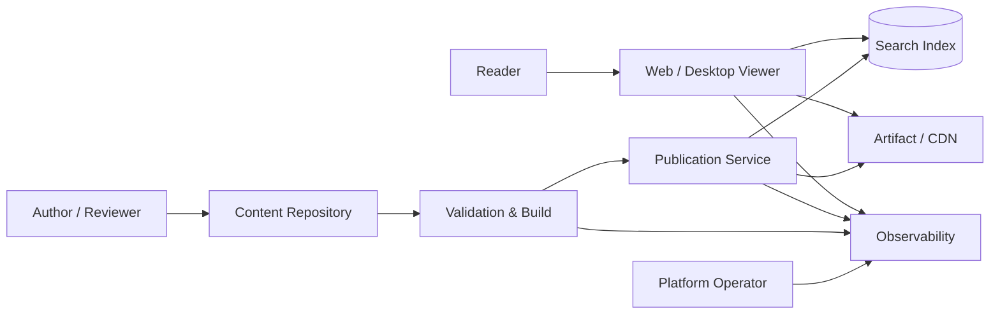
```mermaid
flowchart LR
    Author["Author / Reviewer"] --> Repo["Content Repository"]
    Repo --> CI["Validation & Build"]
    CI --> Publish["Publication Service"]
    Publish --> Search[("Search Index")]
    Publish --> CDN["Artifact / CDN"]
    Reader["Reader"] --> Web["Web / Desktop Viewer"]
    Web --> Search
    Web --> CDN
    Admin["Platform Operator"] --> Observe["Observability"]
    CI --> Observe
    Publish --> Observe
    Web --> Observe
```

### 1.2 Scope

- Content authoring conventions and versioned publication.
- Markdown and Mermaid rendering in desktop and web clients.
- Search, indexing, caching and content metadata.
- Authentication, authorization, audit and secrets handling.
- Localization, accessibility and Unicode behavior.
- Build, release, deployment, monitoring and recovery processes.

Out of scope: collaborative rich-text editing, billing, advertising, and domain-specific business workflows.

## 2. Context, Stakeholders and Requirements

Stakeholders have different expectations of the same publication chain. Authors value predictable syntax and
fast feedback. Reviewers need traceability between changes and releases. Readers need stable navigation,
legible diagrams, working anchors and accurate search. Operators need clear health signals and reversible
deployments. Security and compliance functions require least privilege, audit evidence and controlled
processing of sensitive material. The architecture treats these expectations as constraints rather than
optional enhancements.

#### 2.1 Stakeholder Context — C4

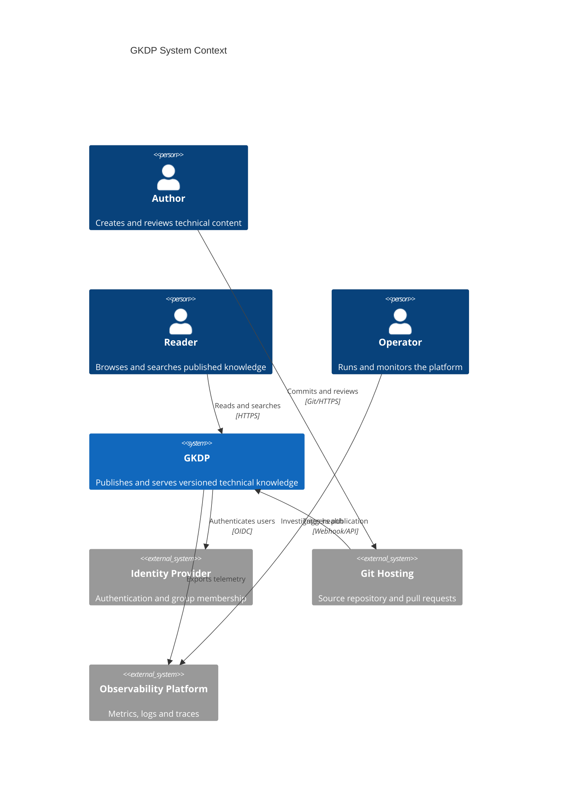
```mermaid
C4Context
    title GKDP System Context
    Person(author, "Author", "Creates and reviews technical content")
    Person(reader, "Reader", "Browses and searches published knowledge")
    Person(operator, "Operator", "Runs and monitors the platform")
    System(gkdp, "GKDP", "Publishes and serves versioned technical knowledge")
    System_Ext(idp, "Identity Provider", "Authentication and group membership")
    System_Ext(git, "Git Hosting", "Source repository and pull requests")
    System_Ext(obs, "Observability Platform", "Metrics, logs and traces")
    Rel(author, git, "Commits and reviews", "Git/HTTPS")
    Rel(git, gkdp, "Triggers publication", "Webhook/API")
    Rel(reader, gkdp, "Reads and searches", "HTTPS")
    Rel(gkdp, idp, "Authenticates users", "OIDC")
    Rel(operator, obs, "Investigates health")
    Rel(gkdp, obs, "Exports telemetry")
```

### 2.2 Functional Requirements

| ID | Requirement | Priority | Verification |
|---|---|---|---|
| FR-01 | Render CommonMark/GFM-style Markdown with stable anchors | Must | Automated fixture |
| FR-02 | Render Mermaid diagrams embedded in fenced code blocks | Must | Automated fixture |
| FR-03 | Preserve UTF-8 text across supported scripts | Must | Localization suite |
| FR-04 | Provide full-text search and heading navigation | Must | Integration test |
| FR-05 | Publish immutable versioned artifacts | Must | Release test |
| FR-06 | Support offline reading of previously downloaded content | Should | Client test |
| FR-07 | Expose health, metrics and diagnostics | Should | Operational test |
| FR-08 | Support accessible keyboard navigation and semantic structure | Must | Accessibility review |

#### 2.3 Requirement Relationships

```mermaid
requirementDiagram
    direction LR
    functionalRequirement rendering {
      id: FR-01
      text: Render Markdown and Mermaid content
      risk: high
      verifymethod: test
    }
    functionalRequirement unicode {
      id: FR-03
      text: Preserve multilingual UTF-8 content
      risk: high
      verifymethod: test
    }
    performanceRequirement navigation {
      id: NFR-01
      text: Keep navigation responsive on large normal documents
      risk: medium
      verifymethod: demonstration
    }
    element viewer {
      type: application
      docref: mdvu-light-validation.md
    }
    viewer - satisfies -> rendering
    viewer - satisfies -> unicode
    viewer - satisfies -> navigation
```

### 2.4 Quality Attributes

Reliability is defined at the document boundary: one unsupported construct must not corrupt unrelated
content or make navigation unusable. Performance targets focus on realistic documents rather than synthetic
extremes; cold opening, heading navigation, scrolling and diagram completion should remain predictable.
Security requires authentication for restricted collections, content integrity checks, safe handling of
external links and conservative treatment of raw HTML. Accessibility requires semantic headings, keyboard
operation, visible focus, sufficient contrast and sensible text alternatives for information that would
otherwise exist only inside a diagram.

#### 2.5 Quality Trade-off Quadrants

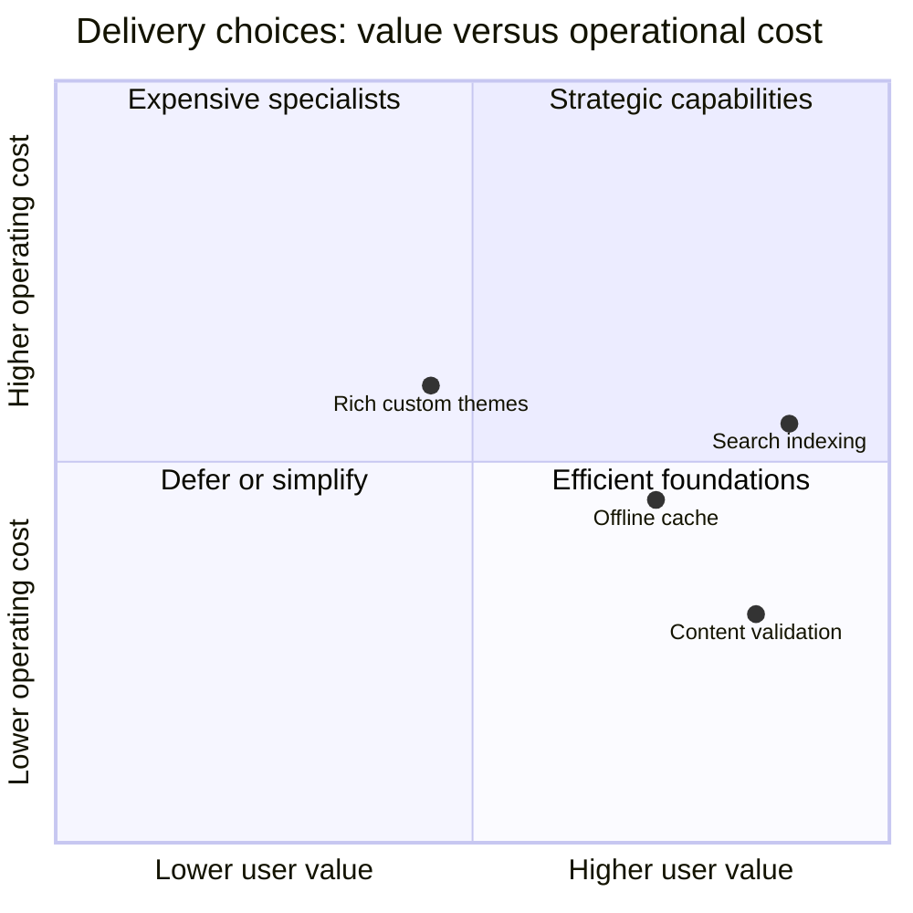
```mermaid
quadrantChart
    title Delivery choices: value versus operational cost
    x-axis Lower user value --> Higher user value
    y-axis Lower operating cost --> Higher operating cost
    quadrant-1 Strategic capabilities
    quadrant-2 Expensive specialists
    quadrant-3 Defer or simplify
    quadrant-4 Efficient foundations
    Search indexing: [0.88, 0.55]
    Offline cache: [0.72, 0.45]
    Rich custom themes: [0.45, 0.60]
    Content validation: [0.84, 0.30]
```

## 3. Solution Architecture

GKDP separates source control, publication and consumption. The repository is the authoritative source for
text, diagrams and metadata. A validation pipeline parses Markdown, checks links, validates diagrams and
creates a release manifest. The publication service stores immutable artifacts and updates the search index.
Clients obtain metadata first and content second, allowing them to cache documents independently from query
results. This separation keeps the viewer simple and makes failures easier to isolate.

#### 3.1 Container View

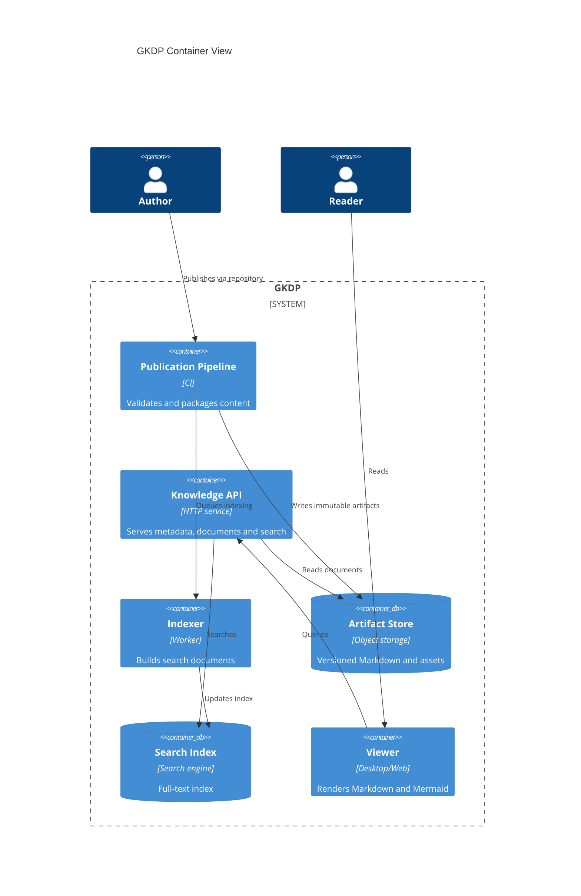
```mermaid
C4Container
    title GKDP Container View
    Person(author, "Author")
    Person(reader, "Reader")
    System_Boundary(gkdp, "GKDP") {
      Container(pipeline, "Publication Pipeline", "CI", "Validates and packages content")
      Container(api, "Knowledge API", "HTTP service", "Serves metadata, documents and search")
      Container(indexer, "Indexer", "Worker", "Builds search documents")
      ContainerDb(store, "Artifact Store", "Object storage", "Versioned Markdown and assets")
      ContainerDb(search, "Search Index", "Search engine", "Full-text index")
      Container(viewer, "Viewer", "Desktop/Web", "Renders Markdown and Mermaid")
    }
    Rel(author, pipeline, "Publishes via repository")
    Rel(pipeline, store, "Writes immutable artifacts")
    Rel(pipeline, indexer, "Queues indexing")
    Rel(indexer, search, "Updates index")
    Rel(reader, viewer, "Reads")
    Rel(viewer, api, "Queries")
    Rel(api, store, "Reads documents")
    Rel(api, search, "Searches")
```

#### 3.2 Component View

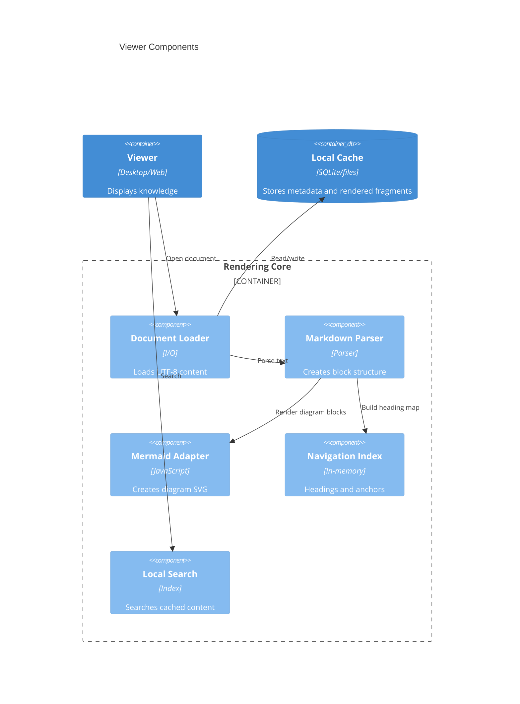
```mermaid
C4Component
    title Viewer Components
    Container(viewer, "Viewer", "Desktop/Web", "Displays knowledge")
    ContainerDb(cache, "Local Cache", "SQLite/files", "Stores metadata and rendered fragments")
    Container_Boundary(core, "Rendering Core") {
      Component(loader, "Document Loader", "I/O", "Loads UTF-8 content")
      Component(parser, "Markdown Parser", "Parser", "Creates block structure")
      Component(mermaid, "Mermaid Adapter", "JavaScript", "Creates diagram SVG")
      Component(nav, "Navigation Index", "In-memory", "Headings and anchors")
      Component(search, "Local Search", "Index", "Searches cached content")
    }
    Rel(viewer, loader, "Open document")
    Rel(loader, parser, "Parse text")
    Rel(parser, mermaid, "Render diagram blocks")
    Rel(parser, nav, "Build heading map")
    Rel(viewer, search, "Search")
    Rel(loader, cache, "Read/write")
```

#### 3.3 Architecture Service Map

> Extended Mermaid syntax; useful as a compatibility probe for newer Mermaid runtimes.

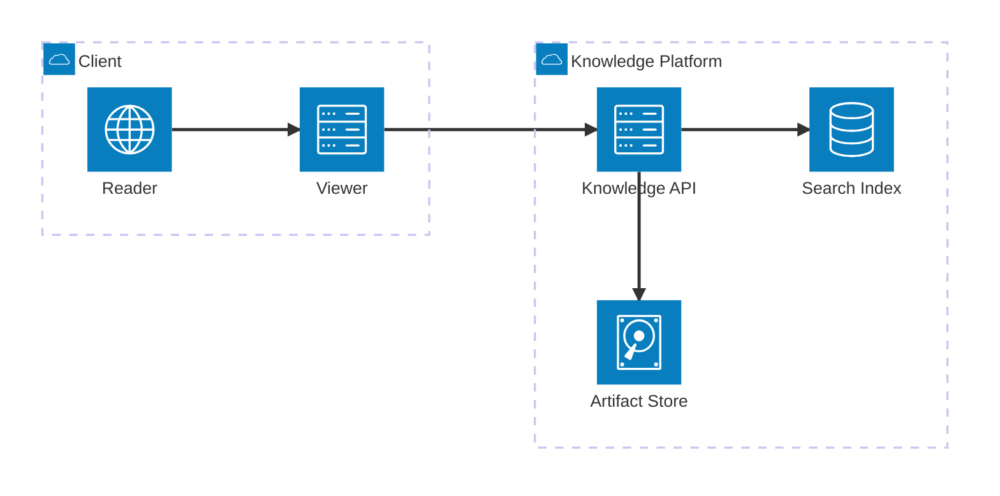
```mermaid
architecture-beta
    group client(cloud)[Client]
    group platform(cloud)[Knowledge Platform]
    service user(internet)[Reader] in client
    service viewer(server)[Viewer] in client
    service api(server)[Knowledge API] in platform
    service store(disk)[Artifact Store] in platform
    service index(database)[Search Index] in platform
    user:R --> L:viewer
    viewer:R --> L:api
    api:B --> T:store
    api:R --> L:index
```

### 3.4 Design Principles

- **Portable source:** Markdown remains readable without the application. Diagrams stay as Mermaid source next to the surrounding explanation.
- **Deterministic publication:** The same source commit, toolchain version and configuration should produce the same manifest and equivalent rendered output.
- **Graceful degradation:** Unsupported enrichment must not hide the surrounding prose. A diagram error is local to that block.
- **Explicit contracts:** APIs, events and artifact formats are versioned. Clients do not depend on undocumented storage implementation details.
- **Observable behavior:** Publication stages emit structured logs, metrics and traces so failures can be linked to source version and release identifier.

## 4. Data and Integration

Content is represented as a small set of durable entities: collection, document, release, asset and search
record. A document has a stable logical identifier while each release records the exact content hash and
publication metadata. Assets such as images are stored separately but referenced from the document manifest.
Search records are derived data and may be rebuilt from releases at any time. This distinction keeps
recovery procedures straightforward and prevents a search outage from becoming a content-integrity incident.

#### 4.1 Content Data Model

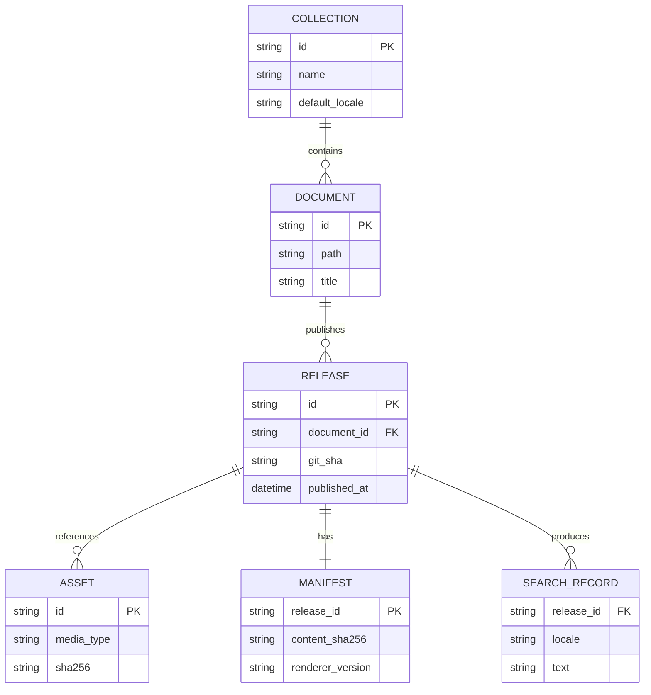
```mermaid
erDiagram
    COLLECTION ||--o{ DOCUMENT : contains
    DOCUMENT ||--o{ RELEASE : publishes
    RELEASE ||--o{ ASSET : references
    RELEASE ||--|| MANIFEST : has
    RELEASE ||--o{ SEARCH_RECORD : produces
    COLLECTION {
      string id PK
      string name
      string default_locale
    }
    DOCUMENT {
      string id PK
      string path
      string title
    }
    RELEASE {
      string id PK
      string document_id FK
      string git_sha
      datetime published_at
    }
    ASSET {
      string id PK
      string media_type
      string sha256
    }
    MANIFEST {
      string release_id PK
      string content_sha256
      string renderer_version
    }
    SEARCH_RECORD {
      string release_id FK
      string locale
      string text
    }
```

### 4.2 API Conventions

- JSON over HTTPS for metadata and search.
- Raw UTF-8 Markdown for document bodies.
- Strong ETags based on immutable content hashes.
- Cursor pagination for search results.
- Explicit locale and content-language metadata.
- ISO 8601 timestamps in UTC at service boundaries.

```http
GET /v1/documents/security/zero-trust?version=2026.09 HTTP/1.1
Host: knowledge.example.test
Accept: text/markdown
Accept-Language: fi-FI, en;q=0.8
If-None-Match: "sha256-88c1..."
```

```json
{
  "id": "security/zero-trust",
  "version": "2026.09",
  "title": "Zero Trust Reference Architecture",
  "locale": "en",
  "contentType": "text/markdown; charset=utf-8",
  "sha256": "88c1d84f...",
  "links": {"self": "/v1/documents/security/zero-trust?version=2026.09"}
}
```

#### 4.3 Publication Data Flow

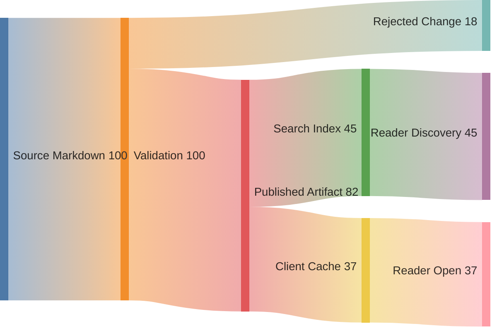
```mermaid
sankey
    Source Markdown,Validation,100
    Validation,Published Artifact,82
    Validation,Rejected Change,18
    Published Artifact,Search Index,45
    Published Artifact,Client Cache,37
    Search Index,Reader Discovery,45
    Client Cache,Reader Open,37
```

#### 4.4 Search and Read Sequence

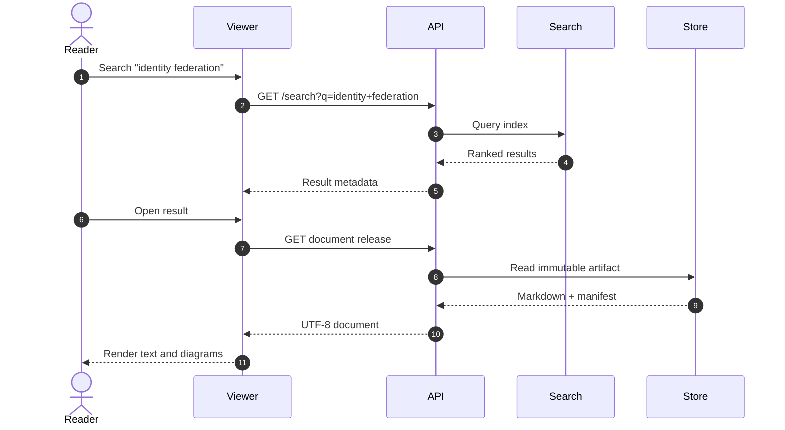
```mermaid
sequenceDiagram
    autonumber
    actor Reader
    participant Viewer
    participant API
    participant Search
    participant Store
    Reader->>Viewer: Search "identity federation"
    Viewer->>API: GET /search?q=identity+federation
    API->>Search: Query index
    Search-->>API: Ranked results
    API-->>Viewer: Result metadata
    Reader->>Viewer: Open result
    Viewer->>API: GET document release
    API->>Store: Read immutable artifact
    Store-->>API: Markdown + manifest
    API-->>Viewer: UTF-8 document
    Viewer-->>Reader: Render text and diagrams
```

## 5. Security and Identity

The primary security boundary is between untrusted content input and published output. Contributions are
authenticated through the source-control platform, validated in isolated build jobs, and published only
after policy checks succeed. The viewer treats embedded HTML, external links and diagram content as data
rather than trusted executable code. Server APIs rely on federated identity and short-lived tokens, while
internal service credentials are managed through workload identity or secret stores rather than static
credentials in repository files.

#### 5.1 Trust Boundaries

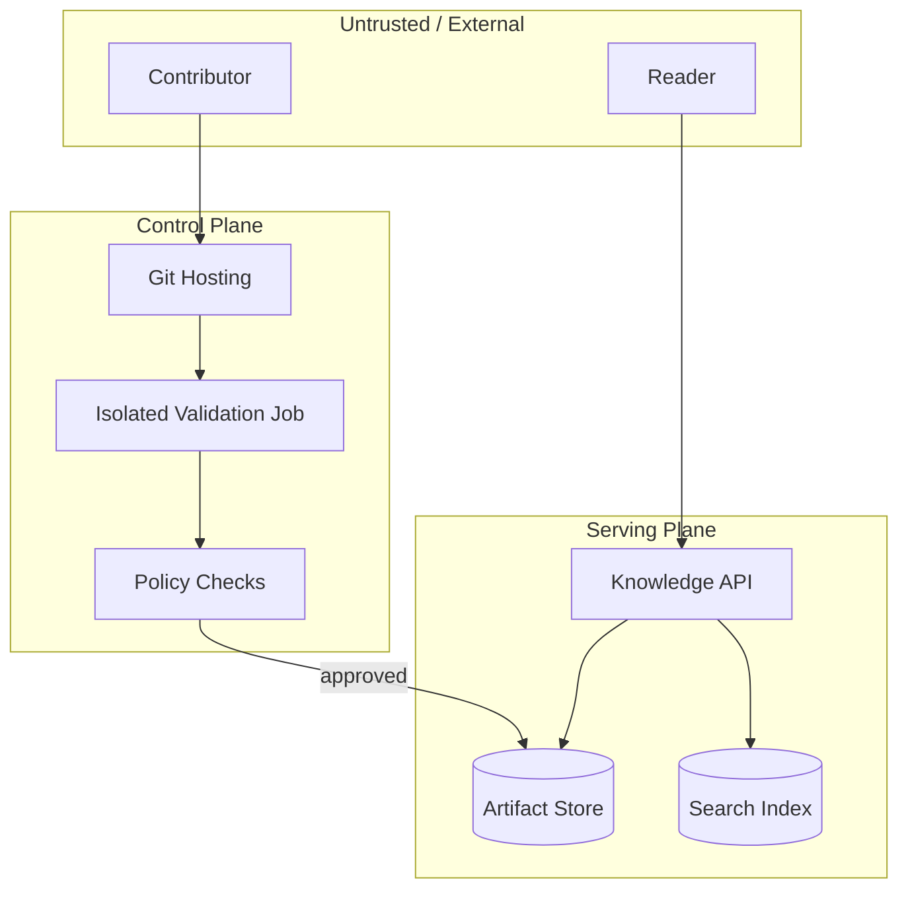
```mermaid
flowchart TB
    subgraph Internet[Untrusted / External]
      Author[Contributor]
      Reader[Reader]
    end
    subgraph Control[Control Plane]
      Git[Git Hosting]
      CI[Isolated Validation Job]
      Policy[Policy Checks]
    end
    subgraph Runtime[Serving Plane]
      API[Knowledge API]
      Store[(Artifact Store)]
      Search[(Search Index)]
    end
    Author --> Git
    Git --> CI
    CI --> Policy
    Policy -->|approved| Store
    Reader --> API
    API --> Store
    API --> Search
```

### 5.2 Security Controls

| Control | Purpose | Evidence |
|---|---|---|
| Federated SSO | Central authentication and MFA | IdP sign-in logs |
| Least privilege | Limit write access to publishing and storage | IAM policy review |
| Artifact hashing | Detect unexpected content replacement | Release manifest |
| Dependency scanning | Identify vulnerable build dependencies | CI security report |
| HTML sanitization | Reduce script and unsafe-link exposure | Renderer test suite |
| Audit logging | Trace administrative and publication actions | Immutable audit stream |
| Backup and restore | Recover metadata and configurations | Quarterly restore exercise |

#### 5.3 Security State Model

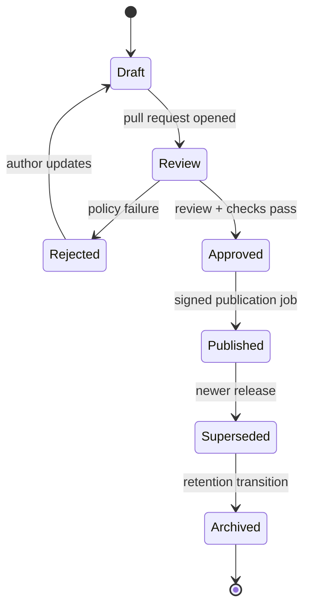
```mermaid
stateDiagram-v2
    [*] --> Draft
    Draft --> Review : pull request opened
    Review --> Rejected : policy failure
    Rejected --> Draft : author updates
    Review --> Approved : review + checks pass
    Approved --> Published : signed publication job
    Published --> Superseded : newer release
    Superseded --> Archived : retention transition
    Archived --> [*]
```

#### 5.4 Risk Analysis — Ishikawa

> Extended Mermaid syntax used as a compact root-cause view.

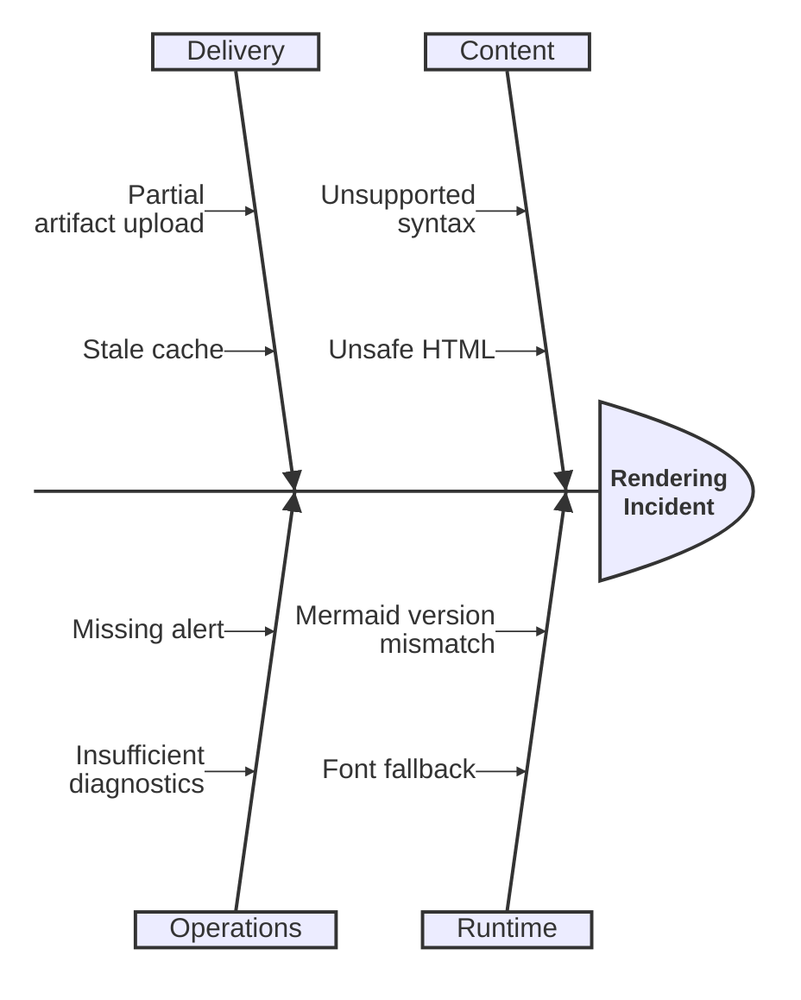
```mermaid
ishikawa-beta
    Rendering Incident
      Content
        Unsupported syntax
        Unsafe HTML
      Runtime
        Mermaid version mismatch
        Font fallback
      Delivery
        Partial artifact upload
        Stale cache
      Operations
        Missing alert
        Insufficient diagnostics
```

## 6. Runtime Scenarios

Runtime scenarios describe observable behavior rather than internal implementation. They are useful both for
design reviews and for viewer regression tests because they combine prose, headings and diagrams in the same
section. The scenarios below cover opening a document, rendering diagrams progressively, searching, offline
access and handling a new publication while a reader has an older version cached.

#### 6.1 Open and Render

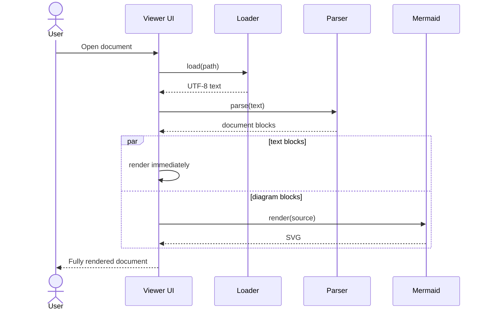
```mermaid
sequenceDiagram
    actor User
    participant UI as Viewer UI
    participant Loader
    participant Parser
    participant Mermaid
    User->>UI: Open document
    UI->>Loader: load(path)
    Loader-->>UI: UTF-8 text
    UI->>Parser: parse(text)
    Parser-->>UI: document blocks
    par text blocks
      UI->>UI: render immediately
    and diagram blocks
      UI->>Mermaid: render(source)
      Mermaid-->>UI: SVG
    end
    UI-->>User: Fully rendered document
```

#### 6.2 Dynamic Render Path — C4

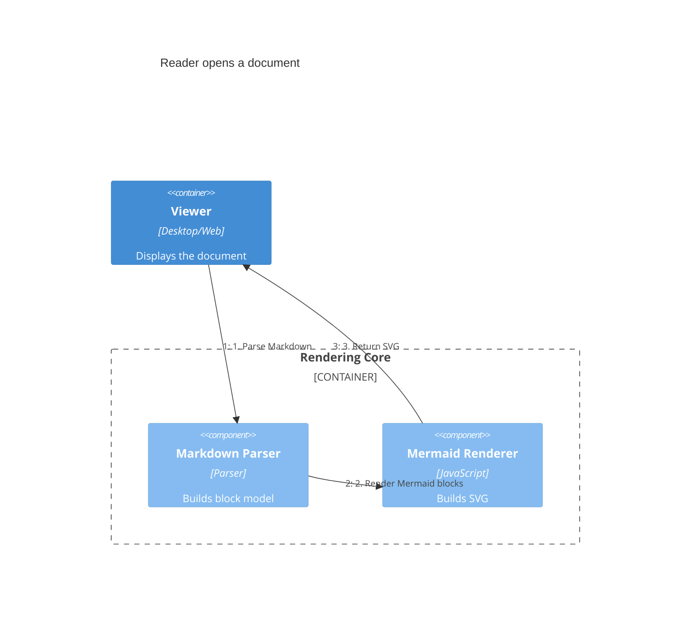
```mermaid
C4Dynamic
    title Reader opens a document
    Container(ui, "Viewer", "Desktop/Web", "Displays the document")
    Container_Boundary(core, "Rendering Core") {
      Component(parser, "Markdown Parser", "Parser", "Builds block model")
      Component(renderer, "Mermaid Renderer", "JavaScript", "Builds SVG")
    }
    Rel(ui, parser, "1. Parse Markdown")
    Rel(parser, renderer, "2. Render Mermaid blocks")
    Rel(renderer, ui, "3. Return SVG")
```

#### 6.3 Alternative Interaction — ZenUML

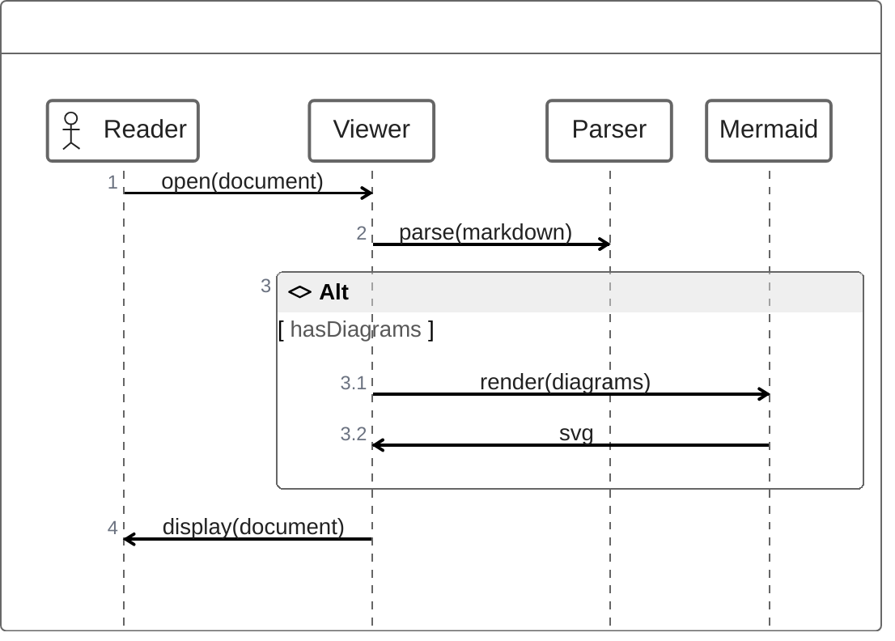
```mermaid
zenuml
    @Actor Reader
    Reader->Viewer: open(document)
    Viewer->Parser: parse(markdown)
    if(hasDiagrams) {
      Viewer->Mermaid: render(diagrams)
      Mermaid->Viewer: svg
    }
    Viewer->Reader: display(document)
```

#### 6.4 Workflow Swimlanes

> Extended Mermaid syntax; intentionally small and business-like.

```mermaid
swimlane-beta LR
    subgraph Author[Author]
      A[Edit Markdown]
      D[Address review]
    end
    subgraph Platform[Platform]
      B[Validate]
      C[Publish]
    end
    subgraph Reader[Reader]
      E[Open release]
    end
    A --> B
    B --> D
    D --> B
    B --> C
    C --> E
```

## 7. Deployment and Delivery

Deployment separates the publication toolchain from the serving plane. Publication runs in ephemeral CI
workers with network access limited to required repositories and artifact destinations. Serving components
run across at least two failure domains, while immutable artifacts are stored independently of the API
processes. The desktop viewer contains its Markdown parser and Mermaid runtime so that previously downloaded
documents remain readable without an active network connection.

#### 7.1 Deployment View

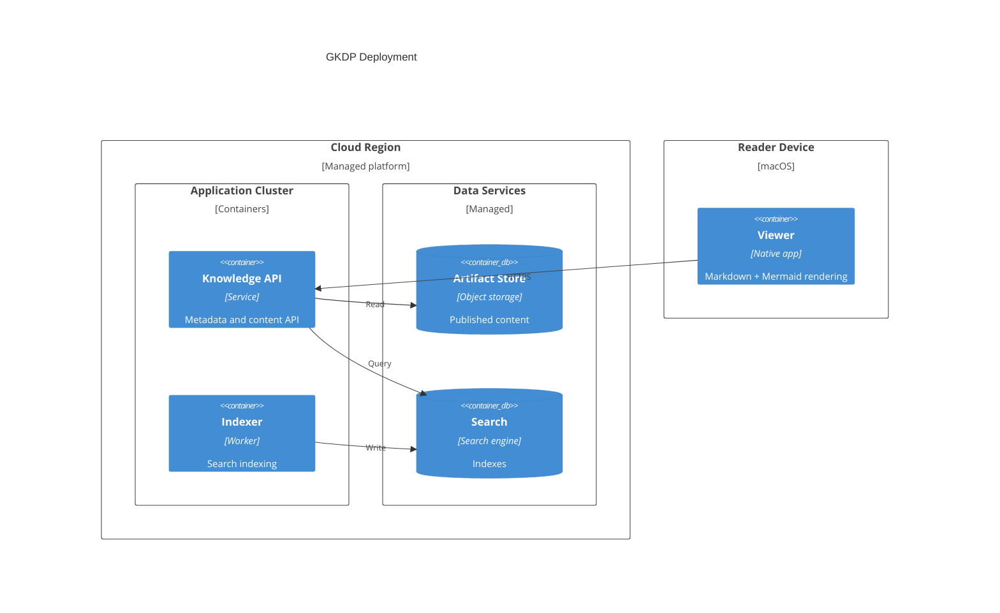
```mermaid
C4Deployment
    title GKDP Deployment
    Deployment_Node(cloud, "Cloud Region", "Managed platform") {
      Deployment_Node(app, "Application Cluster", "Containers") {
        Container(api, "Knowledge API", "Service", "Metadata and content API")
        Container(indexer, "Indexer", "Worker", "Search indexing")
      }
      Deployment_Node(data, "Data Services", "Managed") {
        ContainerDb(store, "Artifact Store", "Object storage", "Published content")
        ContainerDb(search, "Search", "Search engine", "Indexes")
      }
    }
    Deployment_Node(mac, "Reader Device", "macOS") {
      Container(viewer, "Viewer", "Native app", "Markdown + Mermaid rendering")
    }
    Rel(viewer, api, "HTTPS")
    Rel(api, store, "Read")
    Rel(api, search, "Query")
    Rel(indexer, search, "Write")
```

#### 7.2 Release Timeline

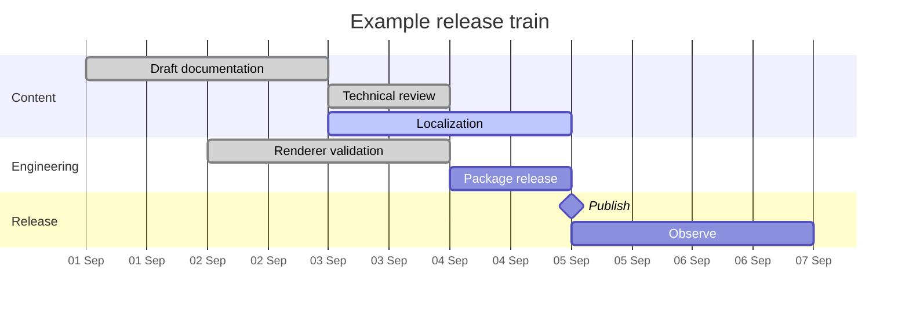
```mermaid
gantt
    title Example release train
    dateFormat YYYY-MM-DD
    axisFormat %d %b
    section Content
    Draft documentation      :done, a1, 2026-09-01, 2d
    Technical review         :done, after a1, 1d
    Localization             :active, 2026-09-03, 2d
    section Engineering
    Renderer validation      :done, b1, 2026-09-02, 2d
    Package release          :2026-09-04, 1d
    section Release
    Publish                  :milestone, 2026-09-05, 0d
    Observe                  :2026-09-05, 2d
```

#### 7.3 Git Release Flow

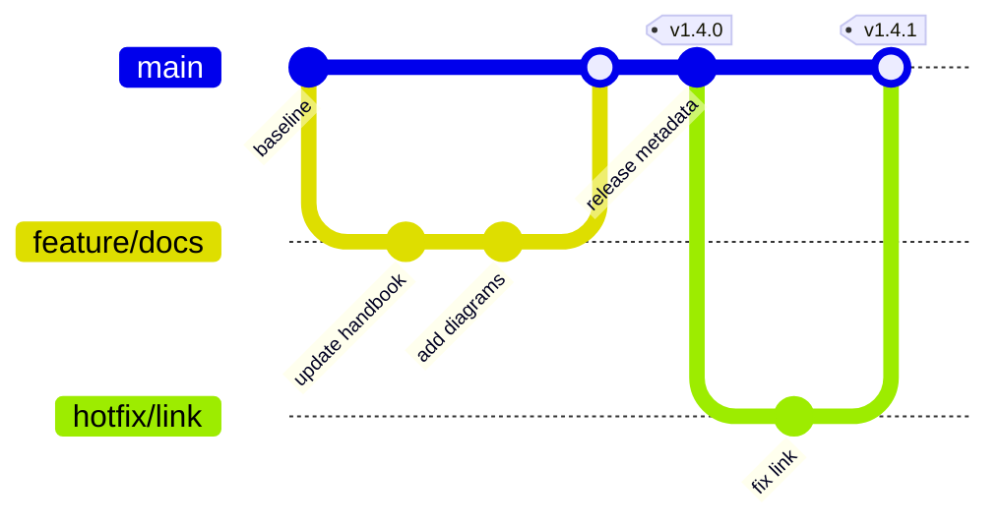
```mermaid
gitGraph
    commit id: "baseline"
    branch feature/docs
    checkout feature/docs
    commit id: "update handbook"
    commit id: "add diagrams"
    checkout main
    merge feature/docs
    commit id: "release metadata" tag: "v1.4.0"
    branch hotfix/link
    checkout hotfix/link
    commit id: "fix link"
    checkout main
    merge hotfix/link tag: "v1.4.1"
```

### 7.4 Release Checklist

- [x] Source revision identified.
- [x] Markdown validation passed.
- [x] Mermaid baseline diagrams rendered.
- [x] Links and assets checked.
- [x] Release notes prepared.
- [ ] Production publication approved.
- [ ] Post-release smoke check completed.

## 8. Operations and Resilience

Operational design focuses on diagnosis and recovery rather than on avoiding every failure. Metrics provide
aggregate health, logs explain individual operations, and traces connect user requests to storage and search
dependencies. Alerts are tied to user-visible symptoms such as elevated document-open failures, publication
backlog or search latency rather than to every infrastructure fluctuation. Runbooks start with observable
symptoms and decision points so they remain useful when the underlying implementation changes.

#### 8.1 Operational State Machine

```mermaid
stateDiagram
    [*] --> Healthy
    Healthy --> Degraded : dependency latency
    Degraded --> Healthy : recovery
    Degraded --> Incident : error budget exceeded
    Incident --> Mitigated : traffic or feature mitigation
    Mitigated --> Recovering : root cause addressed
    Recovering --> Healthy : validation passed
```

### 8.2 Service Objectives

| Signal | SLI | Objective | Alerting window |
|---|---|---:|---|
| Document open | Successful opens / attempts | 99.95% | 5m + 1h |
| Search | Successful searches / attempts | 99.90% | 10m + 6h |
| Publication | Successful releases / attempted releases | 99.5% | per release |
| Latency | p95 API latency | < 400 ms | 15m |
| Freshness | Merge-to-searchable p95 | < 10 min | 30m |

#### 8.3 Example Performance Trend

```mermaid
xychart
    title "Typical document-open latency"
    x-axis ["1k lines", "3k lines", "6k lines", "10k lines", "15k lines"]
    y-axis "milliseconds" 0 --> 800
    bar "cold" [90, 170, 290, 460, 680]
    line "warm" [55, 90, 145, 240, 360]
```

#### 8.4 Capability Radar

> Extended Mermaid syntax. Values are illustrative coverage scores, not benchmark measurements.

```mermaid
radar-beta
    title Viewer validation coverage
    axis md["Markdown"], mm["Mermaid"], uc["Unicode"], nav["Navigation"], code["Code"], rtl["RTL"]
    curve light["Light fixture"]{90, 90, 85, 90, 85, 80}
    curve smoke["Tiny smoke test"]{55, 35, 30, 50, 35, 15}
    min 0
    max 100
    ticks 5
```

## 9. Governance, Decisions and Roadmap

Architecture governance is intentionally lightweight. Decisions that affect compatibility, security
boundaries, artifact formats or operational responsibilities are recorded as short architecture decision
records. Routine library updates and implementation refactoring remain within team ownership unless they
alter one of those contracts. This keeps the decision log small enough to be read while still preserving the
reasoning behind costly-to-reverse choices.

### 9.1 Decision Log

| ADR | Decision | Status | Consequence |
|---|---|---|---|
| ADR-001 | Markdown is the canonical source format | Accepted | Portable and diff-friendly source |
| ADR-002 | Mermaid is the canonical diagram-as-code format | Accepted | Diagrams version with prose |
| ADR-003 | Releases use immutable content hashes | Accepted | Caches and audits are reliable |
| ADR-004 | Viewer supports progressive diagram rendering | Accepted | Text is usable before all diagrams finish |
| ADR-005 | New Mermaid grammars are introduced behind compatibility tests | Proposed | Runtime upgrades become controlled |

#### 9.2 Capability Roadmap

```mermaid
timeline
    title GKDP capability roadmap
    2026 Q3 : Stable Markdown viewer
            : Mermaid baseline coverage
    2026 Q4 : Offline collections
            : Improved accessibility
    2027 Q1 : Cross-document references
            : Search ranking improvements
    2027 Q2 : Policy-aware collections
            : Localization workflow automation
```

#### 9.3 Delivery Portfolio

```mermaid
kanban
  Backlog
    task1[Cross-document backlinks]
    task2[Additional locale QA]
  In Progress
    task3[Offline cache improvements]
  Review
    task4[Accessibility audit]
  Done
    task5[Immutable release manifest]
    task6[Mermaid rendering bridge]
```

#### 9.4 Product Capability Tree

```mermaid
mindmap
  root((Knowledge Platform))
    Authoring
      Markdown
      Mermaid
      Reviews
    Publication
      Validation
      Versioning
      Indexing
    Consumption
      Navigation
      Search
      Offline cache
    Operations
      Metrics
      Logs
      Recovery
```

#### 9.5 Portfolio Treemap

> Extended Mermaid syntax used as a compact portfolio visualization.

```mermaid
treemap-beta
    "Knowledge Platform"
      "Authoring"
        "Markdown": 25
        "Review": 10
      "Publication"
        "Validation": 20
        "Indexing": 15
      "Consumption"
        "Viewer": 20
        "Search": 10
```

### 9.6 Engineering Practice Deep Dives

The following practice notes make the fixture resemble a real engineering handbook rather than a diagram
gallery. They use ordinary technical prose with interfaces, controls, operational responsibilities,
trade-offs and evidence. Each subsection is long enough to exercise paragraph layout and navigation, but
none is intended as a stress test.

#### 9.6.1 Content lifecycle management

The purpose of this practice is to keep the logical identity of a document separate from individual
published versions. In a documentation platform this matters because the rendered file is not an isolated
page: it participates in publication, navigation, search, caching and long-term references. A design that
looks acceptable in a one-off preview can become expensive once documents are versioned and distributed to
many clients. The practice is therefore expressed as an architectural behavior rather than as a preference
for one library or framework.

The main engineering challenge is that authors may rename files, split sections, translate content, or
retire obsolete guidance while readers still depend on stable references. These conditions tend to appear
gradually as the corpus grows, so they are easy to dismiss during early development. A useful design review
asks what happens when a document is renamed, localized, partially cached, opened offline, rendered with a
newer runtime, or referenced from an older release. The answers should remain understandable without
requiring a developer to inspect implementation internals.

The preferred approach is to use stable document identifiers, explicit release metadata, redirect records
for moved content, and retention rules for superseded releases. This is intentionally technology-neutral: a
desktop implementation and a web implementation may use different APIs, but they should preserve the same
externally visible guarantees. Where a feature is optional, the fallback should preserve readable text and
navigation. Where data integrity is involved, immutable identifiers and explicit validation are preferred
over best-effort inference.

Operationally, operators monitor publication failures, redirect loops, orphaned assets, and unexpectedly
large changes in document count. The objective is not to instrument every line of rendering code. Instead,
diagnostics should distinguish user-visible failure modes and retain the version information needed to
reproduce them. Metrics and logs are most valuable when they help an operator decide whether the problem
belongs to the document, the renderer, a dependency, a platform release or a remote service.

Verification should be proportionate to the risk. For this practice, a release manifest, link report,
redirect report, and sampled navigation test provide practical evidence that the lifecycle remains coherent.
The routine light fixture is expected to cover the normal path, while targeted regression cases capture bugs
that deserve permanent protection. The much larger torture fixture is reserved for changes where memory
pressure, unusual Unicode behavior, very large graphs or parser recovery are specifically under
investigation.

#### 9.6.2 Markdown compatibility policy

The purpose of this practice is to provide a predictable authoring contract without pretending that every
Markdown dialect is identical. In a documentation platform this matters because the rendered file is not an
isolated page: it participates in publication, navigation, search, caching and long-term references. A
design that looks acceptable in a one-off preview can become expensive once documents are versioned and
distributed to many clients. The practice is therefore expressed as an architectural behavior rather than as
a preference for one library or framework.

The main engineering challenge is that differences around tables, footnotes, callouts, raw HTML, math and
task lists can produce documents that look correct in one renderer and degrade in another. These conditions
tend to appear gradually as the corpus grows, so they are easy to dismiss during early development. A useful
design review asks what happens when a document is renamed, localized, partially cached, opened offline,
rendered with a newer runtime, or referenced from an older release. The answers should remain understandable
without requiring a developer to inspect implementation internals.

The preferred approach is to define a documented baseline, identify optional extensions, test representative
fixtures, and prefer portable constructs for information that is essential to the reader. This is
intentionally technology-neutral: a desktop implementation and a web implementation may use different APIs,
but they should preserve the same externally visible guarantees. Where a feature is optional, the fallback
should preserve readable text and navigation. Where data integrity is involved, immutable identifiers and
explicit validation are preferred over best-effort inference.

Operationally, version upgrades are introduced through compatibility tests and a small canary corpus before
they become the default renderer. The objective is not to instrument every line of rendering code. Instead,
diagnostics should distinguish user-visible failure modes and retain the version information needed to
reproduce them. Metrics and logs are most valuable when they help an operator decide whether the problem
belongs to the document, the renderer, a dependency, a platform release or a remote service.

Verification should be proportionate to the risk. For this practice, the compatibility fixture, parser
version inventory, release notes and known-differences list form the minimum evidence set for an upgrade.
The routine light fixture is expected to cover the normal path, while targeted regression cases capture bugs
that deserve permanent protection. The much larger torture fixture is reserved for changes where memory
pressure, unusual Unicode behavior, very large graphs or parser recovery are specifically under
investigation.

#### 9.6.3 Mermaid compatibility management

The purpose of this practice is to treat Mermaid syntax as executable document grammar with an explicit
runtime dependency. In a documentation platform this matters because the rendered file is not an isolated
page: it participates in publication, navigation, search, caching and long-term references. A design that
looks acceptable in a one-off preview can become expensive once documents are versioned and distributed to
many clients. The practice is therefore expressed as an architectural behavior rather than as a preference
for one library or framework.

The main engineering challenge is that new diagram families and grammar changes can make an otherwise
unchanged Markdown document render differently after a runtime upgrade. These conditions tend to appear
gradually as the corpus grows, so they are easy to dismiss during early development. A useful design review
asks what happens when a document is renamed, localized, partially cached, opened offline, rendered with a
newer runtime, or referenced from an older release. The answers should remain understandable without
requiring a developer to inspect implementation internals.

The preferred approach is to pin the renderer version in reproducible builds, separate common baseline
diagrams from newer probes, and keep diagrams small enough that textual explanations remain authoritative.
This is intentionally technology-neutral: a desktop implementation and a web implementation may use
different APIs, but they should preserve the same externally visible guarantees. Where a feature is
optional, the fallback should preserve readable text and navigation. Where data integrity is involved,
immutable identifiers and explicit validation are preferred over best-effort inference.

Operationally, render failures are counted by diagram family and document so a single unsupported grammar
does not become an unexplained global failure rate. The objective is not to instrument every line of
rendering code. Instead, diagnostics should distinguish user-visible failure modes and retain the version
information needed to reproduce them. Metrics and logs are most valuable when they help an operator decide
whether the problem belongs to the document, the renderer, a dependency, a platform release or a remote
service.

Verification should be proportionate to the risk. For this practice, a gallery of representative diagrams,
runtime version metadata, screenshot review for selected complex diagrams, and automated error counts
support release confidence. The routine light fixture is expected to cover the normal path, while targeted
regression cases capture bugs that deserve permanent protection. The much larger torture fixture is reserved
for changes where memory pressure, unusual Unicode behavior, very large graphs or parser recovery are
specifically under investigation.

#### 9.6.4 Search indexing

The purpose of this practice is to make published knowledge discoverable without turning the search index
into the authoritative source of content. In a documentation platform this matters because the rendered file
is not an isolated page: it participates in publication, navigation, search, caching and long-term
references. A design that looks acceptable in a one-off preview can become expensive once documents are
versioned and distributed to many clients. The practice is therefore expressed as an architectural behavior
rather than as a preference for one library or framework.

The main engineering challenge is that tokenization, language handling, heading weights, code blocks and
duplicated versions can all distort ranking if indexing rules are not explicit. These conditions tend to
appear gradually as the corpus grows, so they are easy to dismiss during early development. A useful design
review asks what happens when a document is renamed, localized, partially cached, opened offline, rendered
with a newer runtime, or referenced from an older release. The answers should remain understandable without
requiring a developer to inspect implementation internals.

The preferred approach is to derive searchable records from immutable releases, record document and locale
identifiers, boost titles and headings, and exclude purely presentational markup from primary ranking
signals. This is intentionally technology-neutral: a desktop implementation and a web implementation may use
different APIs, but they should preserve the same externally visible guarantees. Where a feature is
optional, the fallback should preserve readable text and navigation. Where data integrity is involved,
immutable identifiers and explicit validation are preferred over best-effort inference.

Operationally, operators watch indexing backlog, index freshness, zero-result rates, query latency and the
proportion of results that point to unavailable releases. The objective is not to instrument every line of
rendering code. Instead, diagnostics should distinguish user-visible failure modes and retain the version
information needed to reproduce them. Metrics and logs are most valuable when they help an operator decide
whether the problem belongs to the document, the renderer, a dependency, a platform release or a remote
service.

Verification should be proportionate to the risk. For this practice, rebuild exercises, sampled query sets,
freshness dashboards and a versioned index schema demonstrate that search can be recovered independently
from source content. The routine light fixture is expected to cover the normal path, while targeted
regression cases capture bugs that deserve permanent protection. The much larger torture fixture is reserved
for changes where memory pressure, unusual Unicode behavior, very large graphs or parser recovery are
specifically under investigation.

#### 9.6.5 Offline cache behavior

The purpose of this practice is to allow readers to reopen previously downloaded knowledge when the network
is unavailable or intentionally disconnected. In a documentation platform this matters because the rendered
file is not an isolated page: it participates in publication, navigation, search, caching and long-term
references. A design that looks acceptable in a one-off preview can become expensive once documents are
versioned and distributed to many clients. The practice is therefore expressed as an architectural behavior
rather than as a preference for one library or framework.

The main engineering challenge is that cache invalidation, storage limits, renamed documents and partial
asset downloads can otherwise leave a client with a confusing mixture of old metadata and new content. These
conditions tend to appear gradually as the corpus grows, so they are easy to dismiss during early
development. A useful design review asks what happens when a document is renamed, localized, partially
cached, opened offline, rendered with a newer runtime, or referenced from an older release. The answers
should remain understandable without requiring a developer to inspect implementation internals.

The preferred approach is to cache immutable releases by content hash, store a small metadata catalog
separately, download assets transactionally, and make eviction decisions at release boundaries rather than
individual blocks. This is intentionally technology-neutral: a desktop implementation and a web
implementation may use different APIs, but they should preserve the same externally visible guarantees.
Where a feature is optional, the fallback should preserve readable text and navigation. Where data integrity
is involved, immutable identifiers and explicit validation are preferred over best-effort inference.

Operationally, the client records cache size, failed downloads, stale metadata age and recovery from
interrupted downloads without collecting document contents as telemetry. The objective is not to instrument
every line of rendering code. Instead, diagnostics should distinguish user-visible failure modes and retain
the version information needed to reproduce them. Metrics and logs are most valuable when they help an
operator decide whether the problem belongs to the document, the renderer, a dependency, a platform release
or a remote service.

Verification should be proportionate to the risk. For this practice, offline scenario tests, checksum
validation and deterministic cache cleanup give stronger evidence than simply verifying that a file exists
on disk. The routine light fixture is expected to cover the normal path, while targeted regression cases
capture bugs that deserve permanent protection. The much larger torture fixture is reserved for changes
where memory pressure, unusual Unicode behavior, very large graphs or parser recovery are specifically under
investigation.

#### 9.6.6 Progressive rendering

The purpose of this practice is to show useful text quickly while diagrams and expensive enrichments
complete independently. In a documentation platform this matters because the rendered file is not an
isolated page: it participates in publication, navigation, search, caching and long-term references. A
design that looks acceptable in a one-off preview can become expensive once documents are versioned and
distributed to many clients. The practice is therefore expressed as an architectural behavior rather than as
a preference for one library or framework.

The main engineering challenge is that blocking the whole document on every diagram makes first paint
sensitive to one complex SVG layout and creates the impression that the viewer is frozen. These conditions
tend to appear gradually as the corpus grows, so they are easy to dismiss during early development. A useful
design review asks what happens when a document is renamed, localized, partially cached, opened offline,
rendered with a newer runtime, or referenced from an older release. The answers should remain understandable
without requiring a developer to inspect implementation internals.

The preferred approach is to parse the document once, display ordinary text and code blocks immediately,
schedule diagram work with bounded concurrency, and preserve layout placeholders so late SVG insertion does
not cause disruptive jumps. This is intentionally technology-neutral: a desktop implementation and a web
implementation may use different APIs, but they should preserve the same externally visible guarantees.
Where a feature is optional, the fallback should preserve readable text and navigation. Where data integrity
is involved, immutable identifiers and explicit validation are preferred over best-effort inference.

Operationally, measure time to first readable content separately from time to full render, and record
diagram queue depth or render errors when diagnostics are enabled. The objective is not to instrument every
line of rendering code. Instead, diagnostics should distinguish user-visible failure modes and retain the
version information needed to reproduce them. Metrics and logs are most valuable when they help an operator
decide whether the problem belongs to the document, the renderer, a dependency, a platform release or a
remote service.

Verification should be proportionate to the risk. For this practice, performance tests on small, medium and
large normal documents verify that progressive behavior remains stable without requiring pathological
benchmark files. The routine light fixture is expected to cover the normal path, while targeted regression
cases capture bugs that deserve permanent protection. The much larger torture fixture is reserved for
changes where memory pressure, unusual Unicode behavior, very large graphs or parser recovery are
specifically under investigation.

#### 9.6.7 Anchor and navigation stability

The purpose of this practice is to let users bookmark headings and share references that continue to work as
a document evolves. In a documentation platform this matters because the rendered file is not an isolated
page: it participates in publication, navigation, search, caching and long-term references. A design that
looks acceptable in a one-off preview can become expensive once documents are versioned and distributed to
many clients. The practice is therefore expressed as an architectural behavior rather than as a preference
for one library or framework.

The main engineering challenge is that automatic slug generation differs between Markdown engines,
especially for punctuation, repeated headings and non-Latin scripts. These conditions tend to appear
gradually as the corpus grows, so they are easy to dismiss during early development. A useful design review
asks what happens when a document is renamed, localized, partially cached, opened offline, rendered with a
newer runtime, or referenced from an older release. The answers should remain understandable without
requiring a developer to inspect implementation internals.

The preferred approach is to define one slug algorithm, expose explicit anchors where long-term stability
matters, disambiguate duplicates deterministically, and keep navigation based on the parsed heading tree
rather than visual text search. This is intentionally technology-neutral: a desktop implementation and a web
implementation may use different APIs, but they should preserve the same externally visible guarantees.
Where a feature is optional, the fallback should preserve readable text and navigation. Where data integrity
is involved, immutable identifiers and explicit validation are preferred over best-effort inference.

Operationally, broken fragment links and duplicate generated IDs should be visible in validation output
because they often remain unnoticed during ordinary reading. The objective is not to instrument every line
of rendering code. Instead, diagnostics should distinguish user-visible failure modes and retain the version
information needed to reproduce them. Metrics and logs are most valuable when they help an operator decide
whether the problem belongs to the document, the renderer, a dependency, a platform release or a remote
service.

Verification should be proportionate to the risk. For this practice, a heading index dump, internal-link
checker and regression cases for Latin, Cyrillic, CJK and RTL headings provide concrete compatibility
evidence. The routine light fixture is expected to cover the normal path, while targeted regression cases
capture bugs that deserve permanent protection. The much larger torture fixture is reserved for changes
where memory pressure, unusual Unicode behavior, very large graphs or parser recovery are specifically under
investigation.

#### 9.6.8 External link handling

The purpose of this practice is to make external references convenient while preventing document content
from silently gaining application-level privileges. In a documentation platform this matters because the
rendered file is not an isolated page: it participates in publication, navigation, search, caching and
long-term references. A design that looks acceptable in a one-off preview can become expensive once
documents are versioned and distributed to many clients. The practice is therefore expressed as an
architectural behavior rather than as a preference for one library or framework.

The main engineering challenge is that links can target unexpected schemes, redirect through tracking
services, contain Unicode lookalikes, or point to resources that disappear after publication. These
conditions tend to appear gradually as the corpus grows, so they are easy to dismiss during early
development. A useful design review asks what happens when a document is renamed, localized, partially
cached, opened offline, rendered with a newer runtime, or referenced from an older release. The answers
should remain understandable without requiring a developer to inspect implementation internals.

The preferred approach is to allow a conservative scheme set, present destinations clearly, open external
resources through the platform security model, and distinguish link validation from automatic content
retrieval. This is intentionally technology-neutral: a desktop implementation and a web implementation may
use different APIs, but they should preserve the same externally visible guarantees. Where a feature is
optional, the fallback should preserve readable text and navigation. Where data integrity is involved,
immutable identifiers and explicit validation are preferred over best-effort inference.

Operationally, operators and authors review broken-link reports, but temporary network failures are not
treated as reasons to block access to an otherwise valid local document. The objective is not to instrument
every line of rendering code. Instead, diagnostics should distinguish user-visible failure modes and retain
the version information needed to reproduce them. Metrics and logs are most valuable when they help an
operator decide whether the problem belongs to the document, the renderer, a dependency, a platform release
or a remote service.

Verification should be proportionate to the risk. For this practice, policy tests for schemes,
representative internationalized URLs and scheduled link checks provide evidence without requiring the
viewer to become a general-purpose browser. The routine light fixture is expected to cover the normal path,
while targeted regression cases capture bugs that deserve permanent protection. The much larger torture
fixture is reserved for changes where memory pressure, unusual Unicode behavior, very large graphs or parser
recovery are specifically under investigation.

#### 9.6.9 Raw HTML policy

The purpose of this practice is to support practical documentation fragments such as details, tables and
keyboard tags without allowing arbitrary active content. In a documentation platform this matters because
the rendered file is not an isolated page: it participates in publication, navigation, search, caching and
long-term references. A design that looks acceptable in a one-off preview can become expensive once
documents are versioned and distributed to many clients. The practice is therefore expressed as an
architectural behavior rather than as a preference for one library or framework.

The main engineering challenge is that Markdown frequently permits raw HTML, but a desktop or web viewer can
create security problems if scripts, event handlers or unsafe embedded objects execute with application
privileges. These conditions tend to appear gradually as the corpus grows, so they are easy to dismiss
during early development. A useful design review asks what happens when a document is renamed, localized,
partially cached, opened offline, rendered with a newer runtime, or referenced from an older release. The
answers should remain understandable without requiring a developer to inspect implementation internals.

The preferred approach is to define an allowlist or sanitization policy, keep scripting disabled, restrict
dangerous URL schemes, and document differences between source-preserving and rendered views. This is
intentionally technology-neutral: a desktop implementation and a web implementation may use different APIs,
but they should preserve the same externally visible guarantees. Where a feature is optional, the fallback
should preserve readable text and navigation. Where data integrity is involved, immutable identifiers and
explicit validation are preferred over best-effort inference.

Operationally, sanitization rejections are diagnostic events rather than application crashes, and the
surrounding Markdown remains visible even if one HTML fragment is removed. The objective is not to
instrument every line of rendering code. Instead, diagnostics should distinguish user-visible failure modes
and retain the version information needed to reproduce them. Metrics and logs are most valuable when they
help an operator decide whether the problem belongs to the document, the renderer, a dependency, a platform
release or a remote service.

Verification should be proportionate to the risk. For this practice, security tests use benign
representatives of allowed and rejected elements, while code review verifies that sanitization happens
before insertion into a privileged rendering context. The routine light fixture is expected to cover the
normal path, while targeted regression cases capture bugs that deserve permanent protection. The much larger
torture fixture is reserved for changes where memory pressure, unusual Unicode behavior, very large graphs
or parser recovery are specifically under investigation.

#### 9.6.10 Unicode and font fallback

The purpose of this practice is to render legitimate multilingual source without data loss and without
assuming a single font contains every script. In a documentation platform this matters because the rendered
file is not an isolated page: it participates in publication, navigation, search, caching and long-term
references. A design that looks acceptable in a one-off preview can become expensive once documents are
versioned and distributed to many clients. The practice is therefore expressed as an architectural behavior
rather than as a preference for one library or framework.

The main engineering challenge is that CJK ideographs, Arabic shaping, Indic combining sequences, emoji and
technical symbols may require different fonts or shaping behavior even within one paragraph. These
conditions tend to appear gradually as the corpus grows, so they are easy to dismiss during early
development. A useful design review asks what happens when a document is renamed, localized, partially
cached, opened offline, rendered with a newer runtime, or referenced from an older release. The answers
should remain understandable without requiring a developer to inspect implementation internals.

The preferred approach is to keep source as UTF-8, use platform text shaping, select a sensible fallback
stack, avoid per-character manual layout, and test language samples that reflect real scripts instead of
exhaustive Unicode ranges. This is intentionally technology-neutral: a desktop implementation and a web
implementation may use different APIs, but they should preserve the same externally visible guarantees.
Where a feature is optional, the fallback should preserve readable text and navigation. Where data integrity
is involved, immutable identifiers and explicit validation are preferred over best-effort inference.

Operationally, missing-glyph boxes, replacement characters and unexpected text-direction changes are
high-value visual signals during compatibility testing. The objective is not to instrument every line of
rendering code. Instead, diagnostics should distinguish user-visible failure modes and retain the version
information needed to reproduce them. Metrics and logs are most valuable when they help an operator decide
whether the problem belongs to the document, the renderer, a dependency, a platform release or a remote
service.

Verification should be proportionate to the risk. For this practice, the multilingual appendix, screenshot
checks on representative systems and round-trip source hashing provide reasonable evidence that rendering
does not corrupt content. The routine light fixture is expected to cover the normal path, while targeted
regression cases capture bugs that deserve permanent protection. The much larger torture fixture is reserved
for changes where memory pressure, unusual Unicode behavior, very large graphs or parser recovery are
specifically under investigation.

#### 9.6.11 Bidirectional text

The purpose of this practice is to keep right-to-left prose readable when it contains numbers, code
identifiers, links and left-to-right product names. In a documentation platform this matters because the
rendered file is not an isolated page: it participates in publication, navigation, search, caching and
long-term references. A design that looks acceptable in a one-off preview can become expensive once
documents are versioned and distributed to many clients. The practice is therefore expressed as an
architectural behavior rather than as a preference for one library or framework.

The main engineering challenge is that mixed-direction text can reorder punctuation visually, make cursor
movement surprising and produce ambiguous selection if paragraph direction is inferred incorrectly. These
conditions tend to appear gradually as the corpus grows, so they are easy to dismiss during early
development. A useful design review asks what happens when a document is renamed, localized, partially
cached, opened offline, rendered with a newer runtime, or referenced from an older release. The answers
should remain understandable without requiring a developer to inspect implementation internals.

The preferred approach is to respect Unicode bidi behavior, support explicit direction on HTML containers
where authors need it, keep code blocks in their expected technical direction, and avoid inserting hidden
direction controls during rendering. This is intentionally technology-neutral: a desktop implementation and
a web implementation may use different APIs, but they should preserve the same externally visible
guarantees. Where a feature is optional, the fallback should preserve readable text and navigation. Where
data integrity is involved, immutable identifiers and explicit validation are preferred over best-effort
inference.

Operationally, testers compare Arabic and Hebrew paragraphs that contain ASCII URLs and numbers, because
those mixed cases reveal practical bidi problems faster than isolated alphabet samples. The objective is not
to instrument every line of rendering code. Instead, diagnostics should distinguish user-visible failure
modes and retain the version information needed to reproduce them. Metrics and logs are most valuable when
they help an operator decide whether the problem belongs to the document, the renderer, a dependency, a
platform release or a remote service.

Verification should be proportionate to the risk. For this practice, visual regression snapshots and
copy-paste checks complement automated text equality because bidi defects are often presentational rather
than byte-level corruption. The routine light fixture is expected to cover the normal path, while targeted
regression cases capture bugs that deserve permanent protection. The much larger torture fixture is reserved
for changes where memory pressure, unusual Unicode behavior, very large graphs or parser recovery are
specifically under investigation.

#### 9.6.12 Accessibility semantics

The purpose of this practice is to preserve document meaning for keyboard users and assistive technologies
rather than treating rendered Markdown as a purely visual canvas. In a documentation platform this matters
because the rendered file is not an isolated page: it participates in publication, navigation, search,
caching and long-term references. A design that looks acceptable in a one-off preview can become expensive
once documents are versioned and distributed to many clients. The practice is therefore expressed as an
architectural behavior rather than as a preference for one library or framework.

The main engineering challenge is that heading hierarchy, tables, links, task states, code and expandable
sections all carry semantics that can be lost if the renderer flattens everything into generic drawing
primitives. These conditions tend to appear gradually as the corpus grows, so they are easy to dismiss
during early development. A useful design review asks what happens when a document is renamed, localized,
partially cached, opened offline, rendered with a newer runtime, or referenced from an older release. The
answers should remain understandable without requiring a developer to inspect implementation internals.

The preferred approach is to map parsed structures to native or web accessibility roles, retain visible
focus, expose link purpose, provide useful table headers, and ensure diagram explanations exist in
surrounding prose when the diagram is essential. This is intentionally technology-neutral: a desktop
implementation and a web implementation may use different APIs, but they should preserve the same externally
visible guarantees. Where a feature is optional, the fallback should preserve readable text and navigation.
Where data integrity is involved, immutable identifiers and explicit validation are preferred over
best-effort inference.

Operationally, accessibility issues are reviewed as product defects, not merely documentation polish,
because they can make otherwise correct information unusable. The objective is not to instrument every line
of rendering code. Instead, diagnostics should distinguish user-visible failure modes and retain the version
information needed to reproduce them. Metrics and logs are most valuable when they help an operator decide
whether the problem belongs to the document, the renderer, a dependency, a platform release or a remote
service.

Verification should be proportionate to the risk. For this practice, keyboard walkthroughs, automated
accessibility scans where applicable, semantic-tree inspection and selected screen-reader checks form a
balanced verification approach. The routine light fixture is expected to cover the normal path, while
targeted regression cases capture bugs that deserve permanent protection. The much larger torture fixture is
reserved for changes where memory pressure, unusual Unicode behavior, very large graphs or parser recovery
are specifically under investigation.

#### 9.6.13 Client-side search

The purpose of this practice is to provide fast navigation within downloaded documents and collections
without requiring a server round trip for every query. In a documentation platform this matters because the
rendered file is not an isolated page: it participates in publication, navigation, search, caching and
long-term references. A design that looks acceptable in a one-off preview can become expensive once
documents are versioned and distributed to many clients. The practice is therefore expressed as an
architectural behavior rather than as a preference for one library or framework.

The main engineering challenge is that naive substring search can mishandle case folding, diacritics, CJK
segmentation and large code blocks, while aggressive normalization can make technical identifiers difficult
to find exactly. These conditions tend to appear gradually as the corpus grows, so they are easy to dismiss
during early development. A useful design review asks what happens when a document is renamed, localized,
partially cached, opened offline, rendered with a newer runtime, or referenced from an older release. The
answers should remain understandable without requiring a developer to inspect implementation internals.

The preferred approach is to maintain separate exact and normalized matching paths, index headings with
higher weight, preserve source ranges for result highlighting, and keep search work off the interactive
rendering path when possible. This is intentionally technology-neutral: a desktop implementation and a web
implementation may use different APIs, but they should preserve the same externally visible guarantees.
Where a feature is optional, the fallback should preserve readable text and navigation. Where data integrity
is involved, immutable identifiers and explicit validation are preferred over best-effort inference.

Operationally, diagnostics record index build time and result count rather than the user query itself when
privacy requirements call for local-only search behavior. The objective is not to instrument every line of
rendering code. Instead, diagnostics should distinguish user-visible failure modes and retain the version
information needed to reproduce them. Metrics and logs are most valuable when they help an operator decide
whether the problem belongs to the document, the renderer, a dependency, a platform release or a remote
service.

Verification should be proportionate to the risk. For this practice, fixture markers, multilingual queries
and technical identifiers such as version strings provide repeatable tests for both navigation and text
highlighting. The routine light fixture is expected to cover the normal path, while targeted regression
cases capture bugs that deserve permanent protection. The much larger torture fixture is reserved for
changes where memory pressure, unusual Unicode behavior, very large graphs or parser recovery are
specifically under investigation.

#### 9.6.14 Observability design

The purpose of this practice is to make failures diagnosable from symptoms through dependencies without
collecting unnecessary document content. In a documentation platform this matters because the rendered file
is not an isolated page: it participates in publication, navigation, search, caching and long-term
references. A design that looks acceptable in a one-off preview can become expensive once documents are
versioned and distributed to many clients. The practice is therefore expressed as an architectural behavior
rather than as a preference for one library or framework.

The main engineering challenge is that a rendering issue may originate in parsing, Mermaid layout, font
fallback, asset loading or platform UI, and logs that only say rendering failed do not narrow the problem
enough. These conditions tend to appear gradually as the corpus grows, so they are easy to dismiss during
early development. A useful design review asks what happens when a document is renamed, localized, partially
cached, opened offline, rendered with a newer runtime, or referenced from an older release. The answers
should remain understandable without requiring a developer to inspect implementation internals.

The preferred approach is to use structured events with document identifiers, release hashes, block type,
renderer version, duration and bounded error categories while excluding full sensitive document bodies. This
is intentionally technology-neutral: a desktop implementation and a web implementation may use different
APIs, but they should preserve the same externally visible guarantees. Where a feature is optional, the
fallback should preserve readable text and navigation. Where data integrity is involved, immutable
identifiers and explicit validation are preferred over best-effort inference.

Operationally, metrics aggregate success, latency and queue depth; traces connect operations when
distributed services are involved; local viewer diagnostics remain user-controlled. The objective is not to
instrument every line of rendering code. Instead, diagnostics should distinguish user-visible failure modes
and retain the version information needed to reproduce them. Metrics and logs are most valuable when they
help an operator decide whether the problem belongs to the document, the renderer, a dependency, a platform
release or a remote service.

Verification should be proportionate to the risk. For this practice, a documented event schema, sample
dashboards and incident exercises demonstrate that telemetry supports diagnosis rather than merely
generating large volumes of data. The routine light fixture is expected to cover the normal path, while
targeted regression cases capture bugs that deserve permanent protection. The much larger torture fixture is
reserved for changes where memory pressure, unusual Unicode behavior, very large graphs or parser recovery
are specifically under investigation.

#### 9.6.15 Release engineering

The purpose of this practice is to ensure that a published version, its source revision, its artifacts and
its release notes describe the same immutable state. In a documentation platform this matters because the
rendered file is not an isolated page: it participates in publication, navigation, search, caching and
long-term references. A design that looks acceptable in a one-off preview can become expensive once
documents are versioned and distributed to many clients. The practice is therefore expressed as an
architectural behavior rather than as a preference for one library or framework.

The main engineering challenge is that manual packaging can accidentally mix source revisions, stale
generated assets or checksums from an earlier build, especially when a release is retried after a partial
failure. These conditions tend to appear gradually as the corpus grows, so they are easy to dismiss during
early development. A useful design review asks what happens when a document is renamed, localized, partially
cached, opened offline, rendered with a newer runtime, or referenced from an older release. The answers
should remain understandable without requiring a developer to inspect implementation internals.

The preferred approach is to build from a tagged commit in a clean environment, generate checksums after
final packaging, attach versioned artifacts, record toolchain versions, and update distribution metadata
only after the upstream release is available. This is intentionally technology-neutral: a desktop
implementation and a web implementation may use different APIs, but they should preserve the same externally
visible guarantees. Where a feature is optional, the fallback should preserve readable text and navigation.
Where data integrity is involved, immutable identifiers and explicit validation are preferred over
best-effort inference.

Operationally, release jobs fail closed when validation or signing fails, and reruns create the same logical
release artifacts rather than silently replacing already published bytes. The objective is not to instrument
every line of rendering code. Instead, diagnostics should distinguish user-visible failure modes and retain
the version information needed to reproduce them. Metrics and logs are most valuable when they help an
operator decide whether the problem belongs to the document, the renderer, a dependency, a platform release
or a remote service.

Verification should be proportionate to the risk. For this practice, tag verification, artifact hashes, CI
logs and a concise release manifest provide the evidence needed to trace an installed package back to
source. The routine light fixture is expected to cover the normal path, while targeted regression cases
capture bugs that deserve permanent protection. The much larger torture fixture is reserved for changes
where memory pressure, unusual Unicode behavior, very large graphs or parser recovery are specifically under
investigation.

#### 9.6.16 Dependency upgrades

The purpose of this practice is to introduce parser, Mermaid, syntax-highlighting and platform-library
updates without converting every dependency change into an uncontrolled compatibility experiment. In a
documentation platform this matters because the rendered file is not an isolated page: it participates in
publication, navigation, search, caching and long-term references. A design that looks acceptable in a
one-off preview can become expensive once documents are versioned and distributed to many clients. The
practice is therefore expressed as an architectural behavior rather than as a preference for one library or
framework.

The main engineering challenge is that rendering libraries may change defaults, CSS, generated SVG structure
or accepted syntax even when their public version change appears minor. These conditions tend to appear
gradually as the corpus grows, so they are easy to dismiss during early development. A useful design review
asks what happens when a document is renamed, localized, partially cached, opened offline, rendered with a
newer runtime, or referenced from an older release. The answers should remain understandable without
requiring a developer to inspect implementation internals.

The preferred approach is to separate dependency update branches, run the light compatibility fixture on
every update, reserve the full torture corpus for major renderer changes, and document intentional visual
differences. This is intentionally technology-neutral: a desktop implementation and a web implementation may
use different APIs, but they should preserve the same externally visible guarantees. Where a feature is
optional, the fallback should preserve readable text and navigation. Where data integrity is involved,
immutable identifiers and explicit validation are preferred over best-effort inference.

Operationally, canary users or preview builds catch platform-specific behavior that automated CI cannot
reproduce, while rollback remains possible until the new runtime is proven stable. The objective is not to
instrument every line of rendering code. Instead, diagnostics should distinguish user-visible failure modes
and retain the version information needed to reproduce them. Metrics and logs are most valuable when they
help an operator decide whether the problem belongs to the document, the renderer, a dependency, a platform
release or a remote service.

Verification should be proportionate to the risk. For this practice, before-and-after fixture results,
changelog review and pinned lockfiles form a practical minimum control set for dependency maintenance. The
routine light fixture is expected to cover the normal path, while targeted regression cases capture bugs
that deserve permanent protection. The much larger torture fixture is reserved for changes where memory
pressure, unusual Unicode behavior, very large graphs or parser recovery are specifically under
investigation.

#### 9.6.17 Backup and recovery

The purpose of this practice is to recover authoritative metadata and publication capabilities without
confusing derived indexes or caches with irreplaceable source data. In a documentation platform this matters
because the rendered file is not an isolated page: it participates in publication, navigation, search,
caching and long-term references. A design that looks acceptable in a one-off preview can become expensive
once documents are versioned and distributed to many clients. The practice is therefore expressed as an
architectural behavior rather than as a preference for one library or framework.

The main engineering challenge is that backup plans often fail because teams back up large derived stores
while omitting small but critical configuration, signing metadata or identity mappings. These conditions
tend to appear gradually as the corpus grows, so they are easy to dismiss during early development. A useful
design review asks what happens when a document is renamed, localized, partially cached, opened offline,
rendered with a newer runtime, or referenced from an older release. The answers should remain understandable
without requiring a developer to inspect implementation internals.

The preferred approach is to classify source repositories and immutable artifacts as authoritative, define
separate protection for configuration and secrets metadata, and rebuild search or client caches from
published releases when practical. This is intentionally technology-neutral: a desktop implementation and a
web implementation may use different APIs, but they should preserve the same externally visible guarantees.
Where a feature is optional, the fallback should preserve readable text and navigation. Where data integrity
is involved, immutable identifiers and explicit validation are preferred over best-effort inference.

Operationally, recovery procedures specify order of restoration, validation criteria and ownership so an
operator does not need to reconstruct architectural assumptions during an outage. The objective is not to
instrument every line of rendering code. Instead, diagnostics should distinguish user-visible failure modes
and retain the version information needed to reproduce them. Metrics and logs are most valuable when they
help an operator decide whether the problem belongs to the document, the renderer, a dependency, a platform
release or a remote service.

Verification should be proportionate to the risk. For this practice, scheduled restore exercises, checksum
comparisons and documented RTO/RPO measurements provide stronger evidence than a dashboard that only reports
successful backup jobs. The routine light fixture is expected to cover the normal path, while targeted
regression cases capture bugs that deserve permanent protection. The much larger torture fixture is reserved
for changes where memory pressure, unusual Unicode behavior, very large graphs or parser recovery are
specifically under investigation.

#### 9.6.18 Incident response

The purpose of this practice is to restore reader-facing service quickly while preserving enough evidence to
determine why the failure occurred. In a documentation platform this matters because the rendered file is
not an isolated page: it participates in publication, navigation, search, caching and long-term references.
A design that looks acceptable in a one-off preview can become expensive once documents are versioned and
distributed to many clients. The practice is therefore expressed as an architectural behavior rather than as
a preference for one library or framework.

The main engineering challenge is that rendering incidents can tempt teams to clear caches, restart
processes and upgrade dependencies simultaneously, which may hide the root cause or create a second
variable. These conditions tend to appear gradually as the corpus grows, so they are easy to dismiss during
early development. A useful design review asks what happens when a document is renamed, localized, partially
cached, opened offline, rendered with a newer runtime, or referenced from an older release. The answers
should remain understandable without requiring a developer to inspect implementation internals.

The preferred approach is to start with scope and symptom confirmation, capture relevant versions and
diagnostics, apply the smallest safe mitigation, communicate user impact, and defer unrelated cleanup until
service is stable. This is intentionally technology-neutral: a desktop implementation and a web
implementation may use different APIs, but they should preserve the same externally visible guarantees.
Where a feature is optional, the fallback should preserve readable text and navigation. Where data integrity
is involved, immutable identifiers and explicit validation are preferred over best-effort inference.

Operationally, runbooks include explicit decision points for disabling optional diagram rendering, serving
cached releases, rolling back a viewer build or temporarily reducing publication throughput. The objective
is not to instrument every line of rendering code. Instead, diagnostics should distinguish user-visible
failure modes and retain the version information needed to reproduce them. Metrics and logs are most
valuable when they help an operator decide whether the problem belongs to the document, the renderer, a
dependency, a platform release or a remote service.

Verification should be proportionate to the risk. For this practice, incident timelines, selected logs,
release identifiers and follow-up actions become inputs to regression cases when the failure can reasonably
recur. The routine light fixture is expected to cover the normal path, while targeted regression cases
capture bugs that deserve permanent protection. The much larger torture fixture is reserved for changes
where memory pressure, unusual Unicode behavior, very large graphs or parser recovery are specifically under
investigation.

#### 9.6.19 Capacity and performance

The purpose of this practice is to keep ordinary large documents responsive without optimizing exclusively
for synthetic maximum-size inputs. In a documentation platform this matters because the rendered file is not
an isolated page: it participates in publication, navigation, search, caching and long-term references. A
design that looks acceptable in a one-off preview can become expensive once documents are versioned and
distributed to many clients. The practice is therefore expressed as an architectural behavior rather than as
a preference for one library or framework.

The main engineering challenge is that real workloads combine parsing, text layout, syntax highlighting,
image loading, diagram generation, search indexing and user interaction, so one microbenchmark rarely
predicts perceived performance. These conditions tend to appear gradually as the corpus grows, so they are
easy to dismiss during early development. A useful design review asks what happens when a document is
renamed, localized, partially cached, opened offline, rendered with a newer runtime, or referenced from an
older release. The answers should remain understandable without requiring a developer to inspect
implementation internals.

The preferred approach is to measure cold open, first readable content, full render, navigation and search
on representative document sizes, then profile the dominant stage before adding caching or concurrency. This
is intentionally technology-neutral: a desktop implementation and a web implementation may use different
APIs, but they should preserve the same externally visible guarantees. Where a feature is optional, the
fallback should preserve readable text and navigation. Where data integrity is involved, immutable
identifiers and explicit validation are preferred over best-effort inference.

Operationally, bounded diagram concurrency prevents a document with many diagrams from monopolizing CPU,
while lazy work should not make search or heading navigation depend on unrendered content. The objective is
not to instrument every line of rendering code. Instead, diagnostics should distinguish user-visible failure
modes and retain the version information needed to reproduce them. Metrics and logs are most valuable when
they help an operator decide whether the problem belongs to the document, the renderer, a dependency, a
platform release or a remote service.

Verification should be proportionate to the risk. For this practice, the light fixture acts as a routine
performance sentinel and the separate full torture fixture remains available for memory-pressure,
scalability and pathological-input investigations. The routine light fixture is expected to cover the normal
path, while targeted regression cases capture bugs that deserve permanent protection. The much larger
torture fixture is reserved for changes where memory pressure, unusual Unicode behavior, very large graphs
or parser recovery are specifically under investigation.

#### 9.6.20 Privacy and local data

The purpose of this practice is to minimize collection of reading behavior and document contents while still
providing useful diagnostics and product quality signals. In a documentation platform this matters because
the rendered file is not an isolated page: it participates in publication, navigation, search, caching and
long-term references. A design that looks acceptable in a one-off preview can become expensive once
documents are versioned and distributed to many clients. The practice is therefore expressed as an
architectural behavior rather than as a preference for one library or framework.

The main engineering challenge is that technical knowledge may include confidential architecture, incident
details or internal identifiers, so telemetry that captures raw paragraphs or search terms can create an
unexpected secondary data store. These conditions tend to appear gradually as the corpus grows, so they are
easy to dismiss during early development. A useful design review asks what happens when a document is
renamed, localized, partially cached, opened offline, rendered with a newer runtime, or referenced from an
older release. The answers should remain understandable without requiring a developer to inspect
implementation internals.

The preferred approach is to prefer aggregate counters and technical metadata, keep local search indexes on
device when feasible, make diagnostic export explicit, and apply retention limits to server-side operational
data. This is intentionally technology-neutral: a desktop implementation and a web implementation may use
different APIs, but they should preserve the same externally visible guarantees. Where a feature is
optional, the fallback should preserve readable text and navigation. Where data integrity is involved,
immutable identifiers and explicit validation are preferred over best-effort inference.

Operationally, privacy review covers logs, crash reports, analytics, caches and temporary rendering files
rather than focusing only on the primary content API. The objective is not to instrument every line of
rendering code. Instead, diagnostics should distinguish user-visible failure modes and retain the version
information needed to reproduce them. Metrics and logs are most valuable when they help an operator decide
whether the problem belongs to the document, the renderer, a dependency, a platform release or a remote
service.

Verification should be proportionate to the risk. For this practice, data-flow diagrams, event-schema
reviews and tests that inspect emitted telemetry provide evidence that implementation behavior matches the
stated privacy model. The routine light fixture is expected to cover the normal path, while targeted
regression cases capture bugs that deserve permanent protection. The much larger torture fixture is reserved
for changes where memory pressure, unusual Unicode behavior, very large graphs or parser recovery are
specifically under investigation.

#### 9.6.21 Testing strategy

The purpose of this practice is to use a layered test corpus so common regressions are found quickly and
extreme behavior remains testable without slowing every development loop. In a documentation platform this
matters because the rendered file is not an isolated page: it participates in publication, navigation,
search, caching and long-term references. A design that looks acceptable in a one-off preview can become
expensive once documents are versioned and distributed to many clients. The practice is therefore expressed
as an architectural behavior rather than as a preference for one library or framework.

The main engineering challenge is that a single tiny fixture misses integration problems, while running a
multi-megabyte torture file for every edit makes feedback slow and encourages developers to skip validation.
These conditions tend to appear gradually as the corpus grows, so they are easy to dismiss during early
development. A useful design review asks what happens when a document is renamed, localized, partially
cached, opened offline, rendered with a newer runtime, or referenced from an older release. The answers
should remain understandable without requiring a developer to inspect implementation internals.

The preferred approach is to keep a tiny smoke file for startup, this light handbook for broad routine
compatibility, targeted regression files for known bugs, and the full torture fixture for major parser,
Mermaid or performance changes. This is intentionally technology-neutral: a desktop implementation and a web
implementation may use different APIs, but they should preserve the same externally visible guarantees.
Where a feature is optional, the fallback should preserve readable text and navigation. Where data integrity
is involved, immutable identifiers and explicit validation are preferred over best-effort inference.

Operationally, tests assert structural outcomes such as end-marker reachability, diagram error isolation,
heading discovery and source preservation rather than relying only on screenshot equality. The objective is
not to instrument every line of rendering code. Instead, diagnostics should distinguish user-visible failure
modes and retain the version information needed to reproduce them. Metrics and logs are most valuable when
they help an operator decide whether the problem belongs to the document, the renderer, a dependency, a
platform release or a remote service.

Verification should be proportionate to the risk. For this practice, the corpus itself is versioned with the
application so changes in expected behavior are reviewed alongside the code that implements them. The
routine light fixture is expected to cover the normal path, while targeted regression cases capture bugs
that deserve permanent protection. The much larger torture fixture is reserved for changes where memory
pressure, unusual Unicode behavior, very large graphs or parser recovery are specifically under
investigation.

`MDVU-LIGHT-MIDDLE`

## 10. Localization, Accessibility and Unicode

Localization is treated as both a product requirement and a rendering requirement. The viewer must preserve
UTF-8 source exactly, choose appropriate fallback fonts, support right-to-left paragraphs, keep code and
URLs visually stable inside RTL text, and avoid assuming that one visible character equals one Unicode
scalar value. Search normalization may be language-aware, but rendering must not silently rewrite the source
document.

### 10.1 Language Samples

| Language | Sample |
|---|---|
| **English** | The platform publishes technical knowledge for readers around the world. |
| **Suomi** | Alusta julkaisee teknistä tietoa lukijoille eri puolilla maailmaa. Ääkköset: å ä ö Å Ä Ö. |
| **Svenska** | Plattformen publicerar teknisk kunskap för läsare över hela världen. Å, ä och ö. |
| **Deutsch** | Die Plattform veröffentlicht technisches Wissen für Leser auf der ganzen Welt. Ä, Ö, Ü und ß. |
| **Français** | La plateforme publie des connaissances techniques pour les lecteurs du monde entier : é, è, ê, ç, œ. |
| **Español** | La plataforma publica conocimiento técnico para lectores de todo el mundo: ñ, á, é, í, ó, ú, ü, ¿qué?, ¡sí! |
| **Português** | A plataforma publica conhecimento técnico para leitores em todo o mundo: ã, õ, á, ê, ç. |
| **Polski** | Platforma publikuje wiedzę techniczną dla czytelników na całym świecie: ą ć ę ł ń ó ś ź ż. |
| **Türkçe** | Platform dünyanın her yerindeki okuyucular için teknik bilgi yayımlar: İ ı Ş ş Ğ ğ Ç ç. |
| **Ελληνικά** | Η πλατφόρμα δημοσιεύει τεχνική γνώση για αναγνώστες σε όλο τον κόσμο. |
| **Русский** | Платформа публикует технические материалы для читателей по всему миру. Ёж, объём, «кавычки». |
| **Українська** | Платформа публікує технічні матеріали для читачів у всьому світі: Ґ Є І Ї. |
| **עברית** | הפלטפורמה מפרסמת ידע טכני לקוראים ברחבי העולם. מספרים 12345 ומונח English באמצע. |
| **العربية** | تنشر المنصة المعرفة التقنية للقراء في جميع أنحاء العالم. أرقام ١٢٣٤٥ وعبارة English داخل النص. |
| **فارسی** | این سامانه دانش فنی را برای خوانندگان سراسر جهان منتشر می‌کند. اعداد ۱۲۳۴۵ و واژه English. |
| **हिन्दी** | यह मंच दुनिया भर के पाठकों के लिए तकनीकी ज्ञान प्रकाशित करता है। अंक १२३४५। |
| **বাংলা** | এই প্ল্যাটফর্মটি সারা বিশ্বের পাঠকদের জন্য প্রযুক্তিগত জ্ঞান প্রকাশ করে। সংখ্যা ১২৩৪৫। |
| **தமிழ்** | இந்த தளம் உலகம் முழுவதும் உள்ள வாசகர்களுக்கான தொழில்நுட்ப அறிவை வெளியிடுகிறது. |
| **ไทย** | แพลตฟอร์มนี้เผยแพร่ความรู้ทางเทคนิคสำหรับผู้อ่านทั่วโลก ตัวเลข ๑๒๓๔๕ |
| **简体中文** | 该平台为世界各地的读者发布技术知识。全角标点：，。！？《》；数字１２３４５。 |
| **繁體中文** | 該平台為世界各地的讀者發布技術知識。全形標點：，。！？《》；數字１２３４５。 |
| **日本語** | このプラットフォームは世界中の読者向けに技術知識を公開します。「日本語」、１２３４５。 |
| **한국어** | 이 플랫폼은 전 세계 독자를 위해 기술 지식을 게시합니다. 한글과 숫자 １２３４５를 확인합니다. |
| **ქართული** | პლატფორმა მთელ მსოფლიოში მკითხველებისთვის ტექნიკურ ცოდნას აქვეყნებს. |
| **Հայերեն** | Հարթակը տեխնիկական գիտելիք է հրապարակում ամբողջ աշխարհի ընթերցողների համար։ |

### 10.2 Mixed Direction and Graphemes

<div dir="rtl">العربية مع English و URL https://example.com و الرقم 12345 ثم نص عربي مرة أخرى.</div>

<div dir="rtl">עברית עם English, כתובת https://example.com והמספר 12345 בתוך משפט מימין לשמאל.</div>

Mixed LTR/RTL: `Build 42` → العربية ١٢٣ → English → עברית 456 → Suomi äö.

Emoji and grapheme samples: 😀 😎 🚀 🧪 ✅ ⚠️ ❤️ 👍🏽 👩🏽‍💻 👨‍👩‍👧‍👦 🇫🇮 🇯🇵 🇺🇦.

Normalization sample (visually similar): precomposed `é` and decomposed `é`; precomposed `Å` and decomposed `Å`.

#### 10.3 Multilingual Flowchart

```mermaid
flowchart LR
    EN["English: Start"] --> FI["Suomi: Aloita"]
    FI --> RU["Русский: Проверка"]
    RU --> AR["العربية: تحقق"]
    AR --> ZH["中文：发布"]
    ZH --> JA["日本語：完了"]
    JA --> KO["한국어: 완료"]
```

#### 10.4 Multilingual Sequence

```mermaid
sequenceDiagram
    actor 用户 as 用户 / User
    participant 客户端 as クライアント / Client
    participant 服务 as خدمة / Service
    用户->>客户端: 打开文档 / Open document
    客户端->>服务: طلب المحتوى / Request content
    服务-->>客户端: UTF-8 Markdown
    客户端-->>用户: 表示完了 / Render complete ✅
```

### 10.5 Accessibility Notes

- Headings follow a logical hierarchy and are not used only for visual size.
- Links should have meaningful text rather than repeated “click here”.
- Tables include header rows and avoid excessive horizontal width in normal content.
- Keyboard focus must remain visible in interactive UI surrounding the rendered document.
- Diagram meaning should be summarized in prose when the diagram contains essential information.
- Color should not be the only way to distinguish states.

## 11. Markdown Feature Appendix

This appendix intentionally compresses common Markdown features into a small area so a regression run can
verify them without turning the entire handbook into a parser torture test. The examples are valid, ordinary
constructs that often appear in READMEs, architecture documents and operational runbooks.

### 11.1 Headings H1–H6

# Appendix heading level 1 — Åä 中文 Русский العربية 😀
## Appendix heading level 2 — Åä 中文 Русский العربية 😀
### Appendix heading level 3 — Åä 中文 Русский العربية 😀
#### Appendix heading level 4 — Åä 中文 Русский العربية 😀
##### Appendix heading level 5 — Åä 中文 Русский العربية 😀
###### Appendix heading level 6 — Åä 中文 Русский العربية 😀

### 11.2 Emphasis, Escaping and Inline Code

Normal, **bold**, *italic*, ***bold italic***, ~~strikethrough~~, `inline_code()`, and escaped \*literal asterisks\*.

Symbols: `& < > " ' / \ | { } [ ] ( ) # + - _ = ~ ^ % $ € £ ¥ ₹ ₪ ₩ © ® ™ ± × ÷ ≤ ≥ ≠ ∞ → ← ↔`

### 11.3 Quotes and Callouts

> A blockquote can contain **formatting**, `code`, [links](https://example.com), and Unicode: 中文 / العربية / 😀.
>> Nested blockquote level two.

> [!NOTE]
> Useful context.

> [!TIP]
> A practical recommendation.

> [!IMPORTANT]
> A requirement that affects correctness.

> [!WARNING]
> A condition that may cause degraded behavior.

> [!CAUTION]
> A condition that may cause data loss if ignored.

### 11.4 Lists and Tasks

- Architecture
  - Rendering
    - Markdown
    - Mermaid
  - Operations
    1. Detect
    2. Diagnose
    3. Recover
- [x] Parse headings
- [x] Render tables
- [x] Render Mermaid
- [ ] Verify platform-specific keyboard shortcuts

### 11.5 Tables

| Left | Center | Right | Unicode | Code |
|:---|:---:|---:|---|---|
| Row 1 | 10% | 1,000 | Åä 中文 عربي 😀 | `value_1` |
| Row 2 | 20% | 2,000 | Åä 中文 عربي 😀 | `value_2` |
| Row 3 | 30% | 3,000 | Åä 中文 عربي 😀 | `value_3` |
| Row 4 | 40% | 4,000 | Åä 中文 عربي 😀 | `value_4` |
| Row 5 | 50% | 5,000 | Åä 中文 عربي 😀 | `value_5` |
| Row 6 | 60% | 6,000 | Åä 中文 عربي 😀 | `value_6` |
| Row 7 | 70% | 7,000 | Åä 中文 عربي 😀 | `value_7` |
| Row 8 | 80% | 8,000 | Åä 中文 عربي 😀 | `value_8` |

### 11.6 Links, Anchors and Images

<a id="explicit-test-anchor"></a>
[Absolute](https://example.com) · [Relative](./docs/architecture.md) · [Anchor](#explicit-test-anchor) · <https://example.org/autolink>


Reference-style link: [Mermaid documentation][mermaid-docs].

[mermaid-docs]: https://mermaid.js.org/

### 11.7 HTML and Details

<details>
<summary><strong>Expandable implementation note</strong></summary>

Markdown inside details: **bold**, `code`, and a short list:

- first item
- second item

</details>

<table><tr><th>HTML cell</th><th>Unicode</th></tr><tr><td><kbd>⌘</kbd> + <kbd>K</kbd></td><td>中文 العربية 😀</td></tr></table>

<!-- HTML comments should not become visible document text. -->

### 11.8 Footnotes and Math Dialect Probes

A normal sentence may contain a footnote reference.[^rendering] Another paragraph contains inline math `$E = mc^2$`.

$$
R = \frac{successful\ renders}{total\ renders} \times 100\%
$$

[^rendering]: Footnote syntax is supported by some Markdown dialects and is included as a compatibility probe.

### 11.9 Code Fences

#### bash

```bash
set -euo pipefail
printf "release=%s\n" "1.4.0"
```

#### python

```python
def slug(title: str) -> str:
    return title.casefold().replace(" ", "-")

print(slug("Überblick 中文"))
```

#### typescript

```typescript
type Document = { id: string; locale: string };
const doc: Document = { id: "intro", locale: "fi" };
```

#### kotlin

```kotlin
data class Document(val id: String, val locale: String)
println(Document("intro", "ja"))
```

#### swift

```swift
struct Document { let id: String; let locale: String }
print(Document(id: "intro", locale: "ar"))
```

#### rust

```rust
fn main() { println!("Markdown + Mermaid 🦀"); }
```

#### sql

```sql
SELECT document_id, locale FROM releases WHERE published_at >= DATE '2026-09-01';
```

#### json

```json
{"id":"intro","locale":"zh-CN","published":true}
```

#### yaml

```yaml
document:
  id: intro
  locale: fi-FI
  published: true
```

#### xml

```xml
<document id="intro" lang="ja">技術文書</document>
```

## 12. Mermaid Reference Appendix

The main chapters already use the most common diagram families. This appendix adds one compact, meaningful
example for specialized Mermaid grammars so the file can act as a broad compatibility fixture without
repeating the same diagram hundreds of times. Some grammars are newer than the traditional
flowchart/sequence/class set; keeping them in one appendix makes version-specific behavior easy to identify.

#### 12.1 Legacy graph Alias

```mermaid
graph TD
    A[Legacy graph keyword] --> B{Compatible?}
    B -->|Yes| C[Render normally]
    B -->|No| D[Report locally]
```

#### 12.2 Styled Flowchart with Subgraphs

```mermaid
%%{init: {"theme":"neutral"}}%%
flowchart TB
    subgraph Source[Source]
      A[Markdown] --> B[Parser]
    end
    subgraph Render[Render]
      B --> C{Block type}
      C -->|Text| D[Native text]
      C -->|Mermaid| E[SVG]
    end
    D --> F[Document]
    E --> F
    classDef input fill:#eef,stroke:#447
    class A input
```

#### 12.3 Class Model

```mermaid
classDiagram
    class Document {
      +String id
      +String title
      +String locale
      +List~Block~ blocks
      +render()
    }
    class Block {
      <<interface>>
      +render()
    }
    class MarkdownBlock
    class MermaidBlock {
      +String source
      +renderSvg()
    }
    Document "1" *-- "1..*" Block
    Block <|.. MarkdownBlock
    Block <|.. MermaidBlock
```

#### 12.4 User Journey

```mermaid
journey
    title Reader opens a newly published handbook
    section Discover
      Search topic: 4: Reader
      Review result list: 4: Reader
    section Read
      Open document: 5: Reader
      Navigate headings: 5: Reader
      Inspect diagram: 4: Reader
    section Reuse
      Copy link: 5: Reader
      Save offline: 4: Reader
```

#### 12.5 Pie Chart

```mermaid
pie showData title Example document block mix
    "Prose" : 55
    "Tables and lists" : 15
    "Code" : 12
    "Mermaid" : 18
```

#### 12.6 Block Diagram

> Extended Mermaid syntax.

```mermaid
block-beta
    columns 4
    A["Source"] B("Parser") C(("Renderer")) D[("Cache")]
    A --> B
    B --> C
    C --> D
```

#### 12.7 Packet Diagram

```mermaid
packet
    title Simplified content envelope
    0-7: "Version"
    8-15: "Flags"
    16-31: "Header length"
    32-63: "Document ID hash"
    64-95: "Content length"
    96-127: "Checksum"
```

#### 12.8 Event Modeling

> Extended Mermaid syntax.

```mermaid
eventmodeling
    tf 01 ui Editor
    tf 02 cmd PublishDocument
    tf 03 evt DocumentPublished
    tf 04 rmo PublishedDocument
    tf 05 ui Viewer
```

#### 12.9 Tree View

> Extended Mermaid syntax.

```mermaid
treeView-beta
    ├── docs/
    │   ├── architecture.md
    │   ├── security.md
    │   └── operations.md
    ├── diagrams/
    │   └── platform.mmd
    ├── assets/
    │   └── logo.svg
    └── README.md
```

#### 12.10 Venn Diagram

> Extended Mermaid syntax.

```mermaid
venn-beta
    title "Viewer compatibility"
    set Markdown["Markdown"]:80
    set Mermaid["Mermaid"]:70
    set Unicode["Unicode"]:90
    union Markdown,Mermaid["Fenced diagrams"]:25
    union Mermaid,Unicode["Unicode labels"]:20
    union Markdown,Unicode["Multilingual prose"]:35
    union Markdown,Mermaid,Unicode["Production document"]:15
```

#### 12.11 Wardley Map

> Extended Mermaid syntax.

```mermaid
wardley-beta
    title Knowledge Delivery Stack
    size [900, 520]
    evolution Genesis@0.25 -> Custom@0.5 -> Product@0.75 -> Commodity@1.0
    anchor Reader [0.95, 0.90]
    component "Viewer" [0.80, 0.65] (build)
    component "Markdown parser" [0.62, 0.85] (buy)
    component "Mermaid renderer" [0.55, 0.76] (buy)
    component "Unicode fonts" [0.35, 0.95] (market)
    Reader -> "Viewer"
    "Viewer" -> "Markdown parser"
    "Viewer" -> "Mermaid renderer"
    "Mermaid renderer" -> "Unicode fonts"
```

#### 12.12 Cynefin View

> Extended Mermaid syntax.

```mermaid
cynefin-beta
    title Documentation Platform Problems
    complex
      "Mixed bidi rendering"
      "Unexpected content interaction"
    complicated
      "SVG performance profiling"
      "Search ranking tuning"
    clear
      "Broken relative link"
      "Missing asset"
    chaotic
      "Renderer process crash"
    confusion
      "Unclassified failure"
```

#### 12.13 C4 Context-to-Component Coverage

```mermaid
C4Context
    title Compact C4 Context Probe
    Person(reader, "Reader")
    System(viewer, "Viewer", "Renders documents")
    System_Ext(api, "Knowledge API", "Serves published content")
    Rel(reader, viewer, "Reads")
    Rel(viewer, api, "Loads", "HTTPS")
```

#### 12.14 C4 Component Probe

```mermaid
C4Component
    title Compact C4 Component Probe
    Container_Boundary(core, "Viewer Core") {
      Component(parser, "Parser", "Markdown", "Parses blocks")
      Component(renderer, "Diagram Renderer", "Mermaid", "Produces SVG")
    }
    Rel(parser, renderer, "Delegates Mermaid blocks")
```

#### 12.15 Radar / Specialized Coverage

> Extended Mermaid syntax.

```mermaid
radar-beta
    title Normal-document validation profile
    axis prose["Prose"], tables["Tables"], code["Code"], diagrams["Diagrams"], i18n["I18N"]
    curve fixture["Light fixture"]{95, 85, 85, 90, 85}
    min 0
    max 100
    ticks 5
```

## 13. Code and Configuration Appendix

A realistic technical document usually contains configuration fragments next to explanatory text. These
examples are small enough to read but diverse enough to exercise syntax highlighting, punctuation and
indentation. They do not represent secrets or production endpoints.

### 13.1 Application Configuration

```yaml
viewer:
  theme: system
  mermaid:
    enabled: true
    securityLevel: strict
  cache:
    maxDocuments: 200
  locales:
    - en
    - fi
    - sv
    - ru
    - ja
    - ar
```

### 13.2 Release Manifest

```json
{
  "release": "2026.09",
  "git": "2f6c4b1",
  "documents": 148,
  "renderer": {
    "markdown": "gfm-compatible",
    "mermaid": "11.x"
  },
  "integrity": "sha256:example"
}
```

### 13.3 Example SQL Migration

```sql
CREATE TABLE document_release (
    id              TEXT PRIMARY KEY,
    document_id     TEXT NOT NULL,
    locale          TEXT NOT NULL,
    content_sha256  TEXT NOT NULL,
    published_at    TIMESTAMP NOT NULL
);
CREATE INDEX idx_release_document ON document_release(document_id, published_at DESC);
```

### 13.4 Example Shell Validation

```bash
#!/usr/bin/env bash
set -euo pipefail
file="${1:-mdvu-light-validation.md}"
printf 'lines=%s\n' "$(wc -l < "$file")"
printf 'bytes=%s\n' "$(wc -c < "$file")"
grep -q 'MDVU-LIGHT-END' "$file"
```

## 14. Validation Checklist

A successful normal validation should confirm:

- [ ] File opens as UTF-8 without replacement characters.
- [ ] Table of contents and heading navigation remain usable.
- [ ] Common Markdown blocks render correctly.
- [ ] Code fences retain indentation and punctuation.
- [ ] Core Mermaid diagrams render without blocking surrounding text.
- [ ] Newer Mermaid diagrams either render or fail locally according to the bundled runtime version.
- [ ] RTL samples remain readable and do not corrupt neighboring LTR text.
- [ ] CJK, Cyrillic, Greek, Indic and Latin-extended scripts use usable fallback fonts.
- [ ] Emoji and combined graphemes remain intact.
- [ ] HTML details/table fragments behave according to the viewer security policy.
- [ ] Links and anchors are clickable where supported.
- [ ] Search finds `MDVU-LIGHT-BEGIN`, `MDVU-LIGHT-MIDDLE`, and `MDVU-LIGHT-END`.
- [ ] Scrolling and navigation are responsive for an ordinary large document.

### 14.1 Expected Scope

| Dimension | This fixture intentionally includes | This fixture intentionally avoids |
|---|---|---|
| Markdown | Broad everyday syntax + a few dialect probes | malformed fences and pathological nesting |
| Mermaid | representative coverage of common and specialized types | hundreds of repeated diagrams and giant graphs |
| Unicode | major scripts, RTL, emoji, graphemes | control-character matrices and exhaustive code-point ranges |
| Performance | realistic large document | maximum CPU/memory stress |
| Errors | normal compatibility differences | intentionally invalid parser inputs |

The document ends with an explicit marker so automated smoke tests can distinguish successful full-file
traversal from partial rendering. Reaching this section does not by itself prove that every optional diagram
grammar is supported, but it does prove that the viewer remained usable through the entire normal validation
corpus.

`MDVU-LIGHT-END`

