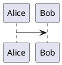

# TASK: Build an ultra-fast native Markdown viewer for macOS

## Goal

Implement a small, extremely fast, native macOS Markdown viewer focused on:

* near-instant startup;
* minimal application size;
* excellent Markdown rendering quality;
* visual quality comparable to or better than Obsidian;
* Mermaid diagram rendering;
* extensible diagram architecture for future PlantUML support;
* broad compatibility with real-world Markdown dialects;
* native macOS behavior;
* support for both Apple Silicon and Intel Macs;
* no Electron, Chromium runtime, Node.js runtime, React, or other heavyweight application frameworks.

The application should feel like a native Unix-style tool with a macOS GUI.

Working name:

`mdv`

The name may remain temporary.

---

# 1. Core principles

Prioritize, in this order:

1. startup speed;
2. rendering correctness;
3. UI responsiveness;
4. minimal binary/application size;
5. visual quality;
6. extensibility;
7. maintainability.

Avoid unnecessary abstractions and dependencies.

Do not turn this into a general-purpose knowledge-management application.

This is primarily a viewer.

---

# 2. Target platforms

Support:

* macOS Apple Silicon / arm64;
* macOS Intel / x86_64.

Produce a Universal Binary where practical:

```text
arm64 + x86_64
```

Target a reasonably modern macOS version while keeping compatibility broad.

Prefer:

```text
macOS 13+
```

unless implementation constraints justify another deployment target.

---

# 3. Development environment

The project must NOT require the Xcode GUI.

Development and building should work using:

* Swift;
* Swift Package Manager;
* Apple Command Line Tools;
* `swift build`;
* shell scripts / Makefile.

The source repository should not depend on an `.xcodeproj`.

Expected commands:

```bash
make
make release
make app
make universal
make install
```

or similarly simple equivalents.

The developer should be able to edit the project using:

* VS Code;
* Zed;
* Vim;
* Neovim;
* any ordinary editor.

---

# 4. Technology constraints

Prefer:

```text
Swift
AppKit
WebKit / WKWebView
cmark-gfm or another very fast CommonMark-compatible parser
```

Heavy frameworks are prohibited.

Do NOT use:

* Electron;
* Tauri unless there is an exceptionally strong technical reason;
* React;
* Vue;
* Angular;
* embedded Node.js;
* bundled Chromium;
* local HTTP server unless absolutely necessary.

The normal rendering path should work fully offline.

---

# 5. Architecture

Use a small architecture roughly like:

```text
                  ┌────────────────────┐
                  │      md file       │
                  └─────────┬──────────┘
                            │
                            ▼
                  ┌────────────────────┐
                  │ Markdown pipeline  │
                  │ parser/extensions  │
                  └─────────┬──────────┘
                            │
                            ▼
                  ┌────────────────────┐
                  │ HTML representation│
                  └─────────┬──────────┘
                            │
              ┌─────────────┴─────────────┐
              │                           │
              ▼                           ▼
      ┌───────────────┐          ┌────────────────┐
      │ normal blocks │          │ special blocks │
      └───────┬───────┘          └───────┬────────┘
              │                           │
              │                    diagram plugins
              │                           │
              │                 ┌─────────┴──────────┐
              │                 ▼                    ▼
              │             Mermaid              PlantUML
              │
              ▼
        ┌────────────┐
        │ WKWebView  │
        └────────────┘
```

Keep parsing, rendering, diagrams and UI clearly separated.

---

# 6. Markdown compatibility

The viewer must correctly render real-world Markdown, not only a minimal Markdown subset.

At minimum support:

## CommonMark

Full CommonMark semantics.

## GitHub Flavored Markdown

Support:

* tables;
* task lists;
* strikethrough;
* autolinks;
* fenced code blocks;
* nested lists;
* block quotes;
* inline code;
* reference links.

## Common practical extensions

Design the parser pipeline so support can be enabled for:

* footnotes;
* definition lists;
* heading IDs;
* superscript;
* subscript;
* emoji syntax;
* admonitions / callouts;
* wiki links;
* front matter;
* YAML metadata;
* HTML blocks;
* mathematical notation;
* custom fenced blocks.

Do not hardcode all extensions into a single parser implementation.

Create an extension mechanism.

---

# 7. Markdown dialect handling

Different Markdown ecosystems interpret some constructs differently.

Design the renderer so dialect profiles can eventually exist:

```text
CommonMark
GitHub
Obsidian
GitLab
Pandoc-like
MkDocs
Generic
```

Initially implement at least:

```text
Generic
GitHub
Obsidian-compatible
```

Prefer automatic compatibility where syntax is unambiguous.

Architecture must not make future dialect support difficult.

---

# 8. Obsidian compatibility

The viewer should render commonly encountered Obsidian Markdown correctly.

Support where practical:

```markdown
[[Wiki links]]

![[embedded-file]]

> [!NOTE]
> callout

> [!WARNING]
> warning
```

Also recognize:

* tags;
* internal links;
* heading references;
* block references where feasible.

Full Obsidian vault semantics are NOT required in the first release.

The objective is correct visual rendering.

---

# 9. Mermaid

Support Mermaid fenced blocks:

````markdown

````

Bundle Mermaid locally inside the application.

Do not load Mermaid from a CDN.

The viewer must work offline.

Render Mermaid diagrams to SVG.

Support at least Mermaid diagram types supported by the bundled Mermaid release, including examples such as:

* flowchart;
* sequence diagram;
* class diagram;
* state diagram;
* ER diagram;
* Gantt;
* pie;
* mindmap;
* timeline.

Mermaid errors must not break the document.

For invalid Mermaid source, show a readable inline error block with the original source available.

---

# 10. Mermaid performance

Mermaid rendering must NOT block initial Markdown rendering.

Desired sequence:

```text
open file
   ↓
parse Markdown
   ↓
render ordinary document
   ↓
display document
   ↓
render Mermaid asynchronously
   ↓
replace placeholders with SVG
```

The user should see the text immediately even if the document contains many diagrams.

---

# 11. Diagram cache

Implement diagram caching.

Conceptually:

```text
cache key =
SHA256(
    renderer version
    + diagram type
    + source
    + theme
    + rendering options
)
```

Cache generated SVG.

Suggested location:

```text
~/Library/Caches/<bundle-id>/diagrams/
```

The cache must be safe to delete at any time.

---

# 12. Diagram renderer abstraction

Do NOT wire Mermaid directly throughout the Markdown renderer.

Create an abstraction such as:

```swift
protocol DiagramRenderer {
    var identifier: String { get }

    func canRender(language: String) -> Bool

    func render(
        source: String,
        options: DiagramRenderOptions
    ) async throws -> DiagramResult
}
```

Possible implementations:

```text
MermaidRenderer
PlantUMLRenderer
GraphvizRenderer
D2Renderer
```

Only Mermaid is required initially.

---

# 13. Future PlantUML support

Architecture must explicitly support future fenced blocks like:

````markdown

````

Do not require PlantUML implementation in the initial milestone unless it is easy to add cleanly.

However:

* no Mermaid-specific assumptions should exist in generic document code;
* fenced diagram rendering should use the generic renderer registry;
* PlantUML support should be addable without rewriting the viewer.

Potential PlantUML backends can later include:

```text
local PlantUML
remote PlantUML server
Kroki
```

Do not implement network access by default.

---

# 14. Rendering engine

Prefer:

```text
Markdown parser
      ↓
HTML
      ↓
WKWebView
```

The application should NOT need a local HTTP server.

Use local application resources.

Where possible use:

```text
loadHTMLString
```

or an appropriate custom URL scheme/resource handler.

Ensure local images and relative links work correctly.

---

# 15. Relative resources

For a document:

```text
docs/design/readme.md
```

correctly resolve:

```markdown


[other](../other.md)
```

Relative paths must be based on the document location.

Support:

* PNG;
* JPEG;
* GIF;
* SVG;
* WebP where WebKit supports it.

---

# 16. File navigation

First milestone:

```bash
mdv README.md
```

opens one Markdown file.

Also support:

```bash
mdv .
```

or:

```bash
mdv docs/
```

Directory mode should provide a lightweight sidebar containing Markdown files.

Do not recursively index entire drives or create a database.

Directory mode should remain simple and fast.

---

# 17. CLI behavior

Provide a CLI executable:

```bash
mdv README.md
```

Also:

```bash
mdv README.md README2.md
```

may open multiple documents as tabs/windows if convenient.

Directory:

```bash
mdv .
```

Useful future options:

```bash
mdv --theme dark README.md
mdv --theme light README.md
mdv --dialect github README.md
mdv --no-mermaid README.md
```

Keep CLI options small and Unix-like.

---

# 18. Finder integration

The `.app` bundle should register Markdown files.

Support:

```text
Open With → mdv
```

for:

```text
.md
.markdown
.mdown
.mkd
```

where practical.

Opening a Markdown file from Finder should reuse the running application appropriately.

---

# 19. UI

Use native AppKit.

Keep chrome minimal.

Suggested layout:

```text
┌──────────────────────────────────────────────┐
│ optional compact toolbar                    │
├──────────────┬───────────────────────────────┤
│              │                               │
│ file tree    │ rendered markdown             │
│ optional     │                               │
│              │                               │
│              │                               │
└──────────────┴───────────────────────────────┘
```

For single-file mode the sidebar should be hidden by default.

---

# 20. Visual quality

The rendered document should look at least as polished as Obsidian's default reading view.

Requirements:

* excellent typography;
* sensible line length;
* attractive heading hierarchy;
* good tables;
* polished code blocks;
* readable blockquotes;
* good list spacing;
* attractive inline code;
* responsive images;
* clean Mermaid integration;
* excellent light theme;
* excellent dark theme.

Do not blindly copy Obsidian CSS.

Create an original lightweight theme inspired by high-quality technical documentation.

---

# 21. Typography

Prefer macOS system fonts.

For body text use the system UI/text stack.

For code use native monospaced fonts such as:

```text
SF Mono
Menlo
ui-monospace
```

Avoid bundling large font files.

This keeps the application smaller.

---

# 22. Responsive layout

The rendered document should adapt to window width.

Use a readable maximum content width.

For example:

```css
article {
    max-width: 900px;
    margin: 0 auto;
}
```

but tune the values based on appearance.

Large tables and code blocks should scroll horizontally instead of breaking layout.

---

# 23. Dark mode

Automatically follow macOS appearance.

Switch:

```text
light
dark
```

without requiring application restart.

Mermaid theme should update accordingly.

Document flashing during theme changes should be avoided.

---

# 24. Code blocks

Support language-tagged code fences:

````markdown
```python
print("hello")
```
````

Provide syntax highlighting.

Choose a lightweight highlighter.

Possible approaches:

```text
highlight.js
Prism
native lightweight implementation
```

Prefer whichever provides good language coverage with minimal bundled size.

Avoid bundling hundreds of unnecessary language definitions if they significantly increase app size.

Consider loading only common languages initially and providing optional extensions.

---

# 25. Search

Implement native:

```text
⌘F
```

Search within the rendered document.

Use either WKWebView's native mechanisms or a very small custom implementation.

Search must be fast on large documents.

---

# 26. Navigation

Support:

* clickable links;
* anchor links;
* heading links;
* table-of-contents navigation;
* relative Markdown document links.

When a relative link points to another Markdown file, open it in mdv rather than launching a browser.

External:

```text
https://
http://
```

links should open using the user's default browser.

---

# 27. Auto reload

Watch the currently opened Markdown file.

When it changes on disk:

```text
file changed
   ↓
debounce
   ↓
re-render
```

Use a native file monitoring mechanism.

Avoid polling.

Preserve scroll position whenever reasonably possible.

---

# 28. Large documents

The viewer must remain responsive with large Markdown documents.

Test with at least:

```text
1 MB
5 MB
10 MB
25 MB
```

Avoid unnecessary copies of the entire document.

Avoid synchronous heavy processing on the main thread.

---

# 29. Startup performance

Startup speed is a primary product feature.

Instrument it.

Measure at least:

```text
process start
application initialized
window visible
Markdown parsed
first content visible
diagrams complete
```

Do not optimize based on guesses.

Record timings in debug builds.

The release build must not spam logs.

---

# 30. Performance targets

These are goals, not absolute guarantees.

For a normal Markdown file below approximately 500 KB on modern Apple Silicon:

```text
window visible:
as close to instant as practical

ordinary Markdown visible:
target <100 ms after application initialization

Mermaid:
may render later
```

The main principle:

> diagrams must never delay readable Markdown.

On Intel Macs performance should also remain excellent.

---

# 31. Application size

Keep the application as small as reasonably possible.

Explicitly inspect:

```bash
du -sh mdv.app
```

and:

```bash
size
otool
```

where useful.

Avoid dependencies that contribute multiple megabytes unless they provide substantial value.

Document the size contribution of major bundled libraries:

```text
Swift/runtime
Mermaid
syntax highlighter
CSS
other resources
```

---

# 32. Memory usage

Do not retain:

* duplicated Markdown strings;
* duplicated HTML unnecessarily;
* unnecessary WebViews;
* large caches in memory.

Directory mode should not preload/render every Markdown document.

---

# 33. Security

Markdown files are untrusted input.

Treat them accordingly.

Do not allow arbitrary Markdown content to gain uncontrolled native application privileges.

Consider:

* HTML handling;
* script execution;
* local file access;
* URL navigation;
* iframe/embed behavior;
* dangerous URL schemes.

Mermaid should run with a safe security configuration.

External JavaScript contained in Markdown should NOT execute.

The application's own bundled JavaScript may execute.

---

# 34. Raw HTML

Markdown commonly allows raw HTML.

Support safe useful HTML where possible, but sanitize dangerous content.

At minimum prevent arbitrary:

```html
<script>
```

execution from Markdown files.

Document the sanitization behavior.

---

# 35. Math

Design for future support of:

```markdown
$E = mc^2$

$$
\int_a^b f(x) dx
$$
```

Possible future renderer:

```text
KaTeX
```

Do not tightly couple math support to the core parser.

A small extension pipeline should be able to add it.

If KaTeX can be added without compromising size significantly, it may be implemented as an optional module.

---

# 36. Extension architecture

Use explicit registries/extensions rather than large chains of special cases.

Conceptually:

```text
MarkdownExtension
DiagramRenderer
CodeHighlighter
LinkResolver
ResourceResolver
```

Do not overengineer.

Protocols/interfaces should exist only where they provide obvious extensibility.

---

# 37. JavaScript

Keep JavaScript usage minimal.

JavaScript is acceptable inside WKWebView for:

* Mermaid;
* syntax highlighting if chosen;
* tiny DOM integration;
* bridge messages;
* theme changes.

Do not build the application UI itself in JavaScript.

AppKit owns the application.

---

# 38. State

Avoid databases.

For basic preferences use:

```text
UserDefaults
```

Examples:

```text
theme override
last window size
sidebar width
dialect preference
```

Do not create an SQLite database for simple viewer state.

---

# 39. App bundle

Generate a normal macOS application bundle:

```text
mdv.app/
└── Contents/
    ├── Info.plist
    ├── MacOS/
    │   └── mdv
    └── Resources/
        ├── markdown.css
        ├── mermaid.min.js
        └── ...
```

The CLI and application bundle may share the same executable if practical.

---

# 40. Universal build

Create reproducible commands for:

```text
arm64
x86_64
universal
```

For example:

```text
build/arm64/
build/x86_64/
dist/mdv.app
```

Use:

```bash
lipo
```

where required.

Verify:

```bash
file dist/mdv.app/Contents/MacOS/mdv
```

Expected:

```text
Mach-O universal binary
x86_64
arm64
```

---

# 41. Signing

For local development support ad-hoc signing:

```bash
codesign --force --deep --sign - mdv.app
```

Keep the build architecture compatible with future:

* Developer ID signing;
* notarization;
* Homebrew Cask distribution.

Do not require paid signing credentials during development.

---

# 42. Homebrew readiness

Structure release artifacts so the application can eventually be installed via something like:

```bash
brew install --cask mdv
```

or, if appropriate:

```bash
brew install mdv
```

Do not implement the actual public formula unless requested.

---

# 43. Repository structure

Prefer something small such as:

```text
mdv/
├── Package.swift
├── Makefile
├── README.md
├── Sources/
│   └── mdv/
│       ├── main.swift
│       ├── App/
│       ├── Markdown/
│       ├── Rendering/
│       ├── Diagrams/
│       ├── Resources/
│       └── UI/
├── Resources/
│   ├── markdown.css
│   ├── mermaid.min.js
│   └── ...
├── Tests/
│   ├── MarkdownTests/
│   ├── RenderingTests/
│   └── Fixtures/
└── scripts/
    └── build-universal.sh
```

Keep the number of files reasonable.

Do not create enterprise-style folder hierarchies for a small viewer.

---

# 44. Markdown test corpus

Create rendering fixtures covering:

* CommonMark;
* GitHub Markdown;
* tables;
* nested lists;
* blockquotes;
* HTML;
* code fences;
* Unicode;
* emoji;
* RTL text where possible;
* long lines;
* huge tables;
* images;
* SVG;
* relative links;
* Mermaid;
* malformed Mermaid;
* Obsidian callouts;
* wiki links;
* footnotes;
* unusual escaping;
* nested formatting.

Include edge cases from official CommonMark examples where appropriate.

---

# 45. Visual regression testing

Rendering correctness is visual.

Create a practical visual regression mechanism.

It does not have to be complex.

Possible approach:

```text
fixture.md
   ↓
render
   ↓
snapshot.png
   ↓
compare/reference
```

Avoid introducing a huge testing framework merely for screenshots.

---

# 46. Correctness rule

Never silently destroy unknown syntax.

When an unsupported extension is encountered, prefer:

* readable fallback rendering;
* preserving source meaning;
* rendering as a code/plain block;

rather than dropping content.

---

# 47. Error handling

The application should gracefully handle:

* unreadable file;
* malformed Markdown;
* invalid UTF-8;
* broken image;
* invalid Mermaid;
* deleted file;
* permission error;
* broken relative link.

Do not crash.

Errors should be concise and visually unobtrusive.

---

# 48. Unicode

Unicode support must be excellent.

Test:

* Cyrillic;
* Latin;
* Finnish characters;
* CJK;
* Arabic;
* emoji;
* combining characters.

Do not assume ASCII paths.

File names may contain spaces and arbitrary Unicode.

---

# 49. Drag & drop

Support dragging:

```text
.md
.markdown
folders
```

onto the application window or Dock icon.

Open them appropriately.

---

# 50. Keyboard-first behavior

Support at least:

```text
⌘O   Open
⌘F   Find
⌘W   Close
⌘+   Zoom in
⌘-   Zoom out
⌘0   Reset zoom
```

Potentially:

```text
⌘R   Reload
```

Use standard macOS behavior where possible.

---

# 51. No editor in v1

Do NOT implement Markdown editing in the initial version.

No:

* Monaco;
* CodeMirror;
* text editor;
* live split preview.

Focus on being an exceptional viewer.

Editing can be considered separately later.

---

# 52. Initial MVP

The first working milestone should contain only:

```text
native AppKit window
WKWebView
open Markdown file
fast CommonMark/GFM parsing
beautiful CSS
light/dark mode
local images
links
syntax-highlighted code
Mermaid
CLI opening
file auto-reload
```

Get this fast and stable before implementing secondary features.

---

# 53. Performance instrumentation

Create a lightweight debug profiler such as:

```text
startup.total          43 ms
window.create           8 ms
file.read               1 ms
markdown.parse          4 ms
html.generate           2 ms
webview.firstPaint     25 ms
mermaid.total          78 ms
```

Exact implementation is flexible.

This data is important for future optimization.

---

# 54. Benchmark against existing apps

Do not imitate their architecture.

Use them only as UX/performance references.

Compare perception against:

```text
Obsidian
MarkText
Typora
MacDown
Quick Look
```

Primary differentiator:

```text
tiny
native
very fast
viewer-first
```

---

# 55. Optimize only after measuring

When a component is slow, profile before replacing it.

Potential bottlenecks:

```text
process startup
WebKit initialization
Markdown parse
HTML generation
syntax highlighting
Mermaid
DOM layout
large images
```

The Markdown parser itself will likely not be the dominant cost.

---

# 56. Avoid premature WebView recreation

Keep one WKWebView per visible document where practical.

Do not destroy/recreate it for:

* theme changes;
* every file reload;
* minor preference changes.

Update content efficiently.

---

# 57. Scroll preservation

On automatic reload:

```text
capture scroll position / nearest heading
       ↓
rerender
       ↓
restore position
```

Avoid jumping back to the top whenever the file changes.

---

# 58. Heading outline

After the MVP, add an optional document outline generated from:

```text
H1
H2
H3
...
```

It should be lightweight and generated from the parsed Markdown structure rather than DOM scraping if convenient.

---

# 59. CSS architecture

Keep styles simple.

For example:

```text
base.css
light.css
dark.css
markdown.css
```

or a similarly small structure.

Use CSS variables for theme values.

Avoid large CSS frameworks.

No Bootstrap or Tailwind runtime/output dump.

---

# 60. Documentation

README must contain:

```text
what mdv is
screenshots
build instructions
CLI usage
supported Markdown
Mermaid support
architecture summary
performance numbers
application size
known limitations
```

Document exact build commands for both Apple Silicon and Intel/universal builds.

---

# 61. Deliverables

Produce:

1. working source code;
2. `Package.swift`;
3. `Makefile` or equivalent;
4. native `.app`;
5. CLI launcher;
6. arm64 build;
7. x86_64 build;
8. Universal Binary build;
9. Markdown rendering tests;
10. Mermaid tests;
11. benchmark fixture;
12. README;
13. architecture notes;
14. current application size measurement;
15. startup performance measurements.

---

# 62. Acceptance criteria

The task is considered successful when:

### Launch

```bash
mdv README.md
```

opens the file in a native GUI.

### Rendering

Normal Markdown is rendered with excellent typography.

### GFM

GitHub tables, task lists and fenced code render correctly.

### Mermaid

````markdown

````

renders as an SVG diagram.

### Offline

Mermaid and normal rendering work with the network disabled.

### Performance

Normal Markdown appears before Mermaid finishes rendering.

The application feels effectively instantaneous for ordinary documents.

### Platform

The executable supports:

```text
arm64
x86_64
```

### Size

There is no Electron/Chromium/Node runtime bundled.

Application size is explicitly measured and documented.

### Appearance

Light and dark modes are both polished enough for everyday use.

### Extensibility

Adding:

```text
PlantUMLRenderer
```

does not require modifying the generic Markdown renderer architecture.

### Build

The repository builds entirely from the command line without opening Xcode.

---

# 63. Implementation strategy

Implement incrementally.

## Phase 1

Create the smallest possible native viewer:

```text
AppKit
WKWebView
file open
Markdown → HTML
CSS
```

Measure startup time.

## Phase 2

Add:

```text
GFM
relative resources
dark mode
code highlighting
```

Measure again.

## Phase 3

Add Mermaid behind the generic diagram renderer abstraction.

Ensure Mermaid does not affect first paint.

Measure again.

## Phase 4

Add:

```text
file watcher
Finder integration
CLI
directory sidebar
```

## Phase 5

Improve compatibility:

```text
Obsidian callouts
wiki links
footnotes
other extensions
```

## Phase 6

Performance optimization and cleanup.

Only optimize components shown by measurements to matter.

---

# 64. Important engineering rule

Do not sacrifice startup speed and application simplicity in pursuit of supporting every exotic Markdown extension immediately.

The architecture should support broad compatibility, but the core application must stay:

```text
small
fast
native
simple
```

The intended product identity is:

> a native macOS Markdown viewer that opens as casually and quickly as a text viewer, but renders Markdown with the visual quality of a serious documentation application.

Not:

> another Electron-based Markdown IDE.

---

# 65. First action

Before writing large amounts of code:

1. inspect available macOS/Swift toolchain;
2. verify that a minimal AppKit + WKWebView application can be built with Swift Package Manager without an Xcode project;
3. create the minimal window;
4. measure cold-start behavior;
5. evaluate `cmark-gfm` integration;
6. choose the smallest reasonable syntax-highlighting approach;
7. report the planned dependency footprint.

Then implement the MVP.

When choosing between two approaches, prefer the one with:

```text
fewer dependencies
smaller app
less startup work
simpler native integration
```

unless it materially compromises Markdown correctness.
