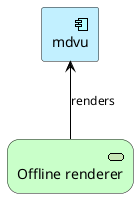
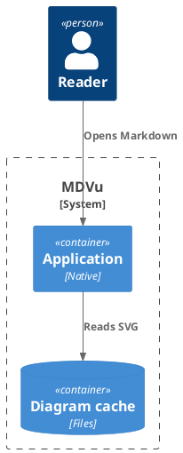

# plantuml-stdlib

```plantuml
@startuml
!include <archimate/Archimate>
Application_Component(app, "mdvu")
Technology_Service(runtime, "Offline renderer")
Rel_Serving_Up(runtime, app, "renders")
@enduml
```

```puml
@startuml
!include <C4/C4_Container>
Person(reader, "Reader")
System_Boundary(viewer, "MDVu") {
  Container(app, "Application", "Native")
  ContainerDb(cache, "Diagram cache", "Files")
}
Rel(reader, app, "Opens Markdown")
Rel(app, cache, "Reads SVG")
@enduml
```

MDVU-ISOLATION-END
