# Supported diagram catalogue

73 diagram grammar/view examples, verified in native MDVu on 2026-10-18. One example per engine and distinct grammar or library view. Mermaid and PlantUML are separate source languages. Aliases, repeated feature probes, utility commands and unsupported cases are excluded. Stable case IDs retain gaps for traceability.

Mermaid 12.2.0 · ZenUML plugin 1.0.1 · PlantUML Core 1.2026.9 · C4-PlantUML 2.14.0 · ArchiMate 3.2.2.

## D001 — Mermaid / flowchart

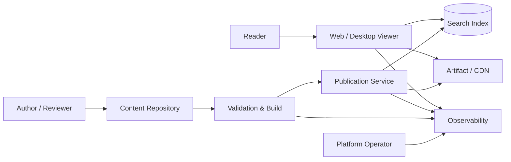
```mermaid
flowchart LR
    Author["Author / Reviewer"] --> Repo["Content Repository"]
    Repo --> CI["Validation & Build"]
    CI --> Publish["Publication Service"]
    Publish --> Search[("Search Index")]
    Publish --> CDN["Artifact / CDN"]
    Reader["Reader"] --> Web["Web / Desktop Viewer"]
    Web --> Search
    Web --> CDN
    Admin["Platform Operator"] --> Observe["Observability"]
    CI --> Observe
    Publish --> Observe
    Web --> Observe
```

## D002 — Mermaid / C4Context

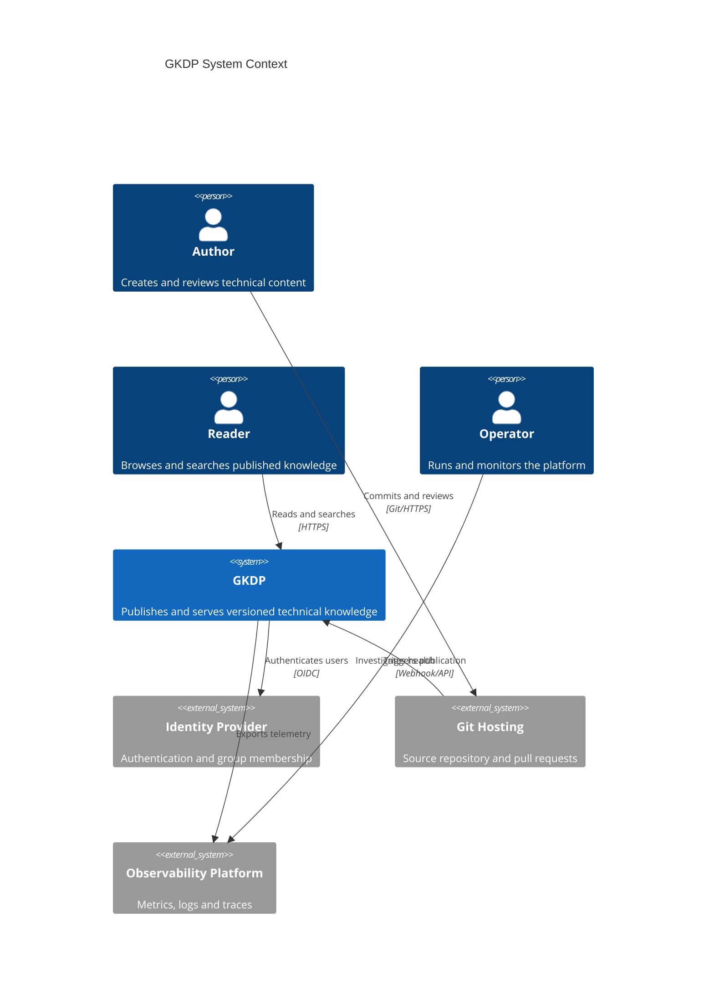
```mermaid
C4Context
    title GKDP System Context
    Person(author, "Author", "Creates and reviews technical content")
    Person(reader, "Reader", "Browses and searches published knowledge")
    Person(operator, "Operator", "Runs and monitors the platform")
    System(gkdp, "GKDP", "Publishes and serves versioned technical knowledge")
    System_Ext(idp, "Identity Provider", "Authentication and group membership")
    System_Ext(git, "Git Hosting", "Source repository and pull requests")
    System_Ext(obs, "Observability Platform", "Metrics, logs and traces")
    Rel(author, git, "Commits and reviews", "Git/HTTPS")
    Rel(git, gkdp, "Triggers publication", "Webhook/API")
    Rel(reader, gkdp, "Reads and searches", "HTTPS")
    Rel(gkdp, idp, "Authenticates users", "OIDC")
    Rel(operator, obs, "Investigates health")
    Rel(gkdp, obs, "Exports telemetry")
```

## D003 — Mermaid / requirementDiagram

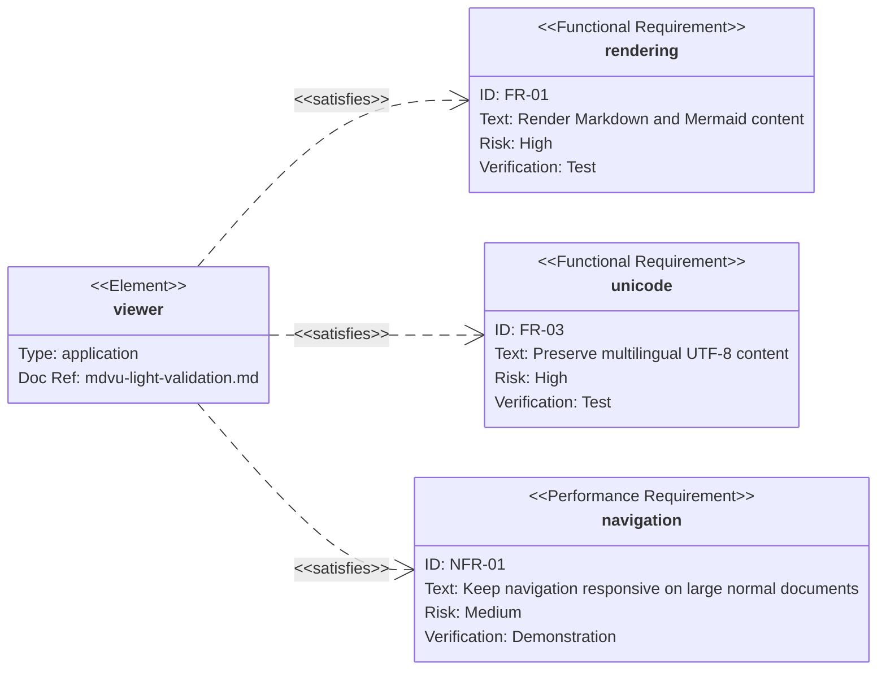
```mermaid
requirementDiagram
    direction LR
    functionalRequirement rendering {
      id: "FR-01"
      text: "Render Markdown and Mermaid content"
      risk: high
      verifymethod: test
    }
    functionalRequirement unicode {
      id: "FR-03"
      text: "Preserve multilingual UTF-8 content"
      risk: high
      verifymethod: test
    }
    performanceRequirement navigation {
      id: "NFR-01"
      text: "Keep navigation responsive on large normal documents"
      risk: medium
      verifymethod: demonstration
    }
    element viewer {
      type: application
      docref: "mdvu-light-validation.md"
    }
    viewer - satisfies -> rendering
    viewer - satisfies -> unicode
    viewer - satisfies -> navigation
```

## D004 — Mermaid / quadrantChart

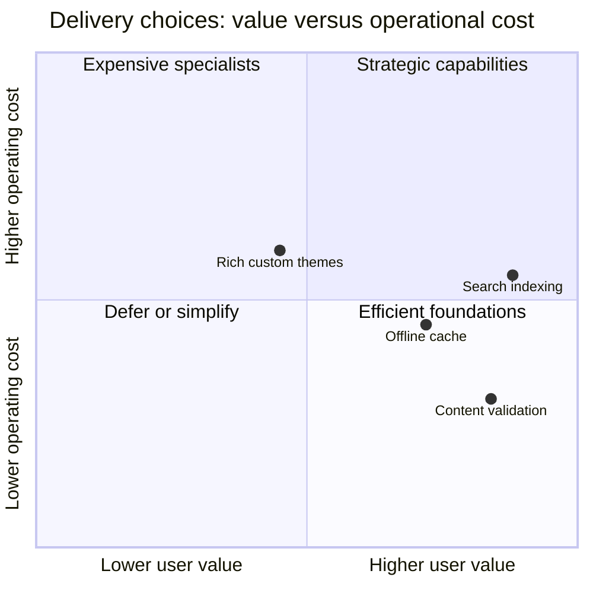
```mermaid
quadrantChart
    title Delivery choices: value versus operational cost
    x-axis Lower user value --> Higher user value
    y-axis Lower operating cost --> Higher operating cost
    quadrant-1 Strategic capabilities
    quadrant-2 Expensive specialists
    quadrant-3 Defer or simplify
    quadrant-4 Efficient foundations
    Search indexing: [0.88, 0.55]
    Offline cache: [0.72, 0.45]
    Rich custom themes: [0.45, 0.60]
    Content validation: [0.84, 0.30]
```

## D005 — Mermaid / C4Container

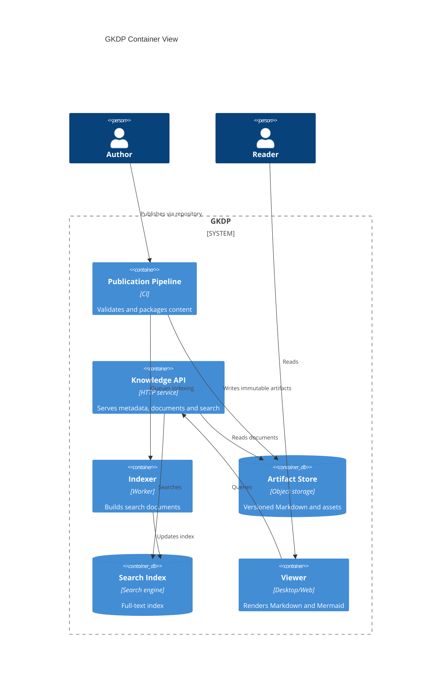
```mermaid
C4Container
    title GKDP Container View
    Person(author, "Author")
    Person(reader, "Reader")
    System_Boundary(gkdp, "GKDP") {
      Container(pipeline, "Publication Pipeline", "CI", "Validates and packages content")
      Container(api, "Knowledge API", "HTTP service", "Serves metadata, documents and search")
      Container(indexer, "Indexer", "Worker", "Builds search documents")
      ContainerDb(store, "Artifact Store", "Object storage", "Versioned Markdown and assets")
      ContainerDb(search, "Search Index", "Search engine", "Full-text index")
      Container(viewer, "Viewer", "Desktop/Web", "Renders Markdown and Mermaid")
    }
    Rel(author, pipeline, "Publishes via repository")
    Rel(pipeline, store, "Writes immutable artifacts")
    Rel(pipeline, indexer, "Queues indexing")
    Rel(indexer, search, "Updates index")
    Rel(reader, viewer, "Reads")
    Rel(viewer, api, "Queries")
    Rel(api, store, "Reads documents")
    Rel(api, search, "Searches")
```

## D006 — Mermaid / C4Component

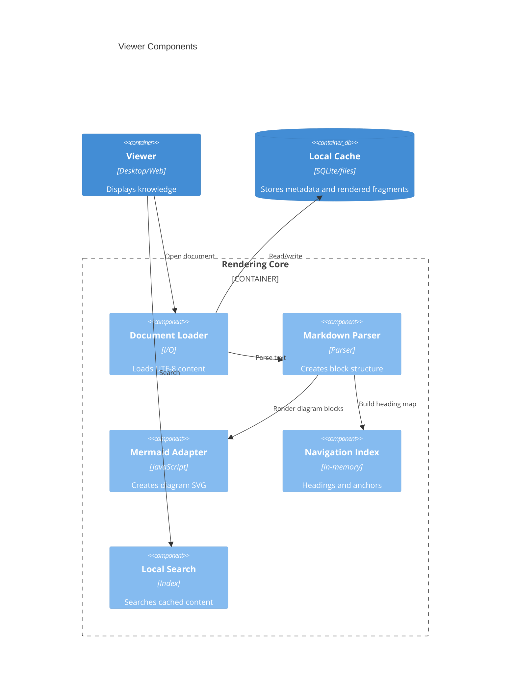
```mermaid
C4Component
    title Viewer Components
    Container(viewer, "Viewer", "Desktop/Web", "Displays knowledge")
    ContainerDb(cache, "Local Cache", "SQLite/files", "Stores metadata and rendered fragments")
    Container_Boundary(core, "Rendering Core") {
      Component(loader, "Document Loader", "I/O", "Loads UTF-8 content")
      Component(parser, "Markdown Parser", "Parser", "Creates block structure")
      Component(mermaid, "Mermaid Adapter", "JavaScript", "Creates diagram SVG")
      Component(nav, "Navigation Index", "In-memory", "Headings and anchors")
      Component(search, "Local Search", "Index", "Searches cached content")
    }
    Rel(viewer, loader, "Open document")
    Rel(loader, parser, "Parse text")
    Rel(parser, mermaid, "Render diagram blocks")
    Rel(parser, nav, "Build heading map")
    Rel(viewer, search, "Search")
    Rel(loader, cache, "Read/write")
```

## D007 — Mermaid / architecture-beta

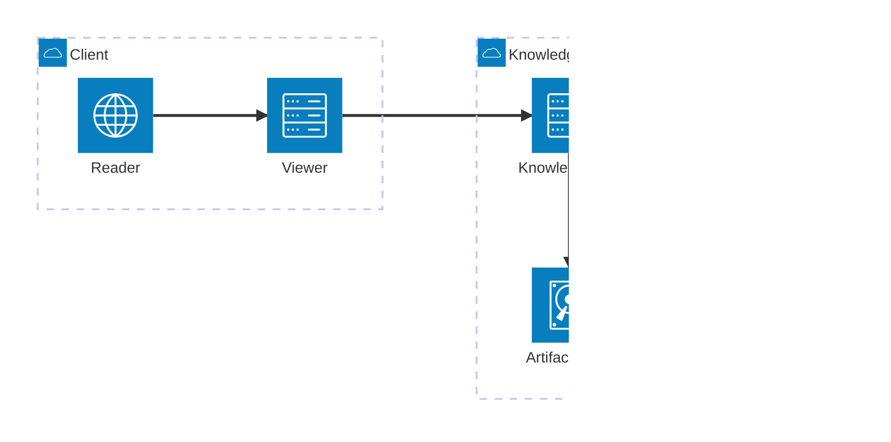
```mermaid
architecture-beta
    group client(cloud)[Client]
    group platform(cloud)[Knowledge Platform]
    service user(internet)[Reader] in client
    service viewer(server)[Viewer] in client
    service api(server)[Knowledge API] in platform
    service store(disk)[Artifact Store] in platform
    service index(database)[Search Index] in platform
    user:R --> L:viewer
    viewer:R --> L:api
    api:B --> T:store
    api:R --> L:index
```

## D008 — Mermaid / erDiagram

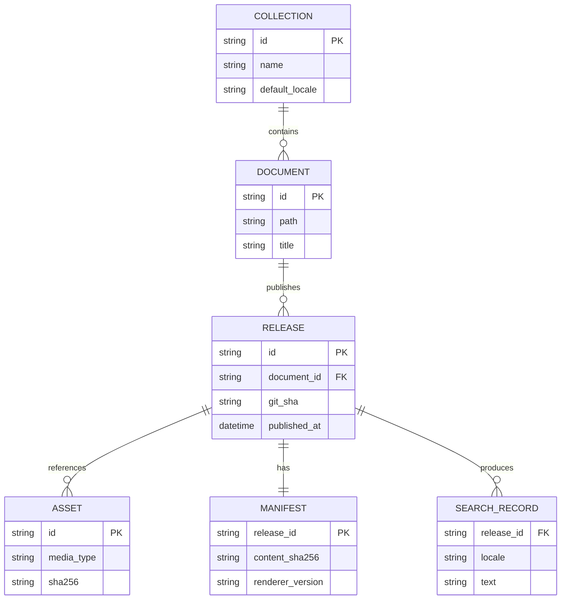
```mermaid
erDiagram
    COLLECTION ||--o{ DOCUMENT : contains
    DOCUMENT ||--o{ RELEASE : publishes
    RELEASE ||--o{ ASSET : references
    RELEASE ||--|| MANIFEST : has
    RELEASE ||--o{ SEARCH_RECORD : produces
    COLLECTION {
      string id PK
      string name
      string default_locale
    }
    DOCUMENT {
      string id PK
      string path
      string title
    }
    RELEASE {
      string id PK
      string document_id FK
      string git_sha
      datetime published_at
    }
    ASSET {
      string id PK
      string media_type
      string sha256
    }
    MANIFEST {
      string release_id PK
      string content_sha256
      string renderer_version
    }
    SEARCH_RECORD {
      string release_id FK
      string locale
      string text
    }
```

## D009 — Mermaid / sankey

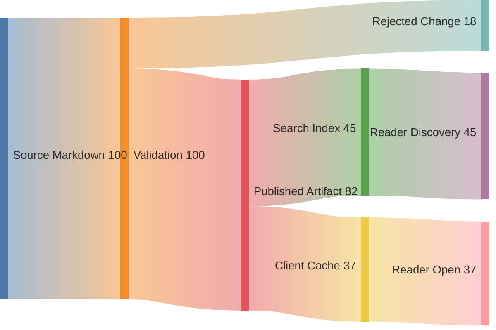
```mermaid
sankey
    Source Markdown,Validation,100
    Validation,Published Artifact,82
    Validation,Rejected Change,18
    Published Artifact,Search Index,45
    Published Artifact,Client Cache,37
    Search Index,Reader Discovery,45
    Client Cache,Reader Open,37
```

## D010 — Mermaid / sequenceDiagram

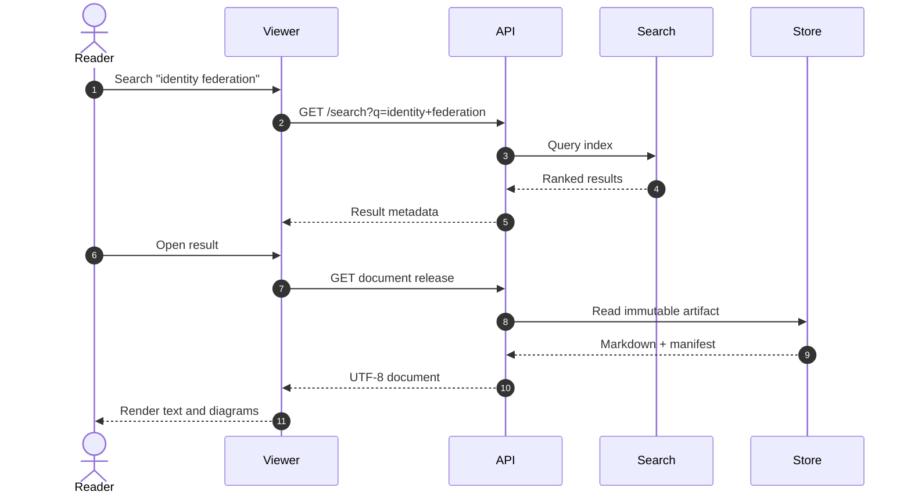
```mermaid
sequenceDiagram
    autonumber
    actor Reader
    participant Viewer
    participant API
    participant Search
    participant Store
    Reader->>Viewer: Search "identity federation"
    Viewer->>API: GET /search?q=identity+federation
    API->>Search: Query index
    Search-->>API: Ranked results
    API-->>Viewer: Result metadata
    Reader->>Viewer: Open result
    Viewer->>API: GET document release
    API->>Store: Read immutable artifact
    Store-->>API: Markdown + manifest
    API-->>Viewer: UTF-8 document
    Viewer-->>Reader: Render text and diagrams
```

## D011 — Mermaid / stateDiagram-v2

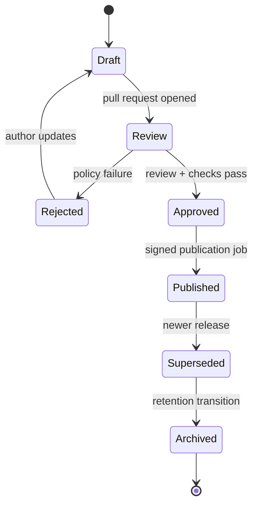
```mermaid
stateDiagram-v2
    [*] --> Draft
    Draft --> Review : pull request opened
    Review --> Rejected : policy failure
    Rejected --> Draft : author updates
    Review --> Approved : review + checks pass
    Approved --> Published : signed publication job
    Published --> Superseded : newer release
    Superseded --> Archived : retention transition
    Archived --> [*]
```

## D012 — Mermaid / ishikawa-beta

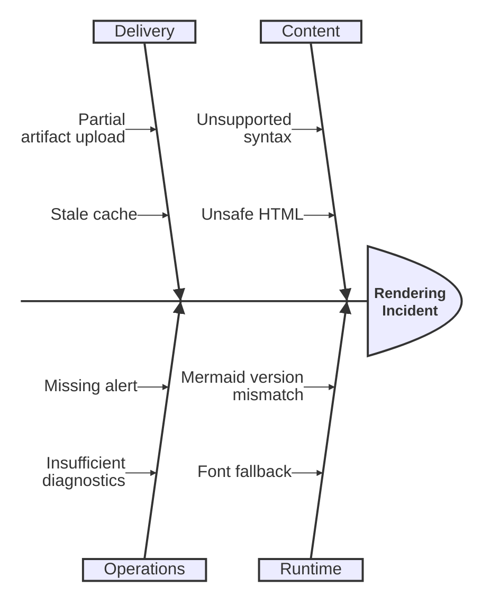
```mermaid
ishikawa-beta
    Rendering Incident
      Content
        Unsupported syntax
        Unsafe HTML
      Runtime
        Mermaid version mismatch
        Font fallback
      Delivery
        Partial artifact upload
        Stale cache
      Operations
        Missing alert
        Insufficient diagnostics
```

## D013 — Mermaid / C4Dynamic

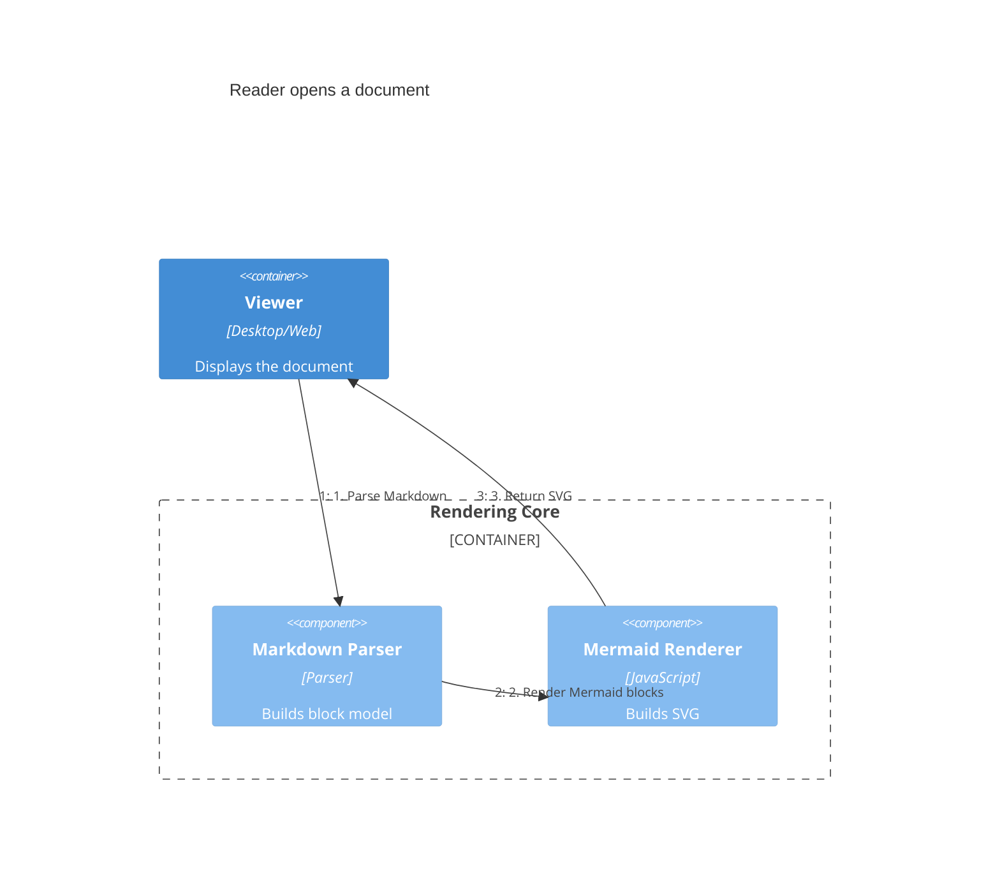
```mermaid
C4Dynamic
    title Reader opens a document
    Container(ui, "Viewer", "Desktop/Web", "Displays the document")
    Container_Boundary(core, "Rendering Core") {
      Component(parser, "Markdown Parser", "Parser", "Builds block model")
      Component(renderer, "Mermaid Renderer", "JavaScript", "Builds SVG")
    }
    Rel(ui, parser, "1. Parse Markdown")
    Rel(parser, renderer, "2. Render Mermaid blocks")
    Rel(renderer, ui, "3. Return SVG")
```

## D014 — Mermaid / zenuml

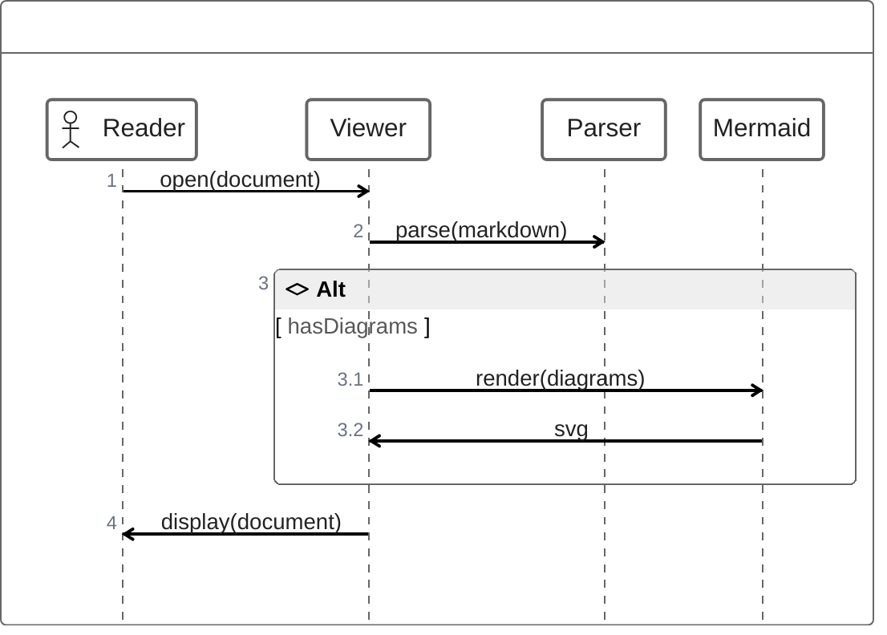
```mermaid
zenuml
    @Actor Reader
    Reader->Viewer: open(document)
    Viewer->Parser: parse(markdown)
    if(hasDiagrams) {
      Viewer->Mermaid: render(diagrams)
      Mermaid->Viewer: svg
    }
    Viewer->Reader: display(document)
```

## D015 — Mermaid / swimlane-beta

```mermaid
swimlane-beta LR
    subgraph Author[Author]
      A[Edit Markdown]
      D[Address review]
    end
    subgraph Platform[Platform]
      B[Validate]
      C[Publish]
    end
    subgraph Reader[Reader]
      E[Open release]
    end
    A --> B
    B --> D
    D --> B
    B --> C
    C --> E
```

## D016 — Mermaid / C4Deployment

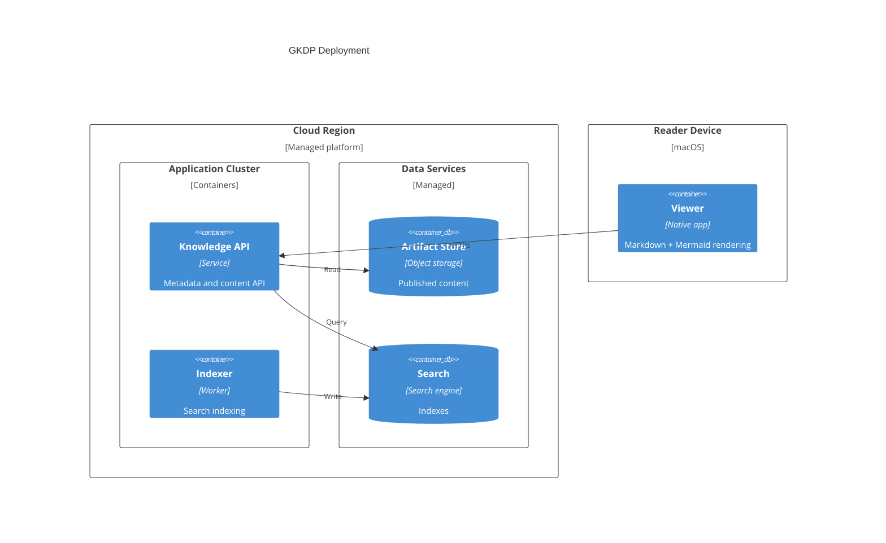
```mermaid
C4Deployment
    title GKDP Deployment
    Deployment_Node(cloud, "Cloud Region", "Managed platform") {
      Deployment_Node(app, "Application Cluster", "Containers") {
        Container(api, "Knowledge API", "Service", "Metadata and content API")
        Container(indexer, "Indexer", "Worker", "Search indexing")
      }
      Deployment_Node(data, "Data Services", "Managed") {
        ContainerDb(store, "Artifact Store", "Object storage", "Published content")
        ContainerDb(search, "Search", "Search engine", "Indexes")
      }
    }
    Deployment_Node(mac, "Reader Device", "macOS") {
      Container(viewer, "Viewer", "Native app", "Markdown + Mermaid rendering")
    }
    Rel(viewer, api, "HTTPS")
    Rel(api, store, "Read")
    Rel(api, search, "Query")
    Rel(indexer, search, "Write")
```

## D017 — Mermaid / gantt

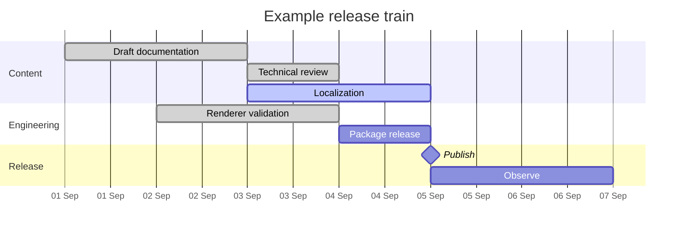
```mermaid
gantt
    title Example release train
    dateFormat YYYY-MM-DD
    axisFormat %d %b
    section Content
    Draft documentation      :done, a1, 2026-09-01, 2d
    Technical review         :done, after a1, 1d
    Localization             :active, 2026-09-03, 2d
    section Engineering
    Renderer validation      :done, b1, 2026-09-02, 2d
    Package release          :2026-09-04, 1d
    section Release
    Publish                  :milestone, 2026-09-05, 0d
    Observe                  :2026-09-05, 2d
```

## D018 — Mermaid / gitGraph

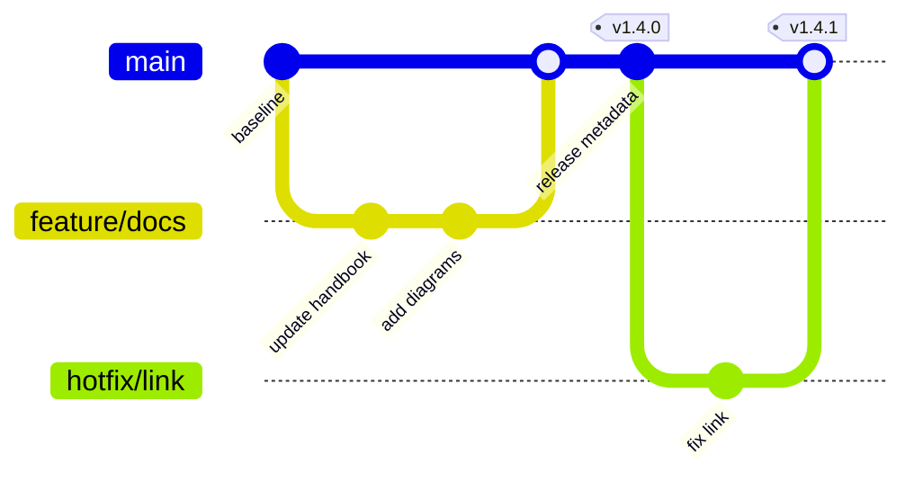
```mermaid
gitGraph
    commit id: "baseline"
    branch feature/docs
    checkout feature/docs
    commit id: "update handbook"
    commit id: "add diagrams"
    checkout main
    merge feature/docs
    commit id: "release metadata" tag: "v1.4.0"
    branch hotfix/link
    checkout hotfix/link
    commit id: "fix link"
    checkout main
    merge hotfix/link tag: "v1.4.1"
```

## D020 — Mermaid / xychart

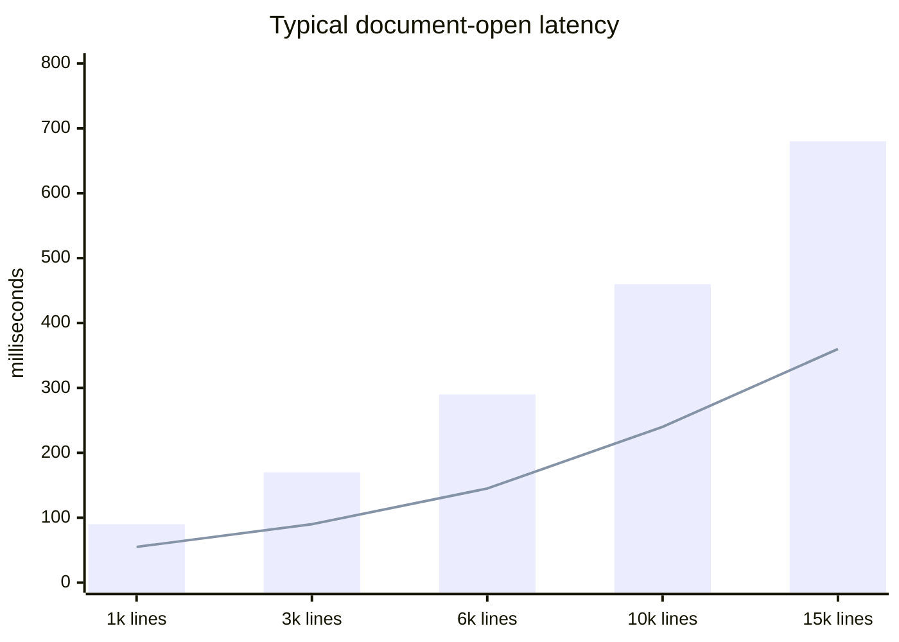
```mermaid
xychart
    title "Typical document-open latency"
    x-axis ["1k lines", "3k lines", "6k lines", "10k lines", "15k lines"]
    y-axis "milliseconds" 0 --> 800
    bar "cold" [90, 170, 290, 460, 680]
    line "warm" [55, 90, 145, 240, 360]
```

## D021 — Mermaid / radar-beta

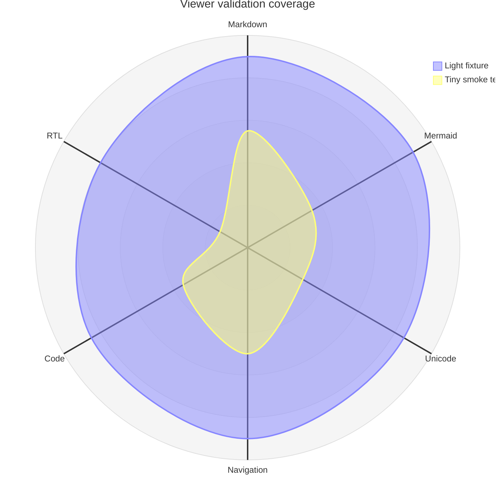
```mermaid
radar-beta
    title Viewer validation coverage
    axis md["Markdown"], mm["Mermaid"], uc["Unicode"], nav["Navigation"], code["Code"], rtl["RTL"]
    curve light["Light fixture"]{90, 90, 85, 90, 85, 80}
    curve smoke["Tiny smoke test"]{55, 35, 30, 50, 35, 15}
    min 0
    max 100
    ticks 5
```

## D022 — Mermaid / timeline

```mermaid
timeline
    title GKDP capability roadmap
    2026 Q3 : Stable Markdown viewer
            : Mermaid baseline coverage
    2026 Q4 : Offline collections
            : Improved accessibility
    2027 Q1 : Cross-document references
            : Search ranking improvements
    2027 Q2 : Policy-aware collections
            : Localization workflow automation
```

## D023 — Mermaid / kanban

```mermaid
kanban
  Backlog
    task1[Cross-document backlinks]
    task2[Additional locale QA]
  In Progress
    task3[Offline cache improvements]
  Review
    task4[Accessibility audit]
  Done
    task5[Immutable release manifest]
    task6[Mermaid rendering bridge]
```

## D024 — Mermaid / mindmap

```mermaid
mindmap
  root((Knowledge Platform))
    Authoring
      Markdown
      Mermaid
      Reviews
    Publication
      Validation
      Versioning
      Indexing
    Consumption
      Navigation
      Search
      Offline cache
    Operations
      Metrics
      Logs
      Recovery
```

## D025 — Mermaid / treemap-beta

```mermaid
treemap-beta
    "Knowledge Platform"
      "Authoring"
        "Markdown": 25
        "Review": 10
      "Publication"
        "Validation": 20
        "Indexing": 15
      "Consumption"
        "Viewer": 20
        "Search": 10
```

## D027 — Mermaid / classDiagram

```mermaid
classDiagram
    class Document {
      +String id
      +String title
      +String locale
      +List~Block~ blocks
      +render()
    }
    class Block {
      <<interface>>
      +render()
    }
    class MarkdownBlock
    class MermaidBlock {
      +String source
      +renderSvg()
    }
    Document "1" *-- "1..*" Block
    Block <|.. MarkdownBlock
    Block <|.. MermaidBlock
```

## D028 — Mermaid / journey

```mermaid
journey
    title Reader opens a newly published handbook
    section Discover
      Search topic: 4: Reader
      Review result list: 4: Reader
    section Read
      Open document: 5: Reader
      Navigate headings: 5: Reader
      Inspect diagram: 4: Reader
    section Reuse
      Copy link: 5: Reader
      Save offline: 4: Reader
```

## D029 — Mermaid / pie

```mermaid
pie showData title Example document block mix
    "Prose" : 55
    "Tables and lists" : 15
    "Code" : 12
    "Mermaid" : 18
```

## D030 — Mermaid / block-beta

```mermaid
block-beta
    columns 4
    A["Source"] B("Parser") C(("Renderer")) D[("Cache")]
    A --> B
    B --> C
    C --> D
```

## D031 — Mermaid / packet

```mermaid
packet
    title Simplified content envelope
    0-7: "Version"
    8-15: "Flags"
    16-31: "Header length"
    32-63: "Document ID hash"
    64-95: "Content length"
    96-127: "Checksum"
```

## D032 — Mermaid / eventmodeling

```mermaid
eventmodeling
    tf 01 ui Editor
    tf 02 cmd PublishDocument
    tf 03 evt DocumentPublished
    tf 04 rmo PublishedDocument
    tf 05 ui Viewer
```

## D033 — Mermaid / treeView-beta

```mermaid
treeView-beta
    ├── docs/
    │   ├── architecture.md
    │   ├── security.md
    │   └── operations.md
    ├── diagrams/
    │   └── platform.mmd
    ├── assets/
    │   └── logo.svg
    └── README.md
```

## D034 — Mermaid / venn-beta

```mermaid
venn-beta
    title "Viewer compatibility"
    set Markdown["Markdown"]:80
    set Mermaid["Mermaid"]:70
    set Unicode["Unicode"]:90
    union Markdown,Mermaid["Fenced diagrams"]:25
    union Mermaid,Unicode["Unicode labels"]:20
    union Markdown,Unicode["Multilingual prose"]:35
    union Markdown,Mermaid,Unicode["Production document"]:15
```

## D035 — Mermaid / wardley-beta

```mermaid
wardley-beta
    title Knowledge Delivery Stack
    size [900, 520]
    evolution Genesis@0.25 -> Custom@0.5 -> Product@0.75 -> Commodity@1.0
    anchor Reader [0.95, 0.90]
    component "Viewer" [0.80, 0.65] (build)
    component "Markdown parser" [0.62, 0.85] (buy)
    component "Mermaid renderer" [0.55, 0.76] (buy)
    component "Unicode fonts" [0.35, 0.95] (market)
    Reader -> "Viewer"
    "Viewer" -> "Markdown parser"
    "Viewer" -> "Mermaid renderer"
    "Mermaid renderer" -> "Unicode fonts"
```

## D036 — Mermaid / cynefin-beta

```mermaid
cynefin-beta
    title Documentation Platform Problems
    complex
      "Mixed bidi rendering"
      "Unexpected content interaction"
    complicated
      "SVG performance profiling"
      "Search ranking tuning"
    clear
      "Broken relative link"
      "Missing asset"
    chaotic
      "Renderer process crash"
    confusion
      "Unclassified failure"
```

## D038 — PlantUML / Sequence Diagram

```plantuml
@startuml
title Publication sequence — Русский / 中文 / العربية 🚀
autonumber
actor Reader
participant Viewer
participant "Knowledge API" as API
database Cache
Reader -> Viewer : Open document
activate Viewer
Viewer -> API : GET /document
activate API
alt cached
  API -> Cache : lookup(id)
  Cache --> API : Markdown
else not cached
  API -> API : load immutable release
end
API --> Viewer : UTF-8 Markdown
Viewer --> Reader : Rendered document ✅
deactivate API
deactivate Viewer
note over Viewer,API
  Unicode: ÅÄÖ · Русский · 中文 · العربية · 日本語
end note
@enduml
```

## D039 — PlantUML / Use Case Diagram

```plantuml
@startuml
left to right direction
actor Reader
actor Author
rectangle "mdvu" {
  usecase "Open Markdown" as UC1
  usecase "Navigate headings" as UC2
  usecase "Render diagrams" as UC3
  usecase "Search document" as UC4
}
Reader --> UC1
Reader --> UC2
Reader --> UC4
Author --> UC1
UC1 .> UC3 : <<include>>
@enduml
```

## D040 — PlantUML / Class Diagram

```plantuml
@startuml
interface Renderer<T> {
  +render(source: T): String
}
abstract class Block {
  +language: String
}
class MermaidBlock
class PlantUMLBlock
class Document {
  +id: String
  +title: String
}
Renderer <|.. MermaidBlock
Renderer <|.. PlantUMLBlock
Block <|-- MermaidBlock
Block <|-- PlantUMLBlock
Document "1" *-- "1..*" Block
@enduml
```

## D041 — PlantUML / Object Diagram

```plantuml
@startuml
object document {
  id = "architecture/overview"
  locale = "fi-FI"
  title = "Arkkitehtuuri"
}
object release {
  version = "2026.09"
  immutable = true
}
object manifest {
  encoding = "UTF-8"
  diagrams = "Mermaid + PlantUML"
}
document --> release
release --> manifest
@enduml
```

## D042 — PlantUML / Activity Diagram — Current Syntax

```plantuml
@startuml
start
:Open Markdown file;
if (front matter present?) then (yes)
  :Parse metadata;
endif
:Parse Markdown blocks;
if (diagram block?) then (yes)
  :Dispatch to diagram renderer;
else (no)
  :Render native Markdown;
endif
:Build navigation index;
stop
@enduml
```

## D043 — PlantUML / Activity Diagram — Legacy Syntax Probe

```puml
@startuml
(*) --> "Open document"
--> "Parse Markdown"
if "Has diagrams?" then
  -->[yes] "Render diagrams"
  --> "Display"
else
  ->[no] "Display"
endif
--> (*)
@enduml
```

## D044 — PlantUML / Component Diagram

```plantuml
@startuml
package "Viewer" {
  [Document Loader] as Loader
  [Markdown Parser] as Parser
  [Navigation Index] as Nav
  [Diagram Router] as Router
}
component "Mermaid 11.17.2" as Mermaid
component "PlantUML 1.2026.7" as PUML
Loader --> Parser
Parser --> Nav
Parser --> Router
Router --> Mermaid
Router --> PUML
@enduml
```

## D045 — PlantUML / Deployment Diagram

```plantuml
@startuml
node "Desktop" as desktop {
  artifact "test-complete.md" as doc
  component "mdvu" as viewer
}
node "Diagram Runtime" as runtime {
  component "Mermaid" as mermaid
  component "PlantUML" as plantuml
}
database "Local cache" as cache
doc --> viewer
viewer --> mermaid
viewer --> plantuml
viewer --> cache
@enduml
```

## D046 — PlantUML / State Diagram

```plantuml
@startuml
[*] --> Loading
Loading --> Ready : parsed
Loading --> Error : invalid input
Ready --> Rendering : diagram pending
Rendering --> Ready : diagram complete
Rendering --> Error : renderer failure
Error --> Ready : recoverable block skipped
Ready --> Closed
Closed --> [*]
@enduml
```

## D047 — PlantUML / Timing Diagram

```plantuml
@startuml
robust "Viewer" as V
concise "Reader" as R
@0
R is Idle
V is Loading
@100
R is Waiting
V is Parsing
@220
V is Rendering
@420
V is Ready
R is Reading
@700
R is Idle
@enduml
```

## D048 — PlantUML / JSON Data

```plantuml
@startjson
{
  "document": {
    "id": "unicode-demo",
    "title": "Русский / 中文 / العربية 🚀",
    "locales": ["en", "fi", "ru", "zh-CN", "ar"],
    "valid": true
  }
}
@endjson
```

## D049 — PlantUML / YAML Data

```plantuml
@startyaml
document:
  id: unicode-demo
  title: "Åä Русский 中文 العربية 🚀"
  locales:
    - en
    - fi
    - ru
    - zh-CN
    - ar
  valid: true
@endyaml
```

## D050 — PlantUML / EBNF Diagram

```plantuml
@startebnf
title Compact Markdown heading grammar
heading = atx_heading | setext_heading;
atx_heading = "#", {"#"}, " ", text;
setext_heading = text, ("=" | "-");
text = ? Unicode text ?;
@endebnf
```

## D051 — PlantUML / Regex Diagram

```plantuml
@startregex
!option language en
!option useDescriptiveNames true
^(?<scheme>https?)://(?<host>[\w.-]+)(?<path>/[^\s]*)?$
@endregex
```

## D052 — PlantUML / Network Diagram (nwdiag)

```plantuml
@startnwdiag
network dmz {
  address = "203.0.113.0/24"
  gateway [address = "203.0.113.1"];
  viewer [address = "203.0.113.20"];
}
network internal {
  address = "10.0.0.0/24"
  viewer [address = "10.0.0.20"];
  cache [address = "10.0.0.30", shape = database];
}
@endnwdiag
```

## D053 — PlantUML / Salt Wireframe

```plantuml
@startsalt
{
  {+ mdvu Viewer
    File | "test-complete.md"
    Search | "Unicode Mermaid PlantUML"
    [Open] | [Reload]
    [X] Table of contents
    [X] Diagram rendering
    Locale | ^English^Русский^中文^العربية^
  }
}
@endsalt
```

## D054 — PlantUML / ArchiMate Diagram

```plantuml
@startuml
archimate #Business "Reader" as reader <<business-actor>>
archimate #Application "mdvu" as app <<application-component>>
archimate #Technology "Diagram Runtime" as runtime <<technology-device>>
reader --> app : reads
app --> runtime : renders
@enduml
```

## D055 — PlantUML / SDL Shapes

```plantuml
@startuml
start
:Receive Markdown; <<input>>
:Parse document; <<procedure>>
:Load renderer; <<load>>
:Render output; <<task>>
:Store cache; <<save>>
:Display document; <<output>>
stop
@enduml
```

## D057 — PlantUML / Gantt Diagram

```plantuml
@startgantt
Project starts the 2026-09-01
[Fixture draft] lasts 2 days
[Review] starts at [Fixture draft]'s end and lasts 2 days
[Renderer validation] starts at [Review]'s end and lasts 2 days
[Release] happens at [Renderer validation]'s end
@endgantt
```

## D059 — PlantUML / MindMap Diagram

```plantuml
@startmindmap
* mdvu
** Markdown
*** Navigation
*** Tables
*** Unicode
** Mermaid
*** 11.17.2
** PlantUML
*** 1.2026.7
** Languages
*** Русский
*** 中文
*** العربية
@endmindmap
```

## D060 — PlantUML / WBS Diagram

```plantuml
@startwbs
* Complete functional validation
** Markdown
*** Blocks
*** Inline syntax
*** Navigation
** Diagrams
*** Mermaid
*** ZenUML
*** PlantUML
** Unicode
*** LTR
*** RTL
*** CJK
@endwbs
```

## D063 — PlantUML / Information Engineering Diagram

```plantuml
@startuml
entity DOCUMENT {
  * id : UUID
  --
  * title : TEXT
  locale : TEXT
}
entity RELEASE {
  * id : UUID
  --
  * version : TEXT
}
DOCUMENT ||--o{ RELEASE : publishes
@enduml
```

## D065 — PlantUML / Chart Diagram

```plantuml
@startchart
h-axis [Markdown, Mermaid, PlantUML, Unicode]
v-axis "Coverage" 0 --> 100
bar "Functional fixture" [95, 100, 100, 95]
line "Smoke fixture" [60, 35, 20, 45]
legend right
@endchart
```

## D075 — Mermaid / usecase-beta

```mermaid
usecase-beta
direction LR
actor Customer("Customer")
systemBoundary "Order system"
  Checkout("Place order")
end
Customer --> Checkout
```

## D076 — Mermaid / agentflow-beta

```mermaid
agentflow-beta TB
  flow reviewer["Review Agent"]
    changes["Gather changes"]@{ shape: input }
    analyse["Analyse diff"]@{ shape: task }
    lint["run_linter"]@{ shape: tool }
    ok["Clean?"]@{ shape: decision }

    changes --> analyse --> lint --> ok
  end
```

## D077 — Mermaid / railroad-beta

```mermaid
railroad-beta
title Expression Grammar

expression = sequence(
    nonterminal("term"),
    zeroOrMore(sequence(
        choice(terminal("+"), terminal("-")),
        nonterminal("term")
    ))
) ;
term = sequence(
    nonterminal("factor"),
    zeroOrMore(sequence(
        choice(terminal("*"), terminal("/")),
        nonterminal("factor")
    ))
) ;
factor = choice(
    nonterminal("number"),
    sequence(terminal("("), nonterminal("expression"), terminal(")"))
) ;
number = oneOrMore(nonterminal("digit")) ;
digit = choice(terminal("0"), terminal("1"), terminal("2"), terminal("3"), terminal("4"), terminal("5"), terminal("6"), terminal("7"), terminal("8"), terminal("9")) ;
```

## D078 — Mermaid / railroad-ebnf-beta

```mermaid
railroad-ebnf-beta
title "Digit Definition"

digit = "0" | "1" | "2" | "3" | "4" | "5" | "6" | "7" | "8" | "9" ;
```

## D079 — Mermaid / railroad-abnf-beta

```mermaid
railroad-abnf-beta
title "Email Address"

address = local-part "@" domain ;
local-part = 1*( ALPHA / DIGIT / "." / "-" ) ;
domain = label *( "." label ) ;
label = 1*( ALPHA / DIGIT / "-" ) ;
```

## D080 — Mermaid / railroad-peg-beta

```mermaid
railroad-peg-beta
title "Calculator Grammar"

Expression <- Term (("+" / "-") Term)* ;
Term <- Factor (("*" / "/") Factor)* ;
Factor <- Number / "(" Expression ")" ;
Number <- Digit+ ;
Digit <- "0" / "1" / "2" / "3" / "4" / "5" / "6" / "7" / "8" / "9" ;
```

## D090 — PlantUML / DOT

```plantuml
@startdot
digraph G {
 Reader -> Parser -> Renderer;
}
@enddot
```

## D091 — PlantUML / PACKET

```plantuml
@startpacketdiag
packetdiag {
0-7: Source Port
8-15: Destination Port
16-31: Sequence Number
}
@endpacketdiag
```

## D100 — PlantUML / C4-PlantUML / Context

```plantuml
@startuml
!include <C4/C4_Context>
Person(user, "Reader")
System(viewer, "Viewer")
Rel(user, viewer, "Reads")
@enduml
```

## D101 — PlantUML / C4-PlantUML / Landscape

```plantuml
@startuml
!include <C4/C4_Context>
System(a, "Viewer")
System_Ext(b, "Repository")
Rel(a, b, "Reads")
@enduml
```

## D102 — PlantUML / C4-PlantUML / Container

```plantuml
@startuml
!include <C4/C4_Container>
Container(a, "App", "Native")
ContainerDb(b, "Cache", "Files")
Rel(a, b, "Reads")
@enduml
```

## D103 — PlantUML / C4-PlantUML / Component

```plantuml
@startuml
!include <C4/C4_Component>
Component(a, "Parser", "Rust")
Component(b, "Renderer", "WebKit")
Rel(a, b, "HTML")
@enduml
```

## D104 — PlantUML / C4-PlantUML / Dynamic

```plantuml
@startuml
!include <C4/C4_Dynamic>
Person(a, "Reader")
System(b, "Viewer")
Rel(a, b, "Open")
@enduml
```

## D105 — PlantUML / C4-PlantUML / Deployment

```plantuml
@startuml
!include <C4/C4_Deployment>
Deployment_Node(mac, "Mac", "macOS") {
Container(app, "Viewer", "Native")
}
@enduml
```

## D106 — PlantUML / C4-PlantUML / Sequence

```plantuml
@startuml
!include <C4/C4_Sequence>
Person(a, "Reader")
System(b, "Viewer")
Rel(a, b, "Open")
@enduml
```

## D110 — PlantUML / ArchiMate / business, application and technology layers

```plantuml
@startuml
!include <archimate/Archimate>
left to right direction
Business_Actor(reader, "Reader")
Business_Process(reading, "Read document")
Application_Component(app, "MDVu")
Application_Service(render, "Render Markdown")
Technology_Node(device, "Mac / Windows")
Technology_Service(runtime, "WebKit / WebView2")
Rel_Assignment(reader, reading)
Rel_Serving_Up(render, reading, "supports")
Rel_Assignment(app, render)
Rel_Serving_Up(runtime, app, "renders")
Rel_Assignment(device, runtime)
@enduml
```

